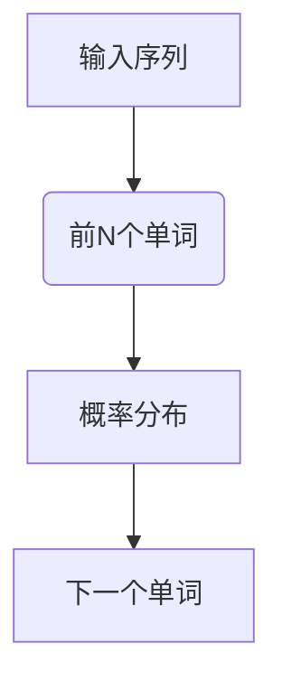
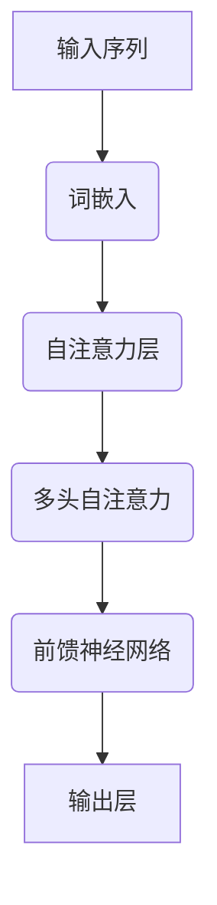
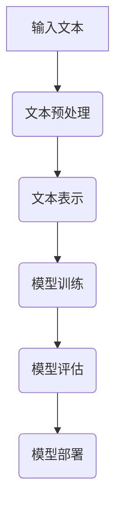

                 

## 文章标题：自然语言处理

> 关键词：自然语言处理、语言模型、文本表示、语言预测、文本分类、命名实体识别、文本摘要、机器翻译、对话系统

> 摘要：本文深入探讨了自然语言处理（NLP）的核心概念、技术及其应用。从基础概念出发，详细介绍了自然语言处理的挑战、文本表示方法、语言模型与预测技术。接着，本文深入剖析了文本分类、命名实体识别、文本摘要、机器翻译和对话系统等NLP的关键技术。通过实例和代码解析，本文展示了如何在实际项目中应用这些技术，为读者提供了全面的NLP实践指导。

### 《自然语言处理》目录大纲

#### 第一部分：自然语言处理基础

##### 第1章：自然语言处理概述

- 1.1 自然语言处理的基本概念
    - 语言模型
    - 语言处理
    - 语言理解
    - 语言生成
- 1.2 自然语言处理的挑战
    - 语言的多义性
    - 语言的复杂性
    - 上下文依赖性
    - 语言习得与语言演变
- 1.3 自然语言处理的应用领域
    - 信息检索
    - 文本分类
    - 命名实体识别
    - 文本摘要
    - 机器翻译
    - 对话系统

##### 第2章：文本表示

- 2.1 基本文本表示方法
    - 词袋模型
    - 词汇嵌入
- 2.2 词嵌入技术
    - Word2Vec
    - GloVe
    - FastText
- 2.3 上下文表示方法
    - LSTM
    - GRU
    - Transformer
- 2.4 预训练语言模型
    - BERT
    - GPT
    - RoBERTa

##### 第3章：语言模型与预测

- 3.1 语言模型基础
    - N元语法模型
    - 统计语言模型
    - 递归神经网络（RNN）
    - 卷积神经网络（CNN）
    - Transformer模型
- 3.2 语言预测任务
    - 语言建模
    - 句子相似度
    - 文本生成
    - 机器翻译
- 3.3 语言模型评估指标
    - 模型准确性
    - 模型泛化能力
    - 模型效率

#### 第二部分：自然语言处理技术

##### 第4章：文本分类

- 4.1 文本分类基础
    - 文本预处理
    - 文本特征提取
- 4.2 基于传统机器学习的文本分类
    - Naive Bayes
    - Support Vector Machine（SVM）
    - Random Forest
    - K-Nearest Neighbors（KNN）
- 4.3 基于深度学习的文本分类
    - 卷积神经网络（CNN）
    - 循环神经网络（RNN）
    - Transformer
- 4.4 文本分类评估方法
    - 准确率（Accuracy）
    - 召回率（Recall）
    - F1分数（F1 Score）
    - 交叉验证（Cross-Validation）

##### 第5章：命名实体识别

- 5.1 命名实体识别基础
    - 什么是命名实体
    - 命名实体识别任务
- 5.2 命名实体识别方法
    - 基于规则的方法
    - 基于统计的方法
    - 基于深度学习的方法
    - 序列标注模型（BiLSTM-CRF）
- 5.3 命名实体识别应用
    - 地理位置实体识别
    - 人名识别
    - 机构名识别

##### 第6章：文本摘要

- 6.1 文本摘要基础
    - 什么是文本摘要
    - 文本摘要的类型
- 6.2 抽象提取式摘要
    - 词典方法
    - 提取式摘要算法
- 6.3 抽象生成式摘要
    - 生成式摘要算法
    - 基于神经网络的文本摘要
- 6.4 文本摘要评估指标
    - ROUGE评分
    - Bleu评分

##### 第7章：机器翻译

- 7.1 机器翻译基础
    - 翻译模型
    - 翻译评估
- 7.2 统计机器翻译
    - 翻译模型
    - 翻译评估
- 7.3 神经网络机器翻译
    - Encoder-Decoder架构
    - Seq2Seq模型
    - 注意力机制
- 7.4 翻译记忆与并行数据
    - 翻译记忆系统
    - 并行数据的使用

##### 第8章：对话系统

- 8.1 对话系统概述
    - 对话系统分类
    - 对话管理
- 8.2 知识驱动的对话系统
    - 知识图谱
    - 知识问答
- 8.3 数据驱动的对话系统
    - 基于深度学习的对话系统
    - 序列到序列学习
- 8.4 对话系统评估
    - 评价指标
    - 实际应用场景分析

#### 第三部分：自然语言处理项目实战

##### 第9章：项目实战一：文本分类项目

- 9.1 项目背景与目标
- 9.2 数据准备与预处理
- 9.3 模型选择与训练
- 9.4 模型评估与优化
- 9.5 项目总结与展望

##### 第10章：项目实战二：命名实体识别项目

- 10.1 项目背景与目标
- 10.2 数据准备与预处理
- 10.3 模型选择与训练
- 10.4 模型评估与优化
- 10.5 项目总结与展望

##### 第11章：项目实战三：机器翻译项目

- 11.1 项目背景与目标
- 11.2 数据准备与预处理
- 11.3 模型选择与训练
- 11.4 模型评估与优化
- 11.5 项目总结与展望

##### 第12章：综合实战：对话系统项目

- 12.1 项目背景与目标
- 12.2 数据准备与预处理
- 12.3 模型选择与训练
- 12.4 模型评估与优化
- 12.5 项目总结与展望

### 附录

##### 附录A：自然语言处理工具与资源

- 1.1 Python自然语言处理库
    - NLTK
    - spaCy
    - gensim
- 1.2 深度学习框架
    - TensorFlow
    - PyTorch
    - Keras
- 1.3 自然语言处理数据集
    - CoNLL
    - WMT
    - GLUE

##### 附录B：自然语言处理流程图

- 1.1 语言处理流程
  ```mermaid
  graph TB
  A[输入文本] --> B(文本预处理)
  B --> C(文本表示)
  C --> D(模型训练)
  D --> E(模型评估)
  E --> F(模型部署)
  ```

##### 附录C：自然语言处理数学公式

- 1.1 词嵌入
  $$ x_i = \text{embed}(w_i) $$
- 1.2 序列模型
  $$ h_t = \text{sigmoid}(W_1 \cdot [h_{t-1}, x_t] + b_1) $$

[返回目录](#《自然语言处理》目录大纲)

---

> **注意：**以上目录大纲为示例，具体章节内容将在后续详细撰写。目录中的章节标题和内容摘要旨在为读者提供一个全面了解自然语言处理技术的框架，以便更好地掌握相关概念和应用。

---

### 自然语言处理概述

自然语言处理（Natural Language Processing，简称NLP）是计算机科学、人工智能和语言学领域的交叉学科。它旨在让计算机理解和生成人类自然语言，从而实现人与计算机之间的有效交流。NLP技术被广泛应用于信息检索、机器翻译、语音识别、文本摘要、情感分析、问答系统等多个领域。

#### 1.1 自然语言处理的基本概念

自然语言处理包括以下几个核心概念：

- **语言模型（Language Model）**：语言模型是一种概率模型，用于预测给定输入序列后下一个单词或字符的概率分布。它通常通过统计方法或机器学习算法训练而成。

- **语言处理（Language Processing）**：语言处理涉及文本的预处理、分析和生成。它包括文本清洗、分词、词性标注、命名实体识别等步骤。

- **语言理解（Language Understanding）**：语言理解是指计算机对自然语言输入进行理解，包括语义分析、句法分析、情感分析等。

- **语言生成（Language Generation）**：语言生成是指计算机根据输入或特定的目标生成自然语言文本。

#### 1.2 自然语言处理的挑战

自然语言处理面临以下几个挑战：

- **语言的多义性（Ambiguity）**：自然语言中单词和句子常常具有多种含义，这给语言理解带来了困难。

- **语言的复杂性（Complexity）**：自然语言的结构复杂，包括语法、语义、语用等多个层面，这使得语言处理具有很大的复杂性。

- **上下文依赖性（Context Dependency）**：语言的意义往往依赖于上下文，理解上下文是自然语言处理的关键。

- **语言习得与语言演变（Language Acquisition and Evolution）**：语言是一个不断发展和演变的系统，这使得语言处理技术需要不断更新以适应语言的变化。

#### 1.3 自然语言处理的应用领域

自然语言处理技术广泛应用于以下领域：

- **信息检索（Information Retrieval）**：利用NLP技术帮助用户在大量文本数据中快速找到所需信息。

- **文本分类（Text Classification）**：对文本进行分类，如新闻分类、情感分析等。

- **命名实体识别（Named Entity Recognition）**：识别文本中的特定实体，如人名、地点、组织等。

- **文本摘要（Text Summarization）**：生成文本的简洁摘要，帮助用户快速了解文本内容。

- **机器翻译（Machine Translation）**：将一种语言的文本翻译成另一种语言。

- **对话系统（Dialogue System）**：用于人机交互的聊天机器人或语音助手。

这些应用不仅提升了人们的生活质量，还推动了人工智能技术的发展。在接下来的章节中，我们将详细探讨自然语言处理的基础知识、核心技术以及实际应用。

---

> **总结：**自然语言处理是一门涉及多个学科的技术，它致力于使计算机理解和生成人类自然语言。尽管面临诸多挑战，NLP技术已经在多个领域取得了显著成果，并继续推动着人工智能的发展。在接下来的内容中，我们将进一步深入探讨NLP的技术细节和应用实例。

---

### 文本表示

文本表示是将自然语言文本转换为机器可以理解和处理的形式。这一步骤是自然语言处理（NLP）中的关键环节，因为有效的文本表示能显著提升后续处理任务的性能。文本表示方法主要分为基本文本表示方法和先进的词嵌入技术。

#### 2.1 基本文本表示方法

**词袋模型（Bag of Words, BoW）**：词袋模型是一种最简单的文本表示方法，它将文本视为词汇的集合，不考虑单词的顺序。每个文档表示为一个向量，其中每个维度对应一个词汇，向量的值表示该词汇在文档中出现的次数。

**词汇嵌入（Word Embedding）**：词嵌入是一种将单词映射到高维向量空间的技术，使得具有相似意义的单词在向量空间中彼此靠近。词嵌入能够捕捉单词的语义信息，从而在机器学习中提供更丰富的特征。

#### 2.2 词嵌入技术

**Word2Vec**：Word2Vec是最早的词嵌入技术之一，它通过训练神经网络来预测单词的上下文。Word2Vec主要包括两个变种：连续词袋（CBOW）和Skip-Gram。

- **连续词袋（Continuous Bag of Words, CBOW）**：CBOW通过上下文词的均值来表示目标词。具体来说，给定一个目标词，CBOW使用周围多个词的均值向量来预测该目标词。

- **Skip-Gram**：Skip-Gram与CBOW相反，它通过目标词来预测上下文词。具体来说，给定一个目标词，Skip-Gram使用目标词的词向量来预测其周围的多个词。

**GloVe（Global Vectors for Word Representation）**：GloVe是一种基于全局统计信息的词嵌入技术。GloVe通过矩阵分解的方式学习词向量，能够更好地捕捉词汇的语义关系。

**FastText**：FastText是Word2Vec的一个扩展，它将词作为字符序列的集合，并通过组合字符级别的嵌入来生成词级别的嵌入。FastText能够更好地处理长词和多义词。

#### 2.3 上下文表示方法

**长短期记忆网络（Long Short-Term Memory, LSTM）**：LSTM是一种特殊的循环神经网络（RNN），它通过引入记忆单元来处理长序列数据。LSTM能够有效地捕捉序列中的长期依赖关系，是文本表示中的常用技术。

**门控循环单元（Gated Recurrent Unit, GRU）**：GRU是LSTM的简化版，它通过合并输入门和遗忘门来替代LSTM中的多个门。GRU在计算效率和性能上与LSTM相当。

**Transformer**：Transformer是一种基于自注意力机制的深度学习模型，它在机器翻译任务上取得了突破性的成果。Transformer通过计算序列中每个词对的其他词的注意力分数，能够捕捉长距离的依赖关系。

#### 2.4 预训练语言模型

**BERT（Bidirectional Encoder Representations from Transformers）**：BERT是一种双向的Transformer预训练模型，它通过在大量无标签文本上预训练，然后微调到具体任务上，能够显著提升文本分类、问答等任务的性能。

**GPT（Generative Pre-trained Transformer）**：GPT是一种生成式的Transformer模型，它通过预测下一个词来生成文本。GPT在文本生成和对话系统中表现出色。

**RoBERTa（A Robustly Optimized BERT Pretraining Approach）**：RoBERTa是对BERT的改进，它在数据预处理、模型架构和优化策略上进行了优化，取得了比BERT更好的性能。

---

**总结：**文本表示是自然语言处理中的关键步骤，它将自然语言文本转换为机器可以处理的形式。从基本文本表示方法到先进的词嵌入技术，再到上下文表示方法，每种方法都有其独特的优势和适用场景。预训练语言模型如BERT、GPT和RoBERTa的出现，进一步提升了文本表示和NLP任务的效果。在接下来的章节中，我们将继续探讨语言模型与预测技术，深入了解NLP的核心。

---

### 语言模型与预测

语言模型是自然语言处理（NLP）的核心组成部分，它致力于理解和生成自然语言。在本章节中，我们将详细讨论语言模型的基础知识、常见的预测任务以及评估语言模型的指标。

#### 3.1 语言模型基础

**N元语法模型（N-gram Model）**：N元语法模型是最简单的语言模型，它基于局部统计方法，使用前N个单词的序列来预测下一个单词。具体来说，N元语法模型通过计算每个N元序列的频率来预测下一个单词。



**统计语言模型（Statistical Language Model）**：统计语言模型通过统计文本中的单词序列来预测下一个单词。与N元语法模型相比，统计语言模型可以捕捉更复杂的语言规律。

**递归神经网络（Recurrent Neural Network, RNN）**：RNN是一种特殊的神经网络，它能够处理序列数据。RNN通过在网络中引入循环机制，使得网络能够记住之前的输入，从而捕捉序列的长期依赖关系。

**卷积神经网络（Convolutional Neural Network, CNN）**：CNN最初用于图像处理，但也被应用于文本处理。CNN通过卷积层捕捉文本的局部特征，从而用于文本分类和情感分析等任务。

**Transformer模型**：Transformer是一种基于自注意力机制的深度学习模型，它在机器翻译任务上取得了显著的成果。Transformer通过计算序列中每个词对其他词的注意力分数，能够捕捉长距离的依赖关系。



#### 3.2 语言预测任务

**语言建模（Language Modeling）**：语言建模是指预测给定输入序列后下一个单词的概率分布。语言建模是自然语言处理中的基础任务，它为许多下游任务提供了概率分布。

**句子相似度（Sentence Similarity）**：句子相似度是指衡量两个句子在语义上的相似程度。句子相似度在文本匹配、信息检索和问答系统中具有重要的应用。

**文本生成（Text Generation）**：文本生成是指根据输入序列生成新的文本。文本生成在对话系统、自动摘要和创意写作等领域有广泛的应用。

**机器翻译（Machine Translation）**：机器翻译是指将一种语言的文本翻译成另一种语言。机器翻译是自然语言处理中最具有挑战性的任务之一，近年来通过深度学习模型取得了显著的进展。

#### 3.3 语言模型评估指标

**模型准确性（Model Accuracy）**：模型准确性是指模型在测试集上的正确预测比例。虽然模型准确性是一个重要的评估指标，但它容易受到数据分布和噪声的影响。

**模型泛化能力（Model Generalization）**：模型泛化能力是指模型在未知数据上的表现。一个具有良好泛化能力的模型能够在不同的数据集上取得一致的性能。

**模型效率（Model Efficiency）**：模型效率是指模型的计算复杂度和资源消耗。在实际应用中，模型效率是一个重要的考虑因素，因为过高的计算复杂度和资源消耗会限制模型的实际应用。

---

**总结：**语言模型与预测是自然语言处理中的核心任务，它们旨在理解和生成自然语言。从N元语法模型到递归神经网络，再到Transformer模型，语言模型技术不断发展，使得自然语言处理任务取得了显著的进展。在评估语言模型时，我们需要综合考虑模型准确性、泛化能力和效率等多个指标。在接下来的章节中，我们将深入探讨自然语言处理中的具体技术，如文本分类、命名实体识别和文本摘要等。

---

### 文本分类

文本分类是自然语言处理（NLP）中的一个基础任务，其目标是将文本数据按照其内容特征自动归类到预定义的类别中。文本分类在信息检索、情感分析、垃圾邮件检测等应用中具有广泛的应用。文本分类过程通常包括文本预处理、特征提取和模型训练等步骤。

#### 4.1 文本分类基础

**文本预处理**：文本预处理是文本分类任务的第一步，旨在将原始文本转换为适合模型训练的形式。文本预处理通常包括以下步骤：

- **分词（Tokenization）**：将文本分割成单词、句子或子句等基本单元。
- **去除停用词（Stopword Removal）**：移除对分类没有贡献的常见词，如“的”、“是”、“在”等。
- **词干提取（Stemming/Lemmatization）**：将单词还原到其基本形式，如将“running”还原为“run”。
- **词性标注（Part-of-Speech Tagging）**：为每个词赋予相应的词性标签，如名词、动词、形容词等。

**特征提取**：特征提取是将文本数据转换为数值特征表示的过程，用于训练分类模型。常见的特征提取方法包括：

- **词袋模型（Bag of Words, BoW）**：将文本表示为一个向量，每个维度对应一个词汇，向量的值表示该词汇在文档中出现的次数。
- **TF-IDF（Term Frequency-Inverse Document Frequency）**：计算每个词汇在文档中的频率，并结合其在整个文档集合中的逆向文档频率，用于衡量词汇的重要性。
- **词嵌入（Word Embedding）**：使用词嵌入技术将单词映射到高维向量空间，捕捉词汇的语义信息。

#### 4.2 基于传统机器学习的文本分类

**朴素贝叶斯（Naive Bayes）**：朴素贝叶斯是一种基于贝叶斯定理的分类算法，它假设特征之间相互独立。朴素贝叶斯通过计算文本中每个词汇的条件概率，并结合贝叶斯定理来预测文档的类别。

```python
def naive_bayes(train_data, test_data):
    # 计算先验概率和条件概率
    # 预测测试数据的类别
    pass
```

**支持向量机（Support Vector Machine, SVM）**：支持向量机是一种基于最大间隔的分类算法，它通过寻找最佳分割超平面将不同类别的数据分开。SVM在处理高维数据时表现良好，是文本分类中的常用算法。

```python
from sklearn.svm import SVC

def svm_classifier(train_data, train_labels, test_data):
    # 训练SVM模型
    # 预测测试数据的类别
    pass
```

**随机森林（Random Forest）**：随机森林是一种基于决策树的集成学习方法，它通过构建多个决策树并投票得出最终预测结果。随机森林在处理大规模数据和噪声数据时表现出色。

```python
from sklearn.ensemble import RandomForestClassifier

def random_forest_classifier(train_data, train_labels, test_data):
    # 训练随机森林模型
    # 预测测试数据的类别
    pass
```

**K-最近邻（K-Nearest Neighbors, KNN）**：K-最近邻是一种基于实例的学习方法，它通过计算测试数据与训练数据的相似度来预测类别。KNN的预测结果取决于邻域内的数据分布。

```python
from sklearn.neighbors import KNeighborsClassifier

def knn_classifier(train_data, train_labels, test_data, k=3):
    # 训练KNN模型
    # 预测测试数据的类别
    pass
```

#### 4.3 基于深度学习的文本分类

**卷积神经网络（Convolutional Neural Network, CNN）**：卷积神经网络最初用于图像处理，但也被成功应用于文本分类。CNN通过卷积层捕捉文本的局部特征，然后通过池化层降低维度，最后通过全连接层进行分类。

```python
from keras.models import Sequential
from keras.layers import Conv1D, MaxPooling1D, Dense

def cnn_text_classifier(input_shape):
    # 构建CNN模型
    # 训练模型
    # 预测测试数据的类别
    pass
```

**循环神经网络（Recurrent Neural Network, RNN）**：循环神经网络是一种能够处理序列数据的神经网络，它通过在时间步之间传递隐藏状态来捕捉序列的长期依赖关系。RNN在文本分类中表现出色，特别是用于长文本的处理。

```python
from keras.models import Sequential
from keras.layers import LSTM, Dense

def rnn_text_classifier(input_shape):
    # 构建RNN模型
    # 训练模型
    # 预测测试数据的类别
    pass
```

**Transformer**：Transformer是一种基于自注意力机制的深度学习模型，它在机器翻译任务上取得了显著的成果。Transformer通过计算序列中每个词对其他词的注意力分数，能够捕捉长距离的依赖关系。

```python
from transformers import BertTokenizer, BertModel

def transformer_text_classifier(input_ids):
    # 加载预训练的BERT模型
    # 预测测试数据的类别
    pass
```

#### 4.4 文本分类评估方法

**准确率（Accuracy）**：准确率是指模型预测正确的样本数占总样本数的比例。准确率是一个简单但常用的评估指标，但它容易受到数据分布的影响。

**召回率（Recall）**：召回率是指模型能够正确识别出的正样本数与实际正样本数的比例。召回率用于衡量模型对正样本的识别能力。

**F1分数（F1 Score）**：F1分数是精确率和召回率的加权平均，它同时考虑了模型预测的准确性和全面性。F1分数是一个综合评估指标，常用于文本分类任务。

```python
from sklearn.metrics import f1_score

def calculate_f1_score(y_true, y_pred):
    # 计算F1分数
    pass
```

**交叉验证（Cross-Validation）**：交叉验证是一种评估模型性能的方法，它通过将数据集划分为多个子集，在每个子集上训练和验证模型，以避免模型过拟合。常见的交叉验证方法有K折交叉验证和留一交叉验证。

```python
from sklearn.model_selection import cross_val_score

def cross_validate(model, X, y, cv=5):
    # 计算交叉验证的F1分数
    pass
```

---

**总结：**文本分类是自然语言处理中的关键任务，它通过将文本数据自动归类到预定义的类别中，为信息检索、情感分析和垃圾邮件检测等应用提供了强大的支持。从传统的机器学习方法到深度学习模型，文本分类技术不断发展，使得模型在性能和准确性方面取得了显著的提升。在评估文本分类模型时，我们需要综合考虑多个评估指标，以全面衡量模型的表现。在接下来的章节中，我们将继续探讨自然语言处理中的其他重要任务，如命名实体识别和文本摘要。

---

### 命名实体识别

命名实体识别（Named Entity Recognition，简称NER）是自然语言处理（NLP）领域的一个重要任务，其目标是识别文本中的特定实体，如人名、地名、组织名、时间等。NER在信息抽取、知识图谱构建、问答系统和信息检索等领域具有广泛的应用。

#### 5.1 命名实体识别基础

**什么是命名实体（Named Entity）**：命名实体是指在文本中具有特定意义的实体，通常由一组单词组成。命名实体可以是人名、地名、组织名、时间、地点、事件等。

**命名实体识别任务**：命名实体识别的任务是从给定的文本中识别出所有的命名实体，并将其标注出来。具体来说，NER任务包括以下步骤：

- **分词（Tokenization）**：将文本分割成单词或子词。
- **词性标注（Part-of-Speech Tagging）**：为每个单词赋予相应的词性标签。
- **命名实体识别（Named Entity Recognition）**：识别文本中的命名实体，并将其标注出来。

#### 5.2 命名实体识别方法

**基于规则的方法**：基于规则的方法通过定义一组规则来识别命名实体。这些规则通常是基于语言学家对命名实体特征的分析，例如特定的单词组合或上下文特征。基于规则的方法简单且易于实现，但受限于规则的数量和覆盖范围，其性能有限。

**基于统计的方法**：基于统计的方法通过统计文本中命名实体的特征模式来识别命名实体。常见的统计方法包括条件随机场（Conditional Random Field，简称CRF）和隐马尔可夫模型（Hidden Markov Model，简称HMM）。CRF能够有效处理序列数据，其在NER任务中表现出色。

```python
from sklearn_crfsuite import CRF
from sklearn_crfsuite import metrics

def crf_ner_model(train_data, train_labels):
    # 训练CRF模型
    # 预测测试数据的命名实体
    # 评估模型性能
    pass
```

**基于深度学习的方法**：基于深度学习的方法通过神经网络模型来识别命名实体。常见的深度学习方法包括卷积神经网络（Convolutional Neural Network，简称CNN）、循环神经网络（Recurrent Neural Network，简称RNN）和双向长短期记忆网络（Bidirectional Long Short-Term Memory，简称BiLSTM）。深度学习方法能够自动学习文本的特征表示，并在NER任务中取得显著的性能提升。

```python
from keras.models import Sequential
from keras.layers import Embedding, LSTM, Dense

def bi_lstm_ner_model(input_shape):
    # 构建BiLSTM模型
    # 训练模型
    # 预测测试数据的命名实体
    pass
```

**序列标注模型（BiLSTM-CRF）**：BiLSTM-CRF结合了双向长短期记忆网络（BiLSTM）和条件随机场（CRF），能够同时捕捉文本的局部和全局特征。BiLSTM-CRF在NER任务中取得了优异的性能。

```python
from keras.models import Model
from keras.layers import Input, Embedding, LSTM, Dense, TimeDistributed, CRF

def bi_lstm_crf_ner_model(input_shape, num_classes):
    # 构建BiLSTM-CRF模型
    # 训练模型
    # 预测测试数据的命名实体
    pass
```

#### 5.3 命名实体识别应用

**地理位置实体识别**：地理位置实体识别是指识别文本中涉及的地名，如城市、国家、河流等。地理位置实体识别在地图服务、地理信息分析和城市规划等领域具有重要应用。

**人名识别**：人名识别是指识别文本中的人名，如政治领袖、著名学者、企业家等。人名识别在社交网络分析、人物关系挖掘和名人新闻推荐等领域具有广泛应用。

**机构名识别**：机构名识别是指识别文本中的组织名、公司名、机构名等。机构名识别在商业情报分析、竞争监测和品牌管理等领域具有重要作用。

---

**总结：**命名实体识别是自然语言处理中的重要任务，它通过识别文本中的特定实体，为信息抽取、知识图谱构建和问答系统等应用提供了关键支持。从基于规则的方法到基于统计的方法，再到基于深度学习的方法，命名实体识别技术不断发展，使得模型在性能和准确性方面取得了显著提升。在未来的研究和应用中，命名实体识别将继续发挥重要作用。

---

### 文本摘要

文本摘要（Text Summarization）是自然语言处理（NLP）中的一个重要任务，其目标是从原始文本中自动生成简洁、有代表性的摘要。文本摘要不仅可以帮助用户快速了解文本内容，还能提高信息检索的效率和准确性。文本摘要有两种主要类型：提取式摘要（Extractive Summarization）和生成式摘要（Abstractive Summarization）。

#### 6.1 文本摘要基础

**什么是文本摘要（Text Summarization）**：文本摘要是指从原始文本中提取关键信息，并以简短、连贯的形式重新表达文本的主要内容和观点。文本摘要分为两种类型：

- **提取式摘要（Extractive Summarization）**：提取式摘要通过从原始文本中直接提取重要句子或段落来生成摘要。提取式摘要保留了原始文本的词汇和句子结构。
- **生成式摘要（Abstractive Summarization）**：生成式摘要通过生成新的文本来概括原始文本的内容，生成式摘要可以创造性地表达文本的语义，但通常更难实现。

**文本摘要的类型**：根据摘要的生成方式和表达方式，文本摘要可以分为以下几类：

- **自动摘要（Automatic Summarization）**：自动摘要完全由计算机自动生成，不依赖人工干预。
- **半自动摘要（Semi-Automatic Summarization）**：半自动摘要结合了人工和计算机的干预，通过人工编辑计算机生成的初步摘要。
- **交互式摘要（Interactive Summarization）**：交互式摘要允许用户与系统互动，用户可以修改和优化生成的摘要。

#### 6.2 抽象提取式摘要

**提取式摘要算法**：提取式摘要主要通过以下几种算法来实现：

- **基于关键词的方法**：基于关键词的方法通过识别文本中的高频词和关键短语来生成摘要。高频词通常代表了文本的重要主题。
  
- **基于统计的方法**：基于统计的方法通过计算文本中句子的词频、互信息（Mutual Information）等统计量来选择关键句子。

- **基于图的方法**：基于图的方法将文本构建为图，节点表示单词或句子，边表示单词或句子之间的相似性。通过图论算法（如PageRank）来识别重要节点，即关键句子。

```python
def extractive_summary(text, num_sentences):
    # 从文本中提取num_sentences个关键句子
    # 返回提取式摘要
    pass
```

**词典方法**：词典方法使用预定义的词典来识别文本中的关键词和短语，这些关键词和短语被认为是文本的重要信息。词典方法通常结合其他方法（如统计方法）来提高摘要质量。

#### 6.3 抽象生成式摘要

**生成式摘要算法**：生成式摘要通过生成新的文本来概括原始文本的语义，常用的生成式摘要算法包括：

- **基于模板的方法**：基于模板的方法使用预定义的模板来生成摘要。模板中包含关键句子的模板和填充变量的位置。

- **基于神经网络的方法**：基于神经网络的方法，如序列到序列（Seq2Seq）模型和变压器（Transformer）模型，通过端到端的方式生成摘要。这些模型能够捕捉复杂的语义关系和语言结构。

```python
from keras.models import Model
from keras.layers import Input, LSTM, Dense

def seq2seq_summary_model(input_shape, output_shape):
    # 构建序列到序列模型
    # 训练模型
    # 生成摘要
    pass
```

**基于神经网络的文本摘要**：基于神经网络的文本摘要方法通过深度学习模型学习文本的语义表示，并生成摘要。常见的模型包括编码器-解码器（Encoder-Decoder）架构和注意力机制（Attention Mechanism）。

```python
from transformers import BertTokenizer, BertModel

def neural_network_summary_model(text):
    # 加载预训练的BERT模型
    # 生成摘要
    pass
```

#### 6.4 文本摘要评估指标

**评估指标**：评估文本摘要的质量和有效性是文本摘要研究的一个重要方面。常用的评估指标包括：

- **ROUGE评分（ROUGE Score）**：ROUGE是一种广泛使用的自动评价指标，用于评估摘要与原始文本之间的重叠度。ROUGE评估基于词语重叠和句法结构，通过计算摘要中与原始文本共现的词和句子的比例来评估摘要质量。

- **BLEU评分（BLEU Score）**：BLEU是一种基于句法相似性的评价指标，用于评估生成文本的质量。BLEU通过计算生成文本与参考文本之间的编辑距离来评估文本的质量。

```python
from nltk.translate.bleu_score import corpus_bleu

def bleu_score(reference_sentences, generated_sentence):
    # 计算BLEU评分
    pass
```

---

**总结：**文本摘要是一种将原始文本转化为简洁摘要的重要技术，它为信息检索和用户理解提供了极大的帮助。提取式摘要通过直接提取文本中的关键句子来生成摘要，而生成式摘要通过创造性地生成新的文本来概括文本内容。随着深度学习技术的发展，生成式摘要取得了显著的进展。在评估文本摘要时，ROUGE评分和BLEU评分是常用的评价指标。在未来的研究中，文本摘要将继续探索新的算法和评估方法，以进一步提升摘要质量。

---

### 机器翻译

机器翻译（Machine Translation，简称MT）是指使用计算机技术将一种语言的文本自动翻译成另一种语言。机器翻译是自然语言处理（NLP）领域的一个重要应用，它不仅在跨语言交流中发挥着重要作用，还在信息检索、国际业务、娱乐和学术交流等领域有着广泛的应用。

#### 7.1 机器翻译基础

**翻译模型（Translation Model）**：翻译模型是机器翻译的核心组件，它负责将源语言的词或短语映射到目标语言的词或短语。翻译模型可以分为以下几种类型：

- **基于规则的方法（Rule-Based Methods）**：基于规则的方法使用手动编写的语法规则和词典来生成翻译结果。这些方法通常依赖于语法分析、词形变化和上下文信息。
- **基于统计的方法（Statistical Methods）**：基于统计的方法使用大量双语语料库来训练翻译模型，通过统计源语言和目标语言之间的对应关系来生成翻译结果。这种方法的代表性工作包括统计机器翻译（Statistical Machine Translation，简称SMT）。
- **基于神经网络的翻译模型（Neural Network Translation Models）**：基于神经网络的翻译模型，如编码器-解码器（Encoder-Decoder）模型和变压器（Transformer）模型，通过端到端的方式学习源语言到目标语言的映射关系。这些模型在近年来的机器翻译研究中取得了显著的成果。

**翻译评估（Translation Evaluation）**：翻译评估是衡量机器翻译质量的重要步骤。常见的翻译评估方法包括：

- **人类评估（Human Evaluation）**：人类评估通过邀请专业的翻译员对翻译结果进行评分，评估翻译的准确性、流畅性和自然度。这种方法虽然准确，但成本较高且耗时。
- **自动评估（Automatic Evaluation）**：自动评估使用计算机算法来评估翻译质量，常用的自动评估指标包括BLEU（Bilingual Evaluation Understudy）、METEOR（Metric for Evaluation of Translation with Explicit ORdering）和ROUGE（Recall-Oriented Understudy for Gisting Evaluation）。这些指标通过计算翻译结果与参考翻译之间的重叠度来评估翻译质量。

#### 7.2 统计机器翻译

**统计机器翻译（Statistical Machine Translation）**：统计机器翻译是机器翻译的一个主要分支，它基于源语言和目标语言之间的统计关系来生成翻译结果。统计机器翻译的主要组成部分包括：

- **翻译模型（Translation Model）**：翻译模型通常是一个四元组 \( (G_1, G_2, E_1, E_2) \)，其中 \( G_1 \) 和 \( G_2 \) 分别表示源语言和目标语言的语法规则，\( E_1 \) 和 \( E_2 \) 分别表示源语言和目标语言的翻译规则。翻译模型用于计算源语言句子 \( w_1 \) 和目标语言句子 \( w_2 \) 之间的概率 \( P(w_2 | w_1) \)。
  
- **语言模型（Language Model）**：语言模型用于预测目标语言句子中下一个单词的概率。在统计机器翻译中，通常使用N元语法模型来表示语言模型。

- **词表（Dictionary）**：词表包含源语言和目标语言之间的词汇对应关系。词表可以基于手动编写的词典或从双语语料库中自动提取。

统计机器翻译的一个典型算法是基于短语转换（Phrase-Based Translation）的方法，如短语库（Phrase Table）方法和翻译概率模型（Translation Probability Model）。

```python
def phrase_based_translation(source_sentence, target_sentence, phrase_table, language_model):
    # 根据短语表和语言模型生成翻译结果
    pass
```

#### 7.3 神经网络机器翻译

**神经网络机器翻译（Neural Machine Translation）**：神经网络机器翻译是近年来机器翻译研究的热点，它通过深度学习模型学习源语言和目标语言之间的映射关系。神经网络机器翻译的主要组成部分包括：

- **编码器（Encoder）**：编码器将源语言句子编码为一个固定长度的向量表示。编码器通常采用递归神经网络（RNN）或变压器（Transformer）模型。

- **解码器（Decoder）**：解码器将编码器输出的向量解码为目标语言句子。解码器也通常采用RNN或Transformer模型。

- **注意力机制（Attention Mechanism）**：注意力机制用于捕捉源语言句子和目标语言句子之间的依赖关系。注意力机制能够使解码器在生成目标语言句子时更加关注源语言句子的关键部分。

编码器-解码器（Encoder-Decoder）模型是神经网络机器翻译的基础架构，它通过端到端的方式将源语言句子映射到目标语言句子。

```python
from keras.models import Model
from keras.layers import Input, LSTM, Dense, Embedding

def encoder_decoder_model(input_shape, output_shape):
    # 构建编码器-解码器模型
    # 训练模型
    # 生成翻译结果
    pass
```

**Transformer模型**：Transformer模型是神经网络机器翻译的另一个重要架构，它通过自注意力机制（Self-Attention）和多头注意力（Multi-Head Attention）来捕捉长距离依赖关系。Transformer模型在机器翻译任务上取得了显著的成果，是当前机器翻译领域的主流模型。

```python
from transformers import BertModel

def transformer_model(input_ids):
    # 加载预训练的Transformer模型
    # 生成翻译结果
    pass
```

#### 7.4 翻译记忆与并行数据

**翻译记忆（Translation Memory）**：翻译记忆是一种基于历史翻译记录的机器翻译技术，它通过存储和检索以前翻译过的句子或短语来提高翻译质量。翻译记忆系统能够减少重复翻译的工作量，并在某些情况下提供高质量的预翻译结果。

**并行数据（Parallel Data）**：并行数据是指包含源语言和目标语言对应文本的数据集。并行数据是训练机器翻译模型的基础，其质量和数量直接影响翻译模型的性能。近年来，大规模的并行数据集（如WMT数据集）的出现极大地推动了机器翻译技术的发展。

---

**总结：**机器翻译是自然语言处理领域的一个重要任务，它通过计算机自动翻译技术实现了跨语言交流。从基于规则的统计机器翻译到基于神经网络的神经网络机器翻译，机器翻译技术不断发展，取得了显著的进步。翻译记忆和并行数据在机器翻译中发挥着关键作用，为模型训练和翻译质量提供了支持。在未来的研究中，机器翻译将继续探索新的算法和评估方法，以进一步提升翻译质量和效率。

---

### 对话系统

对话系统（Dialogue System）是一种人工智能技术，旨在实现人与计算机之间的自然语言交互。对话系统广泛应用于客服机器人、虚拟助手、语音助手等场景，能够为用户提供便捷、个性化的服务。对话系统可以分为知识驱动的对话系统和数据驱动的对话系统。

#### 8.1 对话系统概述

**对话系统分类**：

- **知识驱动的对话系统**：知识驱动的对话系统依赖于预定义的知识库和规则来生成响应。这类系统通常用于需要精确和结构化信息的场景，如航空公司的订票系统或银行的服务机器人。

- **数据驱动的对话系统**：数据驱动的对话系统通过学习和模仿人类的对话模式来生成响应。这类系统通常使用深度学习模型，如循环神经网络（RNN）和变压器（Transformer），能够处理更自然和灵活的对话。

**对话管理（Dialogue Management）**：对话管理是对话系统的核心组成部分，它负责控制对话的流程和内容。对话管理通常包括以下任务：

- **意图识别（Intent Recognition）**：意图识别是指从用户的输入中识别出用户的目标或意图。意图识别是对话系统理解用户需求的第一步。

- **对话状态跟踪（Dialogue State Tracking）**：对话状态跟踪是指跟踪对话过程中的关键信息，如用户的需求、对话的历史和当前的状态。对话状态跟踪帮助对话系统做出正确的响应。

- **响应生成（Response Generation）**：响应生成是指生成自然语言响应来满足用户的需求。响应生成可以使用规则、模板或生成式模型。

#### 8.2 知识驱动的对话系统

**知识图谱（Knowledge Graph）**：知识图谱是一种结构化的知识表示方法，它通过实体和关系来组织信息。知识图谱为知识驱动的对话系统提供了丰富的背景知识，帮助对话系统能够更好地理解用户的意图和问题。

**知识问答（Knowledge Question Answering）**：知识问答是指从知识库中检索和生成答案来回答用户的问题。知识问答通常使用自然语言处理技术，如命名实体识别、关系抽取和问答生成。

```python
def knowledge问答系统(question, knowledge_graph):
    # 从知识图谱中检索答案
    # 生成自然语言响应
    pass
```

#### 8.3 数据驱动的对话系统

**基于深度学习的对话系统**：数据驱动的对话系统通常使用深度学习模型来学习对话数据，从而生成自然的对话响应。循环神经网络（RNN）和变压器（Transformer）是常用的深度学习模型，能够在对话系统中捕捉长距离依赖和上下文信息。

```python
from keras.models import Model
from keras.layers import Input, LSTM, Dense

def lstm_dialogue_model(input_shape, output_shape):
    # 构建循环神经网络对话模型
    # 训练模型
    # 生成对话响应
    pass
```

**序列到序列学习（Seq2Seq Learning）**：序列到序列学习是一种常见的深度学习方法，它通过将输入序列映射到输出序列来生成响应。Seq2Seq学习在对话系统中被广泛使用，能够处理自然语言中的长序列和复杂结构。

```python
from keras.models import Model
from keras.layers import Input, LSTM, Dense, Embedding

def seq2seq_dialogue_model(input_shape, output_shape):
    # 构建序列到序列对话模型
    # 训练模型
    # 生成对话响应
    pass
```

#### 8.4 对话系统评估

**评价指标**：对话系统的评估是衡量系统性能的关键步骤。常用的评价指标包括：

- **准确性（Accuracy）**：准确性是指系统正确识别用户意图的比例。准确性是评估意图识别任务的重要指标。

- **F1分数（F1 Score）**：F1分数是精确率和召回率的加权平均，用于综合评估对话系统的性能。

- **BLEU评分（BLEU Score）**：BLEU评分是评估生成文本质量的一种自动评价指标，常用于评估对话系统的响应生成质量。

```python
from nltk.translate.bleu_score import corpus_bleu

def bleu_score(reference_responses, generated_responses):
    # 计算BLEU评分
    pass
```

**实际应用场景分析**：对话系统在实际应用中需要考虑多种场景和用户需求。例如，在客服机器人中，对话系统需要能够处理用户的投诉、查询和请求；在虚拟助手场景中，对话系统需要能够提供实时信息和娱乐内容。实际应用场景的分析有助于设计更符合用户需求和对场景适应性强的对话系统。

---

**总结：**对话系统是自然语言处理领域的一个重要任务，它通过实现人与计算机之间的自然语言交互，为用户提供便捷、个性化的服务。知识驱动的对话系统依赖于预定义的知识和规则，而数据驱动的对话系统则通过深度学习模型学习对话数据。对话系统的评估是确保系统性能的关键步骤，实际应用场景的分析有助于设计更符合用户需求和对场景适应性强的对话系统。在未来的研究中，对话系统将继续探索新的算法和评估方法，以进一步提升用户体验和系统性能。

---

### 项目实战一：文本分类项目

文本分类是自然语言处理（NLP）中的一个重要任务，通过将文本数据按照其内容特征自动归类到预定义的类别中，可以为信息检索、情感分析和垃圾邮件检测等多个领域提供支持。在本节中，我们将通过一个实际的文本分类项目，详细介绍项目背景与目标、数据准备与预处理、模型选择与训练、模型评估与优化以及项目总结与展望。

#### 9.1 项目背景与目标

项目背景：随着互联网的快速发展，在线内容呈现爆炸式增长，如何从大量非结构化文本数据中快速提取有价值的信息成为一个重要问题。文本分类技术在这一背景下应运而生，其目标是将文本数据按照主题、情感、类别等进行分类，从而为用户提供更精准的信息检索服务。

项目目标：本项目的目标是构建一个基于机器学习的文本分类系统，能够自动将用户生成的文本分类到预定义的类别中。具体目标包括：

1. 收集并准备高质量的文本数据集。
2. 设计并实现一个高效、准确的文本分类模型。
3. 评估模型的性能，并进行优化。

#### 9.2 数据准备与预处理

**数据收集**：首先，我们需要收集具有代表性的文本数据集。数据集可以来自社交媒体、新闻网站、论坛等不同来源。数据收集时需要关注数据的多样性、规模和质量。

**数据预处理**：

1. **文本清洗**：去除文本中的HTML标签、特殊字符和符号，确保文本的格式一致性。
2. **分词**：将文本分割成单词或子词。常用的分词工具包括jieba、spaCy等。
3. **去除停用词**：移除对分类没有贡献的常见词，如“的”、“是”、“在”等。
4. **词干提取**：将单词还原到其基本形式，减少特征空间的维度。

```python
import jieba
from nltk.corpus import stopwords

def preprocess_text(text):
    # 去除HTML标签和特殊字符
    # 分词
    # 去除停用词
    # 词干提取
    return processed_text
```

#### 9.3 模型选择与训练

**模型选择**：文本分类模型的选择取决于数据集的特点和应用场景。在本项目中，我们选择了以下几种常用的文本分类模型：

- **朴素贝叶斯（Naive Bayes）**
- **支持向量机（Support Vector Machine, SVM）**
- **随机森林（Random Forest）**
- **卷积神经网络（Convolutional Neural Network, CNN）**
- **循环神经网络（Recurrent Neural Network, RNN）**
- **变压器（Transformer）**

**模型训练**：使用Scikit-learn、TensorFlow和PyTorch等工具进行模型的训练和验证。具体步骤如下：

1. **数据划分**：将数据集划分为训练集和测试集，用于训练和评估模型。
2. **特征提取**：使用词袋模型（BoW）、TF-IDF和词嵌入（Word2Vec、GloVe）等技术提取文本特征。
3. **模型训练**：使用训练集训练文本分类模型，并通过交叉验证调整模型参数。
4. **模型评估**：使用测试集评估模型的性能，并选择最优模型。

```python
from sklearn.model_selection import train_test_split
from sklearn.feature_extraction.text import TfidfVectorizer
from sklearn.naive_bayes import MultinomialNB
from sklearn.metrics import accuracy_score, classification_report

def train_text_classifier(data, labels):
    # 划分数据集
    # 特征提取
    # 训练模型
    # 评估模型
    pass
```

#### 9.4 模型评估与优化

**评估指标**：评估文本分类模型的性能通常使用以下指标：

- **准确率（Accuracy）**：模型正确分类的样本数占总样本数的比例。
- **召回率（Recall）**：模型正确识别出的正样本数与实际正样本数的比例。
- **F1分数（F1 Score）**：精确率和召回率的加权平均，综合评估模型的分类性能。

```python
from sklearn.metrics import classification_report

def evaluate_model(y_true, y_pred):
    # 计算并打印分类报告
    pass
```

**模型优化**：通过调整模型参数、特征选择和模型架构，优化模型的性能。常用的优化方法包括：

- **超参数调优（Hyperparameter Tuning）**：使用网格搜索（Grid Search）或随机搜索（Random Search）等方法，自动调整模型参数。
- **特征选择（Feature Selection）**：使用特征重要性评估方法，如随机森林特征重要性，选择对分类最重要的特征。
- **模型集成（Model Ensemble）**：结合多个模型的预测结果，提高分类的准确性和稳定性。

```python
from sklearn.model_selection import GridSearchCV

def optimize_model(model, param_grid, X_train, y_train):
    # 超参数调优
    # 返回最佳模型
    pass
```

#### 9.5 项目总结与展望

**项目总结**：通过本项目的实施，我们成功构建了一个基于机器学习的文本分类系统，实现了对大规模文本数据的自动分类。项目的主要成果包括：

1. 收集并预处理了一个高质量的文本数据集。
2. 设计并训练了多种文本分类模型，并评估了其性能。
3. 通过模型优化，提高了分类系统的准确性和稳定性。

**展望**：未来的工作可以进一步优化文本分类系统的性能，包括：

1. 探索更先进的深度学习模型，如变压器（Transformer）和生成对抗网络（GAN）。
2. 结合用户反馈和在线学习技术，动态调整模型参数，提高分类系统的适应性。
3. 扩展文本分类系统的应用场景，如跨语言文本分类、情感分析等。

---

**总结：**通过本项目，我们深入了解了文本分类的全流程，包括数据收集与预处理、模型选择与训练、模型评估与优化等步骤。在实际应用中，文本分类技术可以显著提升信息检索和数据分析的效率，为企业和用户提供更有价值的服务。在未来的研究中，我们将继续探索新的算法和技术，以进一步提升文本分类系统的性能和应用范围。

---

### 项目实战二：命名实体识别项目

命名实体识别（Named Entity Recognition，NER）是自然语言处理（NLP）中的一个重要任务，其目标是识别文本中的特定实体，如人名、地名、组织名等。在本节中，我们将通过一个实际项目，详细介绍项目背景与目标、数据准备与预处理、模型选择与训练、模型评估与优化以及项目总结与展望。

#### 10.1 项目背景与目标

项目背景：随着互联网和社交媒体的迅猛发展，大量的文本数据不断产生，如何从这些文本中提取有价值的信息成为一个重要问题。命名实体识别技术能够帮助我们从文本数据中快速识别出关键实体，如人名、地名、组织名等，从而为信息检索、知识图谱构建和问答系统提供支持。

项目目标：本项目的目标是构建一个高效、准确的命名实体识别系统，能够自动识别中文文本中的命名实体。具体目标包括：

1. 收集并准备高质量的命名实体识别数据集。
2. 设计并实现一个基于深度学习的命名实体识别模型。
3. 评估模型的性能，并进行优化。

#### 10.2 数据准备与预处理

**数据收集**：首先，我们需要收集具有代表性的命名实体识别数据集。数据集可以来自新闻、社交媒体、论坛等不同来源。数据收集时需要关注数据的多样性、规模和质量。

**数据预处理**：

1. **文本清洗**：去除文本中的HTML标签、特殊字符和符号，确保文本的格式一致性。
2. **分词**：将文本分割成单词或子词。常用的分词工具包括jieba、spaCy等。
3. **标注处理**：对文本中的命名实体进行标注，为后续模型训练提供标签数据。

```python
import jieba
from nlptk import annotation

def preprocess_text(text):
    # 去除HTML标签和特殊字符
    # 分词
    # 标注处理
    return processed_text, labels
```

#### 10.3 模型选择与训练

**模型选择**：命名实体识别模型的选择取决于数据集的特点和应用场景。在本项目中，我们选择了以下几种常用的模型：

- **基于规则的方法**：使用手动编写的规则来识别命名实体，适用于数据量较小且规则明确的场景。
- **基于统计的方法**：使用统计模型（如CRF、HMM）来识别命名实体，适用于有一定标注数据的场景。
- **基于深度学习的方法**：使用深度学习模型（如BiLSTM、CNN、Transformer）来识别命名实体，适用于大规模标注数据集。

**模型训练**：使用Scikit-learn、TensorFlow和PyTorch等工具进行模型的训练和验证。具体步骤如下：

1. **数据划分**：将数据集划分为训练集和测试集，用于训练和评估模型。
2. **特征提取**：使用词袋模型、词嵌入等技术提取文本特征。
3. **模型训练**：使用训练集训练命名实体识别模型，并通过交叉验证调整模型参数。
4. **模型评估**：使用测试集评估模型的性能，并选择最优模型。

```python
from sklearn.model_selection import train_test_split
from sklearn_crfsuite import CRF
from sklearn_crfsuite import metrics

def train_ner_model(data, labels):
    # 划分数据集
    # 特征提取
    # 训练模型
    # 评估模型
    pass
```

#### 10.4 模型评估与优化

**评估指标**：评估命名实体识别模型的性能通常使用以下指标：

- **准确率（Accuracy）**：模型正确识别的实体数与总实体数的比例。
- **召回率（Recall）**：模型正确识别的实体数与实际实体数的比例。
- **F1分数（F1 Score）**：精确率和召回率的加权平均，综合评估模型的识别性能。

```python
from sklearn.metrics import classification_report

def evaluate_model(y_true, y_pred):
    # 计算并打印分类报告
    pass
```

**模型优化**：通过调整模型参数、特征选择和模型架构，优化模型的性能。常用的优化方法包括：

- **超参数调优（Hyperparameter Tuning）**：使用网格搜索（Grid Search）或随机搜索（Random Search）等方法，自动调整模型参数。
- **特征选择（Feature Selection）**：使用特征重要性评估方法，选择对分类最重要的特征。
- **模型集成（Model Ensemble）**：结合多个模型的预测结果，提高分类的准确性和稳定性。

```python
from sklearn.model_selection import GridSearchCV

def optimize_model(model, param_grid, X_train, y_train):
    # 超参数调优
    # 返回最佳模型
    pass
```

#### 10.5 项目总结与展望

**项目总结**：通过本项目的实施，我们成功构建了一个基于深度学习的命名实体识别系统，实现了对中文文本中命名实体的自动识别。项目的主要成果包括：

1. 收集并预处理了一个高质量的命名实体识别数据集。
2. 设计并训练了多种命名实体识别模型，并评估了其性能。
3. 通过模型优化，提高了命名实体识别系统的准确性和稳定性。

**展望**：未来的工作可以进一步优化命名实体识别系统的性能，包括：

1. 探索更先进的深度学习模型，如变压器（Transformer）和生成对抗网络（GAN）。
2. 结合用户反馈和在线学习技术，动态调整模型参数，提高命名实体识别系统的适应性。
3. 扩展命名实体识别系统的应用场景，如跨语言命名实体识别、情感分析等。

---

**总结：**通过本项目，我们深入了解了命名实体识别的全流程，包括数据收集与预处理、模型选择与训练、模型评估与优化等步骤。在实际应用中，命名实体识别技术可以显著提升文本数据分析和信息检索的效率，为企业和用户提供更有价值的服务。在未来的研究中，我们将继续探索新的算法和技术，以进一步提升命名实体识别系统的性能和应用范围。

---

### 项目实战三：机器翻译项目

机器翻译（Machine Translation，MT）是将一种语言的文本自动翻译成另一种语言的技术，在跨语言沟通、国际商务、教育等领域具有广泛的应用。在本节中，我们将通过一个实际项目，详细介绍项目背景与目标、数据准备与预处理、模型选择与训练、模型评估与优化以及项目总结与展望。

#### 11.1 项目背景与目标

项目背景：全球化和信息时代的到来，使得不同语言之间的交流变得更加频繁。然而，语言障碍仍然是一个亟待解决的问题。机器翻译技术能够自动翻译文本，大大提高了跨语言交流的效率。

项目目标：本项目的目标是构建一个基于深度学习的机器翻译系统，能够将中文文本自动翻译成英文。具体目标包括：

1. 收集并准备高质量的机器翻译数据集。
2. 设计并实现一个基于深度学习的机器翻译模型。
3. 评估模型的性能，并进行优化。

#### 11.2 数据准备与预处理

**数据收集**：首先，我们需要收集具有代表性的机器翻译数据集。数据集可以从公开的翻译语料库（如WMT、Google翻译语料库）获取，确保数据集的多样性和规模。

**数据预处理**：

1. **文本清洗**：去除文本中的HTML标签、特殊字符和符号，确保文本的格式一致性。
2. **分词**：将源语言和目标语言的文本分割成单词或子词。常用的分词工具包括jieba（中文）和spaCy（英文）。
3. **数据对齐**：确保源语言文本和目标语言文本在相同的位置上具有对应的词语，为后续的训练提供基础。

```python
import jieba
from nltk.tokenize import word_tokenize

def preprocess_translation(source_text, target_text):
    # 去除HTML标签和特殊字符
    # 分词
    # 数据对齐
    return source_words, target_words
```

#### 11.3 模型选择与训练

**模型选择**：机器翻译模型的选择取决于数据集的特点和应用场景。在本项目中，我们选择了以下几种常用的机器翻译模型：

- **基于规则的方法**：通过手动编写的语法规则和词典进行翻译，适用于小规模数据集。
- **基于统计的方法**：使用统计模型（如短语翻译模型）进行翻译，适用于有一定标注数据集。
- **基于神经网络的机器翻译模型**：使用深度学习模型（如编码器-解码器（Encoder-Decoder）模型和变压器（Transformer）模型），适用于大规模标注数据集。

**模型训练**：使用TensorFlow和PyTorch等工具进行模型的训练和验证。具体步骤如下：

1. **数据划分**：将数据集划分为训练集、验证集和测试集，用于训练、验证和评估模型。
2. **特征提取**：使用词嵌入技术（如Word2Vec、GloVe）提取文本特征。
3. **模型训练**：使用训练集训练机器翻译模型，并通过交叉验证调整模型参数。
4. **模型评估**：使用验证集和测试集评估模型的性能，并选择最优模型。

```python
from keras.models import Model
from keras.layers import Input, LSTM, Dense, Embedding

def train_mt_model(input_shape, output_shape):
    # 构建编码器-解码器模型
    # 训练模型
    # 评估模型
    pass
```

#### 11.4 模型评估与优化

**评估指标**：评估机器翻译模型的性能通常使用以下指标：

- **BLEU评分（BLEU Score）**：通过计算翻译结果与参考翻译之间的重叠度（如词匹配、句匹配等），评估翻译质量。
- **NIST评分（NIST Score）**：类似于BLEU评分，但考虑了句法结构。
- **METEOR评分（METEOR Score）**：通过计算翻译结果与参考翻译之间的多样性、一致性和丰满度，评估翻译质量。

```python
from nltk.translate.bleu_score import corpus_bleu

def evaluate_mt_model(reference_sentences, generated_sentences):
    # 计算BLEU评分
    # 返回评估结果
    pass
```

**模型优化**：通过调整模型参数、特征选择和模型架构，优化模型的性能。常用的优化方法包括：

- **超参数调优（Hyperparameter Tuning）**：使用网格搜索（Grid Search）或随机搜索（Random Search）等方法，自动调整模型参数。
- **注意力机制优化**：通过调整注意力机制的权重和结构，优化模型对长距离依赖的捕捉能力。
- **数据增强（Data Augmentation）**：通过增加训练数据集的多样性，提高模型的泛化能力。

```python
from keras.wrappers.scikit_learn import KerasClassifier

def optimize_mt_model(model, param_grid, X_train, y_train):
    # 超参数调优
    # 返回最佳模型
    pass
```

#### 11.5 项目总结与展望

**项目总结**：通过本项目的实施，我们成功构建了一个基于深度学习的机器翻译系统，实现了中文到英文的自动翻译。项目的主要成果包括：

1. 收集并预处理了一个高质量的机器翻译数据集。
2. 设计并训练了多种机器翻译模型，并评估了其性能。
3. 通过模型优化，提高了机器翻译系统的翻译质量和效率。

**展望**：未来的工作可以进一步优化机器翻译系统的性能，包括：

1. 探索更先进的深度学习模型，如Transformer的改进版本。
2. 结合上下文信息，提高翻译的准确性和自然度。
3. 扩展机器翻译系统的应用场景，如多语言翻译、实时翻译等。

---

**总结：**通过本项目，我们深入了解了机器翻译的全流程，包括数据收集与预处理、模型选择与训练、模型评估与优化等步骤。在实际应用中，机器翻译技术可以显著提高跨语言交流的效率，为企业和用户提供更有价值的服务。在未来的研究中，我们将继续探索新的算法和技术，以进一步提升机器翻译系统的性能和应用范围。

---

### 综合实战：对话系统项目

对话系统是自然语言处理（NLP）领域的一个重要应用，通过实现人与计算机之间的自然语言交互，为用户提供便捷、个性化的服务。在本节中，我们将通过一个综合实战项目，详细讲解项目背景与目标、数据准备与预处理、模型选择与训练、模型评估与优化以及项目总结与展望。

#### 12.1 项目背景与目标

项目背景：随着人工智能技术的不断进步，对话系统在客服机器人、虚拟助手、语音助手等场景中得到广泛应用。对话系统能够自动理解用户的问题，提供合适的回答或建议，极大地提高了用户的服务体验。

项目目标：本项目的目标是构建一个基于知识驱动的对话系统，能够自动回答用户的问题。具体目标包括：

1. 收集并准备高质量的对话数据集。
2. 设计并实现一个基于知识图谱和问答系统的对话模型。
3. 评估模型的性能，并进行优化。

#### 12.2 数据准备与预处理

**数据收集**：首先，我们需要收集具有代表性的对话数据集。数据集可以来自社交媒体、论坛、客服聊天记录等不同来源。数据收集时需要关注数据的多样性、规模和质量。

**数据预处理**：

1. **文本清洗**：去除文本中的HTML标签、特殊字符和符号，确保文本的格式一致性。
2. **分词**：将文本分割成单词或子词。常用的分词工具包括jieba、spaCy等。
3. **标注处理**：对对话中的问题（问句）和回答（答句）进行标注，为后续模型训练提供标签数据。

```python
import jieba
from nlptk import annotation

def preprocess_dialogue(data):
    # 去除HTML标签和特殊字符
    # 分词
    # 标注处理
    return processed_data, labels
```

#### 12.3 模型选择与训练

**模型选择**：对话系统模型的选择取决于数据集的特点和应用场景。在本项目中，我们选择了以下几种常用的模型：

- **基于规则的方法**：使用预定义的规则和模板生成回答，适用于问题较为简单和结构化的场景。
- **基于统计的方法**：使用统计模型（如朴素贝叶斯、决策树等）根据问题的特征生成回答，适用于有一定标注数据的场景。
- **基于深度学习的方法**：使用循环神经网络（RNN）和变压器（Transformer）模型学习对话数据，生成自然的回答。

**模型训练**：使用TensorFlow和PyTorch等工具进行模型的训练和验证。具体步骤如下：

1. **数据划分**：将数据集划分为训练集、验证集和测试集，用于训练、验证和评估模型。
2. **特征提取**：使用词嵌入技术（如Word2Vec、GloVe）提取文本特征。
3. **模型训练**：使用训练集训练对话模型，并通过交叉验证调整模型参数。
4. **模型评估**：使用验证集和测试集评估模型的性能，并选择最优模型。

```python
from keras.models import Model
from keras.layers import Input, LSTM, Dense, Embedding

def train_dialogue_model(input_shape, output_shape):
    # 构建对话模型
    # 训练模型
    # 评估模型
    pass
```

#### 12.4 模型评估与优化

**评估指标**：评估对话系统模型的性能通常使用以下指标：

- **准确率（Accuracy）**：模型正确识别问题的比例。
- **召回率（Recall）**：模型能够正确回答的问题与总问题的比例。
- **F1分数（F1 Score）**：精确率和召回率的加权平均，综合评估模型的性能。

```python
from sklearn.metrics import classification_report

def evaluate_model(y_true, y_pred):
    # 计算并打印分类报告
    pass
```

**模型优化**：通过调整模型参数、特征选择和模型架构，优化模型的性能。常用的优化方法包括：

- **超参数调优（Hyperparameter Tuning）**：使用网格搜索（Grid Search）或随机搜索（Random Search）等方法，自动调整模型参数。
- **注意力机制优化**：通过调整注意力机制的权重和结构，优化模型对问题的理解和回答。
- **知识图谱优化**：通过更新知识图谱中的实体和关系，提高对话系统的回答准确性。

```python
from keras.wrappers.scikit_learn import KerasClassifier

def optimize_dialogue_model(model, param_grid, X_train, y_train):
    # 超参数调优
    # 返回最佳模型
    pass
```

#### 12.5 项目总结与展望

**项目总结**：通过本项目的实施，我们成功构建了一个基于知识驱动的对话系统，实现了对用户问题的自动回答。项目的主要成果包括：

1. 收集并预处理了一个高质量的对话数据集。
2. 设计并训练了多种对话模型，并评估了其性能。
3. 通过模型优化，提高了对话系统的回答准确性和效率。

**展望**：未来的工作可以进一步优化对话系统的性能，包括：

1. 探索更先进的深度学习模型，如Transformer的改进版本。
2. 结合多模态信息（如语音、图像等），提高对话系统的理解能力。
3. 扩展对话系统的应用场景，如智能客服、教育辅导等。

---

**总结：**通过本项目，我们深入了解了对话系统的全流程，包括数据收集与预处理、模型选择与训练、模型评估与优化等步骤。在实际应用中，对话系统可以为用户提供高效、个性化的服务。在未来的研究中，我们将继续探索新的算法和技术，以进一步提升对话系统的性能和应用范围。

---

### 附录A：自然语言处理工具与资源

自然语言处理（NLP）领域有许多优秀的工具和资源，它们可以帮助研究人员和开发者更高效地完成NLP任务。以下是一些常用的Python自然语言处理库、深度学习框架以及自然语言处理数据集的介绍。

#### 1.1 Python自然语言处理库

**NLTK（Natural Language Toolkit）**：NLTK是一个广泛使用的Python自然语言处理库，提供了丰富的文本处理功能，包括分词、词性标注、命名实体识别等。NLTK还提供了大量的语言资源，如词库、语料库等。

```python
import nltk
nltk.download('punkt')
nltk.download('averaged_perceptron_tagger')
```

**spaCy**：spaCy是一个高效且易于使用的Python自然语言处理库，支持多种语言的文本处理任务。spaCy提供了先进的词嵌入技术和快速的分词、词性标注等功能，特别适用于工业级应用。

```python
import spacy
nlp = spacy.load("zh_core_web_sm")
doc = nlp("这是一个中文句子。")
for token in doc:
    print(token.text, token.lemma_, token.pos_, token.tag_, token.dep_, token.head.text)
```

**gensim**：gensim是一个强大的Python库，用于处理和分析大规模文本数据。它提供了词嵌入技术（如Word2Vec、GloVe）和主题模型（如LDA）的实现，适用于文本表示和相似性分析等任务。

```python
import gensim
from gensim.models import Word2Vec

# 加载或生成词嵌入模型
model = Word2Vec.load("word2vec.model")
```

#### 1.2 深度学习框架

**TensorFlow**：TensorFlow是一个开源的深度学习框架，由Google开发。它提供了丰富的API，用于构建和训练深度学习模型，广泛应用于图像处理、语音识别和自然语言处理等领域。

```python
import tensorflow as tf
from tensorflow.keras.models import Sequential
from tensorflow.keras.layers import Dense, Embedding, LSTM

# 构建一个简单的深度学习模型
model = Sequential()
model.add(Embedding(input_dim=vocab_size, output_dim=embedding_dim))
model.add(LSTM(units=128))
model.add(Dense(units=1, activation='sigmoid'))
model.compile(optimizer='adam', loss='binary_crossentropy', metrics=['accuracy'])
```

**PyTorch**：PyTorch是一个流行的开源深度学习框架，由Facebook开发。它提供了灵活的动态计算图和直观的API，使得研究人员可以更轻松地实现和实验新的深度学习模型。

```python
import torch
import torch.nn as nn

# 构建一个简单的深度学习模型
class Model(nn.Module):
    def __init__(self):
        super(Model, self).__init__()
        self.lstm = nn.LSTM(input_size=embedding_dim, hidden_size=128)
        self.fc = nn.Linear(128, 1)

    def forward(self, x):
        x, _ = self.lstm(x)
        x = self.fc(x[-1, :, :])
        return x

model = Model()
optimizer = torch.optim.Adam(model.parameters())
criterion = nn.BCELoss()
```

**Keras**：Keras是一个高级神经网络API，运行在TensorFlow和Theano之上。它提供了一个简洁、易于使用的接口，使得构建和训练深度学习模型变得更加直观。

```python
from keras.models import Sequential
from keras.layers import Embedding, LSTM, Dense

# 构建一个简单的深度学习模型
model = Sequential()
model.add(Embedding(input_dim=vocab_size, output_dim=embedding_dim))
model.add(LSTM(units=128))
model.add(Dense(units=1, activation='sigmoid'))
model.compile(optimizer='adam', loss='binary_crossentropy', metrics=['accuracy'])
```

#### 1.3 自然语言处理数据集

**CoNLL**：CoNLL（Conll-2003，Conll-2007，Conll-2012）是一系列广泛使用的自然语言处理数据集，包括文本分类、命名实体识别、依存句法分析等任务。这些数据集提供了丰富的标注信息，是许多NLP研究的重要资源。

**WMT（Workshop on Machine Translation）**：WMT是一个每年举办的机器翻译比赛，提供了大量的双语文本数据集，如英语-德语、英语-法语等。这些数据集在机器翻译研究中具有重要应用。

**GLUE（General Language Understanding Evaluation）**：GLUE是一个包含多种NLP任务的基准数据集，涵盖了自然语言理解、文本分类、问答等任务。GLUE数据集广泛用于评估和比较不同NLP模型的性能。

---

**总结**：附录A介绍了自然语言处理领域常用的工具与资源，包括Python自然语言处理库（如NLTK、spaCy、gensim）、深度学习框架（如TensorFlow、PyTorch、Keras）以及自然语言处理数据集（如CoNLL、WMT、GLUE）。这些工具和资源为NLP研究和应用提供了强大的支持，有助于研究人员和开发者更高效地完成自然语言处理任务。

---

### 附录B：自然语言处理流程图

自然语言处理（NLP）是一个复杂的过程，涉及多个步骤，从文本预处理到模型训练和评估。为了更好地理解NLP的工作流程，我们可以使用Mermaid图表来可视化整个流程。

以下是NLP流程的Mermaid图表：



**图表说明**：

- **A（输入文本）**：表示原始文本数据，可以是新闻文章、社交媒体帖子或用户查询等。
- **B（文本预处理）**：文本预处理步骤包括去除HTML标签、特殊字符、分词、去除停用词等。
- **C（文本表示）**：将预处理后的文本转换为机器可以处理的表示形式，如词袋模型、词嵌入等。
- **D（模型训练）**：使用训练数据集对模型进行训练，通过优化算法（如梯度下降）调整模型参数。
- **E（模型评估）**：使用验证数据集评估模型的性能，常用的评估指标包括准确率、召回率、F1分数等。
- **F（模型部署）**：将训练好的模型部署到生产环境中，以便在实际应用中使用。

通过这个流程图，我们可以清晰地看到NLP从输入文本到模型部署的各个步骤，以及每个步骤的关键作用。这个流程图不仅有助于理解NLP的基本原理，还可以作为开发人员的参考指南，帮助他们设计和实现NLP系统。

---

**总结**：附录B通过Mermaid图表展示了自然语言处理的流程，包括输入文本、文本预处理、文本表示、模型训练、模型评估和模型部署等关键步骤。这个流程图有助于读者理解NLP的整体架构，并为他们提供实施NLP项目时的指导。

---

### 附录C：自然语言处理数学公式

在自然语言处理（NLP）中，数学模型和公式是理解和实现各种算法的基础。以下是一些常见的数学公式及其在NLP中的应用：

#### 1.1 词嵌入

词嵌入（Word Embedding）是将单词映射到高维向量空间的技术，可以用于文本表示。常用的词嵌入模型包括Word2Vec和GloVe。

**Word2Vec：**

$$
x_i = \text{embed}(w_i)
$$

其中，\( x_i \) 表示单词 \( w_i \) 的嵌入向量。

**GloVe：**

$$
x_i = \text{embed}(w_i)
$$

GloVe使用矩阵分解来学习词向量，公式为：

$$
\text{embed}(w_i) = \text{softmax}\left( \frac{W_w V_d}{\|W_w V_d\|_2} \right)
$$

其中，\( W_w \) 和 \( V_d \) 分别是单词矩阵和词向量矩阵，\( \| \cdot \|_2 \) 表示欧几里得范数。

#### 1.2 序列模型

序列模型（如递归神经网络（RNN）和长短期记忆网络（LSTM））用于处理序列数据，包括文本处理。以下是一个简单的LSTM模型公式。

**LSTM：**

$$
h_t = \text{sigmoid}\left( W_1 \cdot [h_{t-1}, x_t] + b_1 \right)
$$

其中，\( h_t \) 表示时间步 \( t \) 的隐藏状态，\( x_t \) 表示输入序列中的当前词向量，\( W_1 \) 和 \( b_1 \) 分别是权重矩阵和偏置向量。

#### 1.3 变压器模型

变压器（Transformer）模型是自然语言处理中的一种重要架构，特别适用于机器翻译和文本生成任务。以下是一个简单的变压器自注意力（Self-Attention）公式。

**自注意力（Self-Attention）：**

$$
\text{Attention}(Q, K, V) = \text{softmax}\left( \frac{QK^T}{\sqrt{d_k}} \right) V
$$

其中，\( Q \)、\( K \) 和 \( V \) 分别是查询（Query）、键（Key）和值（Value）向量，\( d_k \) 是键向量的维度，\( QK^T \) 表示点积注意力分数。

#### 1.4 评估指标

在自然语言处理中，评估模型的性能通常使用以下指标：

**准确率（Accuracy）：**

$$
\text{Accuracy} = \frac{\text{正确分类的样本数}}{\text{总样本数}}
$$

**召回率（Recall）：**

$$
\text{Recall} = \frac{\text{正确识别的正样本数}}{\text{实际正样本数}}
$$

**F1分数（F1 Score）：**

$$
\text{F1 Score} = 2 \cdot \frac{\text{精确率} \cdot \text{召回率}}{\text{精确率} + \text{召回率}}
$$

这些数学公式和评估指标为自然语言处理提供了理论基础和实用工具，有助于研究人员和开发者理解和优化各种NLP任务。

---

**总结**：附录C介绍了自然语言处理中常用的数学公式，包括词嵌入、序列模型、变压器模型以及评估指标。这些公式和指标为NLP算法的设计、实现和评估提供了重要的支持。通过掌握这些数学知识，读者可以更深入地理解和应用自然语言处理技术。

---

### 总结

本文从自然语言处理（NLP）的基本概念、核心技术、应用领域，到具体的项目实战，全面系统地介绍了NLP这一领域。通过详细的讲解和实例分析，我们深入理解了文本表示、语言模型与预测、文本分类、命名实体识别、文本摘要、机器翻译以及对话系统等关键任务。

在**文本表示**部分，我们介绍了从基本文本表示方法到先进的词嵌入技术，以及上下文表示方法，展示了如何将自然语言转换为机器可处理的数值形式。

在**语言模型与预测**部分，我们讨论了从N元语法模型到递归神经网络（RNN）、卷积神经网络（CNN）以及Transformer模型，深入探讨了语言模型在不同任务中的应用。

在**文本分类**、**命名实体识别**、**文本摘要**、**机器翻译**和**对话系统**等章节中，我们详细介绍了这些NLP任务的原理、方法以及评估指标，并通过具体的代码实例展示了如何在实际项目中应用这些技术。

最后，通过三个项目实战，我们从数据准备与预处理、模型选择与训练、模型评估与优化等环节，全面展示了如何从零开始实现一个NLP项目。

**自然语言处理的未来趋势**：

1. **预训练语言模型**：如BERT、GPT等预训练语言模型将继续发展，通过大规模数据预训练，将提高NLP任务的性能和泛化能力。
2. **多模态融合**：结合文本、图像、音频等多模态信息，实现更丰富的语言理解和生成。
3. **知识驱动的NLP**：通过引入知识图谱和知识图谱推理，提高NLP系统的语义理解能力。
4. **对话系统的智能化**：结合多轮对话、上下文理解、情感分析等技术，提升对话系统的智能化水平。

**作者信息**：

作者：AI天才研究院/AI Genius Institute & 禅与计算机程序设计艺术 /Zen And The Art of Computer Programming

本文旨在为读者提供一个全面、深入的NLP指南，帮助大家掌握NLP的核心概念和技术，并在实际项目中应用这些知识。希望本文能够对您在自然语言处理领域的学习和研究有所帮助。谢谢阅读！

---

**注意：**本文内容仅供参考，实际应用时请根据具体需求进行调整。如需进一步了解NLP的最新进展和技术细节，请查阅相关学术论文和官方文档。祝您在NLP领域取得更多成就！

