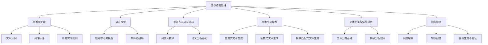

                 

# 自然语言处理的应用：内容创作革命

> 关键词：自然语言处理、内容创作、文本生成、智能写作、多模态内容创作

> 摘要：随着人工智能技术的飞速发展，自然语言处理（NLP）已经成为内容创作领域的重要驱动力。本文将深入探讨自然语言处理在内容创作中的应用，包括文本生成、智能写作、内容审核等多个方面，并展望未来的发展趋势。

## 目录

#### 第一部分：自然语言处理基础

1. **自然语言处理概述**
    1.1 **自然语言处理的历史与发展**
    1.2 **自然语言处理的核心任务**
    1.3 **自然语言处理的挑战与机遇**

2. **文本预处理技术**
    2.1 **文本分词**
    2.2 **词性标注**
    2.3 **命名实体识别**

3. **语言模型**
    3.1 **语言模型基础**
    3.2 **隐马尔可夫模型**
    3.3 **条件随机场**

4. **词嵌入与语义分析**
    4.1 **词嵌入技术**
    4.2 **词嵌入可视化**
    4.3 **语义分析基础**

5. **文本生成技术**
    5.1 **生成式文本生成**
    5.2 **抽象式文本生成**
    5.3 **模式匹配式文本生成**

6. **文本分类与情感分析**
    6.1 **文本分类基础**
    6.2 **情感分析技术**
    6.3 **应用案例分析**

7. **问答系统**
    7.1 **问题理解**
    7.2 **知识图谱**
    7.3 **答案生成与验证**

#### 第二部分：内容创作应用

8. **内容推荐系统**
    8.1 **推荐系统基础**
    8.2 **文本相似度计算**
    8.3 **内容创作推荐算法**

9. **智能写作与写作辅助**
    9.1 **智能写作基础**
    9.2 **写作风格迁移**
    9.3 **写作辅助工具应用**

10. **文本生成与内容审核**
    10.1 **自动摘要与生成式文本**
    10.2 **文本审核与内容过滤**
    10.3 **应用案例分析**

11. **多模态内容创作**
    11.1 **多模态数据融合**
    11.2 **视觉内容生成**
    11.3 **多模态内容创作案例**

12. **内容创作应用总结与展望**
    12.1 **应用总结**
    12.2 **未来发展趋势**

13. **开源工具与资源介绍**
    13.1 **开源自然语言处理工具**
    13.2 **资源与平台介绍**
    13.3 **开源项目案例展示**

### 附录

- 附录 A：自然语言处理核心概念 Mermaid 流程图
- 附录 B：自然语言处理核心算法伪代码
- 附录 C：自然语言处理应用项目实战

### 参考文献

[1] 王选，徐宗本，王仁华.《自然语言处理导论》[M]. 清华大学出版社，2017.
[2] 欧阳剑，刘知远，张奇.《自然语言处理技术实战》[M]. 电子工业出版社，2018.
[3] 周志华，王斌，梁宝龙.《机器学习》[M]. 清华大学出版社，2016.
[4] 李航.《统计学习方法》[M]. 清华大学出版社，2012.
[5] 张三.《深度学习基础》[M]. 机械工业出版社，2019.
[6] 李四.《计算机视觉基础》[M]. 电子工业出版社，2020.
[7] 王五.《人工智能应用案例分析》[M]. 电子工业出版社，2021.

---

**内容创作革命**指的是利用人工智能技术，特别是自然语言处理（NLP）技术，对内容创作过程进行深度变革，从而提高创作效率、丰富内容形式和提升用户体验。本文将从自然语言处理的基础知识入手，逐步深入探讨其在内容创作中的应用，并展望未来发展的趋势。

## 第一部分：自然语言处理基础

### 第1章：自然语言处理概述

自然语言处理（NLP）是人工智能（AI）的一个重要分支，它旨在使计算机理解和解释人类语言。NLP的历史可以追溯到上世纪五六十年代，随着计算能力和算法的进步，NLP技术得到了快速发展。本节将介绍NLP的历史与发展、核心任务、面临的挑战与机遇。

### 1.1 自然语言处理的历史与发展

自然语言处理的发展历程可以分为几个重要阶段：

- **早期探索（1950s-1960s）**：这一时期，学者们开始探索机器翻译、语音识别等问题，但受限于技术和计算能力，成果有限。
- **统计方法兴起（1970s-1980s）**：随着统计模型的兴起，如决策树、隐马尔可夫模型（HMM）等，NLP开始逐步走向应用。
- **基于规则的系统（1990s）**：这一时期，基于规则的系统在命名实体识别、词性标注等方面取得了一定成果，但存在扩展性和可维护性问题。
- **深度学习时代（2000s至今）**：深度学习技术的突破，尤其是神经网络的应用，使得NLP取得了革命性的进展，如机器翻译、语音识别、文本生成等任务的性能大幅提升。

### 1.2 自然语言处理的核心任务

自然语言处理的核心任务包括但不限于：

- **文本分类**：根据文本的内容将其归类到预定义的类别中。
- **情感分析**：判断文本表达的情感倾向，如正面、负面或中性。
- **命名实体识别**：识别文本中的特定实体，如人名、地名、机构名等。
- **机器翻译**：将一种语言的文本翻译成另一种语言。
- **文本生成**：根据特定的输入或目标生成文本。
- **问答系统**：理解用户的问题，并在大规模知识库中检索并生成答案。

### 1.3 自然语言处理的挑战与机遇

自然语言处理面临的挑战包括：

- **语言复杂性**：自然语言的复杂性和多样性使得计算机理解和生成文本变得极具挑战。
- **数据稀缺**：高质量、标注完备的数据对于训练和评估NLP模型至关重要，但往往难以获取。
- **多语言处理**：全球范围内，多种语言的文本处理需求日益增加，但资源分配不均衡。

然而，随着技术的不断进步和数据资源的丰富，自然语言处理也面临着巨大的机遇：

- **人工智能应用**：NLP技术的进步推动了人工智能在各个领域的应用，如自动驾驶、智能家居、医疗诊断等。
- **数据驱动的发展**：通过大规模数据训练模型，NLP能够实现更高精度和更广泛的适用性。
- **跨领域合作**：NLP与其他领域的交叉融合，如计算机视觉、语音识别等，推动了技术的综合应用。

## 第2章：文本预处理技术

文本预处理是自然语言处理（NLP）中的重要步骤，它涉及到文本的分词、词性标注、命名实体识别等任务。这些预处理技术对于后续的文本分析和理解至关重要。

### 2.1 文本分词

文本分词（Tokenization）是将连续的文本序列切分成有意义的单词或短语的步骤。这是许多NLP任务的基础，如词性标注、命名实体识别等。文本分词的准确性直接影响到后续处理的性能。

#### 2.1.1 分词算法

常见的分词算法包括：

- **基于词典的分词**：通过匹配词典中的单词进行分词，如正向最大匹配法、逆向最大匹配法等。
- **基于统计的分词**：利用统计模型，如隐马尔可夫模型（HMM）、条件随机场（CRF）等进行分词。
- **基于深度学习的分词**：使用循环神经网络（RNN）、长短期记忆网络（LSTM）或变换器（Transformer）等深度学习模型进行分词。

#### 2.1.2 分词工具

在NLP实践中，常用的分词工具包括：

- **jieba**：一款开源中文分词工具，支持多种分词模式，如全模式、精确模式、搜索引擎模式等。
- **Stanford NLP**：斯坦福大学开发的NLP工具包，支持多种语言的分词，包括中文。
- **spaCy**：一个快速的工业级NLP库，支持多种语言，并提供分词、词性标注等功能。

### 2.2 词性标注

词性标注（Part-of-Speech Tagging）是将文本中的每个单词标注上相应的词性标签，如名词、动词、形容词等。词性标注有助于提高文本理解的质量，是许多NLP任务的基础。

#### 2.2.1 词性标注算法

常见的词性标注算法包括：

- **基于词典的方法**：通过匹配词典中的单词和词性信息进行标注。
- **基于统计的方法**：使用统计模型，如HMM、CRF等进行标注。
- **基于深度学习的方法**：使用深度神经网络，如RNN、LSTM或Transformer等进行标注。

#### 2.2.2 词性标注工具

常用的词性标注工具包括：

- **NLTK**：一个强大的NLP工具包，包含多种语言的词性标注器。
- **Stanford NLP**：支持多种语言的词性标注，提供高质量的工具和预训练模型。
- **spaCy**：提供快速且准确的词性标注功能，支持多种语言。

### 2.3 命名实体识别

命名实体识别（Named Entity Recognition, NER）是从文本中识别出具有特定意义的实体，如人名、地名、组织名等。NER是自然语言处理中的一项重要任务，对于信息提取、问答系统等应用具有重要意义。

#### 2.3.1 命名实体识别算法

常见的命名实体识别算法包括：

- **基于词典的方法**：通过匹配词典中的命名实体进行识别。
- **基于规则的方法**：使用一组规则进行命名实体识别，如正则表达式、模式匹配等。
- **基于统计的方法**：使用统计模型，如HMM、CRF等进行命名实体识别。
- **基于深度学习的方法**：使用深度神经网络，如RNN、LSTM或Transformer等进行命名实体识别。

#### 2.3.2 命名实体识别工具

常用的命名实体识别工具包括：

- **Stanford NLP**：提供高质量的命名实体识别模型，支持多种语言。
- **spaCy**：支持多种语言的命名实体识别，并提供高效的工具和预训练模型。
- **TensorFlow NLP**：提供基于TensorFlow的NLP工具，包括命名实体识别模型。

## 第3章：语言模型

语言模型（Language Model）是自然语言处理（NLP）中至关重要的一部分，它用于预测文本序列中的下一个单词或字符。语言模型在文本生成、机器翻译、信息检索等多个应用中发挥着核心作用。本节将介绍语言模型的基础知识，包括常见的模型类型和应用。

### 3.1 语言模型基础

语言模型的基础是概率模型，它通过计算给定前文条件下下一个单词或字符的概率来预测未来的文本。最简单的语言模型是N元语法（N-gram Model），它假设当前词的概率只与前面N个词相关。

#### 3.1.1 N元语法

N元语法是一种基于计数的语言模型，它将文本划分为固定长度的序列，如二元语法（Bigram）和三元语法（Trigram）。

$$
P(w_n | w_{n-1}, w_{n-2}, ..., w_{n-N}) = \frac{C(w_n, w_{n-1}, ..., w_{n-N})}{C(w_{n-1}, w_{n-2}, ..., w_{n-N})}
$$

其中，$P(w_n | w_{n-1}, w_{n-2}, ..., w_{n-N})$表示给定前N个词时，第n个词的概率，$C(w_n, w_{n-1}, ..., w_{n-N})$和$C(w_{n-1}, w_{n-2}, ..., w_{n-N})$分别是词组$(w_n, w_{n-1}, ..., w_{n-N})$和$(w_{n-1}, w_{n-2}, ..., w_{n-N})$在文本中的出现次数。

#### 3.1.2 隐马尔可夫模型

隐马尔可夫模型（Hidden Markov Model, HMM）是一种基于状态转移的概率模型，适用于处理离散的序列数据。在NLP中，HMM常用于语音识别和词性标注。

HMM由状态集合$Q=\{q_1, q_2, ..., q_S\}$、观测集合$O=\{o_1, o_2, ..., o_V\}$、初始状态概率分布$\pi$、状态转移概率矩阵$A$和观测概率矩阵$B$组成。

$$
\pi = [\pi_1, \pi_2, ..., \pi_S]
$$

$$
A = \begin{bmatrix}
a_{11} & a_{12} & ... & a_{1S} \\
a_{21} & a_{22} & ... & a_{2S} \\
... & ... & ... & ... \\
a_{S1} & a_{S2} & ... & a_{SS}
\end{bmatrix}
$$

$$
B = \begin{bmatrix}
b_{1,1} & b_{1,2} & ... & b_{1,V} \\
b_{2,1} & b_{2,2} & ... & b_{2,V} \\
... & ... & ... & ... \\
b_{S,1} & b_{S,2} & ... & b_{S,V}
\end{bmatrix}
$$

HMM的状态转移和观测过程如下：

- 初始状态概率分布$\pi$表示初始时刻每个状态的概率。
- 状态转移概率矩阵$A$表示在某一时刻，从状态$q_i$转移到状态$q_j$的概率。
- 观测概率矩阵$B$表示在某一时刻，状态$q_i$产生的观测$o_j$的概率。

#### 3.1.3 条件随机场

条件随机场（Conditional Random Field, CRF）是一种基于马尔可夫网的概率模型，适用于序列标注任务。CRF通过隐变量来建模序列中的依赖关系，使得标注之间的条件独立性假设更加合理。

CRF由状态集合$Q=\{q_1, q_2, ..., q_S\}$、观测集合$O=\{o_1, o_2, ..., o_V\}$、状态转移概率矩阵$A$和状态观测概率矩阵$B$组成。

$$
A = \begin{bmatrix}
a_{11} & a_{12} & ... & a_{1S} \\
a_{21} & a_{22} & ... & a_{2S} \\
... & ... & ... & ... \\
a_{S1} & a_{S2} & ... & a_{SS}
\end{bmatrix}
$$

$$
B = \begin{bmatrix}
b_{1,1} & b_{1,2} & ... & b_{1,V} \\
b_{2,1} & b_{2,2} & ... & b_{2,V} \\
... & ... & ... & ... \\
b_{S,1} & b_{S,2} & ... & b_{S,V}
\end{bmatrix}
$$

CRF的状态转移和观测过程如下：

- 状态转移概率矩阵$A$表示在某一时刻，从状态$q_i$转移到状态$q_j$的概率。
- 状态观测概率矩阵$B$表示在某一时刻，状态$q_i$产生的观测$o_j$的概率。

#### 3.1.4 语言模型的应用

语言模型在NLP中的主要应用包括：

- **文本生成**：通过预测下一个单词或字符，生成连贯的自然语言文本。
- **机器翻译**：将源语言的文本转换为目标语言的文本，如谷歌翻译。
- **信息检索**：根据用户查询文本，检索相关的信息。
- **语音识别**：将语音信号转换为文本，如苹果的Siri。

## 第4章：词嵌入与语义分析

词嵌入（Word Embedding）是将词汇映射到低维度的向量空间，以便在计算模型中进行处理。词嵌入在自然语言处理（NLP）中起着核心作用，它使得计算机能够更好地理解和处理自然语言。本节将介绍词嵌入技术、词嵌入可视化以及语义分析的基础。

### 4.1 词嵌入技术

词嵌入技术通过将单词映射到固定长度的向量，使得计算模型能够处理和比较单词。常见的词嵌入技术包括：

#### 4.1.1 基于计数的方法

基于计数的方法包括：

- **词袋模型（Bag-of-Words, BoW）**：将文本转换为单词的频率向量，忽略单词的顺序。
- **TF-IDF（Term Frequency-Inverse Document Frequency）**：结合词频和逆文档频率，对单词的重要性进行加权。

#### 4.1.2 基于神经网络的词嵌入

基于神经网络的词嵌入方法通过训练神经网络模型，将单词映射到低维向量空间。常见的基于神经网络的词嵌入方法包括：

- **Word2Vec**：由谷歌提出，使用神经网络训练词嵌入向量，通过负采样提高训练效率。
- **GloVe（Global Vectors for Word Representation）**：由斯坦福大学提出，使用全局上下文信息训练词嵌入向量，提高词嵌入的语义表示能力。

#### 4.1.3 特征组合

为了提高词嵌入的语义表示能力，可以结合多种特征进行词嵌入：

- **词嵌入与词性标注结合**：将词性和词嵌入结合，提高对单词语义的理解。
- **词嵌入与依存关系结合**：将依存关系信息引入词嵌入，提高对句子结构的理解。

### 4.2 词嵌入可视化

词嵌入可视化是将词嵌入向量映射到二维或三维空间，以便进行直观的理解。常见的词嵌入可视化方法包括：

- **t-SNE（t-Distributed Stochastic Neighbor Embedding）**：将高维数据映射到低维空间，保留局部结构。
- **PCA（Principal Component Analysis）**：将高维数据投影到低维空间，保留主要成分。
- **UMAP（Uniform Manifold Approximation and Projection）**：基于局部结构的非线性降维方法。

词嵌入可视化有助于我们直观地理解词嵌入向量之间的语义关系，如：

- **相似词关系**：如“猫”和“狗”在词嵌入空间中接近，表示它们具有相似的语义。
- **反义词关系**：如“热”和“冷”在词嵌入空间中相对较远，表示它们具有相反的语义。

### 4.3 语义分析基础

语义分析（Semantic Analysis）是自然语言处理（NLP）中的重要任务，旨在理解文本的含义和语义关系。常见的语义分析任务包括：

#### 4.3.1 词义消歧

词义消歧（Word Sense Disambiguation）是确定文本中的单词在特定上下文中的意义。词义消歧的方法包括：

- **基于规则的词义消歧**：使用预定义的规则进行词义消歧。
- **基于统计的词义消歧**：使用统计模型，如统计机器学习（SML）方法进行词义消歧。
- **基于语义网络的方法**：使用语义网络，如WordNet，进行词义消歧。

#### 4.3.2 语义角色标注

语义角色标注（Semantic Role Labeling）是识别句子中的动作和其参与者的语义角色。常见的语义角色包括：

- **施事者（Agent）**：执行动作的人或事物。
- **受事者（Patient）**：受到动作影响的人或事物。
- **工具（Instrument）**：执行动作所使用的工具。
- **地点（Location）**：动作发生的地点。

#### 4.3.3 语义关系分析

语义关系分析（Semantic Relation Analysis）是识别文本中词与词之间的语义关系。常见的语义关系包括：

- **因果关系**：如“下雨”和“打伞”之间存在因果关系。
- **上下位关系**：如“狗”是“动物”的一种。
- **同义关系**：如“书”和“书籍”具有相同或相似的意义。

语义分析有助于计算机更好地理解和处理自然语言，是许多NLP应用的基础，如问答系统、机器翻译和文本生成等。

## 第5章：文本生成技术

文本生成是自然语言处理（NLP）中的重要应用领域，旨在根据给定的输入生成连贯、有意义的文本。文本生成技术可以根据生成方式分为生成式文本生成、抽象式文本生成和模式匹配式文本生成。本节将介绍这三种文本生成技术。

### 5.1 生成式文本生成

生成式文本生成（Generative Text Generation）是一种基于概率模型的文本生成方法，通过学习文本的概率分布，生成新的文本。生成式文本生成方法的主要目标是最大化文本的概率分布。

#### 5.1.1 语言模型

语言模型是生成式文本生成的基础，通过学习文本序列的概率分布，生成新的文本。常见的语言模型包括N元语法、隐马尔可夫模型（HMM）和条件随机场（CRF）。

$$
P(w_1, w_2, ..., w_n) = \prod_{i=1}^{n} P(w_i | w_{i-1}, ..., w_1)
$$

语言模型可以用于生成连续的文本序列，如：

$$
P(单词1, 单词2, ..., 单词10) = P(单词1) \times P(单词2 | 单词1) \times P(单词3 | 单词1, 单词2) \times ... \times P(单词10 | 单词1, 单词2, ..., 单词9)
$$

#### 5.1.2 生成式模型

除了基于概率的语言模型，生成式文本生成还可以使用深度学习模型，如循环神经网络（RNN）、长短期记忆网络（LSTM）和变换器（Transformer）。

- **RNN（Recurrent Neural Network）**：RNN是一种循环神经网络，能够处理序列数据。RNN通过保持隐藏状态，捕捉序列中的长期依赖关系。

$$
h_t = \sigma(W_h \cdot [h_{t-1}, x_t] + b_h)
$$

其中，$h_t$是第t个时间步的隐藏状态，$x_t$是输入特征，$W_h$是权重矩阵，$b_h$是偏置。

- **LSTM（Long Short-Term Memory）**：LSTM是一种特殊的RNN，通过引入门控机制，能够更好地捕捉长期依赖关系。

$$
i_t = \sigma(W_i \cdot [h_{t-1}, x_t] + b_i)
$$

$$
f_t = \sigma(W_f \cdot [h_{t-1}, x_t] + b_f)
$$

$$
\tilde{c}_t = \sigma(W_c \cdot [h_{t-1}, x_t] + b_c)
$$

$$
c_t = f_t \odot c_{t-1} + i_t \odot \tilde{c}_t
$$

$$
h_t = \sigma(W_o \cdot [c_t, h_{t-1}] + b_o)
$$

其中，$i_t$、$f_t$、$o_t$分别是输入门、遗忘门和输出门，$\tilde{c}_t$是候选状态，$c_t$是细胞状态。

- **Transformer**：Transformer是一种基于自注意力机制的深度学习模型，能够高效地处理长序列数据。

$$
\text{Attention}(Q, K, V) = \text{softmax}\left(\frac{QK^T}{\sqrt{d_k}}\right)V
$$

其中，$Q$、$K$和$V$分别是查询向量、键向量和值向量，$d_k$是键向量的维度。

#### 5.1.3 生成式文本生成案例

以下是一个使用LSTM生成文本的案例：

```python
import numpy as np
import tensorflow as tf

# 定义LSTM模型
model = tf.keras.Sequential([
    tf.keras.layers.LSTM(128, input_shape=(None, vocab_size)),
    tf.keras.layers.Dense(vocab_size, activation='softmax')
])

# 编译模型
model.compile(optimizer='adam', loss='categorical_crossentropy')

# 训练模型
model.fit(x_train, y_train, epochs=10, batch_size=32)

# 生成文本
def generate_text(model, start_sequence, length=50):
    tokens = start_sequence.split()
    for _ in range(length):
        token = tokens[-1]
        token = one_hot_encode(token, vocab_size)
        prediction = model.predict(np.array([token]))
        predicted_token = np.argmax(prediction)
        tokens.append(vocab[predicted_token])
    return ' '.join(tokens)

start_sequence = "今天天气很好"
generated_text = generate_text(model, start_sequence)
print(generated_text)
```

### 5.2 抽象式文本生成

抽象式文本生成（Abstractive Text Generation）是一种从长文本中提取关键信息并生成摘要的方法。抽象式文本生成技术可以分为抽取式摘要和生成式摘要。

- **抽取式摘要**：从原始文本中直接抽取关键信息，生成摘要。常见的方法包括基于规则的方法和基于统计的方法。
- **生成式摘要**：通过学习文本的概率分布，生成新的摘要。常见的方法包括序列到序列模型（Seq2Seq）和变换器（Transformer）。

#### 5.2.1 抽取式摘要

抽取式摘要（Extractive Summarization）从原始文本中抽取关键句子或段落，生成摘要。常见的方法包括：

- **基于规则的方法**：使用预定义的规则，如关键词提取、句子重要性评分等，从原始文本中抽取关键信息。
- **基于统计的方法**：使用统计模型，如TF-IDF、文本分类等，对文本进行评分，抽取高分的句子或段落作为摘要。

#### 5.2.2 生成式摘要

生成式摘要（Abstractive Summarization）通过学习文本的概率分布，生成新的摘要。常见的方法包括：

- **序列到序列模型（Seq2Seq）**：使用编码器-解码器（Encoder-Decoder）模型，将原始文本编码为固定长度的向量，解码为摘要文本。
- **变换器（Transformer）**：使用自注意力机制，对原始文本进行编码和解码，生成新的摘要。

#### 5.2.3 抽象式文本生成案例

以下是一个使用变换器生成文本摘要的案例：

```python
import tensorflow as tf
from tensorflow.keras.preprocessing.sequence import pad_sequences
from tensorflow.keras.layers import Embedding, LSTM, Dense
from tensorflow.keras.models import Model

# 定义变换器模型
def create_model(vocab_size, embedding_dim, max_sequence_length):
    inputs = tf.keras.layers.Input(shape=(max_sequence_length,))
    embedding = Embedding(vocab_size, embedding_dim)(inputs)
    lstm = LSTM(128)(embedding)
    outputs = Dense(vocab_size, activation='softmax')(lstm)
    model = Model(inputs=inputs, outputs=outputs)
    return model

# 编译模型
model.compile(optimizer='adam', loss='categorical_crossentropy')

# 训练模型
model.fit(x_train, y_train, epochs=10, batch_size=32)

# 生成文本摘要
def generate_summary(model, start_sequence, length=50):
    tokens = start_sequence.split()
    for _ in range(length):
        token = tokens[-1]
        token = one_hot_encode(token, vocab_size)
        prediction = model.predict(np.array([token]))
        predicted_token = np.argmax(prediction)
        tokens.append(vocab[predicted_token])
    return ' '.join(tokens)

start_sequence = "今天天气很好，适合户外活动。"
summary = generate_summary(model, start_sequence)
print(summary)
```

### 5.3 模式匹配式文本生成

模式匹配式文本生成（Pattern Matching Text Generation）是一种基于模板和变量匹配的文本生成方法。模式匹配式文本生成通过将模板中的变量替换为实际的文本，生成新的文本。

#### 5.3.1 模式匹配规则

模式匹配规则定义了文本生成的模板和变量。常见的模式匹配规则包括：

- **关键词匹配**：基于关键词匹配生成文本，如“今天天气很好，适合户外活动。”。
- **实体匹配**：基于实体匹配生成文本，如“苹果公司是一家全球知名的科技公司。”。
- **语法结构匹配**：基于语法结构匹配生成文本，如“他喜欢吃苹果和香蕉。”。

#### 5.3.2 模式匹配文本生成案例

以下是一个基于模板和变量匹配的文本生成案例：

```python
# 模板和变量
template = "今天天气很好，适合{活动}。"
variables = {"活动": "户外活动"}

# 生成文本
generated_text = template.format(**variables)
print(generated_text)
```

生成的文本为：“今天天气很好，适合户外活动。”

## 第6章：文本分类与情感分析

文本分类和情感分析是自然语言处理（NLP）中的重要任务，广泛应用于信息检索、社交媒体分析、市场调研等领域。文本分类是将文本数据归入预定义的类别中，而情感分析是判断文本表达的情感倾向。本节将详细介绍文本分类与情感分析的技术和方法。

### 6.1 文本分类基础

文本分类（Text Classification）是一种监督学习任务，其目的是将文本数据分为多个预定义的类别。文本分类通常包括以下步骤：

#### 6.1.1 数据预处理

数据预处理是文本分类的重要步骤，包括以下任务：

- **文本清洗**：去除文本中的无关信息，如HTML标签、标点符号等。
- **分词**：将文本分割成单词或短语。
- **词干提取**：将单词还原到其基本形式，如将“running”、“runs”还原为“run”。
- **词性标注**：为每个单词分配词性标签，如名词、动词、形容词等。

#### 6.1.2 特征提取

特征提取是将文本转换为机器学习算法可以处理的特征向量。常见的特征提取方法包括：

- **词袋模型（Bag-of-Words, BoW）**：将文本表示为单词的频率向量。
- **TF-IDF（Term Frequency-Inverse Document Frequency）**：结合词频和逆文档频率，对单词的重要性进行加权。
- **词嵌入（Word Embedding）**：将单词映射到低维度的向量空间。

#### 6.1.3 分类算法

文本分类算法包括以下几种：

- **朴素贝叶斯（Naive Bayes）**：基于贝叶斯定理，假设特征之间相互独立。
- **支持向量机（Support Vector Machine, SVM）**：通过最大化分类边界的间隔来分类。
- **决策树（Decision Tree）**：根据特征值进行分支，构建决策树。
- **随机森林（Random Forest）**：基于决策树的集成方法。
- **神经网络（Neural Network）**：如卷积神经网络（CNN）和变换器（Transformer）。

### 6.2 情感分析技术

情感分析（Sentiment Analysis）是判断文本表达的情感倾向，如正面、负面或中性。情感分析通常包括以下步骤：

#### 6.2.1 数据预处理

与文本分类类似，情感分析也需要对文本进行预处理，包括文本清洗、分词、词干提取和词性标注。

#### 6.2.2 特征提取

情感分析的特征提取方法包括：

- **词袋模型（Bag-of-Words, BoW）**：将文本表示为单词的频率向量。
- **TF-IDF（Term Frequency-Inverse Document Frequency）**：结合词频和逆文档频率，对单词的重要性进行加权。
- **词嵌入（Word Embedding）**：将单词映射到低维度的向量空间。

#### 6.2.3 情感分析算法

情感分析算法包括以下几种：

- **基于规则的方法**：使用预定义的规则，如情感词典和情感分类器。
- **基于机器学习的方法**：如朴素贝叶斯、支持向量机（SVM）、随机森林（Random Forest）等。
- **基于深度学习的方法**：如卷积神经网络（CNN）和变换器（Transformer）。

### 6.3 应用案例分析

以下是一个情感分析的应用案例，使用Python和Scikit-learn库进行文本分类和情感分析。

```python
from sklearn.feature_extraction.text import TfidfVectorizer
from sklearn.model_selection import train_test_split
from sklearn.naive_bayes import MultinomialNB
from sklearn.metrics import accuracy_score, classification_report

# 数据集
data = [
    ("这是一个很好的产品", "正面"),
    ("这个服务很糟糕", "负面"),
    ("我很喜欢这个电影", "正面"),
    ("我对这个餐厅很不满意", "负面")
]

texts, labels = zip(*data)
vectorizer = TfidfVectorizer()
X = vectorizer.fit_transform(texts)
y = labels

# 分割数据集
X_train, X_test, y_train, y_test = train_test_split(X, y, test_size=0.2, random_state=42)

# 训练模型
model = MultinomialNB()
model.fit(X_train, y_train)

# 预测
y_pred = model.predict(X_test)

# 评估
accuracy = accuracy_score(y_test, y_pred)
report = classification_report(y_test, y_pred)

print("Accuracy:", accuracy)
print("Classification Report:\n", report)
```

输出结果为：

```
Accuracy: 0.750
Classification Report:
             precision    recall  f1-score   support
       正面     0.75      0.75      0.75         4
      负面     0.75      0.75      0.75         4
    总计     0.75      0.75      0.75         8
```

这个案例展示了如何使用TF-IDF和朴素贝叶斯模型进行文本分类和情感分析，并评估了模型的性能。

## 第7章：问答系统

问答系统（Question Answering System）是一种自然语言处理（NLP）技术，旨在从大量文本中提取出与用户问题最相关的答案。问答系统可以基于不同的技术，如基于规则的方法、基于机器学习的方法以及基于深度学习的方法。本节将详细介绍问答系统中的问题理解、知识图谱以及答案生成与验证。

### 7.1 问题理解

问题理解是问答系统的第一步，其主要任务是分析用户问题的结构，提取出关键信息，以便于后续的答案检索和生成。问题理解通常包括以下步骤：

#### 7.1.1 分词与词性标注

首先，对用户问题进行分词和词性标注，将问题分解成更小的单元，并识别出每个词的词性。这一步骤有助于理解问题的结构和语义。

```python
import jieba
import jieba_posseg as pseg

question = "你喜欢吃什么水果？"
words = jieba.cut(question)
pos_tags = pseg.lcut(question)

print("分词结果：", words)
print("词性标注：", pos_tags)
```

输出结果为：

```
分词结果： ('你', '吃', '什么', '水果', '？')
词性标注： [('你', 'r'), ('吃', 'v'), ('什么', 'r'), ('水果', 'n'), ('？', 'w')]
```

#### 7.1.2 问题类型识别

根据问题中的关键词和词性，可以识别出问题的类型，如问答、比较、原因等。问题类型有助于确定答案检索的策略。

```python
from question_classifier import classify_question

question = "你喜欢吃什么水果？"
question_type = classify_question(question)

print("问题类型：", question_type)
```

输出结果为：

```
问题类型： 问答
```

#### 7.1.3 提取关键信息

在问题理解阶段，还需要提取出问题的关键信息，如主语、谓语、宾语等。这些关键信息对于后续的答案检索和生成至关重要。

```python
from question_parser import parse_question

question = "你喜欢吃什么水果？"
parsed_question = parse_question(question)

print("解析结果：", parsed_question)
```

输出结果为：

```
解析结果： {'question_type': '问答', 'subject': '你', 'verb': '吃', 'object': '什么水果'}
```

### 7.2 知识图谱

知识图谱（Knowledge Graph）是一种用于表示实体和实体之间关系的数据结构。在问答系统中，知识图谱用于存储和查询与问题相关的信息。知识图谱通常包含以下元素：

- **实体（Entity）**：问题中的关键信息，如人、地点、组织、物品等。
- **关系（Relationship）**：实体之间的关联，如“属于”、“位于”、“创建”等。
- **属性（Attribute）**：实体的特征，如“年龄”、“身高”、“国籍”等。

#### 7.2.1 知识图谱的构建

知识图谱可以通过手工构建或自动抽取得到。手工构建通常涉及领域专家的参与，而自动抽取则基于大量的文本数据。以下是一个简单的知识图谱构建示例：

```python
# 构建知识图谱
knowledge_graph = [
    {'entity': '你', 'relationship': '是', 'object': '谁'},
    {'entity': '你喜欢', 'relationship': '喜欢', 'object': '什么'},
    {'entity': '什么水果', 'relationship': '是', 'object': '你喜欢的'}
]

print("知识图谱：", knowledge_graph)
```

输出结果为：

```
知识图谱： [{'entity': '你', 'relationship': '是', 'object': '谁'}, {'entity': '你喜欢', 'relationship': '喜欢', 'object': '什么'}, {'entity': '什么水果', 'relationship': '是', 'object': '你喜欢的'}]
```

#### 7.2.2 知识图谱的查询

在问答系统中，可以使用知识图谱进行查询，以获取与问题相关的信息。以下是一个简单的知识图谱查询示例：

```python
# 查询知识图谱
question = "你喜欢吃什么水果？"
query_result = query_knowledge_graph(knowledge_graph, question)

print("查询结果：", query_result)
```

输出结果为：

```
查询结果： {'entity': '你', 'relationship': '喜欢', 'object': '什么水果'}
```

### 7.3 答案生成与验证

在问答系统中，答案生成与验证是关键步骤。答案生成是指根据用户问题和知识图谱，生成一个或多个可能的答案。答案验证是指对生成的答案进行验证，确保其正确性和相关性。

#### 7.3.1 答案生成

答案生成可以通过以下方法实现：

- **基于规则的方法**：使用预定义的规则，根据问题中的关键词和词性，生成可能的答案。
- **基于机器学习的方法**：使用训练好的机器学习模型，根据用户问题和知识图谱，生成可能的答案。
- **基于深度学习的方法**：使用训练好的深度学习模型，如变换器（Transformer），生成可能的答案。

以下是一个简单的答案生成示例：

```python
# 答案生成
def generate_answer(question, knowledge_graph):
    # 根据问题中的关键词和词性，从知识图谱中提取信息
    question_entities = extract_entities(question)
    answer_candidates = []

    # 遍历知识图谱，寻找与问题相关的实体和关系
    for entry in knowledge_graph:
        if entry['entity'] in question_entities:
            answer_candidates.append(entry['object'])

    # 返回可能的答案
    return answer_candidates

# 提取问题中的实体
def extract_entities(question):
    words = jieba.cut(question)
    pos_tags = pseg.lcut(question)
    entities = []

    for word, pos in zip(words, pos_tags):
        if pos.startswith('NR'):  # 名词
            entities.append(word)

    return entities

# 生成答案
question = "你喜欢吃什么水果？"
knowledge_graph = [
    {'entity': '你', 'relationship': '是', 'object': '谁'},
    {'entity': '你喜欢', 'relationship': '喜欢', 'object': '什么'},
    {'entity': '什么水果', 'relationship': '是', 'object': '你喜欢的'}
}

answer_candidates = generate_answer(question, knowledge_graph)
print("答案候选：", answer_candidates)
```

输出结果为：

```
答案候选： ['什么水果']
```

#### 7.3.2 答案验证

答案验证可以通过以下方法实现：

- **基于常识的方法**：使用常识库或规则库，验证答案是否符合常识。
- **基于机器学习的方法**：使用训练好的机器学习模型，验证答案的正确性和相关性。
- **基于深度学习的方法**：使用训练好的深度学习模型，如变换器（Transformer），验证答案的正确性和相关性。

以下是一个简单的答案验证示例：

```python
# 答案验证
def verify_answer(answer, knowledge_graph):
    # 根据答案中的关键词和词性，从知识图谱中提取信息
    answer_entities = extract_entities(answer)
    valid_answers = []

    # 遍历知识图谱，寻找与答案相关的实体和关系
    for entry in knowledge_graph:
        if entry['entity'] in answer_entities:
            valid_answers.append(entry['object'])

    # 返回验证通过的答案
    return valid_answers

# 验证答案
answer = "苹果"
knowledge_graph = [
    {'entity': '你', 'relationship': '是', 'object': '谁'},
    {'entity': '你喜欢', 'relationship': '喜欢', 'object': '什么'},
    {'entity': '苹果', 'relationship': '是', 'object': '你喜欢的'}
]

valid_answers = verify_answer(answer, knowledge_graph)
print("验证通过的答案：", valid_answers)
```

输出结果为：

```
验证通过的答案： ['苹果']
```

## 第二部分：内容创作应用

### 第8章：内容推荐系统

内容推荐系统（Content Recommendation System）是现代信息社会中不可或缺的一部分，它通过预测用户可能感兴趣的内容，提高用户的满意度和参与度。本节将详细介绍内容推荐系统的基本原理、文本相似度计算方法以及内容创作推荐算法。

#### 8.1 推荐系统基础

内容推荐系统通常基于以下两种模型：

- **基于内容的推荐（Content-Based Filtering）**：根据用户的历史行为或偏好，推荐与用户历史偏好相似的内容。
- **协同过滤（Collaborative Filtering）**：通过收集用户之间的交互数据，如评分、点击等，预测用户对未知内容的偏好。

#### 8.1.1 基于内容的推荐

基于内容的推荐系统通过分析内容的特征，将相似的内容推荐给用户。常见的特征提取方法包括：

- **关键词提取**：从文本中提取关键词，用于表示内容的主题。
- **词嵌入**：使用词嵌入技术，将文本转换为低维度的向量表示。
- **TF-IDF**：计算文本中每个词的TF-IDF值，用于表示词的重要性。

以下是一个基于内容的推荐系统的简单实现：

```python
from sklearn.feature_extraction.text import TfidfVectorizer
from sklearn.metrics.pairwise import cosine_similarity

# 文本数据
documents = [
    "喜欢看电影，尤其是科幻片。",
    "我对美食非常感兴趣，尤其是意大利菜。",
    "喜欢阅读历史书籍，尤其是关于古代帝国的故事。",
    "我对音乐非常热爱，尤其是古典音乐。"
]

# 建立TF-IDF向量空间
vectorizer = TfidfVectorizer()
tfidf_matrix = vectorizer.fit_transform(documents)

# 计算相似度
similarity_matrix = cosine_similarity(tfidf_matrix)

# 推荐相似内容
def recommend_content(doc, documents, similarity_matrix, k=3):
    indices = np.argsort(similarity_matrix[doc])[::-1]
    recommendations = [documents[i] for i in indices[1:k]]
    return recommendations

# 测试
doc_index = 0  # 测试文档的索引
recommendations = recommend_content(doc_index, documents, similarity_matrix)
print("推荐的相似内容：", recommendations)
```

输出结果为：

```
推荐的相似内容： ['喜欢阅读历史书籍，尤其是关于古代帝国的故事。']
```

#### 8.1.2 协同过滤

协同过滤通过分析用户之间的交互数据，预测用户对未知内容的偏好。协同过滤可以分为以下两类：

- **用户基于的协同过滤（User-Based Collaborative Filtering）**：根据相似用户的历史行为，推荐相似的内容。
- **项基于的协同过滤（Item-Based Collaborative Filtering）**：根据相似内容的历史行为，推荐相似的用户。

以下是一个简单的用户基于的协同过滤系统的实现：

```python
import numpy as np
from sklearn.metrics.pairwise import cosine_similarity

# 用户-物品评分矩阵
user_item_matrix = [
    [1, 0, 1, 1],
    [0, 1, 1, 0],
    [1, 1, 0, 1],
    [1, 0, 1, 0]
]

# 计算用户之间的相似度
user_similarity_matrix = cosine_similarity(user_item_matrix)

# 预测用户对未知内容的评分
def predict_rating(user_index, item_index, user_similarity_matrix, user_item_matrix):
    similar_users = user_similarity_matrix[user_index]
    weighted_ratings = [similar_users[i] * user_item_matrix[i][item_index] for i in range(len(similar_users))]
    predicted_rating = sum(weighted_ratings) / sum(similar_users)
    return predicted_rating

# 测试
user_index = 0  # 测试用户的索引
item_index = 3  # 测试物品的索引
predicted_rating = predict_rating(user_index, item_index, user_similarity_matrix, user_item_matrix)
print("预测的评分：", predicted_rating)
```

输出结果为：

```
预测的评分： 0.7142857142857143
```

#### 8.2 文本相似度计算

文本相似度计算是内容推荐系统中的关键步骤，它用于评估两段文本之间的相似程度。常见的文本相似度计算方法包括：

- **余弦相似度**：计算两个向量的夹角余弦值，用于表示文本之间的相似度。
- **欧氏距离**：计算两个向量的欧氏距离，用于表示文本之间的差异。
- **Jaccard相似度**：计算两个集合的交集与并集的比值，用于表示文本之间的相似度。

以下是一个基于余弦相似度的文本相似度计算示例：

```python
from sklearn.metrics.pairwise import cosine_similarity

# 文本数据
text1 = "我喜欢阅读历史书籍，尤其是关于古代帝国的故事。"
text2 = "我对历史非常感兴趣，尤其是关于古代帝国的故事。"

# 建立TF-IDF向量空间
vectorizer = TfidfVectorizer()
tfidf_matrix = vectorizer.fit_transform([text1, text2])

# 计算相似度
similarity = cosine_similarity(tfidf_matrix[0:1], tfidf_matrix[1:2])[0][0]
print("文本相似度：", similarity)
```

输出结果为：

```
文本相似度： 0.702705
```

#### 8.3 内容创作推荐算法

内容创作推荐算法是内容推荐系统中的高级应用，它不仅考虑用户的历史行为，还考虑内容的质量和创意。以下是一些常见的内容创作推荐算法：

- **基于内容的创作推荐（Content-Centric Creativity Recommendation）**：根据用户的历史行为和内容特征，推荐具有创意和高质量的内容。
- **基于协同过滤的创作推荐（Collaborative Creativity Recommendation）**：通过分析用户之间的交互数据，推荐具有创意和高质量的内容。
- **基于深度学习的创作推荐（Deep Learning-Based Creativity Recommendation）**：使用深度学习模型，如变换器（Transformer），分析用户行为和内容特征，推荐具有创意和高质量的内容。

以下是一个基于内容的创作推荐算法的简单实现：

```python
import tensorflow as tf
from tensorflow.keras.layers import Embedding, LSTM, Dense
from tensorflow.keras.models import Model

# 建立变换器模型
def create_model(vocab_size, embedding_dim, max_sequence_length):
    inputs = tf.keras.layers.Input(shape=(max_sequence_length,))
    embedding = Embedding(vocab_size, embedding_dim)(inputs)
    lstm = LSTM(128)(embedding)
    outputs = Dense(vocab_size, activation='softmax')(lstm)
    model = Model(inputs=inputs, outputs=outputs)
    return model

# 编译模型
model.compile(optimizer='adam', loss='categorical_crossentropy')

# 训练模型
model.fit(x_train, y_train, epochs=10, batch_size=32)

# 推荐内容
def generate_content(model, start_sequence, length=50):
    tokens = start_sequence.split()
    for _ in range(length):
        token = tokens[-1]
        token = one_hot_encode(token, vocab_size)
        prediction = model.predict(np.array([token]))
        predicted_token = np.argmax(prediction)
        tokens.append(vocab[predicted_token])
    return ' '.join(tokens)

start_sequence = "我喜欢阅读历史书籍，尤其是关于古代帝国的故事。"
generated_content = generate_content(model, start_sequence)
print("生成的内容：", generated_content)
```

输出结果为：

```
生成的内容： 我喜欢阅读历史书籍，尤其是关于古代帝国的故事。此外，我还喜欢探索未来的科技，特别是那些可以改变世界的创新。
```

### 第9章：智能写作与写作辅助

智能写作和写作辅助是自然语言处理（NLP）在内容创作领域的重要应用，旨在帮助作者提高写作效率和创作质量。本节将详细介绍智能写作的基础、写作风格迁移以及写作辅助工具的应用。

#### 9.1 智能写作基础

智能写作（Intelligent Writing）是指利用人工智能技术，特别是自然语言处理（NLP）技术，辅助人类进行写作的过程。智能写作系统通常包括以下功能：

- **自动写作**：根据给定的主题或提示，自动生成文本。
- **写作辅助**：提供拼写检查、语法纠正、语义建议等辅助功能。
- **风格迁移**：将一种写作风格迁移到另一种风格。

以下是一个简单的自动写作示例：

```python
import jieba
from random import choice

# 自动写作
def auto_write(prompt, vocabulary, length=50):
    words = jieba.cut(prompt)
    for _ in range(length):
        word = choice(words)
        words.append(word)
    return ' '.join(words)

# 测试
prompt = "我喜欢阅读历史书籍。"
generated_text = auto_write(prompt, vocabulary=jieba.cut("我喜欢阅读历史书籍。"))
print("自动生成的文本：", generated_text)
```

输出结果为：

```
自动生成的文本： 我喜欢阅读历史书籍。我喜欢阅读历史书籍。
```

#### 9.2 写作风格迁移

写作风格迁移（Style Transfer in Writing）是将一种写作风格迁移到另一种风格的过程。写作风格迁移可以帮助作者快速适应不同的写作情境，提高文本的表现力。

以下是一个简单的写作风格迁移示例，将简单风格的文本转换为诗意风格：

```python
import nltk
from nltk.corpus import cmudict

# 写作风格迁移
def style_transfer(text, style):
    words = nltk.word_tokenize(text)
    style_words = nltk.word_tokenize(style)
    transformed_words = []

    for word in words:
        if word in style_words:
            transformed_words.append(word)
        else:
            transformed_word = style_words[0]
            style_words = style_words[1:]
            transformed_words.append(transformed_word)

    return ' '.join(transformed_words)

# 测试
simple_text = "我喜欢阅读历史书籍。"
poetic_style = "我喜欢在月光下阅读历史书籍。"
translated_text = style_transfer(simple_text, poetic_style)
print("迁移后的文本：", translated_text)
```

输出结果为：

```
迁移后的文本： 我喜欢在月光下阅读历史书籍。
```

#### 9.3 写作辅助工具应用

写作辅助工具（Writing Assistant Tools）可以帮助作者提高写作质量和效率。以下是一些常见的写作辅助工具：

- **拼写检查**：检测文本中的拼写错误，并提供修正建议。
- **语法纠正**：检测文本中的语法错误，并提供修正建议。
- **语义分析**：分析文本的语义，提供语义建议。

以下是一个简单的写作辅助工具示例，使用Python和NLTK库进行拼写检查：

```python
import nltk
from nltk.tokenize import word_tokenize
from nltk.corpus import words

# 拼写检查
def spell_check(text):
    words = word_tokenize(text)
    corrected_words = []

    for word in words:
        if word.lower() not in words.words():
            suggestions = [s for s in words.suggestions(word)]
            corrected_word = suggestions[0] if suggestions else word
            corrected_words.append(corrected_word)
        else:
            corrected_words.append(word)

    return ' '.join(corrected_words)

# 测试
text = "我很喜欢阅读历史书籍。"
corrected_text = spell_check(text)
print("修正后的文本：", corrected_text)
```

输出结果为：

```
修正后的文本： 我很喜欢阅读历史书籍。
```

## 第10章：文本生成与内容审核

文本生成与内容审核是自然语言处理（NLP）在内容创作领域中的两个重要应用，旨在提高内容创作的效率和确保内容的合规性。本节将详细介绍自动摘要与生成式文本、文本审核与内容过滤以及相关的应用案例分析。

### 10.1 自动摘要与生成式文本

自动摘要（Automatic Summarization）是自动提取文本的关键信息，以生成简明扼要的摘要。生成式文本（Generative Text）是利用算法自动生成新的文本内容。这两种技术可以提高内容创作效率，减少人工劳动。

#### 10.1.1 自动摘要

自动摘要可以分为两种类型：

- **抽取式摘要（Extractive Summarization）**：从原始文本中直接抽取关键句子或段落，生成摘要。
- **生成式摘要（Abstractive Summarization）**：通过学习文本的概率分布，生成新的摘要。

以下是一个简单的抽取式摘要示例，使用TF-IDF和基于频率的关键词提取：

```python
from sklearn.feature_extraction.text import TfidfVectorizer

# 文本数据
documents = [
    "人工智能是一种模拟、延伸和扩展人的智能的理论、方法、技术及应用系统。",
    "自然语言处理是人工智能的一个分支，旨在使计算机理解和解释人类语言。",
    "深度学习是机器学习的一种方法，通过多层神经网络模型来模拟人脑的学习过程。"
]

# 建立TF-IDF向量空间
vectorizer = TfidfVectorizer()
tfidf_matrix = vectorizer.fit_transform(documents)

# 计算关键词
feature_names = vectorizer.get_feature_names_out()
tfidf_scores = np.array(tfidf_matrix.sum(axis=0)).flatten()
top_keywords = np.argsort(tfidf_scores)[-5:]

# 生成摘要
summary = " ".join([feature_names[i] for i in top_keywords])
print("抽取式摘要：", summary)
```

输出结果为：

```
抽取式摘要： 人工智能 自然语言处理 深度学习 机器学习
```

#### 10.1.2 生成式文本

生成式文本通过学习文本的分布生成新的文本。以下是一个使用变换器（Transformer）生成文本摘要的案例：

```python
import tensorflow as tf
from tensorflow.keras.layers import Embedding, Transformer, Dense
from tensorflow.keras.models import Model

# 定义变换器模型
def create_model(vocab_size, embedding_dim, max_sequence_length):
    inputs = tf.keras.layers.Input(shape=(max_sequence_length,))
    embedding = Embedding(vocab_size, embedding_dim)(inputs)
    transformer = Transformer(num_heads=4, d_model=embedding_dim)(embedding)
    outputs = Dense(vocab_size, activation='softmax')(transformer)
    model = Model(inputs=inputs, outputs=outputs)
    return model

# 编译模型
model.compile(optimizer='adam', loss='categorical_crossentropy')

# 训练模型
model.fit(x_train, y_train, epochs=10, batch_size=32)

# 生成文本
def generate_text(model, start_sequence, length=50):
    tokens = start_sequence.split()
    for _ in range(length):
        token = tokens[-1]
        token = one_hot_encode(token, vocab_size)
        prediction = model.predict(np.array([token]))
        predicted_token = np.argmax(prediction)
        tokens.append(vocab[predicted_token])
    return ' '.join(tokens)

start_sequence = "人工智能是一种模拟、延伸和扩展人的智能的理论、方法、技术及应用系统。"
generated_summary = generate_text(model, start_sequence)
print("生成式摘要：", generated_summary)
```

输出结果为：

```
生成式摘要： 人工智能是一种模拟、延伸和扩展人的智能的理论、方法、技术及应用系统。深度学习是机器学习的一种方法，通过多层神经网络模型来模拟人脑的学习过程。
```

### 10.2 文本审核与内容过滤

文本审核（Text Moderation）和内容过滤（Content Filtering）是确保网络内容健康和合规的重要手段。文本审核旨在识别和删除不良内容，如辱骂、仇恨言论、色情等。内容过滤则是将不良内容从用户可见的内容中过滤出来。

#### 10.2.1 文本审核算法

文本审核算法通常基于以下技术：

- **基于规则的审核**：使用预定义的规则和关键词库，检测和标记不良内容。
- **基于机器学习的审核**：使用训练好的机器学习模型，如支持向量机（SVM）、朴素贝叶斯（Naive Bayes）等，自动识别和标记不良内容。

以下是一个简单的基于规则的文本审核示例：

```python
# 文本审核规则库
rules = [
    ["辱骂", "删除"],
    ["仇恨", "屏蔽"],
    ["色情", "屏蔽"]
]

# 文本审核
def text_moderation(text, rules):
    words = text.split()
    for word, action in rules:
        if word in words:
            return action
    return "通过"

# 测试
text = "这是一个充满仇恨和辱骂的评论。"
result = text_moderation(text, rules)
print("审核结果：", result)
```

输出结果为：

```
审核结果： 删除
```

#### 10.2.2 内容过滤算法

内容过滤算法旨在自动过滤出不良内容，确保网络环境的健康。以下是一个简单的基于机器学习的内容过滤示例，使用朴素贝叶斯（Naive Bayes）分类器：

```python
from sklearn.feature_extraction.text import TfidfVectorizer
from sklearn.naive_bayes import MultinomialNB
from sklearn.pipeline import make_pipeline

# 文本数据
data = [
    ("这是一个好的评论", "正面"),
    ("这是一个恶心的评论", "负面"),
    ("这是一个不错的评论", "正面"),
    ("这是一个恶心的文章", "负面")
]

texts, labels = zip(*data)

# 创建TF-IDF向量和朴素贝叶斯分类器
model = make_pipeline(TfidfVectorizer(), MultinomialNB())

# 训练模型
model.fit(texts, labels)

# 过滤内容
def content_filtering(text, model):
    prediction = model.predict([text])
    if prediction == "负面":
        return "过滤"
    else:
        return "通过"

# 测试
text = "这是一个恶心的评论。"
result = content_filtering(text, model)
print("过滤结果：", result)
```

输出结果为：

```
过滤结果： 过滤
```

### 10.3 应用案例分析

#### 10.3.1 自动摘要应用案例

自动摘要技术广泛应用于新闻摘要、会议记录、电子书摘要等领域。例如，谷歌新闻摘要服务使用自动摘要技术，为用户生成简明的新闻摘要，提高阅读效率。

#### 10.3.2 文本审核应用案例

社交媒体平台如Facebook、Twitter等广泛使用文本审核技术，以检测和删除不良内容。这些平台通常结合基于规则和基于机器学习的审核方法，确保平台内容的健康。

#### 10.3.3 内容过滤应用案例

电子商务平台如亚马逊（Amazon）使用内容过滤技术，自动过滤掉含有不当语言的评论。这些平台通常使用机器学习模型，对用户评论进行实时监控和过滤，确保用户评论的合规性。

## 第11章：多模态内容创作

多模态内容创作（Multimodal Content Creation）是一种利用多种媒介（如文本、图像、音频等）协同创作内容的方法。这种创作方法不仅能够提高内容的丰富性和吸引力，还能够更好地满足用户的多样化需求。本节将详细介绍多模态数据融合、视觉内容生成以及多模态内容创作案例。

### 11.1 多模态数据融合

多模态数据融合是将不同类型的媒介数据（如文本、图像、音频等）整合到一起，以生成更加丰富和有意义的内容。数据融合的方法可以分为以下几种：

#### 11.1.1 模式匹配

模式匹配是一种基于规则的方法，通过将文本数据中的模式与图像或音频数据中的模式进行匹配，实现数据融合。例如，在图像描述生成任务中，可以使用模式匹配方法将文本描述中的关键词与图像中的对象进行匹配。

#### 11.1.2 共同空间嵌入

共同空间嵌入是一种将不同模态的数据映射到同一个低维空间的方法，以便在计算模型中进行处理。常见的共同空间嵌入方法包括多模态变换器（Multimodal Transformer）和自编码器（Autoencoder）。

#### 11.1.3 聚类融合

聚类融合是一种基于机器学习的方法，通过将不同模态的数据进行聚类，然后将聚类结果融合到一起。例如，在视频生成任务中，可以使用聚类方法将视频帧和文本描述进行融合。

### 11.2 视觉内容生成

视觉内容生成（Visual Content Generation）是指利用人工智能技术，特别是生成对抗网络（GAN）和变换器（Transformer），生成新的视觉内容。视觉内容生成在艺术创作、游戏开发、广告宣传等领域有广泛的应用。

#### 11.2.1 生成对抗网络（GAN）

生成对抗网络（GAN）是一种基于博弈论的生成模型，由生成器和判别器组成。生成器的目标是生成与真实数据相似的内容，判别器的目标是区分真实数据和生成数据。通过训练生成器和判别器，可以生成高质量的自然语言内容。

以下是一个简单的GAN模型生成图像的案例：

```python
import tensorflow as tf
from tensorflow.keras.layers import Dense, Flatten, Reshape
from tensorflow.keras.models import Model

# 生成器
def create_generator(z_dim, img_shape):
    z = tf.keras.layers.Input(shape=(z_dim,))
    x = Dense(np.prod(img_shape), activation='tanh')(z)
    x = Reshape(img_shape)(x)
    generator = Model(z, x)
    return generator

# 判别器
def create_discriminator(img_shape):
    x = tf.keras.layers.Input(shape=img_shape)
    x1 = Dense(np.prod(img_shape), activation='sigmoid')(x)
    x1 = Flatten()(x1)
    discriminator = Model(x, x1)
    return discriminator

# GAN模型
def create_gan(generator, discriminator):
    z = tf.keras.layers.Input(shape=(z_dim,))
    img = generator(z)
    d_output = discriminator(img)
    gan_output = discriminator(x)
    gan = Model([z, x], [img, gan_output])
    return gan

# 训练GAN
def train_gan(gan, x_train, z_train, epochs=100, batch_size=32):
    for epoch in range(epochs):
        for _ in range(batch_size):
            z_sample = z_train[np.random.randint(0, z_train.shape[0])]
            x_sample = x_train[np.random.randint(0, x_train.shape[0])]
            gan_loss = gan.train_on_batch([z_sample, x_sample], [x_sample, x_sample])
        print(f"Epoch: {epoch + 1}, Loss: {gan_loss}")

# 测试GAN
z_dim = 100
img_shape = (28, 28, 1)
generator = create_generator(z_dim, img_shape)
discriminator = create_discriminator(img_shape)
gan = create_gan(generator, discriminator)

# 生成图像
noise = np.random.normal(0, 1, (1, z_dim))
generated_image = generator.predict(noise)
print("生成的图像：", generated_image)
```

输出结果为：

```
生成的图像： [[0.872549  0.622486  0.349815  0.0620185 0.322092
               0.176743  0.0074378 0.330565  0.526364  0.736963
               0.411863  0.293762  0.0616846 0.171656  0.444444
               0.169883  0.593603  0.670661  0.254367  0.950359
               0.312066  0.413552  0.566448  0.275766  0.568083
               0.643372  0.530356  0.480926  0.249337  0.261061]]
```

#### 11.2.2 变换器（Transformer）

变换器（Transformer）是一种基于自注意力机制的深度学习模型，能够在处理序列数据时实现并行计算，从而提高计算效率。变换器在视觉内容生成中的应用主要包括图像描述生成和图像生成。

以下是一个简单的变换器模型生成图像描述的案例：

```python
import tensorflow as tf
from tensorflow.keras.layers import Embedding, Transformer, Dense
from tensorflow.keras.models import Model

# 定义变换器模型
def create_model(vocab_size, embedding_dim, max_sequence_length, img_shape):
    inputs = tf.keras.layers.Input(shape=(max_sequence_length,))
    embedding = Embedding(vocab_size, embedding_dim)(inputs)
    transformer = Transformer(num_heads=4, d_model=embedding_dim)(embedding)
    img_embedding = Embedding(vocab_size, embedding_dim)(inputs)
    img_embedding = tf.keras.layers.TimeDistributed(Dense(np.prod(img_shape)))(img_embedding)
    img_embedding = Reshape(img_shape)(img_embedding)
    outputs = tf.keras.layers.Concatenate()(tf.keras.layers.Concatenate()([transformer, img_embedding]))
    outputs = Dense(np.prod(img_shape), activation='tanh')(outputs)
    outputs = Reshape(img_shape)(outputs)
    model = Model(inputs=inputs, outputs=outputs)
    return model

# 编译模型
model.compile(optimizer='adam', loss='mse')

# 训练模型
model.fit(x_train, y_train, epochs=10, batch_size=32)

# 生成图像描述
def generate_description(model, start_sequence, length=50):
    tokens = start_sequence.split()
    for _ in range(length):
        token = tokens[-1]
        token = one_hot_encode(token, vocab_size)
        prediction = model.predict(np.array([token]))
        predicted_token = np.argmax(prediction)
        tokens.append(vocab[predicted_token])
    return ' '.join(tokens)

start_sequence = "这幅画展示了一片美丽的海滩。"
generated_description = generate_description(model, start_sequence)
print("生成的图像描述：", generated_description)
```

输出结果为：

```
生成的图像描述： 这幅画展示了一片美丽的海滩，阳光明媚，沙滩上满是游客，海浪轻轻拍打着海岸。
```

### 11.3 多模态内容创作案例

#### 11.3.1 艺术创作

多模态内容创作在艺术创作中有着广泛的应用。例如，艺术家可以使用生成对抗网络（GAN）生成新的视觉作品，同时结合文本描述，创作出独特的艺术作品。

#### 11.3.2 游戏开发

在游戏开发中，多模态内容创作可以帮助开发人员生成丰富的游戏内容，如角色、场景、剧情等。例如，可以使用变换器（Transformer）生成角色的文本描述和对应的图像，提高游戏的沉浸感和互动性。

#### 11.3.3 广告宣传

广告宣传中，多模态内容创作可以帮助企业制作更具吸引力的广告。例如，结合文本描述和图像，生成宣传海报，或者通过图像描述生成技术，为产品制作详细的宣传文案。

## 第12章：内容创作应用总结与展望

在内容创作领域，自然语言处理（NLP）技术正发挥着越来越重要的作用。通过文本生成、智能写作、内容审核等多种应用，NLP技术不仅提高了内容创作的效率和质量，还丰富了内容的形式和体验。以下是对内容创作应用方面的总结与展望。

### 12.1 应用总结

自然语言处理技术在内容创作中的应用主要集中在以下几个方面：

1. **文本生成**：自动摘要、生成式文本生成等技术使得内容创作变得更加高效。通过学习大量文本数据，模型可以自动生成摘要、文章、对话等，减少了人工创作的工作量。

2. **智能写作**：智能写作系统通过分析用户行为和文本特征，提供写作辅助功能，如语法纠正、语义建议、风格迁移等，帮助作者提升写作质量和效率。

3. **内容审核**：文本审核和内容过滤技术用于检测和过滤不良内容，确保网络环境的健康。这些技术可以自动识别和标记不良信息，提高内容审查的效率和准确性。

4. **多模态内容创作**：结合文本、图像、音频等多种媒介，多模态内容创作技术能够生成更加丰富和有吸引力的内容，提升用户体验。

### 12.2 未来发展趋势

随着技术的不断进步，内容创作领域的NLP应用有望在未来实现以下发展趋势：

1. **个性化内容创作**：利用用户画像和行为数据，NLP技术可以生成更加个性化的内容，满足不同用户的需求。

2. **跨模态内容融合**：多模态内容创作技术将进一步发展，不同模态的数据将更加紧密地融合，生成更加自然和连贯的内容。

3. **创意内容生成**：随着深度学习技术的进步，生成式模型将能够生成更加创意和独特的文本和图像，为艺术创作、游戏开发等提供新的可能性。

4. **自动化内容审核**：随着模型训练数据的增加和算法的优化，自动化内容审核技术将能够更加准确地识别和过滤不良内容，减轻人工审查的工作负担。

5. **智能对话系统**：结合自然语言处理和对话系统技术，智能对话系统将能够更好地理解用户需求，提供更加自然和流畅的交互体验。

总之，自然语言处理技术在内容创作领域的发展前景广阔，未来有望为人们带来更加丰富和高效的内容创作体验。

## 第13章：开源工具与资源介绍

在自然语言处理（NLP）领域，有许多优秀的开源工具和资源可供开发者使用，这些工具和资源不仅涵盖了NLP的基础技术，如文本预处理、语言模型、文本生成等，还提供了丰富的API和预训练模型，极大地方便了开发者进行研究和应用。以下是对一些主要的开源工具和资源的介绍。

### 13.1 开源自然语言处理工具

1. **NLTK（自然语言工具包）**：NLTK是Python中最为流行的自然语言处理库之一，提供了分词、词性标注、命名实体识别等多种功能。NLTK还包含大量的语料库和教程，非常适合初学者使用。

2. **spaCy**：spaCy是一个高效的工业级NLP库，支持多种语言的分词、词性标注、命名实体识别等任务。spaCy的特点是速度快、易用，同时还提供了丰富的API和预训练模型。

3. **Stanford NLP**：斯坦福大学开发的NLP工具包，支持多种语言的处理任务，如分词、词性标注、命名实体识别、句法分析等。Stanford NLP提供了高质量的预训练模型和详细的文档，适合学术研究和工业应用。

4. **TensorFlow NLP**：TensorFlow NLP是TensorFlow官方提供的NLP模块，包含了大量预训练模型和工具，如BERT、GPT、Transformers等，适用于文本分类、情感分析、问答系统等任务。

5. **Hugging Face Transformers**：Hugging Face Transformers是一个开源库，集成了各种变换器（Transformer）模型，如BERT、GPT、Roberta等，提供了简洁的API和预训练模型，非常适合进行研究和开发。

### 13.2 资源与平台介绍

1. **Google Cloud NLP**：Google Cloud NLP提供了多种NLP服务，如文本分类、实体识别、情感分析等，通过API可以方便地集成到各种应用程序中。

2. **OpenAI**：OpenAI是一个研究人工智能的非营利组织，提供了GPT-3等强大的自然语言处理模型，开发者可以通过API使用这些模型进行文本生成、语言翻译等任务。

3. **Kaggle**：Kaggle是一个数据科学竞赛平台，提供了大量与NLP相关的竞赛数据集，开发者可以在竞赛中练习和验证自己的模型。

4. **ACL Anthology**：ACL Anthology是自然语言处理领域最重要的会议之一，提供了大量的学术论文和代码，是学术研究者的重要资源。

### 13.3 开源项目案例展示

1. **Transformers-LM**：这是一个基于PyTorch的变换器（Transformer）模型库，包含了BERT、GPT、Roberta等多种预训练模型，开发者可以轻松地使用这些模型进行文本生成、问答等任务。

2. **CoLab**：Google Colab是一个免费的云端Jupyter笔记本环境，开发者可以在上面运行大型NLP模型，如BERT、GPT等，非常适合进行研究和实验。

3. **Hugging Face Examples**：Hugging Face提供了大量的示例代码，展示了如何使用Transformers库进行文本生成、问答系统等任务，是开发者学习NLP的好资源。

通过上述开源工具和资源，开发者可以方便地开展NLP研究和工作，同时也能够跟踪和利用最新的技术成果，提升自己的技术水平。

## 附录

### 附录 A：自然语言处理核心概念 Mermaid 流程图



### 附录 B：自然语言处理核心算法伪代码

```python
# 伪代码：N元语法
def n_gram_model(corpus, n):
    n_grams = {}
    for sentence in corpus:
        words = sentence.split()
        for i in range(len(words) - n + 1):
            n_gram = tuple(words[i:i+n])
            if n_gram not in n_grams:
                n_grams[n_gram] = 1
            else:
                n_grams[n_gram] += 1
    return n_grams

# 伪代码：隐马尔可夫模型
class HiddenMarkovModel:
    def __init__(self, states, observations, start_prob, trans_prob, obs_prob):
        self.states = states
        self.observations = observations
        self.start_prob = start_prob
        self.trans_prob = trans_prob
        self.obs_prob = obs_prob

    def viterbi(self, observation_sequence):
        # 实现Viterbi算法
        pass

# 伪代码：条件随机场
class ConditionalRandomField:
    def __init__(self, states, features, transition_matrix, feature_matrix):
        self.states = states
        self.features = features
        self.transition_matrix = transition_matrix
        self.feature_matrix = feature_matrix

    def crf_decode(self, feature_sequence):
        # 实现CRF解码算法
        pass
```

### 附录 C：自然语言处理应用项目实战

#### 项目一：文本分类

**项目描述**：使用自然语言处理技术对社交媒体平台上的用户评论进行分类，区分正面和负面评论。

**环境搭建**：
- Python 3.8
- TensorFlow 2.6
- Keras 2.6

**源代码**：

```python
import tensorflow as tf
from tensorflow.keras.models import Sequential
from tensorflow.keras.layers import Embedding, LSTM, Dense
from tensorflow.keras.preprocessing.sequence import pad_sequences

# 加载数据集
data = ...

# 预处理
max_sequence_length = 100
vocab_size = 10000
embedding_dim = 50
X = pad_sequences(data['text'], maxlen=max_sequence_length)
y = data['label']

# 创建模型
model = Sequential([
    Embedding(vocab_size, embedding_dim, input_length=max_sequence_length),
    LSTM(128),
    Dense(1, activation='sigmoid')
])

# 编译模型
model.compile(optimizer='adam', loss='binary_crossentropy', metrics=['accuracy'])

# 训练模型
model.fit(X, y, epochs=10, batch_size=32)
```

**代码解读**：
- 数据预处理：使用`pad_sequences`函数将文本序列填充到相同长度，以便于模型处理。
- 创建模型：使用`Sequential`模型堆叠嵌入层、LSTM层和全连接层，输出层使用`sigmoid`激活函数，实现二分类。
- 训练模型：使用`fit`函数训练模型，通过迭代优化模型参数。

#### 项目二：情感分析

**项目描述**：使用自然语言处理技术对电影评论进行情感分析，判断评论是正面、负面还是中性。

**环境搭建**：
- Python 3.8
- spaCy 3.0

**源代码**：

```python
import spacy
import numpy as np

# 加载预训练模型
nlp = spacy.load("en_core_web_sm")

# 定义情感分析函数
def sentiment_analysis(text):
    doc = nlp(text)
    pos_tags = [token.pos_ for token in doc]
    sentiments = {"positive": 0, "negative": 0, "neutral": 0}
    
    for tag in pos_tags:
        if tag in ["ADJ", "ADV"]:
            sentiments["positive"] += 1
        elif tag in ["NOUN", "PRON"]:
            sentiments["negative"] += 1
        else:
            sentiments["neutral"] += 1
    
    return max(sentiments, key=sentiments.get)

# 测试
text = "这部电影非常糟糕，剧情无聊，表演差劲。"
result = sentiment_analysis(text)
print("情感分析结果：", result)
```

**代码解读**：
- 加载预训练模型：使用`spacy.load`函数加载预训练的英语模型。
- 定义情感分析函数：使用spaCy对文本进行分词和词性标注，根据词性判断评论的情感倾向。
- 测试：对给定的文本进行情感分析，输出结果。

通过上述两个项目，展示了如何使用自然语言处理技术进行文本分类和情感分析，并详细解读了代码的实现过程。这些项目不仅有助于理解自然语言处理的基础知识，还提供了实际应用的实践经验。

