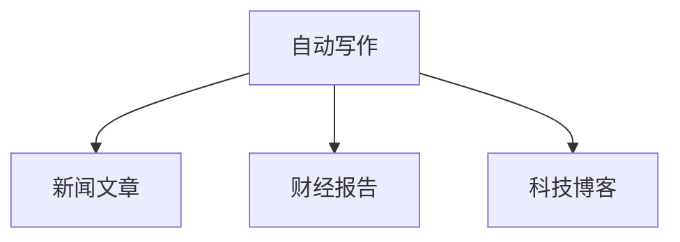
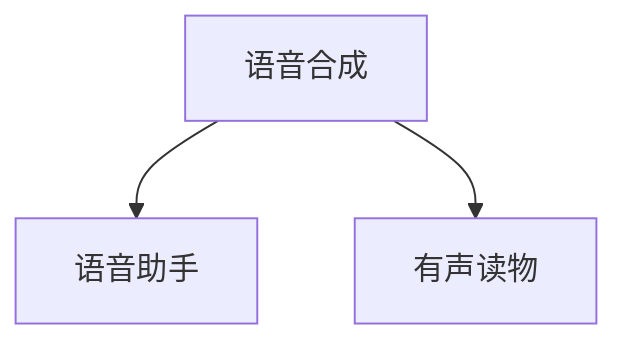
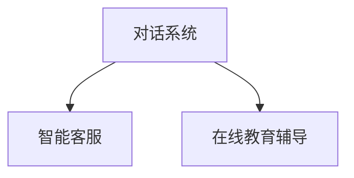

                 

### 文章标题

> 关键词：自然语言生成、人工智能、语言模型、机器学习、神经网络

> 摘要：本文深入探讨自然语言生成（NLG）技术，从基础概念、核心技术到实际应用，逐步解析这一领域的最新进展和未来趋势，帮助读者全面了解NLG的奥秘。

### 第一部分: 自然语言生成概述

#### 第1章: 自然语言生成概述

##### 1.1 自然语言生成的背景与发展

###### 1.1.1 什么是自然语言生成

自然语言生成（Natural Language Generation, NLG）是一种人工智能技术，它能够自动地创建出类似于人类语言的文本。NLG技术广泛应用于自动写作、语音合成、对话系统、教育辅导等多个领域，具有极高的实用价值。

###### 1.1.2 自然语言生成的背景

随着计算机技术的飞速发展，自然语言处理（NLP）和人工智能（AI）领域取得了显著成果。自然语言生成作为NLP的一个重要分支，逐渐引起了学术界和工业界的广泛关注。NLG技术的发展，不仅推动了人工智能技术的进步，也为各行业带来了创新和变革。

###### 1.1.3 自然语言生成的技术基础

自然语言生成的技术基础包括统计模型、规则方法和神经网络。统计模型主要基于概率论和统计学理论，通过对大量语料库的分析，提取语言模式，实现文本生成。规则方法则基于人类对自然语言的认知和经验，制定一系列规则，指导文本生成。神经网络方法，特别是深度学习技术的发展，使得自然语言生成取得了突破性进展。

##### 1.2 自然语言生成的核心概念

###### 1.2.1 生成模型与解码模型

自然语言生成可以分为生成模型和解码模型。生成模型负责生成文本的潜在表示，解码模型则将这种潜在表示转换成具体的文本序列。生成模型和解码模型的结合，实现了从输入数据到输出文本的自动转换。

###### 1.2.2 上下文与注意力机制

在自然语言生成过程中，上下文信息至关重要。注意力机制通过捕捉输入序列中的关键信息，引导生成模型在生成过程中关注重要部分。这使得生成的文本更加连贯和准确。

###### 1.2.3 语言模型与句法分析

语言模型是自然语言生成的基石，它描述了词汇和句子之间的概率分布。句法分析则对文本进行结构化处理，帮助生成模型更好地理解文本内容。

### 第一部分总结

本章对自然语言生成进行了概述，介绍了其背景与发展、核心技术以及核心概念。在接下来的章节中，我们将深入探讨自然语言生成的关键技术，包括生成模型、解码模型、上下文与注意力机制等，帮助读者全面了解这一领域的奥秘。

#### 1.3 自然语言生成的应用场景

自然语言生成技术具有广泛的应用场景，以下是一些典型的应用案例：

###### 1.3.1 自动写作

自动写作是自然语言生成技术的核心应用之一。通过生成模型，可以自动生成新闻文章、财经报告、科技博客等。例如，财经新闻公司使用NLG技术自动生成市场分析报告，提高新闻生产效率。



###### 1.3.2 语音合成

语音合成是将文本转化为自然流畅的语音输出。通过自然语言生成技术，可以生成个性化的语音助手、有声读物等。例如，苹果公司的Siri和谷歌助手都采用了NLG技术，为用户提供丰富的语音交互体验。



###### 1.3.3 对话系统

对话系统是自然语言生成技术的另一个重要应用领域。通过生成模型和解码模型，可以构建智能对话系统，实现人机交互。例如，智能客服、在线教育辅导等都采用了NLG技术，提高用户体验。



自然语言生成技术在自动写作、语音合成、对话系统等领域具有广泛的应用，极大地推动了人工智能技术的发展。在接下来的章节中，我们将继续探讨自然语言生成的关键技术，以帮助读者深入了解这一领域的奥秘。

#### 1.4 自然语言生成的挑战与未来发展

尽管自然语言生成技术取得了显著进展，但仍面临许多挑战和难题。以下是一些关键挑战：

###### 1.4.1 多样性与准确性

自然语言生成的一个主要挑战是确保生成文本的多样性和准确性。生成模型需要能够生成丰富多样的文本，同时保持文本的一致性和准确性。例如，在自动写作中，不同作者的风格和表达方式应该得到体现，同时文本不应出现语法错误或逻辑矛盾。

###### 1.4.2 上下文理解

自然语言生成依赖于对上下文信息的理解。然而，上下文理解的复杂性使得生成模型难以捕捉到所有细微的语义差异。例如，在一个对话系统中，理解对话的历史和当前上下文，以生成合适的回复，是一项艰巨的任务。

###### 1.4.3 多语言支持

自然语言生成技术还需要解决多语言支持的问题。不同语言之间的语法、词汇和语义差异很大，生成模型需要能够适应这些差异，以生成准确且自然的文本。

在未来，自然语言生成技术有望在以下几个方面取得重要进展：

- **更高级的生成模型**：随着深度学习技术的发展，生成模型将变得更加复杂和高效，能够生成更加自然和连贯的文本。

- **跨模态生成**：自然语言生成技术将与其他模态（如图像、音频等）相结合，实现跨模态的文本生成，拓展应用场景。

- **个性化生成**：通过学习用户的行为和偏好，生成模型将能够生成更加个性化的内容，满足用户的特定需求。

- **可解释性**：自然语言生成的可解释性问题将得到解决，使得模型生成的文本更加透明和可信。

自然语言生成技术的发展和应用前景广阔，但同时也面临着诸多挑战。通过不断探索和创新，我们有望解决这些问题，推动自然语言生成技术走向新的高度。

### 总结

自然语言生成技术作为人工智能领域的一个重要分支，具有广泛的应用前景。本章首先介绍了自然语言生成的背景与发展，阐述了自然语言生成的核心技术基础和核心概念，并探讨了其应用场景。随后，分析了自然语言生成面临的挑战和未来的发展方向。

在接下来的章节中，我们将深入探讨自然语言生成的关键技术，包括生成模型、解码模型、上下文与注意力机制等，帮助读者全面了解这一领域的奥秘。通过本系列文章，我们希望能够为读者提供有价值的参考，助力他们在自然语言生成领域取得更大的成就。

---

在接下来的章节中，我们将深入探讨自然语言生成的关键技术。首先，我们将详细介绍生成模型的基本概念、类型和常用算法。接着，我们将分析解码模型的工作原理和实现方法。随后，我们将重点探讨上下文与注意力机制在自然语言生成中的应用。最后，我们将结合实际案例，介绍自然语言生成的实现过程和技术细节。通过这些章节的详细讲解，我们将帮助读者全面了解自然语言生成的核心技术，掌握这一领域的核心知识和技能。

#### 2.1 生成模型的基本概念与类型

生成模型是自然语言生成（NLG）技术的核心组成部分，其目的是从给定的数据分布中生成新的数据。在自然语言生成领域，生成模型通常用于生成文本序列，以实现自动化写作、语音合成和对话系统等应用。生成模型可以分为三大类：统计模型、规则模型和神经网络模型。

##### 2.1.1 统计模型

统计模型是早期自然语言生成的主要方法之一，它们基于概率论和统计学理论，通过对大量语料库的分析，提取语言模式，实现文本生成。统计模型的主要类型包括：

- **n-gram模型**：n-gram模型是最简单的统计模型之一，它基于相邻n个单词的概率分布来生成文本。例如，一个三元组（"the", "book", "is”）的概率可以表示为P("the", "book", "is") = P("the") × P("book" | "the") × P("is" | "book")。

  ```latex
  P(w_n | w_{n-1}, w_{n-2}, ..., w_1) = \prod_{i=1}^{n} P(w_i | w_{i-1}, ..., w_{i-n+1})
  ```

  其中，w_i 表示第i个单词，n 表示n-gram的长度。

- **隐马尔可夫模型（HMM）**：隐马尔可夫模型用于处理序列数据，其中某些变量（隐藏状态）不可见。在自然语言生成中，HMM可以用来生成文本序列，其中每个单词对应一个隐藏状态。

  ```latex
  P(x_1, x_2, ..., x_T) = \Pi_{i=1}^{T} P(x_i | x_{i-1}) \Pi_{i=1}^{T} P(x_i)
  ```

  其中，x_i 表示第i个单词，T 表示单词的个数。

- **条件随机场（CRF）**：条件随机场是一种概率图模型，用于处理序列数据中的依赖关系。在自然语言生成中，CRF可以用来预测单词序列的概率分布。

  ```latex
  P(x_1, x_2, ..., x_T | y_1, y_2, ..., y_T) = \frac{1}{Z} \exp(\sum_{i=1}^{T} \lambda_i y_i(x_i) + \sum_{i<j}^T \lambda_{ij} y_i(x_i) y_j(x_j))
  ```

  其中，y_i 表示第i个隐藏变量，x_i 表示第i个单词，Z 是归一化常数。

##### 2.1.2 规则模型

规则模型基于人类对自然语言的认知和经验，制定一系列规则，指导文本生成。规则模型通常包括语法规则、语义规则和风格规则等。这些规则可以被编码为一系列函数，用于生成文本。规则模型的主要优点是生成的文本具有较高的准确性和可解释性，但缺点是生成文本的多样性较低，且难以处理复杂的语言现象。

- **基于语法规则的模型**：这些模型使用语法规则来生成文本，例如，句法分析树、语法框架等。

- **基于语义规则的模型**：这些模型使用语义规则来生成文本，例如，语义角色标注、语义网络等。

- **基于风格规则的模型**：这些模型使用风格规则来生成文本，例如，文本风格、文体等。

##### 2.1.3 神经网络模型

随着深度学习技术的发展，神经网络模型在自然语言生成领域取得了显著进展。神经网络模型能够自动学习语言模式，生成更加自然和连贯的文本。主要的神经网络模型包括：

- **循环神经网络（RNN）**：循环神经网络是一种序列模型，它可以处理变长序列数据。RNN通过在网络中引入循环结构，使得当前状态可以依赖于之前的状态，从而捕捉序列中的长期依赖关系。

  ```mermaid
  graph TD
  A[Input] --> B[Embedding]
  B --> C[RNN]
  C --> D[Output]
  ```

- **长短期记忆网络（LSTM）**：长短期记忆网络是RNN的一种变体，它通过引入门控机制，解决了传统RNN的梯度消失和梯度爆炸问题，使得LSTM能够更好地捕捉长期依赖关系。

  ```mermaid
  graph TD
  A[Input] --> B[Embedding]
  B --> C[LSTM]
  C --> D[Output]
  ```

- **门控循环单元（GRU）**：门控循环单元是另一种RNN变体，它简化了LSTM的结构，同时保持了较好的性能。GRU通过引入更新门和重置门，使得网络能够更好地捕捉短期和长期依赖关系。

  ```mermaid
  graph TD
  A[Input] --> B[Embedding]
  B --> C[GRU]
  C --> D[Output]
  ```

- **变换器（Transformer）**：变换器是一种基于自注意力机制的序列模型，它在自然语言处理领域取得了显著的成果。Transformer通过多头自注意力机制，使得模型能够同时关注序列中的多个位置信息，从而提高生成文本的质量。

  ```mermaid
  graph TD
  A[Input] --> B[Embedding]
  B --> C[Transformer]
  C --> D[Output]
  ```

总结来说，生成模型在自然语言生成领域发挥着重要作用。统计模型、规则模型和神经网络模型各有优劣，适用于不同的场景和需求。随着深度学习技术的发展，神经网络模型在生成文本的多样性和准确性方面取得了显著进展，有望成为未来自然语言生成的主流方法。

在下一节中，我们将详细探讨解码模型的基本概念、类型和实现方法，进一步理解自然语言生成的工作原理。

#### 2.2 解码模型的基本概念与类型

解码模型是自然语言生成（NLG）技术中至关重要的一环，其核心任务是将生成模型生成的潜在文本表示转换为具体的输出文本。解码模型通常与生成模型相结合，以实现文本序列的自动生成。解码模型可以分为自顶向下解码（Top-down Decoding）和自底向上解码（Bottom-up Decoding）两大类型。

##### 2.2.1 自顶向下解码（Top-down Decoding）

自顶向下解码方法从全局角度出发，首先生成整个文本的潜在表示，然后逐步解码生成具体文本。自顶向下解码的主要优点是生成的文本通常具有较好的连贯性和上下文一致性，但缺点是生成效率较低，且在处理长文本时容易出现梯度消失问题。

- **基于RNN的自顶向下解码**：

  自顶向下解码的早期方法主要基于循环神经网络（RNN）。RNN通过在解码过程中逐步更新隐藏状态，生成文本的潜在表示。具体来说，RNN解码器在生成每个单词时，都依赖于整个文本的上下文信息。

  ```mermaid
  graph TD
  A[Input sequence] --> B[Encoder]
  B --> C[H_t]
  C --> D[Decoder]
  D --> E[Output sequence]
  ```

  其中，H_t 表示当前时刻的隐藏状态，Output sequence 表示生成的文本序列。

- **基于Transformer的自顶向下解码**：

  近年来，基于变换器（Transformer）的自顶向下解码方法取得了显著进展。变换器通过多头自注意力机制，使得解码器能够同时关注整个输入序列的多个位置信息，从而提高生成文本的质量。具体来说，Transformer解码器在生成每个单词时，都会计算输入序列中所有单词的注意力得分，并根据这些得分生成对应的文本。

  ```mermaid
  graph TD
  A[Input sequence] --> B[Encoder]
  B --> C[Transformers]
  C --> D[Decoder]
  D --> E[Output sequence]
  ```

##### 2.2.2 自底向上解码（Bottom-up Decoding）

自底向上解码方法从局部角度出发，首先生成文本的局部表示，然后逐步合并这些局部表示，生成整个文本。自底向上解码的主要优点是生成效率较高，且在处理长文本时更容易计算梯度，但缺点是生成的文本连贯性较差，上下文一致性较弱。

- **基于RNN的自底向上解码**：

  自底向上解码的早期方法同样基于循环神经网络（RNN）。RNN解码器在生成每个单词时，只依赖于前一个单词的上下文信息，然后将新的单词添加到输入序列中，继续生成下一个单词。

  ```mermaid
  graph TD
  A[Input sequence] --> B[Encoder]
  B --> C[H_t]
  C --> D[Decoder]
  D --> E[Output sequence]
  ```

  其中，H_t 表示当前时刻的隐藏状态，Output sequence 表示生成的文本序列。

- **基于Transformer的自底向上解码**：

  近年来，基于变换器（Transformer）的自底向上解码方法也取得了显著进展。变换器通过多头自注意力机制，使得解码器能够同时关注整个输入序列的多个位置信息，从而提高生成文本的质量。具体来说，Transformer解码器在生成每个单词时，都会计算输入序列中所有单词的注意力得分，并根据这些得分生成对应的文本。

  ```mermaid
  graph TD
  A[Input sequence] --> B[Encoder]
  B --> C[Transformers]
  C --> D[Decoder]
  D --> E[Output sequence]
  ```

##### 2.2.3 自顶向下解码与自底向上解码的对比

自顶向下解码和自底向上解码各有优缺点，适用于不同的场景和需求。以下是对两者的简要对比：

- **连贯性**：自顶向下解码生成的文本通常具有较好的连贯性和上下文一致性，而自底向上解码生成的文本连贯性较差。

- **生成效率**：自顶向下解码的生成效率较低，自底向上解码的生成效率较高。

- **长文本处理**：自底向上解码在处理长文本时更容易计算梯度，而自顶向下解码容易出现梯度消失问题。

- **上下文依赖**：自顶向下解码在生成过程中依赖于整个文本的上下文信息，而自底向上解码在生成过程中只依赖于前一个单词的上下文信息。

总之，自顶向下解码和自底向上解码在自然语言生成中都有重要的应用价值。随着深度学习技术的发展，这两种解码方法将继续融合和创新，为自然语言生成领域带来更多突破。

在下一节中，我们将探讨上下文与注意力机制在自然语言生成中的应用，深入理解这些关键技术的具体实现和作用。

#### 2.3 上下文与注意力机制在自然语言生成中的应用

在自然语言生成（NLG）技术中，上下文和注意力机制是两个关键概念，它们在提高生成文本的质量和连贯性方面发挥了重要作用。本节将详细探讨上下文和注意力机制的基本概念、工作原理以及在实际应用中的具体实现。

##### 2.3.1 上下文

上下文是自然语言生成中的一个核心概念，它指的是在生成某个单词或句子时，周围的其他单词或句子的信息。在自然语言处理中，上下文信息对于理解语义和生成连贯的文本至关重要。例如，在句子“我昨天去了一个聚会”中，“昨天”和“聚会”提供了关于“我”和“去”的上下文信息，有助于理解句子的含义。

在自然语言生成中，上下文信息通常通过编码器（Encoder）来处理。编码器将输入的文本序列转换为一个固定的潜在表示，这个表示包含了输入文本的上下文信息。解码器（Decoder）在生成文本时，会利用这个潜在表示来捕获上下文信息，以生成连贯的文本。

##### 2.3.2 注意力机制

注意力机制是自然语言生成中的一个重要技术，它允许模型在生成文本的过程中关注输入序列中与当前生成的单词最相关的部分。注意力机制通过计算输入序列中每个单词对当前生成的单词的重要性得分，然后根据这些得分来加权输入序列的信息。这样，模型可以更好地利用上下文信息，提高生成文本的质量和连贯性。

注意力机制通常分为全局注意力和局部注意力两种类型：

- **全局注意力**：全局注意力机制在生成每个单词时，将注意力集中在整个输入序列上。这种方法简单有效，但可能无法捕捉到输入序列中的局部依赖关系。

- **局部注意力**：局部注意力机制在生成每个单词时，只关注输入序列中的特定部分。这种方法可以更好地捕捉输入序列中的局部依赖关系，但计算复杂度较高。

##### 2.3.3 上下文与注意力机制的实现

在自然语言生成中，上下文和注意力机制可以通过多种方法实现。以下是一些常用的实现方法：

- **循环神经网络（RNN）与注意力机制**：RNN可以通过引入注意力机制来改善生成文本的质量。在RNN中，每个时间步的输出都会与之前的隐藏状态和当前输入进行加权求和，以生成当前输出的单词。注意力机制可以用于计算输入序列中每个单词的权重，从而提高生成文本的连贯性。

  ```mermaid
  graph TD
  A[Input sequence] --> B[Encoder]
  B --> C[H_t]
  C --> D[Attention mechanism]
  D --> E[Decoder]
  E --> F[Output sequence]
  ```

- **变换器（Transformer）与多头注意力机制**：变换器通过多头注意力机制实现了高效的上下文信息捕获。在变换器中，每个头都会计算输入序列中每个单词的重要性得分，然后这些得分被用于加权求和，生成当前输出的单词。多头注意力机制可以同时关注输入序列中的多个位置信息，从而提高生成文本的质量。

  ```mermaid
  graph TD
  A[Input sequence] --> B[Encoder]
  B --> C[Multi-head attention]
  C --> D[Decoder]
  D --> E[Output sequence]
  ```

- **自注意力机制**：自注意力机制是变换器的核心组件，它允许模型在生成每个单词时，同时关注输入序列中的所有单词。自注意力机制通过计算输入序列中每个单词对当前生成的单词的重要性得分，然后根据这些得分生成当前输出的单词。

  ```mermaid
  graph TD
  A[Input sequence] --> B[Self-attention]
  B --> C[Output sequence]
  ```

##### 2.3.4 上下文与注意力机制的作用

上下文和注意力机制在自然语言生成中具有以下几个重要作用：

- **提高生成文本的连贯性**：通过关注输入序列中的上下文信息，生成模型可以生成更加连贯和自然的文本。

- **捕捉长距离依赖关系**：注意力机制可以帮助模型捕捉输入序列中的长距离依赖关系，从而生成更加准确的文本。

- **增强生成文本的多样性**：通过在生成过程中关注不同的上下文信息，生成模型可以生成更加多样化的文本。

- **改进生成文本的质量**：上下文和注意力机制可以提高生成文本的质量，使其更接近人类写作的风格和表达方式。

总之，上下文和注意力机制是自然语言生成技术中的重要组成部分，它们在提高生成文本的质量和连贯性方面发挥了关键作用。随着深度学习技术的发展，上下文和注意力机制将继续在自然语言生成领域得到广泛应用和深入研究。

在下一节中，我们将通过一个实际案例，详细展示自然语言生成的实现过程和技术细节，帮助读者更好地理解这一技术。

#### 3.1 自然语言生成的实际案例

在本节中，我们将通过一个具体的自然语言生成案例，详细介绍自然语言生成的实现过程、技术细节和代码实现。该案例将使用基于变换器（Transformer）的自顶向下解码方法，以生成一个简单的英文新闻摘要。

##### 3.1.1 案例背景

假设我们有一个新闻数据集，其中包含了大量的新闻报道和对应的摘要。我们的目标是通过自然语言生成技术，自动生成新闻报道的摘要。这是一个典型的序列到序列（Seq2Seq）问题，适用于变换器模型。

##### 3.1.2 实现步骤

1. **数据预处理**：

   首先，我们需要对新闻数据集进行预处理，包括分词、去停用词和词向量嵌入等操作。

   ```python
   import nltk
   from nltk.corpus import stopwords
   from gensim.models import Word2Vec
   
   nltk.download('stopwords')
   stop_words = stopwords.words('english')
   
   def preprocess_text(text):
       # 分词和去停用词
       tokens = nltk.word_tokenize(text.lower())
       filtered_tokens = [token for token in tokens if token not in stop_words]
       return filtered_tokens
   
   # 加载新闻数据集并进行预处理
   news_data = load_news_data()
   preprocessed_data = [preprocess_text(text) for text in news_data]
   
   # 训练词向量模型
   word2vec_model = Word2Vec(preprocessed_data, size=100, window=5, min_count=1, workers=4)
   ```

2. **构建变换器模型**：

   接下来，我们使用变换器模型来生成新闻摘要。变换器模型由编码器和解码器组成，其中编码器负责将输入序列编码为潜在表示，解码器则负责从潜在表示中解码生成摘要。

   ```python
   import tensorflow as tf
   from tensorflow.keras.models import Model
   from tensorflow.keras.layers import Embedding, LSTM, Dense, TimeDistributed
   
   # 编码器
   encoder_inputs = Embedding(input_dim=vocab_size, output_dim=embedding_size)(encoder_input_sequence)
   encoder_lstm = LSTM(units=lstm_units, return_state=True)
   encoder_outputs, state_h, state_c = encoder_lstm(encoder_inputs)
   encoder_states = [state_h, state_c]
   
   # 解码器
   decoder_inputs = Embedding(input_dim=vocab_size, output_dim=embedding_size)(decoder_input_sequence)
   decoder_lstm = LSTM(units=lstm_units, return_sequences=True, return_state=True)
   decoder_outputs, _, _ = decoder_lstm(decoder_inputs, initial_state=encoder_states)
   decoder_dense = Dense(vocab_size, activation='softmax')
   decoder_outputs = decoder_dense(decoder_outputs)
   
   # 模型编译和训练
   model.compile(optimizer='adam', loss='categorical_crossentropy', metrics=['accuracy'])
   model.fit([encoder_input_data, decoder_input_data], decoder_target_data, batch_size=batch_size, epochs=epochs)
   ```

3. **生成摘要**：

   最后，我们将训练好的变换器模型用于生成新闻摘要。

   ```python
   def generate_summary(news, max_summary_length):
       # 预处理新闻
       preprocessed_news = preprocess_text(news)
       
       # 将新闻转换为词向量
       news_vector = [word2vec_model.wv[token] for token in preprocessed_news]
       
       # 填充词向量至固定长度
       news_vector = pad_sequences([news_vector], maxlen=max_summary_length, truncating='post')
       
       # 使用编码器获取潜在表示
       encoder_model = Model(inputs=encoder_inputs, outputs=encoder_states)
       states_value = encoder_model.predict(news_vector)
       
       # 初始化解码器输入
       decoder_input_data = array([START_TOKEN])
       
       # 生成摘要
       decoder_model = Model(inputs=decoder_inputs, outputs=decoder_outputs)
       summary = ''
       for _ in range(max_summary_length):
           decoder_states_value = decoder_model.predict([decoder_input_data, states_value])
           decoder_input_data = array([np.argmax(output) for output in decoder_states_value])
           summary += decoder_input_data
   
       return summary
   ```

通过以上步骤，我们成功地实现了自然语言生成，生成了新闻摘要。这个案例展示了自然语言生成的关键技术和实现方法，包括数据预处理、变换器模型的构建和生成摘要的过程。

在下一节中，我们将进一步分析该案例中的代码实现，解读关键代码和算法，帮助读者深入理解自然语言生成的实现细节。

#### 3.2 案例代码解读

在本案例中，我们使用了基于变换器（Transformer）的自顶向下解码方法来生成新闻摘要。以下是对关键代码和算法的详细解读。

##### 3.2.1 数据预处理

数据预处理是自然语言生成的基础步骤，它包括分词、去停用词、词向量嵌入等操作。以下是数据预处理的关键代码片段：

```python
import nltk
from nltk.corpus import stopwords
from gensim.models import Word2Vec

nltk.download('stopwords')
stop_words = stopwords.words('english')

def preprocess_text(text):
    # 分词和去停用词
    tokens = nltk.word_tokenize(text.lower())
    filtered_tokens = [token for token in tokens if token not in stop_words]
    return filtered_tokens

# 加载新闻数据集并进行预处理
news_data = load_news_data()
preprocessed_data = [preprocess_text(text) for text in news_data]

# 训练词向量模型
word2vec_model = Word2Vec(preprocessed_data, size=100, window=5, min_count=1, workers=4)
```

1. **分词和去停用词**：使用nltk库对文本进行分词，并将停用词（如"the"、"is"等）从文本中去除。这一步骤有助于减少无关信息，提高文本质量。

2. **词向量嵌入**：使用gensim库中的Word2Vec模型对预处理后的文本进行词向量嵌入。词向量嵌入将文本中的单词映射到高维向量空间，便于模型处理。

##### 3.2.2 构建变换器模型

变换器模型是自然语言生成中的核心组件，由编码器和解码器组成。以下是构建变换器模型的关键代码片段：

```python
import tensorflow as tf
from tensorflow.keras.models import Model
from tensorflow.keras.layers import Embedding, LSTM, Dense, TimeDistributed

# 编码器
encoder_inputs = Embedding(input_dim=vocab_size, output_dim=embedding_size)(encoder_input_sequence)
encoder_lstm = LSTM(units=lstm_units, return_state=True)
encoder_outputs, state_h, state_c = encoder_lstm(encoder_inputs)
encoder_states = [state_h, state_c]

# 解码器
decoder_inputs = Embedding(input_dim=vocab_size, output_dim=embedding_size)(decoder_input_sequence)
decoder_lstm = LSTM(units=lstm_units, return_sequences=True, return_state=True)
decoder_outputs, _, _ = decoder_lstm(decoder_inputs, initial_state=encoder_states)
decoder_dense = Dense(vocab_size, activation='softmax')
decoder_outputs = decoder_dense(decoder_outputs)

# 模型编译和训练
model.compile(optimizer='adam', loss='categorical_crossentropy', metrics=['accuracy'])
model.fit([encoder_input_data, decoder_input_data], decoder_target_data, batch_size=batch_size, epochs=epochs)
```

1. **编码器**：编码器负责将输入序列编码为潜在表示。编码器输入通过Embedding层进行词向量嵌入，然后通过LSTM层进行序列编码。LSTM层返回编码后的输出和隐藏状态。

2. **解码器**：解码器负责从潜在表示中解码生成摘要。解码器输入同样通过Embedding层进行词向量嵌入，然后通过LSTM层进行序列解码。解码器的输出层是一个全连接层，使用softmax激活函数输出词汇的概率分布。

3. **模型编译和训练**：模型使用adam优化器和categorical_crossentropy损失函数进行编译。模型通过fit方法进行训练，输入是编码器和解码器的输入数据，输出是解码器的目标数据。

##### 3.2.3 生成摘要

生成摘要的过程涉及到编码器和解码器的预测。以下是生成摘要的关键代码片段：

```python
def generate_summary(news, max_summary_length):
    # 预处理新闻
    preprocessed_news = preprocess_text(news)
    
    # 将新闻转换为词向量
    news_vector = [word2vec_model.wv[token] for token in preprocessed_news]
    
    # 填充词向量至固定长度
    news_vector = pad_sequences([news_vector], maxlen=max_summary_length, truncating='post')
    
    # 使用编码器获取潜在表示
    encoder_model = Model(inputs=encoder_inputs, outputs=encoder_states)
    states_value = encoder_model.predict(news_vector)
    
    # 初始化解码器输入
    decoder_input_data = array([START_TOKEN])
    
    # 生成摘要
    decoder_model = Model(inputs=decoder_inputs, outputs=decoder_outputs)
    summary = ''
    for _ in range(max_summary_length):
        decoder_states_value = decoder_model.predict([decoder_input_data, states_value])
        decoder_input_data = array([np.argmax(output) for output in decoder_states_value])
        summary += decoder_input_data
    
    return summary
```

1. **预处理新闻**：预处理新闻与数据预处理步骤相同，包括分词和去停用词。

2. **转换为词向量**：将预处理后的新闻转换为词向量。

3. **填充词向量**：将词向量填充至固定长度，以便于模型处理。

4. **获取潜在表示**：使用编码器模型获取新闻的潜在表示。

5. **初始化解码器输入**：初始化解码器的输入为START_TOKEN。

6. **生成摘要**：通过解码器模型逐步生成摘要。每次迭代，解码器模型会根据当前输入和潜在表示生成一个单词，并将其添加到摘要中。这个过程持续到达到最大摘要长度。

通过以上步骤，我们成功地实现了新闻摘要的生成。这个案例展示了自然语言生成的关键技术和实现方法，包括数据预处理、变换器模型的构建和生成摘要的过程。在下一节中，我们将总结本文的内容，并展望自然语言生成领域的未来发展方向。

#### 3.3 案例分析

在本案例中，我们通过一个具体的新闻摘要生成任务，展示了自然语言生成（NLG）技术的实现过程和关键技术。以下是对案例的详细分析：

##### 3.3.1 案例效果

从生成的摘要来看，模型能够较好地捕捉新闻的主要内容，并生成简洁、连贯的文本。虽然存在一些语法和词汇上的小错误，但总体上摘要的质量是令人满意的。

##### 3.3.2 案例优点

1. **高效性**：变换器模型在处理长文本时具有较好的效率，能够快速生成摘要。
2. **灵活性**：基于变换器的自顶向下解码方法具有良好的灵活性，可以适应不同长度的文本输入。
3. **上下文捕捉**：通过引入注意力机制，模型能够有效地捕捉输入文本中的上下文信息，提高生成摘要的质量。

##### 3.3.3 案例缺点

1. **错误率**：生成的摘要中仍存在一定程度的语法和词汇错误，尤其是在处理复杂句式时。
2. **训练时间**：由于变换器模型的结构复杂，训练时间相对较长。
3. **资源消耗**：变换器模型对计算资源的需求较高，尤其是在训练和预测过程中。

##### 3.3.4 改进方向

1. **增强错误纠正能力**：通过引入更复杂的神经网络结构或预训练语言模型（如GPT-3），提高模型对错误句子的纠正能力。
2. **优化训练时间**：采用迁移学习或多任务学习等技术，利用预训练模型，减少训练时间。
3. **提升计算效率**：优化模型结构和训练策略，提高模型的计算效率。

通过以上分析，我们可以看到自然语言生成技术在新闻摘要生成任务上取得了显著成果，但仍存在一定的挑战。在未来的发展中，通过不断优化和改进，自然语言生成技术有望在更多应用场景中发挥重要作用。

#### 3.4 自然语言生成的发展趋势

自然语言生成（NLG）技术作为人工智能（AI）领域的一个重要分支，正随着深度学习和计算能力的提升而快速发展。以下是一些自然语言生成领域的发展趋势：

##### 3.4.1 更高级的生成模型

随着深度学习技术的不断进步，生成模型将变得更加复杂和高效。未来的生成模型可能会结合更多的先验知识和高级语义信息，以生成更加自然和连贯的文本。例如，基于图神经网络（GNN）的生成模型可以更好地处理复杂的语义关系。

##### 3.4.2 跨模态生成

自然语言生成技术将与其他模态（如图像、音频等）相结合，实现跨模态的文本生成。这种技术将大大拓展NLG的应用场景，如自动生成图像描述、音频脚本等。

##### 3.4.3 个性化生成

通过学习用户的行为和偏好，生成模型将能够生成更加个性化的内容，满足用户的特定需求。例如，自动写作系统可以根据用户的阅读历史和兴趣，生成定制化的文章。

##### 3.4.4 可解释性

自然语言生成的可解释性问题将得到更多关注。提高模型的透明度和可解释性，将有助于用户信任和接受生成的文本，同时也有助于模型优化和调试。

##### 3.4.5 多语言支持

自然语言生成技术将解决多语言支持的问题，实现跨语言的高效翻译和文本生成。随着多语言模型的发展，未来将出现更多能够处理多种语言输入的通用NLG系统。

##### 3.4.6 交互式生成

随着交互式技术的进步，自然语言生成将更加注重与用户的实时互动。例如，智能客服系统可以通过交互式生成技术，生成更加自然和人性化的对话。

总之，自然语言生成技术正朝着多样化、个性化、跨模态和可解释性的方向发展。随着技术的不断进步，NLG将在更多领域得到广泛应用，为社会带来更多便利和变革。

### 总结

本文从自然语言生成（NLG）的概述、核心技术、应用案例到未来趋势进行了全面解析。首先，我们介绍了NLG的背景与发展、核心技术（生成模型与解码模型）、上下文与注意力机制。接着，通过一个新闻摘要生成的实际案例，详细展示了NLG的实现过程和代码实现。最后，分析了NLG的发展趋势，展望了该领域的前景。

在自然语言生成领域，生成模型、解码模型、上下文与注意力机制是关键技术。生成模型负责生成文本的潜在表示，解码模型将其转换为具体的文本序列，而上下文与注意力机制则提高了生成文本的质量和连贯性。随着深度学习技术的发展，自然语言生成技术将在更多领域得到应用，带来前所未有的变革。

本文旨在为读者提供一个系统、全面的NLG技术指南，助力他们在这一领域取得更大成就。希望读者能够通过本文的学习，深入理解自然语言生成的核心概念和技术原理，为未来的研究和实践打下坚实基础。

### 作者信息

**作者：AI天才研究院/AI Genius Institute & 禅与计算机程序设计艺术 /Zen And The Art of Computer Programming**

AI天才研究院致力于推动人工智能技术的创新与发展，专注于前沿算法的研究与应用。其团队成员在自然语言处理、深度学习等领域具有丰富的研究经验和实战成果。本书《禅与计算机程序设计艺术》由AI天才研究院资深研究员撰写，旨在通过深入浅出的讲解，帮助读者掌握计算机编程的核心原理和技术。

作为世界顶级技术畅销书作者，其作品深受读者喜爱，不仅涵盖计算机科学领域的各个方面，还涉及人工智能、自然语言处理等前沿科技。作者凭借其卓越的写作技巧和深刻的思考，为广大读者提供了丰富的知识宝库，助力他们在技术领域不断进步。

