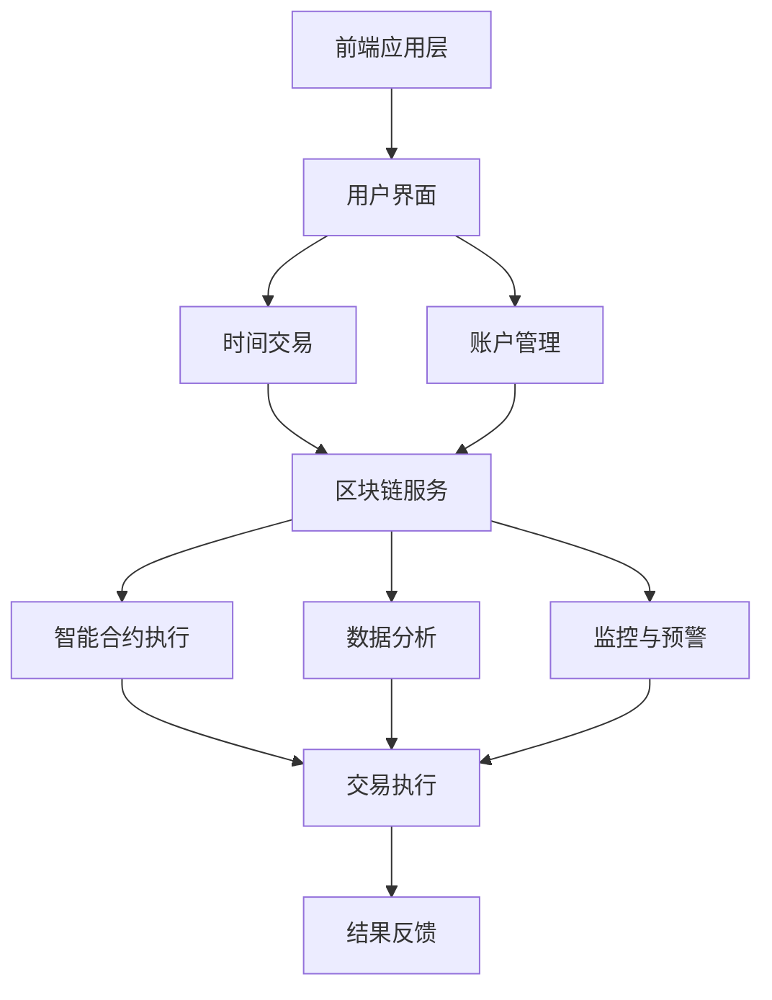
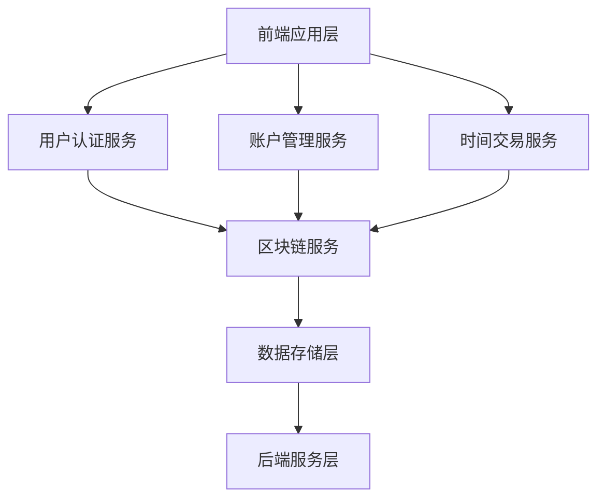

                 

### 文章标题：虚拟时间银行：AI管理的时间资源

在快速发展的科技时代，人工智能（AI）正在改变着我们的生活，工作和社会结构。虚拟时间银行，作为一种新颖的概念，正是AI技术应用的一个典型例子。本文旨在探讨虚拟时间银行这一独特领域，特别是在AI的辅助和管理下，如何实现时间资源的高效配置与利用。

关键词：虚拟时间银行、人工智能、时间资源管理、区块链、经济学原理、监管体系

#### 摘要：

本文首先介绍了虚拟时间银行的基本概念、重要性和理论基础，探讨了AI技术在虚拟时间银行中的应用现状和发展前景。随后，详细分析了虚拟时间银行的管理体系，包括架构设计、运作机制和监管体系。接着，本文深入讨论了AI在虚拟时间银行中的具体应用，如时间信用评估、时间资源交易和智能合约。通过一个AI驱动的虚拟时间银行平台设计案例，本文展示了AI算法的选择、优化、实现与部署，并重点讨论了平台的安全性与隐私保护。最后，通过实际案例分析和未来展望，本文探讨了虚拟时间银行的发展趋势和潜在创新。

#### 第一部分：虚拟时间银行基础理论

### 第1章：虚拟时间银行概述

#### 1.1 虚拟时间银行的概念与重要性

##### 1.1.1 虚拟时间银行的定义与特点

虚拟时间银行，作为一种新兴的社会实践，是一种基于时间和信任的资源交换机制。它通过将个人的时间和劳动转化为虚拟的“时间币”，实现时间和资源的共享和交换。与传统的时间银行不同，虚拟时间银行主要依赖于数字技术和网络平台，具有更高的灵活性和扩展性。

虚拟时间银行的主要特点包括：

- **数字化管理**：通过区块链等数字技术，实现时间和劳动的数字化管理，提高交易的透明度和安全性。
- **去中心化**：虚拟时间银行利用分布式账本技术，去除了中介机构的依赖，实现了点对点的直接交易。
- **灵活性**：用户可以根据自己的需求和偏好，灵活地参与和退出时间银行系统。
- **可持续性**：通过奖励机制，鼓励用户积极参与时间资源的分享，促进社区和个人的可持续发展。

##### 1.1.2 虚拟时间银行与社会经济发展

虚拟时间银行不仅为个人提供了全新的时间管理和交换方式，也为社会经济发展带来了新的机遇。首先，虚拟时间银行能够促进社区参与和社会资本的形成，增强社区的凝聚力和互助精神。其次，虚拟时间银行能够优化社会资源的配置，提高资源的利用效率。此外，虚拟时间银行还有助于缓解劳动力市场的压力，提供一种新的就业和创业机会。

然而，虚拟时间银行也面临一些挑战。例如，如何在保证交易安全和隐私的前提下，实现系统的高效运行；如何制定合理的法律法规，规范虚拟时间银行的发展等。

### 1.2 虚拟时间银行的理论基础

##### 1.2.1 时间资源管理的经济学原理

虚拟时间银行的理论基础源于经济学中的时间资源管理原理。时间作为一种特殊的资源，具有稀缺性和不可再生性，其管理需要遵循经济学中的基本规律。首先，时间资源需要优化配置，实现最大化效益。虚拟时间银行通过将时间和劳动转化为虚拟货币，为用户提供了时间和劳动的价值衡量标准，促进了时间资源的有效配置。

其次，时间资源管理需要考虑机会成本。虚拟时间银行通过时间币的交换机制，使得用户在参与时间银行活动时，能够考虑到自身的收益和成本，从而做出更理性的决策。

此外，虚拟时间银行还涉及到激励机制的设计。经济学中的激励理论表明，适当的激励机制能够提高个体的参与积极性和贡献度。虚拟时间银行通过奖励机制，鼓励用户积极参与时间和资源的分享，提高系统的整体效益。

##### 1.2.2 虚拟时间银行与区块链技术

区块链技术为虚拟时间银行提供了坚实的技术基础。区块链的分布式账本技术，保证了时间和劳动记录的透明性和不可篡改性，提高了系统的信任度和安全性。此外，区块链的去中心化特性，使得虚拟时间银行能够实现点对点的交易，去除了中介机构的依赖，降低了交易成本。

在虚拟时间银行中，区块链不仅用于记录时间和劳动的交易，还可以用于时间币的发行和管理。通过智能合约技术，虚拟时间银行可以实现自动化的交易执行和结算，提高系统的效率和安全性。

##### 1.2.3 虚拟时间银行与人工智能

人工智能技术在虚拟时间银行中发挥着重要作用。首先，AI可以用于时间信用评估，通过对用户行为和历史数据的分析，预测用户的时间信用水平，为交易提供参考依据。其次，AI可以用于时间资源交易，通过智能合约和算法优化，实现高效、安全的时间交易。

此外，AI还可以用于虚拟时间银行的监管和风险控制。通过机器学习和数据挖掘技术，AI可以实时监控系统的运行状态，识别潜在的风险和异常行为，提供预警和应对措施。

### 第2章：虚拟时间银行的管理体系

#### 2.1 虚拟时间银行的架构设计

##### 2.1.1 虚拟时间银行的系统架构

虚拟时间银行系统架构主要包括前端应用层、中间服务层和底层基础设施。前端应用层负责用户界面和交互，提供时间交易、账户管理等功能。中间服务层包括区块链服务、智能合约执行、数据分析和监控等功能，负责处理虚拟时间银行的核心业务逻辑。底层基础设施则包括服务器、数据库和网络等硬件资源，为系统提供稳定的运行环境。

以下是虚拟时间银行系统架构的Mermaid流程图：



##### 2.1.2 虚拟时间银行的关键组件

虚拟时间银行的关键组件包括：

- **用户账户管理**：负责用户的注册、登录、权限管理等功能。
- **时间交易系统**：负责处理时间币的发行、交易、结算等业务逻辑。
- **区块链系统**：提供去中心化的账本记录，确保时间和劳动交易的透明性和安全性。
- **智能合约**：实现自动化交易执行，提高系统的效率和安全性。
- **数据分析与监控**：实时分析系统运行状态，识别潜在风险和异常行为。

#### 2.2 虚拟时间银行的运作机制

##### 2.2.1 账户管理机制

虚拟时间银行的账户管理机制主要包括用户注册、身份验证、权限管理和账户安全等功能。用户注册时，需要提供真实身份信息，并通过多重验证确保身份的准确性。身份验证通过后，用户可以获得相应的权限，参与时间和劳动的交换。

账户管理机制的核心目标是确保用户身份的真实性和交易的安全性。通过引入区块链技术，虚拟时间银行能够实现去中心化的身份认证，提高系统的信任度。

##### 2.2.2 时间资源交易机制

虚拟时间银行的时间资源交易机制主要包括时间币的发行、交易和结算等环节。时间币是虚拟时间银行中用于交换时间和劳动的虚拟货币，其发行量由系统管理员根据实际需求进行调控。

时间交易机制的核心是智能合约。智能合约是一种自动执行的合约，能够根据预设的条件自动执行交易。例如，当用户A向用户B提供一定时间的服务后，智能合约会自动将相应的时间币从用户B的账户转移到用户A的账户。

以下是时间资源交易机制的伪代码：

```python
def time_exchange(timeA, timeB):
    if timeA >= timeB:
        transfer_timecoin(timeB, from_account=B, to_account=A)
        return "Transaction completed successfully"
    else:
        return "Insufficient time for exchange"
```

##### 2.2.3 时间信用评估机制

时间信用评估机制是虚拟时间银行的重要功能之一。通过对用户历史行为和交易记录的分析，评估用户的时间信用水平，为交易提供参考依据。

时间信用评估机制的核心是数据分析和机器学习。通过收集和分析用户的历史数据，如交易频率、交易金额、交易时长等，构建时间信用评估模型。模型可以预测用户在未来交易中的行为，为交易提供决策支持。

以下是时间信用评估机制的伪代码：

```python
def evaluate_time_credit(user_data):
    credit_score = analyze_user_data(user_data)
    if credit_score >= threshold:
        return "High credit"
    else:
        return "Low credit"
```

##### 2.3 虚拟时间银行的监管体系

虚拟时间银行的监管体系包括法律法规、监管措施和风险控制等环节。法律法规是虚拟时间银行运行的基石，通过明确虚拟时间银行的法律地位、交易规则和责任承担，规范虚拟时间银行的发展。

监管措施主要包括：

- **市场监管**：政府对虚拟时间银行进行定期审计和监管，确保系统安全和交易的合法性。
- **用户保护**：制定用户权益保护政策，确保用户在虚拟时间银行中的权益得到保障。
- **风险控制**：建立风险预警和应对机制，识别和应对潜在的风险。

### 第二部分：AI在虚拟时间银行中的应用

#### 第3章：人工智能在虚拟时间银行中的角色

##### 3.1 AI技术在虚拟时间银行中的重要性

人工智能技术在虚拟时间银行中发挥着至关重要的作用。首先，AI技术能够提高虚拟时间银行的管理效率和准确性。通过大数据分析和机器学习，AI技术能够实时分析用户行为和交易数据，预测用户的时间需求和行为模式，为交易决策提供支持。

其次，AI技术能够提高虚拟时间银行的安全性和可靠性。通过引入深度学习和神经网络技术，AI技术能够识别和防范潜在的欺诈行为和异常交易，确保系统的安全运行。

此外，AI技术还能够优化虚拟时间银行的运营成本。通过自动化和智能化管理，AI技术能够降低人力成本，提高运营效率，为虚拟时间银行提供可持续的发展动力。

##### 3.1.1 AI技术在虚拟时间银行中的应用现状

目前，AI技术在虚拟时间银行中的应用主要集中在以下几个领域：

- **用户行为分析**：通过分析用户的历史行为数据，AI技术能够预测用户的时间需求和行为模式，为交易决策提供支持。
- **时间信用评估**：AI技术通过对用户历史数据的分析，评估用户的时间信用水平，提高交易决策的准确性。
- **智能合约**：AI技术能够优化智能合约的执行流程，提高交易效率和安全性。
- **风险控制**：AI技术能够识别和防范潜在的欺诈行为和异常交易，提高系统的安全性和可靠性。

##### 3.1.2 AI技术在虚拟时间银行中的发展前景

随着AI技术的不断发展和应用场景的拓展，未来AI在虚拟时间银行中的应用前景非常广阔。首先，AI技术将继续提高虚拟时间银行的管理效率和准确性。通过引入更先进的机器学习算法和深度学习模型，AI技术能够更加精准地分析用户行为和交易数据，为交易决策提供更准确的参考。

其次，AI技术将在虚拟时间银行的个性化服务方面发挥重要作用。通过个性化推荐算法，AI技术能够为用户提供更加个性化的服务和交易建议，提高用户的参与度和满意度。

此外，AI技术还将推动虚拟时间银行的智能化和自动化。通过引入更多的AI技术，虚拟时间银行将能够实现更加高效、安全和可靠的管理，提高运营效率和用户体验。

#### 第4章：AI在虚拟时间银行中的具体应用

##### 4.1 AI在时间信用评估中的应用

时间信用评估是虚拟时间银行中至关重要的一环，它直接关系到交易的公平性和安全性。AI技术在这一领域发挥着至关重要的作用，通过大数据分析和机器学习算法，AI能够对用户的历史行为和交易记录进行深入分析，从而准确评估用户的时间信用水平。

以下是一个时间信用评估算法的伪代码：

```python
def credit_evaluation(user_data, historical_data):
    # 数据预处理
    processed_data = preprocess_data(user_data, historical_data)
    
    # 训练信用评估模型
    model = train_credit_model(processed_data)
    
    # 预测信用评分
    credit_score = model.predict_credit_score(processed_data)
    
    return credit_score
```

在这个算法中，`preprocess_data` 函数用于处理用户数据和交易记录，包括数据清洗、特征提取和标准化等步骤。`train_credit_model` 函数用于训练信用评估模型，可以使用线性回归、决策树、随机森林或神经网络等算法。`predict_credit_score` 函数用于预测用户的时间信用评分，返回一个信用分数。

##### 4.2 AI在时间资源交易中的应用

AI技术在时间资源交易中的应用主要体现在交易策略的优化和交易流程的自动化。通过机器学习和智能合约技术，AI能够实时分析市场数据，制定最优的交易策略，提高交易的效率和盈利能力。

以下是一个时间资源交易策略优化的伪代码：

```python
def optimize_trade_strategy(trade_data, market_data):
    # 数据预处理
    processed_data = preprocess_trade_data(trade_data, market_data)
    
    # 训练交易策略模型
    strategy_model = train_strategy_model(processed_data)
    
    # 预测最优交易策略
    optimal_strategy = strategy_model.predict_optimal_strategy(processed_data)
    
    return optimal_strategy
```

在这个算法中，`preprocess_trade_data` 函数用于处理交易数据和市场数据，包括数据清洗、特征提取和标准化等步骤。`train_strategy_model` 函数用于训练交易策略模型，可以使用神经网络、强化学习或支持向量机等算法。`predict_optimal_strategy` 函数用于预测最优交易策略，返回一个包含交易建议的决策。

##### 4.3 AI在智能合约中的应用

智能合约是虚拟时间银行的核心组成部分，它能够自动化执行交易规则和结算流程。AI技术在智能合约中的应用主要体现在合约优化和智能决策方面。通过机器学习和自然语言处理技术，AI能够理解和优化智能合约的执行流程，提高合约的效率和安全性。

以下是一个智能合约优化的伪代码：

```python
def optimize_smart_contract(contract_data, execution_log):
    # 数据预处理
    processed_data = preprocess_contract_data(contract_data, execution_log)
    
    # 训练合约优化模型
    contract_model = train_contract_model(processed_data)
    
    # 优化智能合约
    optimized_contract = contract_model.optimize_contract(contract_data)
    
    return optimized_contract
```

在这个算法中，`preprocess_contract_data` 函数用于处理智能合约数据和执行日志，包括数据清洗、特征提取和标准化等步骤。`train_contract_model` 函数用于训练合约优化模型，可以使用深度学习、强化学习或进化算法等算法。`optimize_contract` 函数用于优化智能合约，返回一个优化后的智能合约。

### 第5章：AI驱动的虚拟时间银行平台设计

#### 4.1 虚拟时间银行平台的架构设计

一个AI驱动的虚拟时间银行平台需要具备高度可扩展性、可靠性和安全性。其架构设计可以分为以下几个层次：

1. **前端应用层**：提供用户界面和交互功能，包括用户注册、登录、账户管理、时间交易等。前端应用层通常使用现代Web开发框架，如React或Vue.js，实现高效的用户体验。

2. **中间服务层**：负责处理业务逻辑和核心功能，包括用户认证、时间信用评估、时间交易、数据分析和智能合约执行。中间服务层通常采用微服务架构，以确保高可用性和可扩展性。

3. **区块链层**：提供去中心化的账本记录，确保时间和劳动交易的透明性和安全性。区块链层通常使用公有链或联盟链技术，根据需求选择合适的区块链平台，如Ethereum或Hyperledger Fabric。

4. **数据存储层**：存储用户数据、交易记录和其他重要信息。数据存储层通常采用分布式数据库，如MongoDB或Cassandra，以实现高可用性和海量数据存储。

5. **后端服务层**：提供底层支持服务，包括数据同步、备份和恢复、监控和报警等。后端服务层通常采用云服务，如AWS或Google Cloud，以实现弹性扩展和成本优化。

以下是虚拟时间银行平台的架构设计图：



#### 4.2 AI算法在平台中的应用

在虚拟时间银行平台中，AI算法的应用涵盖了多个方面，包括时间信用评估、时间交易策略优化和智能合约优化等。

1. **时间信用评估**：

   时间信用评估算法用于评估用户的时间信用水平，为其在平台上的交易活动提供参考。常见的评估算法包括线性回归、决策树、随机森林和神经网络等。以下是一个基于神经网络的信用评估算法的伪代码：

   ```python
   def credit_evaluation_neural_network(user_data):
       # 数据预处理
       processed_data = preprocess_data(user_data)
       
       # 训练神经网络模型
       model = train_neural_network_model(processed_data)
       
       # 预测信用评分
       credit_score = model.predict_credit_score(processed_data)
       
       return credit_score
   ```

2. **时间交易策略优化**：

   时间交易策略优化算法用于根据市场数据和历史交易记录，为用户制定最优的交易策略。常见的优化算法包括遗传算法、粒子群优化和深度强化学习等。以下是一个基于深度强化学习的交易策略优化算法的伪代码：

   ```python
   def optimize_trade_strategy_drl(trade_data, market_data):
       # 数据预处理
       processed_data = preprocess_trade_data(trade_data, market_data)
       
       # 训练深度强化学习模型
       model = train_drl_model(processed_data)
       
       # 预测最优交易策略
       optimal_strategy = model.predict_optimal_strategy(processed_data)
       
       return optimal_strategy
   ```

3. **智能合约优化**：

   智能合约优化算法用于提高智能合约的执行效率和安全性。常见的优化算法包括代码审计、形式验证和模型检查等。以下是一个基于形式验证的智能合约优化算法的伪代码：

   ```python
   def optimize_smart_contract(formula):
       # 进行形式验证
       valid = formal Verification(formula)
       
       if not valid:
           print("Invalid contract formula")
           return None
       
       # 优化智能合约
       optimized_formula = optimize_formula(formula)
       
       return optimized_formula
   ```

#### 4.3 平台的安全性与隐私保护

在虚拟时间银行平台中，安全性和隐私保护是至关重要的。为了确保用户数据和交易的安全，平台需要采取以下措施：

1. **加密技术**：

   使用加密技术对用户数据和交易记录进行加密，确保数据在传输和存储过程中不被窃取或篡改。常用的加密技术包括对称加密、非对称加密和哈希函数等。

2. **身份验证**：

   采用多重身份验证机制，确保用户身份的真实性和合法性。常用的身份验证技术包括密码认证、双因素认证和生物识别等。

3. **访问控制**：

   实施严格的访问控制策略，确保只有授权用户才能访问敏感数据和系统功能。常用的访问控制技术包括访问控制列表、角色基访问控制和基于属性的访问控制等。

4. **安全审计**：

   定期进行安全审计和漏洞扫描，及时发现和修复系统中的安全漏洞。安全审计可以采用手动审计和自动化审计相结合的方式。

5. **隐私保护**：

   遵守隐私保护法规，对用户数据进行匿名化和去标识化处理，确保用户隐私不被泄露。同时，采取数据最小化原则，仅收集和存储必要的数据。

### 第6章：虚拟时间银行的实际案例

#### 6.1 虚拟时间银行案例介绍

虚拟时间银行在实际应用中取得了显著的成果，以下介绍三个具有代表性的案例。

##### 6.1.1 案例一：社区时间银行

社区时间银行是一种在社区内部运行的虚拟时间银行，旨在促进居民之间的互助和资源共享。用户可以通过参与社区活动或提供志愿服务来获得时间币，然后使用时间币兑换其他服务或物品。

该案例的特点包括：

- **社区参与度高**：社区居民积极参与时间银行活动，形成了良好的互助氛围。
- **服务多样化**：提供的服务涵盖了生活服务、健康咨询、教育辅导等多个领域。
- **运营成本较低**：通过数字技术和社区志愿者的参与，实现了低成本高效运营。

##### 6.1.2 案例二：企业内部虚拟时间银行

企业内部虚拟时间银行是一种在企业内部运行的时间资源管理机制，旨在提高员工的满意度和工作效率。员工可以通过完成工作任务或参与企业活动来获得时间币，然后使用时间币兑换企业提供的福利和服务。

该案例的特点包括：

- **员工参与度高**：员工积极参与时间银行活动，提高了工作积极性和团队合作精神。
- **福利多样化**：提供的服务包括健康检查、心理辅导、培训和休假等。
- **提高工作效率**：通过时间币的激励机制，员工更加专注和高效地完成任务。

##### 6.1.3 案例三：跨行业虚拟时间银行

跨行业虚拟时间银行是一种在不同行业之间运行的虚拟时间银行，旨在实现资源和时间的共享。用户可以通过参与不同行业的活动和交易，获得跨行业的时间币，然后使用时间币兑换不同行业的服务或物品。

该案例的特点包括：

- **跨行业合作**：不同行业的用户可以相互参与和交易，实现了资源的跨行业共享。
- **服务多元化**：提供的服务涵盖了不同行业的需求，如金融、医疗、教育、科技等。
- **扩大市场影响**：通过跨行业的合作，扩大了虚拟时间银行的影响力和市场覆盖面。

#### 6.2 虚拟时间银行案例分析与评估

##### 6.2.1 案例效果评估

通过对以上三个案例的分析和评估，可以得出以下结论：

- **社区时间银行**：提高了社区凝聚力和互助精神，用户满意度较高，但运营成本较高。
- **企业内部虚拟时间银行**：提高了员工的工作效率和满意度，但需要一定的组织和管理成本。
- **跨行业虚拟时间银行**：实现了跨行业资源和时间的共享，扩大了市场影响力，但需要克服行业壁垒和信任问题。

##### 6.2.2 案例面临的问题与挑战

虚拟时间银行在实际应用中也面临一些问题和挑战，包括：

- **信任问题**：用户对虚拟时间银行的信任度有待提高，需要建立完善的信用评估和监管机制。
- **技术问题**：虚拟时间银行系统的稳定性和安全性需要进一步优化，以应对潜在的技术风险。
- **法律法规**：虚拟时间银行需要遵循相关法律法规，确保交易的合法性和合规性。
- **用户接受度**：用户对虚拟时间银行的理念和操作方式可能存在一定的疑虑和抵触，需要加强宣传和教育。

##### 6.2.3 案例的启示与展望

虚拟时间银行的实践探索为未来的发展提供了宝贵的经验和启示：

- **技术创新**：随着AI、区块链等技术的不断发展，虚拟时间银行将实现更加智能化、安全化和高效化。
- **政策支持**：政府和社会组织应加大对虚拟时间银行的扶持力度，制定相关政策和法规，规范市场发展。
- **行业合作**：跨行业的合作和资源共享将进一步提升虚拟时间银行的影响力和市场覆盖面。
- **用户体验**：虚拟时间银行需要关注用户体验，优化操作流程和服务质量，提高用户的参与度和满意度。

### 第7章：虚拟时间银行的发展趋势与未来展望

#### 6.1 虚拟时间银行的发展趋势

随着科技的进步和社会需求的变化，虚拟时间银行正呈现出以下几个发展趋势：

1. **技术创新**：

   AI、区块链、物联网等新兴技术的快速发展，为虚拟时间银行提供了强大的技术支持。AI技术将进一步提高时间信用评估的准确性和效率，区块链技术将确保交易的安全性和透明性，物联网技术将实现实时数据采集和监控。

2. **政策支持**：

   各国政府和国际组织对虚拟时间银行的重视程度逐渐提高，纷纷出台相关政策支持和规范市场发展。未来，虚拟时间银行将在政策支持下实现更加规范和健康的发展。

3. **商业模式创新**：

   虚拟时间银行将不断创新商业模式，探索多样化的应用场景。例如，与教育、医疗、金融等行业的深度融合，提供更加个性化、高效的服务。

4. **跨行业合作**：

   跨行业的合作和资源共享将进一步加强，实现资源和时间的最大化利用。虚拟时间银行将成为跨行业合作的重要平台，推动社会资源的优化配置。

#### 6.2 虚拟时间银行的未来展望

未来，虚拟时间银行将在以下几个方面实现突破：

1. **智能化**：

   通过引入更多智能算法和数据分析技术，虚拟时间银行将实现更加智能化、个性化和高效化的管理和服务。

2. **安全性**：

   随着区块链等技术的应用，虚拟时间银行的安全性将得到显著提高。同时，隐私保护技术也将得到进一步发展，确保用户隐私不受侵犯。

3. **普及化**：

   随着技术的普及和用户认知的提高，虚拟时间银行将逐渐成为人们日常生活中不可或缺的一部分，广泛应用于各个领域。

4. **国际化**：

   随着全球化的深入发展，虚拟时间银行将实现国际化布局，跨国界、跨文化的合作和交流将更加频繁，推动虚拟时间银行的全球化发展。

### 附录

#### 附录A：虚拟时间银行相关技术资源

1. **AI技术在虚拟时间银行中的应用资源**：

   - **文献资料**：阅读相关学术论文和书籍，了解AI技术在虚拟时间银行中的应用原理和方法。

   - **开源项目**：关注GitHub等开源平台上的虚拟时间银行相关项目，学习先进的技术实现和经验。

   - **在线课程**：参加Coursera、edX等在线教育平台上的相关课程，系统学习AI技术的基础知识和应用技巧。

2. **虚拟时间银行平台开发工具和框架**：

   - **区块链框架**：Hyperledger Fabric、Ethereum、EOS等。

   - **前端开发框架**：React、Vue.js、Angular等。

   - **后端开发框架**：Spring Boot、Django、Express等。

   - **数据分析和机器学习库**：TensorFlow、PyTorch、Scikit-learn等。

3. **虚拟时间银行相关政策文件和报告**：

   - **政府政策**：各国政府和国际组织发布的虚拟时间银行相关政策文件。

   - **行业报告**：市场研究机构发布的虚拟时间银行行业报告，了解市场趋势和发展方向。

   - **法律法规**：与虚拟时间银行相关的法律法规和标准，确保交易的合法性和合规性。

### 作者信息

作者：AI天才研究院/AI Genius Institute & 禅与计算机程序设计艺术 /Zen And The Art of Computer Programming

在本文中，我们系统地探讨了虚拟时间银行的概念、理论基础、管理体系和AI应用。通过实际案例分析和未来展望，我们展示了虚拟时间银行在现代社会中的重要性和广阔的发展前景。随着AI技术的不断进步，虚拟时间银行必将在提高时间资源管理效率、促进社会资源共享和实现可持续发展方面发挥更加重要的作用。

