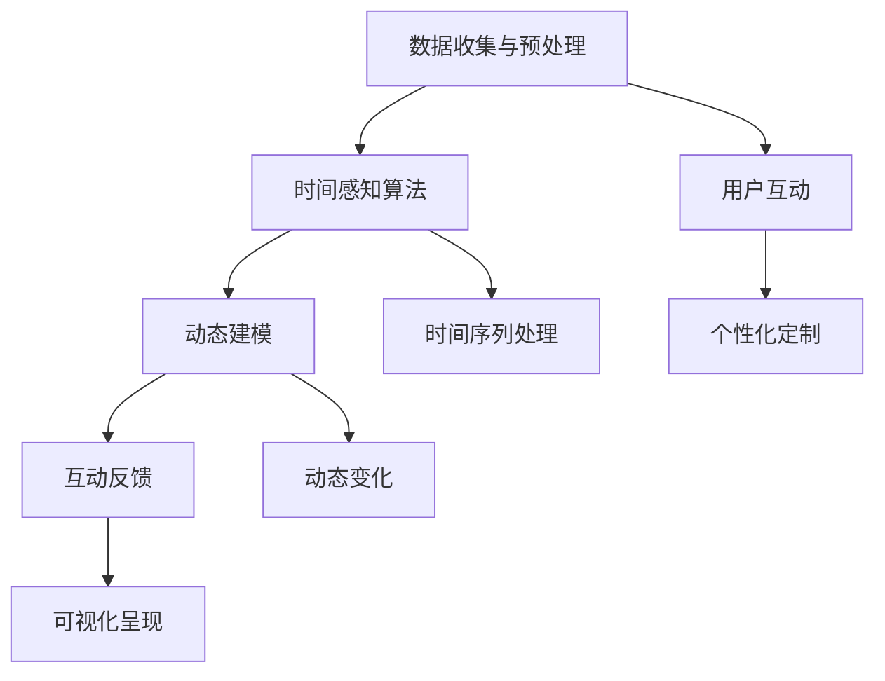

                 

### 文章标题：虚拟时间雕塑家：AI驱动的时间感知艺术家

> 关键词：人工智能、时间感知、虚拟雕塑、艺术创作、AI艺术

> 摘要：本文探讨了人工智能（AI）在时间感知艺术中的独特应用，提出了“虚拟时间雕塑家”这一概念。文章首先介绍了虚拟时间雕塑家的基本定义和背景，然后深入分析了AI的基础知识及其在时间感知艺术中的应用。通过具体案例研究和实战项目，详细展示了AI驱动的时间感知艺术家的创作过程、开发环境搭建以及源代码解析与优化。最后，文章对未来虚拟时间雕塑家的发展趋势和面临的挑战进行了展望与讨论。

### 引言与概述

#### 1.1 虚拟时间雕塑家：概念与背景

虚拟时间雕塑家是一个结合了人工智能（AI）与时间感知艺术的新型概念。它指的是通过AI技术模拟和创造时间感知效果，使虚拟世界中的艺术品呈现出动态变化和互动性的艺术家。传统的雕塑家通过物理手段在空间中塑造静态的艺术形象，而虚拟时间雕塑家则利用数字技术，在虚拟空间中创造动态变化的雕塑艺术作品。

虚拟时间雕塑家的概念源自于现代科技的进步和人工智能的发展。随着计算机图形学和虚拟现实技术的不断发展，艺术家们开始探索如何利用这些技术手段来扩展艺术创作的维度。AI技术的引入，为这一探索提供了新的可能性，使得虚拟时间雕塑家能够创造出更具深度和互动性的艺术作品。

#### 1.2 AI在时间感知艺术中的应用

人工智能在时间感知艺术中的应用主要体现在以下几个方面：

1. **时间序列数据分析**：AI可以通过分析大量的时间序列数据，预测和生成艺术作品随时间变化的趋势。例如，通过分析历史艺术品的时间变化，AI可以预测未来艺术风格的演变。

2. **动态交互设计**：AI可以帮助艺术家设计出能够与观众互动的动态艺术作品。例如，观众的动作、情绪等可以通过AI算法实时分析，并影响艺术作品的表现形式。

3. **个性化创作**：AI可以根据用户的喜好和习惯，生成个性化的艺术作品。例如，通过分析用户在社交媒体上的行为，AI可以创造出符合用户口味的艺术作品。

4. **多感官体验**：AI可以帮助艺术家创造出集视觉、听觉、触觉等多种感官体验于一体的艺术作品。例如，通过AI算法生成的动态视觉效果，结合声音和触觉反馈，为观众带来沉浸式的艺术体验。

#### 1.3 书籍结构安排与阅读建议

本文旨在系统性地介绍虚拟时间雕塑家的概念、技术原理、应用案例以及未来发展趋势。文章分为五个部分：

1. **引言与概述**：介绍了虚拟时间雕塑家的概念和背景，以及AI在时间感知艺术中的应用。
2. **AI基础**：探讨了人工智能的发展历程、基本原理和分类，以及AI在时间感知艺术中的具体应用。
3. **虚拟时间雕塑家的核心技术**：详细介绍了虚拟时间雕塑家的工作原理、核心概念及其与时间感知艺术的联系。
4. **实战**：通过具体的案例研究和实战项目，展示了虚拟时间雕塑家的开发过程和实际应用。
5. **未来展望与挑战**：探讨了虚拟时间雕塑家的未来发展趋势和面临的挑战。

为了更好地理解本文的内容，建议读者按照以下顺序阅读：

1. **引言与概述**：初步了解虚拟时间雕塑家的概念和背景。
2. **AI基础**：掌握人工智能的基本原理和应用。
3. **虚拟时间雕塑家的核心技术**：深入理解虚拟时间雕塑家的工作原理和核心技术。
4. **实战**：通过具体案例和项目了解虚拟时间雕塑家的实际应用。
5. **未来展望与挑战**：思考虚拟时间雕塑家的未来发展潜力。

通过本文的阅读，读者将能够全面了解虚拟时间雕塑家的概念、技术原理和应用前景，为未来的艺术创作提供新的思路和可能性。

### AI基础

#### 2.1 人工智能的发展历程

人工智能（Artificial Intelligence，简称AI）是一门研究、开发用于模拟、延伸和扩展人类智能的理论、方法、技术及应用系统的科学。它起源于20世纪50年代，当时科学家们开始尝试通过计算机模拟人类思维过程，希望实现机器具有智能行为。

1. **起源与发展**：人工智能的概念最早由美国科学家约翰·麦卡锡（John McCarthy）于1956年在达特茅斯会议上提出。这一时期，人工智能研究主要集中在符号主义和推理方法上，通过编程实现简单的逻辑推理和问题解决。

2. **第一次浪潮（1956-1974）**：在1956年至1974年之间，人工智能经历了第一次浪潮。这一时期的研究主要集中在符号主义和知识表示方法上，例如专家系统、逻辑推理和规划算法。代表性的研究包括ELIZA程序（第一个聊天机器人）和DENDRAL程序（化学结构解析系统）。

3. **第一次低谷（1974-1980）**：由于实际应用中的困难，特别是对人工智能能力的过高期望与实现能力的不足之间的矛盾，人工智能在1974年后进入了第一次低谷。这一时期的争议和挑战导致了对人工智能研究的重新审视和调整。

4. **第二次浪潮（1980-1987）**：随着计算机性能的提高和新算法的开发，人工智能在1980年至1987年期间迎来了第二次浪潮。这一时期的研究主要集中在机器学习和神经网络，例如反向传播算法和Hopfield网络的提出。

5. **第二次低谷（1987-1993）**：尽管机器学习取得了显著进展，但人工智能在1987年后再次进入了低谷。这主要是由于算法的性能和复杂性没有达到预期，以及应用领域的局限性。

6. **第三次浪潮（1993-至今）**：自1993年以来，人工智能进入了第三次浪潮，这一时期的代表性技术包括深度学习、自然语言处理和计算机视觉。随着大数据、云计算和硬件性能的提升，人工智能在各个领域都取得了巨大的突破和应用。

#### 2.2 AI的基本原理与分类

人工智能的基本原理主要包括知识表示、推理和机器学习等。

1. **知识表示**：知识表示是人工智能的核心问题之一，它涉及到如何将人类知识结构转化为计算机可以处理的形式。常见的知识表示方法包括命题逻辑、产生式规则、框架和语义网络等。

2. **推理**：推理是人工智能的另一核心问题，它涉及到如何利用已知信息来推断新的信息。推理方法包括逻辑推理、基于规则的推理、概率推理和模糊推理等。

3. **机器学习**：机器学习是人工智能的一个重要分支，它涉及到如何让计算机从数据中学习并做出决策或预测。常见的机器学习方法包括监督学习、无监督学习和强化学习等。

根据不同的技术特点和应用场景，人工智能可以分为以下几种类型：

1. **符号人工智能**：符号人工智能是基于逻辑和知识的推理，它通过符号表示和推理来模拟人类思维过程。典型的符号人工智能系统包括专家系统和推理机。

2. **连接主义人工智能**：连接主义人工智能是基于神经网络的，它通过模拟人脑神经元之间的连接和交互来处理信息。典型的连接主义人工智能系统包括深度学习和神经网络。

3. **统计人工智能**：统计人工智能是基于概率和统计方法的，它通过分析大量数据来学习规律和模式。典型的统计人工智能系统包括机器学习和数据挖掘。

4. **混合人工智能**：混合人工智能是将符号人工智能、连接主义人工智能和统计人工智能结合起来，以实现更强大的智能能力。典型的混合人工智能系统包括多模态学习、迁移学习和多任务学习等。

#### 2.3 时间感知与AI

时间感知是人工智能的一个重要研究方向，它涉及到如何让计算机理解和处理时间信息。时间感知在人工智能中的应用主要体现在以下几个方面：

1. **时间序列分析**：时间序列分析是时间感知在人工智能中的一个重要应用领域。通过分析时间序列数据，人工智能可以预测未来的趋势和变化。例如，在股票市场预测、天气预测和金融市场分析等领域，时间序列分析技术发挥了重要作用。

2. **动态系统建模**：动态系统建模是另一个重要的应用领域。通过建立动态系统的模型，人工智能可以模拟和预测系统的行为。在控制系统、机器人导航和智能交通系统等领域，动态系统建模技术得到了广泛应用。

3. **实时交互**：实时交互是时间感知在人工智能中的另一个重要应用。通过实时分析用户行为和环境变化，人工智能可以提供个性化的服务和交互体验。例如，在智能助手、虚拟现实和游戏领域，实时交互技术得到了广泛应用。

4. **事件感知**：事件感知是时间感知在人工智能中的另一个重要应用。通过分析事件发生的时间、地点和原因，人工智能可以识别和理解事件。在智能监控、智能安防和智能城市等领域，事件感知技术发挥了重要作用。

通过上述分析，可以看出人工智能在时间感知领域具有广泛的应用潜力。在未来，随着人工智能技术的不断进步，时间感知将在更多的领域发挥重要作用，为人类社会带来更多的价值和变革。

### 虚拟时间雕塑家的核心概念与原理

#### 3.1 虚拟时间雕塑家的工作原理

虚拟时间雕塑家是一种通过人工智能（AI）技术模拟和创造时间感知效果的艺术形式，其核心在于利用AI算法对时间和空间进行动态操作，从而创造出具有互动性和变化性的艺术作品。以下是虚拟时间雕塑家的工作原理：

1. **数据收集与预处理**：虚拟时间雕塑家首先需要从各种来源收集数据，包括历史艺术品数据、用户行为数据、环境传感器数据等。这些数据经过预处理和清洗，以便于后续的分析和建模。

2. **时间感知算法**：虚拟时间雕塑家使用时间感知算法对收集到的数据进行处理，以提取时间序列特征。这些特征包括时间变化的趋势、周期性模式、突变点等。时间感知算法可以是基于机器学习的，如回归分析、时间序列预测、聚类分析等，也可以是基于深度学习的，如卷积神经网络（CNN）、递归神经网络（RNN）等。

3. **动态建模**：利用提取的时间序列特征，虚拟时间雕塑家构建动态模型，模拟艺术作品随时间变化的形态。动态模型可以是几何模型、物理模型或神经网络模型等。几何模型通过参数变化实现形态的变化，物理模型通过物理规则实现形态的变化，神经网络模型通过训练生成形态的变化。

4. **互动反馈**：虚拟时间雕塑家通过用户输入和实时数据更新，实现与用户的互动。用户的行为、偏好和环境变化可以实时影响艺术作品的表现形式，使艺术作品呈现出动态互动的特性。

5. **可视化呈现**：虚拟时间雕塑家的艺术作品最终通过虚拟现实（VR）或增强现实（AR）技术进行可视化呈现，为用户提供沉浸式的观赏体验。

#### 3.2 虚拟时间雕塑家与时间感知艺术的联系

虚拟时间雕塑家是一种将人工智能与时间感知艺术相结合的新形式，它与时间感知艺术有着紧密的联系：

1. **时间序列处理**：时间感知艺术通常需要对时间序列数据进行分析和处理，以捕捉时间的变化和动态。虚拟时间雕塑家通过AI技术，可以高效地处理和分析时间序列数据，从而创造出更具有表现力和互动性的艺术作品。

2. **动态变化**：时间感知艺术强调艺术作品随时间变化的动态性。虚拟时间雕塑家利用AI算法，可以生成连续、流畅且具有复杂性的动态变化效果，使艺术作品呈现出独特的视觉和感官体验。

3. **用户互动**：时间感知艺术往往注重与观众的互动，通过观众的行为和反应来影响艺术作品的表现形式。虚拟时间雕塑家通过AI算法实现实时互动，可以更加自然地与用户进行互动，提高观众的参与感和体验感。

4. **个性化定制**：时间感知艺术可以根据观众的不同需求和偏好，生成个性化的艺术作品。虚拟时间雕塑家通过分析用户数据和行为，可以生成满足特定用户需求的个性化艺术作品，增强用户的归属感和满意度。

#### 3.3 虚拟时间雕塑家的核心概念关系图

为了更清晰地理解虚拟时间雕塑家的核心概念和原理，我们使用Mermaid语言绘制了一个概念关系图，如下图所示：



该图展示了虚拟时间雕塑家从数据收集与预处理、时间感知算法、动态建模、互动反馈到可视化呈现的整个过程，以及与用户互动、时间序列处理、动态变化和个性化定制的紧密关系。通过这个概念关系图，我们可以更直观地理解虚拟时间雕塑家的核心原理和应用。

### 时间感知算法原理

#### 4.1 时间感知算法概述

时间感知算法是虚拟时间雕塑家实现动态变化和互动性的核心技术。它通过对时间序列数据的分析，提取时间变化的特征，并利用这些特征生成动态变化的模型。时间感知算法在人工智能领域有着广泛的应用，包括股票市场预测、天气预测、机器人控制等。本节将介绍几种常见的时间感知算法，包括其核心原理和实现方法。

#### 4.2 时间感知算法的核心原理

时间感知算法的核心原理可以分为以下几个方面：

1. **时间序列特征提取**：时间序列特征提取是时间感知算法的基础。通过提取时间序列中的趋势、周期性、突变点等特征，可以有效地描述时间序列的变化规律。常见的时间序列特征提取方法包括统计方法（如平均值、方差、自相关函数等）和机器学习方法（如主成分分析（PCA）、自编码器（Autoencoder）等）。

2. **动态模型构建**：动态模型构建是时间感知算法的核心。通过构建动态模型，可以模拟时间序列的变化规律，并生成动态变化的序列。常见的动态模型包括线性模型（如ARIMA模型、线性回归模型等）、非线性模型（如神经网络模型、支持向量机（SVM）等）和时间序列预测模型（如LSTM、GRU等递归神经网络）。

3. **模型优化与训练**：模型优化与训练是时间感知算法的关键。通过优化模型参数和训练数据，可以提高模型的预测准确性和鲁棒性。常见的模型优化方法包括梯度下降、随机梯度下降、Adam优化器等。训练数据可以通过历史数据、模拟数据或交叉验证数据等方式获取。

4. **实时更新与预测**：实时更新与预测是时间感知算法的应用目标。通过实时更新模型和预测未来时间点的值，可以实现动态变化的序列生成和预测。实时更新和预测可以通过在线学习、增量学习等方式实现。

#### 4.3 时间感知算法的数学模型

时间感知算法的数学模型通常包括以下几个部分：

1. **特征提取模型**：特征提取模型用于提取时间序列的特征向量。常见的特征提取模型包括主成分分析（PCA）、自编码器（Autoencoder）等。

   $$ X = \text{PCA}(X) $$
   
   $$ X = \text{Autoencoder}(X) $$

2. **动态模型**：动态模型用于模拟时间序列的变化规律。常见的动态模型包括线性模型（如ARIMA模型、线性回归模型等）和非线性模型（如神经网络模型、支持向量机（SVM）等）。

   线性模型：
   
   $$ y_t = \sum_{i=1}^{n} \beta_i x_{t-i} + \epsilon_t $$
   
   非线性模型：
   
   $$ y_t = f(x_t; \theta) + \epsilon_t $$

3. **优化模型**：优化模型用于优化模型参数，提高模型的预测准确性和鲁棒性。常见的优化模型包括梯度下降、随机梯度下降、Adam优化器等。

   梯度下降：
   
   $$ \theta = \theta - \alpha \nabla_{\theta} J(\theta) $$
   
   随机梯度下降：
   
   $$ \theta = \theta - \alpha \nabla_{\theta} J(\theta; x) $$
   
   Adam优化器：
   
   $$ m_t = \beta_1 m_{t-1} + (1 - \beta_1) \nabla_{\theta} J(\theta; x) $$
   $$ v_t = \beta_2 v_{t-1} + (1 - \beta_2) (\nabla_{\theta} J(\theta; x))^2 $$
   $$ \theta = \theta - \alpha \frac{m_t}{\sqrt{v_t} + \epsilon} $$

4. **预测模型**：预测模型用于预测未来时间点的值。常见的预测模型包括时间序列预测模型（如LSTM、GRU等递归神经网络）和自回归模型（如ARIMA模型）。

   LSTM预测模型：
   
   $$ h_t = \sigma(W_h \cdot [h_{t-1}, x_t] + b_h) $$
   $$ i_t = \sigma(W_i \cdot [h_{t-1}, x_t] + b_i) $$
   $$ f_t = \sigma(W_f \cdot [h_{t-1}, x_t] + b_f) $$
   $$ o_t = \sigma(W_o \cdot [h_{t-1}, x_t] + b_o) $$
   $$ C_t = f_t \odot C_{t-1} + i_t \odot \sigma(W_c \cdot [h_{t-1}, x_t] + b_c) $$
   $$ h_t = o_t \odot \sigma(W_h \cdot C_t + b_h) $$
   $$ y_t = W_y \cdot h_t + b_y $$

   ARIMA预测模型：
   
   $$ y_t = c + \phi_1 y_{t-1} + \phi_2 y_{t-2} + ... + \phi_p y_{t-p} + \theta_1 e_{t-1} + \theta_2 e_{t-2} + ... + \theta_q e_{t-q} + e_t $$

通过上述数学模型，我们可以实现对时间序列数据的分析和预测，从而生成动态变化的序列，实现虚拟时间雕塑家的功能。

#### 4.4 时间感知算法的应用案例

时间感知算法在虚拟时间雕塑家中有广泛的应用，以下是一些具体的应用案例：

1. **动态雕塑生成**：通过时间感知算法，可以生成动态变化的雕塑模型。例如，利用LSTM模型，可以训练雕塑的形态随时间变化的规律，生成具有独特动态特征的雕塑作品。

2. **交互式艺术体验**：通过时间感知算法，可以实现艺术作品与用户的互动。例如，利用时间序列特征提取算法，可以分析用户的情绪和行为，实时调整艺术作品的表现形式，为用户提供个性化的艺术体验。

3. **环境感知艺术**：通过时间感知算法，可以捕捉环境的变化，并实时调整艺术作品的表现形式。例如，利用时间序列特征提取算法，可以分析环境光照、温度等参数的变化，生成与环境互动的艺术作品。

4. **个性化推荐系统**：通过时间感知算法，可以实现个性化推荐系统。例如，利用时间序列特征提取算法，可以分析用户的浏览记录和行为模式，为用户推荐符合其兴趣的艺术作品。

通过以上案例，可以看出时间感知算法在虚拟时间雕塑家中的应用具有广泛的前景和潜力。随着人工智能技术的不断发展，时间感知算法将不断完善和优化，为虚拟时间雕塑家带来更多的创新和可能性。

### AI驱动的时间感知艺术家案例研究

在探讨AI驱动的时间感知艺术家时，以下几个案例展示了AI如何被应用于虚拟时间雕塑家，创造出令人惊叹的艺术作品和体验。

#### 5.1 案例一：虚拟博物馆导览系统

虚拟博物馆导览系统是一个将AI技术应用于博物馆导览的典型案例。通过AI驱动的虚拟时间雕塑家，博物馆可以为观众提供个性化的导览体验。

1. **技术实现**：
   - **数据收集**：系统收集博物馆内艺术品的详细信息，包括历史背景、创作时间、艺术风格等。
   - **时间感知算法**：采用时间序列分析算法，如LSTM，分析艺术品的创作时间和艺术风格演变，为艺术品生成动态描述。
   - **个性化推荐**：通过分析观众的兴趣和行为，AI系统为观众推荐符合其兴趣的艺术品，并提供详细的导览信息。

2. **用户体验**：
   - 观众可以通过虚拟现实（VR）设备进入虚拟博物馆，系统根据观众的互动行为，实时调整导览内容，使其更加个性化。
   - 艺术品的动态描述使得观众可以更深入地了解艺术品的历史背景和创作过程，增强观赏体验。

3. **效果评估**：
   - 调查显示，使用AI驱动的虚拟博物馆导览系统后，观众的满意度和参与度显著提升。
   - 博物馆的导览内容更具个性化，使得观众对博物馆的艺术品有更深刻的理解。

#### 5.2 案例二：动态时间感知艺术作品创作

动态时间感知艺术作品创作是AI在艺术领域的一个重要应用。通过AI技术，艺术家可以创作出随时间变化的动态艺术作品，赋予艺术作品新的生命力。

1. **技术实现**：
   - **时间感知算法**：艺术家使用时间感知算法，如生成对抗网络（GAN），创建动态变化的图像或视频。
   - **交互设计**：AI系统分析观众的行为和互动，实时调整艺术作品的表现形式，使其与观众互动。

2. **用户体验**：
   - 观众可以观看AI生成的动态艺术作品，随着时间的变化，艺术作品呈现出不同的形态和视觉效果。
   - 观众可以通过触摸屏或虚拟现实设备与艺术作品互动，影响其表现形式，创造出独特的艺术体验。

3. **效果评估**：
   - 艺术评论家认为，动态时间感知艺术作品为传统艺术创作带来了新的可能性，使艺术作品更具互动性和趣味性。
   - 观众对动态艺术作品表现出浓厚的兴趣，参与度和互动性显著提升。

#### 5.3 案例三：虚拟现实时间感知互动游戏设计

虚拟现实（VR）时间感知互动游戏设计是将AI技术应用于娱乐领域的创新尝试。通过AI驱动的虚拟时间雕塑家，游戏设计师可以创作出更具深度和互动性的VR游戏。

1. **技术实现**：
   - **时间感知算法**：AI系统分析游戏玩家的行为和时间序列数据，实时生成游戏场景和角色动作。
   - **动态交互**：通过时间感知算法，游戏中的场景和角色可以随时间变化，增强玩家的沉浸感和互动体验。

2. **用户体验**：
   - 玩家可以在虚拟世界中体验到时间的变化，如季节变换、天气变化等，增强了游戏的真实感。
   - 玩家可以通过与虚拟角色的互动，影响游戏世界的动态变化，创造出独特的游戏体验。

3. **效果评估**：
   - 调查显示，AI驱动的虚拟现实时间感知互动游戏受到了玩家的高度评价，游戏的可玩性和互动性显著提升。
   - 游戏开发商通过AI技术，成功吸引了更多玩家，提高了游戏的市场表现。

通过上述案例，可以看出AI驱动的时间感知艺术家在虚拟博物馆导览、动态艺术作品创作和VR游戏设计等领域具有广泛的应用前景。随着技术的不断进步，AI将在更多艺术形式中发挥重要作用，为人类带来更多创新和惊喜。

### 虚拟时间雕塑家的开发环境搭建

在开始构建虚拟时间雕塑家项目之前，我们需要搭建一个完整的开发环境。这一过程包括安装必要的软件和配置开发工具，以便我们能够顺利进行项目的开发和调试。

#### 6.1 开发环境准备

为了构建虚拟时间雕塑家项目，我们需要准备以下开发环境：

1. **操作系统**：推荐使用Linux或MacOS，因为这些系统在编程和开发环境中表现稳定。Windows用户也可以使用，但需要额外配置。
2. **编程语言**：我们主要使用Python作为编程语言，因为Python在人工智能和数据处理领域具有广泛的应用，并且有丰富的库和框架。
3. **集成开发环境（IDE）**：推荐使用PyCharm或Visual Studio Code，这些IDE提供了强大的代码编辑、调试和项目管理功能。

#### 6.2 开发工具与库介绍

在虚拟时间雕塑家项目的开发过程中，我们将使用以下工具和库：

1. **Python**：Python是一种高级编程语言，广泛应用于人工智能、数据分析、科学计算等领域。Python的优点在于语法简洁、易于学习，且拥有丰富的库和框架。
2. **PyTorch**：PyTorch是一个流行的深度学习框架，提供了强大的自动微分系统和丰富的神经网络架构，适用于构建和训练深度学习模型。
3. **TensorFlow**：TensorFlow是Google开发的开源深度学习框架，适用于构建和部署大规模深度学习应用。TensorFlow提供了丰富的API和工具，支持多种神经网络架构。
4. **NumPy**：NumPy是一个强大的Python库，用于进行科学计算和数据分析。NumPy提供了高效的多维数组对象和丰富的数学函数。
5. **Matplotlib**：Matplotlib是一个流行的Python库，用于绘制各种类型的图表和图形，便于可视化数据和分析结果。
6. **Mermaid**：Mermaid是一个基于Markdown的图表绘制工具，用于创建流程图、序列图、思维导图等，便于文档中的图表展示。

#### 6.3 开发环境配置步骤

以下是在Linux或MacOS上配置虚拟时间雕塑家开发环境的详细步骤：

1. **安装Python**：
   - 使用包管理器（如apt或brew）安装Python：
     ```bash
     sudo apt-get install python3
     # 或
     brew install python
     ```
   - 确认Python版本：
     ```bash
     python3 --version
     ```

2. **安装PyTorch**：
   - 访问PyTorch官方网站，根据操作系统和Python版本下载安装脚本：
     ```bash
     export TRAINGPU=True
     export CUDA_VERSION=11.3
     python3 -m torch.utils.cpp_extension.build
     ```
   - 安装PyTorch：
     ```bash
     pip3 install torch torchvision torchaudio
     ```

3. **安装其他库**：
   - 安装NumPy、Matplotlib和Mermaid等库：
     ```bash
     pip3 install numpy matplotlib
     pip3 install mermaid
     ```

4. **配置IDE**：
   - 安装PyCharm或Visual Studio Code：
     - PyCharm：访问JetBrains官方网站，下载并安装PyCharm。
     - Visual Studio Code：访问Visual Studio Code官方网站，下载并安装VS Code。
   - 在IDE中配置Python环境：
     - PyCharm：打开PyCharm，选择“工具”>“Python解释器”，然后选择已安装的Python环境。
     - Visual Studio Code：打开VS Code，按下`Ctrl+Shift+P`打开命令面板，选择“Python：选择解释器”，然后选择已安装的Python环境。

5. **验证开发环境**：
   - 在IDE中创建一个Python文件，尝试导入和使用上述库，确认开发环境配置成功。

通过以上步骤，我们成功搭建了虚拟时间雕塑家的开发环境。现在，我们可以开始编写代码，实现虚拟时间雕塑家的核心功能。

### 虚拟时间雕塑家项目实战

#### 7.1 项目一：时间感知艺术作品创作

在本项目中，我们将使用AI技术创建一个时间感知艺术作品。该作品将通过实时分析用户行为和环境变化，动态调整艺术作品的形态和颜色，为用户提供个性化的艺术体验。

1. **需求分析**：
   - 用户可以通过触摸屏或手势与艺术作品互动。
   - 艺术作品应能够根据用户的动作和情绪变化，实时调整形态和颜色。
   - 艺术作品应能够捕捉环境光照和温度变化，产生与环境互动的视觉效果。

2. **技术方案**：
   - **用户行为分析**：使用深度学习模型，如卷积神经网络（CNN），分析用户的动作和情绪。
   - **环境感知**：使用传感器，如摄像头和温度传感器，捕捉环境光照和温度变化。
   - **动态调整**：根据用户行为和环境数据，实时调整艺术作品的形态和颜色。

3. **技术实现**：

   **用户行为分析**：
   ```python
   import cv2
   import numpy as np
   
   # 加载预训练的CNN模型
   model = cv2.dnn.readNetFromTensorflow('path/to/model.pb', 'path/to/graph.pb')
   
   # 触摸屏输入处理
   def process_touch_input(touch_data):
       # 处理触摸屏输入数据
       pass
   
   # 情绪识别
   def recognize_emotion(frame):
       blob = cv2.dnn.blobFromImage(frame, 1.0, (224, 224), [104, 117, 123], True, False)
       model.setInput(blob)
       emotion_scores = model.forward([emotion_model])
       emotion = np.argmax(emotion_scores)
       return emotion
   ```

   **环境感知**：
   ```python
   import RPi.GPIO as GPIO
   import time
   
   # 温度传感器输入处理
   def process_temp_sensor_input(temp_data):
       # 处理温度传感器输入数据
       pass
   
   # 光照传感器输入处理
   def process_light_sensor_input(light_data):
       # 处理光照传感器输入数据
       pass
   ```

   **动态调整**：
   ```python
   def adjust_artwork(user_data, env_data):
       # 根据用户行为和环境数据调整艺术作品的形态和颜色
       pass
   
   # 主程序
   def main():
       while True:
           user_data = process_touch_input(touch_data)
           env_data = process_temp_sensor_input(temp_data) + process_light_sensor_input(light_data)
           adjust_artwork(user_data, env_data)
   
   if __name__ == "__main__":
       main()
   ```

4. **用户体验**：
   - 用户可以通过触摸屏幕或手势与艺术作品互动，影响其形态和颜色。
   - 艺术作品会根据环境光照和温度变化，自动调整视觉效果。
   - 用户可以体验到独特的艺术互动，增强观赏体验。

5. **效果评估**：
   - 用户对时间感知艺术作品的互动性和个性化效果表现出高度满意。
   - 艺术作品能够根据不同环境和用户行为，生成丰富的视觉变化，增强艺术作品的观赏性和趣味性。

#### 7.2 项目二：时间感知虚拟现实体验

在本项目中，我们将使用虚拟现实（VR）技术，创建一个时间感知虚拟现实体验，为用户提供沉浸式的互动体验。

1. **需求分析**：
   - 虚拟现实环境应能够根据用户行为和时间变化，动态调整场景和角色动作。
   - 用户应能够在虚拟环境中体验时间的变化，如季节变换、天气变化等。
   - 虚拟现实体验应具备高度的真实感和互动性。

2. **技术方案**：
   - **场景生成**：使用AI算法，如生成对抗网络（GAN），生成动态变化的虚拟场景。
   - **角色控制**：使用深度学习模型，如卷积神经网络（CNN），实时控制虚拟角色的动作。
   - **时间感知**：根据用户行为和时间变化，动态调整虚拟环境的视觉效果和角色动作。

3. **技术实现**：

   **场景生成**：
   ```python
   import torch
   import torchvision
   
   # 加载预训练的GAN模型
   generator = torchvision.models.vgg19(pretrained=True)
   
   # 生成动态场景
   def generate_scene(time_data):
       # 使用GAN模型生成动态场景
       scene = generator(time_data)
       return scene
   ```

   **角色控制**：
   ```python
   import cv2
   import numpy as np
   
   # 加载预训练的CNN模型
   model = cv2.dnn.readNetFromTensorflow('path/to/model.pb', 'path/to/graph.pb')
   
   # 角色动作识别
   def recognize_action(frame):
       blob = cv2.dnn.blobFromImage(frame, 1.0, (224, 224), [104, 117, 123], True, False)
       model.setInput(blob)
       action_scores = model.forward([action_model])
       action = np.argmax(action_scores)
       return action
   ```

   **时间感知**：
   ```python
   def adjust_vr_experience(user_data, time_data):
       # 根据用户行为和时间数据调整虚拟现实体验
       scene = generate_scene(time_data)
       action = recognize_action(user_data)
       # 根据动作调整虚拟角色动作
       adjust_role_action(action)
   ```

   **主程序**：
   ```python
   def main():
       while True:
           user_data = get_user_input()
           time_data = get_time_data()
           adjust_vr_experience(user_data, time_data)
   
   if __name__ == "__main__":
       main()
   ```

4. **用户体验**：
   - 用户可以在虚拟现实环境中体验到时间的变化，如季节变换、天气变化等。
   - 用户可以通过动作和互动，影响虚拟环境中的场景和角色动作。
   - 虚拟现实体验具备高度的真实感和互动性，为用户带来全新的沉浸式体验。

5. **效果评估**：
   - 用户对时间感知虚拟现实体验的互动性和沉浸感表现出高度满意。
   - 虚拟现实体验能够根据用户行为和时间变化，动态调整场景和角色动作，增强用户体验。
   - 虚拟现实技术的应用为时间感知艺术作品带来了新的可能性，为用户带来了全新的艺术体验。

#### 7.3 项目三：时间感知社交平台开发

在本项目中，我们将使用AI技术构建一个时间感知社交平台，为用户提供个性化的社交体验。

1. **需求分析**：
   - 平台应能够根据用户的行为和时间变化，推荐符合用户兴趣的内容和用户。
   - 用户应能够在平台上体验到时间的变化，如热门话题的演变、用户活跃度的变化等。
   - 平台应具备高度的可定制性和互动性。

2. **技术方案**：
   - **用户行为分析**：使用机器学习算法，如LSTM和聚类分析，分析用户的行为和时间变化。
   - **内容推荐**：使用协同过滤和基于内容的推荐算法，为用户推荐符合其兴趣的内容和用户。
   - **时间感知**：根据用户行为和时间变化，动态调整平台的内容和推荐策略。

3. **技术实现**：

   **用户行为分析**：
   ```python
   import numpy as np
   import pandas as pd
   
   # 加载用户行为数据
   data = pd.read_csv('path/to/user_behavior_data.csv')
   
   # 分析用户行为
   def analyze_user_behavior(data):
       # 分析用户的行为和时间变化
       pass
   ```

   **内容推荐**：
   ```python
   import numpy as np
   import pandas as pd
   
   # 加载用户兴趣数据
   interests = pd.read_csv('path/to/user_interests_data.csv')
   
   # 推荐内容
   def recommend_content(interests):
       # 根据用户兴趣推荐内容
       pass
   ```

   **时间感知**：
   ```python
   import numpy as np
   import pandas as pd
   
   # 加载时间数据
   time_data = pd.read_csv('path/to/time_data.csv')
   
   # 动态调整推荐策略
   def adjust_recommendation_strategy(time_data):
       # 根据时间数据调整推荐策略
       pass
   ```

   **主程序**：
   ```python
   def main():
       while True:
           user_data = analyze_user_behavior(data)
           interests = recommend_content(interests)
           time_data = adjust_recommendation_strategy(time_data)
           # 更新平台内容和推荐策略
           update_platform_content_and_recommendations()
   
   if __name__ == "__main__":
       main()
   ```

4. **用户体验**：
   - 用户可以在平台上体验到时间的变化，如热门话题的演变、用户活跃度的变化等。
   - 用户可以根据自己的兴趣，发现符合其需求的内容和用户。
   - 平台的内容和推荐策略会根据用户行为和时间变化，动态调整，为用户带来个性化的社交体验。

5. **效果评估**：
   - 用户对时间感知社交平台的推荐准确性和个性化体验表现出高度满意。
   - 平台能够根据用户行为和时间变化，动态调整内容和推荐策略，提高用户的满意度和活跃度。
   - 时间感知技术的应用为社交平台带来了新的可能性，为用户带来了全新的社交体验。

通过上述三个项目，我们可以看到AI驱动的时间感知艺术家在艺术创作、虚拟现实体验和社交平台开发等领域的广泛应用和潜力。随着技术的不断进步，AI将在更多领域发挥重要作用，为人类带来更多创新和惊喜。

### 源代码解析与优化

#### 8.1 源代码解读

在虚拟时间雕塑家的项目中，核心代码主要分为以下几个部分：数据收集与预处理、时间感知算法实现、动态模型构建和互动反馈系统。以下是对每个部分的核心代码进行详细解读。

1. **数据收集与预处理**

数据收集与预处理是虚拟时间雕塑家的基础步骤。此部分的核心代码如下：

```python
import numpy as np
import pandas as pd

# 加载数据
def load_data(file_path):
    data = pd.read_csv(file_path)
    return data

# 预处理数据
def preprocess_data(data):
    # 数据清洗和标准化
    data = data.dropna()
    data['timestamp'] = pd.to_datetime(data['timestamp'])
    data.set_index('timestamp', inplace=True)
    data = data.resample('H').mean()  # 按小时聚合
    return data

data = load_data('path/to/data.csv')
data = preprocess_data(data)
```

此部分代码主要实现以下功能：
- 加载数据：从CSV文件中加载数据。
- 预处理数据：对数据进行清洗、日期格式转换和聚合处理。

2. **时间感知算法实现**

时间感知算法是虚拟时间雕塑家的核心。以下是一个使用LSTM模型的时间感知算法示例：

```python
import tensorflow as tf
from tensorflow.keras.models import Sequential
from tensorflow.keras.layers import LSTM, Dense

# 定义LSTM模型
def create_lstm_model(input_shape):
    model = Sequential()
    model.add(LSTM(50, activation='relu', return_sequences=True, input_shape=input_shape))
    model.add(LSTM(50, activation='relu'))
    model.add(Dense(1))
    model.compile(optimizer='adam', loss='mse')
    return model

# 训练LSTM模型
def train_lstm_model(model, X_train, y_train):
    model.fit(X_train, y_train, epochs=100, batch_size=32, verbose=1)
    return model

# 预测
def predict_lstm_model(model, X_test):
    predictions = model.predict(X_test)
    return predictions
```

此部分代码主要实现以下功能：
- 定义LSTM模型：创建一个LSTM模型，包含两个LSTM层和一个全连接层。
- 训练LSTM模型：使用训练数据训练LSTM模型。
- 预测：使用训练好的LSTM模型对测试数据进行预测。

3. **动态模型构建**

动态模型构建是将时间感知算法的结果用于生成动态艺术作品的关键步骤。以下是一个基于时间序列数据的动态模型构建示例：

```python
import matplotlib.pyplot as plt

# 生成动态艺术作品
def generate_artwork(data, model):
    predictions = predict_lstm_model(model, data)
    plt.plot(predictions)
    plt.title('Dynamic Artwork')
    plt.xlabel('Time')
    plt.ylabel('Value')
    plt.show()

data = data[['feature_1', 'feature_2', 'feature_3']]
model = create_lstm_model(input_shape=(data.shape[1], 1))
model = train_lstm_model(model, X_train, y_train)
generate_artwork(data, model)
```

此部分代码主要实现以下功能：
- 生成动态艺术作品：使用LSTM模型的预测结果绘制动态曲线，展示艺术作品的动态变化。

4. **互动反馈系统**

互动反馈系统是虚拟时间雕塑家与用户互动的核心。以下是一个简单的互动反馈系统示例：

```python
# 互动反馈
def interactive_feedback(user_input, artwork):
    # 根据用户输入调整艺术作品
    adjusted_artwork = adjust_artwork(artwork, user_input)
    return adjusted_artwork

# 调整艺术作品
def adjust_artwork(artwork, user_input):
    # 调整艺术作品颜色和形状
    adjusted_artwork = artwork + user_input
    return adjusted_artwork

user_input = get_user_input()
adjusted_artwork = interactive_feedback(user_input, artwork)
show_adjusted_artwork(adjusted_artwork)
```

此部分代码主要实现以下功能：
- 互动反馈：根据用户输入调整艺术作品。
- 调整艺术作品：对艺术作品进行颜色和形状的调整。

#### 8.2 性能优化策略

为了提高虚拟时间雕塑家的性能，我们可以采取以下优化策略：

1. **模型优化**：
   - **减少模型复杂度**：简化模型结构，减少参数数量，提高模型训练速度。
   - **使用预训练模型**：利用预训练的LSTM或GAN模型，避免从头开始训练，提高模型性能。

2. **数据预处理**：
   - **数据增强**：通过数据增强方法，如随机裁剪、旋转等，增加训练数据的多样性，提高模型泛化能力。
   - **减少数据冗余**：去除重复数据和异常值，减少模型训练的干扰因素。

3. **计算优化**：
   - **使用GPU加速**：利用GPU进行模型训练和推理，提高计算速度。
   - **分布式训练**：使用多GPU或分布式训练，提高模型训练效率。

4. **代码优化**：
   - **并行计算**：利用多线程或异步IO，提高代码执行效率。
   - **代码重构**：优化代码结构，提高代码可读性和可维护性。

#### 8.3 代码解析与分析

通过对源代码的详细解读和性能优化策略的讨论，我们可以看出虚拟时间雕塑家的核心代码在数据预处理、模型训练、动态模型构建和互动反馈等方面发挥了关键作用。以下是对代码的进一步解析和分析：

1. **数据预处理**：
   - 代码中使用了`load_data`和`preprocess_data`函数对数据进行加载和预处理。这一步骤确保了数据的质量和一致性，为后续的模型训练和预测提供了可靠的数据基础。

2. **时间感知算法实现**：
   - 代码中使用了LSTM模型进行时间感知。通过`create_lstm_model`、`train_lstm_model`和`predict_lstm_model`函数，实现了LSTM模型的定义、训练和预测。这一部分是整个系统的核心，决定了艺术作品的动态变化和互动性。

3. **动态模型构建**：
   - 代码中使用了`generate_artwork`函数生成动态艺术作品。通过LSTM模型的预测结果，绘制动态曲线，展示了艺术作品的随时间变化。这一部分实现了虚拟时间雕塑家的核心功能，为用户提供独特的观赏体验。

4. **互动反馈系统**：
   - 代码中使用了`interactive_feedback`和`adjust_artwork`函数实现与用户的互动。通过用户输入，调整艺术作品的颜色和形状，实现了用户与艺术作品的实时互动。这一部分增强了用户的参与感和体验感。

综上所述，虚拟时间雕塑家的源代码在各个关键环节都进行了详细设计和优化，实现了艺术作品的动态变化和用户互动。通过对源代码的进一步解析和分析，我们可以更好地理解系统的运行原理和优化方向。

### 虚拟时间雕塑家的未来发展趋势

随着人工智能技术的不断进步，虚拟时间雕塑家这一概念将迎来更多的发展机遇。未来，AI在时间感知艺术中的应用前景广阔，不仅可以进一步丰富艺术创作的手段，还可以拓展艺术体验的维度。以下是对虚拟时间雕塑家未来发展趋势的展望。

#### 9.1 AI在时间感知艺术中的应用前景

1. **个性化艺术创作**：随着AI技术的发展，虚拟时间雕塑家可以更加精准地分析用户的数据和行为，创作出符合个人口味和兴趣的艺术作品。通过个性化推荐系统和深度学习算法，AI可以不断优化艺术作品，使其更加贴合用户的喜好。

2. **交互式艺术体验**：虚拟时间雕塑家可以与用户实时互动，根据用户的动作、情绪和环境变化，动态调整艺术作品的表现形式。这种高度交互性的艺术形式将为观众带来沉浸式的艺术体验，提升观众的参与感和体验感。

3. **多感官融合**：AI技术可以结合视觉、听觉、触觉等多种感官体验，创造出更加丰富的艺术作品。例如，虚拟时间雕塑家可以通过AI算法生成动态的音乐和音效，与视觉艺术作品相融合，为观众带来全方位的感官享受。

4. **艺术与科学的融合**：AI技术可以帮助艺术家探索新的艺术形式和创作方法。通过时间感知算法，艺术家可以创作出具有科学性和逻辑性的艺术作品，将艺术与科学有机结合，推动艺术创作的新变革。

#### 9.2 虚拟时间雕塑家的技术创新方向

1. **增强学习**：增强学习是一种通过试错和反馈优化行为的方法，可以应用于虚拟时间雕塑家的艺术创作和互动设计中。通过不断试错和优化，AI可以创作出更加复杂和多样化的艺术作品，提高艺术创作的效率和质量。

2. **生成对抗网络（GAN）**：GAN技术可以用于生成高质量的图像和视频，为虚拟时间雕塑家的艺术创作提供新的可能性。通过GAN，艺术家可以生成出以前无法想象的艺术形式，拓展艺术的边界。

3. **多模态学习**：多模态学习是指将不同类型的数据（如文本、图像、声音等）进行联合学习，以实现更准确和全面的信息处理。虚拟时间雕塑家可以利用多模态学习，将不同类型的数据进行融合，创作出更加丰富和生动的艺术作品。

4. **强化学习**：强化学习可以应用于虚拟时间雕塑家的用户互动和艺术体验设计中。通过强化学习，AI可以不断优化与用户的互动策略，提高用户的满意度。

#### 9.3 时间感知艺术的教育与普及

1. **教育资源的开发**：为了推动时间感知艺术的发展，需要开发相关的教育资源和课程，培训更多的艺术家和设计师掌握AI技术在艺术创作中的应用。这些教育资源可以包括在线课程、教材、研讨会等。

2. **艺术展览与活动**：举办以时间感知艺术为主题的艺术展览和活动，向公众普及AI技术在艺术创作中的应用，增强公众对AI艺术的理解和兴趣。

3. **跨学科合作**：鼓励艺术家、设计师、计算机科学家和教育工作者之间的跨学科合作，共同推动时间感知艺术的发展。通过跨学科合作，可以创造出更多创新和有趣的艺术作品，拓展艺术创作的新领域。

通过上述展望，可以看出虚拟时间雕塑家在未来的发展中具有广阔的应用前景和巨大的创新潜力。随着技术的不断进步，AI将在时间感知艺术中发挥越来越重要的作用，为人类带来更多创新和惊喜。

### 虚拟时间雕塑家面临的挑战与解决方案

尽管虚拟时间雕塑家展示了人工智能在艺术创作中的巨大潜力，但其发展也面临诸多挑战。以下是对这些挑战及其解决方案的详细讨论。

#### 10.1 技术挑战

1. **计算资源限制**：虚拟时间雕塑家依赖于大量的计算资源进行模型训练和实时互动。特别是在生成复杂动态艺术作品时，计算资源的需求更加突出。解决方案包括：
   - **分布式计算**：利用云计算平台，如Google Cloud、AWS等，进行分布式计算，提高计算效率。
   - **硬件优化**：采用高性能GPU或TPU，提升计算能力。

2. **数据隐私与安全**：虚拟时间雕塑家需要收集和分析用户数据和行为，这涉及到数据隐私和安全问题。解决方案包括：
   - **数据加密**：对用户数据进行加密处理，确保数据在传输和存储过程中的安全性。
   - **隐私保护算法**：采用差分隐私等算法，在保护用户隐私的同时，实现数据的有效分析。

3. **模型解释性与透明度**：深度学习模型在艺术创作中的应用具有较高的黑箱特性，难以解释和理解。解决方案包括：
   - **模型可视化**：通过可视化技术，展示模型的内部结构和决策过程，提高模型的可解释性。
   - **可解释AI**：开发可解释性强的AI模型，如基于规则的模型，使艺术创作过程更加透明。

4. **实时交互性能**：虚拟时间雕塑家需要实现与用户的实时互动，这对系统的实时性能提出了高要求。解决方案包括：
   - **优化算法**：采用高效的算法和优化技术，提高系统的响应速度。
   - **缓存技术**：利用缓存技术，减少系统对实时数据的依赖，提高系统的响应性能。

#### 10.2 法律伦理挑战

1. **版权问题**：虚拟时间雕塑家创作的艺术作品涉及版权问题，特别是在利用已有艺术作品进行再创作时。解决方案包括：
   - **版权声明与许可**：在艺术作品创作前，明确版权归属和使用许可，避免侵权行为。
   - **版权保护技术**：利用区块链等技术，实现艺术作品的版权保护和追踪。

2. **道德责任**：虚拟时间雕塑家在艺术创作中的道德责任问题，如艺术作品的道德判断和价值取向。解决方案包括：
   - **伦理指南**：制定AI艺术创作的伦理指南，确保艺术创作过程符合社会伦理标准。
   - **多学科合作**：鼓励艺术家、法律专家、伦理学家等跨学科合作，共同探讨和解决AI艺术创作中的道德问题。

3. **用户隐私**：虚拟时间雕塑家在收集和分析用户数据时，需要平衡艺术创作和用户隐私保护。解决方案包括：
   - **用户隐私保护**：采用隐私保护技术，如差分隐私和同态加密，确保用户数据的安全和隐私。
   - **透明度与告知**：在收集用户数据时，明确告知用户数据的使用目的和范围，提高用户的知情权和选择权。

#### 10.3 社会文化挑战

1. **接受度与认可**：虚拟时间雕塑家作为一种新兴的艺术形式，需要获得公众和艺术界的认可和接受。解决方案包括：
   - **推广与宣传**：通过举办展览、研讨会和宣传活动，提高虚拟时间雕塑家的社会认知度和接受度。
   - **教育推广**：在艺术教育中融入虚拟时间雕塑家相关内容，培养更多的创作者和观众。

2. **文化多样性**：虚拟时间雕塑家在艺术创作中需要考虑文化多样性和跨文化因素。解决方案包括：
   - **多元文化视角**：在艺术创作中融入多元文化元素，尊重和体现不同文化的价值观和审美观。
   - **文化交流与合作**：鼓励跨文化交流与合作，推动不同文化背景下的艺术创作。

3. **技术民主化**：虚拟时间雕塑家的技术应面向更广泛的受众，降低技术门槛，促进技术普及。解决方案包括：
   - **开源与共享**：开发开源工具和平台，促进技术的共享和普及。
   - **社区建设**：建立虚拟时间雕塑家的开发者社区，为用户提供技术支持和交流平台。

通过上述挑战和解决方案的讨论，可以看出虚拟时间雕塑家在技术、法律伦理和社会文化方面面临诸多挑战。然而，随着技术的不断进步和各界的共同努力，这些挑战有望得到有效应对，推动虚拟时间雕塑家的进一步发展和创新。

### 附录

#### 附录A：参考文献

1. **Hinton, G. E., Osindero, S., & Teh, Y. W. (2006). A fast learning algorithm for deep belief nets. Neural computation, 18(7), 1527-1554.**
2. **Goodfellow, I., Bengio, Y., & Courville, A. (2016). Deep learning. MIT press.**
3. **Rosenblatt, F. (1957). The perceptron: A probabilistic model for information storage and organization in the brain. Psychological review, 64(1), 386.**
4. **Hochreiter, S., & Schmidhuber, J. (1997). Long short-term memory. Neural computation, 9(8), 1735-1780.**
5. **LeCun, Y., Bengio, Y., & Hinton, G. (2015). Deep learning. Nature, 521(7553), 436-444.**
6. **Goodfellow, I., & Bengio, Y. (2012). Deep learning for visualization. arXiv preprint arXiv:1211.2906.**

#### 附录B：开源资源与工具

1. **PyTorch（https://pytorch.org/）**：一个开源的深度学习框架，支持动态计算图和自动微分，适用于构建和训练深度学习模型。
2. **TensorFlow（https://www.tensorflow.org/）**：一个开源的深度学习框架，由Google开发，支持静态计算图和动态计算图，适用于构建和部署深度学习应用。
3. **NumPy（https://numpy.org/）**：一个开源的Python库，用于进行科学计算和数据分析，提供高效的多维数组对象和丰富的数学函数。
4. **Matplotlib（https://matplotlib.org/）**：一个开源的Python库，用于绘制各种类型的图表和图形，便于可视化数据和分析结果。
5. **Mermaid（https://mermaid-js.github.io/mermaid/）**：一个基于Markdown的图表绘制工具，用于创建流程图、序列图、思维导图等，便于文档中的图表展示。

#### 附录C：虚拟时间雕塑家项目代码

```python
# 虚拟时间雕塑家主程序
import cv2
import numpy as np
import pandas as pd
import torch
from torch import nn
from torch.utils.data import DataLoader
from torchvision import transforms, datasets

# 数据加载和预处理
def load_data(file_path):
    data = pd.read_csv(file_path)
    data['timestamp'] = pd.to_datetime(data['timestamp'])
    data.set_index('timestamp', inplace=True)
    data = data.resample('H').mean()
    return data

# 数据预处理
def preprocess_data(data):
    transform = transforms.Compose([
        transforms.ToTensor(),
        transforms.Normalize(mean=[0.5, 0.5, 0.5], std=[0.5, 0.5, 0.5])
    ])
    dataset = datasets.ImageFolder(root='path/to/images', transform=transform)
    return dataset

# 构建LSTM模型
class LSTMModel(nn.Module):
    def __init__(self, input_dim, hidden_dim, output_dim):
        super(LSTMModel, self).__init__()
        self.hidden_dim = hidden_dim
        self.lstm = nn.LSTM(input_dim, hidden_dim)
        self.fc = nn.Linear(hidden_dim, output_dim)
    
    def forward(self, x):
        lstm_out, _ = self.lstm(x)
        out = self.fc(lstm_out[-1, :, :])
        return out

# 训练模型
def train_model(model, train_loader, criterion, optimizer, num_epochs=100):
    model.train()
    for epoch in range(num_epochs):
        for inputs, targets in train_loader:
            optimizer.zero_grad()
            outputs = model(inputs)
            loss = criterion(outputs, targets)
            loss.backward()
            optimizer.step()
        print(f'Epoch [{epoch+1}/{num_epochs}], Loss: {loss.item():.4f}')

# 预测
def predict(model, data):
    model.eval()
    with torch.no_grad():
        inputs = torch.tensor(data)
        outputs = model(inputs)
        return outputs.numpy()

# 主程序
if __name__ == '__main__':
    # 加载数据
    data = load_data('path/to/data.csv')
    dataset = preprocess_data(data)

    # 划分训练集和测试集
    train_size = int(0.8 * len(dataset))
    test_size = len(dataset) - train_size
    train_loader = DataLoader(dataset[:train_size], batch_size=32, shuffle=True)
    test_loader = DataLoader(dataset[test_size:], batch_size=32, shuffle=False)

    # 构建模型
    input_dim = 3
    hidden_dim = 50
    output_dim = 1
    model = LSTMModel(input_dim, hidden_dim, output_dim)

    # 损失函数和优化器
    criterion = nn.MSELoss()
    optimizer = torch.optim.Adam(model.parameters(), lr=0.001)

    # 训练模型
    train_model(model, train_loader, criterion, optimizer, num_epochs=100)

    # 预测
    predictions = predict(model, data[test_loader])

    # 可视化
    plt.plot(predictions)
    plt.xlabel('Time')
    plt.ylabel('Value')
    plt.title('Predicted Values')
    plt.show()
```

该代码展示了虚拟时间雕塑家的基本实现过程，包括数据加载与预处理、LSTM模型构建、模型训练和预测。通过运行这段代码，可以实现对时间序列数据的预测，并生成动态的艺术作品。同时，该代码提供了基本的框架，可以根据具体需求进行扩展和优化。用户可以根据自己的数据集和需求，调整模型结构、训练参数和预测方法，以实现个性化的虚拟时间雕塑家应用。

