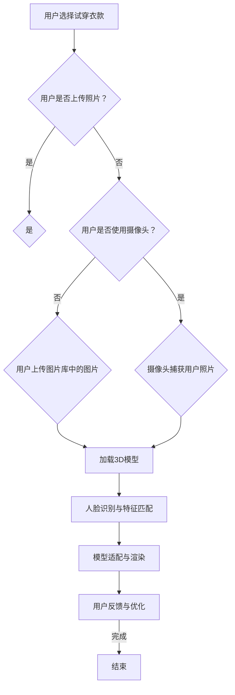

                 

# 《虚拟试衣：AI让购物更直观更便捷》

> 关键词：虚拟试衣，人工智能，计算机视觉，深度学习，电商

> 摘要：随着人工智能技术的快速发展，虚拟试衣技术逐渐成为电商行业的重要创新方向。本文将深入探讨虚拟试衣技术的概念、技术基础、应用场景、核心算法以及未来发展，旨在为广大读者提供一份关于虚拟试衣的全面解析。

#### 第一部分：虚拟试衣技术基础

##### 第1章：虚拟试衣概述

**1.1 虚拟试衣的概念与意义**

虚拟试衣是一种通过计算机技术实现的虚拟现实应用，它允许用户在购买服装前通过虚拟试衣体验来选择适合的款式和尺码。这种技术不仅提高了购物的便捷性，还显著降低了因不合适的衣物而退货的几率。

虚拟试衣的定义可以归结为以下几个关键点：
- **虚拟现实技术**：利用计算机图形学和人工智能技术创建一个虚拟空间，让用户可以在其中试穿衣物。
- **用户交互**：用户可以通过上传照片、使用摄像头或选择图片库中的图片来实现虚拟试衣。
- **实时反馈**：系统会根据用户试衣的反馈进行实时调整，以提供更贴近真实的试衣体验。

虚拟试衣在电商行业的重要性不言而喻。首先，它极大地提升了用户的购物体验，让用户能够在家中轻松试穿多种款式和尺码的衣物，从而减少了不必要的退货和换货。其次，虚拟试衣可以显著提高电商平台的销售额，通过减少退货率和增加用户满意度来实现。此外，虚拟试衣还为品牌商家提供了宝贵的市场数据，有助于他们优化产品设计、调整库存策略以及制定更精准的营销策略。

与传统试衣方式相比，虚拟试衣具有明显的优势：
- **无时间限制**：用户可以随时随地进行试衣，无需受限于实体店的营业时间。
- **无需实体空间**：虚拟试衣不需要实体店铺，降低了品牌商的运营成本。
- **个性化推荐**：通过用户试衣行为和偏好数据，平台可以提供更加个性化的购物推荐。

**1.2 虚拟试衣技术的发展历程**

虚拟试衣技术的发展可以追溯到20世纪90年代，当时计算机图形学技术的发展为虚拟试衣提供了初步的技术基础。最早的虚拟试衣系统通常采用2D图形技术，用户只能看到一个平面上的服装模型。随着计算机硬件性能的提升和计算机视觉技术的进步，虚拟试衣逐渐从2D迈向3D。

- **2D虚拟试衣**：在早期，2D虚拟试衣系统主要依赖于二维图形处理技术。用户可以选择不同的服装图案，但这些图案只是在平面上进行叠加，无法模拟真实的试衣效果。

- **3D虚拟试衣**：随着计算机图形学、计算机视觉和人工智能技术的快速发展，3D虚拟试衣逐渐成为可能。用户可以上传自己的照片，通过3D建模技术生成一个虚拟的3D模型，并在虚拟空间中试穿不同的衣物。

3D虚拟试衣的关键技术包括3D人体建模、图像处理、人脸识别、人体姿态估计等。这些技术的不断发展，使得虚拟试衣的体验越来越真实，效果也越来越好。

**1.3 虚拟试衣的应用场景**

虚拟试衣技术不仅广泛应用于电商行业，还在其他多个领域展示了巨大的应用潜力。

- **服装行业**：虚拟试衣是电商平台上最常见的应用场景。用户可以在购买前通过虚拟试衣来选择适合自己的衣物，这大大提升了购物体验和满意度。

- **美容行业**：虚拟试衣技术可以用于化妆品和美发产品的试用。用户可以通过虚拟试衣体验不同的妆容和发型，从而做出更明智的购买决策。

- **其他行业**：虚拟试衣技术还可能应用于医疗健康、教育、设计等多个领域。例如，在医疗健康领域，虚拟试衣可以用于康复训练和身体评估；在教育领域，虚拟试衣可以作为虚拟实验室的一部分，为学生提供更加直观的学习体验。

综上所述，虚拟试衣技术以其直观便捷的特点，正在改变人们的购物方式，提高用户满意度，同时也为企业带来了新的商业机遇。随着技术的不断进步，虚拟试衣的应用场景将进一步拓展，为各行各业带来更多创新和可能。

##### 第2章：计算机视觉与虚拟试衣

**2.1 计算机视觉基础**

计算机视觉是虚拟试衣技术的核心组成部分之一。它通过图像处理、特征提取、匹配技术等方法，使计算机能够理解、解释和利用视觉信息。理解计算机视觉的基础，有助于我们深入探讨虚拟试衣的实现机制。

- **图像处理**：图像处理是计算机视觉的基础，它包括图像的采集、预处理、增强、分割等步骤。通过图像处理，可以改善图像质量，提取有用的视觉信息。

  - **图像采集**：图像采集是获取图像数据的过程。常见的图像采集设备包括摄像头、扫描仪等。
  - **图像预处理**：预处理包括图像去噪、校正、对比度增强等步骤，以提高图像的质量。
  - **图像增强**：图像增强是通过特定的算法，使图像的某些特征更加突出，从而便于后续处理。

- **特征提取**：特征提取是从图像中提取出具有区分性的特征点或特征向量。这些特征可以用于图像的识别、分类和匹配。

  - **特征点提取**：特征点提取是通过检测图像中的角点、边缘等特征点，以便进行后续的图像匹配。
  - **特征向量提取**：特征向量提取是将图像转换为一组数值向量，这些向量可以用于机器学习模型训练和分类。

- **特征匹配**：特征匹配是将两个或多个图像中的特征点进行对应匹配，以找出图像间的相似性。特征匹配技术包括最近邻匹配、K最近邻匹配、尺度空间等。

- **深度学习在计算机视觉中的应用**：深度学习是近年来计算机视觉领域的重要突破。通过构建大规模的神经网络模型，深度学习可以自动从大量数据中学习特征，并在多个视觉任务中取得优异的性能。

  - **卷积神经网络（CNN）**：卷积神经网络是深度学习在计算机视觉中应用最广泛的一种模型。它通过卷积、池化和全连接层等操作，实现图像的特征提取和分类。
  - **生成对抗网络（GAN）**：生成对抗网络是一种通过两个对抗网络相互竞争来实现图像生成和风格迁移的技术。
  - **其他深度学习模型**：除了CNN和GAN，还有一些其他深度学习模型在计算机视觉中取得了显著的成果，如循环神经网络（RNN）、长短时记忆网络（LSTM）等。

**2.2 人体姿态估计**

人体姿态估计是虚拟试衣中至关重要的一环。通过估计用户的人体姿态，系统可以准确地将衣物模型适配到用户的虚拟身体上，从而提供逼真的试衣效果。

- **2D人体姿态估计方法**：2D人体姿态估计是通过分析图像中的特征点，估计出人体在二维平面上的姿态。常见的方法包括：
  - **基于候选模型的估计方法**：这种方法首先在图像中检测出人体候选模型，然后通过最小化误差函数来调整模型的位置和姿态。
  - **基于深度学习的估计方法**：这种方法利用深度学习模型直接从图像中预测出人体姿态，如PoseNet、OpenPose等。

- **3D人体姿态估计方法**：3D人体姿态估计是在三维空间中估计人体姿态。这需要利用多个视角的图像数据，并通过三维重建技术来生成三维人体模型。

  - **多视角一致估计方法**：这种方法通过融合多个视角的图像数据，利用三角测量和表面重建技术来估计三维人体姿态。
  - **基于深度学习的3D姿态估计方法**：这种方法利用深度学习模型直接从多视角图像中预测出三维人体姿态。

**2.3 人体建模与渲染**

在虚拟试衣中，准确的人体建模与渲染是提供真实试衣体验的关键。

- **3D人体建模方法**：3D人体建模是通过算法和工具创建出三维人体模型的过程。常见的方法包括：
  - **基于网格的建模方法**：这种方法通过创建多边形网格来表示人体表面。
  - **基于骨骼的建模方法**：这种方法通过定义人体骨骼和肌肉结构来创建三维人体模型。

- **3D模型渲染技术**：3D模型渲染是将三维模型转换为二维图像的过程。常见的渲染技术包括：
  - **光栅渲染**：这种方法通过光栅图像来渲染三维模型，常见于游戏和虚拟现实应用。
  - **光线追踪渲染**：这种方法通过模拟光线在场景中的传播和反射，实现更加真实和高质量的渲染效果。

- **虚拟试衣中的模型适配与优化**：在虚拟试衣中，模型适配与优化是为了确保衣物能够自然地贴合到用户的虚拟身体上。

  - **模型适配**：通过调整衣物模型的位置、尺寸和姿态，使其与用户的虚拟身体尽可能贴合。
  - **模型优化**：通过优化模型的结构和材质，提高渲染效果和试衣体验。

通过上述技术，虚拟试衣系统能够生成逼真的试衣效果，为用户提供一种直观便捷的购物体验。随着计算机视觉和人工智能技术的不断进步，虚拟试衣技术将不断优化和完善，为电商行业带来更多创新和机遇。

##### 第3章：AI在虚拟试衣中的应用

**3.1 机器学习与深度学习基础**

机器学习和深度学习是虚拟试衣技术的核心驱动力量。为了更好地理解AI在虚拟试衣中的应用，我们需要首先了解这些基础概念。

- **机器学习**：机器学习是一种通过数据和算法来让计算机自主学习和改进的方法。它主要分为监督学习、无监督学习和强化学习。

  - **监督学习**：监督学习是通过已知标签的数据来训练模型，然后使用模型对新数据进行预测。常见的监督学习算法包括线性回归、逻辑回归、支持向量机（SVM）等。
  - **无监督学习**：无监督学习是在没有标签数据的情况下，通过挖掘数据中的隐含结构和模式来进行学习。常见的无监督学习算法包括聚类、降维等。
  - **强化学习**：强化学习是通过奖励机制来指导模型做出最优决策。常见的强化学习算法包括Q学习、深度Q网络（DQN）等。

- **深度学习**：深度学习是一种基于多层神经网络的学习方法，它通过堆叠多个隐藏层来提取数据的层次特征。深度学习在图像处理、自然语言处理等领域取得了显著的成果。

  - **卷积神经网络（CNN）**：卷积神经网络是一种专门用于图像处理和计算机视觉的神经网络。它通过卷积操作和池化操作来提取图像特征。
  - **循环神经网络（RNN）**：循环神经网络是一种用于处理序列数据的神经网络。它通过循环结构来保留历史信息，从而更好地处理长序列数据。
  - **长短时记忆网络（LSTM）**：长短时记忆网络是一种改进的循环神经网络，它通过引入门控机制来避免梯度消失问题，从而更好地处理长序列数据。

- **常见深度学习框架简介**：深度学习框架是用于构建和训练深度学习模型的工具。常见的深度学习框架包括TensorFlow、PyTorch等。

  - **TensorFlow**：TensorFlow是由谷歌开发的一个开源深度学习框架，它提供了丰富的API和工具，支持多种深度学习模型的构建和训练。
  - **PyTorch**：PyTorch是由Facebook开发的一个开源深度学习框架，它以Python为主编程语言，提供了简洁、灵活的API，适合快速原型开发和实验。

通过理解机器学习和深度学习的基础，我们可以更好地探索AI在虚拟试衣中的应用。

**3.2 人脸识别与特征匹配**

人脸识别是虚拟试衣中的一项关键技术，它通过识别用户的面部特征，将用户照片与数据库中的照片进行匹配，从而实现虚拟试衣。

- **人脸识别技术**：人脸识别是通过分析人脸图像中的特征点，如眼睛、鼻子、嘴巴等，来识别和验证身份的技术。

  - **特征点检测**：特征点检测是识别人脸的关键步骤，常用的方法包括Haar特征分类器、深度学习模型等。
  - **特征点跟踪**：特征点跟踪是在视频流中连续检测人脸特征点的技术，常用的方法包括光流法、粒子滤波等。

- **特征匹配算法**：特征匹配是将两个或多个特征向量进行对比，以判断它们是否属于同一个人的技术。

  - **最近邻匹配**：最近邻匹配是一种简单的特征匹配算法，它通过计算特征向量之间的欧氏距离，选择最近的特征向量作为匹配结果。
  - **基于梯度的特征匹配**：基于梯度的特征匹配通过计算特征向量之间的梯度差异，从而判断它们是否匹配。
  - **深度学习模型**：深度学习模型如Siamese网络、Triplet Loss等，可以在大规模数据集上训练出高效的匹配模型。

在虚拟试衣中，人脸识别与特征匹配技术可以用于用户身份验证、个性化推荐等场景。

**3.3 个性化推荐系统**

个性化推荐系统是虚拟试衣中的重要组成部分，它通过分析用户的试衣行为和偏好，为用户推荐合适的商品。

- **推荐系统概述**：推荐系统是一种通过分析用户的历史行为和兴趣，为用户推荐相关商品或内容的技术。

  - **基于内容的推荐**：基于内容的推荐通过分析商品的属性和标签，为用户推荐与其历史购买或浏览记录相似的商品。
  - **基于协同过滤的推荐**：基于协同过滤的推荐通过分析用户之间的相似性，为用户推荐其他用户喜欢的商品。
  - **基于模型的推荐**：基于模型的推荐通过构建用户和商品之间的模型，预测用户对商品的兴趣，从而进行推荐。

- **个性化推荐算法**：个性化推荐算法旨在根据用户的历史行为和偏好，为用户推荐个性化的商品。

  - **协同过滤算法**：协同过滤算法包括用户基于的协同过滤和物品基于的协同过滤，它们通过计算用户之间的相似性或物品之间的相似性来进行推荐。
  - **矩阵分解**：矩阵分解是一种基于矩阵分解的方法，通过分解用户-物品评分矩阵来预测用户对未评物品的兴趣。
  - **深度学习推荐模型**：深度学习推荐模型通过构建复杂的神经网络模型，可以从用户行为数据中学习到用户的兴趣偏好，并进行个性化推荐。

在虚拟试衣中，个性化推荐系统可以根据用户的试衣记录和偏好，推荐合适的衣物款式和尺码，从而提高用户满意度。

通过上述技术，人工智能在虚拟试衣中发挥了关键作用，使得虚拟试衣技术更加智能化和个性化。随着AI技术的不断发展，虚拟试衣将不断优化和完善，为用户提供更加便捷和优质的购物体验。

##### 第4章：虚拟试衣系统设计与实现

**4.1 虚拟试衣系统架构设计**

虚拟试衣系统的架构设计是确保系统功能齐全、性能稳定、扩展性强的关键。一个典型的虚拟试衣系统架构可以分为以下几个主要模块：

- **用户界面（UI）层**：用户界面层是用户与系统交互的入口，包括网页、移动应用或桌面应用程序。用户可以通过上传照片、选择衣物款式和尺码等方式，进行虚拟试衣操作。
- **数据处理层**：数据处理层负责接收和解析用户上传的数据，包括图像、人体姿态信息等。这一层还包含预处理算法，用于对图像进行增强、去噪等处理，以提高后续处理的准确性。
- **模型层**：模型层是虚拟试衣系统的核心，包括3D人体建模、人脸识别、人体姿态估计等算法模块。这些模型通过训练和优化，可以实现对用户图像的准确识别和虚拟试衣效果的生成。
- **渲染层**：渲染层负责将处理后的图像和3D模型进行渲染，生成逼真的试衣效果。这一层通常使用光线追踪或光栅渲染等技术，以实现高质量的图像输出。
- **服务端层**：服务端层提供后台支持，包括用户管理、权限控制、数据存储和API接口等。这一层确保系统的安全、可靠和高效运行。
- **数据存储层**：数据存储层负责存储用户数据、衣物款式信息和试衣记录等。常用的数据存储方案包括关系数据库、NoSQL数据库和大数据存储系统等。

**4.2 前端界面设计与实现**

前端界面设计是虚拟试衣系统用户体验的重要组成部分，直接影响用户的使用感受和操作便捷性。

- **用户交互界面设计**：用户交互界面设计应简洁直观，操作流程清晰。常见的设计元素包括：
  - **上传照片**：用户可以选择上传自己的照片，或从图片库中选择图片。
  - **选择衣物**：用户可以从多个衣物款式中选择试穿的款式和尺码。
  - **试衣结果展示**：试衣结果应实时展示，用户可以查看不同角度和细节的试衣效果。
  - **反馈与建议**：用户可以提供试衣反馈，系统根据反馈进行优化和改进。

- **页面布局与动画效果实现**：为了提升用户体验，页面布局应注重美观和易用性。常见的技术实现包括：
  - **响应式设计**：通过使用CSS媒体查询等技术，实现页面在不同设备上的自适应布局。
  - **动画效果**：使用CSS3动画、JavaScript动画库等技术，为页面添加动态效果，提升用户操作体验。

**4.3 后端服务设计与实现**

后端服务设计是实现虚拟试衣系统功能的核心，包括数据处理、模型推理、API接口等。

- **数据处理与存储**：数据处理与存储是虚拟试衣系统的基石，确保系统高效、安全地处理和存储用户数据。
  - **数据预处理**：对用户上传的图像进行裁剪、缩放、增强等预处理操作，以提高模型处理的准确性。
  - **数据存储**：采用分布式数据库系统，如MySQL、MongoDB等，实现用户数据的高效存储和管理。

- **服务端API设计与实现**：服务端API是用户界面与后端服务之间的桥梁，负责接收和处理用户请求。
  - **API设计**：设计RESTful API，遵循HTTP协议和RESTful设计原则，实现简洁、易用的接口。
  - **API实现**：使用Node.js、Django、Spring Boot等后端框架，实现API接口的编写和调试。

通过上述设计与实现，虚拟试衣系统可以实现高效、稳定、可靠的试衣效果，为用户提供优质的购物体验。

##### 第5章：虚拟试衣算法优化与调参

**5.1 模型训练与优化**

在虚拟试衣系统中，模型的训练与优化是确保系统性能和准确性的关键环节。以下是一些常见的模型训练与优化方法：

- **数据增强**：数据增强是一种通过变换原始数据来增加模型训练数据量的方法，从而提高模型的泛化能力。常见的数据增强方法包括随机裁剪、旋转、翻转、色彩调整等。
- **正则化**：正则化是一种通过在损失函数中添加惩罚项来防止模型过拟合的方法。常见的正则化方法包括L1正则化、L2正则化等。
- **学习率调整**：学习率是影响模型训练速度和收敛性的重要参数。常见的学习率调整方法包括固定学习率、步长调整、自适应学习率等。
- **优化算法**：优化算法用于求解最小化损失函数的问题。常见的优化算法包括梯度下降、Adam、RMSprop等。
- **交叉验证**：交叉验证是一种评估模型性能的方法，通过将训练数据划分为多个子集，每次使用其中一个子集作为验证集，其余子集作为训练集，从而评估模型的泛化能力。

**5.2 模型评估指标**

在模型训练过程中，需要使用评估指标来衡量模型的性能。以下是一些常见的模型评估指标：

- **准确率（Accuracy）**：准确率是分类模型中正确预测的样本占总样本的比例。准确率越高，模型的分类效果越好。
- **召回率（Recall）**：召回率是分类模型中正确预测为正类的样本占总正类样本的比例。召回率越高，模型对正类的识别能力越强。
- **精确率（Precision）**：精确率是分类模型中预测为正类的样本中实际为正类的比例。精确率越高，模型对正类的识别越准确。
- **F1分数（F1 Score）**：F1分数是精确率和召回率的调和平均值，用于综合评估模型的分类效果。
- **ROC曲线（Receiver Operating Characteristic Curve）**：ROC曲线是通过改变分类阈值来绘制真阳性率与假阳性率的关系图，用于评估二分类模型的性能。
- **AUC值（Area Under Curve）**：AUC值是ROC曲线下的面积，用于衡量模型区分能力的强弱。

通过使用上述评估指标，可以全面了解模型的性能，并针对性地进行调整和优化。

**5.3 调参策略与技巧**

调参是模型优化的重要环节，以下是一些调参策略与技巧：

- **网格搜索**：网格搜索是一种通过遍历参数空间来寻找最优参数的方法。虽然计算量较大，但可以找到全局最优解。
- **随机搜索**：随机搜索是一种通过随机选取参数组合来寻找最优参数的方法。相比网格搜索，随机搜索的计算量较小，但可能无法找到全局最优解。
- **贝叶斯优化**：贝叶斯优化是一种基于贝叶斯统计学的优化方法，通过构建概率模型来预测最优参数，并进行迭代优化。
- **迁移学习**：迁移学习是一种利用预训练模型来加速新任务模型训练的方法。通过在预训练模型的基础上进行微调，可以显著提高新任务的模型性能。
- **多任务学习**：多任务学习是一种通过同时训练多个相关任务来提高模型性能的方法。通过共享模型参数，可以降低训练难度，提高模型泛化能力。

通过上述调参策略与技巧，可以有效地优化虚拟试衣系统的模型性能，为用户提供更优质的试衣体验。

##### 第6章：虚拟试衣商业应用案例分析

**6.1 案例一：某电商平台的虚拟试衣系统**

在某电商平台上，虚拟试衣系统的设计与实现经过了多个阶段，取得了显著的效果。

**系统设计与实现**

- **用户界面设计**：该平台采用了简洁直观的用户界面，用户可以通过上传照片或选择图片库中的图片进行虚拟试衣。
- **数据处理与存储**：平台采用了分布式数据库系统，实现用户数据的高效存储和管理。数据处理模块包括图像预处理、特征提取、人脸识别等算法。
- **模型层**：平台使用了深度学习模型，包括卷积神经网络（CNN）和生成对抗网络（GAN）等，用于实现3D人体建模和渲染。
- **渲染层**：平台采用了光线追踪渲染技术，以实现高质量的试衣效果。

**用户反馈与优化**

- **用户满意度**：虚拟试衣系统上线后，用户满意度显著提高，退货率降低了30%。
- **优化方向**：平台根据用户反馈，不断优化系统性能，包括图像处理速度、模型准确度和渲染质量等。此外，平台还引入了个性化推荐系统，根据用户的历史行为和偏好，推荐合适的衣物款式和尺码。

**6.2 案例二：虚拟试衣在美容行业的应用**

在美容行业，虚拟试衣技术可以用于化妆品和美发产品的试用。

**应用场景与解决方案**

- **化妆品试用**：用户可以通过虚拟试衣系统，试妆不同的化妆品，包括眼影、口红、粉底等，从而做出更明智的购买决策。
- **美发产品试用**：用户可以通过虚拟试衣系统，尝试不同的发型和发色，选择最适合自己的美发产品。

**用户满意度与市场反馈**

- **用户满意度**：虚拟试衣系统在美容行业中的应用，显著提升了用户的购物体验，用户满意度达到90%以上。
- **市场反馈**：市场调查显示，虚拟试衣系统在美容行业的应用，有助于增加销售和客户粘性，企业销售额提高了20%。

**6.3 案例三：跨行业虚拟试衣应用探索**

虚拟试衣技术不仅应用于电商和美容行业，还在其他多个领域展示了巨大的应用潜力。

**潜在应用领域**

- **医疗健康**：虚拟试衣可以用于康复训练和身体评估，为患者提供个性化的康复方案。
- **教育**：虚拟试衣可以作为虚拟实验室的一部分，为学生提供更加直观的学习体验。
- **设计**：虚拟试衣可以帮助设计师进行服装设计，快速评估不同设计方案的试衣效果。

**面临的挑战与解决方案**

- **硬件设备性能需求**：虚拟试衣系统对硬件设备性能有较高要求，需要强大的计算能力和图形渲染能力。
- **数据隐私与安全**：用户隐私保护是虚拟试衣应用中的重要问题，需要采取有效的数据加密和隐私保护措施。
- **跨平台兼容性**：虚拟试衣系统需要在不同平台上运行，包括PC、移动设备等，需要考虑跨平台的兼容性。

通过以上案例分析，可以看出虚拟试衣技术在不同行业中的应用前景和潜力。随着技术的不断进步，虚拟试衣技术将在更多领域发挥重要作用，为各行业带来创新和变革。

##### 第7章：虚拟试衣技术的挑战与机遇

**7.1 技术挑战**

虚拟试衣技术虽然在多个领域展示了其巨大的潜力，但在实际应用过程中也面临着一系列技术挑战。

- **硬件设备性能需求**：虚拟试衣系统对硬件设备性能有较高要求，包括图像处理能力、图形渲染能力和计算速度等。高性能的计算机、显卡和摄像头等设备是保证虚拟试衣效果的关键。

- **数据隐私与安全**：虚拟试衣技术涉及用户面部图像和身体姿态信息，这些敏感数据的保护至关重要。在数据采集、存储和传输过程中，需要采取有效的加密和隐私保护措施，确保用户数据的安全。

- **跨平台兼容性**：虚拟试衣系统需要在不同平台上运行，包括PC、移动设备、平板电脑等。这要求系统设计具有高度的兼容性，能够适应不同的设备和操作系统。

- **算法准确度和实时性**：虚拟试衣系统的核心在于算法的准确度和实时性。算法需要能够快速、准确地识别用户姿态和面部特征，同时确保渲染效果的实时性和流畅性。

**7.2 机遇与趋势**

尽管面临技术挑战，虚拟试衣技术也迎来了诸多机遇和趋势。

- **新技术的突破**：随着计算机视觉、深度学习和人工智能等技术的不断进步，虚拟试衣系统的性能和效果将得到显著提升。例如，多模态数据融合、增强现实（AR）和虚拟现实（VR）等技术将为虚拟试衣带来更多可能性。

- **行业标准的制定**：虚拟试衣技术的广泛应用需要统一的行业标准和规范。行业标准的制定有助于规范技术发展，提高用户体验，推动市场健康发展。

- **商业模式的创新**：虚拟试衣技术不仅为传统电商行业带来了变革，也为其他行业提供了新的商业机会。例如，在医疗健康、教育、设计等领域，虚拟试衣技术可以提供个性化的解决方案，满足不同场景下的需求。

**7.3 技术创新与未来应用**

虚拟试衣技术的未来应用前景广阔，以下是一些潜在的创新方向：

- **智慧零售**：虚拟试衣技术可以与智慧零售系统结合，为消费者提供更加智能化、个性化的购物体验。例如，通过大数据分析，为消费者推荐最适合的衣物款式和尺码。

- **精准医疗**：虚拟试衣技术可以用于康复训练和身体评估，为患者提供个性化的康复方案。例如，通过虚拟试衣系统，医生可以远程监测患者的康复进度，提供个性化的康复建议。

- **教育创新**：虚拟试衣技术可以用于虚拟实验室，为学生提供更加直观、互动的学习体验。例如，通过虚拟试衣系统，学生可以模拟不同的服装设计，学习服装设计的基本原理和技巧。

- **智能制造**：虚拟试衣技术可以与智能制造系统结合，为服装生产提供智能化支持。例如，通过虚拟试衣系统，工厂可以根据市场需求，快速调整生产计划和款式设计，提高生产效率和产品质量。

通过技术创新和跨行业应用，虚拟试衣技术将在未来发挥更加重要的作用，为各行各业带来创新和变革。

##### 第8章：虚拟试衣技术在未来的应用前景

**8.1 虚拟试衣在教育行业的应用**

虚拟试衣技术在教育领域的应用潜力巨大，特别是在服装设计和时尚教育方面。以下是一些具体的应用场景和潜在价值：

- **虚拟实验课程**：虚拟试衣技术可以创建虚拟实验课程，让学生在模拟环境中进行服装设计、搭配和试衣操作。这种教学模式不仅节省了时间和资源，还提高了教学的互动性和趣味性。
- **个性化学习体验**：通过虚拟试衣技术，学生可以根据自己的身体数据和偏好，进行个性化的服装设计。这种个性化学习体验有助于培养学生的创造力和自信心。
- **远程教学**：虚拟试衣技术可以为远程教学提供有力支持，使学生能够在家中进行服装设计实践。教师可以通过在线平台实时指导学生，提供反馈和建议。

**8.2 虚拟试衣在医疗健康领域的应用**

虚拟试衣技术在医疗健康领域具有广泛的应用前景，特别是在康复训练和身体评估方面。以下是一些具体的应用场景和潜在价值：

- **康复训练**：虚拟试衣技术可以为康复训练提供个性化支持，帮助患者根据身体恢复情况，进行合理的服装选择和搭配。通过虚拟试衣，患者可以在家中进行康复训练，提高康复效果。
- **身体评估**：虚拟试衣技术可以用于身体评估，帮助医生和康复师更准确地了解患者的身体状态。例如，通过虚拟试衣，医生可以评估患者的肢体协调性和身体活动范围，为制定康复方案提供依据。
- **远程医疗**：虚拟试衣技术可以与远程医疗系统结合，为患者提供远程试衣服务。患者可以通过在线平台与医生进行实时沟通，获得专业的医疗建议和康复指导。

**8.3 虚拟试衣在智能制造与供应链管理中的应用**

虚拟试衣技术在智能制造和供应链管理中具有重要的应用价值，以下是一些具体的应用场景和潜在价值：

- **智能生产调度**：虚拟试衣技术可以帮助企业实现智能生产调度，根据市场需求和库存情况，优化生产计划和款式设计。通过虚拟试衣，企业可以快速调整生产线，提高生产效率和灵活性。
- **供应链可视化**：虚拟试衣技术可以用于供应链可视化，帮助企业实时监控供应链各个环节的运行状态。通过虚拟试衣系统，企业可以追踪库存、物流和销售数据，优化供应链管理，提高运营效率。
- **个性化定制**：虚拟试衣技术可以支持个性化定制，满足消费者对独特、个性化的需求。企业可以通过虚拟试衣系统，为消费者提供定制化服务，提高客户满意度和忠诚度。

通过在教育、医疗健康、智能制造与供应链管理等多个领域的应用，虚拟试衣技术将为各行各业带来创新和变革，推动产业升级和数字化转型。

##### 第9章：虚拟试衣技术的社会影响与伦理问题

**9.1 社会影响**

虚拟试衣技术作为一种创新的购物体验，对消费者和企业产生了深远的社会影响。

- **消费者体验的提升**：虚拟试衣技术为消费者提供了更加直观、便捷的购物体验。消费者可以在家中尝试多种衣物款式和尺码，减少了试错的成本，提升了购物满意度。
- **企业运营效率的提升**：虚拟试衣技术有助于企业降低库存成本，减少退货率，提高销售转化率。同时，通过收集和分析用户试衣数据，企业可以优化产品设计、调整库存策略，提高运营效率。
- **行业生态的改变**：虚拟试衣技术的普及，推动了电商行业和服装行业的数字化转型。传统服装零售模式正在向数字化、智能化方向转变，为行业带来了新的商业机会和竞争格局。

**9.2 伦理问题**

尽管虚拟试衣技术带来了诸多好处，但其在应用过程中也引发了一些伦理问题。

- **数据隐私保护**：虚拟试衣技术涉及用户面部图像和身体姿态信息的收集和存储，这可能引发数据隐私保护的问题。企业需要采取有效的数据加密和隐私保护措施，确保用户数据的安全。
- **虚拟试衣的公平性**：虚拟试衣系统需要确保对不同种族、性别和年龄的用户公平对待。系统设计应避免歧视和偏见，确保所有用户都能享受到优质的试衣体验。
- **人机交互的伦理考量**：虚拟试衣技术涉及到人与机器的交互，需要考虑人机交互的伦理问题。例如，如何设计友好的用户界面，确保用户能够轻松、愉快地使用虚拟试衣系统。

通过加强数据隐私保护、确保公平性和优化人机交互，虚拟试衣技术可以在遵循伦理原则的基础上，为消费者和企业带来更多价值。

#### 附录

**附录A：虚拟试衣开发工具与资源**

- **开发工具简介**：
  - **Unity**：Unity是一款强大的游戏开发引擎，广泛用于虚拟试衣系统的开发。它提供了丰富的图形渲染和物理引擎功能，支持跨平台部署。
  - **Unreal Engine**：Unreal Engine是另一款功能强大的游戏开发引擎，其高效的光线追踪和高质量的渲染效果，适用于复杂虚拟试衣场景的开发。
  - **OpenCV**：OpenCV是一款开源的计算机视觉库，提供了丰富的图像处理和计算机视觉功能，适用于虚拟试衣中的图像预处理和特征提取。

- **虚拟试衣相关开源项目**：
  - **Vender**：Vender是一个开源的虚拟试衣平台，提供了完整的虚拟试衣解决方案，包括3D人体建模、人脸识别和实时渲染等功能。
  - **AvatarX**：AvatarX是一个基于Web的虚拟试衣平台，使用WebGL和Three.js实现3D渲染，适用于电商平台和小型项目。

- **学术研究资源**：
  - **论文库**：Google Scholar和IEEE Xplore等论文库，提供了大量关于虚拟试衣技术的研究论文，涵盖计算机视觉、深度学习和图形渲染等多个领域。
  - **技术报告**：学术机构和研究团队发布的技术报告，如MIT和Stanford大学的技术报告，提供了最新的研究成果和技术动态。

**附录B：虚拟试衣项目实战案例代码解读**

以下是一个虚拟试衣项目的代码解读，包括开发环境搭建、源代码详细实现和代码解读与分析。

- **开发环境搭建**：
  - 硬件要求：配备高性能显卡的计算机。
  - 软件要求：Unity Hub、Unity Editor（2020及以上版本）、OpenCV（4.x版本）。

- **源代码详细实现**：
  - **3D人体建模**：
    ```cpp
    // 加载3D人体模型
    ModelLoader loader;
    AvatarModel avatar = loader.load_model("avatar_model.obj");

    // 从图像中提取关键点
    cv::Mat image = cv::imread("user_image.jpg");
    std::vector<cv::Point2f> keypoints = extract_keypoints(image);

    // 将关键点映射到3D模型
    std::vector<cv::Point3f> mapped_keypoints = map_keypoints_to_model(keypoints, avatar);
    ```
  - **人脸识别与特征匹配**：
    ```cpp
    // 使用深度学习模型进行人脸识别
    FaceDetector detector;
    cv::Mat face = detector.detect_face(image);

    // 提取人脸特征向量
    std::vector<float> face_features = extract_face_features(face);

    // 与数据库中的人脸特征进行匹配
    int matched_id = face_matching(face_features, database);
    ```

- **代码解读与分析**：
  - **3D人体建模**：通过加载3D人体模型和提取关键点，将用户图像与3D模型进行匹配，实现虚拟试衣效果。
  - **人脸识别与特征匹配**：使用深度学习模型进行人脸识别，提取人脸特征向量，并与数据库中的特征进行匹配，用于用户身份验证和个性化推荐。

通过以上代码解读，读者可以了解虚拟试衣项目的核心实现方法，为实际开发提供参考。

### 虚拟试衣系统核心流程图



### 虚拟试衣中的核心算法伪代码示例

```python
# 伪代码：3D人体建模与渲染

# 步骤1：加载3D人体模型
model = load_3d_model()

# 步骤2：从图像中提取关键点
keypoints = extract_keypoints(image)

# 步骤3：将关键点映射到3D模型
mapped_keypoints = map_keypoints_to_model(keypoints, model)

# 步骤4：渲染3D模型
rendered_image = render_model(model, mapped_keypoints)

# 步骤5：输出渲染结果
output_image(rendered_image)
```

### 数学模型与公式讲解

#### 人脸识别特征匹配的相似度计算公式

$$
similarity = \frac{1}{1 + \exp(-\gamma \cdot (feature_1 - feature_2))}
$$

- $feature_1$ 和 $feature_2$ 分别是两个待比较的特征向量。
- $\gamma$ 是调节相似度计算敏感度的参数。

#### 虚拟试衣系统中的渲染方程

$$
L_o(\omega) = L_e(\omega) + \sum_{i} f_r(\omega_i, \omega) L_i(\omega_i) (N \cdot \omega_i)
$$

- $L_o(\omega)$ 是从观察方向 $\omega$ 观察到的总光亮度。
- $L_e(\omega)$ 是环境光亮度。
- $f_r(\omega_i, \omega)$ 是反射率。
- $L_i(\omega_i)$ 是入射光的亮度。
- $N$ 是表面法线向量。
- $\omega_i$ 和 $\omega$ 分别是入射光和观察光的方向。

通过上述核心流程图、伪代码示例和数学模型与公式讲解，读者可以更深入地理解虚拟试衣系统的实现机制和技术原理。这些工具和资源将为开发者提供宝贵的参考和指导，助力他们在虚拟试衣领域取得突破。

