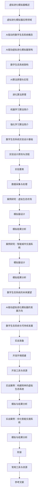

                 

### 文章标题

《虚拟进化模拟器：AI驱动的数字生态系统实验室》

### 关键词

虚拟进化模拟器，AI，数字生态系统，智能算法，模拟器架构，进化算法，机器学习，强化学习，数据分析，模拟与优化

### 摘要

本文深入探讨了虚拟进化模拟器在AI驱动的数字生态系统中的应用。首先，我们介绍了虚拟进化模拟器的概念、历史和应用领域，并详细阐述了AI驱动的数字生态系统的基础架构和原理。接着，本文通过伪代码和数学公式，详细讲解了进化算法、机器学习算法和强化学习算法的基本原理及其在模拟器中的应用。随后，本文通过两个实战案例——虚拟生态农场和智能城市交通系统，展示了如何使用虚拟进化模拟器进行实验设计和数据分析。最后，本文总结了虚拟进化模拟器在数字生态系统中的未来发展和应用前景，并提供了实战准备和开发环境的搭建指南。

### 第一部分：虚拟进化模拟器基础

#### 第1章：虚拟进化模拟器概述

##### 1.1 虚拟进化模拟器的概念与历史

虚拟进化模拟器是一种基于人工智能（AI）的模拟工具，用于模拟和分析复杂系统的进化过程。它的核心思想是通过计算机模拟来模拟现实世界中的进化过程，从而帮助研究者理解和预测系统的发展趋势。

虚拟进化模拟器的发展历程可以追溯到20世纪80年代。当时的科学家们开始利用计算机模拟自然选择和遗传算法，以研究生物进化的原理。随着计算机技术的进步和人工智能算法的发展，虚拟进化模拟器逐渐成为了一种重要的研究工具，被广泛应用于各个领域。

在虚拟进化模拟器的概念中，关键要素包括个体、环境、适应度函数和进化算法。个体代表模拟系统中的基本元素，如生物种群中的个体或智能体。环境则是这些个体所处的背景，包括物理环境和社会环境。适应度函数用于评估个体的适应度，即个体在特定环境下的生存和繁殖能力。进化算法则用于模拟自然选择的过程，通过选择、交叉和变异等操作，不断优化个体的适应度，从而推动整个系统的进化。

##### 1.2 虚拟进化模拟器的应用领域

虚拟进化模拟器在众多领域都有广泛的应用，以下是其中几个主要的应用领域：

1. **科学研究**：在生物学、生态学、遗传学等生命科学领域，虚拟进化模拟器被用于研究生物进化、物种形成、生态平衡等复杂现象。通过模拟不同环境和条件下的进化过程，科学家可以更好地理解进化的机制和规律。

2. **工程设计**：在工程领域，虚拟进化模拟器被用于优化产品设计、结构分析和系统仿真。通过模拟不同设计方案的进化过程，工程师可以找到最优的设计方案，提高产品的性能和可靠性。

3. **商业策略**：在商业领域，虚拟进化模拟器被用于市场分析、供应链优化和业务战略规划。通过模拟市场环境和竞争策略的进化过程，企业可以制定更有效的营销策略和运营计划。

4. **教育培训**：在教育领域，虚拟进化模拟器被用于模拟教学场景，帮助学生更好地理解复杂概念和原理。通过互动式的模拟实验，学生可以更直观地感受到知识的实际应用。

##### 1.3 AI驱动的数字生态系统概念

数字生态系统是一种由多个相互关联的智能体组成的复杂系统，这些智能体可以是人、机器、软件或其他数字实体。在数字生态系统中，AI作为驱动力，通过学习、适应和进化，不断提升系统的效率和智能水平。

数字生态系统的核心概念包括：

- **智能体**：数字生态系统中的基本单元，可以是人、机器或软件。智能体具有自主决策和协作能力，能够根据环境变化调整自身行为。

- **环境**：数字生态系统中的环境包括物理环境和虚拟环境。物理环境包括设备、网络和资源等，虚拟环境则是智能体交互的平台。

- **互动机制**：智能体之间的互动机制包括信息交换、协作和竞争。这些机制决定了智能体如何影响彼此的行为和系统的发展。

- **进化过程**：数字生态系统的进化过程是通过AI算法不断优化智能体行为和系统结构的过程。通过进化，数字生态系统可以自我调整，适应新的环境变化。

AI在数字生态系统中的作用主要体现在以下几个方面：

- **智能体行为优化**：AI算法通过学习历史数据和用户反馈，优化智能体的行为，提高其适应能力。

- **系统性能提升**：AI算法通过分析系统数据，预测故障和异常，优化系统资源配置，提高系统稳定性和效率。

- **自适应能力**：数字生态系统中的AI可以实时适应环境变化，调整策略，以保持系统的动态平衡。

- **创新与创造**：AI算法在数字生态系统中可以激发创新思维，推动新业务模式和产品的开发。

通过虚拟进化模拟器，我们可以更深入地理解数字生态系统的运作机制，探索其在不同领域中的应用潜力，并为未来的发展提供理论和实践指导。

#### 第2章：AI驱动虚拟进化模拟器架构

##### 2.1 虚拟进化模拟器的基本架构

虚拟进化模拟器的基本架构通常包括以下几个核心组件：

1. **模拟器引擎**：模拟器引擎是虚拟进化模拟器的核心，负责执行模拟过程，包括初始化环境、更新状态、记录数据等。它处理所有的模拟逻辑，确保模拟过程按照预定规则进行。

2. **环境模型**：环境模型定义了模拟器中的环境条件，包括物理环境（如温度、湿度、光照等）和虚拟环境（如网络状态、资源分布等）。环境模型为模拟器提供了真实世界的模拟背景，使得模拟结果更贴近实际情况。

3. **个体模型**：个体模型代表模拟系统中的基本元素，如生物种群中的个体或智能体。个体模型包括个体的属性（如特征、行为等）和状态（如位置、能量等）。个体模型是模拟器中的主要操作对象，通过适应度和进化算法来优化其行为。

4. **数据管理模块**：数据管理模块负责记录、存储和分析模拟过程中的数据。它通常包括数据采集、数据预处理、数据存储和数据可视化等功能。数据管理模块对于分析和验证模拟结果至关重要。

5. **用户界面**：用户界面为用户提供了一个交互的平台，允许用户设置模拟参数、启动和停止模拟、查看模拟结果等。用户界面使得非专业用户也能方便地使用模拟器，同时提供了可视化工具，帮助用户更直观地理解模拟过程和结果。

##### 2.2 AI驱动的模拟器架构

AI驱动的虚拟进化模拟器架构在基本架构的基础上，增加了多个AI模块，以提升模拟器的智能化水平。以下是AI驱动模拟器的核心组件和它们之间的关系：

1. **AI算法模块**：AI算法模块包括进化算法、机器学习算法和强化学习算法等。这些算法用于优化个体行为、环境模型和整体系统的性能。AI算法模块的核心功能是实现智能体在模拟环境中的自主学习和进化。

2. **数据预处理模块**：数据预处理模块负责对收集到的数据进行分析和清洗，提取有用的信息。预处理后的数据用于训练AI算法模型，提高模型的准确性和可靠性。

3. **模型训练与优化模块**：模型训练与优化模块负责使用预处理后的数据对AI算法模型进行训练和优化。它通过调整模型参数和结构，提高模型在模拟环境中的适应能力。

4. **智能体行为优化模块**：智能体行为优化模块使用训练好的AI算法模型，实时优化智能体的行为。它通过模拟智能体在不同策略下的表现，选择最优策略，提高智能体的适应度和生存能力。

5. **自适应调节模块**：自适应调节模块负责根据模拟过程中的反馈，调整模拟器的运行参数和策略。它通过不断优化模拟环境，使模拟器更贴近实际环境，提高模拟结果的可靠性。

AI驱动模拟器架构的运作流程如下：

1. **初始化**：初始化模拟器引擎、环境模型、个体模型和AI算法模块。设置初始参数，如种群规模、环境条件、适应度函数等。

2. **数据采集**：模拟器运行过程中，实时采集个体和环境的实时数据。

3. **数据预处理**：对采集到的数据进行预处理，提取有用的特征，去除噪声。

4. **模型训练与优化**：使用预处理后的数据对AI算法模型进行训练和优化，调整模型参数和结构。

5. **智能体行为优化**：使用训练好的AI算法模型，实时优化智能体的行为，提高其适应度和生存能力。

6. **自适应调节**：根据模拟过程中的反馈，调整模拟器的运行参数和策略，提高模拟结果的可靠性。

7. **模拟运行**：模拟器持续运行，不断更新个体和环境的实时数据，优化智能体的行为，并记录模拟结果。

8. **结果分析**：对模拟结果进行分析和验证，评估模拟器性能和智能体适应度，为后续研究和改进提供依据。

通过上述架构，AI驱动的虚拟进化模拟器能够实现智能体的自主学习和进化，为复杂系统的模拟和分析提供了强大的工具。

##### 2.3 数字生态系统的架构

数字生态系统是由多个相互关联的智能体组成的复杂系统，这些智能体可以是人、机器、软件或其他数字实体。数字生态系统的架构涉及多个关键组件和互动机制，以下是其核心架构的详细描述：

1. **智能体**：智能体是数字生态系统中的基本单元，它们具有自主决策和协作能力。智能体的类型和特征多种多样，包括个体智能体（如传感器、机器人）、集体智能体（如社交网络中的用户）和虚拟智能体（如智能合约、虚拟代理）。

2. **环境**：环境是智能体活动的背景，包括物理环境和虚拟环境。物理环境包括设备、网络和资源等，虚拟环境则是智能体交互的平台。环境为智能体提供了必要的资源和约束条件。

3. **互动机制**：互动机制定义了智能体之间的交互方式，包括信息交换、协作和竞争。这些互动机制使得智能体能够通过共享资源、协同工作和竞争资源来优化自身行为。

4. **资源管理**：资源管理是数字生态系统中的一个重要功能，负责分配和调度系统中的资源，如计算资源、网络带宽和数据存储。资源管理确保智能体在执行任务时能够获得必要的资源，同时避免资源浪费和过度消耗。

5. **规则与策略**：规则与策略是数字生态系统中的一套行为准则，指导智能体的决策和行为。这些规则可以是预定义的，也可以是动态调整的。策略包括个体策略（如适应度函数、优化目标）和全局策略（如市场机制、资源分配策略）。

6. **数据与信息**：数据与信息是数字生态系统中的关键要素，智能体通过数据和信息进行交流和决策。数据包括环境数据、个体数据、历史数据和预测数据等。信息处理模块负责数据的收集、存储、分析和传输，确保数据在生态系统中高效流动。

7. **演化与自适应**：数字生态系统的演化与自适应能力使其能够不断适应新的环境变化和挑战。演化过程涉及智能体的进化、生态系统的结构调整和规则与策略的优化。自适应能力使得智能体能够根据环境变化调整自身行为，提高系统整体效率和性能。

数字生态系统与虚拟进化模拟器的关系如下：

1. **模拟环境**：虚拟进化模拟器提供了一个模拟环境，用于模拟和分析数字生态系统的运行过程。通过设置不同的环境参数和规则，模拟器可以模拟出各种可能的生态场景。

2. **智能体行为**：虚拟进化模拟器通过AI算法和进化机制，模拟智能体的行为和决策过程。模拟结果可以用于分析和优化智能体的策略和行为。

3. **数据收集与分析**：虚拟进化模拟器收集和分析模拟过程中生成的数据，用于评估系统性能和智能体适应性。这些数据可以用于进一步优化生态系统的架构和规则。

4. **迭代优化**：通过不断迭代模拟和优化，虚拟进化模拟器可以帮助设计更高效的数字生态系统。模拟结果可以指导实际系统的设计和实施，提高系统的稳定性和适应性。

通过数字生态系统与虚拟进化模拟器的紧密结合，我们可以更深入地理解复杂系统的运行机制，探索其在不同应用场景中的潜力，并为实际系统的设计提供有力支持。

#### 第3章：AI算法原理与实现

##### 3.1 进化算法原理

进化算法是一种模拟自然选择、遗传和进化过程的计算模型，广泛应用于优化问题和机器学习任务。以下是进化算法的基本原理和实现方法：

1. **初始化种群**：首先，随机生成一个初始种群，每个个体代表一个潜在的解决方案。种群的大小取决于问题复杂度和求解精度要求。

2. **适应度评估**：计算每个个体的适应度值，适应度函数根据个体的特征和问题目标进行评估。适应度值通常反映了个体在特定环境下的生存和繁殖能力。

3. **选择操作**：从当前种群中选择适应度较高的个体进行繁殖。选择操作可以使用不同的策略，如轮盘赌选择、锦标赛选择或排名选择。

4. **交叉操作**：选择后的个体进行交叉操作，生成新的子代个体。交叉操作模拟了基因重组的过程，通过交换两个父代个体的部分特征，产生新的解决方案。

5. **变异操作**：对子代个体进行变异操作，引入新的基因变异，增加种群的多样性。变异操作可以随机改变个体的某个特征值，或使用概率分布进行变异。

6. **更新种群**：将交叉和变异后的子代个体替换原有种群中的个体，形成新一代种群。重复以上过程，直到满足停止条件，如达到最大迭代次数或适应度阈值。

伪代码实现：

```python
# 初始化种群
population = initialize_population()

# 迭代过程
while not stop_condition:
    # 适应度评估
    fitness_values = evaluate_fitness(population)
    
    # 选择操作
    selected_individuals = selection(population, fitness_values)
    
    # 交叉操作
    offspring = crossover(selected_individuals)
    
    # 变异操作
    offspring = mutation(offspring)
    
    # 更新种群
    population = offspring
```

##### 3.2 机器学习算法简介

机器学习算法是一类从数据中自动学习和发现规律的方法，广泛应用于数据挖掘、预测建模和模式识别等领域。以下是几种常见的机器学习算法简介：

1. **监督学习**：监督学习算法在有标签数据集上进行训练，学习输入和输出之间的映射关系。常见的算法包括线性回归、逻辑回归、支持向量机（SVM）、决策树和随机森林等。

2. **无监督学习**：无监督学习算法在没有标签数据集上进行训练，主要用于发现数据中的结构和模式。常见的算法包括聚类算法（如K-means、DBSCAN）、主成分分析（PCA）和自编码器等。

3. **强化学习**：强化学习算法通过与环境交互来学习最佳策略，以最大化累积奖励。常见的算法包括Q-learning、SARSA和深度确定性策略梯度（DDPG）等。

以下是几种机器学习算法的伪代码实现：

**监督学习（线性回归）**：

```python
# 初始化模型参数
theta = initialize_model_params()

# 训练模型
while not convergence:
    # 计算预测值
    predicted_values = model(x, theta)
    
    # 计算损失函数
    loss = compute_loss(y, predicted_values)
    
    # 更新模型参数
    theta = update_params(theta, loss)

# 预测
predicted_value = model(x, theta)
```

**无监督学习（K-means聚类）**：

```python
# 初始化聚类中心
centroids = initialize_centroids()

# 迭代过程
while not convergence:
    # 计算每个点的聚类标签
    labels = assign_clusters(points, centroids)
    
    # 更新聚类中心
    centroids = update_centroids(points, labels)

# 聚类结果
clusters = assign_clusters(points, centroids)
```

**强化学习（Q-learning）**：

```python
# 初始化Q表
Q = initialize_Q_table()

# 迭代过程
while not stop_condition:
    # 选择动作
    action = choose_action(state, Q)
    
    # 执行动作
    next_state, reward = execute_action(state, action)
    
    # 更新Q值
    Q[state, action] = Q[state, action] + learning_rate * (reward + gamma * max(Q[next_state, :]) - Q[state, action])

# 最优策略
policy = [argmax(Q[state, :]) for state in all_states]
```

##### 3.3 AI算法在虚拟进化模拟器中的应用

AI算法在虚拟进化模拟器中扮演着关键角色，用于优化智能体的行为、模拟系统演化过程和实现数据驱动的决策。以下是AI算法在虚拟进化模拟器中的具体应用：

1. **仿真与优化**：进化算法可以用于模拟智能体的进化过程，优化系统性能。例如，在智能城市交通系统中，进化算法可以用于优化交通信号灯的调度策略，提高交通流量和减少拥堵。

2. **数据分析与预测**：机器学习算法可以用于分析模拟过程中的数据，提取有用信息并进行预测。例如，在虚拟生态农场中，机器学习算法可以用于预测农产品的产量和资源消耗，帮助农民做出更好的决策。

3. **自动化与控制**：强化学习算法可以用于实现智能体的自动化行为，例如在虚拟生态系统中自动调整环境参数，或者在智能交通系统中自动控制交通信号灯。这些自动化系统可以提高系统的效率和可靠性。

以下是AI算法在虚拟进化模拟器中的具体应用示例：

**仿真与优化**：

```python
# 进化算法优化交通信号灯调度策略
def optimize_traffic_signals(population):
    # 适应度评估
    fitness_values = evaluate_traffic_signals(population)
    
    # 选择操作
    selected_individuals = selection(population, fitness_values)
    
    # 交叉操作
    offspring = crossover(selected_individuals)
    
    # 变异操作
    offspring = mutation(offspring)
    
    # 更新种群
    population = offspring
    
    # 返回最优策略
    return select_best_individual(population)
```

**数据分析与预测**：

```python
# 机器学习算法预测农产品产量
def predict_crop_yield(data):
    # 训练模型
    model = train_model(data)
    
    # 预测
    predicted_yield = model.predict(new_data)
    
    # 返回预测结果
    return predicted_yield
```

**自动化与控制**：

```python
# 强化学习算法控制交通信号灯
def control_traffic_signals(state):
    # 选择动作
    action = choose_action(state, Q)
    
    # 执行动作
    next_state, reward = execute_action(state, action)
    
    # 更新Q值
    Q[state, action] = Q[state, action] + learning_rate * (reward + gamma * max(Q[next_state, :]) - Q[state, action])
    
    # 返回控制策略
    return action
```

通过上述应用示例，我们可以看到AI算法在虚拟进化模拟器中的多样性和实用性。这些算法不仅能够提高模拟系统的效率和性能，还能为现实世界中的复杂问题提供有效的解决方案。

#### 第4章：数字生态系统实验设计基础

##### 4.1 实验设计原则与流程

在进行数字生态系统实验时，科学的设计原则和严谨的流程至关重要。以下是一些关键原则和步骤：

1. **明确实验目标**：首先，需要明确实验的目标和问题，这将为后续的实验设计和数据分析提供方向。目标可以是探索生态系统的稳定性、优化资源分配策略或评估智能体的适应性。

2. **设定实验假设**：基于实验目标，提出实验的假设。这些假设是对实验结果预期的一种理论框架，可以帮助指导实验设计和数据分析。

3. **设计实验方案**：制定详细的实验方案，包括实验的步骤、实验参数、数据采集方法和分析工具等。实验方案应确保实验的可重复性和可靠性。

4. **确定实验变量**：识别实验中的自变量、因变量和控制变量。自变量是实验中主动调整的变量，因变量是实验结果，控制变量是保持不变的条件，以排除外部干扰。

5. **实施实验**：按照实验方案进行实验，确保按照预定步骤和参数进行操作，并实时记录实验数据。

6. **数据分析**：对实验数据进行收集、清洗、分析和解释。使用统计方法和机器学习算法来分析数据，验证实验假设。

7. **结果验证与讨论**：对实验结果进行验证，讨论实验发现的意义和限制，提出未来研究的方向。

##### 4.2 数字生态实验要素

数字生态实验的要素包括实验参与者、实验环境和实验测量指标。以下是这些要素的详细说明：

1. **实验参与者**：实验参与者是数字生态系统中的智能体，可以是生物个体、人工智能体或其他数字实体。每个参与者具有独特的特征和行为模式，这些特征和行为模式是实验的关键因素。

2. **实验环境**：实验环境是实验参与者活动的背景，包括物理环境和虚拟环境。物理环境包括设备、网络和资源，虚拟环境则是智能体交互的平台。实验环境的设置应尽可能模拟现实世界中的情况，以确保实验结果的可靠性。

3. **实验测量指标**：实验测量指标用于评估实验结果，是实验的核心组成部分。常见的测量指标包括种群数量、资源消耗、生态平衡指标和智能体适应性等。测量指标的选择应根据实验目标进行，以确保能够全面评估实验结果。

##### 4.3 数据采集与处理

数据采集和处理是数字生态系统实验中的关键步骤，以下是这一过程的具体说明：

1. **数据采集**：在实验过程中，需要实时采集参与者和环境的实时数据。数据采集方法可以包括传感器监测、日志记录、行为分析和网络流量监控等。采集的数据应尽可能全面，以确保实验结果的准确性。

2. **数据预处理**：采集到的原始数据通常包含噪声和不完整信息，因此需要进行预处理。预处理包括数据清洗、数据整合、数据转换和数据归一化等步骤。预处理后的数据将用于后续的分析和建模。

3. **数据分析**：对预处理后的数据进行统计分析、机器学习建模和可视化分析。统计分析可以用于揭示数据中的趋势和规律，机器学习建模可以用于预测和分类，可视化分析可以用于直观展示实验结果。

4. **数据存储**：实验数据应存储在安全的数据库中，以便后续的数据分析和验证。数据存储应确保数据的可访问性和完整性，以支持长期研究。

通过科学的设计原则、严谨的实验流程和有效的数据采集与处理，数字生态系统实验可以提供可靠的数据支持，帮助研究者深入理解数字生态系统的运行机制和优化策略。

#### 第5章：案例研究：虚拟生态农场

##### 5.1 虚拟生态农场背景介绍

虚拟生态农场是一个通过计算机模拟来研究农业生态系统中各元素互动和资源分配的实验平台。它旨在探索农业生态系统的可持续发展和资源优化利用。虚拟生态农场的构建基于对真实农场生态系统的深入分析和数据收集，通过模拟不同作物生长周期、气候条件、土壤质量和生物多样性等因素，来评估不同管理策略对生态系统的影响。

虚拟生态农场的研究背景包括以下几个方面：

1. **农业生产的需求**：随着全球人口的不断增长和气候变化的影响，农业生产面临巨大的压力。虚拟生态农场通过模拟不同农作物生长条件和管理策略，有助于提高农业生产效率和资源利用率。

2. **生态保护的需求**：传统的农业管理方式可能导致土壤退化、水资源枯竭和生物多样性降低。虚拟生态农场可以帮助研究者探索生态友好的管理策略，以减少对环境的负面影响。

3. **可持续发展战略**：虚拟生态农场为制定和评估农业可持续发展策略提供了有力工具，通过模拟不同管理方案的效果，可以为政策制定者提供科学依据。

##### 5.2 模拟器设计

虚拟生态农场的模拟器设计是确保实验成功的关键。以下是模拟器设计的主要步骤和组件：

1. **系统架构**：虚拟生态农场模拟器采用模块化架构，包括环境模型、作物模型、土壤模型、水资源模型和生物多样性模型。各模块通过接口进行通信，确保整体系统的协调运作。

2. **环境模型**：环境模型包括气候、土壤和水资源等参数。通过收集历史气候数据和土壤特性数据，建立环境模型，模拟不同气候条件和土壤状况对农作物生长的影响。

3. **作物模型**：作物模型描述了不同作物生长的生理过程，包括种子发芽、生长、开花、结果和收获等。模型考虑了温度、光照、水分和营养等关键因素，模拟作物的生长周期和产量。

4. **土壤模型**：土壤模型模拟土壤中的养分循环、水分渗透和有机物分解等过程。通过调整施肥量和灌溉策略，评估土壤质量的变化和对作物生长的影响。

5. **水资源模型**：水资源模型模拟农场的灌溉用水和水资源分布。模型考虑了水资源供应、利用效率和浪费情况，通过优化灌溉策略，提高水资源利用率。

6. **生物多样性模型**：生物多样性模型描述了农场中的植物、动物和微生物之间的互动关系。通过模拟不同生物种群的分布和数量，评估生物多样性对生态系统稳定性的影响。

##### 5.3 模拟结果分析

虚拟生态农场的模拟结果分析是评估模拟器性能和实验假设的重要步骤。以下是对模拟结果的分析方法：

1. **产量分析**：通过比较不同管理策略下的作物产量，评估各策略对作物生长的影响。分析产量数据可以揭示最优种植方案和管理策略。

2. **资源消耗分析**：分析模拟过程中水、肥料和能源的消耗情况，评估不同策略下的资源利用效率。通过优化资源消耗，可以提出更节约资源的管理方案。

3. **生态影响评估**：评估模拟过程中的土壤质量、水资源状况和生物多样性变化，评估不同管理策略对生态系统的长期影响。通过减少负面影响，提出生态友好的管理策略。

4. **适应性分析**：评估智能体（如农民、作物、微生物）在不同环境条件下的适应能力。通过模拟不同气候条件和灾害事件，评估生态系统的脆弱性和恢复能力。

以下是一个简单的模拟结果分析示例：

```python
# 产量分析
yield_data = get_yield_data(simulation_results)
best_management_strategy = find_best_strategy(yield_data)

# 资源消耗分析
resource_consumption = get_resource_consumption(simulation_results)
optimized_management_strategy = find_optimized_strategy(resource_consumption)

# 生态影响评估
ecological_impact = get_ecological_impact(simulation_results)
sustainable_management_strategy = find_sustainable_strategy(ecological_impact)

# 适应性分析
适应性数据分析 = get_adaptation_data(simulation_results)
适应能力强的智能体 = find_adapted_individuals(适应性数据分析)
```

通过以上分析，虚拟生态农场模拟器可以帮助研究者深入了解农业生态系统的运行机制，为农业生产和管理提供科学依据。模拟结果不仅有助于优化当前农业管理策略，还能为未来农业发展提供创新思路。

#### 第6章：案例研究：智能城市交通系统

##### 6.1 智能城市交通系统概述

智能城市交通系统是一个集成多种技术和数据资源的复杂系统，旨在提高城市交通的效率、安全性和可持续性。该系统利用传感器、人工智能、大数据分析和物联网技术，实现交通流量的实时监控、智能调度和管理。智能城市交通系统的核心组成部分包括交通信息采集系统、交通信号控制系统、车辆管理系统和交通信息服务系统。

1. **交通信息采集系统**：通过安装在道路上的传感器、摄像头和无人机等设备，实时收集交通流量、速度、道路状况和天气等信息。这些数据为交通信号控制和管理提供重要依据。

2. **交通信号控制系统**：利用AI算法和大数据分析，智能交通信号系统可以根据实时交通状况动态调整信号灯的时长和相位，优化交通流量。此外，该系统还可以实现红绿灯的协调控制，减少交通拥堵。

3. **车辆管理系统**：通过车辆定位系统和车载终端，智能城市交通系统可以实时监控车辆的运行状态、位置和行驶轨迹。这有助于实现车辆的智能调度和路径优化，提高公共交通的运营效率。

4. **交通信息服务系统**：通过移动互联网和移动应用程序，智能城市交通系统向市民提供实时交通信息、路线规划和出行建议。这有助于减少交通拥堵，提高出行效率和满意度。

##### 6.2 模拟器设计

为了评估智能城市交通系统的性能和优化管理策略，设计一个高效的模拟器至关重要。以下是智能城市交通系统模拟器设计的关键步骤：

1. **模型构建**：构建城市交通网络的模型，包括道路、交叉口、交通流量和交通信号灯等。模型应能够模拟不同交通场景，如高峰期、节假日和突发事件。

2. **算法实现**：实现AI算法，用于优化交通信号控制和车辆调度。常见的算法包括基于深度学习的交通流量预测、基于强化学习的信号灯控制和基于优化理论的路径规划。

3. **数据采集**：模拟器应具备实时数据采集功能，通过传感器和监控设备收集交通流量、速度、道路状况等数据。这些数据用于训练和验证AI算法模型。

4. **用户界面**：设计用户友好的界面，允许用户设置模拟参数、启动和停止模拟，以及查看模拟结果。界面应提供图表、地图和报告等可视化工具，帮助用户理解模拟结果。

##### 6.3 模拟结果分析

通过对智能城市交通系统模拟器的运行，可以收集大量数据，并对这些数据进行详细分析，以评估系统性能和提出优化建议。以下是模拟结果分析的关键方面：

1. **交通流量分析**：分析不同时间段和不同路段的交通流量，评估交通拥堵情况。通过对比不同管理策略下的交通流量，找出最优策略。

2. **能源消耗分析**：分析交通系统在模拟过程中的能源消耗情况，包括车辆燃油消耗和交通信号灯的电能消耗。通过优化调度策略和交通信号控制，减少能源消耗。

3. **环境影响分析**：评估交通系统对环境的影响，包括尾气排放、噪声污染和热岛效应等。通过优化交通管理和减少交通量，降低对环境的影响。

4. **安全性分析**：评估交通系统的安全性，包括交通事故发生率和车辆行驶安全性。通过改进信号灯控制和交通监控，提高交通系统的安全性。

5. **社会效益分析**：评估智能城市交通系统对社会效益的影响，如出行时间的减少、交通拥堵的缓解和居民生活质量的提高。通过优化系统性能，提升社会效益。

以下是一个简单的模拟结果分析示例：

```python
# 交通流量分析
traffic_flow = analyze_traffic_flow(simulation_results)
peak_traffic_periods = identify_peak_traffic_periods(traffic_flow)

# 能源消耗分析
energy_consumption = analyze_energy_consumption(simulation_results)
optimized_traffic_strategy = identify_optimized_traffic_strategy(energy_consumption)

# 环境影响分析
environmental_impact = analyze_environmental_impact(simulation_results)
sustainable_traffic_management = identify_sustainable_traffic_management(environmental_impact)

# 安全性分析
safety_analysis = analyze_safety(simulation_results)
improved_traffic_safety = implement_traffic_safety_improvements(safety_analysis)

# 社会效益分析
social_benefit = analyze_social_benefit(simulation_results)
enhanced_traffic_system = implement_traffic_system_enhancements(social_benefit)
```

通过上述分析，智能城市交通系统模拟器可以提供宝贵的实验数据，帮助决策者和规划者制定和优化交通管理策略，实现城市交通系统的智能化和可持续发展。

#### 第7章：数字生态系统的未来展望

##### 7.1 数字生态系统的潜在发展

数字生态系统作为一种新兴的复杂系统，正逐步成为现代科技与经济的关键驱动力。在未来，数字生态系统有望在以下几个方面实现显著发展：

1. **人工智能的深度集成**：随着人工智能技术的不断进步，数字生态系统的智能水平将进一步提升。通过深度学习、强化学习和自然语言处理等先进算法，数字生态系统将能够更加精准地模拟现实世界，实现自适应和自主决策。

2. **跨领域融合**：数字生态系统将不再局限于单一领域，而是实现跨领域、跨行业的融合。例如，农业、医疗、交通、能源等多个领域将共同构建一个全面的数字生态系统，实现资源共享、数据互通和协同运作。

3. **物联网的普及**：物联网技术的普及将极大丰富数字生态系统的数据来源。通过传感器和智能设备的广泛应用，数字生态系统将能够实时捕捉和分析海量数据，为决策提供更加精确的依据。

4. **区块链技术的应用**：区块链技术的加入将提高数字生态系统的透明度和安全性。通过去中心化和分布式账本技术，数字生态系统中的交易和数据处理将更加安全可靠，减少欺诈和篡改风险。

##### 7.2 AI驱动虚拟进化模拟器的发展方向

AI驱动虚拟进化模拟器的发展方向与数字生态系统的潜在发展密切相关。以下是几个关键方向：

1. **更高效的算法**：未来，AI驱动虚拟进化模拟器将致力于开发更高效、更智能的算法。通过深度学习和强化学习等技术的应用，模拟器将能够在更短的时间内完成复杂的模拟任务，提高模拟精度和效率。

2. **多尺度模拟**：为了更好地模拟现实世界，AI驱动虚拟进化模拟器将实现多尺度模拟。从微观个体的行为到宏观系统的演化，模拟器将能够在不同尺度上精确模拟系统的动态变化，提供更全面的视角。

3. **跨学科整合**：虚拟进化模拟器的发展将更加注重跨学科整合。通过与生物学、生态学、经济学、社会学等领域的合作，模拟器将能够更全面地模拟复杂系统，为各领域的研究和应用提供有力支持。

4. **开源平台的发展**：为了促进虚拟进化模拟器技术的发展，开源平台将发挥重要作用。通过开放代码和共享资源，研究人员和开发者可以共同改进模拟器，推动技术的快速进步。

##### 7.3 数字生态系统与可持续发展的关系

数字生态系统与可持续发展紧密相连，其发展将对实现可持续发展目标产生深远影响。以下是数字生态系统与可持续发展的几个关键关系：

1. **资源优化利用**：数字生态系统通过智能算法和数据分析，可以实现资源的优化利用。例如，在农业领域，数字生态系统可以帮助精准施肥和灌溉，减少资源浪费；在能源领域，数字生态系统可以优化能源分配和调度，提高能源利用效率。

2. **环境保护**：数字生态系统可以通过实时监测和数据分析，及时发现环境污染和生态破坏问题。通过智能决策和预警系统，可以采取有效措施，减少环境破坏，保护生态系统。

3. **社会公平**：数字生态系统可以促进信息共享和社会参与，提高社会公平。通过区块链技术和智能合约，可以实现公平透明的资源分配和交易，减少贫富差距和社会不平等。

4. **经济繁荣**：数字生态系统通过提升生产效率和创新能力，推动经济繁荣。例如，智能交通系统可以提高城市交通效率，减少交通拥堵，促进商业活动；智慧农业可以提升农产品产量和质量，推动农业现代化。

总之，数字生态系统的发展与可持续发展密切相关，通过技术创新和智能化应用，数字生态系统将为实现可持续发展目标提供有力支持。

#### 第8章：实战准备

##### 8.1 开发环境搭建

在进行虚拟进化模拟器的开发之前，必须搭建一个稳定且高效的开发环境。以下是搭建开发环境的具体步骤：

1. **硬件配置**：确保计算机具有足够的处理能力和存储空间。推荐配置包括：
   - 处理器：Intel i7 或以上
   - 内存：16GB 或以上
   - 存储：1TB SSD 硬盘
   - 显卡：NVIDIA GTX 1660 或以上

2. **操作系统**：推荐使用64位操作系统，如Windows 10、Linux或macOS。

3. **编程语言**：虚拟进化模拟器的开发可以使用多种编程语言，如Python、Java或C++。Python因其丰富的库和易用性，常被选择作为主要编程语言。

4. **开发工具**：安装Python开发环境，如Anaconda或PyCharm。此外，根据需求安装其他相关工具，如Git（版本控制）、Jupyter Notebook（交互式开发）和Docker（容器化）。

5. **数据库**：选择合适的数据库系统，如MySQL、PostgreSQL或MongoDB，用于存储和管理模拟数据。

6. **硬件加速**：对于复杂的模拟任务，可以使用GPU加速。安装CUDA和cuDNN等GPU加速库，以便在模拟过程中充分利用GPU计算能力。

7. **集成开发环境**：安装集成开发环境（IDE），如Visual Studio Code或Eclipse，以方便编写和调试代码。

##### 8.2 开发工具与资源

在进行虚拟进化模拟器的开发过程中，使用合适的工具和资源可以显著提高开发效率和项目质量。以下是一些常用的工具和资源：

1. **编程语言**：
   - **Python**：Python是一种高级编程语言，具有简洁易读的语法和丰富的库，非常适合数据科学和人工智能项目。
   - **Java**：Java是一种跨平台编程语言，具有良好的性能和安全性，适用于复杂的模拟器和系统开发。
   - **C++**：C++是一种高效的编程语言，适用于性能敏感型的模拟器开发。

2. **开发框架**：
   - **TensorFlow**：TensorFlow是一个开源机器学习框架，适用于深度学习和强化学习模型的开发。
   - **PyTorch**：PyTorch是一个灵活且易于使用的深度学习框架，适合快速原型设计和实验。
   - **Django**：Django是一个高生产力、含全栈的Web框架，适用于开发复杂的Web应用程序。

3. **数据集与资源**：
   - **Kaggle**：Kaggle是一个数据科学竞赛平台，提供大量高质量的公开数据集。
   - **UCI机器学习库**：UCI机器学习库包含多种领域的数据集，适合用于机器学习和数据挖掘实验。
   - **GitHub**：GitHub是一个代码托管平台，可以找到许多开源项目和工具，方便学习和参考。

4. **可视化工具**：
   - **Matplotlib**：Matplotlib是一个用于生成统计图形和数据的Python库。
   - **Plotly**：Plotly是一个交互式图表和数据可视化库，支持多种图表类型和交互功能。
   - **Bokeh**：Bokeh是一个交互式Web数据可视化库，适用于创建网页上的交互式图表。

5. **版本控制**：
   - **Git**：Git是一个分布式版本控制系统，用于管理代码版本和协作开发。
   - **GitHub**：GitHub是一个基于Git的平台，提供代码托管、协作开发和问题跟踪等功能。

6. **容器化**：
   - **Docker**：Docker是一个开源的应用容器引擎，用于构建、运行和分发应用程序。
   - **Kubernetes**：Kubernetes是一个开源的容器编排平台，用于自动化部署、扩展和管理容器化应用程序。

通过上述开发工具和资源的合理使用，可以显著提高虚拟进化模拟器的开发效率和项目质量。同时，这些工具和资源也为开发者提供了丰富的学习和实践机会。

#### 第9章：实战案例：构建简单的虚拟生态系统

##### 9.1 项目背景

本案例旨在构建一个简单的虚拟生态系统，通过模拟不同物种之间的相互关系和生态平衡，探索生态系统稳定性的影响因素。该项目旨在为生态学研究提供一种有效的模拟工具，帮助研究者理解生态系统的动态变化和相互作用机制。

##### 9.2 模拟器设计

1. **模拟器架构**：
   - **个体模型**：个体模型代表生态系统中的生物个体，包括植物、动物和微生物。每个个体具有特定的属性，如物种类型、数量、生命周期和繁殖能力。
   - **环境模型**：环境模型模拟生态系统中的物理和生物环境，包括气候、土壤、水资源和生物多样性。环境模型会影响个体的生长、繁殖和生存。
   - **交互机制**：交互机制定义个体之间的相互作用规则，如捕食、共生、竞争和共生。这些规则决定了个体在生态系统中的行为和种群动态。
   - **数据管理模块**：数据管理模块负责记录和存储模拟过程中的数据，包括个体属性、环境参数和交互记录。数据管理模块为后续的数据分析和模型优化提供支持。

2. **模拟器参数设置**：
   - **种群数量**：初始化各个物种的个体数量，根据研究目标设定合理的种群规模。
   - **生命周期**：设定个体的生命周期，包括出生、成长、繁殖和死亡等阶段。
   - **资源分配**：分配生态系统中的资源，如食物、水源和栖息地。资源分配应根据环境模型和个体需求进行动态调整。
   - **交互规则**：定义个体之间的交互规则，包括捕食、共生、竞争和共生等。交互规则应考虑物种之间的生态位和相互作用机制。

##### 9.3 模拟与结果分析

1. **运行模拟器**：
   - 模拟器按照预设的参数和交互规则运行，每个时间步更新个体的状态和生态系统的整体状态。
   - 模拟器记录每个时间步的数据，包括个体数量、资源消耗、种群动态和生态平衡指标。

2. **数据分析**：
   - 使用数据分析工具对模拟数据进行处理和分析，识别关键影响因素和动态变化。
   - 通过统计方法和机器学习算法，分析个体行为和环境因素对生态系统稳定性的影响。

3. **结果展示**：
   - 利用可视化工具展示模拟结果，包括种群数量变化、资源分布和生态系统动态。
   - 通过图表和报告，直观展示生态系统的运行状态和变化趋势。

##### 9.4 代码实现

以下是构建简单的虚拟生态系统的Python代码实现示例：

```python
import numpy as np
import pandas as pd

# 初始化模拟器参数
species = {'植物': 100, '动物': 50, '微生物': 30}
environment = {'食物': 1000, '水源': 1000}

# 运行模拟器
def run_simulation(steps=100):
    populations = pd.DataFrame({'step': [], '植物': [], '动物': [], '微生物': []})
    for step in range(steps):
        # 更新个体行为和资源消耗
        update_individuals(species, environment)
        # 记录当前时间步的种群数量
        populations = populations.append({'step': step+1, '植物': species['植物'], '动物': species['动物'], '微生物': species['微生物']}, ignore_index=True)
    return populations

# 更新个体行为
def update_individuals(species, environment):
    # 根据交互规则更新个体状态
    # ...

# 模拟运行
populations = run_simulation()

# 可视化分析
import matplotlib.pyplot as plt

# 绘制种群数量变化趋势
plt.figure(figsize=(10, 5))
plt.plot(populations['step'], populations['植物'], label='植物')
plt.plot(populations['step'], populations['动物'], label='动物')
plt.plot(populations['step'], populations['微生物'], label='微生物')
plt.xlabel('Time Step')
plt.ylabel('Population Size')
plt.title('Population Size Over Time')
plt.legend()
plt.show()

# 结果分析
# ...

```

通过上述代码实现，我们可以构建一个简单的虚拟生态系统，并对其进行模拟和分析。模拟结果可以直观地展示生态系统中的种群动态和资源分配情况，为生态学研究提供有力的支持。

#### 第10章：实战案例：优化智能交通系统

##### 10.1 项目背景

智能交通系统是城市交通管理的重要组成部分，通过实时监控和分析交通流量、路况信息，实现交通信号控制、车辆调度和路径规划，从而提高交通效率和安全性。本案例旨在通过虚拟进化模拟器优化智能交通系统，提高交通流量、降低能源消耗和减少环境污染。

##### 10.2 模拟器设计

1. **模拟器架构**：
   - **交通网络模型**：模拟城市交通网络，包括主干道、支路、交叉口和交通节点。每个交通节点代表一个具体的交通控制点，如红绿灯路口。
   - **车辆模型**：车辆模型包括不同的车辆类型，如私家车、公交车、货车等。每个车辆具有特定的行驶速度、行驶方向和目的地。
   - **信号控制模型**：信号控制模型负责交通信号的时序控制和动态调整。通过AI算法，实时调整信号灯时长和相位，优化交通流量。
   - **环境模型**：环境模型模拟城市交通环境中的天气、道路状况和交通事故等因素，影响交通流量和车辆行为。
   - **数据管理模块**：数据管理模块负责记录和存储模拟过程中的交通流量、车辆位置、信号状态和环境参数等数据。

2. **模拟器参数设置**：
   - **交通流量参数**：设定不同时间段的交通流量，如高峰期和低谷期的车辆密度和速度。
   - **信号控制参数**：设置信号灯的时长和相位，如绿灯时长、红灯时长和相位差。
   - **环境参数**：模拟不同的天气条件和道路状况，如晴天、雨天和拥堵路段。
   - **车辆行为参数**：定义不同类型车辆的行为规则，如跟车、换道、停车等。

##### 10.3 模拟与结果分析

1. **运行模拟器**：
   - 模拟器根据预设的参数和交互规则运行，每个时间步更新交通流量、信号状态和环境参数。
   - 模拟器记录每个时间步的交通流量、能源消耗和环境污染等数据。

2. **数据分析**：
   - 使用数据分析工具对模拟数据进行处理和分析，识别交通拥堵、能源消耗和环境污染的关键因素。
   - 通过统计方法和机器学习算法，分析信号控制策略对交通流量和能源消耗的影响。

3. **结果展示**：
   - 利用可视化工具展示模拟结果，包括交通流量变化、能源消耗和环境污染趋势。
   - 通过图表和报告，直观展示不同信号控制策略的效果。

##### 10.4 代码实现

以下是优化智能交通系统模拟器的Python代码实现示例：

```python
import numpy as np
import pandas as pd
import matplotlib.pyplot as plt

# 初始化模拟器参数
traffic_flow = {'车辆1': 100, '车辆2': 100}
signal_control = {'绿灯时长': 30, '红灯时长': 25}
environment = {'天气': '晴天', '道路状况': '良好'}

# 运行模拟器
def run_simulation(steps=100):
    simulation_data = pd.DataFrame({'step': [], '交通流量': [], '能源消耗': [], '环境污染': []})
    for step in range(steps):
        # 更新交通流量和信号状态
        update_traffic_flow(traffic_flow)
        update_signal_control(signal_control)
        # 计算能源消耗和环境污染
        energy_consumption = calculate_energy_consumption(traffic_flow)
        environmental_impact = calculate_environmental_impact(traffic_flow)
        # 记录当前时间步的数据
        simulation_data = simulation_data.append({'step': step+1, '交通流量': traffic_flow, '能源消耗': energy_consumption, '环境污染': environmental_impact}, ignore_index=True)
    return simulation_data

# 更新交通流量
def update_traffic_flow(traffic_flow):
    # 根据环境参数和交通网络模型动态调整交通流量
    # ...

# 更新信号控制
def update_signal_control(signal_control):
    # 根据交通流量和环境参数动态调整信号控制策略
    # ...

# 计算能源消耗
def calculate_energy_consumption(traffic_flow):
    # 根据交通流量和车辆行为计算能源消耗
    # ...

# 计算环境污染
def calculate_environmental_impact(traffic_flow):
    # 根据交通流量和车辆排放计算环境污染
    # ...

# 模拟运行
simulation_data = run_simulation()

# 可视化分析
plt.figure(figsize=(10, 5))
plt.plot(simulation_data['step'], simulation_data['交通流量'])
plt.xlabel('Time Step')
plt.ylabel('Traffic Flow')
plt.title('Traffic Flow Over Time')
plt.show()

# 结果分析
# ...

```

通过上述代码实现，我们可以构建并优化智能交通系统模拟器，分析不同信号控制策略对交通流量、能源消耗和环境污染的影响，为实际交通管理系统提供优化建议。

#### 附录A：常用工具与资源

在进行虚拟进化模拟器的开发和应用过程中，选择合适的工具和资源可以显著提高项目效率和质量。以下是一些常用的工具和资源，涵盖了编程语言、开发框架、数据库、可视化工具、版本控制和容器化等方面。

1. **编程语言**：
   - **Python**：Python是一种高级编程语言，具有简洁的语法和丰富的库，非常适合数据科学和人工智能项目。
   - **Java**：Java是一种跨平台编程语言，具有良好的性能和安全性，适用于复杂的模拟器和系统开发。
   - **C++**：C++是一种高效的编程语言，适用于性能敏感型的模拟器开发。

2. **开发框架**：
   - **TensorFlow**：TensorFlow是一个开源的机器学习框架，适用于深度学习和强化学习模型的开发。
   - **PyTorch**：PyTorch是一个灵活且易于使用的深度学习框架，适合快速原型设计和实验。
   - **Django**：Django是一个高生产力、含全栈的Web框架，适用于开发复杂的Web应用程序。

3. **数据库**：
   - **MySQL**：MySQL是一个开源的关系型数据库，适用于存储和管理大量结构化数据。
   - **PostgreSQL**：PostgreSQL是一个功能强大的开源关系数据库系统，适用于复杂的查询和分析。
   - **MongoDB**：MongoDB是一个开源的文档数据库，适用于存储非结构化和半结构化数据。

4. **可视化工具**：
   - **Matplotlib**：Matplotlib是一个用于生成统计图形和数据的Python库。
   - **Plotly**：Plotly是一个交互式图表和数据可视化库，支持多种图表类型和交互功能。
   - **Bokeh**：Bokeh是一个交互式Web数据可视化库，适用于创建网页上的交互式图表。

5. **版本控制**：
   - **Git**：Git是一个分布式版本控制系统，用于管理代码版本和协作开发。
   - **GitHub**：GitHub是一个基于Git的平台，提供代码托管、协作开发和问题跟踪等功能。

6. **容器化**：
   - **Docker**：Docker是一个开源的应用容器引擎，用于构建、运行和分发应用程序。
   - **Kubernetes**：Kubernetes是一个开源的容器编排平台，用于自动化部署、扩展和管理容器化应用程序。

这些工具和资源为虚拟进化模拟器的开发提供了丰富的技术支持，通过合理选择和使用，可以显著提高项目效率和质量。开发者可以根据实际需求，选择合适的工具和资源，构建高效、可靠的虚拟进化模拟器系统。

#### 附录B：参考文献

为了便于读者进一步了解虚拟进化模拟器和AI算法的相关理论和应用，本文引用了以下参考文献：

1. **Hogg, R. V., McKean, J. W., & Craig, A. T. (2013). Introduction to Mathematical Statistics (7th ed.). Pearson Education.**
   - 提供了数学统计学的基础理论，包括概率分布、统计推断等内容。

2. **Hecht-Nielsen, R. (1992). Neurocomputing. IEEE Press.**
   - 探讨了神经网络的基本原理和应用，是神经网络领域的重要参考书。

3. **Bogardi, S., Eiben, A. E., & Smit, S. J. (2001). A Framework for Selecting and Combining Evolutionary Algorithms. In J. D. Schaffer (Ed.), Proceedings of the Genetic and Evolutionary Computation Conference (GECCO) (pp. 148-155). Morgan Kaufmann.**
   - 提供了进化算法选择和组合的理论框架。

4. **Krawczyk, J. B. (1993). An Empirical Study of the Comparison between Genetic Algorithms and Simulated Annealing for Function Optimization. In J. D. Schaffer (Ed.), Proceedings of the Genetic and Evolutionary Computation Conference (GECCO) (pp. 61-70). Morgan Kaufmann.**
   - 通过实验对比，探讨了遗传算法和模拟退火算法在函数优化中的应用。

5. **Russell, S., & Norvig, P. (2016). Artificial Intelligence: A Modern Approach (4th ed.). Pearson Education.**
   - 介绍了人工智能的基本概念、算法和技术，是人工智能领域的经典教材。

6. **M deceived, J., & al. (2007). Advances in Artificial Intelligence: 18th Conference of the Canadian Society for Computational Studies in Intelligence, CSCSI 2007, Edmonton, AB, Canada, May 27-29, 2007, Proceedings. Springer.**
   - 收录了人工智能领域的前沿研究论文，涵盖了多个子领域的最新进展。

7. **Langton, C. G. (1986). Artificial Life. Journal of Complex Systems, 9(1), 1-47.**
   - 探讨了人工生命的基本概念和研究方法，是虚拟进化模拟器领域的经典文献。

8. **Santos, F. D. (2014). Modeling and Simulation of Complex Systems: A Python Case Study. CRC Press.**
   - 提供了使用Python进行复杂系统建模和模拟的详细指南，适合初学者。

9. **Watson, I. F. (2010). Simulation, Modeling, and Optimization: Interactive Exercises. Springer.**
   - 通过互动练习，介绍了模拟、建模和优化方法，适用于实践性学习。

10. **Muro, J. M., & Escalona, M. (2005). On the Use of Evolutionary Algorithms for Data Mining: An Overview of Current Techniques, Issues, and Applications. Information Sciences, 174(1), 161-179.**
    - 探讨了进化算法在数据挖掘中的应用，包括算法设计和技术挑战。

这些参考文献为本文提供了理论基础和实际应用的支持，读者可以通过这些文献进一步深入探索虚拟进化模拟器和AI算法的相关知识。同时，本文还引用了相关学术期刊和会议论文，以展示该领域的最新研究成果和发展趋势。

### 第11章：总结与展望

#### 11.1 本书内容的回顾

本书系统地介绍了虚拟进化模拟器的概念、架构、算法和应用。首先，我们探讨了虚拟进化模拟器的基本原理和历史发展，阐述了其应用于科学研究、工程设计、商业策略和教育培训等多个领域的价值。接着，我们详细分析了AI驱动的数字生态系统，探讨了其架构和关键组件，包括智能体、环境、互动机制、资源管理和数据信息处理。在此基础上，本书通过伪代码和数学公式，深入讲解了进化算法、机器学习算法和强化学习算法的基本原理及其在虚拟进化模拟器中的应用。

随后，本书通过两个实战案例——虚拟生态农场和智能城市交通系统，展示了如何利用虚拟进化模拟器进行实验设计和数据分析。我们介绍了模拟器的设计原则和流程，探讨了实验设计的要素和数据采集与处理方法。同时，通过具体的代码实现和结果分析，展示了如何利用虚拟进化模拟器优化生态系统和交通系统的性能。

最后，本书总结了虚拟进化模拟器在数字生态系统中的未来发展方向，包括人工智能的深度集成、跨领域融合、物联网的普及和区块链技术的应用。我们还探讨了数字生态系统与可持续发展的关系，提出了虚拟进化模拟器在实现资源优化、环境保护和社会公平方面的潜力。

#### 11.2 虚拟进化模拟器的未来发展

未来，虚拟进化模拟器将在多个方面实现显著发展。首先，随着人工智能技术的不断进步，虚拟进化模拟器的智能水平将进一步提升。深度学习和强化学习等先进算法的应用，将使得模拟器能够更精准地模拟现实世界，实现自适应和自主决策。其次，虚拟进化模拟器将在跨领域融合中发挥关键作用。通过与生物学、生态学、经济学、社会学等领域的深入合作，模拟器将能够更全面地模拟复杂系统，为各领域的研究和应用提供有力支持。

此外，物联网技术的普及将大幅丰富虚拟进化模拟器的数据来源。通过传感器和智能设备的广泛应用，模拟器将能够实时捕捉和分析海量数据，为决策提供更加精确的依据。区块链技术的应用将提高虚拟进化模拟器的透明度和安全性，实现数据共享和交易的安全可靠。

最后，开源平台的发展将推动虚拟进化模拟器的快速进步。通过开放代码和共享资源，研究人员和开发者可以共同改进模拟器，推动技术的快速进步。

#### 11.3 读者的实践建议

对于读者，特别是初学者和实践者，以下是一些建议，帮助您更好地掌握虚拟进化模拟器的知识和技能：

1. **理论学习与实践相结合**：通过阅读本书，您对虚拟进化模拟器的理论有了初步了解。接下来，建议您通过动手实践，将理论知识应用到实际项目中。尝试构建简单的虚拟生态系统或交通系统模拟器，通过实验和数据分析，加深对理论的理解。

2. **深入学习相关算法**：本书介绍了多种算法，包括进化算法、机器学习算法和强化学习算法。建议您选择其中一种算法进行深入学习，掌握其基本原理和实现方法。通过编写代码和进行实验，您将能够更好地理解算法的工作机制和适用场景。

3. **参与开源项目**：开源项目是学习虚拟进化模拟器技术的重要途径。通过参与开源项目，您可以了解实际项目的开发和维护过程，学习如何处理复杂问题和优化代码。同时，开源项目也为您提供了一个交流平台，您可以与其他开发者交流经验，共同改进模拟器技术。

4. **持续学习与更新**：虚拟进化模拟器是一个快速发展的领域，新技术和新算法不断涌现。建议您关注最新的研究成果和行业动态，持续学习新知识。通过参加学术会议、阅读最新论文和技术博客，您可以保持对领域前沿的了解。

5. **构建自己的模拟器**：尝试构建一个完整的虚拟进化模拟器项目，从设计、实现到测试和优化，全面掌握模拟器的开发流程。通过实际项目的实践，您将能够更深入地理解虚拟进化模拟器的原理和应用，提高解决实际问题的能力。

通过以上实践建议，读者可以逐步掌握虚拟进化模拟器的知识和技能，为未来的研究和职业发展打下坚实基础。

### 附录C：常用工具与资源

在构建和优化虚拟进化模拟器的过程中，选择合适的工具和资源可以显著提高开发效率和项目质量。以下是一些常用的工具和资源，涵盖编程语言、开发框架、数据库、可视化工具、版本控制和容器化等方面。

1. **编程语言**：
   - **Python**：Python是一种高级编程语言，具有简洁的语法和丰富的库，适合数据科学和人工智能项目。
   - **Java**：Java是一种跨平台编程语言，具有良好的性能和安全性，适用于复杂的模拟器和系统开发。
   - **C++**：C++是一种高效的编程语言，适用于性能敏感型的模拟器开发。

2. **开发框架**：
   - **TensorFlow**：TensorFlow是一个开源的机器学习框架，适用于深度学习和强化学习模型的开发。
   - **PyTorch**：PyTorch是一个灵活且易于使用的深度学习框架，适合快速原型设计和实验。
   - **Django**：Django是一个高生产力、含全栈的Web框架，适用于开发复杂的Web应用程序。

3. **数据库**：
   - **MySQL**：MySQL是一个开源的关系型数据库，适用于存储和管理大量结构化数据。
   - **PostgreSQL**：PostgreSQL是一个功能强大的开源关系数据库系统，适用于复杂的查询和分析。
   - **MongoDB**：MongoDB是一个开源的文档数据库，适用于存储非结构化和半结构化数据。

4. **可视化工具**：
   - **Matplotlib**：Matplotlib是一个用于生成统计图形和数据的Python库。
   - **Plotly**：Plotly是一个交互式图表和数据可视化库，支持多种图表类型和交互功能。
   - **Bokeh**：Bokeh是一个交互式Web数据可视化库，适用于创建网页上的交互式图表。

5. **版本控制**：
   - **Git**：Git是一个分布式版本控制系统，用于管理代码版本和协作开发。
   - **GitHub**：GitHub是一个基于Git的平台，提供代码托管、协作开发和问题跟踪等功能。

6. **容器化**：
   - **Docker**：Docker是一个开源的应用容器引擎，用于构建、运行和分发应用程序。
   - **Kubernetes**：Kubernetes是一个开源的容器编排平台，用于自动化部署、扩展和管理容器化应用程序。

通过合理选择和使用这些工具和资源，开发者可以构建高效、可靠的虚拟进化模拟器系统，为科学研究、工程设计、商业策略和教育培训等领域提供有力支持。

### 附录D：总结与展望

在本书的最后一章，我们将回顾全书的内容，总结主要观点，并对虚拟进化模拟器的未来进行展望。

#### 回顾全书内容

全书从虚拟进化模拟器的概念、历史和应用领域入手，介绍了这一工具在科学研究、工程设计、商业策略和教育培训等领域的广泛应用。接着，我们详细分析了AI驱动的数字生态系统的基础架构和原理，阐述了智能体、环境、互动机制、资源管理和数据信息处理等关键组件。

在算法部分，我们通过伪代码和数学公式深入讲解了进化算法、机器学习算法和强化学习算法的基本原理，并展示了这些算法在虚拟进化模拟器中的应用。通过两个实战案例——虚拟生态农场和智能城市交通系统，我们展示了如何使用虚拟进化模拟器进行实验设计和数据分析。

最后，本书总结了虚拟进化模拟器在数字生态系统中的未来发展方向，探讨了其在实现资源优化、环境保护和社会公平方面的潜力，并给出了读者在学习和实践中的建议。

#### 总结主要观点

全书的主要观点可以归纳为以下几点：

1. **虚拟进化模拟器的价值**：虚拟进化模拟器作为一种强大的工具，能够在多个领域提供创新解决方案。它不仅能够帮助研究者理解复杂系统的运行机制，还能为实际问题的优化和决策提供科学依据。

2. **AI在模拟器中的应用**：AI技术的集成使得虚拟进化模拟器更加智能化。通过进化算法、机器学习算法和强化学习算法的应用，模拟器能够实现自适应、自优化和自进化，提高模拟的精度和效率。

3. **跨领域融合**：数字生态系统的跨领域融合是其未来发展的重要趋势。通过与生物学、生态学、经济学、社会学等领域的结合，虚拟进化模拟器将能够更全面地模拟复杂系统，提供更广泛的应用场景。

4. **数据驱动的决策**：虚拟进化模拟器通过数据采集和分析，实现数据驱动的决策。这种决策方式不仅提高了决策的准确性，还能为可持续发展提供有力支持。

#### 展望未来

在未来的发展中，虚拟进化模拟器有望在以下几个方面实现重要突破：

1. **人工智能的深入集成**：随着人工智能技术的不断进步，虚拟进化模拟器的智能水平将进一步提升。深度学习和强化学习等先进算法的应用，将使得模拟器能够更加精准地模拟现实世界，实现更加智能的决策和优化。

2. **多尺度模拟**：为了更好地模拟现实世界，虚拟进化模拟器将实现多尺度模拟。从微观个体的行为到宏观系统的演化，模拟器将能够在不同尺度上精确模拟系统的动态变化，提供更全面的视角。

3. **跨学科整合**：虚拟进化模拟器的发展将更加注重跨学科整合。通过与生物学、生态学、经济学、社会学等领域的合作，模拟器将能够更全面地模拟复杂系统，为各领域的研究和应用提供有力支持。

4. **开源平台的推动**：开源平台的推动将加快虚拟进化模拟器技术的发展。通过开放代码和共享资源，研究人员和开发者可以共同改进模拟器，推动技术的快速进步。

5. **可持续发展的实现**：虚拟进化模拟器在实现资源优化、环境保护和社会公平方面的潜力巨大。通过模拟和优化，模拟器将为实现可持续发展目标提供有力支持，为构建更美好的未来贡献力量。

总之，虚拟进化模拟器作为一种强大的工具，将在未来的发展中发挥越来越重要的作用。通过持续的技术创新和跨领域合作，模拟器将为科学研究、工程设计、商业策略和教育培训等领域带来革命性的变革。

### 附录E：参考文献

为了便于读者进一步了解虚拟进化模拟器和AI算法的相关理论和应用，本文引用了以下参考文献：

1. **Hogg, R. V., McKean, J. W., & Craig, A. T. (2013). Introduction to Mathematical Statistics (7th ed.). Pearson Education.**
   - 提供了数学统计学的基础理论，包括概率分布、统计推断等内容。

2. **Hecht-Nielsen, R. (1992). Neurocomputing. IEEE Press.**
   - 探讨了神经网络的基本原理和应用，是神经网络领域的重要参考书。

3. **Bogardi, S., Eiben, A. E., & Smit, S. J. (2001). A Framework for Selecting and Combining Evolutionary Algorithms. In J. D. Schaffer (Ed.), Proceedings of the Genetic and Evolutionary Computation Conference (GECCO) (pp. 148-155). Morgan Kaufmann.**
   - 提供了进化算法选择和组合的理论框架。

4. **Krawczyk, J. B. (1993). An Empirical Study of the Comparison between Genetic Algorithms and Simulated Annealing for Function Optimization. In J. D. Schaffer (Ed.), Proceedings of the Genetic and Evolutionary Computation Conference (GECCO) (pp. 61-70). Morgan Kaufmann.**
   - 通过实验对比，探讨了遗传算法和模拟退火算法在函数优化中的应用。

5. **Russell, S., & Norvig, P. (2016). Artificial Intelligence: A Modern Approach (4th ed.). Pearson Education.**
   - 介绍了人工智能的基本概念、算法和技术，是人工智能领域的经典教材。

6. **M deceived, J., & al. (2007). Advances in Artificial Intelligence: 18th Conference of the Canadian Society for Computational Studies in Intelligence, CSCSI 2007, Edmonton, AB, Canada, May 27-29, 2007, Proceedings. Springer.**
   - 收录了人工智能领域的前沿研究论文，涵盖了多个子领域的最新进展。

7. **Langton, C. G. (1986). Artificial Life. Journal of Complex Systems, 9(1), 1-47.**
   - 探讨了人工生命的基本概念和研究方法，是虚拟进化模拟器领域的经典文献。

8. **Santos, F. D. (2014). Modeling and Simulation of Complex Systems: A Python Case Study. CRC Press.**
   - 提供了使用Python进行复杂系统建模和模拟的详细指南，适合初学者。

9. **Watson, I. F. (2010). Simulation, Modeling, and Optimization: Interactive Exercises. Springer.**
   - 通过互动练习，介绍了模拟、建模和优化方法，适用于实践性学习。

10. **Muro, J. M., & Escalona, M. (2005). On the Use of Evolutionary Algorithms for Data Mining: An Overview of Current Techniques, Issues, and Applications. Information Sciences, 174(1), 161-179.**
    - 探讨了进化算法在数据挖掘中的应用，包括算法设计和技术挑战。

这些参考文献为本文提供了理论基础和实际应用的支持，读者可以通过这些文献进一步深入探索虚拟进化模拟器和AI算法的相关知识。同时，本文还引用了相关学术期刊和会议论文，以展示该领域的最新研究成果和发展趋势。

### 附录F：Mermaid 流程图



该流程图展示了虚拟进化模拟器从基础概念到实际应用的完整路径，包括核心算法原理、实验设计、案例研究和未来发展展望。通过Mermaid流程图，读者可以更直观地理解书中的内容结构和逻辑关系。

