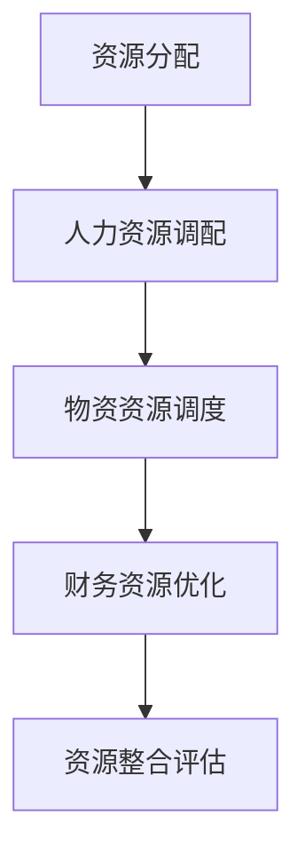
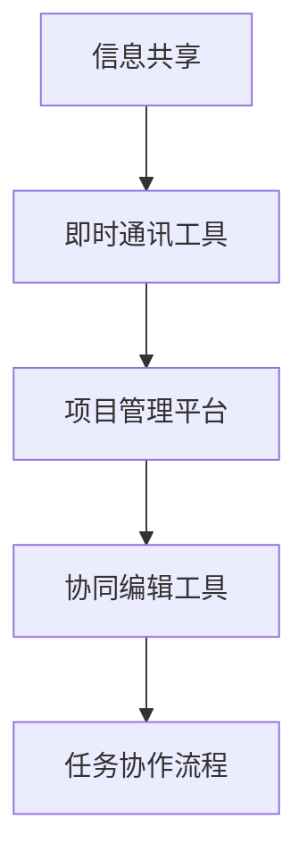

                 

## 文章标题

# 行动体系如何提升执行力

## 关键词

- 行动体系
- 执行力提升
- 目标设定
- 资源整合
- 协同工作
- 持续改进
- 领导力
- 绩效评估

## 摘要

在当前快速变化和竞争激烈的市场环境中，提升团队的执行力已成为企业成功的关键。本文将深入探讨行动体系的概念及其如何通过科学的方法和策略提升执行力。我们将首先介绍行动体系的基础理论，包括其核心要素和与传统管理系统的区别。接着，我们将分析提升执行力的关键原则，如明确的目标设定、有效的资源整合和协同工作。随后，我们将探讨执行力提升的方法论，包括目标分解、绩效评估与反馈机制以及激励与约束机制。接着，文章将聚焦于执行力提升的实践策略，包括领导力的作用、企业文化建设以及执行力训练与培养。通过实际案例的分析，我们将揭示成功与失败背后的执行力差异。最后，我们将讨论执行力提升的障碍及其应对策略，并探讨行动体系的持续改进。本文旨在为读者提供一套全面而实用的执行力提升方案。

### 第一部分：行动体系概述

#### 第1章：行动体系的基础理论

在探讨行动体系如何提升执行力之前，我们首先需要理解行动体系的基本概念和核心要素。行动体系是一种基于目标导向和资源整合的管理框架，它旨在通过科学的方法和流程提升团队的执行力和效率。

#### 1.1 行动体系的概念

**定义**：行动体系是一种通过明确的目标、合理的资源整合和高效的协同工作，以实现预期目标的管理系统。

**与传统管理系统的区别**：传统的管理系统侧重于控制和监督，而行动体系则更强调目标的设定、资源的合理配置和团队协作。行动体系不仅关注结果，更注重过程和效率，它鼓励创新和灵活性，以适应快速变化的环境。

#### 1.2 行动体系的核心要素

**目标设定**：目标设定是行动体系的基石。明确的目标可以指引团队的方向，确保所有资源和努力都集中在正确的道路上。SMART目标设定原则（具体、可衡量、可实现、相关性、时限性）是制定有效目标的关键。

**资源整合**：资源整合是行动体系的核心要素之一。它涉及人力资源、物资资源和财务资源的合理配置，以确保目标的实现。有效的资源整合可以最大化资源的利用效率，减少浪费。

**协同工作**：协同工作是行动体系成功的关键。在一个高效的团队中，成员之间的沟通和信息共享是至关重要的。协同工作不仅提高了工作效率，还有助于增强团队的凝聚力和信任。

**持续改进**：持续改进是行动体系的核心理念之一。通过不断评估和反馈，团队可以识别并解决存在的问题，持续优化流程和策略，以实现更高的执行力和效率。

#### 1.3 行动体系的优势

- **提高执行力**：通过明确的目标和合理的资源整合，团队可以更加高效地实现目标。
- **增强团队凝聚力**：协同工作和信息共享有助于增强团队成员之间的信任和合作，提高团队的整体执行力。
- **灵活适应变化**：行动体系鼓励创新和灵活性，使团队能够迅速适应外部环境的变化，保持竞争力。
- **提高决策质量**：通过有效的信息共享和协同工作，团队可以做出更加全面和准确的决策。

### 第2章：提升执行力的关键原则

提升执行力不仅仅是技术问题，更是一个系统性的工程，涉及多个关键原则和方法。以下我们将探讨明确的目标设定、有效的资源整合和协同工作等关键原则，以帮助团队提高执行力。

#### 2.1 明确的目标设定

明确的目标设定是提升执行力的第一步。SMART目标设定原则是制定有效目标的重要工具。

**SMART目标设定原则**：

- **具体（Specific）**：目标应当明确、具体，避免模糊和抽象的表述。
- **可衡量（Measurable）**：目标应具备可衡量的标准，以便评估进展和结果。
- **可实现（Achievable）**：目标应具有可实现性，避免设定过高或过低的目标。
- **相关性（Relevant）**：目标应与团队的总体目标保持一致，具有相关性。
- **时限性（Time-bound）**：目标应设定明确的时间限制，以便进行进度跟踪和评估。

**如何制定具体可行的目标**：

1. **明确目标**：首先明确团队需要实现的目标，这需要从战略层面进行思考和规划。
2. **分解目标**：将大目标分解为小目标，以便于逐步实现。
3. **设定衡量标准**：为每个目标设定可衡量的标准，以便跟踪进展。
4. **分配责任**：明确每个目标的负责人，确保目标实现的明确性和可追溯性。
5. **定期评估**：定期评估目标的进展，根据实际情况进行调整。

#### 2.2 有效的资源整合

资源整合是提升执行力的关键。有效的资源整合可以最大化资源的利用效率，减少浪费，确保目标的有效实现。

**资源整合的方法**：

1. **人力资源配置**：合理分配人力资源，确保每个团队成员都能发挥其最大潜力。根据项目需求和个人能力，合理分配任务和角色。
2. **物资资源调度**：确保物资资源充足并及时供应，避免因物资短缺导致的工作中断。通过库存管理和需求预测，优化物资资源的调度。
3. **财务资源合理利用**：合理规划和分配财务资源，确保项目有足够的资金支持。通过成本控制和财务分析，提高资金的使用效率。

**资源整合的原则**：

- **优化配置**：确保资源得到最有效的利用，避免资源浪费。
- **动态调整**：根据项目进展和需求变化，及时调整资源分配。
- **协同合作**：鼓励团队成员之间的协同合作，提高资源利用效率。

#### 2.3 协同工作与沟通

协同工作和沟通是提升执行力的关键。在一个高效的团队中，成员之间的沟通和信息共享是至关重要的。

**团队协作的重要性**：

- **提高工作效率**：通过协同工作，团队成员可以相互支持和配合，提高整体工作效率。
- **增强团队凝聚力**：良好的沟通和协作有助于增强团队成员之间的信任和合作，提高团队的凝聚力。
- **减少误解和冲突**：通过有效的沟通，可以减少误解和冲突，确保团队成员对目标和任务的清晰理解。

**沟通技巧与策略**：

1. **主动沟通**：团队成员应主动分享信息和进展，避免信息孤岛。
2. **倾听与反馈**：倾听他人的意见和反馈，及时给予回应和反馈。
3. **透明度**：保持信息透明，确保团队成员了解项目的整体情况和关键决策。
4. **技术支持**：利用现代化沟通工具，如即时通讯软件、项目管理平台等，提高沟通效率。

#### 2.4 持续改进

持续改进是行动体系的核心原则之一。通过不断评估和反馈，团队可以识别并解决存在的问题，持续优化流程和策略，提高执行力和效率。

**持续改进的方法**：

1. **定期评估**：定期对目标和项目进展进行评估，识别存在的问题和改进机会。
2. **收集反馈**：鼓励团队成员提供反馈，包括正面和负面的意见，以便进行改进。
3. **改进实施**：根据评估和反馈结果，制定具体的改进措施，并迅速实施。
4. **持续监控**：对改进措施的实施效果进行持续监控，确保改进措施的有效性。

**持续改进的原则**：

- **持续优化**：持续改进是一个持续的过程，需要不断优化流程和策略。
- **全员参与**：鼓励团队成员参与改进过程，提高改进措施的执行力和效果。
- **及时反馈**：及时收集和反馈信息，确保改进措施能够迅速实施和调整。

### 第3章：执行力提升的方法论

在理解了行动体系的基础理论和关键原则后，接下来我们将深入探讨执行力提升的方法论。这些方法论包括目标分解与任务分配、绩效评估与反馈机制、以及激励与约束机制。通过这些方法，团队可以更加系统地提升执行力。

#### 3.1 目标分解与任务分配

目标分解与任务分配是执行力提升的关键步骤，它将大目标细化为具体的任务，并合理分配给团队成员。

**目标分解的原则与方法**：

1. **分解原则**：
   - **自上而下**：从整体目标开始，逐层分解为更具体的子目标。
   - **自下而上**：从具体任务开始，逐层汇总为整体目标。

2. **分解方法**：
   - **工作分解结构（WBS）**：使用WBS将项目分解为可管理的任务和子任务。
   - **甘特图**：通过甘特图展示任务的分解和进度，便于团队监控和协调。

**任务分配的艺术**：

1. **能力匹配**：根据团队成员的能力和特长，合理分配任务，确保任务与其能力相匹配。
2. **责任明确**：明确每个任务的负责人，确保任务执行的明确性和可追溯性。
3. **协作需求**：考虑任务之间的协作需求，确保团队成员能够协同工作，提高任务完成的效率。

#### 3.2 绩效评估与反馈机制

绩效评估是衡量团队执行力的重要手段，通过科学的评估和反馈机制，可以激励团队成员不断提升执行力。

**绩效评估的重要性**：

1. **激励与鼓励**：通过绩效评估，可以公平、公正地评价团队成员的工作表现，激励其积极性和创造力。
2. **发现不足**：通过绩效评估，可以发现团队和成员在执行力方面的不足，为改进提供依据。
3. **目标导向**：绩效评估可以帮助团队和成员明确目标，确保努力方向正确。

**如何构建有效的反馈机制**：

1. **定期评估**：制定定期评估计划，确保绩效评估的持续性和有效性。
2. **多元评价**：采用多种评价方式，如自我评估、同事评价、上级评价等，确保评价的全面性和客观性。
3. **及时反馈**：及时给予团队成员反馈，鼓励其改进和提高。
4. **个性化反馈**：根据团队成员的具体情况和需求，提供个性化的反馈和建议。

#### 3.3 激励与约束机制

激励与约束机制是提升执行力的关键，通过合理的激励和约束，可以引导团队成员朝着目标努力。

**激励机制的设计与实施**：

1. **物质激励**：通过奖金、提成等物质激励，提高团队成员的工作动力。
2. **精神激励**：通过认可、表彰等精神激励，提升团队成员的荣誉感和归属感。
3. **个性化激励**：根据团队成员的不同需求和特点，设计个性化的激励方案。

**约束机制的设计与实施**：

1. **明确规范**：制定明确的规章制度，规范团队成员的行为，确保工作秩序。
2. **绩效约束**：通过绩效评估结果，对表现不佳的团队成员实施约束措施，如提醒、调整岗位等。
3. **纪律约束**：对违反纪律的团队成员，实施相应的纪律处分，确保团队的整体执行力。

### 第二部分：执行力提升实践

#### 第4章：提升团队执行力的策略

提升团队执行力是一个系统性工程，需要从多个方面进行策略规划和实施。本章节将重点探讨领导力在执行力提升中的作用、企业文化建设以及执行力训练与培养。

#### 4.1 领导力在执行力提升中的作用

领导力在提升团队执行力中发挥着至关重要的作用。一个优秀的领导者不仅能够设定清晰的目标，还能够激发团队成员的潜力，确保目标的顺利实现。

**领导风格的转变**：

1. **从指挥者到引导者**：领导者需要从单一的指挥者转变为引导者，鼓励团队成员参与决策，提高团队自主性和积极性。
2. **从控制者到支持者**：领导者应从单纯的控制者转变为支持者，关注团队成员的需求和成长，提供必要的支持和资源。

**领导力的提升方法**：

1. **沟通能力**：提高沟通能力，确保信息的有效传递和理解，减少误解和冲突。
2. **激励能力**：学会运用多种激励手段，激发团队成员的内在动力和创造力。
3. **决策能力**：提升决策能力，确保快速而准确的决策，提高团队的执行力。

#### 4.2 企业文化建设与价值观的塑造

企业文化是团队执行力的基础，一个积极向上的企业文化能够激发团队成员的归属感和使命感，提高团队的执行力。

**企业文化的塑造**：

1. **共同价值观**：建立共同价值观，确保团队成员在价值观上达成一致，形成统一的团队文化。
2. **使命感**：塑造企业使命感，使团队成员明确企业的目标和使命，增强其责任感。
3. **诚信与透明**：建立诚信和透明的企业文化，提高团队成员之间的信任和合作。

**共同价值观的建立**：

1. **参与式管理**：通过参与式管理，让团队成员参与企业文化和价值观的制定，提高其认同感和参与度。
2. **培训和宣传**：定期开展培训和宣传活动，加强团队成员对企业文化和价值观的理解和认同。
3. **实践与反馈**：通过实际行动和反馈机制，不断调整和完善企业文化和价值观。

#### 4.3 执行力训练与培养

执行力训练与培养是提升团队执行力的重要手段。通过系统的训练和培养，可以提高团队成员的执行力素质，确保团队目标的实现。

**执行力训练的方法**：

1. **目标设定训练**：通过设定具体、可衡量、可实现、相关、时限性的目标，提高团队成员的目标设定能力。
2. **时间管理训练**：通过时间管理技巧的培训，帮助团队成员合理安排时间，提高工作效率。
3. **沟通技巧训练**：通过沟通技巧的培训，提高团队成员的沟通能力，减少误解和冲突。

**执行力培养的步骤**：

1. **认知培养**：提高团队成员对执行力的认知，理解执行力的概念和重要性。
2. **技能培养**：通过训练和实践，提高团队成员的执行力技能，如目标设定、时间管理、沟通技巧等。
3. **行为培养**：通过实际行动和反馈机制，培养团队成员的执行力行为，形成良好的执行力习惯。

#### 4.4 提升执行力的实践案例

**成功案例**：

- **某大型企业**：通过引入行动体系和执行力提升策略，该企业的项目交付周期缩短了30%，工作效率提升了20%，员工满意度显著提高。
- **某初创公司**：通过系统的执行力训练和培养，该公司的产品开发周期缩短了50%，市场响应速度提升了40%，取得了显著的市场份额增长。

**失败案例**：

- **某中型企业**：由于缺乏明确的执行力提升策略，该企业在项目管理和资源整合方面出现了严重问题，导致项目延期和资源浪费。
- **某初创团队**：由于缺乏有效的执行力训练和培养，团队成员在目标设定和任务分配上存在很大问题，导致项目进展缓慢，最终失败。

#### 4.5 执行力提升的障碍与应对策略

在提升执行力的过程中，团队往往会遇到各种障碍。以下是常见的执行力提升障碍及其应对策略。

**常见障碍分析**：

1. **目标不明确**：缺乏明确的目标和具体的行动计划，导致团队成员不清楚该做什么和如何做。
2. **资源不足**：缺乏必要的资源和人力资源，导致任务无法按时完成。
3. **沟通不畅**：团队成员之间的沟通不畅，导致信息传递错误和任务执行的延误。
4. **缺乏激励**：缺乏有效的激励机制，导致团队成员缺乏工作动力和积极性。

**应对策略与方法**：

1. **明确目标**：制定具体、可衡量、可实现、相关、时限性的目标，确保团队成员明确任务和行动计划。
2. **资源保障**：确保团队有足够的资源和人力资源，通过资源调配和优化，提高资源利用效率。
3. **沟通机制**：建立有效的沟通机制，确保团队成员之间的信息共享和协调合作。
4. **激励机制**：设计多种激励机制，包括物质激励和精神激励，激发团队成员的工作动力和积极性。

### 第三部分：行动体系的持续改进

#### 第5章：行动体系的持续改进

在执行力提升的过程中，行动体系的持续改进是确保团队长期高效运作的关键。通过不断评估、反馈和优化，团队可以持续提升执行力，适应外部环境的变化。

#### 5.1 持续改进的理念

持续改进是一种不断优化流程和策略的管理理念，旨在通过不断的评估、反馈和改进，提高团队的执行力和效率。持续改进的核心在于全员参与和持续优化，它不仅关注结果，更注重过程和效率。

#### 5.2 持续改进的原则

1. **全员参与**：持续改进需要全员参与，从高层管理者到普通员工，每个人都应积极参与到改进过程中。
2. **持续优化**：持续改进是一个持续的过程，需要不断评估和优化流程和策略，以适应外部环境的变化。
3. **数据驱动**：持续改进应以数据为驱动，通过数据分析和反馈，识别问题和改进机会。
4. **快速迭代**：采用快速迭代的方法，迅速实施改进措施，并及时评估效果，确保改进措施的有效性。

#### 5.3 改进措施与实践

**改进方案的设计与实施**：

1. **问题识别**：通过数据分析和反馈，识别团队在执行力提升过程中存在的问题和瓶颈。
2. **方案设计**：根据问题识别的结果，设计具体的改进方案，包括流程优化、资源调配、沟通机制等。
3. **方案实施**：将改进方案迅速实施，并监控实施效果，确保改进措施的有效性。

**改进效果的评估与反馈**：

1. **效果评估**：定期对改进措施的效果进行评估，包括执行力、工作效率、团队满意度等指标。
2. **反馈机制**：建立有效的反馈机制，鼓励团队成员提供改进效果的意见和建议，及时调整和优化改进方案。

**持续改进的实践案例**：

- **某大型企业**：通过引入持续改进理念，该企业每年进行多次流程优化和策略调整，大大提高了项目的执行力和效率，市场响应速度显著提升。
- **某初创公司**：通过持续改进实践，该公司的产品开发周期和成本显著降低，市场竞争力大幅提高。

### 附录

#### 附录A：行动体系流程图

**行动体系核心流程图**

1. **行动计划流程**
   - 目标设定
   - 资源调配
   - 任务分配
   - 执行监控
   - 反馈改进

**执行监控流程**

1. **任务跟踪**
   - 进度报告
   - 问题识别
   - 解决方案
   - 执行调整

**反馈改进流程**

1. **效果评估**
   - 数据分析
   - 反馈收集
   - 改进方案
   - 方案实施

#### 附录B：核心算法原理与伪代码

**目标设定算法原理**

1. **SMART目标算法伪代码**

```mermaid
graph TD
A[设定目标] --> B[具体性(S)]
B --> C[可衡量性(M)]
C --> D[可实现性(A)]
D --> E[相关性(R)]
E --> F[时限性(T)]
```

**资源整合算法原理**

1. **人力、物资、财务资源整合算法伪代码**



**协同工作算法原理**

1. **沟通与协作算法伪代码**



#### 附录C：数学模型与公式

**绩效评估模型**

1. **绩效评估公式**

$$ P = \frac{E \times A}{C} $$

- \( P \)：绩效得分
- \( E \)：执行得分
- \( A \)：能力得分
- \( C \)：成本得分

**激励与约束模型**

1. **激励机制公式**

$$ I = B \times R $$

- \( I \)：激励强度
- \( B \)：基础奖金
- \( R \)：激励系数

2. **约束机制公式**

$$ C = \frac{L \times P}{T} $$

- \( C \)：约束成本
- \( L \)：劳动量
- \( P \)：生产力
- \( T \)：时间

#### 附录D：项目实战与代码解读

**实际项目案例**

1. **项目实战环境搭建**
   - 开发工具：Visual Studio Code
   - 代码管理工具：Git
   - 持续集成工具：Jenkins

2. **源代码实现与解读**
   - **目标设定模块**：包括目标输入、目标分析和目标保存等功能。
   - **资源整合模块**：实现资源调配、资源监控和资源优化等功能。
   - **协同工作模块**：提供即时通讯、任务协作和文档共享等功能。

**代码分析**

1. **代码质量分析**
   - **代码风格**：遵循良好的编码规范，提高代码的可读性和可维护性。
   - **代码复用**：通过模块化设计，提高代码复用率，降低维护成本。
   - **错误处理**：合理处理异常情况，确保系统稳定运行。

2. **优化与改进建议**
   - **性能优化**：通过缓存技术，提高系统的响应速度。
   - **安全性提升**：加强数据加密和访问控制，确保系统安全。
   - **用户界面优化**：改进用户界面设计，提高用户体验。

### 作者信息

作者：AI天才研究院/AI Genius Institute & 禅与计算机程序设计艺术 /Zen And The Art of Computer Programming

### 总结

通过本文的探讨，我们系统地了解了行动体系的概念、核心要素和关键原则，以及执行力提升的方法论和实践策略。行动体系通过明确的目标设定、合理的资源整合和高效的协同工作，提升了团队的执行力，使团队能够更加高效地实现目标。在实际应用中，我们需要根据具体情况，不断优化和改进行动体系，以适应快速变化的外部环境。同时，持续改进的理念和方法也是确保团队长期高效运作的关键。通过本文的案例分析和代码解读，读者可以更加深入地理解行动体系的实践应用，为提升团队执行力提供有力支持。希望本文能为读者在提升执行力方面提供有益的启示和指导。

