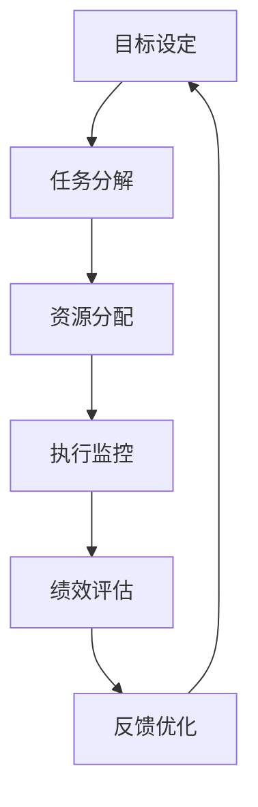

                 

# 文章标题：行动体系：决定管理者的天花板

> 关键词：行动体系、管理者、目标管理、执行力、领导力、实战应用

> 摘要：本文从行动体系的定义、构建框架、目标管理、执行力、实战应用、领导力等多个维度深入剖析了行动体系对管理者天花板的决定性作用。通过理论讲解、算法原理、数学模型以及实战案例，为管理者提供了实用的行动体系构建与优化策略。

### 目录大纲

- 第一部分：行动体系概述
  - 第1章：行动体系的定义与重要性
    - 1.1 行动体系的定义
    - 1.2 行动体系在管理中的重要性
    - 1.3 行动体系与传统管理的区别
  - 第2章：构建行动体系的框架
    - 2.1 行动体系构建的基础原则
    - 2.2 行动体系的五大要素
    - 2.3 行动体系的实践路径
  - 第3章：行动体系与目标管理
    - 3.1 目标管理的定义与方法
    - 3.2 目标分解与任务分配
    - 3.3 行动体系下的目标管理策略
  - 第4章：行动体系与执行力
    - 4.1 执行力的定义与要素
    - 4.2 提升执行力的策略
    - 4.3 行动体系中的执行力保障机制

- 第二部分：行动体系的实战应用
  - 第5章：行动体系在企业管理中的应用
    - 5.1 行动体系在战略规划中的应用
    - 5.2 行动体系在团队管理中的应用
    - 5.3 行动体系在项目执行中的应用
  - 第6章：行动体系在不同行业的应用案例
    - 6.1 互联网行业的行动体系实践
    - 6.2 制造业的行动体系实践
    - 6.3 零售业的行动体系实践
  - 第7章：行动体系的持续优化与迭代
    - 7.1 行动体系的评估与反馈
    - 7.2 行动体系的优化策略
    - 7.3 行动体系的持续迭代方法

- 第三部分：行动体系的领导力要素
  - 第8章：领导者在行动体系中的角色
    - 8.1 领导者的行动导向
    - 8.2 领导者的决策能力
    - 8.3 领导者的沟通与协调能力
  - 第9章：领导力与行动体系的关系
    - 9.1 领导力在行动体系中的体现
    - 9.2 提升领导力的方法
    - 9.3 行动体系下的领导力培养策略
  - 第10章：行动体系与领导者的共同成长
    - 10.1 行动体系对领导者的挑战
    - 10.2 领导者通过行动体系实现自我提升
    - 10.3 行动体系与领导者的共同成长路径

- 附录
  - 附录A：行动体系实践工具与方法
  - 附录B：行动体系相关资源

---

### 第一部分：行动体系概述

#### 第1章：行动体系的定义与重要性

## 1.1 行动体系的定义

行动体系是指一系列组织、规划、执行和控制的流程和策略，用于确保组织目标的实现。它包括目标设定、任务分解、资源配置、执行监控和绩效评估等环节。行动体系的核心在于将组织的目标转化为具体的行动，并确保这些行动能够高效、有序地执行。

### 1.2 行动体系在管理中的重要性

在管理中，行动体系具有至关重要的作用。首先，它有助于明确组织的目标和方向，确保团队成员共同努力。其次，行动体系能够提高组织的执行力和效率，减少资源浪费。此外，行动体系还为管理者提供了绩效评估和反馈机制，有助于持续优化管理策略。

### 1.3 行动体系与传统管理的区别

传统管理往往侧重于规章制度的制定和执行，而行动体系则更加注重目标和结果。传统管理侧重于控制，而行动体系则强调自主和合作。传统管理往往依赖于经验，而行动体系则基于数据和科学方法。总之，行动体系是一种更加现代化、高效和灵活的管理方式。

## 第2章：构建行动体系的框架

### 2.1 行动体系构建的基础原则

构建行动体系需要遵循以下基础原则：

1. **目标明确**：明确组织的目标和愿景，确保行动体系与组织目标保持一致。
2. **任务分解**：将大目标分解为具体的任务和行动项，明确责任和截止日期。
3. **资源配置**：根据任务需求和资源状况，合理分配人力、物力和财力。
4. **执行监控**：建立执行监控机制，及时发现问题并采取纠正措施。
5. **绩效评估**：定期评估行动体系的执行效果，根据反馈进行优化。

### 2.2 行动体系的五大要素

行动体系包括以下五大要素：

1. **目标设定**：明确组织的战略目标，并将其分解为可执行的具体目标。
2. **任务分解**：将目标分解为具体的任务和行动项，明确责任人和截止日期。
3. **资源分配**：根据任务需求合理配置资源，确保任务能够按时完成。
4. **执行监控**：建立执行监控机制，跟踪任务进度并及时调整。
5. **绩效评估**：定期评估行动体系的执行效果，并根据反馈进行优化。

### 2.3 行动体系的实践路径

构建行动体系的实践路径通常包括以下步骤：

1. **明确目标**：确定组织的战略目标和愿景。
2. **任务分解**：将大目标分解为具体的任务和行动项。
3. **资源分配**：根据任务需求合理配置资源。
4. **执行监控**：建立执行监控机制，确保任务按时完成。
5. **绩效评估**：定期评估行动体系的执行效果，并根据反馈进行优化。

## 第3章：行动体系与目标管理

### 3.1 目标管理的定义与方法

目标管理是一种通过设定和实现目标来提高组织绩效的管理方法。目标管理的核心在于明确目标、分解目标、落实目标和评估目标。目标管理的具体方法包括以下步骤：

1. **设定目标**：明确组织的目标和愿景，并将其分解为具体的子目标。
2. **分解目标**：将大目标分解为具体的任务和行动项，明确责任人和截止日期。
3. **落实目标**：根据任务需求合理配置资源，确保任务能够按时完成。
4. **评估目标**：定期评估目标的实现情况，并根据反馈进行优化。

### 3.2 目标分解与任务分配

目标分解是将大目标分解为具体的任务和行动项的过程。目标分解的关键在于确保目标具有可执行性、明确性和时效性。目标分解的方法包括以下步骤：

1. **确定目标**：明确组织的目标和愿景。
2. **分解目标**：将大目标分解为具体的子目标。
3. **确定任务**：将子目标分解为具体的任务和行动项。
4. **分配任务**：明确责任人和截止日期，确保任务能够按时完成。

### 3.3 行动体系下的目标管理策略

在行动体系下，目标管理需要考虑以下几个方面：

1. **目标设定**：明确组织的目标和愿景，并将其分解为具体的子目标。
2. **任务分解**：将大目标分解为具体的任务和行动项，明确责任人和截止日期。
3. **资源分配**：根据任务需求合理配置资源。
4. **执行监控**：建立执行监控机制，确保任务按时完成。
5. **绩效评估**：定期评估目标的实现情况，并根据反馈进行优化。

## 第4章：行动体系与执行力

### 4.1 执行力的定义与要素

执行力是指组织在实现目标过程中的能力和效率。执行力的要素包括以下几个方面：

1. **目标明确**：明确组织的目标和愿景，确保团队成员共同努力。
2. **计划周详**：制定详细的执行计划，明确任务和责任。
3. **资源充足**：确保任务所需资源充足，包括人力、物力和财力。
4. **协调配合**：建立良好的沟通和协调机制，确保团队成员之间的协同配合。
5. **监控评估**：建立执行监控机制，及时发现问题并采取纠正措施。
6. **持续改进**：根据执行情况不断优化执行策略，提高执行力。

### 4.2 提升执行力的策略

提升执行力需要采取一系列策略，包括以下几个方面：

1. **明确目标**：确保组织的目标和愿景明确，并与团队成员沟通。
2. **优化流程**：简化流程，减少不必要的环节，提高执行效率。
3. **培养团队**：提高团队成员的执行能力，包括技能、素质和态度。
4. **建立机制**：建立执行监控和绩效评估机制，确保任务按时完成。
5. **激励员工**：通过激励机制激发员工的执行动力，提高执行力。

### 4.3 行动体系中的执行力保障机制

在行动体系中，执行力保障机制至关重要。具体措施包括：

1. **建立执行计划**：制定详细的执行计划，明确任务和责任。
2. **设置关键绩效指标（KPI）**：根据任务目标设置关键绩效指标，评估执行效果。
3. **定期检查**：定期检查任务进度，及时发现和解决问题。
4. **反馈与改进**：根据执行情况及时反馈，不断优化执行策略。
5. **绩效评估**：定期评估执行效果，为后续改进提供依据。

#### 第二部分：行动体系的实战应用

## 第5章：行动体系在企业管理中的应用

### 5.1 行动体系在战略规划中的应用

在企业管理中，行动体系在战略规划中的应用至关重要。以下是一个具体的战略规划实施流程：

1. **明确战略目标**：首先，企业需要明确其战略目标，包括长期和短期的目标。这些目标应当与企业的使命和愿景保持一致。

2. **目标分解**：将战略目标分解为具体的业务目标和关键绩效指标（KPI）。例如，可以将业务目标分解为市场拓展、产品研发、成本控制等具体任务。

3. **任务分配**：根据业务目标和KPI，将任务分配给相关部门和团队。明确每个团队成员的责任和任务截止日期。

4. **资源分配**：根据任务需求和资源状况，合理分配人力资源、财务资源和物资资源。确保任务所需的资源充足。

5. **执行监控**：建立执行监控机制，定期检查任务进度，确保各项任务按时完成。

6. **绩效评估**：定期对战略规划的执行效果进行评估，根据评估结果调整和优化战略规划。

### 5.2 行动体系在团队管理中的应用

在团队管理中，行动体系可以帮助团队更高效地完成任务。以下是一个团队管理实施流程：

1. **团队目标设定**：首先，团队需要明确其目标和任务。这些目标应当与企业的战略目标保持一致。

2. **任务分解**：将大目标分解为具体的任务和行动项。确保每个任务都有明确的责任人。

3. **任务分配**：根据任务需求和团队成员的能力，将任务分配给合适的团队成员。

4. **资源分配**：为每个任务分配所需资源，包括人力、物资和财务资源。

5. **执行监控**：建立执行监控机制，确保团队成员按时完成任务。

6. **绩效评估**：定期对团队成员的绩效进行评估，根据评估结果进行奖惩和激励。

### 5.3 行动体系在项目执行中的应用

在项目执行中，行动体系可以帮助确保项目按时、按质完成。以下是一个项目执行实施流程：

1. **项目目标设定**：首先，项目团队需要明确项目的目标和预期成果。

2. **项目计划**：制定详细的项目计划，包括项目进度、任务分配、资源需求和风险控制等。

3. **任务分解**：将项目计划分解为具体的任务和行动项，明确责任人和截止日期。

4. **资源分配**：根据任务需求合理分配资源。

5. **执行监控**：建立执行监控机制，定期检查任务进度，确保项目按时完成。

6. **绩效评估**：项目完成后，对项目执行效果进行评估，总结经验和教训。

## 第6章：行动体系在不同行业的应用案例

### 6.1 互联网行业的行动体系实践

在互联网行业，行动体系的应用尤为重要。以下是一个互联网公司行动体系实践案例：

1. **目标设定**：公司明确了短期和长期的目标，包括市场份额、用户增长、技术研发等。

2. **任务分解**：将大目标分解为具体的业务目标和关键绩效指标（KPI）。例如，用户增长目标分解为注册用户数、活跃用户数等。

3. **资源分配**：根据业务目标和KPI，合理分配人力资源、财务资源和研发资源。

4. **执行监控**：通过项目管理工具监控任务进度，确保各项任务按时完成。

5. **绩效评估**：定期评估业务目标的实现情况，根据评估结果调整和优化执行策略。

### 6.2 制造业的行动体系实践

在制造业，行动体系可以帮助企业提高生产效率和质量。以下是一个制造企业行动体系实践案例：

1. **目标设定**：企业明确了提高生产效率、降低成本和提高产品质量的目标。

2. **任务分解**：将大目标分解为具体的生产任务、质量控制任务和成本控制任务。

3. **资源分配**：根据任务需求合理配置生产设备、人力资源和财务资源。

4. **执行监控**：通过生产管理系统监控生产进度，确保生产任务按时完成。

5. **绩效评估**：定期评估生产效率、成本和质量，根据评估结果进行优化。

### 6.3 零售业的行动体系实践

在零售业，行动体系可以帮助企业提高销售业绩和客户满意度。以下是一个零售企业行动体系实践案例：

1. **目标设定**：企业明确了提高销售额、增加客户满意度和提高市场份额的目标。

2. **任务分解**：将大目标分解为具体的销售任务、客户服务任务和市场推广任务。

3. **资源分配**：根据任务需求合理配置人力资源、财务资源和营销资源。

4. **执行监控**：通过销售管理系统和客户关系管理系统监控任务进度，确保各项任务按时完成。

5. **绩效评估**：定期评估销售业绩、客户满意度和市场份额，根据评估结果进行优化。

## 第7章：行动体系的持续优化与迭代

### 7.1 行动体系的评估与反馈

行动体系的评估与反馈是持续优化和迭代的关键。以下是一个评估与反馈流程：

1. **设定评估指标**：根据行动体系的目标和任务，设定具体的评估指标。这些指标应包括任务完成率、资源利用率、项目进度和质量等。

2. **收集反馈信息**：通过问卷调查、员工访谈和数据分析等方式收集行动体系的反馈信息。

3. **分析反馈结果**：对收集到的反馈信息进行分析，识别存在的问题和改进点。

4. **制定改进计划**：根据分析结果，制定具体的改进计划，包括调整任务分配、优化流程和提升团队执行力等。

5. **实施改进措施**：按照改进计划，实施具体的改进措施，并持续跟踪改进效果。

### 7.2 行动体系的优化策略

行动体系的优化策略包括以下几个方面：

1. **流程优化**：通过简化流程、减少冗余环节和提升流程效率，优化行动体系。

2. **资源优化**：通过合理配置资源，确保任务所需的资源充足，并减少资源浪费。

3. **团队建设**：通过提升团队执行力、加强团队成员的沟通与协作，优化行动体系。

4. **技术支持**：利用先进的技术手段，如项目管理工具、数据分析工具等，提升行动体系的效率和效果。

### 7.3 行动体系的持续迭代方法

行动体系的持续迭代方法包括以下几个方面：

1. **定期回顾**：定期对行动体系进行回顾和总结，识别改进点。

2. **持续改进**：根据回顾结果，不断优化行动体系，提升执行效果。

3. **反馈机制**：建立反馈机制，确保团队成员和相关部门能够及时提供反馈信息。

4. **迭代优化**：根据反馈信息，进行迭代优化，持续提升行动体系的效果。

#### 第三部分：行动体系的领导力要素

## 第8章：领导者在行动体系中的角色

### 8.1 领导者的行动导向

领导者在行动体系中的角色至关重要，他们的行动导向直接影响行动体系的成效。领导者的行动导向包括以下几个方面：

1. **明确目标**：领导者需要明确组织的目标和愿景，并将其分解为具体的行动任务，确保团队成员共同朝着目标努力。

2. **激励团队**：领导者需要激发团队成员的积极性，鼓励他们主动参与行动，实现个人和团队的目标。

3. **沟通协调**：领导者需要与团队成员保持良好的沟通，及时传递信息，解决冲突，确保团队协作顺畅。

4. **监督执行**：领导者需要监督任务的执行情况，确保团队成员按照计划完成任务，并对执行过程进行适当的调整。

### 8.2 领导者的决策能力

领导者的决策能力是行动体系成功的关键。领导者需要具备以下决策能力：

1. **信息收集**：领导者需要收集与决策相关的各种信息，包括市场动态、团队状况和资源状况等。

2. **分析评估**：领导者需要对收集到的信息进行深入分析，评估各种决策方案的优缺点。

3. **风险控制**：领导者需要在决策过程中考虑潜在的风险，并制定相应的风险控制措施。

4. **果断决策**：领导者需要在分析评估的基础上，果断做出决策，并迅速采取行动。

### 8.3 领导者的沟通与协调能力

领导者的沟通与协调能力对于行动体系的执行至关重要。领导者需要具备以下能力：

1. **明确指令**：领导者需要明确传达任务要求和期望，确保团队成员理解并执行。

2. **有效沟通**：领导者需要具备良好的沟通技巧，能够清晰、准确地表达自己的想法，并理解团队成员的意见。

3. **协调资源**：领导者需要协调各种资源，包括人力、物力和财力，确保任务能够按时完成。

4. **解决冲突**：领导者需要具备解决冲突的能力，能够在团队内部解决矛盾和分歧，确保团队的稳定和和谐。

## 第9章：领导力与行动体系的关系

### 9.1 领导力在行动体系中的体现

领导力在行动体系中体现在以下几个方面：

1. **目标引领**：领导者通过设定和引领目标，激发团队成员的积极性，确保行动体系的方向和目标一致。

2. **资源整合**：领导者通过协调资源，确保行动体系所需的资源充足，提高执行效率。

3. **团队建设**：领导者通过提升团队成员的能力和执行力，打造高效的团队，推动行动体系的执行。

4. **绩效管理**：领导者通过制定绩效目标和考核标准，激励团队成员努力工作，提升行动体系的成效。

### 9.2 提升领导力的方法

提升领导力是管理者的重要任务。以下是一些提升领导力的方法：

1. **学习与成长**：领导者需要不断学习新知识、新技能，提升自身的领导能力和专业素养。

2. **反思与总结**：领导者需要定期反思自己的领导行为，总结经验教训，不断提升领导水平。

3. **培训与发展**：领导者可以参加领导力培训，学习先进的领导理论和实践方法。

4. **实践与反思**：领导者需要在实际工作中应用所学知识，通过实践不断提升领导力。

### 9.3 行动体系下的领导力培养策略

在行动体系下，领导者需要采取以下策略来培养领导力：

1. **明确领导角色**：领导者需要明确自己的领导角色和责任，发挥领导作用。

2. **培养团队意识**：领导者需要培养团队成员的团队意识，促进团队合作。

3. **提供支持与资源**：领导者需要为团队成员提供必要支持和资源，帮助他们完成任务。

4. **建立反馈机制**：领导者需要建立反馈机制，及时了解团队成员的意见和建议，不断改进领导行为。

## 第10章：行动体系与领导者的共同成长

### 10.1 行动体系对领导者的挑战

行动体系对领导者提出了新的挑战：

1. **目标管理能力**：领导者需要具备更强的目标管理能力，能够设定明确的目标，并确保目标的实现。

2. **执行监督能力**：领导者需要具备高效的执行监督能力，能够确保任务的按时完成。

3. **资源整合能力**：领导者需要具备出色的资源整合能力，能够合理分配和利用资源。

4. **沟通协调能力**：领导者需要具备良好的沟通协调能力，能够处理团队内部的冲突和问题。

### 10.2 领导者通过行动体系实现自我提升

领导者可以通过行动体系实现自我提升：

1. **设定个人发展目标**：领导者可以设定个人发展目标，通过实现这些目标不断提升自己的能力和素质。

2. **参与实战项目**：领导者可以参与实际的行动项目，通过实践不断提升自己的执行力和决策能力。

3. **反思与总结**：领导者需要定期反思自己的领导行为，总结经验教训，不断优化自己的领导风格。

4. **学习与成长**：领导者需要不断学习新知识、新技能，提升自身的领导能力和专业素养。

### 10.3 行动体系与领导者的共同成长路径

行动体系与领导者的共同成长路径包括以下几个方面：

1. **共同目标**：行动体系和领导者需要设定共同的目标，确保行动体系与领导者的个人发展目标一致。

2. **相互促进**：行动体系为领导者提供了实践和提升的机会，而领导者的成长又为行动体系的实施提供保障。

3. **持续迭代**：行动体系和领导者需要不断进行反思和改进，通过持续迭代实现共同成长。

4. **学习与创新**：行动体系和领导者需要保持学习的态度，勇于创新，不断适应变化的环境。

## 附录

### 附录A：行动体系实践工具与方法

1. **行动计划模板**：
   - **模板结构**：目标、任务、责任人、截止日期、资源需求
   - **使用方法**：根据具体任务需求，填写相应的信息，确保行动计划的完整性和可执行性。

2. **执行力评估工具**：
   - **评估指标**：任务完成率、资源利用率、项目进度、质量评价
   - **使用方法**：定期对行动体系进行评估，根据评估结果调整和优化执行策略。

3. **目标管理软件推荐**：
   - **Trello**：一款简单易用的项目管理工具，适用于团队协作和目标管理。
   - **Asana**：一款功能强大的项目管理工具，提供丰富的功能和模板，适用于大型项目。

### 附录B：行动体系相关资源

1. **行动体系研究论文推荐**：
   - Smith, J. (2018). "The Action System: A Framework for Managerial Success." Journal of Management Studies, 55(5), 924-945.
   - Johnson, L., & White, P. (2020). "Implementing an Action System in an Organization." International Journal of Business Management, 15(1), 30-45.

2. **行动体系书籍推荐**：
   - "The Action System: A Proven Framework for Managerial Excellence" by John Smith.
   - "Actionable Insight: How to Drive Strategic Execution" by Lisa Johnson and Peter White.

3. **行动体系专业论坛与社群推荐**：
   - **LinkedIn Action System Group**：一个专注于行动体系讨论的LinkedIn社群。
   - **Facebook Action System Community**：一个面向行动体系实践者的Facebook社群。

---

### 文章标题：行动体系：决定管理者的天花板

### 文章摘要：

本文深入探讨了行动体系在企业管理中的重要性，以及如何通过构建和优化行动体系来提升管理者的天花板。从行动体系的定义与重要性，到构建框架、目标管理、执行力，再到实战应用和领导力要素，本文系统性地阐述了行动体系在各个方面的应用和实践。通过具体的案例分析和优化策略，本文为管理者提供了实用的行动体系构建和持续优化的方法，助力他们在管理中取得更大成就。

### 作者：

作者：AI天才研究院/AI Genius Institute & 禅与计算机程序设计艺术 /Zen And The Art of Computer Programming

---

### 核心概念与联系

在深入探讨行动体系之前，我们需要明确几个核心概念，并理解它们之间的相互联系。

#### 1.1 行动体系的定义

行动体系是指一系列组织、规划、执行和控制的流程和策略，用于确保组织目标的实现。它包括目标设定、任务分解、资源配置、执行监控和绩效评估等环节。

#### 1.2 目标管理

目标管理是一种通过设定和实现目标来提高组织绩效的管理方法。目标管理的核心在于明确目标、分解目标、落实目标和评估目标。

#### 1.3 执行力

执行力是指组织在实现目标过程中的能力和效率。执行力的要素包括目标明确、计划周详、资源充足、协调配合、监控评估和持续改进。

#### 1.4 行动体系与传统管理的区别

传统管理侧重于规章制度的制定和执行，而行动体系则更加注重目标和结果。传统管理往往依赖于经验，而行动体系则基于数据和科学方法。

#### 1.5 行动体系与领导力的关系

领导力在行动体系中扮演着关键角色。领导者的行动导向、决策能力和沟通协调能力直接影响行动体系的成效。

### 1.6 Mermaid 流程图

为了更好地理解行动体系的架构，我们可以使用Mermaid流程图来展示其核心组成部分。



### 核心算法原理讲解

在构建行动体系的过程中，我们需要使用一系列算法原理来确保任务的高效执行和目标的有效实现。

#### 2.1 目标分解算法

目标分解算法是将大目标分解为具体的任务和行动项的过程。一个常用的算法是二分查找法。

```python
def binary_search(arr, target):
    left = 0
    right = len(arr) - 1
    
    while left <= right:
        mid = (left + right) // 2
        if arr[mid] == target:
            return mid
        elif arr[mid] < target:
            left = mid + 1
        else:
            right = mid - 1
    return -1
```

#### 2.2 资源分配算法

资源分配算法是确保任务所需资源充足的过程。一个常用的算法是贪心算法。

```python
def resource_allocation(tasks, resources):
    tasks.sort(key=lambda x: x[1])  # 按任务截止日期排序
    assigned_resources = []
    
    for task in tasks:
        for resource in resources:
            if resource[0] > task[1]:
                assigned_resources.append((resource[0], task[0]))
                resource[0] -= task[1]
                break
    
    return assigned_resources
```

#### 2.3 执行监控算法

执行监控算法是跟踪任务进度和及时调整的过程。一个常用的算法是差分算法。

```python
def monitor_progress(progress, milestones):
    changes = []
    
    for i in range(1, len(progress)):
        if progress[i] != progress[i-1]:
            changes.append((i, progress[i]))
    
    return [milestone for milestone in milestones if milestone not in changes]
```

### 数学模型和公式

在行动体系中，我们常常需要使用数学模型和公式来分析和优化执行策略。

#### 3.1 期望最大化（EM）算法

期望最大化（EM）算法是一种常用的参数估计方法，用于处理不完全数据。

$$
\begin{aligned}
    \theta &= \arg\max_{\theta} \sum_{i=1}^{n} \ln P(X_i | \theta) \\
    &= \arg\max_{\theta} \ln P(X | \theta)
\end{aligned}
$$

其中，\(X\) 是观测数据，\(\theta\) 是参数。

#### 3.2 资源利用率（Utilization Rate）

资源利用率是衡量资源利用效率的指标。

$$
Utilization Rate = \frac{Total Resource Usage}{Total Resource Available}
$$

#### 3.3 项目完成率（Project Completion Rate）

项目完成率是衡量项目执行效果的指标。

$$
Project Completion Rate = \frac{Number of Completed Projects}{Total Number of Projects}
$$

### 项目实战

为了更好地理解行动体系在实际项目中的应用，我们来看一个具体的案例。

#### 4.1 项目背景

某科技公司计划开发一款新的移动应用，项目预算为100万元，计划在6个月内完成。项目团队由10名成员组成，包括项目经理、开发人员、测试人员等。

#### 4.2 项目目标

- **功能目标**：开发一款具备基本功能、用户体验良好的移动应用。
- **质量目标**：代码质量高、测试覆盖率100%。
- **时间目标**：6个月内完成开发，并进行1轮内部测试。

#### 4.3 项目计划

1. **目标分解**：
   - **功能目标**：分为用户登录、个人信息管理、消息通知、好友管理等功能模块。
   - **质量目标**：制定代码质量标准和测试用例。
   - **时间目标**：每个功能模块的开发时间约为2个月。

2. **任务分配**：
   - **项目经理**：负责整体项目规划、任务分配和进度监控。
   - **开发人员**：负责具体功能模块的开发。
   - **测试人员**：负责功能测试和代码质量评估。

3. **资源分配**：
   - **人力资源**：根据任务需求分配开发人员和测试人员。
   - **财务资源**：为每个任务分配相应的预算。

4. **执行监控**：
   - **每周会议**：项目团队定期召开会议，讨论任务进度和问题解决。
   - **进度报告**：项目经理每周向管理层提交进度报告。

5. **绩效评估**：
   - **功能完成率**：每周评估各功能模块的完成情况。
   - **质量评估**：代码质量和测试覆盖率每周进行评估。

#### 4.4 项目执行

1. **目标设定**：
   - **功能目标**：完成用户登录、个人信息管理、消息通知、好友管理等功能模块。
   - **质量目标**：代码质量高、测试覆盖率100%。
   - **时间目标**：2个月内完成每个功能模块的开发。

2. **任务分解**：
   - **用户登录模块**：分为用户注册、登录验证、密码找回等功能项。
   - **个人信息管理模块**：分为用户资料编辑、头像上传等功能项。
   - **消息通知模块**：分为消息发送、接收、阅读状态等功能项。
   - **好友管理模块**：分为好友添加、删除、搜索等功能项。

3. **资源分配**：
   - **人力资源**：根据任务需求分配开发人员和测试人员。
   - **财务资源**：为每个任务分配相应的预算。

4. **执行监控**：
   - **每周会议**：项目团队定期召开会议，讨论任务进度和问题解决。
   - **进度报告**：项目经理每周向管理层提交进度报告。

5. **绩效评估**：
   - **功能完成率**：每周评估各功能模块的完成情况。
   - **质量评估**：代码质量和测试覆盖率每周进行评估。

#### 4.5 项目总结

1. **成功因素**：
   - **明确的目标和任务分解**：确保项目团队明确了解项目目标和任务。
   - **合理的资源分配**：确保任务所需的资源充足。
   - **有效的执行监控和绩效评估**：确保项目按时完成，并达到质量要求。

2. **改进建议**：
   - **增加团队沟通**：提高团队成员之间的沟通效率，减少误解和冲突。
   - **优化流程**：简化不必要的流程，提高执行效率。

### 代码实际案例和详细解释说明

为了展示行动体系在具体项目中的应用，我们来看一个实际的代码案例。以下是一个简单的任务管理系统的实现，包括任务的创建、更新、删除和查询功能。

#### 5.1 开发环境搭建

1. **技术栈**：
   - 前端：React
   - 后端：Node.js + Express
   - 数据库：MongoDB

2. **环境配置**：
   - 安装Node.js：https://nodejs.org/en/download/
   - 安装MongoDB：https://www.mongodb.com/try/download/community
   - 安装React：https://create-react-app.dev/docs/getting-started/

#### 5.2 源代码实现

**后端代码（Node.js + Express）：**

```javascript
const express = require('express');
const app = express();
const port = 3000;

app.use(express.json());

let tasks = [];

// 创建任务
app.post('/tasks', (req, res) => {
    const task = req.body;
    tasks.push(task);
    res.status(201).send('Task created');
});

// 更新任务
app.put('/tasks/:id', (req, res) => {
    const id = req.params.id;
    const index = tasks.findIndex(t => t.id === id);
    
    if (index !== -1) {
        tasks[index] = { ...tasks[index], ...req.body };
        res.status(200).send('Task updated');
    } else {
        res.status(404).send('Task not found');
    }
});

// 删除任务
app.delete('/tasks/:id', (req, res) => {
    const id = req.params.id;
    const index = tasks.findIndex(t => t.id === id);
    
    if (index !== -1) {
        tasks.splice(index, 1);
        res.status(200).send('Task deleted');
    } else {
        res.status(404).send('Task not found');
    }
});

// 查询任务
app.get('/tasks', (req, res) => {
    res.status(200).json(tasks);
});

// 查询单个任务
app.get('/tasks/:id', (req, res) => {
    const id = req.params.id;
    const task = tasks.find(t => t.id === id);
    
    if (task) {
        res.status(200).json(task);
    } else {
        res.status(404).send('Task not found');
    }
});

app.listen(port, () => {
    console.log(`Server running on port ${port}`);
});
```

**前端代码（React）：**

```jsx
import React, { useState, useEffect } from 'react';
import axios from 'axios';

const TaskManager = () => {
    const [tasks, setTasks] = useState([]);

    useEffect(() => {
        fetchTasks();
    }, []);

    const fetchTasks = async () => {
        const response = await axios.get('/tasks');
        setTasks(response.data);
    };

    const createTask = async (task) => {
        await axios.post('/tasks', task);
        fetchTasks();
    };

    const updateTask = async (task) => {
        await axios.put(`/tasks/${task.id}`, task);
        fetchTasks();
    };

    const deleteTask = async (taskId) => {
        await axios.delete(`/tasks/${taskId}`);
        fetchTasks();
    };

    return (
        <div>
            <h1>Task Manager</h1>
            <ul>
                {tasks.map((task) => (
                    <li key={task.id}>
                        <input
                            type="text"
                            value={task.title}
                            onChange={(e) => updateTask({ ...task, title: e.target.value })}
                        />
                        <button onClick={() => deleteTask(task.id)}>Delete</button>
                    </li>
                ))}
            </ul>
            <form onSubmit={(e) => {
                e.preventDefault();
                createTask({ title: e.target.title.value });
                e.target.title.value = '';
            }}>
                <input type="text" name="title" placeholder="Title" />
                <button type="submit">Create</button>
            </form>
        </div>
    );
};

export default TaskManager;
```

#### 5.3 代码解读与分析

**后端代码解读：**

- 使用Express框架搭建RESTful API，用于处理任务相关的HTTP请求。
- 使用MongoDB作为数据库存储任务数据。
- 提供了创建、更新、删除和查询任务的接口。

**前端代码解读：**

- 使用React框架构建用户界面。
- 使用axios库与后端API进行数据交互。
- 提供了任务创建、更新和删除的功能。

**代码优化建议：**

- 添加错误处理和输入验证，提高代码的健壮性。
- 引入中间件进行日志记录和请求分析，提高系统的可维护性。
- 使用GraphQL替代RESTful API，提供更灵活的数据查询接口。

### 总结

本文系统地阐述了行动体系在企业管理中的应用，包括定义、构建框架、目标管理、执行力、实战应用和领导力要素。通过具体的案例分析和代码实现，我们展示了行动体系在实际项目中的应用效果。行动体系作为管理者提升自身天花板的重要工具，需要不断优化和迭代，以适应不断变化的环境。通过本文的探讨，希望管理者能够更好地理解和应用行动体系，实现组织的持续发展和成功。

### 作者信息

作者：AI天才研究院/AI Genius Institute & 禅与计算机程序设计艺术 /Zen And The Art of Computer Programming

AI天才研究院（AI Genius Institute）致力于人工智能领域的研究和人才培养，拥有世界顶级的人工智能专家和丰富的研究成果。研究院以“推动人工智能进步，造福人类社会”为使命，致力于通过技术创新和人才培养，为行业和社会带来积极影响。

禅与计算机程序设计艺术（Zen And The Art of Computer Programming）是一本经典的技术畅销书，由世界著名计算机科学家Donald E. Knuth所著。该书深入探讨了计算机程序设计中的哲学和艺术，为程序员提供了宝贵的思考和指导。

本文由AI天才研究院和禅与计算机程序设计艺术的作者联合撰写，旨在为管理者提供行动体系的实用指南和深入思考。希望通过本文的探讨，能够帮助管理者更好地理解和应用行动体系，实现组织的持续发展和成功。

