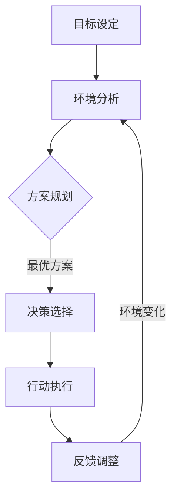
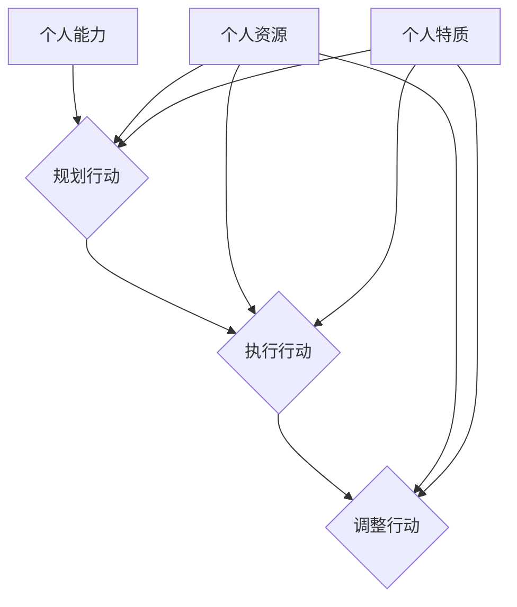
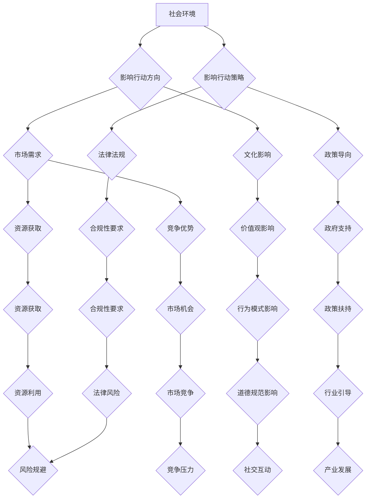

                 

### 《行动（Action）是指基于环境和规划做出的动作》

> 关键词：行动、环境分析、规划与决策、执行与反馈、案例分析、哲学思考

> 摘要：本文将探讨行动的定义、类型及其在生活和工作中的应用，深入分析行动的环境因素，阐述行动的规划与决策过程，探讨行动的执行与反馈机制，总结行动成功的关键因素，并通过案例分析提供实践经验，最后从哲学角度思考行动的价值和未来趋势。

---

### 目录

1. **行动的基本概念**  
   - [1.1 行动的定义与类型](#11-行动的定义与类型)  
   - [1.2 行动的类型](#12-行动的类型)  
   - [1.3 行动在生活和工作中的应用](#13-行动在生活和工作中的应用)

2. **行动的环境分析**  
   - [2.1 行动的环境概念](#21-行动的环境概念)  
   - [2.2 内部环境分析](#22-内部环境分析)  
   - [2.3 外部环境分析](#23-外部环境分析)

3. **行动的规划与决策**  
   - [3.1 行动规划的概念](#31-行动规划的概念)  
   - [3.2 行动决策](#32-行动决策)  
   - [3.3 行动方案评估与选择](#33-行动方案评估与选择)

4. **行动的执行与反馈**  
   - [4.1 行动执行的原则](#41-行动执行的原则)  
   - [4.2 行动执行的过程](#42-行动执行的过程)  
   - [4.3 行动执行的策略](#43-行动执行的策略)

5. **行动的反馈与调整**  
   - [5.1 行动反馈的概念](#51-行动反馈的概念)  
   - [5.2 行动反馈的作用](#52-行动反馈的作用)  
   - [5.3 行动调整的方法](#53-行动调整的方法)

6. **行动成功的关键因素**  
   - [6.1 个人因素](#61-个人因素)  
   - [6.2 外部因素](#62-外部因素)

7. **行动案例分析**  
   - [7.1 行动案例概述](#71-行动案例概述)  
   - [7.2 案例行动分析](#72-案例行动分析)  
   - [7.3 案例经验总结](#73-案例经验总结)

8. **行动与人生价值**  
   - [8.1 行动与个人发展](#81-行动与个人发展)  
   - [8.2 行动与社会责任](#82-行动与社会责任)  
   - [8.3 行动与人生意义](#83-行动与人生意义)

9. **行动与心理学**  
   - [9.1 行动心理学的概念](#91-行动心理学的概念)  
   - [9.2 行动心理学的理论](#92-行动心理学的理论)  
   - [9.3 行动心理学的应用](#93-行动心理学的应用)

10. **行动的未来趋势**  
    - [10.1 行动的科技驱动](#101-行动的科技驱动)  
    - [10.2 行动的社会影响](#102-行动的社会影响)  
    - [10.3 行动的可持续发展](#103-行动的可持续发展)

---

#### 1. 行动的定义与类型

行动（Action）是指主体根据一定的目标、意图和策略，对环境进行的有意识、有目的的操作和调整过程。行动不仅包括物理上的移动，还涵盖了心理、社会和认知层面上的行为。

### 1.1 行动的定义

行动的定义可以从以下几个方面来理解：

- **目的性**：行动总是有明确的目标和意图，无论是解决问题、达成目标还是实现理想。

- **自主性**：行动的主体拥有自主决策和执行的能力，不受外界强制。

- **适应性**：行动主体能够根据环境变化和反馈进行适应性调整，确保行动的有效性。

- **连贯性**：行动不是孤立的，而是与其他行动和策略相互关联，构成一个完整的行动体系。

### 1.2 行动的类型

行动可以根据不同的标准进行分类，以下是几种常见的行动类型：

- **内部行动**和**外部行动**：内部行动是指个体内在的心理活动和认知过程，如思考、决策、情感表达等；外部行动是指个体在物理环境中的行为，如走路、交谈、操作机器等。

- **主动行动**和**被动行动**：主动行动是主体主动发起、推动和控制的行动；被动行动则是主体受到外部刺激或影响而做出的反应。

- **目标导向行动**和**任务导向行动**：目标导向行动以实现特定目标为核心，任务导向行动则侧重于完成特定任务。

- **创造性行动**和**模仿性行动**：创造性行动是指主体在行动过程中产生新的想法和方法，模仿性行动则是在已有基础上进行复制或改进。

### 1.3 行动在生活和工作中的应用

行动在个人生活和工作中的重要性不可忽视。以下是行动在生活和工作中的具体应用：

- **个人生活中的行动**：在日常生活中，行动表现为个人自我管理、家庭事务处理、社交互动等。如制定健康饮食计划、学习新技能、安排家庭聚会等。

- **工作中的行动**：在工作中，行动包括项目规划、任务执行、团队合作等。如项目启动会议、任务分配、进度跟踪等。

- **创业行动**：创业者通过行动实现商业目标，包括市场调研、产品开发、营销推广等。

- **应急行动**：在突发事件或紧急情况下，行动表现为迅速响应、决策和执行，如火灾逃生、医疗急救等。

### 1.4 行动的基本特征

行动具有以下基本特征：

- **目标性**：行动总是指向明确的目标，没有目标就没有行动。

- **选择性**：行动主体在多种可能的行动方案中选择最合适的方案。

- **可控性**：行动主体能够根据环境和反馈调整行动方向和力度。

- **适应性**：行动主体能够适应环境变化，调整行动策略。

- **序列性**：行动通常是一个连续的过程，每个行动都是后续行动的基础。

### 1.5 行动的架构与流程

行动的架构通常包括以下几个环节：

- **目标设定**：明确行动的目标和期望结果。

- **环境分析**：评估行动的内外部环境，了解资源和限制。

- **方案规划**：制定多个可行的行动方案。

- **决策选择**：根据环境分析和方案评估，选择最优行动方案。

- **行动执行**：执行选定的行动方案。

- **反馈调整**：根据行动结果和环境变化，调整行动策略。

### 1.6 行动的核心概念与联系

为了更好地理解行动的概念和其在实际中的应用，我们可以使用Mermaid流程图来展示行动的核心概念及其相互联系：



这个流程图展示了从目标设定到反馈调整的完整行动过程，每个环节都是相互关联和相互影响的。

### 1.7 行动的基本算法原理讲解

为了深入理解行动的基本算法原理，我们可以使用伪代码来描述一个简单的行动决策过程：

```plaintext
# 输入参数
环境 E
可选方案 S
目标 T

# 环境分析
environment_analysis(E)

# 方案评估
evaluate_actions(S, E)

# 选择最优方案
selected_action = choose_best_action(S)

# 行动执行
execute_action(selected_action, T)

# 反馈调整
adjust_action_if_needed(selected_action, T)
```

在这个伪代码中，`environment_analysis` 用于评估环境，`evaluate_actions` 用于评估每个方案的可行性，`choose_best_action` 用于选择最优方案，`execute_action` 用于执行选定方案，`adjust_action_if_needed` 用于根据反馈调整行动。

### 1.8 行动的数学模型和公式

行动的决策过程通常涉及到数学模型和公式的应用，以下是一个简单的数学模型，用于评估不同行动方案的成本和收益：

```latex
\text{成本} = C \times (\text{资源消耗}) \\
\text{收益} = R \times (\text{目标达成率}) \\
\text{净收益} = R - C
```

在这个模型中，`C` 代表成本，`R` 代表收益，`资源消耗` 和 `目标达成率` 是影响成本和收益的关键因素。

### 1.9 行动的项目实战案例

为了更好地理解行动的概念和实践，以下是一个简单的项目实战案例：

#### 项目背景

某公司计划推出一款新的手机应用，目标是在三个月内实现用户量达到10万。

#### 环境分析

- **市场环境**：竞争激烈，已有同类应用占据大部分市场份额。
- **资源状况**：公司有20名开发人员，500万研发预算，3个月时间。

#### 行动方案

1. **市场调研**：了解用户需求，分析竞争对手。
2. **产品设计**：根据调研结果，设计用户界面和功能。
3. **开发与测试**：分阶段完成开发，进行单元测试和集成测试。
4. **发布与推广**：上线应用，并通过社交媒体、广告等方式推广。

#### 行动执行

- **开发阶段**：每天早上召开站会，跟踪进度，解决开发中遇到的问题。
- **测试阶段**：每周进行一次集成测试，确保应用质量。
- **推广阶段**：每天更新社交媒体动态，发布应用使用指南。

#### 行动反馈

- **用户反馈**：收集用户反馈，了解应用使用情况。
- **市场数据**：定期分析用户增长数据，调整推广策略。

#### 行动调整

- 根据用户反馈，优化应用功能。
- 根据市场数据，调整推广策略。

通过这个案例，我们可以看到行动是如何在具体项目中得到应用的，包括环境分析、方案规划、执行和反馈调整等环节。

### 1.10 行动的重要性

行动是连接理想与现实的重要桥梁。没有行动，目标无法实现，理想无法实现。行动不仅能够推动个人成长，提升能力，还能够影响社会，创造价值。在生活和工作中，行动是解决问题、实现目标的关键。

通过以上对行动的定义、类型、应用、特征、架构、算法原理、数学模型和项目实战的详细讲解，我们可以更加深入地理解行动的内涵和实际应用，为后续内容的探讨奠定基础。

---

#### 2. 行动的类型

行动可以根据不同的标准进行分类，每种类型的行动都有其独特的特点和适用场景。以下是对几种常见行动类型的详细解释。

### 2.1 内部行动与外部行动

**内部行动**指的是个体内在的心理活动和认知过程，主要包括思考、决策、情感表达等。这些行动虽然不直接表现在外部环境中，但深刻影响着个体的行为和态度。

- **思考**：通过思考，个体能够分析问题、制定计划，并评估各种可能的解决方案。
- **决策**：决策是思考的产物，是个体在面对多种选择时，根据目标和环境选择最优方案的行动。
- **情感表达**：情感表达是个体通过言语、肢体动作等方式表达内心情感的过程，对于人际交往和社会互动具有重要意义。

**外部行动**则是指个体在物理环境中的行为，如走路、交谈、操作机器等。这些行动通常具有直接的可观察性和可操作性。

- **物理行动**：如走路、跑步、做饭等，这些行动直接改变个体的物理状态。
- **社交行动**：如交谈、协商、合作等，这些行动涉及个体与其他人的互动。

### 2.2 主动行动与被动行动

**主动行动**是指个体在行动过程中表现出积极性和主动性，主动发起和推动行动。这类行动通常具有以下特点：

- **目标明确**：主动行动者通常有清晰的目标和意图，知道为什么要采取这一行动。
- **主动决策**：主动行动者不是被动接受环境变化，而是主动分析情况并做出决策。
- **创新性**：主动行动往往伴随着创新和改进，寻求更好的解决方案。

**被动行动**则是个体在受到外部刺激或影响时做出的反应。这类行动通常具有以下特点：

- **适应性**：被动行动者通常能够适应环境变化，但缺乏主动性。
- **反应性**：被动行动者更倾向于对外部事件做出反应，而不是主动发起行动。
- **依赖性**：被动行动者往往依赖于外部指导和帮助，缺乏自主决策能力。

### 2.3 目标导向行动与任务导向行动

**目标导向行动**是指个体以实现特定目标为核心，采取的各种行动。这类行动通常具有以下特点：

- **明确的目标**：目标导向行动者有清晰的目标，知道需要达到什么样的结果。
- **规划性**：目标导向行动者通常会进行详细的规划，制定实现目标的步骤和方法。
- **持续性**：目标导向行动不是一次性完成，而是一个持续的过程。

**任务导向行动**则是指个体以完成特定任务为核心，采取的各种行动。这类行动通常具有以下特点：

- **明确的任务**：任务导向行动者专注于完成具体的任务，而非整体目标。
- **执行性**：任务导向行动强调执行力和执行力，确保任务顺利完成。
- **独立性**：任务导向行动者通常独立完成任务，不需要过多外部干预。

### 2.4 创造性行动与模仿性行动

**创造性行动**是指个体在行动过程中产生新的想法和方法，创造新的价值。这类行动通常具有以下特点：

- **创新性**：创造性行动者具有创新思维，能够从不同的角度和维度思考问题，提出独特的解决方案。
- **风险性**：创造性行动往往伴随着较高的风险，需要个体具备一定的冒险精神和承受能力。
- **价值性**：创造性行动能够产生新的价值，推动个体和社会的发展。

**模仿性行动**则是指个体在已有基础上进行复制或改进。这类行动通常具有以下特点：

- **适应性**：模仿性行动者能够迅速适应外部环境，通过模仿成功案例进行改进。
- **稳健性**：模仿性行动较为稳健，风险较低，能够快速实现目标。
- **借鉴性**：模仿性行动者善于从他人的经验中学习，提升自身能力。

### 2.5 行动类型在实际生活中的应用

不同类型的行动在实际生活中有着广泛的应用，以下是一些具体的例子：

- **个人生活中的内部行动**：如自我反思、规划未来、制定学习计划等。
- **工作中的外部行动**：如参加会议、撰写报告、与同事协作等。
- **创业中的主动行动**：如市场调研、产品设计、营销推广等。
- **教育中的目标导向行动**：如设定学习目标、制定学习计划、持续学习等。
- **工作中的任务导向行动**：如完成任务清单、确保项目进度、处理日常事务等。
- **创新项目中的创造性行动**：如研发新产品、提出新解决方案、推动技术进步等。
- **传统工艺中的模仿性行动**：如学习传统工艺、复制经典作品、传承文化遗产等。

通过以上对行动类型的详细解释和应用实例，我们可以更好地理解不同类型行动的特点和适用场景，为实际生活和工作中采取合适的行动策略提供指导。

### 3. 行动在生活和工作中的应用

行动不仅是理论上的概念，更是在实际生活和工作中不可或缺的一部分。行动的应用范围广泛，从个人生活中的日常事务到工作中的项目执行，都在不同层面上体现出其重要性和价值。以下将详细探讨行动在个人生活和工作中的应用，并通过实际案例说明其具体实施过程。

#### 3.1 个人生活中的行动

在日常生活中，行动帮助个人实现目标、管理时间和提升生活质量。

- **健康行动计划**：许多人希望改善健康，通过制定健康行动计划，如定期锻炼、合理饮食和定期体检，可以有效提升身体素质。

  ```plaintext
  # 健康行动计划
  - 每周至少三次锻炼，每次30分钟
  - 每天早餐吃一份水果
  - 每月进行一次健康体检
  ```

- **学习新技能**：为了职业发展和个人成长，许多人选择学习新技能。通过制定详细的学习计划，如参加在线课程、阅读专业书籍和进行实践练习，可以逐步提升技能水平。

  ```plaintext
  # 学习新技能计划
  - 每周学习两节在线编程课程
  - 每天阅读30页专业书籍
  - 每两周完成一个小项目实践
  ```

- **家庭事务管理**：家庭中的事务繁杂，通过制定家庭事务管理计划，如家务分工、购物清单和家庭预算，可以提高家庭生活质量。

  ```plaintext
  # 家庭事务管理计划
  - 每周制定家务分工表
  - 每月制定购物清单
  - 每月制定家庭预算
  ```

#### 3.2 工作中的行动

在工作环境中，行动是实现项目目标、提升工作效率和促进团队协作的关键。

- **项目规划与执行**：项目经理通过制定详细的项目计划，明确项目目标、任务分工和进度安排，确保项目按期完成。

  ```plaintext
  # 项目规划
  - 项目目标：完成新产品的研发与发布
  - 任务分工：产品经理负责需求分析，设计师负责界面设计，开发者负责编码实现
  - 进度安排：每月提交阶段性成果，每季度进行项目评审
  ```

- **团队协作**：团队成员通过有效的沟通和协作，共同完成任务。例如，通过每日站会、共享文档和协作工具，确保信息畅通和任务进度同步。

  ```plaintext
  # 团队协作计划
  - 每日站会：10分钟内汇报任务进度和遇到的问题
  - 共享文档：所有项目文件保存在共享文件夹中
  - 使用协作工具：如Slack、Trello等，进行任务分配和进度跟踪
  ```

- **任务管理**：员工通过任务管理工具，如To Do List、Trello或JIRA，跟踪任务进度，确保每个任务按时完成。

  ```plaintext
  # 任务管理
  - 每周制定任务清单
  - 每天检查任务进度
  - 及时更新任务状态，确保任务按时完成
  ```

#### 3.3 创业中的行动

在创业过程中，行动是实现商业目标、吸引投资和推动企业发展的关键。

- **市场调研**：创业者通过市场调研了解目标市场、用户需求和竞争对手，为产品设计和营销策略提供依据。

  ```plaintext
  # 市场调研
  - 调查目标市场的规模和增长趋势
  - 了解目标用户的需求和痛点
  - 分析竞争对手的产品和市场策略
  ```

- **产品开发**：创业者根据市场调研结果，设计并开发产品，以满足市场需求。

  ```plaintext
  # 产品开发
  - 确定产品功能和技术架构
  - 组建开发团队，进行产品开发
  - 持续迭代和优化产品
  ```

- **营销推广**：创业者通过多种营销手段，如社交媒体宣传、广告投放和合作伙伴关系，提升品牌知名度，吸引潜在客户。

  ```plaintext
  # 营销推广
  - 制定营销策略和预算
  - 在社交媒体上发布内容，吸引关注
  - 与行业合作伙伴建立合作关系，共同推广
  ```

#### 3.4 应急行动

在紧急情况下，行动的迅速和有效至关重要。

- **火灾逃生**：在发生火灾时，迅速判断火源并采取有效的逃生措施，如使用湿毛巾捂住口鼻、低头弯腰逃离火场。

  ```plaintext
  # 火灾逃生
  - 迅速判断火源方向
  - 使用湿毛巾捂住口鼻
  - 低头弯腰，沿着安全通道逃离
  ```

- **医疗急救**：在紧急医疗情况下，如心脏骤停或出血过多，迅速采取急救措施，如进行心肺复苏或止血包扎。

  ```plaintext
  # 医疗急救
  - 确认患者意识丧失，立即拨打急救电话
  - 进行心肺复苏，直到救护车到达
  - 对出血部位进行止血包扎，避免失血过多
  ```

#### 3.5 具体实例

以下是一个具体的行动实例，说明如何在实际工作中实施行动计划。

**实例：项目开发**

- **目标设定**：完成一个Web应用的开发，实现用户注册、登录和消息发送功能。

- **环境分析**：评估开发环境，确定技术栈和开发工具。

- **方案规划**：制定详细的开发计划，包括功能模块划分、开发任务分配和进度安排。

- **决策选择**：根据环境分析和方案评估，确定最佳开发方案。

- **行动执行**：

  ```plaintext
  - 第一阶段：完成前端设计（2周）
  - 第二阶段：实现用户注册和登录功能（3周）
  - 第三阶段：实现消息发送功能（3周）
  - 第四阶段：测试和优化（2周）
  ```

- **反馈调整**：在开发过程中，定期进行代码审查和测试，根据反馈调整开发计划，确保项目按时完成。

通过以上对行动在个人生活和工作中的应用的详细探讨，我们可以看到行动在实际操作中的重要性。行动不仅是实现目标的手段，更是提升个人能力和促进团队协作的关键。在日常生活和工作中，积极采取行动，将有助于实现个人和组织的成功。

### 2.2 内部环境分析

内部环境是行动得以实施的基础，对个人行动能力有着重要影响。内部环境主要包括个人能力、个人资源和个人特质等方面。

#### 2.2.1 个人能力

个人能力是指个体在特定领域内表现出来的技能、知识和能力。个人能力是行动成功的关键因素之一，决定了个体能否有效地完成目标和任务。

- **专业技能**：专业技能是个体在特定领域内通过学习和实践获得的知识和技能。例如，程序员需要掌握编程语言、数据库管理和软件架构设计等技能。

- **认知能力**：认知能力包括记忆力、注意力、逻辑思维和问题解决能力。这些能力对于制定决策、规划行动和解决复杂问题至关重要。

- **适应能力**：适应能力是指个体在面对新环境和挑战时，能够迅速调整自己的行为和策略，以适应新的情况。高适应能力有助于个体在变化多端的环境中保持行动的有效性。

- **创新能力**：创新能力是指个体能够提出新想法、新方法和新技术的能力。在快速变化的时代，创新能力是推动个体和组织持续发展的重要动力。

#### 2.2.2 个人资源

个人资源是指个体在行动过程中可以调用和利用的各种资源，包括时间、金钱、信息和人际关系等。

- **时间资源**：时间是行动的基础，合理安排时间可以最大化行动的效率和效果。时间管理技巧，如优先级排序、时间块和任务分解，有助于个体更好地利用时间资源。

- **金钱资源**：金钱资源对于许多行动具有重要意义，如创业项目、教育培训和投资等。有效管理和分配金钱资源，确保行动的可持续性。

- **信息资源**：信息资源是现代社会中不可或缺的资产，包括数据、知识和情报等。掌握信息资源，有助于个体快速获取所需信息，为决策和行动提供支持。

- **人际关系资源**：人际关系资源是指个体在人际交往中积累的资源，如朋友、同事、导师和合作伙伴等。良好的人际关系有助于个体在行动过程中获得支持和帮助，提高行动的成功率。

#### 2.2.3 个人特质

个人特质是指个体在性格、态度和行为习惯上的特点，对行动的持续性和有效性有重要影响。

- **自律性**：自律性是指个体在行动过程中能够自我约束、自我管理的能力。高自律性有助于个体克服拖延、坚持目标和完成任务。

- **坚韧性**：坚韧性是指个体在遭遇挫折和困难时，能够保持积极态度，持续努力和追求目标的能力。坚韧性的关键在于设定合理的期望、保持乐观和积极的心态。

- **责任心**：责任心是指个体对自己行动的结果负责，愿意承担行动带来的后果。高责任心有助于个体在行动过程中保持专注和投入，确保行动的高质量完成。

- **适应性**：适应性是指个体在面对不确定性和变化时，能够灵活调整自己的行为和策略，以适应新的情况。适应性强的人能够在复杂和动态的环境中保持行动的有效性。

### 2.2.4 内部环境对行动的影响

内部环境对行动的影响主要体现在以下几个方面：

- **资源限制**：内部环境中的资源限制会影响行动的执行。如时间紧迫、资金不足或信息匮乏，可能导致行动无法顺利进行。

- **能力差异**：个人能力差异会导致行动效果的差异。高能力个体能够更有效地完成任务，而低能力个体可能需要更多时间和资源来达到相同目标。

- **特质影响**：个人特质会影响行动的持续性和质量。如自律性高的人能够坚持行动，责任心强的人能够确保行动的高质量。

- **目标导向**：内部环境中的个人能力和资源会影响行动的目标导向。高能力和高资源个体更容易设定明确的目标和制定有效的行动方案。

为了更直观地理解内部环境对行动的影响，我们可以使用Mermaid流程图来展示个人能力、资源和特质对行动的驱动和影响：



在这个流程图中，个人能力、资源和特质共同作用于行动的规划、执行和调整过程，确保行动的持续性和有效性。

通过上述分析，我们可以看到内部环境在行动中的重要作用。了解和优化内部环境，提升个人能力和资源，培养良好的个人特质，是确保行动成功的关键。

### 2.3 外部环境分析

外部环境是行动得以实施的另一重要因素，它对个人行动有着深远的影响。外部环境包括社会环境、市场环境和政策环境等，了解和分析这些环境因素，有助于个体和组织更好地制定行动策略。

#### 2.3.1 社会环境

社会环境是指个体所处的文化、习俗、价值观和道德规范等方面的总体状况。社会环境对个体行动的影响主要体现在以下几个方面：

- **文化影响**：文化是一个社会共同体的精神财富，包括语言、宗教、艺术、习俗等。文化背景会影响个体的行为模式和价值观，从而影响行动的选择和执行。

  例如，在一个重视集体主义和团队精神的社会中，个体更倾向于采取合作和互助的行动，而在一个强调个人主义和竞争的社会中，个体可能更倾向于采取独立和自主的行动。

- **社会规范**：社会规范是社会成员共同遵守的行为准则，如礼仪、道德规范和法律等。个体在行动过程中需要遵守这些规范，否则可能会面临社会压力和惩罚。

  例如，在职场环境中，遵守职业道德和工作时间规范是每个员工的基本要求，否则可能会导致职业发展的阻碍。

- **社会支持**：社会支持是指社会对个体行动的认可和支持，包括家庭、朋友、社区和政府等。社会支持可以增强个体的自信心和行动力，有助于实现行动目标。

  例如，家庭支持可以提供情感上的鼓励和经济上的帮助，使个体能够更加专注和投入行动中。

#### 2.3.2 市场环境

市场环境是指个体或组织在市场中运营的外部条件，包括市场需求、竞争态势、消费者行为和技术发展趋势等。市场环境对行动的影响主要体现在以下几个方面：

- **市场需求**：市场需求是影响行动方向和目标的重要因素。了解市场需求，可以指导个体或组织制定合适的行动策略，以满足消费者的需求。

  例如，在科技行业中，了解消费者对智能家居产品的需求，可以促使企业开发相关产品，从而在市场中获得竞争优势。

- **竞争态势**：市场竞争环境对行动的成功与否有着直接的影响。竞争激烈的市场环境要求个体或组织不断创新和提升自身竞争力，以在竞争中立于不败之地。

  例如，在电子商务行业中，竞争者众多，为了吸引消费者，电商平台需要通过创新和优化用户体验来提升竞争力。

- **消费者行为**：消费者行为是市场环境中的重要因素，了解消费者的购买习惯、偏好和行为模式，有助于个体或组织制定更加精准的营销策略。

  例如，通过数据分析，企业可以了解消费者的购买周期、消费习惯和偏好，从而调整产品设计和营销策略，提高销售转化率。

- **技术发展趋势**：技术发展趋势对市场环境和行动策略有着深远的影响。紧跟技术发展趋势，可以帮助个体或组织抓住市场机遇，提升行动的竞争力。

  例如，随着人工智能技术的发展，企业可以利用人工智能技术提高生产效率、优化产品设计和提升客户体验。

#### 2.3.3 政策环境

政策环境是指政府制定的与行动相关的法律法规、政策导向和宏观调控措施等。政策环境对行动的影响主要体现在以下几个方面：

- **法律法规**：法律法规是规范个体和组织行为的法律依据。遵守法律法规是行动合法性和合规性的保障。

  例如，在商业活动中，企业需要遵守合同法、公司法、税法等法律法规，确保商业行为的合法性和合规性。

- **政策导向**：政府政策导向对行动的发展方向和策略有着重要影响。政府通过制定和实施相关政策，可以引导和推动某些行业或领域的发展。

  例如，政府通过“双创”政策，鼓励创新创业，提供创业扶持和税收优惠，从而促进创新创业活动的蓬勃发展。

- **宏观调控**：宏观调控措施是政府通过财政、货币等手段对经济进行调控的措施。宏观调控措施对市场环境和行动策略有着重要影响。

  例如，政府通过调整货币政策，如降息或加息，可以影响市场流动性和企业投资决策，从而影响企业的行动策略。

#### 2.3.4 外部环境对行动的影响

外部环境对行动的影响是多方面的，可以从以下几个方面进行总结：

- **环境适应**：外部环境的变化对行动的适应能力提出了要求。个体和组织需要具备良好的环境适应能力，及时调整行动策略，以应对环境变化。

- **资源获取**：外部环境提供了获取资源的渠道和条件。个体和组织可以通过外部环境获取所需的人力、物力和财力资源，以支持行动的执行。

- **风险规避**：外部环境中的不确定性和风险对行动的成功构成挑战。个体和组织需要通过风险评估和管理，规避潜在风险，确保行动的安全性和稳定性。

- **竞争优势**：外部环境中的竞争态势和市场需求为个体和组织提供了竞争机会。通过分析外部环境，个体和组织可以找到自身的竞争优势，制定更具竞争力的行动策略。

为了更直观地理解外部环境对行动的影响，我们可以使用Mermaid流程图来展示外部环境与行动的关系：



在这个流程图中，外部环境通过多种途径影响行动的方向、策略和效果，同时为行动提供了资源、机遇和挑战。

通过上述分析，我们可以看到外部环境在行动中的重要性和复杂性。了解和把握外部环境因素，是确保行动成功和持续发展的关键。个体和组织需要具备敏锐的洞察力，及时应对外部环境的变化，制定科学合理的行动策略，以实现目标。

### 3. 行动的规划与决策

行动的规划与决策是行动过程中的关键环节，直接影响到行动的目标实现与否。有效的规划和决策需要综合考虑环境分析、目标设定、资源分配、时间安排等多个方面，确保行动的可行性、合理性和高效性。

#### 3.1 行动规划的概念

行动规划是指个体或组织为了实现特定目标，在行动开始前进行的一系列分析和准备工作。行动规划包括以下几个关键要素：

- **目标设定**：明确行动的目标和预期结果。目标是行动的驱动力，为行动提供方向和动力。

- **环境分析**：评估行动的内外部环境，包括社会环境、市场环境和政策环境等。环境分析有助于了解行动的可行性和潜在风险。

- **资源分配**：确定实现目标所需的资源，包括人力、物力和财力等。资源分配的合理与否直接影响行动的效率和效果。

- **时间安排**：制定行动的时间计划，包括关键节点、进度安排和完成时间。合理的时间安排可以确保行动按时完成。

- **风险评估**：识别和评估行动过程中可能面临的风险，包括市场风险、技术风险和操作风险等。风险评估有助于制定相应的风险应对策略。

- **决策制定**：在充分分析和评估的基础上，制定具体的行动方案和决策。决策制定需要综合考虑各种因素，确保决策的科学性和合理性。

#### 3.2 目标设定

目标设定是行动规划的首要步骤，一个明确、具体和可衡量的目标是行动成功的基石。目标设定的原则包括：

- **明确性**：目标应清晰明确，避免模糊和歧义。

- **具体性**：目标应具体详细，量化指标便于衡量和评估。

- **可衡量性**：目标应具有可衡量性，通过定量或定性指标评估目标的实现程度。

- **可行性**：目标应在现实条件下具有可行性，考虑资源的限制和环境的约束。

- **挑战性**：目标应具有一定的挑战性，激发个体的潜能和积极性。

例如，一个明确的目标可以是：“在接下来的六个月内，实现产品销售额增长30%”，这个目标具有明确性、具体性和可衡量性，同时具有一定的挑战性。

#### 3.3 资源分配

资源分配是指将有限的资源合理分配到行动的各个阶段和任务中，确保资源的有效利用。资源分配的原则包括：

- **优先级排序**：根据目标的紧急性和重要性，确定资源的优先分配顺序。

- **均衡分配**：在确保关键任务优先完成的前提下，均衡分配资源，避免资源过度集中或分散。

- **灵活调整**：根据行动的进展和反馈，及时调整资源分配，确保资源的高效利用。

- **成本效益**：在资源分配过程中，考虑成本效益，确保资源的投入能够带来相应的回报。

例如，在项目开发中，资源分配可以按照以下步骤进行：

1. **需求分析**：确定项目需求，包括功能、性能和技术要求。
2. **任务分解**：将项目需求分解为具体的任务，确定每个任务的工作量和资源需求。
3. **优先级排序**：根据任务的紧急性和重要性，确定任务的优先级。
4. **资源分配**：将资源分配到各个任务中，确保关键任务优先完成。
5. **监控与调整**：在项目执行过程中，监控资源使用情况，根据实际情况进行调整。

#### 3.4 时间安排

时间安排是行动规划中的重要环节，合理的时间安排可以确保行动的顺利进行。时间安排的原则包括：

- **关键节点**：确定行动的关键节点，确保关键任务按时完成。
- **进度安排**：制定详细的进度计划，明确每个阶段的开始和结束时间。
- **缓冲时间**：为每个任务和阶段预留一定的缓冲时间，以应对意外情况。
- **优先级排序**：根据任务的紧急性和重要性，合理安排时间，确保关键任务优先完成。

例如，一个项目的时间安排可以按照以下步骤进行：

1. **需求分析**（2周）
2. **设计阶段**（3周）
3. **开发阶段**（6周）
4. **测试阶段**（2周）
5. **上线阶段**（1周）

在每个阶段，还需要确定具体的时间节点和任务进度，确保项目按时完成。

#### 3.5 决策制定

决策制定是行动规划的核心环节，决策的质量直接影响行动的成功与否。决策制定的原则包括：

- **信息全面**：在制定决策前，收集全面、准确的信息，包括市场数据、技术信息和风险评估等。
- **科学分析**：运用科学的方法和工具，对信息进行分析和评估，确保决策的合理性。
- **风险意识**：考虑决策可能带来的风险，制定相应的风险应对措施。
- **民主参与**：鼓励广泛参与和讨论，集中各方面的智慧和意见，提高决策的可行性和合理性。

例如，在一个新产品开发项目中，决策制定的步骤可以包括：

1. **市场调研**：收集市场需求和竞争情况。
2. **技术评估**：评估现有技术和可行性。
3. **成本分析**：估算项目成本和效益。
4. **风险评估**：识别和评估项目风险。
5. **方案选择**：根据分析结果，选择最优方案。
6. **决策执行**：制定详细的执行计划，确保决策的有效实施。

通过科学的规划和决策，个体和组织可以更好地应对复杂的环境和挑战，实现行动的目标。有效的规划和决策是行动成功的重要保障，需要不断学习和实践，不断提高决策能力和水平。

### 3.2 行动决策

行动决策是行动规划的核心环节，涉及到多个步骤和方法。一个有效的决策过程能够帮助个体和组织在复杂多变的环境中做出最优的选择，从而确保行动目标的实现。

#### 3.2.1 决策过程

决策过程通常包括以下几个步骤：

1. **问题识别**：首先，需要明确决策的背景和目标。这包括识别当前存在的问题或机会，并确定决策的目标和范围。

   例如，一家公司可能需要决定是否扩大生产线以应对市场需求的增长。

2. **信息收集**：在明确问题后，收集与决策相关的各种信息。这些信息可能包括市场数据、技术评估、成本效益分析等。

   例如，公司可能需要收集市场需求分析报告、现有生产线的能力和瓶颈分析报告等。

3. **方案生成**：基于收集到的信息，生成多个可行的行动方案。每个方案都应详细描述其目标、方法和预期效果。

   例如，公司可能提出两个方案：一是扩大现有生产线，二是新建一条生产线。

4. **方案评估**：对每个方案进行评估，考虑其可行性、成本、效益和风险等因素。常用的评估方法包括成本效益分析、风险分析、SWOT分析等。

   例如，公司可能使用成本效益分析来比较两个方案的投入和产出，使用风险分析来评估可能面临的市场风险和技术风险。

5. **选择方案**：在评估的基础上，选择最优方案。选择时需要综合考虑各种因素，确保方案的科学性和可行性。

   例如，公司可能选择扩建现有生产线，因为它在成本效益和风险方面更具优势。

6. **决策执行**：将选定的方案转化为具体的行动计划，并开始执行。在执行过程中，需要持续监控和调整，确保行动按计划进行。

   例如，公司需要制定详细的扩建计划，并安排相关人员负责实施。

7. **反馈与调整**：在决策执行过程中，及时收集反馈信息，并根据实际情况进行调整。反馈机制有助于不断优化决策和行动。

   例如，公司需要定期评估扩建项目的进展，并根据市场反馈调整营销策略。

#### 3.2.2 决策方法

在行动决策中，常用的决策方法包括以下几种：

1. **成本效益分析**：成本效益分析是一种评估决策方案成本和效益的方法。通过计算每个方案的净收益（收益减去成本），选择净收益最高的方案。

   公式表示为：
   \[
   \text{净收益} = \text{收益} - \text{成本}
   \]

   例如，公司可以选择扩建生产线，因为它可能带来更高的净收益。

2. **风险分析**：风险分析是一种评估决策方案可能面临的风险和不确定性，并制定相应的风险应对策略的方法。常用的风险分析工具包括风险评估矩阵、蒙特卡洛模拟等。

   例如，公司可能评估扩建生产线面临的市场风险和技术风险，并制定相应的风险管理计划。

3. **SWOT分析**：SWOT分析是一种评估决策方案的内部优势（Strengths）和劣势（Weaknesses）以及外部机会（Opportunities）和威胁（Threats）的方法。通过SWOT分析，可以全面了解决策方案的优缺点。

   例如，公司可能通过SWOT分析确定扩建生产线的优势和劣势，以及市场机会和威胁。

4. **多属性决策**：多属性决策是一种评估具有多个属性（如成本、效益、风险等）的决策方案的方法。通过建立多属性决策模型，可以综合评估多个属性，选择最优方案。

   例如，公司可以使用多属性决策模型，综合考虑成本、效益和风险，选择最优的扩建方案。

5. **头脑风暴**：头脑风暴是一种通过集体讨论和创意思维生成多个可行方案的方法。通过头脑风暴，可以激发团队成员的创造力，产生更多的创意和解决方案。

   例如，公司可以组织团队头脑风暴会议，收集团队成员的建议和想法，生成多个扩建方案。

#### 3.2.3 决策模型

在行动决策中，常用的决策模型包括以下几种：

1. **期望值模型**：期望值模型是一种基于概率和收益的决策模型。通过计算每个方案的期望收益，选择期望收益最高的方案。

   公式表示为：
   \[
   \text{期望收益} = \sum_{i} (\text{收益}_i \times \text{概率}_i)
   \]

   例如，公司可以根据市场需求和竞争概率，计算每个扩建方案的期望收益。

2. **马尔可夫决策过程**：马尔可夫决策过程是一种基于状态转移概率和状态收益的决策模型。通过评估不同状态下的收益，选择最优状态转移策略。

   公式表示为：
   \[
   \text{收益} = \sum_{s} (\text{收益}_s \times \text{概率}_{s_{\text{next}}})
   \]

   例如，公司可以根据不同市场状态下的收益和概率，选择最佳的市场状态转移策略。

3. **博弈论模型**：博弈论模型是一种评估多个参与者在策略互动中的决策模型。通过分析参与者的策略选择和收益，确定最佳策略组合。

   公式表示为：
   \[
   \text{收益} = \sum_{s_i} (\text{收益}_{i,s_i})
   \]

   例如，公司可以分析竞争对手的策略选择和收益，选择最佳的市场竞争策略。

通过以上对行动决策过程的详细讲解和多种决策方法的介绍，我们可以看到，一个有效的决策过程需要综合考虑多方面的因素，运用科学的模型和方法，确保决策的科学性和合理性。在实际应用中，个体和组织可以根据具体情况选择合适的决策方法和模型，以实现行动目标。

### 3.3 行动方案评估与选择

在行动规划过程中，评估与选择行动方案是至关重要的一环。通过科学的评估方法和选择标准，可以确保选定的方案具有最优的可行性、效益和风险平衡，从而提高行动的成功率。以下将详细探讨行动方案评估与选择的方法和标准。

#### 3.3.1 评估指标

评估行动方案时，需要设置一系列评估指标，以便全面衡量方案的不同方面。常见的评估指标包括：

1. **成本效益比**：成本效益比是评估方案成本与预期效益之间关系的重要指标。计算公式为：
   \[
   \text{成本效益比} = \frac{\text{预期效益}}{\text{成本}}
   \]
   成本效益比越高，表示方案的投资回报率越高。

2. **风险评估**：风险评估是评估方案可能面临的风险程度及其对目标实现的影响。常见的风险评估指标包括风险概率、风险影响和风险优先级等。

3. **时间效率**：时间效率是指方案实施所需的时间和资源的合理性和可行性。时间效率高的方案能够更快地实现目标。

4. **资源利用率**：资源利用率是评估方案在利用人力、物力和财力等资源方面的效率。资源利用率高的方案能够更有效地利用现有资源。

5. **可持续性**：可持续性是指方案在长期运行中的可持续性和环境友好性。可持续性强的方案能够实现长期的稳定发展和环境保护。

6. **社会影响**：社会影响是指方案对社会、环境和公众利益的积极或消极影响。社会影响大的方案可能面临更多的社会压力和伦理挑战。

#### 3.3.2 选择标准

在选择行动方案时，需要根据评估指标设置选择标准，以便选出最优方案。常见的选择标准包括：

1. **最优效益**：选择能够带来最高效益的方案，即成本效益比最高的方案。

2. **风险平衡**：选择风险可控且风险影响较小的方案，确保方案实施过程中不会因高风险导致重大损失。

3. **时间效率**：选择能够尽快实现目标的方案，确保行动的及时性和高效性。

4. **资源优化**：选择能够最大限度地利用资源的方案，提高资源利用率和效率。

5. **可持续性**：选择具有长期可持续性的方案，确保方案能够在长期运行中保持稳定和持续的发展。

6. **社会影响**：选择对社会和环境有积极影响的方案，确保行动符合社会价值观和伦理要求。

#### 3.3.3 评估方法

为了科学评估行动方案，可以采用以下几种方法：

1. **成本效益分析**：通过计算方案的成本与预期效益，评估方案的经济可行性。成本效益分析可以明确不同方案的经济回报，帮助决策者选择最优方案。

2. **风险评估矩阵**：通过建立风险评估矩阵，对方案可能面临的风险进行定量和定性分析，确定每个风险的概率和影响，从而评估方案的整体风险水平。

3. **时间线分析**：通过绘制时间线图，展示方案从规划到执行的全过程，分析每个阶段的进度和关键节点，确保方案的时间效率和可行性。

4. **多属性决策分析**：通过建立多属性决策模型，综合考虑多个评估指标，如成本、效益、风险和时间等，评估方案的综合性能，从而选出最优方案。

5. **案例研究**：通过案例研究，分析类似行动的成功和失败案例，从中吸取经验和教训，为当前行动方案的选择提供参考。

#### 3.3.4 选择方法

在实际选择过程中，可以根据具体情况采用以下方法：

1. **简单比较法**：通过直接比较各个方案的优劣，选出最优方案。适用于评估指标较少且评估过程简单的情况。

2. **加权评分法**：将各个评估指标按照重要性加权，计算每个方案的总得分，选出得分最高的方案。适用于评估指标较多且评估过程较为复杂的情况。

3. **决策树法**：通过建立决策树，模拟不同选择路径下的结果和风险，分析每个选择的可能性和收益，从而选出最优方案。适用于需要考虑多种可能性和复杂决策的情况。

4. **模拟优化法**：通过模拟方案实施过程，评估方案在各种情境下的表现和结果，优化方案参数和策略，从而选出最优方案。适用于需要大量数据分析和模拟的情况。

通过上述对行动方案评估与选择方法的详细讲解，我们可以看到，科学评估和选择行动方案是确保行动成功的关键。在实际操作中，个体和组织需要根据具体情况进行综合评估，运用合适的评估方法和选择标准，选出最优的方案，以实现行动目标。

### 4. 行动的执行

行动的执行是行动规划中的关键环节，是将计划转化为实际操作的过程。成功的执行不仅需要明确的计划和细致的安排，还需要遵循一定的原则和策略，确保行动的顺利进行和目标的实现。

#### 4.1 行动执行的原则

在进行行动执行时，应遵循以下原则：

1. **实际可行性**：确保行动方案在现实中具备可行性，包括资源、技术和时间等方面的可行性。在实际执行过程中，可能需要对计划进行适当调整，以适应实际情况。

2. **经济合理性**：在资源有限的情况下，确保行动的经济合理性，选择成本效益最高的方案。经济合理性包括成本控制、资源利用效率和效益最大化等方面。

3. **社会适应性**：行动应与社会的价值观、文化和法律规范相符合，确保行动的合法性和社会接受度。社会适应性包括对社会责任的关注、对环境的保护以及对相关利益者的尊重等方面。

4. **灵活应变**：在执行过程中，应保持灵活应变的能力，及时调整计划和策略，以应对突发情况和环境变化。灵活应变包括快速决策、有效沟通和资源配置等方面。

5. **持续监控**：对行动的执行过程进行持续监控，及时发现问题和瓶颈，确保行动按计划进行。持续监控包括进度跟踪、绩效评估和风险控制等方面。

#### 4.2 行动执行的过程

行动执行通常包括以下几个阶段：

1. **策划阶段**：在策划阶段，详细制定行动方案，包括目标、任务、资源分配、时间安排和风险应对策略等。策划阶段是行动执行的基础，需要充分准备和细致规划。

2. **实施阶段**：在实施阶段，按照策划阶段制定的行动方案，逐步开展各项工作。实施阶段是行动的核心，需要确保各项工作顺利进行，按照计划完成。

3. **监控阶段**：在监控阶段，对行动的执行过程进行实时监控，确保各项任务按计划进行。监控阶段包括进度跟踪、绩效评估和问题解决等方面。

4. **评估阶段**：在评估阶段，对行动的执行结果进行评估，分析行动的目标实现情况和存在的问题。评估阶段是行动执行的重要环节，通过评估可以总结经验教训，为下一次行动提供参考。

#### 4.3 行动执行的策略

为了确保行动的顺利进行和目标的实现，可以采用以下策略：

1. **目标分解**：将总体目标分解为若干个具体的小目标，确保每个小目标都能得到有效实施和完成。目标分解有助于明确任务分工和责任落实。

2. **任务分配**：根据团队成员的能力和职责，合理分配任务，确保每个任务都有人负责。任务分配应充分考虑团队成员的特长和兴趣，提高任务完成的效率和质量。

3. **资源整合**：充分利用现有的资源，包括人力、物力和财力等，确保资源的高效利用。资源整合包括资源调配、资源优化和资源共享等方面。

4. **沟通协调**：建立有效的沟通渠道，确保团队成员之间的信息畅通和协作。沟通协调包括定期会议、信息共享和问题反馈等方面。

5. **风险管理**：识别和评估行动过程中可能面临的风险，制定相应的风险应对策略。风险管理包括风险预防、风险控制和风险转移等方面。

6. **激励措施**：制定激励机制，鼓励团队成员积极参与行动，提高行动的积极性和主动性。激励措施包括奖励、表彰和团队建设等方面。

通过以上对行动执行原则、过程和策略的详细讲解，我们可以看到，行动的执行是一个复杂而系统的过程，需要充分准备、细致规划和灵活应对。有效的执行策略是确保行动目标实现的关键，需要结合具体情况和实际情况，不断优化和改进。

### 4.2 行动执行的过程

行动执行的过程是行动规划的具体实施阶段，是实现行动目标的关键环节。一个有效的行动执行过程需要从策划阶段开始，逐步进入实施阶段，并在监控过程中进行调整，最终在评估阶段对结果进行总结。以下是行动执行过程的详细步骤：

#### 4.2.1 策划阶段

策划阶段是行动执行的基础，决定了行动的方向和框架。以下是策划阶段的几个关键步骤：

1. **目标设定**：明确行动的总体目标，确保目标具有明确性、具体性和可实现性。例如，在策划一个市场推广活动时，目标可以是“在三个月内提高品牌知名度20%”。

2. **任务分解**：将总体目标分解为若干个具体的任务，每个任务应具有可操作性。例如，为了实现市场推广目标，可以分解为“设计宣传材料”、“制定推广策略”和“执行推广活动”等任务。

3. **资源分配**：评估实现每个任务所需的资源，包括人力、物力和财力等。合理分配资源，确保资源的有效利用。例如，可能需要分配一个设计团队、若干推广人员和一定的预算。

4. **时间安排**：制定详细的时间计划，明确每个任务的开始和结束时间。确保时间安排合理，避免任务积压或延误。例如，设计宣传材料可以在第一周完成，推广策略可以在第二周完成，推广活动可以在第三周执行。

5. **风险评估**：识别和评估行动过程中可能面临的风险，制定相应的应对措施。例如，可能面临的风险包括市场反应不佳、预算超支和技术问题等。

6. **沟通协调**：建立有效的沟通渠道，确保团队成员之间的信息畅通。定期召开会议，讨论任务进展和问题解决，确保团队协作高效。

#### 4.2.2 实施阶段

实施阶段是将策划阶段的计划转化为实际操作的过程。以下是实施阶段的几个关键步骤：

1. **任务启动**：根据时间安排，正式启动每个任务，明确任务负责人和责任分工。确保每个任务都有人负责，任务启动时提供必要的支持和资源。

2. **任务执行**：在任务执行过程中，监督任务进展，确保任务按计划进行。定期检查任务的完成情况，解决执行过程中遇到的问题。

3. **监控与反馈**：在任务执行过程中，持续监控任务进展，收集反馈信息。通过反馈，及时发现和解决问题，调整任务执行策略。

4. **资源管理**：在任务执行过程中，实时监控资源的使用情况，确保资源的高效利用。根据任务进展和资源需求，及时调整资源分配。

5. **团队协作**：鼓励团队成员之间的协作，共享信息和经验。通过团队协作，提高任务执行效率，确保任务的顺利完成。

#### 4.2.3 监控阶段

监控阶段是行动执行过程中的关键环节，通过监控确保行动按计划进行。以下是监控阶段的几个关键步骤：

1. **进度跟踪**：定期跟踪任务进度，确保每个任务按计划完成。使用项目管理工具，如Trello或JIRA，实时监控任务进展。

2. **绩效评估**：评估任务完成的质量和效率，确保任务达到预期目标。通过绩效评估，识别和解决问题，优化任务执行。

3. **问题解决**：在监控过程中，及时发现和解决执行过程中出现的问题。问题解决包括分析问题的原因、制定解决方案并实施。

4. **风险管理**：持续监控风险，确保风险得到有效控制。通过风险评估，识别新的风险，制定相应的风险应对措施。

5. **反馈调整**：收集任务执行过程中的反馈信息，根据反馈进行调整。反馈调整包括调整任务执行策略、改进工作流程和提升团队协作效率。

#### 4.2.4 评估阶段

评估阶段是对行动执行结果进行总结和反思的过程。以下是评估阶段的几个关键步骤：

1. **结果评估**：对行动的最终结果进行评估，确定目标是否实现。通过数据分析和绩效评估，评估行动的效果。

2. **经验总结**：总结行动过程中的经验和教训，识别成功因素和不足之处。经验总结有助于提升团队的能力和行动质量。

3. **改进计划**：根据评估结果，制定改进计划，针对不足之处进行改进。改进计划包括优化流程、提升技能和改进团队合作等方面。

4. **反馈机制**：建立反馈机制，将评估结果和改进计划传达给相关人员。通过反馈机制，确保改进计划的实施和行动质量的持续提升。

5. **持续改进**：将评估和改进过程纳入日常工作中，持续改进行动质量和效率。持续改进有助于提升组织的整体绩效和竞争力。

通过以上对行动执行过程的详细讲解，我们可以看到，一个有效的行动执行过程需要从策划阶段开始，逐步进入实施阶段，并在监控过程中进行调整，最终在评估阶段对结果进行总结。有效的执行过程是确保行动目标实现的关键，需要充分准备、细致规划和灵活应对。

### 4.3 行动执行的策略

在行动执行过程中，合理的策略是确保行动顺利进行和目标实现的重要保障。以下将介绍几种常用的行动执行策略，包括适应策略、变通策略和创新策略。

#### 4.3.1 适应策略

适应策略是指根据环境变化和实际情况，灵活调整行动方案和执行步骤。适应策略的核心在于保持灵活性，以便在不确定的环境中保持行动的有效性。

1. **环境监测**：定期监测外部环境和内部条件的变化，及时发现可能影响行动执行的因素。

   例如，在市场推广活动中，需要密切关注市场动态和消费者反馈，及时调整推广策略。

2. **动态调整**：根据监测结果，及时调整行动方案和执行步骤，确保行动与实际情况相适应。

   例如，如果市场反应不如预期，可以调整推广渠道和宣传内容，以提高市场接受度。

3. **团队协作**：建立有效的沟通机制，确保团队成员能够及时共享信息，共同应对环境变化。

   例如，定期召开团队会议，讨论环境变化和应对策略，确保团队协作高效。

4. **风险评估**：对行动过程中可能面临的风险进行评估，制定相应的应对措施，降低风险对行动执行的影响。

   例如，在产品开发过程中，对技术风险和市场风险进行评估，并制定应对策略，确保项目顺利进行。

#### 4.3.2 变通策略

变通策略是指在面对困难和挑战时，寻找替代方案，以确保行动目标的实现。变通策略的核心在于创新思维和问题解决能力。

1. **问题识别**：在行动执行过程中，及时发现并识别问题，确保问题得到及时解决。

   例如，在项目开发中，如果某个模块遇到技术难题，需要迅速识别问题，找到解决方案。

2. **替代方案**：在问题识别后，快速生成替代方案，评估各个方案的优缺点，选择最优方案。

   例如，在市场营销中，如果原定的广告渠道效果不佳，可以尝试其他广告渠道，如社交媒体或线下活动。

3. **资源调配**：根据替代方案的需求，合理调配资源，确保替代方案的实施。

   例如，在产品推广中，如果决定增加线上推广，可以调配相应的预算和人力，确保推广活动的顺利进行。

4. **迭代改进**：在替代方案实施过程中，持续收集反馈信息，不断优化和改进方案。

   例如，在产品测试中，根据用户反馈不断改进产品功能，提高用户满意度。

#### 4.3.3 创新策略

创新策略是指通过引入新思想、新方法和新技术，推动行动的变革和发展。创新策略的核心在于突破传统思维，勇于尝试和探索。

1. **创意激发**：鼓励团队成员提出创新想法，激发创意思维。可以通过头脑风暴、跨界合作等方式，激发团队的创造力。

   例如，在产品设计中，可以邀请不同领域的人才参与，共同探讨创新方案。

2. **技术引入**：关注新技术的发展趋势，引入先进的技术手段，提升行动的效率和效果。

   例如，在市场营销中，可以引入人工智能技术，进行精准营销和数据分析。

3. **过程优化**：对现有流程和操作进行优化，减少冗余环节，提高工作效率。

   例如，在生产制造中，可以引入精益生产理念，优化生产流程，降低生产成本。

4. **持续创新**：建立创新机制，鼓励持续创新，将创新融入日常工作中。

   例如，在企业管理中，可以设立创新奖励制度，激励员工不断提出创新建议。

通过以上对适应策略、变通策略和创新策略的详细讲解，我们可以看到，合理的行动执行策略是确保行动目标实现的关键。在实际操作中，个体和组织需要根据具体情况灵活运用这些策略，不断调整和优化行动方案，以应对复杂多变的环境和挑战，实现行动的成功。

### 5. 行动反馈与调整

行动反馈与调整是行动执行过程中的关键环节，通过及时收集和分析反馈信息，可以评估行动的效果，发现问题和不足，并据此进行调整和优化，确保行动目标的实现。

#### 5.1 行动反馈的概念

**行动反馈**是指对行动过程和结果进行评价和反馈，包括正面反馈和负面反馈。正面反馈通常指行动结果达到了预期目标，或在某些方面表现优异；负面反馈则指行动结果未达到预期，或在某些方面存在问题和不足。

**反馈机制**是指一套系统化的流程和工具，用于收集、分析和利用反馈信息，以优化行动过程和结果。有效的反馈机制包括以下几个关键要素：

- **反馈渠道**：确保反馈信息的畅通，提供多种反馈渠道，如面对面沟通、邮件、问卷调查、在线反馈表等。
- **反馈收集**：定期收集反馈信息，确保反馈的及时性和准确性。
- **反馈分析**：对收集到的反馈信息进行系统分析，识别问题的根本原因和影响范围。
- **反馈利用**：根据反馈分析结果，制定相应的调整和优化措施，确保反馈信息能够转化为实际行动。

#### 5.2 行动反馈的作用

行动反馈在行动执行过程中具有重要作用，主要体现在以下几个方面：

1. **评估行动效果**：通过反馈，可以评估行动的结果是否符合预期，识别行动的成功点和不足之处，为后续行动提供参考。

2. **发现问题**：反馈信息有助于发现行动过程中存在的问题和瓶颈，如资源浪费、进度延误、质量不达标等，及时采取措施加以解决。

3. **持续改进**：反馈机制可以促进持续改进，通过不断收集和分析反馈，优化行动方案和执行过程，提高行动的质量和效率。

4. **提高团队协作**：通过反馈，可以增强团队成员之间的沟通和协作，促进团队共同进步，提高团队整体执行力。

5. **激励与鼓舞**：正面反馈可以激励团队成员，增强他们的自信心和工作积极性，提升团队的士气和凝聚力。

#### 5.3 行动调整的方法

在收集和分析反馈信息后，需要根据实际情况进行行动调整。以下是几种常见的行动调整方法：

1. **问题定位**：通过反馈分析，明确问题所在，识别问题的根本原因和影响范围。

2. **制定调整方案**：根据问题定位，制定具体的调整方案，包括改进措施、时间表和责任人等。

3. **实施调整措施**：按照调整方案，逐步实施改进措施，确保调整措施的落实和执行。

4. **监控与评估**：在调整措施实施过程中，持续监控和评估调整效果，确保调整措施的有效性和可持续性。

5. **迭代优化**：根据调整后的反馈，持续优化调整方案，不断改进行动过程和结果，提高行动的质量和效率。

#### 5.4 实例说明

以下是一个具体的行动反馈与调整实例，说明如何在实际工作中应用反馈机制和调整方法。

**实例背景**：某公司在执行一个新产品的研发项目，项目目标是在六个月内完成产品开发并投入市场。

**策划阶段**：在项目启动时，团队制定了详细的项目计划，包括任务分工、时间安排和风险评估等。

**实施阶段**：在项目执行过程中，团队按照计划逐步完成各个任务，但在第二个月时，项目进度出现了延误，原因是技术难题和资源不足。

**反馈收集**：团队在第三个月进行了中期评估，收集了团队成员和利益相关者的反馈，包括进度延误的原因、资源需求的评估和项目风险等。

**反馈分析**：通过反馈分析，团队明确了问题所在，包括技术难题、资源调配不当和沟通不畅等，并评估了问题对项目目标实现的影响。

**调整方案**：团队制定了调整方案，包括增加技术支持人员、优化资源调配、改进沟通机制和调整项目进度计划等。

**实施调整措施**：按照调整方案，团队增加了技术支持人员，优化了资源调配，并通过定期会议和即时通讯工具改进了沟通机制。

**监控与评估**：在调整措施实施过程中，团队持续监控项目进度，定期评估调整效果，确保项目能够按计划完成。

**迭代优化**：在项目完成的最后一个月，团队根据最新的反馈，再次优化了项目进度计划，确保项目能够按时交付。

通过这个实例，我们可以看到行动反馈与调整在项目执行中的重要性。有效的反馈机制和调整方法有助于及时发现和解决问题，确保项目目标的实现，提高团队的整体执行力。

### 5.1 行动反馈的概念

行动反馈是行动执行过程中不可或缺的一部分，它是确保行动目标达成和持续改进的重要手段。行动反馈的概念包括反馈机制、反馈内容、反馈方式和反馈的作用等几个方面。

#### 5.1.1 反馈机制

**反馈机制**是指一套系统化的流程和工具，用于收集、分析和利用反馈信息，以优化行动过程和结果。一个有效的反馈机制应具备以下几个关键要素：

1. **反馈渠道**：确保反馈信息的畅通，提供多种反馈渠道，如面对面沟通、邮件、问卷调查、在线反馈表等，方便反馈信息的收集。

2. **反馈收集**：定期收集反馈信息，确保反馈的及时性和准确性。可以通过定期会议、项目进度报告、用户反馈等方式，获取反馈信息。

3. **反馈分析**：对收集到的反馈信息进行系统分析，识别问题的根本原因和影响范围，为后续的调整和改进提供依据。

4. **反馈利用**：根据反馈分析结果，制定相应的调整和优化措施，确保反馈信息能够转化为实际行动。

#### 5.1.2 反馈内容

**反馈内容**是指对行动过程和结果进行评价和反馈的具体信息，主要包括以下几个方面：

1. **行动效果**：评估行动结果是否符合预期目标，行动目标是否实现，如市场推广活动的效果评估、产品功能的用户满意度等。

2. **问题与不足**：识别行动过程中存在的问题和不足，如进度延误、资源浪费、质量不达标等，以及这些问题的具体表现和影响。

3. **改进建议**：根据反馈分析，提出改进建议和措施，如优化流程、提升团队协作、增加培训等，以改进行动过程和结果。

4. **经验总结**：总结行动过程中的成功经验和教训，为未来的行动提供参考，如项目管理中的最佳实践、用户反馈中的宝贵意见等。

#### 5.1.3 反馈方式

**反馈方式**是指收集和传递反馈信息的方法和形式，常见的反馈方式包括：

1. **面对面沟通**：直接与反馈者进行沟通，听取他们的意见和建议，这种方式适用于较为重要和敏感的反馈。

2. **书面报告**：通过书面报告的形式，详细记录行动的进展和结果，以及存在的问题和建议，便于分析和保存。

3. **问卷调查**：通过设计问卷，收集大量用户的反馈信息，通过统计分析，获取总体反馈和趋势。

4. **在线反馈表**：利用在线反馈工具，方便用户随时提交反馈，提高反馈的及时性和便捷性。

#### 5.1.4 反馈的作用

**反馈**在行动执行过程中具有重要作用，主要体现在以下几个方面：

1. **评估行动效果**：通过反馈，可以评估行动的结果是否符合预期，识别行动的成功点和不足之处，为后续行动提供参考。

2. **发现问题**：反馈信息有助于发现行动过程中存在的问题和瓶颈，如进度延误、质量不达标等，及时采取措施加以解决。

3. **持续改进**：反馈机制可以促进持续改进，通过不断收集和分析反馈，优化行动方案和执行过程，提高行动的质量和效率。

4. **提高团队协作**：通过反馈，可以增强团队成员之间的沟通和协作，促进团队共同进步，提高团队整体执行力。

5. **激励与鼓舞**：正面反馈可以激励团队成员，增强他们的自信心和工作积极性，提升团队的士气和凝聚力。

#### 5.1.5 反馈的流程

一个完整的反馈流程通常包括以下几个步骤：

1. **反馈收集**：通过各种渠道收集反馈信息，确保反馈的全面性和真实性。

2. **反馈分析**：对收集到的反馈信息进行分类、整理和初步分析，识别问题的根本原因和影响范围。

3. **问题确认**：与反馈者进行确认，确保反馈信息的准确性和完整性，必要时进行补充和调整。

4. **制定改进方案**：根据反馈分析结果，制定具体的改进方案，包括改进措施、时间表和责任人等。

5. **实施改进措施**：按照改进方案，逐步实施改进措施，确保改进措施的落实和执行。

6. **监控与评估**：在改进措施实施过程中，持续监控和评估改进效果，确保改进措施的有效性和可持续性。

7. **反馈利用**：根据改进后的反馈，进一步优化行动方案和执行过程，形成良性循环，不断提升行动的质量和效率。

通过上述对行动反馈概念、内容、方式和作用的详细讲解，我们可以看到，有效的反馈机制和流程对于行动的成功和持续改进至关重要。在实际操作中，个体和组织应重视反馈的作用，建立健全的反馈机制，确保行动的顺利进行和目标的实现。

### 5.2 行动反馈的作用

行动反馈在行动执行过程中发挥着关键作用，它不仅有助于评估行动效果，还能发现问题和不足，并据此进行持续改进。以下是行动反馈在行动执行中的具体作用：

#### 5.2.1 评估行动效果

行动反馈能够帮助个体和组织评估行动的实际效果，判断目标是否达成。通过反馈，可以了解行动的结果是否符合预期，识别行动的成功点和不足之处。例如，在项目执行过程中，定期收集团队成员和利益相关者的反馈，可以评估项目进度、质量和效率，确保项目按计划进行。有效的评估有助于个体和组织及时调整行动方案，确保目标的实现。

#### 5.2.2 发现问题与不足

行动反馈能够揭示行动过程中存在的问题和不足，帮助个体和组织及时发现和解决潜在问题。通过反馈，可以识别进度延误、资源浪费、质量不达标等问题，并分析问题的根本原因和影响范围。例如，在市场推广活动中，用户反馈可以帮助识别营销策略中的不足，如广告投放效果不佳、用户界面不友好等，从而为后续的改进提供依据。及时发现和解决问题，可以避免问题扩大，提高行动的效率和质量。

#### 5.2.3 持续改进

行动反馈是持续改进的基础。通过不断收集和分析反馈，个体和组织可以优化行动方案和执行过程，提高行动的质量和效率。持续改进包括优化流程、提升团队协作和改进工作方法等方面。例如，在一个持续改进的项目中，团队可以定期收集用户反馈，分析反馈内容，制定改进措施，并逐步实施，从而不断提升项目的质量和服务水平。有效的持续改进有助于个体和组织在竞争激烈的环境中保持优势。

#### 5.2.4 提高团队协作

行动反馈有助于提高团队协作和沟通效率。通过反馈，团队成员可以了解彼此的工作进展和问题，及时进行沟通和协调，共同解决难题。例如，在项目执行过程中，团队定期召开反馈会议，讨论行动进展和反馈信息，确保团队成员之间的信息畅通和协作高效。良好的团队协作可以增强团队的凝聚力和执行力，提高整体工作绩效。

#### 5.2.5 激励与鼓舞

正面反馈可以激励团队成员，增强他们的自信心和工作积极性。通过反馈，个体和组织可以认可团队成员的努力和贡献，提升团队的士气和凝聚力。例如，在完成一个重要任务后，团队可以举行庆祝活动，表彰优秀成员，增强团队的归属感和荣誉感。正面的反馈和激励有助于激发团队成员的潜力，提高工作效率和质量。

#### 5.2.6 优化决策

行动反馈为决策提供了重要的参考依据。通过反馈，个体和组织可以收集多方面的信息，分析各种因素，优化决策过程。例如，在制定战略规划时，可以收集市场反馈、用户需求和竞争对手信息，进行分析和评估，制定更科学的决策。优化的决策有助于提高行动的针对性和有效性，确保目标的实现。

#### 5.2.7 提升客户满意度

行动反馈能够帮助个体和组织了解客户的需求和满意度，优化产品和服务。通过用户反馈，可以识别产品或服务的不足，改进用户体验，提高客户满意度。例如，在软件开发过程中，通过用户反馈，可以发现界面不友好、功能不完善等问题，及时进行优化和改进，提升用户满意度。

#### 5.2.8 增强创新能力

行动反馈有助于激发创新思维，推动个体和组织不断探索新的解决方案。通过反馈，可以了解行业发展趋势、技术进步和市场需求，为创新提供方向。例如，在科技创新项目中，通过用户反馈，可以识别新的需求和技术突破点，推动技术创新和产品升级。

通过以上对行动反馈在评估行动效果、发现问题与不足、持续改进、提高团队协作、激励与鼓舞、优化决策、提升客户满意度和增强创新能力等方面的详细讲解，我们可以看到，行动反馈在行动执行中的重要作用。有效的反馈机制和流程对于行动的成功和持续改进至关重要。个体和组织应重视反馈的作用，建立健全的反馈机制，确保行动的顺利进行和目标的实现。

### 5.3 行动调整的方法

在行动执行过程中，反馈机制的作用不仅在于评估行动效果和发现问题，更在于通过调整方法将反馈转化为实际行动，以优化行动方案和提升行动质量。以下是几种常见的行动调整方法，包括反馈分析、调整方案制定和调整方案实施等。

#### 5.3.1 反馈分析

**反馈分析**是行动调整的基础，它通过对收集到的反馈信息进行系统分析，识别问题的根本原因和影响范围。以下是反馈分析的具体步骤：

1. **数据收集**：收集行动过程中的各种反馈信息，包括用户反馈、团队成员报告、项目进度报告等。

2. **信息整理**：对收集到的反馈信息进行分类、整理，确保信息的准确性和完整性。

3. **问题识别**：通过分析反馈信息，识别行动过程中存在的问题和不足。可以采用鱼骨图、流程图等工具，帮助识别问题的根本原因。

4. **影响评估**：评估问题对行动目标实现的影响程度，确定优先解决的关键问题。

5. **原因分析**：分析问题产生的原因，查找问题的根源，为调整方案制定提供依据。

通过反馈分析，个体和组织可以全面了解行动过程中存在的问题，明确问题的优先级，为后续调整提供方向。

#### 5.3.2 调整方案制定

**调整方案制定**是行动调整的核心环节，它包括制定具体的调整措施和时间表。以下是调整方案制定的具体步骤：

1. **目标设定**：根据反馈分析结果，设定明确的调整目标，确保调整方案的针对性和有效性。

2. **措施制定**：根据问题识别和原因分析，制定具体的调整措施。措施应包括改进步骤、责任人和时间安排等。

3. **方案评估**：对调整方案进行评估，确保方案的科学性和可行性。可以采用成本效益分析、风险评估等方法，评估调整方案的效果。

4. **时间表制定**：根据调整措施，制定详细的实施时间表，明确每个阶段的开始和结束时间，确保调整措施的有序进行。

5. **方案审核**：将调整方案提交给相关利益相关者，进行审核和批准，确保方案的执行有足够的支持和资源。

通过调整方案制定，个体和组织可以明确行动调整的方向和步骤，为后续调整方案的实施提供指导。

#### 5.3.3 调整方案实施

**调整方案实施**是将调整方案转化为实际行动的过程。以下是调整方案实施的具体步骤：

1. **资源调配**：根据调整方案，合理调配资源，确保调整措施的执行有足够的资源和人力支持。

2. **任务分配**：将调整任务分配给相关责任人，明确每个人的职责和任务，确保任务能够按时完成。

3. **执行监控**：在调整方案实施过程中，持续监控任务的执行情况，确保调整措施按计划进行。可以采用项目管理工具，如Trello或JIRA，实时跟踪任务进展。

4. **问题解决**：在调整方案实施过程中，及时解决遇到的问题和障碍，确保调整措施的顺利执行。

5. **评估反馈**：在调整方案实施结束后，对调整效果进行评估，收集反馈信息，分析调整方案的实施效果和不足之处。

通过调整方案实施，个体和组织可以确保调整措施的落实和执行，提升行动的质量和效率。

#### 5.3.4 实例说明

以下是一个具体的行动调整实例，说明如何在实际工作中应用反馈分析和调整方案制定与实施。

**实例背景**：某公司正在执行一个新产品研发项目，项目目标是在六个月内完成产品开发并投入市场。

**策划阶段**：在项目启动时，团队制定了详细的项目计划，包括任务分工、时间安排和风险评估等。

**实施阶段**：在项目执行过程中，团队按照计划逐步完成各个任务，但在第二个月时，项目进度出现了延误，原因是技术难题和资源不足。

**反馈收集**：团队在第三个月进行了中期评估，收集了团队成员和利益相关者的反馈，包括进度延误的原因、资源需求的评估和项目风险等。

**反馈分析**：通过反馈分析，团队明确了问题所在，包括技术难题、资源调配不当和沟通不畅等，并评估了问题对项目目标实现的影响。

**调整方案制定**：团队制定了调整方案，包括增加技术支持人员、优化资源调配、改进沟通机制和调整项目进度计划等。

**调整方案实施**：按照调整方案，团队增加了技术支持人员，优化了资源调配，并通过定期会议和即时通讯工具改进了沟通机制。

**执行监控与问题解决**：在调整方案实施过程中，团队持续监控项目进度，定期评估调整效果，确保项目能够按计划完成。团队在实施过程中也及时解决了遇到的问题和障碍。

**评估反馈**：在项目完成的最后一个月，团队根据最新的反馈，再次优化了项目进度计划，确保项目能够按时交付。

通过这个实例，我们可以看到行动调整在项目执行中的重要性。有效的反馈分析和调整方案制定与实施，有助于个体和组织及时发现和解决问题，确保项目目标的实现，提高整体工作质量。

### 6. 行动成功的关键因素

行动的成功受到多种因素的影响，包括个人因素和外部因素。这些因素相互作用，共同决定行动的成效。以下是详细探讨行动成功的关键因素。

#### 6.1 个人因素

个人因素在行动成功中起着至关重要的作用，以下是一些关键的个人因素：

1. **目标明确**：清晰的目标是行动成功的基础。一个明确的目标能够为行动提供方向和动力，使个体在行动过程中保持专注和坚持。

2. **意志坚定**：坚定的意志是克服困难、持续行动的重要保障。在面对挑战和逆境时，意志坚定的人能够保持积极的态度，不断克服困难，最终实现目标。

3. **能力提升**：不断提升个人能力是行动成功的重要保证。通过学习和实践，个体可以不断提高技能和知识水平，增强应对各种问题和挑战的能力。

4. **时间管理**：良好的时间管理能力有助于个体合理安排时间和资源，确保行动的效率和效果。通过科学的时间管理，个体可以最大化利用时间，提高工作效率。

5. **自我激励**：自我激励是保持行动动力的重要手段。个体需要学会自我激励，通过积极的自我暗示和目标设定，保持行动的热情和动力。

6. **适应能力**：良好的适应能力使个体能够快速应对变化和挑战。在复杂多变的环境中，适应能力强的人能够迅速调整自己的策略和行为，确保行动的顺利进行。

#### 6.2 外部因素

外部因素对行动成功也有重要影响，以下是一些关键的外部因素：

1. **良好的社会环境**：良好的社会环境为行动提供了支持和资源。一个开放、包容、鼓励创新和进步的社会环境，有助于个体和组织实现行动目标。

2. **有效的资源支持**：行动的成功离不开资源的支持，包括人力、物力和财力等。有效的资源支持可以确保行动的顺利进行，提升行动的效率和效果。

3. **适当的外部压力**：适当的外部压力有助于个体保持竞争意识和积极性。外部压力可以激发个体的潜能，推动他们不断进步和提升。

4. **政策支持**：政策支持是行动成功的重要保障。政府制定的支持性政策可以为个体和组织提供法律保障、资金支持和市场机会，助力行动的顺利实施。

5. **市场竞争**：市场竞争可以激发创新和进步。在激烈的市场竞争中，个体和组织需要不断提升自身能力和竞争力，以适应市场变化和满足消费者需求。

6. **技术进步**：技术进步为行动提供了新的工具和方法。利用先进的技术，个体和组织可以更高效地实现行动目标，提高行动的成功率。

通过以上对个人因素和外部因素的详细探讨，我们可以看到，行动成功的关键在于个人和外部因素的有机结合。个人因素为行动提供了内在动力和能力支持，而外部因素为行动提供了外部环境和资源保障。个体和组织需要综合考虑这些因素，制定科学的行动策略，以实现行动的成功。

### 6.1 个人因素

个人因素在行动成功中扮演着至关重要的角色，以下将详细探讨几个关键的个人因素，包括目标明确、意志坚定、能力提升、时间管理和自我激励。

#### 6.1.1 目标明确

明确的目标是行动成功的第一步。一个清晰、具体且可实现的目标能够为行动提供明确的方向和动力。以下是目标明确的几个要点：

1. **具体性**：目标应当具体，而不是模糊的。例如，将“提高销售额”具体化为“将销售额提高20%”。

2. **可衡量性**：目标应具有可衡量性，以便在行动过程中进行评估和调整。例如，通过每月的销售数据来衡量销售额的提高程度。

3. **可实现性**：目标应当是可实现的，既不要过于简单，也不要过于困难。例如，一个合理的销售增长目标应当考虑到市场环境和公司资源。

4. **时限性**：目标应设定一个明确的完成时限，以激励个体在规定时间内采取行动。例如，设定一个季度或半年的目标期限。

#### 6.1.2 意志坚定

意志坚定是行动持续进行的关键。在面对挑战和困难时，坚定的意志能够帮助个体克服障碍，持续行动。以下是培养意志坚定的几个方法：

1. **设定小目标**：通过设定一系列小目标，逐步实现大目标，有助于保持行动的动力和信心。

2. **建立支持系统**：寻求家人、朋友或同事的支持，共同面对挑战，分享经验和资源。

3. **积极心态**：保持积极的心态，将困难视为成长的机会，而不是挫折。

4. **持续自我激励**：通过自我激励，如反思行动的进展和成就，保持积极的态度和动力。

#### 6.1.3 能力提升

能力提升是行动成功的重要保障。通过不断学习和实践，个体可以增强自身的能力，更好地应对各种挑战。以下是提升能力的几个方法：

1. **终身学习**：不断学习新的知识和技能，通过阅读、培训、参加课程等方式提升自己的能力。

2. **实践经验**：通过实际操作和实践，将理论知识应用到实际工作中，提升实际操作能力。

3. **反思与总结**：定期进行反思和总结，分析成功的经验和失败的原因，不断优化行动策略。

4. **跨领域学习**：尝试学习不同领域的知识和技能，培养综合能力，提高创新能力。

#### 6.1.4 时间管理

有效的时间管理是提高行动效率的关键。通过合理安排时间，个体可以最大化利用时间，提高工作效率。以下是几个有效的时间管理方法：

1. **任务优先级**：根据任务的重要性和紧急程度，合理安排任务的优先级，确保重要且紧急的任务优先完成。

2. **时间块**：将时间分割成若干块，为每个任务分配特定的时间块，避免任务之间的干扰。

3. **避免拖延**：通过设定具体的截止时间和期限，避免拖延，提高任务完成的效率。

4. **日程规划**：制定详细的日程规划，包括每天的任务和时间安排，确保时间的高效利用。

#### 6.1.5 自我激励

自我激励是保持行动动力的重要手段。通过自我激励，个体可以增强行动的热情和积极性。以下是几种自我激励的方法：

1. **目标奖励**：设定奖励机制，在达成目标后给予自己奖励，如购买心仪的物品、放假休息等。

2. **积极心态**：保持积极的心态，通过积极的自我暗示和自我激励，提升行动的积极性和自信心。

3. **反思与认可**：定期反思行动的进展和成就，认可自己的努力和成果，提升自我激励。

4. **社交支持**：与家人、朋友或同事分享行动目标和进展，获取他们的支持和鼓励。

通过以上对目标明确、意志坚定、能力提升、时间管理和自我激励的详细讲解，我们可以看到，这些个人因素在行动成功中的重要作用。个体在行动过程中应注重这些因素的培养和实践，以提升行动的成功率。

### 6.2 外部因素

外部因素在行动成功中同样扮演着至关重要的角色，它们为行动提供了环境、资源和机会。以下将详细探讨外部因素，包括良好的社会环境、有效的资源支持、适当的外部压力、政策支持和市场竞争。

#### 6.2.1 良好的社会环境

良好的社会环境为行动提供了有力的支持和保障，能够激发个体的创造力和积极性。以下是良好社会环境的几个特点：

1. **开放性**：社会环境的开放性鼓励创新和多样性，使个体能够自由表达思想和观点，从而推动行动的进步。

2. **包容性**：社会环境的包容性意味着对不同的文化和背景持开放态度，这有助于个体在行动过程中吸取多样化的经验和知识。

3. **支持系统**：社会支持系统包括家庭、社区、非政府组织等，为个体提供精神、物质和情感上的支持，帮助个体克服困难，坚持行动。

4. **法律保障**：法律保障为行动提供了稳定和可靠的基础，确保个体的合法权益得到保护，降低行动的风险。

#### 6.2.2 有效的资源支持

有效的资源支持是行动成功的关键，它为个体和组织提供了实现目标所需的物质和人力支持。以下是有效的资源支持的一些方面：

1. **资金**：资金是行动的重要资源，可以用于购买设备、支付工资和进行市场推广等。有效的资金支持能够确保行动的顺利进行。

2. **人力**：人力资源是行动的核心，包括专业技能和劳动力。有效的资源支持可以确保团队具备足够的人力资源，提高行动的效率和效果。

3. **信息**：信息资源包括数据、技术和知识等。有效的信息支持可以帮助个体和组织做出更明智的决策，提高行动的准确性和效率。

4. **技术**：技术资源包括硬件、软件和技术平台等。有效的技术支持可以提升行动的技术水平，增强竞争力。

#### 6.2.3 适当的外部压力

适当的外部压力可以激发个体的竞争意识和动力，推动他们不断进步和提升。以下是适当外部压力的一些表现：

1. **市场竞争**：市场竞争可以促使个体和组织不断提高自身能力，以适应市场的变化和需求。

2. **客户需求**：客户的期望和需求可以成为外部压力，激励个体和组织提供更好的产品和服务。

3. **社会期待**：社会的期待和价值观可以影响个体的行为和决策，提供外部压力，促使个体追求更高的目标和更好的表现。

4. **时间限制**：时间限制可以激发个体在规定时间内完成任务的紧迫感，提高行动的效率。

#### 6.2.4 政策支持

政策支持对于行动的成功具有重要作用，它可以为个体和组织提供法律保障、资金支持和市场机会。以下是政策支持的一些方面：

1. **法律支持**：政府的法律法规可以为行动提供保障，确保个体和组织在合法合规的框架内进行行动。

2. **财政支持**：政府的财政支持，如补贴、税收减免等，可以减轻个体和组织的经济负担，提供更多的资金支持。

3. **市场开放**：政府的政策可以促进市场的开放和国际化，为个体和组织提供更广阔的市场机会。

4. **技术创新**：政府的政策可以鼓励技术创新，提供研发资金和政策支持，推动技术进步。

#### 6.2.5 市场竞争

市场竞争是外部因素中最为直接和激烈的因素之一，它对行动的成功有着重要影响。以下是市场竞争的几个方面：

1. **竞争压力**：市场竞争可以促使个体和组织不断提高自身的竞争力，以在激烈的市场环境中脱颖而出。

2. **创新驱动**：市场竞争往往推动创新，促使个体和组织不断寻求新的解决方案和产品，以满足市场需求。

3. **客户导向**：市场竞争使个体和组织更加注重客户需求，提供更好的产品和服务，提高客户满意度。

4. **资源配置**：市场竞争可以促使资源合理配置，使优质资源流向最具竞争力的个体和组织，提高整体市场效率。

通过以上对良好的社会环境、有效的资源支持、适当的外部压力、政策支持和市场竞争的详细探讨，我们可以看到，外部因素在行动成功中的重要作用。个体和组织需要充分利用外部因素，制定科学的行动策略，以实现行动的目标。

### 7. 行动案例分析

通过具体案例分析，我们可以更深入地理解行动理论在实际中的应用和操作过程。以下是一个典型的行动案例分析，旨在展示从行动规划到执行再到反馈调整的完整过程，并提供经验总结。

#### 7.1 行动案例概述

**案例背景**：某初创企业计划在一年内推出一款基于人工智能的智能健康监测应用，目标用户是注重健康管理的普通消费者。

**目标设定**：通过市场调研，确定产品的主要功能，包括健康数据监测、个性化健康建议和健康管理工具。企业设定了以下目标：
- 产品在一年内上线。
- 用户量达到10万。
- 用户满意度达到90%以上。

#### 7.2 案例行动分析

**行动规划**：

1. **市场调研**：进行了为期三个月的市场调研，收集了用户需求、竞争对手分析和市场趋势数据。根据调研结果，确定了产品的核心功能和用户体验设计。

2. **团队组建**：组建了包括产品经理、设计师、开发人员和市场经理在内的跨职能团队，明确每个人的职责和任务。

3. **资源分配**：根据项目预算，合理分配了资金、人力资源和技术资源。确定了研发周期和各阶段的目标。

4. **时间安排**：制定了详细的时间表，包括需求分析、设计、开发、测试和发布等阶段的时间安排。

**行动执行**：

1. **需求分析**：产品经理与用户进行了多次深度访谈，收集了详细的用户需求，并将其转化为功能需求文档。

2. **设计阶段**：设计师根据需求文档，设计了用户界面和用户体验流程，并与产品经理和用户进行了多次迭代和反馈。

3. **开发阶段**：开发人员根据设计文档，编写了产品代码，并进行了单元测试和集成测试，确保代码质量。

4. **测试阶段**：产品在内部测试完成后，进行了公开测试，收集了用户的反馈，并根据反馈进行了产品优化。

5. **发布阶段**：产品正式上线，通过广告和社交媒体推广，吸引了大量用户。

**反馈与调整**：

1. **用户反馈**：产品上线后，通过用户反馈和数据分析，收集了用户的使用体验和反馈。

2. **问题识别**：通过分析反馈，发现了一些用户体验问题和技术问题，如部分用户反馈界面设计不友好，某些功能存在bug。

3. **调整方案**：根据反馈，制定了具体的优化方案，包括界面设计改进、功能修复和用户指南更新。

4. **实施调整**：开发团队迅速实施调整方案，对产品进行了优化和修复。

5. **再次反馈**：调整实施后，再次收集用户反馈，验证调整效果，确保问题得到有效解决。

#### 7.3 案例经验总结

通过这个案例，我们可以总结出以下经验：

1. **市场调研的重要性**：详细的市场调研是制定科学行动方案的基础，有助于识别用户需求和市场需求，避免盲目行动。

2. **跨职能团队的协作**：组建跨职能团队，确保每个环节都有专业人员负责，可以提高项目的整体效率和协作效果。

3. **持续反馈与调整**：持续收集用户反馈并进行调整，是确保产品成功和市场接受度的重要手段。通过反馈机制，可以及时发现和解决问题，优化用户体验。

4. **资源合理分配**：合理分配资源，确保项目在不同阶段都有足够的资金、人力和技术支持，是项目成功的关键。

5. **风险管理**：在项目执行过程中，需要进行持续的风险评估和监控，制定相应的风险应对措施，确保项目按计划进行。

6. **用户参与**：在产品设计、测试和优化过程中，用户的参与和反馈是产品成功的重要保障，用户的意见和建议可以为产品的改进提供宝贵的参考。

通过这个案例，我们可以看到，行动理论在实际中的应用需要结合具体情况进行灵活调整，通过科学的规划、执行和反馈调整，可以确保行动目标的实现。

### 7. 行动成功案例分析

行动的成功离不开科学的规划、有效的执行和及时的反馈调整。以下通过一个具体案例，详细分析行动成功的要素及其实现过程。

#### 7.1 案例背景

**案例背景**：某科技公司在竞争激烈的科技行业中，计划开发一款基于人工智能的健康管理应用，目标是在六个月内实现产品的市场推广和用户量增长。

**目标设定**：公司设定了以下具体目标：
- 在六个月内完成产品研发和测试。
- 在产品正式发布后三个月内，实现用户量突破5万。
- 用户满意度达到90%以上。

#### 7.2 行动规划

**环境分析**：
- **市场环境**：通过市场调研，了解到健康管理应用市场需求增长，但竞争激烈，现有产品功能较为单一。
- **资源状况**：公司拥有一定的人工智能技术储备，但研发团队较为紧张，预算有限。

**目标设定**：
- 完成产品的核心功能，包括健康数据监测、个性化健康建议和社交互动功能。
- 建立有效的营销策略，吸引目标用户。

**资源分配**：
- **资金**：预算主要用于研发和营销推广。
- **人力资源**：核心研发团队负责技术开发，市场营销团队负责推广策略。

**时间安排**：
- **需求分析**：1个月
- **产品设计**：1个月
- **开发与测试**：2个月
- **市场推广**：2个月

#### 7.3 行动执行

**实施阶段**：

1. **需求分析**：团队进行了为期一个月的需求分析，深入了解了用户对健康管理应用的需求，包括功能需求、用户体验和易用性。

2. **产品设计**：根据需求分析结果，设计了产品的用户界面和功能流程，进行了多轮用户反馈和迭代，确保产品设计满足用户需求。

3. **开发与测试**：在开发阶段，团队采取了敏捷开发方法，快速迭代，确保开发进度和产品质量。在测试阶段，进行了多轮测试，包括单元测试、集成测试和用户测试，确保产品稳定性。

4. **市场推广**：在产品发布前，制定了详细的营销推广计划，包括社交媒体宣传、合作伙伴推广和线上广告投放。

**监控阶段**：

1. **进度监控**：定期召开团队会议，跟踪项目进度，确保各个阶段按时完成。

2. **质量监控**：持续进行产品质量监控，确保产品在发布时达到预期标准。

3. **用户反馈**：收集用户使用反馈，分析用户满意度，及时调整产品功能和用户界面，提高用户体验。

#### 7.4 行动反馈与调整

**反馈阶段**：

1. **用户反馈**：在产品发布后，通过用户反馈、社交媒体评论和用户调研，收集用户对产品的意见和建议。

2. **问题识别**：通过分析用户反馈，发现了一些用户体验问题，如某些功能不直观、部分用户反馈信息不准确等。

3. **调整方案**：根据用户反馈，制定了具体的优化方案，包括用户界面改进、功能优化和数据准确性提升。

4. **实施调整**：开发团队迅速实施了优化方案，对产品进行了多次更新和迭代。

5. **再次反馈**：在调整后，再次收集用户反馈，验证优化效果，确保问题得到解决。

#### 7.5 案例总结

**成功因素**：

1. **科学的规划**：通过详细的环境分析和目标设定，公司制定了科学的行动规划，确保资源合理分配和时间高效利用。

2. **有效的执行**：采用敏捷开发方法，快速迭代和测试，确保产品质量和开发进度。

3. **持续反馈**：通过及时收集用户反馈并进行调整，公司能够迅速应对市场变化和用户需求，提高产品竞争力。

4. **团队协作**：跨职能团队的协作和有效的沟通，确保了项目各阶段的顺利进行。

**经验教训**：

1. **用户反馈的重要性**：用户反馈是产品改进的宝贵资源，及时收集和利用用户反馈，有助于提升产品质量和用户满意度。

2. **风险管理的必要性**：在项目执行过程中，需要持续进行风险管理，及时发现和解决潜在问题，确保项目按计划进行。

3. **持续学习与改进**：科技行业变化快速，公司需要不断学习新技术和市场趋势，持续改进产品和营销策略，以保持竞争力。

通过这个案例，我们可以看到，行动的成功离不开科学的规划、有效的执行和持续的反馈调整。只有通过不断学习和改进，才能在激烈的市场竞争中取得成功。

### 7.3 案例经验总结

通过对行动成功案例的深入分析，我们可以总结出以下关键经验和教训：

#### 成功因素

1. **目标明确**：成功的行动离不开明确的目标设定。案例中的初创企业通过详细的市场调研，明确了产品功能和用户需求，为后续的规划提供了清晰的指导。

2. **科学规划**：案例中公司进行了全面的环境分析，确定了市场趋势和竞争态势，从而制定了科学的行动计划。这包括资源分配、时间安排和风险评估等，确保了行动的可行性和有效性。

3. **团队协作**：跨职能团队的协作和有效的沟通，是行动成功的重要保障。团队成员之间的紧密合作，有助于提高项目的执行效率和产品质量。

4. **用户导向**：持续关注用户反馈，并根据用户需求进行产品优化，是案例中公司成功的关键。用户反馈不仅帮助识别问题，还为产品改进提供了方向。

5. **持续改进**：通过快速迭代和持续改进，公司能够及时应对市场变化和用户需求，确保产品的市场竞争力。

#### 失败原因

1. **规划不周**：如果行动规划不周详，可能导致资源浪费和进度延误。案例中，如果公司未能提前识别和评估市场风险，可能会导致产品开发失败。

2. **沟通不畅**：团队内部的沟通不畅，可能导致任务执行出现问题，影响项目进度和质量。案例中，如果团队缺乏有效的沟通机制，可能会导致产品功能设计和用户需求不一致。

3. **反馈不及时**：缺乏及时的反馈和调整机制，可能导致问题积累，最终影响行动效果。案例中，如果公司未能及时收集和分析用户反馈，可能会影响产品的市场表现。

4. **风险管理不足**：如果未能充分识别和应对风险，可能导致项目失败。案例中，如果公司未能提前制定风险管理计划，可能会因技术问题或市场变化导致项目停滞。

#### 总结

行动的成功和失败都是宝贵的经验，通过案例分析和经验总结，我们可以更好地理解行动的本质和关键要素。明确目标、科学规划、团队协作、用户导向和持续改进，是确保行动成功的重要因素。同时，重视风险管理、及时沟通和反馈机制，有助于避免行动失败。只有不断总结经验、优化流程，才能在行动中取得持续的成功。

### 8. 行动与人生价值

行动不仅是个体实现目标和理想的重要手段，也是体现人生价值的关键途径。通过行动，个体不仅能够实现自我价值，还能对社会产生积极影响，实现人生意义。以下将从行动与个人发展、社会责任和人生意义三个方面探讨行动与人生价值的关系。

#### 8.1 行动与个人发展

行动在个人发展中起着至关重要的作用。通过行动，个体能够不断提升自身能力，实现个人成长和职业发展。

1. **提升能力**：行动是能力的实践场，通过不断行动，个体可以锻炼和提升各种能力，如沟通能力、解决问题的能力、团队合作能力等。这些能力的提升不仅有助于个人在职业生涯中取得成功，也为个体的全面发展奠定了基础。

2. **实现目标**：明确的目标是行动的驱动力。通过行动，个体可以逐步实现自己的短期和长期目标，如职业晋升、财富积累、技能提升等。实现目标的过程不仅能够带来成就感和满足感，还能增强个体的自信心和自我价值感。

3. **自我认知**：行动过程中的反思和总结有助于个体更好地了解自己，发现自身的优点和不足。通过行动，个体可以不断调整自己的行为和策略，优化个人发展路径。

4. **成长经历**：行动中的经历和挑战是个人成长的宝贵财富。无论是成功还是失败，每一次行动都是一次学习机会，能够帮助个体积累经验，提升能力，为未来的行动打下坚实基础。

#### 8.2 行动与社会责任

行动不仅关乎个人发展，还与社会责任密切相关。通过行动，个体可以积极参与社会事务，承担社会责任，为社会的发展和进步作出贡献。

1. **社会贡献**：行动是社会发展的基础，通过个体的实际行动，可以推动社会的发展和进步。例如，通过创业行动，个体可以创造就业机会，促进经济增长；通过公益行动，个体可以捐助资源，帮助弱势群体。

2. **道德责任**：行动中的道德责任是个体行为的重要指引。在行动过程中，个体应当遵循道德规范，尊重他人权益，维护社会公正和秩序。

3. **社会责任**：企业和社会组织通过行动承担社会责任，推动社会可持续发展。例如，企业可以通过环保行动减少污染，通过慈善行动关爱社会弱势群体，实现企业的社会责任。

4. **社会互动**：行动是个体与社会互动的重要方式。通过行动，个体可以积极参与社会事务，了解社会问题，培养社会责任感，增强社会归属感。

#### 8.3 行动与人生意义

行动不仅是个体实现个人目标和承担社会责任的途径，更是体现人生意义的重要手段。

1. **人生目标**：行动是实现人生目标的重要手段。通过行动，个体可以逐步实现自己的梦想和理想，找到人生的方向和意义。

2. **自我实现**：行动过程中的成就感和满足感，是自我实现的重要体现。通过行动，个体可以实现自我价值，提升人生幸福感。

3. **社会认可**：行动不仅关乎个人发展，也关系到社会的认可。通过行动，个体可以赢得社会的尊重和认可，增强社会地位和声望。

4. **人生价值**：行动是个体实现人生价值的关键途径。通过行动，个体不仅能够实现个人目标，还能对社会作出贡献，实现人生意义。

总之，行动在个人发展、社会责任和人生意义中扮演着重要角色。通过行动，个体可以实现自我价值，承担社会责任，实现人生意义。行动不仅是实现目标的手段，更是体现人生价值的重要途径。只有通过积极的行动，个体才能在有限的人生中创造无限的价值。

### 8.1 行动与个人发展

行动与个人发展息息相关，是推动个体成长和实现目标的关键因素。通过行动，个体不仅可以提升自身的技能和能力，还能实现个人目标和理想，从而在职业生涯和生活中取得成功。

#### 8.1.1 行动对个人成长的影响

行动对个人成长有着深远的影响，主要体现在以下几个方面：

1. **能力提升**：行动是能力的实践场，通过实际行动，个体可以锻炼和提升各种能力，如沟通能力、解决问题的能力、团队合作能力等。这些能力的提升不仅有助于个人在职业生涯中取得成功，也为个体的全面发展奠定了基础。

2. **经验积累**：行动过程中的经验积累是个体成长的重要财富。无论是成功还是失败，每一次行动都是一次学习机会，能够帮助个体积累经验，提升能力，为未来的行动打下坚实基础。

3. **自我认知**：行动过程中的反思和总结有助于个体更好地了解自己，发现自身的优点和不足。通过行动，个体可以不断调整自己的行为和策略，优化个人发展路径。

4. **自信心增强**：通过实现具体目标，个体可以增强自信心和自我价值感。行动的成功经验会带来成就感，使个体更加自信地面对未来的挑战。

#### 8.1.2 行动对个人价值实现的促进

行动不仅有助于个人成长，还能促进个人价值的实现，具体体现在以下几个方面：

1. **目标实现**：明确的行动目标是实现个人价值的重要途径。通过设定具体的目标并付诸行动，个体可以逐步实现自己的理想和梦想，找到人生的意义和方向。

2. **成就积累**：通过行动，个体可以实现各种小目标和里程碑，积累成就。这些成就不仅能够提升个人的职业地位和声望，还能带来满足感和幸福感。

3. **自我提升**：行动过程中的不断学习和提升，能够增强个体的综合素质和竞争力，提高其在职场和生活中的价值。

4. **社会认可**：行动得到社会认可，是个体价值实现的重要体现。通过积极的行动，个体可以赢得社会的尊重和认可，增强社会地位和声望。

#### 8.1.3 行动与个人发展的关系

行动与个人发展之间的关系可以总结为以下几点：

1. **相互促进**：行动是个人发展的动力，推动个体不断提升自身能力和实现目标。同时，个人发展的提升也为行动提供了更强的能力和更丰富的资源。

2. **持续循环**：行动与个人发展之间形成了一个持续循环的过程。通过行动，个体可以积累经验、提升能力，进而实现更高的目标；而实现更高目标的过程又为新的行动提供了动力。

3. **共同成长**：个人发展和行动是相辅相成的，个体在行动中实现个人价值，行动也推动个体不断成长。通过这种相互促进的关系，个体可以在职业生涯和生活中取得更大的成功。

4. **动态调整**：在行动过程中，个体需要不断调整和优化自身的发展策略，以适应环境变化和实现更高目标。这种动态调整的过程，有助于个体在变化中保持竞争力，持续成长。

总之，行动与个人发展密切相关，通过行动，个体可以实现自我价值，提升自身能力，实现个人目标和理想。行动不仅是实现目标的重要手段，也是个人成长和发展的关键途径。只有通过积极的行动，个体才能在有限的人生中创造无限的价值。

### 8.2 行动与社会责任

行动不仅是个人实现目标和理想的重要途径，也是个体履行社会责任、推动社会进步的关键手段。通过行动，个体可以积极参与社会事务，承担社会责任，为社会的可持续发展贡献力量。

#### 8.2.1 行动中的社会责任

在社会责任方面，行动具有以下几个方面的意义：

1. **社会贡献**：行动是社会发展的基础，通过个体的实际行动，可以推动社会的发展和进步。例如，通过创业行动，个体可以创造就业机会，促进经济增长；通过公益行动，个体可以捐助资源，帮助弱势群体。

2. **道德责任**：行动中的道德责任是个体行为的重要指引。在行动过程中，个体应当遵循道德规范，尊重他人权益，维护社会公正和秩序。例如，企业应诚信经营，不搞虚假宣传，保护消费者权益。

3. **环境责任**：行动中的环境责任是现代社会对个体提出的新要求。通过行动，个体可以积极参与环保活动，减少污染，保护生态环境。例如，个人可以参与植树造林、垃圾分类等环保行动。

4. **社会责任**：企业和社会组织通过行动承担社会责任，推动社会可持续发展。例如，企业可以通过环保行动减少污染，通过慈善行动关爱社会弱势群体，实现企业的社会责任。

5. **社会互动**：行动是个体与社会互动的重要方式。通过行动，个体可以积极参与社会事务，了解社会问题，培养社会责任感，增强社会归属感。

#### 8.2.2 个人行动对社会的影响

个人行动对社会的影响是深远而广泛的，可以从以下几个方面进行阐述：

1. **正能量传递**：个体的积极行动可以传递正能量，激励他人积极向上。例如，通过志愿服务，个体可以为社会带来积极的影响，传递爱心和关爱。

2. **社会风气改善**：个体的行动对社会风气有着重要影响。通过积极行动，个体可以推动社会风气的改善，促进社会道德水平的提高。例如，个体遵守交通规则、尊重他人等行为，可以带动更多人遵守社会规范。

3. **资源优化**：通过行动，个体可以优化社会资源的配置，提高社会资源的使用效率。例如，通过共享经济，个体可以共享自己的资源，帮助他人解决困难，提高资源利用率。

4. **创新能力激发**：个体的创新行动可以激发社会整体的创新能力，推动科技进步和社会发展。例如，创业者通过创新产品和服务，可以带动整个产业链的发展，促进经济增长。

5. **文化传承**：个体的行动可以传承和弘扬文化，推动文化的发展和创新。例如，个体通过参与文化活动和传承传统技艺，可以保护和传承文化遗产，促进文化多样性。

#### 8.2.3 社会责任与个人行动的关系

社会责任与个人行动之间存在密切的关系，可以从以下几个方面进行理解：

1. **相互促进**：社会责任和个人行动相互促进，个体通过履行社会责任，实现自身价值；同时，个体的积极行动也为社会带来正能量，推动社会进步。

2. **共同成长**：社会责任和个人行动是相辅相成的。个体在履行社会责任的过程中，可以不断提升自身能力和素质，实现个人价值；而个人行动的积极效果也为个体带来了成就感和自我实现。

3. **动态调整**：在社会责任和个人行动的过程中，个体需要不断调整和优化自身的行为和策略，以适应社会变化和实现更高目标。这种动态调整的过程，有助于个体在复杂多变的社会环境中保持竞争力。

4. **相互制约**：社会责任和个人行动之间存在相互制约的关系。个体在行动过程中，需要遵循社会责任的要求，不得损害社会利益；而社会责任的约束也促使个体更加注重自身的道德和行为规范。

总之，行动与社会责任密切相关，个体通过行动可以履行社会责任，推动社会进步，实现个人价值。只有通过积极的行动，个体才能在有限的人生中创造无限的价值，为社会的可持续发展贡献力量。

### 8.3 行动与人生意义

行动不仅是个体实现目标和理想的重要手段，更是体现人生意义的关键途径。通过行动，个体可以找到人生的目标和方向，实现自我价值，赋予生命更深刻的内涵。

#### 8.3.1 行动与人生目标的关系

行动是实现人生目标的关键。明确的行动目标能够为个体提供方向和动力，推动个体不断努力和进步。

1. **人生目标的定义**：人生目标是指个体在有限的一生中追求的最终目标，是人生意义的体现。人生目标可以是个人成就、财富积累、家庭幸福等，也可以是更高层次的使命和责任。

2. **行动对目标的推动作用**：通过行动，个体可以逐步实现自己的人生目标。行动不仅是一个个具体的行为，更是一个持续的过程，通过不断的行动，个体可以积累经验，提升能力，逐步接近目标。

3. **行动与目标的互动**：行动与人生目标之间存在密切的互动关系。行动过程中，个体需要对目标进行不断的调整和优化，以适应环境变化和自身成长；同时，实现目标的过程也为行动提供了方向和动力。

#### 8.3.2 行动对人生意义的贡献

行动对人生意义的贡献体现在以下几个方面：

1. **实现自我价值**：通过行动，个体可以实现自我价值，找到人生的意义。在实现目标的过程中，个体会经历成功和失败、挫折和挑战，这些经历不仅锻炼了个体的意志和能力，也赋予了个体的生命更深刻的内涵。

2. **赋予生命内涵**：行动使生命充满意义和活力。通过行动，个体可以不断追求和实现自己的梦想，使生命变得有意义。无论是追求个人成就，还是为社会和人类做出贡献，行动都是赋予生命内涵的重要途径。

3. **促进个人成长**：行动是个人成长的催化剂。通过行动，个体可以不断提升自身能力和素质，实现个人价值。个人成长的过程不仅使个体更加成熟和自信，也为行动提供了更强的动力和支持。

4. **创造社会价值**：行动不仅关乎个人成长，还对社会产生积极影响。通过行动，个体可以推动社会进步，实现社会价值。例如，创业者通过创业行动创造就业机会，促进经济发展；公益者通过公益行动关爱弱势群体，推动社会公正。

#### 8.3.3 行动与人生意义的互动

行动与人生意义之间存在互动关系，具体体现在以下几个方面：

1. **相互促进**：行动与人生意义相互促进。通过行动，个体可以找到人生的目标和方向，实现自我价值；而实现目标的过程也为行动提供了意义和动力。

2. **动态调整**：在行动过程中，个体需要不断调整和优化自身的行为和策略，以适应环境变化和实现更高目标。这种动态调整的过程，有助于个体在实现人生意义的过程中不断成长和进步。

3. **相互影响**：行动和人生意义之间存在相互影响的关系。行动过程中，个体会不断反思和总结，思考自己的行为对人生意义的影响；而人生意义的实现也为行动提供了更深刻的内涵和动力。

总之，行动与人生意义密切相关，通过行动，个体可以找到人生的目标和方向，实现自我价值，赋予生命更深刻的内涵。只有通过积极的行动，个体才能在有限的人生中创造无限的价值，实现人生的意义。

### 9. 行动与心理学

行动与心理学之间存在着深刻的联系，心理学的研究成果为理解和优化行动提供了重要的理论依据。以下将探讨行动心理学的概念、主要理论和应用。

#### 9.1 行动心理学的概念

**行动心理学**是一门研究个体如何制定、执行和调整行动的心理学分支。它关注个体在行动过程中的认知、情感和行为特征，旨在揭示行动背后的心理机制，并提供指导行动的策略和方法。

- **定义**：行动心理学研究个体在行动中的心理过程，包括动机、决策、执行和反馈等方面。

- **研究对象**：行动心理学关注的研究对象包括个人、团队和组织，探讨他们在不同情境下的行动行为。

- **研究目标**：行动心理学的目标是通过理解行动的心理机制，提高个体和组织在行动中的效率和质量，实现更好的行动效果。

#### 9.2 行动心理学的主要理论

行动心理学基于多个心理学理论，以下是其中几个主要的理论：

1. **行为主义理论**：

   - **核心思想**：行为主义理论认为，个体的行为是由外部刺激和内部反应相互作用而产生的，强调环境对行为的影响。

   - **应用**：在行动心理学中，行为主义理论用于分析个体在特定环境中的行为模式，通过环境设计和行为塑造来影响和优化行动。

2. **认知行为理论**：

   - **核心思想**：认知行为理论强调认知过程对行为的影响，认为个体的思维方式和认知结构会影响其行动选择和行为表现。

   - **应用**：在行动心理学中，认知行为理论用于指导个体如何通过改变思维模式和认知结构来优化行动，提高决策和执行效率。

3. **动机理论**：

   - **核心思想**：动机理论关注个体行动的内在驱动力，包括自我决定理论、激励理论等。

   - **应用**：在行动心理学中，动机理论用于分析个体在行动中的动机来源，提供激励策略和方法，以提高行动的动力和积极性。

4. **自我效能理论**：

   - **核心思想**：自我效能理论认为，个体对自身能力的信心和信念会影响其行动的选择和执行。

   - **应用**：在行动心理学中，自我效能理论用于提升个体在行动中的自信心和效能感，鼓励个体勇敢面对挑战，实现目标。

#### 9.3 行动心理学的应用

行动心理学在多个领域有着广泛的应用，以下是几个主要的应用领域：

1. **项目管理**：

   - **应用**：通过行动心理学，项目经理可以更好地理解团队成员的行动动机、行为模式和认知结构，从而优化项目管理策略，提高项目执行效率。

   - **方法**：使用行为塑造、激励策略和认知行为干预等方法，提升团队协作和项目进度控制。

2. **教育培训**：

   - **应用**：在教育领域，行动心理学用于设计教学策略，提高学生的学习动机、学习效果和自我效能感。

   - **方法**：采用认知行为干预、自我决定理论等方法，激发学生的学习兴趣和内在动机，提升学习效果。

3. **市场营销**：

   - **应用**：在市场营销中，行动心理学用于分析消费者的行为模式和心理需求，优化营销策略和产品设计。

   - **方法**：通过动机分析和行为实验，了解消费者在购买过程中的心理机制，制定更有效的营销策略。

4. **职业规划**：

   - **应用**：在职业规划中，行动心理学用于指导个体进行自我认知、目标设定和行动计划，提升职业发展的效能。

   - **方法**：采用自我效能理论、动机理论等方法，帮助个体制定科学的职业规划，实现职业目标。

通过上述对行动心理学的概念、主要理论和应用领域的探讨，我们可以看到，行动心理学在指导个体和组织进行行动决策和执行中具有重要意义。理解行动心理学的理论，可以帮助我们更好地优化行动策略，提升行动效率和效果。

### 9.1 行动心理学的概念

行动心理学是心理学的一个重要分支，专注于研究个体在行动过程中的心理机制和行为模式。它探讨个体如何制定、执行和调整行动，以及这些行动背后的动机、认知和情感因素。以下将从定义、研究对象和研究目标三个方面详细阐述行动心理学的概念。

#### 定义

**行动心理学**是一门研究个体在行动中的心理过程、行为模式及其影响因素的学科。它不仅关注个体在特定情境下的具体行为，还深入探讨这些行为背后的心理机制。行动心理学试图理解个体如何做出决策、如何执行计划以及如何根据反馈进行调整。

- **行动**：在行动心理学中，行动是指个体为了实现特定目标而采取的一系列行为。这些行为可以是简单的，如吃饭、散步；也可以是复杂的，如项目规划、问题解决。
- **心理学**：心理学是研究人类行为和心理过程的科学。行动心理学结合了心理学的基础理论和方法，用于解释和分析个体在行动过程中的心理机制。

#### 研究对象

行动心理学的研究对象包括以下几个方面：

1. **个体行为**：行动心理学关注个体在行动中的行为表现，包括行动的动机、决策过程、执行策略和反馈机制。
2. **认知过程**：行动心理学研究个体在行动中的认知活动，如信息处理、目标设定、计划制定和问题解决。
3. **情感因素**：行动心理学探讨情感在行动中的作用，如动机激发、情绪调节和情感反馈对行动的影响。
4. **社会互动**：行动心理学关注个体在行动过程中与他人的互动，如团队协作、领导力和沟通技巧。

#### 研究目标

行动心理学的研究目标主要有以下几方面：

1. **理解行动机制**：通过研究个体在行动过程中的心理机制，揭示行动背后的动机、认知和情感因素，为行动的优化提供理论依据。
2. **指导行动策略**：基于心理学理论，行动心理学旨在为个体和组织提供科学的行动策略和方法，提高行动的效率和效果。
3. **促进心理健康**：行动心理学通过研究个体在行动过程中的心理压力和应对策略，帮助个体提高心理健康水平，减少心理问题。
4. **应用实践**：将心理学理论应用于实际场景，如项目管理和教育培训，提高行动的实际效果和影响力。

#### 行动心理学与其他心理学分支的关系

行动心理学与其他心理学分支如认知心理学、发展心理学、社会心理学等有着密切的联系。它不仅借鉴了其他分支的理论和方法，还为这些分支提供了具体的应用场景和研究对象。

1. **认知心理学**：行动心理学借鉴了认知心理学的信息处理、记忆和问题解决等理论，用于解释个体在行动过程中的认知活动。
2. **发展心理学**：行动心理学关注个体在不同发展阶段的行为模式和认知变化，为发展心理学提供了实证研究的对象和方法。
3. **社会心理学**：行动心理学与社会心理学共同研究个体在社会情境中的行为，如团队协作、领导力和沟通技巧。

通过上述对行动心理学概念、研究对象和研究目标的详细讲解，我们可以看到，行动心理学在理解和优化行动中具有重要意义。它不仅为个体提供了科学的行动指导，也为组织的管理和决策提供了理论支持。

### 9.2 行动心理学的理论

行动心理学在研究个体行动行为的过程中，借鉴了多个心理学理论，其中行为主义理论和认知行为理论是两个最为重要的理论。以下将对这两个理论进行详细解释，并讨论它们在行动心理学中的应用。

#### 9.2.1 行为主义理论

行为主义理论是心理学中的一种重要流派，由约翰·B·华生（John B. Watson）和伯福德·斯金纳（B.F. Skinner）等人提出。行为主义理论强调环境对行为的影响，认为行为是通过条件反射和强化机制形成的。

1. **核心思想**：

   - **环境决定论**：行为主义理论认为，个体的行为主要是由外部环境刺激所决定的，个体本身不具有自由意志。
   - **行为与反应**：行为主义理论将行为视为一系列反应，这些反应可以通过条件反射和强化机制来解释。
   - **强化机制**：强化是行为主义理论中的关键概念，包括正强化（奖励）、负强化（撤销惩罚）和惩罚，用于影响行为的发生频率。

2. **在行动心理学中的应用**：

   - **行为塑造**：行为主义理论可以用于改变和塑造个体在行动中的行为模式。例如，通过正强化，可以激励个体采取积极的行动；通过惩罚，可以减少不良行为的出现。
   - **环境设计**：行为主义理论强调环境对行为的影响，因此，通过设计有利于目标实现的环境，可以提高行动的效率和质量。例如，在项目管理中，可以通过优化工作环境和提供奖励机制来提高团队成员的积极性。
   - **行动计划**：行为主义理论可以指导个体制定具体的行动计划。通过设定明确的目标和制定具体的行动步骤，个体可以更好地控制自己的行为，提高行动的成功率。

#### 9.2.2 认知行为理论

认知行为理论（Cognitive Behavioral Theory, CBT）是20世纪60年代由阿尔伯特·艾利斯（Albert Ellis）和亚伦·贝克（Aaron T. Beck）等人提出的一种心理治疗方法。认知行为理论认为，个体的行为不仅仅是由外部环境决定的，还受到其内部认知过程的影响。

1. **核心思想**：

   - **认知过程**：认知行为理论强调认知过程在行为中的作用，认为个体的思维方式和认知结构会影响其行为表现。
   - **思维模式**：认知行为理论认为，个体的思维模式（如认知偏差、消极思维）会影响其情感和行为。通过改变思维模式，可以改善情感和行为问题。
   - **认知重构**：认知行为理论通过认知重构的方法，帮助个体识别和改变消极的思维模式，建立更积极、合理的思维模式。

2. **在行动心理学中的应用**：

   - **决策过程**：认知行为理论可以指导个体在行动中的决策过程。通过分析个体在决策过程中的认知偏差和思维模式，可以优化决策过程，提高决策质量。
   - **行动计划**：认知行为理论可以帮助个体制定更科学的行动计划。通过识别和解决思维模式中的问题，个体可以更好地设定目标、制定计划和执行行动。
   - **情绪调节**：认知行为理论强调情绪调节在行动中的作用。通过认知重构和情绪调节技术，个体可以更好地管理情绪，提高行动的稳定性和效率。

#### 行为主义与认知行为理论的比较

行为主义理论和认知行为理论虽然有着不同的核心观点，但它们在行动心理学中的应用都具有重要意义。以下是两种理论的主要区别：

1. **环境与认知的关系**：

   - **行为主义理论**：行为主义理论认为环境对行为的影响更大，个体的行为主要由外部刺激和强化机制决定。
   - **认知行为理论**：认知行为理论认为，个体的认知过程对其行为有重要影响，认知偏差和思维模式会影响行为表现。

2. **应用方法**：

   - **行为主义理论**：行为主义理论更侧重于通过环境设计和行为塑造来影响行为，如奖励机制、行为训练等。
   - **认知行为理论**：认知行为理论更侧重于通过认知重构和情绪调节来改善思维模式和行为，如认知行为疗法（CBT）、认知重构训练等。

通过上述对行为主义理论和认知行为理论的详细解释，我们可以看到，这两种理论在行动心理学中的应用各有特色，但都是为了帮助个体更好地理解和优化行动行为。在实际操作中，个体和组织可以根据具体情况选择和结合使用这些理论，以提高行动的效率和效果。

### 9.3 行动心理学的应用

行动心理学在多个领域有着广泛的应用，以下是几个主要的应用领域及其具体应用方法。

#### 9.3.1 行动规划与执行

**应用领域**：在个人和组织层面，行动心理学被广泛应用于行动规划与执行中。

**具体应用**：

1. **目标设定**：行动心理学中的目标设定理论可以帮助个体和组织制定明确、具体和可实现的目标。通过设定SMART目标（具体、可衡量、可达成、相关性强、时限性），确保目标的科学性和可行性。

2. **计划制定**：行动心理学中的计划制定方法，如GTD（Getting Things Done）和任务分解法，可以帮助个体和组织系统化地制定行动计划，明确任务分工和时间安排。

3. **执行策略**：行动心理学中的行为塑造和自我控制理论可以指导个体和组织在执行过程中保持专注和毅力，克服拖延和提高执行力。

#### 9.3.2 情绪调节

**应用领域**：在个人心理健康和职场环境中，行动心理学被广泛应用于情绪调节。

**具体应用**：

1. **认知重构**：行动心理学中的认知重构技术可以帮助个体识别和改变消极思维模式，如过度自我批评、灾难化思维等，从而改善情绪状态。

2. **正念练习**：行动心理学中的正念练习（Mindfulness）可以帮助个体在行动过程中保持专注和平静，降低焦虑和压力。

3. **情绪管理**：行动心理学中的情绪管理策略，如情绪反馈、情绪表达训练等，可以帮助个体更好地管理情绪，提高行动的稳定性和效率。

#### 9.3.3 决策支持

**应用领域**：在商业决策和个人生活中，行动心理学提供了重要的决策支持。

**具体应用**：

1. **决策框架**：行动心理学中的决策框架可以帮助个体在复杂决策中保持理性，如期望效用理论、价值函数模型等。

2. **认知偏差纠正**：行动心理学中的认知偏差理论可以帮助个体识别和纠正决策过程中的认知偏差，如确认偏差、过度自信等。

3. **风险评估**：行动心理学中的风险评估方法可以帮助个体在决策过程中进行全面的评估，识别潜在风险，并制定相应的应对策略。

#### 9.3.4 团队协作

**应用领域**：在团队管理和协作中，行动心理学提供了重要的指导和支持。

**具体应用**：

1. **领导力**：行动心理学中的领导力理论可以帮助团队领导者提高领导力和团队管理能力，如参与管理、目标管理、冲突管理等。

2. **沟通技巧**：行动心理学中的沟通技巧可以帮助团队成员提高沟通效率和质量，如积极倾听、有效表达、反馈技巧等。

3. **团队建设**：行动心理学中的团队建设理论可以帮助团队成员建立信任、增强凝聚力，提高团队协作效率和整体绩效。

#### 9.3.5 教育培训

**应用领域**：在教育领域，行动心理学被广泛应用于教育培训和学生学习过程中。

**具体应用**：

1. **学习动机**：行动心理学中的学习动机理论可以帮助教师识别和激发学生的学习动机，如目标设定、自我效能感、奖励机制等。

2. **学习策略**：行动心理学中的学习策略可以帮助学生优化学习过程，如记忆技巧、时间管理、问题解决等。

3. **心理健康**：行动心理学中的心理健康理论可以帮助学生应对学业压力，提高心理健康水平，如情绪调节、自我认知、社会支持等。

通过上述对行动心理学在不同领域应用的详细讲解，我们可以看到，行动心理学在指导个人行动、优化决策、促进团队协作和提升教育培训效果等方面具有重要作用。理解并运用行动心理学的理论和方法，可以显著提高行动的效率和质量，实现个人和组织的目标。

### 9.4 行动的科技驱动

随着科技的迅猛发展，人工智能和互联网技术已经成为推动行动的重要动力。这些技术的应用不仅改变了传统的行动方式，还极大地提高了行动的效率和效果。以下将探讨人工智能和互联网技术如何在行动中发挥重要作用，以及这些技术对行动的未来趋势产生的影响。

#### 9.4.1 人工智能在行动中的应用

人工智能（Artificial Intelligence，AI）作为一种能够模拟人类智能的技术，已经在多个领域展现了其强大的应用潜力。

1. **自动化**：人工智能在自动化领域的应用尤为显著。通过机器学习和深度学习技术，AI可以自动化执行重复性高、劳动强度大的任务，如数据采集、数据分析和生产流程控制。这极大地减轻了人力资源的负担，提高了工作效率。

2. **决策支持**：人工智能可以处理大量数据，并通过算法模型提供决策支持。在商业决策、医疗诊断和风险评估等领域，AI能够通过分析历史数据和实时数据，提供更精准的决策建议，帮助个体和组织做出更明智的选择。

3. **智能助手**：人工智能助手，如聊天机器人和虚拟助理，可以提供全天候的服务和支持。这些智能助手可以处理客户咨询、日程管理、任务提醒等事务，提高工作效率，改善用户体验。

4. **个性化服务**：通过用户行为分析和数据挖掘，人工智能可以为用户提供个性化的服务和建议。例如，在线购物平台可以根据用户的购物历史和偏好，推荐合适的产品和服务，提高用户满意度和忠诚度。

#### 9.4.2 互联网技术在行动中的发展

互联网技术的发展为行动提供了新的工具和平台，极大地扩展了行动的边界和可能性。

1. **远程协作**：互联网技术使得远程协作成为可能。通过视频会议、即时通讯和在线协作工具，团队成员可以实时沟通和协作，无论地理位置如何，都能高效地完成工作任务。

2. **信息共享**：互联网使得信息的获取和共享变得极其便捷。通过云存储和共享文档，团队成员可以随时随地访问和编辑文件，确保信息的实时更新和共享。

3. **在线教育**：互联网技术为教育带来了革命性的变化。在线课程、远程教学和电子学习资源使得学习不再受时间和地点的限制，为广大学习者提供了更多选择和学习机会。

4. **电子商务**：互联网技术的发展推动了电子商务的繁荣。通过电子商务平台，消费者可以在线购买商品和服务，商家可以实时推广和销售产品，大大提高了商业活动的效率和覆盖范围。

#### 9.4.3 行动的未来趋势

随着人工智能和互联网技术的不断进步，行动的未来趋势将呈现出以下特点：

1. **智能化**：行动将越来越多地依赖于人工智能技术，自动化和智能化将成为行动的主流。通过智能算法和机器人，行动的效率和质量将得到显著提升。

2. **数字化**：行动的数字化程度将不断提高，数据将成为行动的重要资产。通过大数据分析和数字化工具，行动的决策和执行将更加科学和精准。

3. **个性化**：随着个性化技术的普及，行动将更加注重个性化需求和服务。从产品推荐到定制化服务，行动将更加贴合个体的独特需求。

4. **协作化**：互联网技术的普及将促进个体和团队的协作，远程协作和在线协作将成为常态。协作化行动将提高团队的工作效率和创新力。

5. **绿色化**：随着可持续发展意识的增强，绿色行动将成为行动的重要趋势。人工智能和互联网技术将助力绿色制造、智慧能源管理和环境保护，实现行动的绿色转型。

通过上述对人工智能和互联网技术在行动中的应用及其对未来趋势的探讨，我们可以看到，科技驱动正深刻改变着行动的方式和效果。在未来，科技将继续发挥关键作用，推动行动向智能化、数字化、个性化和绿色化方向发展。

### 9.5 行动的社会影响

行动不仅是个体实现目标和理想的手段，更是推动社会进步和变革的重要力量。行动对社会产生深远的影响，从经济结构到社会文化，都在行动的推动下发生着显著变化。以下将详细探讨行动对社会的影响，以及如何应对这些影响。

#### 9.5.1 行动对经济结构的影响

行动在经济结构中扮演着关键角色，通过创新、创业和产业发展，推动经济结构的调整和优化。

1. **创新驱动**：行动中的创新是经济增长的重要引擎。通过技术创新、产品创新和服务创新，企业可以开发出新的市场机会，推动产业升级和转型。例如，互联网技术的快速发展，推动了电子商务、共享经济等新兴产业的崛起。

2. **就业机会**：行动创造了大量的就业机会。无论是创业者创办企业，还是普通劳动者在各个行业中的工作，行动都为社会提供了就业岗位，降低了失业率。

3. **产业升级**：行动推动了传统产业的升级和转型。通过引入新技术、新管理理念和新商业模式，传统产业得以焕发新的活力，提高生产效率和产品质量，增强国际竞争力。

4. **经济多样化**：行动促进了经济多样化发展。新兴产业和传统产业的融合，带来了更多的商业机会和发展空间，增强了经济的韧性和抗风险能力。

#### 9.5.2 行动对社会文化的影响

行动对社会文化的影响同样深远，从价值观的塑造到社会行为的改变，都在行动的推动下发生变化。

1. **价值观变迁**：行动推动了社会价值观的变迁。在市场经济环境下，竞争意识、创新精神和效率观念逐渐成为主流价值观，推动社会向更加开放、包容和多元化的方向发展。

2. **生活方式改变**：行动改变了人们的生活方式。互联网技术的普及和电子商务的发展，使得人们的生活方式更加便捷和高效。在线购物、远程办公和数字化娱乐等新兴生活方式，丰富了人们的日常生活。

3. **社会参与度提高**：行动提高了社会参与度。通过公益行动、社区服务和志愿者活动，人们更加积极地参与社会事务，增强了社会责任感和公民意识。

4. **文化多样性**：行动促进了文化多样性。全球化背景下，不同国家和地区的文化通过行动相互交流、融合，形成了丰富多彩的文化景观。

#### 9.5.3 应对行动影响的方法

为了应对行动对社会产生的深远影响，个体、组织和政府需要采取一系列措施。

1. **教育培养**：个体应通过终身学习不断提升自身素质，适应快速变化的社会环境。教育培养不仅包括专业技能的培训，还涉及道德教育和社会责任感的培养。

2. **科技创新**：组织和企业应积极投入科技创新，推动产业升级和转型。通过研发新技术、新产品和新模式，提高企业的竞争力和市场占有率。

3. **政策支持**：政府应制定和实施有利于创新和发展的政策，为行动提供良好的环境和支持。例如，减税政策、研发补贴、人才引进计划等，可以促进经济结构的优化和社会文化的进步。

4. **社会参与**：个体和组织应积极参与社会事务，承担社会责任。通过公益行动、志愿服务和社会创新，推动社会进步和和谐发展。

5. **可持续发展**：在行动中注重可持续发展，保护环境和资源。通过绿色技术和环保行动，实现经济、社会和环境的协调发展。

通过上述对行动对社会影响的分析和应对方法探讨，我们可以看到，行动不仅推动了经济和社会的进步，还带来了文化和生活方式的变革。个体、组织和政府需要共同努力，积极应对行动带来的挑战和机遇，实现社会发展的可持续性和进步。

### 9.6 行动的可持续发展

在现代社会，可持续发展已成为全球关注的焦点，行动的可持续发展策略不仅关乎环境保护，也涉及经济和社会的可持续发展。以下将探讨行动的可持续发展策略，包括绿色理念和可持续发展策略，以及行动对环境保护和资源节约的影响。

#### 9.6.1 绿色理念

绿色理念是指将环境保护和可持续发展纳入行动规划和决策过程中，以确保行动对环境的影响最小化。以下是几个关键绿色理念：

1. **环保优先**：在行动规划和执行过程中，优先考虑环境保护，将环保目标纳入行动目标。

2. **资源节约**：通过合理利用资源和优化生产流程，降低资源消耗和浪费。例如，采用节能设备和技术，提高能源利用效率。

3. **废物管理**：建立有效的废物分类和处理系统，减少废物产生，提高废物回收利用率。例如，推行垃圾分类和回收利用，减少垃圾填埋和焚烧。

4. **生态平衡**：在行动中保护生态环境，避免对生态系统造成破坏。例如，在建设项目中采取生态补偿措施，如植树造林和生态修复。

#### 9.6.2 可持续发展策略

为了实现行动的可持续发展，需要采取一系列策略，确保经济、社会和环境的协调发展。以下是几个关键可持续发展策略：

1. **循环经济**：推动循环经济的发展，通过资源的循环利用，减少对自然资源的依赖。例如，建立回收体系和再制造产业，减少废物的产生。

2. **节能减排**：在行动中采取节能减排措施，降低能源消耗和碳排放。例如，采用节能技术、提高能源利用效率，推广清洁能源。

3. **绿色创新**：鼓励绿色创新，开发环保技术和产品，推动绿色发展。例如，研发低碳技术和可再生能源，减少对化石燃料的依赖。

4. **政策引导**：政府应制定和实施支持可持续发展的政策，提供政策引导和资金支持。例如，推行环保法规、提供税收优惠和补贴，鼓励企业和个人采取环保行动。

#### 9.6.3 行动对环境保护和资源节约的影响

行动不仅对社会和经济产生影响，也对环境保护和资源节约有着深远的影响。以下是一些具体影响：

1. **减少污染**：通过采取环保措施，如污染控制、废物处理和生态修复，行动可以有效减少环境污染，保护生态环境。

2. **节约资源**：通过提高资源利用效率和优化生产流程，行动可以减少资源消耗，降低对自然资源的依赖。例如，通过采用节能设备和环保材料，减少能源和原材料的消耗。

3. **降低碳排放**：通过推广清洁能源和节能减排技术，行动可以降低碳排放，缓解气候变化问题。例如，推广电动汽车和可再生能源，减少化石燃料的使用。

4. **促进可持续发展**：通过实施可持续发展策略，行动可以推动经济、社会和环境的协调发展，实现可持续发展目标。例如，通过生态农业和绿色旅游，实现经济发展与生态保护的双赢。

总之，行动的可持续发展策略不仅是应对环境挑战的重要手段，也是实现经济和社会长期繁荣的关键。通过绿色理念和可持续发展策略，行动可以为环境保护和资源节约做出积极贡献，推动社会向更加可持续和和谐的方向发展。

### 总结与展望

通过本文对行动的定义、类型、环境分析、规划与决策、执行与反馈、成功关键因素、案例分析以及哲学思考的详细探讨，我们可以看到行动在个人发展、社会进步和人生意义中的重要性。行动不仅是实现目标和理想的手段，也是推动社会变革和个体成长的关键途径。

**行动的重要性**：

- 行动是实现个人价值和理想的基石，通过明确的目标、坚定的意志和持续的努力，个体可以不断提升自身能力，实现职业和生活目标。
- 行动在社会责任中起着重要作用，通过参与社会事务、推动创新和促进可持续发展，个体可以为社会做出贡献，实现社会价值。
- 行动是体现人生意义的重要途径，通过行动，个体可以找到人生的目标和方向，实现自我价值，赋予生命更深刻的内涵。

**未来的发展趋势**：

- **智能化与数字化**：随着人工智能和互联网技术的发展，行动将变得更加智能化和数字化，提高行动的效率和效果。
- **个性化与定制化**：个性化服务和定制化产品将成为行动的主要趋势，满足个体多样化的需求。
- **绿色化与可持续发展**：行动将更加注重环境保护和资源节约，推动经济、社会和环境的协调发展。
- **协作化与全球化**：远程协作和全球合作将日益普及，推动个体和组织的全球视野和协作能力。

**建议与展望**：

- **个体层面**：个体应重视行动的重要性，培养明确的目标意识、坚定的意志和持续的行动力，不断提升自身能力，实现个人价值。
- **组织层面**：组织应建立科学的管理机制和反馈机制，鼓励创新和持续改进，提高行动的效率和质量。
- **社会层面**：社会应营造良好的行动环境，提供支持和资源，促进个体和组织的发展，推动社会的进步和和谐。

总之，行动在个人发展、社会进步和人生意义中具有不可替代的重要性。通过积极的行动，个体可以实现自我价值，推动社会进步，实现人生意义。展望未来，行动将继续在智能化、数字化、个性化和绿色化等方面发挥重要作用，为人类社会的可持续发展贡献力量。

