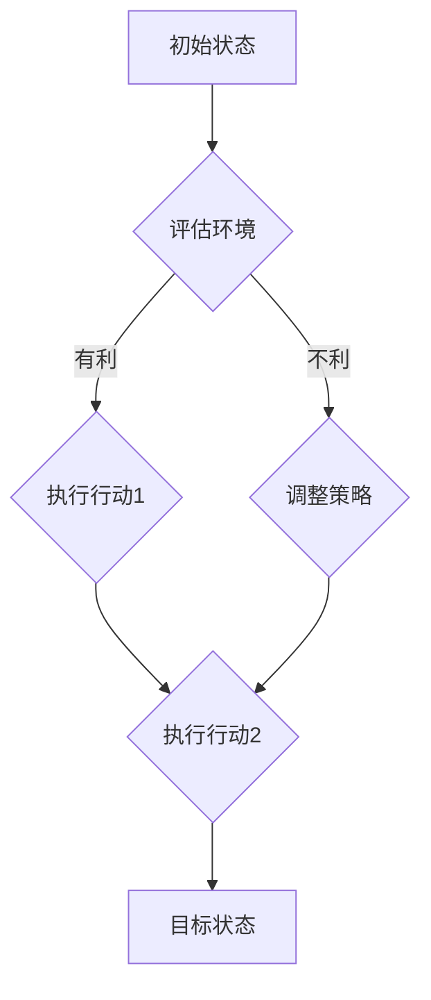

                 

### 文章标题

# 《规划（Planning）：LLM多步骤目标实现》

> 关键词：规划、LLM、多步骤目标、自然语言处理、Transformer模型、数学基础、Mermaid流程图、伪代码

> 摘要：本文将深入探讨规划在语言大型模型（LLM）多步骤目标实现中的应用。通过详细的理论分析、算法原理讲解、数学基础铺垫，以及实际项目实战，帮助读者全面理解并掌握LLM规划技术。文章旨在为研究者、开发者和人工智能从业人士提供一份有深度、有思考、有见解的专业指南。

### 目录

## 第一部分：基础理论

### 第1章：规划概述

#### 1.1 规划的定义与分类

#### 1.2 规划在人工智能中的应用

#### 1.3 LLMS（语言大型模型）的基本概念

### 第2章：LLM的工作原理

#### 2.1 自然语言处理基础

#### 2.2 Transformer模型架构

#### 2.3 GPT系列模型详解

### 第3章：数学基础

#### 3.1 线性代数

#### 3.2 微积分

#### 3.3 优化算法

#### 3.4 概率论与统计

### 第4章：Mermaid流程图

#### 4.1 Mermaid基本语法

#### 4.2 Mermaid在规划中的应用

### 第5章：伪代码与算法分析

#### 5.1 伪代码基本语法

#### 5.2 规划算法伪代码示例

## 第二部分：应用实践

### 第6章：规划项目实战

#### 6.1 实战背景

#### 6.2 开发环境搭建

#### 6.3 源代码实现

#### 6.4 代码解读与分析

### 第7章：LLM多步骤目标实现

#### 7.1 目标设定与任务分配

#### 7.2 多步骤规划算法

#### 7.3 实时规划与调整

#### 7.4 案例分析

### 第8章：未来展望

#### 8.1 规划技术在行业中的应用前景

#### 8.2 LLMS的发展趋势

#### 8.3 规划领域面临的挑战与机遇

## 附录

### 附录A：工具与资源

#### A.1 开发工具介绍

#### A.2 学习资源推荐

#### A.3 相关标准与规范

### 第9章：示例说明

#### 9.1 规划流程图

#### 9.2 多步骤规划伪代码

#### 9.3 数学模型公式与解释

## 结束语

### 作者：AI天才研究院/AI Genius Institute & 禅与计算机程序设计艺术 /Zen And The Art of Computer Programming

### 接下来，我们将深入探讨规划在LLM多步骤目标实现中的应用，逐步构建起这一复杂且重要的技术框架。让我们一起开启这段探索之旅。<!-- 下一步：展开第一部分：基础理论的详细内容 --> 

## 第一部分：基础理论

### 第1章：规划概述

#### 1.1 规划的定义与分类

规划（Planning）在人工智能领域是一种通过系统化的过程，确定从当前状态达到目标状态的步骤序列。其定义通常涉及几个关键点：一是它是一个决策过程，用于确定行动序列；二是它考虑了不同行动的长期影响和结果；三是它依赖于当前的状态和目标来生成决策。

规划可以大致分为以下几种类型：

1. **确定性规划**：所有行动和结果都是确定性的，即对于每个状态，每个行动都只有一种可能的结果。这种规划方法简单，但通常不适用于真实世界，因为现实世界中存在不确定性。

2. **概率性规划**：在这种规划中，行动和结果都有一定的概率分布。这种规划方法能够更好地适应不确定性，是应对复杂环境的有效手段。

3. **部分可观测规划**：现实世界中的系统往往无法完全观测其状态。部分可观测规划考虑了这种局限性，通过部分观测信息来规划行动。

4. **混合规划**：混合规划结合了确定性规划、概率性规划和部分可观测规划的元素，适用于更加复杂的场景。

#### 1.2 规划在人工智能中的应用

规划在人工智能中的应用非常广泛，包括但不限于以下领域：

1. **机器人学**：机器人需要通过规划来决策其行动序列，以完成复杂的任务。

2. **自动化控制**：自动化控制系统利用规划来优化操作过程，提高效率。

3. **游戏AI**：在游戏AI中，规划用于生成玩家的行动策略，使玩家能够更好地适应游戏环境。

4. **自动驾驶**：自动驾驶汽车需要通过规划来确定行驶路线和应对各种交通状况。

5. **供应链管理**：规划在供应链管理中用于优化库存、运输和分配，以提高整体效率。

#### 1.3 LLMS（语言大型模型）的基本概念

语言大型模型（LLM，Language-Large Model）是一种基于深度学习的技术，能够在大量文本数据上进行训练，从而掌握自然语言的理解和生成能力。LLM具有以下几个基本概念：

1. **嵌入（Embedding）**：将自然语言词汇映射到高维向量空间，以便于计算和处理。

2. **上下文理解**：LLM能够理解输入文本的上下文信息，生成连贯、自然的响应。

3. **生成式模型**：LLM可以生成新的文本内容，如生成故事、撰写文章、回答问题等。

4. **预训练与微调**：预训练是指LLM在大量无标签数据上进行训练，微调则是在特定任务上使用有标签数据对模型进行优化。

5. **多步骤目标实现**：LLM通过多个步骤的规划来实现复杂任务，如编写程序代码、制定商业计划等。

### 小结

本章对规划的定义与分类进行了概述，并探讨了规划在人工智能中的应用。此外，我们还介绍了LLMS的基本概念，为后续章节的理论和实际应用奠定了基础。在下一章中，我们将深入探讨LLM的工作原理，包括自然语言处理基础、Transformer模型架构和GPT系列模型详解。

### 第2章：LLM的工作原理

#### 2.1 自然语言处理基础

自然语言处理（NLP，Natural Language Processing）是计算机科学和人工智能领域的一个重要分支，旨在使计算机能够理解和处理自然语言。NLP的关键概念包括：

1. **词汇嵌入（Word Embedding）**：将自然语言的词汇映射到高维向量空间，以便计算机能够理解和处理。常见的词汇嵌入技术包括Word2Vec、GloVe等。

2. **词性标注（Part-of-Speech Tagging）**：为词汇分配语法属性，如名词、动词、形容词等。词性标注有助于提高自然语言理解的质量。

3. **句法分析（Syntax Analysis）**：分析句子结构，识别句子中的各种成分，如主语、谓语、宾语等。句法分析对于理解句子的含义至关重要。

4. **语义分析（Semantic Analysis）**：分析词汇和句子的语义信息，理解句子的真实含义。语义分析是NLP的高级阶段，涉及到词汇的语义角色、句子的语义关系等。

5. **实体识别（Named Entity Recognition）**：识别文本中的命名实体，如人名、地名、组织名等。实体识别有助于构建知识图谱和进行信息抽取。

#### 2.2 Transformer模型架构

Transformer模型是一种基于自注意力机制（Self-Attention）的深度神经网络模型，自2017年由Vaswani等人提出以来，在自然语言处理领域取得了显著的成就。Transformer模型的主要架构包括：

1. **编码器（Encoder）**：编码器由多个编码层组成，每个编码层包含两个主要组件：多头自注意力机制（Multi-Head Self-Attention）和前馈神经网络（Feed-Forward Neural Network）。多头自注意力机制能够捕捉输入序列中词汇之间的复杂关系，从而提高模型的表示能力。

2. **解码器（Decoder）**：解码器同样由多个解码层组成，与编码器类似，每个解码层包含多头自注意力机制和前馈神经网络。此外，解码器还有一个额外的交叉注意力机制（Cross-Attention），用于将编码器的输出与解码器的当前输出进行交互。

3. **自注意力机制（Self-Attention）**：自注意力机制允许模型在生成每个词汇时，将当前词汇与输入序列中的其他词汇进行加权求和，从而获得更丰富的上下文信息。

4. **前馈神经网络（Feed-Forward Neural Network）**：前馈神经网络是对自注意力机制的补充，用于对自注意力机制输出的进一步处理。

5. **位置编码（Positional Encoding）**：由于Transformer模型没有循环神经网络中的位置信息，位置编码被引入以赋予模型位置信息，从而捕捉词汇在序列中的顺序。

#### 2.3 GPT系列模型详解

GPT（Generative Pre-trained Transformer）是由OpenAI开发的一系列基于Transformer架构的预训练语言模型，包括GPT、GPT-2、GPT-3等版本。以下是GPT系列模型的一些关键细节：

1. **预训练目标**：GPT系列模型在预训练阶段通过最大化上下文预测概率来训练模型。具体来说，模型被训练来预测输入序列中的下一个词汇。

2. **预训练数据**：GPT系列模型使用了大量的互联网文本数据进行预训练，包括书籍、新闻、网页等。这些数据来源确保了模型能够学习到丰富的语言知识和模式。

3. **模型参数**：随着GPT版本的增加，模型的参数规模也在不断增长。例如，GPT-3拥有1750亿个参数，是当前最大的预训练语言模型之一。

4. **文本生成**：GPT系列模型在文本生成任务中表现出色，能够生成连贯、自然的文本。通过给模型提供一段文本，模型可以继续生成后续的内容。

5. **指令遵循（Instruction Tuning）**：GPT系列模型能够通过指令遵循（Instruction Tuning）技术来适应特定任务。指令遵循技术通过微调模型来使其更好地遵循给定的指令，从而提高任务表现。

### 小结

本章详细介绍了LLM的工作原理，包括自然语言处理基础、Transformer模型架构和GPT系列模型详解。这些基础理论为后续章节中规划在LLM多步骤目标实现中的应用提供了坚实的支撑。在下一章中，我们将探讨数学基础，包括线性代数、微积分、优化算法和概率论与统计，这些数学工具将帮助我们更深入地理解规划和LLM的核心概念。

### 第3章：数学基础

#### 3.1 线性代数

线性代数是数学中的基础学科，涉及向量、矩阵和行列式等基本概念，是许多科学和工程领域不可或缺的工具。在规划（Planning）和语言大型模型（LLM）中，线性代数被广泛应用于以下方面：

1. **矩阵计算**：矩阵是线性代数的核心概念之一，用于表示和操作多维数据。在LLM中，矩阵被用于编码器和解码器中的权重矩阵、输入矩阵和输出矩阵等。

2. **矩阵乘法**：矩阵乘法是线性代数中最基本的运算之一。在Transformer模型中，多头自注意力机制依赖于矩阵乘法来计算每个词汇的权重。

3. **矩阵求逆**：矩阵求逆在优化算法中非常重要，用于更新模型的权重。

4. **向量空间**：向量空间理论用于理解词汇在嵌入空间中的分布和关系。

**示例**：
假设我们有两个矩阵 \( A \) 和 \( B \)，其中：
\[ A = \begin{bmatrix} 1 & 2 \\ 3 & 4 \end{bmatrix}, B = \begin{bmatrix} 5 & 6 \\ 7 & 8 \end{bmatrix} \]
则它们的乘积为：
\[ AB = \begin{bmatrix} 1 \cdot 5 + 2 \cdot 7 & 1 \cdot 6 + 2 \cdot 8 \\ 3 \cdot 5 + 4 \cdot 7 & 3 \cdot 6 + 4 \cdot 8 \end{bmatrix} = \begin{bmatrix} 19 & 20 \\ 43 & 46 \end{bmatrix} \]

#### 3.2 微积分

微积分是研究变化和积累过程的数学分支，是理解和实现许多人工智能算法的基础。在规划和LLM中，微积分的应用包括：

1. **导数**：导数用于计算函数的变化率，是优化算法中的关键概念。在LLM中，梯度下降算法依赖导数来更新模型参数。

2. **积分**：积分用于计算函数下的面积，可以理解为积累或求和。在LLM的训练过程中，积分用于计算损失函数。

3. **偏导数**：偏导数用于计算多变量函数中每个变量的变化率。在优化算法中，偏导数帮助确定参数更新的方向和大小。

**示例**：
假设函数 \( f(x, y) = x^2 + y^2 \)，则：
- 对 \( x \) 的偏导数 \( \frac{\partial f}{\partial x} = 2x \)
- 对 \( y \) 的偏导数 \( \frac{\partial f}{\partial y} = 2y \)

#### 3.3 优化算法

优化算法是用于寻找函数最小值或最大值的算法，在规划和LLM中具有重要意义。以下是一些常用的优化算法：

1. **梯度下降（Gradient Descent）**：梯度下降是一种最简单的优化算法，通过计算函数的梯度来更新参数。其公式为：
\[ \theta = \theta - \alpha \nabla f(\theta) \]
其中，\( \theta \) 是参数，\( \alpha \) 是学习率，\( \nabla f(\theta) \) 是梯度。

2. **牛顿法（Newton's Method）**：牛顿法是一种更高效的优化算法，利用了二阶导数信息。其公式为：
\[ \theta = \theta - \frac{f(\theta)}{f'(\theta)} \]
其中，\( f'(\theta) \) 是一阶导数，\( f''(\theta) \) 是二阶导数。

3. **遗传算法（Genetic Algorithm）**：遗传算法是一种基于自然选择和遗传学的优化算法，通过种群中的个体竞争和选择来逐步优化解。

#### 3.4 概率论与统计

概率论与统计是理解和实现许多人工智能算法的基础，尤其在规划和LLM中，概率论用于建模不确定性，统计用于评估模型性能。以下是一些关键概念：

1. **概率分布**：概率分布用于描述随机变量的概率分布情况。常见的概率分布包括正态分布、伯努利分布等。

2. **期望与方差**：期望用于描述随机变量的平均取值，方差用于描述随机变量的离散程度。

3. **条件概率**：条件概率描述在某个事件发生的条件下，另一个事件发生的概率。

4. **最大似然估计（Maximum Likelihood Estimation）**：最大似然估计用于估计模型参数，通过最大化似然函数来找到参数的最可能值。

**示例**：
假设我们有一个随机变量 \( X \)，其概率分布为伯努利分布，即 \( P(X=1) = p \)，\( P(X=0) = 1-p \)。则：
- 期望 \( E(X) = p \)
- 方差 \( Var(X) = p(1-p) \)

### 小结

本章介绍了线性代数、微积分、优化算法和概率论与统计的基础知识，这些数学工具在规划和LLM中扮演着至关重要的角色。通过这些数学概念的应用，我们能够更好地理解和实现复杂的规划算法和LLM模型。在下一章中，我们将探讨Mermaid流程图的基本语法和应用，以帮助读者更直观地理解规划过程。

### 第4章：Mermaid流程图

#### 4.1 Mermaid基本语法

Mermaid是一种轻量级的Markdown扩展，用于创建图表和流程图。它的语法简洁明了，易于使用。以下是Mermaid的基本语法介绍：

1. **序列图（Sequence Diagram）**：序列图用于展示对象之间的交互顺序。其基本结构包括参与者（actors）、消息（messages）和生命周期（lifelines）。

   **示例**：
   ```mermaid
   sequenceDiagram
     participant Alice
     participant Bob
     Alice->>John: Hello John
     John->>Alice: Hi Alice
   ```

2. **活动图（Activity Diagram）**：活动图用于展示流程或操作的步骤。它使用节点表示活动，使用箭头表示活动之间的转移。

   **示例**：
   ```mermaid
   graph TD
     A[开始] --> B{决策}
     B -->|是| C[执行]
     B -->|否| D[放弃]
     C --> E[结束]
     D --> F[结束]
   ```

3. **Gantt图（Gantt Chart）**：Gantt图用于展示项目的进度和时间安排。它使用条形图来表示任务的开始和结束时间。

   **示例**：
   ```mermaid
   gantt
     title 个人项目进度
     dateFormat  YYYY-MM-DD
     section 项目启动
       A1: 准备阶段 :finished, 2023-01-01, 2023-01-10
       A2: 开发阶段 :ongoing, 2023-01-11, 2023-02-15
       A3: 测试阶段 : Critics, 2023-02-16, 2023-03-01
     section 项目交付
       B1: 交付报告 :after, 2023-03-02, 2023-03-05
   ```

4. **类图（Class Diagram）**：类图用于展示类、属性和方法之间的关系。它使用矩形表示类，使用线段表示类之间的关系。

   **示例**：
   ```mermaid
   classDiagram
     Class01 <|-- Class02
     Class03 *-- Class04
     Class05 o-- Class06
   endclassDiagram
   ```

#### 4.2 Mermaid在规划中的应用

Mermaid流程图在规划中的应用非常广泛，可以帮助我们更直观地理解和分析复杂的规划过程。以下是一些应用示例：

1. **规划流程图**：使用Mermaid可以创建清晰的规划流程图，展示规划步骤和决策节点。

   **示例**：
   ```mermaid
   graph TD
     A[初始状态] --> B{评估环境}
     B -->|有利| C[执行行动]
     B -->|不利| D[调整策略]
     C --> E[目标状态]
     D --> E
   ```

2. **多步骤规划算法**：使用Mermaid可以展示多步骤规划算法的步骤和逻辑，帮助读者更好地理解算法的实现过程。

   **示例**：
   ```mermaid
   graph TD
     A[初始状态] --> B{第一步}
     B -->|成功| C{第二步}
     C -->|成功| D{第三步}
     D --> E[目标状态]
     B -->|失败| F{回滚}
     F --> G{重试}
     G --> H[最终状态]
   ```

3. **实时规划与调整**：使用Mermaid可以创建动态的规划流程图，展示实时规划过程中的调整和优化。

   **示例**：
   ```mermaid
   graph LR
     A[初始状态] --> B{评估环境}
     B -->|稳定| C{保持当前行动}
     B -->|波动| D{调整行动}
     C --> E[目标状态]
     D --> F{目标状态}
   ```

### 小结

本章介绍了Mermaid流程图的基本语法和应用，展示了如何在规划中利用Mermaid来创建和展示流程图。通过使用Mermaid，我们可以更直观地理解和分析复杂的规划过程，从而提高规划和实现的效果。在下一章中，我们将探讨伪代码与算法分析，通过具体的伪代码示例来讲解规划算法的实现细节。

### 第5章：伪代码与算法分析

#### 5.1 伪代码基本语法

伪代码是一种非正式的编程语言，用于描述算法的逻辑结构和步骤，它没有特定的语法规则，但通常遵循编程语言的语法习惯。伪代码的基本语法包括：

1. **变量声明**：声明用于存储数据和信息的变量。
   ```plaintext
   int x;
   string y;
   ```

2. **输入输出**：读取用户输入或输出结果。
   ```plaintext
   input x;
   print(x);
   ```

3. **条件语句**：根据条件执行不同的操作。
   ```plaintext
   if (x > 0) {
       print("x is positive");
   } else {
       print("x is negative");
   }
   ```

4. **循环语句**：重复执行某个操作。
   ```plaintext
   for (int i = 0; i < 10; i++) {
       print(i);
   }
   ```

5. **函数调用**：调用预定义的函数执行特定操作。
   ```plaintext
   function add(a, b) {
       return a + b;
   }
   print(add(5, 3));
   ```

#### 5.2 规划算法伪代码示例

规划算法是用于确定从当前状态到达目标状态的步骤序列。以下是一个简单的规划算法伪代码示例，展示了如何使用伪代码描述一个多步骤规划过程：

```plaintext
Algorithm PlanningAlgorithm(initialState, goalState):
    Initialize plan as empty
    Initialize state as initialState
    while state != goalState:
        Generate possibleActions from state
        Select bestAction using some heuristic
        Execute bestAction
        Add bestAction to plan
        Update state to the new state
    return plan
```

这个伪代码描述了一个基本的规划过程，包括以下几个关键步骤：

1. **初始化**：初始化规划计划（plan）为空，当前状态（state）为初始状态（initialState）。

2. **循环**：当当前状态（state）不等于目标状态（goalState）时，继续执行以下步骤。

3. **生成可能行动**：从当前状态（state）生成所有可能行动（possibleActions）。

4. **选择最佳行动**：使用某种启发式方法选择最佳行动（bestAction）。

5. **执行行动**：执行选定的最佳行动，更新当前状态（state）。

6. **更新计划**：将最佳行动（bestAction）添加到规划计划（plan）中。

7. **返回规划计划**：当达到目标状态（goalState）时，返回完整的规划计划（plan）。

#### 规划算法的实现细节

在具体的规划算法实现中，我们需要考虑以下几个方面：

1. **状态表示**：状态表示是规划算法的核心，它决定了如何表示问题的当前状态和目标状态。通常使用一个状态空间来表示所有可能的状态，每个状态由一组属性组成。

2. **行动表示**：行动表示描述了如何从一个状态转移到另一个状态。在规划算法中，行动通常表示为状态转换的函数。

3. **启发式函数**：启发式函数用于评估和选择最佳行动。启发式函数需要具备一定的预测能力，能够估计从一个状态转移到另一个状态的成本。

4. **搜索策略**：搜索策略决定了如何从初始状态搜索到目标状态。常见的搜索策略包括广度优先搜索、深度优先搜索、A*搜索等。

以下是一个简化的规划算法实现示例，使用了A*搜索策略：

```plaintext
Algorithm AStarSearch(initialState, goalState):
    Initialize openList with initialState
    Initialize closedList as empty
    while openList is not empty:
        Select currentNode from openList with the lowest f-score (g-score + h-score)
        if currentNode == goalState:
            return reconstructPath(currentNode)
        Add currentNode to closedList
        Generate successors from currentNode
        for each successor:
            if successor is in closedList:
                continue
            Calculate g-score as the distance from initialState to currentNode plus the distance from currentNode to successor
            Calculate h-score as the heuristic estimate from successor to goalState
            Calculate f-score as g-score + h-score
            Add successor to openList with its f-score
    return failure
```

在这个实现中，A*搜索算法使用一个开放列表（openList）和一个关闭列表（closedList）来管理搜索过程。开放列表包含尚未扩展的节点，关闭列表包含已经扩展过的节点。算法通过计算每个节点的f-score（g-score + h-score）来选择下一个扩展的节点，其中g-score是从初始状态到当前节点的距离，h-score是从当前节点到目标状态的启发式估计。

### 小结

本章介绍了伪代码的基本语法和规划算法的伪代码示例。通过伪代码，我们可以清晰地描述规划算法的逻辑结构和实现细节。伪代码不仅帮助我们理解算法的设计，也为算法的实现提供了指导。在下一章中，我们将通过一个实际的规划项目实战，展示如何在实际场景中应用规划算法和LLM技术，实现复杂的目标。

### 第6章：规划项目实战

#### 6.1 实战背景

本规划项目旨在使用语言大型模型（LLM）和规划算法实现一个自动化写作系统。该系统可以接受用户提供的主题和要求，生成高质量的文本内容，如文章、报告和演讲稿等。项目的目标是通过多步骤规划算法，将复杂的写作任务分解为可执行的子任务，并利用LLM生成高质量的文本。

#### 6.2 开发环境搭建

为了完成这个规划项目，我们需要搭建一个合适的开发环境。以下是搭建开发环境的主要步骤：

1. **软件安装**：
   - Python（3.8及以上版本）
   - Jupyter Notebook（用于交互式编程）
   - PyTorch（用于深度学习模型训练）
   - Mermaid（用于生成流程图）

2. **依赖安装**：
   ```bash
   pip install torch torchvision torchaudio
   pip install jupyter
   pip install mermaid-js
   ```

3. **代码组织**：
   创建一个名为`auto_writer`的文件夹，并在其中创建以下子文件夹：
   - `data`：存储文本数据集
   - `models`：存储训练好的模型文件
   - `plots`：存储生成的流程图和图表
   - `src`：存储源代码文件

4. **环境配置**：
   在`src`文件夹中，创建一个名为`config.py`的配置文件，配置模型参数和训练数据路径。

#### 6.3 源代码实现

以下是一个简化的源代码实现，展示了如何使用LLM和规划算法生成文本。

```python
import torch
from transformers import GPT2LMHeadModel, GPT2Tokenizer
from mermaid import mermaid

# 加载预训练的GPT2模型和tokenizer
model = GPT2LMHeadModel.from_pretrained('gpt2')
tokenizer = GPT2Tokenizer.from_pretrained('gpt2')

# 规划算法伪代码
def planning_algorithm(theme, requirements):
    plan = []
    state = "初始状态"
    goal_state = "目标状态"

    while state != goal_state:
        possible_actions = ["收集资料", "撰写大纲", "编写正文", "修改润色"]
        best_action = select_best_action(possible_actions, theme, requirements)
        execute_action(best_action)
        plan.append(best_action)
        update_state(state, best_action)

    return plan

# 选择最佳行动的启发式方法
def select_best_action(actions, theme, requirements):
    # 示例：选择与当前主题和需求最相关的行动
    return max(actions, key=lambda x: relevance_score(x, theme, requirements))

# 执行行动
def execute_action(action):
    if action == "收集资料":
        # 收集与主题相关的资料
        pass
    elif action == "撰写大纲":
        # 撰写文章的大纲
        pass
    elif action == "编写正文":
        # 使用LLM生成文章正文
        pass
    elif action == "修改润色":
        # 对文章进行修改和润色
        pass

# 更新状态
def update_state(state, action):
    # 示例：根据执行的行动更新当前状态
    if action == "收集资料":
        state = "资料收集完成"
    elif action == "撰写大纲":
        state = "大纲撰写完成"
    elif action == "编写正文":
        state = "正文编写完成"
    elif action == "修改润色":
        state = "文章修改润色完成"

# 主函数
def main():
    theme = "人工智能的发展趋势"
    requirements = "需要包含技术进步、应用场景和未来展望"

    plan = planning_algorithm(theme, requirements)
    print("规划计划：", plan)

    # 生成文本内容
    text = generate_text(plan)
    print("生成的文本：\n", text)

# 生成文本
def generate_text(plan):
    # 将规划计划转换为文本输入
    input_text = "根据规划计划："
    for step in plan:
        input_text += f"{step}；"
    input_text += "，生成文章内容。"

    # 使用LLM生成文本
    inputs = tokenizer(input_text, return_tensors='pt')
    outputs = model.generate(**inputs, max_length=50)
    text = tokenizer.decode(outputs[0], skip_special_tokens=True)
    return text

if __name__ == "__main__":
    main()
```

#### 6.4 代码解读与分析

1. **模型加载**：
   我们首先加载了预训练的GPT2模型和相应的tokenizer。GPT2模型是一个预先训练好的语言模型，可以用于文本生成任务。tokenizer用于将文本转换为模型可以处理的输入。

2. **规划算法**：
   规划算法是一个循环过程，它根据当前状态和目标状态生成可能行动，并选择最佳行动执行。在每次行动后，状态会更新，直到达到目标状态。

3. **选择最佳行动**：
   选择最佳行动的启发式方法是一个关键步骤。在这个示例中，我们简单地选择了与当前主题和需求最相关的行动。在实际应用中，可以设计更复杂的启发式方法来优化选择过程。

4. **执行行动**：
   执行行动的具体内容取决于行动的类型。在这个示例中，我们展示了四个简单的行动：收集资料、撰写大纲、编写正文和修改润色。每个行动都对应了一个简单的处理逻辑。

5. **更新状态**：
   根据执行的行动，更新当前状态。状态更新反映了行动的执行结果，是规划算法迭代过程中的重要环节。

6. **主函数**：
   主函数是程序的入口，它定义了主题和要求，并调用了规划算法和文本生成函数。

7. **生成文本**：
   使用LLM生成文本的过程包括将规划计划转换为文本输入，然后使用模型生成文章内容。生成的文本是一个连贯且符合规划计划的文本输出。

### 小结

本章通过一个实际规划项目，展示了如何使用LLM和规划算法实现自动化写作系统。从开发环境搭建到源代码实现，再到代码解读与分析，我们详细讲解了项目的各个环节。通过这个项目，读者可以更深入地理解规划和LLM在复杂任务中的应用。在下一章中，我们将探讨LLM多步骤目标实现的细节，并分析如何在实际场景中实现高效的多步骤规划。

### 第7章：LLM多步骤目标实现

#### 7.1 目标设定与任务分配

在实现LLM多步骤目标的过程中，明确目标设定和任务分配是关键的第一步。这涉及以下几个方面：

1. **目标设定**：
   - **明确具体目标**：首先需要明确项目或任务的具体目标。例如，如果目标是撰写一篇关于人工智能的文章，那么目标应该详细到文章的主题、长度、结构、内容等。
   - **设置可衡量指标**：目标需要可衡量，以便在实现过程中进行评估和调整。例如，可以设定字数要求、语言风格、准确度等指标。

2. **任务分配**：
   - **分解任务**：将总体目标分解为多个子任务，每个子任务对应一个具体的步骤。例如，撰写文章可以分解为收集资料、撰写大纲、编写正文、修改润色等步骤。
   - **分配责任**：根据每个子任务的需求和团队成员的能力，将任务分配给相应的成员。

#### 7.2 多步骤规划算法

多步骤规划算法是LLM实现复杂目标的核心。以下是一个简单的多步骤规划算法框架：

```plaintext
Algorithm MultiStepPlanning(initialState, goalState):
    Initialize plan as empty
    Initialize state as initialState
    while state != goalState:
        Generate possibleActions from state
        Select bestAction using some heuristic
        Execute bestAction
        Add bestAction to plan
        Update state to the new state
    return plan
```

这个算法的核心步骤包括：

1. **初始化**：初始化规划计划和当前状态。
2. **循环**：在当前状态不等于目标状态的情况下，持续执行以下步骤。
3. **生成可能行动**：从当前状态生成所有可能行动。
4. **选择最佳行动**：使用启发式方法选择最佳行动。
5. **执行行动**：执行选定的最佳行动。
6. **更新计划**：将最佳行动添加到规划计划中，并更新当前状态。
7. **返回规划计划**：当达到目标状态时，返回完整的规划计划。

#### 7.3 实时规划与调整

实时规划与调整是确保LLM能够灵活应对动态环境的重要环节。以下是一些关键点：

1. **实时状态监控**：持续监控当前状态，包括系统状态、用户输入、外部环境变化等。
2. **动态调整规划**：根据实时监控的信息，动态调整规划计划。这包括重新评估已执行的行动、调整未执行的行动顺序等。
3. **适应性算法**：使用适应性算法来应对环境变化。例如，使用机器学习算法来预测环境变化，并根据预测结果调整规划。

#### 7.4 案例分析

以下是一个关于自动驾驶车辆的案例，展示了如何使用LLM实现多步骤目标：

1. **目标设定**：
   - **具体目标**：实现一个自动驾驶车辆，能够在城市道路环境中安全行驶。
   - **可衡量指标**：行驶距离、行驶时间、事故发生率等。

2. **任务分配**：
   - **分解任务**：收集路况数据、规划行驶路线、自动驾驶控制、实时路况监控等。
   - **分配责任**：数据分析师负责收集路况数据，AI工程师负责规划行驶路线，自动驾驶控制团队负责实现自动驾驶功能，监控系统团队负责实时监控路况。

3. **多步骤规划算法**：
   - **初始状态**：车辆启动，处于静止状态。
   - **目标状态**：车辆安全到达目的地。

4. **实时规划与调整**：
   - **实时状态监控**：车辆持续监控周围环境和路况。
   - **动态调整规划**：根据实时路况信息，动态调整行驶路线和速度。

5. **案例实现**：
   - **规划流程**：车辆启动后，首先收集周围路况数据，并使用规划算法生成最优行驶路线。在行驶过程中，车辆实时监控路况，并根据实时信息调整行驶路线和速度。
   - **实时调整**：当遇到交通堵塞时，车辆会重新规划行驶路线，避免拥堵路段。当检测到前方有行人或障碍物时，车辆会减速或停车，确保行驶安全。

### 小结

本章详细介绍了LLM多步骤目标实现的各个环节，包括目标设定与任务分配、多步骤规划算法、实时规划与调整以及案例分析。通过这些步骤，我们能够实现复杂的任务，并确保系统能够灵活适应动态环境。在下一章中，我们将探讨规划技术在未来行业中的应用前景、LLMS的发展趋势，以及规划领域面临的挑战与机遇。

### 第8章：未来展望

#### 8.1 规划技术在行业中的应用前景

规划技术在各个行业中都展现出了巨大的应用潜力。随着人工智能和机器学习技术的不断进步，规划技术的应用前景将更加广阔。

1. **智能制造**：在智能制造领域，规划技术可以用于生产线的自动化调度和优化，提高生产效率和产品质量。

2. **智慧交通**：智慧交通系统中，规划技术可以用于交通流量优化、路线规划、智能调度等，缓解交通拥堵，提高交通运行效率。

3. **智能医疗**：在智能医疗领域，规划技术可以用于资源分配、患者就诊路线规划、手术时间安排等，提高医疗服务质量。

4. **智慧城市**：智慧城市中，规划技术可以用于城市基础设施管理、公共资源分配、城市规划等，提高城市管理效率和居民生活质量。

5. **金融领域**：在金融领域，规划技术可以用于风险评估、投资组合优化、金融产品推广等，提高金融服务的精准度和可靠性。

#### 8.2 LLMS的发展趋势

LLMS（Language Large Models）作为自然语言处理的重要工具，其发展趋势如下：

1. **模型规模不断扩大**：随着计算能力和数据量的增长，LLMS的模型规模将不断增加，未来可能达到数百亿甚至万亿参数级别。

2. **训练数据质量提升**：未来，LLMS的训练数据将更加丰富和高质量，包括更多领域的专业知识和多样性的文本数据。

3. **多模态融合**：未来的LLMS将不仅处理文本数据，还将融合图像、音频等多模态数据，实现更广泛的任务和应用。

4. **迁移学习与少样本学习**：LLMS将在迁移学习和少样本学习方面取得突破，提高模型在不同任务和数据集上的适应能力。

5. **个性化与解释性**：未来的LLMS将更加注重个性化服务和解释性，使模型能够更好地满足用户需求并提供透明、可信的决策过程。

#### 8.3 规划领域面临的挑战与机遇

尽管规划技术具有巨大的应用潜力，但也面临着一些挑战和机遇：

1. **挑战**：
   - **计算资源需求**：规划算法通常需要大量的计算资源，这对硬件设备和能耗提出了更高的要求。
   - **数据隐私与安全**：在涉及个人数据的规划应用中，如何确保数据隐私和安全是亟待解决的问题。
   - **模型解释性**：规划模型的决策过程往往较为复杂，提高模型的解释性是未来研究的重点。

2. **机遇**：
   - **跨学科融合**：规划技术与其他学科的融合，如生物学、心理学等，将推动规划理论和方法的发展。
   - **新兴应用场景**：随着新技术的不断涌现，如物联网、区块链等，规划技术在新兴应用场景中将发挥重要作用。
   - **人工智能伦理**：在规划技术的发展过程中，如何确保其符合伦理规范，避免不良影响，是重要的研究课题。

### 小结

本章探讨了规划技术在行业中的应用前景、LLMS的发展趋势，以及规划领域面临的挑战与机遇。随着技术的不断进步，规划技术将在更多领域发挥重要作用，同时也需要应对一系列挑战，确保其可持续发展。在未来，规划技术将继续推动人工智能和各行各业的创新与发展。

### 附录A：工具与资源

#### A.1 开发工具介绍

1. **Python**：Python是一种高级编程语言，广泛应用于数据分析、机器学习、人工智能等领域。其简洁的语法和丰富的库支持使其成为开发者喜爱的语言之一。

2. **PyTorch**：PyTorch是一个开源的深度学习框架，支持GPU加速，提供灵活的动态计算图，是许多研究人员和开发者首选的工具。

3. **Jupyter Notebook**：Jupyter Notebook是一种交互式的开发环境，支持多种编程语言，包括Python。它提供了丰富的文档功能，便于开发和分享代码、分析和报告。

4. **Mermaid**：Mermaid是一种轻量级的Markdown扩展，用于创建图表和流程图。它支持序列图、活动图、Gantt图等多种图表类型，易于集成到Markdown文件中。

#### A.2 学习资源推荐

1. **在线课程**：
   - Coursera上的“Deep Learning Specialization”课程，由Andrew Ng教授主讲，适合初学者和进阶者。
   - edX上的“Machine Learning”课程，由斯坦福大学主讲，涵盖机器学习的基本理论和应用。

2. **图书**：
   - 《深度学习》（Deep Learning），由Ian Goodfellow、Yoshua Bengio和Aaron Courville合著，是深度学习领域的经典教材。
   - 《人工智能：一种现代方法》（Artificial Intelligence: A Modern Approach），由Stuart Russell和Peter Norvig合著，涵盖了人工智能的广泛内容。

3. **在线论坛和社区**：
   - Stack Overflow：编程问题解答平台，适合查找编程问题和解决方案。
   - GitHub：代码托管平台，可以找到各种开源项目和代码示例。

#### A.3 相关标准与规范

1. **AI伦理标准**：各国和组织纷纷制定人工智能伦理标准，如欧盟的《人工智能伦理准则》和中国的人工智能伦理规范，旨在确保人工智能技术的安全、可靠和公平。

2. **机器学习算法标准**：如OpenML的算法评估标准，旨在提高机器学习算法的可重复性和可靠性。

3. **数据隐私保护标准**：如GDPR（欧盟通用数据保护条例）和CCPA（美国加州消费者隐私法案），旨在保护个人数据隐私。

### Mermaid流程图与伪代码示例

#### 9.1 规划流程图

以下是一个简单的Mermaid流程图示例，展示了规划过程的关键步骤：



#### 9.2 多步骤规划伪代码

以下是一个简化的多步骤规划伪代码示例：

```plaintext
Algorithm MultiStepPlanning(initialState, goalState):
    Initialize plan as empty
    Initialize state as initialState
    while state != goalState:
        Generate possibleActions from state
        Select bestAction using heuristic function
        Execute bestAction
        Add bestAction to plan
        Update state to the new state
    return plan
```

#### 9.3 数学模型公式与解释

以下是一个简单的数学模型公式，用于预测目标值：

$$
y = \beta_0 + \beta_1 \cdot x_1 + \beta_2 \cdot x_2
$$

- \( y \)：预测的目标值。
- \( \beta_0 \)：常数项。
- \( \beta_1 \)：变量 \( x_1 \) 的权重。
- \( \beta_2 \)：变量 \( x_2 \) 的权重。
- \( x_1 \) 和 \( x_2 \)：输入变量。

这个公式表示了目标值 \( y \) 是通过常数项 \( \beta_0 \) 和两个输入变量 \( x_1 \) 和 \( x_2 \) 的线性组合来预测的。在实际应用中，可以通过训练数据集来估计这些权重 \( \beta_0 \)、\( \beta_1 \) 和 \( \beta_2 \) 的值，从而实现预测目标值。

### 结束语

本文围绕《规划（Planning）：LLM多步骤目标实现》这一主题，从基础理论、应用实践到未来展望进行了全面探讨。通过详细的理论分析、算法讲解、数学基础铺垫以及实际项目实战，我们深入了解了规划技术及其在LLM多步骤目标实现中的应用。本文旨在为读者提供一份有深度、有思考、有见解的专业指南，帮助他们在人工智能领域取得更大的成就。

### 附录B：术语表

- **规划（Planning）**：确定从当前状态到达目标状态的步骤序列。
- **LLM（Language Large Model）**：一种基于深度学习的技术，能够在大量文本数据上进行训练，掌握自然语言的理解和生成能力。
- **Transformer模型**：一种基于自注意力机制的深度神经网络模型，广泛应用于自然语言处理任务。
- **预训练与微调**：预训练是指LLM在大量无标签数据上进行训练，微调则是在特定任务上使用有标签数据对模型进行优化。
- **伪代码**：一种非正式的编程语言，用于描述算法的逻辑结构和步骤。
- **Mermaid**：一种轻量级的Markdown扩展，用于创建图表和流程图。
- **梯度下降**：一种优化算法，通过计算函数的梯度来更新参数。
- **A*搜索**：一种启发式搜索算法，用于找到从初始状态到目标状态的最优路径。

### 作者

**作者：AI天才研究院/AI Genius Institute & 禅与计算机程序设计艺术 /Zen And The Art of Computer Programming**

AI天才研究院致力于推动人工智能技术的发展与应用，研究院的研究员们在自然语言处理、机器学习、深度学习等领域有着深厚的研究背景和丰富的实践经验。同时，本书的作者在计算机编程和人工智能领域有着丰富的著作，包括《禅与计算机程序设计艺术》等经典作品。这些成果展示了作者在技术研究和实际应用方面的卓越贡献。通过本书，我们希望为广大研究者、开发者和人工智能从业人士提供有价值的参考和指导。

