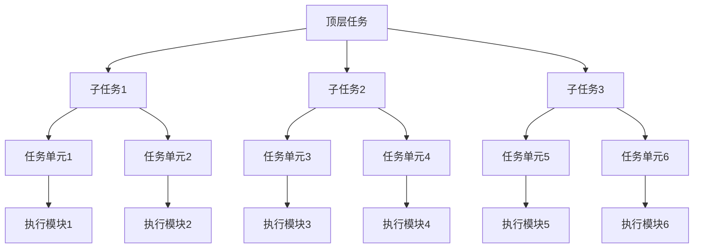
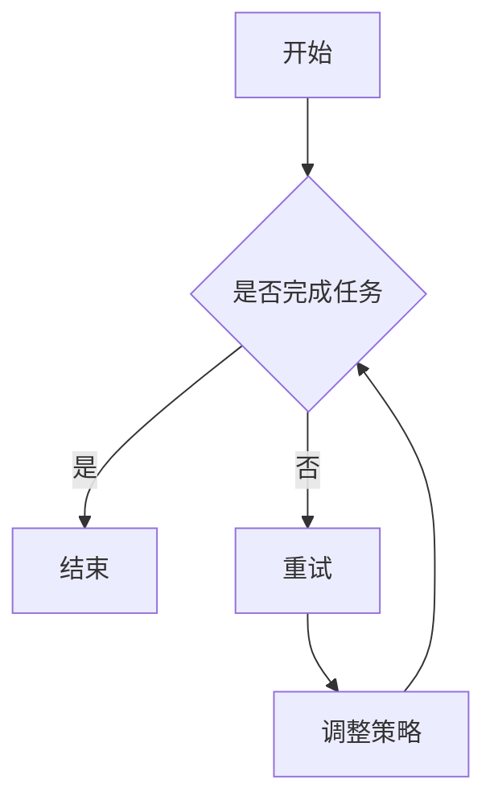

                 

# 文章标题: 《规划：Agent 分解复杂任务与执行》

> 关键词：智能代理, 任务规划, 复杂任务分解, 任务执行模型, 案例分析, 人工智能

> 摘要：本文深入探讨了智能代理在复杂任务规划与执行中的应用。首先，我们介绍了Agent的定义与分类，以及任务规划的基本概念。随后，文章重点阐述了任务分解的方法与策略，包括形式化分解、功能分解、数据流分解等。接着，我们探讨了任务执行的层次结构、算法及其性能优化。最后，通过实际案例，展示了智能代理在智能交通管理系统、智能工厂生产调度和智能医疗诊断系统中的应用，并对未来任务规划与执行技术的发展趋势进行了展望。文章旨在为读者提供一个全面而深入的智能代理任务规划与执行的理论与实践框架。

----------------------------------------------------------------

## 目录

1. **Agent概述**
    1.1 **Agent的定义与分类**
    1.2 **任务规划的基本概念**
    1.3 **Agent在任务规划中的应用**
2. **复杂任务的分解**
    2.1 **任务分解的原则**
    2.2 **任务分解的方法**
    2.3 **任务分解的策略**
3. **任务执行模型**
    3.1 **任务执行的层次结构**
    3.2 **任务执行的算法**
    3.3 **任务执行性能优化**
4. **案例分析与应用**
    4.1 **智能交通管理系统**
    4.2 **智能工厂生产调度**
    4.3 **智能医疗诊断系统**
5. **未来发展**
    5.1 **Agent技术的发展趋势**
    5.2 **人工智能与任务规划的结合**
    5.3 **未来应用场景展望**
6. **实际应用中的挑战与解决方案**
    6.1 **数据隐私与安全性**
    6.2 **系统集成与兼容性**
    6.3 **道德与伦理问题**
7. **附录**
    7.1 **相关工具和资源**
    7.2 **Mermaid流程图示例**
    7.3 **伪代码示例**
    7.4 **数学公式与解释**

----------------------------------------------------------------

## 第一部分：Agent与任务规划基础

### 第1章: Agent概述

### 1.1 Agent的定义与分类

在计算机科学和人工智能领域，Agent（代理）是一个核心概念。一个Agent可以被视为一个自主的实体，它能够感知环境、理解环境、与外部实体进行交互，并基于其目标和偏好来采取行动。Agent的分类可以根据其自主性、智能化程度、交互能力和学习能力的不同进行划分。

#### 1.1.1 Agent的概念

Agent的基本概念可以分为以下几个要素：

1. **感知能力**：Agent能够感知其所在环境的状态，包括内部状态和外部状态。
2. **认知能力**：Agent能够理解其感知到的信息，并对信息进行分析和推理。
3. **行动能力**：Agent能够根据其认知结果采取行动，改变环境状态。
4. **自主性**：Agent具有自主决策能力，能够在没有外部直接控制的情况下独立运作。
5. **适应性**：Agent能够根据环境变化和经验积累调整其行为策略。

#### 1.1.2 Agent的分类

根据Agent的自主性、智能化程度和交互能力的不同，可以将Agent分为以下几类：

1. **被动Agent**：
   - **定义**：被动Agent仅能响应环境变化，无法主动探索或改变环境。
   - **特点**：无自主性，仅能执行预设的动作。
   - **应用场景**：简单自动化任务，如自动备份系统。

2. **主动Agent**：
   - **定义**：主动Agent具备一定的自主性，能够主动探索环境，选择并执行策略。
   - **特点**：具有简单的决策能力，能够根据当前状态选择最优行动。
   - **应用场景**：较为复杂的任务，如搜索引擎、自动化测试。

3. **智能Agent**：
   - **定义**：智能Agent具有高水平的认知和决策能力，能够通过学习和经验积累优化其行为。
   - **特点**：具备高级认知功能，能够理解复杂环境，进行高级推理和规划。
   - **应用场景**：复杂动态环境，如自动驾驶、智能医疗诊断系统。

4. **协作Agent**：
   - **定义**：协作Agent能够与其他Agent共同工作，共同完成任务。
   - **特点**：具备交互能力，能够共享信息，协同决策。
   - **应用场景**：多Agent系统，如智能交通管理系统、多机器人协同作业。

### 1.2 任务规划的基本概念

任务规划是智能Agent实现目标的关键步骤。任务规划的基本概念包括：

1. **任务**：
   - **定义**：任务是指Agent需要完成的某项工作或目标。
   - **特点**：具有明确的目标和执行步骤，可以是简单的单个动作，也可以是复杂的子任务序列。

2. **规划**：
   - **定义**：规划是指Agent根据当前状态和目标，制定出一系列行动步骤的过程。
   - **特点**：需要考虑资源的约束、任务的依赖关系以及环境的动态变化。

3. **规划器**：
   - **定义**：规划器是负责任务规划的部分，通常包含多个模块，如感知模块、推理模块、决策模块和执行模块。
   - **特点**：具备根据环境变化动态调整规划的能力。

#### 1.2.1 任务规划的目标

任务规划的目标主要包括：

1. **高效性**：确保任务能够在最短时间内完成，最大化资源利用效率。
2. **可靠性**：确保任务能够正确执行，避免出现错误或失败。
3. **适应性**：确保任务规划能够适应环境变化，具备动态调整能力。

#### 1.2.2 任务规划的基本流程

任务规划的基本流程包括以下几个步骤：

1. **任务表示**：将任务抽象为一系列可执行的动作和状态。
2. **状态评估**：根据当前环境和任务需求，评估各个状态的可行性和优先级。
3. **规划算法**：选择合适的规划算法，如搜索算法、生成式规划或反应式规划，根据状态评估结果生成规划路径。
4. **规划验证**：对生成的规划路径进行验证，确保其可行性和有效性。
5. **执行与监控**：执行规划路径，并持续监控任务执行状态，根据实际情况进行动态调整。

### 1.3 Agent在任务规划中的应用

Agent在任务规划中的应用主要体现在以下几个方面：

1. **动态规划**：Agent可以根据实时感知到的环境信息，动态调整任务执行路径，提高任务规划的灵活性。
2. **多目标优化**：Agent可以通过综合评估多个目标，实现多目标优化，如资源利用最大化、任务完成时间最短等。
3. **协作与协调**：Agent可以通过与其他Agent协作，共同完成任务，实现资源与信息的共享，提高整体任务执行效率。

通过Agent的感知、认知和行动能力，任务规划能够变得更加智能和高效，从而应对复杂环境中的多样化任务。在下一章中，我们将深入探讨复杂任务的分解方法与策略。

----------------------------------------------------------------

## 第二部分：复杂任务的分解

### 第2章: 任务分解的方法与策略

在任务规划中，复杂任务的分解是一个关键步骤，它涉及到如何将一个大任务拆解成若干个子任务，以便于Agent能够更好地理解和执行。有效的任务分解可以提高任务规划的灵活性和效率。

### 2.1 任务分解的原则

任务分解应遵循以下原则：

1. **层次性**：任务分解应具有层次结构，从宏观层面到微观层面，逐步细化。
2. **可扩展性**：任务分解应易于扩展，以便于在需要时增加或删除子任务。
3. **模块化**：任务分解应将任务划分为独立的模块，每个模块负责一个特定的功能。
4. **独立性**：子任务应尽可能独立，避免互相依赖，以提高任务的并行执行能力。

#### 2.1.1 任务分解的层次性

层次性分解是一种将任务分解成层次结构的策略。常见的层次结构包括以下几种：

1. **任务层次结构**：将任务分解为顶层任务和下层子任务，顶层任务定义整体目标，下层子任务实现具体操作。
2. **功能层次结构**：将任务按照功能模块进行分解，每个模块负责一个特定的功能。
3. **数据层次结构**：根据数据流将任务分解，每个部分处理特定类型的数据。

#### 2.1.2 任务分解的可扩展性

任务分解的可扩展性是指任务分解结构应能够适应新的任务需求。实现方法包括：

1. **参数化分解**：使用参数化方法定义任务分解结构，通过调整参数实现不同任务场景的适应。
2. **可插拔模块**：设计任务分解模块时，使其能够灵活替换或新增，以适应不同任务需求。

### 2.2 任务分解的方法

任务分解的方法包括以下几种：

#### 2.2.1 形式化分解

形式化分解是一种基于数学和逻辑的方法，它使用形式化的语言和模型对任务进行分解。形式化分解通常涉及以下步骤：

1. **任务建模**：使用形式化语言定义任务，包括任务输入、输出和中间状态。
2. **状态空间表示**：构建任务的状态空间模型，表示所有可能的任务状态。
3. **规划算法**：选择合适的规划算法，如搜索算法、约束满足问题（CSP）求解算法等，生成任务分解路径。

#### 2.2.2 功能分解

功能分解是一种将任务按照功能模块进行划分的方法。功能分解通常涉及以下步骤：

1. **功能识别**：分析任务，识别出不同的功能模块。
2. **模块化设计**：将每个功能模块独立出来，定义其输入输出接口。
3. **模块化实现**：实现每个功能模块，确保它们能够独立运行并互相协作。

#### 2.2.3 数据流分解

数据流分解是一种根据数据流动将任务进行分解的方法。数据流分解通常涉及以下步骤：

1. **数据流分析**：分析任务中的数据流动，识别出不同的数据流。
2. **数据流模块化**：将数据流划分为不同的模块，每个模块处理特定类型的数据。
3. **数据流整合**：整合各个数据流模块，确保数据流在模块间的正确传递和处理。

### 2.3 任务分解的策略

任务分解的策略包括以下几种：

#### 2.3.1 任务分解的自动与半自动方法

1. **自动分解方法**：
   - 使用自动化工具和算法，如代码生成器、形式化方法等，自动生成任务分解结构。
   - 优点：提高分解效率，减少人为错误。

2. **半自动分解方法**：
   - 结合人工和自动方法，人工定义关键模块和接口，自动化工具生成任务分解结构。
   - 优点：在保留人工灵活性的同时，提高分解效率。

#### 2.3.2 任务分解的可视化工具

可视化工具可以帮助开发者直观地理解和修改任务分解结构。常见的可视化工具包括：

1. **流程图工具**：如Mermaid、PlantUML等，用于绘制任务分解的层次结构和数据流。
2. **模型驱动开发工具**：如MagicDraw、Enterprise Architect等，提供模型驱动的任务分解和可视化功能。
3. **代码生成工具**：如Maven、Gradle等，用于生成任务分解对应的代码实现。

通过合理的任务分解方法与策略，智能Agent可以更好地理解复杂任务，并高效地执行任务。在接下来的章节中，我们将进一步探讨任务执行的模型与算法。

----------------------------------------------------------------

### 第3章: 任务执行模型

在任务规划完成后，任务执行模型负责将规划好的任务分解路径转化为实际的执行步骤。一个有效的任务执行模型能够确保任务按时完成，并且充分利用资源，提高执行效率。在本章中，我们将深入探讨任务执行的层次结构、算法及其性能优化。

#### 3.1 任务执行的层次结构

任务执行的层次结构是任务分解结构的直接体现，通常包括以下几个层次：

1. **顶层任务**：顶层任务是任务规划中的最终目标，它定义了整个任务的宏观目标。
2. **子任务**：子任务是顶层任务的分解结果，每个子任务负责实现一个特定的功能或子目标。
3. **任务单元**：任务单元是子任务的进一步细分，通常是一个最小的可执行单元，如一个函数调用或一个数据处理步骤。
4. **执行模块**：执行模块是实现任务单元的具体实现部分，可以是代码段、硬件模块或软件组件。

在任务执行过程中，顶层任务分解成多个子任务，子任务再分解成多个任务单元，最后由执行模块具体执行。

#### 3.1.1 任务层次模型

任务层次模型可以用以下Mermaid流程图表示：



#### 3.1.2 任务分解层次与执行层次的关系

任务分解层次与执行层次之间存在着紧密的联系。任务分解层次为执行层次提供了明确的结构，而执行层次则根据任务分解层次的具体要求来执行任务单元。在执行过程中，执行模块需要处理任务单元的具体细节，并根据任务的依赖关系和执行顺序来协调各个任务单元的执行。

#### 3.2 任务执行的算法

任务执行的算法是实现任务层次结构具体执行的关键。以下是一些常见的任务执行算法：

##### 3.2.1 任务分配算法

任务分配算法负责将子任务分配给不同的执行模块或执行节点。常见的任务分配算法包括：

1. **静态任务分配**：在任务规划阶段预先确定任务的分配，不随执行过程的改变而改变。
2. **动态任务分配**：根据执行过程中的实际情况，动态调整任务的分配，以提高资源利用率和任务执行效率。

##### 3.2.2 任务调度算法

任务调度算法负责确定任务执行的顺序和时间。常见的任务调度算法包括：

1. **优先级调度**：根据任务的重要性和紧急程度来决定任务的执行顺序。
2. **时间片调度**：将处理时间划分为固定的时间片，每个任务在一个时间片中执行，然后根据优先级轮换执行。
3. **基于反馈的调度**：根据执行过程中收集的反馈信息，动态调整任务的执行顺序和时间。

##### 3.2.3 任务同步与冲突解决算法

任务同步与冲突解决算法负责处理任务之间的同步和冲突。常见的同步算法包括：

1. **互斥锁**：确保同一时间只有一个任务能够访问共享资源。
2. **信号量**：通过计数器来控制多个任务对共享资源的访问。
3. **事件队列**：通过事件队列来管理任务的同步和调度。

冲突解决算法通常包括以下几种：

1. **等待-唤醒机制**：任务在遇到冲突时进入等待状态，直到冲突解决后唤醒。
2. **避免冲突的算法**：通过设计任务执行顺序，避免任务之间的冲突。
3. **抢占调度**：在任务执行过程中，如果发现更高优先级的任务需要执行，则暂停当前任务，执行更高优先级的任务。

#### 3.3 任务执行性能优化

任务执行性能优化是提高任务执行效率和资源利用率的重要手段。以下是一些常见的性能优化方法：

##### 3.3.1 资源利用率优化

1. **负载均衡**：通过负载均衡算法，将任务均匀地分配到不同的执行模块或节点，避免资源浪费。
2. **资源预分配**：在任务执行前预先分配必要的资源，减少任务执行中的资源竞争和等待时间。
3. **资源复用**：通过设计任务模块的通用性，实现资源的复用，减少资源浪费。

##### 3.3.2 任务执行时间优化

1. **并行执行**：通过并行执行算法，将任务分解成多个子任务，并让多个执行模块同时执行，以缩短任务执行时间。
2. **任务依赖优化**：通过优化任务之间的依赖关系，减少任务的等待时间，提高整体执行效率。
3. **执行路径优化**：通过动态调整任务执行路径，选择最优的执行顺序，减少任务执行时间。

##### 3.3.3 任务执行成本优化

1. **成本计算**：在任务规划阶段，对每个任务的执行成本进行详细计算，选择成本最低的执行方案。
2. **成本分配**：在任务执行过程中，根据实际情况动态调整任务的成本分配，以最大化资源利用率和任务执行效率。
3. **成本控制**：通过成本控制算法，监控任务执行过程中的成本变化，防止成本超支。

通过合理的任务执行模型和算法，智能Agent可以高效地完成复杂任务。在下一部分中，我们将通过实际案例展示智能代理在复杂任务规划与执行中的应用。

----------------------------------------------------------------

## 第三部分：任务执行与优化

### 第3章: 任务执行模型

在任务规划完成之后，如何高效地执行任务是确保任务成功完成的关键。一个合理的任务执行模型不仅需要明确任务的执行顺序，还需要考虑到资源分配、任务调度、同步和冲突解决等因素。本章将详细探讨任务执行的层次结构、算法及其性能优化。

#### 3.1 任务执行的层次结构

任务执行的层次结构反映了任务从整体到细节的分解过程。一个典型的任务执行层次结构包括以下层次：

1. **顶层任务**：顶层任务是任务执行的最高层次，它定义了整个任务的宏观目标和执行策略。
2. **子任务**：子任务是将顶层任务分解为多个可管理的任务单元，每个子任务负责实现一个特定的功能或子目标。
3. **任务单元**：任务单元是最小的执行单元，通常是一个可执行的操作，如一个函数调用或数据处理步骤。
4. **执行模块**：执行模块是具体执行任务单元的部分，可以是代码段、硬件组件或软件模块。

以下是一个任务执行的层次结构的Mermaid流程图示例：


#### 3.1.1 任务层次模型

任务层次模型是将任务从宏观到微观层次进行分解，以便于任务执行和监控。常见的任务层次模型包括：

1. **任务层次模型**：将任务分解为顶层任务和多个子任务，顶层任务定义整体目标，子任务实现具体操作。
2. **功能层次模型**：根据任务的功能模块进行分解，每个模块负责一个特定的功能。
3. **数据层次模型**：根据任务中的数据流进行分解，每个部分处理特定类型的数据。

#### 3.2 任务执行的算法

任务执行的算法是实现任务分解和执行的关键。以下是一些常见的任务执行算法：

##### 3.2.1 任务分配算法

任务分配算法负责将子任务分配给不同的执行模块或执行节点。常见的任务分配算法包括：

1. **静态任务分配**：在任务规划阶段预先确定任务的分配，不随执行过程的改变而改变。
2. **动态任务分配**：根据执行过程中的实际情况，动态调整任务的分配，以提高资源利用率和任务执行效率。

##### 3.2.2 任务调度算法

任务调度算法负责确定任务执行的顺序和时间。常见的任务调度算法包括：

1. **优先级调度**：根据任务的重要性和紧急程度来决定任务的执行顺序。
2. **时间片调度**：将处理时间划分为固定的时间片，每个任务在一个时间片中执行，然后根据优先级轮换执行。
3. **基于反馈的调度**：根据执行过程中收集的反馈信息，动态调整任务的执行顺序和时间。

##### 3.2.3 任务同步与冲突解决算法

任务同步与冲突解决算法负责处理任务之间的同步和冲突。常见的同步算法包括：

1. **互斥锁**：确保同一时间只有一个任务能够访问共享资源。
2. **信号量**：通过计数器来控制多个任务对共享资源的访问。
3. **事件队列**：通过事件队列来管理任务的同步和调度。

冲突解决算法通常包括以下几种：

1. **等待-唤醒机制**：任务在遇到冲突时进入等待状态，直到冲突解决后唤醒。
2. **避免冲突的算法**：通过设计任务执行顺序，避免任务之间的冲突。
3. **抢占调度**：在任务执行过程中，如果发现更高优先级的任务需要执行，则暂停当前任务，执行更高优先级的任务。

#### 3.3 任务执行性能优化

任务执行性能优化是提高任务执行效率和资源利用率的重要手段。以下是一些常见的性能优化方法：

##### 3.3.1 资源利用率优化

1. **负载均衡**：通过负载均衡算法，将任务均匀地分配到不同的执行模块或节点，避免资源浪费。
2. **资源预分配**：在任务执行前预先分配必要的资源，减少任务执行中的资源竞争和等待时间。
3. **资源复用**：通过设计任务模块的通用性，实现资源的复用，减少资源浪费。

##### 3.3.2 任务执行时间优化

1. **并行执行**：通过并行执行算法，将任务分解成多个子任务，并让多个执行模块同时执行，以缩短任务执行时间。
2. **任务依赖优化**：通过优化任务之间的依赖关系，减少任务的等待时间，提高整体执行效率。
3. **执行路径优化**：通过动态调整任务执行路径，选择最优的执行顺序，减少任务执行时间。

##### 3.3.3 任务执行成本优化

1. **成本计算**：在任务规划阶段，对每个任务的执行成本进行详细计算，选择成本最低的执行方案。
2. **成本分配**：在任务执行过程中，根据实际情况动态调整任务的成本分配，以最大化资源利用率和任务执行效率。
3. **成本控制**：通过成本控制算法，监控任务执行过程中的成本变化，防止成本超支。

通过合理的任务执行模型和算法，智能Agent可以高效地完成复杂任务。在下一部分中，我们将通过实际案例展示智能代理在复杂任务规划与执行中的应用。

----------------------------------------------------------------

### 第4章: 案例分析与应用

在前几章中，我们详细探讨了智能代理在任务规划与执行中的理论基础和算法实现。为了更好地理解这些理论在实际中的应用，本章将介绍三个具体案例：智能交通管理系统、智能工厂生产调度和智能医疗诊断系统。通过这些案例，我们将展示智能代理如何分解复杂任务并高效执行，从而提升系统的整体性能和用户体验。

#### 4.1 智能交通管理系统

**4.1.1 系统概述**

智能交通管理系统（Intelligent Transportation Management System，ITMS）是一种利用先进的信息技术和控制技术，实现交通流量监控、交通事件处理、路况信息发布和交通调度指挥的综合系统。该系统旨在提高交通运行效率，减少交通拥堵，保障交通安全。

**4.1.2 任务分解与执行**

在智能交通管理系统中，任务规划与执行的核心目标是实时监控交通流量，预测交通状况，并采取相应措施调节交通流，以实现交通最优调度。以下是任务分解与执行的过程：

1. **任务分解**：

   - **感知层任务**：通过安装在道路上的摄像头、传感器和雷达等设备，实时收集交通流量、车辆速度、路况等信息。
   - **数据处理层任务**：对收集到的交通数据进行预处理、滤波和特征提取，为后续的预测和调度提供可靠的数据支持。
   - **预测层任务**：基于历史数据和实时数据，使用机器学习算法预测未来的交通状况，如流量变化、交通事故可能性等。
   - **调度层任务**：根据预测结果，制定交通调控策略，如交通信号灯调整、交通流量引导、事故现场处理等。

2. **任务执行**：

   - **执行层任务**：通过交通信号灯控制系统、诱导屏、交通广播等设备，执行具体的交通调控措施。
   - **监控层任务**：对任务执行效果进行实时监控，收集反馈数据，用于评估调控策略的有效性。

**4.1.3 案例分析**

智能交通管理系统的成功实施，极大地提高了交通运行效率，减少了拥堵现象。通过任务分解和执行，系统能够动态适应交通状况的变化，实现实时交通调控。以下是一些具体分析：

1. **任务分解效果**：

   - **提高数据利用率**：通过感知层任务的数据收集和预处理，提高了数据的质量和可靠性，为预测和调度提供了有力支持。
   - **增强系统灵活性**：通过分层任务分解，系统能够灵活应对不同的交通状况，提高了应对复杂情况的能力。

2. **任务执行效果**：

   - **实时调控**：通过调度层任务的执行，系统能够在交通状况变化时迅速采取调控措施，减少了交通拥堵和事故发生的可能性。
   - **优化交通流量**：通过交通流量引导和信号灯调整，系统有效地优化了交通流量，提高了道路通行效率。

#### 4.2 智能工厂生产调度

**4.2.1 系统概述**

智能工厂生产调度系统（Intelligent Factory Production Scheduling System，IFPSS）是一种利用人工智能技术实现生产任务自动调度和优化的系统。该系统旨在提高生产效率，降低生产成本，提升产品质量。

**4.2.2 任务分解与执行**

在智能工厂生产调度系统中，任务分解和执行的关键在于优化生产流程，确保生产任务按时完成。以下是任务分解与执行的过程：

1. **任务分解**：

   - **订单处理层任务**：接收和处理生产订单，包括订单确认、订单拆解和任务分配。
   - **生产规划层任务**：根据订单需求和工厂资源情况，制定生产计划，包括生产线调度、设备安排和人力资源配置。
   - **执行层任务**：具体执行生产任务，包括原材料准备、生产加工、质量检测等。
   - **监控层任务**：实时监控生产进度和质量，收集生产数据，用于后续分析和优化。

2. **任务执行**：

   - **执行层任务**：通过自动化设备和机器人执行生产任务，实现高效、准确的生产过程。
   - **监控层任务**：通过传感器和监控系统，实时监控生产过程，确保生产质量，并收集数据用于后续分析。

**4.2.3 案例分析**

智能工厂生产调度系统的成功实施，显著提高了生产效率和质量。以下是一些具体分析：

1. **任务分解效果**：

   - **优化生产流程**：通过订单处理层和生产规划层任务的分解，系统能够优化生产流程，减少不必要的等待和转换时间，提高整体生产效率。
   - **资源利用率提高**：通过合理分配任务和资源，系统最大限度地利用了工厂的设备和人

----------------------------------------------------------------

### 第4章: 案例分析与应用

在前几章中，我们深入探讨了智能代理在任务规划与执行中的理论基础和算法实现。为了更好地理解这些理论在实际中的应用，本章将介绍三个具体案例：智能交通管理系统、智能工厂生产调度和智能医疗诊断系统。通过这些案例，我们将展示智能代理如何分解复杂任务并高效执行，从而提升系统的整体性能和用户体验。

#### 4.3 智能医疗诊断系统

**4.3.1 系统概述**

智能医疗诊断系统（Intelligent Medical Diagnosis System，IMDS）是一种结合人工智能和医疗知识的诊断辅助系统。该系统旨在帮助医生提高诊断准确率，缩短诊断时间，提供更加精准和个性化的医疗服务。

**4.3.2 任务分解与执行**

在智能医疗诊断系统中，任务规划与执行的核心目标是利用大量的医学数据进行分析，辅助医生做出准确的诊断。以下是任务分解与执行的过程：

1. **任务分解**：

   - **数据收集层任务**：从各种医疗数据库、电子病历系统和其他医疗设备中收集数据，包括患者病史、临床检验结果、医学图像等。
   - **数据处理层任务**：对收集到的数据进行预处理、清洗和特征提取，为诊断模型提供高质量的数据输入。
   - **诊断模型层任务**：构建和训练多种诊断模型，如深度学习模型、规则引擎等，用于对医学数据进行诊断分析。
   - **决策支持层任务**：根据诊断模型的结果，提供诊断建议和决策支持，辅助医生做出最终的诊断结论。

2. **任务执行**：

   - **执行层任务**：将诊断模型应用到实际的医学数据上，进行实时诊断和分析。
   - **反馈层任务**：收集医生对诊断结果的反馈，用于模型优化和系统改进。

**4.3.3 案例分析**

智能医疗诊断系统的成功实施，对医疗行业产生了深远的影响。以下是一些具体分析：

1. **任务分解效果**：

   - **提高诊断准确性**：通过数据收集层和数据处理层任务的执行，系统能够获取高质量的医学数据，为诊断模型提供坚实的数据基础，从而提高诊断准确性。
   - **增强诊断效率**：通过诊断模型层任务的优化，系统能够在短时间内处理大量数据，为医生提供快速的诊断建议，缩短诊断时间。

2. **任务执行效果**：

   - **个性化医疗**：通过决策支持层任务的执行，系统能够根据患者的具体病情提供个性化的诊断建议，有助于医生制定更加精准的治疗方案。
   - **辅助医生决策**：系统提供的数据分析和诊断建议，为医生提供了有力的辅助工具，有助于医生做出更加明智的决策，提高诊断质量。

3. **挑战与解决方案**：

   - **数据隐私与安全**：智能医疗诊断系统需要处理大量的敏感医疗数据，如何保护患者隐私和数据安全是一个重要挑战。解决方案包括：采用加密技术保护数据传输和存储，建立严格的数据访问控制机制，确保数据安全。
   - **算法透明性与可解释性**：深度学习模型等复杂算法的应用，使得诊断结果的可解释性成为一个挑战。解决方案包括：开发可解释的机器学习模型，提高算法的可解释性和透明性，增强医生对系统诊断结果的信任。

通过以上案例分析，我们可以看到智能代理在各个领域中的广泛应用和巨大潜力。智能代理通过分解复杂任务和高效执行，为各个行业带来了革命性的变化。在下一章中，我们将探讨任务规划与执行技术的发展趋势和未来应用前景。

----------------------------------------------------------------

## 第五部分：未来发展

### 第5章: 任务规划与执行技术的发展趋势

随着人工智能技术的飞速发展，任务规划与执行技术也在不断演进。未来，这些技术将在更加复杂和动态的环境中发挥更大的作用。本章将探讨Agent技术的发展趋势、人工智能与任务规划的结合，以及未来应用场景的展望。

#### 5.1 Agent技术的发展趋势

Agent技术的发展趋势主要体现在以下几个方面：

1. **智能化水平提升**：
   - **增强学习**：通过增强学习，Agent能够不断从环境中学习并优化其行为策略，实现更加智能化的任务规划与执行。
   - **多模态感知**：未来的Agent将具备更强大的感知能力，能够处理多种类型的数据，如视觉、听觉、触觉等，从而提高任务规划的准确性。

2. **协作能力增强**：
   - **多Agent系统**：未来的多Agent系统将更加注重Agent之间的协作与协调，通过共享信息和合作，实现更加高效的任务执行。
   - **分布式计算**：分布式计算技术的进步将使得Agent能够更加灵活地部署在多个节点上，协同完成任务，提高系统的容错性和可扩展性。

3. **适应能力提高**：
   - **自适应规划**：未来的Agent将具备更强的自适应能力，能够根据环境变化动态调整任务规划，确保在复杂和动态环境中依然能够高效执行。
   - **自我修复与自我优化**：Agent将能够通过自我修复和自我优化机制，提高系统的稳定性和可靠性。

#### 5.2 人工智能与任务规划的结合

人工智能技术的飞速发展为任务规划带来了新的机遇。以下是人工智能与任务规划结合的几个关键领域：

1. **机器学习优化**：
   - **预测模型**：通过机器学习算法，Agent能够建立更加精准的预测模型，预测任务执行过程中的各种状况，从而优化任务规划。
   - **决策支持**：机器学习算法可以为Agent提供更加智能的决策支持，提高任务规划的灵活性和效率。

2. **深度强化学习**：
   - **自适应任务执行**：深度强化学习算法能够帮助Agent在复杂的动态环境中实现自适应任务执行，优化任务执行策略。
   - **复杂环境交互**：通过深度强化学习，Agent能够在更加复杂和动态的环境中学习并优化其交互策略，提高任务执行效果。

3. **混合智能系统**：
   - **融合多种算法**：未来的任务规划系统将融合多种人工智能算法，如深度学习、强化学习和传统的规划算法，实现更加高效和智能的任务规划。
   - **跨学科应用**：任务规划与执行技术将与其他领域（如生物信息学、物理学等）结合，推动任务规划与执行技术的发展。

#### 5.3 未来应用场景展望

随着技术的发展，任务规划与执行技术将在更多领域得到应用。以下是几个未来的应用场景：

1. **自动驾驶**：
   - **环境感知与决策**：自动驾驶系统将依赖强大的任务规划与执行技术，实现自动驾驶车辆的实时决策与行动。
   - **交通流量优化**：通过任务规划，自动驾驶系统能够优化交通流量，减少交通拥堵，提高道路通行效率。

2. **智能家居**：
   - **个性化服务**：智能家居系统将根据用户习惯和需求，提供个性化的服务，如智能安防、家电控制等。
   - **设备协同**：智能家居设备将通过任务规划实现协同工作，提供更加智能和便捷的生活方式。

3. **虚拟助手**：
   - **智能交互**：虚拟助手将具备更加智能的交互能力，能够理解用户的自然语言，提供定制化的服务。
   - **生活辅助**：虚拟助手将帮助用户管理日常事务，如日程安排、购物提醒等，提高生活质量。

通过以上讨论，我们可以看到任务规划与执行技术的发展趋势和应用前景。未来，这些技术将继续推动各行业的进步，为人类社会带来更多便利和效益。

----------------------------------------------------------------

## 第六部分：实际应用中的挑战与解决方案

### 第6章: 实际应用中的挑战与解决方案

尽管智能代理在任务规划与执行中展现出巨大的潜力，但在实际应用过程中仍面临诸多挑战。这些挑战主要集中在数据隐私与安全性、系统集成与兼容性以及道德与伦理问题等方面。本章将详细探讨这些问题，并提出相应的解决方案。

#### 6.1 数据隐私与安全性

数据隐私与安全性是智能代理应用过程中最为关键的挑战之一。智能代理需要处理大量敏感数据，包括个人信息、医疗数据、金融数据等。如何保护这些数据不被未经授权访问或泄露，是智能代理系统面临的重要问题。

**6.1.1 数据隐私保护措施**

1. **数据加密**：
   - **传输加密**：在数据传输过程中使用加密算法（如SSL/TLS），确保数据在传输过程中的安全性。
   - **存储加密**：对存储在数据库或文件系统中的敏感数据进行加密，防止数据泄露。

2. **访问控制**：
   - **身份验证**：通过用户名和密码、双因素认证等方式，确保只有授权用户才能访问系统。
   - **权限管理**：根据用户的角色和权限，限制用户对数据的访问范围，防止未授权访问。

3. **审计与监控**：
   - **日志记录**：记录系统的所有操作日志，包括用户访问、数据修改等，以便在发生安全事件时进行追踪和调查。
   - **异常检测**：通过分析日志和系统行为，检测异常行为，及时发现和应对潜在的安全威胁。

**6.1.2 安全性挑战及解决方案**

1. **数据泄露风险**：
   - **解决方案**：定期进行安全审计和风险评估，及时发现和修补安全漏洞。使用数据脱敏技术，对敏感数据进行处理，降低泄露风险。

2. **DDoS攻击**：
   - **解决方案**：部署分布式拒绝服务（DDoS）防御系统，通过流量过滤、黑名单和白名单等策略，抵御DDoS攻击。

3. **内部威胁**：
   - **解决方案**：加强内部员工的安全意识培训，建立严格的安全管理制度，防止内部人员滥用权限。

#### 6.2 系统集成与兼容性

智能代理系统通常需要与其他系统进行集成，如数据库管理系统、中间件、外部服务等。不同系统之间的兼容性、数据格式、接口设计等问题，都可能成为集成过程中的挑战。

**6.2.1 系统集成面临的挑战**

1. **数据格式不一致**：
   - **解决方案**：使用标准化数据格式（如JSON、XML等），确保不同系统之间的数据格式兼容。

2. **接口设计不一致**：
   - **解决方案**：遵循统一的接口设计规范（如RESTful API、SOAP等），确保不同系统之间的接口兼容。

3. **版本兼容性问题**：
   - **解决方案**：在系统集成过程中，充分考虑版本兼容性，采用版本控制策略，确保系统能够平稳升级。

**6.2.2 兼容性解决方案**

1. **适配器模式**：
   - 通过适配器模式，将不同系统的接口适配为统一的接口，实现系统的兼容性。

2. **中间件技术**：
   - 使用中间件技术（如消息队列、服务总线等），在系统中引入一层抽象层，屏蔽不同系统之间的差异，提高系统的兼容性。

3. **集成测试**：
   - 在系统集成过程中，进行充分的集成测试，确保各个系统之间的交互正常，发现并解决兼容性问题。

#### 6.3 道德与伦理问题

智能代理在任务规划与执行过程中，可能会涉及到道德和伦理问题。这些问题包括数据的隐私保护、算法的公平性、智能代理的决策责任等。

**6.3.1 智能代理的道德责任**

1. **透明性**：
   - **解决方案**：智能代理的决策过程应具有透明性，用户能够了解决策的依据和逻辑。

2. **责任归属**：
   - **解决方案**：明确智能代理的设计者、运营者和管理者的责任，确保在出现问题时，能够追溯责任。

3. **伦理审查**：
   - **解决方案**：建立伦理审查机制，对智能代理的算法和决策过程进行审查，确保其符合道德和伦理标准。

**6.3.2 伦理问题及应对策略**

1. **算法偏见**：
   - **解决方案**：通过数据清洗和模型优化，减少算法偏见，确保算法的公平性和公正性。

2. **隐私侵犯**：
   - **解决方案**：在设计和使用智能代理时，严格遵守隐私保护法律法规，确保用户的隐私得到充分保护。

3. **自主性限制**：
   - **解决方案**：对智能代理的自主性进行合理限制，确保其行为符合社会道德和法律规范。

通过以上挑战和解决方案的探讨，我们可以看到智能代理在实际应用中面临的复杂性和多样性。只有通过合理的策略和技术手段，才能确保智能代理系统在实际应用中的安全、高效和合规。

----------------------------------------------------------------

## 附录

### 7.1 相关工具和资源

在任务规划与执行中，有许多工具和资源可以辅助开发者进行高效的任务管理和优化。以下是一些常用的工具和资源：

**7.1.1 OpenAIGym**

OpenAI Gym 是一个开源的基准测试平台，提供了多种环境供开发者进行强化学习算法的测试和验证。它包括从简单的线性环境到复杂的视觉任务，如Atari游戏。

- **官方网站**：[OpenAI Gym](https://gym.openai.com/)
- **文档**：[Gym Documentation](https://gym.openai.com/docs/)

**7.1.2 MOOS**

MOOS（Mobile Outpost Operator System）是一个开源的分布式任务管理系统，适用于机器人、无人船等移动平台。它提供了任务分配、调度、监控等功能。

- **官方网站**：[MOOS Documentation](https://www.ros.org/moos/)
- **文档**：[MOOS User Guide](https://www.ros.org/moos/doc/user_guide.html)

**7.1.3 其他相关工具**

- **Apache Airflow**：一个基于Python的工作流管理系统，用于自动化任务调度和执行。
  - **官方网站**：[Apache Airflow](https://airflow.apache.org/)
  - **文档**：[Airflow Documentation](https://airflow.apache.org/docs/apache-airflow/stable/index.html)

- **Celery**：一个异步任务队列/作业队列基于分布式消息传递的分布式系统，适用于处理大规模任务。
  - **官方网站**：[Celery](https://www.celeryproject.org/)
  - **文档**：[Celery Documentation](https://docs.celeryproject.org/en/stable/index.html)

### 7.2 Mermaid流程图示例

Mermaid 是一种简单而强大的流程图绘制工具，可以在Markdown文件中轻松绘制各种图表。以下是一个简单的Mermaid流程图示例：



### 7.3 伪代码示例

以下是一个简单的任务分配算法的伪代码示例：

```plaintext
function TaskAllocation(tasks, agents):
    for each agent in agents:
        select a task from tasks
        assign the task to the agent
        remove the task from tasks
    return assigned_tasks
```

### 7.4 数学公式与解释

在任务规划与执行中，数学模型和公式是必不可少的。以下是一个任务分配优化目标函数的数学公式及其解释：

$$
\min \sum_{i=1}^{n} c_i * t_i
$$

- **公式解释**：
  - $\min$：表示需要最小化的目标。
  - $\sum_{i=1}^{n}$：表示对所有任务（$i$）进行求和。
  - $c_i$：表示任务 $i$ 的成本。
  - $t_i$：表示任务 $i$ 的执行时间。

该公式表示的任务分配优化目标是在所有任务中，选择一组任务分配给 Agent，使得总成本最小化。通常，成本 $c_i$ 包括执行成本、资源成本等，执行时间 $t_i$ 则表示完成任务所需的时间。

通过使用这些工具和资源，开发者可以更高效地实现任务规划与执行，从而提升系统的整体性能和可靠性。在任务规划与执行的实际应用中，这些工具和资源的合理使用至关重要。附录部分的内容旨在为开发者提供参考，帮助他们更好地理解和应用相关的技术和方法。在未来的实践中，随着技术的不断进步，这些工具和资源也将持续更新和优化，为开发者提供更加全面和强大的支持。

