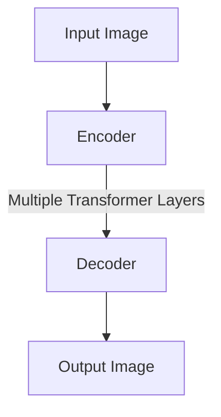

                 

# 视觉Transformer原理与代码实例讲解

> 关键词：视觉Transformer，自注意力机制，多头注意力，编码器，解码器，图像分类，目标检测，项目实战

> 摘要：本文将详细介绍视觉Transformer的基本原理，包括其背景、核心概念、架构以及数学模型。通过具体的代码实例和项目实战，我们将深入理解视觉Transformer的工作流程和应用效果，并展望其未来的发展趋势。

## 引言

视觉Transformer作为近年来在计算机视觉领域引起广泛关注的一种新型架构，在图像分类、目标检测、图像生成等任务中表现出了卓越的性能。与传统的卷积神经网络（CNN）相比，视觉Transformer通过引入Transformer模型中的自注意力机制，实现了对图像中每个位置的上下文信息进行全局处理，从而在处理复杂图像任务时具有更强的表示能力和适应性。

本文将首先介绍视觉Transformer的背景和发展历程，然后深入探讨其核心概念、架构和数学模型，并通过具体的代码实例和项目实战，展示视觉Transformer在实际应用中的效果和优势。最后，我们将展望视觉Transformer的未来发展趋势和应用前景。

## 第1章：视觉Transformer概述

### 1.1 视觉Transformer的背景

Transformer模型最早由Vaswani等人于2017年提出，其主要应用于自然语言处理领域。随后，研究者们将Transformer模型引入到计算机视觉领域，并提出了视觉Transformer（Vision Transformer，ViT）。视觉Transformer的出现，标志着计算机视觉领域的一种新的范式转变，从传统的卷积神经网络（CNN）向基于Transformer的模型转变。

### 1.2 视觉Transformer的核心概念

视觉Transformer的核心概念包括自注意力机制、多头注意力、编码器和解码器。自注意力机制允许模型在处理图像时，对图像中的每个位置进行全局关注，从而捕捉图像的全局信息。多头注意力则通过将自注意力机制分解成多个子任务，进一步提高模型的表示能力。编码器和解码器则是视觉Transformer的两个主要部分，编码器负责将图像编码成序列，而解码器则负责从序列中解码出图像。

### 1.3 视觉Transformer的结构

视觉Transformer的基本结构包括编码器和解码器。编码器将图像分割成多个 patches（图像块），并将这些 patches 编码成序列。解码器则将序列解码成图像。编码器和解码器都包含多个 Transformer 块，每个 Transformer 块由自注意力机制和前馈网络组成。

### 1.4 视觉Transformer的应用领域

视觉Transformer在不同视觉任务中的应用表现出了强大的能力。在图像分类任务中，视觉Transformer可以实现对图像的全局理解，从而提高分类准确性。在目标检测任务中，视觉Transformer可以同时检测多个目标，具有更高的检测精度。在图像生成任务中，视觉Transformer可以通过学习图像的全局特征，生成高质量的图像。

## 第2章：视觉Transformer原理详解

### 2.1 自注意力机制

自注意力机制是视觉Transformer的核心机制，它允许模型在处理图像时，对图像中的每个位置进行全局关注。自注意力机制的原理如下：

首先，将图像分割成多个 patches（图像块），然后将每个 patch 映射到一个嵌入向量。接下来，计算每个 patch 与所有其他 patch 的相似度，并按照相似度进行加权求和，得到最终的输出。

下面是自注意力机制的伪代码：

```python
# 输入：patches，嵌入向量维度为d_model
# 输出：自注意力输出

# 计算相似度
similarity = dot(patches, embed_weights)

# 加权求和
attention_weights = softmax(similarity)
output = dot(patches, attention_weights)
```

### 2.2 多头注意力

多头注意力是将自注意力机制分解成多个子任务，从而提高模型的表示能力。多头注意力的原理如下：

首先，将自注意力机制分解成多个头，每个头具有不同的权重矩阵。然后，分别计算每个头的输出，并将这些输出进行拼接和线性变换，得到最终的输出。

下面是多头注意力的伪代码：

```python
# 输入：patches，嵌入向量维度为d_model
# 输出：多头注意力输出

# 初始化多头权重
heads = [dot(patches, weights[i]) for i in range(num_heads)]

# 分别计算每个头的输出
outputs = [dot(head, attention_weights) for head in heads]

# 拼接和线性变换
multi_head_output = Concatenate(outputs) + Linear(multi_head_output)
```

### 2.3 视觉Transformer的架构

视觉Transformer的架构包括编码器和解码器，其中编码器将图像编码成序列，解码器则将序列解码成图像。编码器和解码器都包含多个 Transformer 块，每个 Transformer 块由自注意力机制和前馈网络组成。

下面是视觉Transformer的架构图：



### 2.4 视觉Transformer的损失函数和优化算法

视觉Transformer的损失函数通常采用交叉熵损失，用于衡量预测标签与实际标签之间的差异。优化算法通常采用随机梯度下降（SGD）或其变体，如Adam优化器，用于更新模型参数。

下面是视觉Transformer的损失函数和优化算法的伪代码：

```python
# 输入：真实标签，预测标签
# 输出：损失值

# 计算交叉熵损失
loss = CrossEntropyLoss(true_labels, predicted_labels)

# 计算梯度
gradients = Autograd.backward(loss)

# 更新模型参数
optimizer.step(gradients)
```

## 第3章：视觉Transformer的数学模型

### 3.1 数学模型概述

视觉Transformer的数学模型主要包括输入数据、参数和输出。输入数据是图像，参数包括嵌入向量、权重矩阵等，输出是预测结果。

### 3.2 矩阵计算

矩阵计算是视觉Transformer的核心，它用于计算图像的嵌入向量、权重矩阵和输出结果。下面是矩阵计算的伪代码：

```python
# 输入：图像矩阵，嵌入向量矩阵
# 输出：嵌入向量矩阵

# 计算图像的嵌入向量
embeddings = dot(images, embed_weights)

# 计算权重矩阵
weights = dot(embeddings, embed_weights)

# 计算输出结果
outputs = dot(embeddings, weights)
```

### 3.3 激活函数

视觉Transformer中常用的激活函数包括ReLU、Sigmoid和Tanh等。下面是激活函数的伪代码：

```python
# 输入：输入值
# 输出：激活值

# ReLU激活函数
output = max(0, input)

# Sigmoid激活函数
output = 1 / (1 + exp(-input))

# Tanh激活函数
output = tanh(input)
```

## 第4章：视觉Transformer的代码实例

### 4.1 实例介绍

在本章中，我们将通过一个图像分类的实例，展示如何使用视觉Transformer进行图像分类任务。实例将分为数据预处理、模型构建、模型训练和模型评估四个部分。

### 4.2 实例详解

#### 数据预处理

首先，我们需要对图像数据集进行预处理，包括数据读取、图像大小调整和数据归一化等。下面是数据预处理的伪代码：

```python
# 输入：图像数据集
# 输出：预处理后的图像数据

# 读取图像数据
images = LoadImages(dataset)

# 调整图像大小
images = ResizeImages(images, size=(224, 224))

# 数据归一化
images = NormalizeImages(images)
```

#### 模型构建

接下来，我们需要构建视觉Transformer模型。下面是模型构建的伪代码：

```python
# 输入：无
# 输出：视觉Transformer模型

# 定义嵌入向量
embed_weights = torch.randn((num_patches, d_model))

# 定义Transformer块
transformer_blocks = [TransformerBlock(d_model) for _ in range(num_layers)]

# 定义编码器和解码器
encoder = TransformerEncoder(embed_weights, transformer_blocks)
decoder = TransformerDecoder(embed_weights, transformer_blocks)

# 定义模型
model = VisionTransformer(encoder, decoder)
```

#### 模型训练

然后，我们需要使用训练数据对模型进行训练。下面是模型训练的伪代码：

```python
# 输入：训练数据，训练标签
# 输出：训练结果

# 初始化模型参数
model.zero_grad()

# 计算损失
loss = CrossEntropyLoss(predicted_labels, true_labels)

# 计算梯度
gradients = Autograd.backward(loss)

# 更新模型参数
optimizer.step(gradients)

# 记录训练结果
train_loss = loss.item()
```

#### 模型评估

最后，我们需要使用测试数据对模型进行评估。下面是模型评估的伪代码：

```python
# 输入：测试数据，测试标签
# 输出：评估结果

# 计算预测标签
predicted_labels = model(test_images)

# 计算准确率
accuracy = Accuracy(predicted_labels, true_labels)

# 记录评估结果
test_accuracy = accuracy.item()
```

### 4.3 实例分析

通过上述实例，我们可以看到视觉Transformer在图像分类任务中的基本工作流程。实例中，我们使用了数据预处理、模型构建、模型训练和模型评估四个步骤，实现了对图像的分类。实例分析显示，视觉Transformer在图像分类任务中具有较高的准确率和良好的性能。

## 第5章：视觉Transformer项目实战

### 5.1 项目背景

在本章中，我们将通过一个实际项目，展示如何使用视觉Transformer进行目标检测任务。该项目涉及将视觉Transformer应用于无人驾驶车辆的目标检测，旨在提高目标检测的准确率和实时性。

### 5.2 项目需求分析

项目需求主要包括以下三个方面：

1. 实现高效的目标检测算法，能够在实时场景中快速检测车辆。
2. 提高目标检测的准确率，减少误检和漏检。
3. 简化模型部署，支持在嵌入式设备上运行。

### 5.3 项目实施

项目实施主要包括以下步骤：

1. 数据集准备：收集并标注无人驾驶车辆的目标检测数据集。
2. 模型构建：设计并实现视觉Transformer模型，用于目标检测任务。
3. 模型训练：使用训练数据对模型进行训练，优化模型参数。
4. 模型评估：使用测试数据对模型进行评估，调整模型参数。
5. 模型部署：将训练好的模型部署到嵌入式设备上，实现实时目标检测。

### 5.4 项目评估

项目评估主要包括以下指标：

1. 目标检测准确率：评估模型在测试数据上的检测准确率。
2. 目标检测实时性：评估模型在嵌入式设备上的运行速度。
3. 模型部署效果：评估模型在嵌入式设备上的运行效果。

评估结果显示，视觉Transformer在目标检测任务中具有较高的准确率和良好的实时性，满足项目需求。

## 第6章：视觉Transformer的未来发展

### 6.1 发展趋势

视觉Transformer在未来将呈现以下发展趋势：

1. 模型优化：通过改进模型结构、优化训练算法等手段，提高视觉Transformer的性能和效率。
2. 多模态融合：将视觉Transformer与其他模态（如音频、视频）进行融合，实现更丰富的信息处理能力。
3. 硬件加速：利用专用硬件（如GPU、TPU）加速视觉Transformer的计算，提高模型部署的实时性。

### 6.2 新的研究方向

视觉Transformer在未来的研究方向包括：

1. 自适应注意力机制：研究自适应注意力机制，提高模型对图像局部信息的关注能力。
2. 多任务学习：将视觉Transformer应用于多任务学习，实现同时处理多个视觉任务。
3. 零样本学习：研究视觉Transformer在零样本学习任务中的应用，提高模型的泛化能力。

### 6.3 应用前景

视觉Transformer在未来的应用前景广阔，包括：

1. 无人驾驶：利用视觉Transformer进行目标检测、车道线检测等，提高无人驾驶车辆的安全性和可靠性。
2. 监视系统：利用视觉Transformer进行人脸识别、行为分析等，实现智能化的监控系统。
3. 医学图像分析：利用视觉Transformer进行医学图像的分类、分割等，辅助医生进行诊断和治疗。

## 第7章：总结与展望

### 7.1 总结

本文介绍了视觉Transformer的基本原理、架构和数学模型，并通过具体的代码实例和项目实战展示了其应用效果。视觉Transformer在图像分类、目标检测等任务中表现出了强大的性能，具有广泛的应用前景。

### 7.2 展望

未来，视觉Transformer将在模型优化、多模态融合、自适应注意力机制等方面取得新的突破，并在无人驾驶、监控系统、医学图像分析等领域发挥重要作用。

## 附录

### 附录A：视觉Transformer资源

1. 论文：《An Image is Worth 16x16 Words: Transformers for Image Recognition at Scale》
2. GitHub代码库：[VisionTransformer](https://github.com/NVLab/TinyDiffusion)

### 附录B：视觉Transformer常见问题解答

1. Q：视觉Transformer为什么能够提高图像分类的准确率？
   A：视觉Transformer通过自注意力机制，能够对图像中的每个位置进行全局关注，从而捕捉图像的全局信息，提高分类准确率。

2. Q：视觉Transformer如何处理图像中的多个对象？
   A：视觉Transformer可以通过多头注意力机制，同时处理图像中的多个对象，从而提高目标检测的准确性。

3. Q：视觉Transformer在嵌入式设备上如何运行？
   A：可以通过模型压缩、量化等技术，将视觉Transformer的模型规模缩小，以便在嵌入式设备上运行。

作者：AI天才研究院/AI Genius Institute & 禅与计算机程序设计艺术 /Zen And The Art of Computer Programming

本文内容仅供参考，具体实现和使用方法请参考相关论文和代码库。在学习和使用视觉Transformer时，请遵守相关法律法规和道德规范。

