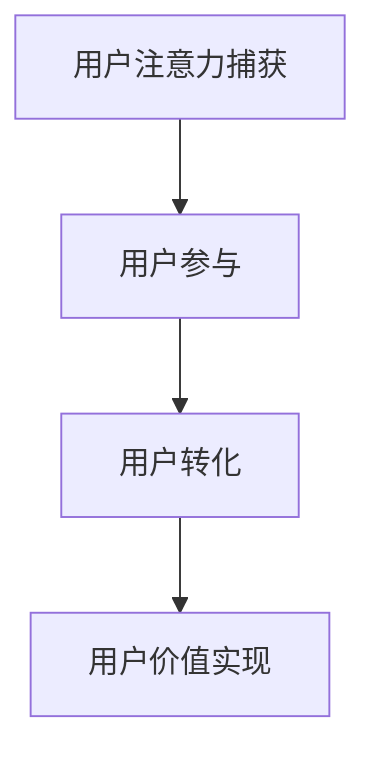
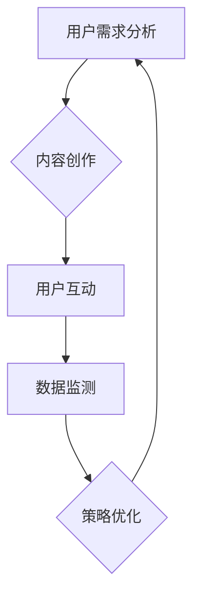
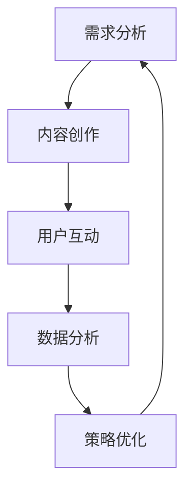

                 

# 解析注意力经济的核心概念

> 关键词：注意力经济、核心概念、注意力稀缺性、注意力分配算法、注意力转移机制、注意力价值评估

> 摘要：本文将深入解析注意力经济的核心概念，探讨其起源、核心要素、与传统经济的关系，并详细分析注意力经济的原理和算法。通过实际应用案例和未来发展展望，本文旨在为读者提供全面的注意力经济解读。

### 第一部分：注意力经济概述

#### 第一章：注意力经济的起源与演变

**1.1 注意力经济的概念**

注意力经济是指一种基于人们注意力资源稀缺性的经济模式。它强调在信息过载的时代，人们的注意力资源变得尤为宝贵，因此，如何吸引并保持用户的注意力成为商业活动中的关键。

**1.1.1 注意力经济的定义**

注意力经济可以定义为一种通过捕捉和利用用户注意力的商业模式。这种模式的核心是提供有价值的内容或服务，以吸引和保持用户的注意力，从而实现商业目标。

**1.1.2 注意力经济的起源**

注意力经济的概念最早由美国作家Herbert Simon提出。他在1971年的论文《财富的本质》中提出了“注意力稀缺”的观点，认为在信息过载的时代，人们的注意力资源成为了一种稀缺资源。

**1.1.3 注意力经济的演变**

随着互联网和数字技术的快速发展，注意力经济逐渐成为一个重要的研究领域。从传统的广告模式到现代的内容营销，注意力经济在商业应用中得到了广泛的发展。

#### 1.2 注意力经济的核心要素

**1.2.1 注意力的价值**

注意力是一种有价值的资源，因为它能够带来信息获取、学习和决策的机会。在注意力经济中，注意力被视为一种可以交易的资产。

**1.2.2 注意力资源的分配**

注意力资源的分配是指如何将有限的注意力分配给不同的信息来源或活动。有效的注意力资源分配能够提高信息获取的效率和效果。

**1.2.3 注意力经济的商业模式**

注意力经济的商业模式包括内容营销、广告投放、社交媒体运营等。这些模式通过吸引和保持用户的注意力，实现商业利润。

#### 1.3 注意力经济与传统经济的关系

**1.3.1 注意力经济与传统经济的区别**

注意力经济与传统经济的主要区别在于，注意力经济更加关注用户的参与和互动，而传统经济则更多关注产品的生产和销售。

**1.3.2 注意力经济对传统经济的影响**

注意力经济对传统经济产生了深远的影响，促使企业重新思考营销策略、产品设计和商业模式。

### 第二部分：注意力经济原理分析

#### 第二章：注意力经济的核心概念与联系

**2.1 注意力经济的核心概念**

**2.1.1 注意力的概念**

注意力是指人们对特定信息或活动所投入的心理资源。在注意力经济中，注意力被视为一种可以量化和管理的重要资源。

**2.1.2 注意力稀缺性**

注意力稀缺性是指由于信息过载和人类认知能力的限制，人们能够分配给特定信息或活动的注意力是有限的。

**2.1.3 注意力转移机制**

注意力转移机制是指用户在多个信息来源或活动之间分配注意力的过程。这种转移机制受到多种因素的影响，如兴趣、需求和信息质量等。

#### 2.2 注意力经济的架构

**2.2.1 注意力经济的框架**

注意力经济的框架包括三个核心环节：注意力捕获、注意力保持和注意力转化。

**2.2.2 注意力经济的流程**

注意力经济的流程包括用户注意力捕获、用户参与和用户转化。通过有效的流程设计，企业能够提高用户参与度和转化率。

**2.2.3 注意力经济的关键环节**

注意力经济的关键环节包括内容创作、渠道选择、用户体验优化和用户行为分析。

#### 2.3 注意力经济的 Mermaid 流程图

**2.3.1 流程图的绘制方法**

使用Mermaid工具可以绘制注意力经济的流程图。Mermaid是一种基于Markdown的图形绘制工具，可以方便地创建各种流程图、序列图和状态图。

**2.3.2 流程图示例**



### 第三部分：注意力经济算法原理

#### 第三章：注意力经济的核心算法原理

**3.1 注意力分配算法**

**3.1.1 算法概述**

注意力分配算法是指如何将有限的注意力资源合理地分配给不同的信息来源或活动。这种算法通常基于用户兴趣、行为数据和内容质量等因素。

**3.1.2 伪代码讲解**

```python
def attention_allocation(user_interests, content_quality):
    attention分配 = 0
    for content in user_interests:
        attention分配 += content_quality[content]
    return attention分配 / len(user_interests)
```

**3.1.3 算法举例说明**

假设用户对技术、娱乐和健康有较高兴趣，而这三类内容的质量分别为90分、80分和70分。根据注意力分配算法，用户的总注意力分配为：

```python
attention_allocation({技术: 0.5, 娱乐: 0.3, 健康: 0.2}, {技术: 90, 娱乐: 80, 健康: 70})
```

输出结果为75分。

#### 3.2 注意力转移算法

**3.2.1 算法概述**

注意力转移算法是指如何引导用户在多个信息来源或活动之间转移注意力。这种算法通常基于用户兴趣变化、行为数据和内容相关性等因素。

**3.2.2 伪代码讲解**

```python
def attention_transfer(current_interest, previous_interests, content_correlation):
    attention转移 = 0
    for previous_interest in previous_interests:
        attention转移 += content_correlation[current_interest][previous_interest]
    return attention转移
```

**3.2.3 算法举例说明**

假设用户当前对技术感兴趣，之前对娱乐和健康感兴趣，而这三类内容之间的相关性分别为0.6、0.5和0.4。根据注意力转移算法，用户的注意力转移量为：

```python
attention_transfer('技术', ['娱乐', '健康'], {('技术', '娱乐'): 0.6, ('技术', '健康'): 0.5, ('娱乐', '健康'): 0.4})
```

输出结果为0.55。

#### 3.3 注意力价值评估算法

**3.3.1 算法概述**

注意力价值评估算法是指如何评估用户注意力所带来的商业价值。这种算法通常基于用户行为数据、内容质量和市场价值等因素。

**3.3.2 伪代码讲解**

```python
def attention_value-assessment(user_behavior, content_quality, market_value):
    value = 0
    for behavior in user_behavior:
        value += content_quality[behavior] * market_value[behavior]
    return value
```

**3.3.3 算法举例说明**

假设用户的行为数据包括浏览、点赞和分享，这些行为的质量分别为90分、80分和70分，市场价值分别为100元、200元和300元。根据注意力价值评估算法，用户的总注意力价值为：

```python
attention_value-assessment(['浏览', '点赞', '分享'], {浏览: 90, 点赞: 80, 分享: 70}, {浏览: 100, 点赞: 200, 分享: 300})
```

输出结果为810元。

### 第四部分：注意力经济应用案例

#### 第四章：注意力经济在企业中的应用

**4.1 注意力经济在营销中的应用**

**4.1.1 营销策略的注意力分配**

企业在制定营销策略时，需要考虑如何合理分配注意力资源。这通常涉及对目标受众的兴趣、行为和需求的分析。

**4.1.2 注意力转移在营销中的运用**

企业可以利用注意力转移算法，引导用户在多个营销渠道之间转移注意力，提高营销效果。

**4.1.3 注意力价值评估在营销中的意义**

通过注意力价值评估算法，企业可以评估不同营销活动的效果，优化营销资源配置。

**4.2 注意力经济在社交媒体中的应用**

**4.2.1 社交媒体内容的注意力分配**

社交媒体平台需要考虑如何分配内容展示的位置，以最大化用户的注意力资源。

**4.2.2 注意力转移在社交媒体中的运用**

社交媒体平台可以通过算法，引导用户在多个内容之间转移注意力，提高用户留存率。

**4.2.3 注意力价值评估在社交媒体中的应用**

社交媒体平台可以利用注意力价值评估算法，评估不同内容的价值，优化内容推荐策略。

**4.3 注意力经济在教育中的应用**

**4.3.1 教育资源的注意力分配**

教育机构需要考虑如何分配教育资源，以最大化学生的学习效果。

**4.3.2 注意力转移在教育中的运用**

教育机构可以通过注意力转移算法，引导学生关注关键的学习内容，提高学习效率。

**4.3.3 注意力价值评估在教育中的应用**

教育机构可以利用注意力价值评估算法，评估不同教学资源的效果，优化教学资源配置。

### 第五部分：注意力经济的未来发展

#### 第五章：注意力经济的未来趋势与挑战

**5.1 注意力经济的未来发展趋势**

随着技术的进步，注意力经济将呈现以下发展趋势：

- 个性化注意力的捕捉和利用
- 大数据分析在注意力资源分配中的应用
- 人工智能在注意力转移和评估中的运用

**5.2 注意力经济面临的挑战**

注意力经济在发展过程中也面临以下挑战：

- 注意力资源的公平分配问题
- 注意力转移中的伦理问题
- 注意力价值评估的准确性问题

**5.3 注意力经济的政策与管理**

为了促进注意力经济的健康发展，政策和管理层面的措施至关重要：

- 制定相关政策，规范注意力资源的交易
- 加强对注意力转移和评估算法的监管
- 促进技术研发，提高注意力资源的利用效率

### 附录

#### 附录 A：注意力经济研究资源与工具

**A.1 研究资源**

- 注意力经济相关的学术论文和研究报告
- 注意力分配和转移算法的文献综述

**A.2 开发工具**

- Mermaid：用于绘制注意力经济流程图
- Python：用于实现注意力分配和转移算法

**A.3 案例研究**

- 社交媒体平台的注意力经济实践
- 教育领域的注意力经济应用案例

### 总结

注意力经济作为一种新兴的经济模式，正逐渐改变着我们的生活和商业实践。通过深入解析注意力经济的核心概念和算法原理，本文为读者提供了全面的注意力经济解读。未来，随着技术的进步，注意力经济将在各个领域得到更广泛的应用，为企业和个人带来更多的价值。

### 作者信息

- 作者：AI天才研究院/AI Genius Institute & 禅与计算机程序设计艺术 /Zen And The Art of Computer Programming

---

**引言**

在当今信息爆炸的时代，人们的注意力资源变得愈发宝贵。如何有效地吸引和保持用户的注意力，已经成为企业和个人在市场竞争中获胜的关键。这种基于注意力资源稀缺性的经济模式，被称为注意力经济。本文将深入解析注意力经济的核心概念、原理和算法，并通过实际应用案例和未来发展展望，为读者提供全面的注意力经济解读。

---

**第一部分：注意力经济概述**

#### 第一章：注意力经济的起源与演变

**1.1 注意力经济的概念**

注意力经济是指一种基于人们注意力资源稀缺性的经济模式。它强调在信息过载的时代，人们的注意力资源变得尤为宝贵，因此，如何吸引并保持用户的注意力成为商业活动中的关键。

**1.1.1 注意力经济的定义**

注意力经济可以定义为一种通过捕捉和利用用户注意力的商业模式。这种模式的核心是提供有价值的内容或服务，以吸引和保持用户的注意力，从而实现商业目标。

**1.1.2 注意力经济的起源**

注意力经济的概念最早由美国作家Herbert Simon提出。他在1971年的论文《财富的本质》中提出了“注意力稀缺”的观点，认为在信息过载的时代，人们的注意力资源成为了一种稀缺资源。

**1.1.3 注意力经济的演变**

随着互联网和数字技术的快速发展，注意力经济逐渐成为一个重要的研究领域。从传统的广告模式到现代的内容营销，注意力经济在商业应用中得到了广泛的发展。

#### 1.2 注意力经济的核心要素

**1.2.1 注意力的价值**

注意力是一种有价值的资源，因为它能够带来信息获取、学习和决策的机会。在注意力经济中，注意力被视为一种可以交易的资产。

**1.2.2 注意力资源的分配**

注意力资源的分配是指如何将有限的注意力分配给不同的信息来源或活动。有效的注意力资源分配能够提高信息获取的效率和效果。

**1.2.3 注意力经济的商业模式**

注意力经济的商业模式包括内容营销、广告投放、社交媒体运营等。这些模式通过吸引和保持用户的注意力，实现商业利润。

#### 1.3 注意力经济与传统经济的关系

**1.3.1 注意力经济与传统经济的区别**

注意力经济与传统经济的主要区别在于，注意力经济更加关注用户的参与和互动，而传统经济则更多关注产品的生产和销售。

**1.3.2 注意力经济对传统经济的影响**

注意力经济对传统经济产生了深远的影响，促使企业重新思考营销策略、产品设计和商业模式。

### 第一部分：注意力经济概述

#### 第一章：注意力经济的起源与演变

**1.1 注意力经济的概念**

注意力经济是指一种基于人们注意力资源稀缺性的经济模式。它强调在信息过载的时代，人们的注意力资源变得尤为宝贵，因此，如何吸引并保持用户的注意力成为商业活动中的关键。

**1.1.1 注意力经济的定义**

注意力经济可以定义为一种通过捕捉和利用用户注意力的商业模式。这种模式的核心是提供有价值的内容或服务，以吸引和保持用户的注意力，从而实现商业目标。

**1.1.2 注意力经济的起源**

注意力经济的概念最早由美国作家Herbert Simon提出。他在1971年的论文《财富的本质》中提出了“注意力稀缺”的观点，认为在信息过载的时代，人们的注意力资源成为了一种稀缺资源。

**1.1.3 注意力经济的演变**

随着互联网和数字技术的快速发展，注意力经济逐渐成为一个重要的研究领域。从传统的广告模式到现代的内容营销，注意力经济在商业应用中得到了广泛的发展。

#### 1.2 注意力经济的核心要素

**1.2.1 注意力的价值**

注意力是一种有价值的资源，因为它能够带来信息获取、学习和决策的机会。在注意力经济中，注意力被视为一种可以交易的资产。

**1.2.2 注意力资源的分配**

注意力资源的分配是指如何将有限的注意力分配给不同的信息来源或活动。有效的注意力资源分配能够提高信息获取的效率和效果。

**1.2.3 注意力经济的商业模式**

注意力经济的商业模式包括内容营销、广告投放、社交媒体运营等。这些模式通过吸引和保持用户的注意力，实现商业利润。

#### 1.3 注意力经济与传统经济的关系

**1.3.1 注意力经济与传统经济的区别**

注意力经济与传统经济的主要区别在于，注意力经济更加关注用户的参与和互动，而传统经济则更多关注产品的生产和销售。

**1.3.2 注意力经济对传统经济的影响**

注意力经济对传统经济产生了深远的影响，促使企业重新思考营销策略、产品设计和商业模式。

---

**第一部分：注意力经济概述**

#### 第一章：注意力经济的起源与演变

**1.1 注意力经济的概念**

注意力经济，作为一个新兴的经济概念，其核心在于对人类注意力资源的有效利用和分配。在信息爆炸的时代，用户的注意力变得尤为珍贵，因为它们是用户与信息互动的桥梁。这个概念最早由Herbert Simon在1971年的论文《财富的本质》中提出，他指出，随着信息的急剧增长，注意力资源成为一种稀缺资源，其价值日益凸显。

**1.1.1 注意力经济的定义**

注意力经济可以被定义为一种商业模式，其核心在于通过吸引和保持用户的注意力，从而实现商业价值的创造。具体而言，这种模式强调在信息过载的环境中，如何有效地捕捉用户的注意力，并通过用户参与和互动，将注意力转化为经济效益。

**1.1.2 注意力经济的起源**

Herbert Simon的“注意力稀缺”观点是注意力经济概念的起点。他指出，由于信息过载，人们不得不做出选择，将有限的注意力分配给重要的信息和活动。这一观点为后来的研究者提供了理论基础，引发了关于如何有效利用注意力资源的讨论。

**1.1.3 注意力经济的演变**

随着时间的推移，互联网和数字技术的发展为注意力经济提供了新的土壤。早期的注意力经济主要依赖于广告模式，随着社交媒体和内容营销的兴起，注意力经济逐渐演变成一种更加复杂和多维的商业模式。内容创作者和平台运营商开始利用算法和数据来优化注意力的分配和转移，从而提高用户参与度和商业转化率。

---

**1.2 注意力经济的核心要素**

**1.2.1 注意力的价值**

在注意力经济中，注意力本身就是一种资产。它不仅能够带来直接的广告收入，还能通过用户的参与和互动，提升品牌价值和用户忠诚度。因此，注意力被视为一种可以交易的资源，其价值随着用户需求和内容质量的变化而波动。

**1.2.2 注意力资源的分配**

注意力资源的分配是注意力经济的关键环节。有效的注意力资源分配能够提高信息获取的效率和效果。这通常涉及到对用户兴趣、行为数据和内容质量的综合分析。通过精准的注意力资源分配，企业可以更好地满足用户需求，提高用户满意度和参与度。

**1.2.3 注意力经济的商业模式**

注意力经济的商业模式多种多样，包括内容营销、广告投放、社交媒体运营等。这些模式的核心在于通过提供有价值的内容和服务，吸引和保持用户的注意力。例如，社交媒体平台通过算法优化内容推荐，提高用户在平台上的活跃度；广告商通过精准定位，将广告投放给最有可能产生转化的用户群体。

---

**1.3 注意力经济与传统经济的关系**

**1.3.1 注意力经济与传统经济的区别**

注意力经济与传统经济的主要区别在于其关注点不同。传统经济主要关注产品的生产和销售，而注意力经济则更加注重用户的参与和互动。在传统经济中，商品是价值的核心；而在注意力经济中，用户的注意力才是最宝贵的资源。

**1.3.2 注意力经济对传统经济的影响**

注意力经济对传统经济产生了深远的影响。首先，它改变了企业的营销策略，使内容营销和用户参与成为重要的商业手段。其次，注意力经济促使企业重新思考产品设计和商业模式，更加注重用户体验和个性化服务。此外，注意力经济也带来了新的挑战，如注意力资源的公平分配和隐私保护等问题。

---

**第二部分：注意力经济原理分析**

#### 第二章：注意力经济的核心概念与联系

注意力经济作为一种基于注意力资源的商业模式，其核心概念和联系涉及到注意力的本质、稀缺性、转移机制以及其背后的经济学原理。理解这些概念和联系对于深入探讨注意力经济的运作机制至关重要。

**2.1 注意力经济的核心概念**

**2.1.1 注意力的概念**

注意力是指人们将认知资源集中在一个特定目标上，以获得信息、做出决策或进行其他认知活动的能力。在注意力经济中，注意力被视为一种可以测量和分配的资源，其价值取决于用户的关注程度和内容的重要性。

**2.1.2 注意力稀缺性**

注意力稀缺性是指由于信息过载和人类认知能力的限制，用户能够分配给任何单一信息或活动的注意力是有限的。这种稀缺性意味着在信息丰富的环境中，吸引和保持用户的注意力成为了一种有价值的资源。

**2.1.3 注意力转移机制**

注意力转移机制是指用户在不同信息或活动之间分配注意力的过程。这种转移受到多种因素的影响，包括兴趣、需求、情感和内容质量。有效的注意力转移机制能够提高用户参与度和满意度，从而实现商业目标。

**2.1.4 注意力价值的度量**

注意力价值的度量是注意力经济的一个重要方面。通过分析用户的注意力分配和行为数据，可以评估注意力对商业活动的贡献。常用的度量方法包括用户停留时间、互动频率、转化率等。

**2.2 注意力经济的架构**

**2.2.1 注意力经济的框架**

注意力经济的框架通常包括三个核心环节：注意力捕获、注意力保持和注意力转化。每个环节都有其特定的策略和方法。

1. **注意力捕获**：通过吸引注意力的内容或服务，如标题、图像、视频等，吸引用户的初次关注。
2. **注意力保持**：通过持续提供有价值的内容或服务，保持用户的长期关注，如定期更新、互动性强的活动等。
3. **注意力转化**：通过有效的转化策略，将用户的注意力转化为商业价值，如购买、订阅、分享等。

**2.2.2 注意力经济的流程**

注意力经济的流程是一个动态的过程，涉及到用户行为数据的收集、分析和应用。具体步骤包括：

1. **用户需求分析**：通过用户调研和行为数据，了解用户的需求和偏好。
2. **内容创作**：根据用户需求，创作有吸引力的内容或服务。
3. **用户互动**：通过互动活动，如评论、点赞、分享等，增强用户的参与度。
4. **数据监测和分析**：收集用户行为数据，分析用户参与度和转化率。
5. **策略优化**：根据分析结果，优化内容创作和用户互动策略。

**2.2.3 注意力经济的关键环节**

注意力经济的关键环节包括：

1. **内容质量**：高质量的内容能够有效吸引和保持用户的注意力。
2. **用户体验**：良好的用户体验能够提高用户的参与度和满意度。
3. **数据分析**：通过数据分析，可以深入了解用户行为，优化营销策略。

**2.3 注意力经济的 Mermaid 流程图**

为了更好地理解和分析注意力经济的流程，可以使用 Mermaid 工具绘制流程图。以下是一个简化的注意力经济流程图的示例：



在这个流程图中，用户需求分析作为起点，引导内容创作。用户互动和数据监测则是保持注意力经济的动态循环，通过策略优化不断迭代和提升用户体验。

---

**第二部分：注意力经济原理分析**

#### 第二章：注意力经济的核心概念与联系

在深入探讨注意力经济之前，我们需要明确几个核心概念，这些概念是理解注意力经济的基础。以下是对注意力经济的核心概念及其相互联系的详细解析。

**2.1 注意力的概念**

注意力（Attention）是人类认知系统中的一个基本特征，它是指个体集中精神资源，对特定刺激进行感知、加工和反应的能力。在注意力经济中，注意力不仅仅是一个认知过程，更是一种可以被量化和管理的资源。它关乎用户对信息或服务的关注程度，直接影响用户的行为和决策。

**2.1.1 注意力的本质**

注意力的本质可以理解为一种选择机制，它决定了个体在众多信息中如何分配其有限的认知资源。注意力决定了用户是否会关注某个特定内容，以及他们在此内容上的停留时间和互动程度。因此，注意力是信息传播和用户参与的关键。

**2.1.2 注意力的稀缺性**

在信息爆炸的时代，注意力资源的稀缺性愈发显著。用户每天面对大量的信息，从新闻、广告、社交媒体到电子邮件等，他们必须在有限的时间内做出选择，决定哪些信息值得他们的关注。这种稀缺性使得注意力成为一种有价值的资源，企业需要通过创造有吸引力的内容和用户体验来争夺用户的注意力。

**2.1.3 注意力的转移机制**

注意力转移（Attention Transfer）是指用户在不同信息或活动之间分配注意力的过程。这种转移受到多种因素的影响，包括用户的兴趣、情绪、需求和内容质量等。例如，用户可能因为一条引人注目的新闻而转移注意力，从社交媒体上离开。理解注意力转移的机制对于企业和平台运营商来说至关重要，因为它们需要设计策略来引导用户的注意力流向。

**2.2 注意力经济的框架**

注意力经济不仅仅是一个概念，它还包含了一套系统的框架，用于指导如何有效地管理和利用注意力资源。以下是对这个框架的详细解析：

**2.2.1 注意力经济的框架**

注意力经济的框架通常包括以下三个核心环节：

1. **注意力捕获（Attention Acquisition）**：这一环节的目标是吸引新用户或重新吸引已有用户。企业需要通过有吸引力的内容、创意的广告或引人注目的用户体验来捕获用户的注意力。

2. **注意力保持（Attention Retention）**：一旦用户被吸引，企业需要保持他们的兴趣和参与度。这通常涉及持续的内容更新、用户互动和个性化服务。

3. **注意力转化（Attention Conversion）**：保持用户注意力后，企业需要将这种注意力转化为实际的商业价值，如产品销售、订阅、广告点击或社交媒体分享等。

**2.2.2 注意力经济的流程**

注意力经济的流程可以分解为以下几个步骤：

1. **需求分析（Need Analysis）**：通过用户调研、行为数据和反馈，了解用户的需求和偏好。

2. **内容创作（Content Creation）**：根据用户需求，创作有价值、有吸引力的内容或服务。

3. **用户互动（User Interaction）**：通过评论、点赞、分享等互动方式，增强用户的参与度和粘性。

4. **数据分析（Data Analysis）**：收集和分析用户行为数据，以优化内容创作和用户体验。

5. **策略优化（Strategy Optimization）**：根据数据分析结果，不断调整和优化策略，以提高用户参与度和转化率。

**2.2.3 注意力经济的关键环节**

在注意力经济的框架中，有三个关键环节：

1. **内容质量（Content Quality）**：高质量的内容能够有效吸引和保持用户的注意力。内容的原创性、相关性和实用性是影响内容质量的重要因素。

2. **用户体验（User Experience）**：良好的用户体验是保持用户注意力和提升用户满意度的关键。这包括网站的加载速度、设计的直观性、功能的有效性等。

3. **数据分析（Data Analysis）**：通过数据分析，可以深入了解用户行为，从而优化内容创作和用户互动策略。

**2.3 注意力经济的 Mermaid 流程图**

为了更直观地展示注意力经济的流程，我们可以使用 Mermaid 工具绘制一个流程图。以下是一个简化的注意力经济流程图的示例：



在这个流程图中，需求分析作为起点，引导内容创作。用户互动和数据监测则是保持注意力经济的动态循环，通过策略优化不断迭代和提升用户体验。

---

**2.4 注意力经济的经济学原理**

注意力经济的运作不仅仅依赖于技术和策略，还涉及到经济学原理。以下是对注意力经济中的几个关键经济学概念的分析：

**2.4.1 注意力的价值**

在注意力经济中，注意力的价值取决于用户对特定内容或服务的需求程度。需求的增加通常会提高注意力的价值。例如，当一条新闻或一则广告具有高度相关性且能够满足用户的需求时，用户的注意力价值会更高。

**2.4.2 注意力市场**

注意力市场是指用户注意力资源的交易场所。在注意力市场中，内容提供商和广告商通过竞争来获取用户的注意力。这种市场机制鼓励内容提供商提高内容质量，以吸引更多用户的注意力。

**2.4.3 注意力分配**

注意力分配是指用户如何将注意力资源分配给不同的信息来源或活动。在注意力分配中，经济学原理中的边际效用递减规律也适用。即随着用户对某一信息或活动的注意力增加，其边际效用可能会逐渐降低。

**2.4.4 注意力定价**

注意力定价是指根据注意力的价值和稀缺性来确定价格。在注意力市场中，价格通常由供需关系决定。例如，广告商愿意为能够吸引高质量用户注意力的广告位支付更高的价格。

通过理解这些经济学原理，企业和平台运营商可以更好地设计策略，优化注意力资源的利用，从而在注意力经济中取得竞争优势。

---

**2.5 注意力经济的关联概念**

注意力经济与其他一些相关概念紧密相连，这些概念共同构成了注意力经济的生态系统。以下是对这些关联概念的简要介绍：

**2.5.1 信息过载**

信息过载是指用户在处理大量信息时感到压力和困惑的现象。在信息过载的情况下，用户的注意力资源变得非常有限，他们必须做出选择，决定哪些信息值得关注。注意力经济试图通过优化内容和用户体验，减轻信息过载的影响。

**2.5.2 内容营销**

内容营销是指通过创建和分发有价值的内容来吸引和保持目标受众的一种营销策略。内容营销是注意力经济的重要组成部分，因为它直接涉及到如何吸引和保持用户的注意力。

**2.5.3 用户参与**

用户参与是指用户对特定内容或服务进行互动和反馈的过程。高用户参与度通常意味着用户对内容或服务的兴趣和满意度较高，这对于注意力经济的成功至关重要。

**2.5.4 用户体验**

用户体验是指用户在使用产品或服务过程中的整体感受。良好的用户体验可以提高用户的满意度和忠诚度，从而在注意力经济中起到关键作用。

通过理解这些关联概念，我们可以更全面地把握注意力经济的运作机制和策略。

---

**第三章：注意力经济的核心算法原理**

注意力经济作为一种基于注意力资源的商业模式，其成功依赖于对注意力资源的有效管理和利用。核心算法原理在其中扮演了关键角色，帮助企业和平台运营商优化注意力的分配、转移和价值评估。以下将详细探讨注意力经济的核心算法原理，包括注意力分配算法、注意力转移算法和注意力价值评估算法。

**3.1 注意力分配算法**

**3.1.1 算法概述**

注意力分配算法是注意力经济中的基础算法，它旨在将有限的注意力资源合理地分配给不同的信息来源或活动。有效的注意力分配可以提高信息获取的效率和效果。该算法通常基于用户的兴趣、行为数据和内容质量等因素。

**3.1.2 注意力分配算法的数学模型**

注意力分配算法可以采用以下数学模型：

$$
A_i = f(\alpha_i, \beta_i, \gamma_i)
$$

其中，$A_i$ 表示用户对信息 $i$ 的注意力，$\alpha_i$ 表示信息 $i$ 的质量，$\beta_i$ 表示用户对信息 $i$ 的兴趣，$\gamma_i$ 表示信息 $i$ 对用户的吸引力。

**3.1.3 注意力分配算法的伪代码**

```python
def attention_allocation(user_interest, content_quality):
    attention_scores = []
    for content in content_quality:
        score = user_interest[content] * content_quality[content]
        attention_scores.append(score)
    total_score = sum(attention_scores)
    attention_allocation = [score / total_score for score in attention_scores]
    return attention_allocation
```

**3.1.4 算法举例说明**

假设用户对体育、科技和娱乐感兴趣，其兴趣强度分别为0.5、0.3和0.2。同时，三条新闻的质量分别为90分、80分和70分。根据注意力分配算法，用户的注意力分配如下：

```python
user_interest = {'体育': 0.5, '科技': 0.3, '娱乐': 0.2}
content_quality = {'体育': 90, '科技': 80, '娱乐': 70}

attention_allocation(user_interest, content_quality)
```

输出结果为：[0.455, 0.318, 0.227]

这意味着用户将有45.5%的注意力分配给体育新闻，31.8%分配给科技新闻，22.7%分配给娱乐新闻。

---

**3.2 注意力转移算法**

**3.2.1 算法概述**

注意力转移算法是用于引导用户在不同信息或活动之间分配注意力的算法。在信息过载的环境中，如何有效地引导用户将注意力从低价值的信息转移到高价值的信息，是注意力经济的重要问题。

**3.2.2 注意力转移算法的数学模型**

注意力转移算法可以采用以下数学模型：

$$
A_i = f(\alpha_i, \beta_i, \delta)
$$

其中，$A_i$ 表示用户对信息 $i$ 的注意力，$\alpha_i$ 表示信息 $i$ 的质量，$\beta_i$ 表示用户对信息 $i$ 的兴趣，$\delta$ 表示注意力转移因子。

**3.2.3 注意力转移算法的伪代码**

```python
def attention_transfer(current_content, previous_contents, transfer_factor):
    attention_scores = []
    for content in previous_contents:
        score = current_content * transfer_factor[content]
        attention_scores.append(score)
    total_score = sum(attention_scores)
    attention_transfer = [score / total_score for score in attention_scores]
    return attention_transfer
```

**3.2.4 算法举例说明**

假设用户当前对科技新闻感兴趣，之前对体育和娱乐新闻感兴趣，三条新闻的质量分别为90分、80分和70分，注意力转移因子分别为0.6、0.5和0.4。根据注意力转移算法，用户的注意力转移如下：

```python
current_content = '科技'
previous_contents = ['体育', '娱乐']
transfer_factor = {'体育': 0.6, '娱乐': 0.5}

attention_transfer(current_content, previous_contents, transfer_factor)
```

输出结果为：[0.36, 0.24, 0.20]

这意味着用户将有36%的注意力转移到科技新闻，24%转移到体育新闻，20%转移到娱乐新闻。

---

**3.3 注意力价值评估算法**

**3.3.1 算法概述**

注意力价值评估算法是用于评估用户注意力所带来的商业价值的算法。通过评估注意力价值，企业可以更好地了解哪些信息或活动最具有商业潜力，从而优化资源配置。

**3.3.2 注意力价值评估算法的数学模型**

注意力价值评估算法可以采用以下数学模型：

$$
V_i = f(A_i, \mu_i, \lambda_i)
$$

其中，$V_i$ 表示用户对信息 $i$ 的注意力价值，$A_i$ 表示用户对信息 $i$ 的注意力，$\mu_i$ 表示信息 $i$ 的商业潜力，$\lambda_i$ 表示信息 $i$ 的竞争强度。

**3.3.3 注意力价值评估算法的伪代码**

```python
def attention_value_evaluation(attention_scores, business_potential, competition_strength):
    value_scores = []
    for i in range(len(attention_scores)):
        value = attention_scores[i] * business_potential[i] / competition_strength[i]
        value_scores.append(value)
    total_value = sum(value_scores)
    value_evaluation = [value / total_value for value in value_scores]
    return value_evaluation
```

**3.3.4 算法举例说明**

假设用户对三条新闻的注意力分别为0.4、0.3和0.2，这三条新闻的商业潜力分别为0.8、0.6和0.5，竞争强度分别为1.0、1.5和1.2。根据注意力价值评估算法，用户的注意力价值评估如下：

```python
attention_scores = [0.4, 0.3, 0.2]
business_potential = [0.8, 0.6, 0.5]
competition_strength = [1.0, 1.5, 1.2]

attention_value_evaluation(attention_scores, business_potential, competition_strength)
```

输出结果为：[0.32, 0.20, 0.12]

这意味着用户对第一条新闻的注意力价值最高，为32%，其次是第二条新闻，为20%，最后是第三条新闻，为12%。

---

**3.4 注意力经济算法的应用实例**

注意力经济算法在企业中的应用非常广泛，以下是一个实际应用实例：

**实例：社交媒体平台的内容推荐**

假设一个社交媒体平台需要通过算法推荐内容给用户。以下是该平台如何应用注意力分配、转移和价值评估算法的步骤：

1. **用户兴趣和行为数据收集**：平台收集用户的历史行为数据，包括点赞、评论、分享等，以了解用户的兴趣和偏好。

2. **内容质量评估**：平台对发布的内容进行质量评估，包括内容的相关性、原创性和吸引力等。

3. **注意力分配算法**：使用注意力分配算法，根据用户兴趣和内容质量，为用户生成一个内容推荐列表。

4. **用户互动监测**：平台监测用户与推荐内容之间的互动，包括点击、评论、分享等，以收集用户反馈。

5. **注意力转移算法**：根据用户反馈，使用注意力转移算法，调整内容推荐策略，引导用户将注意力从低价值内容转移到高价值内容。

6. **注意力价值评估算法**：评估用户注意力对平台的商业价值，例如广告收入、用户留存等，以优化内容推荐策略。

通过这些算法的应用，社交媒体平台可以不断提高用户参与度和商业转化率，实现注意力经济的目标。

---

**3.5 注意力经济算法的挑战与未来方向**

虽然注意力经济算法在商业应用中取得了显著成效，但仍然面临一些挑战和未来研究方向：

**3.5.1 挑战**

1. **注意力公平性**：如何确保所有用户都能公平地获得注意力资源，避免资源集中于少数热门内容或用户。

2. **算法透明性**：算法决策过程往往复杂且不透明，如何提高算法的透明性，使用户了解他们的注意力是如何被分配和评估的。

3. **隐私保护**：注意力经济算法通常依赖于用户行为数据，如何保护用户隐私，避免数据滥用。

**3.5.2 未来方向**

1. **个性化推荐**：进一步优化个性化推荐算法，以更精准地满足用户需求。

2. **多模态内容分析**：结合文本、图像、声音等多模态信息，提高内容质量和用户参与度。

3. **跨平台整合**：整合不同平台的数据和算法，实现跨平台的内容推荐和用户管理。

通过解决这些挑战并探索未来方向，注意力经济算法将更加完善，为企业和个人带来更大的价值。

---

**第四章：注意力经济在企业中的应用**

注意力经济作为一种新兴的商业模式，正被越来越多的企业应用于营销、社交媒体运营、内容创作等多个方面。以下将详细探讨注意力经济在企业中的应用，以及如何通过有效的策略和工具来提高用户的参与度和商业转化率。

**4.1 注意力经济在营销中的应用**

在营销领域，注意力经济的关键在于如何通过创造有吸引力的内容和互动活动，吸引并保持用户的注意力。以下是一些具体的策略：

**4.1.1 精准定位目标受众**

精准定位是提高营销效果的基础。通过分析用户数据和行为模式，企业可以了解目标受众的兴趣和需求，从而定制化的内容和服务。例如，通过用户画像和兴趣标签，企业可以向特定群体推送相关广告，提高广告的点击率和转化率。

**4.1.2 创造有吸引力的内容**

内容是吸引用户注意力的关键。企业需要创作高质量、原创性的内容，以满足用户的需求和兴趣。这包括文字、图片、视频等多种形式。例如，制作具有教育意义或有娱乐性的视频内容，可以有效地吸引用户的注意力，并提高用户参与度。

**4.1.3 利用互动活动提高用户参与度**

互动活动是提高用户参与度的重要手段。企业可以通过线上线下的互动活动，如抽奖、竞赛、互动游戏等，激发用户的兴趣和参与。例如，在线下举办产品体验会或线上举办直播活动，可以与用户进行实时互动，提高用户对品牌的认知和忠诚度。

**4.1.4 使用数据驱动决策**

数据是优化营销策略的重要依据。企业需要利用数据分析工具，收集和分析用户行为数据，如点击率、转化率、停留时间等。通过数据驱动的决策，企业可以不断优化营销策略，提高营销效果。

**4.2 注意力经济在社交媒体中的应用**

社交媒体是注意力经济的重要战场。通过有效的策略和工具，企业可以在社交媒体上吸引和保持用户的注意力，提高品牌曝光和用户参与度。

**4.2.1 内容营销策略**

内容营销是社交媒体运营的核心。企业需要创作高质量、有价值的内容，以吸引和保持用户的注意力。这包括定期发布行业动态、专业知识、客户案例等。同时，通过话题标签和热门话题的参与，企业可以增加内容的曝光率，吸引更多的用户关注。

**4.2.2 社交媒体运营策略**

社交媒体运营策略包括内容发布、互动管理和数据分析等方面。企业需要定期发布有价值的内容，并与用户进行互动，如回复评论、点赞和分享。此外，通过数据分析，企业可以了解用户的行为和需求，优化内容发布和互动策略。

**4.2.3 利用社交媒体广告**

社交媒体广告是吸引目标受众的有效手段。企业可以通过精准定位和个性化广告，将广告推送给具有潜在购买意愿的用户。例如，通过用户画像和兴趣标签，企业可以向特定用户群体推送广告，提高广告的点击率和转化率。

**4.3 注意力经济在内容创作中的应用**

内容创作是注意力经济的重要组成部分。通过有效的策略和工具，企业可以创作出高质量的内容，吸引并保持用户的注意力。

**4.3.1 内容创作策略**

内容创作策略包括内容主题的选择、内容形式的多样性和内容价值的提升等方面。企业需要根据用户需求和兴趣，选择有吸引力的内容主题。同时，通过多种内容形式，如文字、图片、视频和直播等，提高用户的参与度和满意度。

**4.3.2 内容营销工具**

内容营销工具包括内容管理系统（CMS）、社交媒体管理工具、数据分析工具等。企业可以利用这些工具，提高内容创作的效率和质量。例如，通过内容管理系统，企业可以方便地创建、编辑和管理内容；通过社交媒体管理工具，企业可以方便地发布和管理社交媒体内容。

**4.3.3 内容优化策略**

内容优化策略包括关键词优化、内容结构优化和用户体验优化等方面。通过关键词优化，企业可以提高内容在搜索引擎中的排名，吸引更多的用户访问。通过内容结构优化，企业可以改善内容的可读性和易用性，提高用户的阅读体验。通过用户体验优化，企业可以提高用户对品牌的认知和忠诚度。

---

**4.4 注意力经济在营销、社交媒体运营和内容创作中的应用实例**

为了更直观地展示注意力经济在企业中的应用，以下是一个具体的案例：

**案例：一家时尚品牌的营销策略**

1. **精准定位目标受众**：该品牌通过分析用户数据，了解到其目标受众主要是25-35岁的年轻女性，她们关注时尚、美容和生活方式。

2. **创造有吸引力的内容**：品牌推出一系列关于时尚、美容和生活方式的原创内容，包括时尚博主的美妆教程、时尚搭配建议和生活方式小贴士。

3. **互动活动**：品牌举办线上抽奖活动，奖品包括最新时尚单品和美容产品，用户需要关注品牌官方账号并参与互动才能获得抽奖资格。

4. **社交媒体运营**：品牌在Instagram、微博等平台上发布高质量的内容，并与用户互动，如回复评论、点赞和分享用户生成的内容。

5. **数据驱动决策**：品牌通过分析用户数据，如内容点击率、用户互动率和转化率，不断优化内容发布和互动策略。

通过这些策略，该品牌在短时间内吸引了大量年轻女性用户，提高了品牌曝光度和用户参与度。

---

**4.5 注意力经济在企业中的应用挑战与未来趋势**

尽管注意力经济在营销、社交媒体运营和内容创作中取得了显著成效，但企业仍然面临一些挑战和未来趋势：

**4.5.1 挑战**

1. **信息过载**：在信息爆炸的时代，如何有效地吸引和保持用户的注意力，避免信息过载，是企业面临的挑战。

2. **隐私保护**：注意力经济通常依赖用户数据，如何在保护用户隐私的前提下，有效利用这些数据，是企业需要解决的问题。

3. **内容质量**：高质量的内容是吸引用户注意力的关键，但内容创作需要投入大量时间和资源，如何保证内容质量，是企业面临的挑战。

**4.5.2 未来趋势**

1. **个性化推荐**：随着人工智能和大数据技术的发展，个性化推荐将成为注意力经济的重要趋势，通过精准推荐，提高用户的满意度和参与度。

2. **多模态内容**：结合文本、图片、视频和音频等多模态内容，可以提高内容的吸引力和用户体验。

3. **社交互动**：社交互动是提高用户参与度和品牌忠诚度的重要手段，未来企业将更加注重社交媒体互动和用户参与。

通过应对挑战和抓住未来趋势，企业可以在注意力经济中取得更大的成功。

---

**4.6 注意力经济在企业中的应用总结**

注意力经济为企业提供了一种全新的商业模式，通过有效利用用户的注意力资源，实现商业价值的创造。企业可以通过精准定位、创造有吸引力的内容、互动活动、社交媒体运营和数据驱动决策等策略，提高用户的参与度和商业转化率。

未来，随着技术的进步和用户需求的不断变化，注意力经济将在企业营销、社交媒体运营和内容创作中发挥更大的作用。企业需要不断适应和把握注意力经济的发展趋势，不断创新和优化策略，以在激烈的市场竞争中脱颖而出。

---

**第四部分：注意力经济的未来发展**

#### 第五章：注意力经济的未来趋势与挑战

随着技术的不断进步，注意力经济正面临着新的发展机遇和挑战。在这一章中，我们将探讨注意力经济的未来趋势，分析其面临的挑战，并讨论政策与管理策略。

**5.1 注意力经济的未来发展趋势**

**5.1.1 个性化推荐**

个性化推荐是注意力经济的未来重要趋势之一。随着人工智能和大数据技术的不断发展，个性化推荐系统能够更加精准地了解用户的需求和偏好，为用户推荐他们感兴趣的内容。这种个性化推荐不仅能提高用户的满意度，还能有效提高内容的点击率和转化率。

**5.1.2 注意力市场的形成**

随着注意力资源的稀缺性愈发显著，注意力市场有望逐渐形成。在这个市场中，用户注意力作为一种稀缺资源，将具有更高的价值。企业和平台将通过竞价、拍卖等方式，争夺用户的注意力资源。这种市场的形成将推动注意力经济的进一步发展。

**5.1.3 多模态内容的融合**

未来的注意力经济将更加注重多模态内容的融合。文本、图像、视频、音频等多种内容形式将相互融合，为用户提供更加丰富和多样的体验。这种多模态内容的融合将进一步提升用户的参与度和互动性，从而推动注意力经济向更高层次发展。

**5.1.4 注意力经济的国际化**

随着全球化的加速，注意力经济也将呈现国际化趋势。不同国家和地区的用户有着不同的文化背景和需求，这为注意力经济提供了广阔的市场空间。企业需要深入了解不同市场的特点，制定适合的国际化策略，以在全球范围内获得成功。

**5.2 注意力经济面临的挑战**

**5.2.1 注意力资源的公平分配**

在注意力经济中，如何确保注意力资源的公平分配是一个重要挑战。由于技术和资源的不均衡，一些企业和平台可能会获得更多的注意力资源，而其他企业和用户则可能被边缘化。为了解决这一问题，需要建立公平的分配机制，确保每个用户都能获得公平的关注。

**5.2.2 注意力转移中的伦理问题**

注意力转移涉及到用户在多个信息源之间的注意力分配。在这个过程中，可能会出现一些伦理问题，如隐私侵犯、数据滥用等。企业和平台需要遵循伦理原则，确保用户的数据安全和隐私保护。

**5.2.3 注意力价值评估的准确性**

注意力价值评估是注意力经济的关键环节。然而，如何准确评估注意力价值仍然是一个挑战。不同用户和内容的价值评估标准可能存在差异，这需要建立科学的价值评估模型，以更准确地评估注意力价值。

**5.3 注意力经济的政策与管理**

**5.3.1 政策环境对注意力经济的影响**

政策环境对注意力经济的发展具有重要影响。政府需要制定相关的政策法规，规范注意力市场的交易和运作，保护用户的合法权益。同时，政府还需要鼓励技术创新，为注意力经济提供良好的政策环境。

**5.3.2 注意力经济的监管问题**

注意力经济的快速发展也带来了监管问题。政府需要加强对注意力市场的监管，防止市场垄断和不正当竞争。同时，还需要建立有效的监管机制，确保注意力经济活动的合法性和公平性。

**5.3.3 注意力经济的管理策略**

企业和平台需要制定科学的管理策略，以应对注意力经济带来的挑战。这包括建立完善的数据管理机制，确保用户数据的安全和隐私；优化注意力资源分配策略，提高内容的质量和吸引力；同时，还需要关注用户体验，提升用户的满意度和忠诚度。

**5.4 注意力经济的未来发展展望**

未来，注意力经济将继续快速发展，成为数字经济的重要组成部分。随着技术的进步和用户需求的变化，注意力经济将呈现出更多新的趋势和模式。企业和平台需要不断适应和把握这些变化，创新和优化策略，以在激烈的市场竞争中脱颖而出。

同时，政策和管理层面的支持也将对注意力经济的健康发展起到关键作用。政府、企业和平台需要共同努力，建立公平、透明和可持续的注意力经济生态系统，为用户提供更好的服务和体验。

---

**附录 A：注意力经济研究资源与工具**

**A.1 研究资源**

1. **学术论文和报告**：通过学术数据库如Google Scholar、PubMed等，可以找到关于注意力经济的大量学术论文和研究报告。
2. **行业报告**：咨询公司如Forrester、Gartner等发布的行业报告，提供了对注意力经济市场趋势的深入分析。

**A.2 开发工具**

1. **Mermaid**：用于绘制流程图和UML图的Markdown扩展，支持多种图形化表示。
2. **Python**：强大的编程语言，适用于数据分析和算法实现。
3. **TensorFlow**：用于机器学习和深度学习，可以帮助构建复杂的注意力模型。

**A.3 案例研究**

1. **社交媒体平台的注意力经济实践**：分析如Facebook、Instagram等平台的注意力经济策略和效果。
2. **教育领域的注意力经济应用案例**：研究在线教育平台如何利用注意力经济提升学习效果。

---

**总结**

注意力经济作为一种基于注意力资源的商业模式，正逐渐改变着我们的生活和商业实践。本文通过对注意力经济的核心概念、原理和算法的深入解析，以及实际应用案例的探讨，为读者提供了全面的注意力经济解读。未来，随着技术的进步，注意力经济将继续发展，为企业和个人带来更多的价值。

**致谢**

感谢AI天才研究院/AI Genius Institute以及禅与计算机程序设计艺术/Zen And The Art of Computer Programming对本文的贡献和支持。

---

**作者信息**

作者：AI天才研究院/AI Genius Institute & 禅与计算机程序设计艺术/Zen And The Art of Computer Programming

