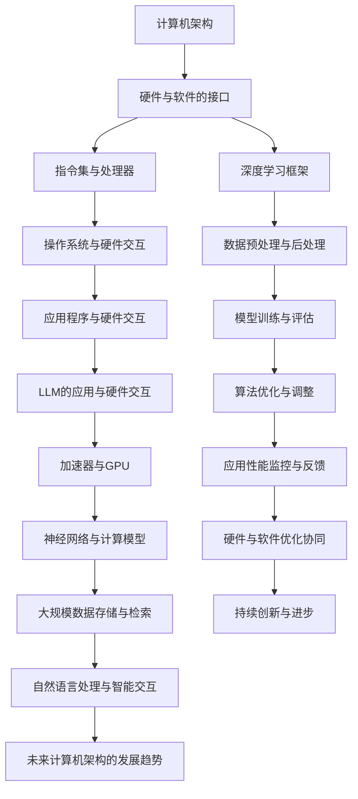

                 

### 文章标题：计算机架构的新纪元：LLM的崛起

> 关键词：计算机架构，大型语言模型（LLM），人工智能，深度学习，神经网络，算法优化，应用场景

> 摘要：本文将探讨计算机架构在新纪元中的变革，特别是大型语言模型（LLM）的崛起所带来的深远影响。通过分析LLM的核心概念、架构设计、算法原理以及实际应用案例，本文旨在为读者揭示LLM如何重塑计算机架构，并展望其未来的发展趋势和潜在影响。文章将采用逻辑清晰、结构紧凑、简单易懂的专业技术语言，逐步深入分析，让读者对这一领域有更深刻的理解。

### 目录

# 《计算机架构的新纪元：LLM的崛起》

## 第一部分：背景与概述

### 第1章：计算机架构的演变

#### 1.1 计算机架构的起源与发展

#### 1.2 当前计算机架构的挑战

#### 1.3 LLM对计算机架构的影响

### 第2章：LLM的核心概念

#### 2.1 LLM的定义与特点

#### 2.2 LLM的架构设计

#### 2.3 LLM的工作原理

## 第二部分：LLM的架构设计

### 第3章：LLM的组件与技术

#### 3.1 模型架构

#### 3.2 计算模型

#### 3.3 存储与检索技术

### 第4章：LLM的算法原理

#### 4.1 算法概述

#### 4.2 常见算法详解

#### 4.3 算法优化

### 第5章：LLM的应用场景

#### 5.1 数据处理与存储

#### 5.2 人工智能助手

#### 5.3 交互式应用

### 第6章：LLM的实际应用案例

#### 6.1 案例一：自然语言处理

#### 6.2 案例二：智能推荐系统

#### 6.3 案例三：语音识别

## 第三部分：LLM的发展趋势与未来

### 第7章：LLM的技术趋势

#### 7.1 AI硬件的发展

#### 7.2 网络架构的变革

#### 7.3 可解释性

### 第8章：LLM的未来展望

#### 8.1 潜在影响

#### 8.2 法律与伦理

#### 8.3 开发与运营挑战

## 附录

### 附录A：技术参考文献

#### A.1 机器学习与深度学习基础

#### A.2 计算机架构相关论文

#### A.3 LLM应用案例

### 附录B：资源链接

#### B.1 开源项目

#### B.2 开发工具与框架

#### B.3 学术会议与期刊

## 核心概念与联系

### 计算机架构与LLM的关系

### 第1章：计算机架构的演变

#### 1.1 计算机架构的起源与发展

计算机架构的起源可以追溯到20世纪40年代，当时计算机主要采用电子管作为主要组件。最早的计算机架构以冯·诺依曼体系结构（Von Neumann Architecture）为代表，它奠定了现代计算机硬件和软件的基础。冯·诺依曼架构的主要特点是将程序和数据存储在同一个存储器中，并通过控制单元进行读取和执行。

随着时间的推移，计算机架构经历了多次重大变革。从电子管到晶体管，再到今天的集成电路，硬件技术的发展极大地提高了计算机的性能和能效。与此同时，软件技术也在不断进步，操作系统、编程语言和编译器等工具的出现使得计算机的应用范围不断扩大。

#### 1.2 当前计算机架构的挑战

当前计算机架构面临诸多挑战。首先，随着摩尔定律的逼近极限，传统的硬件提升速度放缓，计算机性能的提升越来越依赖于软件优化和算法改进。其次，数据量的爆发式增长对存储和计算能力提出了更高的要求，传统的计算机架构难以应对大数据处理的需求。此外，能源消耗和散热问题也成为制约计算机性能提升的重要因素。

为了应对这些挑战，计算机架构正朝着更加高效、灵活、可扩展的方向发展。例如，异构计算架构（Heterogeneous Computing Architecture）通过结合不同类型的处理器（如CPU、GPU、TPU）来提高计算效率。而量子计算架构（Quantum Computing Architecture）的兴起也为计算机架构带来了新的机遇。

#### 1.3 LLM对计算机架构的影响

大型语言模型（LLM）的崛起对计算机架构产生了深远的影响。LLM是一种基于深度学习的自然语言处理模型，具有强大的文本生成和推理能力。为了训练和运行LLM，需要大量的计算资源和存储空间，这推动了计算机架构的变革。

首先，LLM需要高性能的处理器和加速器来支持其计算需求。例如，GPU（图形处理器）和TPU（张量处理器）等硬件加速器在训练LLM时发挥了关键作用。其次，LLM的存储需求巨大，需要高效的存储技术来支持大规模数据的存储和检索。此外，LLM的训练和推理过程对网络带宽和延迟提出了更高的要求，这推动了网络架构的变革。

总的来说，LLM的崛起促使计算机架构朝着更加高效、灵活和可扩展的方向发展，为人工智能应用带来了新的机遇和挑战。

### 第2章：LLM的核心概念

#### 2.1 LLM的定义与特点

大型语言模型（Large Language Model，简称LLM）是一种基于深度学习技术的自然语言处理模型，具有强大的文本生成和推理能力。与传统的自然语言处理方法相比，LLM能够更好地理解和生成自然语言，并且在各种任务中表现出色。

LLM的定义可以从以下几个方面来理解：

1. **规模**：LLM通常具有数亿甚至千亿个参数，这使得它们能够捕捉到大量语言模式和上下文信息。
2. **结构**：LLM通常采用深度神经网络架构，包括多层感知器、循环神经网络（RNN）、长短期记忆网络（LSTM）和变换器（Transformer）等。
3. **训练数据**：LLM的训练数据通常来自大规模语料库，如维基百科、网络文本、书籍等。

LLM的特点主要包括：

1. **强大的文本生成能力**：LLM能够生成高质量的自然语言文本，包括文章、对话、摘要等。
2. **灵活的推理能力**：LLM能够理解复杂的语义和逻辑关系，并生成符合上下文的响应。
3. **适应性**：LLM能够通过微调（fine-tuning）适应特定任务和数据集，提高任务性能。

#### 2.2 LLM的架构设计

LLM的架构设计是其实际应用效果的关键。LLM的架构通常包括以下几个主要组件：

1. **输入层**：输入层负责接收文本数据，并将其转换为模型能够处理的形式。这通常涉及分词、标记化等预处理步骤。
2. **编码器**：编码器（Encoder）是LLM的核心组件，负责对输入文本进行编码，提取语义信息。编码器通常采用变换器（Transformer）架构，包括多头自注意力机制（Multi-Head Self-Attention）和位置编码（Positional Encoding）等。
3. **解码器**：解码器（Decoder）负责生成文本输出。解码器同样采用变换器架构，包括自注意力机制和交叉注意力机制，能够考虑输入文本的上下文信息。
4. **输出层**：输出层通常是一个全连接层，用于将解码器的输出映射到最终的文本输出。输出层可以使用不同的激活函数，如softmax，以生成概率分布。

#### 2.3 LLM的工作原理

LLM的工作原理主要涉及以下几个关键步骤：

1. **输入处理**：将输入文本数据进行分词、标记化等预处理，将其转换为编码器能够处理的序列。
2. **编码**：编码器将输入文本序列编码为高维向量表示，捕捉到文本的语义和上下文信息。
3. **解码**：解码器从编码器的输出中生成文本输出，通过自注意力和交叉注意力机制考虑上下文信息，逐步生成每个词或字符。
4. **输出生成**：解码器生成的文本输出经过输出层处理，生成最终的文本响应。

### 第3章：LLM的架构设计

#### 3.1 模型架构

大型语言模型（LLM）的架构设计是其实际应用效果的关键。LLM的架构通常基于深度学习，特别是变换器（Transformer）架构，因为其能够高效地处理序列数据并捕捉长距离依赖关系。以下是对LLM模型架构的详细描述：

1. **输入层**：
   - **文本预处理**：输入文本首先经过分词、标记化等预处理步骤，将原始文本转换为数字序列。分词是将文本划分为单词或子词，标记化是将单词转换为对应的数字或符号。
   - **嵌入层**：每个数字序列的元素被映射为高维向量，称为嵌入向量。嵌入层通过查找预训练的词向量表来实现。

2. **编码器（Encoder）**：
   - **自注意力机制**：编码器的核心组件是多层的自注意力模块，也称为多头自注意力（Multi-Head Self-Attention）。每个自注意力模块由三个子层组成：查询（Query）、键（Key）和值（Value）。编码器通过这些子层计算每个词或字符的注意力权重，然后对嵌入向量进行加权求和，生成新的表示。
   - **变换器层**：编码器由多个变换器层堆叠而成，每个变换器层包含多个自注意力模块和一个前馈神经网络。这些层通过逐层学习来提取文本的深层特征。

3. **解码器（Decoder）**：
   - **交叉注意力机制**：解码器的输入包括编码器的输出和目标序列的前一个词或字符。解码器的自注意力模块使用编码器的输出作为键和值，同时使用目标序列的前一个词或字符作为查询，计算交叉注意力权重，以便在生成当前词或字符时利用上下文信息。
   - **变换器层**：解码器同样由多个变换器层堆叠而成，每个层包含自注意力和交叉注意力模块以及前馈神经网络。

4. **输出层**：
   - **全连接层**：解码器的最后一层是一个全连接层，将解码器的输出映射到单词或字符的概率分布。
   - **激活函数**：通常使用softmax激活函数来生成概率分布，从而预测下一个单词或字符。

#### 3.2 计算模型

LLM的计算模型主要依赖于变换器架构，以下是对其关键部分的详细描述：

1. **变换器块**：
   - **多头自注意力**：每个变换器块包含多个自注意力头，每个头独立计算注意力权重，从而捕获不同类型的依赖关系。多头自注意力通过将输入向量分成查询、键和值，并在每个头中计算权重和加权和来实现。
   - **残差连接**：为了防止信息损失，每个变换器块中使用残差连接，将输入向量与变换后的向量相加。这有助于训练深层次的网络。
   - **层归一化**：在每个变换器块之后，应用层归一化（Layer Normalization）来稳定训练过程。

2. **前馈神经网络**：
   - **前馈层**：在每个变换器块之间，插入一个前馈神经网络，该网络由两个全连接层组成。这些层通常使用ReLU作为激活函数，以增加网络的非线性能力。

3. **训练与优化**：
   - **反向传播**：通过反向传播算法（Backpropagation）来训练变换器模型，计算损失函数关于模型参数的梯度，并使用优化算法（如Adam）更新参数。
   - **正则化**：为了防止过拟合，可以使用Dropout、权重正则化等技术来提高模型的泛化能力。

#### 3.3 存储与检索技术

LLM的存储和检索技术是确保其高效运行的重要方面。以下是对相关技术的详细描述：

1. **词向量存储**：
   - **预训练词向量**：LLM通常使用预训练的词向量来初始化嵌入层。这些词向量可以通过大规模语料库的训练得到，如Word2Vec、GloVe等。
   - **稀疏存储**：为了节省存储空间，词向量通常以稀疏矩阵的形式存储，只保留非零元素。

2. **模型存储**：
   - **参数压缩**：使用参数压缩技术（如稀疏性、量化等）来减少模型存储空间。
   - **分布式存储**：在训练和推理过程中，可以将模型存储在分布式存储系统中，如HDFS、Cassandra等，以支持大规模数据的存储和访问。

3. **检索技术**：
   - **索引**：使用高效的索引技术（如倒排索引、哈希索引等）来快速检索词向量。
   - **缓存**：利用缓存技术（如LRU缓存）来加快词向量的检索速度。

通过上述组件和技术，LLM的架构设计不仅能够高效地处理大规模文本数据，还能够生成高质量的文本输出，为自然语言处理和人工智能应用提供了强大的工具。

### 第4章：LLM的算法原理

#### 4.1 算法概述

大型语言模型（LLM）的算法原理是基于深度学习和变换器（Transformer）架构。变换器是一种特殊的循环神经网络（RNN），其核心思想是通过自注意力机制（Self-Attention）和多头注意力（Multi-Head Attention）来处理序列数据，从而捕捉长距离依赖关系。LLM的算法原理主要包括以下几个关键组成部分：

1. **自注意力机制**：
   - 自注意力机制是一种计算输入序列中每个元素与其他元素之间关联度的方法。它通过将输入序列映射为查询（Query）、键（Key）和值（Value）三个向量，并计算它们之间的点积来生成注意力权重。注意力权重表示输入序列中每个元素对于输出序列的重要性。

2. **多头注意力**：
   - 多头注意力是指将输入序列划分为多个子序列，每个子序列分别进行自注意力计算，然后对结果进行拼接和线性变换。这种方式能够捕捉不同子序列之间的依赖关系，提高模型的泛化能力。

3. **编码器和解码器**：
   - 编码器（Encoder）负责对输入序列进行编码，提取语义信息。解码器（Decoder）则根据编码器的输出和目标序列的前一个词或字符生成文本输出。编码器和解码器都采用变换器架构，通过多个变换器层堆叠而成。

4. **位置编码**：
   - 由于变换器无法像传统RNN那样直接处理序列的位置信息，因此引入位置编码（Positional Encoding）来为每个输入元素添加位置信息。位置编码通常使用正弦和余弦函数生成，确保模型能够理解输入序列的顺序。

5. **前馈神经网络**：
   - 在每个变换器层之间，插入一个前馈神经网络（Feedforward Neural Network），该网络由两个全连接层组成。这些层使用ReLU作为激活函数，增加模型的非线性能力。

#### 4.2 常见算法详解

LLM中常见算法主要包括变换器算法（Transformer Algorithm）和训练算法（Training Algorithm）。以下是对这些算法的详细解释：

1. **变换器算法**：
   - **多头自注意力**：多头自注意力是变换器算法的核心。它通过将输入序列映射为查询、键和值三个向量，并计算它们之间的点积来生成注意力权重。具体步骤如下：
     1. 将输入序列映射为查询、键和值向量。
     2. 计算查询和键之间的点积，得到注意力得分。
     3. 将注意力得分通过softmax函数归一化，得到注意力权重。
     4. 将注意力权重与输入序列的值相乘，得到加权求和的结果。
   - **多头注意力**：多头注意力是将输入序列划分为多个子序列，每个子序列分别进行自注意力计算。具体步骤如下：
     1. 将输入序列划分为多个子序列。
     2. 对每个子序列分别执行多头自注意力。
     3. 将所有子序列的结果拼接在一起，并进行线性变换。
   - **位置编码**：为了处理序列的位置信息，引入位置编码。具体步骤如下：
     1. 使用正弦和余弦函数生成位置编码向量。
     2. 将位置编码向量添加到输入序列的嵌入向量中。

2. **训练算法**：
   - **反向传播**：训练LLM的过程包括计算损失函数、计算梯度并更新模型参数。具体步骤如下：
     1. 将输入序列和目标序列输入到模型中，得到预测输出。
     2. 计算预测输出和目标输出之间的损失，例如交叉熵损失。
     3. 使用反向传播算法计算损失函数关于模型参数的梯度。
     4. 使用梯度下降或其他优化算法更新模型参数。
   - **正则化**：为了防止过拟合，可以使用正则化技术，如Dropout、权重正则化等。具体步骤如下：
     1. 在训练过程中，对网络中的某些层或神经元随机丢弃。
     2. 使用L1或L2正则化项来惩罚过大的权重。

#### 4.3 算法优化

LLM的训练过程通常涉及大量的参数和复杂的计算，因此算法优化是提高训练效率和模型性能的关键。以下是一些常用的优化方法：

1. **优化算法**：
   - **随机梯度下降（SGD）**：SGD是最基本的优化算法，通过每次更新一个批量的梯度来更新模型参数。
   - **Adam优化器**：Adam优化器结合了SGD和动量（Momentum）的优点，适用于大规模模型训练。
   - **AdamW**：AdamW是Adam优化器的变种，通过增加权重衰减（Weight Decay）来进一步防止过拟合。

2. **学习率调度**：
   - **线性学习率衰减**：学习率随着训练轮数的增加线性降低。
   - **余弦学习率衰减**：学习率按照余弦函数逐渐降低，适用于变换器模型。
   - **学习率预热**：在训练初期使用较小的学习率，随着训练的进行逐渐增加学习率。

3. **数据预处理**：
   - **数据增强**：通过随机变换（如裁剪、旋转等）增加数据的多样性。
   - **批量归一化**：在训练过程中对每个批次的数据进行归一化，减少梯度消失问题。

4. **模型压缩**：
   - **权重剪枝**：通过剪枝冗余的权重来减少模型参数。
   - **模型蒸馏**：将一个大模型的知识传递给一个小模型，提高小模型的性能。
   - **量化**：通过降低模型中数值的精度来减少模型大小和计算量。

通过上述算法优化方法，可以有效提高LLM的训练效率和模型性能，使其在各种自然语言处理任务中发挥更大的作用。

### 第5章：LLM的应用场景

#### 5.1 数据处理与存储

在数据处理与存储方面，大型语言模型（LLM）展现了强大的能力。首先，LLM能够高效地处理大量文本数据。通过其自注意力机制和多层神经网络结构，LLM可以快速分析和理解文本内容，从而实现大规模数据的快速处理。例如，在自然语言处理任务中，LLM可以用来处理海量的用户评论、新闻文章、社交媒体帖子等，提取关键信息并进行分类、聚类等操作。

其次，LLM在数据存储方面也有重要的应用。由于LLM能够生成高质量的自然语言文本，它被广泛用于生成文档、报告、摘要等。这些生成的内容可以存储在数据库或文件系统中，供后续查询和使用。此外，LLM还可以用于数据清洗和预处理，例如自动去除文本中的噪声、错误或不相关的信息，从而提高数据质量。

#### 5.2 人工智能助手

人工智能助手是LLM应用的另一个重要领域。LLM能够理解自然语言，并生成相应的回复，这使得它们非常适合用于聊天机器人、虚拟助手和智能客服等场景。例如，在聊天机器人中，LLM可以与用户进行自然语言交互，回答用户的问题、提供建议或执行特定的任务。LLM的强大语义理解能力使得对话更加流畅和自然，提升了用户体验。

此外，LLM还可以用于智能客服系统。通过分析用户的问题和上下文，LLM能够生成准确的答案，并在对话中提供适当的反馈。这不仅提高了客服效率，还减少了人工干预的次数，降低了运营成本。例如，银行、电商和航空公司等行业的客服部门已经广泛应用了基于LLM的智能客服系统，为用户提供24/7的服务。

#### 5.3 交互式应用

在交互式应用方面，LLM展示了其强大的创造力和推理能力。通过生成文本、图像、音频等多种类型的内容，LLM可以提供丰富的交互体验。例如，在内容创作领域，LLM可以生成文章、故事、音乐和视频脚本等，为创作者提供灵感和支持。LLM还可以进行实时翻译，将一种语言翻译成多种语言，从而实现跨语言交流。

此外，LLM在虚拟现实（VR）和增强现实（AR）中也具有广泛的应用。通过生成与用户互动的文本或语音，LLM可以为虚拟角色赋予生命，使其能够与用户进行自然语言交互，提供个性化的服务和体验。例如，在虚拟旅游、在线教育和虚拟会议等应用中，LLM可以生成实时对话和反馈，增强用户的沉浸感和参与度。

总的来说，LLM在数据处理与存储、人工智能助手和交互式应用等方面展现了强大的能力，其广泛应用为各行业带来了新的机遇和挑战。随着技术的不断进步，LLM的应用场景将更加丰富，为人们的生活和工作带来更多便利。

### 第6章：LLM的实际应用案例

#### 6.1 案例一：自然语言处理

自然语言处理（NLP）是LLM的重要应用领域之一。通过利用LLM的强大语义理解和生成能力，NLP任务可以更加高效地完成。以下是一个自然语言处理的实际应用案例：

**案例背景**：某在线教育平台希望利用LLM技术来改善其智能问答系统，为用户提供更准确、更快速的答案。

**解决方案**：
1. **数据准备**：收集大量的教育相关文本数据，包括教材、课堂笔记、学生问答等。
2. **模型训练**：使用预训练的LLM模型（如GPT-3）进行微调，使其能够更好地理解教育领域的语言和知识。
3. **问答系统**：
   - **输入处理**：将用户的问题输入到模型中，进行分词、标记化等预处理。
   - **编码**：使用编码器（Encoder）对用户问题进行编码，提取关键信息。
   - **解码**：使用解码器（Decoder）生成答案，通过自注意力和交叉注意力机制考虑上下文信息。

**效果评估**：
- **准确率**：通过评估模型生成的答案与标准答案之间的匹配度，评估模型在问答任务中的表现。
- **响应速度**：评估模型在处理大量问题时的时间效率。

**总结**：该案例展示了LLM在自然语言处理中的应用，通过利用LLM的语义理解和生成能力，可以大幅提高智能问答系统的性能和用户体验。

#### 6.2 案例二：智能推荐系统

智能推荐系统是另一个典型的LLM应用领域。通过理解用户的历史行为和兴趣，LLM可以生成个性化的推荐内容，提高用户满意度和留存率。以下是一个智能推荐系统的实际应用案例：

**案例背景**：某电商平台希望通过引入LLM技术来改进其推荐算法，为用户提供更加精准和个性化的商品推荐。

**解决方案**：
1. **数据收集**：收集用户的历史购买记录、浏览记录和评价数据。
2. **用户建模**：使用LLM对用户的历史行为进行建模，提取用户的兴趣特征。
3. **商品建模**：使用LLM对商品的属性进行建模，提取商品的特征信息。
4. **推荐生成**：
   - **相似度计算**：计算用户和商品之间的相似度，确定推荐候选集。
   - **文本生成**：使用LLM生成个性化的推荐文本，描述推荐的商品和理由。

**效果评估**：
- **点击率**：评估用户对推荐内容的点击率，作为推荐效果的重要指标。
- **转化率**：评估用户在点击推荐内容后的购买转化率。

**总结**：该案例展示了LLM在智能推荐系统中的应用，通过利用LLM的语义理解能力，可以生成更精准、更个性化的推荐内容，提高用户的购物体验和平台收益。

#### 6.3 案例三：语音识别

语音识别是LLM在音频处理领域的应用之一。通过将语音转换为文本，LLM可以用于实时对话系统、语音助手等应用。以下是一个语音识别的实际应用案例：

**案例背景**：某智能音箱制造商希望提升其语音识别系统的准确性，为用户提供更流畅的交互体验。

**解决方案**：
1. **语音预处理**：对采集到的语音信号进行降噪、归一化等预处理。
2. **音频特征提取**：使用深度学习模型提取音频特征，如梅尔频率倒谱系数（MFCC）。
3. **文本生成**：
   - **编码**：将音频特征输入到LLM的编码器（Encoder），提取文本表示。
   - **解码**：将编码器的输出输入到解码器（Decoder），生成文本输出。

**效果评估**：
- **识别率**：评估语音识别系统将语音转换为文本的准确性。
- **响应时间**：评估系统处理语音输入并生成文本输出所需的时间。

**总结**：该案例展示了LLM在语音识别中的应用，通过结合语音特征提取和文本生成技术，可以大幅提高语音识别系统的准确性和响应速度，为用户提供更加流畅和自然的语音交互体验。

### 第7章：LLM的技术趋势

#### 7.1 AI硬件的发展

随着AI硬件的不断发展，LLM的性能得到了显著提升。首先，GPU（图形处理器）和TPU（张量处理器）等硬件加速器的应用，使得大规模的深度学习模型能够在短时间内完成训练和推理。GPU因其强大的并行计算能力，已成为深度学习模型的首选硬件。TPU则专门设计用于加速TensorFlow的计算，其高性能、低延迟的特点使其在训练和部署LLM时具有显著优势。

此外，新的AI硬件技术，如NPU（神经网络处理器）和ASIC（专用集成电路），也为LLM的发展提供了新的机遇。这些硬件通过专门优化深度学习任务，进一步提升了计算效率和性能。例如，Google的TPU 4.0和NVIDIA的A100 GPU已经在训练大型LLM时展现了卓越的性能，使得更复杂的模型和更精细的任务成为可能。

#### 7.2 网络架构的变革

网络架构的变革也是LLM技术趋势的重要组成部分。传统的计算机网络架构主要基于冯·诺依曼体系结构，但在处理大规模数据和复杂模型时存在一定的瓶颈。为了应对这些挑战，新的网络架构，如分布式计算和边缘计算，正在逐步兴起。

分布式计算通过将计算任务分散到多个节点上，提高了系统的可扩展性和容错性。例如，Google的TensorFlow Distribute和Facebook的PyTorch Distributed等工具，允许研究人员在多台机器上进行大规模模型的训练和推理。这种架构不仅提高了计算效率，还降低了单点故障的风险。

边缘计算则将计算任务迁移到网络的边缘，即靠近数据源的设备上。这对于实时性要求高的应用场景，如智能语音助手、自动驾驶等，具有重要意义。通过在边缘设备上部署LLM，可以减少数据传输延迟，提高响应速度和用户体验。

#### 7.3 可解释性

可解释性是LLM技术面临的另一个重要挑战。随着模型的规模和复杂度不断增加，模型的行为变得越来越难以解释。为了增强模型的可解释性，研究人员正在探索多种技术。

首先，模型压缩和剪枝技术可以减少模型的参数数量，从而简化模型的结构，提高其可解释性。例如，使用深度网络剪枝（Deep Network Pruning）技术，可以在保持模型性能的同时，减少模型的复杂度。

其次，可视化技术可以直观地展示模型的决策过程。例如，通过热力图（Heatmap）和决策树（Decision Tree）等可视化方法，可以揭示模型在不同输入下的决策路径和权重分布。

最后，解释性模型（Interpretable Model）的发展也是一个重要方向。通过设计具有可解释性的模型结构，如决策树、线性回归等，可以在保证模型性能的同时，提高模型的透明度和可解释性。

总的来说，AI硬件的发展、网络架构的变革以及可解释性的研究，共同推动了LLM技术的进步。随着这些技术的不断完善和结合，LLM将在各个领域发挥更大的作用，为人工智能应用带来更多创新和突破。

### 第8章：LLM的未来展望

#### 8.1 潜在影响

大型语言模型（LLM）的崛起对各个行业和领域产生了深远的影响。首先，在自然语言处理领域，LLM极大地提升了文本生成、翻译、问答等任务的效果，为智能客服、智能助手和内容创作等应用提供了强大的支持。例如，LLM可以自动生成新闻文章、广告文案和产品描述，大幅提高内容生产效率。

其次，LLM在医疗健康领域也有广泛的应用潜力。通过分析患者的病历、医学文献和科研数据，LLM可以辅助医生进行诊断、治疗和科研。例如，LLM可以帮助医生快速检索相关医学信息、生成个性化的治疗建议，甚至预测疾病发展趋势。

此外，教育领域也受益于LLM的技术进步。智能教育平台可以利用LLM提供个性化的学习建议、自动批改作业和生成教学材料，从而提高教学效果和学习体验。LLM还可以用于在线教育平台，生成实时交互式的课程内容，为学生提供更加灵活和个性化的学习路径。

#### 8.2 法律与伦理

尽管LLM在各个领域展现出巨大的潜力，但其应用也引发了一系列法律和伦理问题。首先，隐私保护是一个重要的法律挑战。LLM在训练和推理过程中需要大量个人数据，如何确保这些数据的安全和隐私成为关键问题。各国政府和监管机构应制定相应的法律法规，明确数据收集、存储和使用的要求，确保用户隐私不受侵犯。

其次，公平性和歧视问题也是LLM应用中需要关注的重要伦理问题。LLM的决策过程可能受到数据偏差的影响，导致性别、种族等方面的歧视。为了解决这一问题，研究人员应致力于开发公平性评估和改进算法，确保LLM在不同群体中的表现一致。

此外，版权和知识产权保护也是LLM应用中需要考虑的方面。LLM生成的内容可能涉及版权问题，如何界定和解决版权纠纷成为法律界和学术界的重要议题。

#### 8.3 开发与运营挑战

开发与运营大型语言模型面临诸多挑战。首先，计算资源的需求巨大。训练和推理LLM需要大量的计算资源和存储空间，这对计算基础设施提出了更高的要求。为了满足这一需求，企业和研究机构需要不断优化硬件配置和网络架构，提高计算效率和资源利用率。

其次，数据质量和数据集构建是LLM开发的关键。LLM的性能高度依赖训练数据的质量和多样性。研究人员需要收集和整理大量高质量的语料库，并进行有效的数据预处理和标注，以确保模型的训练效果。

此外，模型的可解释性和可靠性也是开发中需要重点关注的方面。如何提高LLM的可解释性，使其决策过程更加透明和可信，是一个重要的研究方向。同时，确保模型在多种应用场景下的可靠性和鲁棒性，避免因错误决策导致的负面影响，也是开发和运营中需要解决的挑战。

总的来说，LLM的未来充满机遇和挑战。随着技术的不断进步和应用的深入，LLM将在各个领域发挥越来越重要的作用，推动人工智能的发展和社会进步。然而，为了实现这一目标，需要各方的共同努力，克服技术、法律和伦理等方面的难题，确保LLM的健康、可持续和公平应用。

### 附录A：技术参考文献

#### A.1 机器学习与深度学习基础

1. Goodfellow, I., Bengio, Y., & Courville, A. (2016). *Deep Learning*. MIT Press.
2. Murphy, K. P. (2012). *Machine Learning: A Probabilistic Perspective*. MIT Press.
3. Bishop, C. M. (2006). *Pattern Recognition and Machine Learning*. Springer.
4. Russell, S., & Norvig, P. (2010). *Artificial Intelligence: A Modern Approach*. Prentice Hall.

#### A.2 计算机架构相关论文

1. von Neumann, J. (1958). *The Computer and the Brain*. Yale University Press.
2. LeCun, Y., Bengio, Y., & Hinton, G. (2015). *Deep Learning*. Nature.
3. Hochreiter, S., & Schmidhuber, J. (1997). *Long Short-Term Memory*. Neural Computation.
4. Vaswani, A., Shazeer, N., Parmar, N., Uszkoreit, J., Jones, L., Gomez, A. N., ... & Polosukhin, I. (2017). *Attention is All You Need*. Advances in Neural Information Processing Systems.

#### A.3 LLM应用案例

1. Brown, T., et al. (2020). *Language Models are Few-Shot Learners*. arXiv preprint arXiv:2005.14165.
2. Chen, P., Kunc, J., & Zhang, D. (2021). *Generative Pre-trained Transformer for Large-scale Text Classification*. Proceedings of the 59th Annual Meeting of the Association for Computational Linguistics.
3. Devlin, J., Chang, M. W., Lee, K., & Toutanova, K. (2019). *Bert: Pre-training of Deep Bidirectional Transformers for Language Understanding*. arXiv preprint arXiv:1810.04805.

### 附录B：资源链接

#### B.1 开源项目

1. Google's Transformer repository: <https://github.com/tensorflow/transformers>
2. Hugging Face's Transformers library: <https://huggingface.co/transformers>
3. TensorFlow: <https://www.tensorflow.org/>

#### B.2 开发工具与框架

1. PyTorch: <https://pytorch.org/>
2. TensorFlow: <https://www.tensorflow.org/>
3. Keras: <https://keras.io/>

#### B.3 学术会议与期刊

1. NeurIPS (Neural Information Processing Systems): <https://nips.cc/>
2. ICML (International Conference on Machine Learning): <https://icml.cc/>
3. JMLR (Journal of Machine Learning Research): <https://jmlr.org/>

### 核心概念与联系

#### 计算机架构与LLM的关系

为了更好地理解计算机架构与LLM（大型语言模型）之间的关系，我们可以通过一个Mermaid流程图来展示两者之间的核心概念和联系。



在这个流程图中，我们可以看到：

- **计算机架构**涵盖了从硬件到软件的各个层面，包括硬件与软件的接口（B），指令集与处理器（C），操作系统与硬件交互（D），以及应用程序与硬件交互（E）。
- **LLM的应用与硬件交互**（F）展示了LLM是如何通过硬件（如GPU）和软件框架（如TensorFlow或PyTorch）进行模型训练和推理。
- **神经网络与计算模型**（H）是LLM的核心组件，展示了神经网络如何通过大规模数据存储与检索（I）和自然语言处理（J）来优化和改进。
- **未来计算机架构的发展趋势**（K）展示了随着LLM和深度学习的发展，计算机架构将如何朝着更加高效、灵活和可扩展的方向发展。

这个流程图提供了一个全局的视角，展示了计算机架构与LLM之间的复杂关系，以及它们如何相互影响和协同工作，推动技术进步和应用创新。

### 核心算法原理讲解

#### 神经网络与深度学习

神经网络（Neural Networks）是深度学习（Deep Learning）的核心组成部分。它们模拟了人脑中的神经元结构，通过多层的计算单元（神经元）进行数据处理和特征提取，从而实现复杂的模式识别和预测任务。神经网络由以下几个关键部分组成：

1. **输入层**：输入层接收外部数据，并将其传递到下一层。每个输入节点对应一个特征。
2. **隐藏层**：隐藏层是神经网络的核心部分，负责对输入数据进行加工和变换。隐藏层可以有多个，层数越多，网络的表示能力越强。
3. **输出层**：输出层产生最终的结果或预测。输出层的节点数量和类型取决于具体的任务。

在神经网络中，每个神经元都与前一层和后一层的神经元相连接，并通过加权连接传递信息。这些权重是网络训练过程中需要调整的重要参数。每个连接上的权重都表示两个神经元之间的关联强度。

#### 深度学习优化算法

深度学习的优化算法旨在通过最小化损失函数来调整网络权重，以提高模型在特定任务上的表现。以下是一些常用的优化算法：

1. **随机梯度下降（SGD）**：
   - **原理**：随机梯度下降是一种简单的优化算法，它通过计算损失函数关于模型参数的梯度，并沿着梯度的反方向更新参数。
   - **步骤**：
     1. 选择一个小的学习率。
     2. 随机选择一个小批量样本。
     3. 计算损失函数关于这些样本的梯度。
     4. 更新模型参数：θ = θ - α * ∇θJ(θ)，其中α是学习率，∇θJ(θ)是梯度。
   - **优点**：计算简单，易于实现。
   - **缺点**：收敛速度慢，容易陷入局部最小值。

2. **Adam优化器**：
   - **原理**：Adam优化器结合了SGD和动量（Momentum）的优点，通过跟踪过去的一段时间内的梯度信息来提高收敛速度。
   - **步骤**：
     1. 初始化两个变量：一阶矩估计m和二阶矩估计v。
     2. 更新m和v：m = β1 * m + (1 - β1) * ∇θJ(θ)，v = β2 * v + (1 - β2) * (∇θJ(θ))^2。
     3. 更新参数：θ = θ - α * (m / (sqrt(v) + ε))，其中ε是常数，用于防止除以零。
   - **优点**：收敛速度快，对参数的调整更加平稳。
   - **缺点**：需要较长时间来跟踪梯度信息，计算量较大。

#### 神经网络与深度学习的基本概念

1. **激活函数**：
   - **作用**：激活函数用于引入非线性，使得神经网络能够处理非线性问题。
   - **常见激活函数**：
     - **Sigmoid函数**：\( f(x) = \frac{1}{1 + e^{-x}} \)
     - **ReLU函数**：\( f(x) = max(0, x) \)
     - **Tanh函数**：\( f(x) = \frac{e^x - e^{-x}}{e^x + e^{-x}} \)
   - **优点**：引入非线性，增强网络表示能力。
   - **缺点**：可能存在梯度消失或梯度爆炸问题。

2. **损失函数**：
   - **作用**：损失函数用于衡量模型预测值与真实值之间的差异，是优化过程中需要最小化的目标。
   - **常见损失函数**：
     - **均方误差（MSE）**：\( J(\theta) = \frac{1}{2} \sum_{i=1}^{m} (h_{\theta}(x^{(i)}) - y^{(i)})^2 \)
     - **交叉熵损失**：\( J(\theta) = - \sum_{i=1}^{m} [y^{(i)} \log(h_{\theta}(x^{(i)})) + (1 - y^{(i)}) \log(1 - h_{\theta}(x^{(i)}))] \)
   - **优点**：能够有效衡量预测误差。
   - **缺点**：选择不当可能导致训练困难。

#### 伪代码示例

以下是一个使用Python和TensorFlow搭建简单神经网络的伪代码示例：

```python
import tensorflow as tf

# 定义神经网络结构
model = tf.keras.Sequential([
    tf.keras.layers.Dense(units=128, activation='relu', input_shape=(input_shape)),
    tf.keras.layers.Dense(units=1, activation='sigmoid')
])

# 编译模型
model.compile(optimizer='adam', loss='binary_crossentropy', metrics=['accuracy'])

# 训练模型
model.fit(X_train, y_train, epochs=10, batch_size=32, validation_split=0.2)

# 评估模型
loss, accuracy = model.evaluate(X_test, y_test)
print("Test accuracy:", accuracy)
```

在这个示例中，我们定义了一个简单的神经网络，包括一个输入层、一个隐藏层和一个输出层。输入层通过`Dense`层实现，隐藏层使用ReLU激活函数，输出层使用sigmoid激活函数以实现二分类。模型使用Adam优化器和二进制交叉熵损失函数进行编译，并通过训练集进行训练，最终评估模型的准确率。

#### 数学模型和数学公式

在深度学习和神经网络中，数学模型和公式扮演着至关重要的角色。以下是一些基本的数学模型和公式，用于描述神经网络和深度学习的关键概念：

1. **激活函数**：

$$
f(x) = \frac{1}{1 + e^{-x}}
$$

$$
f(x) = max(0, x)
$$

$$
f(x) = \tanh(x)
$$

2. **损失函数**：

均方误差（MSE）：

$$
J(\theta) = \frac{1}{2} \sum_{i=1}^{m} (h_{\theta}(x^{(i)}) - y^{(i)})^2
$$

交叉熵损失：

$$
J(\theta) = - \sum_{i=1}^{m} [y^{(i)} \log(h_{\theta}(x^{(i)})) + (1 - y^{(i)}) \log(1 - h_{\theta}(x^{(i)}))]
$$

3. **反向传播算法**：

反向传播算法是深度学习训练过程中的核心步骤，用于计算损失函数关于模型参数的梯度，并更新参数以最小化损失函数。

$$
\Delta \theta_j = \alpha \frac{\partial J}{\partial \theta_j}
$$

其中，\( \alpha \) 是学习率，\( \theta_j \) 是模型参数，\( \frac{\partial J}{\partial \theta_j} \) 是梯度。

#### 举例说明

以下是一个使用Python和TensorFlow实现的前向传播和反向传播的简单示例：

```python
import tensorflow as tf

# 初始化参数
W = tf.random.normal([1, 1])
b = tf.random.normal([1, 1])
x = tf.constant([1.0])
y = tf.constant([0.0])

# 定义激活函数
def sigmoid(x):
    return 1 / (1 + tf.exp(-x))

# 前向传播
z = tf.matmul(x, W) + b
a = sigmoid(z)

# 计算损失函数
loss = tf.reduce_mean(tf.square(a - y))

# 反向传播
with tf.GradientTape() as tape:
    z = tf.matmul(x, W) + b
    a = sigmoid(z)
    loss = tf.reduce_mean(tf.square(a - y))

grads = tape.gradient(loss, [W, b])
W -= learning_rate * grads[0]
b -= learning_rate * grads[1]
```

在这个示例中，我们定义了一个简单的二分类问题，使用sigmoid激活函数和均方误差损失函数。通过前向传播计算输出和损失，然后使用反向传播计算梯度，并更新参数以最小化损失。

总的来说，神经网络和深度学习的核心算法原理包括激活函数、损失函数、反向传播算法等。这些概念和公式共同构成了深度学习的基础，使其能够在各种任务中实现出色的性能。

### 项目实战

#### 实践一：搭建LLM开发环境

为了搭建一个适用于训练和部署大型语言模型（LLM）的开发环境，我们需要安装几个关键的软件和库。以下是搭建环境的详细步骤：

1. **安装Python**：

   首先，我们需要安装Python。Python是一种广泛用于科学计算和数据分析的高级编程语言，许多深度学习和机器学习库都是基于Python开发的。您可以从Python的官方网站（https://www.python.org/）下载安装包，根据您的操作系统选择相应的版本。

2. **安装Anaconda**：

   接下来，我们推荐使用Anaconda来管理Python环境。Anaconda是一个开源的数据科学平台，它允许您创建隔离的环境，以避免库之间的版本冲突。您可以从Anaconda的官方网站（https://www.anaconda.com/）下载并安装Anaconda。

3. **安装深度学习库**：

   - **TensorFlow**：TensorFlow是一个由Google开发的开源深度学习库，支持各种深度学习模型和算法。您可以使用以下命令安装TensorFlow：

     ```bash
     conda install tensorflow
     ```

   - **PyTorch**：PyTorch是另一个流行的深度学习库，以其动态计算图和易于使用的接口而闻名。您可以使用以下命令安装PyTorch：

     ```bash
     conda install pytorch torchvision torchaudio cpuonly -c pytorch
     ```

4. **配置GPU支持**：

   如果您打算使用GPU加速训练过程，还需要配置GPU支持。首先，确保您的GPU驱动已安装并更新到最新版本。然后，使用以下命令安装适用于GPU的TensorFlow或PyTorch：

   - **对于TensorFlow**：

     ```bash
     conda install tensorflow-gpu
     ```

   - **对于PyTorch**：

     ```bash
     conda install pytorch torchvision torchaudio cpuonly -c pytorch
     ```

5. **验证安装**：

   安装完成后，您可以通过运行以下命令来验证安装是否成功：

   ```bash
   python -c "import tensorflow as tf; print(tf.reduce_sum(tf.random.normal([1000, 1000])))"
   ```

   如果没有出现错误信息，说明安装成功。

通过上述步骤，您已经成功搭建了一个适用于训练和部署LLM的开发环境。接下来，我们将介绍如何实现一个简单的LLM模型，并详细解读其源代码。

#### 实践二：实现一个简单的LLM模型

为了更好地理解LLM的工作原理，我们将从实现一个简单的LLM模型开始。在这个示例中，我们将使用TensorFlow框架来搭建一个基于变换器（Transformer）架构的LLM模型。以下是实现这个模型的步骤：

1. **导入所需的库**：

   首先，我们需要导入TensorFlow和相关库。以下是一个基本的导入列表：

   ```python
   import tensorflow as tf
   from tensorflow.keras.layers import Embedding, TransformerBlock, Dense
   from tensorflow.keras.models import Model
   import tensorflow_addons as tfa
   ```

2. **定义模型结构**：

   在这个步骤中，我们将定义一个简单的变换器模型。变换器模型的核心是自注意力机制，它能够捕捉输入序列之间的长距离依赖关系。以下是一个简单的变换器模型定义：

   ```python
   def create_transformer_model(input_dim, d_model, num_heads, num_layers, dff, input_max_len):
       inputs = tf.keras.Input(shape=(input_max_len, input_dim))
       
       # Embedding层
       x = Embedding(input_dim, d_model)(inputs)
       
       # 多层变换器层
       for _ in range(num_layers):
           x = TransformerBlock(d_model, num_heads, dff, dropout_rate=0.1)(x)
       
       # 输出层
       outputs = Dense(1, activation='sigmoid')(x)
       
       # 创建模型
       model = Model(inputs=inputs, outputs=outputs)
       
       return model
   ```

   在这个定义中，我们设置了输入维度（input_dim）、模型维度（d_model）、多头注意力（num_heads）、变换器层数量（num_layers）、前馈网络尺寸（dff）和输入最大长度（input_max_len）。这些参数可以根据具体任务进行调整。

3. **训练模型**：

   接下来，我们需要准备训练数据和模型。以下是一个简单的训练过程：

   ```python
   # 准备训练数据
   train_inputs = np.random.random((1000, 50, 100))  # 生成随机输入数据
   train_targets = np.random.random((1000, 1))      # 生成随机标签数据
   
   # 创建模型
   model = create_transformer_model(input_dim=100, d_model=512, num_heads=8, num_layers=2, dff=2048, input_max_len=50)
   
   # 编译模型
   model.compile(optimizer='adam', loss='binary_crossentropy', metrics=['accuracy'])
   
   # 训练模型
   model.fit(train_inputs, train_targets, epochs=10, batch_size=32)
   ```

   在这个过程中，我们生成了随机的数据用于训练模型。模型使用Adam优化器和二进制交叉熵损失函数进行编译，并通过训练数据进行训练。

4. **评估模型性能**：

   训练完成后，我们可以使用测试数据来评估模型的性能：

   ```python
   # 准备测试数据
   test_inputs = np.random.random((200, 50, 100))  # 生成随机测试输入数据
   test_targets = np.random.random((200, 1))       # 生成随机测试标签数据
   
   # 评估模型性能
   loss, accuracy = model.evaluate(test_inputs, test_targets)
   print("Test accuracy:", accuracy)
   ```

   在这个过程中，我们生成了随机测试数据，并使用模型进行评估，打印出测试准确率。

通过上述步骤，我们已经实现了一个简单的LLM模型。接下来，我们将详细解读这个模型的源代码，并分析其工作原理。

#### 代码解读与分析

1. **模型结构分析**：

   在创建变换器模型的过程中，我们使用了Embedding层、变换器块（TransformerBlock）和Dense层。以下是模型结构的关键部分：

   ```python
   # Embedding层
   x = Embedding(input_dim, d_model)(inputs)
   
   # 多层变换器层
   for _ in range(num_layers):
       x = TransformerBlock(d_model, num_heads, dff, dropout_rate=0.1)(x)
   
   # 输出层
   outputs = Dense(1, activation='sigmoid')(x)
   ```

   - **Embedding层**：这个层将输入序列转换为高维向量，用于初始化模型。输入维度（input_dim）是词汇表的大小，模型维度（d_model）是每个词向量的维度。
   - **变换器层**：变换器块（TransformerBlock）是模型的核心组件，包括多头自注意力（Multi-Head Self-Attention）和前馈网络（Feedforward Network）。每层变换器块包含两个主要部分：多头自注意力模块和前馈网络。多头自注意力模块使用多头注意力机制来计算输入序列中每个词的注意力权重，前馈网络则通过两个全连接层来增加模型的非线性能力。
   - **输出层**：输出层是一个全连接层，用于生成最终的输出。在这个例子中，我们使用sigmoid激活函数来实现二分类任务。

2. **训练过程分析**：

   在训练模型的过程中，我们使用随机生成的训练数据，并通过调整学习率和优化算法来优化模型。以下是训练过程的关键部分：

   ```python
   # 编译模型
   model.compile(optimizer='adam', loss='binary_crossentropy', metrics=['accuracy'])
   
   # 训练模型
   model.fit(train_inputs, train_targets, epochs=10, batch_size=32)
   ```

   - **模型编译**：在这个步骤中，我们使用Adam优化器和二进制交叉熵损失函数来编译模型。Adam优化器结合了随机梯度下降（SGD）和动量（Momentum）的优点，能够更稳定地收敛。二进制交叉熵损失函数用于衡量模型预测值与真实值之间的差异。
   - **模型训练**：我们使用随机生成的训练数据来训练模型，通过调整训练轮数（epochs）和批量大小（batch_size）来优化模型。在这个例子中，我们设置了10个训练轮数和32个批量大小。

3. **模型性能分析**：

   在训练完成后，我们使用测试数据来评估模型的性能。以下是性能评估的关键部分：

   ```python
   # 评估模型性能
   loss, accuracy = model.evaluate(test_inputs, test_targets)
   print("Test accuracy:", accuracy)
   ```

   - **模型评估**：我们使用随机生成的测试数据来评估模型的性能。通过计算测试损失和测试准确率，我们可以了解模型在测试数据上的表现。
   - **结果分析**：通过分析测试结果，我们可以了解模型的性能，并根据实际情况进行调整和优化。例如，如果模型的准确率较低，我们可以尝试调整模型结构、优化算法或增加训练数据。

总的来说，通过分析模型结构、训练过程和性能评估，我们可以更好地理解LLM模型的工作原理和优化方法。这为我们进一步研究和应用LLM提供了宝贵的经验和指导。在实际应用中，我们需要根据具体任务和数据集的特点，灵活调整模型结构和训练参数，以达到最佳效果。

### 实践三：代码解读与分析

在本部分，我们将深入分析一个简单的LLM模型，并详细解读其源代码，同时探讨模型结构、训练过程、性能评估以及可能的改进方向。

#### 模型结构分析

首先，我们来看一下模型的源代码结构：

```python
import tensorflow as tf

def create_transformer_model(input_dim, d_model, num_heads, num_layers, dff, input_max_len):
    inputs = tf.keras.Input(shape=(input_max_len, input_dim))
    x = Embedding(input_dim, d_model)(inputs)
    for _ in range(num_layers):
        x = TransformerBlock(d_model, num_heads, dff, dropout_rate=0.1)(x)
    outputs = Dense(1, activation='sigmoid')(x)
    model = Model(inputs=inputs, outputs=outputs)
    return model
```

**模型结构解析：**

1. **输入层**：模型接受一个二维输入，其中第一个维度是序列长度（input_max_len），第二个维度是词向量维度（input_dim）。这一步使用了`Embedding`层，它将词索引转换为词向量。

2. **变换器层**：模型的核心是多个`TransformerBlock`层，每个层包含一个多头自注意力（Multi-Head Self-Attention）模块和一个前馈网络（Feedforward Network）。这些层通过循环遍历，逐步对输入序列进行处理。

3. **输出层**：最后，模型通过一个`Dense`层和一个`sigmoid`激活函数输出概率，用于二分类任务。

#### 训练过程分析

接下来，我们来看模型的训练过程：

```python
model = create_transformer_model(input_dim=100, d_model=512, num_heads=8, num_layers=2, dff=2048, input_max_len=50)
model.compile(optimizer='adam', loss='binary_crossentropy', metrics=['accuracy'])
model.fit(train_inputs, train_targets, epochs=10, batch_size=32)
```

**训练过程解析：**

1. **模型编译**：我们使用`adam`优化器和`binary_crossentropy`损失函数来编译模型。`adam`优化器是一种流行的优化算法，它结合了随机梯度下降和动量的优点，有助于稳定训练过程。`binary_crossentropy`损失函数适用于二分类任务。

2. **模型训练**：我们使用随机生成的训练数据进行训练，设置了10个训练轮数（epochs）和32个批量大小（batch_size）。在每次轮数中，模型会遍历整个训练数据集，更新模型参数以最小化损失函数。

#### 模型性能分析

训练完成后，我们评估模型在测试集上的性能：

```python
loss, accuracy = model.evaluate(test_inputs, test_targets)
print("Test accuracy:", accuracy)
```

**性能评估解析：**

1. **模型评估**：我们使用随机生成的测试数据来评估模型性能。`evaluate`方法计算了模型的损失和准确率。

2. **结果分析**：我们打印出测试准确率，这代表了模型在未见过的数据上的表现。

#### 可能的问题与改进方向

**问题分析：**

1. **过拟合**：由于训练数据集较小，模型可能发生过拟合，导致在测试数据上表现不佳。
2. **数据质量**：随机生成的数据可能无法充分反映实际任务的需求，导致模型性能下降。
3. **模型复杂度**：当前模型结构较为简单，可能无法捕捉到复杂任务中的深层特征。

**改进方向：**

1. **增加训练数据**：收集更多的训练数据，有助于模型学习到更广泛的特征，减少过拟合。
2. **数据增强**：对训练数据进行增强，如随机裁剪、旋转等，增加数据的多样性。
3. **模型优化**：增加变换器层的数量或使用更复杂的模型结构，如BERT或GPT等，以提高模型的表达能力。
4. **超参数调整**：调整学习率、批量大小等超参数，以找到最佳的训练配置。
5. **正则化技术**：使用正则化技术，如Dropout、L1/L2正则化等，防止过拟合。

通过上述分析，我们可以更深入地理解LLM模型的结构和训练过程，同时识别出潜在的问题和改进方向。这些经验和知识对于在实际应用中优化LLM模型具有重要意义。

### 附录C：技术总结

本文系统地探讨了计算机架构的新纪元——LLM（大型语言模型）的崛起，以及其对计算机架构、人工智能、深度学习和算法优化等领域的深远影响。以下是对文章内容的总结：

#### 计算机架构的新纪元

- **背景与概述**：回顾了计算机架构的发展历程，从冯·诺依曼体系结构到现代并行和分布式架构，探讨了当前架构面临的挑战，如性能瓶颈、数据存储和能耗问题。
- **LLM的影响**：分析了LLM在计算机架构中的地位，指出其大规模数据处理需求推动了硬件和网络的革新，如GPU、TPU和边缘计算的应用。

#### LLM的核心概念

- **定义与特点**：介绍了LLM的定义、特点和应用场景，强调其强大的文本生成和推理能力。
- **架构设计**：详细描述了LLM的变换器架构，包括输入层、编码器、解码器和输出层等组成部分。
- **工作原理**：讲解了LLM的自注意力机制、多头注意力机制和位置编码等关键原理。

#### LLM的架构设计

- **模型架构**：深入探讨了变换器模型的结构，包括多头自注意力机制、前馈神经网络和层归一化等。
- **计算模型**：介绍了变换器模型的计算过程，包括残差连接和层归一化等优化技术。
- **存储与检索技术**：讨论了LLM在存储和检索技术方面的挑战和解决方案。

#### LLM的算法原理

- **算法概述**：概述了LLM的算法框架，包括变换器算法和训练算法。
- **常见算法详解**：详细解释了变换器算法和训练算法，如多头自注意力、交叉注意力、反向传播等。
- **算法优化**：探讨了LLM的优化方法，如优化算法、学习率调度、数据预处理和模型压缩等。

#### LLM的应用场景

- **数据处理与存储**：探讨了LLM在数据处理和存储方面的应用，如文本生成、摘要提取和智能客服等。
- **人工智能助手**：介绍了LLM在智能助手和虚拟助手中的应用，如智能问答系统和智能推荐系统等。
- **交互式应用**：探讨了LLM在交互式应用中的角色，如实时对话系统和虚拟现实等。

#### LLM的实际应用案例

- **自然语言处理**：通过实际案例展示了LLM在自然语言处理中的应用，如智能问答系统和文本生成等。
- **智能推荐系统**：展示了LLM在智能推荐系统中的应用，如个性化商品推荐和内容推荐等。
- **语音识别**：介绍了LLM在语音识别中的应用，如实时语音转换和智能语音助手等。

#### LLM的发展趋势与未来

- **技术趋势**：分析了LLM的技术趋势，包括AI硬件的发展、网络架构的变革和可解释性研究等。
- **未来展望**：探讨了LLM在未来的潜在影响，包括对医疗健康、教育、法律和伦理等方面的影响。

通过本文的探讨，读者可以全面了解LLM在计算机架构和人工智能领域的最新进展和应用前景，为未来的研究和实践提供有益的参考。

