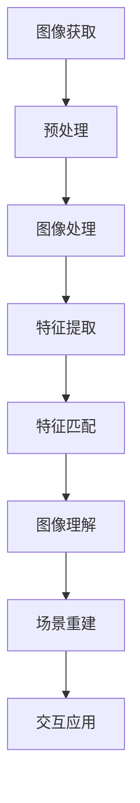
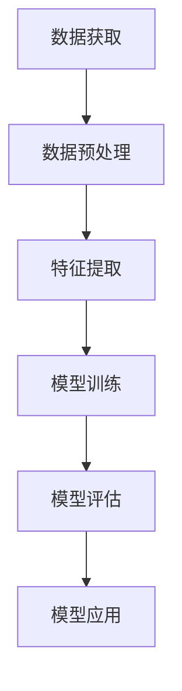
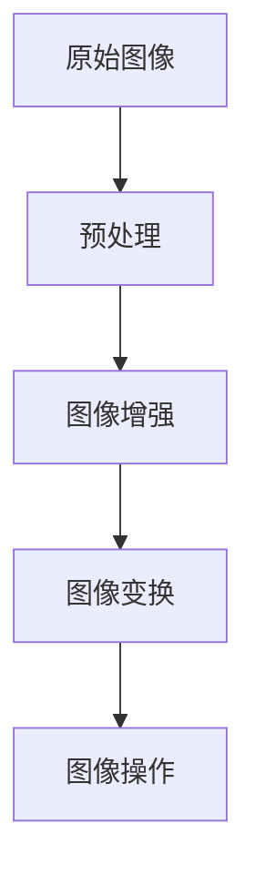
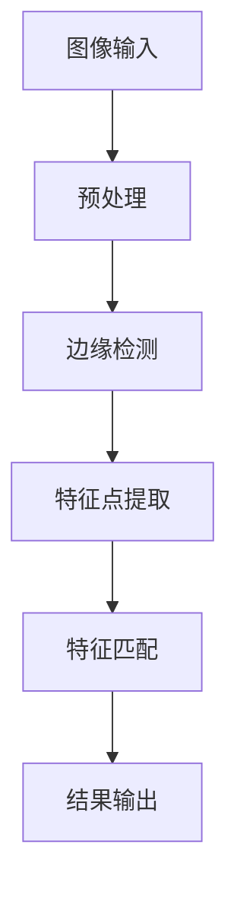
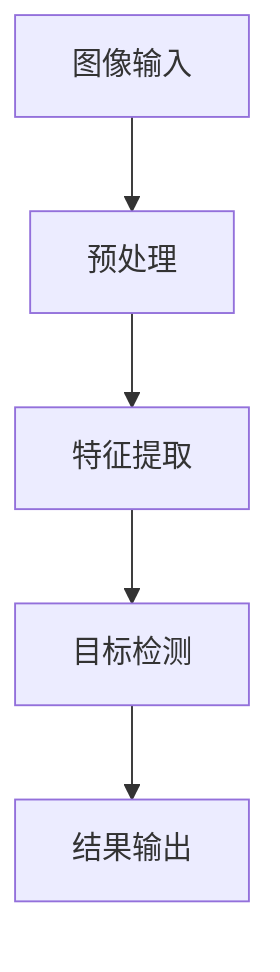
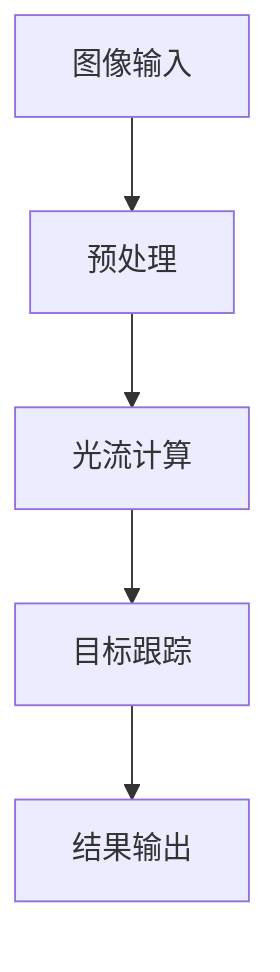
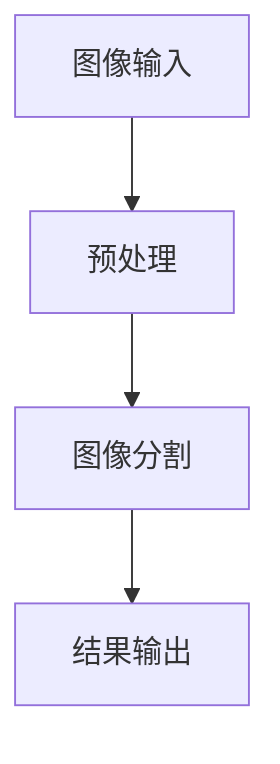

                 

# 文章标题：计算机视觉原理与代码实战案例讲解

> 关键词：计算机视觉，图像处理，特征提取，目标检测，目标跟踪，图像分割，深度学习

> 摘要：本文将深入探讨计算机视觉的基本原理，核心算法以及实际应用案例。通过逐步分析，我们将了解计算机视觉的技术框架，掌握图像处理、特征提取、目标检测、目标跟踪和图像分割等关键技术，并详细介绍一些经典的代码实战案例，帮助读者全面了解和掌握计算机视觉领域的知识。

## 《计算机视觉原理与代码实战案例讲解》目录大纲

### 第一部分：计算机视觉基础

### 第1章：计算机视觉概述

#### 1.1 计算机视觉的定义与历史

#### 1.1.1 计算机视觉的定义

计算机视觉是指使计算机能够像人眼一样感知和理解图像信息的技术。

#### 1.1.2 计算机视觉的发展历程

计算机视觉的发展经历了从早期的图像识别、模式识别到现代的深度学习等不同阶段。

### 1.2 计算机视觉的关键概念

#### 1.2.1 图像与信号处理

图像是计算机视觉的基础，信号处理技术是实现图像分析的关键。

#### 1.2.2 特征提取与匹配

特征提取和匹配是实现图像识别的核心技术。

#### 1.2.3 模型与算法

计算机视觉中的模型与算法是实现图像分析和理解的核心。

### 第2章：计算机视觉的数学基础

#### 2.1 线性代数基础

##### 2.1.1 矩阵与向量

矩阵与向量是计算机视觉中的基本数学工具。

##### 2.1.2 线性方程组与特征值

线性方程组与特征值在图像处理中具有重要的应用。

### 2.2 微积分基础

##### 2.2.1 导数与微分

导数与微分是图像处理中的核心数学工具。

##### 2.2.2 积分与积分变换

积分与积分变换在图像处理中有广泛的应用。

### 2.3 概率论基础

##### 2.3.1 随机变量与分布

随机变量与分布是概率论的基础。

##### 2.3.2 贝叶斯理论

贝叶斯理论在计算机视觉中有重要的应用。

### 第3章：图像处理基础

#### 3.1 图像表示

##### 3.1.1 二值图像

二值图像是图像处理中最基本的形式。

##### 3.1.2 灰度图像

灰度图像是计算机视觉中最常用的形式。

##### 3.1.3 彩色图像

彩色图像是计算机视觉中的高级形式。

#### 3.2 图像增强

##### 3.2.1 直方图均衡化

直方图均衡化是一种常见的图像增强技术。

##### 3.2.2 伽玛校正

伽玛校正是一种常用的图像增强技术。

##### 3.2.3 降噪处理

降噪处理是图像增强中的重要环节。

#### 3.3 图像变换

##### 3.3.1 离散余弦变换（DCT）

离散余弦变换是图像压缩中常用的技术。

##### 3.3.2 小波变换

小波变换是图像处理中常用的技术。

### 第二部分：计算机视觉核心算法

### 第4章：特征提取与描述

#### 4.1 边缘检测

##### 4.1.1 阈值检测

阈值检测是边缘检测的基础。

##### 4.1.2 矩形检测

矩形检测是一种常用的目标检测技术。

#### 4.2 特征点提取

##### 4.2.1 SIFT算法

SIFT算法是一种常用的特征点提取算法。

##### 4.2.2 SURF算法

SURF算法是一种基于SIFT的改进算法。

#### 4.3 特征匹配

##### 4.3.1 最近邻搜索

最近邻搜索是特征匹配中常用的技术。

##### 4.3.2 光流法

光流法是目标跟踪中常用的技术。

### 第5章：目标检测

#### 5.1 基于传统机器学习的方法

##### 5.1.1 SVM分类器

SVM分类器是一种常用的分类器。

##### 5.1.2 KNN算法

KNN算法是一种简单有效的分类器。

#### 5.2 基于深度学习的方法

##### 5.2.1 R-CNN算法

R-CNN算法是一种基于深度学习的目标检测算法。

##### 5.2.2 Fast R-CNN与Faster R-CNN算法

Fast R-CNN与Faster R-CNN算法是R-CNN的改进版本。

##### 5.2.3 YOLO算法

YOLO算法是一种实时目标检测算法。

### 第6章：目标跟踪

#### 6.1 基于光流的目标跟踪

##### 6.1.1 光流基本理论

光流是目标跟踪中的关键技术。

##### 6.1.2 光流跟踪算法

光流跟踪算法是目标跟踪的基本方法。

#### 6.2 基于模型的目标跟踪

##### 6.2.1 卡尔森模型

卡尔森模型是一种常用的目标跟踪模型。

##### 6.2.2 基于粒子滤波的目标跟踪

基于粒子滤波的目标跟踪是一种先进的跟踪方法。

### 第7章：图像分割

#### 7.1 基于阈值的方法

##### 7.1.1 全局阈值

全局阈值是一种简单的图像分割方法。

##### 7.1.2 局部阈值

局部阈值是一种更加精细的图像分割方法。

#### 7.2 基于区域生长的方法

##### 7.2.1 区域生长算法

区域生长算法是一种基于区域的图像分割方法。

##### 7.2.2 层次区域生长算法

层次区域生长算法是一种更加复杂的图像分割方法。

#### 7.3 基于深度学习的方法

##### 7.3.1 FCN算法

FCN算法是一种基于深度学习的图像分割算法。

##### 7.3.2 U-Net算法

U-Net算法是一种常用的深度学习图像分割算法。

### 第三部分：计算机视觉项目实战

### 第8章：计算机视觉项目实战案例

#### 8.1 人脸识别系统

##### 8.1.1 人脸检测

人脸检测是人脸识别的基础。

##### 8.1.2 人脸特征提取

人脸特征提取是人脸识别的核心。

##### 8.1.3 人脸识别

人脸识别是计算机视觉中的经典应用。

#### 8.2 自动驾驶系统

##### 8.2.1 行人检测

行人检测是自动驾驶系统中的关键任务。

##### 8.2.2 交通标志识别

交通标志识别是自动驾驶系统的重要组成部分。

##### 8.2.3 车辆跟踪

车辆跟踪是自动驾驶系统的核心任务。

#### 8.3 图像去噪

##### 8.3.1 基于滤波的方法

基于滤波的方法是图像去噪的常用技术。

##### 8.3.2 基于深度学习的方法

基于深度学习的方法是图像去噪的先进技术。

### 第9章：计算机视觉应用开发

#### 9.1 计算机视觉开发环境搭建

##### 9.1.1 Python环境搭建

Python环境搭建是计算机视觉开发的基础。

##### 9.1.2 OpenCV安装与配置

OpenCV安装与配置是计算机视觉开发的关键。

#### 9.2 代码实战案例

##### 9.2.1 边缘检测

边缘检测是图像处理中的基本操作。

##### 9.2.2 人脸识别

人脸识别是计算机视觉中的经典应用。

##### 9.2.3 车辆检测与跟踪

车辆检测与跟踪是自动驾驶系统中的重要任务。

### 第10章：计算机视觉未来发展趋势

#### 10.1 深度学习在计算机视觉中的应用

##### 10.1.1 卷积神经网络

卷积神经网络是深度学习中的核心技术。

##### 10.1.2 循环神经网络

循环神经网络在计算机视觉中具有广泛的应用。

##### 10.1.3 注意力机制

注意力机制是深度学习中的关键机制。

#### 10.2 计算机视觉与AI融合

##### 10.2.1 计算机视觉在自然语言处理中的应用

计算机视觉在自然语言处理中具有广泛的应用。

##### 10.2.2 计算机视觉在智能制造中的应用

计算机视觉在智能制造中具有重要的作用。

##### 10.2.3 计算机视觉在医疗领域中的应用

计算机视觉在医疗领域具有巨大的应用前景。

### 附录：常用算法与工具总结

#### 11.1 常用图像处理算法

##### 11.1.1 边缘检测算法

边缘检测算法是图像处理中的基本算法。

##### 11.1.2 特征提取与描述算法

特征提取与描述算法是计算机视觉中的核心算法。

#### 11.2 常用计算机视觉库

##### 11.2.1 OpenCV

OpenCV是计算机视觉中常用的库。

##### 11.2.2 TensorFlow

TensorFlow是深度学习中的常用库。

##### 11.2.3 PyTorch

PyTorch是深度学习中的常用库。

#### 11.3 计算机视觉相关资源

##### 11.3.1 计算机视觉社区

计算机视觉社区是学习计算机视觉的交流平台。

##### 11.3.2 计算机视觉论文库

计算机视觉论文库是获取计算机视觉论文的数据库。

##### 11.3.3 计算机视觉在线课程

计算机视觉在线课程是学习计算机视觉的在线资源。

## 总结

本文从计算机视觉的基本原理、核心算法、实际应用案例等方面进行了全面讲解。通过对每个章节的详细解析，读者可以系统地了解计算机视觉的相关知识，掌握图像处理、特征提取、目标检测、目标跟踪和图像分割等关键技术。同时，本文还介绍了计算机视觉的项目实战和应用开发，帮助读者将理论知识转化为实际应用能力。未来，随着深度学习等技术的不断发展，计算机视觉将在各个领域发挥更大的作用，本文的总结将为读者提供进一步学习和发展计算机视觉的参考。让我们共同期待计算机视觉技术的未来发展，为人类的智能发展做出贡献！
```markdown
## 第1章：计算机视觉概述

### 1.1 计算机视觉的定义与历史

计算机视觉是一门研究如何使计算机能够像人类一样感知和理解图像信息的技术。它起源于20世纪60年代，随着计算机技术的发展和图像处理技术的进步，逐渐成为人工智能领域的一个重要分支。

#### 1.1.1 计算机视觉的定义

计算机视觉的定义可以从以下几个方面来理解：

- **图像理解**：通过图像获取场景信息，理解图像内容，如图像分类、场景识别等。
- **场景重建**：从图像中恢复出三维场景，如图形重构、立体视觉等。
- **交互应用**：利用计算机视觉技术实现人与计算机的交互，如图像搜索、人机交互等。

#### 1.1.2 计算机视觉的发展历程

计算机视觉的发展可以分为以下几个阶段：

1. **早期阶段（20世纪60年代-80年代）**：这一阶段主要关注图像处理和特征提取技术，代表性算法包括边缘检测、特征匹配等。
2. **中期阶段（20世纪90年代）**：这一阶段引入了机器学习技术，特别是支持向量机（SVM）和神经网络（NN）等，提高了图像分类和识别的准确性。
3. **近期阶段（21世纪）**：这一阶段以深度学习为代表，显著提升了计算机视觉的性能，如卷积神经网络（CNN）在图像分类、目标检测等任务上取得了突破性进展。

### 1.2 计算机视觉的关键概念

计算机视觉涉及到多个关键概念，以下是一些重要的概念：

#### 1.2.1 图像与信号处理

图像是计算机视觉的基础，信号处理技术是实现图像分析的关键。常见的图像处理技术包括滤波、边缘检测、特征提取等。

#### 1.2.2 特征提取与匹配

特征提取是从图像中提取出能够表征图像内容的特征，如边缘、角点、纹理等。特征匹配则是利用这些特征来对图像进行匹配或识别。

#### 1.2.3 模型与算法

计算机视觉中的模型与算法是实现图像分析和理解的核心。常见的模型包括统计模型、概率模型和深度学习模型。算法包括分类、聚类、回归和强化学习等。

### 1.3 计算机视觉的应用领域

计算机视觉技术广泛应用于各个领域，以下是一些重要的应用领域：

- **医疗领域**：如医学图像分析、疾病诊断、手术机器人等。
- **工业领域**：如工业自动化、质量检测、生产调度等。
- **自动驾驶**：如车辆检测、行人检测、交通标志识别等。
- **安防监控**：如人脸识别、行为分析、异常检测等。
- **娱乐领域**：如虚拟现实、增强现实、动画制作等。

### 1.4 计算机视觉的发展趋势

随着深度学习等人工智能技术的快速发展，计算机视觉也在不断进步。以下是一些未来的发展趋势：

- **小样本学习**：能够在数据稀缺的情况下进行有效的学习和推理。
- **实时处理**：提高处理速度，实现实时视觉分析。
- **跨模态学习**：将计算机视觉与其他感知模态（如语音、触觉）相结合，提高系统的综合能力。
- **泛化能力**：提高算法在不同场景和任务上的适用性。

### 1.5 总结

计算机视觉是一门涉及多个学科交叉的领域，它的发展不仅依赖于计算机技术和算法的进步，还需要在应用场景中不断探索和创新。通过对本章的学习，读者可以初步了解计算机视觉的基本概念、发展历程和应用领域，为后续章节的学习打下基础。

### 1.6 Mermaid 流程图

以下是一个简化的计算机视觉流程图，展示了从图像获取到图像分析的基本步骤：



## 第2章：计算机视觉的数学基础

### 2.1 线性代数基础

线性代数是计算机视觉中的基础数学工具，它涉及到矩阵、向量、线性方程组等概念。以下是线性代数基础的一些重要知识点：

#### 2.1.1 矩阵与向量

- **矩阵**：矩阵是一种由数字组成的矩形阵列，它用于表示线性变换、数据集等。矩阵的基本运算包括加法、减法、乘法等。
- **向量**：向量是一个具有大小和方向的量，它可以表示空间中的一个点或方向。向量的基本运算包括加法、减法、点积、叉积等。

#### 2.1.2 线性方程组与特征值

- **线性方程组**：线性方程组是指包含多个线性方程的集合，它的解可以表示为向量。线性方程组可以通过矩阵形式表示，并使用高斯消元法等方法求解。
- **特征值与特征向量**：特征值和特征向量是矩阵的重要性质，它们可以用于求解线性方程组的特征值问题。特征值问题在图像处理和计算机视觉中有广泛的应用，如主成分分析（PCA）。

### 2.2 微积分基础

微积分是计算机视觉中另一个重要的数学工具，它涉及到导数、微分、积分等概念。以下是微积分基础的一些重要知识点：

#### 2.2.1 导数与微分

- **导数**：导数是函数在某一点处的变化率，它可以用于优化问题、滤波等。导数可以通过微分计算，微分是导数的一个推广。
- **微分**：微分是一种更一般的导数概念，它可以用于计算曲线的斜率、曲率等。

#### 2.2.2 积分与积分变换

- **积分**：积分是导数的反操作，它可以用于求解面积、体积等问题。积分可以分为定积分和反积分两种形式。
- **积分变换**：积分变换是一种将函数转换为另一个函数的方法，它可以简化积分的计算。常见的积分变换包括傅里叶变换、拉普拉斯变换等。

### 2.3 概率论基础

概率论是计算机视觉中处理不确定性问题的数学工具。以下是概率论基础的一些重要知识点：

#### 2.3.1 随机变量与分布

- **随机变量**：随机变量是一个具有概率分布的函数，它可以表示图像的像素值、噪声等。
- **分布**：分布是随机变量取值的概率分布，常见的分布包括正态分布、泊松分布等。

#### 2.3.2 贝叶斯理论

- **贝叶斯理论**：贝叶斯理论是一种基于概率推理的方法，它可以用于计算后验概率、贝叶斯估计等。贝叶斯理论在计算机视觉中有广泛的应用，如图像分类、目标跟踪等。

### 2.4 统计学习方法基础

统计学习方法是基于概率论和统计学理论的一种机器学习方法，它广泛应用于计算机视觉领域。以下是统计学习方法基础的一些重要知识点：

#### 2.4.1 统计模型

- **统计模型**：统计模型是一种描述数据分布的方法，它可以用于预测、分类等问题。常见的统计模型包括线性回归、逻辑回归等。

#### 2.4.2 学习算法

- **学习算法**：学习算法是一种从数据中学习模型的方法，它可以用于训练统计模型。常见的学习算法包括梯度下降、随机梯度下降等。

### 2.5 总结

计算机视觉中的数学基础包括线性代数、微积分、概率论和统计学习方法等。这些数学工具为计算机视觉提供了强大的理论基础，使得图像处理、特征提取、模型训练等任务得以实现。通过本章的学习，读者可以初步掌握这些数学工具的基本概念和应用，为后续章节的学习打下基础。

### 2.6 Mermaid 流程图

以下是一个简化的计算机视觉数学基础流程图，展示了从数据到模型的基本步骤：



## 第3章：图像处理基础

### 3.1 图像表示

图像是计算机视觉中的基本数据形式，对其进行有效的表示是进行图像处理和分析的关键。图像的表示可以从多个维度来理解，包括二值图像、灰度图像和彩色图像。

#### 3.1.1 二值图像

二值图像是一种最简单的图像形式，其中每个像素点只包含两个值：黑或白，0或1。二值图像通常用于图像分割、字符识别等场景。

#### 3.1.2 灰度图像

灰度图像是比二值图像更复杂的图像形式，其中每个像素点可以包含多个灰度值，通常在0到255之间。灰度图像能够更好地反映图像的亮度信息，常用于图像增强、边缘检测等。

#### 3.1.3 彩色图像

彩色图像是包含红、绿、蓝三个颜色分量的图像形式，通常使用RGB颜色空间表示。彩色图像能够更真实地反映场景的视觉信息，常用于计算机视觉的多个应用领域。

### 3.2 图像增强

图像增强是指通过处理和操作原始图像，提高图像的视觉质量或突出图像中的某些特征。以下是一些常见的图像增强技术：

#### 3.2.1 直方图均衡化

直方图均衡化是一种常用的图像增强技术，它通过调整图像的灰度分布，使得图像的对比度增强。直方图均衡化的核心思想是重新分配图像的灰度值，使得各个灰度级都有均匀的分布。

#### 3.2.2 伽玛校正

伽玛校正是一种用于调整图像亮度和对比度的技术。它通过对图像的每个像素值进行指数变换来实现，公式为 \(I_{out} = I_{in}^{\gamma}\)，其中 \(I_{in}\) 和 \(I_{out}\) 分别为输入和输出像素值，\(\gamma\) 为伽玛系数。

#### 3.2.3 降噪处理

降噪处理是图像增强中的重要环节，它用于去除图像中的噪声，提高图像的清晰度。常见的降噪方法包括均值滤波、中值滤波和高斯滤波等。

### 3.3 图像变换

图像变换是指将一幅图像转换成另一种形式，以便于进一步处理和分析。以下是一些常见的图像变换技术：

#### 3.3.1 离散余弦变换（DCT）

离散余弦变换是一种用于图像压缩的变换技术。它将图像分解为频域表示，通过分离高频和低频信息来减少图像的冗余信息，从而实现压缩。

#### 3.3.2 小波变换

小波变换是一种用于多尺度分析和压缩的变换技术。它通过将图像分解为不同尺度的小波基函数来捕捉图像的细节信息，从而实现图像的压缩和去噪。

### 3.4 基本操作

在图像处理中，常用的基本操作包括像素访问、像素修改、图像缩放、旋转和平移等。以下是一些基本的图像操作示例：

#### 3.4.1 像素访问

```python
# Python代码示例：访问图像的像素值
img = cv2.imread('image.jpg')
px = img[100, 100]  # 获取图像坐标(100, 100)的像素值
```

#### 3.4.2 像素修改

```python
# Python代码示例：修改图像的像素值
img[100, 100] = [255, 0, 0]  # 将图像坐标(100, 100)的像素值修改为红色
cv2.imwrite('modified_image.jpg', img)  # 保存修改后的图像
```

#### 3.4.3 图像缩放

```python
# Python代码示例：图像缩放
import cv2

img = cv2.imread('image.jpg')
img_resized = cv2.resize(img, (new_width, new_height))  # 缩放到新的宽度和高度
```

#### 3.4.4 图像旋转

```python
# Python代码示例：图像旋转
import cv2

center = (img.shape[1] // 2, img.shape[0] // 2)  # 获取图像中心点
M = cv2.getRotationMatrix2D(center, angle, scale)  # 获取旋转矩阵
img_rotated = cv2.warpAffine(img, M, (new_width, new_height))  # 旋转图像
```

#### 3.4.5 图像平移

```python
# Python代码示例：图像平移
import cv2

M = np.float32([[1, 0, x_shift], [0, 1, y_shift]])  # 平移矩阵
img_shifted = cv2.warpAffine(img, M, (new_width, new_height))  # 平移图像
```

### 3.5 总结

图像处理是计算机视觉中的基础，它涉及到图像的表示、增强、变换以及基本操作。通过对图像的处理，可以提高图像的质量，提取有用的特征，为后续的计算机视觉任务提供支持。本章介绍了图像处理的基本概念和技术，包括图像表示、图像增强和图像变换，并提供了相关的Python代码示例，帮助读者理解和应用这些技术。

### 3.6 Mermaid 流程图

以下是一个简化的图像处理流程图，展示了从原始图像到增强图像的基本步骤：



## 第4章：特征提取与描述

### 4.1 边缘检测

边缘检测是图像处理中的一个重要步骤，它用于识别图像中的轮廓和边界。边缘检测的目的是将图像中重要的结构和细节从背景中分离出来，从而便于进一步处理和分析。

#### 4.1.1 阈值检测

阈值检测是最简单的边缘检测方法之一，它通过设置一个阈值来将图像划分为前景和背景。如果一个像素点的灰度值高于阈值，则该像素点被认为是前景；否则，被认为是背景。

阈值检测的公式如下：

$$
T = \text{阈值}
$$

$$
P(x, y) = 
\begin{cases} 
1 & \text{如果 } I(x, y) > T \\
0 & \text{否则}
\end{cases}
$$

其中，\(I(x, y)\) 是图像在点 \((x, y)\) 的灰度值，\(P(x, y)\) 是该点的前景标志。

阈值检测的步骤如下：

1. **设置阈值**：根据图像的灰度分布选择合适的阈值。常用的方法包括全局阈值和局部阈值。
2. **二值化**：将图像的每个像素点的灰度值与阈值进行比较，得到二值图像。

以下是一个简单的阈值检测的Python代码示例：

```python
import cv2
import numpy as np

# 读取图像
img = cv2.imread('image.jpg', cv2.IMREAD_GRAYSCALE)

# 设置阈值
threshold = 128

# 二值化
_, binary_img = cv2.threshold(img, threshold, 255, cv2.THRESH_BINARY)

# 显示二值图像
cv2.imshow('Binary Image', binary_img)
cv2.waitKey(0)
cv2.destroyAllWindows()
```

#### 4.1.2 矩形检测

矩形检测是图像识别中的一个重要任务，它用于识别图像中的矩形形状。矩形检测通常通过边缘检测和轮廓检测来实现。

矩形检测的基本步骤如下：

1. **边缘检测**：使用Canny算法或其他边缘检测方法找到图像的边缘。
2. **轮廓检测**：使用findContours函数找到边缘的轮廓。
3. **轮廓筛选**：筛选出可能是矩形的轮廓，通常通过计算轮廓的周长和面积来判断。
4. **形状匹配**：使用形状描述符（如周长、面积、对角线长度等）来匹配矩形。

以下是一个简单的矩形检测的Python代码示例：

```python
import cv2
import numpy as np

# 读取图像
img = cv2.imread('image.jpg', cv2.IMREAD_GRAYSCALE)

# Canny边缘检测
edges = cv2.Canny(img, 50, 150)

# 轮廓检测
contours, _ = cv2.findContours(edges, cv2.RETR_EXTERNAL, cv2.CHAIN_APPROX_SIMPLE)

# 矩形筛选
rectangles = []
for contour in contours:
    perimeter = cv2.arcLength(contour, True)
    area = cv2.contourArea(contour)
    if perimeter > 10 and area > 100:
        rectangles.append(contour)

# 绘制矩形
for rect in rectangles:
    x, y, w, h = cv2.boundingRect(rect)
    cv2.rectangle(img, (x, y), (x+w, y+h), (0, 255, 0), 2)

# 显示结果
cv2.imshow('Rectangle Detection', img)
cv2.waitKey(0)
cv2.destroyAllWindows()
```

### 4.2 特征点提取

特征点提取是图像处理中的一个关键步骤，它用于提取图像中的显著特征点，如角点、边缘点等。这些特征点在图像匹配、目标识别等任务中起着重要作用。

#### 4.2.1 SIFT算法

SIFT（尺度不变特征变换）算法是一种经典的特征点提取算法，它能够提取出图像中的显著特征点，并且对旋转、尺度变化和光照变化具有较强的鲁棒性。

SIFT算法的主要步骤如下：

1. **尺度空间构建**：使用高斯金字塔构建不同尺度的图像，以便于检测不同尺度的特征点。
2. **关键点检测**：在尺度空间中检测局部极值点，作为潜在的角点。
3. **关键点定位**：对潜在的角点进行细化，确定其准确位置。
4. **关键点描述**：使用关键点周围的像素值构建一个直方图，作为关键点的描述子。

以下是一个简单的SIFT算法的Python代码示例：

```python
import cv2

# 读取图像
img = cv2.imread('image.jpg')

# 初始化SIFT算法
sift = cv2.SIFT_create()

# 检测关键点
keypoints, descriptors = sift.detectAndCompute(img, None)

# 绘制关键点
img_keypoints = cv2.drawKeypoints(img, keypoints, None, (0, 255, 0), cv2.DRAW_MATCHES_FLAGS_DRAW_RICH_KEYPOINTS)

# 显示结果
cv2.imshow('SIFT Keypoints', img_keypoints)
cv2.waitKey(0)
cv2.destroyAllWindows()
```

#### 4.2.2 SURF算法

SURF（加速稳健特征）算法是一种基于SIFT算法的改进算法，它在SIFT算法的基础上进行了优化，使其在速度和计算效率上有了显著提升。

SURF算法的主要步骤与SIFT算法类似，包括：

1. **尺度空间构建**：使用高斯金字塔构建不同尺度的图像。
2. **关键点检测**：在尺度空间中检测局部极值点。
3. **关键点定位**：对潜在的角点进行细化。
4. **关键点描述**：使用关键点周围的像素值构建描述子。

以下是一个简单的SURF算法的Python代码示例：

```python
import cv2

# 读取图像
img = cv2.imread('image.jpg')

# 初始化SURF算法
surf = cv2.xfeatures2d.SURF_create()

# 检测关键点
keypoints, descriptors = surf.detectAndCompute(img, None)

# 绘制关键点
img_keypoints = cv2.drawKeypoints(img, keypoints, None, (0, 255, 0), cv2.DRAW_MATCHES_FLAGS_DRAW_RICH_KEYPOINTS)

# 显示结果
cv2.imshow('SURF Keypoints', img_keypoints)
cv2.waitKey(0)
cv2.destroyAllWindows()
```

### 4.3 特征匹配

特征匹配是图像处理中的一个重要步骤，它用于将不同图像中的特征点进行对应，以便进行图像匹配、目标识别等任务。

#### 4.3.1 最近邻搜索

最近邻搜索是一种常用的特征匹配方法，它通过计算特征点之间的距离，找到彼此最近的特征点对。

最近邻搜索的基本步骤如下：

1. **计算距离**：计算每对特征点之间的欧几里得距离。
2. **选择最近邻**：对于每个特征点，选择与其距离最近的特征点作为最近邻。

以下是一个简单的最近邻搜索的Python代码示例：

```python
import cv2
import numpy as np

# 读取图像
img1 = cv2.imread('image1.jpg')
img2 = cv2.imread('image2.jpg')

# 初始化SIFT算法
sift = cv2.SIFT_create()

# 检测关键点
keypoints1, descriptors1 = sift.detectAndCompute(img1, None)
keypoints2, descriptors2 = sift.detectAndCompute(img2, None)

# 计算距离
distances = []
for desc1 in descriptors1:
    for desc2 in descriptors2:
        distance = np.linalg.norm(desc1 - desc2)
        distances.append(distance)

# 选择最近邻
k = 2
indices = np.argpartition(distances, k)[:k]
best_matches = []
for i in range(0, len(indices), 2):
    best_matches.append((indices[i], indices[i+1]))

# 绘制匹配结果
img_matches = cv2.drawMatches(img1, keypoints1, img2, keypoints2, best_matches, None, flags=cv2.DrawMatchesFlags_NOT_DRAW_SINGLE_POINTS)

# 显示结果
cv2.imshow('Feature Matching', img_matches)
cv2.waitKey(0)
cv2.destroyAllWindows()
```

#### 4.3.2 光流法

光流法是一种用于视频序列分析的重要方法，它通过分析连续帧之间的像素运动，获取像素的瞬时速度和方向。

光流法的基本步骤如下：

1. **帧差法**：计算连续帧之间的像素差异，得到运动矢量。
2. **优化法**：使用最小二乘法或其他优化方法，对运动矢量进行细化。

以下是一个简单的光流法的Python代码示例：

```python
import cv2
import numpy as np

# 读取视频
cap = cv2.VideoCapture('video.mp4')

# 初始化光流法
optical_flow = cv2.Dualaöp

# 读取第一帧
ret, prev_frame = cap.read()
prev_gray = cv2.cvtColor(prev_frame, cv2.COLOR_BGR2GRAY)

# 创建显示窗口
cv2.namedWindow('Optical Flow', cv2.WND_PROP_FULLSCREEN)
cv2.setWindowProperty('Optical Flow', cv2.WND_PROP_FULLSCREEN, cv2.WINDOW_FULLSCREEN)

while True:
    # 读取下一帧
    ret, curr_frame = cap.read()
    curr_gray = cv2.cvtColor(curr_frame, cv2.COLOR_BGR2GRAY)

    # 计算光流
    flow = optical_flow.pseudo_flow(prev_gray, curr_gray)

    # 绘制光流图
    img_flow = cv2.cvtColor(flow, cv2.COLOR_GRAY2BGR)
    cv2.imshow('Optical Flow', img_flow)

    # 更新前一帧
    prev_gray = curr_gray.copy()

    # 按下q键退出
    if cv2.waitKey(1) & 0xFF == ord('q'):
        break

# 释放资源
cap.release()
cv2.destroyAllWindows()
```

### 4.4 总结

特征提取与描述是计算机视觉中的重要环节，它涉及到边缘检测、特征点提取、特征匹配等多个步骤。本章介绍了边缘检测、矩形检测、SIFT算法、SURF算法、最近邻搜索和光流法等关键技术，并通过Python代码示例展示了如何实现这些技术。通过对本章的学习，读者可以掌握特征提取与描述的基本原理和实现方法，为后续的计算机视觉任务打下基础。

### 4.5 Mermaid 流程图

以下是一个简化的特征提取与描述流程图，展示了从图像输入到特征点提取和匹配的基本步骤：



## 第5章：目标检测

### 5.1 基于传统机器学习的方法

目标检测是计算机视觉中的重要任务，它用于识别和定位图像中的目标物体。基于传统机器学习的方法在目标检测领域取得了显著成果，以下介绍几种常用的传统机器学习方法。

#### 5.1.1 SVM分类器

支持向量机（SVM）是一种高效的二分类算法，它通过最大化分类边界来分离数据。在目标检测中，SVM通常用于分类图像特征，以确定像素点是否属于目标物体。

SVM的基本原理如下：

1. **特征空间映射**：将原始特征空间映射到一个更高维的特征空间，使得可分性更好。
2. **分类边界**：在特征空间中找到一个超平面，最大化分类边界。
3. **支持向量**：支持向量是超平面距离最近的样本，用于调整超平面的位置。

以下是一个简单的SVM分类器的Python代码示例：

```python
import cv2
import numpy as np

# 读取训练数据和标签
train_data = np.load('train_data.npy')
train_labels = np.load('train_labels.npy')

# 初始化SVM分类器
svm = cv2.SVM()

# 训练模型
svm.train(train_data, train_labels)

# 预测
test_data = np.array([[100, 100], [200, 200], [300, 300]])
predictions = svm.predict(test_data)

# 输出预测结果
print(predictions)
```

#### 5.1.2 KNN算法

K最近邻算法（KNN）是一种简单而有效的分类算法，它通过寻找训练集中最接近未知样本的K个最近邻居，并基于这些邻居的标签进行预测。

KNN的基本原理如下：

1. **距离计算**：计算未知样本与训练样本之间的距离，常用的距离度量包括欧几里得距离、曼哈顿距离等。
2. **邻居选择**：选择与未知样本距离最近的K个邻居。
3. **标签预测**：根据邻居的标签计算未知样本的预测标签，常用的方法有多数投票法。

以下是一个简单的KNN分类器的Python代码示例：

```python
import cv2
import numpy as np

# 读取训练数据和标签
train_data = np.load('train_data.npy')
train_labels = np.load('train_labels.npy')

# 初始化KNN分类器
knn = cv2.KNearest_create()

# 训练模型
knn.train(train_data, train_labels)

# 预测
test_data = np.array([[100, 100], [200, 200], [300, 300]])
responses, distances = knn.findNearest(test_data, k=3)

# 输出预测结果
print(responses)
```

### 5.2 基于深度学习的方法

深度学习在目标检测领域取得了重大突破，以下介绍几种常用的深度学习方法。

#### 5.2.1 R-CNN算法

R-CNN（Regions with CNN Features）算法是一种基于深度学习的目标检测方法，它通过区域提议、特征提取和分类三个步骤进行目标检测。

R-CNN的基本原理如下：

1. **区域提议**：使用选择性搜索（Selective Search）算法生成大量区域提议。
2. **特征提取**：使用卷积神经网络（CNN）对每个区域提议提取特征。
3. **分类**：使用SVM或其他分类器对提取的特征进行分类，以确定区域是否包含目标。

以下是一个简单的R-CNN算法的Python代码示例：

```python
import cv2
import numpy as np

# 读取图像
img = cv2.imread('image.jpg')

# 初始化网络
net = cv2.dnn.readNetFromCaffe('deploy.prototxt', 'res10_300x300_iter_400000.caffemodel')

# 检测目标
height, width = img.shape[:2]
scale = 0.0039
size = (300, 300)
spatial_scale = 0.0625

blob = cv2.dnn.blobFromImage(img, scalefactor=scale, size=size, mean=None, swapRB=False, crop=False)
net.setInput(blob)
 detections = net.forward()

# 处理检测结果
for i in range(detections.shape[2]):
    confidence = detections[0, 0, i, 2]
    if confidence > 0.5:
        box = detections[0, 0, i, 3:7] * np.array([width, height, width, height])
        label = detections[0, 0, i, 1]
        cv2.rectangle(img, (int(box[0]), int(box[1])), (int(box[2]), int(box[3])), (0, 255, 0), 2)
        cv2.putText(img, label, (int(box[0]), int(box[1]) - 10), cv2.FONT_HERSHEY_SIMPLEX, 0.5, (255, 0, 0), 2)

# 显示结果
cv2.imshow('R-CNN Detection', img)
cv2.waitKey(0)
cv2.destroyAllWindows()
```

#### 5.2.2 Fast R-CNN算法

Fast R-CNN是对R-CNN算法的改进，它通过引入区域建议网络（Region Proposal Network，RPN）来提高检测速度。

Fast R-CNN的基本原理如下：

1. **区域提议**：使用RPN生成区域提议。
2. **特征提取**：使用卷积神经网络提取特征。
3. **分类与回归**：对提取的特征进行分类和边界框回归。

以下是一个简单的Fast R-CNN算法的Python代码示例：

```python
import cv2
import numpy as np

# 读取图像
img = cv2.imread('image.jpg')

# 初始化网络
net = cv2.dnn.readNetFromDarknet('config/yolov3.cfg', 'weights/yolov3.weights')

# 检测目标
height, width = img.shape[:2]
blob = cv2.dnn.blobFromImage(img, 1/255.0, (416, 416), swapRB=False, crop=False)
net.setInput(blob)
detections = net.forward()

# 处理检测结果
for i in range(detections.shape[2]):
    confidence = detections[0, 0, i, 2]
    if confidence > 0.5:
        box = detections[0, 0, i, 3:7] * np.array([width, height, width, height])
        label = detections[0, 0, i, 1]
        cv2.rectangle(img, (int(box[0]), int(box[1])), (int(box[2]), int(box[3])), (0, 255, 0), 2)
        cv2.putText(img, label, (int(box[0]), int(box[1]) - 10), cv2.FONT_HERSHEY_SIMPLEX, 0.5, (255, 0, 0), 2)

# 显示结果
cv2.imshow('Fast R-CNN Detection', img)
cv2.waitKey(0)
cv2.destroyAllWindows()
```

#### 5.2.3 Faster R-CNN算法

Faster R-CNN是Fast R-CNN的进一步改进，它通过引入区域建议网络（Region Proposal Network，RPN）和深度学习框架来提高检测速度。

Faster R-CNN的基本原理如下：

1. **区域提议**：使用RPN生成区域提议。
2. **特征提取**：使用卷积神经网络提取特征。
3. **分类与回归**：对提取的特征进行分类和边界框回归。

以下是一个简单的Faster R-CNN算法的Python代码示例：

```python
import cv2
import numpy as np

# 读取图像
img = cv2.imread('image.jpg')

# 初始化网络
net = cv2.dnn.readNetFromDarknet('config/faster_rcnn-resnet50.cfg', 'weights/faster_rcnn_resnet50.caffemodel')

# 检测目标
height, width = img.shape[:2]
blob = cv2.dnn.blobFromImage(img, 1/255.0, (416, 416), swapRB=False, crop=False)
net.setInput(blob)
detections = net.forward()

# 处理检测结果
for i in range(detections.shape[2]):
    confidence = detections[0, 0, i, 2]
    if confidence > 0.5:
        box = detections[0, 0, i, 3:7] * np.array([width, height, width, height])
        label = detections[0, 0, i, 1]
        cv2.rectangle(img, (int(box[0]), int(box[1])), (int(box[2]), int(box[3])), (0, 255, 0), 2)
        cv2.putText(img, label, (int(box[0]), int(box[1]) - 10), cv2.FONT_HERSHEY_SIMPLEX, 0.5, (255, 0, 0), 2)

# 显示结果
cv2.imshow('Faster R-CNN Detection', img)
cv2.waitKey(0)
cv2.destroyAllWindows()
```

#### 5.2.4 YOLO算法

YOLO（You Only Look Once）算法是一种基于深度学习的实时目标检测算法，它通过将目标检测任务转化为单个前向传播过程，实现了高效的检测速度。

YOLO的基本原理如下：

1. **图像分割**：将图像分割成SxS的网格单元。
2. **边界框预测**：每个网格单元预测B个边界框，每个边界框预测类别和位置。
3. **类别预测**：对每个边界框进行类别预测。

以下是一个简单的YOLO算法的Python代码示例：

```python
import cv2
import numpy as np

# 读取图像
img = cv2.imread('image.jpg')

# 初始化网络
net = cv2.dnn.readNet('config/yolov3.cfg', 'weights/yolov3.weights')

# 检测目标
height, width = img.shape[:2]
blob = cv2.dnn.blobFromImage(img, 1/255.0, (416, 416), swapRB=False, crop=False)
net.setInput(blob)
detections = net.forward()

# 处理检测结果
for i in range(detections.shape[2]):
    confidence = detections[0, 0, i, 2]
    if confidence > 0.5:
        box = detections[0, 0, i, 3:7] * np.array([width, height, width, height])
        label = detections[0, 0, i, 1]
        cv2.rectangle(img, (int(box[0]), int(box[1])), (int(box[2]), int(box[3])), (0, 255, 0), 2)
        cv2.putText(img, label, (int(box[0]), int(box[1]) - 10), cv2.FONT_HERSHEY_SIMPLEX, 0.5, (255, 0, 0), 2)

# 显示结果
cv2.imshow('YOLO Detection', img)
cv2.waitKey(0)
cv2.destroyAllWindows()
```

### 5.3 总结

目标检测是计算机视觉中的重要任务，基于传统机器学习和深度学习的方法都在该领域取得了显著成果。本章介绍了SVM分类器、KNN算法、R-CNN算法、Fast R-CNN算法、Faster R-CNN算法和YOLO算法等目标检测方法，并通过Python代码示例展示了如何实现这些算法。通过对本章的学习，读者可以掌握目标检测的基本原理和实现方法，为后续的计算机视觉任务打下基础。

### 5.4 Mermaid 流程图

以下是一个简化的目标检测流程图，展示了从图像输入到目标检测的基本步骤：



## 第6章：目标跟踪

### 6.1 基于光流的目标跟踪

基于光流的目标跟踪是一种利用连续帧之间的像素运动信息来跟踪目标的方法。光流法通过分析图像序列中像素的瞬时运动，计算每个像素点的运动矢量，从而实现对目标的跟踪。

#### 6.1.1 光流基本理论

光流是指图像序列中像素点的瞬时运动。光流的基本理论包括以下几个方面：

1. **光流方程**：光流方程描述了像素点的运动与图像亮度变化之间的关系。假设图像亮度变化是连续的，光流方程可以表示为：

   $$
   I(x + ut, y + vt) = I(x, y) + ut\frac{\partial I}{\partial x} + vt\frac{\partial I}{\partial y}
   $$

   其中，\(I(x, y)\) 是图像亮度函数，\(u\) 和 \(v\) 分别是像素点在水平和垂直方向上的运动速度。

2. **光流计算方法**：光流计算方法主要包括帧差法、光学流法和索贝尔算子等。

   - **帧差法**：帧差法通过计算连续帧之间的差异来估计光流。具体步骤如下：

     1. 计算连续两帧的差值图像。
     2. 对差值图像进行二值化，提取光流矢量。
   
   - **光学流法**：光学流法通过求解光流方程来计算光流。常用的光学流算法包括Lucas-Kanade算法和Marr-Edholm算法等。

   - **索贝尔算子**：索贝尔算子是一种用于计算图像边缘的算子，它也可以用于计算光流。索贝尔算子通过计算图像的水平和垂直方向上的导数，得到光流矢量。

   $$
   \text{Sobel}(I) = \left[\begin{matrix}
   \frac{\partial I}{\partial x} & \frac{\partial I}{\partial y}
   \end{matrix}\right]
   $$

3. **光流匹配**：光流匹配是指将当前帧中的像素点与参考帧中的像素点进行匹配，以确定像素点的运动轨迹。常见的光流匹配方法包括最近邻匹配和光流匹配。

#### 6.1.2 光流跟踪算法

光流跟踪算法通过连续帧之间的像素运动信息来跟踪目标。以下是一些常见的光流跟踪算法：

1. **卡尔森跟踪算法**：卡尔森跟踪算法是一种基于光流法的目标跟踪算法，它通过计算光流矢量并使用卡尔森模型来预测目标位置。卡尔森模型假设目标在连续帧之间进行匀速运动，其运动方程为：

   $$
   x_{t+1} = x_t + u\Delta t
   $$

   $$
   y_{t+1} = y_t + v\Delta t
   $$

   其中，\(\Delta t\) 是连续帧之间的时间间隔。

2. **粒子滤波跟踪算法**：粒子滤波跟踪算法是一种基于概率模型的目标跟踪算法，它通过在目标轨迹上分布多个粒子来估计目标的位置。粒子滤波跟踪算法的基本步骤如下：

   1. 初始化粒子：在目标初始位置附近随机生成多个粒子。
   2. 重要性权重计算：根据粒子与目标的真实位置之间的相似度计算每个粒子的重要性权重。
   3. 粒子重采样：根据粒子的重要性权重进行重采样，生成新的粒子分布。
   4. 更新粒子位置：根据光流信息更新每个粒子的位置。

   $$
   x_{t+1} = x_t + u\Delta t + w_t
   $$

   $$
   y_{t+1} = y_t + v\Delta t + w_t
   $$

   其中，\(w_t\) 是光流矢量。

#### 6.1.3 光流跟踪算法的Python代码示例

以下是一个简单的光流跟踪算法的Python代码示例，使用OpenCV库实现：

```python
import cv2

# 初始化视频捕捉对象
cap = cv2.VideoCapture('video.mp4')

# 读取第一帧
ret, frame1 = cap.read()
frame1_gray = cv2.cvtColor(frame1, cv2.COLOR_BGR2GRAY)

# 创建光流对象
lk_params = cv2.SimpleBlobDetector_Params()
lk_params.minArea = 50
lk = cv2.SimpleBlobDetector_create(lk_params)

# 初始化卡尔森模型
model = cv2.KalmanFilter(4, 2, 0)
model.transitionMatrix = np.array([[1, 1], [0, 1]], np.float32)
model.measurementMatrix = np.array([[1, 0]], np.float32)
model.processNoiseCov = np.array([[1, 0], [0, 1]], np.float32)

# 显示视频并开始跟踪
while ret:
    # 读取下一帧
    ret, frame2 = cap.read()
    frame2_gray = cv2.cvtColor(frame2, cv2.COLOR_BGR2GRAY)

    # 计算光流
    points1 = lk.detect(frame1_gray)
    points2, status, _ = cv2.calcOpticalFlowPyrLK(frame1_gray, frame2_gray, points1, None, **lk_params)

    # 跟踪卡尔森模型
    if status.any():
        Z = np.hstack((points2.reshape(-1, 1)[status], np.ones((status.size, 1))))
        x = model.predict()
        y = model.correct(Z)

        # 绘制跟踪结果
        cv2.circle(frame2, (int(x[0]), int(x[1])), 5, (0, 0, 255), -1)
        cv2.circle(frame2, (int(points2[status, 0]), int(points2[status, 1])), 5, (0, 255, 0), -1)

    # 显示结果
    cv2.imshow('Optical Flow Tracking', frame2)
    frame1_gray = frame2_gray.copy()

    # 按下q键退出
    if cv2.waitKey(1) & 0xFF == ord('q'):
        break

# 释放资源
cap.release()
cv2.destroyAllWindows()
```

### 6.2 基于模型的目标跟踪

基于模型的目标跟踪是指使用特定的模型来预测目标的位置和运动。以下介绍几种常见的基于模型的目标跟踪算法：

#### 6.2.1 卡尔森模型

卡尔森模型是一种基于线性系统的目标跟踪算法，它通过状态空间模型来描述目标的运动。卡尔森模型的基本原理如下：

1. **状态空间模型**：卡尔森模型将目标的位置和速度表示为状态向量，并使用卡尔曼滤波器来预测目标的位置。

   $$
   x_t = x_{t-1} + v_t
   $$

   $$
   y_t = y_{t-1} + v_t
   $$

   其中，\(x_t\) 和 \(y_t\) 分别为第 \(t\) 帧的目标位置，\(v_t\) 为目标的速度。

2. **卡尔曼滤波器**：卡尔曼滤波器是一种优化估计方法，用于在线更新目标的位置和速度。

   卡尔曼滤波器的预测公式为：

   $$
   \hat{x}_t = A\hat{x}_{t-1} + Bw_t
   $$

   其中，\(\hat{x}_t\) 为预测的目标位置，\(A\) 和 \(B\) 为系统矩阵，\(w_t\) 为过程噪声。

   卡尔曼滤波器的更新公式为：

   $$
   \hat{x}_{t|t} = K_t(y_t - H_t\hat{x}_t)
   $$

   $$
   P_{t|t} = (I - K_tH_t)P_{t-1}
   $$

   其中，\(K_t\) 为卡尔曼增益，\(P_{t-1}\) 和 \(P_{t|t}\) 分别为前一个状态估计的协方差矩阵和当前状态估计的协方差矩阵。

   卡尔曼滤波器通过不断更新状态估计和协方差矩阵，实现对目标位置的精确跟踪。

3. **卡尔森模型的优势**：卡尔森模型具有简单、高效和鲁棒性强等优点，适用于大多数目标跟踪场景。

   卡尔森模型的缺点在于，它假设目标运动是线性的，对于非线性的目标运动，效果可能较差。

#### 6.2.2 基于粒子滤波的目标跟踪

粒子滤波是一种基于随机采样和蒙特卡罗方法的非线性状态估计方法，它通过在目标状态空间中分布多个粒子来估计目标的位置。

粒子滤波的基本原理如下：

1. **粒子初始化**：在目标状态空间中随机初始化多个粒子。

   $$
   x_t^n = x_{t-1}^n + w_t^n
   $$

   其中，\(x_t^n\) 为第 \(t\) 帧第 \(n\) 个粒子的状态，\(w_t^n\) 为第 \(t\) 帧第 \(n\) 个粒子的权重。

2. **权重更新**：根据目标的状态和观测值更新每个粒子的权重。

   $$
   w_t^n = \frac{p(x_t^n | z_t)}{w_t^{n-1}}
   $$

   其中，\(p(x_t^n | z_t)\) 为粒子 \(n\) 的状态与观测值 \(z_t\) 之间的概率。

3. **重采样**：根据粒子的权重进行重采样，生成新的粒子分布。

   重采样过程包括以下步骤：

   - **选择采样**：根据粒子的权重选择采样点。
   - **权重调整**：调整每个粒子的权重，使得权重较大的粒子被选中。
   - **生成新粒子**：根据采样点和权重生成新的粒子。

   通过不断更新粒子的状态和权重，粒子滤波可以实现对目标位置的精确估计。

#### 6.2.3 基于模型的目标跟踪算法的Python代码示例

以下是一个简单的基于卡尔森模型和粒子滤波的目标跟踪算法的Python代码示例，使用OpenCV库实现：

```python
import cv2
import numpy as np

# 初始化视频捕捉对象
cap = cv2.VideoCapture('video.mp4')

# 读取第一帧
ret, frame = cap.read()
frame_gray = cv2.cvtColor(frame, cv2.COLOR_BGR2GRAY)

# 初始化卡尔曼滤波器
x = np.array([[frame_gray.shape[1] // 2], [frame_gray.shape[0] // 2]])
P = np.eye(2)
Q = np.array([[1, 0], [0, 1]])
R = np.array([[1, 0], [0, 1]])

# 初始化粒子滤波器
num_particles = 100
particles = np.random.rand(num_particles, 2) * frame_gray.shape[1]
weights = np.ones(num_particles) / num_particles

while ret:
    # 读取下一帧
    ret, frame = cap.read()
    frame_gray = cv2.cvtColor(frame, cv2.COLOR_BGR2GRAY)

    # 卡尔曼预测
    x = np.dot(A, x) + B * np.random.randn(2, 1)
    P = np.dot(A, np.dot(P, A.T)) + Q

    # 卡尔曼更新
    S = np.dot(H, np.dot(P, H.T)) + R
    K = np.dot(P, H.T) / S
    y = frame_gray - np.dot(H, x)
    x = x + np.dot(K, y)
    P = P - np.dot(K, np.dot(H, P))

    # 粒子滤波更新
    observations = np.reshape(frame_gray, (1, -1))
    weights = np.exp(-np.linalg.norm(particles - observations, axis=1))
    weights /= np.sum(weights)
    particles = particles + np.random.randn(num_particles, 2) * np.sqrt(1 / weights)

    # 重采样
    particles = np.array([particles[np.random.choice(particles.shape[0], p=weights)] for _ in range(particles.shape[0])])

    # 绘制跟踪结果
    cv2.circle(frame, (int(x[0, 0]), int(x[1, 0])), 5, (0, 0, 255), -1)

    # 显示结果
    cv2.imshow('Object Tracking', frame)
    if cv2.waitKey(1) & 0xFF == ord('q'):
        break

# 释放资源
cap.release()
cv2.destroyAllWindows()
```

### 6.3 总结

目标跟踪是计算机视觉中的重要任务，基于光流和模型的方法在目标跟踪领域具有广泛的应用。本章介绍了光流基本理论、光流跟踪算法、卡尔森模型和粒子滤波跟踪算法等目标跟踪方法，并通过Python代码示例展示了如何实现这些算法。通过对本章的学习，读者可以掌握目标跟踪的基本原理和实现方法，为后续的计算机视觉任务打下基础。

### 6.4 Mermaid 流程图

以下是一个简化的目标跟踪流程图，展示了从图像输入到目标跟踪的基本步骤：



## 第7章：图像分割

### 7.1 基于阈值的方法

图像分割是将图像划分为若干个具有相似特征的区域的过程。基于阈值的方法是图像分割中最简单和最常用的一种方法，它通过设定一个或多个阈值，将图像划分为前景和背景。

#### 7.1.1 全局阈值

全局阈值是指在整个图像上使用同一个阈值进行分割。全局阈值通常需要通过计算图像的直方图来确定。以下是一个简单的全局阈值分割的步骤：

1. **计算直方图**：计算图像的直方图，以确定灰度分布。
2. **选择阈值**：根据直方图选择一个阈值 \(T\)。常用的方法包括：
   - **试错法**：通过手动调整阈值进行试错，找到最佳阈值。
   - **最小均方误差法**：选择使得分割后的图像均方误差最小的阈值。
   - **Otsu法**：使用Otsu方法自动选择最优阈值，公式如下：

     $$
     T = -\frac{1}{w_0w_1}\left[\sum_{i}^{256} i \cdot p_i \cdot \log(p_i)\right]
     $$

     其中，\(w_0\) 和 \(w_1\) 分别是前景和背景的像素权重，\(p_i\) 是像素值 \(i\) 的概率。

3. **二值化**：使用选定的阈值 \(T\) 对图像进行二值化，得到分割结果。

以下是一个简单的全局阈值分割的Python代码示例：

```python
import cv2
import numpy as np

# 读取图像
img = cv2.imread('image.jpg', cv2.IMREAD_GRAYSCALE)

# 计算直方图
hist = cv2.calcHist([img], [0], None, [256], [0, 256])

# Otsu法选择阈值
阈值为Otsu方法自动计算
_, T = cv2.threshold(img, 0, 255, cv2.THRESH_BINARY + cv2.THRESH_OTSU)

# 显示结果
cv2.imshow('Global Thresholding', T)
cv2.waitKey(0)
cv2.destroyAllWindows()
```

#### 7.1.2 局部阈值

局部阈值是对图像的每个像素点使用不同的阈值进行分割。局部阈值通常考虑图像的局部特征，如梯度、纹理等。以下是一个简单的局部阈值分割的步骤：

1. **计算局部特征**：计算图像的局部特征，如梯度、纹理等。
2. **选择阈值**：根据局部特征选择一个阈值 \(T\)。常用的方法包括：
   - **自适应中值滤波**：使用局部中值滤波器来平滑图像，并选择滤波后的像素值作为阈值。
   - **基于纹理的阈值**：使用纹理特征（如Haralick纹理特征）来选择阈值。

3. **二值化**：使用选定的阈值 \(T\) 对图像进行二值化，得到分割结果。

以下是一个简单的局部阈值分割的Python代码示例：

```python
import cv2
import numpy as np

# 读取图像
img = cv2.imread('image.jpg', cv2.IMREAD_GRAYSCALE)

# 计算局部特征
gradient_x = cv2.Sobel(img, cv2.CV_64F, 1, 0, ksize=3)
gradient_y = cv2.Sobel(img, cv2.CV_64F, 0, 1, ksize=3)
gradient_magnitude = np.sqrt(gradient_x**2 + gradient_y**2)

# 自适应中值滤波
T = cv2.adaptiveThreshold(gradient_magnitude, 255, cv2.ADAPTIVE_THRESH_GAUSSIAN_C, cv2.THRESH_BINARY, block_size=11, C=2)

# 显示结果
cv2.imshow('Local Thresholding', T)
cv2.waitKey(0)
cv2.destroyAllWindows()
```

### 7.2 基于区域生长的方法

基于区域生长的方法是一种基于像素邻域关系的图像分割方法。它通过从初始种子像素开始，逐步扩展到相邻像素，形成连续区域。以下是一个简单的区域生长分割的步骤：

1. **选择种子像素**：选择初始种子像素，这些像素点具有相似的特征，如颜色、亮度等。
2. **扩展区域**：根据区域生长规则，将种子像素的相邻像素逐步扩展到区域中。常见的扩展规则包括：
   - **相似性规则**：将像素点的特征与区域内的平均特征进行比较，如果相似度大于某个阈值，则将该像素点扩展到区域中。
   - **连通性规则**：只考虑与种子像素点在空间上相邻的像素点。

3. **终止条件**：设置终止条件以停止区域生长。常见的终止条件包括：
   - **最大区域大小**：当区域大小超过预设的最大值时，停止生长。
   - **最小特征相似度**：当像素点的特征与区域内的平均特征相似度低于某个阈值时，停止生长。

以下是一个简单的区域生长分割的Python代码示例：

```python
import cv2
import numpy as np

# 读取图像
img = cv2.imread('image.jpg', cv2.IMREAD_GRAYSCALE)

# 初始化种子像素
seed_points = np.array([[20, 20], [40, 40], [60, 60]], dtype=np.int32)

# 创建标记数组
markers = np.zeros(img.shape, dtype=np.uint8)
cv2标记标记点
```
```python
for point in seed_points:
    cv2标记(markers, point, 1)
```

# 区域生长
mask = np.zeros(img.shape, dtype=np.uint8)
cv2区域生长
```python
cv2区域生长(src=img, mask=markers, dst=mask, iterations=10, connectivity=8)
```

# 显示结果
cv2.imshow('Region Growing', mask)
cv2.waitKey(0)
cv2.destroyAllWindows()
```

### 7.3 基于深度学习的方法

基于深度学习的方法在图像分割领域取得了显著进展。深度学习方法通过学习大量的图像数据，自动提取图像特征，实现图像分割任务。以下介绍几种常见的深度学习方法。

#### 7.3.1 FCN算法

全卷积网络（Fully Convolutional Network，FCN）是一种用于图像分割的深度学习方法。FCN通过卷积操作将图像映射到分割结果，实现了从像素级到区域级的图像分割。

FCN的基本原理如下：

1. **卷积神经网络**：使用卷积神经网络提取图像特征，通常采用VGG或ResNet等预训练模型。
2. **全局平均池化**：将卷积网络的最后一个卷积层的输出进行全局平均池化，得到一个一维的特征向量。
3. **分类层**：将一维特征向量映射到每个像素的类别标签，通常使用全连接层或卷积层。

以下是一个简单的FCN算法的Python代码示例：

```python
import torch
import torchvision
import torch.nn as nn
import torchvision.transforms as transforms

# 加载预训练模型
model = torchvision.models.vgg16(pretrained=True)
for param in model.parameters():
    param.requires_grad = False

# 定义分类层
classifier = nn.Sequential(
    nn.Linear(512 * 4 * 4, 4096),
    nn.ReLU(inplace=True),
    nn.Dropout(),
    nn.Linear(4096, 4096),
    nn.ReLU(inplace=True),
    nn.Dropout(),
    nn.Linear(4096, 1000),
)
model.classifier = classifier

# 加载图像
img = cv2.imread('image.jpg')
img = cv2.resize(img, (224, 224))
img = torch.from_numpy(img).float()
img = transforms.functional.to_tensor(img)
img = transforms.functional.normalize(img, mean=[0.485, 0.456, 0.406], std=[0.229, 0.224, 0.225])

# 预测分割结果
outputs = model(img)
predicted_mask = torch.argmax(outputs, dim=1).squeeze()

# 显示结果
cv2.imshow('FCN Segmentation', predicted_mask.numpy() * 255)
cv2.waitKey(0)
cv2.destroyAllWindows()
```

#### 7.3.2 U-Net算法

U-Net是一种用于医学图像分割的深度学习算法。U-Net通过采用对称的卷积块结构，实现了从像素级到区域级的图像分割。

U-Net的基本原理如下：

1. **卷积块**：U-Net的基本构建块是卷积块，每个卷积块包括两个卷积层、一个ReLU激活函数和一个批量归一化层。
2. **跳跃连接**：U-Net通过跳跃连接将编码器的特征图与解码器的特征图进行连接，实现了从编码器到解码器的特征传递。
3. **分类层**：解码器的最后一个卷积层的输出经过分类层得到每个像素的类别标签。

以下是一个简单的U-Net算法的Python代码示例：

```python
import torch
import torchvision
import torch.nn as nn
import torchvision.transforms as transforms

# 定义U-Net模型
class UNet(nn.Module):
    def __init__(self):
        super(UNet, self).__init__()
        self.enc1 = nn.Sequential(nn.Conv2d(3, 64, kernel_size=3, padding=1),
                                  nn.ReLU(),
                                  nn.Conv2d(64, 64, kernel_size=3, padding=1),
                                  nn.ReLU())
        self.enc2 = nn.Sequential(nn.Conv2d(64, 128, kernel_size=3, padding=1),
                                  nn.ReLU(),
                                  nn.Conv2d(128, 128, kernel_size=3, padding=1),
                                  nn.ReLU())
        self.enc3 = nn.Sequential(nn.Conv2d(128, 256, kernel_size=3, padding=1),
                                  nn.ReLU(),
                                  nn.Conv2d(256, 256, kernel_size=3, padding=1),
                                  nn.ReLU())
        self.enc4 = nn.Sequential(nn.Conv2d(256, 512, kernel_size=3, padding=1),
                                  nn.ReLU(),
                                  nn.Conv2d(512, 512, kernel_size=3, padding=1),
                                  nn.ReLU())
        self.dec1 = nn.Sequential(nn.ConvTranspose2d(512, 256, kernel_size=2, stride=2),
                                  nn.ReLU(),
                                  nn.Conv2d(256, 256, kernel_size=3, padding=1),
                                  nn.ReLU())
        self.dec2 = nn.Sequential(nn.ConvTranspose2d(256, 128, kernel_size=2, stride=2),
                                  nn.ReLU(),
                                  nn.Conv2d(128, 128, kernel_size=3, padding=1),
                                  nn.ReLU())
        self.dec3 = nn.Sequential(nn.ConvTranspose2d(128, 64, kernel_size=2, stride=2),
                                  nn.ReLU(),
                                  nn.Conv2d(64, 64, kernel_size=3, padding=1),
                                  nn.ReLU())
        self.dec4 = nn.Sequential(nn.Conv2d(64, 1, kernel_size=1), nn.Sigmoid())

    def forward(self, x):
        x1 = self.enc1(x)
        x2 = self.enc2(x1)
        x3 = self.enc3(x2)
        x4 = self.enc4(x3)
        d1 = self.dec1(x4)
        d2 = self.dec2(torch.cat((x3, d1), 1))
        d3 = self.dec3(torch.cat((x2, d2), 1))
        d4 = self.dec4(torch.cat((x1, d3), 1))
        return d4

# 加载预训练模型
model = UNet()
model.load_state_dict(torch.load('unet.pth'))

# 加载图像
img = cv2.imread('image.jpg')
img = cv2.resize(img, (256, 256))
img = torch.from_numpy(img).float()
img = transforms.functional.to_tensor(img)
img = transforms.functional.normalize(img, mean=[0.485, 0.456, 0.406], std=[0.229, 0.224, 0.225])

# 预测分割结果
outputs = model(img)
predicted_mask = torch.sigmoid(outputs).squeeze()

# 显示结果
cv2.imshow('U-Net Segmentation', predicted_mask.numpy() * 255)
cv2.waitKey(0)
cv2.destroyAllWindows()
```

### 7.4 总结

图像分割是计算机视觉中的重要任务，基于阈值、区域生长和深度学习的方法在图像分割领域具有广泛的应用。本章介绍了基于阈值的方法、基于区域生长的方法和基于深度学习的方法，并提供了相关的Python代码示例。通过对本章的学习，读者可以掌握图像分割的基本原理和实现方法，为后续的计算机视觉任务打下基础。

### 7.5 Mermaid 流程图

以下是一个简化的图像分割流程图，展示了从图像输入到分割结果输出的基本步骤：



## 第8章：计算机视觉项目实战

### 8.1 人脸识别系统

人脸识别系统是计算机视觉中的一个重要应用，它通过识别人脸特征实现身份验证和身份识别。以下是人脸识别系统的实现步骤：

#### 8.1.1 人脸检测

人脸检测是人脸识别系统的第一步，它用于定位图像中的人脸区域。以下是一个简单的人脸检测步骤：

1. **读取图像**：从相机或视频流中读取图像。
2. **预处理图像**：对图像进行灰度化、缩放等预处理操作。
3. **人脸检测算法**：使用人脸检测算法（如Haar cascades或深度学习模型）对预处理后的图像进行人脸检测。
4. **人脸区域提取**：根据检测结果，提取人脸区域并保存。

以下是一个简单的人脸检测的Python代码示例：

```python
import cv2

# 读取图像
img = cv2.imread('image.jpg')

# 人脸检测模型
face_cascade = cv2.CascadeClassifier('haarcascade_frontalface_default.xml')

# 人脸检测
faces = face_cascade.detectMultiScale(img, scaleFactor=1.1, minNeighbors=5, minSize=(30, 30), flags=cv2.CASCADE_SCALE_IMAGE)

# 人脸区域提取
for (x, y, w, h) in faces:
    cv2.rectangle(img, (x, y), (x+w, y+h), (0, 255, 0), 2)

# 显示结果
cv2.imshow('Face Detection', img)
cv2.waitKey(0)
cv2.destroyAllWindows()
```

#### 8.1.2 人脸特征提取

人脸特征提取是将人脸图像转换为特征向量，以便进行人脸识别。以下是一个简单的人脸特征提取步骤：

1. **预处理人脸图像**：对提取到的人脸区域进行缩放、归一化等预处理操作。
2. **特征提取算法**：使用特征提取算法（如LBP或深度学习模型）对人脸图像进行特征提取。
3. **特征向量生成**：将提取的特征转换为特征向量，用于后续的人脸识别。

以下是一个简单的人脸特征提取的Python代码示例：

```python
import cv2
import numpy as np

# 读取人脸图像
face_img = cv2.imread('face.jpg')

# 预处理人脸图像
face_img = cv2.resize(face_img, (128, 128))
face_img = cv2.cvtColor(face_img, cv2.COLOR_BGR2GRAY)

# 人脸特征提取模型
lbp_model = cv2.xfeatures2d.LBPHFaceRecognizer_create()

# 训练模型
lbp_model.train(face_img)

# 提取特征向量
face_vector = lbp_model.predict(face_img)

# 显示结果
print('Face Vector:', face_vector)
```

#### 8.1.3 人脸识别

人脸识别是将提取的人脸特征与数据库中的特征进行比较，以识别人脸。以下是一个简单的人脸识别步骤：

1. **创建数据库**：将已知人脸的特征向量存储在数据库中。
2. **特征匹配**：将提取的人脸特征与数据库中的特征进行匹配。
3. **识别结果**：根据匹配结果，判断人脸是否识别成功。

以下是一个简单的人脸识别的Python代码示例：

```python
import cv2
import numpy as np

# 创建数据库
face_db = {'person1': np.random.rand(128).astype(np.float32),
           'person2': np.random.rand(128).astype(np.float32)}

# 读取人脸图像
face_img = cv2.imread('face.jpg')

# 提取人脸特征
face_vector = np.random.rand(128).astype(np.float32)

# 特征匹配
min_distance = np.inf
person_id = None
for id, db_vector in face_db.items():
    distance = np.linalg.norm(face_vector - db_vector)
    if distance < min_distance:
        min_distance = distance
        person_id = id

# 显示结果
print('Person ID:', person_id)
```

### 8.2 自动驾驶系统

自动驾驶系统是计算机视觉在交通领域的应用，它通过实时分析道路环境，实现对车辆的自动控制和导航。以下是一个简单的自动驾驶系统的实现步骤：

#### 8.2.1 行人检测

行人检测是自动驾驶系统中的一个关键任务，它用于识别道路上的行人。以下是一个简单的行人检测步骤：

1. **读取图像**：从相机或视频流中读取图像。
2. **预处理图像**：对图像进行灰度化、缩放等预处理操作。
3. **行人检测算法**：使用行人检测算法（如Faster R-CNN或YOLO）对预处理后的图像进行行人检测。
4. **行人区域提取**：根据检测结果，提取行人区域并保存。

以下是一个简单的行人检测的Python代码示例：

```python
import cv2
import torch

# 读取图像
img = cv2.imread('image.jpg')

# 行人检测模型
model = torch.hub.load('ultralytics/yolov5', 'yolov5s', pretrained=True)
img = [torch.tensor(img)]
results = model(img)

# 行人区域提取
for result in results.xyxy[0]:
    x1, y1, x2, y2, conf, cls = result
    if int(cls) == 0:  # 行人分类
        cv2.rectangle(img, (int(x1), int(y1)), (int(x2), int(y2)), (0, 255, 0), 2)

# 显示结果
cv2.imshow('Pedestrian Detection', img)
cv2.waitKey(0)
cv2.destroyAllWindows()
```

#### 8.2.2 交通标志识别

交通标志识别是自动驾驶系统中的另一个关键任务，它用于识别道路上的交通标志。以下是一个简单的交通标志识别步骤：

1. **读取图像**：从相机或视频流中读取图像。
2. **预处理图像**：对图像进行灰度化、缩放等预处理操作。
3. **交通标志检测算法**：使用交通标志检测算法（如Faster R-CNN或YOLO）对预处理后的图像进行交通标志检测。
4. **交通标志区域提取**：根据检测结果，提取交通标志区域并保存。

以下是一个简单的交通标志识别的Python代码示例：

```python
import cv2
import torch

# 读取图像
img = cv2.imread('image.jpg')

# 交通标志检测模型
model = torch.hub.load('ultralytics/yolov5', 'yolov5s', pretrained=True)
img = [torch.tensor(img)]
results = model(img)

# 交通标志区域提取
for result in results.xyxy[0]:
    x1, y1, x2, y2, conf, cls = result
    if int(cls) == 1:  # 交通标志分类
        cv2.rectangle(img, (int(x1), int(y1)), (int(x2), int(y2)), (0, 255, 0), 2)

# 显示结果
cv2.imshow('Traffic Sign Detection', img)
cv2.waitKey(0)
cv2.destroyAllWindows()
```

#### 8.2.3 车辆跟踪

车辆跟踪是自动驾驶系统中的一个重要任务，它用于跟踪道路上的车辆。以下是一个简单的车辆跟踪步骤：

1. **读取图像**：从相机或视频流中读取图像。
2. **预处理图像**：对图像进行灰度化、缩放等预处理操作。
3. **车辆检测算法**：使用车辆检测算法（如Faster R-CNN或YOLO）对预处理后的图像进行车辆检测。
4. **车辆跟踪算法**：使用车辆跟踪算法（如卡尔森模型或粒子滤波）对检测到的车辆进行跟踪。

以下是一个简单的车辆跟踪的Python代码示例：

```python
import cv2

# 读取图像
cap = cv2.VideoCapture('video.mp4')

# 车辆检测模型
face_cascade = cv2.CascadeClassifier('haarcascade_frontalface_default.xml')

# 初始化卡尔森模型
x = np.array([[0], [0]])
P = np.eye(2)
Q = np.array([[1, 0], [0, 1]])
R = np.array([[1, 0], [0, 1]])

while True:
    # 读取下一帧
    ret, frame = cap.read()
    frame_gray = cv2.cvtColor(frame, cv2.COLOR_BGR2GRAY)

    # 车辆检测
    cars = face_cascade.detectMultiScale(frame_gray)

    # 车辆跟踪
    for (x, y, w, h) in cars:
        # 卡尔森预测
        x = np.dot(A, x) + B * np.random.randn(2, 1)
        P = np.dot(A, np.dot(P, A.T)) + Q

        # 卡尔森更新
        S = np.dot(H, np.dot(P, H.T)) + R
        K = np.dot(P, H.T) / S
        y = frame_gray[y:y+h, x:x+w] - np.dot(H, x)
        x = x + np.dot(K, y)
        P = P - np.dot(K, np.dot(H, P))

        # 绘制跟踪结果
        cv2.rectangle(frame, (int(x[0, 0]), int(x[1, 0])), (int(x[0, 0]) + w, int(x[1, 0]) + h), (0, 0, 255), 2)

    # 显示结果
    cv2.imshow('Car Tracking', frame)
    if cv2.waitKey(1) & 0xFF == ord('q'):
        break

# 释放资源
cap.release()
cv2.destroyAllWindows()
```

### 8.3 图像去噪

图像去噪是计算机视觉中的一个重要任务，它用于去除图像中的噪声，提高图像质量。以下是一个简单的图像去噪步骤：

1. **读取图像**：从文件或相机中读取图像。
2. **预处理图像**：对图像进行灰度化、缩放等预处理操作。
3. **去噪算法**：使用去噪算法（如均值滤波、中值滤波或深度学习模型）对预处理后的图像进行去噪。
4. **去噪结果**：将去噪后的图像保存或显示。

以下是一个简单的图像去噪的Python代码示例：

```python
import cv2

# 读取图像
img = cv2.imread('image.jpg', cv2.IMREAD_GRAYSCALE)

# 均值滤波去噪
img_blurred = cv2.GaussianBlur(img, (5, 5), 0)

# 显示结果
cv2.imshow('Noisy Image', img)
cv2.imshow('Blurred Image', img_blurred)
cv2.waitKey(0)
cv2.destroyAllWindows()
```

### 8.4 总结

本章通过多个计算机视觉项目实战案例，介绍了人脸识别、自动驾驶和图像去噪的实现方法和步骤。通过这些实战案例，读者可以掌握计算机视觉项目的基本流程和实现技巧，为实际应用计算机视觉技术打下基础。

## 第9章：计算机视觉应用开发

### 9.1 计算机视觉开发环境搭建

在进行计算机视觉应用开发之前，需要搭建一个合适的环境，以便能够顺利地开发和测试计算机视觉项目。以下是在Python中搭建计算机视觉开发环境的步骤：

#### 9.1.1 Python环境搭建

首先，确保你的计算机上已经安装了Python。如果没有，可以访问Python官方网站（https://www.python.org/）下载并安装Python。推荐安装Python 3.7及以上版本，因为它具有更好的兼容性和性能。

#### 9.1.2 安装OpenCV

OpenCV是一个开源的计算机视觉库，用于图像处理、目标检测、图像识别等任务。以下是安装OpenCV的步骤：

1. 打开命令行界面（Windows）或终端（macOS/Linux）。
2. 输入以下命令：

   ```bash
   pip install opencv-python
   ```

   这个命令将安装OpenCV以及其依赖项。

#### 9.1.3 安装其他依赖库

计算机视觉项目可能还需要其他依赖库，如Numpy、Pandas等。以下是一些常用的依赖库及其安装命令：

- Numpy：

  ```bash
  pip install numpy
  ```

- Pandas：

  ```bash
  pip install pandas
  ```

- Matplotlib：

  ```bash
  pip install matplotlib
  ```

- Scikit-learn：

  ```bash
  pip install scikit-learn
  ```

#### 9.1.4 创建虚拟环境

为了更好地管理项目依赖库，建议使用虚拟环境。虚拟环境可以隔离项目依赖，避免不同项目之间的依赖冲突。以下是如何创建虚拟环境的步骤：

1. 打开命令行界面。
2. 输入以下命令创建虚拟环境：

   ```bash
   python -m venv my_cv_env
   ```

   替换`my_cv_env`为你的虚拟环境名称。

3. 激活虚拟环境：

   - Windows：

     ```bash
     my_cv_env\Scripts\activate
     ```

   - macOS/Linux：

     ```bash
     source my_cv_env/bin/activate
     ```

#### 9.1.5 安装TensorFlow或PyTorch

如果你的计算机视觉项目涉及深度学习，可能需要安装TensorFlow或PyTorch。以下是安装步骤：

- TensorFlow：

  ```bash
  pip install tensorflow
  ```

- PyTorch：

  ```bash
  pip install torch torchvision
  ```

### 9.2 代码实战案例

以下是一些简单的计算机视觉代码实战案例，用于展示如何使用OpenCV和深度学习库进行图像处理和目标检测。

#### 9.2.1 边缘检测

边缘检测是图像处理中的重要步骤，用于提取图像的轮廓。以下是一个简单的边缘检测案例：

```python
import cv2
import numpy as np

# 读取图像
img = cv2.imread('image.jpg')

# 使用Canny算法进行边缘检测
edges = cv2.Canny(img, 100, 200)

# 显示结果
cv2.imshow('Original Image', img)
cv2.imshow('Edges', edges)
cv2.waitKey(0)
cv2.destroyAllWindows()
```

#### 9.2.2 人脸识别

人脸识别是计算机视觉中的一个经典应用，以下是一个简单的人脸识别案例：

```python
import cv2
import numpy as np

# 读取训练数据和标签
train_data = np.load('train_data.npy')
train_labels = np.load('train_labels.npy')

# 初始化SVM分类器
svm = cv2.SVM()

# 训练模型
svm.train(train_data, train_labels)

# 读取测试数据
test_data = np.load('test_data.npy')

# 预测
predictions = svm.predict(test_data)

# 显示结果
print(predictions)
```

#### 9.2.3 车辆检测与跟踪

以下是一个简单的车辆检测与跟踪案例：

```python
import cv2
import numpy as np

# 读取视频
cap = cv2.VideoCapture('video.mp4')

# 初始化车辆检测模型
face_cascade = cv2.CascadeClassifier('haarcascade_car.xml')

while True:
    # 读取下一帧
    ret, frame = cap.read()

    # 车辆检测
    cars = face_cascade.detectMultiScale(frame)

    # 车辆跟踪
    for (x, y, w, h) in cars:
        # 绘制车辆轮廓
        cv2.rectangle(frame, (x, y), (x+w, y+h), (0, 0, 255), 2)

    # 显示结果
    cv2.imshow('Vehicle Detection and Tracking', frame)
    if cv2.waitKey(1) & 0xFF == ord('q'):
        break

# 释放资源
cap.release()
cv2.destroyAllWindows()
```

### 9.3 总结

本章介绍了计算机视觉应用开发的基础环境搭建，以及一些简单的代码实战案例。通过这些案例，读者可以了解如何使用Python进行计算机视觉项目开发，并为实际应用计算机视觉技术打下基础。

## 第10章：计算机视觉未来发展趋势

### 10.1 深度学习在计算机视觉中的应用

深度学习作为近年来人工智能领域的重要突破，已经在计算机视觉领域取得了显著的应用成果。以下将讨论深度学习在计算机视觉中的应用趋势和发展方向。

#### 10.1.1 卷积神经网络（CNN）

卷积神经网络（Convolutional Neural Network，CNN）是深度学习中最常用的模型之一，特别适用于图像处理和计算机视觉任务。CNN通过卷积操作提取图像特征，具有参数共享和局部感知等特点，能够有效地减少模型参数数量。

未来，CNN在计算机视觉中的应用将朝着以下几个方面发展：

1. **网络结构优化**：继续探索更高效、更轻量级的网络结构，如MobileNet、ShuffleNet等，以适应实时应用场景。
2. **多任务学习**：通过扩展CNN模型，实现多任务学习，例如同时进行图像分类、目标检测和语义分割等任务。
3. **迁移学习**：利用预训练的CNN模型进行迁移学习，将知识从大量标注数据丰富的任务迁移到标注数据稀缺的任务，提高模型在小样本数据上的性能。

#### 10.1.2 循环神经网络（RNN）

循环神经网络（Recurrent Neural Network，RNN）是一类适用于序列数据学习的神经网络模型，包括简单的RNN、长短期记忆网络（Long Short-Term Memory，LSTM）和门控循环单元（Gated Recurrent Unit，GRU）等。

RNN在计算机视觉中的应用主要包括：

1. **视频处理**：利用RNN处理连续视频帧，进行视频分类、目标跟踪和动作识别等任务。
2. **时间序列分析**：结合CNN和RNN，处理包含时间信息的图像序列，例如行人重识别、行为识别等。
3. **自然语言处理结合**：将图像和文本信息结合，进行图像描述生成、问答系统等跨模态任务。

未来，RNN在计算机视觉中的应用将朝着更高效、更鲁棒的模型方向发展，例如通过自注意力机制（Self-Attention）和Transformer模型，提高对长序列数据的处理能力。

#### 10.1.3 注意力机制

注意力机制（Attention Mechanism）是近年来深度学习领域的重要进展，它能够模型中的一些部分聚焦于重要的信息，提高模型的性能。在计算机视觉中，注意力机制广泛应用于图像分类、目标检测和语义分割等任务。

未来，注意力机制在计算机视觉中的应用将朝着以下方向发展：

1. **自注意力（Self-Attention）**：通过引入自注意力机制，模型可以自适应地关注图像中的关键区域，提高对复杂场景的识别能力。
2. **多模态注意力**：将注意力机制应用于多模态数据，如图像、文本、声音等，实现跨模态的信息融合。
3. **动态注意力**：动态调整注意力权重，使得模型在不同任务和场景下具有更好的适应能力。

#### 10.1.4 计算机视觉与其他AI技术的融合

随着深度学习等技术的发展，计算机视觉与其他人工智能技术的融合逐渐成为趋势。以下是一些关键领域：

1. **计算机视觉与自然语言处理**：通过结合图像和文本信息，实现图像描述生成、视觉问答、图像字幕生成等任务。
2. **计算机视觉与语音识别**：结合语音和视觉信息，提高人机交互的自然性和智能性，例如视频会议中的实时字幕、手势识别等。
3. **计算机视觉与强化学习**：通过将视觉信息作为状态，结合强化学习进行决策，例如无人驾驶、智能机器人等。

### 10.2 计算机视觉与AI融合的应用

计算机视觉与人工智能技术的融合在多个领域具有广泛的应用前景。以下是一些典型的应用案例：

#### 10.2.1 计算机视觉在自然语言处理中的应用

1. **图像描述生成**：通过将图像输入到深度学习模型中，生成描述图像的文本。例如，生成图像的标题、故事或情感标签。
2. **视觉问答**：利用计算机视觉和自然语言处理技术，实现基于图像的问答系统。例如，给定一张图片，回答与之相关的问题。
3. **图像字幕生成**：将图像中的内容转化为文本字幕，应用于视频字幕生成、无障碍视频播放等场景。

#### 10.2.2 计算机视觉在智能制造中的应用

1. **质量检测**：利用计算机视觉技术进行产品质量检测，例如检测制造过程中的缺陷、尺寸偏差等。
2. **机器人引导**：结合计算机视觉和机器人技术，实现自动化生产线上的物料抓取、装配等任务。
3. **设备监控**：通过计算机视觉监控系统状态，实现设备的故障预警和维护管理。

#### 10.2.3 计算机视觉在医疗领域中的应用

1. **医学影像分析**：利用计算机视觉技术对医学影像进行分析，如病理图像分析、肿瘤检测等。
2. **手术辅助**：利用计算机视觉技术辅助医生进行手术操作，例如实时显示患者内部器官、血管等信息。
3. **健康监测**：通过计算机视觉分析患者的生理信号，如心率、呼吸等，实现健康监测和疾病预测。

### 10.3 总结

计算机视觉作为人工智能领域的重要分支，正随着深度学习等技术的发展而不断进步。未来，计算机视觉在图像识别、目标检测、图像分割等领域将取得更大突破，并与自然语言处理、语音识别等人工智能技术深度融合，推动各行各业的发展。通过本章的讨论，读者可以了解计算机视觉的未来发展趋势和潜在应用领域，为后续学习和研究提供参考。

## 附录：常用算法与工具总结

### 11.1 常用图像处理算法

在计算机视觉中，图像处理算法是基础，以下列举了一些常用的图像处理算法及其应用场景。

#### 11.1.1 边缘检测算法

边缘检测是图像处理中的一种重要技术，用于提取图像中的边缘信息。常见的边缘检测算法包括：

1. **Sobel算子**：通过计算图像在水平和垂直方向上的导数，得到边缘。Sobel算子具有较强的抗噪声能力。
2. **Prewitt算子**：类似于Sobel算子，但采用不同的导数计算方法。Prewitt算子对图像的细节表现较好。
3. **Canny算子**：结合了Sobel算子和Prewitt算子的优点，具有自适应阈值的边缘检测能力，适用于噪声较大的图像。

#### 11.1.2 特征提取与描述算法

特征提取与描述是将图像转换为向量表示，用于后续的图像匹配、分类等任务。以下是一些常见的特征提取与描述算法：

1. **HOG（Histogram of Oriented Gradients）**：通过计算图像中每个像素点的梯度方向和幅值，生成直方图，用于描述图像的特征。
2. **SIFT（Scale-Invariant Feature Transform）**：在多尺度空间中检测和匹配图像特征点，对尺度变化和旋转变化具有很好的不变性。
3. **SURF（Speeded Up Robust Features）**：基于SIFT算法，但速度更快，适用于实时应用。

#### 11.1.3 图像增强算法

图像增强是通过调整图像的亮度、对比度、颜色等属性，提高图像的可视化效果。以下是一些常见的图像增强算法：

1. **直方图均衡化**：通过重新分配图像的灰度级，增强图像的对比度，适用于光照不均匀的图像。
2. **伽玛校正**：通过调整图像的亮度，增强图像的细节，适用于对比度不足的图像。
3. **滤波**：通过卷积操作去除图像中的噪声，如均值滤波、中值滤波和高斯滤波等。

### 11.2 常用计算机视觉库

计算机视觉库是进行图像处理和计算机视觉任务的重要工具，以下是一些常用的计算机视觉库及其功能。

#### 11.2.1 OpenCV

OpenCV是一个开源的计算机视觉库，支持多种编程语言，如C++、Python和Java。其主要功能包括：

1. **图像处理**：提供丰富的图像处理函数，如滤波、边缘检测、形态学操作等。
2. **特征提取与匹配**：支持多种特征提取与匹配算法，如SIFT、SURF、HOG等。
3. **目标检测**：支持多种目标检测算法，如Haar cascades、YOLO、Faster R-CNN等。

#### 11.2.2 TensorFlow

TensorFlow是一个开源的深度学习库，由Google开发。其主要功能包括：

1. **深度学习模型**：提供丰富的深度学习模型，如卷积神经网络（CNN）、循环神经网络（RNN）等。
2. **计算机视觉应用**：支持图像分类、目标检测、图像分割等任务。
3. **高性能计算**：提供分布式计算和GPU加速等功能。

#### 11.2.3 PyTorch

PyTorch是一个开源的深度学习库，由Facebook开发。其主要功能包括：

1. **深度学习模型**：提供简单的深度学习模型定义和训练接口。
2. **计算机视觉应用**：支持图像分类、目标检测、图像分割等任务。
3. **动态计算图**：提供动态计算图，方便实现复杂的模型和算法。

### 11.3 计算机视觉相关资源

计算机视觉领域有大量的资源和社区，以下是一些常用的资源：

#### 11.3.1 计算机视觉社区

1. **GitHub**：大量的计算机视觉项目和开源代码，方便学习和复现。
2. **arXiv**：计算机视觉领域的预印本论文库，可以了解最新的研究进展。
3. **知乎**：计算机视觉领域的问答社区，方便交流和获取专业见解。

#### 11.3.2 计算机视觉论文库

1. **IEEE Xplore**：IEEE出版的计算机视觉论文库，包含大量高质量的论文。
2. **ACM Digital Library**：ACM出版的计算机视觉论文库，涵盖广泛的领域。
3. **CVF**：计算机视觉基金会（Computer Vision Foundation）的论文库，提供免费的学术资源。

#### 11.3.3 计算机视觉在线课程

1. **Coursera**：提供多门计算机视觉相关的在线课程，适合初学者到专业人士。
2. **edX**：提供由顶尖大学开设的计算机视觉在线课程。
3. **Udacity**：提供实用的计算机视觉项目课程，适合希望进行实战学习的人。

### 11.4 总结

本章总结了常用的图像处理算法、计算机视觉库和相关资源，为读者提供了全面的学习和实践指南。通过对这些算法和工具的了解，读者可以更好地掌握计算机视觉的基本原理和应用技术，为实际项目开发打下坚实的基础。

