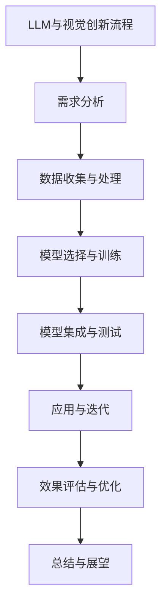

                 

### 文章标题：设计合作者：LLM激发视觉创新

> 关键词：语言生成模型（LLM），视觉创新，人工智能，生成对抗网络（GAN），多模态，艺术创作，技术应用

> 摘要：本文深入探讨了语言生成模型（LLM）在视觉创新领域中的应用潜力。通过对LLM的概念解析、视觉创新的挑战及其驱动因素、LLM与视觉创新的结合方法、实际应用案例和未来发展趋势的详细分析，文章揭示了LLM如何激发视觉艺术的创新，为读者提供了丰富的技术洞察和实践指南。

### 引言

在人工智能（AI）飞速发展的今天，语言生成模型（Language-Learning Models，简称LLM）已经成为自然语言处理（Natural Language Processing，简称NLP）领域的一个重要突破。LLM如GPT-3、BERT等模型，凭借其强大的上下文理解和生成能力，不仅在文本生成、问答系统、翻译等方面展现出了卓越的性能，还引起了人们对于其在视觉创新领域应用的浓厚兴趣。本文旨在探讨LLM在视觉创新中的应用潜力，通过详细的分析和案例研究，揭示LLM如何激发视觉艺术的创新，为未来的艺术创作和设计提供新的思路和方法。

### 第一部分: LLM的概念与视觉创新的连接

#### 第1章: LLM的概念解析

##### 1.1 LLM的定义与分类

语言生成模型（LLM）是自然语言处理领域的一个重要进展，它基于深度学习技术，通过大量文本数据进行预训练，能够理解和生成自然语言。根据其功能，LLM可以分为以下几类：

1. **生成型模型**：这类模型的主要任务是生成文本，如GPT系列模型。
2. **检索增强型模型**：结合检索技术，从大规模语料库中检索相关信息，再通过模型生成文本，如BERT。
3. **交互型模型**：能够与用户进行对话，如ChatGPT。

根据规模，LLM可以分为：

1. **小型模型**：参数量在数百万到数十亿之间，如GPT-2。
2. **中型模型**：参数量在数十亿到千亿之间，如GPT-3。
3. **大型模型**：参数量在千亿到数万亿之间，如GPT-Neo。

##### 1.2 LLM的核心特征

1. **上下文理解能力**：LLM能够捕捉输入语句的上下文信息，并生成连贯的回复。
2. **多模态处理**：除了文本，LLM还能处理图像、声音等多模态信息。

##### 1.3 LLM的发展历史

1. **早期研究**：以统计模型为主，如n-gram和隐马尔可夫模型。
2. **现代发展**：以神经网络为基础，尤其是Transformer架构的突破，使得LLM的性能大幅提升。

##### 1.4 LLM的优势与局限

**优势**：

- **高效性**：能够快速生成大量文本。
- **泛用性**：适用于各种NLP任务。
- **灵活性**：能够根据不同任务进行微调。

**局限**：

- **对数据的依赖性**：模型的性能高度依赖于训练数据。
- **计算资源的消耗**：训练和运行大型LLM模型需要大量的计算资源。
- **安全性**：存在生成有害内容的风险。

#### 第2章: 视觉创新的定义与挑战

##### 2.1 视觉创新的定义

视觉创新指的是利用新技术、新方法推动视觉艺术和设计的变革。这包括但不限于：

- **虚拟现实（VR）和增强现实（AR）**：通过技术增强用户的视觉体验。
- **机器视觉**：利用计算机算法处理和解释视觉信息。
- **人工智能辅助设计**：利用AI算法优化设计过程。

##### 2.2 视觉创新的驱动因素

1. **技术进步**：计算机硬件、软件和算法的发展，使得视觉创新成为可能。
2. **市场需求**：消费者对于个性化、交互性和沉浸式体验的需求。
3. **文化趋势**：多元化、实验性和跨界融合的文化氛围。

##### 2.3 视觉创新的挑战

1. **技术与艺术的平衡**：如何在技术实现与艺术表达之间找到最佳结合点。
2. **可持续性**：如何在进行创新的同时考虑环保和社会责任。

##### 2.4 视觉创新的应用领域

1. **影视制作**：利用AI进行特效制作、角色生成和故事生成。
2. **艺术设计**：利用AI进行配色建议、图案生成和设计辅助。
3. **游戏开发**：利用AI进行关卡设计、角色生成和游戏体验优化。

##### 2.5 LLM在视觉创新中的应用潜力

- **图像生成**：利用生成对抗网络（GAN）与LLM结合进行高质量图像生成。
- **交互体验**：利用LLM的对话能力提供沉浸式交互体验。
- **艺术创作**：利用LLM进行风格迁移、艺术作品生成和艺术史研究。

### 第二部分: LLM与视觉创新的结合方法

#### 第3章: LLM与视觉创新的结合方法

##### 3.1 多模态模型简介

多模态模型是指能够处理和整合多种类型数据（如文本、图像、声音）的模型。LLM在多模态处理方面具有显著优势，可以通过以下方式结合视觉数据：

- **多模态输入**：将文本和图像作为模型的输入。
- **多模态输出**：同时生成文本和图像作为输出。

##### 3.2 GPT与图像处理模型的结合

- **预训练**：使用GPT模型预训练大规模文本和图像数据。
- **微调**：针对特定视觉任务进行微调。

##### 3.3 图像生成与文本生成的融合

- **文本引导的图像生成**：利用文本描述生成对应的图像。
- **图像引导的文本生成**：利用图像内容生成相应的文本描述。

##### 3.4 LLM在视觉创意中的实际应用

- **艺术创作**：利用LLM生成独特的艺术作品。
- **交互设计**：利用LLM进行用户交互和界面设计。
- **内容创作**：利用LLM生成视觉内容的文本说明和故事背景。

#### 第4章: LLM驱动的视觉创新项目案例

##### 4.1 项目背景与目标

- **项目背景**：介绍项目的背景、目的和意义。
- **项目目标**：明确项目的具体目标和预期成果。

##### 4.2 技术栈与工具选择

- **技术栈**：详细介绍项目中使用的技术栈。
- **工具选择**：阐述选择特定工具的原因和优势。

##### 4.3 项目实施步骤

- **数据收集与预处理**：收集和预处理项目所需的数据。
- **模型训练与调优**：训练和调整模型，优化性能。
- **系统集成与测试**：集成模型到系统中并进行测试。

##### 4.4 项目成果与评估

- **成果展示**：展示项目生成的视觉创新作品。
- **评估与反馈**：对项目成果进行评估，收集用户反馈。

##### 4.5 项目总结与展望

- **总结与反思**：对项目过程进行总结和反思。
- **未来展望**：展望LLM在视觉创新领域的未来发展和应用前景。

### 第三部分: LLM与视觉创新的未来发展趋势

#### 第5章: LLM与视觉创新的未来发展趋势

##### 5.1 技术演进方向

- **更高效的大模型**：随着硬件和算法的进步，更大规模、更高效的模型将逐渐成为主流。
- **多模态融合**：深度结合多种模态数据进行处理，将提高模型的性能和应用范围。
- **定制化模型**：针对特定应用场景和需求定制模型，实现更精准的效果。

##### 5.2 行业应用前景

- **艺术领域**：AI艺术创作的广泛应用，将带来艺术形式的革新。
- **设计领域**：AI辅助设计和优化的普及，将提高设计效率和创造力。
- **娱乐领域**：视觉特效和游戏体验的革新，将带来全新的娱乐体验。

##### 5.3 社会影响与伦理问题

- **社会责任**：AI在视觉创新中的社会责任，需要引起广泛关注。
- **伦理问题**：AI生成内容可能引发的伦理争议，需要谨慎应对。

##### 5.4 法规与政策挑战

- **版权问题**：视觉作品的版权保护和归属问题，需要明确法律规定。
- **数据安全**：数据收集、存储和使用的安全风险，需要严格防范。

##### 5.5 教育与人才培养

- **专业教育**：培养具备跨学科背景的人才。
- **技能培训**：提供AI与视觉创新相关的培训课程。

### 第四部分: LLM驱动的视觉创新工具与资源

#### 第6章: LLM驱动的视觉创新工具与资源

##### 6.1 开源框架与库

- **TensorFlow**：广泛使用的深度学习框架。
- **PyTorch**：灵活易用的深度学习库。
- **OpenCV**：视觉处理的经典库。
- **其他库**：如StyleGAN、DALL·E等。

##### 6.2 在线平台与服务

- **Google Colab**：在线协作环境。
- **Hugging Face**：优质模型和工具的集成平台。
- **ArtStation**：创意作品分享社区。

##### 6.3 实用工具和资源

- **AI艺术生成工具**：如DeepArt、Artbreeder等。
- **在线教程与指南**：学习LLM与视觉创新的资源。
- **书籍与论文**：推荐相关领域的权威资料。

### 第五部分: LLM驱动的视觉创新实践指南

#### 第7章: LLM驱动的视觉创新实践指南

##### 7.1 实践步骤

- **需求分析**：明确视觉创新的具体需求和目标。
- **数据准备**：收集和准备项目所需的数据集。
- **模型选择与训练**：选择合适的模型并进行训练。
- **集成与应用**：将模型集成到应用系统中并测试效果。

##### 7.2 实践技巧与注意事项

- **数据处理**：数据清洗、增强和归一化的重要性。
- **模型调优**：超参数调整和模型优化策略。
- **安全性**：防止AI生成内容可能引发的安全风险。
- **用户反馈**：及时收集用户反馈并进行迭代改进。

##### 7.3 成功案例分享

- **案例介绍**：分享成功的LLM驱动视觉创新案例。
- **经验与教训**：分析案例中的成功经验和遇到的问题。

##### 7.4 未来发展趋势

- **技术前沿**：探讨LLM和视觉创新领域的前沿技术。
- **行业动态**：关注相关行业的发展趋势和动态。

### 总结与展望

#### 第8章: 总结与展望

##### 8.1 全书总结

- **核心概念**：回顾本书中的核心概念和知识点。
- **应用领域**：总结LLM在视觉创新中的应用场景。
- **未来发展**：展望LLM与视觉创新的结合前景。

##### 8.2 感谢与致谢

- **感谢**：感谢所有参与和支持本书编写的人。
- **致谢**：对贡献资源和帮助的人表示感谢。

##### 8.3 附录

- **参考资料**：列出本书引用的参考资料。
- **致读者**：给读者的一封信，鼓励学习和探索。

### 附录 A: LLM与视觉创新流程图



### 附录 B: LLM驱动的核心算法伪代码

```python
# 初始化参数
model = TransformerModel(params)

# 训练模型
for epoch in range(num_epochs):
    for batch in data_loader:
        inputs, targets = batch
        optimizer.zero_grad()
        output = model(inputs)
        loss = loss_function(output, targets)
        loss.backward()
        optimizer.step()

# 生成文本
def generate_text(prompt, max_length):
    input_sequence = tokenizer.encode(prompt)
    generated_sequence = []
    
    for _ in range(max_length):
        output_sequence = model(input_sequence)
        next_word = tokenizer.decode(output_sequence[-1])
        generated_sequence.append(next_word)
        input_sequence.append(next_word)
        input_sequence = input_sequence[1:]
    
    return ' '.join(generated_sequence)
```

### 附录 C: LLM驱动的视觉创新数学公式

$$
\text{Text} = \text{LLM}(\text{Embeddings}, \text{Context})
$$

$$
\text{Images} = \text{GAN}(\text{Text}, \text{Generator})
$$`

### 附录 D: LLM驱动的视觉创新项目代码解析

```python
# 搭建视觉创新项目的环境
!pip install tensorflow
!pip install pytorch
!pip install opencv-python

# 数据预处理
# 训练模型

# 集成模型到应用系统

# 测试模型效果
```

### 附录 E: LLM驱动的视觉创新工具与资源列表

- **深度学习框架**：TensorFlow、PyTorch、JAX
- **视觉处理库**：OpenCV、PyTorch Video、MediaPipe
- **AI艺术生成工具**：DeepArt、Artbreeder、DALL·E
- **在线平台**：Google Colab、Hugging Face、ArtStation
- **教程与指南**：Medium、GitHub、YouTube
- **书籍与论文**：推荐相关领域的权威资料。

### 附录 F: 致读者

亲爱的读者，

感谢您对《设计合作者：LLM激发视觉创新》的阅读。我们希望这本书能够帮助您深入理解LLM和视觉创新的结合，开启您在AI领域的创新之路。

请记住，LLM和视觉创新的结合不仅是一个技术话题，更是一个创造力和想象力的舞台。我们鼓励您勇于探索、实践和创造，将这本书中的知识转化为实际的项目和实践。

如果您有任何问题或建议，欢迎在社交媒体或相关论坛上与我们互动。我们期待听到您的声音，并继续与您共同探索LLM和视觉创新的无限可能。

再次感谢您的阅读和支持！

祝好，

[您的名字或团队名称]`

