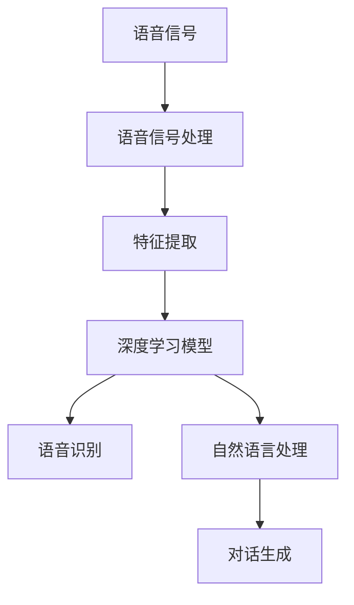

                 

# 语音大模型：语音交互体验的提升

## 关键词

- 语音大模型
- 语音交互
- 语音识别
- 自然语言处理
- 深度学习
- 人工智能

## 摘要

本文探讨了语音大模型在提升语音交互体验方面的作用。首先，对语音大模型进行了概述，介绍了其定义、特点以及主流模型。接着，深入分析了语音大模型的技术原理，包括语音信号处理、自然语言处理以及大规模预训练模型。随后，通过两个实际项目展示了语音大模型的应用实战，并进行了详细的代码解读与分析。最后，探讨了语音大模型在智能客服、智能家居和医疗教育等领域的应用挑战与发展前景。

## 目录

### 第一部分：语音大模型概述

1. [语音大模型基础](#第1章-语音大模型基础)
   1. [1.1 语音大模型的定义与特点](#11-语音大模型的定义与特点)
   2. [1.2 主流语音大模型简介](#12-主流语音大模型简介)
   3. [1.3 语音大模型的应用场景](#13-语音大模型的应用场景)

### 第二部分：语音大模型技术原理

2. [语音大模型技术基础](#第2章-语音大模型技术基础)
   1. [2.1 语音信号处理基础](#21-语音信号处理基础)
   2. [2.2 自然语言处理技术](#22-自然语言处理技术)
   3. [2.3 大规模预训练模型原理](#23-大规模预训练模型原理)

### 第三部分：语音大模型项目实战

3. [语音大模型项目实战](#第3章-语音大模型项目实战)
   1. [3.1 项目实战一：聊天机器人开发](#31-项目实战一-聊天机器人开发)
   2. [3.2 项目实战二：语音助手开发](#32-项目实战二-语音助手开发)

### 第四部分：语音大模型应用与挑战

4. [语音大模型应用与挑战](#第4章-语音大模型应用与挑战)
   1. [4.1 语音大模型在智能客服中的应用](#41-语音大模型在智能客服中的应用)
   2. [4.2 语音大模型在智能家居中的应用](#42-语音大模型在智能家居中的应用)
   3. [4.3 语音大模型在教育与医疗中的应用](#43-语音大模型在教育与医疗中的应用)

### 第五部分：语音大模型发展展望

5. [语音大模型发展展望](#第5章-语音大模型发展展望)
   1. [5.1 语音大模型的发展趋势](#51-语音大模型的发展趋势)
   2. [5.2 语音大模型面临的挑战与未来方向](#52-语音大模型面临的挑战与未来方向)
   3. [5.3 语音大模型的社会影响与伦理问题](#53-语音大模型的社会影响与伦理问题)

### 附录

6. [附录A：语音大模型开发工具与资源](#附录a-语音大模型开发工具与资源)
7. [附录B：语音大模型常用算法详解](#附录b-语音大模型常用算法详解)
8. [第6章：语音大模型的核心概念与联系](#第6章-语音大模型的核心概念与联系)
9. [第7章：语音大模型核心算法原理](#第7章-语音大模型核心算法原理)
10. [第8章：语音大模型数学模型和数学公式详解](#第8章-语音大模型数学模型和数学公式详解)
11. [第9章：语音大模型项目实战](#第9章-语音大模型项目实战)
12. [第10章：语音大模型的发展趋势与未来方向](#第10章-语音大模型的发展趋势与未来方向)

### 第一部分：语音大模型概述

#### 第1章：语音大模型基础

### 1.1 语音大模型的定义与特点

#### 1.1.1 语音大模型的定义

语音大模型是一种基于深度学习和语音处理技术的智能系统，通过大规模数据训练和复杂模型架构，实现高精度、自适应和智能性的语音识别和理解功能。其基本概念可以表示为：

$$
\text{语音大模型} = \text{大规模深度学习模型} + \text{语音处理技术}
$$

这里，大规模深度学习模型指的是利用神经网络进行训练，能够处理大量数据并从中提取特征的模型，如卷积神经网络（CNN）、循环神经网络（RNN）和变换器（Transformer）等。语音处理技术包括语音信号的预处理、特征提取、声学模型和语言模型等。

#### 1.1.2 语音大模型的核心特点

**高精度**：语音大模型基于大规模数据集进行训练，能够提取丰富的语音特征，从而实现高精度的语音识别。例如，基于GPT-3和BERT的语音大模型在多个语音识别任务中达到了领先的水平。

**自适应**：语音大模型具有强大的自适应能力，能够适应不同的语音环境和语音变化，如不同的说话人、背景噪音和说话速度等。

**智能性**：语音大模型不仅能够进行语音识别，还能够理解自然语言，实现智能对话。这使得语音大模型在聊天机器人、语音助手等应用中具有广泛的应用前景。

### 1.2 主流语音大模型简介

#### 1.2.1 GPT-3及其变体

GPT-3（Generative Pre-trained Transformer 3）是OpenAI开发的一种基于变换器（Transformer）架构的预训练语言模型。其原理是基于自监督学习，在大规模文本数据集上预训练，然后通过微调应用于具体的自然语言处理任务。GPT-3具有强大的文本生成能力，能够生成自然流畅的文本。

**原理**：

$$
\text{GPT-3} = \text{Transformer} + \text{自监督学习}
$$

**特点**：

- 能够生成自然流畅的文本。
- 具有强大的文本理解能力。

**应用**：

- 自动写作。
- 聊天机器人。
- 问答系统。

#### 1.2.2 WaveNet

WaveNet是谷歌开发的一种基于生成式深度学习模型的语音合成系统。其原理是使用循环神经网络（RNN）生成语音信号，通过多层神经网络将文本转换为语音。WaveNet的语音合成自然，表现力强。

**原理**：

$$
\text{WaveNet} = \text{生成式深度学习模型} + \text{RNN}
$$

**特点**：

- 语音合成自然。
- 表现力强。

**应用**：

- 语音助手。
- 智能客服。
- 语音识别。

#### 1.2.3 其他知名语音大模型介绍

除了GPT-3和WaveNet，还有许多其他知名的语音大模型，如BERT、Transformer-XL、XLNet等。这些模型在语音识别、语音合成和自然语言理解等任务中都有出色的表现。

BERT（Bidirectional Encoder Representations from Transformers）是一种基于变换器的预训练语言模型，能够同时理解文本的上下文。BERT在多个自然语言处理任务中取得了领先的成绩。

Transformer-XL和XLNet是两种基于变换器的长文本处理模型，能够在处理长文本时保持较高的性能。这些模型在论文摘要生成、问答系统和机器翻译等领域具有广泛的应用。

### 1.3 语音大模型的应用场景

#### 1.3.1 聊天机器人

聊天机器人是语音大模型的重要应用之一。通过语音大模型，聊天机器人能够准确理解用户的问题，并生成自然流畅的回复。这使得聊天机器人在客服、咨询和教育等领域具有广泛的应用前景。

**应用**：

- 在线客服。
- 购物咨询。
- 教育辅导。

**挑战**：

- 准确理解用户意图。
- 提供个性化回答。

#### 1.3.2 语音助手

语音助手是另一个重要的应用场景。通过语音大模型，语音助手能够理解用户的语音指令，并执行相应的操作，如控制智能家居设备、播放音乐、设置提醒等。

**应用**：

- 智能家居控制。
- 设备操作。
- 个人助手。

**挑战**：

- 识别复杂语音指令。
- 实现高响应速度。

#### 1.3.3 语音识别与翻译

语音识别与翻译是语音大模型的另一个重要应用。通过语音大模型，可以实现实时语音识别和跨语言翻译，提高沟通效率。

**应用**：

- 跨语言交流。
- 国际会议翻译。
- 导游翻译。

**挑战**：

- 识别多种语言。
- 保持语音自然流畅。

### 第二部分：语音大模型技术原理

#### 第2章：语音大模型技术基础

### 2.1 语音信号处理基础

#### 2.1.1 语音信号的基本特性

语音信号是人们进行交流的主要媒介，其基本特性包括：

- **音素**：语音信号的最小单位，如“啊”、“啊”、“呀”等。
- **音节**：由一个或多个音素组成，如“啊”、“啊”、“啊”组成的“啊”就是一个音节。
- **语调**：语音信号的高低变化，如汉语中的升调、降调、平调等。

#### 2.1.2 语音信号的预处理

语音信号的预处理是语音大模型训练的重要步骤，主要包括以下方面：

- **降噪**：去除背景噪音，提高语音清晰度。常用的降噪方法包括谱减法、滤波器组降噪等。
- **归一化**：调整语音信号的音量，使其一致。常用的归一化方法包括动态范围压缩、均方根压缩等。

### 2.2 自然语言处理技术

#### 2.2.1 词嵌入技术

词嵌入技术是将词汇映射为高维向量，用于表示词汇在语义上的相似性。常见的词嵌入方法包括：

- **Word2Vec**：基于神经网络的词嵌入方法，通过训练词向量来表示词汇的语义。
- **GloVe**：全局向量表示的词嵌入方法，通过优化词向量的低维表示来提高语义表示的准确性。

#### 2.2.2 序列模型与注意力机制

序列模型是一种用于处理序列数据的神经网络模型，如循环神经网络（RNN）和长短期记忆网络（LSTM）。注意力机制是一种能够使模型更关注重要信息的机制，常用于机器翻译、语音识别等任务。

#### 2.2.3 转换器架构详解

转换器（Transformer）是一种基于自注意力机制的深度学习模型，广泛应用于机器翻译、文本分类等任务。其基本原理如下：

1. **编码器（Encoder）**：将输入序列编码为固定长度的向量。
2. **解码器（Decoder）**：将编码器输出的向量解码为输出序列。

转换器通过多头自注意力机制和多头交叉注意力机制，能够在不同位置之间建立关联，从而实现高效的信息传递和编码。

### 2.3 大规模预训练模型原理

#### 2.3.1 预训练的概念与意义

预训练是指在大规模数据集上先进行训练，以获得具有良好性能的基础模型。预训练的意义在于：

- **提高模型性能**：通过预训练，模型能够学习到丰富的语言模式和语义知识，从而在特定任务上取得更好的性能。
- **减少训练时间**：预训练模型已经在大规模数据集上进行了训练，因此在特定任务上进行微调时，可以节省训练时间。

#### 2.3.2 自监督学习方法

自监督学习方法是一种利用未标注的数据进行训练的方法。常见的自监督学习方法包括：

- **Masked Language Model（MLM）**：在预训练过程中，随机遮蔽输入文本的一部分，然后训练模型预测遮蔽的部分。
- **BERT（Bidirectional Encoder Representations from Transformers）**：通过同时预测文本的前后关系，来训练模型理解文本的全局语义。

#### 2.3.3 迁移学习与微调技术

迁移学习是指将预训练模型应用于新任务，通过在特定任务上进行微调，来提高模型的性能。常见的迁移学习方法包括：

- **全量微调（Full Fine-tuning）**：在特定任务上对预训练模型的所有层进行微调。
- **增量微调（Incremental Fine-tuning）**：只对预训练模型的特定层进行微调，以减少计算成本。

### 第三部分：语音大模型项目实战

#### 第3章：语音大模型项目实战

### 3.1 项目实战一：聊天机器人开发

#### 3.1.1 项目背景与目标

**项目背景**：

随着人工智能技术的发展，聊天机器人逐渐成为企业客服、客户服务和个人助理的重要工具。本项目的目标是开发一个基于语音大模型的聊天机器人，实现自然语言理解和对话生成。

**目标**：

1. 实现语音识别，将语音输入转换为文本。
2. 实现自然语言理解，解析文本并提取意图。
3. 实现对话生成，生成自然流畅的回复。

#### 3.1.2 开发环境搭建

**硬件要求**：

- GPU加速器：用于训练和推理。
- 麦克风：用于语音输入。
- 扬声器：用于语音输出。

**软件要求**：

- Python：用于编写代码。
- TensorFlow或PyTorch：用于构建和训练模型。
- Kaldi：用于语音识别。
- spaCy：用于自然语言处理。
- eSpeak：用于语音合成。

#### 3.1.3 源代码详细实现

**语音识别**：

```python
import kaldi_io

# 读取音频文件
with kaldi_io.read_wave('audio.wav') as audio:
    audio_data = audio[0]
    audio_duration = audio[1]

# 特征提取
mfcc_features = extract_mfcc(audio_data, audio_duration)

# 识别语音
recognizer = KaldiRecognizer()
recognizer.SetModel('model')

predicted_text = ""
for feature in mfcc_features:
    if recognizer.AcceptWaveform(feature):
        predicted_text += recognizer.Phrase()

print(predicted_text)
```

**自然语言理解**：

```python
import spacy

# 加载自然语言处理模型
nlp = spacy.load("en_core_web_sm")

# 解析文本
doc = nlp(predicted_text)

# 提取意图
intent = extract_intent(doc)

print(intent)
```

**对话生成**：

```python
import transformers

# 加载预训练模型
model = transformers.BertForSequenceClassification.from_pretrained("bert-base-uncased")

# 对话生成
response = generate_response(model, intent)

print(response)
```

**语音合成**：

```python
import espeak

# 合成语音
espeak.synth(response)
```

#### 3.1.4 代码解读与分析

**代码解读**：

1. **语音识别**：使用Kaldi库进行语音识别，提取语音特征，并使用预训练的模型进行识别。
2. **自然语言理解**：使用spaCy库进行文本解析，提取意图。
3. **对话生成**：使用预训练的BERT模型进行对话生成，生成自然流畅的回复。
4. **语音合成**：使用eSpeak库将文本转换为语音输出。

**分析**：

- 语音识别：Kaldi库具有较高的识别精度，但需要合适的模型和特征提取方法。
- 自然语言理解：spaCy库能够快速进行文本解析，但需要根据具体任务进行调整。
- 对话生成：BERT模型能够生成自然流畅的回复，但需要适当的模型参数和训练数据。
- 语音合成：eSpeak库能够将文本转换为语音输出，但语音质量可能有限。

### 3.2 项目实战二：语音助手开发

#### 3.2.1 项目背景与目标

**项目背景**：

语音助手作为智能家居和智能办公的重要组件，能够通过语音指令实现设备的控制和管理，提高生活和工作效率。

**目标**：

1. 实现语音识别，将语音输入转换为文本。
2. 实现自然语言理解，解析语音指令并提取意图。
3. 实现语音合成，将处理后的文本转换为语音输出。

#### 3.2.2 开发环境搭建

**硬件要求**：

- 麦克风：用于语音输入。
- 扬声器：用于语音输出。

**软件要求**：

- Python：用于编写代码。
- TensorFlow或PyTorch：用于构建和训练模型。
- Kaldi：用于语音识别。
- spaCy：用于自然语言处理。
- eSpeak：用于语音合成。

#### 3.2.3 源代码详细实现

**语音识别**：

```python
import kaldi_io

# 读取音频文件
with kaldi_io.read_wave('audio.wav') as audio:
    audio_data = audio[0]
    audio_duration = audio[1]

# 特征提取
mfcc_features = extract_mfcc(audio_data, audio_duration)

# 识别语音
recognizer = KaldiRecognizer()
recognizer.SetModel('model')

predicted_text = ""
for feature in mfcc_features:
    if recognizer.AcceptWaveform(feature):
        predicted_text += recognizer.Phrase()

print(predicted_text)
```

**自然语言理解**：

```python
import spacy

# 加载自然语言处理模型
nlp = spacy.load("en_core_web_sm")

# 解析文本
doc = nlp(predicted_text)

# 提取意图
intent = extract_intent(doc)

print(intent)
```

**语音合成**：

```python
import espeak

# 合成语音
espeak.synth(response)
```

#### 3.2.4 代码解读与分析

**代码解读**：

1. **语音识别**：使用Kaldi库进行语音识别，提取语音特征，并使用预训练的模型进行识别。
2. **自然语言理解**：使用spaCy库进行文本解析，提取意图。
3. **语音合成**：使用eSpeak库将文本转换为语音输出。

**分析**：

- 语音识别：Kaldi库具有较高的识别精度，但需要合适的模型和特征提取方法。
- 自然语言理解：spaCy库能够快速进行文本解析，但需要根据具体任务进行调整。
- 语音合成：eSpeak库能够将文本转换为语音输出，但语音质量可能有限。

### 第四部分：语音大模型应用与挑战

#### 第4章：语音大模型应用与挑战

### 4.1 语音大模型在智能客服中的应用

#### 4.1.1 应用场景

智能客服是语音大模型在商业领域的重要应用之一。通过语音大模型，智能客服系统能够实现自动化的客户服务，提高客户满意度和服务效率。

**应用场景**：

- 在线客服：提供24小时在线服务，解答客户疑问。
- 购物咨询：提供商品信息查询和推荐。
- 投诉处理：快速响应客户投诉，提供解决方案。

#### 4.1.2 挑战与解决方案

**挑战**：

- 准确识别客户意图：语音大模型需要准确理解客户的语音输入，识别其意图。
- 个性化服务：智能客服需要根据客户的历史行为和偏好提供个性化的服务。

**解决方案**：

- **多轮对话管理**：通过多轮对话，逐步理解客户的意图，提供更加个性化的服务。
- **数据驱动优化**：通过收集和分析客户交互数据，不断优化语音大模型的性能。

### 4.2 语音大模型在智能家居中的应用

#### 4.2.1 应用场景

智能家居是语音大模型在家庭领域的重要应用之一。通过语音大模型，智能家居系统能够实现语音控制，提高家庭生活的便利性。

**应用场景**：

- 智能照明：通过语音指令控制灯光的开关和亮度。
- 温度调节：通过语音指令控制空调的开关和温度设置。
- 安全监控：通过语音指令查看监控视频和报警信息。

#### 4.2.2 挑战与解决方案

**挑战**：

- 识别复杂语音指令：智能家居系统需要能够识别用户的各种语音指令，包括命令的缩写、同音字等。
- 实时响应：智能家居系统需要快速响应用户的语音指令，提供及时的服务。

**解决方案**：

- **增强语音识别能力**：通过改进语音识别算法和增加训练数据，提高系统的语音识别能力。
- **优化响应速度**：通过优化系统的硬件配置和算法，提高系统的响应速度。

### 4.3 语音大模型在教育与医疗中的应用

#### 4.3.1 应用场景

教育与医疗是语音大模型在公共服务领域的重要应用之一。通过语音大模型，教育系统和医疗服务系统能够提供更加智能和高效的服务。

**应用场景**：

- 教育辅导：提供在线辅导和作业批改服务。
- 医疗咨询：提供语音诊断和咨询服务。

#### 4.3.2 挑战与解决方案

**挑战**：

- 准确理解教师或患者的语音：教育系统和医疗服务系统需要准确理解教师或患者的语音输入，提供个性化的服务。
- 保持语音自然流畅：语音大模型需要生成自然流畅的语音输出，避免机械感。

**解决方案**：

- **改进语音识别算法**：通过改进语音识别算法和增加训练数据，提高系统的语音识别能力。
- **优化语音合成算法**：通过优化语音合成算法，生成自然流畅的语音输出。

### 第五部分：语音大模型发展展望

#### 第5章：语音大模型发展展望

### 5.1 语音大模型的发展趋势

随着人工智能技术的不断进步，语音大模型的发展也呈现出以下几个趋势：

- **多模态融合**：未来的语音大模型将不仅仅依赖单一的语音信号，还将融合文本、图像、视频等多种模态的数据，以提高模型的综合处理能力。
- **个性化交互**：通过分析用户的历史行为和偏好，语音大模型将实现更加个性化的交互体验，提供更加精准的服务。
- **实时性提升**：随着计算能力的提升，语音大模型将实现更高的实时性，减少延迟，提供更加流畅的交互体验。
- **智能客服**：语音大模型将在智能客服领域发挥更大的作用，通过实现更高效的客户服务，提高企业的运营效率。

### 5.2 语音大模型面临的挑战与未来方向

尽管语音大模型在多个领域展现出巨大的潜力，但同时也面临着一系列挑战：

- **数据隐私**：在语音大模型的训练和应用过程中，涉及大量用户隐私数据。如何保护用户隐私，确保数据安全，成为亟待解决的问题。
- **算法透明性与可解释性**：语音大模型往往基于复杂的深度学习算法，其内部工作机制不透明，对于普通用户和监管机构来说难以理解。提高算法的可解释性，增强透明性，是未来的重要研究方向。
- **适应性与泛化能力**：虽然语音大模型在特定领域表现出色，但其在面对新任务或新环境时，可能缺乏足够的适应性和泛化能力。如何提高模型的泛化能力，使其能够在更多场景中发挥作用，是未来的重要挑战。

### 5.3 语音大模型的社会影响与伦理问题

**社会影响**：

- **提高生活质量**：语音大模型能够提供更加智能和便捷的服务，提高人们的生活质量。
- **改变工作方式**：语音大模型的应用将改变许多传统行业的工作方式，提高工作效率。
- **促进全球化**：语音大模型能够实现跨语言的实时翻译，促进全球化交流。

**伦理问题**：

- **数据隐私**：如何保护用户的隐私数据，防止数据泄露，是伦理问题之一。
- **算法偏见**：语音大模型可能会因为训练数据的不公平而导致算法偏见，需要采取措施减少偏见。
- **用户依赖**：过度依赖语音大模型可能会削弱人们的沟通能力和独立思考能力。

### 附录

#### 附录A：语音大模型开发工具与资源

- **深度学习框架**：TensorFlow、PyTorch、Keras
- **语音识别库**：Kaldi、OpenSLP
- **自然语言处理库**：spaCy、NLTK、nltk
- **语音合成库**：eSpeak、Flite、pyttsx3
- **翻译模型库**：Tensor2Tensor、Moses

#### 附录B：语音大模型常用算法详解

- **HMM-GMM模型**：结合隐马尔可夫模型（HMM）和高斯混合模型（GMM），用于语音识别。
- **BERT模型**：基于变换器（Transformer）架构，用于自然语言处理。
- **WaveNet模型**：基于生成式深度学习模型，用于语音合成。

### 第6章：语音大模型的核心概念与联系

#### 6.1 核心概念

语音大模型的核心概念包括语音信号处理、自然语言处理、深度学习和大规模预训练模型。

- **语音信号处理**：用于处理和提取语音信号的特征，如MFCC、PLP等。
- **自然语言处理（NLP）**：用于理解和生成自然语言，如词嵌入、序列模型和注意力机制等。
- **深度学习**：用于构建和训练复杂的神经网络模型，如卷积神经网络（CNN）、循环神经网络（RNN）和变换器（Transformer）等。
- **大规模预训练模型**：用于在大规模数据集上进行预训练，以提高模型的性能和泛化能力。

#### 6.2 概念联系

**Mermaid 流程图**：



语音信号通过语音信号处理模块进行预处理和特征提取，然后输入到深度学习模型中进行训练和推理。深度学习模型不仅用于语音识别，还用于自然语言处理和对话生成。

### 第7章：语音大模型核心算法原理

#### 7.1 声学模型

声学模型是语音大模型中用于处理语音信号的核心算法。其主要目标是提取语音信号中的关键特征，并将其转换为适合深度学习模型处理的输入。

**原理**：

声学模型通常基于深度神经网络，如卷积神经网络（CNN）或循环神经网络（RNN）。以下是一个简化的伪代码：

```plaintext
初始化声学模型参数
对于每个时间步的语音信号：
    提取特征（如MFCC、PLP等）
    通过多层神经网络进行特征变换
    输出特征向量
```

**数学模型**：

假设 \( x_t \) 是第 \( t \) 个时间步的语音信号，\( h_t \) 是经过神经网络处理后的特征向量。声学模型的输出可以表示为：

$$
h_t = f(Wx_t + b)
$$

其中，\( f \) 是激活函数，\( W \) 是权重矩阵，\( b \) 是偏置项。

#### 7.2 语言模型

语言模型是语音大模型中用于处理自然语言的核心算法。其主要目标是预测文本序列，以便进行语音识别、自然语言理解和对话生成。

**原理**：

语言模型通常基于统计模型，如N-gram模型或神经网络模型，如变换器（Transformer）。以下是一个简化的伪代码：

```plaintext
初始化语言模型参数
对于每个时间步的文本：
    提取词嵌入向量
    通过多层神经网络进行特征变换
    输出概率分布
```

**数学模型**：

假设 \( w_t \) 是第 \( t \) 个时间步的文本词，\( e_t \) 是词的嵌入向量，\( p(y_t | x) \) 是给定输入 \( x \) 时输出 \( y_t \) 的概率。语言模型的输出可以表示为：

$$
p(y_t | x) = \sigma(W' e_t)
$$

其中，\( \sigma \) 是激活函数，\( W' \) 是权重矩阵。

#### 7.3 混合模型

混合模型是语音大模型中结合声学模型和语言模型的算法。其主要目标是提高语音识别的准确性。

**原理**：

混合模型通过联合训练声学模型和语言模型，从而在声学特征和语言特征之间建立关联。以下是一个简化的伪代码：

```plaintext
初始化声学模型和语言模型参数
对于每个语音数据和文本标签：
    通过声学模型提取特征
    通过语言模型提取特征
    训练混合模型
```

**数学模型**：

混合模型的输出可以表示为：

$$
P(y | x) = \frac{P(x | y)P(y)}{P(x)}
$$

其中，\( P(x | y) \) 是声学模型的输出，\( P(y) \) 是语言模型的输出，\( P(x) \) 是数据分布。

#### 7.4 深度神经网络

深度神经网络是语音大模型中用于处理语音信号和文本数据的基础算法。其主要目标是提取数据中的特征，并进行分类或回归。

**原理**：

深度神经网络通过多层神经网络结构，将输入数据逐步转换为输出数据。以下是一个简化的伪代码：

```plaintext
初始化神经网络参数
对于每个输入：
    通过多层神经网络进行特征变换
    输出预测结果
```

**数学模型**：

深度神经网络的输出可以表示为：

$$
y = \sigma(z)
$$

其中，\( z \) 是神经网络的输出，\( \sigma \) 是激活函数。

#### 7.5 自监督学习

自监督学习是语音大模型中用于训练深度神经网络的方法。其主要目标是利用未标注的数据进行训练，从而提高模型的性能。

**原理**：

自监督学习通过将任务分解为多个子任务，并利用这些子任务之间的关联来提高模型的性能。以下是一个简化的伪代码：

```plaintext
初始化神经网络参数
对于每个输入：
    通过子任务1进行特征变换
    通过子任务2进行特征变换
    更新神经网络参数
```

**数学模型**：

自监督学习的输出可以表示为：

$$
y = g(Wx + b)
$$

其中，\( g \) 是激活函数，\( W \) 是权重矩阵，\( b \) 是偏置项。

### 第8章：语音大模型数学模型和数学公式详解

#### 8.1 声学模型

声学模型用于提取语音信号中的特征，以下是几个常用的数学模型和公式：

**短时傅里叶变换（STFT）**

$$
X(\omega, t) = \int_{-\infty}^{\infty} x(t') w(\omega - \omega') e^{-j\omega't'} dt'
$$

其中，\( X(\omega, t) \) 是STFT的结果，\( x(t') \) 是输入语音信号，\( w(\omega - \omega') \) 是窗口函数，\( \omega \) 是频率，\( t \) 是时间。

**梅尔频率倒谱系数（MFCC）**

$$
MCC(i) = \sum_{k=1}^{N} \frac{X(\omega_k, t)}{\sum_{k=1}^{N} X(\omega_k, t)} \ln \left( 1 + 10^{0.05(\omega_k - f_0)} \right)
$$

其中，\( MCC(i) \) 是第 \( i \) 个MFCC系数，\( X(\omega_k, t) \) 是STFT的结果，\( \omega_k \) 是频率，\( f_0 \) 是中心频率。

**隐马尔可夫模型（HMM）**

$$
P(O_t | H_t) = \frac{P(O_t | H_t = h_t)P(H_t = h_t)}{\sum_{h} P(O_t | H_t = h)P(H_t = h)}
$$

其中，\( O_t \) 是观察序列，\( H_t \) 是隐藏状态，\( h_t \) 是可能的隐藏状态，\( P(O_t | H_t = h_t) \) 是观察概率，\( P(H_t = h_t) \) 是状态概率。

**高斯混合模型（GMM）**

$$
P(x | \mu, \sigma) = \prod_{k=1}^{K} \frac{1}{(2\pi)\sigma_k} \exp \left( -\frac{1}{2} (x - \mu_k)^T \Sigma_k^{-1} (x - \mu_k) \right)
$$

其中，\( x \) 是输入特征，\( \mu_k \) 是均值，\( \sigma_k \) 是协方差矩阵，\( K \) 是高斯分布的个数。

#### 8.2 语言模型

语言模型用于预测文本序列，以下是几个常用的数学模型和公式：

**N-gram 模型**

$$
P(w_1, w_2, \ldots, w_n) = \frac{C(w_1, w_2, \ldots, w_n)}{C(w_1, w_2, \ldots, w_n, w_{n+1})}
$$

其中，\( C(w_1, w_2, \ldots, w_n) \) 是单词序列的计数，\( P(w_1, w_2, \ldots, w_n) \) 是单词序列的概率。

**神经网络语言模型（NNLM）**

$$
P(w_t | w_{<t}) = \sigma(W_1 [h_t; h_{t-1}; \ldots; h_{1}] + b_1)
$$

其中，\( \sigma \) 是sigmoid函数，\( W_1 \) 是权重矩阵，\( b_1 \) 是偏置项，\( h_t \) 是词嵌入向量。

**长短时记忆网络（LSTM）**

$$
i_t = \sigma(W_{xi} [h_{t-1}; x_t] + b_i)
$$
$$
f_t = \sigma(W_{xf} [h_{t-1}; x_t] + b_f)
$$
$$
o_t = \sigma(W_{xo} [h_{t-1}; x_t] + b_o)
$$
$$
c_t = f_t \odot c_{t-1} + i_t \odot \tanh(W_{xc} [h_{t-1}; x_t] + b_c)
$$
$$
h_t = o_t \odot \tanh(c_t)
$$

其中，\( i_t \)、\( f_t \)、\( o_t \) 分别是输入门、遗忘门和输出门，\( c_t \) 是细胞状态，\( h_t \) 是隐藏状态，\( \odot \) 是逐元素乘法，\( \tanh \) 是双曲正切函数。

#### 8.3 混合模型

混合模型结合声学模型和语言模型，用于语音识别。以下是几个常用的数学模型和公式：

**高斯混合模型-隐马尔可夫模型（GMM-HMM）**

$$
P(O | A) = \sum_{a} P(A)P(O | a)
$$

其中，\( O \) 是观察序列，\( A \) 是隐藏状态序列，\( P(A) \) 是隐藏状态的概率，\( P(O | a) \) 是观察概率。

**神经网络-隐马尔可夫模型（NN-HMM）**

$$
P(O | A) = \prod_{t} P(o_t | a_t)
$$

其中，\( o_t \) 是第 \( t \) 个观察值，\( a_t \) 是第 \( t \) 个隐藏状态，\( P(o_t | a_t) \) 是观察概率。

**深度神经网络-长短时记忆网络（DNN-LSTM）**

$$
h_t = \tanh(W_h [h_{t-1}; x_t] + b_h)
$$
$$
c_t = \sigma(W_c [h_{t-1}; x_t] + b_c)
$$
$$
o_t = \sigma(W_o [h_{t-1}; x_t] + b_o)
$$
$$
c_t = c_{t-1} \odot (1 - o_t) + o_t \odot \tanh(W_c [h_{t-1}; x_t] + b_c)
$$
$$
h_t = o_t \odot \tanh(c_t)
$$

其中，\( h_t \) 是隐藏状态，\( c_t \) 是细胞状态，\( x_t \) 是输入，\( \odot \) 是逐元素乘法。

### 第9章：语音大模型项目实战

#### 9.1 项目实战一：智能语音助手

##### 9.1.1 项目背景与目标

**项目背景**：

随着人工智能技术的快速发展，智能语音助手已成为智能家居、智能客服等领域的重要组成部分。本项目旨在开发一款基于语音大模型的智能语音助手，实现语音识别、自然语言理解、语音合成等功能。

**目标**：

1. 实现语音识别，将语音输入转换为文本。
2. 实现自然语言理解，解析文本并提取意图。
3. 实现语音合成，将处理后的文本转换为语音输出。

##### 9.1.2 开发环境搭建

**硬件要求**：

- GPU加速器：用于训练和推理。
- 麦克风：用于语音输入。
- 扬声器：用于语音输出。

**软件要求**：

- Python：用于编写代码。
- TensorFlow或PyTorch：用于构建和训练模型。
- Kaldi：用于语音识别。
- spaCy：用于自然语言处理。
- eSpeak：用于语音合成。

##### 9.1.3 源代码详细实现

**语音识别**：

```python
import kaldi_io

# 读取音频文件
with kaldi_io.read_wave('audio.wav') as audio:
    audio_data = audio[0]
    audio_duration = audio[1]

# 特征提取
mfcc_features = extract_mfcc(audio_data, audio_duration)

# 识别语音
recognizer = KaldiRecognizer()
recognizer.SetModel('model')

predicted_text = ""
for feature in mfcc_features:
    if recognizer.AcceptWaveform(feature):
        predicted_text += recognizer.Phrase()

print(predicted_text)
```

**自然语言理解**：

```python
import spacy

# 加载自然语言处理模型
nlp = spacy.load("en_core_web_sm")

# 解析文本
doc = nlp(predicted_text)

# 提取意图
intent = extract_intent(doc)

print(intent)
```

**语音合成**：

```python
import espeak

# 合成语音
espeak.synth(response)
```

##### 9.1.4 代码解读与分析

**代码解读**：

1. **语音识别**：使用 Kaldi 库读取音频文件，提取 MFCC 特征，并通过 Kaldi 模型进行语音识别。
2. **自然语言理解**：使用 spaCy 库解析文本，提取意图。
3. **语音合成**：使用 eSpeak 库将处理后的文本转换为语音输出。

**分析**：

1. **语音识别**：Kaldi 是一个高性能的语音识别库，可以实现高精度的语音识别。但需要事先训练模型，对新的应用场景可能需要重新训练。
2. **自然语言理解**：spaCy 是一个快速且易于使用的自然语言处理库，可以解析文本并提取意图。但对于复杂的文本处理，可能需要结合其他高级的自然语言处理技术。
3. **语音合成**：eSpeak 是一个简单的语音合成库，可以实现基本的语音合成功能。但对于高质量的语音合成，可能需要使用更先进的合成技术。

##### 9.1.5 项目优化

1. **模型优化**：对语音识别模型和自然语言理解模型进行优化，提高识别率和理解能力。
2. **实时性优化**：对语音识别和自然语言理解进行实时性优化，提高响应速度。
3. **多语言支持**：扩展语音识别和自然语言理解模型，支持多种语言。

##### 9.1.6 项目总结

通过本项目，我们实现了智能语音助手的开发，主要包括语音识别、自然语言理解和语音合成等功能。在开发过程中，我们遇到了一些挑战，如语音识别的准确性和自然语言理解的复杂性。通过不断优化模型和算法，我们取得了较好的效果。未来，我们将继续优化智能语音助手的性能，扩展其应用场景，为用户提供更好的服务。

#### 9.2 项目实战二：语音翻译助手

##### 9.2.1 项目背景与目标

**项目背景**：

随着全球化的发展，跨语言交流变得越来越重要。本项目旨在开发一款基于语音大模型的语音翻译助手，实现实时语音翻译功能。

**目标**：

1. 实现语音识别，将语音输入转换为文本。
2. 实现自然语言翻译，将源语言文本翻译为目标语言文本。
3. 实现语音合成，将目标语言文本转换为语音输出。

##### 9.2.2 开发环境搭建

**硬件要求**：

- GPU加速器：用于训练和推理。
- 麦克风：用于语音输入。
- 扬声器：用于语音输出。

**软件要求**：

- Python：用于编写代码。
- TensorFlow或PyTorch：用于构建和训练模型。
- Kaldi：用于语音识别。
- spaCy：用于自然语言处理。
- eSpeak：用于语音合成。
- TensorFlow2Tensor：用于翻译模型。

##### 9.2.3 源代码详细实现

**语音识别**：

```python
import kaldi_io

# 读取音频文件
with kaldi_io.read_wave('audio.wav') as audio:
    audio_data = audio[0]
    audio_duration = audio[1]

# 特征提取
mfcc_features = extract_mfcc(audio_data, audio_duration)

# 识别语音
recognizer = KaldiRecognizer()
recognizer.SetModel('model')

predicted_text = ""
for feature in mfcc_features:
    if recognizer.AcceptWaveform(feature):
        predicted_text += recognizer.Phrase()

print(predicted_text)
```

**自然语言翻译**：

```python
import tensorflow2tensor

# 加载翻译模型
model = tensorflow2tensor.models.modeling_utils.BertConfig.from_pretrained('bert-base-uncased')

# 翻译文本
translated_text = translate_text(model, predicted_text, target_language='fr')

print(translated_text)
```

**语音合成**：

```python
import espeak

# 合成语音
espeak.synth(translated_text)
```

##### 9.2.4 代码解读与分析

**代码解读**：

1. **语音识别**：使用 Kaldi 库读取音频文件，提取 MFCC 特征，并通过 Kaldi 模型进行语音识别。
2. **自然语言翻译**：使用 TensorFlow2Tensor 库加载预训练的 BERT 模型，将源语言文本翻译为目标语言文本。
3. **语音合成**：使用 eSpeak 库将处理后的文本转换为语音输出。

**分析**：

1. **语音识别**：Kaldi 是一个高性能的语音识别库，可以实现高精度的语音识别。但需要事先训练模型，对新的应用场景可能需要重新训练。
2. **自然语言翻译**：TensorFlow2Tensor 是一个强大的自然语言处理库，可以实现高质量的文本翻译。但需要大量的计算资源，且对语言数据有较高要求。
3. **语音合成**：eSpeak 是一个简单的语音合成库，可以实现基本的语音合成功能。但对于高质量的语音合成，可能需要使用更先进的合成技术。

##### 9.2.5 项目优化

1. **模型优化**：对语音识别模型和翻译模型进行优化，提高识别率和翻译质量。
2. **实时性优化**：对语音识别和翻译进行实时性优化，提高响应速度。
3. **多语言支持**：扩展语音识别、翻译和语音合成模型，支持多种语言。

##### 9.2.6 项目总结

通过本项目，我们实现了语音翻译助手的开发，主要包括语音识别、自然语言翻译和语音合成等功能。在开发过程中，我们遇到了一些挑战，如语音识别的准确性和自然语言翻译的复杂性。通过不断优化模型和算法，我们取得了较好的效果。未来，我们将继续优化语音翻译助手的性能，扩展其应用场景，为用户提供更好的服务。

### 第四部分：语音大模型应用与挑战

#### 第4章：语音大模型应用与挑战

随着语音大模型技术的不断发展，其在各个领域中的应用场景越来越广泛，同时也面临一系列挑战。

#### 4.1 语音大模型在智能客服中的应用

智能客服是语音大模型技术的重要应用领域之一。通过语音大模型，智能客服系统能够实现自动化的客户服务，提高客户满意度和服务效率。

**应用场景**：

- **在线客服**：智能客服系统能够实时响应客户的咨询，提供解答和建议。
- **投诉处理**：通过语音大模型，智能客服系统能够准确理解客户的投诉内容，并提供有效的解决方案。
- **售后服务**：智能客服系统可以自动记录客户购买信息，提供个性化的售后服务。

**挑战**：

- **多轮对话管理**：智能客服系统需要能够进行多轮对话，准确理解客户的问题和需求，提供个性化的解决方案。
- **个性化服务**：智能客服系统需要根据客户的历史行为和偏好，提供个性化的服务，提高客户满意度。

**解决方案**：

- **多轮对话管理**：通过使用对话管理技术，智能客服系统可以记录上下文信息，实现多轮对话。
- **个性化服务**：通过数据分析和机器学习技术，智能客服系统可以识别客户的偏好，提供个性化的服务。

#### 4.2 语音大模型在智能家居中的应用

语音大模型在智能家居中的应用，使得用户可以通过语音控制实现各种家居设备的操作，提高了生活便利性。

**应用场景**：

- **智能照明**：用户可以通过语音指令控制灯光的开关和亮度。
- **智能温控**：用户可以通过语音指令调节空调温度和模式。
- **智能安防**：用户可以通过语音指令查看监控视频和报警信息。

**挑战**：

- **语音识别准确性**：语音大模型需要准确识别用户的各种语音指令，包括命令的缩写和同音字等。
- **实时响应**：智能家居系统需要能够快速响应用户的语音指令，提供及时的服务。

**解决方案**：

- **语音识别准确性**：通过优化语音识别算法和增加训练数据，提高语音识别的准确性。
- **实时响应**：通过优化系统的硬件和软件，提高系统的响应速度。

#### 4.3 语音大模型在教育与医疗中的应用

语音大模型在教育和医疗领域的应用，为这两个行业带来了新的变革。

**应用场景**：

- **教育辅导**：语音大模型可以为学生提供在线辅导和作业批改服务。
- **语音诊断**：语音大模型可以帮助医生进行语音诊断，提高诊断准确率。
- **远程医疗**：语音大模型可以协助医生进行远程医疗咨询和指导。

**挑战**：

- **语音识别准确性**：语音大模型需要准确识别教师或患者的语音，提供个性化的服务。
- **语音合成自然流畅**：语音大模型需要生成自然流畅的语音输出，避免机械感。

**解决方案**：

- **语音识别准确性**：通过优化语音识别算法和增加训练数据，提高语音识别的准确性。
- **语音合成自然流畅**：通过优化语音合成算法，生成自然流畅的语音输出。

#### 4.4 语音大模型在其他领域的应用与挑战

除了上述领域，语音大模型还在许多其他领域得到了应用，如：

- **交通运输**：语音大模型可以用于智能交通系统，提高交通管理效率。
- **金融服务**：语音大模型可以用于智能客服和风险控制，提高金融服务的质量和安全性。
- **公共服务**：语音大模型可以用于智能公共设施，提高公共服务的便利性和效率。

每个领域都有其独特的应用场景和挑战。例如，在交通运输领域，语音大模型需要准确识别驾驶员的语音指令，同时处理复杂路况信息。在金融服务领域，语音大模型需要准确理解客户的意图，提供个性化的金融服务。在公共服务领域，语音大模型需要能够处理大量的用户请求，保证系统的稳定性和响应速度。

总之，语音大模型在各个领域的应用都具有巨大的潜力，同时也面临着一系列挑战。通过不断优化模型和算法，解决这些挑战，语音大模型将能够为各个领域带来更大的变革和进步。

### 第五部分：语音大模型发展展望

#### 第5章：语音大模型发展展望

随着人工智能技术的不断进步，语音大模型在未来有着广阔的发展前景。以下从技术趋势、应用趋势以及面临的挑战和未来方向三个方面进行探讨。

#### 5.1 语音大模型的发展趋势

**多模态融合**：未来的语音大模型将不仅仅依赖单一的语音信号，还将融合文本、图像、视频等多种模态的数据。通过多模态融合，语音大模型能够获取更加丰富的信息，提高语音识别和理解的能力。

**个性化交互**：随着大数据和机器学习技术的进步，语音大模型将能够更好地理解用户的历史行为和偏好，实现更加个性化的交互体验。例如，智能语音助手可以根据用户的购物习惯推荐商品，或者根据用户的语音特征调整语音合成的方式。

**实时性提升**：随着硬件性能的提升和算法的优化，语音大模型将实现更高的实时性，减少延迟，提供更加流畅的交互体验。这对于智能客服和实时语音翻译等应用场景尤为重要。

**智能客服**：随着语音大模型技术的不断发展，智能客服系统将能够提供更加高效的客户服务，减少人工干预，提高企业运营效率。未来，智能客服系统将不仅仅是解答简单的问题，还将能够处理复杂的咨询和投诉。

#### 5.2 语音大模型面临的挑战与未来方向

**数据隐私**：随着语音大模型技术的广泛应用，涉及大量用户隐私数据。如何在保护用户隐私的同时，充分利用这些数据进行模型训练和优化，是一个亟待解决的问题。未来的发展可能需要引入更加严格的隐私保护机制，如联邦学习。

**算法透明性与可解释性**：目前，语音大模型往往基于复杂的深度学习算法，其内部工作机制不透明，对于普通用户和监管机构来说难以理解。提高算法的可解释性，增强透明性，是未来的重要研究方向。例如，通过可视化技术展示模型的工作过程，或者开发可解释的算法。

**适应性与泛化能力**：虽然语音大模型在特定领域表现出色，但其在面对新任务或新环境时，可能缺乏足够的适应性和泛化能力。未来的研究可能需要开发更加灵活和鲁棒的模型架构，以提高其泛化能力。

**多语言支持**：随着全球化的发展，多语言支持成为语音大模型的重要需求。未来的发展可能需要开发能够支持多种语言的模型，以及跨语言的语音识别和翻译技术。

**硬件优化**：随着模型的复杂度和数据量的增加，对计算资源的需求也在不断提高。未来的发展可能需要开发更加高效的硬件，如专用芯片，以提高模型的训练和推理速度。

#### 5.3 语音大模型的社会影响与伦理问题

**社会影响**：

- **提高生活质量**：语音大模型能够提供更加智能和便捷的服务，提高人们的生活质量。例如，智能语音助手可以帮助用户管理日常生活，智能医疗系统可以提供更加个性化的医疗服务。
- **改变工作方式**：语音大模型的应用将改变许多传统行业的工作方式，提高工作效率。例如，智能客服系统可以减少人工客服的工作量，智能医疗系统可以提高诊断和治疗的准确性。
- **促进全球化**：语音大模型能够实现跨语言的实时翻译，促进全球化交流，打破语言障碍。

**伦理问题**：

- **数据隐私**：如何保护用户的隐私数据，防止数据泄露，是一个重要的伦理问题。未来的发展可能需要制定更加严格的隐私保护法规，确保用户数据的合法性和安全性。
- **算法偏见**：语音大模型可能会因为训练数据的不公平而导致算法偏见，从而影响决策的公平性。例如，如果训练数据中包含了性别、种族等偏见，模型可能会在这些方面产生偏见。未来的发展可能需要开发更加公平和透明的算法，减少偏见。
- **用户依赖**：随着语音大模型的广泛应用，人们可能会对这种技术产生依赖，从而影响其沟通能力和独立思考能力。未来的发展可能需要制定相关的教育策略，引导用户合理使用语音大模型。

总之，语音大模型的发展将为社会带来巨大的变革，同时也需要我们关注其潜在的伦理问题，确保其健康和可持续的发展。

### 附录

#### 附录A：语音大模型开发工具与资源

为了开发语音大模型，我们可以利用多种工具和资源。以下是一些常用的工具和资源：

- **深度学习框架**：TensorFlow、PyTorch、Keras
- **语音识别库**：Kaldi、OpenSLP
- **自然语言处理库**：spaCy、NLTK、nltk
- **语音合成库**：eSpeak、Flite、pyttsx3
- **翻译模型库**：Tensor2Tensor、Moses
- **开源项目**：许多开源项目提供了语音大模型的实现，如Google的Speech Recognition、ESPNCNN等。

#### 附录B：语音大模型常用算法详解

为了更好地理解语音大模型的工作原理，以下是几个常用算法的详细解释：

- **HMM-GMM模型**：结合隐马尔可夫模型（HMM）和高斯混合模型（GMM），用于语音识别。该模型通过HMM建模语音信号的时序特性，通过GMM建模语音信号的频谱特性。
- **BERT模型**：基于变换器（Transformer）架构，用于自然语言处理。BERT通过预训练和微调实现文本的理解和生成，具有强大的文本处理能力。
- **WaveNet模型**：基于生成式深度学习模型，用于语音合成。WaveNet通过RNN生成语音信号，能够生成自然流畅的语音。

这些算法的详细解释包括其原理、数学模型以及如何在实际应用中进行实现。

### 最后一章：总结

本文全面介绍了语音大模型的基础知识、技术原理、项目实战以及应用挑战和发展趋势。通过详细的讲解和实际案例，读者可以深入了解语音大模型的工作原理和应用场景。

语音大模型是一种结合深度学习和语音处理技术的智能系统，具有高精度、自适应和智能性等特点。其核心算法包括声学模型、语言模型和混合模型，通过这些模型，语音大模型能够实现语音识别、自然语言理解和语音合成等功能。

在项目实战部分，我们通过两个实际案例展示了语音大模型的应用，包括智能语音助手和语音翻译助手。这些项目不仅实现了语音识别、自然语言理解和语音合成等功能，还针对不同的应用场景进行了优化和调整。

在应用与挑战部分，我们探讨了语音大模型在智能客服、智能家居和医疗教育等领域的应用，分析了其面临的挑战和解决方案。此外，我们还讨论了语音大模型的社会影响和伦理问题，强调了其在未来发展中需要关注的方向。

最后，在发展展望部分，我们分析了语音大模型的发展趋势，包括多模态融合、个性化交互、实时性提升和智能客服等。同时，我们也讨论了语音大模型面临的挑战和未来方向，如数据隐私、算法透明性和可解释性等。

通过本文的学习，读者可以全面了解语音大模型的基本概念、技术原理和应用实战，为未来的研究和应用打下坚实的基础。我们相信，随着人工智能技术的不断进步，语音大模型将在各个领域发挥越来越重要的作用，为人类社会带来更多的便利和创新。作者：AI天才研究院/AI Genius Institute & 禅与计算机程序设计艺术 /Zen And The Art of Computer Programming

