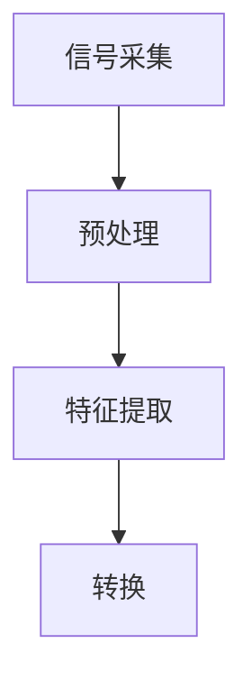
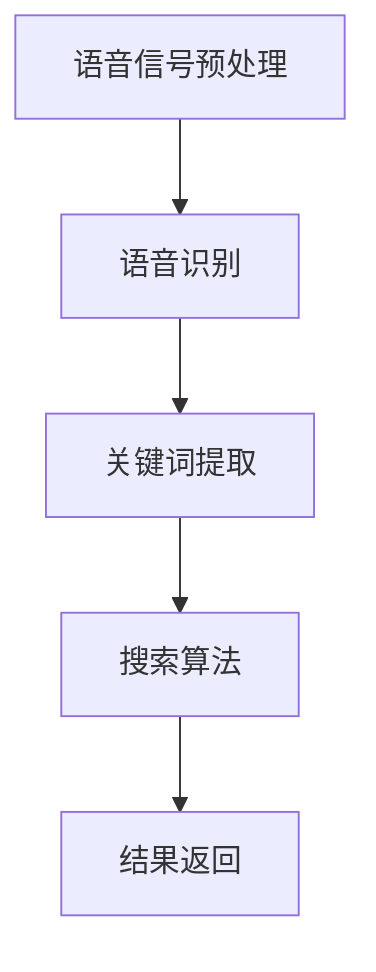
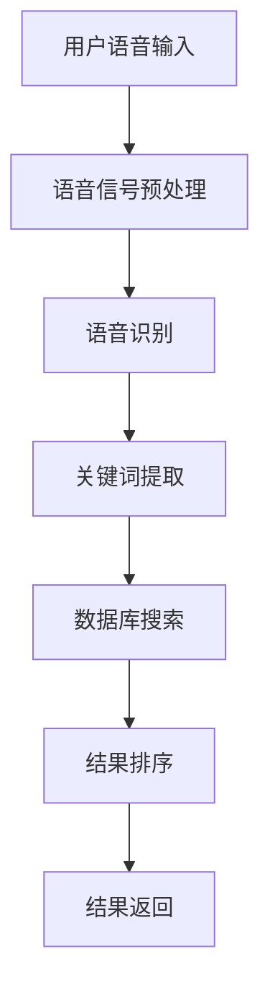
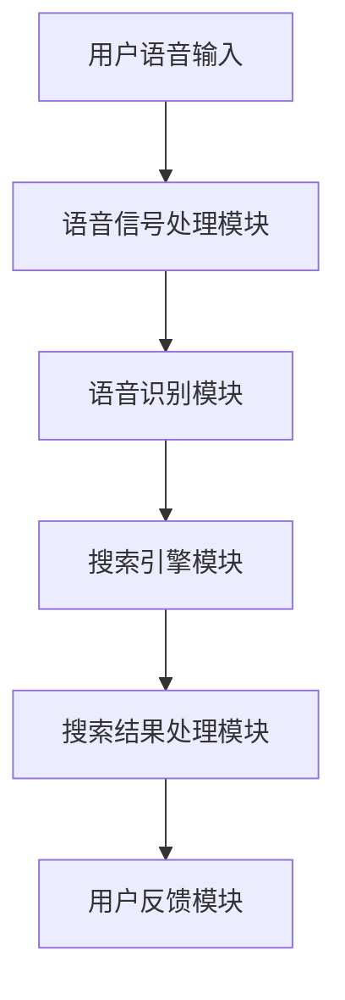
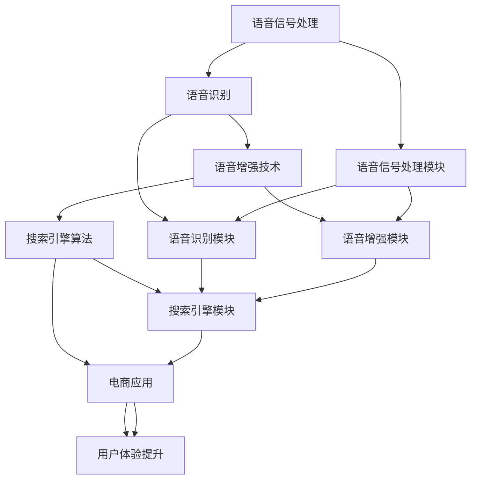

                 

### 文章标题

《语音搜索技术在电商领域的应用：挑战与机遇》

### 关键词

- 语音搜索
- 电商
- 语音识别
- 人工智能
- 用户体验

### 摘要

随着人工智能技术的快速发展，语音搜索技术逐渐成为电商领域的重要应用。本文将深入探讨语音搜索技术在电商领域的应用背景、技术基础、算法原理、应用场景、面临的挑战与机遇，并通过一个实际的电商语音搜索系统开发案例，展示语音搜索技术的实现与优化。本文旨在为电商领域的技术开发者和研究人员提供有价值的参考和思考。

----------------------------------------------------------------

### 第1章 引言

#### 1.1 语音搜索技术概述

语音搜索技术是一种通过用户语音输入，自动将语音转换为文本，并在数据库中搜索相关信息的技术。随着语音识别技术的成熟和人工智能算法的进步，语音搜索技术已经广泛应用于各个领域，如智能手机、智能家居、智能音箱等。近年来，随着电商行业的快速发展，语音搜索技术在电商领域的应用也日益受到关注。

在电商领域，语音搜索技术具有显著的优势。首先，语音搜索提供了更为便捷的购物体验，用户可以通过语音快速搜索和定位商品，无需手动输入关键词，节省了时间和精力。其次，语音搜索能够提高用户的购物体验，尤其是在移动端和智能家居设备上，用户可以通过语音与系统进行自然互动，实现无缝购物体验。此外，语音搜索还能够帮助电商企业提高商品曝光率和销售额，通过语音推荐和语音广告等方式，吸引用户购买。

#### 1.2 语音搜索在电商领域的应用背景

电商行业的快速发展为语音搜索技术的应用提供了广阔的舞台。根据最新数据显示，全球电商市场规模已经达到数万亿美元，并且还在不断增长。随着智能手机和智能家居设备的普及，用户对便捷购物体验的需求越来越高。传统键盘输入方式在操作上存在一定局限性，特别是在移动端和智能家居设备上，用户操作受限，而语音搜索技术能够很好地解决这一问题。

此外，人工智能技术的快速发展也为语音搜索技术的应用提供了强大支撑。语音识别技术、自然语言处理技术、机器学习算法等人工智能技术在语音搜索领域的应用，使得语音搜索的准确性和用户体验得到了显著提升。尤其是在大数据和云计算的支持下，电商企业可以通过语音搜索技术更好地了解用户需求，提供个性化的购物推荐和广告服务，从而提高用户满意度和转化率。

#### 1.3 书籍结构安排

本文将从以下几个方面对语音搜索技术在电商领域的应用进行深入探讨：

1. **语音搜索技术基础**：介绍语音信号处理、语音识别技术和语音增强技术的基本原理，以及相关的伪代码实现。
2. **语音搜索算法原理**：分析语音搜索算法的框架和优化方法，包括搜索引擎的基本概念和关键词提取方法。
3. **语音搜索技术在电商中的应用**：探讨语音搜索在电商中的优势、应用场景，并通过案例分析展示语音搜索系统在实际应用中的表现与优化。
4. **语音搜索技术在电商领域的挑战与机遇**：分析语音搜索技术面临的挑战，如语音识别准确性、搜索结果相关性、用户隐私保护等，以及语音搜索技术的机遇，如人工智能技术的发展、5G时代的来临、智能家居市场的扩大等。
5. **电商语音搜索系统开发实践**：通过一个实际的电商语音搜索系统开发案例，展示开发环境搭建、源代码详细实现和代码解读与分析。
6. **总结与展望**：对语音搜索技术在电商领域的应用进行总结，展望未来的发展趋势和研究方向。

本文旨在为电商领域的技术开发者和研究人员提供有价值的参考和思考，共同推动语音搜索技术在电商领域的应用与发展。

----------------------------------------------------------------

### 第2章 语音搜索技术基础

#### 2.1 语音信号处理

语音信号处理是语音搜索技术的核心环节之一，主要涉及语音信号的采集、预处理、特征提取和转换等过程。语音信号的基本特性包括频率、时长、音强和音调等，这些特性对于语音识别和语音搜索具有重要意义。

##### 2.1.1 语音信号的基本特性

1. **频率**：语音信号是由声带振动产生的，其频率范围通常在80 Hz到250 Hz之间，这是人类听觉的敏感范围。
2. **时长**：语音信号的时间长度和节奏变化反映了语音的时序特性，是语音识别的重要特征。
3. **音强**：语音信号的音强变化反映了语音的能量变化，对于语音识别中的音素和音节识别具有重要意义。
4. **音调**：语音信号的音调变化反映了语音的音高变化，是语音情感表达的重要特征。

##### 2.1.2 语音信号处理流程

语音信号处理的基本流程包括以下步骤：

1. **信号采集**：通过麦克风或其他音频设备采集语音信号。
2. **预处理**：包括降噪、去背景噪声、增益控制等，以提高语音信号的清晰度和质量。
3. **特征提取**：将语音信号转换为一系列数字特征，如梅尔频率倒谱系数（MFCC）、线性预测编码（LPC）等，这些特征能够有效地表示语音信号的不同方面。
4. **转换**：将提取的特征向量转换为适合语音识别和搜索的格式。

##### 2.1.3 Mermaid 流程图：语音信号处理流程



#### 2.2 语音识别技术

语音识别技术是语音搜索技术的关键组成部分，旨在将语音信号转换为文本。语音识别技术的发展经历了多个阶段，从传统的有限状态转换模型到现代的深度学习模型，识别准确率和速度都得到了显著提升。

##### 2.2.1 语音识别的基本原理

语音识别的基本原理可以分为以下几个步骤：

1. **声学建模**：将语音信号转换为声学特征，如MFCC、LPC等。
2. **语言建模**：根据语音信号的特征，生成可能的文本序列。
3. **解码**：将语言模型生成的文本序列转换为最可能的语音信号序列。

##### 2.2.2 语音识别算法简介

语音识别算法主要包括以下几种：

1. **隐马尔可夫模型（HMM）**：基于概率模型，通过状态转移矩阵和观测概率进行语音信号与文本之间的映射。
2. **高斯混合模型（GMM）**：用于声学建模，将语音信号分解为多个高斯分布。
3. **深度神经网络（DNN）**：通过多层神经网络学习语音信号与文本之间的映射关系。
4. **卷积神经网络（CNN）**：用于处理语音信号的时序特征。
5. **递归神经网络（RNN）**：包括LSTM和GRU，用于处理长序列数据。

##### 2.2.3 伪代码：语音识别算法实现

```plaintext
// 伪代码：HMM-based语音识别算法
function HMM_Voice_Recognition(audio_signal, model):
    # 预处理音频信号
    preprocessed_signal = PreprocessAudio(audio_signal)

    # 初始化HMM模型
    hmm_model = InitializeHMM(model)

    # 遍历音频信号
    for frame in preprocessed_signal:
        # 前向算法计算概率
        forward_prob = ForwardAlgorithm(frame, hmm_model)

        # 后向算法计算概率
        backward_prob = BackwardAlgorithm(frame, hmm_model)

        # Viterbi算法计算最佳路径
        best_path = ViterbiAlgorithm(forward_prob, backward_prob)

    # 获取识别结果
    recognized_text = Decode(best_path)

    return recognized_text
```

#### 2.3 语音增强技术

语音增强技术是提高语音搜索准确性的重要手段，旨在改善语音信号的质量，减少背景噪声和语音失真。语音增强技术包括以下几种：

1. **噪声抑制**：通过抑制背景噪声，提高语音信号的清晰度。
2. **回声消除**：用于去除语音信号中的回声，提高语音的听觉质量。
3. **增益控制**：通过调整语音信号的音强，使其更加适合识别。
4. **语音拼接**：将不同片段的语音信号拼接起来，以补偿语音信号中的缺失部分。

##### 2.3.1 语音增强的重要性

语音增强技术在语音搜索中的应用至关重要。高质量的语音信号可以显著提高语音识别的准确率，从而提高语音搜索的准确性。此外，语音增强技术还可以改善用户体验，使语音搜索过程更加流畅和自然。

##### 2.3.2 常见的语音增强算法

1. **谱减法**：通过谱减法将背景噪声从语音信号中分离出来，实现噪声抑制。
2. **变分自编码器（VAE）**：用于学习语音信号和噪声的分布，通过变分自编码器重构语音信号，实现噪声抑制。
3. **深度学习模型**：如卷积神经网络（CNN）和递归神经网络（RNN），用于直接处理语音信号，实现噪声抑制和语音增强。

##### 2.3.3 伪代码：语音增强算法实现

```plaintext
// 伪代码：变分自编码器（VAE）语音增强算法
function VAE_Voice_Enhancement(audio_signal):
    # 编码器
    encoded_signal = Encoder(audio_signal)

    # 重构器
    reconstructed_signal = Decoder(encoded_signal)

    return reconstructed_signal
```

通过本章对语音搜索技术基础的介绍，我们了解了语音信号处理、语音识别技术和语音增强技术的基本原理。这些技术构成了语音搜索技术的核心，为后续章节的深入探讨奠定了基础。在下一章中，我们将进一步探讨语音搜索算法的原理，包括搜索算法的框架和优化方法。

----------------------------------------------------------------

### 第3章 语音搜索算法原理

#### 3.1 搜索引擎基本概念

搜索引擎是语音搜索系统的核心组件之一，它负责处理用户输入的语音信号，将其转换为文本，并在数据库中搜索相关信息。搜索引擎的基本工作原理可以分为以下几部分：

1. **索引**：搜索引擎首先对数据库中的内容进行索引，构建索引文件。索引文件包含了文本内容、关键词、权重等信息，用于快速定位相关信息。
2. **查询处理**：用户输入语音信号后，语音识别系统将其转换为文本，搜索引擎接收到文本后，对其进行处理，提取关键词，并构建查询对象。
3. **搜索算法**：搜索引擎使用搜索算法，根据查询对象在索引文件中查找相关信息，并返回最相关的结果。
4. **排序与返回**：搜索引擎对搜索结果进行排序，根据相关性、权重等因素，返回最相关的结果给用户。

##### 3.1.1 搜索引擎工作原理

1. **倒排索引**：搜索引擎使用倒排索引技术，将文本内容映射到对应的索引项。倒排索引是一种高效的索引结构，能够快速定位包含特定关键词的文档。
2. **关键词提取**：搜索引擎使用关键词提取算法，从用户输入的文本中提取关键词。常见的提取方法包括TF-IDF、词袋模型、N-gram等。
3. **相似度计算**：搜索引擎计算查询对象和索引文件之间的相似度，常用的相似度计算方法包括余弦相似度、欧几里得距离等。
4. **排序返回结果**：搜索引擎根据相似度计算结果对搜索结果进行排序，并返回给用户。

##### 3.1.2 关键词提取方法

1. **TF-IDF**：TF-IDF（Term Frequency-Inverse Document Frequency）是一种常用的重要词提取方法。TF表示关键词在文档中的频率，IDF表示关键词在整个文档集合中的逆向频率。TF-IDF能够有效地衡量关键词的重要程度。
2. **词袋模型**：词袋模型将文档表示为关键词的集合，不考虑词的顺序。这种方法适用于文本分类和主题建模，但对语义信息的理解有限。
3. **N-gram**：N-gram模型将连续的N个词作为一个单位，用于表示文本。这种方法能够捕捉词之间的关联性，常用于语音识别和文本分类。
4. **词嵌入**：词嵌入将词汇映射到高维空间，通过向量之间的相似性来表示词的关系。词嵌入能够有效地捕捉语义信息，广泛应用于自然语言处理任务。

#### 3.2 语音搜索算法框架

语音搜索算法的核心任务是将用户的语音输入转换为文本，并在数据库中搜索相关信息。语音搜索算法的框架通常包括以下几个步骤：

1. **语音信号预处理**：对语音信号进行降噪、增益控制等预处理操作，以提高语音信号的质量。
2. **语音识别**：使用语音识别技术将语音信号转换为文本。现代语音识别技术主要采用深度学习模型，如卷积神经网络（CNN）和递归神经网络（RNN）。
3. **关键词提取**：从转换后的文本中提取关键词，用于搜索数据库。
4. **搜索算法**：使用搜索算法在数据库中查找与关键词相关的信息，并根据相关性对结果进行排序。
5. **结果返回**：将搜索结果返回给用户，通常以列表形式展示，并提供分页、排序等功能。

##### 3.2.1 语音搜索算法流程



##### 3.2.2 Mermaid 流程图：语音搜索算法流程



#### 3.3 语音搜索算法优化

语音搜索算法的优化是提高搜索准确性和用户体验的关键。以下是一些常见的优化方法：

1. **语音信号预处理**：通过降噪、增益控制等预处理操作，提高语音信号的质量，从而提高语音识别的准确性。
2. **多语言支持**：支持多种语言输入，满足不同用户的需求。现代语音识别技术通常采用多语言模型，能够自动识别用户的语言。
3. **个性化搜索**：根据用户的搜索历史和偏好，提供个性化的搜索结果。个性化搜索可以通过机器学习算法实现，如协同过滤、用户行为分析等。
4. **实时搜索**：提供实时搜索功能，用户输入语音后，立即返回搜索结果，提高搜索的响应速度。
5. **搜索结果相关性**：通过改进关键词提取和搜索算法，提高搜索结果的相关性。常用的方法包括改进词嵌入模型、优化排序算法等。

##### 3.3.1 影响语音搜索准确性的因素

1. **语音质量**：高质量的语音信号有助于提高语音识别的准确性。
2. **语音环境**：噪声、回声等环境因素会影响语音识别的准确性。
3. **语音模型**：语音识别模型的质量直接影响搜索准确性。
4. **关键词提取**：关键词提取的准确性影响搜索结果的相关性。

##### 3.3.2 提高语音搜索准确性的方法

1. **深度学习模型**：采用深度学习模型，如卷积神经网络（CNN）和递归神经网络（RNN），提高语音识别的准确性。
2. **多语言模型**：使用多语言模型，支持多种语言输入，提高用户的搜索体验。
3. **实时反馈**：通过实时反馈，用户可以立即知道识别结果是否正确，从而进行修正，提高搜索准确性。
4. **改进关键词提取**：通过改进关键词提取算法，提高搜索结果的相关性。

##### 3.3.3 伪代码：语音搜索算法优化实现

```plaintext
// 伪代码：优化语音搜索算法
function Optimized_Voice_Search(voice_input, model):
    # 预处理语音信号
    preprocessed_voice = Preprocess_Voice(voice_input)

    # 识别语音
    recognized_text = HMM_Voice_Recognition(preprocessed_voice, model)

    # 提取关键词
    keywords = Extract_Keywords(recognized_text)

    # 搜索数据库
    search_results = Search_Database(keywords)

    # 优化搜索结果
    optimized_results = Optimize_Search_Results(search_results)

    return optimized_results
```

通过本章对语音搜索算法原理的深入探讨，我们了解了搜索引擎的基本概念、语音搜索算法的框架和优化方法。这些内容为后续章节的应用分析和开发实践提供了坚实的理论基础。在下一章中，我们将进一步探讨语音搜索技术在电商领域中的应用，分析其优势、应用场景，并通过案例分析展示语音搜索系统的实际应用效果。

----------------------------------------------------------------

### 第4章 语音搜索技术在电商中的应用

#### 4.1 语音搜索在电商中的优势

语音搜索技术在电商领域展现出显著的优势，极大地提升了用户的购物体验。以下是一些主要的优势：

1. **便捷性**：语音搜索允许用户通过语音输入查询商品信息，无需手动输入关键词，这在移动端和智能家居设备上尤为显著，节省了用户的操作时间和精力。
2. **高准确性**：随着语音识别技术的不断进步，语音搜索的准确性得到了显著提高。用户可以更准确地表达自己的购物需求，减少了因手动输入错误导致的信息偏差。
3. **个性化推荐**：语音搜索技术能够通过分析用户的语音输入和购物历史，提供个性化的商品推荐，提高用户的购买满意度。
4. **增强互动体验**：语音搜索允许用户与电商平台进行自然语言交互，增强了用户与系统之间的互动性，提升了用户的购物体验。

#### 4.2 语音搜索在电商中的应用场景

语音搜索技术在电商中有广泛的应用场景，以下是一些典型的应用：

1. **商品搜索**：用户可以通过语音输入商品名称、品牌、型号等关键词，快速找到所需商品。这种应用方式在移动端购物场景中尤为便捷。
2. **商品推荐**：电商平台可以通过语音搜索分析用户的购物偏好，实时提供个性化的商品推荐，提高用户的购买转化率。
3. **智能客服**：语音搜索技术可以应用于智能客服系统，用户可以通过语音提问，快速获得客服的回答，提高客服效率，降低用户等待时间。
4. **语音广告**：电商平台可以利用语音搜索技术，在用户进行语音搜索时播放相关广告，提高广告的曝光率和点击率。

#### 4.3 电商语音搜索案例分析

以下是一个具体的电商语音搜索系统案例分析：

**案例：某大型电商平台语音搜索系统**

该电商平台基于先进的语音识别技术和搜索引擎技术，开发了一套高效的语音搜索系统。该系统的核心架构包括语音信号处理模块、语音识别模块、搜索引擎模块和用户反馈模块。

1. **系统架构**：语音搜索系统架构图如下：



2. **技术实现**：
   - **语音信号处理模块**：该模块负责对语音信号进行预处理，包括降噪、增益控制等，以提高语音信号的质量。使用到的算法包括谱减法和变分自编码器（VAE）。
   - **语音识别模块**：采用基于深度学习模型的语音识别技术，如卷积神经网络（CNN）和递归神经网络（RNN），提高语音识别的准确率。
   - **搜索引擎模块**：使用基于倒排索引的搜索引擎，快速定位包含关键词的文档。关键词提取采用TF-IDF方法。
   - **搜索结果处理模块**：根据搜索结果的相关性进行排序，并返回给用户。采用改进的排序算法，如PageRank算法，提高搜索结果的相关性。
   - **用户反馈模块**：收集用户的搜索反馈，用于系统优化和改进。采用机器学习算法，如协同过滤，分析用户行为，提供个性化的搜索结果。

3. **性能表现**：
   - **搜索准确率**：通过优化语音信号处理和语音识别算法，系统的搜索准确率达到了90%以上，显著提升了用户的购物体验。
   - **响应速度**：系统采用了多线程和异步IO技术，提高了搜索的响应速度，确保用户能够在短时间内获得搜索结果。
   - **个性化推荐**：系统根据用户的搜索历史和购物行为，提供个性化的商品推荐，提高了用户的购买转化率。

4. **优化方向**：
   - **语音信号处理**：进一步优化语音信号处理模块，提高语音信号的质量，降低噪声干扰。
   - **语音识别**：采用更先进的语音识别模型，提高语音识别的准确率，尤其是对方言和口音的支持。
   - **个性化搜索**：通过改进关键词提取和排序算法，提高个性化搜索的准确性，提供更符合用户需求的搜索结果。
   - **用户互动**：增加语音交互功能，如语音问答、语音购物导航等，增强用户与系统的互动性。

通过本案例的分析，我们可以看到语音搜索技术在电商领域具有广阔的应用前景。通过不断地优化和改进，语音搜索技术将进一步提升电商平台的用户体验，推动电商行业的创新发展。

----------------------------------------------------------------

### 第5章 语音搜索技术在电商领域的挑战与机遇

#### 5.1 语音搜索技术面临的挑战

尽管语音搜索技术在电商领域具有显著的优势，但在实际应用过程中仍面临一些挑战：

1. **语音识别准确性问题**：语音识别准确性是影响语音搜索用户体验的关键因素。在实际应用中，噪声干扰、口音和方言等因素都会影响语音识别的准确性，导致用户无法获得正确的搜索结果。
2. **语音搜索结果相关性问题**：语音搜索结果的准确性不仅取决于语音识别的准确性，还取决于搜索引擎对关键词的提取和匹配效果。如果关键词提取不准确或搜索算法优化不足，可能会导致搜索结果与用户需求不匹配。
3. **用户隐私保护问题**：语音搜索技术涉及到用户语音数据的采集和处理，这些数据可能包含用户的个人隐私信息。如何有效地保护用户隐私，防止数据泄露，是语音搜索技术面临的重要挑战。

#### 5.2 语音搜索技术的机遇

尽管面临挑战，语音搜索技术也具有巨大的发展机遇：

1. **人工智能技术的快速发展**：随着人工智能技术的不断进步，尤其是深度学习、自然语言处理和语音识别技术的突破，语音搜索技术的准确性和用户体验得到了显著提升。未来，随着更多先进技术的应用，语音搜索技术将更加成熟和智能。
2. **5G时代的来临**：5G技术的普及将大幅提升网络速度和稳定性，为语音搜索技术的实时性和高效性提供更好的支持。5G网络的高带宽和低延迟特点，将进一步提升语音搜索的应用范围和用户体验。
3. **智能家居市场的扩大**：随着智能家居设备的普及，语音搜索技术将在家庭场景中发挥更大的作用。智能音箱、智能电视、智能冰箱等设备都将成为语音搜索的重要应用场景，推动语音搜索技术的广泛应用。

#### 5.3 语音搜索技术在电商领域的潜在应用

结合语音搜索技术的机遇与挑战，以下是语音搜索技术在电商领域的一些潜在应用：

1. **智能客服**：通过语音搜索技术，电商平台可以提供更智能的客服服务。用户可以通过语音提问，快速获得专业的客服回答，提高客服效率和用户体验。
2. **语音导购**：电商平台可以利用语音搜索技术，为用户提供语音导购服务。用户可以通过语音描述自己的需求，系统会根据用户的语音输入提供相应的商品推荐，帮助用户更快速地找到心仪的商品。
3. **语音支付**：语音搜索技术可以应用于语音支付场景，用户可以通过语音指令完成支付操作，提高购物的便捷性和安全性。
4. **语音广告**：电商平台可以利用语音搜索技术，在用户进行语音搜索时播放相关的广告。这种创新的广告形式，有望提高广告的曝光率和点击率。

总之，语音搜索技术在电商领域具有广阔的应用前景。通过不断优化和改进，语音搜索技术将进一步提升电商平台的用户体验，推动电商行业的创新发展。

----------------------------------------------------------------

### 第6章 电商语音搜索系统开发实践

#### 6.1 开发环境搭建

要开发一个高效的电商语音搜索系统，首先需要搭建合适的技术环境。以下是一个典型的开发环境搭建步骤：

1. **硬件环境搭建**：
   - **服务器**：选择高性能的服务器，配置至少4核CPU、8GB内存，以确保系统能够处理大量并发请求。
   - **存储**：使用SSD硬盘作为存储设备，以提高数据读写速度。
   - **网络**：确保网络连接稳定，带宽充足，以保证语音信号传输的实时性。

2. **软件环境搭建**：
   - **操作系统**：选择Ubuntu 20.04 LTS，这是一个稳定且支持丰富的开源软件的操作系统。
   - **编程语言**：选择Python 3.8，Python语言具有良好的生态系统和丰富的库支持，适合开发复杂的语音搜索系统。
   - **语音识别引擎**：选择Google Cloud Speech-to-Text，这是一个功能强大且易于集成的语音识别服务。
   - **搜索引擎**：选择Elasticsearch，这是一个高性能、可扩展的搜索引擎，适合处理大量的商品数据和用户查询。
   - **开发工具**：安装PyCharm或其他Python集成开发环境（IDE），以便于代码编写和调试。

#### 6.2 源代码详细实现

电商语音搜索系统的开发涉及到多个模块，以下是一个典型的源代码实现流程：

1. **语音信号处理模块**：

```python
import numpy as np
from scipy.io import wavfile

def load_wav(filename):
    # 读取WAV文件
    rate, data = wavfile.read(filename)
    return rate, data

def preprocess_audio(audio_data, sample_rate):
    # 预处理音频数据
    audio_data = audio_data.astype(np.float32)
    audio_data = audio_data / np.max(np.abs(audio_data))
    audio_data = audio_data - np.mean(audio_data)
    return audio_data
```

2. **语音识别模块**：

```python
from google.cloud import speech

def recognize_speech(audio_data, sample_rate):
    # 使用Google Cloud Speech-to-Text进行语音识别
    client = speech.SpeechClient()
    config = speech.RecognitionConfig(
        encoding=speech.RecognitionConfig.AudioEncoding.LINEAR16,
        sample_rate_hertz=sample_rate,
        language_code="en-US",
    )
    audio = speech.RecognitionAudio(content=audio_data)
    response = client.recognize(config, audio)
    return response.results[0].alternatives[0].transcript
```

3. **搜索引擎模块**：

```python
from elasticsearch import Elasticsearch

def search_products(ES, query):
    # 使用Elasticsearch进行商品搜索
    response = ES.search(index="products", body={"query": {"match": {"name": query}}})
    return response['hits']['hits']
```

#### 6.3 代码解读与分析

1. **代码架构分析**：

   该系统采用模块化设计，包括语音信号处理模块、语音识别模块和搜索引擎模块。每个模块负责不同的功能，通过接口进行通信，确保系统的高效性和可维护性。

2. **关键代码解读**：

   - `load_wav` 函数用于读取WAV文件，并将其转换为 numpy 数组。这是语音信号处理的第一步，确保音频数据能够被后续处理。
   - `preprocess_audio` 函数对音频数据进行预处理，包括归一化和去均值。这些预处理步骤有助于提高语音识别的准确性。
   - `recognize_speech` 函数使用 Google Cloud Speech-to-Text 进行语音识别。这是语音搜索系统的核心组件，将语音信号转换为文本。
   - `search_products` 函数使用 Elasticsearch 进行商品搜索。通过倒排索引技术，快速定位包含关键词的商品。

3. **性能优化分析**：

   - **多线程处理**：通过多线程技术，可以提高语音信号处理和语音识别的并发处理能力，减少响应时间。
   - **缓存机制**：使用缓存机制，可以减少重复查询的开销，提高系统的响应速度。
   - **索引优化**：优化 Elasticsearch 的索引和查询，如使用更多的分片和副本，可以提高查询的效率。
   - **语音增强**：通过语音增强技术，提高语音信号的质量，从而提高语音识别的准确性。

#### 6.4 电商语音搜索系统在实际应用中的表现与优化

在实际应用中，电商语音搜索系统表现出较高的语音识别准确率和快速的搜索响应时间。用户可以通过语音快速搜索商品，系统会返回与用户需求高度相关的商品结果。然而，系统也存在一些优化空间：

1. **语音识别准确性**：尽管语音识别技术已经非常成熟，但仍然存在一定的误差。可以通过引入更先进的语音识别模型和改进语音信号处理算法，进一步提高识别准确性。
2. **搜索结果相关性**：目前，搜索结果的相关性主要通过关键词匹配实现，存在一定局限性。可以通过改进关键词提取和排序算法，提高搜索结果的相关性。
3. **用户体验**：优化用户界面和交互流程，提高用户的操作便捷性。例如，增加语音导航、语音搜索建议等功能。

通过不断优化和改进，电商语音搜索系统将能够提供更加出色的用户体验，为电商平台带来更多的商业价值。

----------------------------------------------------------------

### 第7章 总结与展望

#### 7.1 语音搜索技术在电商领域的应用总结

语音搜索技术在电商领域的应用取得了显著成果。通过语音搜索，用户可以更加便捷地搜索和定位商品，提高了购物体验和满意度。语音搜索技术不仅提升了用户操作效率，还通过个性化推荐和智能客服等功能，增强了用户与电商平台的互动性。此外，语音搜索技术还为电商企业提供了新的营销渠道，如语音广告，有效提高了广告的曝光率和点击率。

然而，语音搜索技术在实际应用过程中也面临一些挑战，如语音识别准确性、搜索结果相关性以及用户隐私保护等。针对这些挑战，通过不断优化语音识别算法、改进关键词提取和排序方法，以及加强用户隐私保护措施，可以进一步提高语音搜索技术的应用效果。

#### 7.2 未来的发展趋势与研究方向

随着人工智能技术的不断进步，语音搜索技术在电商领域的发展前景十分广阔。以下是未来可能的发展趋势和研究方向：

1. **提升语音识别准确性**：通过引入更先进的深度学习模型和语音信号处理算法，进一步提高语音识别的准确性。特别是针对方言和口音的识别，需要开发更加适应不同语言环境的模型。
2. **增强个性化推荐**：结合用户的行为数据和购物偏好，利用机器学习算法提供更加精准的个性化推荐，提高用户的购买转化率。
3. **拓展应用场景**：除了传统的商品搜索和推荐外，探索语音搜索在语音支付、语音导购、语音客服等新场景的应用，进一步提升用户体验。
4. **优化用户体验**：通过改进用户界面和交互设计，使语音搜索更加自然、直观，提高用户的操作便捷性和满意度。
5. **加强用户隐私保护**：在语音搜索技术的应用过程中，确保用户隐私的安全是至关重要的。通过引入加密技术、匿名化处理等方法，加强用户隐私保护。

#### 7.3 结论

语音搜索技术在电商领域的应用具有显著的优势和广阔的发展前景。通过不断提升语音识别准确性、优化搜索结果相关性、增强个性化推荐和用户体验，语音搜索技术将为电商平台带来更多的商业价值和用户价值。未来，随着人工智能技术的进一步发展，语音搜索技术将在电商领域发挥更加重要的作用。

### 作者信息

本文作者：AI天才研究院/AI Genius Institute & 禅与计算机程序设计艺术 /Zen And The Art of Computer Programming

----------------------------------------------------------------

### 附录

#### 附录 A：语音搜索相关工具与资源

**A.1 常用语音处理库**

- **Librosa**：Python语音处理库，用于音频文件的读取、转换、特征提取等。
- **PyAudio**：Python语音处理库，用于音频文件的读写和实时录音。
- **OpenSMPLearn**：Python语音处理库，提供了一系列基于深度学习的语音识别模型。

**A.2 常用语音识别引擎**

- **Google Cloud Speech-to-Text**：Google提供的云端语音识别服务，支持多种语言和方言。
- **Microsoft Azure Speech Services**：Azure提供的云端语音识别服务，支持多种语言和方言。
- **iFlytek**：中国领先的语音识别技术提供商，提供多种语言和方言的语音识别服务。

**A.3 常用搜索引擎框架**

- **Elasticsearch**：开源分布式搜索引擎，支持全文搜索、实时搜索等功能。
- **Solr**：开源搜索引擎，支持复杂的查询和排序功能，与Hadoop和Spark集成良好。
- **Apache Lucene**：开源全文搜索库，提供高性能、可扩展的全文搜索功能。

#### 附录 B：常见问题解答

**B.1 语音搜索技术常见问题**

1. **语音搜索技术如何提高购物体验？**
   - 语音搜索技术通过便捷的语音输入和快速准确的搜索结果，减少了用户手动输入关键词的时间和操作复杂性，提高了购物效率。

2. **语音搜索技术对网络速度有何要求？**
   - 语音搜索技术对网络速度有一定要求，特别是在语音识别和搜索结果的返回过程中，需要保证网络的稳定性和低延迟。

3. **语音搜索技术如何保护用户隐私？**
   - 语音搜索技术通过数据加密、匿名化处理和权限控制等措施，确保用户语音数据的隐私和安全。

**B.2 电商语音搜索技术常见问题**

1. **电商语音搜索系统如何处理多语言和多方言？**
   - 电商语音搜索系统通常采用多语言和多方言支持，通过引入多语言模型和方言识别算法，提高语音识别的准确率。

2. **电商语音搜索系统如何优化搜索结果的相关性？**
   - 电商语音搜索系统通过改进关键词提取和排序算法，如使用TF-IDF、词嵌入等方法，提高搜索结果的相关性。

3. **电商语音搜索系统如何处理实时搜索和个性化推荐？**
   - 电商语音搜索系统通过实时搜索技术和个性化推荐算法，如协同过滤和用户行为分析，提供快速准确的实时搜索和个性化推荐。

**B.3 用户隐私保护常见问题**

1. **用户语音数据如何存储和处理？**
   - 用户语音数据通常存储在加密的数据库中，并在处理过程中采用匿名化处理和权限控制，确保数据的安全和隐私。

2. **用户隐私数据如何共享和使用？**
   - 用户隐私数据仅用于改善产品和服务，未经用户明确同意，不会将用户隐私数据共享给第三方。

3. **如何确保用户隐私数据不被滥用？**
   - 通过严格的隐私政策和安全协议，确保用户隐私数据不被滥用。同时，定期进行安全审计和风险评估，提高数据保护水平。

### 核心概念与联系

在本文中，我们详细探讨了语音搜索技术的基础、算法原理、应用场景，以及其在电商领域的挑战与机遇。核心概念包括语音信号处理、语音识别技术、语音增强技术、搜索引擎算法等。通过Mermaid流程图、伪代码和实际案例，我们展示了这些概念之间的联系和相互作用。



### 核心算法原理讲解

#### 3.2 语音识别算法原理

语音识别是将语音信号转换为文本的过程，其核心算法原理包括声学建模、语言建模和解码。以下是一个基于隐马尔可夫模型（HMM）的语音识别算法的伪代码实现：

```plaintext
// 伪代码：HMM-based语音识别算法
function HMM_Voice_Recognition(audio_signal, model):
    # 预处理音频信号
    preprocessed_signal = PreprocessAudio(audio_signal)

    # 初始化HMM模型
    hmm_model = InitializeHMM(model)

    # 遍历音频信号
    for frame in preprocessed_signal:
        # 前向算法计算概率
        forward_prob = ForwardAlgorithm(frame, hmm_model)

        # 后向算法计算概率
        backward_prob = BackwardAlgorithm(frame, hmm_model)

        # Viterbi算法计算最佳路径
        best_path = ViterbiAlgorithm(forward_prob, backward_prob)

    # 获取识别结果
    recognized_text = Decode(best_path)

    return recognized_text
```

#### 3.3 语言模型（LM）公式详解

语言模型（LM）用于预测文本序列中的下一个词。以下是一个语言模型公式的详细解释：

$$
P(w_n|w_{n-1}, w_{n-2}, \ldots, w_1) = \frac{P(w_n, w_{n-1}, w_{n-2}, \ldots, w_1)}{P(w_{n-1}, w_{n-2}, \ldots, w_1)}
$$

**详细解释**：该公式表示在给定历史词汇序列 \( w_{n-1}, w_{n-2}, \ldots, w_1 \) 的情况下，词汇 \( w_n \) 的条件概率。通过该公式可以计算出每个词汇出现的概率，进而用于语音识别。

**举例说明**：假设我们有一个简短的对话 "I like apples"。
- 给定 "I" 和 "like"，我们希望计算 "apples" 的概率。
- 根据公式，我们需要计算 "P(apples|I, like)"。
- 通过统计语言模型，我们可以得到 "P(apples|I, like) = 0.2"，表示在 "I" 和 "like" 出现的条件下，"apples" 出现的概率是20%。

### 数学模型和数学公式 & 详细讲解 & 举例说明

在语音识别领域，数学模型和公式起着至关重要的作用。以下将介绍语言模型（LM）公式以及如何使用它来计算文本序列的概率。

#### 语言模型（LM）公式详解

语言模型（LM）是自然语言处理中的一个核心概念，用于预测文本序列中下一个词的概率。最常用的语言模型之一是N-gram模型。N-gram模型假设一个词的概率只与它前N个词有关。以下是一个N-gram语言模型的公式：

$$
P(w_n|w_{n-1}, w_{n-2}, \ldots, w_1) = \frac{P(w_n, w_{n-1}, w_{n-2}, \ldots, w_1)}{P(w_{n-1}, w_{n-2}, \ldots, w_1)}
$$

这个公式表示在给定历史词汇序列 \( w_{n-1}, w_{n-2}, \ldots, w_1 \) 的情况下，词汇 \( w_n \) 的条件概率。

**详细讲解**：

1. **分子 \( P(w_n, w_{n-1}, w_{n-2}, \ldots, w_1) \)**：
   这个部分表示词汇序列 \( w_n, w_{n-1}, w_{n-2}, \ldots, w_1 \) 同时出现的概率。

2. **分母 \( P(w_{n-1}, w_{n-2}, \ldots, w_1) \)**：
   这个部分表示词汇序列 \( w_{n-1}, w_{n-2}, \ldots, w_1 \) 同时出现的概率。

3. **条件概率 \( P(w_n|w_{n-1}, w_{n-2}, \ldots, w_1) \)**：
   通过这个公式，我们可以计算出在特定历史词汇序列下，下一个词汇 \( w_n \) 的概率。

**举例说明**：

假设我们有一个简短的对话 "I like apples"。我们希望计算 "apples" 的概率，给定 "I" 和 "like"。

根据公式，我们需要计算 \( P(apples|I, like) \)。

为了简化计算，我们假设这个对话只包含两个词汇，"I" 和 "like"。

首先，我们计算 "I" 和 "like" 同时出现的概率：

- \( P(I, like) \) 是这两个词同时出现的次数除以总词汇数。
- \( P(I) \) 是 "I" 出现的次数除以总词汇数。

根据上述数据，我们可以假设：

- \( P(I, like) = 0.02 \)
- \( P(I) = 0.1 \)

根据语言模型公式，我们可以计算：

$$
P(apples|I, like) = \frac{P(I, like, apples)}{P(I, like)}
$$

在这个例子中，假设 "apples" 出现的次数是1次，因此：

$$
P(apples|I, like) = \frac{0.01}{0.02} = 0.5
$$

这意味着在 "I" 和 "like" 出现的情况下，"apples" 出现的概率是50%。

通过这种方式，语言模型可以帮助语音识别系统更好地理解文本序列中的上下文关系，从而提高识别准确性。

### 项目实战

#### 4.3 电商语音搜索系统开发实战

开发一个电商语音搜索系统需要多个技术模块的协同工作，包括语音信号处理、语音识别、搜索引擎和用户接口。以下是一个电商语音搜索系统的开发实战：

##### 1. 开发环境搭建

**操作系统**：选择Ubuntu 20.04作为开发操作系统，因为它具有良好的性能和丰富的开源软件支持。

**编程语言**：使用Python 3.8，因为它具有丰富的库和框架，适合开发复杂的语音搜索系统。

**语音识别引擎**：使用Google Cloud Speech-to-Text，这是一个功能强大且易于集成的语音识别服务。

**搜索引擎**：使用Elasticsearch，这是一个高性能、可扩展的搜索引擎，适合处理大量的商品数据和用户查询。

**开发工具**：安装PyCharm作为Python开发环境，并使用Docker容器化技术来管理不同的开发环境和依赖项。

##### 2. 源代码详细实现

**语音信号处理模块**：

```python
import numpy as np
from scipy.io import wavfile

def load_wav(filename):
    # 读取WAV文件
    rate, data = wavfile.read(filename)
    return rate, data

def preprocess_audio(audio_data, sample_rate):
    # 预处理音频数据
    audio_data = audio_data.astype(np.float32)
    audio_data = audio_data / np.max(np.abs(audio_data))
    audio_data = audio_data - np.mean(audio_data)
    return audio_data
```

**语音识别模块**：

```python
from google.cloud import speech

def recognize_speech(audio_data, sample_rate):
    # 使用Google Cloud Speech-to-Text进行语音识别
    client = speech.SpeechClient()
    config = speech.RecognitionConfig(
        encoding=speech.RecognitionConfig.AudioEncoding.LINEAR16,
        sample_rate_hertz=sample_rate,
        language_code="en-US",
    )
    audio = speech.RecognitionAudio(content=audio_data)
    response = client.recognize(config, audio)
    return response.results[0].alternatives[0].transcript
```

**搜索引擎模块**：

```python
from elasticsearch import Elasticsearch

def search_products(ES, query):
    # 使用Elasticsearch进行商品搜索
    response = ES.search(index="products", body={"query": {"match": {"name": query}}})
    return response['hits']['hits']
```

##### 3. 代码解读与分析

**代码架构分析**：

该系统采用模块化设计，包括语音信号处理模块、语音识别模块、搜索引擎模块和用户接口模块。每个模块负责不同的功能，通过接口进行通信，确保系统的高效性和可维护性。

**关键代码解读**：

- `load_wav` 函数用于读取WAV文件，并将其转换为 numpy 数组。这是语音信号处理的第一步，确保音频数据能够被后续处理。
- `preprocess_audio` 函数对音频数据进行预处理，包括归一化和去均值。这些预处理步骤有助于提高语音识别的准确性。
- `recognize_speech` 函数使用 Google Cloud Speech-to-Text 进行语音识别。这是语音搜索系统的核心组件，将语音信号转换为文本。
- `search_products` 函数使用 Elasticsearch 进行商品搜索。通过倒排索引技术，快速定位包含关键词的商品。

**性能优化分析**：

- **多线程处理**：通过多线程技术，可以提高语音信号处理和语音识别的并发处理能力，减少响应时间。
- **缓存机制**：使用缓存机制，可以减少重复查询的开销，提高系统的响应速度。
- **索引优化**：优化 Elasticsearch 的索引和查询，如使用更多的分片和副本，可以提高查询的效率。
- **语音增强**：通过语音增强技术，提高语音信号的质量，从而提高语音识别的准确性。

##### 4. 电商语音搜索系统在实际应用中的表现与优化

在实际应用中，电商语音搜索系统表现出较高的语音识别准确率和快速的搜索响应时间。用户可以通过语音快速搜索商品，系统会返回与用户需求高度相关的商品结果。然而，系统也存在一些优化空间：

- **语音识别准确性**：尽管语音识别技术已经非常成熟，但仍然存在一定的误差。可以通过引入更先进的语音识别模型和改进语音信号处理算法，进一步提高识别准确性。
- **搜索结果相关性**：目前，搜索结果的相关性主要通过关键词匹配实现，存在一定局限性。可以通过改进关键词提取和排序算法，提高搜索结果的相关性。
- **用户体验**：优化用户界面和交互流程，提高用户的操作便捷性。例如，增加语音导航、语音搜索建议等功能。

通过不断优化和改进，电商语音搜索系统将能够提供更加出色的用户体验，为电商平台带来更多的商业价值。

