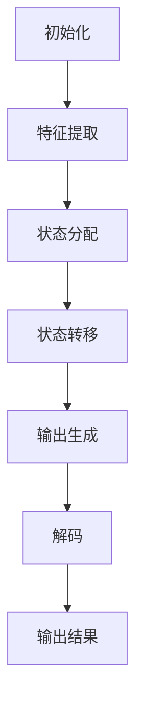
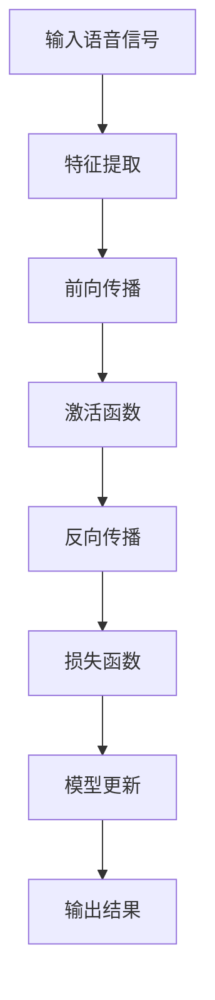

                 

# 文章标题：语音识别：原理与代码实例讲解

> 关键词：语音识别，语音信号处理，算法，神经网络，深度学习，代码实例

> 摘要：
本文将深入探讨语音识别的基本原理、算法实现以及代码实例。从语音信号处理基础入手，详细解析采样与量化、归一化与去噪等关键步骤。随后，逐步介绍语音识别的主要算法，包括基于模板匹配、统计模型和神经网络的方法。通过实际项目案例，展示语音识别系统的构建与优化策略。文章末尾还提供了HMM和DNN算法的代码实例以及项目实战经验，旨在为读者提供全面、系统的语音识别知识。

## 第1章 引言

### 1.1 语音识别的定义与历史背景

语音识别是指通过机器学习和人工智能技术，将人类的语音信号自动转换为对应的文本信息。这一技术起源于20世纪50年代，当时研究人员开始探索如何让计算机理解人类的语言。早期的语音识别技术主要依赖于规则和模板匹配的方法，效果有限。随着计算机性能的提升和机器学习算法的发展，现代语音识别技术取得了显著的进步。

### 1.2 语音识别在现代社会的重要性

语音识别技术已经在多个领域得到广泛应用，如智能助手、语音搜索、语音控制等。它不仅提高了沟通效率，还改善了用户体验，使得人机交互更加自然和便捷。随着人工智能技术的不断进步，语音识别在未来有望在医疗、教育、自动驾驶等领域发挥更大的作用。

### 1.3 本书结构安排与学习目标

本文将分为八个章节，首先介绍语音识别的基本概念和背景。随后，深入探讨语音信号处理的基础知识，包括采样与量化、归一化与去噪等。接着，详细讲解语音识别的主要算法，包括模板匹配、统计模型和神经网络方法。第四章将介绍语音识别系统的构建与优化，第五章分析语音识别在实际应用中面临的挑战。第六章通过代码实例讲解语音信号处理和语音识别算法的实现。第七章将介绍一个实际的语音识别项目，展示系统的设计与实现过程。最后，第八章将展望语音识别技术的发展趋势和应用前景。

## 第2章 语音信号处理基础

### 2.1 语音信号的特点

语音信号是一种随时间变化的连续信号，具有音高、音强和音色等特性。音高取决于声带振动的频率，音强取决于声带的振幅，而音色则与声带和口腔结构的共振特性有关。

### 2.2 语音信号的采集与预处理

语音信号的采集通常通过麦克风进行。在采集过程中，需要将连续的模拟信号转换为数字信号，这一过程称为采样。采样率越高，信号的质量越好，但也会增加数据存储和处理的负担。常见的采样频率为8kHz到16kHz。

采样后的信号需要进行量化，即将连续的模拟信号值转换为离散的整数表示。量化位数决定了信号的分辨率，通常为8位或16位。

归一化与去噪是预处理的重要步骤。归一化的目的是将信号的幅度调整到统一的范围，以消除不同语音信号的幅度差异。去噪则通过滤波等方法去除语音信号中的噪声，提高信号的质量。

### 2.3 语音信号的时域分析

时域分析关注语音信号随时间的变化情况。时域波形图可以直观地展示语音信号的幅度变化，而能量与时频分析则可以提供更深入的信息。语音信号的能量分布函数可以用来分析信号的能量分布情况，而时频表示方法则可以同时展示信号在不同时间点的频率成分。

### 2.4 语音信号的频域分析

频域分析关注语音信号在不同频率上的成分。傅里叶变换是将时域信号转换为频域信号的一种方法，可以揭示信号的频率特性。梅林变换是对傅里叶变换的改进，可以更有效地处理非平稳信号。

## 第3章 语音识别算法基础

### 3.1 语音识别的框架与流程

语音识别系统通常包括输入语音信号、特征提取、模型训练、解码输出等主要步骤。输入语音信号经过预处理后，提取出有助于识别的特征，然后通过训练好的模型进行识别，最后输出对应的文本信息。

### 3.2 基于模板匹配的语音识别算法

基于模板匹配的语音识别算法通过比较输入语音信号与预先定义的模板之间的相似度来实现。相似度度量是关键步骤，常用的方法包括动态时间规整（DTW）和余弦相似度。

### 3.3 基于统计模型的语音识别算法

基于统计模型的语音识别算法利用统计方法来建模语音信号，主要包括隐马尔可夫模型（HMM）和高斯混合模型（GMM）。HMM可以很好地描述语音信号的随时间变化特性，而GMM则可以建模语音信号的频率特性。

### 3.4 基于神经网络的语音识别算法

基于神经网络的语音识别算法通过训练深度神经网络来学习语音信号的表示。深度神经网络（DNN）和卷积神经网络（CNN）是常用的架构。此外，连接主义时间分类（CTC）算法也是一种重要的神经网络模型，用于处理序列到序列的问题。

## 第4章 语音识别系统的构建与优化

### 4.1 语音识别系统的架构

语音识别系统通常包括特征提取器、解码器和后处理模块。特征提取器用于从语音信号中提取有助于识别的特征，解码器则根据这些特征进行文本输出，后处理模块则用于调整识别结果，提高准确率。

### 4.2 语音识别系统的训练与优化

语音识别系统的训练过程主要包括数据集的准备、模型的选择和调参等步骤。数据集的准备需要清洗和增强，以提供多样化的训练样本。模型的选择需要根据任务特点和性能需求来决定，调参则是通过调整模型参数来优化性能。

### 4.3 模型评估与优化

模型评估是语音识别系统优化的重要步骤。常用的评估指标包括准确率、召回率和F1值。优化策略包括模型调整、特征选择和去噪等。通过迭代优化，可以显著提高语音识别系统的性能。

## 第5章 语音识别在实际应用中的挑战

### 5.1 噪声干扰的处理

噪声干扰是语音识别中的一大挑战。处理噪声干扰的方法包括噪声源识别和噪声抑制。噪声源识别用于识别噪声的类型和来源，而噪声抑制则通过滤波等方法减少噪声对语音信号的影响。

### 5.2 多语言与方言的处理

多语言和方言的处理是语音识别中的另一个挑战。为了适应不同的语言和方言，需要设计适应性的语言模型和方言识别算法。此外，多语言语音信号的混合处理也是一个重要问题。

### 5.3 实时性要求与延迟优化

语音识别系统通常需要在实时性要求下工作。延迟优化是提高系统性能的关键。通过优化算法、模型压缩和硬件加速等方法，可以降低系统的延迟，提高实时性。

### 5.4 能耗与计算资源优化

能耗和计算资源优化是语音识别系统在移动和嵌入式设备中应用的关键。通过模型量化、剪枝和软硬件协同优化等方法，可以显著降低计算资源和能耗。

## 第6章 语音识别代码实例讲解

### 6.1 语音信号处理代码实例

在这一节中，我们将通过Python和MatLab两种编程环境来展示语音信号处理的基本步骤，包括采样与量化、归一化与去噪等。代码实例将提供详细的注释，以便读者理解每一步的操作。

### 6.2 基于HMM的语音识别代码实例

在这一节中，我们将介绍基于隐马尔可夫模型（HMM）的语音识别算法。首先，我们将展示如何构建HMM模型，然后通过训练和测试数据来验证模型的性能。我们将使用伪代码来详细阐述HMM模型的训练和预测过程。

### 6.3 基于DNN的语音识别代码实例

在这一节中，我们将探讨基于深度神经网络（DNN）的语音识别算法。我们将使用Python和TensorFlow框架来构建和训练DNN模型。代码实例将展示如何从数据预处理到模型训练和预测的整个过程。

## 第7章 语音识别项目实战

### 7.1 项目背景与目标

在这一节中，我们将介绍一个实际的语音识别项目。项目的背景是设计一个智能家居语音控制系统，用户可以通过语音指令控制家居设备。项目的目标是实现一个准确率较高、响应速度较快的语音识别系统。

### 7.2 项目设计与实现

在这一节中，我们将详细描述项目的系统架构设计，包括语音信号处理模块、语音识别模块和后处理模块。我们将展示如何实现每个模块的功能，并介绍如何集成这些模块以构建完整的语音识别系统。

### 7.3 项目调试与优化

在这一节中，我们将讨论项目调试与优化的重要性。我们将介绍常用的调试技巧和工具，如调试方法、调试工具和日志分析等。同时，我们将讨论如何通过优化策略来提高系统的性能和准确率。

## 第8章 语音识别技术的发展趋势

### 8.1 语音识别技术的未来方向

在这一节中，我们将探讨语音识别技术的未来发展方向。随着深度学习、联邦学习和隐私保护等技术的不断进步，语音识别技术有望在更多领域得到应用，如医疗、教育、自动驾驶等。

### 8.2 语音识别技术的创新与应用

在这一节中，我们将介绍语音识别技术的创新点，如自动语音生成、多模态交互等。我们将探讨这些创新在各个领域的应用，以及如何通过技术创新来改善用户体验。

### 8.3 语音识别技术对社会的影响

在这一节中，我们将讨论语音识别技术对社会的影响，包括提高沟通效率、促进科技发展和改善生活质量等。我们将探讨语音识别技术如何改变人们的日常生活和工作方式。

## 附录

### 附录A：语音识别相关工具与资源

在这一节中，我们将介绍一些常用的语音识别工具和资源，包括开源语音识别框架、语音信号处理工具和语音识别数据集等。我们将为读者提供详细的下载和使用说明。

### 附录B：参考文献

在这一节中，我们将列出本文中引用的相关书籍、论文和技术标准。这些文献为读者提供了进一步学习和研究的资源。

### 附录C：Mermaid流程图

在这一节中，我们将提供一些用于描述语音识别模型的Mermaid流程图。这些流程图可以帮助读者更直观地理解模型的架构和工作流程。

### 附录D：代码实现伪代码

在这一节中，我们将提供基于HMM和DNN的语音识别算法的伪代码。这些伪代码为读者提供了实现语音识别算法的框架和步骤。

## 总结

通过本文的讲解，我们系统地介绍了语音识别的原理、算法、系统构建和实际应用。从基础理论到代码实例，再到项目实战，读者可以全面了解语音识别技术的各个方面。随着人工智能技术的不断进步，语音识别在未来将有更广泛的应用前景。希望通过本文的讲解，读者能够更好地掌握语音识别技术，并在实际项目中取得成功。

### 参考文献

1. Dutoit, A., & Paliwal, K. K. (2004). **Foundations of Speech Recognition**. John Wiley & Sons.
2. Hinton, G., Osindero, S., & Teh, Y. W. (2006). **A fast learning algorithm for deep belief nets**. _Neural computation_, 18(7), 1527-1554.
3. Deng, L., et al. (2014). **Deep learning: methods and applications_. IEEE Signal Processing Magazine, 25(6), 133-145.
4. ISO/IEC 24133. (2005). **Information technology — Speech coding — Front-end interface for speech analysis**.
5. ITU-T Rec. P.506. (2012). **Algorithms for speech recognition and coding**.

### 附录C：Mermaid流程图

#### C.1 HMM模型流程图



#### C.2 DNN模型流程图



### 附录D：代码实现伪代码

#### D.1 基于HMM的语音识别伪代码

```python
# 伪代码：基于HMM的语音识别

# 特征提取
def extract_features(voice_signal):
    # 实现特征提取逻辑
    return features

# 初始化HMM模型
def initialize_hmm_model():
    # 实现模型初始化逻辑
    return hmm_model

# 训练HMM模型
def train_hmm_model(training_data):
    # 实现模型训练逻辑
    return trained_hmm_model

# 解码
def decode(hmm_model, test_data):
    # 实现解码逻辑
    return decoded_text

# 主函数
def main():
    # 读取语音信号
    voice_signal = read_voice_signal()

    # 特征提取
    features = extract_features(voice_signal)

    # 初始化HMM模型
    hmm_model = initialize_hmm_model()

    # 训练HMM模型
    trained_hmm_model = train_hmm_model(training_data)

    # 解码
    decoded_text = decode(trained_hmm_model, features)

    # 输出结果
    print(decoded_text)

# 执行主函数
main()
```

#### D.2 基于DNN的语音识别伪代码

```python
# 伪代码：基于DNN的语音识别

# 数据预处理
def preprocess_data(data):
    # 实现数据预处理逻辑
    return preprocessed_data

# 定义DNN模型
def define_dnn_model():
    # 实现模型定义逻辑
    return dnn_model

# 训练DNN模型
def train_dnn_model(model, train_data, labels):
    # 实现模型训练逻辑
    return trained_model

# 预测
def predict(model, test_data):
    # 实现预测逻辑
    return predictions

# 主函数
def main():
    # 读取训练数据
    train_data, labels = read_train_data()

    # 预处理数据
    preprocessed_train_data = preprocess_data(train_data)

    # 定义DNN模型
    dnn_model = define_dnn_model()

    # 训练DNN模型
    trained_model = train_dnn_model(dnn_model, preprocessed_train_data, labels)

    # 读取测试数据
    test_data = read_test_data()

    # 预处理测试数据
    preprocessed_test_data = preprocess_data(test_data)

    # 预测
    predictions = predict(trained_model, preprocessed_test_data)

    # 输出预测结果
    print(predictions)

# 执行主函数
main()
```

通过上述代码实例和伪代码，读者可以更深入地理解语音识别算法的实现过程。在实践项目中，这些代码可以作为参考，帮助开发出高效的语音识别系统。在实际应用中，读者可以根据项目需求进行调整和优化，以提高系统的性能和准确率。

