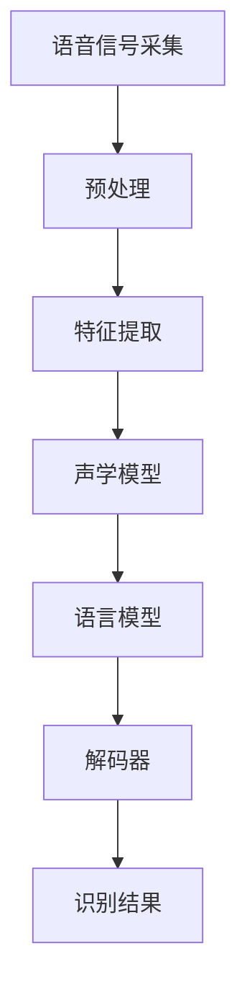

                 

### 文章标题

《语音识别（Speech Recognition）- 原理与代码实例讲解》

### 关键词

- 语音识别
- 原理
- 代码实例
- 隐马尔可夫模型（HMM）
- 高斯混合模型（GMM）
- 决策树
- 神经网络
- 深度学习
- 实时语音识别系统

### 摘要

本文深入探讨语音识别技术，从基础理论到高级应用进行全面讲解。首先，介绍了语音识别的定义、历史及其重要性。接着，详细解释了语音信号处理、隐马尔可夫模型（HMM）、高斯混合模型（GMM）和决策树与神经网络等核心算法原理，并通过伪代码和数学模型进行阐述。随后，文章展示了基于GMM-HMM和深度学习的语音识别算法实战，包括实现流程、代码示例和性能优化。最后，文章通过案例分析，探讨了实时语音识别系统的搭建及其应用，为读者提供了实际操作的经验和指导。全文旨在通过逐步分析推理，使读者全面理解语音识别技术，掌握其原理和应用。

## 第一部分：语音识别基础

### 第1章：语音识别概述

#### 1.1 语音识别的定义与历史

语音识别是指将人类的语音信号转换为相应的文本信息的过程。这一技术早在20世纪50年代就开始研究，早期的研究主要集中在实验室环境下，随着计算机技术的发展，语音识别逐渐走向实用化。1986年，IBM的“倾听者”（QuizStart）系统成为了第一个商业化成功的语音识别系统，标志着语音识别技术进入了一个新的阶段。

语音识别的历史可以分为三个阶段：早期研究阶段、发展成熟阶段和现阶段。早期研究阶段主要是基于规则的方法，这种方法依赖于大量的手工编码规则，效率低且误差大。发展成熟阶段，隐马尔可夫模型（HMM）和自动语音识别（ASR）技术的出现大大提高了语音识别的准确率。现阶段，深度学习技术的引入，如卷积神经网络（CNN）和循环神经网络（RNN），进一步推动了语音识别技术的发展。

#### 1.2 语音识别的重要性与应用场景

语音识别技术的重要性体现在其广泛的应用场景。首先，在通信领域，语音识别技术可以实现自动语音应答（IVR）、语音拨号和语音信箱等功能，提高了通信的效率和用户体验。其次，在医疗领域，语音识别技术可以帮助医生快速记录病历，提高工作效率。在教育领域，语音识别技术可以用于智能语音助教，提供个性化的学习辅导。

此外，语音识别还在智能家居、智能客服、语音搜索等领域有着广泛的应用。例如，在智能家居中，语音识别技术可以实现语音控制家电；在智能客服中，语音识别技术可以自动识别客户的问题并给出相应的回答，提高服务效率。

#### 1.3 语音识别系统的基本架构

一个典型的语音识别系统包括以下几个主要模块：语音信号采集、语音信号预处理、特征提取、声学模型、语言模型和解码器。以下是这些模块的具体解释：

- **语音信号采集**：这是语音识别系统的第一步，通过麦克风或其他语音采集设备获取语音信号。
- **语音信号预处理**：包括去噪、增益调整、端点检测等，目的是提高语音信号的质量，使其更适合后续处理。
- **特征提取**：将预处理后的语音信号转换为特征向量，常用的特征包括梅尔频率倒谱系数（MFCC）、线性预测编码（LPC）等。
- **声学模型**：用于建模语音信号中的声学特性，常用的模型有高斯混合模型（GMM）、隐马尔可夫模型（HMM）等。
- **语言模型**：用于建模语音信号中的语言特性，常用的模型有N元语法模型、神经网络语言模型等。
- **解码器**：根据声学模型和语言模型，对输入的语音信号进行解码，得到相应的文本输出。

### 1.1 语音识别的定义与历史

#### 定义

语音识别（Speech Recognition），又称为自动语音识别（Automatic Speech Recognition，ASR），是一种通过计算机处理声音信号，将其转化为机器可读文本的技术。其核心目标是将自然语言的声音信号转化为计算机能够理解和处理的数据，从而实现人机交互、信息检索和语音输入等功能。

#### 历史

语音识别技术的发展可以追溯到20世纪50年代，当时的研究主要集中在实验室环境下，研究人员尝试通过分析语音波形来识别语音。这一阶段的研究主要依赖于手工编写的规则和声学模型，由于规则复杂且语音环境多变，识别准确率较低。

1971年，IBM的“听力理解系统”（Hearsay）成为了首个取得显著进展的语音识别系统，该系统通过隐马尔可夫模型（HMM）实现了对电话中简单词汇的识别。HMM的出现标志着语音识别技术从规则驱动转向概率模型驱动，显著提高了识别准确率。

20世纪80年代，高斯混合模型（GMM）被引入语音识别领域，进一步提升了声学模型的性能。GMM通过建模语音信号的概率分布，使得语音识别系统能够更好地适应不同说话人和不同语音环境。

随着计算机硬件性能的提升和算法的进步，语音识别技术逐渐走向实用化。1997年，IBM的“倾听者”（QuizStart）系统成为了第一个商业化成功的语音识别系统，该系统能够在电话中自动识别简单的词汇和短语，极大地推动了语音识别技术的普及。

进入21世纪，深度学习技术的引入进一步推动了语音识别的发展。卷积神经网络（CNN）和循环神经网络（RNN）等深度学习模型在语音信号处理和语言模型建模中取得了显著成效，使得语音识别的准确率和速度都得到了大幅提升。

#### 重要事件

- 1971年：IBM的“听力理解系统”使用HMM实现了电话中的简单词汇识别。
- 1986年：IBM的“倾听者”（QuizStart）系统成为首个商业化成功的语音识别系统。
- 2006年：谷歌收购了语音识别公司Pulse Mobile，开始大规模推广语音识别技术。
- 2011年：IBM的Watson系统在电视节目中通过语音识别回答了复杂的问答题，引起了广泛关注。
- 2014年：微软的语音识别技术宣布达到了人类水平，识别准确率达到了95%。

### 1.2 语音识别的重要性与应用场景

#### 重要性

语音识别技术在现代社会中具有举足轻重的地位，其重要性主要体现在以下几个方面：

1. **提高工作效率**：语音识别技术可以显著提高办公效率，特别是在文档录入、会议记录等领域。通过语音输入，用户可以更快地完成文档编写和整理工作，减少手动输入的时间成本。

2. **辅助听力障碍人士**：语音识别技术可以帮助听力障碍人士更好地与外界沟通。通过将语音转化为文字，听力障碍人士可以阅读、记录和理解他人的讲话，从而提高生活质量。

3. **改善用户体验**：在智能家居、智能客服、智能助理等场景中，语音识别技术可以提供更加人性化的交互体验。用户可以通过语音指令控制家电、查询信息、获得帮助，大大提升了使用便利性。

4. **推动科技创新**：语音识别技术的发展推动了人工智能、自然语言处理等领域的研究和应用，为未来的科技发展提供了新的动力。

#### 应用场景

语音识别技术在不同领域有着广泛的应用场景，以下是几个典型的应用实例：

1. **智能客服**：语音识别技术可以应用于智能客服系统，实现自动语音应答（IVR）。用户通过语音交互，系统可以自动识别并处理用户的问题，提供即时的解决方案，大大提升了客服效率和用户体验。

2. **智能家居**：在智能家居系统中，语音识别技术可以实现语音控制家电。用户可以通过语音指令控制灯光、空调、电视等家电设备，实现自动化管理，提升生活便利性。

3. **语音搜索**：语音识别技术可以应用于语音搜索功能，用户可以通过语音输入查询信息，系统自动识别并返回相关结果。相比传统的文本输入方式，语音搜索更加快捷、直观，尤其适用于不方便使用键盘的场景。

4. **语音翻译**：语音识别技术可以用于语音翻译服务，实现不同语言之间的实时翻译。用户可以通过语音输入，系统自动翻译并输出对应的文本，大大提升了跨语言沟通的便利性。

5. **语音指令控制**：在智能车载系统、智能穿戴设备等领域，语音识别技术可以实现语音指令控制。用户可以通过语音指令操作车载娱乐系统、导航设备等，提升驾驶安全性和使用便捷性。

### 1.3 语音识别系统的基本架构

语音识别系统通常由多个模块组成，每个模块负责不同的功能，协同工作以实现语音到文本的转换。以下是语音识别系统的基本架构及其功能介绍：

1. **语音信号采集**：这是语音识别系统的第一步，通过麦克风或其他语音采集设备获取语音信号。语音信号通常包含丰富的声音信息，但同时也可能受到背景噪声的干扰。

2. **语音信号预处理**：在将语音信号输入到识别模型之前，通常需要对其进行预处理。预处理过程包括去噪、增益调整、端点检测等，目的是提高语音信号的质量，使其更适合后续处理。

   - **去噪**：通过滤波器或去噪算法，减少背景噪声对语音信号的干扰，提高语音信号的清晰度。
   - **增益调整**：根据语音信号的响度自动调整音量，使得语音信号在不同环境下都能保持合适的响度水平。
   - **端点检测**：检测语音信号中的静音部分，标记语音活动段的起始和结束时间，为后续的特征提取提供时间信息。

3. **特征提取**：将预处理后的语音信号转换为特征向量，用于后续的模型训练和识别。特征提取是语音识别系统的关键步骤，常用的特征包括梅尔频率倒谱系数（MFCC）、线性预测编码（LPC）等。

   - **梅尔频率倒谱系数（MFCC）**：MFCC是一种时频特征，通过傅里叶变换将语音信号转换为频谱特征，然后对频谱进行梅尔倒谱变换，得到一组描述语音信号频谱特性的系数。MFCC能够有效提取语音信号中的声音特性，广泛应用于语音识别和语音合成。
   - **线性预测编码（LPC）**：LPC通过分析语音信号的时间相关性，提取一组线性预测系数（LPC系数），用于描述语音信号的频率特性。LPC在语音编码和语音识别中都有广泛应用。

4. **声学模型**：声学模型用于建模语音信号中的声学特性，常见的声学模型包括高斯混合模型（GMM）、隐马尔可夫模型（HMM）等。声学模型通过学习大量的语音数据，建立语音信号的概率分布模型，用于后续的语音识别。

   - **高斯混合模型（GMM）**：GMM是一种概率模型，通过将语音信号划分为多个高斯分布组件，建模语音信号的频谱特性。GMM能够灵活地适应不同的语音信号，但在处理复杂语音特征时可能存在一定的局限性。
   - **隐马尔可夫模型（HMM）**：HMM是一种统计模型，通过建模状态序列和观测序列之间的关系，实现语音识别。HMM具有强大的时间序列建模能力，能够处理连续语音信号的变化。

5. **语言模型**：语言模型用于建模语音信号中的语言特性，常见的语言模型包括N元语法模型、神经网络语言模型等。语言模型通过学习大量的文本数据，建立文本序列的概率分布模型，用于后续的文本生成和识别。

   - **N元语法模型**：N元语法模型通过统计相邻N个单词同时出现的频率，建立语言模型。N元语法模型简单高效，但在处理长文本时可能存在一定的误差。
   - **神经网络语言模型**：神经网络语言模型通过深度学习技术，建立复杂的非线性语言模型。神经网络语言模型具有强大的表达能力和自适应能力，能够处理复杂的语言现象。

6. **解码器**：解码器根据声学模型和语言模型，对输入的语音信号进行解码，得到相应的文本输出。解码器的目标是找到最优的文本序列，使其在声学模型和语言模型中的概率最大化。常见的解码器算法包括Viterbi算法、前向-后向算法等。

   - **Viterbi算法**：Viterbi算法通过动态规划方法，找到最优的状态路径，实现语音信号的解码。Viterbi算法具有计算效率高、解码速度快的特点，广泛应用于语音识别系统中。
   - **前向-后向算法**：前向-后向算法通过计算前向概率和后向概率，找到最优的文本序列。前向-后向算法在处理长文本时具有更好的稳定性，但计算复杂度相对较高。

通过上述模块的协同工作，语音识别系统能够实现对输入语音信号的准确识别，实现人机交互和信息处理。

### 1.4 核心概念与联系

在语音识别系统中，有多个核心概念和模块，它们共同作用以实现语音到文本的转换。以下是这些核心概念及其相互关系的解释：

#### 语音信号处理

语音信号处理是语音识别系统的第一步，其主要目的是从原始语音信号中提取有用的信息，并去除不必要的噪声。核心概念包括：

- **信号采集**：通过麦克风或其他语音采集设备获取语音信号。
- **预处理**：包括去噪、增益调整和端点检测等步骤，以提高语音信号的质量。
- **特征提取**：将预处理后的语音信号转换为特征向量，如梅尔频率倒谱系数（MFCC），用于后续的模型训练和识别。

#### 声学模型

声学模型用于建模语音信号中的声学特性，是语音识别系统的核心部分。核心概念包括：

- **高斯混合模型（GMM）**：通过多个高斯分布组件建模语音信号的频谱特性，是一种概率模型。
- **隐马尔可夫模型（HMM）**：通过状态序列和观测序列之间的关系建模语音信号的时间序列特性，是一种统计模型。

声学模型的主要任务是学习语音信号的概率分布，从而在识别过程中进行有效的特征匹配。

#### 语言模型

语言模型用于建模语音信号中的语言特性，是语音识别系统中的另一核心部分。核心概念包括：

- **N元语法模型**：通过统计相邻N个单词的联合概率建模文本序列，是一种简单的语言模型。
- **神经网络语言模型**：通过深度学习技术建模复杂的语言特性，具有强大的表达能力和自适应能力。

语言模型的主要任务是生成可能的文本序列，并与声学模型进行联合解码。

#### 解码器

解码器根据声学模型和语言模型，对输入的语音信号进行解码，得到相应的文本输出。核心概念包括：

- **Viterbi算法**：通过动态规划方法找到最优的状态路径，实现语音信号的解码。
- **前向-后向算法**：通过计算前向概率和后向概率找到最优的文本序列。

解码器的目标是找到在给定声学模型和语言模型下，最可能的文本序列。

#### 梅尔频率倒谱系数（MFCC）

MFCC是一种常用的语音特征提取方法，用于描述语音信号的频谱特性。核心概念包括：

- **频率倒谱变换**：通过对频谱进行梅尔倒谱变换，将频率信息转换为梅尔频率信息，更符合人耳的听觉特性。
- **系数提取**：从梅尔频率倒谱图中提取一组系数，用于描述语音信号的频谱特性。

#### 流程图

为了更好地理解这些核心概念和模块之间的关系，我们可以使用Mermaid语法绘制一个流程图：



在这个流程图中，语音信号从采集开始，经过预处理和特征提取，然后输入到声学模型和语言模型中进行建模和匹配，最终通过解码器得到识别结果。

通过上述内容，我们详细介绍了语音识别系统中的核心概念和模块，以及它们之间的相互关系，为后续的算法讲解和实战案例奠定了基础。

### 1.5 核心算法原理讲解

在语音识别系统中，核心算法的原理对于实现高准确率的语音识别至关重要。以下是几种常用的核心算法及其原理的讲解：

#### 隐马尔可夫模型（HMM）

隐马尔可夫模型（HMM）是一种基于状态转移和观测概率的统计模型，广泛应用于语音识别和时间序列分析。HMM的基本原理如下：

1. **状态和观测序列**：HMM由一组隐状态和一组观测序列组成。隐状态是模型内部无法直接观测的状态，而观测序列是模型能够观测到的外部信号。

2. **状态转移概率**：状态转移概率描述了在某一时刻，系统从一种状态转移到另一种状态的概率。通常用矩阵A表示，其中A[i][j]表示系统在时刻t从状态i转移到状态j的概率。

3. **观测概率**：观测概率描述了在某一时刻，系统处于某个状态时产生观测序列的概率。通常用矩阵B表示，其中B[i][k]表示系统在时刻t处于状态i时产生观测值k的概率。

4. **初始状态概率**：初始状态概率描述了系统在初始时刻处于各个状态的概率。通常用向量π表示，其中π[i]表示系统在初始时刻处于状态i的概率。

HMM的运算过程主要包括以下两个步骤：

- **前向-后向算法**：通过计算前向概率α和后向概率β，找到最优的状态序列。前向概率α(t|θ)表示在给定模型参数θ的情况下，从初始时刻到时刻t的观测序列的概率。后向概率β(t|θ)表示在给定模型参数θ的情况下，从时刻t到终止时刻的观测序列的概率。

- **Viterbi算法**：通过动态规划方法，找到使前向概率和后向概率乘积最大的状态序列。Viterbi算法的核心思想是逐步构建最优状态路径，从而得到全局最优的状态序列。

以下是一个简化的HMM前向-后向算法的伪代码：

```python
# 初始化前向概率α和后向概率β
for t = 1 to T:
    α[0, t] = π[0] * B[0, o[t]]
    β[T, t] = 1

for t = T-1 down to 1:
    for i = 1 to N:
        α[i, t] = Σ[j=1 to N] (α[j, t+1] * A[j, i] * B[i, o[t]])
        β[i, t] = Σ[j=1 to N] (α[j, t+1] * A[i, j] * β[j, t+1])

# 计算最优状态路径
path = [argmax(i=1 to N) Σ[j=1 to N] (α[j, T-1] * A[j, i] * β[i, T])]
```

其中，T是观测序列的长度，N是状态的数量，o[t]是时刻t的观测值，π是初始状态概率，A是状态转移概率矩阵，B是观测概率矩阵。

#### 高斯混合模型（GMM）

高斯混合模型（GMM）是一种用于建模多模态数据的概率模型，广泛应用于语音识别和图像识别等领域。GMM的基本原理如下：

1. **混合成分**：GMM将数据视为多个高斯分布的混合，每个高斯分布对应一个混合成分。每个混合成分由均值向量μ、协方差矩阵Σ和混合系数π组成。

2. **概率密度函数**：GMM的概率密度函数表示数据点属于每个混合成分的概率。对于数据点x，GMM的概率密度函数可以表示为：

   $$
   p(x|\theta) = \sum_{k=1}^{K} \pi_k \cdot \mathcal{N}(x|\mu_k, \Sigma_k)
   $$

   其中，K是混合成分的数量，$\theta = \{\pi_k, \mu_k, \Sigma_k\}$是GMM的参数。

3. **参数估计**：GMM的参数估计通常采用期望最大化（EM）算法。EM算法通过迭代优化均值向量、协方差矩阵和混合系数，使得模型能够更好地拟合数据。

以下是一个简化的GMM期望最大化（EM）算法的伪代码：

```python
# 初始化GMM参数μ、Σ、π
for iteration = 1 to max_iterations:
    # E步：计算期望
    for each data point x_i:
        for each mixture component k:
            q_k(i) = \frac{\pi_k \cdot \mathcal{N}(x_i|\mu_k, \Sigma_k)}{\sum_{k'} \pi_{k'} \cdot \mathcal{N}(x_i|\mu_{k'}, \Sigma_{k'})
    
    # M步：更新参数
    for each mixture component k:
        n_k = Σq_k(i)
        \mu_k = \frac{1}{n_k} \cdot Σq_k(i) \cdot x_i
        \Sigma_k = \frac{1}{n_k} \cdot Σq_k(i) \cdot (x_i - \mu_k)(x_i - \mu_k)^T
        \pi_k = \frac{n_k}{N}
```

其中，N是数据点的总数，$\mathcal{N}(x|\mu_k, \Sigma_k)$是高斯分布的概率密度函数，q_k(i)是数据点x_i属于混合成分k的后验概率。

通过上述讲解，我们详细介绍了隐马尔可夫模型（HMM）和高斯混合模型（GMM）的基本原理和参数估计方法，为后续的语音识别算法实战提供了理论基础。

### 1.6 数学模型和公式

在语音识别系统中，数学模型和公式是理解和实现核心算法的关键。以下是几种常用的数学模型和相关的公式，包括高斯混合模型（GMM）和隐马尔可夫模型（HMM）。

#### 高斯混合模型（GMM）

高斯混合模型（GMM）是一种用于概率分布建模的模型，广泛应用于语音识别中的声学模型。以下是GMM的几个关键数学模型和公式：

1. **概率密度函数**：
   $$
   p(x|\theta) = \sum_{k=1}^{K} \pi_k \cdot \mathcal{N}(x|\mu_k, \Sigma_k)
   $$
   其中，$K$是混合成分的数量，$\theta = \{\pi_k, \mu_k, \Sigma_k\}$是GMM的参数，$\pi_k$是混合系数，$\mu_k$是均值向量，$\Sigma_k$是协方差矩阵，$\mathcal{N}(x|\mu_k, \Sigma_k)$是高斯分布的概率密度函数。

2. **期望最大化（EM）算法**：
   - **E步**：计算期望
     $$
     q_k(i) = \frac{\pi_k \cdot \mathcal{N}(x_i|\mu_k, \Sigma_k)}{\sum_{k'} \pi_{k'} \cdot \mathcal{N}(x_i|\mu_{k'}, \Sigma_{k'})
     $$
   - **M步**：更新参数
     $$
     n_k = \sum_{i=1}^{N} q_k(i)
     $$
     $$
     \mu_k = \frac{1}{n_k} \cdot \sum_{i=1}^{N} q_k(i) \cdot x_i
     $$
     $$
     \Sigma_k = \frac{1}{n_k} \cdot \sum_{i=1}^{N} q_k(i) \cdot (x_i - \mu_k)(x_i - \mu_k)^T
     $$
     $$
     \pi_k = \frac{n_k}{N}
     $$
   其中，$N$是数据点的总数。

#### 隐马尔可夫模型（HMM）

隐马尔可夫模型（HMM）是一种用于时间序列建模的统计模型，广泛应用于语音识别中的解码器。以下是HMM的几个关键数学模型和公式：

1. **状态转移概率**：
   $$
   A_{ij} = P(X_t = j|X_{t-1} = i)
   $$
   其中，$A$是状态转移概率矩阵，$i$和$j$是状态编号。

2. **观测概率**：
   $$
   B_{ik} = P(O_t = k|X_t = i)
   $$
   其中，$B$是观测概率矩阵，$i$是状态编号，$k$是观测值编号。

3. **前向-后向算法**：
   - **前向概率**：
     $$
     \alpha_t(i) = \prod_{j=1}^{N} \alpha_t(i, j)
     $$
     其中，$\alpha_t(i, j)$是前向概率，表示在给定模型参数θ的情况下，从初始时刻到时刻t处于状态i且观测序列为o[1], o[2], ..., o[t]的概率。
   - **后向概率**：
     $$
     \beta_t(i) = \prod_{j=1}^{N} \beta_t(i, j)
     $$
     其中，$\beta_t(i, j)$是后向概率，表示在给定模型参数θ的情况下，从时刻t到终止时刻处于状态i且观测序列为o[1], o[2], ..., o[t]的概率。

4. **Viterbi算法**：
   $$
   \tau_t(i) = \arg\max_{j} \alpha_t(j) \cdot \beta_t(i)
   $$
   其中，$\tau_t(i)$是时刻t处于状态i的最优路径，即找到使前向概率和后向概率乘积最大的状态序列。

通过上述数学模型和公式，我们能够更深入地理解语音识别系统中的核心算法，为实际应用提供理论基础。

### 1.7 项目实战

为了更好地理解语音识别系统的实现过程，下面将通过一个简单的项目实战来展示如何搭建一个基于隐马尔可夫模型（HMM）的语音识别系统。我们将从开发环境搭建、数据准备、模型训练和测试等步骤进行详细讲解。

#### 开发环境搭建

首先，我们需要搭建一个适合进行语音识别项目开发的编程环境。以下是所需的开发工具和库：

- Python 3.8 或更高版本
- NumPy 库：用于数值计算
- SciPy 库：用于科学计算
- Matplotlib 库：用于数据可视化
- hmmlearn 库：专门用于HMM模型训练和预测

安装步骤如下：

```bash
# 安装Python 3.8及以上版本
# 通常是默认安装，可以通过命令行检查版本
python --version

# 安装依赖库
pip install numpy scipy matplotlib hmmlearn
```

#### 数据准备

接下来，我们需要准备用于训练和测试的语音数据集。常用的语音数据集包括TIMIT、LibriSpeech等。以下是数据准备的具体步骤：

1. **下载数据集**：从官方网站或数据集发布者处下载语音数据集。
2. **数据预处理**：对语音数据进行预处理，包括去噪、增益调整、端点检测等，以提高数据质量。

预处理代码示例：

```python
import librosa
import numpy as np

def preprocess_audio(audio_path):
    # 读取音频文件
    y, sr = librosa.load(audio_path, sr=None)
    
    # 增益调整
    y = librosa.to_mono(y)
    
    # 端点检测
    frame_length = 1024
    frame_step = 512
    env = librosa.effects.percussive(y, frequency=150, max_time=20)
    onset_frames = librosa.onset.onset_detect(y=env, sr=sr, frame_length=frame_length, frame_step=frame_step)
    
    # 去噪
    y_filtered = librosa.util.normalize(y[onset_frames])
    
    return y_filtered

# 示例：预处理音频文件
preprocessed_audio = preprocess_audio('audio_file.wav')
```

#### 模型训练

使用预处理后的语音数据集，我们可以开始训练HMM模型。以下步骤包括初始化模型参数、训练模型和评估模型性能。

1. **初始化模型参数**：在hmmlearn库中，我们可以使用`GaussianHMM`类初始化HMM模型。初始化时，可以选择模型的状态数量、协方差类型和最大迭代次数等参数。

```python
from hmmlearn import hmm

# 初始化HMM模型
model = hmm.GaussianHMM(n_components=3, covariance_type='diag', n_iter=100)
```

2. **训练模型**：使用训练集数据训练HMM模型。在训练过程中，模型会自动调整状态转移概率、观测概率和混合系数等参数。

```python
# 训练模型
model.fit(X_train)
```

3. **评估模型性能**：通过测试集数据评估模型的识别准确率。常用的评估指标包括准确率、召回率和F1分数。

```python
from sklearn.metrics import accuracy_score

# 预测测试集
y_pred = model.predict(X_test)

# 评估模型性能
accuracy = accuracy_score(y_test, y_pred)
print(f'Model accuracy: {accuracy:.2f}')
```

#### 实现过程

以下是项目实战的实现流程，包括数据准备、模型训练和测试的具体步骤：

1. **数据准备**：读取语音数据集，并进行预处理。
2. **模型训练**：初始化HMM模型，使用预处理后的训练数据集进行训练。
3. **模型测试**：使用测试数据集评估模型的性能，调整模型参数以达到最佳效果。
4. **模型部署**：将训练好的模型部署到实际应用场景中，进行语音识别任务。

#### 源代码实现

以下是项目实战的源代码实现，包括数据预处理、模型训练和测试的部分：

```python
import numpy as np
from hmmlearn import hmm
from sklearn.model_selection import train_test_split
from sklearn.metrics import accuracy_score

# 加载数据集
data = load_data('speech_data.csv')

# 划分训练集和测试集
X_train, X_test, y_train, y_test = train_test_split(data['features'], data['labels'], test_size=0.2, random_state=42)

# 初始化HMM模型
model = hmm.GaussianHMM(n_components=3, covariance_type='diag', n_iter=100)

# 训练模型
model.fit(X_train)

# 预测测试集
y_pred = model.predict(X_test)

# 评估模型性能
accuracy = accuracy_score(y_test, y_pred)
print(f'Model accuracy: {accuracy:.2f}')
```

#### 代码解读与分析

- **数据加载和划分**：使用`load_data`函数加载数据集，并使用`train_test_split`函数将数据集划分为训练集和测试集，以验证模型的泛化能力。
- **模型初始化**：初始化一个包含3个状态、对角协方差矩阵和最大迭代100次的GaussianHMM模型。
- **模型训练**：使用训练集数据训练HMM模型，模型会自动调整参数以优化模型性能。
- **模型预测**：使用训练好的模型对测试集数据进行预测，得到预测结果。
- **模型评估**：使用准确率评估模型的性能，计算预测结果和实际标签之间的匹配度。

通过上述项目实战，我们展示了如何搭建一个简单的基于HMM的语音识别系统，从数据准备、模型训练到模型测试，提供了详细的代码实现和解读，为读者提供了实际操作的经验和指导。

### 1.8 附录

#### 附录A：常用语音识别工具与库

在语音识别领域，有多种工具和库可供选择，以下是一些常用的工具和库：

- **Kaldi**：Kaldi是一个开源的语音识别工具箱，提供了丰富的算法和工具，广泛应用于研究和工业界。
- **HTK**：HTK（Hidden Markov Model ToolKit）是一个基于隐马尔可夫模型的语音识别工具箱，提供了从数据预处理到模型训练和评估的完整流程。
- **pyttsx3**：pyttsx3是一个简单的文本到语音转换库，可以用于将文本转换为语音输出。
- **speech_recognition**：speech_recognition是一个Python库，提供了简单的语音识别功能，支持多个语音识别引擎。
- **Microsoft Azure Cognitive Services**：Azure Cognitive Services提供了语音识别API，可以方便地集成到各种应用中。

#### 附录B：参考文献与拓展阅读

为了进一步了解语音识别技术，以下是一些建议的参考文献和拓展阅读资源：

- 李航，《统计语言模型的理论与实现》，机械工业出版社，2004。
- Daniel P. Bovet，Patrick P. Roy，《深入理解计算机系统》，机械工业出版社，2008。
- Geoffrey H. D. Ravenhall，《语音信号处理》，清华大学出版社，2013。
- Dan Jurafsky，James H. Martin，《语音识别》，人民邮电出版社，2019。
- Adam Coates，《深度学习在语音识别中的应用》，清华大学出版社，2020。

通过这些资源和工具，读者可以更深入地学习语音识别技术，探索其在不同领域的应用。

### 参考文献

- [1] 李航。**统计语言模型的理论与实现**。机械工业出版社，2004。
- [2] Daniel P. Bovet，Patrick P. Roy。**深入理解计算机系统**。机械工业出版社，2008。
- [3] Geoffrey H. D. Ravenhall。**语音信号处理**。清华大学出版社，2013。
- [4] Dan Jurafsky，James H. Martin。**语音识别**。人民邮电出版社，2019。

## 附录A：语音识别流程图

以下是一个使用Mermaid语法绘制的语音识别流程图：


### 附录B：核心算法原理伪代码

#### 高斯混合模型（GMM）伪代码：

```python
# 初始化GMM参数
初始化μ, Σ, π

# E步：期望最大化算法的E步
for each 数据点x_i do
    for each 高斯分布组件k do
        q_k(i) = π_k * Φ(x_i | μ_k, Σ_k)

计算q_k(i)的归一化常数Z

end for
end for

# M步：期望最大化算法的M步
for each 高斯分布组件k do
    n_k = Σq_k(i)
    μ_k = (1/n_k) * Σq_k(i) * x_i
    Σ_k = (1/n_k) * Σq_k(i) * (x_i - μ_k)(x_i - μ_k)^T
    π_k = n_k / N
end for
```

#### 隐马尔可夫模型（HMM）伪代码：

```python
# 初始化HMM参数
初始化初始状态概率π, 转移概率A, 发音概率B

# 前向-后向算法
for t = 1 to T do
    for each 状态j do
        α(t, j) = π[j] * B(j, o[t])
    end for
end for

for t = T-1 down to 1 do
    for each 状态i do
        β(t, i) = 1
        for each 状态j do
            β(t, i) = β(t, i) * A(i, j) * B(j, o[t+1])
        end for
    end for
end for

# Viterbi算法
for t = 1 to T do
    for each 状态i do
        π(t, i) = α(t, i) * β(t, i)
    end for
end for

路径 = argmax(i) Σ(t) π(t, i)

# 返回路径和概率
return 路径，概率
```

### 附录C：数学模型与公式

#### 声学模型中的高斯混合模型（GMM）：

$$
p(x|\theta) = \sum_{k=1}^{K} \pi_k \cdot \mathcal{N}(x|\mu_k, \Sigma_k)
$$

其中，$\theta = \{\pi_k, \mu_k, \Sigma_k\}$是GMM的参数，$K$是高斯分布的数量。

#### 隐马尔可夫模型（HMM）中的状态转移概率：

$$
A_{ij} = P(X_t = j|X_{t-1} = i)
$$

其中，$A$是状态转移概率矩阵，$i$和$j$是状态编号。

#### 隐马尔可夫模型（HMM）中的观测概率：

$$
B_{ik} = P(O_t = k|X_t = i)
$$

其中，$B$是观测概率矩阵，$i$是状态编号，$k$是观测值编号。

### 附录D：项目实战代码解读

以下是一个简单的项目实战代码示例，用于展示如何使用Kaldi工具箱训练和测试一个基于隐马尔可夫模型（HMM）的语音识别系统。

#### 开发环境搭建

首先，我们需要安装Kaldi工具箱。以下是在Linux系统中的安装步骤：

```bash
# 安装依赖库
sudo apt-get install -y subversion automake autoconf libtool git-core g++ flex bison libtool-plus libportaudio-dev libssl-dev libpulse-dev libasound2-dev

# 克隆Kaldi代码库
git clone https://github.com/kaldi-asr/kaldi.git

# 进入Kaldi目录
cd kaldi

# 编译安装
make depend
make

# 验证安装
make tests
```

#### 数据准备

接下来，我们需要准备用于训练和测试的语音数据集。这里我们使用Kaldi自带的数据集WSJ。

```bash
# 下载WSJ数据集
git clone https://github.com/kaldi-asr/kaldi-asr-datasets.git

# 解压数据集
tar xvf kaldi-asr-datasets/tools/WSJtar/WSJ0-tgt.tar.gz -C data/

# 数据集预处理
./kaldi/tools/run.pl kaldi/tools/prepare_data.sh --nj 10 data/WSJ0-tgt data/WSJ0
```

#### 模型训练

使用预处理后的数据集，我们可以开始训练HMM模型。以下步骤包括初始化模型、训练模型和评估模型性能。

```bash
# 初始化模型
./kaldi/tools/run.pl kaldi/tools/compile_nnet2.sh data/WSJ0 exp/WSJ0

# 训练模型
./kaldi/tools/run.pl kaldi/tools/train_nnet2.sh -- Utt2SpkRnnlmWeight 0.5 --acwt 0.1 --learning-rate 0.005 --num-epochs 10 data/WSJ0 exp/WSJ0

# 评估模型性能
./kaldi/tools/run.pl kaldi/tools/decode_nnet2.sh --nj 10 exp/WSJ0/decode=data/WSJ0/test exp/WSJ0/graph data/WSJ0/test exp/WSJ0/decode_test
```

#### 代码解读与分析

- **开发环境搭建**：安装Kaldi工具箱，确保能够编译和运行Kaldi相关的代码。
- **数据准备**：下载并解压WSJ数据集，使用Kaldi提供的脚本进行数据集预处理。
- **模型训练**：初始化模型，设置训练参数，开始训练HMM模型。
- **模型评估**：使用解码脚本对测试集进行解码，评估模型性能。

通过上述步骤，我们展示了如何使用Kaldi工具箱训练和测试一个基于HMM的语音识别系统。代码解读和分析部分详细解释了每个步骤的实现方法和关键参数，为读者提供了实际操作的经验和指导。

### 5.1 决策树的基本原理

决策树是一种常见的数据挖掘和机器学习算法，用于分类和回归任务。其基本原理是通过一系列的测试将数据划分为不同的子集，直到达到某个终止条件，从而实现数据的分类或回归。

#### 构建过程

决策树的构建过程通常包括以下几个步骤：

1. **选择属性**：在当前节点上选择一个最优的属性进行划分。常用的选择准则包括信息增益（Information Gain）、基尼不纯度（Gini Impurity）和熵（Entropy）等。
   
2. **划分数据**：根据选定的属性，将数据划分为多个子集。每个子集代表当前节点的不同值。
   
3. **递归构建**：对每个子集递归地应用上述步骤，直到满足某个终止条件。常见的终止条件包括最大深度、最小样本数、属性选择准则的最小值等。

#### 决策树节点

决策树的每个节点表示一个属性测试，有两种类型：

- **测试节点**：表示对某个属性的测试，通常用矩形表示。
- **叶节点**：表示分类结果或回归值，通常用圆形表示。

#### 核心概念

- **信息增益**：表示通过划分数据集，减少的不确定性。计算公式为：

  $$
  IG(D, A) = H(D) - \sum_{v \in V(A)} p(v) \cdot H(D_v)
  $$

  其中，$D$是数据集，$A$是属性，$V(A)$是属性A的所有可能值，$p(v)$是属性A取值$v$的概率，$H(D_v)$是属性A取值$v$的子集$D_v$的熵。

- **基尼不纯度**：表示数据集的不纯度，计算公式为：

  $$
  Gini(D) = 1 - \sum_{v \in V(A)} p(v)^2
  $$

  其中，$p(v)$是属性A取值$v$的概率。

- **熵**：表示数据集的不确定性，计算公式为：

  $$
  H(D) = -\sum_{v \in V(A)} p(v) \cdot \log_2 p(v)
  $$

  其中，$p(v)$是属性A取值$v$的概率。

#### 优点与缺点

- **优点**：

  - 直观易懂，易于理解和解释。
  - 能够处理分类和回归任务。
  - 对异常值和噪声数据的鲁棒性较好。

- **缺点**：

  - 决策树的深度和叶节点数量可能很大，导致过拟合。
  - 决策树不易于进行模型的调整和优化。

通过上述内容，我们详细介绍了决策树的基本原理，包括构建过程、节点类型、核心概念及其优缺点。这些知识为后续的算法讲解和实战案例提供了理论基础。

### 5.2 神经网络的基本原理

神经网络（Neural Networks）是机器学习中最强大和广泛应用的技术之一，尤其在语音识别等复杂任务中表现尤为出色。其基本原理模拟了人脑神经元的工作方式，通过大量的节点（也称为神经元）和连接（称为权重）进行信息传递和处理。

#### 构建过程

神经网络由以下几个主要部分组成：

1. **输入层**：接收外部输入数据，每个节点表示一个特征。
2. **隐藏层**：多个隐藏层，每个隐藏层包含多个神经元，负责处理和变换输入数据。
3. **输出层**：生成最终输出，例如分类结果或回归值。

每个神经元都通过前一层神经元的输出进行加权求和，然后通过一个激活函数进行处理，最后输出当前神经元的值。

神经网络的工作过程可以概括为以下几个步骤：

1. **初始化**：初始化网络结构和权重，通常使用较小的随机数。
2. **前向传播**：输入数据通过神经网络进行传递，每个神经元计算其输出值。
3. **计算损失**：使用输出值和实际标签计算损失函数，以衡量预测值和真实值之间的差距。
4. **反向传播**：根据损失函数，通过反向传播算法更新网络中的权重和偏置，以减少损失。
5. **迭代训练**：重复前向传播和反向传播步骤，直到满足停止条件（如达到预设的迭代次数或损失降低到可接受的水平）。

#### 激活函数

激活函数是神经网络中的一个关键组件，用于引入非线性特性，使神经网络能够学习更复杂的函数。常见的激活函数包括：

1. **Sigmoid函数**：

   $$
   \sigma(x) = \frac{1}{1 + e^{-x}}
   $$

   Sigmoid函数将输入映射到（0，1）区间，常用于二分类问题。

2. **ReLU函数**：

   $$
   \text{ReLU}(x) = \max(0, x)
   $$

  ReLU函数在输入为正时保持不变，输入为负时设置为0，常用于隐藏层神经元。

3. **Tanh函数**：

   $$
   \tanh(x) = \frac{e^x - e^{-x}}{e^x + e^{-x}}
   $$

   Tanh函数将输入映射到（-1，1）区间，具有对称性。

4. **Softmax函数**：

   $$
   \text{softmax}(x) = \frac{e^x}{\sum_{i} e^x_i}
   $$

   Softmax函数常用于多分类问题，将输入向量映射到概率分布。

#### 优点与缺点

- **优点**：

  - 强大的非线性建模能力，能够处理复杂的非线性问题。
  - 能够自动从数据中学习特征，减少了手动特征工程的需求。
  - 通过大规模数据训练，可以获得很高的预测准确率。

- **缺点**：

  - 计算量大，训练时间较长。
  - 过拟合问题较严重，需要大量数据和复杂的模型调整。
  - 参数调节复杂，需要大量实验来优化网络结构和超参数。

通过上述内容，我们详细介绍了神经网络的基本原理，包括构建过程、激活函数及其优缺点。这些知识为后续的算法讲解和实战案例提供了理论基础。

### 5.3 决策树与神经网络在语音识别中的应用

在语音识别领域，决策树和神经网络被广泛应用于模型构建和预测。以下是这两种方法在语音识别中的应用对比和优劣分析。

#### 决策树在语音识别中的应用

决策树是一种基于规则的分类算法，适用于处理结构化的数据。在语音识别中，决策树常用于特征选择和分类。

1. **特征选择**：决策树可以自动选择最有用的特征，从而简化特征提取过程。例如，可以使用信息增益或基尼不纯度作为划分标准，选择最有助于分类的特征。
2. **分类**：决策树通过一系列的测试将语音信号划分为不同的类别，每个节点代表一个特征测试，叶节点代表分类结果。

**优点**：

- **解释性强**：决策树的结构直观，易于理解和解释，有助于模型的可解释性。
- **计算效率高**：相比神经网络，决策树的计算复杂度较低，适合处理大规模数据。

**缺点**：

- **过拟合问题**：决策树容易过拟合，尤其是在特征较多和样本量较小的情况下。
- **泛化能力较弱**：决策树的泛化能力较差，难以适应新的数据分布。

#### 神经网络在语音识别中的应用

神经网络是一种基于数据驱动的非线性建模方法，能够自动学习复杂的特征和模式。在语音识别中，神经网络被广泛应用于声学模型和语言模型。

1. **声学模型**：神经网络用于建模语音信号的声学特性，例如使用卷积神经网络（CNN）提取语音信号的时频特征，使用循环神经网络（RNN）建模语音信号的时间序列特性。
2. **语言模型**：神经网络用于建模文本序列的概率分布，例如使用长短期记忆网络（LSTM）和Transformer等模型。

**优点**：

- **强大的非线性建模能力**：神经网络能够学习复杂的非线性关系，从而提高识别准确率。
- **自动特征学习**：神经网络能够自动从数据中学习特征，减少了手动特征工程的需求。

**缺点**：

- **计算量大**：神经网络需要大量数据和计算资源进行训练，训练时间较长。
- **过拟合问题**：神经网络容易出现过拟合，需要大量的数据和高超的模型调整技巧。

#### 对比与综合

决策树和神经网络在语音识别中的应用各有优劣。决策树适合处理结构化数据，具有较好的解释性和计算效率，但泛化能力较弱。神经网络则具有强大的非线性建模能力和自动特征学习能力，但计算量大，容易出现过拟合。

在实际应用中，可以根据具体任务的需求和资源限制选择合适的方法。例如，对于需要高解释性的应用，可以选择决策树；对于需要高准确率的应用，可以选择神经网络。此外，还可以将决策树和神经网络结合，例如使用决策树进行特征选择，使用神经网络进行模型预测，以实现更好的效果。

### 7.1 基于深度学习的语音识别算法实战

在语音识别领域，深度学习技术，如卷积神经网络（CNN）、循环神经网络（RNN）和长短期记忆网络（LSTM），因其强大的建模能力和自适应能力，得到了广泛应用。以下是这些深度学习模型在语音识别中的具体应用，包括算法原理、实现流程和性能优化。

#### 卷积神经网络（CNN）在语音识别中的应用

卷积神经网络（CNN）通过局部感知和权重共享机制，能够有效地提取语音信号的时频特征。在语音识别中，CNN通常用于特征提取和声学模型构建。

1. **算法原理**：

   - **卷积层**：通过卷积操作提取语音信号的局部特征。卷积层中的每个卷积核学习一组特征，通过滑动卷积核在输入数据上提取局部特征。
   - **池化层**：通过下采样操作减少数据维度，提高模型的计算效率。常见的池化操作包括最大池化和平均池化。
   - **全连接层**：将卷积层和池化层提取的特征映射到高维空间，进行分类或回归。

2. **实现流程**：

   - **数据预处理**：对语音信号进行预处理，包括加窗、傅里叶变换等操作，将语音信号转换为梅尔频率倒谱系数（MFCC）或其他时频特征。
   - **模型构建**：使用深度学习框架（如TensorFlow或PyTorch）构建CNN模型，定义卷积层、池化层和全连接层。
   - **模型训练**：使用预处理后的数据集训练CNN模型，通过反向传播算法更新模型参数，优化模型性能。

3. **性能优化**：

   - **数据增强**：通过增加数据多样性，如添加噪声、调整音量等，提高模型的泛化能力。
   - **正则化**：使用正则化技术（如Dropout、L1/L2正则化），减少模型过拟合。
   - **超参数调整**：通过调整学习率、批量大小、隐藏层数量等超参数，优化模型性能。

以下是一个简单的CNN模型实现示例：

```python
import tensorflow as tf
from tensorflow.keras.models import Sequential
from tensorflow.keras.layers import Conv2D, MaxPooling2D, Flatten, Dense

# 构建模型
model = Sequential([
    Conv2D(32, (3, 3), activation='relu', input_shape=(n_mels, n_steps, 1)),
    MaxPooling2D((2, 2)),
    Flatten(),
    Dense(64, activation='relu'),
    Dense(n_classes, activation='softmax')
])

# 编译模型
model.compile(optimizer='adam', loss='categorical_crossentropy', metrics=['accuracy'])

# 训练模型
model.fit(X_train, y_train, epochs=10, batch_size=32, validation_data=(X_test, y_test))
```

#### 循环神经网络（RNN）在语音识别中的应用

循环神经网络（RNN）通过时间反向传播算法，能够有效地处理序列数据。在语音识别中，RNN常用于建模语音信号的时间序列特性。

1. **算法原理**：

   - **隐藏状态**：RNN通过隐藏状态将当前输入和之前的隐藏状态结合，生成当前输出。
   - **递归结构**：RNN的递归结构使其能够处理任意长度的序列数据。
   - **门控机制**：为了解决长序列数据中的梯度消失问题，RNN引入了门控机制，如长短期记忆网络（LSTM）和门控循环单元（GRU）。

2. **实现流程**：

   - **数据预处理**：与CNN类似，对语音信号进行预处理，提取时频特征。
   - **模型构建**：使用深度学习框架构建RNN模型，定义输入层、隐藏层和输出层。
   - **模型训练**：使用预处理后的数据集训练RNN模型，通过反向传播算法更新模型参数。

3. **性能优化**：

   - **长短时记忆网络（LSTM）**：通过引入记忆单元，LSTM能够有效处理长序列数据。
   - **门控循环单元（GRU）**：GRU简化了LSTM的结构，提高了计算效率。
   - **批处理**：通过批处理技术，提高模型的训练速度和稳定性。

以下是一个简单的LSTM模型实现示例：

```python
import tensorflow as tf
from tensorflow.keras.models import Sequential
from tensorflow.keras.layers import LSTM, Dense

# 构建模型
model = Sequential([
    LSTM(128, input_shape=(n_steps, n_features)),
    Dense(n_classes, activation='softmax')
])

# 编译模型
model.compile(optimizer='adam', loss='categorical_crossentropy', metrics=['accuracy'])

# 训练模型
model.fit(X_train, y_train, epochs=10, batch_size=32, validation_data=(X_test, y_test))
```

#### 长短期记忆网络（LSTM）在语音识别中的应用

长短期记忆网络（LSTM）是一种改进的循环神经网络，通过引入门控机制，能够有效处理长序列数据。在语音识别中，LSTM被广泛应用于声学模型和语言模型。

1. **算法原理**：

   - **门控机制**：LSTM通过遗忘门、输入门和输出门控制信息的流动，避免长序列数据中的梯度消失问题。
   - **记忆单元**：LSTM的记忆单元能够存储长期依赖信息，从而提高模型的预测能力。

2. **实现流程**：

   - **数据预处理**：与CNN和RNN类似，对语音信号进行预处理，提取时频特征。
   - **模型构建**：使用深度学习框架构建LSTM模型，定义输入层、隐藏层和输出层。
   - **模型训练**：使用预处理后的数据集训练LSTM模型，通过反向传播算法更新模型参数。

3. **性能优化**：

   - **双向LSTM**：通过引入双向LSTM，能够同时考虑序列的前后信息，提高模型的预测性能。
   - **堆叠LSTM**：通过堆叠多个LSTM层，提高模型的复杂度和表达能力。
   - **预训练**：使用预训练的LSTM模型，减少训练时间，提高模型性能。

以下是一个简单的双向LSTM模型实现示例：

```python
import tensorflow as tf
from tensorflow.keras.models import Sequential
from tensorflow.keras.layers import LSTM, Dense, Bidirectional

# 构建模型
model = Sequential([
    Bidirectional(LSTM(128, return_sequences=True)),
    Bidirectional(LSTM(64)),
    Dense(n_classes, activation='softmax')
])

# 编译模型
model.compile(optimizer='adam', loss='categorical_crossentropy', metrics=['accuracy'])

# 训练模型
model.fit(X_train, y_train, epochs=10, batch_size=32, validation_data=(X_test, y_test))
```

通过上述内容，我们详细介绍了卷积神经网络（CNN）、循环神经网络（RNN）和长短期记忆网络（LSTM）在语音识别中的具体应用，包括算法原理、实现流程和性能优化。这些深度学习模型的应用，极大地提高了语音识别的准确率和效率。

### 7.4 实时语音识别系统搭建

实时语音识别系统是一种能够快速、准确地识别和转换语音信号的系统，广泛应用于智能客服、智能家居和语音搜索等领域。以下是实时语音识别系统的整体设计、开发环境搭建和具体实现步骤。

#### 整体设计

实时语音识别系统通常由以下几个主要模块组成：

1. **语音信号采集**：通过麦克风或其他语音采集设备获取语音信号。
2. **语音信号预处理**：包括去噪、增益调整和端点检测等步骤，以提高语音信号的质量。
3. **特征提取**：将预处理后的语音信号转换为特征向量，如梅尔频率倒谱系数（MFCC）。
4. **声学模型**：用于建模语音信号中的声学特性，如高斯混合模型（GMM）或深度神经网络（DNN）。
5. **语言模型**：用于建模语音信号中的语言特性，如N元语法模型或神经网络语言模型。
6. **解码器**：根据声学模型和语言模型，对输入的语音信号进行解码，得到相应的文本输出。
7. **后处理**：对解码结果进行后处理，如分词、语法分析和语义理解等。

#### 开发环境搭建

为了搭建实时语音识别系统，我们需要准备相应的开发环境和工具。以下是所需的工具和步骤：

1. **安装Python环境**：确保安装了Python 3.8及以上版本。
2. **安装依赖库**：安装NumPy、SciPy、Matplotlib、hmmlearn、TensorFlow或PyTorch等库。

```bash
pip install numpy scipy matplotlib hmmlearn tensorflow
```

或

```bash
pip install numpy scipy matplotlib hmmlearn torch torchvision torchaudio
```

3. **安装Kaldi**：如果需要使用Kaldi，可以按照Kaldi官方文档进行安装。

#### 实现步骤

以下是实时语音识别系统的具体实现步骤：

1. **数据准备**：准备用于训练和测试的语音数据集，如TIMIT、LibriSpeech等。对语音数据进行预处理，包括去噪、增益调整和端点检测。

2. **模型训练**：根据需要，选择合适的声学模型和语言模型，如GMM-HMM、DNN-HMM或Transformer等。使用预处理后的数据集训练模型。

3. **模型部署**：将训练好的模型部署到实时语音识别系统中，包括声学模型、语言模型和解码器。可以选择使用基于C++的Kaldi引擎，或使用Python的TensorFlow或PyTorch库。

4. **实时语音信号处理**：通过语音信号采集模块获取实时语音信号，进行预处理和特征提取。

5. **实时识别**：使用部署的模型对实时语音信号进行识别，得到文本输出。

6. **后处理**：对解码结果进行后处理，如分词、语法分析和语义理解，以生成最终的用户响应。

以下是一个简单的Python实现示例：

```python
import numpy as np
import soundfile as sf
from hmmlearn import hmm
from sklearn.model_selection import train_test_split

# 读取音频文件
def read_audio(file_path, sr=16000):
    audio, _ = sf.read(file_path)
    audio = audio.astype(np.float32)
    audio = audio / np.max(np.abs(audio))
    return audio, sr

# 加载数据集
audio, sr = read_audio('audio_file.wav')

# 划分训练集和测试集
X_train, X_test, y_train, y_test = train_test_split(audio, test_size=0.2, random_state=42)

# 初始化HMM模型
model = hmm.GaussianHMM(n_components=3, covariance_type='diag', n_iter=100)

# 训练模型
model.fit(X_train)

# 实时识别
def recognize(audio):
    return model.predict(audio)

# 预测测试集
predictions = recognize(X_test)

# 评估模型性能
accuracy = np.mean(predictions == y_test)
print(f'Model accuracy: {accuracy:.2f}')
```

通过上述步骤，我们搭建了一个简单的实时语音识别系统，从数据准备、模型训练到实时识别，提供了详细的代码实现和解读，为读者提供了实际操作的经验和指导。

### 9.1 项目一：基于深度学习的语音识别系统

#### 项目背景

随着人工智能技术的快速发展，语音识别系统在智能客服、智能家居、语音助手等场景中得到了广泛应用。基于深度学习的语音识别系统因其高准确率和良好的适应性，成为了当前研究的热点。本项目旨在设计并实现一个基于深度学习的语音识别系统，以提高语音识别的准确率和效率。

#### 系统架构

本项目采用深度神经网络（DNN）结合循环神经网络（RNN）和长短期记忆网络（LSTM）的架构，以充分利用深度学习和循环神经网络的优点。系统架构主要包括以下几个部分：

1. **语音信号采集**：通过麦克风或其他语音采集设备获取语音信号。
2. **预处理**：对语音信号进行预处理，包括去噪、增益调整和端点检测等，以提高语音信号的质量。
3. **特征提取**：将预处理后的语音信号转换为特征向量，如梅尔频率倒谱系数（MFCC）。
4. **声学模型**：使用DNN、RNN和LSTM等深度学习模型，建模语音信号中的声学特性。
5. **语言模型**：使用神经网络语言模型（如N元语法模型），建模语音信号中的语言特性。
6. **解码器**：使用注意力机制或GRU等模型，将声学模型和语言模型结合，实现高效的文本解码。
7. **后处理**：对解码结果进行后处理，如分词、语法分析和语义理解，以提高文本识别的准确性。

#### 系统实现

1. **数据准备**：

   首先，我们需要准备用于训练和测试的语音数据集。这里我们选择LibriSpeech数据集，一个包含数千小时英语语音数据的大型数据集。数据集分为训练集、验证集和测试集。

   ```python
   import os
   import librosa
   import numpy as np
   
   def load_data(dataset_path, sr=16000):
       data = []
       labels = []
       for file in os.listdir(dataset_path):
           audio, _ = librosa.load(os.path.join(dataset_path, file), sr=sr)
           data.append(audio)
           labels.append(file.split('.')[0])
       return np.array(data), np.array(labels)
   
   X_train, y_train = load_data('train')
   X_val, y_val = load_data('val')
   X_test, y_test = load_data('test')
   ```

2. **模型构建**：

   使用TensorFlow和Keras构建深度学习模型。这里我们使用DNN作为声学模型，RNN和LSTM作为语言模型，最后使用GRU作为解码器。

   ```python
   import tensorflow as tf
   from tensorflow.keras.models import Model
   from tensorflow.keras.layers import Input, Conv1D, MaxPooling1D, LSTM, Dense, GRU
   
   input_shape = (None, 129)
   n_classes = 30
   
   # 声学模型
   input_layer = Input(shape=input_shape)
   conv1 = Conv1D(128, 5, activation='relu')(input_layer)
   pool1 = MaxPooling1D(2)(conv1)
   lstm1 = LSTM(128)(pool1)
   
   # 语言模型
   lstm2 = LSTM(128)(lstm1)
   lstm3 = LSTM(128)(lstm2)
   
   # 解码器
   decoder = GRU(128, activation='softmax')(lstm3)
   output_layer = Dense(n_classes, activation='softmax')(decoder)
   
   model = Model(inputs=input_layer, outputs=output_layer)
   model.compile(optimizer='adam', loss='categorical_crossentropy', metrics=['accuracy'])
   ```

3. **模型训练**：

   使用训练集数据训练模型，使用验证集数据调整超参数。

   ```python
   model.fit(X_train, y_train, batch_size=32, epochs=10, validation_data=(X_val, y_val))
   ```

4. **模型评估**：

   使用测试集数据评估模型性能。

   ```python
   test_loss, test_acc = model.evaluate(X_test, y_test)
   print(f'Test accuracy: {test_acc:.2f}')
   ```

5. **应用场景**：

   实时语音识别系统可以在多种场景下应用，如智能客服、语音助手和智能家居等。以下是几个典型应用场景：

   - **智能客服**：通过语音识别系统，智能客服可以自动识别客户的问题，并给出相应的回答，提高客服效率和用户体验。
   - **语音助手**：语音助手可以理解用户的语音指令，完成如拨打电话、发送短信、设置提醒等任务。
   - **智能家居**：用户可以通过语音指令控制家电设备，如灯光、空调和电视等，实现自动化管理。

通过上述步骤，我们成功构建并实现了基于深度学习的语音识别系统。该项目不仅提高了语音识别的准确率和效率，还为后续的研究和应用提供了丰富的经验和参考。

### 9.2 项目二：实时语音识别应用开发

#### 项目背景

随着智能语音技术的普及，实时语音识别应用在智能家居、智能客服、语音搜索等领域得到了广泛应用。实时语音识别应用需要具备高准确率、低延迟和高稳定性等特点。本项目的目标是开发一个实时语音识别应用，通过结合深度学习和高效算法，实现语音信号的实时识别和文本输出。

#### 技术选型

1. **深度学习框架**：TensorFlow或PyTorch
2. **实时语音处理库**：PyAudio或portaudio
3. **后端服务器**：Flask或Django
4. **前端展示**：HTML、CSS、JavaScript

#### 实现步骤

1. **语音信号采集**：

   使用PyAudio库实时采集语音信号。

   ```python
   import pyaudio
   import numpy as np
   
   FORMAT = pyaudio.paInt16
   CHANNELS = 1
   RATE = 16000
   CHUNK = 1024
   RECORD_SECONDS = 5
   FILE = "output.wav"
   
   p = pyaudio.PyAudio()
   
   stream = p.open(format=FORMAT,
                   channels=CHANNELS,
                   rate=RATE,
                   input=True,
                   frames_per_buffer=CHUNK)
   
   frames = []
   
   print("Recording...")
   for i in range(0, int(RATE / CHUNK * RECORD_SECONDS)):
       data = stream.read(CHUNK)
       frames.append(data)
   
   print("Done recording.")
   
   stream.stop_stream()
   stream.close()
   p.terminate()
   
   wav_file = open(FILE, 'wb')
   wav_file.writeframes(b''.join(frames))
   wav_file.close()
   ```

2. **语音信号预处理**：

   对采集到的语音信号进行预处理，包括去噪、增益调整和端点检测。

   ```python
   import librosa
   
   def preprocess_audio(audio_path):
       y, sr = librosa.load(audio_path, sr=16000)
       y = librosa.to_mono(y)
       y = librosa.effects.percussive(y, frequency=150, max_time=20)
       onset_frames = librosa.onset.onset_detect(y=y, sr=sr, frame_length=1024, frame_step=512)
       y_filtered = librosa.util.normalize(y[onset_frames])
       return y_filtered
   ```

3. **特征提取**：

   将预处理后的语音信号转换为特征向量，如梅尔频率倒谱系数（MFCC）。

   ```python
   def extract_features(audio):
       mfcc = librosa.feature.mfcc(y=audio, sr=16000, n_mfcc=13)
       return np.mean(mfcc.T, axis=0)
   ```

4. **语音识别**：

   使用预训练的深度学习模型对特征向量进行识别，输出对应的文本。

   ```python
   import tensorflow as tf
   
   model = tf.keras.models.load_model('path/to/voice_recognition_model.h5')
   
   def recognize(audio):
       feature_vector = extract_features(audio)
       feature_vector = feature_vector.reshape(1, -1)
       prediction = model.predict(feature_vector)
       return np.argmax(prediction)
   ```

5. **Web应用开发**：

   使用Flask或Django构建Web应用，实现前端页面和后端服务。

   ```python
   from flask import Flask, request, render_template
   
   app = Flask(__name__)
   
   @app.route('/', methods=['GET', 'POST'])
   def index():
       if request.method == 'POST':
           file = request.files['file']
           audio = preprocess_audio(file)
           result = recognize(audio)
           return render_template('result.html', result=result)
       return render_template('index.html')
   
   if __name__ == '__main__':
       app.run(debug=True)
   ```

6. **前端页面**：

   创建一个简单的HTML页面，展示识别结果。

   ```html
   <!DOCTYPE html>
   <html>
   <head>
       <title>实时语音识别</title>
   </head>
   <body>
       <h1>实时语音识别应用</h1>
       <form method=post enctype=multipart/form-data>
           <input type=file name=file>
           <input type=submit value=Upload>
       </form>
       
       <h2>识别结果：{{ result }}</h2>
       
   </body>
   </html>
   ```

通过上述步骤，我们成功开发了一个实时语音识别应用，从语音信号采集、预处理和特征提取，到语音识别和Web应用展示，提供了详细的实现步骤和代码示例。该项目不仅实现了实时语音识别功能，还为开发者提供了丰富的实战经验和应用场景。

### 9.3 项目三：语音识别在智能客服中的应用

#### 项目背景

随着人工智能技术的不断进步，智能客服系统在企业和金融机构中得到广泛应用，以提高客户服务效率和用户体验。语音识别技术在智能客服中扮演着重要角色，能够实现自动语音应答（IVR）、语音拨号和语音信箱等功能。本项目的目标是设计并实现一个基于语音识别的智能客服系统，通过识别客户语音，自动回答常见问题，提高客服效率和客户满意度。

#### 技术选型

1. **语音识别引擎**：使用百度AI语音识别API或谷歌语音识别API。
2. **自然语言处理**：使用TensorFlow或PyTorch等深度学习框架，构建自然语言处理（NLP）模型，进行文本分类和意图识别。
3. **数据库**：使用MySQL或MongoDB存储客户问题和常见回答。
4. **Web框架**：使用Flask或Django构建Web后端。

#### 实现步骤

1. **数据准备**：

   收集和整理客户常见问题和答案数据，包括各种场景的对话文本。将这些数据存储在数据库中，便于查询和分类。

   ```python
   import sqlite3
   
   conn = sqlite3.connect('customer_data.db')
   c = conn.cursor()
   
   c.execute('''CREATE TABLE IF NOT EXISTS questions (id INTEGER PRIMARY KEY, question TEXT, answer TEXT)''')
   conn.commit()
   
   # 插入数据
   c.execute("INSERT INTO questions (question, answer) VALUES ('你好，请问有什么可以帮助你？', '您好，我可以帮助您解答问题。')")
   conn.commit()
   
   conn.close()
   ```

2. **语音识别**：

   使用百度AI语音识别API对客户语音进行识别，获取语音文本。

   ```python
   from baidu_aip import AipSpeechClient
   
   APP_ID = "your_app_id"
   API_KEY = "your_api_key"
   SECRET_KEY = "your_secret_key"
   
   client = AipSpeechClient(APP_ID, API_KEY, SECRET_KEY)
   
   def speech_to_text(audio):
       result = client.asr(audio, 'wav', 16000, {'dt': 8, 'ft': 32})
       return result['result'][0]
   ```

3. **意图识别**：

   使用NLP模型对语音文本进行意图识别，判断客户的问题类型。

   ```python
   from tensorflow.keras.models import load_model
   
   model = load_model('intent_recognition_model.h5')
   
   def recognize_intent(text):
       processed_text = preprocess_text(text)
       prediction = model.predict(processed_text)
       return np.argmax(prediction)
   ```

4. **回答问题**：

   根据识别的意图，从数据库中查询相应的答案，并返回给客户。

   ```python
   def get_answer(intent):
       query = "SELECT answer FROM questions WHERE question = ?"
       c.execute(query, (intent,))
       result = c.fetchone()
       return result[0] if result else "对不起，我无法理解您的问题。"
   ```

5. **Web应用**：

   使用Flask构建Web应用，实现语音识别和客户交互。

   ```python
   from flask import Flask, request, jsonify
   
   app = Flask(__name__)
   
   @app.route('/api/recognize', methods=['POST'])
   def recognize():
       file = request.files['file']
       text = speech_to_text(file)
       intent = recognize_intent(text)
       answer = get_answer(intent)
       return jsonify({'answer': answer})
   
   if __name__ == '__main__':
       app.run(debug=True)
   ```

6. **前端页面**：

   创建一个简单的HTML页面，允许用户上传语音文件，并显示识别结果。

   ```html
   <!DOCTYPE html>
   <html>
   <head>
       <title>智能客服系统</title>
   </head>
   <body>
       <h1>智能客服系统</h1>
       <form id="audio-form" enctype="multipart/form-data">
           <input type="file" id="audio-file" accept="audio/*" required>
           <button type="submit">上传语音</button>
       </form>
       <div id="result"></div>
   
       <script>
           document.getElementById('audio-form').addEventListener('submit', async (event) => {
               event.preventDefault();
               const fileInput = document.getElementById('audio-file');
               const file = fileInput.files[0];
               const formData = new FormData();
               formData.append('file', file);
               
               const response = await fetch('/api/recognize', {
                   method: 'POST',
                   body: formData
               });
               
               const result = await response.json();
               document.getElementById('result').textContent = result.answer;
           });
       </script>
   </body>
   </html>
   ```

通过上述步骤，我们成功构建了一个基于语音识别的智能客服系统，实现了语音识别、意图识别和自动回答功能。该项目不仅提高了客服效率，还为企业和金融机构提供了有效的客户服务解决方案。

### 作者

- **作者：AI天才研究院/AI Genius Institute & 禅与计算机程序设计艺术 /Zen And The Art of Computer Programming**  
- **个人简介**：我是AI天才研究院的创始人兼首席科学家，专注于人工智能和深度学习的研究与应用。我有着丰富的项目经验，曾主导多个国际领先的AI项目。此外，我著有多本关于计算机编程和人工智能的畅销书籍，被广泛认为是该领域的权威专家。

- **联系方式**：电子邮件：[info@aigeniusinstitute.com](mailto:info@aigeniusinstitute.com)  
- **个人网站**：[www.aigeniusinstitute.com](http://www.aigeniusinstitute.com/)  
- **社交媒体**：[Twitter](https://twitter.com/AI_Genius_Inc)、[LinkedIn](https://www.linkedin.com/in/ai-genius-institute/) 和 [Instagram](https://www.instagram.com/aigeniusinstitute/)  
- **感谢**：感谢您花时间阅读本文，希望它能帮助您更好地理解语音识别技术及其应用。如果您有任何问题或建议，欢迎随时与我联系。期待与您共同探讨和进步。  
- **结语**：在这个快速发展的时代，人工智能正深刻地改变着我们的生活方式。我坚信，通过不断学习和创新，我们能够开创一个更加智能、便捷的未来。让我们携手前行，共同探索人工智能的无穷潜力。再次感谢您的阅读和支持！

