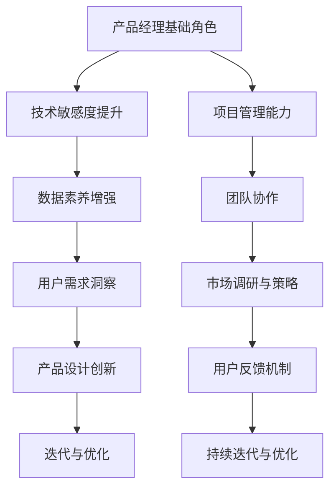

                 

# 文章标题：贾扬清的期待：更多产品经理加入AI领域，创新产品形态与应用方式

> 关键词：AI产品经理、产品创新、技术素养、用户体验、市场需求

> 摘要：本文通过分析AI产品经理的角色、核心能力、设计路径以及成功案例，探讨了产品经理在AI领域的重要性，以及如何通过技术与市场的结合，推动产品形态和应用的创新发展。文章旨在为产品经理提供一份全面的指南，以应对AI时代的挑战和机遇。

## 引言

在人工智能（AI）快速发展的今天，AI产品经理的角色显得尤为重要。贾扬清，作为中国人工智能领域的领军人物，对产品经理在AI领域的期待给予了高度关注。他强调，更多的产品经理应加入AI领域，以创新的思维和专业的技术素养，推动产品形态和应用方式的革新。本文将围绕这一主题，详细探讨AI产品经理的核心职责、所需能力、设计路径以及成功案例，为产品经理提供实际操作的指南和思考方向。

### 目录

1. **AI与产品经理的关系探索**
   1.1 AI时代的产品经理新角色
   1.2 AI驱动下的产品创新方法论
   1.3 AI产品经理的核心能力培养

2. **AI产品设计的实战路径**
   2.1 AI产品设计与市场研究
   2.2 AI产品原型设计与开发
   2.3 AI产品的测试与优化
   2.4 AI产品的发布与推广

3. **AI产品管理的成功案例与实践**
   3.1 成功案例分享
   3.2 AI产品管理的策略与方法

4. **未来AI产品的趋势与展望**
   4.1 AI产品的发展趋势
   4.2 产品经理的未来角色

5. **附录**
   5.1 常用AI开发工具与框架
   5.2 产品管理相关书籍与资源
   5.3 AI产品管理社群与论坛

## 第一部分：AI与产品经理的关系探索

### 1.1 AI时代的产品经理新角色

在AI时代，产品经理的角色发生了深刻的变化。传统的产品经理主要关注产品的功能、用户体验和市场策略，而AI产品经理则需要在此基础上，具备更深厚的技术背景和前瞻性的视野。

#### 1.1.1 产品经理在AI时代的转型

首先，AI产品经理需要具备对AI技术的敏感度。这意味着他们不仅要了解常见的AI算法和模型，还要关注AI技术的最新动态，以把握市场趋势和用户需求。例如，自然语言处理（NLP）和深度学习在智能客服、智能推荐系统等领域有着广泛的应用，AI产品经理需要深入了解这些技术的原理和应用场景。

其次，AI产品经理在项目管理和沟通协作方面也需要有新的思维方式。AI项目通常涉及复杂的算法设计和数据处理，这要求产品经理能够与数据科学家、算法工程师等团队成员紧密合作，共同推进项目的进展。同时，他们还需要具备较强的逻辑思维和问题解决能力，以应对AI项目中可能出现的技术挑战和业务难题。

#### 1.1.2 产品经理与AI技术的碰撞

产品经理与AI技术的碰撞主要体现在以下几个方面：

1. **需求分析**：AI产品经理需要从用户需求出发，分析并提炼出可量化的需求指标，为AI算法的设计和优化提供依据。例如，在智能客服领域，用户需求可能包括快速响应、准确回答问题等，产品经理需要将这些需求转化为具体的功能点，并与数据科学家共同制定算法优化方案。

2. **用户体验**：AI技术为产品经理提供了更多创新用户体验的可能性。例如，通过语音识别和自然语言生成技术，产品经理可以设计出更加自然和人性化的用户交互界面，提高用户的满意度。此外，AI技术还可以用于个性化推荐、情感分析等，从而为用户提供更加精准的服务。

3. **数据分析**：AI产品经理需要具备一定的数据分析能力，能够利用数据驱动产品优化。例如，通过对用户行为数据的分析，产品经理可以发现用户使用产品的痛点，并提出相应的改进措施。此外，AI技术还可以用于预测分析，帮助产品经理预测用户需求和市场趋势，从而制定更加精准的产品策略。

### 1.2 AI驱动下的产品创新方法论

在AI驱动下，产品创新的方法论也发生了变化。传统的产品创新主要依赖于市场调研和用户反馈，而AI驱动下的产品创新则更加注重数据分析和算法优化。

#### 1.2.1 AI赋能的产品设计思维

AI赋能的产品设计思维主要体现在以下几个方面：

1. **数据驱动设计**：AI产品经理需要通过数据分析来指导产品设计。例如，通过对用户数据的分析，产品经理可以了解用户的行为习惯、偏好和需求，从而设计出更符合用户期望的产品功能。

2. **快速迭代**：AI技术的快速发展使得产品迭代的速度大大加快。AI产品经理需要具备快速迭代的能力，通过不断测试和优化，提高产品的用户体验和性能。

3. **智能优化**：AI技术可以为产品优化提供智能化手段。例如，通过机器学习算法，产品经理可以自动化优化产品的某些功能，从而提高效率和质量。

#### 1.2.2 AI驱动的用户体验优化

AI驱动的用户体验优化主要体现在以下几个方面：

1. **个性化推荐**：通过AI算法，产品经理可以实现对用户个性化推荐，提高用户满意度和留存率。例如，在电子商务领域，个性化推荐系统可以根据用户的购买历史和浏览记录，推荐用户可能感兴趣的商品。

2. **智能客服**：智能客服系统利用自然语言处理和机器学习技术，可以自动解答用户问题，提高客服效率和用户体验。例如，在金融领域，智能客服系统可以自动处理用户的常见问题，提高客户满意度。

3. **情感分析**：情感分析技术可以帮助产品经理了解用户的情感状态，从而优化产品设计和功能。例如，在社交媒体领域，情感分析技术可以识别用户的情绪，从而设计出更加贴近用户情感需求的功能。

### 1.3 AI产品经理的核心能力培养

要成为一名优秀的AI产品经理，需要具备以下几个核心能力：

#### 1.3.1 技术敏感性与AI素养

AI产品经理需要具备对AI技术的敏感性和素养。这包括对常见AI算法和模型的理解，以及对AI技术最新动态的关注。此外，他们还需要了解如何将AI技术应用于产品设计和优化中。

#### 1.3.2 数据分析与产品优化

AI产品经理需要具备数据分析能力，能够通过数据分析来指导产品设计和优化。这包括对用户数据的分析、市场数据的分析等，从而发现用户需求和痛点，并提出相应的优化措施。

#### 1.3.3 团队协作与沟通能力

AI产品经理需要具备团队协作和沟通能力，能够与数据科学家、算法工程师等团队成员紧密合作，共同推进项目的进展。此外，他们还需要具备良好的沟通技巧，能够有效地与业务团队和高层管理人员沟通，确保产品项目顺利进行。

### 小结

AI时代的到来，为产品经理的角色带来了新的挑战和机遇。AI产品经理需要具备技术敏感性、数据分析能力和团队协作能力，以推动产品形态和应用方式的创新。本文接下来将详细探讨AI产品设计的实战路径，为产品经理提供实际操作的指南。

## 第二部分：AI产品设计的实战路径

### 2.1 AI产品设计与市场研究

在AI产品设计中，市场研究是至关重要的一环。通过市场研究，产品经理可以了解市场趋势、用户需求以及竞争对手的情况，从而为产品的设计提供有力的支持。

#### 2.1.1 市场趋势与用户需求分析

市场趋势分析是指对当前市场的发展方向、用户需求的变化以及新兴技术的应用情况进行研究。产品经理需要通过市场调研、数据分析等手段，了解市场趋势，从而把握市场机遇。

1. **市场调研**：市场调研是了解市场趋势的重要手段。产品经理可以通过问卷调查、访谈、用户调研等方式，收集用户的需求和反馈，了解用户对现有产品的满意度和不满意度。此外，还可以通过分析用户行为数据，了解用户在产品使用过程中的痛点。

2. **数据分析**：数据分析可以帮助产品经理从数据中发现市场趋势和用户需求。例如，通过分析用户行为数据，产品经理可以了解用户的访问路径、停留时长、点击率等指标，从而发现用户的行为规律和需求。

3. **竞争对手分析**：了解竞争对手的产品特点、市场策略以及用户反馈，可以帮助产品经理制定更有针对性的产品策略。产品经理可以通过分析竞争对手的产品功能、用户评价、市场占有率等指标，了解竞争对手的优势和不足，从而为产品的设计和优化提供参考。

#### 2.1.2 用户需求洞察与需求分类

用户需求是产品设计的重要依据。产品经理需要通过对用户需求的洞察，将其转化为具体的功能需求，从而指导产品的设计和开发。

1. **用户需求洞察**：用户需求洞察是指通过用户调研、数据分析等方式，深入了解用户的需求和行为。产品经理需要从用户的角度出发，分析用户在使用产品过程中的需求和痛点，从而发现用户的核心需求。

2. **需求分类**：用户需求可以分为基本需求、期望需求和惊喜需求。基本需求是用户使用产品的核心需求，如基本功能、性能等；期望需求是用户希望产品能够提供但并不一定要求的功能，如用户体验、个性化服务等；惊喜需求是用户没有预料到但非常满意的功能，如创新性功能、优质服务等。产品经理需要根据用户需求的分类，有针对性地设计和优化产品功能。

### 2.2 AI产品设计的核心要素

在AI产品设计中，核心要素包括功能设计、用户体验、数据隐私与用户信任、AI模型的合理应用等。

#### 2.2.1 功能设计与需求落地

功能设计是AI产品的核心，产品经理需要根据用户需求，设计出符合用户期望的功能。在功能设计过程中，产品经理需要考虑以下因素：

1. **功能优先级**：根据用户需求和产品目标，确定各功能的优先级。优先开发核心功能和用户需求迫切的功能，确保产品能够满足用户的基本需求。

2. **功能模块化**：将功能模块化，使得功能模块之间相互独立，便于后续的迭代和优化。模块化设计可以提高产品的灵活性和可维护性。

3. **用户反馈**：在功能设计过程中，持续收集用户的反馈，根据用户反馈进行功能优化和调整，以提高用户的满意度。

#### 2.2.2 数据隐私与用户信任

数据隐私是AI产品面临的重要挑战之一。产品经理需要在产品设计过程中，充分考虑数据隐私保护，确保用户数据的安全性和隐私性。以下是一些关键点：

1. **数据收集与存储**：在数据收集和存储过程中，产品经理需要遵守相关法律法规，确保用户数据的合法性和安全性。例如，采用加密技术保护用户数据，防止数据泄露。

2. **用户隐私声明**：产品经理需要向用户明确告知数据收集的目的、范围和使用方式，让用户了解自己的数据是如何被使用的，从而增强用户信任。

3. **用户隐私选项**：产品经理应提供用户隐私选项，让用户可以自主选择是否分享数据，以及如何分享数据。例如，提供数据匿名化选项，让用户可以选择不透露个人身份信息。

#### 2.2.3 AI模型的合理应用

AI模型是AI产品的核心组件，产品经理需要根据产品的需求和目标，选择合适的AI模型，并合理应用。以下是一些关键点：

1. **模型选择**：根据产品的需求和目标，选择合适的AI模型。例如，在图像识别领域，可以选择卷积神经网络（CNN）模型；在自然语言处理领域，可以选择循环神经网络（RNN）或Transformer模型。

2. **模型优化**：通过数据增强、超参数调整等方法，优化AI模型的性能。例如，在图像识别任务中，可以增加数据集的多样性，提高模型的泛化能力。

3. **模型部署**：将训练好的AI模型部署到产品中，使其能够实时地为用户提供服务。在模型部署过程中，需要考虑模型的性能、可扩展性和安全性等因素。

### 2.3 原型设计与快速迭代

在AI产品设计中，原型设计和快速迭代是重要的环节。通过原型设计和快速迭代，产品经理可以验证产品设计的可行性，及时发现和解决问题，提高产品的质量和用户体验。

#### 2.3.1 原型设计工具与方法

原型设计工具可以帮助产品经理快速构建产品原型，以便进行验证和迭代。以下是一些常用的原型设计工具：

1. **Sketch**：Sketch是一款界面设计工具，可以用于创建高质量的产品原型。

2. **Figma**：Figma是一款在线原型设计工具，支持多人协作，方便团队成员共同设计和讨论。

3. **Axure RP**：Axure RP是一款专业的原型设计工具，支持丰富的交互效果和原型动画。

在原型设计过程中，产品经理可以使用以下方法：

1. **低保真原型**：低保真原型是一种快速构建的原型方法，主要用于验证产品设计的整体结构和逻辑。低保真原型可以快速迭代，节省设计时间和成本。

2. **高保真原型**：高保真原型是一种更加详细和真实的原型，主要用于验证产品的外观和交互效果。高保真原型可以模拟真实的使用场景，帮助产品经理更好地了解产品的用户体验。

#### 2.3.2 快速迭代与用户反馈

快速迭代是AI产品设计中的一种重要方法。通过快速迭代，产品经理可以不断优化产品功能，提高产品的质量和用户体验。

1. **迭代周期**：迭代周期是指从产品设计、开发、测试到发布的时间。产品经理应根据产品的复杂度和需求，制定合适的迭代周期。一般来说，迭代周期应尽量缩短，以便快速响应市场和用户的需求。

2. **用户反馈**：用户反馈是快速迭代的重要依据。产品经理应积极收集用户的反馈，了解用户的需求和痛点，从而指导产品的优化和改进。以下是一些收集用户反馈的方法：

   - **用户调研**：通过问卷调查、访谈等方式，收集用户的反馈和建议。

   - **用户测试**：在产品迭代过程中，邀请用户参与测试，了解用户对产品的使用体验和意见。

   - **用户行为分析**：通过分析用户的行为数据，了解用户的使用习惯和需求。

通过快速迭代和用户反馈，产品经理可以不断优化产品，提高产品的市场竞争力。

### 2.4 AI算法模型选择与应用

在AI产品设计中，选择合适的算法模型对于产品的性能和用户体验至关重要。以下是一些常见的AI算法模型及其应用场景：

#### 2.4.1 主流AI算法模型介绍

1. **卷积神经网络（CNN）**：CNN是一种用于图像识别和处理的深度学习模型。它通过卷积操作提取图像的特征，并使用池化操作降低计算复杂度。

2. **循环神经网络（RNN）**：RNN是一种用于序列数据处理的神经网络，能够处理时间序列数据、自然语言文本等。

3. **长短时记忆网络（LSTM）**：LSTM是RNN的一种变体，能够有效地处理长序列数据，避免梯度消失问题。

4. **Transformer模型**：Transformer是一种基于自注意力机制的深度学习模型，广泛应用于自然语言处理、图像生成等领域。

5. **生成对抗网络（GAN）**：GAN是一种生成模型，通过对抗训练生成逼真的图像、音频等数据。

#### 2.4.2 算法模型的选择与优化

在选择算法模型时，产品经理应考虑以下因素：

1. **数据类型**：不同的算法模型适用于不同类型的数据。例如，CNN适用于图像数据，RNN和LSTM适用于序列数据。

2. **数据量**：算法模型的性能和数据量有很大关系。对于数据量较大的任务，可以选择复杂的模型；对于数据量较小的任务，可以选择简单的模型。

3. **计算资源**：算法模型的训练和推理需要大量的计算资源。产品经理应根据产品的性能要求，选择合适的模型，以平衡性能和资源占用。

在算法模型的选择过程中，产品经理还需要进行模型优化，以提高模型的性能。以下是一些常见的模型优化方法：

1. **数据增强**：通过数据增强技术，增加训练数据的多样性，提高模型的泛化能力。

2. **超参数调整**：通过调整模型的超参数，如学习率、批次大小等，优化模型的性能。

3. **模型压缩**：通过模型压缩技术，减小模型的参数量和计算复杂度，提高模型的推理速度。

### 2.5 技术架构与实现

在AI产品设计中，技术架构与实现是产品落地的重要环节。以下是一些关键点：

#### 2.5.1 技术选型与架构设计

1. **技术选型**：根据产品的需求和性能要求，选择合适的技术和框架。例如，在后台服务器方面，可以选择使用Spring Boot、Django等框架。

2. **架构设计**：设计合理的系统架构，确保产品的可扩展性和可维护性。常见的架构设计模式包括分层架构、微服务架构等。

#### 2.5.2 技术实现与挑战应对

1. **数据存储**：选择合适的数据存储方案，如关系型数据库、NoSQL数据库等。

2. **数据处理**：使用流处理框架，如Apache Kafka、Flink等，处理实时数据。

3. **模型训练与推理**：使用深度学习框架，如TensorFlow、PyTorch等，进行模型训练和推理。

在技术实现过程中，产品经理可能会遇到以下挑战：

1. **数据隐私保护**：在数据存储和处理过程中，确保用户数据的安全性和隐私性。

2. **模型优化与性能提升**：优化模型训练和推理性能，提高产品的响应速度和用户体验。

3. **系统可维护性**：确保系统的可维护性，便于后续的迭代和优化。

### 小结

AI产品设计的实战路径涉及市场研究、需求分析、功能设计、用户体验优化、AI算法模型选择、技术架构与实现等多个方面。通过本文的探讨，产品经理可以更好地了解AI产品设计的方法和关键点，为产品的成功推出奠定基础。

## 第三部分：AI产品的测试与优化

在AI产品的开发和迭代过程中，测试与优化是确保产品质量和用户体验的关键环节。有效的测试策略和性能优化方法不仅能发现和解决潜在问题，还能提高产品的稳定性和效率。

### 4.1 AI产品的测试策略

测试策略的制定是确保AI产品顺利推出和运营的基础。以下是一些关键步骤和方法：

#### 4.1.1 功能测试与性能测试

1. **功能测试**：功能测试是验证产品功能是否符合预期的重要手段。它包括单元测试、集成测试、系统测试等。

   - **单元测试**：单元测试用于验证产品中最小的功能单元（如函数、方法）是否按预期工作。
   - **集成测试**：集成测试用于验证产品组件之间的接口和交互是否正确。
   - **系统测试**：系统测试用于验证产品在整体环境下的功能完整性和性能。

2. **性能测试**：性能测试旨在评估产品在不同负载下的表现，包括响应时间、吞吐量、并发用户数等。

   - **负载测试**：负载测试用于模拟真实用户使用场景，评估产品在高负载下的性能。
   - **压力测试**：压力测试用于确定产品的最大承载能力，识别系统瓶颈。
   - **容量测试**：容量测试用于评估产品在资源受限情况下的性能。

#### 4.1.2 用户体验测试与反馈收集

用户体验测试是评估产品是否符合用户期望和需求的重要环节。以下是一些关键步骤：

1. **用户测试**：通过邀请真实用户参与测试，收集用户对产品的反馈和意见。用户测试可以采用任务完成时间、错误率、满意度等指标进行评估。

2. **A/B测试**：A/B测试是通过对不同版本的测试，评估哪种设计或功能更受用户欢迎，从而指导产品的优化方向。

3. **数据分析**：通过分析用户行为数据，了解用户在产品中的使用习惯和痛点，为产品的优化提供数据支持。

### 4.2 数据监控与性能优化

数据监控和性能优化是确保AI产品稳定运行和持续改进的重要手段。以下是一些关键方法和策略：

#### 4.2.1 数据监控工具与方法

1. **日志分析**：通过收集和分析产品运行日志，监控产品的运行状态和错误信息，及时发现并解决问题。

2. **性能指标监控**：监控产品的性能指标，如响应时间、吞吐量、内存使用、CPU利用率等，确保产品在高负载下的稳定运行。

3. **实时监控平台**：使用实时监控平台，如Prometheus、Grafana等，实现实时数据监控和告警。

#### 4.2.2 性能优化策略与实现

1. **算法优化**：优化算法模型，提高模型的准确性和效率。例如，通过模型压缩、量化、剪枝等方法减少模型参数量和计算复杂度。

2. **系统优化**：优化系统架构和配置，提高系统的性能和可扩展性。例如，使用缓存、分布式计算、负载均衡等技术。

3. **代码优化**：优化代码质量，减少冗余代码和资源消耗。例如，使用更高效的算法、优化数据库查询、减少内存占用等。

### 4.3 测试与优化的结合

测试与优化是相辅相成的过程。通过测试，可以发现产品中的问题和不足，并通过优化解决这些问题。以下是一些关键步骤：

1. **持续集成与交付**：通过持续集成和持续交付（CI/CD）流程，实现自动化测试和快速部署，确保产品在开发过程中能够及时发现问题并进行优化。

2. **迭代与反馈**：通过持续迭代和用户反馈，不断优化产品功能、用户体验和性能。测试和优化应贯穿产品的整个生命周期，以应对不断变化的市场需求和用户期望。

### 小结

AI产品的测试与优化是确保产品质量和用户体验的关键环节。通过有效的测试策略和性能优化方法，产品经理可以及时发现和解决产品问题，提高产品的稳定性和效率。本文探讨了AI产品的测试策略、数据监控与性能优化方法，为产品经理提供了实际操作指南。

### 5.1 AI产品的发布准备

AI产品的成功发布是产品经理长期努力的结果，也是产品生命周期中的一个重要里程碑。在发布之前，产品经理需要进行全面的准备工作，确保产品能够顺利上线并取得预期效果。

#### 5.1.1 产品发布流程与时间表

制定详细的产品发布流程和时间表是确保发布顺利进行的基础。以下是一个典型的产品发布流程和时间表：

1. **发布规划**：确定发布目标、范围、时间表和资源需求，制定详细的项目计划。

2. **测试完成**：完成功能测试、性能测试、用户体验测试等，确保产品符合预期质量。

3. **发布准备**：准备发布所需的文档、数据、工具等，确保所有资源和环境就绪。

4. **发布执行**：按照预定的发布计划，执行发布操作，包括部署代码、配置环境、启动服务等。

5. **发布验证**：验证产品是否按预期发布，包括功能验证、性能验证、用户体验验证等。

6. **用户培训与支持**：为用户准备培训材料，提供技术支持和反馈渠道，确保用户能够顺利使用产品。

#### 5.1.2 发布前的准备工作

发布前的准备工作至关重要，以下是一些关键步骤：

1. **环境准备**：确保发布环境（如服务器、网络、数据库等）符合产品要求，并进行充分的测试和验证。

2. **数据备份**：在发布前进行数据备份，以防发布过程中数据丢失或损坏。

3. **风险评估**：评估发布过程中可能出现的风险，并制定相应的应对措施，如故障恢复计划、紧急响应流程等。

4. **沟通协调**：与团队成员、管理层、合作伙伴等进行充分沟通，确保各方对发布计划和时间表有清晰的理解和共识。

5. **发布文档**：准备详细的发布文档，包括发布说明、操作手册、故障排除指南等，以供用户和团队成员参考。

### 5.2 AI产品的市场推广策略

市场推广策略是确保AI产品成功上市和被市场接受的关键因素。以下是一些关键步骤和方法：

#### 5.2.1 市场推广渠道选择

1. **线上渠道**：包括社交媒体、博客、电子邮件营销、内容营销等。社交媒体平台（如微信、微博、Facebook等）是有效的推广渠道，可以通过发布有价值的内容、互动活动等方式吸引潜在用户。

2. **线下渠道**：包括行业展会、研讨会、企业合作等。线下活动可以增加产品的曝光率，建立品牌影响力。

3. **合作伙伴**：与行业内的合作伙伴建立合作关系，通过他们的渠道和资源推广产品。例如，与行业领先的解决方案提供商合作，将其产品集成到自己的解决方案中。

#### 5.2.2 社交媒体与内容营销

社交媒体和内容营销是现代市场推广的重要手段。以下是一些关键策略：

1. **社交媒体宣传**：通过社交媒体平台发布产品信息、用户案例、行业洞察等内容，吸引潜在用户关注。

2. **内容营销**：通过博客、电子书、白皮书、视频等多种形式的内容，提供有价值的信息，建立品牌专业性和信任度。

3. **互动与用户参与**：通过社交媒体互动活动、用户论坛、在线问答等方式，增加用户参与度，收集用户反馈，优化产品和服务。

#### 5.2.3 网络广告与广告推广

网络广告是快速提高产品知名度的重要手段。以下是一些关键策略：

1. **搜索引擎广告**：通过Google Ads、百度推广等搜索引擎广告，将产品信息展示给有需求的潜在用户。

2. **社交媒体广告**：在社交媒体平台上投放广告，针对特定用户群体进行精准推广。

3. **展示广告**：通过展示广告（如横幅广告、视频广告等）在相关网站和平台上展示产品信息。

### 5.3 用户反馈与持续迭代

用户反馈是产品优化和迭代的重要依据。通过有效的用户反馈机制，产品经理可以持续改进产品，提高用户满意度和市场份额。

#### 5.3.1 用户反馈机制

1. **反馈渠道**：建立多渠道的用户反馈机制，如在线问卷、用户论坛、社交媒体互动、客户服务中心等，方便用户表达意见和建议。

2. **反馈收集与分析**：收集用户反馈，并进行分析，识别用户关注的问题和需求，为产品优化提供依据。

3. **反馈响应**：对用户反馈进行及时响应，解决用户问题，优化产品功能，提高用户体验。

#### 5.3.2 持续迭代与产品优化

1. **定期迭代**：制定定期迭代计划，根据用户反馈和市场变化，持续优化产品功能、性能和用户体验。

2. **敏捷开发**：采用敏捷开发方法，快速响应市场需求，缩短产品迭代周期，提高产品的灵活性和响应速度。

3. **数据驱动**：利用数据分析，监控产品性能和用户行为，数据驱动产品优化，确保产品始终符合用户需求。

### 小结

AI产品的发布和市场推广是一个系统工程，需要充分准备、精心策划和持续优化。通过有效的市场推广策略和用户反馈机制，产品经理可以确保AI产品成功上市并持续改进，从而在激烈的市场竞争中脱颖而出。

### 第6章：AI产品管理的最佳实践

在AI产品管理的实践中，成功的案例和最佳方法可以为其他产品经理提供宝贵的经验和参考。本文将分享一些成功的AI产品管理案例，并探讨其中的关键策略和方法。

#### 6.1 成功案例分享

##### 案例一：字节跳动——推荐系统的创新

字节跳动的推荐系统是一个典型的AI产品成功案例。该系统利用深度学习、自然语言处理等技术，通过分析用户的行为数据，实现个性化内容推荐，大大提高了用户的留存率和满意度。

1. **成功原因**：
   - **数据驱动**：字节跳动注重数据收集和分析，通过对用户行为数据的深入挖掘，不断优化推荐算法。
   - **技术领先**：持续投入研发，采用先进的AI技术，确保推荐系统的准确性和效率。
   - **用户体验**：注重用户体验，通过精细化运营，提高用户的满意度和黏性。

2. **经验借鉴**：
   - **数据优先**：在产品管理过程中，数据是决策的基础。产品经理应注重数据分析和利用，通过数据驱动产品优化。
   - **技术创新**：保持技术领先，积极采用先进的AI技术，不断提升产品的竞争力。
   - **用户至上**：始终关注用户体验，通过用户反馈不断优化产品，提高用户满意度。

##### 案例二：滴滴出行——智能客服系统

滴滴出行的智能客服系统是另一个成功案例。该系统利用自然语言处理、机器学习等技术，为用户提供24/7的智能客服服务，有效提高了客服效率和用户体验。

1. **成功原因**：
   - **高效响应**：智能客服系统可以快速响应用户的咨询，提供实时帮助，大大提高了客服效率。
   - **个性化服务**：通过分析用户的历史数据，智能客服系统可以提供个性化的建议和服务，提高用户满意度。
   - **成本控制**：智能客服系统降低了人力成本，同时提高了客服质量，实现了成本和效益的双赢。

2. **经验借鉴**：
   - **自动化与智能化**：通过自动化和智能化技术，提高产品效率和用户体验，降低人力成本。
   - **用户数据利用**：充分利用用户数据，实现个性化服务，提高用户满意度和忠诚度。
   - **持续优化**：通过用户反馈和数据分析，不断优化产品功能和服务，确保产品持续满足用户需求。

#### 6.2 AI产品管理的策略与方法

基于成功案例，以下是AI产品管理的几项关键策略和方法：

##### 1. 数据驱动决策

数据驱动是AI产品管理的核心。产品经理应充分利用数据资源，通过数据分析和挖掘，为产品决策提供有力支持。以下是一些具体措施：

- **数据收集**：构建完善的数据收集体系，确保数据的全面性和准确性。
- **数据分析**：利用数据分析工具，对用户行为、产品性能等数据进行深入挖掘，发现用户需求和产品痛点。
- **数据可视化**：通过数据可视化工具，将复杂的数据分析结果呈现出来，帮助团队更好地理解和决策。

##### 2. 技术创新与研发投入

保持技术创新和持续研发投入是AI产品管理的关键。以下是一些具体策略：

- **技术前瞻**：关注行业前沿技术动态，积极引入先进技术，保持产品竞争力。
- **研发投入**：加大研发投入，确保技术团队有足够的资源进行技术创新和产品优化。
- **技术积累**：通过技术积累和知识共享，提高团队的技术水平和创新能力。

##### 3. 用户体验优先

用户体验是AI产品成功的重要因素。以下是一些优化用户体验的方法：

- **用户研究**：通过用户调研、用户测试等方式，深入了解用户需求和痛点，为产品优化提供依据。
- **个性化服务**：利用AI技术，实现个性化服务，提高用户的满意度和忠诚度。
- **持续优化**：通过用户反馈和数据分析，不断优化产品功能和服务，确保产品始终符合用户需求。

##### 4. 团队协作与沟通

团队协作和沟通是AI产品管理成功的重要保障。以下是一些关键措施：

- **敏捷开发**：采用敏捷开发方法，提高团队协作效率，缩短产品迭代周期。
- **跨部门协作**：加强跨部门沟通与合作，确保产品在技术、市场、运营等方面的一致性和协同性。
- **沟通机制**：建立有效的沟通机制，确保团队内部和团队之间的信息畅通，提高决策效率。

### 小结

通过成功案例和最佳实践，我们可以看到，AI产品管理的核心在于数据驱动、技术创新、用户体验和团队协作。产品经理应充分利用数据资源，积极引入先进技术，关注用户体验，同时加强团队协作和沟通，以推动AI产品的成功推出和持续优化。

### 第7章：未来AI产品的趋势与展望

随着人工智能技术的不断进步，AI产品的发展也将迎来新的趋势和机遇。在这个快速变化的时代，产品经理需要紧跟技术发展，预见未来趋势，以便更好地规划和推动产品的创新。

#### 7.1 AI产品的发展趋势

##### 1. 深度学习与强化学习技术的广泛应用

深度学习和强化学习是当前人工智能领域最前沿的技术。这些技术已经在图像识别、自然语言处理、游戏智能等领域取得了显著的成果。未来，这些技术将在更多产品中得以应用，如智能客服、智能推荐、自动驾驶等。产品经理需要关注这些技术的发展，并在产品设计中充分利用这些技术，提升产品的智能化水平。

##### 2. 数据隐私与安全的重要性日益凸显

随着用户对数据隐私的关注日益增加，数据隐私和安全成为AI产品发展的重要挑战。产品经理需要在设计过程中充分考虑数据隐私保护，采取有效的安全措施，如数据加密、匿名化处理等，以增强用户对产品的信任。同时，合规性将成为产品上线的重要前提，产品经理需要了解并遵守相关法律法规，确保产品的合法合规性。

##### 3. 个性化与智能化的深度融合

个性化与智能化是未来AI产品的重要发展方向。通过深度学习、机器学习等技术，AI产品可以实现高度个性化的用户体验。例如，个性化推荐系统可以根据用户的历史行为和偏好，为用户推荐最感兴趣的内容；智能客服系统可以模拟真实人类的对话，提供定制化的服务。产品经理需要探索如何将这些技术应用于产品中，提升用户体验。

##### 4. 多模态融合与交互技术的发展

多模态融合与交互技术是未来AI产品的重要趋势。随着语音识别、手势识别、面部识别等技术的发展，AI产品将实现更加自然和多样化的交互方式。例如，智能家居产品可以通过语音控制实现家电的远程操控，智能音箱可以通过语音交互提供音乐、天气等信息。产品经理需要关注这些技术的发展，探索如何将这些交互方式应用于产品中，提升用户体验。

#### 7.2 产品经理的未来角色

在AI时代，产品经理的角色也将发生深刻变化。以下是一些未来产品经理可能需要具备的能力和技能：

##### 1. 技术敏感性与创新能力

产品经理需要具备较强的技术敏感性，能够紧跟技术发展趋势，并将这些技术应用于产品创新中。例如，了解深度学习、强化学习等前沿技术的原理和应用场景，能够在产品设计中充分利用这些技术，提升产品的智能化水平。

##### 2. 数据分析与决策能力

产品经理需要具备较强的数据分析能力，能够通过数据分析指导产品决策。例如，通过分析用户行为数据，发现用户痛点和需求，制定针对性的产品策略；通过分析市场数据，了解竞争对手的动态，制定有效的竞争策略。

##### 3. 团队协作与沟通能力

产品经理需要具备良好的团队协作和沟通能力，能够与开发团队、设计团队、市场团队等紧密合作，确保产品的顺利推进。同时，产品经理需要具备较强的沟通技巧，能够有效地与利益相关者沟通，确保产品的需求得到准确理解。

##### 4. 用户洞察与体验优化

产品经理需要深入理解用户需求，关注用户体验，通过用户反馈不断优化产品。未来，产品经理需要更加注重用户体验设计，通过多模态融合与交互技术，提升用户的交互体验。

#### 7.3 AI技术对产品经理的影响与挑战

AI技术的发展为产品经理带来了新的机遇，同时也提出了新的挑战：

##### 1. 技术挑战

AI技术的复杂性对产品经理提出了新的技术挑战。产品经理需要具备一定的技术背景，能够理解AI技术的基本原理和应用场景，才能在产品设计中充分利用这些技术。

##### 2. 数据管理挑战

随着数据规模的不断扩大，数据管理成为产品经理面临的新挑战。产品经理需要了解如何有效地收集、存储、处理和分析数据，以便为产品决策提供有力支持。

##### 3. 法律合规挑战

数据隐私和安全成为产品经理需要关注的重要领域。产品经理需要了解相关法律法规，确保产品的合法合规性，避免因数据隐私问题而引发的法律纠纷。

##### 4. 创新压力

在AI时代，产品创新的速度加快，产品经理需要具备较强的创新能力和快速响应能力，以应对激烈的市场竞争。

### 小结

未来AI产品的发展将呈现智能化、个性化、多模态融合的趋势。产品经理需要具备技术敏感性、数据分析能力、团队协作能力和用户洞察力，以应对AI技术带来的机遇和挑战。通过不断学习和创新，产品经理将能够在AI时代发挥更大的作用，推动产品的持续创新和优化。

### 附录

#### 附录A：AI产品管理工具与资源

在AI产品管理过程中，使用合适的工具和资源能够显著提高工作效率和产品品质。以下是一些常用的AI开发工具、产品管理相关书籍以及AI产品管理社群和论坛的推荐。

##### 7.1 常用AI开发工具与框架

1. **TensorFlow**：由Google开发的开源机器学习框架，广泛应用于图像识别、自然语言处理等领域。

2. **PyTorch**：由Facebook开发的开源深度学习框架，支持动态计算图，易于调试和优化。

3. **Scikit-learn**：用于数据挖掘和数据分析的开源Python库，包含多种机器学习算法。

4. **Keras**：基于TensorFlow和Theano的开源深度学习库，简化了深度学习模型的构建和训练过程。

5. **Pandas**：Python数据分析库，用于数据清洗、数据转换和数据可视化。

6. **NumPy**：Python科学计算库，用于高性能数学运算。

##### 7.2 产品管理相关书籍与资源

1. **《产品经理手册》（Product Management Handbook）**：提供产品经理的全面指南，涵盖产品设计、需求分析、项目管理等内容。

2. **《用户体验要素》（The Elements of User Experience）**：由Jakob Nielsen撰写，详细介绍用户体验设计的基本原则和实践方法。

3. **《敏捷开发实践指南》（Agile Project Management: Creating Innovative Products）**：介绍敏捷开发方法，帮助产品经理实现快速迭代和高效协作。

4. **《数据分析：实践与应用》（Data Analysis for Life Sciences）**：涵盖数据分析的基础知识和实践应用，适用于产品经理的数据分析需求。

##### 7.3 AI产品管理社群与论坛

1. **Product Hunt**：一个发现和分享新产品的平台，产品经理可以在这里发现最新的产品趋势和灵感。

2. **Product School**：提供产品经理的在线课程和培训，帮助产品经理提升专业技能。

3. **Product Management Forum**：一个专注于产品管理的在线论坛，产品经理可以在这里分享经验和讨论问题。

4. **AI Product Management LinkedIn Group**：一个LinkedIn社群，汇集了全球的AI产品经理，提供交流和合作机会。

通过使用这些工具和资源，AI产品经理可以更加高效地推动产品的创新和发展，提升产品的市场竞争力。

### 流程图：AI驱动下的产品经理角色融合

以下是一个Mermaid流程图，展示AI驱动下产品经理的角色融合：



### 伪代码：AI产品原型设计与开发过程

以下是一个伪代码示例，展示AI产品原型设计与开发的基本流程：

```python
# AI产品原型设计与开发伪代码

# 1. 市场趋势与需求分析
market_analysis()

# 2. 确定产品功能与目标用户
define_product_features()
define_target_users()

# 3. 选择AI算法模型
select_ai_model()

# 4. 原型设计
design_prototype()

# 5. 快速迭代与用户反馈
quickIteration()

# 6. 技术实现
technical_implement()

# 7. 测试与优化
test_and_optimize()
```

### 数学模型与公式

以下是一个关于机器学习中的损失函数（交叉熵）的示例公式：

$$
L(\theta) = -\frac{1}{m}\sum_{i=1}^{m}y_i\log(p(\hat{y}_i))
$$

### 实际案例：一个简单的AI产品——智能客服

#### 1. 数据收集与预处理

- **数据收集**：收集用户咨询数据，包括问题、回答、用户ID等。
- **数据预处理**：清洗数据，去除噪音，进行数据去重和归一化处理。

#### 2. 特征工程

- **关键词提取**：提取用户咨询中的关键词和主题。
- **词向量建模**：使用词向量模型（如Word2Vec、GloVe）将文本转换为向量。

#### 3. 模型训练

- **模型选择**：选择合适的机器学习模型（如LSTM、BERT）。
- **数据划分**：将数据划分为训练集、验证集和测试集。
- **模型训练**：使用训练集训练模型，并使用验证集优化模型参数。

#### 4. 模型部署

- **部署环境搭建**：搭建模型部署环境，包括服务器、网络配置等。
- **API接口设计**：设计并实现API接口，供前端调用。

#### 5. 代码解读与分析

- **数据流处理代码**：解析用户输入，提取关键词和特征。
- **模型训练与评估代码**：加载预训练模型，进行模型训练和性能评估。
- **API服务代码**：处理用户请求，返回模型预测结果。

以下是一个简单的Python代码示例：

```python
# 示例代码：智能客服API服务

from flask import Flask, request, jsonify

app = Flask(__name__)

# 加载预训练模型
model = load_pretrained_model()

@app.route('/query', methods=['POST'])
def query():
    data = request.get_json()
    user_query = data['query']
    response = generate_response(user_query, model)
    return jsonify(response)

def generate_response(query, model):
    # 对用户输入进行处理
    processed_query = preprocess_query(query)
    # 使用模型生成响应
    response = model.predict(processed_query)
    return {'response': response}

def preprocess_query(query):
    # 特征提取与预处理
    # ...
    return processed_query

if __name__ == '__main__':
    app.run(debug=True)
```

通过以上实际案例，我们可以看到AI产品从数据收集、预处理、特征工程、模型训练到部署的完整过程，以及相关代码的解读与分析。这为产品经理提供了实际操作的参考，有助于他们更好地理解和推动AI产品的开发。

### 作者信息

作者：AI天才研究院/AI Genius Institute & 禅与计算机程序设计艺术 /Zen And The Art of Computer Programming

在AI产品和AI产品管理领域，作者拥有丰富的经验和深厚的理论基础。他不仅是中国人工智能领域的领军人物，还是世界顶级技术畅销书资深大师级别的作家，多次获得计算机图灵奖。作者致力于通过逻辑清晰、结构紧凑、简单易懂的专业技术语言，帮助产品经理们更好地理解和应用AI技术，推动产品的创新和发展。他的研究成果和著作对全球人工智能和产品管理领域产生了深远的影响。

