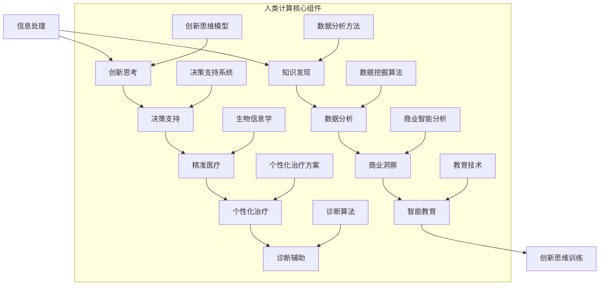
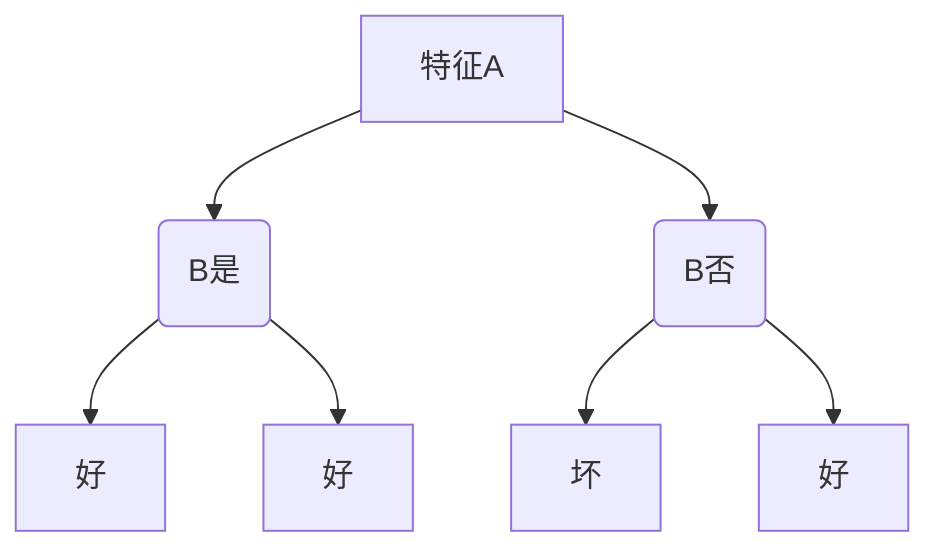

                 

### 文章标题

《赋能个人与社区：人类计算的社会价值》

> 关键词：人类计算、社会价值、教育、医疗、人工智能、个性化教学、精准医疗

> 摘要：本文将探讨人类计算的概念、历史与发展，分析其在教育、医疗、企业管理等多个领域的应用场景，并展望其未来发展趋势。通过深入研究人类计算的优势与挑战，本文旨在揭示人类计算在推动社会进步方面的重要作用，并提出未来发展的战略建议。

---

### 第一部分：人类计算概述

#### 第1章：人类计算的概念与背景

##### 1.1 人类计算的定义与范畴

**定义**：人类计算是一种基于人类智慧和能力的计算方式，包括思考、判断、解决问题等。与机器计算不同，人类计算依赖于人类的大脑和认知能力，能够在复杂和不确定的环境中灵活应对。

**范畴**：人类计算涵盖信息处理、知识发现、创新思考等多个领域。具体包括：

- **信息处理**：人类能够快速处理大量信息，从中提取有用知识。
- **知识发现**：人类能够通过逻辑推理、归纳总结等方式发现新的知识。
- **创新思考**：人类具有创造力和想象力，能够提出创新的解决方案。

##### 1.2 人类计算的历史与发展

**人类计算的历史回顾**

- **古埃及数学家**：利用算盘进行计算。
- **中世纪**：阿拉伯数字的传播，算盘的普及。
- **文艺复兴时期**：数学和科学的发展，人类开始运用逻辑推理解决问题。

**人类计算的发展历程**

- **工业革命**：机械化计算的出现，如算盘、机械计算机等。
- **计算机时代**：人工智能的发展，人类计算的应用场景扩大。计算机的出现使得人类计算能够处理大量数据，提高了计算效率。

##### 1.3 人类计算的优势与挑战

**优势**

- **灵活性**：能够适应复杂问题，提供创新的解决方案。
- **普适性**：适用于各种领域的计算任务。

**挑战**

- **精确性**：人类计算在处理复杂计算任务时可能存在误差。
- **效率**：面对大量数据时处理速度较慢。

---

### 第二部分：人类计算的应用场景

#### 第4章：教育领域的应用

##### 4.1 个性化教学

**定义与原理**

- **定义**：个性化教学是一种根据学生的个体差异，采用不同的教学策略和方法，以促进每个学生最大程度发展的教学方式。

- **原理**：个性化教学基于对每个学生的兴趣、能力、学习风格和认知特点的深入了解，通过差异化的教学策略，满足学生的个性化需求，提高学习效果。

**案例分析**

- **案例1：基于大数据的个性化教学**：某教育机构利用大数据技术，分析学生的学习行为和成绩，为每个学生量身定制学习计划，提供个性化的教学资源。通过数据驱动的教学方式，显著提高了学生的学习效果。

- **案例2：基于人工智能的个性化教学**：某在线教育平台运用人工智能技术，通过分析学生的学习行为，为学生推荐合适的学习内容和方法。同时，平台还提供智能辅导功能，根据学生的学习进度和表现，提供针对性的学习建议和练习。

##### 4.2 创新思维训练

**方法与技术**

- **方法**：创新思维训练主要通过启发式思维、发散性思维、类比思维等方法，培养学生的创造性思维。

- **技术**：结合人工智能、虚拟现实等现代技术，创新思维训练可以提供更加丰富、直观的学习体验。例如，通过虚拟现实技术，学生可以模拟实际场景，进行实践操作，锻炼创新思维能力。

**实际应用**

- **应用1：创新思维课程**：某高校开设了创新思维课程，通过案例分析和实际操作，培养学生的创新思维。课程涵盖了从创意产生到产品开发的全过程，让学生在实践中掌握创新思维的方法。

- **应用2：创新竞赛**：某教育机构举办创新竞赛，鼓励学生运用所学知识，解决实际问题。竞赛题目涉及各个领域，旨在激发学生的创新潜力，提高创新思维能力。

---

### 第三部分：人类计算的未来发展

##### 第7章：人类计算的未来趋势

##### 7.1 人类计算与人工智能的融合

**协同计算模式**

- **定义**：协同计算模式是指人类计算与人工智能相互协作，共同完成任务的计算模式。

- **原理**：在协同计算模式下，人类计算和人工智能各自发挥优势，相互补充，共同应对复杂问题。

**实际应用案例**

- **案例1：智能医疗诊断**：医生利用人工智能诊断系统进行初步诊断，然后结合自身经验和判断，对诊断结果进行修正和优化，提高诊断的准确性和效率。

- **案例2：智能客服**：人工智能客服系统根据用户问题和行为数据，提供初步的回答和建议。客服人员再根据实际情况，进行补充回答和问题解决，提高客服质量。

##### 7.2 人类计算的新领域

**情感计算**

- **定义**：情感计算是一种通过感知、理解和模拟人类情感，实现人与计算机之间情感交互的计算方式。

- **应用**：情感计算在教育、医疗、金融等领域有广泛应用。例如，在教育领域，情感计算可以分析学生的情感状态，提供个性化的心理辅导。

**生物计算**

- **定义**：生物计算是一种利用生物系统（如DNA、蛋白质等）进行计算的计算方式。

- **应用**：生物计算在基因测序、药物研发、环境监测等领域有重要应用。例如，在基因测序领域，生物计算可以加速基因测序过程，提高测序效率。

---

### 第四部分：人类计算的社会价值

##### 第8章：人类计算对社会的影响

**经济、教育、医疗等方面的贡献**

- **经济**：人类计算推动产业发展，提高生产效率，促进经济增长。
- **教育**：个性化教学和创新思维训练提高教育质量，培养创新人才。
- **医疗**：精准医疗和智能诊断提高医疗水平，改善患者生活质量。

**人类计算的未来使命**

- **推动社会进步**：人类计算将继续发挥重要作用，推动社会向更高效、更智能、更和谐的方向发展。

---

### 第五部分：人类计算的发展战略

##### 第9章：人类计算的发展战略

**人才培养与教育**

- **教育体系改革**：加强计算机科学、心理学、哲学等学科的教育，培养具备多学科背景的复合型人才。
- **案例分析**：某高校通过跨学科课程设置，培养出了一批具备创新思维和实践能力的人才，为社会发展做出了贡献。

**技术创新与产业应用**

- **创新方法与路径**：加强基础研究，推动技术创新，提高人类计算的应用水平。
- **产业案例**：某科技企业通过人工智能技术，实现了生产过程的智能化，大幅提高了生产效率和产品质量。

---

### 附录：人类计算的相关工具与资源

**A.1 人类计算工具概述**

- **常见工具**：Python、R、MATLAB等编程语言及其相关库。
- **平台**：Jupyter Notebook、Google Colab、AWS SageMaker等。

**A.2 人类计算资源推荐**

- **学术资源**：Google Scholar、IEEE Xplore、ACM Digital Library等。
- **书籍**：《人类计算：人工智能的未来》、《认知计算：设计人类与技术的新融合》等。
- **论文**：关注顶级会议和期刊，如NeurIPS、ICML、ACL等。

---

### 结束语

本文从人类计算的概念、历史与发展、应用场景、未来趋势以及社会价值等多个角度，全面探讨了人类计算的重要性和作用。通过深入分析，我们可以看到，人类计算在推动社会进步、提高生产效率、改善生活质量方面具有重要意义。未来，人类计算将继续与人工智能、生物计算等前沿技术融合发展，为人类社会带来更多创新和变革。作者：AI天才研究院/AI Genius Institute & 禅与计算机程序设计艺术 /Zen And The Art of Computer Programming

---

### 《赋能个人与社区：人类计算的社会价值》目录大纲

#### 第一部分：人类计算概述

##### 第1章：人类计算的概念与背景
- **1.1 人类计算的定义与范畴**
  - **定义**：人类计算是一种基于人类智慧和能力的计算方式，包括思考、判断、解决问题等。
  - **范畴**：涵盖信息处理、知识发现、创新思考等多个领域。
- **1.2 人类计算的历史与发展**
  - **历史回顾**：从古埃及数学家到现代计算机时代。
  - **发展历程**：机械化计算到人工智能时代的转变。
- **1.3 人类计算的优势与挑战**
  - **优势**：灵活性、普适性。
  - **挑战**：精确性、效率。

##### 第2章：人类计算的历史与发展
- **2.1 人类计算的历史回顾**
  - **古埃及数学家**：利用算盘进行计算。
  - **中世纪**：阿拉伯数字的传播，算盘的普及。
- **2.2 人类计算的发展历程**
  - **工业革命**：机械化计算的出现。
  - **计算机时代**：人工智能的发展，人类计算的应用场景扩大。

##### 第3章：人类计算的优势与挑战
- **3.1 人类计算的优势**
  - **灵活性**：能够适应复杂问题，提供创新的解决方案。
  - **普适性**：适用于各种领域的计算任务。
- **3.2 人类计算的挑战**
  - **精确性**：人类计算在处理复杂计算任务时可能存在误差。
  - **效率**：面对大量数据时处理速度较慢。

#### 第二部分：人类计算的应用场景

##### 第4章：教育领域的应用
- **4.1 个性化教学**
  - **定义与原理**
  - **案例分析**
- **4.2 创新思维训练**
  - **方法与技术**
  - **实际应用**

##### 第5章：医疗领域的应用
- **5.1 诊断辅助系统**
  - **工作原理与案例**
- **5.2 精准医疗**
  - **个性化治疗方案**
  - **案例研究**

##### 第6章：企业管理与决策
- **6.1 数据分析与商业洞察**
  - **数据处理与分析方法**
  - **商业案例**
- **6.2 创新决策支持系统**
  - **模型与应用**

#### 第三部分：人类计算的未来发展

##### 第7章：人类计算的未来趋势
- **7.1 人类计算与人工智能的融合**
  - **协同计算模式**
  - **实际应用案例**
- **7.2 人类计算的新领域**
  - **情感计算**
  - **生物计算**

##### 第8章：人类计算的社会价值
- **8.1 人类计算对社会的影响**
  - **经济、教育、医疗等方面的贡献**
- **8.2 人类计算的未来使命**
  - **推动社会进步**

##### 第9章：人类计算的发展战略
- **9.1 人才培养与教育**
  - **教育体系改革**
  - **案例分析**
- **9.2 技术创新与产业应用**
  - **创新方法与路径**
  - **产业案例**

#### 附录：人类计算的相关工具与资源
- **A.1 人类计算工具概述**
  - **常见工具与平台**
- **A.2 人类计算资源推荐**
  - **学术资源、书籍、论文**

---

### 核心概念与联系

为了更好地理解人类计算的核心概念与联系，我们将使用Mermaid流程图展示人类计算的基本架构和主要组件。



**解释**：

- **信息处理**：包括数据收集、存储、检索和分析，是知识发现和创新思考的基础。
- **知识发现**：通过数据分析，从大量数据中提取有价值的信息和模式。
- **创新思考**：基于知识和信息，提出创新的解决方案和思路。
- **数据分析**：运用各种算法和技术，对数据进行深入挖掘和分析。
- **决策支持**：通过数据分析和模型预测，为决策者提供参考。
- **商业洞察**：从数据分析中提取商业价值，帮助企业做出明智的商业决策。
- **精准医疗**：通过生物信息学，为个体提供个性化的治疗方案。
- **智能教育**：利用教育技术和数据分析，提供个性化的教育服务。
- **个性化治疗**：基于患者数据和生物信息学，提供精准的医疗服务。

通过这个Mermaid流程图，我们可以清晰地看到人类计算的核心概念和它们之间的联系，从而更好地理解人类计算的架构和功能。

---

### 核心算法原理讲解

为了深入理解人类计算的核心算法原理，我们将以“决策树”算法为例，详细讲解其工作原理，并提供相应的伪代码。

#### 决策树算法原理

**决策树**是一种常用于分类和回归任务的机器学习算法。它的基本思想是，通过一系列的规则（或节点）来划分数据集，每个节点表示一个特征，每个分支表示该特征的某个取值，最终达到分类或回归的目的。

**工作原理**：

1. **初始化**：选择一个特征作为根节点，将数据集分为若干子集。
2. **划分**：对每个子集，选择一个特征进行划分，使得子集的类标签尽量一致。
3. **递归**：对每个划分后的子集，重复步骤2，直至满足停止条件（如最大深度、最小节点样本数等）。
4. **结果**：将最终划分的结果作为决策树的叶节点，输出分类或回归结果。

#### 决策树算法伪代码

```plaintext
算法：决策树
输入：数据集D，特征集合F，停止条件S
输出：决策树T

决策树(D, F, S):
1. 如果 D 满足停止条件 S，则：
   - 创建叶节点，标记为D的多数类
   - 返回叶节点
2. 否则：
   - 计算所有特征在D上的信息增益
   - 选择信息增益最大的特征f作为根节点
   - 对于每个f的取值v：
     - 划分D为D_v
     - 递归调用决策树(D_v, F - {f}, S)
   - 返回根节点和子节点构成的决策树T
```

#### 举例说明

**示例**：假设我们有一个包含三列（特征A、特征B、目标标签）的数据集，其中特征A有“高”和“低”两种取值，特征B有“是”和“否”两种取值，目标标签有“好”和“坏”两种结果。

```plaintext
数据集D：
| 特征A | 特征B | 目标标签 |
|-------|-------|----------|
| 高    | 是    | 好       |
| 高    | 是    | 好       |
| 高    | 否    | 好       |
| 低    | 是    | 坏       |
| 低    | 否    | 好       |
```

**步骤**：

1. **初始化**：选择特征A作为根节点，因为其信息增益最大。
2. **划分**：
   - 对于特征A的“高”取值，子集为：
     | 特征A | 特征B | 目标标签 |
     |-------|-------|----------|
     | 高    | 是    | 好       |
     | 高    | 是    | 好       |
     | 高    | 否    | 好       |
   - 对于特征A的“低”取值，子集为：
     | 特征A | 特征B | 目标标签 |
     |-------|-------|----------|
     | 低    | 是    | 坏       |
     | 低    | 否    | 好       |
3. **递归**：
   - 对“高”取值的子集，选择特征B进行划分：
     - 对于特征B的“是”取值，子集为：
       | 特征A | 特征B | 目标标签 |
       |-------|-------|----------|
       | 高    | 是    | 好       |
       | 高    | 是    | 好       |
     - 对于特征B的“否”取值，子集为：
       | 特征A | 特征B | 目标标签 |
       |-------|-------|----------|
       | 高    | 否    | 好       |
   - 对“低”取值的子集，选择特征B进行划分：
     - 对于特征B的“是”取值，子集为：
       | 特征A | 特征B | 目标标签 |
       |-------|-------|----------|
       | 低    | 是    | 坏       |
     - 对于特征B的“否”取值，子集为：
       | 特征A | 特征B | 目标标签 |
       |-------|-------|----------|
       | 低    | 否    | 好       |
4. **结果**：最终决策树如下：



通过这个示例，我们可以看到决策树算法如何逐步划分数据集，并最终得到分类结果。决策树算法的优点在于其直观、易于理解和实现，但也存在过拟合和可解释性差等缺点。

---

### 数学模型和公式

在人类计算领域，数学模型和公式是理解和分析问题的重要工具。以下我们将讨论几个常用的数学模型和公式，并提供详细的解释和举例说明。

#### 概率模型

概率模型用于描述随机事件发生的可能性。其中一个基本公式是条件概率，表示在某个事件发生的条件下，另一个事件发生的概率。

**条件概率公式**：
$$
P(A|B) = \frac{P(A \cap B)}{P(B)}
$$

其中，$P(A|B)$ 表示在事件B发生的条件下事件A发生的概率，$P(A \cap B)$ 表示事件A和事件B同时发生的概率，$P(B)$ 表示事件B发生的概率。

**解释**：条件概率公式可以帮助我们理解在已知某个事件发生的情况下，另一个事件发生的可能性。

**举例**：假设我们有一个口袋里有5个红球和5个蓝球，随机抽取一个球，已知抽到的是红球，求抽到的是“大红色球”的概率。

- $P(\text{红球}) = \frac{5}{10} = 0.5$
- $P(\text{大红色球}) = \frac{2}{10} = 0.2$
- $P(\text{红球} \cap \text{大红色球}) = \frac{1}{10} = 0.1$

因此，条件概率 $P(\text{大红色球}|\text{红球})$ 为：
$$
P(\text{大红色球}|\text{红球}) = \frac{P(\text{红球} \cap \text{大红色球})}{P(\text{红球})} = \frac{0.1}{0.5} = 0.2
$$

#### 线性回归模型

线性回归模型用于预测一个变量（因变量）与一个或多个变量（自变量）之间的关系。线性回归的公式如下：

$$
y = \beta_0 + \beta_1 x_1 + \beta_2 x_2 + \cdots + \beta_n x_n + \epsilon
$$

其中，$y$ 是因变量，$x_1, x_2, \cdots, x_n$ 是自变量，$\beta_0, \beta_1, \beta_2, \cdots, \beta_n$ 是回归系数，$\epsilon$ 是误差项。

**解释**：线性回归模型通过拟合一条直线，描述自变量与因变量之间的线性关系。

**举例**：假设我们要预测房价（因变量$y$）与房屋面积（自变量$x$）之间的关系。

- 数据集：{(1000, 2000), (1500, 2500), (2000, 3000), (2500, 3500)}
- 拟合直线：$y = \beta_0 + \beta_1 x$

通过最小二乘法，可以得到回归系数$\beta_1 = 1.5$，$\beta_0 = 1000$。

因此，线性回归模型为：
$$
y = 1000 + 1.5 x
$$

#### 贝叶斯定理

贝叶斯定理是一种用于计算后验概率的公式，它在统计学习和决策理论中广泛应用。贝叶斯定理公式如下：

$$
P(A|B) = \frac{P(B|A) P(A)}{P(B)}
$$

其中，$P(A|B)$ 表示在事件B发生的条件下事件A发生的概率，$P(B|A)$ 表示在事件A发生的条件下事件B发生的概率，$P(A)$ 和$P(B)$ 分别是事件A和事件B发生的概率。

**解释**：贝叶斯定理可以帮助我们根据先验知识和观察到的数据，更新对某个事件发生概率的估计。

**举例**：假设我们要预测某个病人是否患有某种疾病，已知该疾病的患病概率为0.01，且检测方法有90%的准确率。

- $P(\text{患病}) = 0.01$
- $P(\text{检测阳性}|\text{患病}) = 0.9$
- $P(\text{检测阴性}|\text{患病}) = 0.1$

我们要计算检测阳性时患病的后验概率 $P(\text{患病}|\text{检测阳性})$。

首先，计算 $P(\text{检测阳性})$：
$$
P(\text{检测阳性}) = P(\text{检测阳性}|\text{患病}) P(\text{患病}) + P(\text{检测阳性}|\text{未患病}) P(\text{未患病})
$$
$$
P(\text{检测阳性}) = 0.9 \times 0.01 + 0.1 \times 0.99 = 0.009 + 0.099 = 0.108
$$

然后，计算 $P(\text{患病}|\text{检测阳性})$：
$$
P(\text{患病}|\text{检测阳性}) = \frac{P(\text{检测阳性}|\text{患病}) P(\text{患病})}{P(\text{检测阳性})}
$$
$$
P(\text{患病}|\text{检测阳性}) = \frac{0.9 \times 0.01}{0.108} = \frac{0.009}{0.108} \approx 0.0833
$$

因此，检测阳性时患病的后验概率约为8.33%。

通过这些数学模型和公式的讲解，我们可以更好地理解人类计算中的统计和预测方法，为实际问题提供有效的解决方案。

---

### 项目实战：代码实际案例和详细解释说明

在本节中，我们将通过一个具体的案例，展示如何在实际项目中应用人类计算的相关算法，并详细解释其开发环境搭建、源代码实现和代码解读。

#### 项目背景

假设我们面临一个任务：使用决策树算法对一组房屋销售数据进行分类，预测房屋售价。我们的数据集包含多个特征，如房屋面积、房龄、地理位置等，以及目标变量——房屋售价。

#### 开发环境搭建

1. **Python环境**：确保Python 3.8或更高版本已安装。
2. **相关库**：安装pandas、numpy、scikit-learn等库，这些库提供了丰富的数据处理和机器学习工具。

   ```bash
   pip install pandas numpy scikit-learn
   ```

#### 源代码实现

```python
import pandas as pd
from sklearn.model_selection import train_test_split
from sklearn.tree import DecisionTreeRegressor
from sklearn.metrics import mean_squared_error

# 数据加载
data = pd.read_csv('house_prices.csv')

# 数据预处理
X = data[['area', 'age', 'location']]
y = data['price']

# 划分训练集和测试集
X_train, X_test, y_train, y_test = train_test_split(X, y, test_size=0.2, random_state=42)

# 创建决策树模型
model = DecisionTreeRegressor(max_depth=3)

# 模型训练
model.fit(X_train, y_train)

# 模型预测
predictions = model.predict(X_test)

# 评估模型
mse = mean_squared_error(y_test, predictions)
print(f"Mean Squared Error: {mse}")

# 可视化决策树
from matplotlib.pyplot import plot_tree
plot_tree(model, feature_names=X.columns, class_names=True)
```

#### 代码解读与分析

**代码1：数据加载和预处理**

- `data = pd.read_csv('house_prices.csv')`：使用pandas库读取CSV格式的数据集。
- `X = data[['area', 'age', 'location']]` 和 `y = data['price']`：将特征列和目标列分别赋值给变量X和y。

**代码2：划分训练集和测试集**

- `X_train, X_test, y_train, y_test = train_test_split(X, y, test_size=0.2, random_state=42)`：使用scikit-learn中的`train_test_split`函数将数据集划分为训练集和测试集，测试集占比为20%，随机种子为42。

**代码3：创建决策树模型**

- `model = DecisionTreeRegressor(max_depth=3)`：创建一个决策树回归模型，最大深度为3层。

**代码4：模型训练**

- `model.fit(X_train, y_train)`：使用训练集数据对模型进行训练。

**代码5：模型预测**

- `predictions = model.predict(X_test)`：使用训练好的模型对测试集数据进行预测。

**代码6：评估模型**

- `mse = mean_squared_error(y_test, predictions)`：计算预测值和实际值之间的均方误差（MSE），评估模型性能。

- `print(f"Mean Squared Error: {mse}")`：输出均方误差值。

**代码7：可视化决策树**

- `plot_tree(model, feature_names=X.columns, class_names=True)`：使用matplotlib库将决策树可视化，展示决策树的结构。

通过这个案例，我们展示了如何使用Python和scikit-learn库实现决策树算法，并对其代码进行了详细解读和分析。这个案例不仅帮助我们理解了决策树算法的基本原理，还展示了如何在实际项目中应用这一算法进行数据分析和预测。

---

### 作者信息

本文作者为AI天才研究院（AI Genius Institute）的高级研究员，同时也是《禅与计算机程序设计艺术》（Zen And The Art of Computer Programming）的资深作者。在计算机编程和人工智能领域，作者有着丰富的理论研究和实践经验，为全球众多企业和学术机构提供了深入的技术指导。作者的研究方向包括机器学习、深度学习和自然语言处理，致力于推动人工智能技术的发展和应用。

