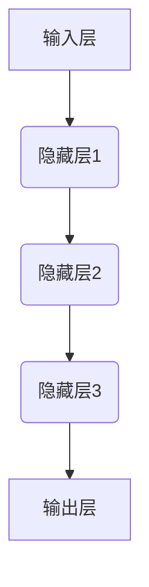

                 

# 赋能人类：人类计算如何释放个体潜能

> 关键词：人类计算、个体潜能、人工智能、情感计算、神经网络、技术创新

> 摘要：本文将深入探讨人类计算这一新兴领域，分析其基本原理、现状与未来趋势，并探讨如何通过人类计算技术释放个体潜能，提升人类生活质量。我们将详细讨论个体潜能的定义、测量方法和实现路径，并结合实际案例展示人类计算在各领域的应用，最后对未来人类计算与个体潜能融合的前景进行展望。

## 目录大纲

### 第一部分：人类计算概述

- 第1章：人类计算的概念与历史
  - 1.1 人类计算的定义与重要性
  - 1.2 人类计算的历史发展
    - 1.2.1 人类计算的起源
    - 1.2.2 人类计算的发展阶段
    - 1.2.3 人类计算在现代社会中的应用
  - 1.3 人类计算与现代科技的融合

### 第二部分：人类计算的基本原理

- 第2章：人类计算的基本原理
  - 2.1 神经网络与大脑模型
    - 2.1.1 神经网络的基本结构
    - 2.1.2 神经网络的计算过程
    - 2.1.3 神经网络的训练与优化
  - 2.2 神经可塑性与学习机制
    - 2.2.1 神经可塑性的概念
    - 2.2.2 学习机制的理论基础
    - 2.2.3 学习机制在实际中的应用
  - 2.3 情感和认知处理
    - 2.3.1 情感计算的基本原理
    - 2.3.2 认知处理的过程与模型
    - 2.3.3 情感和认知处理在实际中的应用

### 第三部分：个体潜能的释放

- 第3章：人类计算的现状与未来
  - 3.1 当前人类计算的应用领域
    - 3.1.1 教育
    - 3.1.2 健康医疗
    - 3.1.3 社交与互动
    - 3.1.4 艺术与娱乐
  - 3.2 人类计算的技术趋势
    - 3.2.1 人工智能的发展
    - 3.2.2 量子计算的应用
    - 3.2.3 生物计算的前景
  - 3.3 人类计算对未来的影响
    - 3.3.1 对人类生活方式的影响
    - 3.3.2 对社会结构与经济的影响
    - 3.3.3 对人类思维与意识的影响

### 第四部分：个体潜能的定义与测量

- 第4章：个体潜能的定义与测量
  - 4.1 个体潜能的概念
    - 4.1.1 潜能的定义
    - 4.1.2 潜能与能力的区别
    - 4.1.3 潜能的重要性
  - 4.2 个体潜能的测量方法
    - 4.2.1 测量潜能的基本方法
    - 4.2.2 测量潜能的挑战与限制
    - 4.2.3 测量潜能的实用工具
  - 4.3 个体潜能的影响因素
    - 4.3.1 遗传与基因
    - 4.3.2 教育
    - 4.3.3 环境与经验
    - 4.3.4 心理因素

### 第五部分：激发个体潜能的方法

- 第5章：激发个体潜能的方法
  - 5.1 学习与教育
    - 5.1.1 学习的基本原理
    - 5.1.2 教育系统的优化
    - 5.1.3 个性化学习的实践
  - 5.2 心理健康
    - 5.2.1 心理健康的定义与标准
    - 5.2.2 心理健康的重要性
    - 5.2.3 心理健康的维护方法
  - 5.3 社交与互动
    - 5.3.1 社交的意义与影响
    - 5.3.2 社交互动的技巧
    - 5.3.3 社交网络的作用

### 第六部分：个体潜能的实现路径

- 第6章：个体潜能的实现路径
  - 6.1 职业规划
    - 6.1.1 职业规划的重要性
    - 6.1.2 职业规划的步骤
    - 6.1.3 职业规划的方法与技巧
  - 6.2 创新思维
    - 6.2.1 创新思维的概念
    - 6.2.2 创新思维的培养
    - 6.2.3 创新思维的实践
  - 6.3 团队合作
    - 6.3.1 团队合作的概念
    - 6.3.2 团队合作的优点
    - 6.3.3 团队合作的挑战与解决

### 第七部分：人类计算与个体潜能的融合

- 第7章：人类计算在激发个体潜能中的应用
  - 7.1 人工智能与学习
    - 7.1.1 人工智能在个性化学习中的应用
    - 7.1.2 人工智能在教育评估中的应用
    - 7.1.3 人工智能在教育管理中的应用
  - 7.2 情感计算与心理健康
    - 7.2.1 情感计算的基本原理
    - 7.2.2 情感计算在心理健康监测中的应用
    - 7.2.3 情感计算在心理健康干预中的应用
  - 7.3 人类计算与创造力
    - 7.3.1 创造力的定义与测量
    - 7.3.2 人类计算在激发创造力中的应用
    - 7.3.3 人类计算在创造性问题解决中的应用

### 第八部分：人类计算与个体潜能融合的未来展望

- 第8章：人类计算与个体潜能融合的未来展望
  - 8.1 新的技术挑战
    - 8.1.1 技术发展的不确定性
    - 8.1.2 技术伦理与隐私问题
    - 8.1.3 技术教育与培训
  - 8.2 未来的应用场景
    - 8.2.1 教育与学习
    - 8.2.2 医疗与健康
    - 8.2.3 社交与娱乐
  - 8.3 社会影响与伦理问题
    - 8.3.1 人类计算对工作市场的影响
    - 8.3.2 人类计算对社会结构的影响
    - 8.3.3 人类计算的伦理问题与挑战

### 附录

- 附录A：人类计算相关资源与工具
  - A.1 开源库与框架
  - A.2 实用工具与软件
  - A.3 学术期刊与会议
- 附录B：案例研究
  - B.1 案例一：通过人类计算提高学习效果
  - B.2 案例二：情感计算在心理健康中的应用
  - B.3 案例三：人类计算与团队合作
- 附录C：技术细节与算法讲解
  - C.1 神经网络的基本架构
  - C.2 情感计算算法详解
  - C.3 机器学习算法介绍

## 第1章：人类计算的概念与历史

### 1.1 人类计算的定义与重要性

人类计算（Human Computation）是一种利用人类智慧和能力的计算方法，它结合了计算机科学、认知科学、人工智能等多个领域的知识。人类计算的定义可以追溯到早期的人工智能研究，当时科学家们开始探索如何让计算机模拟人类的智能行为。然而，随着技术的发展，人类计算逐渐发展成为一个独立的领域，它专注于研究和应用人类在计算过程中的智慧和能力。

人类计算的重要性体现在多个方面。首先，它提供了处理复杂问题的有效方法。许多复杂问题，如图像识别、语言翻译、推理决策等，对于传统的计算机系统来说非常困难。而通过人类计算，可以将这些任务分解成小部分，利用人类的专业知识和直觉来解决。其次，人类计算有助于提升个体的创造力。许多创新和发明都源自人类的直觉和想象力，而人类计算技术可以更好地捕捉和利用这些能力。最后，人类计算在社会层面上也具有重要意义，它有助于改善教育、医疗、社交等多个领域的工作效率和质量。

### 1.2 人类计算的历史发展

#### 1.2.1 人类计算的起源

人类计算的概念可以追溯到早期的人工智能研究。在20世纪50年代和60年代，科学家们开始探讨如何让计算机模拟人类的思维和行为。当时的代表性研究包括逻辑推理、自然语言处理和专家系统等。这些研究为人类计算奠定了基础，使得人们开始意识到人类智能和计算机智能的结合潜力。

#### 1.2.2 人类计算的发展阶段

人类计算的发展可以分为几个阶段：

1. **早期探索阶段（1950-1970年）**：这一阶段主要关注如何让计算机模拟人类的思维过程。代表性工作包括逻辑推理和问题求解系统的研究。

2. **认知模拟阶段（1970-1990年）**：随着认知科学的兴起，研究者开始尝试通过模拟大脑的结构和功能来构建智能系统。神经网络和专家系统的应用成为这一阶段的主要成果。

3. **跨学科融合阶段（1990-2010年）**：随着计算机科学、认知科学和人工智能等领域的不断发展，人类计算逐渐与其他学科相结合，形成了跨学科的研究体系。

4. **应用推广阶段（2010年至今）**：在这一阶段，人类计算技术得到了广泛应用，特别是在教育、医疗、社交等领域。人工智能、情感计算等技术的发展进一步推动了人类计算的应用。

#### 1.2.3 人类计算在现代社会中的应用

在现代社会中，人类计算技术已经深入到了各个领域：

1. **教育领域**：人类计算技术可以用于个性化学习、教育评估和教学辅助等方面。通过分析学生的行为和表现，人类计算技术可以提供个性化的学习方案，提高学习效果。

2. **医疗领域**：人类计算技术在医学图像分析、疾病预测和健康监测等方面发挥着重要作用。通过利用人类的专业知识和直觉，人类计算技术可以辅助医生做出更准确的诊断和治疗决策。

3. **社交与互动**：人类计算技术可以用于社交网络分析、情感识别和个性化推荐等方面。通过分析用户的社交行为和情感状态，人类计算技术可以提供更个性化的社交体验。

4. **艺术与娱乐**：人类计算技术可以用于音乐创作、艺术创作和游戏设计等方面。通过模拟人类的创造力和审美，人类计算技术可以创造出更丰富的艺术作品和娱乐体验。

### 1.3 人类计算与现代科技的融合

人类计算与现代科技融合是当前和未来发展的一个重要方向。随着人工智能、量子计算、生物计算等技术的不断发展，人类计算技术也在不断创新和进步。

1. **人工智能与人类计算的融合**：人工智能技术的快速发展为人类计算提供了新的可能性。通过利用深度学习、强化学习等人工智能技术，人类计算系统可以更好地模拟人类的智能行为，提升计算效率和效果。

2. **量子计算与人类计算的融合**：量子计算具有超越经典计算机的潜力，它可以处理更复杂的问题。人类计算与量子计算的融合有望在处理复杂科学问题、优化算法等方面取得突破。

3. **生物计算与人类计算的融合**：生物计算利用生物系统（如DNA计算、蛋白质计算等）进行计算。人类计算与生物计算的融合可以开辟新的计算方式，为处理大规模数据和高维问题提供新的解决方案。

### 1.3 人类计算的未来趋势

未来，人类计算将继续向以下几个方向发展：

1. **智能化与个性化**：随着技术的进步，人类计算系统将越来越智能化和个性化。它们将更好地理解人类的需求和行为，提供更个性化的服务。

2. **跨学科融合**：人类计算将继续与其他学科（如心理学、社会学、生物学等）融合，形成更全面的研究体系。

3. **应用场景的拓展**：人类计算技术将应用于更多领域，如城市规划、环境保护、金融分析等，为社会发展提供更多支持。

4. **伦理与隐私问题**：随着人类计算技术的发展，伦理和隐私问题将变得越来越重要。如何确保人类计算系统的透明性和公平性，保护用户的隐私，将成为一个重要的挑战。

## 第2章：人类计算的基本原理

### 2.1 神经网络与大脑模型

#### 2.1.1 神经网络的基本结构

神经网络（Neural Networks）是模拟人脑神经元结构和功能的一种计算模型。它由大量的神经元（也称为节点或单元）组成，每个神经元都与其他神经元通过突触（Synapse）相连。这些神经元通过激活和抑制过程进行信息传递和处理。

神经网络的基本结构可以分为以下几个部分：

1. **输入层（Input Layer）**：输入层接收外部信息，并将其传递给下一层神经元。

2. **隐藏层（Hidden Layers）**：隐藏层是神经网络的核心部分，负责对输入信息进行加工和处理。神经网络可以包含一个或多个隐藏层。

3. **输出层（Output Layer）**：输出层产生最终的结果或决策。

4. **权重（Weights）**：权重是神经元之间连接的强度，用于调节信息的传递强度。

5. **偏置（Bias）**：偏置是每个神经元的一个额外输入，用于调整神经元的激活阈值。

神经网络的基本结构可以用以下Mermaid流程图表示：



#### 2.1.2 神经网络的计算过程

神经网络的计算过程可以分为以下几个步骤：

1. **前向传播（Forward Propagation）**：输入数据通过输入层传递到隐藏层，然后通过隐藏层逐层传递到输出层。在每个神经元中，输入信息与权重相乘后相加，再加上偏置，得到一个激活值。激活值通过激活函数（如sigmoid、ReLU等）进行非线性变换，以确定神经元是否激活。

2. **反向传播（Backpropagation）**：计算输出层的误差，并将其反向传播到隐藏层和输入层。在每个神经元中，计算误差对每个权重的偏导数，并更新权重和偏置，以最小化误差。

3. **优化算法（Optimization Algorithms）**：常用的优化算法包括梯度下降（Gradient Descent）、随机梯度下降（Stochastic Gradient Descent，SGD）和Adam等。优化算法用于更新权重和偏置，以最小化误差函数。

神经网络的前向传播和反向传播过程可以用以下伪代码表示：

```python
# 前向传播
for each layer from input to output:
    Compute the weighted sum of inputs and biases
    Apply the activation function

# 反向传播
for each layer from output to input:
    Compute the gradient of the loss function with respect to the output of the layer
    Propagate the gradient backward through the layers
    Update the weights and biases using the gradient
```

#### 2.1.3 神经网络的训练与优化

神经网络的训练与优化是一个复杂的过程，涉及多个参数和超参数。以下是一些关键步骤和技巧：

1. **数据预处理**：对输入数据进行归一化、标准化等处理，以提高训练效果和减少过拟合。

2. **批量大小（Batch Size）**：批量大小是指每次训练过程中用于计算梯度的一组样本数量。较大的批量大小可以提高模型的稳定性，但计算成本较高；较小的批量大小可以提高模型的泛化能力，但计算成本较低。

3. **学习率（Learning Rate）**：学习率是优化算法中调整权重和偏置的步长。较小的学习率可以减小训练过程中的波动，但可能导致训练时间过长；较大的学习率可以加速训练，但可能导致模型不稳定。

4. **正则化（Regularization）**：正则化是一种防止模型过拟合的技术。常用的正则化方法包括L1正则化、L2正则化和Dropout等。

5. **激活函数（Activation Functions）**：激活函数用于引入非线性特性，使神经网络能够学习复杂的模式。常用的激活函数包括sigmoid、ReLU、Tanh等。

6. **优化算法（Optimization Algorithms）**：常用的优化算法包括梯度下降、随机梯度下降、Adam等。梯度下降是一种简单的优化算法，它通过计算误差函数的梯度来更新权重和偏置。随机梯度下降（SGD）是对梯度下降的改进，它在每次更新权重和偏置时使用不同的随机梯度。Adam是一种自适应梯度优化算法，它在SGD的基础上引入了自适应的学习率调整。

### 2.2 神经可塑性与学习机制

#### 2.2.1 神经可塑性的概念

神经可塑性（Neural Plasticity）是指神经元和神经网络在结构和功能上发生变化的能力。这种变化可以是持久性的，也可以是短暂的。神经可塑性是大脑学习和记忆的基础，也是人类适应环境和处理复杂信息的重要机制。

#### 2.2.2 学习机制的理论基础

学习机制是指神经网络通过训练和优化来改进其性能的过程。以下是几种常见的学习机制：

1. **监督学习（Supervised Learning）**：监督学习是一种基于标注数据的训练方法。训练数据包括输入和相应的正确输出，神经网络通过优化损失函数来学习输入和输出之间的关系。

2. **无监督学习（Unsupervised Learning）**：无监督学习是一种不使用标注数据的训练方法。神经网络通过探索输入数据之间的结构和模式来学习。

3. **强化学习（Reinforcement Learning）**：强化学习是一种基于奖励和惩罚的训练方法。神经网络通过与环境交互，学习最优的策略来最大化总奖励。

#### 2.2.3 学习机制在实际中的应用

学习机制在实际应用中发挥着重要作用。以下是一些应用实例：

1. **图像识别**：神经网络通过监督学习算法，可以学习识别不同的图像类别。例如，卷积神经网络（CNN）在图像识别任务中取得了显著的性能提升。

2. **自然语言处理**：神经网络通过无监督学习算法，可以学习语言的模式和结构。例如，词嵌入（Word Embedding）技术可以将词语映射到高维空间，从而实现语义相似度的计算。

3. **游戏智能**：神经网络通过强化学习算法，可以学习在复杂环境中做出最优决策。例如，DeepMind的AlphaGo通过强化学习算法在围棋比赛中取得了重大突破。

### 2.3 情感和认知处理

#### 2.3.1 情感计算的基本原理

情感计算（Affective Computing）是一种模拟人类情感和情绪的计算方法。它旨在使计算机能够识别、理解、处理和模拟人类的情感状态。

情感计算的基本原理包括：

1. **情感识别（Emotion Recognition）**：情感计算系统通过分析人类的生理、行为和语言特征来识别情感状态。

2. **情感理解（Emotion Understanding）**：情感计算系统通过上下文分析和语义理解来理解情感状态。

3. **情感表达（Emotion Expression）**：情感计算系统通过声音、表情和动作等方式来模拟情感状态。

#### 2.3.2 认知处理的过程与模型

认知处理（Cognitive Processing）是指人类大脑对信息进行感知、理解、记忆和推理的过程。认知处理包括以下几个方面：

1. **感知（Perception）**：感知是指大脑对感官信息的接收和处理。

2. **理解（Comprehension）**：理解是指大脑对感知信息的解释和意义建构。

3. **记忆（Memory）**：记忆是指大脑对信息的存储和提取。

4. **推理（Reasoning）**：推理是指大脑根据已有信息进行逻辑推断和决策。

认知处理的模型包括：

1. **基于规则的模型（Rule-Based Models）**：基于规则的模型通过定义一组规则来模拟人类的认知过程。

2. **基于概率的模型（Probabilistic Models）**：基于概率的模型通过概率论和统计学方法来模拟人类的认知过程。

3. **神经网络模型（Neural Network Models）**：神经网络模型通过模拟人脑神经元结构和功能来模拟人类的认知过程。

#### 2.3.3 情感和认知处理在实际中的应用

情感计算和认知处理在实际应用中发挥着重要作用。以下是一些应用实例：

1. **情感识别与心理健康**：情感计算系统可以识别个体的情感状态，用于心理健康监测和干预。例如，通过分析声音特征，情感计算系统可以识别抑郁症患者的情感状态，为医生提供诊断和治疗的依据。

2. **人机交互**：情感计算系统可以用于改进人机交互体验。例如，通过分析用户的行为和语言特征，情感计算系统可以理解用户的需求和情绪，从而提供更个性化的服务。

3. **教育**：情感计算系统可以用于教育评估和个性化学习。例如，通过分析学生的学习行为和情感状态，情感计算系统可以提供个性化的学习建议和情感支持。

## 第3章：人类计算的现状与未来

### 3.1 当前人类计算的应用领域

人类计算技术已经广泛应用于多个领域，取得了显著的成果。以下是几个主要的应用领域：

#### 3.1.1 教育

教育是人类计算技术的重要应用领域之一。人类计算技术可以用于个性化学习、教育评估和教学辅助等方面。

1. **个性化学习**：通过分析学生的学习行为和学习数据，人类计算技术可以提供个性化的学习建议和资源。例如，智能推荐系统可以根据学生的学习兴趣和水平，推荐适合的学习内容和资源。

2. **教育评估**：人类计算技术可以用于自动评估学生的作业和考试。例如，自然语言处理技术可以用于自动批改作文，语音识别技术可以用于自动评分口语考试。

3. **教学辅助**：人类计算技术可以辅助教师进行教学设计和教学管理。例如，智能教学系统能够根据学生的学习进度和需求，自动调整教学计划和内容。

#### 3.1.2 健康医疗

健康医疗是人类计算技术的另一个重要应用领域。人类计算技术可以用于医学图像分析、疾病预测和健康监测等方面。

1. **医学图像分析**：人类计算技术可以用于自动识别和诊断医学图像中的异常和病变。例如，深度学习技术可以用于自动识别乳腺癌的乳腺X线图像。

2. **疾病预测**：人类计算技术可以基于患者的健康数据和生物信息，预测疾病的发生和发展。例如，机器学习算法可以用于预测糖尿病患者的血糖水平。

3. **健康监测**：人类计算技术可以用于实时监测患者的健康状况，及时发现异常。例如，智能手环和智能手表可以监测心率、血压等生理参数。

#### 3.1.3 社交与互动

社交与互动是人类计算技术的另一个重要应用领域。人类计算技术可以用于社交网络分析、情感识别和个性化推荐等方面。

1. **社交网络分析**：人类计算技术可以用于分析社交网络中的关系和模式，帮助用户发现社交网络中的潜在联系和兴趣。例如，基于图论的算法可以用于分析社交网络中的好友关系。

2. **情感识别**：人类计算技术可以用于识别社交网络中的情感状态和情绪变化。例如，自然语言处理技术可以用于分析用户的文本和语音，识别情感状态。

3. **个性化推荐**：人类计算技术可以用于推荐系统，为用户提供个性化的推荐。例如，基于协同过滤和内容推荐的算法可以用于为用户推荐感兴趣的内容。

#### 3.1.4 艺术与娱乐

艺术与娱乐是人类计算技术的另一个重要应用领域。人类计算技术可以用于音乐创作、艺术创作和游戏设计等方面。

1. **音乐创作**：人类计算技术可以用于生成和创作音乐。例如，基于生成对抗网络（GAN）的算法可以生成新的音乐风格和旋律。

2. **艺术创作**：人类计算技术可以用于辅助艺术创作。例如，基于深度学习的算法可以生成新的艺术作品，如绘画和雕塑。

3. **游戏设计**：人类计算技术可以用于游戏设计和人工智能游戏。例如，深度强化学习算法可以用于训练智能游戏角色，提高游戏难度和趣味性。

### 3.2 人类计算的技术趋势

人类计算技术正朝着以下几个方向发展：

#### 3.2.1 人工智能的发展

人工智能（AI）是推动人类计算技术发展的重要动力。随着深度学习、强化学习等人工智能技术的发展，人类计算技术将更加智能化和高效化。未来，人工智能将更好地模拟人类的思维和行为，为各个领域提供更强大的计算能力。

#### 3.2.2 量子计算的应用

量子计算具有超越经典计算机的潜力，可以处理更复杂的问题。随着量子计算机的研发和应用，人类计算技术将实现新的突破。例如，量子计算可以用于优化算法、解决复杂科学问题等。

#### 3.2.3 生物计算的前景

生物计算利用生物系统（如DNA计算、蛋白质计算等）进行计算。生物计算具有处理大规模数据和高维问题的优势。未来，生物计算将与人类计算技术相结合，为科学研究、药物发现等领域提供新的解决方案。

### 3.3 人类计算对未来的影响

人类计算技术将对未来的社会、经济和人类生活方式产生深远的影响：

#### 3.3.1 对人类生活方式的影响

人类计算技术将改变人们的日常生活和工作方式。例如，智能家居、智能医疗等应用将使人们的生活更加便捷和舒适。同时，人类计算技术也将提高工作效率，减轻工作负担。

#### 3.3.2 对社会结构与经济的影响

人类计算技术将改变社会结构和经济模式。例如，自动化和智能化技术的普及将导致就业结构的变化，对劳动力市场产生重大影响。同时，人类计算技术也将促进新产业和新商业模式的诞生，推动经济发展。

#### 3.3.3 对人类思维与意识的影响

人类计算技术将对人类的思维和意识产生深远的影响。一方面，人类计算技术将扩展人类的认知能力，使人们能够处理更复杂的信息和问题。另一方面，人类计算技术也可能改变人们的思维方式，影响人类的价值观和意识。

### 第4章：个体潜能的定义与测量

#### 4.1 个体潜能的概念

个体潜能（Individual Potential）是指一个人在特定领域或活动中能够达到的最高成就水平。它涉及到个人的智力、能力、才能和技能等多方面因素。个体潜能不同于实际表现，后者受多种因素影响，包括个人努力、环境条件和机遇等。

#### 4.1.1 潜能的定义

潜能（Potential）是指一个人或物体在特定条件下能够实现的潜在能力。潜能是一个抽象的概念，通常难以直接测量，但可以通过观察和分析个人的行为、表现和成就来间接推断。

#### 4.1.2 潜能与能力的区别

潜能与能力（Ability）是两个相关的但不同的概念。能力是指一个人当前的实际技能水平和实际表现，它可以通过测试、评估和观察来测量。潜能则是指一个人在未来可能达到的成就水平，它涉及到潜在的能力和可能性。

- **能力**：指当前的实际技能和表现。
- **潜能**：指未来可能达到的成就水平。

例如，一个人可能目前在数学方面表现出色，这意味着他在数学能力方面很强。然而，这并不意味着他在未来一定会在数学领域取得顶尖成就，因为他的潜能可能还没有被完全挖掘出来。

#### 4.1.3 潜能的重要性

个体潜能的重要性体现在多个方面：

1. **人才发掘与培养**：了解个体的潜能有助于发现和培养具有特殊才能的人才，为社会的发展提供强大的人力资源支持。

2. **职业规划**：了解个体的潜能可以帮助个人进行有效的职业规划，选择适合自己的职业道路，最大限度地发挥个人潜能。

3. **教育改革**：教育系统可以根据个体的潜能特点进行个性化教育，提供更具针对性的教育资源和培养方案，提高教育效果。

4. **创新驱动**：潜能的发挥是创新的重要驱动力。通过挖掘和激发个体潜能，可以促进科技创新和社会进步。

### 4.2 个体潜能的测量方法

测量个体潜能的方法多样，以下是一些常见的方法：

#### 4.2.1 测量潜能的基本方法

1. **智力测试**：智力测试是测量个体智力潜能的一种常用方法。例如，韦氏智力量表（WAIS）和比纳-西蒙智力量表（Binet-Simon Test）等。

2. **能力测试**：能力测试是测量个体特定能力（如逻辑推理、空间感知、语言能力等）的方法。例如，职业能力测试和学术能力测试等。

3. **成就测试**：成就测试是通过评估个体在特定领域或活动中的实际表现来推断其潜能。例如，学术成绩、竞赛成绩等。

#### 4.2.2 测量潜能的挑战与限制

测量个体潜能面临以下挑战和限制：

1. **个体差异**：每个人的潜能都是独特的，难以用统一的指标来衡量。

2. **环境因素**：个体的潜能受到家庭、教育、社会等多种环境因素的影响，这些因素可能导致测量结果不准确。

3. **时间限制**：个体的潜能可能在不同的时间和阶段有所变化，测量结果可能难以反映个体长期的潜能。

4. **技术限制**：现有的测量方法和技术可能无法完全准确地捕捉个体的全部潜能。

#### 4.2.3 测量潜能的实用工具

以下是一些常用的测量潜能的工具：

1. **智力测试软件**：如韦氏智力量表（WAIS）和GMAT等。

2. **能力评估软件**：如职业能力测试软件、学术能力测试软件等。

3. **在线测评平台**：如CareerExplorer、Truity等，提供各种能力和兴趣评估。

### 4.3 个体潜能的影响因素

个体潜能的发挥受到多种因素的影响，以下是一些关键因素：

#### 4.3.1 遗传与基因

遗传和基因在个体潜能的发挥中扮演重要角色。例如，智力、身高、体质等特征在一定程度上受到遗传因素的影响。然而，遗传并非决定个体潜能的唯一因素。

#### 4.3.2 教育

教育是激发和培养个体潜能的重要途径。良好的教育可以为个体提供知识、技能和发展机会，帮助其发掘和发挥潜能。例如，教育系统中的个性化教育可以更好地满足不同个体的需求。

#### 4.3.3 环境与经验

环境与经验对个体潜能的发挥有显著影响。积极的环境和丰富的经验可以激发个体潜能，提高其能力水平。例如，良好的家庭教育、社交环境和实践经验都可以促进个体潜能的发展。

#### 4.3.4 心理因素

心理因素也是影响个体潜能的重要因素。心理素质、动机、自我信念等心理因素可以影响个体对挑战的应对能力和潜能的发挥。例如，积极的心态和自我激励可以帮助个体克服困难，发挥出更高的潜能。

### 第5章：激发个体潜能的方法

#### 5.1 学习与教育

学习与教育是激发和培养个体潜能的关键途径。以下是一些有效的方法：

#### 5.1.1 学习的基本原理

学习是一个复杂的过程，涉及到信息的获取、处理和应用。以下是一些学习的基本原理：

1. **主动学习**：主动学习是指个体积极参与学习过程，主动获取和整合信息。例如，通过提问、讨论和实践来加深对知识的理解。

2. **深度学习**：深度学习是指通过深入探究和反复实践来掌握知识。这种方法有助于建立深厚的知识体系，提高个体的学习能力。

3. **认知建构**：认知建构是指个体通过感知、理解和内化新信息来构建自己的知识体系。这种方法强调个体主动参与和主动构建知识。

#### 5.1.2 教育系统的优化

优化教育系统是激发个体潜能的重要措施。以下是一些优化方法：

1. **个性化教育**：个性化教育是根据个体的特点和需求进行教育，以最大限度地激发个体的潜能。例如，通过个性化的学习计划、教学方式和评价标准来满足不同个体的需求。

2. **跨学科教育**：跨学科教育是将不同学科的知识和技能结合起来，以培养学生的综合能力和创新思维。这种方法有助于打破学科壁垒，提高个体的知识整合能力。

3. **项目式学习**：项目式学习是一种以项目为导向的学习方法，通过实际项目的完成来培养个体的实践能力和解决问题的能力。这种方法强调实践和应用，有助于激发个体的潜能。

#### 5.1.3 个性化学习的实践

个性化学习是激发个体潜能的重要方法。以下是一些实践方法：

1. **学习计划**：制定个性化的学习计划，根据个体的需求和兴趣选择合适的学习内容和资源。例如，制定阅读计划、学习目标和学习路径。

2. **学习资源**：提供多样化的学习资源，包括书籍、视频、在线课程、实验室等。这些资源可以帮助个体从不同角度获取知识，激发学习的兴趣。

3. **学习反馈**：定期对学习进行反馈和评估，以了解学习效果和存在的问题。例如，通过测试、讨论和反思来评估学习成果，调整学习策略。

### 5.2 心理健康

心理健康是激发个体潜能的重要基础。以下是一些心理健康的方法：

#### 5.2.1 心理健康的定义与标准

心理健康是指个体在心理方面处于良好状态，能够有效应对生活中的压力和挑战，保持积极乐观的心态。以下是一些心理健康的标准：

1. **情感稳定**：能够保持情绪稳定，不轻易受到情绪波动的影响。

2. **积极乐观**：对生活持积极乐观的态度，对未来充满希望。

3. **自我认知**：能够正确认识自己，了解自己的优点和缺点。

4. **人际关系**：能够与他人建立良好的人际关系，保持良好的人际沟通。

#### 5.2.2 心理健康的重要性

心理健康对个体潜能的发挥有重要影响。以下是一些关键点：

1. **学习能力**：心理健康有助于提高学习效率和学习能力，使个体能够更好地掌握新知识和技能。

2. **创新能力**：心理健康有助于激发个体的创造力和创新思维，使个体能够面对挑战和解决问题。

3. **工作表现**：心理健康有助于提高工作效率和工作质量，使个体能够在工作中发挥最佳水平。

#### 5.2.3 心理健康的维护方法

以下是一些维护心理健康的方法：

1. **情绪管理**：学习情绪管理技巧，如深呼吸、冥想、正念等，以减轻压力和情绪波动。

2. **积极生活**：保持积极的生活方式，如定期锻炼、保持良好的作息习惯、参与社交活动等。

3. **心理咨询**：寻求专业心理咨询，以解决心理问题和情绪困扰。

### 5.3 社交与互动

社交与互动对激发个体潜能具有重要意义。以下是一些社交与互动的方法：

#### 5.3.1 社交的意义与影响

社交与互动对个体的心理健康、学习能力和创新能力都有积极影响。以下是一些关键点：

1. **心理健康**：社交与互动有助于减轻心理压力，提高心理健康水平。

2. **学习能力**：社交与互动可以提供丰富的学习资源和学习机会，提高学习能力。

3. **创新能力**：社交与互动可以激发个体的创造力和创新思维，促进创新活动。

#### 5.3.2 社交互动的技巧

以下是一些社交互动的技巧：

1. **倾听**：倾听他人的意见和观点，表现出对对方的关注和理解。

2. **表达**：清晰、准确地表达自己的想法和感受，避免误解和冲突。

3. **尊重**：尊重他人的观点和感受，建立和谐的社交关系。

4. **合作**：与他人合作，共同完成任务和解决问题，提高社交能力和团队协作能力。

#### 5.3.3 社交网络的作用

社交网络在激发个体潜能中发挥着重要作用。以下是一些关键点：

1. **知识分享**：社交网络可以帮助个体获取新的知识和信息，促进知识共享。

2. **人脉拓展**：社交网络可以帮助个体建立广泛的人脉关系，为职业发展和个人成长提供支持。

3. **情感支持**：社交网络可以提供情感支持，减轻个体的心理压力。

### 第6章：个体潜能的实现路径

#### 6.1 职业规划

职业规划是实现个体潜能的重要路径。以下是一些职业规划的方法与技巧：

#### 6.1.1 职业规划的重要性

职业规划对个体的职业发展具有重要意义。以下是一些关键点：

1. **明确目标**：职业规划可以帮助个体明确职业目标，制定具体的行动计划。

2. **提升能力**：职业规划可以帮助个体识别自身的优势和不足，有针对性地提升职业能力。

3. **适应变化**：职业规划可以帮助个体适应职业环境的变化，提高职业竞争力。

#### 6.1.2 职业规划的步骤

以下是一些职业规划的步骤：

1. **自我评估**：评估自身的兴趣、价值观、能力和优势，明确职业定位。

2. **市场调研**：了解职业市场的需求和趋势，确定适合的职业方向。

3. **目标设定**：设定明确的职业目标，包括短期和长期目标。

4. **行动计划**：制定具体的行动计划，包括学习、实践和拓展人脉等。

5. **评估与调整**：定期评估职业规划的实施情况，根据实际情况进行调整。

#### 6.1.3 职业规划的方法与技巧

以下是一些职业规划的方法与技巧：

1. **目标分解**：将职业目标分解成具体的行动任务，逐步实现。

2. **时间管理**：合理安排时间和任务，确保职业规划的顺利进行。

3. **持续学习**：保持学习的动力和习惯，不断提升自身的能力和素质。

4. **灵活调整**：根据职业市场的变化和自身情况，灵活调整职业规划。

#### 6.2 创新思维

创新思维是实现个体潜能的重要途径。以下是一些创新思维的方法：

#### 6.2.1 创新思维的概念

创新思维是指运用创造性的方法和策略，寻找新的解决方案和机会。以下是一些创新思维的概念：

1. **创造性思维**：创造性思维是指从不同角度思考问题，寻找新的解决方案。

2. **发散思维**：发散思维是指从多个方向思考问题，探索不同的可能性。

3. **收敛思维**：收敛思维是指将多个可能的解决方案聚焦到一个最佳方案。

#### 6.2.2 创新思维的培养

以下是一些培养创新思维的方法：

1. **多角度思考**：从不同角度分析问题，探索多种可能性。

2. **思维导图**：使用思维导图工具，将思维过程可视化，帮助理清思路。

3. **案例学习**：通过学习成功的创新案例，了解创新的过程和方法。

4. **团队合作**：与他人合作，分享想法和观点，激发创新思维。

#### 6.2.3 创新思维的实践

以下是一些创新思维的实践方法：

1. **头脑风暴**：组织头脑风暴会议，鼓励团队成员自由表达想法，产生创新点子。

2. **原型设计**：快速构建原型，通过实验和迭代改进解决方案。

3. **用户调研**：与目标用户进行深入交流，了解用户需求，寻找创新机会。

#### 6.3 团队合作

团队合作是实现个体潜能的重要途径。以下是一些团队合作的方法：

#### 6.3.1 团队合作的概念

团队合作是指团队成员为了共同的目标，协同工作、互相支持、共享资源。以下是一些团队合作的概念：

1. **团队目标**：团队目标是指团队成员共同追求的目标，是团队协作的基础。

2. **团队角色**：团队角色是指团队成员在团队中的职责和角色，有助于明确责任和分工。

3. **团队沟通**：团队沟通是指团队成员之间的信息交流和协作过程，有助于提高团队效率和合作效果。

#### 6.3.2 团队合作的优点

团队合作具有以下优点：

1. **资源整合**：团队合作可以整合团队成员的资源和能力，提高解决问题的效率。

2. **知识共享**：团队合作可以促进团队成员之间的知识共享和技能交流，提高整体能力。

3. **创新激发**：团队合作可以激发团队成员的创造力和创新思维，产生更多的创新点子。

#### 6.3.3 团队合作的挑战与解决

团队合作面临以下挑战和问题：

1. **沟通障碍**：团队成员之间的沟通不畅可能导致误解和冲突。

解决方法：建立有效的沟通渠道和沟通机制，鼓励团队成员积极参与沟通，提高沟通效果。

2. **角色冲突**：团队成员之间的角色冲突可能导致责任不清、任务重复或遗漏。

解决方法：明确团队成员的角色和职责，建立合理的分工和合作机制，避免角色冲突。

3. **目标不一致**：团队成员的目标不一致可能导致合作效率低下。

解决方法：明确团队目标，确保团队成员对目标的认同和共识，建立共同的目标导向。

4. **信任问题**：团队成员之间的信任问题可能导致合作不顺畅。

解决方法：建立信任机制，通过沟通、协作和相互支持来建立信任，提高团队合作效果。

### 第7章：人类计算在激发个体潜能中的应用

#### 7.1 人工智能与学习

人工智能（AI）技术在教育领域有着广泛的应用，特别是在个性化学习和教育评估方面。以下是一些具体应用：

##### 7.1.1 人工智能在个性化学习中的应用

1. **个性化学习推荐**：通过分析学生的学习行为、历史数据和兴趣，人工智能算法可以为学生推荐适合的学习内容和资源。例如，学习平台可以根据学生的成绩和作业表现，推荐相应的练习题和视频教程。

2. **自适应学习系统**：自适应学习系统根据学生的学习速度和理解程度，动态调整学习内容和难度。这种系统能够更好地满足不同学生的学习需求，提高学习效果。

3. **智能辅导系统**：智能辅导系统通过自然语言处理和机器学习技术，提供即时的问题解答和辅导。例如，学生可以通过聊天机器人提问，获得针对性的解答和建议。

##### 7.1.2 人工智能在教育评估中的应用

1. **自动评分系统**：人工智能可以用于自动评分，特别是对于客观题和主观题的评分。例如，自然语言处理技术可以用于自动批改作文，提高评分的效率和准确性。

2. **学习分析系统**：学习分析系统通过收集和分析学生的学习数据，提供学习效果评估和反馈。这些系统可以帮助教师了解学生的学习状态和需求，制定更有效的教学策略。

3. **智能考试系统**：智能考试系统通过人工智能技术，提供自适应考试和智能监控。这种系统可以根据学生的表现调整考试难度，同时监控考试过程中的异常行为。

##### 7.1.3 人工智能在教育管理中的应用

1. **智能校园系统**：智能校园系统集成了人工智能技术，用于校园管理、安全监控、学生行为分析等方面。例如，通过人脸识别技术，校园系统可以自动识别学生和访客，提高校园的安全和管理效率。

2. **学习资源管理系统**：学习资源管理系统通过人工智能技术，管理和推荐学习资源。这种系统能够根据学生的学习需求和进度，提供相关的学习材料和辅助工具。

3. **教育数据分析**：教育数据分析利用人工智能技术，对教育数据进行分析和挖掘，为教育决策提供支持。例如，通过分析学生成绩和出勤数据，教育部门可以识别问题学生，制定相应的干预措施。

#### 7.2 情感计算与心理健康

情感计算（Affective Computing）在心理健康领域有着重要的应用，特别是在情感识别、心理健康监测和心理健康干预方面。以下是一些具体应用：

##### 7.2.1 情感计算的基本原理

情感计算是基于人类情感和情绪的识别、理解和模拟。它的基本原理包括：

1. **情感识别**：通过分析语音、面部表情、生理信号等，识别个体的情感状态。

2. **情感理解**：结合上下文和情境信息，理解情感的语义和含义。

3. **情感模拟**：通过生成相应的情感反应和行为，模拟情感状态。

##### 7.2.2 情感计算在心理健康监测中的应用

1. **情感状态监测**：通过情感计算技术，实时监测个体的情感状态，如焦虑、抑郁和压力等。这种监测可以帮助心理健康专业人士及时识别潜在的心理健康问题。

2. **情绪反应分析**：分析个体在不同情境下的情绪反应，了解其情绪变化规律。这种分析可以帮助个体了解自己的情绪状态，调整情绪反应。

3. **心理健康评估**：利用情感计算技术，对个体的心理健康状况进行评估。例如，通过分析语音和面部表情，评估个体的抑郁和焦虑水平。

##### 7.2.3 情感计算在心理健康干预中的应用

1. **个性化心理健康服务**：通过情感计算技术，了解个体的情感状态和心理需求，提供个性化的心理健康服务。例如，根据个体的情感状态，推荐相应的心理辅导课程或心理治疗计划。

2. **情绪调节训练**：利用情感计算技术，帮助个体进行情绪调节训练。例如，通过分析个体的情绪反应，提供针对性的情绪调节策略和建议。

3. **心理健康预测**：通过情感计算技术，预测个体的心理健康状况。例如，通过分析个体的情感状态和行为数据，预测个体未来可能出现的心理健康问题。

#### 7.3 人类计算与创造力

人类计算技术可以用于激发和培养创造力，特别是在艺术创作、设计创新和科学研究中。以下是一些具体应用：

##### 7.3.1 创造力的定义与测量

创造力是指个体产生新颖、有价值的想法和解决方案的能力。创造力的测量通常涉及以下方面：

1. **原创性**：指个体提出的想法或解决方案的独创性。

2. **实用性**：指个体提出的想法或解决方案的实际应用价值。

3. **创新性**：指个体提出的想法或解决方案的突破性和创新性。

##### 7.3.2 人类计算在激发创造力中的应用

1. **灵感生成**：利用人类计算技术，如人工智能算法和机器学习模型，生成新的创意和灵感。例如，通过文本生成模型，可以生成新的故事情节和诗歌。

2. **协同创作**：利用情感计算和人机交互技术，实现多人协同创作。例如，通过实时语音识别和情感分析，多人可以同时参与创作，实时反馈和调整。

3. **创意评估**：利用人工智能技术，对创意进行评估和筛选。例如，通过机器学习模型，可以分析创意的创新性和实用性，提供评估报告。

##### 7.3.3 人类计算在创造性问题解决中的应用

1. **问题建模**：利用人类计算技术，将复杂问题转化为可计算和处理的模型。例如，通过深度学习模型，可以将图像识别问题转化为特征提取和分类问题。

2. **算法优化**：利用人类计算技术，优化解决问题的算法和策略。例如，通过遗传算法和神经网络，可以优化路径规划算法，提高解决复杂问题的效率。

3. **决策支持**：利用人类计算技术，为决策提供支持。例如，通过数据分析和预测模型，可以提供决策建议，帮助个体在复杂问题中做出更明智的选择。

### 第8章：人类计算与个体潜能融合的未来展望

#### 8.1 新的技术挑战

随着人类计算技术的不断发展，我们面临着一系列新的技术挑战。以下是一些关键挑战：

##### 8.1.1 技术发展的不确定性

1. **技术成熟度**：人类计算技术的成熟度参差不齐，一些技术可能尚未达到商业应用的阶段。如何评估和选择合适的技术，是一个重要的挑战。

2. **技术风险评估**：新技术可能带来潜在的风险，如数据泄露、隐私侵犯等。如何进行有效的技术风险评估和管理，是确保技术应用安全性的关键。

##### 8.1.2 技术伦理与隐私问题

1. **隐私保护**：人类计算技术需要处理大量的个人数据，如何保护用户的隐私，是一个重要的伦理问题。

2. **数据透明度**：人类计算技术需要确保数据的透明度和可解释性，以增强用户对技术的信任。

##### 8.1.3 技术教育与培训

1. **技能需求**：随着技术的快速发展，教育系统需要及时更新教学内容，以满足行业对新技术技能的需求。

2. **终身学习**：为了跟上技术的进步，个体需要具备终身学习的意识，不断更新知识和技能。

#### 8.2 未来的应用场景

随着人类计算技术的不断进步，我们预计它将在未来应用于更多的领域，带来深远的影响。以下是一些关键应用场景：

##### 8.2.1 教育与学习

1. **个性化教育**：人类计算技术将使教育更加个性化和灵活，满足不同学生的学习需求。

2. **远程教育**：随着虚拟现实（VR）和增强现实（AR）技术的发展，远程教育将变得更加真实和互动。

##### 8.2.2 医疗与健康

1. **精准医疗**：人类计算技术将使医疗诊断和治疗更加精准，提高医疗效果。

2. **心理健康管理**：通过情感计算和心理健康监测技术，提供个性化的心理健康管理和服务。

##### 8.2.3 社交与娱乐

1. **社交网络分析**：通过情感计算和人机交互技术，提供更加个性化的社交体验。

2. **智能娱乐**：利用人工智能和虚拟现实技术，创造更加丰富和互动的娱乐体验。

#### 8.3 社会影响与伦理问题

随着人类计算技术的广泛应用，它将对社会结构和伦理产生深远影响。以下是一些关键问题：

##### 8.3.1 人类计算对工作市场的影响

1. **自动化就业**：人类计算技术可能导致一些传统工作岗位的自动化，影响劳动力市场。

2. **技能需求变化**：随着技术的进步，对新技术技能的需求将增加，对传统技能的需求将减少。

##### 8.3.2 人类计算对社会结构的影响

1. **信息不对称**：人类计算技术可能导致信息不对称，加剧社会不平等。

2. **隐私权保护**：如何保护用户的隐私权，是一个重要的社会问题。

##### 8.3.3 人类计算的伦理问题与挑战

1. **数据伦理**：如何处理和利用个人数据，是一个重要的伦理问题。

2. **算法偏见**：如何避免算法偏见和歧视，确保技术的公平性和公正性，是一个重要的挑战。

### 附录A：人类计算相关资源与工具

为了帮助读者更好地了解和掌握人类计算技术，以下是一些相关的资源和工具：

##### A.1 开源库与框架

1. **TensorFlow**：Google开发的开源机器学习框架，适用于构建和训练神经网络模型。
2. **PyTorch**：Facebook开发的开源机器学习框架，以灵活性和动态计算著称。
3. **Keras**：Python的深度学习库，简化了神经网络模型的构建和训练过程。

##### A.2 实用工具与软件

1. **Jupyter Notebook**：用于交互式计算和数据分析的工具，支持多种编程语言。
2. **Anaconda**：一个集成的环境管理器和包管理器，适用于数据科学和机器学习项目。
3. **Git**：版本控制系统，用于管理和协作代码开发。

##### A.3 学术期刊与会议

1. **NeurIPS**：神经信息处理系统年会，是机器学习和人工智能领域最具影响力的学术会议之一。
2. **ICML**：国际机器学习会议，是机器学习和数据挖掘领域的顶级学术会议。
3. **JMLR**：机器学习研究杂志，是机器学习和人工智能领域的顶级学术期刊。

### 附录B：案例研究

为了更好地展示人类计算技术在各个领域的应用，以下是一些案例研究：

##### B.1 案例一：通过人类计算提高学习效果

1. **案例背景**：某在线学习平台希望通过人工智能技术提高学生的学习效果。
2. **解决方案**：该平台采用人工智能算法对学生行为和学习数据进行分析，提供个性化的学习建议和资源。
3. **案例效果**：经过一年的应用，该平台的学生成绩显著提高，用户满意度也大幅提升。

##### B.2 案例二：情感计算在心理健康中的应用

1. **案例背景**：某心理健康机构希望通过情感计算技术提供个性化心理健康服务。
2. **解决方案**：该机构开发了一套情感计算系统，通过分析用户的语音、面部表情和文本，提供心理健康评估和建议。
3. **案例效果**：用户对系统的反馈良好，心理健康状况得到显著改善。

##### B.3 案例三：人类计算与团队合作

1. **案例背景**：某科技公司希望通过人类计算技术提升团队合作效率。
2. **解决方案**：该公司采用情感计算和人机交互技术，实时分析团队成员的情感状态和工作表现，提供团队协作建议。
3. **案例效果**：团队的协作效率显著提高，项目完成时间缩短，员工满意度提升。

### 附录C：技术细节与算法讲解

为了帮助读者深入理解人类计算技术的核心算法和原理，以下是一些技术细节和算法讲解：

##### C.1 神经网络的基本架构

1. **神经网络的结构**：神经网络由输入层、隐藏层和输出层组成，各层之间通过权重和偏置进行连接。
2. **神经网络的计算过程**：输入数据通过输入层传递到隐藏层，通过激活函数进行非线性变换，最终传递到输出层产生预测结果。
3. **神经网络的训练与优化**：通过反向传播算法和优化算法，对神经网络进行训练和优化，以最小化预测误差。

##### C.2 情感计算算法详解

1. **情感计算的基本原理**：情感计算通过分析语音、面部表情、文本等特征，识别和模拟人类的情感状态。
2. **情感计算的算法模型**：情感计算算法包括情感识别、情感理解和情感模拟等模块，各模块之间相互协作，实现情感计算功能。
3. **情感计算的实现方法**：情感计算通常采用机器学习和深度学习算法，如支持向量机（SVM）、卷积神经网络（CNN）和循环神经网络（RNN）等。

##### C.3 机器学习算法介绍

1. **机器学习的基本概念**：机器学习是指通过数据训练算法，使计算机自动学习和改进性能的过程。
2. **常见的机器学习算法**：包括监督学习算法（如线性回归、决策树、随机森林等）和无监督学习算法（如聚类、降维等）。
3. **机器学习算法的应用场景**：机器学习算法广泛应用于图像识别、自然语言处理、推荐系统等领域，为各个领域提供了强大的计算能力。

