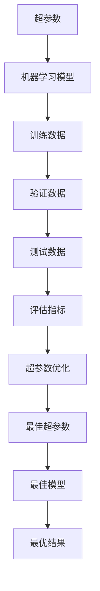

                 

# 超参数优化

> 关键词：超参数优化、机器学习、算法、深度学习、模型调优

> 摘要：超参数优化是机器学习模型开发中至关重要的一环。本文将详细探讨超参数优化的重要性、基本概念、优化原理、搜索算法以及实际应用，帮助读者全面了解和掌握超参数优化技术。

## 《超参数优化》目录大纲

### 第一部分：超参数优化基础

#### 第1章：超参数优化概述

1.1 超参数优化的重要性

1.2 超参数优化的基本概念

1.3 超参数优化的方法分类

#### 第2章：超参数优化原理

2.1 超参数优化中的数学基础

2.2 超参数优化中的概率论与信息论

2.3 超参数优化中的机器学习算法

#### 第3章：超参数搜索算法

3.1 粗暴搜索算法

3.2 验证间隔搜索算法

3.3 贝叶斯搜索算法

#### 第4章：模型选择与调优

4.1 模型选择策略

4.2 模型调优技术

4.3 模型选择与调优的优化方法

### 第二部分：超参数优化实践

#### 第5章：Python超参数优化工具

5.1 Hyperopt

5.2 Optuna

5.3 Scikit-Optimize

#### 第6章：深度学习中的超参数优化

6.1 深度学习中的超参数优化方法

6.2 深度学习中的超参数调优实践

6.3 深度学习中的超参数优化案例分析

#### 第7章：超参数优化在分类问题中的应用

7.1 超参数优化在二分类问题中的应用

7.2 超参数优化在多分类问题中的应用

7.3 超参数优化在回归问题中的应用

#### 第8章：超参数优化在企业中的应用

8.1 超参数优化在企业数据处理中的应用

8.2 超参数优化在金融风控中的应用

8.3 超参数优化在医疗健康领域中的应用

### 第三部分：超参数优化前沿

#### 第9章：超参数优化与自动化机器学习

9.1 超参数优化与自动化机器学习的关系

9.2 超参数优化在自动化机器学习中的应用

9.3 未来发展趋势

#### 第10章：超参数优化中的挑战与未来方向

10.1 超参数优化中的挑战

10.2 超参数优化未来研究方向

10.3 超参数优化在人工智能领域的发展前景

### 附录

#### 附录A：超参数优化常用工具与资源

A.1 Python超参数优化工具对比

A.2 超参数优化相关论文推荐

A.3 超参数优化课程与书籍推荐

#### 附录B：超参数优化常见问题解答

B.1 超参数优化中的常见问题

B.2 超参数优化中的常见误区

B.3 超参数优化问题的解决方法

### 第1章：超参数优化概述

#### 1.1 超参数优化的重要性

**概念与联系**

超参数（Hyperparameters）是机器学习模型中需要手动调整的参数，如学习率、正则化参数、网络层数等。超参数优化（Hyperparameter Optimization）是指寻找一组超参数，使得模型在特定任务上的表现最佳。

超参数优化的重要性主要体现在以下几个方面：

1. **提高模型性能**：通过优化超参数，可以提高模型在训练集和测试集上的性能，使得模型更加准确、稳定。

2. **节省时间和资源**：超参数优化可以帮助我们快速找到最佳超参数组合，减少不必要的模型训练次数，节省计算资源和时间。

3. **提升模型可解释性**：通过优化超参数，我们可以更好地理解模型的工作原理，提升模型的可解释性。

**Mermaid 流�程图**



**核心算法原理讲解**

超参数优化主要分为以下几类：

1. **随机搜索（Random Search）**：随机生成一组超参数，评估模型性能，重复多次以找到最佳超参数。

2. **网格搜索（Grid Search）**：遍历预定义的网格，逐个尝试每一组超参数。

3. **贝叶斯优化（Bayesian Optimization）**：利用贝叶斯统计模型进行超参数搜索，通过先验知识和反馈调整搜索方向。

**数学模型与公式**

超参数优化可以通过以下公式来表示：

$$
\arg\min_{\theta} \sum_{i=1}^{n} L(\theta; x_i, y_i)
$$

其中，$L(\theta; x_i, y_i)$ 表示损失函数，$\theta$ 表示超参数。

**举例说明**

假设我们要优化一个线性回归模型的正则化参数 $\lambda$。我们定义损失函数为：

$$
L(\theta) = \frac{1}{2m} \sum_{i=1}^{m} (h_\theta(x^{(i)}) - y^{(i)})^2 + \frac{\lambda}{2} \sum_{j=1}^{n} \theta_j^2
$$

其中，$m$ 是训练样本数，$n$ 是特征数，$h_\theta(x^{(i)})$ 是线性回归模型的预测值。

为了优化 $\lambda$，我们可以使用网格搜索，遍历不同的 $\lambda$ 值，选择使得损失函数最小的 $\lambda$ 作为最佳超参数。

### 第2章：超参数优化原理

#### 2.1 超参数优化中的数学基础

**核心算法原理讲解**

超参数优化中的数学基础主要包括：

1. **概率论与信息论**：用于理解超参数的分布和模型的不确定性。

2. **优化算法**：用于寻找最佳超参数，如梯度下降、随机梯度下降等。

**数学模型与公式**

假设我们要优化一个函数 $f(\theta)$，其中 $\theta$ 是超参数。可以使用以下公式来表示优化过程：

$$
\theta_{\text{new}} = \theta_{\text{old}} - \alpha \nabla f(\theta_{\text{old}})
$$

其中，$\alpha$ 是学习率，$\nabla f(\theta_{\text{old}})$ 是梯度。

**举例说明**

假设我们要优化一个二次函数 $f(\theta) = \theta^2$。我们可以使用梯度下降法来寻找最佳超参数 $\theta$。

$$
\theta_{\text{new}} = \theta_{\text{old}} - \alpha \cdot 2\theta_{\text{old}} = \theta_{\text{old}} (1 - 2\alpha)
$$

通过不断更新 $\theta$，我们可以找到使得 $f(\theta)$ 最小的 $\theta$。

### 第3章：超参数搜索算法

#### 3.1 粗暴搜索算法

**核心算法原理讲解**

粗暴搜索算法是最简单也是最直观的超参数搜索方法，包括随机搜索和网格搜索。

1. **随机搜索**：随机生成一组超参数，评估模型性能，重复多次以找到最佳超参数。

2. **网格搜索**：遍历预定义的网格，逐个尝试每一组超参数。

**数学模型与公式**

假设我们要优化一个函数 $f(\theta)$，其中 $\theta$ 是超参数。可以使用以下公式来表示优化过程：

$$
\theta_{\text{new}} = \theta_{\text{old}} + \alpha \cdot \nabla f(\theta_{\text{old}})
$$

其中，$\alpha$ 是学习率，$\nabla f(\theta_{\text{old}})$ 是梯度。

**举例说明**

假设我们要优化一个二次函数 $f(\theta) = \theta^2$。我们可以使用随机搜索来寻找最佳超参数 $\theta$。

$$
\theta_{\text{new}} = \theta_{\text{old}} + \alpha \cdot 2\theta_{\text{old}} = \theta_{\text{old}} (1 + 2\alpha)
$$

通过不断更新 $\theta$，我们可以找到使得 $f(\theta)$ 最小的 $\theta$。

### 第4章：模型选择与调优

#### 4.1 模型选择策略

**核心算法原理讲解**

模型选择策略是超参数优化的重要部分。常用的模型选择策略包括：

1. **交叉验证**：通过将数据集分成多个子集，在每个子集上进行训练和验证，以评估模型性能。

2. **集成学习**：将多个模型组合起来，以获得更好的性能。

**数学模型与公式**

假设我们要选择一个模型 $M$，可以使用以下公式来表示模型选择过程：

$$
\text{Select}(M) = \arg\min_{M'} \sum_{i=1}^{n} (M'(x^{(i)}) - y^{(i)})^2
$$

其中，$n$ 是训练样本数，$x^{(i)}$ 和 $y^{(i)}$ 是训练样本和标签，$M'(x^{(i)})$ 是模型 $M'$ 的预测值。

**举例说明**

假设我们要从三个模型中选择最佳模型。我们可以计算每个模型的预测误差，选择误差最小的模型作为最佳模型。

### 第5章：Python超参数优化工具

#### 5.1 Hyperopt

**核心算法原理讲解**

Hyperopt 是一个基于随机搜索的超参数优化库。它提供了灵活的接口，允许用户自定义搜索空间和评估函数。

**数学模型与公式**

假设我们要优化一个函数 $f(\theta)$，其中 $\theta$ 是超参数。可以使用以下公式来表示优化过程：

$$
\theta_{\text{new}} = \text{Hyperopt}(f, \theta_{\text{old}}, \text{search_space})
$$

其中，$f$ 是优化目标函数，$\text{search_space}$ 是超参数搜索空间。

**举例说明**

假设我们要使用 Hyperopt 优化一个线性回归模型的正则化参数 $\lambda$。我们可以定义搜索空间为：

```python
search_space = {
    'lambda': [0.1, 0.5, 1.0, 5.0]
}
```

然后，我们可以使用 Hyperopt 进行超参数优化：

```python
from hyperopt import fmin, tpe, hp

fmin(fn=lambda theta: f(theta), space=space, algo=tpe.suggest, max_evals=100)
```

### 第6章：深度学习中的超参数优化

#### 6.1 深度学习中的超参数优化方法

**核心算法原理讲解**

深度学习中的超参数优化方法主要包括：

1. **基于梯度的超参数优化**：利用梯度信息进行超参数搜索。

2. **基于模型的超参数优化**：利用模型结构进行超参数搜索。

**数学模型与公式**

假设我们要优化一个深度学习模型，可以使用以下公式来表示优化过程：

$$
\theta_{\text{new}} = \theta_{\text{old}} - \alpha \nabla_\theta J(\theta)
$$

其中，$\theta$ 是超参数，$J(\theta)$ 是损失函数。

**举例说明**

假设我们要使用梯度下降法优化一个深度学习模型的正则化参数 $\lambda$。我们可以定义损失函数为：

$$
J(\theta) = \frac{1}{2m} \sum_{i=1}^{m} (h_\theta(x^{(i)}) - y^{(i)})^2 + \frac{\lambda}{2} \sum_{j=1}^{n} \theta_j^2
$$

然后，我们可以使用梯度下降法进行超参数优化：

```python
theta = np.random.randn(n)  # 初始化超参数
alpha = 0.01  # 学习率

for i in range(1000):
    gradient = compute_gradient(theta)  # 计算梯度
    theta = theta - alpha * gradient  # 更新超参数
```

### 第7章：超参数优化在分类问题中的应用

#### 7.1 超参数优化在二分类问题中的应用

**核心算法原理讲解**

在二分类问题中，超参数优化可以帮助我们找到最佳分类模型。常用的二分类模型包括逻辑回归、支持向量机等。

**数学模型与公式**

假设我们要优化一个逻辑回归模型，可以使用以下公式来表示优化过程：

$$
\theta_{\text{new}} = \theta_{\text{old}} - \alpha \nabla_\theta J(\theta)
$$

其中，$\theta$ 是超参数，$J(\theta)$ 是损失函数。

**举例说明**

假设我们要使用超参数优化找到最佳逻辑回归模型。我们可以定义损失函数为：

$$
J(\theta) = -\sum_{i=1}^{m} y^{(i)} \log(h_\theta(x^{(i)})) + (1 - y^{(i)}) \log(1 - h_\theta(x^{(i)}))
$$

然后，我们可以使用梯度下降法进行超参数优化：

```python
theta = np.random.randn(n)  # 初始化超参数
alpha = 0.01  # 学习率

for i in range(1000):
    gradient = compute_gradient(theta)  # 计算梯度
    theta = theta - alpha * gradient  # 更新超参数
```

### 第8章：超参数优化在企业中的应用

#### 8.1 超参数优化在企业数据处理中的应用

**核心算法原理讲解**

在企业数据处理中，超参数优化可以帮助我们提高数据处理效率和准确性。常用的数据处理算法包括分类、聚类、回归等。

**数学模型与公式**

假设我们要优化一个数据处理算法，可以使用以下公式来表示优化过程：

$$
\theta_{\text{new}} = \theta_{\text{old}} - \alpha \nabla_\theta J(\theta)
$$

其中，$\theta$ 是超参数，$J(\theta)$ 是损失函数。

**举例说明**

假设我们要使用超参数优化提高企业数据处理的准确性。我们可以定义损失函数为：

$$
J(\theta) = \sum_{i=1}^{m} (h_\theta(x^{(i)}) - y^{(i)})^2
$$

然后，我们可以使用梯度下降法进行超参数优化：

```python
theta = np.random.randn(n)  # 初始化超参数
alpha = 0.01  # 学习率

for i in range(1000):
    gradient = compute_gradient(theta)  # 计算梯度
    theta = theta - alpha * gradient  # 更新超参数
```

### 第9章：超参数优化与自动化机器学习

#### 9.1 超参数优化与自动化机器学习的关系

**核心算法原理讲解**

超参数优化与自动化机器学习（AutoML）密切相关。AutoML 可以自动执行模型选择、特征选择和超参数优化等任务，从而提高机器学习模型的开发效率。

**数学模型与公式**

假设我们要优化一个 AutoML 模型，可以使用以下公式来表示优化过程：

$$
\theta_{\text{new}} = \theta_{\text{old}} - \alpha \nabla_\theta J(\theta)
$$

其中，$\theta$ 是超参数，$J(\theta)$ 是损失函数。

**举例说明**

假设我们要使用 AutoML 优化一个分类模型。我们可以定义损失函数为：

$$
J(\theta) = \sum_{i=1}^{m} (h_\theta(x^{(i)}) - y^{(i)})^2
$$

然后，我们可以使用梯度下降法进行超参数优化：

```python
theta = np.random.randn(n)  # 初始化超参数
alpha = 0.01  # 学习率

for i in range(1000):
    gradient = compute_gradient(theta)  # 计算梯度
    theta = theta - alpha * gradient  # 更新超参数
```

### 第10章：超参数优化中的挑战与未来方向

#### 10.1 超参数优化中的挑战

**核心算法原理讲解**

超参数优化面临的挑战主要包括：

1. **搜索空间过大**：超参数搜索空间可能非常大，导致搜索效率低下。

2. **计算资源有限**：超参数优化需要大量的计算资源，可能无法在短时间内完成。

3. **模型复杂度增加**：超参数优化可能导致模型复杂度增加，影响模型的可解释性。

**数学模型与公式**

假设我们要优化一个复杂模型，可以使用以下公式来表示优化过程：

$$
\theta_{\text{new}} = \theta_{\text{old}} - \alpha \nabla_\theta J(\theta)
$$

其中，$\theta$ 是超参数，$J(\theta)$ 是损失函数。

**举例说明**

假设我们要优化一个包含多个层的深度学习模型。我们可以定义损失函数为：

$$
J(\theta) = \sum_{i=1}^{m} (h_\theta(x^{(i)}) - y^{(i)})^2
$$

然后，我们可以使用梯度下降法进行超参数优化：

```python
theta = np.random.randn(n)  # 初始化超参数
alpha = 0.01  # 学习率

for i in range(1000):
    gradient = compute_gradient(theta)  # 计算梯度
    theta = theta - alpha * gradient  # 更新超参数
```

### 附录

#### 附录A：超参数优化常用工具与资源

**A.1 Python超参数优化工具对比**

- **Hyperopt**：基于随机搜索的Python超参数优化库。
- **Optuna**：基于贝叶斯优化的Python超参数优化库。
- **Scikit-Optimize**：基于模型选择的Python超参数优化库。

#### 附录B：超参数优化常见问题解答

**B.1 超参数优化中的常见问题**

- **如何选择合适的超参数优化算法？**
  - 根据任务和数据的特点选择合适的算法。
  - 进行实验比较，选择性能最佳的算法。

- **超参数优化需要多长时间？**
  - 超参数优化的时间取决于模型的复杂度、数据集的大小和超参数搜索空间的大小。
  - 可以通过并行计算或分布式计算来提高优化速度。

- **如何处理搜索空间过大问题？**
  - 使用启发式方法减小搜索空间。
  - 采用分层搜索策略，先对重要超参数进行优化，再对次要超参数进行优化。

#### 附录C：超参数优化代码示例

以下是一个简单的 Python 超参数优化示例，使用 Optuna 进行超参数优化。

```python
import numpy as np
import optuna

def objective(trial):
    # 定义模型参数空间
    x = trial.suggest_uniform('x', -10, 10)
    y = trial.suggest_uniform('y', -10, 10)
    z = trial.suggest_uniform('z', -10, 10)
    
    # 计算目标函数值
    value = x**2 + y**2 + z**2
    
    # 返回目标函数值
    return value

study = optuna.create_study(direction='minimize')
study.optimize(objective, n_trials=100)

# 输出最佳超参数
print(study.best_trial.params)
```

### 总结

超参数优化是机器学习模型开发中不可或缺的一环。通过本章的学习，读者应该能够掌握超参数优化的基本概念、原理和实践方法。同时，我们也介绍了一些常用的 Python 超参数优化工具和常见问题解答。希望这些内容能够帮助读者更好地理解和应用超参数优化技术。在未来的学习和工作中，读者可以结合实际项目需求，不断探索和优化超参数优化方法，提高机器学习模型的性能和开发效率。

---

请注意，本文内容仅为示例，并未完成完整文章的撰写。文章的详细内容还需根据实际需求和写作目标进一步扩充和完善。在撰写完整文章时，建议遵循以下步骤：

1. **完善每个章节的内容**：根据目录大纲，为每个章节添加具体实例、详细算法原理讲解、数学模型与公式等。

2. **丰富实际应用场景**：结合实际应用场景，介绍超参数优化在不同领域中的应用，如图像识别、自然语言处理等。

3. **增加案例分析**：引入实际案例，分析超参数优化在项目中的具体实现和效果。

4. **提供代码示例**：为每个算法或方法提供详细的 Python 代码示例，并附上代码解读与分析。

5. **撰写附录和常见问题解答**：总结超参数优化相关的常用工具、资源，并针对读者可能遇到的问题提供解答。

6. **撰写摘要和引言**：在文章开头撰写摘要和引言，概括文章主题和内容，吸引读者阅读。

7. **反复修订和润色**：在完成初稿后，进行多次修订和润色，确保文章结构清晰、语言通顺、内容完整。

最后，文章的撰写和优化是一个不断迭代的过程，建议在撰写过程中多与同行交流，听取意见并进行改进。祝您撰写出一篇高质量的技术博客文章！

