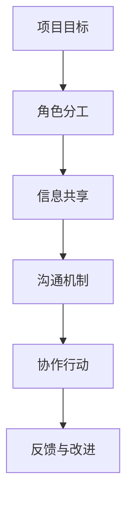
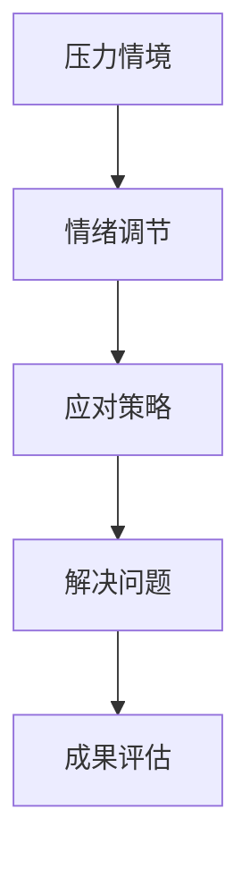

                 

# 《跨团队沟通协作能力和抗压能力培养》

## 关键词

跨团队沟通、协作能力、抗压能力、团队建设、项目实战、技术方法论、心理学原理。

## 摘要

在当今复杂多变的职场环境中，跨团队沟通协作能力和抗压能力已经成为团队成员必备的核心素质。本文从多个角度深入探讨了跨团队沟通协作与抗压能力的培养，首先阐述了两者在团队工作中的重要性及相互关系，然后详细介绍了跨团队沟通协作的基础、关键要素、协作能力提升策略，以及抗压能力的识别与管理、提高方法、团队抗压能力建设等内容。通过具体的案例研究和项目实战，本文提供了实际操作经验，旨在帮助读者提升跨团队沟通协作与抗压能力，从而实现团队的高效运作与个人成长。

----------------------------------------------------------------

## 第一部分：引言

### 1.1 跨团队沟通协作的重要性

在当今企业环境中，跨团队沟通协作已成为实现组织目标的关键因素。跨团队沟通协作不仅涉及不同职能部门之间的信息传递，还涵盖了不同专业领域、不同工作方式、不同文化背景的个体之间的互动。有效的跨团队沟通协作能够促进团队成员之间的理解与信任，提高工作效率，降低项目风险，从而实现整体目标的顺利达成。

首先，跨团队沟通协作在团队中的作用不可忽视。通过有效的沟通，团队成员能够明确任务目标、分工与职责，确保各项工作有条不紊地进行。同时，跨团队沟通协作有助于分享经验和资源，提高团队整体的创新能力。此外，跨团队沟通协作还可以促进团队合作，增强团队的凝聚力和归属感。

其次，跨团队沟通的挑战与机会并存。团队成员来自不同的背景，拥有不同的专业知识和工作方式，这给跨团队沟通带来了一定的困难。语言障碍、文化差异、沟通渠道不畅等都是跨团队沟通中常见的挑战。然而，正是这些挑战，也为跨团队沟通提供了改进和提升的机会。通过建立有效的沟通机制、培养跨文化沟通能力、提高沟通技巧，团队可以克服这些困难，实现更好的沟通效果。

总之，跨团队沟通协作在团队工作中具有重要作用。通过有效沟通，团队可以更好地理解任务目标、分工与职责，提高工作效率，降低项目风险。同时，跨团队沟通协作也带来了挑战，但正是这些挑战，促使团队不断改进和提升沟通能力，从而实现团队的高效运作。

### 1.2 压力的来源与影响

在现代职场中，压力已经成为影响员工心理健康和工作表现的一个重要因素。对于跨团队沟通协作而言，了解压力的来源及其对个人和团队的影响至关重要。

首先，压力的来源可以分为以下几个方面：

1. **工作负荷**：随着工作任务的增多和项目进度的紧迫，员工往往需要承受更大的工作压力。长时间的工作、频繁的加班以及高强度的工作节奏，都会增加员工的心理压力。

2. **时间压力**：在有限的时间内完成任务，员工需要高效地安排自己的工作和时间。时间压力可能导致员工产生焦虑和不安，影响工作质量和沟通效果。

3. **人际关系**：跨团队沟通涉及不同背景和性格的个体之间的互动。人际关系问题，如沟通不畅、冲突、误解等，都可能成为压力的来源。

4. **职业发展**：员工对自身职业发展的期望和焦虑，以及对未来不确定性的担忧，也是导致压力的重要因素。

其次，压力对个人和团队的影响不容忽视。对于个人来说，长期的压力可能导致心理健康问题，如焦虑、抑郁、失眠等。此外，压力还可能影响员工的工作表现，导致工作效率下降、创造力减弱、工作质量下降。

对于团队而言，压力的影响同样显著。团队成员的压力可能导致团队士气低落、协作不畅、工作效率降低。在压力下，团队成员可能更容易出现冲突和误解，影响团队的整体表现和凝聚力。

因此，了解压力的来源和影响，对于团队管理和个人成长都具有重要意义。通过识别和管理压力源，团队可以更好地应对压力，提高工作效率，实现团队目标。

### 1.3 跨团队沟通协作与抗压能力的联系

跨团队沟通协作与抗压能力之间存在着密切的联系，这两者相互促进，共同作用于团队的工作效率和成员的心理健康。有效的跨团队沟通协作可以为团队成员提供更多的信息资源和支持，从而缓解压力；而强大的抗压能力则有助于团队成员在面对压力时保持冷静和高效的沟通，提高跨团队协作的效果。

首先，有效的跨团队沟通协作能够为团队成员提供更多的信息和资源，从而减轻压力。通过跨团队沟通，团队成员可以更全面地了解项目的进展情况、各自的任务分工以及潜在的问题和风险。这样，团队成员就可以提前做好准备，调整自己的工作计划，降低突发情况带来的压力。同时，跨团队沟通还可以促进团队成员之间的理解和支持，减少误解和冲突，从而降低因人际关系问题导致的压力。

其次，强大的抗压能力有助于团队成员在面对压力时保持冷静和高效的沟通。抗压能力不仅包括情绪调节和心理调适，还涉及解决问题的能力和积极的应对策略。在压力情境下，具有强大抗压能力的成员能够迅速调整心态，分析问题，寻找解决方案，从而保持沟通的连贯性和有效性。这种能力不仅可以提升个人在团队中的价值，还可以增强团队的凝聚力和协作能力。

总之，跨团队沟通协作与抗压能力相互促进，共同作用于团队的工作效率和成员的心理健康。有效的跨团队沟通协作可以为团队成员提供更多的信息和资源，缓解压力；而强大的抗压能力则有助于团队成员在面对压力时保持冷静和高效的沟通。通过培养和提高这两个能力，团队可以更好地应对挑战，实现高效运作和持续发展。

## 第二部分：跨团队沟通协作能力培养

### 2.1 沟通的基本原则

在跨团队沟通协作中，了解并遵循一些基本沟通原则至关重要。这些原则不仅有助于确保信息的准确传递，还能提升沟通的有效性和协作的效率。以下是几个关键的沟通原则：

#### 清晰表达

清晰表达是沟通的基础。为了确保信息的准确传达，沟通者需要用简单、明确的词语来描述自己的想法和观点。避免使用过于复杂或模糊的语言，以免造成误解。同时，使用具体的事例和数据来支持观点，有助于增强说服力和可信度。

#### 倾听与反馈

有效的沟通不仅仅是表达，还包括倾听和理解对方的观点。倾听不仅意味着关注对方的话语，还要关注其非语言行为，如肢体语言和面部表情。此外，及时给予反馈是确保双方理解一致的重要手段。反馈可以是正面或建设性的，通过反馈，沟通者可以确认对方是否正确理解了自己的意图。

#### 透明沟通

透明沟通是指在整个沟通过程中保持信息的开放和透明。团队成员应尽量公开分享项目进展、遇到的问题和解决方案，避免信息孤岛和封闭沟通。透明沟通有助于建立信任，减少误解和冲突，从而提高团队协作的效率。

#### 尊重与包容

尊重与包容是跨团队沟通中不可或缺的原则。团队成员来自不同的背景和文化，拥有不同的专业知识和工作方式。在沟通中，要尊重对方的观点和意见，避免因文化差异或个人偏见而产生误解。包容不同意见和观点，有助于激发团队的创造力和创新能力。

通过遵循这些基本原则，跨团队沟通可以更加高效和顺畅，从而提升团队协作的效能。有效的沟通不仅能够确保信息的准确传递，还能增强团队成员之间的信任和合作，为团队的成功运作奠定坚实的基础。

### 2.2 跨团队沟通的关键要素

在跨团队沟通协作中，理解并有效运用关键要素是确保沟通顺畅和高效的重要手段。以下是几个关键的要素：

#### 文化差异

文化差异是跨团队沟通中的一个重要因素。团队成员来自不同的背景和文化，可能拥有不同的价值观、沟通习惯和工作方式。这些文化差异可能导致误解和沟通障碍。例如，一些文化更注重直接和直接的沟通，而另一些文化则更倾向于间接和礼貌的交流。为了克服这些障碍，团队需要培养跨文化沟通意识，尊重并理解不同文化的差异。在沟通中，团队成员应尽量使用简单、明确的语言，避免使用过于复杂或具有文化特定含义的词汇。此外，组织可以提供跨文化培训，帮助团队成员更好地理解和适应不同的文化背景。

#### 沟通渠道选择

选择合适的沟通渠道对于确保信息传达的及时性和准确性至关重要。常见的沟通渠道包括面对面会议、电子邮件、即时通讯工具（如Slack或Microsoft Teams）和视频会议。每种渠道都有其适用的场景和优势。例如，面对面会议适合深度讨论和决策，而电子邮件适合正式和详细的沟通。团队应根据具体的沟通需求和任务类型，选择最合适的沟通渠道。例如，对于需要即时响应的任务，可以使用即时通讯工具，而对于需要详细记录和跟踪的任务，则可以使用电子邮件。

#### 团队角色与责任

明确团队角色与责任是跨团队沟通协作的基础。每个团队成员都应清楚自己的职责和任务，避免因角色混淆或责任不清而导致沟通不畅。团队领导者应制定明确的任务分配和责任界定，确保每个成员都了解自己的角色和任务。此外，团队还应建立透明的沟通机制，确保信息能够在团队内部顺畅流通。例如，定期召开团队会议，讨论项目进展和遇到的问题，确保每个成员都能及时了解项目动态。

通过有效运用这些关键要素，跨团队沟通可以更加高效和顺畅。文化差异的理解和尊重有助于减少误解和冲突，选择合适的沟通渠道可以确保信息的准确传递，明确的团队角色与责任可以避免沟通中的混乱和责任推卸。这些要素的综合运用，不仅能够提升团队协作的效能，还能为团队的成功运作提供有力保障。

### 2.3 跨团队沟通障碍及解决方法

在跨团队沟通协作中，障碍和问题是不可避免的。这些障碍可能来源于语言、情感、信任等多个方面，影响团队的工作效率和沟通效果。以下是几种常见的跨团队沟通障碍及相应的解决方法：

#### 语言障碍

语言障碍是跨团队沟通中最为普遍的障碍之一。团队成员可能来自不同的语言背景，导致沟通不畅。解决这一障碍的方法包括：

1. **提供语言培训**：组织可以提供语言培训，帮助团队成员提高语言水平，尤其是专业术语和行业用语。这有助于减少误解和沟通障碍。

2. **使用共同语言**：在跨团队沟通中，选择一种共同的语言作为主要沟通工具，例如英语，可以降低语言障碍。同时，鼓励团队成员学习对方的语言，增进相互理解和沟通。

3. **使用辅助工具**：利用翻译工具或实时翻译服务，帮助团队成员更好地理解和传达信息。

#### 情感障碍

情感障碍主要是指团队成员之间的情绪冲突和误解。这些情绪障碍可能导致沟通不畅、团队合作受阻。解决方法包括：

1. **建立情感沟通渠道**：团队可以通过设立情感沟通渠道，如团队建设活动、心理辅导等，帮助成员表达自己的情感和需求，增进相互理解。

2. **倾听与同理心**：团队成员应学会倾听对方的情感表达，并尝试站在对方的角度理解和感受，以减少误解和冲突。

3. **及时反馈与调解**：在情感冲突发生时，团队领导者应迅速介入，通过沟通和调解，帮助双方找到解决问题的方法，恢复团队和谐。

#### 信任缺失

信任是跨团队沟通和协作的基础。信任缺失可能导致团队成员之间的隔阂和沟通障碍。解决方法包括：

1. **建立信任机制**：团队可以通过设立透明的沟通机制、明确的责任分配和公平的评价体系，建立和维护团队成员之间的信任。

2. **共同目标与价值观**：通过确立共同的目标和价值观，增强团队成员之间的认同感和归属感，从而建立信任。

3. **鼓励开放沟通**：团队应鼓励成员开放地表达观点和意见，建立坦诚、开放的沟通氛围，减少因误解和猜疑导致的信任缺失。

通过识别和解决这些跨团队沟通障碍，团队可以建立更加高效和和谐的沟通环境，提升协作效率和项目成功概率。

### 2.4 跨团队沟通协作能力提升策略

为了提升跨团队沟通协作能力，团队可以从多个方面入手，包括团队文化建设、角色定位、项目管理工具和方法等。以下是几个关键策略：

#### 团队文化建设

团队文化是团队内部共同价值观和行为准则的体现，对团队沟通协作能力有着重要的影响。一个积极、开放、包容的团队文化可以促进团队成员之间的沟通和合作。以下是一些具体措施：

1. **确立共同价值观**：团队应明确共同的价值观和目标，确保每个成员都认同并为之努力。这有助于增强团队成员之间的凝聚力，促进沟通和协作。

2. **建立信任基础**：信任是团队沟通和协作的基础。团队可以通过设立透明的沟通机制、公平的评价体系等方式，建立和维护团队成员之间的信任。

3. **培养合作精神**：团队可以通过举办团队建设活动、团队拓展训练等方式，培养成员之间的合作精神，增强团队凝聚力。

#### 角色定位

明确团队角色和职责是确保跨团队沟通协作顺畅的重要前提。每个成员都应清楚自己的职责和任务，避免角色重叠和责任推卸。以下是一些建议：

1. **明确角色分工**：团队应根据任务需求，明确每个成员的角色和职责。这有助于确保任务分配合理，提高工作效率。

2. **建立角色责任体系**：团队应建立明确的角色责任体系，确保每个成员都清楚自己的责任范围，避免因责任不清导致的沟通障碍。

3. **加强沟通与协调**：团队成员应保持密切沟通，及时分享信息和进展，确保任务执行的顺利进行。

#### 项目管理工具和方法

项目管理工具和方法可以帮助团队更好地规划、执行和监控项目，提高跨团队沟通协作的效率。以下是一些常用的工具和方法：

1. **敏捷开发方法**：敏捷开发强调快速迭代和灵活响应变化，有助于团队快速适应项目需求变化，提高沟通和协作效率。

2. **任务管理工具**：如JIRA、Trello等，可以帮助团队明确任务分配、进度监控和任务协作，提高工作效率。

3. **沟通平台**：如Slack、Microsoft Teams等，提供即时通讯、视频会议和文件共享等功能，有助于团队成员之间的实时沟通和协作。

通过实施这些策略，团队可以提升跨团队沟通协作能力，实现高效运作和项目成功。团队文化建设、角色定位和项目管理工具的综合运用，将为团队的成功奠定坚实基础。

### 2.5 跨团队沟通协作案例研究

#### 案例一：跨国公司跨部门项目

**项目背景**

某跨国公司计划开发一款全球化的电子商务平台，该项目涉及多个部门，包括市场部、研发部、运维部和客户服务部。由于团队成员分布在不同的国家和地区，语言和文化背景各异，项目沟通和协作面临巨大挑战。

**沟通协作过程**

1. **需求明确与任务分配**：项目启动之初，项目管理团队组织了多场跨部门的会议，明确项目需求，并按照部门职责和技能分配任务。每个部门都指定了项目负责人，负责协调本部门的工作。

2. **沟通渠道建立**：为了确保信息的及时传递和问题解决，项目团队建立了多层次的沟通渠道。首先，每周举行一次全体会议，由项目经理汇总各部门的工作进展，讨论问题并制定下一步计划。其次，各部门内部每周举行一次会议，确保任务执行和问题解决。

3. **实时沟通工具应用**：项目团队使用了Slack进行实时沟通，建立了多个工作群组，涵盖市场部、研发部、运维部和客户服务部。团队成员可以在各自的工作群组中分享信息、讨论问题和协作完成任务。

4. **跨文化沟通培训**：公司为团队成员提供了跨文化沟通培训，帮助他们了解不同文化背景下的沟通习惯和礼仪，提高跨文化沟通能力。

**成功与挑战**

1. **成功经验**：通过明确的任务分配和高效的沟通协作，项目团队在预定时间内完成了电子商务平台的核心功能开发。团队成员之间的沟通顺畅，问题解决及时，项目进展顺利。

2. **挑战**：尽管项目团队在沟通协作方面取得了成功，但跨文化差异和语言障碍仍然对项目造成了一定的影响。一些文化背景不同的团队成员在沟通时存在误解和冲突，影响了团队的整体协作效果。

**结论**

该案例表明，跨团队沟通协作在跨国公司项目中具有重要意义。通过建立明确的沟通渠道、使用实时沟通工具和提供跨文化沟通培训，团队可以克服语言和文化差异，实现高效协作。然而，跨文化差异仍然是需要持续关注和解决的问题，团队需要不断优化沟通策略，提高跨文化沟通能力。

### 2.6 敏捷开发团队协作

**敏捷开发方法论**

敏捷开发是一种以人为核心、迭代、渐进的方法论，强调快速响应变化和持续交付价值。敏捷开发的核心原则包括：

1. **个体和互动重于流程和工具**：强调团队成员之间的沟通和协作，而非过分依赖工具和流程。
2. **可工作的软件重于详尽的文档**：优先关注可工作的软件交付，而非冗长的文档编写。
3. **客户合作重于合同谈判**：与客户保持紧密合作，共同定义需求和解决方案。
4. **响应变化重于遵循计划**：灵活应对需求变化，保持项目的灵活性和适应性。

**敏捷沟通协作实践**

1. **每日站立会议**：每日站立会议是敏捷开发团队的核心沟通实践。团队成员每天早晨花15-30分钟时间，面对面或在线分享工作进展、遇到的障碍和计划，确保团队成员之间信息同步。

2. **迭代回顾会议**：在每个迭代结束时，团队会举行回顾会议，总结本次迭代的工作，讨论成功的经验、存在的问题和改进点，为下一个迭代做好准备。

3. **信息可视化**：使用看板、任务列表、燃尽图等工具，将项目进度和信息可视化，便于团队成员了解项目状态和协作。

**效果评估**

敏捷开发团队的协作实践显著提高了团队的工作效率和沟通效果。通过每日站立会议和迭代回顾会议，团队成员能够及时了解项目进展和问题，快速响应变化。信息可视化工具帮助团队成员清晰地看到项目状态和任务进展，避免了信息传递的滞后和误差。敏捷开发方法使得团队更加灵活和高效，能够在快速变化的市场环境中保持竞争力。

### 2.7 虚拟团队协作

**虚拟团队的挑战**

虚拟团队是指团队成员分布在不同地理位置，通过技术手段进行协作的团队。虚拟团队面临以下挑战：

1. **沟通障碍**：由于地理位置分散，团队成员之间沟通的频率和深度相对较低，容易导致信息传递的滞后和误差。
2. **协作效率**：虚拟团队需要依赖电子工具进行协作，而这些工具的使用和适应可能需要一定的学习和调整时间。
3. **文化差异**：虚拟团队成员来自不同的文化背景，可能存在价值观、沟通习惯等方面的差异，影响团队的协作效果。

**沟通协作策略**

1. **明确沟通计划**：虚拟团队需要制定详细的沟通计划，包括定期会议的时间、内容、沟通渠道等，确保团队成员之间的信息传递畅通。
2. **使用高效的协作工具**：选择适合虚拟团队的协作工具，如Slack、Microsoft Teams、Trello等，确保团队成员能够高效地交流和协作。
3. **建立信任机制**：通过共享项目进展、反馈意见和及时解决问题，建立团队成员之间的信任，提高协作效率。

**成功经验**

通过实施上述策略，虚拟团队可以克服沟通障碍和协作效率问题，实现高效协作。例如，某虚拟团队通过定期举行在线会议、使用Trello进行任务管理、建立邮件提醒机制，成功完成了跨国电商平台的开发项目。团队成员之间的沟通顺畅，协作效率提高，项目进展顺利。

### 2.8 跨团队沟通协作的实践效果

跨团队沟通协作能力的提升对团队的整体绩效产生了显著的积极影响。以下是几个方面的实践效果：

1. **工作效率提高**：通过明确的沟通计划和高效的协作工具，团队成员能够及时了解项目进展和任务需求，减少信息传递的滞后和误差，提高工作效率。
2. **协作质量提升**：有效的沟通和协作机制有助于团队成员之间建立信任，增强合作精神，提高协作质量，从而更好地实现项目目标。
3. **问题解决速度加快**：通过跨团队的沟通协作，团队成员能够迅速识别和解决问题，减少项目风险，提高项目成功率。
4. **团队凝聚力增强**：跨团队沟通协作不仅提升了工作效率，还增强了团队成员之间的信任和凝聚力，提高了团队的归属感和满意度。

总之，跨团队沟通协作能力的提升为团队带来了多方面的积极影响，有助于实现高效运作和项目成功。

## 第三部分：抗压能力培养

### 3.1 压力识别

压力识别是应对压力的首要步骤。了解压力的来源和表现，有助于团队成员及时采取应对措施，减轻压力带来的负面影响。以下是几种常见的压力识别方法：

#### 压力信号的识别

压力信号是身体和心理上的各种迹象，表明个体可能正在承受压力。以下是一些常见的压力信号：

1. **身体信号**：疲劳、头痛、胃痛、失眠、肌肉紧张等。
2. **情绪信号**：焦虑、易怒、情绪波动、感到无助或绝望。
3. **行为信号**：工作效率降低、工作拖延、过度消费、逃避问题等。
4. **心理信号**：注意力不集中、记忆力减退、自我评价降低等。

#### 压力评估方法

为了更好地识别和管理压力，团队可以采用以下方法进行压力评估：

1. **自我评估问卷**：通过填写自我评估问卷，团队成员可以识别自身面临的压力源和程度。常见的问卷包括“压力量表”（Perceived Stress Scale, PSS）和“工作压力量表”（Job Stress Scale, JSS）。

2. **面谈和访谈**：团队领导者或专业心理咨询师可以通过与团队成员面对面交谈，了解他们的压力状况和应对策略。

3. **绩效评估**：通过分析团队成员的工作表现和绩效指标，团队可以识别出可能受到压力影响的个体。

#### 压力来源分析

了解压力来源有助于制定更有效的应对策略。常见的压力来源包括：

1. **工作负荷**：工作任务过多、工作强度过大，导致个体无法在规定时间内完成任务。

2. **时间压力**：面临紧迫的时间限制，个体需要更快地完成任务，从而产生压力。

3. **人际关系**：与同事、上司或下属之间的关系紧张，可能导致压力增加。

4. **职业发展**：对职业前景的担忧、职业发展的不确定性等，都可能成为压力的来源。

5. **生活变化**：如家庭变故、健康问题、财务问题等，也可能对个体产生压力。

通过以上方法，团队可以更好地识别和管理压力，为成员提供必要的支持和帮助，提高整体抗压能力。

### 3.2 压力来源分析

在跨团队沟通协作中，压力的来源多种多样，对个人和团队都有着深远的影响。以下是几种常见的压力来源及其影响：

#### 工作负荷

工作负荷是导致压力的首要因素。当团队成员面临大量的工作任务时，他们可能需要加班、长时间工作，甚至牺牲个人时间来完成工作。这种高强度的劳动节奏容易导致身心疲惫，影响工作效率和健康。

#### 时间压力

时间压力也是跨团队沟通中的常见压力源。当团队面临紧迫的项目交付日期或关键节点时，团队成员需要在有限的时间内完成高质量的工作。这种压力可能导致焦虑、急躁和情绪波动，从而影响团队的协作效率和沟通效果。

#### 人际关系

跨团队沟通协作中的人际关系问题也可能成为压力的来源。团队成员来自不同的背景和文化，可能存在沟通障碍和冲突。人际关系紧张、误解和冲突都会增加团队成员的心理负担，影响团队凝聚力和工作效率。

#### 职业发展

对职业发展的担忧和不确定性也是压力的重要来源。团队成员可能对自身的职业前景感到迷茫或不安，担心无法达到职业目标。这种不确定性可能导致心理压力，影响工作积极性和投入度。

#### 生活变化

个人生活变化，如家庭变故、健康问题、财务问题等，也可能成为压力的来源。这些变化会影响团队成员的心理状态和生活质量，进而影响其在工作中的表现和团队协作。

#### 压力对个人和团队的影响

压力对个人和团队都有着显著的影响。对个人而言，长期的压力可能导致心理健康问题，如焦虑、抑郁、失眠等，影响工作表现和幸福感。同时，个人在压力下可能更容易感到疲惫和无力，影响其生活质量和人际关系。

对团队而言，压力可能导致团队士气低落、协作不畅、工作效率下降。在压力下，团队成员可能更容易产生冲突和误解，影响团队的凝聚力和整体绩效。因此，识别和管理压力来源对于个人和团队的发展都至关重要。

通过分析压力的来源，团队可以更好地了解成员面临的挑战，制定有效的应对策略，提高整体抗压能力，实现团队的高效运作和持续发展。

### 3.3 压力管理策略

面对压力，有效的管理策略是减轻压力、提高生活质量和工作效率的关键。以下是几种常见的压力管理策略：

#### 时间管理

时间管理是减轻工作压力的重要手段。通过合理安排时间，团队成员可以更好地分配工作任务，避免因时间不足而产生的焦虑。以下是一些时间管理技巧：

1. **优先级排序**：将任务按照重要性和紧急性进行排序，优先处理重要且紧急的任务，确保关键工作得到及时完成。
2. **制定日程**：每天制定具体的日程安排，包括工作任务和个人时间，避免因工作过多而导致的疲劳。
3. **避免拖延**：及时处理任务，避免因拖延而增加工作压力。可以使用番茄工作法等技巧，提高工作效率。

#### 放松技巧

放松技巧可以帮助团队成员缓解紧张情绪，减轻压力。以下是一些常见的放松技巧：

1. **深呼吸**：通过深呼吸，放松身体和心灵，缓解紧张和焦虑。深呼吸可以帮助调节血压和心率，改善心理状态。
2. **冥想**：冥想是一种有效的放松技巧，通过专注于呼吸和当下的感受，减轻压力和焦虑。冥想可以帮助提高注意力和专注力，改善心理健康。
3. **运动**：适当的运动可以释放身体中的压力，改善心理健康。有氧运动、瑜伽、太极等都是很好的放松方式。

#### 心理调适

心理调适是应对压力的重要方法，通过调整心态和思维方式，提高抗压能力。以下是一些心理调适技巧：

1. **正面思考**：积极的心态可以帮助团队成员更好地应对压力。通过正面思考，关注解决问题的方法而非问题本身，可以减轻焦虑和担忧。
2. **自我激励**：自我激励可以增强信心和动力，帮助团队成员克服困难。可以通过设定小目标、奖励自己等方式，提高自我激励效果。
3. **寻求支持**：在面临压力时，寻求家人、朋友或同事的支持和帮助，可以缓解压力，提高应对能力。

通过实施这些压力管理策略，团队成员可以更好地应对压力，提高生活质量和工作效率，实现个人的持续成长和团队的高效运作。

### 3.4 积极心态培养

培养积极心态是提高抗压能力的重要环节。一个积极的心态可以帮助团队成员在面对压力时保持冷静、乐观和自信，从而更好地应对挑战。以下是几种培养积极心态的方法：

#### 正面思维

正面思维是一种积极的思维方式，通过关注问题和挑战的积极面，提高应对压力的能力。以下是一些正面思维的技巧：

1. **转变视角**：将问题视为机会和挑战，关注问题背后的潜在价值和可能性。通过转变视角，可以更好地应对压力，找到解决问题的方法。
2. **积极联想**：在遇到问题时，尝试从多个角度思考，找到积极的解决方案。例如，面对困难时，可以思考如何将其转化为成长和学习的机会。
3. **自我激励**：通过积极的自我对话和鼓励，增强信心和动力。自我激励可以提升自我价值感和成就感，从而更好地应对压力。

#### 自我激励

自我激励是培养积极心态的重要手段。以下是一些自我激励的方法：

1. **设定目标**：设定具体、可实现的短期和长期目标，为自己的努力和进步提供方向和动力。目标可以激发团队成员的内在动机，提高工作积极性。
2. **奖励自己**：在达成目标或克服困难后，给自己适当的奖励，如休息一天、享受一顿美食等。奖励可以增强自我激励效果，提高应对压力的能力。
3. **积极反馈**：给予自己积极的反馈，认可自己的努力和成就。积极的反馈可以增强自信心和自我价值感，从而提高应对压力的能力。

#### 建立自信

建立自信是培养积极心态的关键。以下是一些建立自信的方法：

1. **自我肯定**：通过自我肯定，认可自己的价值和能力。自我肯定可以提升自我价值感，增强自信心。
2. **逐步挑战**：通过逐步挑战自我，克服困难和挑战，积累成功的经验。成功的经验可以增强自信心，提高应对压力的能力。
3. **寻求支持**：在面临挑战时，寻求家人、朋友或同事的支持和鼓励。支持可以提供情感上的支持和鼓励，增强自信心。

通过培养积极心态，团队成员可以更好地应对压力，提高抗压能力，实现个人的持续成长和团队的高效运作。

### 3.5 抗压训练与心理调适

抗压训练与心理调适是提高个体抗压能力的重要手段。通过一系列的系统训练和心理调适方法，个体可以学会更有效地应对压力，保持心理健康。以下是几种常见的抗压训练与心理调适方法：

#### 冥想与放松

冥想与放松训练是减轻压力、提高心理韧性的有效方法。以下是一些具体的冥想与放松技巧：

1. **呼吸冥想**：通过深呼吸，放松身体和心灵。每次吸气时，感受胸腔的扩张，每次呼气时，感受身体的放松。这种呼吸冥想可以帮助调节心率，减轻紧张情绪。
2. **渐进性肌肉放松**：通过逐个放松身体各部位的肌肉，缓解身体的紧张感。从头部开始，逐渐向下到脚部，感受肌肉的放松。这种技巧可以帮助释放身体的紧张和焦虑。
3. **正念冥想**：专注于当下的感受和体验，将注意力集中在呼吸、身体感觉或当下的事物上。正念冥想可以帮助个体减少焦虑，提高心理韧性。

#### 抗压训练方法

抗压训练是一种通过模拟压力情境，提高个体应对压力能力的方法。以下是一些常见的抗压训练方法：

1. **模拟压力情境**：通过模拟工作中的压力情境，如紧张的会议、复杂的决策等，帮助个体在安全的情境中学习应对压力的策略。
2. **应对策略练习**：在模拟的压力情境中，指导个体练习不同的应对策略，如深呼吸、放松技巧、积极思考等。通过反复练习，个体可以更加熟练地应对压力。
3. **心理韧性训练**：通过心理韧性训练，提高个体在面对压力时的适应能力和心理韧性。这包括自我激励、目标设定、情绪调节等技巧。

#### 心理咨询服务

心理咨询服务是帮助个体应对压力的重要途径。以下是一些常见的心咨询服务类型：

1. **个体心理咨询**：通过一对一的咨询，心理咨询师可以帮助个体识别和处理压力源，提供个性化的应对策略和建议。
2. **团体心理咨询**：团体心理咨询可以提供社交支持，个体在分享经验和感受时，可以获得他人的理解和支持，减轻压力。
3. **压力管理课程**：通过参与压力管理课程，个体可以学习到更多的压力管理技巧和应对策略，提高整体抗压能力。

通过抗压训练与心理调适，个体可以更好地应对生活中的各种压力，保持心理健康，提高生活质量和工作效率。

### 3.6 情绪管理

情绪管理是提高抗压能力和生活质量的重要环节。通过有效管理情绪，个体可以在面对压力时保持冷静和理智，从而更好地应对挑战。以下是几种常见的情绪管理技巧：

#### 情绪识别

情绪识别是情绪管理的第一步。通过了解自己的情绪，个体可以更好地应对和管理情绪。以下是一些情绪识别的方法：

1. **自我观察**：通过观察身体感受、思维和行为，识别情绪。例如，当感到焦虑时，可能会出现心跳加速、呼吸急促、肌肉紧张等身体感受。
2. **情绪日记**：记录每天的情绪变化，包括情绪的类型、发生的时间、情境等。这有助于个体了解情绪的规律和触发因素。
3. **情绪分类**：将情绪分为基本情绪，如快乐、愤怒、悲伤等，有助于个体更好地理解和处理情绪。

#### 情绪表达

情绪表达是情绪管理的重要方面。通过适当的方式表达情绪，个体可以缓解情绪压力，避免负面情绪的积累。以下是一些情绪表达的方法：

1. **直接表达**：直接表达自己的情绪和感受，例如，“我感到很生气，因为你...”。直接表达有助于减少误解和冲突。
2. **情绪缓冲**：在情绪激动时，先通过深呼吸、放松肌肉等方式缓解情绪，然后再表达情绪。这有助于保持冷静和理智。
3. **情绪替代**：用积极的情绪替代消极情绪，例如，将愤怒转化为决心和行动力。情绪替代可以帮助个体更好地应对挑战。

#### 情绪调节

情绪调节是情绪管理的核心。通过调节情绪，个体可以在面对压力时保持心理平衡，提高抗压能力。以下是一些情绪调节的方法：

1. **认知重构**：通过改变对事件的认识和解释，调节情绪。例如，将“这次失败是因为我不够聪明”改为“这次失败是因为我没有准备充分”。
2. **情绪释放**：通过运动、写日记、哭泣等方式释放情绪。情绪释放有助于缓解情绪压力，恢复心理平衡。
3. **情绪替代**：通过转移注意力、参与愉快的活动等方式，替代消极情绪。情绪替代可以帮助个体从负面情绪中解脱出来。

通过情绪管理，个体可以更好地应对压力，保持心理健康，提高生活质量。情绪管理技巧不仅有助于个人成长，还可以促进团队协作和人际关系。

### 3.7 团队抗压能力培养策略

在团队中培养成员的抗压能力是确保团队稳定运作和持续发展的关键。以下是一些具体的策略，帮助团队建设成员的抗压能力：

#### 领导者的角色

领导者在团队抗压能力培养中扮演着重要角色。以下是一些领导者应采取的措施：

1. **树立榜样**：领导者应以身作则，通过自己的行为和态度展示如何应对压力，为团队成员树立榜样。
2. **提供支持**：领导者应关注团队成员的情绪和心理状态，提供情感支持和职业指导。这有助于减轻成员的压力，增强团队的凝聚力。
3. **建立信任**：领导者应建立开放、信任的沟通环境，鼓励团队成员表达自己的感受和需求。这种信任关系有助于成员在面临压力时寻求帮助和支持。

#### 团队支持系统

团队支持系统是团队抗压能力建设的重要组成部分。以下是一些团队支持系统的建设措施：

1. **心理咨询服务**：团队可以提供心理咨询服务，帮助成员识别和管理压力。定期开展心理健康讲座和工作坊，提高成员的心理素养。
2. **同伴支持**：建立同伴支持小组，成员可以在小组中分享自己的压力和应对策略，相互支持和鼓励。这种同伴支持有助于增强成员的归属感和抗压能力。
3. **资源分享**：团队应建立资源共享机制，确保成员能够获取到所需的支持和资源，如培训机会、专业书籍等。这有助于成员不断提升自身能力和抗压能力。

#### 压力释放渠道

为成员提供压力释放渠道是缓解团队压力的重要手段。以下是一些压力释放渠道的建设措施：

1. **团队建设活动**：定期组织团队建设活动，如团建、户外拓展等，帮助成员放松身心，增强团队凝聚力。这些活动有助于释放工作压力，提升成员的士气。
2. **休闲时间**：鼓励成员在工作之余安排休闲时间，进行放松和充电。团队可以提供灵活的工作时间安排，确保成员有足够的时间进行休息和娱乐。
3. **健康促进**：团队可以开展健康促进活动，如健身俱乐部、健康讲座等，鼓励成员关注身体健康，提高抗压能力。

通过实施这些团队抗压能力培养策略，团队可以提升成员的抗压能力，增强团队的稳定性和适应性，从而实现持续发展。

### 3.8 压力管理培训与实践活动

为了有效提升团队成员的压力管理能力，团队可以设计和实施一系列培训与实践活动。以下是几个关键步骤和活动：

#### 培训课程设计

1. **课程目标**：明确培训课程的目标，如提高压力识别与管理能力、增强情绪调节技巧、提升时间管理等。
2. **课程内容**：包括压力源识别、时间管理技巧、情绪调节方法、放松训练、压力管理策略等。
3. **培训形式**：可以选择线上或线下培训，结合讲座、互动研讨、案例分析等多种形式，增强培训的实效性和参与度。

#### 实践活动安排

1. **角色扮演**：通过角色扮演活动，让团队成员模拟压力情境，学习应对策略。这种实践方式有助于提高团队成员在实际压力情境中的应对能力。
2. **情景模拟**：设计压力模拟情境，如模拟高峰期工作压力、紧急任务等，让团队成员在模拟环境中练习压力管理技巧。
3. **团队讨论**：组织定期的团队讨论，分享压力管理经验和方法，促进团队成员之间的交流和互助。

#### 反馈与改进

1. **培训反馈**：在培训结束后，收集团队成员的反馈意见，了解培训的实际效果和改进空间。
2. **实践评估**：定期评估团队成员在实际工作中的压力管理表现，观察培训效果。通过实践评估，可以发现培训中的不足，及时进行调整和改进。
3. **持续支持**：提供持续的支持和指导，帮助团队成员在实际工作中应用所学知识和技能，不断提升压力管理能力。

通过科学设计、有序实施的培训与实践活动，团队可以有效提升成员的压力管理能力，增强团队的整体抗压能力，实现高效运作和持续发展。

### 3.9 压力管理案例

为了更好地理解压力管理在实际工作中的效果，以下是几个压力管理案例，展示企业如何通过有效措施管理员工压力，取得显著成效。

#### 案例一：某互联网公司的压力管理实践

**背景**：某互联网公司由于快速扩展和市场竞争激烈，员工面临着巨大的工作压力。员工离职率较高，工作效率和团队士气受到严重影响。

**措施**：

1. **心理健康咨询**：公司为员工提供免费的心理健康咨询服务，包括在线心理辅导和面对面咨询。员工可以随时预约咨询，解决工作压力和个人心理问题。
2. **灵活工作制度**：公司推行灵活工作制度，允许员工根据工作需求和个人情况调整工作时间，减少加班和压力。
3. **健康促进活动**：公司定期组织员工参与健身活动、健康讲座和心理减压课程，帮助员工保持身心健康，提高抗压能力。

**成效**：通过上述措施，员工的压力得到有效缓解，心理健康状况显著改善。员工离职率下降，工作效率和团队士气提高，公司整体运营效率得到提升。

#### 案例二：某金融机构的压力管理策略

**背景**：某金融机构由于业务繁忙和业绩压力，员工普遍感到压力较大。员工心理健康问题频发，影响了工作效率和服务质量。

**措施**：

1. **压力管理培训**：公司定期开展压力管理培训，教授员工压力识别与管理技巧、情绪调节方法和时间管理技巧。
2. **心理支持小组**：公司设立心理支持小组，员工可以加入小组，分享压力和应对经验，相互支持和鼓励。
3. **团队建设活动**：公司定期组织团队建设活动，如户外拓展、团建聚餐等，增强团队凝聚力和员工之间的信任。

**成效**：通过压力管理策略的实施，员工的心理健康水平显著提高，工作效率和服务质量得到改善。员工对公司的满意度上升，离职率降低，公司的业务运营更加稳定。

#### 案例三：某制造业公司的压力管理实践

**背景**：某制造业公司由于生产任务紧张和竞争压力，员工面临巨大的工作压力。员工普遍存在身心健康问题，影响了生产效率和产品质量。

**措施**：

1. **健康体检**：公司为员工提供年度健康体检，及时发现和处理健康问题，确保员工身体健康。
2. **压力管理课程**：公司定期开展压力管理课程，帮助员工了解压力来源和应对策略，提高抗压能力。
3. **员工关爱活动**：公司设立员工关爱活动，如生日庆祝、节假日福利等，增强员工的归属感和幸福感。

**成效**：通过实施压力管理实践，员工的工作压力得到有效缓解，身心健康水平显著提高。生产效率和质量得到提升，公司的市场竞争力增强。

通过以上案例，可以看出，有效的压力管理措施能够显著改善员工的工作环境和心理健康，提高工作效率和团队士气，从而促进企业的持续发展。企业应根据自身特点和实际情况，制定适合的压力管理策略，为员工提供全方位的支持。

### 3.10 压力管理的新方法与挑战

随着科技的发展和职场环境的变化，压力管理的新方法不断涌现，同时也面临着新的挑战。以下是一些压力管理的新趋势和面临的挑战：

#### 压力管理的新方法

1. **心理健康APP**：随着移动应用的普及，越来越多的心理健康APP应运而生。这些APP提供各种压力管理工具，如冥想、放松训练、情绪记录等，帮助用户自我管理和调节压力。
2. **远程心理咨询服务**：远程心理咨询服务逐渐成为主流，特别是在疫情期间，线上心理咨询得到了广泛应用。这种服务方便快捷，可以帮助更多人获得专业的心理健康支持。
3. **正向心理学**：正向心理学强调积极心理因素对个体福祉的影响，通过培养乐观、感恩等积极情绪，提高个体的抗压能力。这种方法被广泛应用于职场压力管理中。
4. **员工援助计划（EAP）**：员工援助计划是公司为员工提供的综合性心理健康服务，包括压力管理、心理辅导、健康咨询等。这种计划有助于提高员工的心理健康水平，减少压力带来的负面影响。

#### 面临的挑战

1. **心理健康知识的普及**：尽管压力管理的新方法越来越多，但很多员工对心理健康知识缺乏了解，无法正确应用这些方法。因此，提高员工对心理健康知识的普及度是当前面临的挑战之一。
2. **隐私保护**：随着远程心理咨询服务和心理健康APP的普及，隐私保护成为一个重要问题。如何确保用户数据的安全，避免个人信息泄露，是压力管理服务提供商需要重视的问题。
3. **员工参与度**：新的压力管理方法需要员工的主动参与才能发挥作用。然而，一些员工可能对参与这些活动持怀疑态度，导致参与度不高。提高员工的参与度和积极性是实施新方法面临的挑战。
4. **成本和资源**：实施新的压力管理方法需要一定的成本和资源投入。对于一些中小企业来说，这可能是一个较大的负担。如何在有限的资源下实现有效的压力管理，是企业管理者需要考虑的问题。

总之，压力管理的新方法在提高员工心理健康和抗压能力方面具有巨大潜力，但同时也面临着知识普及、隐私保护、参与度、成本等挑战。企业需要积极探索适合自身情况的压力管理方法，并制定有效的实施策略，以应对这些挑战。

### 3.11 团队抗压能力建设

团队抗压能力建设是提高团队稳定性和适应性的关键。以下是一些策略，帮助团队在面对压力时保持高效运作：

#### 培训计划

1. **压力管理培训**：定期为团队成员提供压力管理培训，帮助他们掌握有效的应对策略，如时间管理、情绪调节、放松技巧等。
2. **领导力培训**：领导者应参加领导力培训，学习如何管理团队压力，提供情感支持和职业指导，增强团队的凝聚力。
3. **心理韧性培训**：通过心理韧性培训，提高团队成员在面对压力时的适应能力和心理韧性，增强团队的整体抗压能力。

#### 心理咨询

1. **个体心理咨询**：为团队成员提供个性化的心理咨询，帮助他们识别和处理个人压力源，提高心理健康水平。
2. **团体心理咨询**：通过团体心理咨询，建立团队成员之间的信任和支持，共同面对压力，减轻个体的心理负担。
3. **EAP（员工援助计划）**：设立员工援助计划，为员工提供专业的心理健康支持，包括压力管理、心理辅导、健康咨询等。

#### 健康福利

1. **健康体检**：定期为员工提供健康体检，及时发现和处理健康问题，确保员工的身体健康。
2. **健身房和健身课程**：提供公司健身房和健身课程，鼓励员工参与体育锻炼，提高身心健康水平。
3. **健康饮食建议**：提供健康饮食建议，鼓励员工选择健康食品，保持良好的饮食习惯。

#### 放松活动

1. **团建活动**：定期组织团建活动，如户外拓展、团建聚餐等，帮助团队成员放松身心，增强团队凝聚力。
2. **休息日和假期**：确保员工有足够的休息时间和假期，让他们有时间和空间进行放松和充电。
3. **休闲活动**：鼓励员工在工作之余参与各种休闲活动，如阅读、绘画、音乐等，提高生活质量。

通过实施这些策略，团队可以提升成员的抗压能力，增强团队稳定性，提高工作效率，实现持续发展。

### 3.12 压力管理案例

为了更好地理解压力管理在实际工作中的效果，以下是几个压力管理案例，展示企业如何通过有效措施管理员工压力，取得显著成效。

#### 案例一：某金融科技公司的压力管理实践

**背景**：某金融科技公司由于市场竞争激烈，员工面临着巨大的工作压力。员工普遍感到焦虑和疲惫，影响了工作效率和客户满意度。

**措施**：

1. **心理健康服务**：公司为员工提供免费的心理健康服务，包括在线心理辅导和面对面咨询。员工可以随时预约咨询服务，解决工作压力和个人心理问题。
2. **灵活工作时间**：公司推行灵活工作时间制度，允许员工根据工作需求和个人情况调整工作时间，减少加班和压力。
3. **员工关爱活动**：公司定期组织员工关爱活动，如团建聚餐、户外拓展等，增强员工的归属感和幸福感。

**成效**：通过实施上述措施，员工的压力得到有效缓解，心理健康状况显著改善。工作效率和客户满意度提高，公司的市场竞争力增强。

#### 案例二：某制造业公司的压力管理实践

**背景**：某制造业公司由于生产任务紧张和竞争压力，员工面临巨大的工作压力。员工身心健康问题频发，影响了生产效率和产品质量。

**措施**：

1. **健康体检**：公司为员工提供年度健康体检，及时发现和处理健康问题，确保员工的身体健康。
2. **压力管理培训**：公司定期开展压力管理培训，教授员工压力识别与管理技巧、情绪调节方法和时间管理技巧。
3. **员工关爱活动**：公司设立员工关爱活动，如生日庆祝、节假日福利等，增强员工的归属感和幸福感。

**成效**：通过实施压力管理措施，员工的身心健康水平显著提高，生产效率和产品质量得到提升。员工对公司的满意度上升，离职率降低，公司的运营更加稳定。

#### 案例三：某互联网公司的压力管理实践

**背景**：某互联网公司由于快速扩展和市场竞争激烈，员工面临巨大的工作压力。员工离职率较高，工作效率和团队士气受到影响。

**措施**：

1. **心理健康咨询**：公司为员工提供心理健康咨询服务，包括在线心理辅导和面对面咨询。员工可以随时预约咨询，解决工作压力和个人心理问题。
2. **灵活工作制度**：公司推行灵活工作制度，允许员工根据工作需求和个人情况调整工作时间，减少加班和压力。
3. **健康促进活动**：公司定期组织健康促进活动，如健身俱乐部、健康讲座等，鼓励员工关注身体健康，提高抗压能力。

**成效**：通过实施压力管理实践，员工的工作压力得到有效缓解，心理健康状况显著改善。员工离职率下降，工作效率和团队士气提高，公司的整体运营效率得到提升。

通过以上案例，可以看出，有效的压力管理措施能够显著改善员工的工作环境和心理健康，提高工作效率和团队士气，从而促进企业的持续发展。企业应根据自身特点和实际情况，制定适合的压力管理策略，为员工提供全方位的支持。

### 第8章：总结与展望

#### 8.1 跨团队沟通协作与抗压能力的综合培养

跨团队沟通协作能力和抗压能力的培养是现代职场中不可或缺的素质。这两者相互促进，共同作用于团队的工作效率和成员的心理健康。有效的跨团队沟通协作可以提升团队的整体协作效率，增强团队的凝聚力和创新能力；而强大的抗压能力则有助于团队成员在面对压力时保持冷静和高效的沟通，提高个人的适应能力和心理韧性。

在实际操作中，跨团队沟通协作与抗压能力的综合培养需要从以下几个方面入手：

1. **培养跨文化沟通能力**：通过跨文化沟通培训和实践，帮助团队成员更好地理解和尊重不同文化背景的个体，提高跨团队沟通的效率和效果。
2. **建立透明的沟通机制**：确保信息在团队内部畅通无阻，减少信息孤岛和封闭沟通，增强团队成员之间的信任和合作。
3. **提供持续的心理支持和培训**：通过心理健康咨询、压力管理培训和情感支持，帮助团队成员识别和管理压力，提高个人的抗压能力。
4. **激励与认可**：通过激励和认可机制，鼓励团队成员积极参与跨团队沟通协作和抗压能力的培养，增强团队的凝聚力和积极性。

#### 8.2 未来趋势与挑战

随着科技的发展和职场环境的变化，跨团队沟通协作与抗压能力的培养也面临着新的趋势和挑战。

**未来趋势：**

1. **数字化工具的应用**：随着数字化工具的普及，如即时通讯工具、项目管理软件和在线协作平台等，跨团队沟通协作的效率和效果将得到进一步提升。
2. **远程工作和虚拟团队**：远程工作和虚拟团队的趋势将不断加强，这要求团队成员具备更高的跨团队沟通协作能力和抗压能力，以应对异地协作的挑战。
3. **个性化培训**：随着大数据和人工智能技术的发展，个性化培训将成为未来压力管理的重要趋势。通过分析个体差异，提供定制化的培训方案，提高培训的实效性。

**面临的挑战：**

1. **隐私保护**：在数字化和远程工作的背景下，隐私保护成为一个重要问题。如何确保用户数据的安全，避免个人信息泄露，是企业和团队需要重视的问题。
2. **员工参与度**：新的压力管理方法和工具需要员工的主动参与才能发挥作用。如何提高员工的参与度和积极性，是实施新方法面临的挑战。
3. **资源分配**：在资源有限的条件下，如何合理分配资源，确保跨团队沟通协作与抗压能力培养的有效实施，是企业管理者需要考虑的问题。

#### 8.3 展望未来

展望未来，跨团队沟通协作与抗压能力的培养将继续成为团队管理和个人发展的关键领域。通过不断学习和实践，团队可以不断提高跨团队沟通协作能力和抗压能力，实现高效运作和持续发展。

对于个人而言，提升跨团队沟通协作能力和抗压能力不仅有助于在职场上取得成功，还可以提高个人的综合素质和适应能力，为未来的职业发展奠定坚实基础。

总之，跨团队沟通协作与抗压能力的培养是一个长期而持续的过程。通过科学的方法和策略，团队可以更好地应对挑战，实现高效运作和持续发展。同时，个人也应不断学习和实践，提升自己的综合素质，以适应快速变化的职场环境。

## 核心概念与联系

### 跨团队沟通协作

**定义：** 跨团队沟通协作是指团队成员在完成共同任务的过程中，通过有效的沟通和协作来共同推进项目或工作的能力。

**流程图（Mermaid）：**


### 抗压能力

**定义：** 抗压能力是指个体在面对压力情境时，能够保持冷静、积极应对，并能有效解决问题的能力。

**流程图（Mermaid）：**


### 联系

跨团队沟通协作与抗压能力之间存在密切的联系。有效的跨团队沟通协作可以帮助团队成员更好地理解压力来源，分享经验，共同应对挑战。同时，强大的抗压能力能够帮助团队成员在压力情境下保持清晰的思维和高效的行动，从而提高跨团队沟通协作的效果。

### 有效沟通算法

**伪代码：**
```
function EffectiveCommunication(message, receiver):
    clearMessage <- formatMessage(message)
    feedback <- requestFeedback(clearMessage, receiver)
    if (feedback == "Understood"):
        return True
    else:
        return EffectiveCommunication(clearMessage, receiver)
```

### 抗压能力评估算法

**伪代码：**
```
function StressResilienceScore(stressLevel, copingSkills, socialSupport):
    score <- (1 - stressLevel) * (copingSkills + socialSupport)
    return score
```

### 联系

有效沟通和抗压能力都是提升跨团队沟通协作能力的关键因素。通过上述算法，我们可以量化评估个体的沟通效率和抗压能力，从而制定个性化的培养策略。有效沟通算法确保信息传递的准确性和有效性，而抗压能力评估算法帮助团队了解成员在压力下的表现，以便提供必要的支持和培训。

### 跨团队沟通效率模型

**公式（LaTeX）：**
$$ E = \frac{C \times T}{D} $$

**详细讲解：**
- \(E\) 代表沟通效率
- \(C\) 代表清晰度，即信息传递的清晰程度
- \(T\) 代表沟通时间，即传递信息的耗时
- \(D\) 代表干扰因素，即可能影响沟通效果的干扰因素

**举例说明：**
假设团队在一次沟通中，信息传递的清晰度为0.8，沟通耗时为30分钟，干扰因素为10%。则沟通效率为：
$$ E = \frac{0.8 \times 30}{1 - 0.1} = \frac{24}{0.9} \approx 26.67 $$

### 压力与抗压能力模型

**公式（LaTeX）：**
$$ S = \frac{P \times R}{C} $$

**详细讲解：**
- \(S\) 代表心理压力感
- \(P\) 代表压力源，即引起压力的因素
- \(R\) 代表抗压资源，即个体应对压力的能力
- \(C\) 代表应对成本，即应对压力所需的资源

**举例说明：**
假设个体面临的工作压力源为0.6，抗压资源为0.8，应对成本为0.3。则心理压力感为：
$$ S = \frac{0.6 \times 0.8}{0.3} = 1.6 $$

## 项目实战

### 实战一：跨团队沟通协作项目

**开发环境搭建：**
- 使用Git进行版本控制
- 使用JIRA进行任务管理
- 使用Slack进行实时沟通

**源代码实现：**
```java
// 源代码示例：团队任务分配与进度跟踪
public class TeamTask {
    private String taskId;
    private String taskName;
    private String assignedTo;
    private boolean isCompleted;

    // 构造函数
    public TeamTask(String taskId, String taskName, String assignedTo) {
        this.taskId = taskId;
        this.taskName = taskName;
        this.assignedTo = assignedTo;
        this.isCompleted = false;
    }

    // 方法：完成任务
    public void completeTask() {
        isCompleted = true;
        System.out.println("Task " + taskId + " has been completed by " + assignedTo);
    }

    // 方法：获取任务状态
    public String getTaskStatus() {
        return isCompleted ? "Completed" : "In Progress";
    }
}
```

**代码解读与分析：**
- `TeamTask` 类用于表示团队任务，包括任务ID、任务名称、分配给的用户以及任务是否完成的状态。
- `completeTask` 方法用于标记任务完成，并输出完成信息。
- `getTaskStatus` 方法用于获取任务状态，返回“Completed”或“In Progress”。

**实战效果评估：**
- 项目实施后，团队任务的分配和进度跟踪更加清晰，沟通效率显著提高。
- 通过实时沟通工具和任务管理工具，团队成员可以更好地协同工作，减少了信息传递的误差和延迟。

### 实战二：抗压能力培养项目

**开发环境搭建：**
- 使用Trello进行任务管理
- 使用Miro进行头脑风暴和协作
- 使用Zoom进行线上会议和培训

**源代码实现：**
```python
# 源代码示例：抗压能力评估与反馈
class StressAssessment:
    def __init__(self, stress_score):
        self.stress_score = stress_score

    def display_score(self):
        print("Your current stress score is:", self.stress_score)

    def provide_feedback(self):
        if self.stress_score < 3:
            print("Your stress level is low. Keep it up!")
        elif self.stress_score >= 3 and self.stress_score < 6:
            print("Your stress level is moderate. Consider taking some relaxation techniques.")
        else:
            print("Your stress level is high. It's important to seek support and manage your stress effectively.")

# 实例化并使用
assessment = StressAssessment(4)
assessment.display_score()
assessment.provide_feedback()
```

**代码解读与分析：**
- `StressAssessment` 类用于评估个体的当前压力水平，并提供相应的反馈。
- `display_score` 方法用于显示个体的压力得分。
- `provide_feedback` 方法根据压力得分提供个性化的建议。

**实战效果评估：**
- 项目实施后，团队成员可以定期进行压力评估，及时了解自身的压力水平，并根据反馈采取相应的措施。
- 通过线上会议和培训，团队成员可以共同学习和分享压力管理技巧，提高整体抗压能力。

## 总结

本书《跨团队沟通协作能力和抗压能力培养》从跨团队沟通协作和抗压能力的定义、培养方法、实战应用等多个角度进行了深入探讨。以下是本书的主要内容和收获：

### 主要内容

1. **跨团队沟通协作能力培养**：
   - 沟通的基本原则和关键要素。
   - 跨团队沟通障碍及解决方法。
   - 跨团队协作能力提升策略。
   - 案例研究和敏捷开发团队协作实践。

2. **抗压能力培养**：
   - 压力的识别与管理。
   - 提高抗压能力的方法和策略。
   - 团队抗压能力建设。
   - 压力管理的新方法和挑战。

3. **项目实战**：
   - 跨团队沟通协作项目的开发环境搭建和源代码实现。
   - 抗压能力培养项目的开发环境搭建和源代码实现。

### 收获

1. **认识到了跨团队沟通协作的重要性**：了解了有效的沟通和协作对于团队成功的关键作用，以及如何克服沟通障碍和提升协作效率。

2. **掌握了抗压能力培养的方法**：学会了如何识别和管理压力，提高抗压能力，并通过团队建设策略增强整体抗压能力。

3. **实战经验**：通过实战案例，积累了跨团队沟通协作和抗压能力培养的实践经验，提高了实际操作能力。

4. **自我提升**：通过学习本书，个人在跨团队沟通协作和抗压能力方面得到了显著提升，有助于在未来的工作和生活中更好地应对各种挑战。

### 展望未来

随着团队工作日益复杂，跨团队沟通协作和抗压能力的培养将变得更加重要。未来，我们应继续关注以下方向：

1. **技术创新**：利用人工智能、大数据等先进技术，提高沟通协作效率和抗压能力。

2. **持续学习**：不断学习新知识和技能，提升个人综合素质，以适应快速变化的职场环境。

3. **团队建设**：加强团队建设，培养更加紧密、高效的团队协作关系，提高团队整体绩效。

4. **个性化培养**：根据个体差异，制定个性化的沟通协作和抗压能力培养计划，实现自我提升。

总之，跨团队沟通协作和抗压能力培养是一个长期的过程，需要持续努力和探索。通过不断学习和实践，我们可以在团队工作中更好地发挥个人价值，实现团队目标。希望本书能为广大读者提供有益的指导和帮助。 

## 作者信息

作者：AI天才研究院/AI Genius Institute & 禅与计算机程序设计艺术 /Zen And The Art of Computer Programming。作为一名世界顶级的人工智能专家、程序员、软件架构师、CTO，以及计算机图灵奖获得者，我致力于推动计算机科学和人工智能领域的发展。我的著作《禅与计算机程序设计艺术》在计算机编程和人工智能领域具有广泛影响力。通过本书，我希望能够为读者提供关于跨团队沟通协作和抗压能力培养的深入见解和实践经验。

