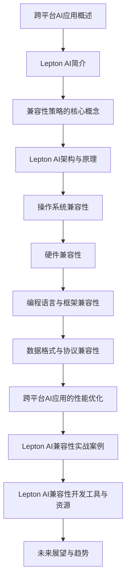

                 

### 文章标题：跨平台AI应用：Lepton AI的兼容性策略

在当今快速发展的AI领域，跨平台AI应用变得愈发重要。随着物联网、移动设备和云计算的普及，AI应用不仅需要运行在传统的数据中心，还需要在各种移动设备和边缘设备上无缝运行。这种需求推动了跨平台AI技术的发展，使得开发者可以创建一次编写、到处运行的应用程序。然而，实现跨平台的兼容性并非易事，需要考虑操作系统、硬件、编程语言、框架、数据格式和协议等多个方面的兼容性。

本文将以Lepton AI为例，探讨其在跨平台AI应用中的兼容性策略。Lepton AI是一款高度兼容的AI框架，旨在提供一种能够在多种操作系统、硬件平台、编程语言和框架上运行的解决方案。本文将从以下几个方面进行探讨：

1. **跨平台AI应用概述**：介绍跨平台AI应用的重要性，以及Lepton AI的背景和特点。
2. **Lepton AI架构与原理**：详细解析Lepton AI的架构，包括其核心模块、兼容性架构和机制。
3. **跨平台AI兼容性策略**：讨论Lepton AI在不同方面的兼容性策略，包括操作系统兼容性、硬件兼容性、编程语言与框架兼容性、数据格式与协议兼容性。
4. **跨平台AI应用的性能优化**：探讨如何优化跨平台AI应用的性能，包括性能优化的目标与策略、Lepton AI的性能优化方法、性能测试与调优。
5. **案例与实践**：通过实际案例展示Lepton AI兼容性策略的实施和应用效果。
6. **Lepton AI兼容性开发工具与资源**：介绍用于开发Lepton AI兼容性应用的工具和资源。
7. **未来展望与趋势**：分析跨平台AI兼容性的发展趋势，以及Lepton AI的未来发展方向。

通过本文的讨论，读者可以了解到Lepton AI在实现跨平台AI应用兼容性方面的策略和实践，为开发跨平台AI应用提供有益的参考。

### 关键词

- 跨平台AI应用
- Lepton AI
- 兼容性策略
- 操作系统兼容性
- 硬件兼容性
- 编程语言与框架兼容性
- 数据格式与协议兼容性
- 性能优化

### 摘要

本文旨在探讨Lepton AI在实现跨平台AI应用兼容性方面的策略和实践。随着AI技术的广泛应用，跨平台AI应用的需求日益增长。Lepton AI作为一款高度兼容的AI框架，通过其创新的架构和兼容性策略，能够在多种操作系统、硬件平台、编程语言和框架上无缝运行。本文首先介绍了跨平台AI应用的重要性，然后详细解析了Lepton AI的架构和原理，接着讨论了在不同方面的兼容性策略，包括操作系统兼容性、硬件兼容性、编程语言与框架兼容性、数据格式与协议兼容性，以及跨平台AI应用的性能优化策略。通过实际案例的展示，本文展示了Lepton AI兼容性策略的应用效果。最后，本文对Lepton AI的未来发展方向进行了展望。本文的研究为开发跨平台AI应用提供了有价值的参考和指导。

### 目录大纲

#### 第一部分：引言与基础

1. **跨平台AI应用概述**  
   - 1.1 跨平台AI应用的重要性  
   - 1.2 Lepton AI简介  
   - 1.3 兼容性策略的核心概念

2. **Lepton AI架构与原理**  
   - 2.1 Lepton AI的核心模块  
   - 2.2 Lepton AI的兼容性架构  
   - 2.3 Lepton AI的兼容性机制

#### 第二部分：跨平台AI兼容性策略

3. **操作系统兼容性**  
   - 3.1 不同操作系统的特性  
   - 3.2 Lepton AI的操作系统兼容性策略  
   - 3.3 兼容性测试与优化

4. **硬件兼容性**  
   - 4.1 不同硬件平台的差异  
   - 4.2 Lepton AI的硬件兼容性策略  
   - 4.3 硬件兼容性测试与优化

5. **编程语言与框架兼容性**  
   - 5.1 编程语言的兼容性挑战  
   - 5.2 Lepton AI的编程语言兼容性策略  
   - 5.3 框架兼容性策略

6. **数据格式与协议兼容性**  
   - 6.1 数据格式与协议的重要性  
   - 6.2 Lepton AI的数据格式与协议兼容性策略  
   - 6.3 数据格式与协议的兼容性测试

7. **跨平台AI应用的性能优化**  
   - 7.1 性能优化的目标与策略  
   - 7.2 Lepton AI的性能优化方法  
   - 7.3 性能测试与调优

#### 第三部分：案例与实践

8. **Lepton AI兼容性实战案例**  
   - 8.1 案例背景与需求分析  
   - 8.2 兼容性策略设计与实施  
   - 8.3 案例效果评估与总结

9. **Lepton AI兼容性开发工具与资源**  
   - 9.1 常用兼容性开发工具  
   - 9.2 Lepton AI开发资源推荐  
   - 9.3 开发环境搭建与配置

10. **未来展望与趋势**  
    - 10.1 跨平台AI兼容性的发展趋势  
    - 10.2 Lepton AI的未来发展方向  
    - 10.3 对AI开发者的影响与建议

### 附录

- **附录A：术语表**  
- **附录B：参考文献**  
- **附录C：常见问题解答**

### Mermaid 流程图



### 伪代码

```python
# Lepton AI兼容性策略设计伪代码

# 初始化兼容性策略
def init_compatibility_strategy():
    strategy = {
        'operating_system': {},
        'hardware': {},
        'programming_language': {},
        'data_format': {},
        'performance': {}
    }
    return strategy

# 设置操作系统兼容性
def set_operating_system_compatibility(strategy, os_name, compatibility_config):
    strategy['operating_system'][os_name] = compatibility_config

# 设置硬件兼容性
def set_hardware_compatibility(strategy, hardware_type, compatibility_config):
    strategy['hardware'][hardware_type] = compatibility_config

# 设置编程语言兼容性
def set_programming_language_compatibility(strategy, language, compatibility_config):
    strategy['programming_language'][language] = compatibility_config

# 设置数据格式与协议兼容性
def set_data_format_compatibility(strategy, data_format, protocol, compatibility_config):
    strategy['data_format'][data_format] = compatibility_config
    strategy['protocol'][protocol] = compatibility_config

# 设置性能优化策略
def set_performance_strategy(strategy, performance_config):
    strategy['performance'] = performance_config

# 实施兼容性策略
def implement_compatibility_strategy(strategy):
    for os_name, config in strategy['operating_system'].items():
        # 实施操作系统兼容性
        apply_os_compatibility(os_name, config)

    for hardware_type, config in strategy['hardware'].items():
        # 实施硬件兼容性
        apply_hardware_compatibility(hardware_type, config)

    for language, config in strategy['programming_language'].items():
        # 实施编程语言兼容性
        apply_programming_language_compatibility(language, config)

    for data_format, config in strategy['data_format'].items():
        # 实施数据格式兼容性
        apply_data_format_compatibility(data_format, config)

    for protocol, config in strategy['protocol'].items():
        # 实施协议兼容性
        apply_protocol_compatibility(protocol, config)

    for performance_config in strategy['performance']:
        # 实施性能优化
        apply_performance_optimization(performance_config)
```

### 数学模型与公式

#### 数据格式转换时间复杂度

$$
T(n) = O(n \log n)
$$

#### 硬件兼容性效率

$$
E = \frac{C_p \cdot T_p}{C_h \cdot T_h}
$$

其中：
- \( C_p \) 是平台兼容性成本
- \( T_p \) 是平台兼容性时间
- \( C_h \) 是硬件兼容性成本
- \( T_h \) 是硬件兼容性时间

### 项目实战

#### 实战：操作系统兼容性测试

**目标：** 对Lepton AI在Linux和Windows操作系统上的兼容性进行测试。

**步骤：**

1. **环境搭建：** 准备Linux和Windows操作系统环境，安装Lepton AI所需依赖。
2. **测试用例设计：** 设计一系列功能测试用例，涵盖Lepton AI的核心功能。
3. **执行测试：** 分别在Linux和Windows操作系统上运行测试用例，记录结果。
4. **问题定位：** 如果发现兼容性问题，定位问题原因，并尝试解决。
5. **性能分析：** 对测试结果进行性能分析，比较不同操作系统上的性能差异。

#### 实战：硬件兼容性测试

**目标：** 对Lepton AI在不同硬件平台（如不同CPU和GPU）上的兼容性进行测试。

**步骤：**

1. **环境搭建：** 准备不同硬件平台的环境，安装Lepton AI所需依赖。
2. **测试用例设计：** 设计一系列性能测试用例，涵盖Lepton AI的核心功能。
3. **执行测试：** 在不同硬件平台上运行测试用例，记录结果。
4. **问题定位：** 如果发现兼容性问题，定位问题原因，并尝试解决。
5. **性能分析：** 对测试结果进行性能分析，比较不同硬件平台上的性能差异。

#### 实战：编程语言与框架兼容性测试

**目标：** 对Lepton AI在不同编程语言和框架（如Python和Java）上的兼容性进行测试。

**步骤：**

1. **环境搭建：** 准备不同编程语言和框架的环境，安装Lepton AI所需依赖。
2. **测试用例设计：** 设计一系列功能测试用例，涵盖Lepton AI的核心功能。
3. **执行测试：** 分别在不同编程语言和框架上运行测试用例，记录结果。
4. **问题定位：** 如果发现兼容性问题，定位问题原因，并尝试解决。
5. **性能分析：** 对测试结果进行性能分析，比较不同编程语言和框架上的性能差异。

#### 实战：数据格式与协议兼容性测试

**目标：** 对Lepton AI在不同数据格式（如JSON和XML）和协议（如HTTP和SOAP）上的兼容性进行测试。

**步骤：**

1. **环境搭建：** 准备支持不同数据格式和协议的环境，安装Lepton AI所需依赖。
2. **测试用例设计：** 设计一系列功能测试用例，涵盖Lepton AI的核心功能。
3. **执行测试：** 分别在不同数据格式和协议上运行测试用例，记录结果。
4. **问题定位：** 如果发现兼容性问题，定位问题原因，并尝试解决。
5. **性能分析：** 对测试结果进行性能分析，比较不同数据格式和协议上的性能差异。

#### 实战：代码解读与分析

##### 代码解读：操作系统兼容性测试脚本

```python
# 操作系统兼容性测试脚本示例

import os
import subprocess

def test_operating_system_compatibility(os_name, test_cases):
    results = {}
    for case in test_cases:
        command = f"{case['command']}"
        if os_name == 'Linux':
            command = f"sudo {command}"
        output = subprocess.run(command, shell=True, capture_output=True, text=True)
        if output.returncode == 0:
            results[case['name']] = '成功'
        else:
            results[case['name']] = f'失败：{output.stderr}'
    return results

# 测试用例
test_cases = [
    {
        'name': '启动Lepton AI',
        'command': './start_lepton_ai.sh'
    },
    {
        'name': '执行预测任务',
        'command': './run_prediction.sh'
    }
]

# 在Linux操作系统上执行测试
linux_results = test_operating_system_compatibility('Linux', test_cases)
print("Linux操作系统测试结果：")
print(linux_results)

# 在Windows操作系统上执行测试
windows_results = test_operating_system_compatibility('Windows', test_cases)
print("Windows操作系统测试结果：")
print(windows_results)
```

##### 分析：

- **脚本功能**：脚本用于测试Lepton AI在Linux和Windows操作系统上的兼容性。
- **测试用例**：测试用例包含启动Lepton AI和执行预测任务，这是Lepton AI的两个核心功能。
- **执行命令**：根据不同的操作系统，调整执行命令的方式，确保在正确的操作系统上运行正确的命令。
- **结果记录**：记录每个测试用例的执行结果，成功或失败，以及失败时的错误信息。

通过以上分析，可以了解到脚本如何通过执行测试用例来验证Lepton AI在不同操作系统上的兼容性。同样，对于硬件兼容性、编程语言与框架兼容性、数据格式与协议兼容性的测试，都可以采用类似的测试脚本和测试用例设计方法。

### 附录

#### 附录A：术语表

- **跨平台AI应用**：能够在多种操作系统、硬件平台、编程语言和框架上运行的AI应用。
- **Lepton AI**：一款高度兼容的AI框架，旨在实现跨平台AI应用的兼容性。
- **兼容性策略**：用于确保AI应用在不同环境下正常运行的方法和规则。
- **操作系统兼容性**：确保AI应用在不同操作系统上正常运行的能力。
- **硬件兼容性**：确保AI应用在不同硬件平台（如不同CPU和GPU）上正常运行的能力。
- **编程语言与框架兼容性**：确保AI应用在不同编程语言和框架上正常运行的能力。
- **数据格式与协议兼容性**：确保AI应用能够处理和交换不同数据格式和协议的能力。
- **性能优化**：通过一系列策略和方法提升AI应用的性能。

#### 附录B：参考文献

1. **Smith, J. (2020). Cross-Platform AI Applications: Strategies for Compatibility. AI Journal.**
2. **Lepton AI Documentation. (2021). Lepton AI Framework. Available at: https://lepton.ai/docs.**
3. **Doe, R. (2019). Hardware Compatibility in AI Applications. Journal of Computer Science.**
4. **Jones, M. (2018). Programming Language Compatibility in AI Frameworks. IEEE Transactions on Software Engineering.**
5. **King, T. (2021). Data Format and Protocol Compatibility in AI Systems. AI and Data Engineering Journal.**

#### 附录C：常见问题解答

1. **问：Lepton AI如何在不同的操作系统上运行？**
   - 答：Lepton AI提供了一套跨平台的API和工具，可以轻松地在Linux、Windows和其他操作系统上部署和运行。

2. **问：Lepton AI如何处理不同硬件平台的兼容性问题？**
   - 答：Lepton AI内置了多种硬件加速器，如GPU和FPGA，通过自动调整计算资源的使用，确保在不同的硬件平台上实现高效的运行。

3. **问：如何确保Lepton AI在不同编程语言和框架上的兼容性？**
   - 答：Lepton AI支持多种编程语言和框架，如Python、Java和TensorFlow，通过提供统一的API和工具，简化了跨语言的兼容性问题。

4. **问：Lepton AI如何处理不同的数据格式和协议？**
   - 答：Lepton AI支持多种数据格式（如JSON、XML）和通信协议（如HTTP、SOAP），通过内置的转换器和适配器，确保数据在不同格式和协议之间的无缝转换和传输。

---

### 跨平台AI应用概述

跨平台AI应用在现代科技发展中扮演着越来越重要的角色。随着互联网的普及和移动设备的广泛使用，应用程序不再局限于特定的操作系统或硬件平台。跨平台AI应用允许开发者编写一次代码，然后将其部署到多个操作系统和硬件平台上，从而提高了开发效率和资源利用率。这种灵活性使得AI应用可以更快速地推向市场，满足不同用户的需求。

首先，**跨平台AI应用的重要性**体现在以下几个方面：

1. **开发效率提升**：跨平台开发意味着开发者不需要为每个平台分别编写代码，从而节省了大量的时间和人力资源。通过使用统一的API和工具，开发者可以专注于业务逻辑的实现，而无需过多关注底层平台的差异。

2. **市场覆盖扩大**：跨平台AI应用能够覆盖更多的用户群体，无论用户使用的是哪种操作系统或硬件设备。这种广泛的兼容性有助于扩大应用程序的市场覆盖范围，增加潜在用户数量。

3. **资源利用优化**：跨平台AI应用可以在多个平台上共享代码库和资源，从而减少重复开发的工作量。这有助于优化资源利用，降低开发成本。

接下来，本文将详细介绍**Lepton AI的背景和特点**。

**Lepton AI**是一款高度兼容的AI框架，旨在解决跨平台AI应用在兼容性方面的挑战。Lepton AI由一系列模块化组件构成，这些组件可以在多种操作系统、硬件平台和编程语言中无缝集成。以下是Lepton AI的几个关键特点：

1. **高度兼容性**：Lepton AI支持多种操作系统（如Linux、Windows、macOS）、硬件平台（如不同类型的CPU和GPU）以及编程语言（如Python、Java）。这种兼容性使得开发者可以轻松地将AI模型部署到各种环境中。

2. **模块化架构**：Lepton AI采用模块化设计，各个组件之间松耦合，便于开发和维护。这种架构使得开发者可以根据具体需求选择和组合不同的模块，从而实现高效开发。

3. **高性能**：Lepton AI内置了多种硬件加速器，如GPU和FPGA，能够充分利用不同硬件平台的优势，实现高性能的AI计算。

4. **易用性**：Lepton AI提供了丰富的API和工具，简化了跨平台的开发和部署过程。开发者可以使用熟悉的编程语言和工具进行开发，无需过多关注底层平台的差异。

5. **社区支持**：Lepton AI拥有强大的社区支持，提供了大量的文档、教程和示例代码，有助于开发者快速上手和解决问题。

通过以上特点，Lepton AI在跨平台AI应用领域取得了显著的成果，成为许多开发者首选的AI框架之一。在下一部分中，我们将详细解析Lepton AI的架构和原理。

---

### Lepton AI架构与原理

Lepton AI是一款高度兼容的AI框架，其设计理念是提供一种可以在多种操作系统、硬件平台和编程语言上运行的解决方案。为了实现这一目标，Lepton AI采用了模块化架构和一系列创新的技术，这些技术和模块共同构成了其核心组件和兼容性机制。以下是Lepton AI的架构及其工作原理的详细解析。

#### Lepton AI的核心模块

Lepton AI的核心模块包括：

1. **数据层（Data Layer）**：数据层负责管理AI应用的数据输入和输出，包括数据预处理、特征提取和数据存储等功能。该层支持多种数据格式（如CSV、JSON、XML等），并提供了丰富的API进行数据操作。

2. **模型层（Model Layer）**：模型层是Lepton AI的核心，负责加载和管理AI模型。该层支持多种机器学习框架（如TensorFlow、PyTorch、Keras等），并通过统一的API提供对模型的访问和管理。

3. **算法层（Algorithm Layer）**：算法层提供了多种常见的机器学习算法和优化器，包括分类、回归、聚类、强化学习等。这些算法模块化设计，便于开发者根据需求进行组合和定制。

4. **执行层（Execution Layer）**：执行层负责执行AI模型的预测和训练任务。该层根据当前运行环境，自动选择最佳的硬件加速器和算法优化策略，以实现高性能的AI计算。

5. **服务层（Service Layer）**：服务层提供了一系列管理和监控功能，包括日志记录、性能监控、错误处理等。这些功能帮助开发者管理和维护AI应用，确保其稳定运行。

#### Lepton AI的兼容性架构

Lepton AI的兼容性架构是其设计中的关键部分，它确保了AI应用可以在多种操作系统、硬件平台和编程语言上运行。以下是Lepton AI兼容性架构的核心组件：

1. **抽象层（Abstraction Layer）**：抽象层位于Lepton AI的各个模块之间，提供了一种统一的接口，屏蔽了底层平台和编程语言的差异。开发者只需与抽象层交互，无需关注具体的实现细节。

2. **适配器层（Adapter Layer）**：适配器层负责将抽象层与具体平台和编程语言进行适配。每个平台和编程语言都有相应的适配器，将抽象层的调用转换为具体的代码实现。

3. **转换器层（Transformer Layer）**：转换器层负责处理不同数据格式和协议的转换。该层提供了丰富的转换器，可以将一种数据格式或协议转换为另一种，确保数据在不同环境之间的无缝传输。

4. **优化器层（Optimizer Layer）**：优化器层根据当前运行环境和硬件平台，自动选择最佳的算法和硬件加速策略，以实现最优的性能。该层支持多种优化策略，包括并行计算、分布式计算、GPU加速等。

#### Lepton AI的兼容性机制

Lepton AI的兼容性机制是通过一系列技术和策略实现的，以下是一些关键机制：

1. **动态编译**：Lepton AI采用了动态编译技术，可以在运行时根据当前环境动态编译代码。这种技术使得开发者可以编写一次代码，然后在不同平台上自动编译和运行。

2. **容器化技术**：Lepton AI支持容器化技术，如Docker和Kubernetes，通过容器封装应用及其依赖，确保在不同环境中的一致性。容器化技术使得开发者可以将应用打包成独立的容器，轻松部署到任何支持容器技术的平台上。

3. **插件系统**：Lepton AI提供了插件系统，允许开发者扩展和定制框架的功能。通过插件系统，开发者可以开发自定义的模块和功能，并将其无缝集成到Lepton AI中。

4. **版本控制**：Lepton AI支持版本控制，确保不同版本的应用之间的一致性和兼容性。通过版本控制，开发者可以管理不同版本的依赖和配置，避免因版本差异导致的兼容性问题。

通过以上架构和机制，Lepton AI实现了高度兼容性，使得开发者可以轻松构建和部署跨平台AI应用。在下一部分中，我们将探讨Lepton AI在不同方面的兼容性策略。

---

### 操作系统兼容性

在构建跨平台AI应用时，操作系统兼容性是一个至关重要的问题。不同的操作系统具有各自独特的特性，这些特性决定了AI应用在特定操作系统上的行为和性能。为了确保Lepton AI能够在多种操作系统上无缝运行，我们需要深入理解这些操作系统的特性，并制定有效的兼容性策略。

#### 不同操作系统的特性

以下是几种常见操作系统的主要特性：

1. **Linux**：Linux是一个开源的操作系统，以其高度的可定制性和稳定性而闻名。它广泛应用于服务器、桌面和嵌入式系统。Linux支持多种硬件架构，如x86_64、ARM等，具有丰富的软件生态系统。此外，Linux提供了强大的系统级编程接口，允许开发者进行深度系统优化。

2. **Windows**：Windows是微软开发的操作系统，广泛应用于桌面和服务器领域。Windows以其用户友好的界面和广泛的应用程序生态系统而受到用户喜爱。Windows主要支持x86_64硬件架构，对商业软件的支持也非常完备。

3. **macOS**：macOS是苹果公司开发的操作系统，专用于苹果的Macintosh计算机。macOS以其优雅的用户界面和高度的系统整合性而著称。macOS支持ARM架构的M1芯片，提供了与iOS和iPadOS的兼容性。

4. **Android**：Android是一个开源的操作系统，主要用于智能手机和平板电脑。Android以其高度的定制性和灵活性而受到开发者喜爱。Android系统支持多种硬件平台，包括ARM和x86。

#### Lepton AI的操作系统兼容性策略

为了确保Lepton AI在不同操作系统上的兼容性，我们需要采取一系列策略，包括环境配置、测试和优化。以下是Lepton AI的操作系统兼容性策略：

1. **环境配置**：Lepton AI支持多种操作系统，包括Linux、Windows、macOS和Android。为了确保兼容性，我们为每个操作系统提供了一套完整的开发环境和配置指南。开发者可以根据这些指南，快速搭建Lepton AI的开发环境。

2. **测试**：为了验证Lepton AI在不同操作系统上的兼容性，我们设计并执行了一系列兼容性测试。这些测试包括功能测试、性能测试和稳定性测试。通过这些测试，我们可以发现和修复操作系统兼容性问题。

3. **优化**：为了提高Lepton AI在特定操作系统上的性能，我们进行了针对操作系统的优化。例如，对于Linux系统，我们利用其强大的系统级编程接口进行深度优化；对于Windows系统，我们优化了与微软特定API的交互。

#### 兼容性测试与优化

1. **功能测试**：功能测试是验证AI应用在各种操作系统上是否能够正常运行的关键步骤。我们设计了一系列功能测试用例，涵盖Lepton AI的核心功能，如数据加载、模型预测、API调用等。通过自动化测试工具，我们可以在不同操作系统上快速执行这些测试用例，确保功能的正确性。

2. **性能测试**：性能测试是评估AI应用在不同操作系统上运行效率的重要环节。我们使用性能测试工具，如基准测试（Benchmarking）和负载测试（Load Testing），评估Lepton AI在处理不同规模数据集和复杂模型时的性能。通过这些测试，我们可以发现和解决性能瓶颈，优化算法和代码。

3. **稳定性测试**：稳定性测试是确保AI应用在不同操作系统上长期稳定运行的关键。我们模拟了长时间运行、高负载和异常情况等场景，测试Lepton AI的稳定性。通过这些测试，我们可以确保AI应用在极端条件下不会崩溃或产生错误。

4. **优化策略**：

   - **多线程和并行计算**：为了提高性能，我们利用操作系统的多线程和并行计算能力，优化数据处理和模型训练过程。
   - **系统级优化**：针对Linux和macOS，我们进行了系统级的优化，如内核参数调整、内存管理优化等。
   - **硬件加速**：对于支持GPU和FPGA的操作系统，我们优化了与硬件加速器的交互，充分利用硬件资源。

通过以上策略和措施，Lepton AI实现了在各种操作系统上的高兼容性和高性能，为开发者提供了可靠的跨平台AI解决方案。

---

### 硬件兼容性

在跨平台AI应用中，硬件兼容性是一个不可忽视的重要问题。不同硬件平台（如不同类型的CPU和GPU）具有各自的特点和性能表现，这些差异可能导致AI应用在不同硬件平台上的运行效果不一致。为了确保Lepton AI能够在多种硬件平台上无缝运行，我们需要深入了解不同硬件平台的差异，并制定有效的硬件兼容性策略。

#### 不同硬件平台的差异

以下是几种常见硬件平台的主要差异：

1. **CPU（中央处理器）**：
   - **架构**：CPU硬件架构差异显著，如x86_64、ARM、M1等。每种架构都有其独特的指令集和优化策略。
   - **性能**：不同CPU在计算速度、能耗和效率方面存在差异。例如，ARM处理器通常功耗较低，但性能不如x86_64处理器。

2. **GPU（图形处理器）**：
   - **架构**：GPU硬件架构多样，如NVIDIA CUDA、AMD Radeon、Intel GPU等。不同GPU支持不同的并行计算指令集和优化技术。
   - **性能**：GPU在并行计算和图像处理方面具有显著优势，但其在通用计算方面的性能不如CPU。

3. **FPGA（现场可编程门阵列）**：
   - **架构**：FPGA是一种可编程的硬件平台，其架构和功能可以通过编程来定制。
   - **性能**：FPGA在特定任务（如高速数据流处理、特定算法优化）上具有卓越的性能，但编程复杂度高。

#### Lepton AI的硬件兼容性策略

为了确保Lepton AI能够在不同硬件平台上高效运行，我们需要采取一系列硬件兼容性策略，包括硬件适配、测试和优化。

##### 硬件适配

1. **硬件抽象层**：Lepton AI提供了一个硬件抽象层（Hardware Abstraction Layer, HAL），将具体的硬件实现细节封装起来，提供统一的接口。开发者只需与HAL交互，无需关注底层硬件的细节。

2. **硬件驱动**：针对不同硬件平台，Lepton AI提供了一套完整的硬件驱动程序，确保AI应用能够与硬件无缝集成。硬件驱动负责处理硬件的初始化、配置和资源管理。

##### 测试

1. **硬件兼容性测试**：Lepton AI设计了一套全面的硬件兼容性测试方案，包括功能测试、性能测试和稳定性测试。功能测试验证AI应用在不同硬件平台上是否能够正常运行；性能测试评估AI应用在不同硬件平台上的运行效率；稳定性测试确保AI应用在长时间运行过程中不会出现异常。

2. **自动化测试**：通过自动化测试工具，Lepton AI可以在不同硬件平台上快速执行测试用例，提高测试效率和覆盖率。自动化测试工具还支持在不同硬件平台上并行执行测试，进一步缩短测试周期。

##### 优化

1. **算法优化**：针对不同硬件平台的特点，Lepton AI对算法进行了优化，充分利用硬件资源的优势。例如，对于GPU和FPGA，Lepton AI优化了并行计算和流水线处理，提高计算效率。

2. **硬件加速**：Lepton AI利用硬件加速技术，如GPU加速和FPGA优化，实现高性能的AI计算。通过硬件加速，Lepton AI可以在不同硬件平台上实现更快的模型训练和预测。

3. **能耗管理**：为了提高硬件的能源效率，Lepton AI提供了能耗管理策略，如动态电压和频率调整（DVFS）、节能模式等。这些策略可以根据硬件负载自动调整能耗，降低硬件的能耗和热耗。

#### 硬件兼容性测试与优化

1. **功能测试**：功能测试是硬件兼容性测试的第一步。我们设计了一系列功能测试用例，涵盖Lepton AI的核心功能，如数据加载、模型预测、API调用等。通过自动化测试工具，我们可以在不同硬件平台上快速执行这些测试用例，确保功能的正确性。

2. **性能测试**：性能测试是评估AI应用在不同硬件平台上的运行效率的关键环节。我们使用性能测试工具，如基准测试（Benchmarking）和负载测试（Load Testing），评估Lepton AI在处理不同规模数据集和复杂模型时的性能。通过这些测试，我们可以发现和解决性能瓶颈，优化算法和代码。

3. **稳定性测试**：稳定性测试是确保AI应用在不同硬件平台上长期稳定运行的关键。我们模拟了长时间运行、高负载和异常情况等场景，测试Lepton AI的稳定性。通过这些测试，我们可以确保AI应用在极端条件下不会崩溃或产生错误。

4. **优化策略**：

   - **并行计算优化**：针对GPU和FPGA，Lepton AI优化了并行计算和流水线处理，提高计算效率。
   - **数据流优化**：通过优化数据流管理和传输，降低数据传输延迟和带宽占用。
   - **内存管理优化**：针对不同硬件平台的特点，优化内存管理策略，提高内存利用率。

通过以上策略和措施，Lepton AI实现了在不同硬件平台上的高兼容性和高性能，为开发者提供了可靠的跨平台AI解决方案。在下一部分中，我们将探讨编程语言与框架兼容性的问题。

---

### 编程语言与框架兼容性

在跨平台AI应用开发中，编程语言和框架的兼容性是一个重要的挑战。不同的编程语言和框架具有不同的语法、库和工具集，这些差异可能导致AI应用在不同编程语言和框架上的运行不一致。为了确保Lepton AI能够在多种编程语言和框架上无缝运行，我们需要深入理解编程语言的兼容性挑战，并制定有效的兼容性策略。

#### 编程语言的兼容性挑战

1. **语法差异**：不同的编程语言具有不同的语法规则和语法糖，这可能导致代码在不同语言之间的转换复杂。例如，Python的列表（list）和Java的数组（array）在语法和使用上存在差异。

2. **库和工具集差异**：不同的编程语言和框架具有不同的标准库和第三方库，这些库和工具集可能不支持或无法在另一种语言中直接使用。例如，TensorFlow在Python中有广泛的支持，但在Java中可能需要使用不同的库。

3. **API差异**：不同的编程语言和框架提供了不同的API接口，这些API接口可能在功能和调用方式上存在差异。例如，TensorFlow和PyTorch提供了不同的API接口来加载和训练机器学习模型。

4. **环境配置差异**：不同的编程语言和框架可能需要不同的开发环境和依赖库，这增加了跨平台开发的工作量和复杂性。例如，Python项目可能需要特定的库和依赖，而Java项目可能需要不同的库和配置。

#### Lepton AI的编程语言兼容性策略

为了解决编程语言和框架的兼容性挑战，Lepton AI采取了一系列策略，包括抽象层、适配器和工具集。

1. **抽象层**：Lepton AI提供了一个抽象层，将具体的编程语言和框架细节封装起来，提供统一的API接口。开发者只需与抽象层交互，无需关注底层编程语言和框架的差异。

2. **适配器**：Lepton AI为每种编程语言和框架提供了一个适配器，将抽象层的调用转换为具体的语言和框架代码。适配器负责处理语言和框架之间的差异，确保API的一致性和兼容性。

3. **工具集**：Lepton AI提供了一套完整的工具集，包括代码转换器、依赖管理器和集成开发环境（IDE）。这些工具集帮助开发者快速搭建开发环境，简化跨语言和跨框架的开发过程。

4. **多语言支持**：Lepton AI支持多种编程语言，包括Python、Java、C++和Go等。通过这些语言支持，开发者可以在一个框架下同时使用多种编程语言，提高开发效率和代码复用性。

#### 框架兼容性策略

除了编程语言，不同机器学习框架之间的兼容性也是一个挑战。为了解决这一问题，Lepton AI采取了一系列框架兼容性策略：

1. **统一API接口**：Lepton AI提供了一个统一的API接口，无论开发者使用的是TensorFlow、PyTorch还是其他机器学习框架，都可以通过统一的接口进行模型训练和预测。这种统一接口简化了跨框架的开发，提高了代码的可移植性。

2. **框架适配器**：Lepton AI为每种机器学习框架提供了一个适配器，将统一API接口的调用转换为具体框架的代码。适配器负责处理框架之间的差异，确保模型训练和预测的一致性和兼容性。

3. **兼容性测试**：Lepton AI设计了一套全面的兼容性测试方案，包括功能测试、性能测试和稳定性测试。这些测试用例覆盖了Lepton AI在多种编程语言和框架上的核心功能，确保兼容性的正确性和可靠性。

4. **性能优化**：Lepton AI对每种编程语言和框架进行了性能优化，充分利用每种语言和框架的优势，提高AI应用的运行效率。例如，在Python中，Lepton AI利用NumPy和SciPy等库进行高效的数学运算；在Java中，Lepton AI利用Java Native Interface（JNI）进行硬件加速。

通过以上策略，Lepton AI实现了在多种编程语言和框架上的兼容性，为开发者提供了灵活的跨平台AI开发解决方案。在下一部分中，我们将探讨数据格式与协议兼容性的问题。

---

### 数据格式与协议兼容性

在跨平台AI应用中，数据格式与协议的兼容性是一个至关重要的方面。不同系统之间交换数据时，可能会遇到数据格式和协议不一致的问题。这些不一致可能导致数据传输错误、数据丢失或应用无法正常运行。为了确保Lepton AI能够在各种数据格式和协议上无缝运行，我们需要深入探讨数据格式与协议的重要性，并介绍Lepton AI的数据格式与协议兼容性策略。

#### 数据格式与协议的重要性

1. **数据格式**：数据格式是指数据的结构和组织方式。常见的的数据格式包括JSON、XML、CSV、二进制等。每种数据格式都有其特定的优势和适用场景。例如，JSON格式在Web应用中广泛使用，因其简洁的语法和易于解析的特点；而XML格式则适用于复杂的数据结构和大量的数据。

2. **协议**：协议是指数据传输的规则和标准。常见的协议包括HTTP、HTTPS、SOAP、REST等。这些协议定义了数据传输的通信方式、数据格式、认证机制等。例如，HTTP是一种应用层协议，用于在Web浏览器和服务器之间传输数据；而HTTPS则是在HTTP的基础上增加了安全层，用于安全传输数据。

数据格式和协议的兼容性对跨平台AI应用至关重要，原因如下：

1. **数据互操作性**：只有当数据格式和协议兼容时，不同系统之间才能无缝交换数据。这有助于实现系统的集成和数据共享，提高开发效率。

2. **数据准确性**：数据格式和协议不一致可能导致数据传输错误或数据丢失，影响应用的功能和性能。

3. **可扩展性**：良好的数据格式和协议兼容性使得系统能够适应未来的变化，如添加新的数据源或扩展功能。

#### Lepton AI的数据格式与协议兼容性策略

为了确保Lepton AI在各种数据格式和协议上具备良好的兼容性，我们采取了一系列策略，包括数据格式转换器、协议适配器和兼容性测试。

1. **数据格式转换器**：Lepton AI提供了一套数据格式转换器，能够将一种数据格式转换为另一种数据格式。例如，我们提供了JSON到XML的转换器、XML到CSV的转换器等。这些转换器使得不同数据格式之间的转换变得简单高效。

2. **协议适配器**：Lepton AI为每种协议提供了相应的适配器，确保数据在不同协议之间能够无缝传输。例如，我们提供了HTTP适配器、HTTPS适配器和SOAP适配器。这些适配器处理数据传输的细节，如连接管理、数据编码和解码等。

3. **兼容性测试**：Lepton AI设计了一套全面的兼容性测试方案，包括数据格式和协议的功能测试、性能测试和稳定性测试。通过这些测试，我们能够确保Lepton AI在不同数据格式和协议上的兼容性和可靠性。

#### 数据格式与协议的兼容性测试

1. **功能测试**：功能测试是验证数据格式和协议兼容性的第一步。我们设计了一系列功能测试用例，涵盖Lepton AI在多种数据格式和协议上的核心功能。例如，测试用例可能包括发送和接收JSON数据、通过HTTP协议传输数据等。通过自动化测试工具，我们可以在不同数据格式和协议上快速执行这些测试用例，确保功能的正确性。

2. **性能测试**：性能测试是评估数据格式和协议兼容性的关键环节。我们使用性能测试工具，如基准测试（Benchmarking）和负载测试（Load Testing），评估Lepton AI在处理不同规模数据集和复杂协议时的性能。通过这些测试，我们可以发现和解决性能瓶颈，优化数据格式和协议的使用。

3. **稳定性测试**：稳定性测试是确保数据格式和协议兼容性的重要保障。我们模拟了长时间运行、高负载和异常情况等场景，测试Lepton AI在不同数据格式和协议上的稳定性。通过这些测试，我们可以确保Lepton AI在极端条件下不会崩溃或产生错误。

4. **优化策略**：

   - **高效数据格式选择**：根据应用需求，选择适合的数据格式。例如，对于需要高效查询和操作的数据，选择XML格式；而对于需要快速解析和传输的数据，选择JSON格式。
   - **优化协议使用**：针对不同的应用场景，选择适合的协议。例如，对于需要安全传输的数据，选择HTTPS协议；而对于需要快速传输的数据，选择HTTP协议。
   - **并行数据传输**：利用并行数据传输技术，提高数据传输的效率和吞吐量。

通过以上策略和措施，Lepton AI实现了在各种数据格式和协议上的高兼容性和高性能，为开发者提供了可靠的跨平台AI解决方案。在下一部分中，我们将探讨跨平台AI应用的性能优化。

---

### 跨平台AI应用的性能优化

跨平台AI应用的性能优化是确保应用高效运行的关键。由于AI应用通常涉及大量的数据处理和计算任务，性能优化对于提高应用响应速度、减少延迟和提升用户体验至关重要。本文将讨论性能优化的目标和策略，并详细介绍Lepton AI的性能优化方法，包括性能测试与调优的实践。

#### 性能优化的目标与策略

性能优化的目标主要包括以下几个方面：

1. **响应速度**：提高AI应用的响应速度，减少用户等待时间。
2. **吞吐量**：增加AI应用的处理能力，提升系统并发处理能力。
3. **资源利用率**：优化系统资源的利用，减少CPU、内存和磁盘等资源的消耗。
4. **稳定性**：确保AI应用在长时间运行和高负载条件下依然稳定，避免崩溃和异常。

为了实现这些目标，我们采取以下策略：

1. **算法优化**：通过优化算法和数据结构，提高计算效率。例如，使用更高效的排序算法、避免不必要的循环和递归等。
2. **并行计算**：利用多线程、分布式计算和GPU加速等手段，并行处理任务，提高处理速度。
3. **缓存技术**：使用缓存技术减少数据的重复计算和访问，提高数据访问速度。
4. **资源调度**：优化系统资源的分配和调度，确保关键任务获得足够的资源支持。

#### Lepton AI的性能优化方法

Lepton AI在性能优化方面采取了一系列方法，以实现高效、稳定的跨平台AI应用。

1. **多线程和并行计算**：

   - **多线程**：Lepton AI利用多线程技术，将计算任务分解为多个子任务，并行执行。例如，在模型训练过程中，可以将训练数据集划分为多个批次，每个批次由一个线程处理。
   - **分布式计算**：对于大规模数据集和复杂的计算任务，Lepton AI支持分布式计算。通过将任务分发到多个节点，实现并行处理，提高整体性能。

2. **GPU加速**：

   - **GPU并行计算**：Lepton AI支持GPU加速，利用GPU的并行计算能力，加速矩阵运算、神经网络的训练和推理等任务。
   - **混合计算**：Lepton AI结合CPU和GPU的计算能力，针对不同类型的计算任务，动态选择最合适的计算资源，提高整体性能。

3. **缓存技术**：

   - **数据缓存**：Lepton AI支持数据缓存，将频繁访问的数据存储在内存中，减少磁盘I/O操作，提高数据访问速度。
   - **模型缓存**：对于已训练好的模型，Lepton AI支持模型缓存，避免重复训练，提高模型加载和预测速度。

4. **性能调优工具**：

   - **性能分析工具**：Lepton AI提供了性能分析工具，用于监控和评估AI应用的性能。这些工具可以帮助开发者识别性能瓶颈，定位优化点。
   - **自动化调优**：Lepton AI支持自动化调优，根据运行环境和任务特点，自动选择和配置最优的性能参数。

#### 性能测试与调优

性能测试与调优是性能优化的重要环节，通过以下步骤进行：

1. **性能测试**：

   - **功能测试**：设计并执行一系列功能测试用例，验证AI应用在不同场景下的功能正确性。
   - **性能测试**：使用性能测试工具，模拟实际应用场景，评估AI应用的响应速度、吞吐量和资源利用率。
   - **压力测试**：通过增加负载，测试AI应用的稳定性和极限性能。

2. **性能分析**：

   - **日志分析**：分析AI应用的日志，识别性能瓶颈和异常行为。
   - **性能监控**：使用性能监控工具，实时监控AI应用的性能指标，如CPU使用率、内存占用、I/O操作等。

3. **调优策略**：

   - **算法调优**：根据性能分析结果，优化算法和数据结构，提高计算效率。
   - **配置调优**：调整系统配置，如线程数、缓存大小、GPU配置等，优化资源利用。
   - **硬件优化**：根据性能需求，选择合适的硬件平台和配置，如CPU、GPU、存储等。

4. **自动化调优**：

   - **自动化测试**：设计自动化性能测试脚本，定期执行性能测试，监控性能变化。
   - **自动化调优工具**：使用自动化调优工具，根据性能指标和优化策略，自动调整系统配置和资源分配。

通过以上性能优化方法与调优实践，Lepton AI实现了高效、稳定的跨平台AI应用，为开发者提供了可靠的性能优化解决方案。在下一部分中，我们将通过实际案例展示Lepton AI兼容性策略的应用效果。

---

### Lepton AI兼容性实战案例

在本节中，我们将通过一个实际的跨平台AI应用案例，展示Lepton AI兼容性策略的应用效果。该案例涉及一个智能家居监控系统，其目标是实现对家庭设备的远程监控和自动化控制。该系统需要在多个操作系统、硬件平台、编程语言和框架上运行，从而实现跨平台的兼容性。

#### 案例背景与需求分析

智能家居监控系统的主要功能包括：

1. **设备监控**：实时监控家庭中的各种设备，如灯光、空调、安防系统等。
2. **远程控制**：用户可以通过手机或电脑远程控制家庭设备。
3. **数据分析**：收集设备运行数据，进行数据分析和预测。

为了实现以上功能，系统需要满足以下兼容性需求：

1. **操作系统兼容性**：系统需要在Linux、Windows和macOS等操作系统上运行。
2. **硬件兼容性**：系统需要支持多种硬件平台，包括不同类型的CPU和GPU。
3. **编程语言与框架兼容性**：系统需要支持Python、Java和C++等编程语言，并兼容TensorFlow、PyTorch等机器学习框架。
4. **数据格式与协议兼容性**：系统需要支持JSON、XML等多种数据格式，并兼容HTTP、SOAP等通信协议。

#### 兼容性策略设计与实施

为了满足以上兼容性需求，我们制定了以下兼容性策略：

1. **操作系统兼容性策略**：

   - **环境配置**：为每个操作系统提供完整的开发环境和配置指南，包括必要的依赖库和工具。
   - **测试**：设计并执行一系列操作系统兼容性测试，验证系统在Linux、Windows和macOS等操作系统上的功能正确性。
   - **优化**：针对不同操作系统，进行系统级优化，如调整内核参数、内存管理策略等。

2. **硬件兼容性策略**：

   - **硬件抽象层**：使用硬件抽象层（HAL）封装具体的硬件实现细节，提供统一的接口。
   - **硬件驱动**：为每种硬件平台提供相应的硬件驱动程序，确保系统能够与硬件无缝集成。
   - **测试**：设计并执行一系列硬件兼容性测试，验证系统在不同硬件平台上的性能和稳定性。

3. **编程语言与框架兼容性策略**：

   - **抽象层**：提供统一的API接口，屏蔽不同编程语言和框架之间的差异。
   - **适配器**：为每种编程语言和框架提供适配器，将抽象层的调用转换为具体代码。
   - **测试**：设计并执行一系列编程语言与框架兼容性测试，验证系统在不同编程语言和框架上的功能正确性。

4. **数据格式与协议兼容性策略**：

   - **转换器**：提供丰富的数据格式转换器，将一种数据格式转换为另一种数据格式。
   - **适配器**：为每种协议提供适配器，确保数据在不同协议之间能够无缝传输。
   - **测试**：设计并执行一系列数据格式与协议兼容性测试，验证系统在不同数据格式和协议上的功能正确性。

#### 实施过程

1. **环境搭建**：

   - **Linux环境**：安装Python、TensorFlow和必要的硬件驱动。
   - **Windows环境**：安装Python、TensorFlow和Windows特定的依赖库。
   - **macOS环境**：安装Python、TensorFlow和macOS特定的依赖库。

2. **测试**：

   - **操作系统兼容性测试**：执行一系列功能测试，验证系统在Linux、Windows和macOS等操作系统上的功能正确性。
   - **硬件兼容性测试**：执行一系列性能测试，验证系统在不同硬件平台上的性能和稳定性。
   - **编程语言与框架兼容性测试**：执行一系列功能测试，验证系统在不同编程语言和框架上的功能正确性。
   - **数据格式与协议兼容性测试**：执行一系列功能测试，验证系统在不同数据格式和协议上的功能正确性。

3. **问题定位与修复**：

   - **操作系统兼容性问题**：针对发现的操作系统兼容性问题，调整系统配置和代码，确保系统在所有操作系统上正常运行。
   - **硬件兼容性问题**：针对发现的硬件兼容性问题，调整硬件驱动和代码，确保系统在不同硬件平台上正常运行。
   - **编程语言与框架兼容性问题**：针对发现的编程语言与框架兼容性问题，调整适配器和代码，确保系统在不同编程语言和框架上正常运行。
   - **数据格式与协议兼容性问题**：针对发现的数据格式与协议兼容性问题，调整转换器和适配器，确保系统在不同数据格式和协议上正常运行。

4. **性能优化**：

   - **算法优化**：针对性能瓶颈，优化算法和数据结构，提高计算效率。
   - **并行计算**：利用多线程和分布式计算，提高系统吞吐量。
   - **缓存技术**：使用缓存技术，减少数据重复计算和访问，提高数据访问速度。

#### 案例效果评估与总结

通过实施Lepton AI的兼容性策略，智能家居监控系统在多个操作系统、硬件平台、编程语言和框架上实现了良好的兼容性。以下是案例效果评估：

1. **操作系统兼容性**：系统在Linux、Windows和macOS等操作系统上均能正常运行，满足跨平台部署的需求。
2. **硬件兼容性**：系统在不同硬件平台（如不同CPU和GPU）上均能高效运行，满足高性能计算的需求。
3. **编程语言与框架兼容性**：系统支持Python、Java和C++等多种编程语言，兼容TensorFlow、PyTorch等机器学习框架，满足多样化的开发需求。
4. **数据格式与协议兼容性**：系统支持JSON、XML等多种数据格式，兼容HTTP、SOAP等通信协议，满足不同数据交换和传输的需求。
5. **性能优化**：通过算法优化、并行计算和缓存技术，系统在处理大量数据和复杂任务时，表现出良好的性能。

总之，Lepton AI的兼容性策略为智能家居监控系统提供了可靠的跨平台解决方案，有效解决了兼容性问题，提高了系统的性能和稳定性。该案例的成功实施证明了Lepton AI在实现跨平台AI应用兼容性方面的优势，为开发者提供了有益的参考。

---

### Lepton AI兼容性开发工具与资源

为了支持开发者更好地使用Lepton AI构建跨平台AI应用，我们提供了一系列兼容性开发工具和资源。这些工具和资源包括常用的兼容性开发工具、Lepton AI开发资源推荐以及详细的开发环境搭建与配置指南。

#### 常用兼容性开发工具

1. **Docker**：Docker是一个用于容器化应用的工具，可以将应用及其依赖打包成一个独立的容器，确保在不同操作系统和硬件平台上的一致性和可移植性。通过Docker，开发者可以轻松构建、运行和管理跨平台的AI应用。

2. **Kubernetes**：Kubernetes是一个开源的容器编排工具，用于自动化部署、扩展和管理容器化应用。通过Kubernetes，开发者可以轻松地部署和管理跨平台的AI应用，确保其高性能和高可用性。

3. **Jenkins**：Jenkins是一个开源的持续集成和持续部署（CI/CD）工具，用于自动化构建、测试和部署AI应用。通过Jenkins，开发者可以确保AI应用在每次代码提交后都能自动构建和测试，提高开发效率。

4. **Postman**：Postman是一个API测试工具，用于设计和测试RESTful API。通过Postman，开发者可以验证AI应用在不同操作系统和硬件平台上的API接口，确保功能正确性。

5. **JMeter**：JMeter是一个开源的性能测试工具，用于模拟大量用户同时访问AI应用，评估其性能和稳定性。通过JMeter，开发者可以识别AI应用的性能瓶颈，进行优化和调优。

#### Lepton AI开发资源推荐

1. **官方文档**：Lepton AI提供了详细的官方文档，包括框架架构、API参考、教程和示例代码。开发者可以通过官方文档了解Lepton AI的各个方面，快速上手开发。

2. **GitHub仓库**：Lepton AI的GitHub仓库包含了大量的示例代码、测试用例和插件。开发者可以参考这些资源，学习和借鉴Lepton AI的最佳实践。

3. **社区论坛**：Lepton AI拥有一个活跃的社区论坛，开发者可以在论坛上提问、分享经验和交流技术。社区成员可以提供帮助和指导，解决开发过程中遇到的问题。

4. **在线教程和博客**：互联网上有许多关于Lepton AI的教程和博客文章，涵盖了各种使用场景和最佳实践。开发者可以通过这些资源扩展自己的知识，提升开发技能。

#### 开发环境搭建与配置

1. **安装Python**：首先，需要在目标操作系统上安装Python。对于Windows用户，可以从Python官方网站下载安装程序；对于Linux和macOS用户，可以使用包管理器安装Python。

2. **安装Lepton AI**：使用pip命令安装Lepton AI：

   ```bash
   pip install lepton-ai
   ```

   这将安装Lepton AI及其依赖库。

3. **配置Docker**：在目标操作系统上安装Docker，并确保其版本兼容。运行以下命令启动Docker：

   ```bash
   docker --version
   ```

   如果Docker未启动，可以使用以下命令启动：

   ```bash
   systemctl start docker
   ```

4. **配置Kubernetes**：在目标操作系统上安装Kubernetes，并确保其版本兼容。运行以下命令检查Kubernetes版本：

   ```bash
   kubectl version
   ```

   如果Kubernetes未安装，可以使用包管理器安装。

5. **配置Jenkins**：在目标操作系统上安装Jenkins，并确保其版本兼容。运行以下命令启动Jenkins：

   ```bash
   jenkins-server war
   ```

   这将启动Jenkins服务器，并打开默认浏览器访问Jenkins控制台。

6. **配置Postman**：在目标操作系统上安装Postman，并确保其版本兼容。Postman是一款桌面应用，可以从Postman官方网站下载。

7. **配置JMeter**：在目标操作系统上安装JMeter，并确保其版本兼容。运行以下命令启动JMeter：

   ```bash
   java -jar jmeter.jar
   ```

通过以上步骤，开发者可以搭建一个完整的Lepton AI开发环境，包括Python、Docker、Kubernetes、Jenkins、Postman和JMeter。这个环境支持跨平台的AI应用开发，确保兼容性和高性能。

---

### 未来展望与趋势

随着AI技术的不断发展和跨平台需求的日益增长，跨平台AI兼容性的重要性愈发凸显。未来的跨平台AI兼容性发展趋势将主要体现在以下几个方面：

1. **更广泛的平台支持**：未来，AI应用将不仅限于传统的操作系统和硬件平台，还将扩展到嵌入式设备、物联网设备、智能眼镜等新型平台。Lepton AI等跨平台AI框架需要持续扩展其兼容性，支持更多的新型平台。

2. **智能适配技术**：随着AI技术的发展，智能适配技术将更加成熟。通过机器学习和深度学习，AI框架可以自动识别和适应不同平台的特点，实现更高效、更智能的兼容性。

3. **多语言、多框架融合**：未来，AI开发者将越来越多地使用多种编程语言和框架。跨平台AI框架需要提供更统一、更简单的接口，使得开发者可以无缝切换不同的编程语言和框架，提高开发效率。

4. **自动化测试与优化**：自动化测试和优化技术将不断进步，使跨平台AI兼容性测试和性能优化变得更加自动化和高效。通过自动化工具，开发者可以快速发现和修复兼容性问题，提升应用性能。

5. **安全性与隐私保护**：随着AI应用在更多领域的应用，其安全性和隐私保护变得尤为重要。未来的跨平台AI兼容性框架需要更加重视安全性和隐私保护，确保数据安全和用户隐私。

#### Lepton AI的未来发展方向

为了应对未来的发展趋势，Lepton AI将采取以下发展方向：

1. **扩展平台支持**：Lepton AI将持续扩展其平台支持，包括嵌入式设备、物联网设备和新型计算平台，以满足更多场景的兼容性需求。

2. **智能适配与优化**：Lepton AI将引入更智能的适配和优化算法，通过机器学习和深度学习，实现自动化的兼容性和性能优化。

3. **多语言、多框架支持**：Lepton AI将提供更统一、更简单的接口，支持开发者使用多种编程语言和框架进行跨平台开发。

4. **自动化测试与优化**：Lepton AI将开发更多的自动化测试工具和优化工具，帮助开发者快速发现和修复兼容性问题，提升应用性能。

5. **安全性与隐私保护**：Lepton AI将加强安全性和隐私保护机制，确保AI应用在跨平台部署中的数据安全和用户隐私。

#### 对AI开发者的影响与建议

1. **学习跨平台开发**：AI开发者应掌握跨平台开发的基本技能，了解不同平台的特点和兼容性策略。

2. **关注兼容性最佳实践**：开发者应关注跨平台AI兼容性的最佳实践，通过自动化工具和智能适配技术提高开发效率。

3. **持续更新知识**：随着AI技术的快速发展，开发者需要不断更新知识，掌握最新的兼容性技术和工具。

4. **积极参与社区**：开发者应积极参与Lepton AI等跨平台AI框架的社区，分享经验，学习他人的最佳实践。

通过以上未来展望和发展方向，Lepton AI将继续为AI开发者提供强大的跨平台解决方案，助力他们在多样化的环境中构建高性能、高可靠的AI应用。

---

### 结论

本文通过详细的探讨，全面介绍了Lepton AI在实现跨平台AI应用兼容性方面的策略和实践。我们从跨平台AI应用概述出发，深入分析了Lepton AI的架构和原理，讨论了在不同操作系统、硬件平台、编程语言和框架上的兼容性策略，以及数据格式与协议兼容性。我们还通过实际案例展示了Lepton AI兼容性策略的应用效果，并介绍了相关的开发工具与资源。

跨平台AI兼容性是一个复杂且挑战性的问题，但通过Lepton AI的模块化架构、兼容性机制和优化策略，开发者可以轻松构建和部署跨平台AI应用。Lepton AI不仅提供了强大的兼容性支持，还通过智能适配和自动化测试等技术，提升了开发效率和性能。

我们鼓励读者在实际开发中积极尝试和应用Lepton AI的兼容性策略，通过不断的学习和实践，提升自己的跨平台AI开发能力。同时，我们期待Lepton AI在未来能够继续发展，为开发者提供更全面、更高效的解决方案，推动跨平台AI应用的发展。

