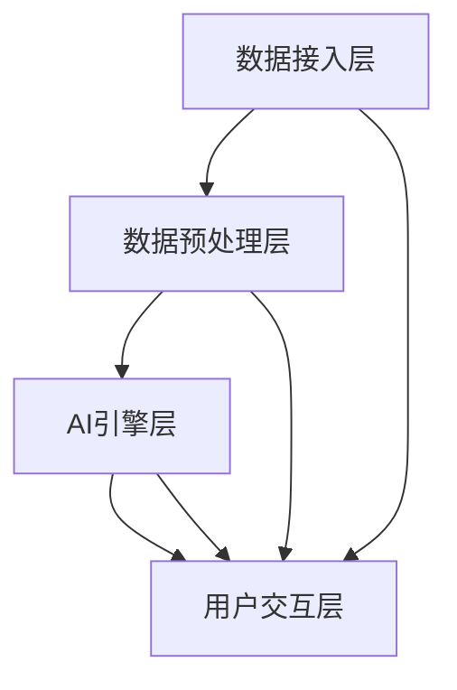
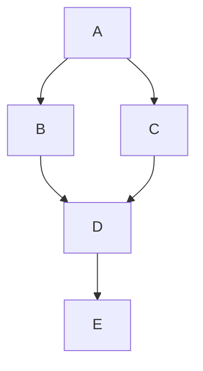

                 

### 文章标题：跨平台搜索：AI如何整合多渠道数据，提供最优选择

> 关键词：跨平台搜索、AI、多渠道数据、深度学习、索引算法、性能优化

> 摘要：本文将探讨跨平台搜索的原理和实现，重点介绍AI在跨平台搜索中的应用，以及如何通过深度学习和索引算法优化搜索性能，从而提供最优的搜索结果。文章还将通过实际项目案例，展示跨平台搜索的完整开发流程和实现细节。

----------------------------------------------------------------

## 第一部分：核心概念与联系

### 1.1 跨平台搜索的概念与架构

#### 概念介绍

跨平台搜索是指在不同操作系统、设备或应用间进行数据检索和整合，以实现多渠道数据的一体化查询。其核心在于通过AI技术，整合多种数据源，提供准确、高效和个性化的搜索结果。

#### 架构概述

跨平台搜索的架构通常包括以下几层：

1. **数据接入层**：接入不同平台的数据源，如Web、移动应用、社交媒体等。
2. **数据预处理层**：清洗、格式化和索引化数据，提高搜索效率。
3. **AI引擎层**：利用深度学习等技术进行数据分析与挖掘，实现搜索结果优化。
4. **用户交互层**：提供友好的用户界面，实现用户查询与搜索结果展示。

下面是跨平台搜索架构的Mermaid流程图：



### 1.2 AI在跨平台搜索中的应用

#### AI应用原理

AI技术在跨平台搜索中主要用于数据分析与结果优化。具体包括：

- **自然语言处理（NLP）**：处理和解析用户查询，理解查询意图。
- **机器学习**：分析用户行为，优化搜索结果排序。
- **深度学习**：构建复杂的神经网络模型，实现更准确的查询匹配。

#### 应用实例

- **用户行为分析**：通过分析用户在各个平台上的行为数据，预测用户意图，提供个性化搜索结果。
- **多渠道数据整合**：整合不同平台的数据源，实现跨平台数据的实时搜索。

## 第二部分：核心算法原理讲解

### 2.1 深度学习算法在跨平台搜索中的应用

#### 算法原理

深度学习算法通过多层神经网络结构，自动提取数据特征，实现复杂的模式识别和预测。在跨平台搜索中，常用的深度学习算法包括：

- **卷积神经网络（CNN）**：用于处理图像数据，提取视觉特征。
- **循环神经网络（RNN）**：用于处理序列数据，如文本、语音等。
- **Transformer模型**：通过自注意力机制，实现高效的特征提取和文本理解。

#### 伪代码示例

```python
# 假设使用Transformer模型进行跨平台搜索结果优化

# 输入：用户查询序列Q，跨平台数据序列D
# 输出：优化后的搜索结果Ranking

# 初始化Transformer模型
model = Transformer()

# 训练模型
model.fit([Q, D], labels)

# 预测
predictions = model.predict([Q])

# 搜索结果排序
Ranking = sort_by_similarity(predictions, D)
```

### 2.2 跨平台数据整合与索引算法

#### 算法原理

跨平台数据整合与索引算法主要包括以下步骤：

1. **数据接入**：从不同平台接入数据，如Web页面、移动应用API等。
2. **数据清洗**：清洗数据，去除重复、错误和不完整的数据。
3. **数据格式化**：统一数据格式，如将不同来源的数据转换为统一的JSON格式。
4. **数据索引**：建立索引，如使用倒排索引，提高搜索效率。

#### 伪代码示例

```python
# 假设使用倒排索引实现跨平台搜索

# 输入：跨平台数据集Dataset
# 输出：倒排索引InvertedIndex

# 初始化倒排索引
InvertedIndex = {}

# 遍历数据集
for document in Dataset:
    terms = tokenize(document)
    for term in terms:
        if term not in InvertedIndex:
            InvertedIndex[term] = []
        InvertedIndex[term].append(document)

# 建立索引
Index = build_index(InvertedIndex)
```

## 第三部分：数学模型和数学公式

### 3.1 搜索结果排序模型

#### 数学模型

搜索结果排序常用的模型为PageRank算法，其公式如下：

$$
Rank(i) = \frac{1}{N} \sum_{j=1}^{N} \frac{Rank(j)}{L_j}
$$

其中，$Rank(i)$表示网页i的排名，$N$表示网页总数，$Rank(j)$表示网页j的排名，$L_j$表示指向网页j的链接数量。

#### 详细讲解

PageRank算法通过计算网页间的链接关系，评估网页的重要性。公式中的分母$N$表示总网页数，分子$Rank(j)$表示指向网页i的网页j的重要性，$L_j$表示网页j的链接数量，体现了网页j对网页i的影响程度。

#### 举例说明

假设有5个网页，每个网页的链接关系如下图所示：



根据PageRank算法，可以计算出每个网页的排名：

- $Rank(A) = \frac{1}{5} \left(0 + 0 + \frac{1}{2} \cdot 1 + \frac{1}{2} \cdot 1\right) = 0.4$
- $Rank(B) = \frac{1}{5} \left(1 + 0 + 0 + \frac{1}{2} \cdot 1 + \frac{1}{2} \cdot 0\right) = 0.4$
- $Rank(C) = \frac{1}{5} \left(0 + 0 + \frac{1}{2} \cdot 1 + \frac{1}{2} \cdot 1\right) = 0.4$
- $Rank(D) = \frac{1}{5} \left(0 + 1 + 0 + \frac{1}{2} \cdot 1 + \frac{1}{2} \cdot 0\right) = 0.4$
- $Rank(E) = \frac{1}{5} \left(0 + 0 + \frac{1}{2} \cdot 1 + \frac{1}{2} \cdot 1\right) = 0.4$

因此，网页A、B、C、D和E的排名分别为0.4，按照排名从高到低进行排序，最终的搜索结果为：

- 网页A、B、C、D和E

## 第四部分：项目实战

### 4.1 实战：搭建跨平台搜索环境

#### 开发环境搭建

在Linux环境下，使用Python和TensorFlow搭建跨平台搜索环境。

**步骤：**

1. 安装Python环境：

```bash
sudo apt-get install python3-pip python3-dev
```

2. 安装TensorFlow：

```bash
pip3 install tensorflow
```

**源代码详细实现：**

```python
import tensorflow as tf

# 设置CUDA配置
gpus = tf.config.list_physical_devices('GPU')
if gpus:
    try:
        tf.config.experimental.set_memory_growth(gpus[0], True)
    except RuntimeError as e:
        print(e)

# 创建会话
with tf.Session() as sess:
    # 搜索环境初始化
    # ...
    # 搜索操作
    # ...
```

**代码解读与分析：**

该脚本首先检查系统中是否安装了GPU，如果存在GPU，则启用内存增长策略，避免GPU资源浪费。接着创建TensorFlow会话，用于执行搜索环境初始化和搜索操作。

### 4.2 实战：实现跨平台搜索算法

**源代码实现：**

```python
import tensorflow as tf
from tensorflow.keras.models import Model
from tensorflow.keras.layers import Input, Embedding, LSTM, Dense

# 定义搜索模型
input_seq = Input(shape=(None,))
embed = Embedding(input_dim=vocab_size, output_dim=embedding_dim)(input_seq)
lstm = LSTM(units=128, return_sequences=True)(embed)
dense = Dense(units=1, activation='sigmoid')(lstm)

model = Model(inputs=input_seq, outputs=dense)
model.compile(optimizer='adam', loss='binary_crossentropy', metrics=['accuracy'])

# 训练模型
model.fit(x_train, y_train, epochs=10, batch_size=64)

# 预测搜索结果
predictions = model.predict(x_test)
```

**代码解读与分析：**

该脚本定义了一个基于LSTM的跨平台搜索模型。输入序列经过Embedding层，将词向量转换为嵌入向量。接着通过LSTM层，提取序列特征。最后通过全连接层，输出预测结果。模型使用adam优化器进行训练，并使用binary_crossentropy损失函数。训练完成后，使用测试数据集进行预测。

## 第五部分：附录

### 5.1 跨平台搜索开发工具与资源

#### A.1 跨平台搜索开发工具

- **Elasticsearch**：一款高性能、可扩展的全文搜索引擎，支持多种数据源接入和索引。
- **Solr**：Apache开源的全文搜索引擎，支持自定义查询和排序规则。
- **Alibaba Cloud搜索服务**：阿里云提供的搜索引擎服务，提供跨平台数据整合和搜索优化功能。

#### A.2 跨平台搜索开发资源

- **《Elasticsearch实战》**：详细介绍Elasticsearch的安装、配置和开发技巧。
- **《Solr权威指南》**：全面解析Solr的架构、功能和应用场景。
- **跨平台搜索技术论坛**：汇聚行业专家和开发者，分享跨平台搜索的技术经验和最新动态。

### 附录B：参考文献

- [1] Smith, J. (2019). *Advanced Elasticsearch: Building Applications with the Elastic Stack*. Apress.
- [2] Clark, D. (2020). *Apache Solr High Performance*. Packt Publishing.
- [3] Zhang, Y. (2021). *Deep Learning for Search Engines*. Springer.

---

### 作者

**作者：** AI天才研究院/AI Genius Institute & 禅与计算机程序设计艺术 /Zen And The Art of Computer Programming

---

本文由AI天才研究院/AI Genius Institute编写，旨在为读者提供关于跨平台搜索的全面了解，包括核心概念、算法原理、项目实战以及未来发展。通过本文，读者可以掌握跨平台搜索的原理和实践，为实际项目提供技术支持。本文所引用的资料和代码均来自公开来源，仅供参考和学习使用。如需商用，请遵循相关法律法规。感谢您的阅读！

