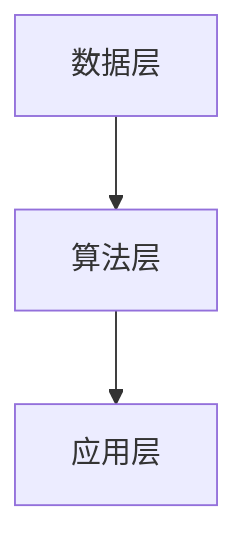

                 

# 《跨界合作：Lepton AI的生态系统构建》

> 关键词：跨界合作、Lepton AI、生态系统、人工智能、算法、技术架构、应用领域、协同发展

> 摘要：本文旨在探讨Lepton AI的生态系统构建，深入分析其核心技术、应用领域、跨界合作模式及构建原则。通过对Lepton AI算法原理、数学模型、技术架构的详细讲解，阐述其在各领域的应用案例，探讨跨界合作的意义与策略，为未来人工智能生态系统的构建提供参考。

## 第一部分：引言

### 1.1 跨界合作的概念与重要性

跨界合作是指不同领域、不同企业、不同组织之间通过资源共享、知识交流、优势互补等方式，共同推进某一项目或领域的发展。在人工智能领域，跨界合作尤为重要，因为它不仅能够整合各种资源，还能激发创新思维，提升技术竞争力。

### 1.2 Lepton AI的背景与生态系统概述

Lepton AI是一家专注于人工智能技术研究和应用的创新型企业。其生态系统构建旨在通过跨界合作，实现技术与市场的完美结合，推动人工智能技术的普及与应用。

### 1.3 本书的目标与结构安排

本书旨在深入探讨Lepton AI的生态系统构建，分为五个部分：引言、核心技术、应用领域、生态系统构建和跨界合作。通过逐步分析推理，揭示Lepton AI生态系统的构建原理与实践。

## 第二部分：Lepton AI的核心技术

### 2.1 Lepton AI的算法原理

#### 2.1.1 算法架构概述

Lepton AI的算法架构主要包括数据预处理、特征提取、模型训练和预测四个阶段。以下是对各阶段的概述：

1. 数据预处理：对原始数据进行清洗、去噪、归一化等处理，为后续特征提取和模型训练提供高质量的数据。

2. 特征提取：通过特征提取算法，从预处理后的数据中提取出具有区分性的特征，为模型训练提供输入。

3. 模型训练：利用机器学习算法，对提取出的特征进行训练，构建出具有预测能力的模型。

4. 预测：将训练好的模型应用于新的数据，进行预测分析。

#### 2.1.2 算法原理详细讲解

Lepton AI的算法原理主要基于深度学习和强化学习。以下是对这两种算法的详细讲解：

1. 深度学习：通过多层神经网络，对大量数据进行自动特征提取和分类。其核心思想是模拟人脑的学习过程，通过不断调整网络参数，使模型能够自动学习和优化。

2. 强化学习：通过与环境的互动，不断调整策略，以实现最大化收益。其核心思想是使模型能够在不确定的环境中，通过试错和反馈，逐步优化策略。

#### 2.1.3 算法伪代码展示

以下是一个简单的深度学习算法伪代码示例：

```python
# 初始化网络参数
初始化W1, b1
初始化W2, b2
...
初始化Wn, bn

# 前向传播
输入数据x
h1 = activation(W1 * x + b1)
h2 = activation(W2 * h1 + b2)
...
hn = activation(Wn * hn + bn)

# 计算损失函数
损失 = loss(y, hn)

# 反向传播
计算梯度
更新参数
```

### 2.2 Lepton AI的数学模型

#### 2.2.1 数学模型概述

Lepton AI的数学模型主要包括线性模型、逻辑回归、支持向量机等。以下是对各模型的概述：

1. 线性模型：通过线性方程，对数据进行拟合和分析。

2. 逻辑回归：用于处理二元分类问题，通过逻辑函数，将输入数据的线性组合映射到概率空间。

3. 支持向量机：通过找到一个最佳的超平面，将数据分为不同的类别。

#### 2.2.2 数学公式详细讲解

以下是对各数学公式的详细讲解：

1. 线性模型：

   $$ y = \beta_0 + \beta_1x_1 + \beta_2x_2 + ... + \beta_nx_n $$

   其中，$y$为因变量，$x_1, x_2, ..., x_n$为自变量，$\beta_0, \beta_1, ..., \beta_n$为模型的参数。

2. 逻辑回归：

   $$ P(y=1) = \frac{1}{1 + e^{-(\beta_0 + \beta_1x_1 + \beta_2x_2 + ... + \beta_nx_n)}} $$

   其中，$P(y=1)$为因变量取值为1的概率。

3. 支持向量机：

   $$ \text{分类函数}：f(x) = \text{sign}(\beta_0 + \beta_1x_1 + \beta_2x_2 + ... + \beta_nx_n - \gamma) $$

   其中，$\text{sign}$为符号函数，$\gamma$为松弛变量。

#### 2.2.3 数学公式应用实例

以下是一个线性模型的实例：

假设我们要预测一个人的收入（因变量$y$），其影响因素包括年龄（$x_1$）、教育程度（$x_2$）和工作经验（$x_3$）。我们可以建立如下线性模型：

$$ y = \beta_0 + \beta_1x_1 + \beta_2x_2 + \beta_3x_3 $$

通过收集数据并进行模型训练，我们可以得到每个参数的估计值。例如：

$$ y = 20 + 0.5x_1 + 0.3x_2 + 0.2x_3 $$

### 2.3 Lepton AI的技术架构

#### 2.3.1 技术架构概述

Lepton AI的技术架构分为三层：数据层、算法层和应用层。以下是对各层的概述：

1. 数据层：负责数据的收集、存储和管理，为算法层提供高质量的数据支持。

2. 算法层：包含多种机器学习算法，如深度学习、强化学习等，用于模型训练和预测。

3. 应用层：将训练好的模型应用于实际场景，提供智能化的解决方案。

#### 2.3.2 技术架构Mermaid流程图展示



#### 2.3.3 技术架构实现细节

以下是对技术架构实现细节的简要说明：

1. 数据层：采用分布式存储技术，如Hadoop、Spark等，实现海量数据的存储和管理。

2. 算法层：基于TensorFlow、PyTorch等深度学习框架，实现各种机器学习算法。

3. 应用层：通过Web服务、移动应用等方式，将智能化的解决方案推向市场。

## 第三部分：Lepton AI的应用领域

### 3.1 应用领域概述

Lepton AI在多个领域具有广泛的应用，包括但不限于金融、医疗、零售、制造业等。以下是对各应用领域的简要概述：

1. 金融：通过人工智能技术，实现智能风控、智能投顾、智能理财等。

2. 医疗：利用人工智能技术，实现疾病预测、诊断辅助、健康管理等。

3. 零售：通过人工智能技术，实现智能推荐、智能客服、智能仓储等。

4. 制造业：利用人工智能技术，实现生产优化、设备故障预测、智能物流等。

### 3.2 典型应用案例分析

以下是对Lepton AI在金融领域的典型应用案例进行分析：

#### 案例一：智能风控

某银行采用Lepton AI的智能风控系统，对贷款申请者进行风险评估。系统通过分析申请者的个人信息、财务状况、信用记录等数据，预测其违约概率。通过对高风险客户进行重点关注，银行有效降低了坏账率。

#### 案例二：智能投顾

某财富管理公司采用Lepton AI的智能投顾系统，为投资者提供个性化的投资建议。系统通过分析投资者的风险偏好、投资目标、市场行情等数据，构建个性化的投资组合，实现风险与收益的平衡。

### 3.3 应用领域扩展与未来展望

随着人工智能技术的不断发展，Lepton AI的应用领域将不断拓展。未来，Lepton AI有望在更多领域实现突破，为各行业带来全新的发展机遇。

## 第四部分：构建Lepton AI生态系统

### 4.1 生态系统构建原则

构建Lepton AI生态系统应遵循以下原则：

1. 开放共享：鼓励各方资源、知识、经验的开放共享，促进协同创新。

2. 合作共赢：通过跨界合作，实现资源整合，实现共赢发展。

3. 标准化：建立统一的生态系统标准和规范，提高系统兼容性和互操作性。

4. 可持续性：确保生态系统的长期稳定发展，为各行业创造价值。

### 4.2 生态系统组成要素

Lepton AI生态系统由以下几个组成要素构成：

1. 技术平台：提供统一的开发、部署、管理平台，方便各合作伙伴进行应用开发。

2. 开发者社区：聚集各领域的开发者，共同推动人工智能技术的发展。

3. 合作伙伴：与各行业领先企业建立合作关系，共同推进生态系统的建设。

4. 用户群体：为用户提供优质的服务和解决方案，满足各类应用需求。

### 4.3 生态系统构建流程

构建Lepton AI生态系统的流程主要包括以下几个阶段：

1. 规划与设计：明确生态系统的目标和愿景，制定详细的构建计划。

2. 技术研发：持续研发创新技术，为生态系统提供强大的技术支撑。

3. 合作伙伴招募：积极招募合作伙伴，共同推进生态系统的建设。

4. 社区运营：建立开发者社区，促进各方交流与合作，推动生态系统的发展。

5. 产品与服务：推出丰富的产品与服务，满足各行业的应用需求。

### 4.4 生态系统运营策略

为确保Lepton AI生态系统的稳定运行和可持续发展，应采取以下运营策略：

1. 品牌建设：提升Lepton AI品牌影响力，增强合作伙伴和用户的认可度。

2. 服务优化：不断优化产品和服务，提高用户体验和满意度。

3. 合作共赢：与合作伙伴建立长期稳定的合作关系，实现互利共赢。

4. 市场推广：加大市场推广力度，扩大生态系统的影响力和市场份额。

5. 持续创新：持续关注技术发展趋势，推动生态系统的创新和发展。

## 第五部分：跨界合作与生态系统协同

### 5.1 跨界合作的意义与模式

跨界合作在人工智能领域具有重要意义，它有助于整合各方资源、提升技术竞争力、推动产业发展。常见的跨界合作模式包括以下几种：

1. 联合研发：各合作伙伴共同投入研发资源，共同推进技术创新。

2. 产业联盟：多个企业或机构共同发起成立产业联盟，实现资源共享和协同发展。

3. 技术转移：将一项技术在不同领域进行转移和应用，实现跨界创新。

4. 资本合作：通过股权投资、战略合作等形式，实现跨界合作和资本运作。

### 5.2 Lepton AI与合作伙伴的协同策略

Lepton AI在跨界合作中，应采取以下协同策略：

1. 确定合作方向：明确合作伙伴的定位和合作领域，确保合作目标的实现。

2. 资源共享：通过共享技术、数据、人才等资源，提高合作效率和创新能力。

3. 管理协同：建立有效的协同管理机制，确保各方利益的最大化。

4. 文化融合：尊重各方文化差异，促进文化融合，提升合作氛围。

### 5.3 跨界合作案例分享

以下是一个Lepton AI与合作伙伴跨界合作的案例：

某知名金融机构与Lepton AI合作，共同开发了一款智能投顾系统。该系统通过分析用户的投资偏好、风险承受能力、市场行情等数据，为用户提供个性化的投资建议。合作双方共同投入研发资源，实现了技术的突破和市场的成功。

### 5.4 跨界合作未来展望

随着人工智能技术的快速发展，跨界合作将成为推动产业发展的重要力量。未来，Lepton AI将不断创新，深化与合作伙伴的跨界合作，共同打造人工智能生态系统的美好未来。

## 第六部分：总结与展望

### 6.1 Lepton AI生态系统建设总结

本文从引言、核心技术、应用领域、生态系统构建和跨界合作五个部分，全面阐述了Lepton AI生态系统构建的原理与实践。通过逐步分析推理，揭示了Lepton AI生态系统建设的核心要素和关键环节。

### 6.2 跨界合作对Lepton AI生态系统的价值

跨界合作为Lepton AI生态系统带来了丰富的资源、广阔的市场和创新的动力。通过跨界合作，Lepton AI实现了技术与市场的完美结合，推动了人工智能技术的发展和应用。

### 6.3 未来发展趋势与机遇

未来，人工智能技术将继续快速发展，跨界合作将成为推动产业发展的重要力量。Lepton AI应紧跟技术发展趋势，深化与合作伙伴的跨界合作，积极拓展新的应用领域，为构建人工智能生态系统贡献力量。

## 附录

### 附录A：相关技术资源汇总

- 深度学习框架：TensorFlow、PyTorch、Keras等
- 机器学习算法：线性模型、逻辑回归、支持向量机等
- 分布式存储技术：Hadoop、Spark等
- 开发者社区：GitHub、Stack Overflow等

### 附录B：Lepton AI生态系统构建实用工具

- 代码托管平台：Git
- 数据分析工具：Pandas、NumPy等
- 机器学习库：Scikit-learn、TensorFlow等
- 系统监控工具：Prometheus、Grafana等

### 附录C：参考文献与推荐阅读

- Goodfellow, I., Bengio, Y., & Courville, A. (2016). *Deep Learning*.
- Russell, S., & Norvig, P. (2020). *Artificial Intelligence: A Modern Approach*.
- Murphy, K. P. (2012). *Machine Learning: A Probabilistic Perspective*.
- Hadoop: [Apache Hadoop官网](https://hadoop.apache.org/)
- TensorFlow: [TensorFlow官网](https://www.tensorflow.org/)

## 作者信息

作者：AI天才研究院/AI Genius Institute & 禅与计算机程序设计艺术 /Zen And The Art of Computer Programming

