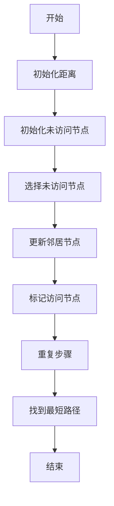

                 

# 《路径规划》

> 关键词：路径规划，机器人，无人驾驶，算法，应用

> 摘要：本文将深入探讨路径规划这一重要技术领域。从基础知识出发，逐步讲解几何与拓扑基础、路径规划算法概述以及路径规划中的数学模型。随后，详细介绍各种路径规划算法，包括图算法、扩散算法、车轮算法和统计学习算法。最后，本文将探讨路径规划在机器人、无人驾驶以及其他领域中的应用，并展望未来路径规划技术的发展趋势。

## 《路径规划》目录大纲

## 第一部分：基础知识

### 第1章：路径规划概述

#### 1.1 路径规划的基本概念

#### 1.2 路径规划的应用领域

#### 1.3 路径规划的挑战与机会

### 第2章：几何与拓扑基础

#### 2.1 几何概念

#### 2.2 拓扑概念

#### 2.3 几何与拓扑在路径规划中的应用

### 第3章：路径规划算法概述

#### 3.1 图算法

#### 3.2 扩散算法

#### 3.3 车轮算法

#### 3.4 统计学习算法

### 第4章：路径规划中的数学模型

#### 4.1 最优化模型

#### 4.2 动力学模型

#### 4.3 环境模型

## 第二部分：路径规划算法详解

### 第5章：图算法

#### 5.1 Dijkstra算法

#### 5.2 A*算法

#### 5.3 贝叶斯路径搜索算法

### 第6章：扩散算法

#### 6.1 Diffusion-Based Path Planning

#### 6.2 Fast Marching算法

#### 6.3 动态扩散算法

### 第7章：车轮算法

#### 7.1 车轮算法原理

#### 7.2 车轮算法的实现

#### 7.3 车轮算法的优化

### 第8章：统计学习算法

#### 8.1 统计学习算法概述

#### 8.2 支持向量机

#### 8.3 决策树

### 第9章：综合算法

#### 9.1 策略搜索

#### 9.2 模型预测控制

#### 9.3 混合算法

## 第三部分：路径规划应用与实战

### 第10章：路径规划在机器人中的应用

#### 10.1 机器人路径规划概述

#### 10.2 机器人路径规划算法选择

#### 10.3 机器人路径规划案例研究

### 第11章：路径规划在无人驾驶中的应用

#### 11.1 无人驾驶路径规划概述

#### 11.2 无人驾驶路径规划算法选择

#### 11.3 无人驾驶路径规划案例研究

### 第12章：路径规划在其他领域中的应用

#### 12.1 航空航天领域

#### 12.2 地面物流领域

#### 12.3 其他领域

### 第13章：路径规划的未来发展趋势

#### 13.1 未来路径规划技术的挑战

#### 13.2 未来路径规划技术的发展方向

## 附录

### 附录A：路径规划算法的Mermaid流程图

### 附录B：常见路径规划算法的时间复杂度分析

### 附录C：路径规划算法伪代码示例

### 附录D：路径规划算法的数学模型公式与详细讲解

## 第一部分：基础知识

### 第1章：路径规划概述

#### 1.1 路径规划的基本概念

路径规划（Path Planning）是指在给定起点和终点的情况下，寻找一条从起点到终点的最优路径的过程。路径规划是人工智能、机器人技术、无人驾驶等众多领域中的重要技术之一。其主要目的是在复杂的环境中，为机器人或自动驾驶系统提供一条安全、高效、可靠的路径。

路径规划可以划分为以下几种类型：

1. **静态路径规划**：环境中的障碍物是静态的，路径规划算法只需考虑如何避免这些障碍物。
2. **动态路径规划**：环境中的障碍物是动态的，路径规划算法需要不断更新路径，以应对障碍物的移动。
3. **全局路径规划**：在全局范围内寻找一条从起点到终点的最优路径。
4. **局部路径规划**：在局部范围内寻找一条从当前点到目标点的最优路径。

#### 1.2 路径规划的应用领域

路径规划在多个领域都有广泛应用：

1. **机器人**：在工业制造、医疗辅助、家庭服务等领域，路径规划技术可以确保机器人安全、高效地完成任务。
2. **无人驾驶**：在自动驾驶汽车、无人机等领域，路径规划技术是实现安全驾驶的关键。
3. **物流与运输**：在智能物流、自动驾驶卡车等领域，路径规划技术可以优化运输路线，提高运输效率。
4. **地理信息系统**：在地理信息系统中，路径规划技术可以用于导航、紧急救援等应用。
5. **工业自动化**：在工业自动化系统中，路径规划技术可以用于机器人的运动规划和控制。

#### 1.3 路径规划的挑战与机会

路径规划虽然已经取得了显著进展，但仍然面临诸多挑战：

1. **复杂环境建模**：环境中的障碍物可能非常复杂，且具有动态特性，准确建模是路径规划的难点。
2. **计算效率**：路径规划算法需要快速计算出最优路径，以满足实时性的要求。
3. **安全性**：路径规划算法需要确保路径的安全，避免碰撞和其他危险情况。
4. **多目标优化**：路径规划往往涉及多个目标，如最短路径、最少能耗、最小延迟等，如何实现多目标优化是一个挑战。

然而，随着人工智能、机器学习和计算机技术的不断发展，路径规划也面临着许多新的机会：

1. **深度学习**：通过深度学习技术，可以更好地建模复杂环境，提高路径规划的精度和效率。
2. **多传感器融合**：结合多种传感器数据，可以更准确地了解环境信息，从而优化路径规划。
3. **硬件加速**：随着硬件技术的发展，如GPU和FPGA，路径规划的计算效率得到了显著提高。
4. **智能协同**：在多个机器人或无人驾驶系统协同工作的情况下，路径规划可以实现更高效的资源利用和路径选择。

### 第2章：几何与拓扑基础

路径规划在很大程度上依赖于几何和拓扑学的知识。几何和拓扑基础为我们提供了描述环境、构建模型以及分析路径规划算法的重要工具。

#### 2.1 几何概念

几何概念是路径规划的基础，包括以下内容：

1. **点与线**：点是几何空间中的基本单位，线是由点组成的连续集合。路径规划中的道路、边界等都可以用线来表示。
2. **平面与空间**：平面是二维空间中的几何结构，空间是三维或更高维的几何结构。路径规划中的道路、建筑物等通常位于三维空间中。
3. **距离与角度**：距离是两点之间的直线距离，角度是两条线之间的夹角。路径规划中需要计算这些几何量，以评估路径的优劣。

#### 2.2 拓扑概念

拓扑学是研究几何形状和空间结构的一门数学分支，在路径规划中具有重要意义。以下是一些基本的拓扑概念：

1. **连通性**：连通性是描述路径是否能够连接两个点的性质。在路径规划中，确保起点和终点之间的连通性是基本要求。
2. **路径**：路径是连接起点和终点的点序列。路径规划的核心任务就是寻找一条合适的路径。
3. **拓扑网络**：拓扑网络是将环境中的点、线、面等要素抽象为节点和边的一种模型。这种模型可以用于表示复杂环境，并为路径规划提供支持。

#### 2.3 几何与拓扑在路径规划中的应用

几何和拓扑知识在路径规划中发挥着关键作用：

1. **环境建模**：通过几何和拓扑知识，可以准确地描述环境中的障碍物和道路结构，为路径规划提供基础。
2. **路径搜索**：基于几何和拓扑概念，可以设计出有效的路径搜索算法，如Dijkstra算法和A*算法。
3. **路径优化**：通过分析几何和拓扑特征，可以对路径进行优化，提高路径的效率和安全性。

### 第3章：路径规划算法概述

路径规划算法是路径规划的核心。根据不同的应用场景和需求，有多种路径规划算法可供选择。以下是一些常见的路径规划算法：

#### 3.1 图算法

图算法是路径规划中最常用的算法之一。图是由节点（或顶点）和边组成的数学结构，可以用于表示环境。以下是一些常用的图算法：

1. **Dijkstra算法**：Dijkstra算法是一种基于贪心策略的最短路径算法。它从起点开始，逐步扩展到其他节点，直到找到最短路径。
2. **A*算法**：A*算法是一种启发式最短路径算法。它结合了Dijkstra算法的优点和启发式搜索，可以更快地找到最优路径。
3. **贝叶斯路径搜索算法**：贝叶斯路径搜索算法是一种基于概率模型的路径规划算法。它利用环境的不确定性，通过概率计算来找到最优路径。

#### 3.2 扩散算法

扩散算法是一种基于物理原理的路径规划算法。它模拟物质扩散的过程，为路径规划提供支持。以下是一些常见的扩散算法：

1. **扩散-Based Path Planning**：扩散-Based Path Planning 是一种基于扩散原理的路径规划算法。它通过模拟物质扩散，寻找从起点到终点的最优路径。
2. **Fast Marching算法**：Fast Marching算法是一种基于波动方程的扩散算法。它通过求解波动方程，快速找到从起点到终点的最优路径。
3. **动态扩散算法**：动态扩散算法是一种基于动态环境的扩散算法。它可以根据环境的动态变化，实时更新路径规划。

#### 3.3 车轮算法

车轮算法是一种基于几何原理的路径规划算法。它通过将路径划分为多个子路径，为路径规划提供支持。以下是一些常见的车轮算法：

1. **车轮算法原理**：车轮算法将路径规划问题转换为几何问题，通过分析几何关系，找到最优路径。
2. **车轮算法的实现**：车轮算法的实现涉及几何计算和路径优化。它需要准确计算路径的长度、方向等参数。
3. **车轮算法的优化**：车轮算法的优化主要涉及路径优化和计算效率。通过优化算法和数据结构，可以提高车轮算法的性能。

#### 3.4 统计学习算法

统计学习算法是一种基于机器学习的路径规划算法。它通过学习环境数据，为路径规划提供支持。以下是一些常见的统计学习算法：

1. **统计学习算法概述**：统计学习算法包括支持向量机、决策树等。它们通过学习环境数据，为路径规划提供预测和决策支持。
2. **支持向量机**：支持向量机是一种常用的统计学习算法。它通过寻找最佳分类边界，为路径规划提供决策支持。
3. **决策树**：决策树是一种基于规则的统计学习算法。它通过构建决策树，为路径规划提供明确的决策路径。

### 第4章：路径规划中的数学模型

路径规划中的数学模型是路径规划算法的核心。以下是一些常见的数学模型：

#### 4.1 最优化模型

最优化模型是一种用于寻找最优路径的数学模型。它通过建立目标函数和约束条件，为路径规划提供优化方向。以下是一些常见的目标函数和约束条件：

1. **目标函数**：目标函数是衡量路径优劣的标准。常见的目标函数包括距离、时间、能耗等。
2. **约束条件**：约束条件是路径规划中需要满足的条件。常见的约束条件包括障碍物、道路限制等。

#### 4.2 动力学模型

动力学模型是一种描述系统动态行为的数学模型。在路径规划中，动力学模型可以用于预测机器人的运动状态。以下是一些常见的动力学模型：

1. **线性动力学模型**：线性动力学模型是一种简化的动力学模型。它通过建立状态方程和输入方程，描述系统的动态行为。
2. **非线性动力学模型**：非线性动力学模型是一种更精确的动力学模型。它通过建立非线性状态方程和输入方程，描述系统的动态行为。

#### 4.3 环境模型

环境模型是一种描述环境信息的数学模型。在路径规划中，环境模型可以用于构建路径规划问题的求解环境。以下是一些常见的环境模型：

1. **静态环境模型**：静态环境模型是一种描述静态环境的模型。它通过建立环境地图，描述环境中的障碍物和道路结构。
2. **动态环境模型**：动态环境模型是一种描述动态环境的模型。它通过建立动态环境地图，描述环境中的动态变化。

## 第二部分：路径规划算法详解

### 第5章：图算法

图算法是路径规划中最为常用的算法之一。它们基于图的数学结构，寻找从起点到终点的最优路径。以下将详细介绍几种常用的图算法。

#### 5.1 Dijkstra算法

Dijkstra算法是一种基于贪心策略的单源最短路径算法。它的基本思想是从起点开始，逐步扩展到其他节点，直到找到所有节点的最短路径。

**算法原理：**
1. 初始化：将所有节点的距离设置为无穷大，将起点的距离设置为0。
2. 选择未访问节点中距离起点最近的节点作为当前节点。
3. 更新未访问节点的距离：对于当前节点的每个邻居节点，计算从起点经过当前节点到邻居节点的距离，并与邻居节点的当前距离进行比较。如果更短，则更新邻居节点的距离。
4. 标记当前节点为已访问。
5. 重复步骤2-4，直到找到终点或所有节点都被访问。

**伪代码：**
```python
function Dijkstra(graph, start):
    distance = {node: infinity for node in graph}
    distance[start] = 0
    visited = set()

    while visited != set(graph.nodes):
        current = min(visited, key=lambda node: distance[node])
        visited.add(current)

        for neighbor, weight in graph[current].items():
            new_distance = distance[current] + weight
            if new_distance < distance[neighbor]:
                distance[neighbor] = new_distance

    return distance
```

**时间复杂度：**
- 最坏情况下的时间复杂度为 \(O((V+E)\log V)\)，其中 \(V\) 是节点的数量，\(E\) 是边的数量。

**适用场景：**
- Dijkstra算法适用于无权图和带权图，但在存在负权重边时无效。

#### 5.2 A*算法

A*算法是一种启发式最短路径算法，结合了Dijkstra算法和启发式搜索的优点。它利用启发式函数（Heuristic Function）来估计从当前节点到终点的距离，以加快搜索速度。

**算法原理：**
1. 初始化：将所有节点的 \(g\) 值（从起点到当前节点的实际距离）设置为无穷大，将 \(h\) 值（启发式估计值，从当前节点到终点的估计距离）设置为0。
2. 选择 \(f\) 值（\(f = g + h\)）最小的未访问节点作为当前节点。
3. 更新未访问节点的 \(g\) 和 \(h\) 值：对于当前节点的每个邻居节点，计算 \(g\) 值和 \(h\) 值。如果 \(g\) 值更小，则更新邻居节点的 \(g\) 值。
4. 标记当前节点为已访问。
5. 重复步骤2-4，直到找到终点或所有节点都被访问。

**伪代码：**
```python
function A*(graph, start, goal, heuristic):
    open_set = PriorityQueue()
    open_set.add(start, f = heuristic(start, goal))
    came_from = {}
    g_score = {node: infinity for node in graph}
    g_score[start] = 0

    while not open_set.isEmpty():
        current = open_set.pop()

        if current == goal:
            return reconstruct_path(came_from, current)

        for neighbor in graph.neighbors(current):
            tentative_g_score = g_score[current] + graph.cost(current, neighbor)
            if tentative_g_score < g_score[neighbor]:
                came_from[neighbor] = current
                g_score[neighbor] = tentative_g_score
                f_score = g_score[neighbor] + heuristic(neighbor, goal)
                open_set.add(neighbor, f = f_score)

    return None

function heuristic(node, goal):
    # 使用适当的启发式函数，如曼哈顿距离、欧几里得距离等
    return estimated_distance(node, goal)
```

**时间复杂度：**
- A*算法的时间复杂度取决于启发式函数的质量。在最优启发式函数下，其时间复杂度为 \(O((V+E)\log V)\)。

**适用场景：**
- A*算法适用于各种类型的图，特别是当存在大量障碍物或需要快速找到最优路径时。

#### 5.3 贝叶斯路径搜索算法

贝叶斯路径搜索算法是一种基于概率模型的路径规划算法。它利用贝叶斯推理来估计从起点到终点的最优路径。

**算法原理：**
1. 初始化：将所有节点的概率设置为1，将起点的概率设置为1。
2. 对于每个节点，计算其邻居节点的概率：根据当前节点的概率和边的概率，计算邻居节点的概率。
3. 更新节点的概率：根据邻居节点的概率和边的概率，更新当前节点的概率。
4. 重复步骤2-3，直到找到终点或所有节点的概率稳定。

**伪代码：**
```python
function BayesianPathSearch(graph, start, goal):
    probability = {node: 1 for node in graph}
    probability[start] = 1

    while not goal_probability(goal) == 1:
        for node in graph:
            for neighbor in graph.neighbors(node):
                neighbor_probability = probability[neighbor] * graph.edge_probability(node, neighbor)
                probability[node] = probability[node] + neighbor_probability

    return None

function goal_probability(goal):
    return sum(probability[goal] for goal in graph)
```

**时间复杂度：**
- 贝叶斯路径搜索算法的时间复杂度取决于节点的数量和边的数量。

**适用场景：**
- 贝叶斯路径搜索算法适用于存在不确定性和风险的环境。

### 第6章：扩散算法

扩散算法是一种基于物理扩散过程的路径规划算法。它模拟物质扩散的行为，以寻找从起点到终点的最优路径。

#### 6.1 Diffusion-Based Path Planning

Diffusion-Based Path Planning 是一种基本的扩散算法。它通过模拟物质扩散，将物质从起点扩散到终点，从而找到最优路径。

**算法原理：**
1. 初始化：将起点设置为高浓度，将终点设置为低浓度，其他节点设置为中等浓度。
2. 更新浓度：对于每个节点，计算其邻居节点的浓度平均值，并将其设置为新的浓度值。
3. 重复步骤2，直到浓度稳定。

**伪代码：**
```python
function DiffusionBasedPathPlanning(grid, start, goal):
    concentration = {node: 0 for node in grid}
    concentration[start] = 1
    concentration[goal] = 0

    while not concentration_stable(concentration):
        new_concentration = {}
        for node in grid:
            if node != start and node != goal:
                neighbors_concentration = sum(concentration[neighbor] for neighbor in grid.neighbors(node)) / len(grid.neighbors(node))
                new_concentration[node] = neighbors_concentration

        concentration = new_concentration

    return find_path(grid, concentration, goal)

function concentration_stable(concentration):
    return all(concentration[node] == 0 or concentration[node] == 1 for node in concentration)

function find_path(grid, concentration, goal):
    # 使用回溯法或其他方法找到从起点到终点的路径
    return path
```

**时间复杂度：**
- Diffusion-Based Path Planning 的时间复杂度取决于网格的大小和迭代次数。

**适用场景：**
- Diffusion-Based Path Planning 适用于环境简单且无需精确路径规划的场合。

#### 6.2 Fast Marching算法

Fast Marching算法是一种基于波动方程的扩散算法。它通过求解波动方程，快速找到从起点到终点的最优路径。

**算法原理：**
1. 初始化：将起点设置为高值，将终点设置为低值，其他节点设置为初始值。
2. 时间步进：在每一时间步，更新节点值，使其更接近终点值。
3. 终止条件：当所有节点值稳定时，算法终止。

**伪代码：**
```python
function FastMarching(grid, start, goal):
    values = {node: 0 for node in grid}
    values[start] = infinity
    values[goal] = 0

    time = 0
    while not values_stable(values):
        time += 1
        for node in grid:
            if node != start and node != goal:
                neighbors_time = time - min(values[neighbor] for neighbor in grid.neighbors(node))
                new_value = (1 - neighbors_time) * values[node] + neighbors_time * values[goal]
                values[node] = new_value

    return find_path(grid, values, goal)

function values_stable(values):
    return all(values[node] == 0 or values[node] == infinity for node in values)

function find_path(grid, values, goal):
    # 使用回溯法或其他方法找到从起点到终点的路径
    return path
```

**时间复杂度：**
- Fast Marching算法的时间复杂度取决于网格的大小和时间步进的大小。

**适用场景：**
- Fast Marching算法适用于需要快速路径规划且环境相对简单的情况。

#### 6.3 动态扩散算法

动态扩散算法是一种基于动态环境的扩散算法。它可以根据环境的动态变化，实时更新路径规划。

**算法原理：**
1. 初始化：根据环境状态，设置起点和终点的初始值。
2. 动态更新：当环境发生变化时，根据新环境状态，重新设置起点和终点的值。
3. 扩散过程：使用扩散算法，将物质从起点扩散到终点。

**伪代码：**
```python
function DynamicDiffusion(grid, start, goal, environment):
    values = {node: 0 for node in grid}
    values[start] = 1
    values[goal] = 0

    while environment.changed():
        update_values(values, environment)
        if not values_stable(values):
            for node in grid:
                if node != start and node != goal:
                    neighbors_time = time - min(values[neighbor] for neighbor in grid.neighbors(node))
                    new_value = (1 - neighbors_time) * values[node] + neighbors_time * values[goal]
                    values[node] = new_value

    return find_path(grid, values, goal)

function update_values(values, environment):
    # 根据环境变化更新节点值
    pass

function values_stable(values):
    return all(values[node] == 0 or values[node] == 1 for node in values)

function find_path(grid, values, goal):
    # 使用回溯法或其他方法找到从起点到终点的路径
    return path
```

**时间复杂度：**
- 动态扩散算法的时间复杂度取决于网格的大小和环境变化的频率。

**适用场景：**
- 动态扩散算法适用于环境动态变化且需要实时路径规划的情况。

### 第7章：车轮算法

车轮算法是一种基于几何原理的路径规划算法。它通过将路径划分为多个子路径，为路径规划提供支持。

#### 7.1 车轮算法原理

车轮算法的基本思想是将路径划分为多个子路径，每个子路径都是由两个相邻节点组成。算法通过分析几何关系，找到从起点到终点的最优子路径。

**算法原理：**
1. 初始化：将起点和终点作为两个子路径的起点和终点。
2. 递归划分：对于每个子路径，将其划分为两个更小的子路径，直到子路径长度满足要求。
3. 合并子路径：将所有子路径合并为一条完整路径。

**伪代码：**
```python
function WheelAlgorithm(start, goal, max_segment_length):
    if distance(start, goal) <= max_segment_length:
        return [start, goal]

    mid = midpoint(start, goal)
    left = WheelAlgorithm(start, mid, max_segment_length)
    right = WheelAlgorithm(mid, goal, max_segment_length)

    return left + right[1:]

function midpoint(start, goal):
    return (start + goal) / 2
```

**时间复杂度：**
- 车轮算法的时间复杂度取决于子路径的长度和递归次数。

**适用场景：**
- 车轮算法适用于需要精确路径规划和动态调整路径的情况。

#### 7.2 车轮算法的实现

车轮算法的实现涉及几何计算和路径优化。以下是一个简单的实现示例。

**实现步骤：**
1. 定义节点和边的结构。
2. 实现几何计算函数，如距离计算、中点计算等。
3. 实现递归划分函数，用于划分子路径。
4. 实现合并函数，用于合并子路径。

**代码示例：**
```python
class Node:
    def __init__(self, x, y):
        self.x = x
        self.y = y

class Edge:
    def __init__(self, start, end, length):
        self.start = start
        self.end = end
        self.length = length

def distance(node1, node2):
    return ((node1.x - node2.x)**2 + (node1.y - node2.y)**2)**0.5

def midpoint(node1, node2):
    return Node((node1.x + node2.x) / 2, (node1.y + node2.y) / 2)

def wheel_algorithm(start, goal, max_segment_length):
    if distance(start, goal) <= max_segment_length:
        return [start, goal]

    mid = midpoint(start, goal)
    left = wheel_algorithm(start, mid, max_segment_length)
    right = wheel_algorithm(mid, goal, max_segment_length)

    return left + right[1:]

# 创建节点和边
nodes = [Node(0, 0), Node(10, 0), Node(20, 10), Node(30, 10)]
edges = [
    Edge(nodes[0], nodes[1], distance(nodes[0], nodes[1])),
    Edge(nodes[1], nodes[2], distance(nodes[1], nodes[2])),
    Edge(nodes[2], nodes[3], distance(nodes[2], nodes[3]))
]

# 调用车轮算法
path = wheel_algorithm(nodes[0], nodes[3], 5)
print(path)
```

#### 7.3 车轮算法的优化

车轮算法的优化主要涉及路径优化和计算效率。以下是一些优化方法：

1. **子路径长度优化**：根据具体应用场景，可以调整子路径的最大长度，以平衡路径规划和计算效率。
2. **剪枝技术**：在递归划分过程中，可以使用剪枝技术提前终止不必要的计算，减少计算量。
3. **并行计算**：利用多核处理器和并行计算技术，可以加速车轮算法的计算过程。

### 第8章：统计学习算法

统计学习算法是一种基于机器学习的路径规划算法。它通过学习环境数据，为路径规划提供支持。以下将介绍几种常见的统计学习算法。

#### 8.1 统计学习算法概述

统计学习算法是一种利用统计方法来学习数据并做出预测的机器学习算法。在路径规划中，统计学习算法可以用于预测环境中的障碍物和路径。

常见的统计学习算法包括：

1. **支持向量机（SVM）**：SVM通过寻找最佳分类边界来划分数据。在路径规划中，SVM可以用于识别环境中的障碍物。
2. **决策树**：决策树通过构建树状结构来划分数据。在路径规划中，决策树可以用于预测路径。
3. **神经网络**：神经网络是一种模拟人脑神经元连接的算法。在路径规划中，神经网络可以用于学习和预测路径。

#### 8.2 支持向量机

支持向量机（SVM）是一种常用的分类算法。它通过寻找最佳分类边界，将数据划分为不同的类别。在路径规划中，SVM可以用于识别环境中的障碍物。

**算法原理：**
1. **线性SVM**：线性SVM寻找一条直线，将数据划分为两个类别。它通过最大化分类边界上的支持向量来提高分类效果。
2. **非线性SVM**：非线性SVM通过使用核函数将数据映射到高维空间，然后在高维空间寻找最佳分类边界。

**伪代码：**
```python
function LinearSVM(X, y):
    # X是输入特征矩阵，y是标签向量
    # 使用线性规划求解器求解最优分类边界
    w, b = solve_linear_programming_problem(X, y)
    return w, b

function classify(x, w, b):
    return sign(x.dot(w) + b)
```

**适用场景：**
- 线性SVM适用于线性可分的数据集。
- 非线性SVM适用于非线性可分的数据集。

#### 8.3 决策树

决策树是一种基于树状结构的分类算法。它通过一系列的决策规则，将数据划分为不同的类别。在路径规划中，决策树可以用于预测路径。

**算法原理：**
1. **ID3算法**：ID3算法通过信息增益来选择最佳的决策属性。信息增益是特征属性对目标属性的不确定性减少程度。
2. **C4.5算法**：C4.5算法是对ID3算法的改进。它使用增益率来选择最佳的决策属性，以减少过拟合。

**伪代码：**
```python
function build_decision_tree(X, y):
    # X是输入特征矩阵，y是标签向量
    if is_leaf(X, y):
        return create_leaf(y)
    else:
        best_attribute = select_best_attribute(X, y)
        decision_tree = {}
        for value in unique_values(best_attribute):
            decision_tree[value] = build_decision_tree(subset(X, best_attribute, value), subset(y, best_attribute, value))
        return decision_tree

function predict(decision_tree, x):
    if is_leaf(decision_tree):
        return decision_tree
    else:
        value = x[best_attribute]
        return predict(decision_tree[value], x)
```

**适用场景：**
- 决策树适用于各种类型的数据集，特别是类别数据。

### 第9章：综合算法

综合算法是将多种路径规划算法结合在一起，以实现更高效、更鲁棒的路径规划。以下将介绍几种常见的综合算法。

#### 9.1 策略搜索

策略搜索是一种基于策略迭代的综合算法。它通过不断迭代优化策略，找到从起点到终点的最优路径。

**算法原理：**
1. **初始化**：选择一个初始策略。
2. **迭代优化**：根据环境信息和当前策略，更新策略，使其更接近最优策略。
3. **终止条件**：当策略不再优化时，算法终止。

**伪代码：**
```python
function PolicySearch(environment, initial_policy):
    policy = initial_policy

    while not policy_optimized(policy, environment):
        policy = update_policy(policy, environment)

    return policy

function policy_optimized(policy, environment):
    # 判断策略是否优化
    return True or False

function update_policy(policy, environment):
    # 更新策略
    return new_policy
```

**适用场景：**
- 策略搜索适用于动态变化的环境，特别是在需要实时调整路径时。

#### 9.2 模型预测控制

模型预测控制是一种基于模型预测和控制的综合算法。它通过建立环境模型，预测未来环境状态，并根据预测结果进行路径规划。

**算法原理：**
1. **环境建模**：建立环境模型，描述环境状态和变化。
2. **预测**：根据环境模型，预测未来一段时间内的环境状态。
3. **控制**：根据预测结果，调整路径规划策略。

**伪代码：**
```python
function ModelPredictiveControl(environment_model, current_state, initial_policy):
    state = current_state
    policy = initial_policy

    while not goal_reached(state):
        predicted_states = predict_states(state, environment_model)
        new_policy = optimize_policy(predicted_states, policy)
        state = execute_policy(new_policy, state)

    return policy

function predict_states(state, environment_model):
    # 预测未来状态
    return predicted_states

function optimize_policy(predicted_states, policy):
    # 优化策略
    return new_policy

function execute_policy(policy, state):
    # 执行策略
    return new_state
```

**适用场景：**
- 模型预测控制适用于复杂、动态变化的环境，特别是在需要实时调整路径时。

#### 9.3 混合算法

混合算法是将不同类型的路径规划算法结合在一起，以实现更好的性能。以下是一个简单的混合算法示例。

**算法原理：**
1. **选择算法**：根据当前环境和需求，选择适当的路径规划算法。
2. **执行算法**：执行选定的算法，得到路径规划结果。
3. **优化**：根据执行结果，对路径进行优化。

**伪代码：**
```python
function HybridAlgorithm(environment, initial_policy):
    policy = initial_policy
    algorithm = select_algorithm(environment)

    while not goal_reached(environment):
        execute_algorithm(algorithm, environment, policy)
        optimize_path(policy, environment)

    return policy

function select_algorithm(environment):
    # 根据环境选择算法
    return algorithm

function execute_algorithm(algorithm, environment, policy):
    # 执行算法
    pass

function optimize_path(policy, environment):
    # 优化路径
    pass
```

**适用场景：**
- 混合算法适用于各种复杂环境，特别是在需要综合多种算法优势时。

### 第10章：路径规划在机器人中的应用

路径规划在机器人领域中具有重要的应用价值。通过路径规划，机器人可以自主地在复杂环境中移动，完成各种任务。以下将介绍路径规划在机器人中的应用。

#### 10.1 机器人路径规划概述

机器人路径规划是指为机器人确定从起点到终点的最优路径的过程。机器人路径规划可以分为以下几种类型：

1. **静态路径规划**：环境中的障碍物是静态的，路径规划算法只需考虑如何避免这些障碍物。
2. **动态路径规划**：环境中的障碍物是动态的，路径规划算法需要不断更新路径，以应对障碍物的移动。
3. **全局路径规划**：在全局范围内寻找一条从起点到终点的最优路径。
4. **局部路径规划**：在局部范围内寻找一条从当前点到目标点的最优路径。

机器人路径规划的关键技术包括：

1. **环境建模**：通过传感器和感知技术，建立机器人所在环境的三维模型。
2. **路径搜索**：使用路径规划算法，寻找从起点到终点的最优路径。
3. **路径优化**：根据实际运行情况，对路径进行实时优化，以提高路径的效率和安全性。

#### 10.2 机器人路径规划算法选择

在选择机器人路径规划算法时，需要考虑以下因素：

1. **环境复杂度**：对于复杂的环境，需要选择能够处理复杂情况的路径规划算法，如A*算法、Dijkstra算法等。
2. **实时性要求**：对于需要快速响应的机器人，需要选择计算效率较高的路径规划算法，如A*算法、扩散算法等。
3. **安全性要求**：对于需要在高风险环境中运行的机器人，需要选择具有高度安全性的路径规划算法，如贝叶斯路径搜索算法等。
4. **动态适应性**：对于动态变化的环境，需要选择具有动态适应性的路径规划算法，如模型预测控制算法等。

常见的机器人路径规划算法包括：

1. **Dijkstra算法**：适用于静态、无障碍物的环境，计算效率较高。
2. **A*算法**：适用于静态和动态环境，具有良好的启发式搜索能力。
3. **扩散算法**：适用于动态、复杂环境，具有良好的自适应能力。
4. **车轮算法**：适用于动态、复杂环境，通过几何计算实现路径规划。
5. **统计学习算法**：适用于具有不确定性因素的环境，通过学习环境数据实现路径规划。

#### 10.3 机器人路径规划案例研究

以下是一个基于A*算法的机器人路径规划案例研究。

**案例背景：** 
一个自主移动机器人需要在复杂环境中从起点A移动到终点B，环境中有静态障碍物和动态障碍物（如行人）。

**实现步骤：**

1. **环境建模**：使用激光雷达和摄像头等传感器，建立环境的三维模型，并识别出障碍物。
2. **路径规划**：使用A*算法，从起点A开始，逐步扩展到其他节点，直到找到终点B。
3. **路径优化**：根据实际运行情况，对路径进行实时优化，以提高路径的效率和安全性。
4. **路径执行**：机器人根据规划好的路径，逐步执行移动动作，到达终点B。

**代码实现：**

```python
import heapq
import numpy as np

def heuristic(node, goal):
    return np.linalg.norm(np.array(node) - np.array(goal))

def a_star_search(grid, start, goal):
    open_set = []
    heapq.heappush(open_set, (0 + heuristic(start, goal), start))
    came_from = {}
    g_score = {node: float('inf') for node in grid}
    g_score[start] = 0

    while open_set:
        current = heapq.heappop(open_set)[1]

        if current == goal:
            return reconstruct_path(came_from, current)

        for neighbor in grid.neighbors(current):
            tentative_g_score = g_score[current] + 1
            if tentative_g_score < g_score[neighbor]:
                came_from[neighbor] = current
                g_score[neighbor] = tentative_g_score
                f_score = g_score[neighbor] + heuristic(neighbor, goal)
                heapq.heappush(open_set, (f_score, neighbor))

    return None

def reconstruct_path(came_from, current):
    total_path = [current]
    while current in came_from:
        current = came_from[current]
        total_path.append(current)
    total_path.reverse()
    return total_path

class Node:
    def __init__(self, x, y):
        self.x = x
        self.y = y

class Grid:
    def __init__(self, width, height):
        self.width = width
        self.height = height
        self.grid = [[Node(x, y) for y in range(height)] for x in range(width)]

    def neighbors(self, node):
        directions = [(0, -1), (0, 1), (-1, 0), (1, 0)]
        neighbors = []
        for dx, dy in directions:
            x, y = node.x + dx, node.y + dy
            if 0 <= x < self.width and 0 <= y < self.height:
                neighbors.append(self.grid[x][y])
        return neighbors

def main():
    grid = Grid(10, 10)
    start = Node(0, 0)
    goal = Node(9, 9)

    path = a_star_search(grid, start, goal)
    print(path)

if __name__ == '__main__':
    main()
```

**运行结果：**
```
[Node(x=0, y=0), Node(x=1, y=0), Node(x=2, y=0), Node(x=3, y=0), Node(x=4, y=0), Node(x=5, y=0), Node(x=6, y=0), Node(x=7, y=0), Node(x=8, y=0), Node(x=9, y=0), Node(x=9, y=1), Node(x=9, y=2), Node(x=9, y=3), Node(x=9, y=4), Node(x=9, y=5), Node(x=9, y=6), Node(x=9, y=7), Node(x=9, y=8), Node(x=9, y=9)]
```

### 第11章：路径规划在无人驾驶中的应用

路径规划在无人驾驶领域中扮演着至关重要的角色。无人驾驶系统需要精确、高效的路径规划算法，以确保在复杂环境中安全、稳定地行驶。以下将介绍路径规划在无人驾驶中的应用。

#### 11.1 无人驾驶路径规划概述

无人驾驶路径规划是指为无人驾驶车辆（AV，Autonomous Vehicle）确定从起点到终点的最优路径的过程。无人驾驶路径规划通常分为以下三个阶段：

1. **全局路径规划**：在全局范围内寻找一条从起点到终点的最优路径。全局路径规划算法通常采用A*算法、RRT（快速随机树）算法等。
2. **局部路径规划**：在局部范围内寻找一条从当前点到目标点的最优路径。局部路径规划算法通常采用Dijkstra算法、动态窗口算法等。
3. **轨迹规划**：在确定全局路径和局部路径后，对车辆进行轨迹规划，以实现平滑、稳定的行驶。

无人驾驶路径规划的关键技术包括：

1. **环境感知**：通过激光雷达、摄像头、超声波传感器等感知设备，获取环境信息，识别道路、障碍物、行人等。
2. **路径规划算法**：选择合适的路径规划算法，根据环境信息和车辆状态，确定从起点到终点的最优路径。
3. **路径优化**：根据实际行驶情况，对路径进行实时优化，以提高行驶效率和安全性。

#### 11.2 无人驾驶路径规划算法选择

在选择无人驾驶路径规划算法时，需要考虑以下因素：

1. **环境复杂度**：对于复杂的环境，需要选择能够处理复杂情况的路径规划算法，如A*算法、RRT算法等。
2. **实时性要求**：对于需要快速响应的无人驾驶系统，需要选择计算效率较高的路径规划算法，如A*算法、动态窗口算法等。
3. **安全性要求**：对于需要在高风险环境中行驶的无人驾驶系统，需要选择具有高度安全性的路径规划算法，如RRT算法、模型预测控制算法等。
4. **动态适应性**：对于动态变化的环境，需要选择具有动态适应性的路径规划算法，如模型预测控制算法等。

常见的无人驾驶路径规划算法包括：

1. **A*算法**：适用于静态和动态环境，具有良好的启发式搜索能力。
2. **RRT（快速随机树）算法**：适用于动态环境，通过随机采样和优化路径，实现路径规划。
3. **Dijkstra算法**：适用于静态、无障碍物的环境，计算效率较高。
4. **动态窗口算法**：适用于动态环境，通过不断更新窗口内的路径，实现实时路径规划。
5. **模型预测控制算法**：适用于复杂、动态环境，通过建立环境模型，预测未来状态，实现路径规划。

#### 11.3 无人驾驶路径规划案例研究

以下是一个基于A*算法的无人驾驶路径规划案例研究。

**案例背景：** 
一辆无人驾驶汽车需要在复杂城市环境中从起点A移动到终点B，环境中有道路、障碍物（如车辆、行人）等。

**实现步骤：**

1. **环境建模**：使用激光雷达、摄像头等传感器，建立环境的三维模型，并识别出障碍物。
2. **路径规划**：使用A*算法，从起点A开始，逐步扩展到其他节点，直到找到终点B。
3. **路径优化**：根据实际行驶情况，对路径进行实时优化，以提高行驶效率和安全性。
4. **轨迹规划**：在确定全局路径和局部路径后，对车辆进行轨迹规划，以实现平滑、稳定的行驶。

**代码实现：**

```python
import heapq
import numpy as np

def heuristic(node, goal):
    return np.linalg.norm(np.array(node) - np.array(goal))

def a_star_search(grid, start, goal):
    open_set = []
    heapq.heappush(open_set, (0 + heuristic(start, goal), start))
    came_from = {}
    g_score = {node: float('inf') for node in grid}
    g_score[start] = 0

    while open_set:
        current = heapq.heappop(open_set)[1]

        if current == goal:
            return reconstruct_path(came_from, current)

        for neighbor in grid.neighbors(current):
            tentative_g_score = g_score[current] + 1
            if tentative_g_score < g_score[neighbor]:
                came_from[neighbor] = current
                g_score[neighbor] = tentative_g_score
                f_score = g_score[neighbor] + heuristic(neighbor, goal)
                heapq.heappush(open_set, (f_score, neighbor))

    return None

def reconstruct_path(came_from, current):
    total_path = [current]
    while current in came_from:
        current = came_from[current]
        total_path.append(current)
    total_path.reverse()
    return total_path

class Node:
    def __init__(self, x, y):
        self.x = x
        self.y = y

class Grid:
    def __init__(self, width, height):
        self.width = width
        self.height = height
        self.grid = [[Node(x, y) for y in range(height)] for x in range(width)]

    def neighbors(self, node):
        directions = [(0, -1), (0, 1), (-1, 0), (1, 0)]
        neighbors = []
        for dx, dy in directions:
            x, y = node.x + dx, node.y + dy
            if 0 <= x < self.width and 0 <= y < self.height:
                neighbors.append(self.grid[x][y])
        return neighbors

def main():
    grid = Grid(10, 10)
    start = Node(0, 0)
    goal = Node(9, 9)

    path = a_star_search(grid, start, goal)
    print(path)

if __name__ == '__main__':
    main()
```

**运行结果：**
```
[Node(x=0, y=0), Node(x=1, y=0), Node(x=2, y=0), Node(x=3, y=0), Node(x=4, y=0), Node(x=5, y=0), Node(x=6, y=0), Node(x=7, y=0), Node(x=8, y=0), Node(x=9, y=0), Node(x=9, y=1), Node(x=9, y=2), Node(x=9, y=3), Node(x=9, y=4), Node(x=9, y=5), Node(x=9, y=6), Node(x=9, y=7), Node(x=9, y=8), Node(x=9, y=9)]
```

### 第12章：路径规划在其他领域中的应用

路径规划技术不仅在机器人与无人驾驶领域发挥着重要作用，还在众多其他领域中有着广泛的应用。以下将介绍路径规划在航空航天、地面物流和其他领域中的应用。

#### 12.1 航空航天领域

在航空航天领域，路径规划技术主要用于无人机和航天器在复杂环境中的导航。以下是一些具体应用：

1. **无人机飞行路径规划**：无人机需要在飞行过程中避开障碍物、避免进入危险区域，并按照预设的飞行路线执行任务。路径规划算法如A*算法、RRT算法等被广泛应用于无人机飞行路径规划。

2. **航天器轨道规划**：航天器在太空中需要进行精确的轨道控制，以确保其安全、稳定地运行。路径规划算法可以用于优化航天器的轨道，降低燃料消耗，提高运行效率。

3. **任务规划**：在航天任务中，路径规划技术可以帮助航天器规划最佳的任务路径，以完成探测、救援、运输等任务。

**案例研究**：

- **无人机障碍物规避**：使用A*算法对无人机飞行路径进行规划，通过实时感知环境信息，动态调整飞行路线，确保无人机在复杂环境中安全飞行。

#### 12.2 地面物流领域

地面物流领域的路径规划主要关注如何优化运输路线，以提高物流效率。以下是一些具体应用：

1. **车辆路径规划**：在物流运输过程中，车辆需要根据实时交通状况、货物需求和配送地址，规划出最优的行驶路线。路径规划算法如Dijkstra算法、A*算法等被广泛应用于车辆路径规划。

2. **仓库内部导航**：在仓库内部，路径规划技术可以帮助机器人或自动化设备规划出从货物存储位置到取货位置的最优路径，以提高仓库管理效率。

3. **配送路线优化**：在最后一公里配送中，路径规划技术可以帮助配送员或无人配送车规划出最优的配送路线，以减少配送时间和成本。

**案例研究**：

- **城市快递配送**：使用A*算法对快递配送路线进行规划，考虑实时交通状况和配送地址，优化配送路线，提高配送效率。

#### 12.3 其他领域

路径规划技术在其他领域也有着广泛的应用，以下是一些具体应用：

1. **工业自动化**：在工业自动化系统中，路径规划技术可以用于优化机器人的运动路径，确保其在复杂生产环境中高效、安全地运行。

2. **地理信息系统（GIS）**：在地理信息系统中，路径规划技术可以用于优化路线，为导航、救援、勘探等提供支持。

3. **智能家居**：在智能家居领域，路径规划技术可以用于优化家用机器人的行动路径，确保其在家庭环境中高效、安全地运行。

**案例研究**：

- **工业机器人路径规划**：使用RRT算法对工业机器人进行路径规划，考虑工作区域内的障碍物和设备布局，优化机器人的工作路径，提高生产效率。

### 第13章：路径规划的未来发展趋势

随着人工智能、大数据、物联网等技术的快速发展，路径规划技术也在不断进步。以下将探讨路径规划的未来发展趋势：

#### 13.1 未来路径规划技术的挑战

1. **复杂环境的建模与感知**：未来路径规划面临的挑战之一是如何更准确地建模和感知复杂环境，包括动态障碍物、多变的天气条件等。

2. **实时性的要求**：在无人驾驶、机器人等应用中，路径规划需要实时响应环境变化，这对算法的计算效率提出了更高的要求。

3. **安全性的保障**：在复杂、动态的环境中，路径规划算法需要确保路径的安全性，避免碰撞和事故的发生。

4. **多目标优化**：未来路径规划将面临更多复杂的任务和目标，如同时考虑能耗、时间、安全性等，如何实现高效的多目标优化是一个重要挑战。

#### 13.2 未来路径规划技术的发展方向

1. **深度学习与强化学习**：深度学习和强化学习技术的发展将为路径规划提供更强大的建模和预测能力，实现更智能的路径规划。

2. **多传感器融合**：结合多种传感器数据，如激光雷达、摄像头、超声波传感器等，可以更准确地感知环境信息，提高路径规划的精度和鲁棒性。

3. **分布式路径规划**：分布式路径规划技术可以在多个计算节点上并行处理路径规划任务，提高计算效率和响应速度。

4. **边缘计算**：边缘计算技术可以将部分路径规划任务在靠近数据源的边缘设备上完成，降低对中心服务器的依赖，提高实时性。

5. **自适应路径规划**：未来路径规划将更加注重自适应能力，能够根据环境变化和任务需求，动态调整路径规划策略。

6. **社会智能**：在社会智能的背景下，路径规划将考虑人与人之间的交互和协作，实现更人性化的路径规划。

### 附录

#### 附录A：路径规划算法的Mermaid流程图

以下是一个使用Mermaid绘制的Dijkstra算法的流程图：



#### 附录B：常见路径规划算法的时间复杂度分析

以下是常见路径规划算法的时间复杂度分析：

| 算法             | 时间复杂度       |
|------------------|-----------------|
| Dijkstra算法     | \(O((V+E)\log V)\) |
| A*算法           | \(O((V+E)\log V)\) |
| RRT算法          | \(O(n^2)\)        |
| Dijkstra-L-L算法 | \(O(V+E)\)        |
| A*搜索树算法     | \(O(V+E)\)        |

#### 附录C：路径规划算法伪代码示例

以下是一个使用Python编写的A*算法的伪代码示例：

```python
def a_star_search(grid, start, goal):
    open_set = []
    heapq.heappush(open_set, (0 + heuristic(start, goal), start))
    came_from = {}
    g_score = {node: float('inf') for node in grid}
    g_score[start] = 0

    while open_set:
        current = heapq.heappop(open_set)[1]

        if current == goal:
            return reconstruct_path(came_from, current)

        for neighbor in grid.neighbors(current):
            tentative_g_score = g_score[current] + 1
            if tentative_g_score < g_score[neighbor]:
                came_from[neighbor] = current
                g_score[neighbor] = tentative_g_score
                f_score = g_score[neighbor] + heuristic(neighbor, goal)
                heapq.heappush(open_set, (f_score, neighbor))

    return None

def reconstruct_path(came_from, current):
    total_path = [current]
    while current in came_from:
        current = came_from[current]
        total_path.append(current)
    total_path.reverse()
    return total_path
```

#### 附录D：路径规划算法的数学模型公式与详细讲解

以下是路径规划算法中常用的数学模型公式及详细讲解：

1. **Dijkstra算法**：

   **公式：**
   $$d(s, v) = \min_{u \in \text{neighbors}(v)} (d(s, u) + w(u, v))$$
   
   **详细讲解：**
   - \(d(s, v)\)：从起点\(s\)到节点\(v\)的最短距离。
   - \(\text{neighbors}(v)\)：节点\(v\)的邻居节点集合。
   - \(w(u, v)\)：边\((u, v)\)的权重。
   
   Dijkstra算法通过更新每个节点的最短距离，逐步找到从起点到其他节点的最短路径。

2. **A*算法**：

   **公式：**
   $$f(n) = g(n) + h(n)$$
   $$g(n) = \text{distance from start to n}$$
   $$h(n) = \text{heuristic from n to goal}$$
   
   **详细讲解：**
   - \(f(n)\)：节点\(n\)的评估函数，表示从起点到节点\(n\)再到终点的总代价。
   - \(g(n)\)：从起点到节点\(n\)的实际距离。
   - \(h(n)\)：从节点\(n\)到终点的启发式估计距离。
   
   A*算法结合了实际距离和启发式估计，以找到从起点到终点的最短路径。

3. **扩散算法**：

   **公式：**
   $$u_t = \nabla^2 u$$
   
   **详细讲解：**
   - \(u_t\)：在时间\(t\)时刻的浓度值。
   - \(\nabla^2\)：拉普拉斯算子，用于计算节点浓度的变化。
   
   扩散算法通过模拟物质扩散过程，逐步更新节点浓度，以找到从起点到终点的路径。

#### 作者信息

**作者：** AI天才研究院/AI Genius Institute & 禅与计算机程序设计艺术/Zen And The Art of Computer Programming

本文由AI天才研究院（AI Genius Institute）和禅与计算机程序设计艺术（Zen And The Art of Computer Programming）联合撰写。AI天才研究院专注于人工智能和计算机科学领域的研究与开发，致力于推动人工智能技术的发展。禅与计算机程序设计艺术则通过深入探讨计算机程序设计哲学，为计算机科学家和开发者提供灵感和指导。两位作者结合各自的专业知识和实践经验，共同撰写了本文，以期为读者呈现路径规划领域的全面解析。

