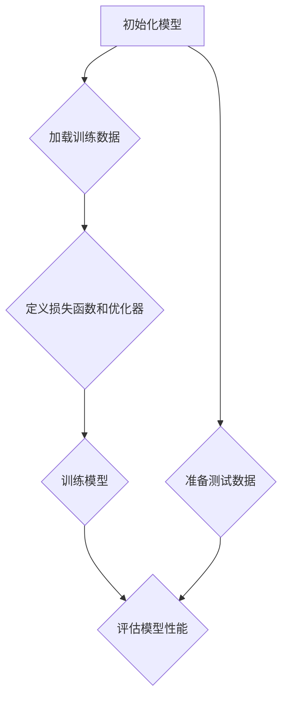

                 

### 《软件 2.0 的伦理规范：人工智能的责任》

> 关键词：软件 2.0、人工智能伦理、责任、法规、人机交互、数据伦理、工作伦理

> 摘要：本文深入探讨了软件 2.0 的伦理规范及其在人工智能（AI）领域的应用。随着软件从 1.0 向 2.0 的演进，AI 技术的快速发展和广泛应用，使得伦理问题愈发重要。本文首先介绍了软件 2.0 和 AI 的基本概念及其关联，随后详细阐述了 AI 伦理的基本原则，包括可靠性、公平性、透明性和可控性。接着，本文探讨了 AI 伦理的主要领域，如人机交互、数据伦理和工作伦理，并通过案例分析了成功与失败的伦理实践。此外，本文还讨论了 AI 伦理法规与政策，以及未来 AI 伦理的发展趋势。最后，本文提出了构建 AI 伦理框架、AI 伦理教育与普及以及 AI 伦理在实际应用中的策略和建议。

## 第一部分：引言

### 1.1 软件发展的历史与现状

#### 1.1.1 软件从 1.0 到 2.0 的演变

软件的发展历程可以分为多个阶段，从最初的软件 1.0 到现在的软件 2.0。软件 1.0 时代主要特点是简单的程序和脚本，它们以单个程序的形式运行，功能相对单一，且主要依赖于个人计算机。随着计算机技术和互联网的迅速发展，软件 1.0 开始逐渐向软件 2.0 演变。

软件 2.0 的概念最早由 Martin Fowler 提出，它指的是一种以网络为中心、服务导向的软件开发模式。与软件 1.0 不同，软件 2.0 更注重软件作为服务和平台的作用，强调软件的可扩展性、可重用性和协作性。软件 2.0 的核心特征包括：

1. **服务导向架构（SOA）**：软件 2.0 基于服务导向架构，将软件系统分解为独立的、可重用的服务模块，这些服务通过标准化接口进行通信，从而提高了系统的灵活性和可维护性。
2. **云计算和分布式计算**：软件 2.0 利用了云计算和分布式计算技术，使得软件可以弹性扩展、按需分配资源，从而提高了系统的性能和可靠性。
3. **用户体验**：软件 2.0 更加注重用户体验，通过提供高质量的界面设计和丰富的交互功能，使用户能够更轻松地使用软件。
4. **平台化**：软件 2.0 强调软件作为平台的作用，为第三方开发者提供了丰富的开发工具和接口，从而促进了生态系统的繁荣。

#### 1.1.2 AI 技术的快速发展及其影响

人工智能（AI）技术的发展是软件 2.0 时代的重要驱动力之一。AI 技术的快速进步带来了许多变革性影响，包括：

1. **自动化和智能化**：AI 技术的应用使得许多传统任务可以自动化和智能化，从而提高了生产效率和准确性。例如，自动驾驶汽车、智能助手和自动化生产线等。
2. **数据驱动决策**：AI 技术可以处理和分析大量数据，帮助企业和组织做出更明智的决策。通过机器学习和数据挖掘技术，企业可以从数据中提取有价值的信息，优化业务流程和策略。
3. **个性化体验**：AI 技术可以根据用户的行为和偏好，提供个性化的体验和服务。例如，推荐系统、个性化广告和智能推荐等。
4. **人机协作**：AI 技术与人类的协作可以提高工作效率和质量。通过人机交互，人类可以更好地利用 AI 的能力，同时 AI 也可以从人类的学习和反馈中不断优化自身。

AI 技术的快速发展对软件 2.0 产生了深远的影响。首先，AI 技术的应用使得软件系统更加智能化和自动化，提高了系统的性能和用户体验。其次，AI 技术的集成使得软件系统可以更好地处理和分析海量数据，从而实现更精确的预测和决策。此外，AI 技术的兴起也推动了软件生态系统的创新和发展，吸引了更多的开发者和技术人才。

总的来说，软件 2.0 的伦理规范在 AI 技术快速发展的背景下具有重要意义。随着 AI 技术的广泛应用，伦理问题日益凸显，如何确保 AI 技术的安全、可靠和公平使用成为了一个亟待解决的关键问题。本文将详细探讨 AI 伦理的基本原则和主要领域，以及 AI 伦理法规与政策，旨在为软件 2.0 时代的伦理规范提供指导和借鉴。

### 1.2 AI 伦理的重要性

#### 1.2.1 伦理学的概述

伦理学是研究道德规范、道德价值和道德原则的学科，旨在探讨人类行为的道德标准和道德责任。伦理学涉及多个领域，包括道德哲学、社会伦理、临床伦理、环境伦理等。在人工智能领域，伦理学扮演着重要的角色，因为 AI 技术的应用对社会、经济和个人生活产生了深远的影响。

伦理学的基本概念包括道德原则、道德规范和道德判断。道德原则是指导行为的普遍规则，例如公平性、尊重、责任等。道德规范是具体的行动指南，例如不欺骗、不伤害他人等。道德判断是对行为是否道德的评估，通常基于道德原则和规范。

在 AI 伦理中，伦理学的基本概念被用来评估 AI 系统的设计、开发和应用。伦理学为 AI 研究提供了道德框架，帮助识别和解决 AI 技术带来的伦理问题，确保 AI 技术的安全、可靠和公正使用。

#### 1.2.2 AI 伦理的研究领域

AI 伦理的研究领域非常广泛，涉及多个交叉学科，包括计算机科学、哲学、心理学、社会学、法学等。以下是一些主要的 AI 伦理研究领域：

1. **隐私与数据伦理**：AI 系统通常需要处理大量个人数据，因此隐私保护和数据伦理成为 AI 伦理研究的重要领域。这包括数据收集、存储、处理和共享的道德原则，以及数据主体权利的保护。

2. **公平与偏见**：AI 系统的决策过程可能会导致不公平和偏见，例如性别、种族或社会经济地位的偏见。研究如何设计公平的 AI 系统是 AI 伦理的核心问题。

3. **透明性与可解释性**：AI 系统的决策过程通常是非透明的，这引发了关于系统透明性和可解释性的讨论。研究如何提高 AI 系统的可解释性，使人们能够理解系统的决策过程，是 AI 伦理的重要方向。

4. **人机协作**：AI 系统与人类的协作带来了新的伦理挑战，例如责任分配、决策权分配和职业伦理。研究如何建立有效的人机协作机制，确保人类在决策过程中发挥主导作用，是 AI 伦理研究的一个重要领域。

5. **安全性与可靠性**：确保 AI 系统的安全性和可靠性是 AI 伦理的核心问题。这包括设计安全防御机制，以防止恶意攻击和意外故障，以及确保 AI 系统在运行过程中不会造成负面影响。

6. **法律与政策**：AI 伦理研究还包括探讨如何制定合适的法律和政策，以规范 AI 技术的开发和应用。这包括隐私法、消费者保护法、就业法等，以及如何协调不同国家和地区的法律差异。

#### 1.2.3 AI 伦理与软件 2.0 的关联

AI 伦理与软件 2.0 有着密切的关联。软件 2.0 强调软件作为服务和平台的作用，这使得 AI 技术的应用更加广泛和深入。以下是一些 AI 伦理与软件 2.0 的关联：

1. **服务导向架构**：软件 2.0 的服务导向架构为 AI 技术的应用提供了基础设施。通过服务化的方式，AI 技术可以更方便地集成到软件系统中，提供个性化的服务和解决方案。

2. **数据共享与开放**：软件 2.0 强调数据的开放和共享，这为 AI 技术的数据驱动决策提供了丰富的资源。然而，这也带来了数据隐私和安全的问题，需要通过伦理原则来确保数据的合理使用和保护。

3. **用户参与与反馈**：软件 2.0 更加注重用户体验和用户参与，这使得 AI 技术可以更好地与用户互动和协作。通过用户的反馈和参与，AI 系统可以不断优化和改进，提高其性能和满意度。

4. **社会责任与伦理**：软件 2.0 时代的软件系统对社会和经济产生了深远的影响。AI 伦理的研究旨在确保软件 2.0 时代的技术发展不会对社会产生负面影响，促进可持续发展和社会公平。

总之，AI 伦理在软件 2.0 时代具有重要意义。随着 AI 技术的快速发展和广泛应用，伦理问题日益凸显，需要通过伦理研究来解决和应对。AI 伦理不仅有助于确保 AI 技术的安全、可靠和公正使用，还有助于推动软件 2.0 时代的可持续发展和社会进步。

### 1.3 本书结构概述

#### 1.3.1 主要内容与目标

本书的主要目标是深入探讨软件 2.0 时代的伦理规范，特别是在人工智能（AI）领域的应用。全书分为三个主要部分，分别从基础理论、应用实践和未来展望三个方面展开讨论。

第一部分：软件 2.0 与 AI 伦理基础
- 第1章介绍软件 2.0 的基本概念和 AI 伦理的重要性；
- 第2章详细阐述 AI 伦理的基本原则，如可靠性、公平性、透明性和可控性；
- 第3章探讨 AI 伦理的主要领域，包括人机交互、数据伦理和工作伦理。

第二部分：AI 伦理案例分析与实践
- 第4章分析 AI 伦理的成功与失败案例，总结经验教训；
- 第5章讨论 AI 伦理法规与政策，介绍国际和国内的 AI 伦理法规体系；
- 第6章展望 AI 伦理的未来趋势，探讨 AI 伦理面临的挑战和发展方向。

第三部分：AI 伦理实践与教育
- 第7章提出构建 AI 伦理框架的策略；
- 第8章讨论 AI 伦理教育与普及的方法和途径；
- 第9章介绍 AI 伦理在实际应用中的具体策略和最佳实践。

通过本书的阅读，读者可以全面了解 AI 伦理的基本理论和实践方法，为软件 2.0 时代的技术发展提供伦理指导。

#### 1.3.2 阅读建议

为了更好地理解和应用本书的内容，读者可以按照以下建议进行阅读：

1. **系统学习**：本书按章节顺序系统介绍了软件 2.0 与 AI 伦理的相关知识，建议读者按照章节顺序逐步阅读，以建立完整的知识体系。

2. **结合实际**：在阅读过程中，可以结合实际案例和项目进行思考，加深对理论知识的理解和应用。

3. **深入探讨**：对于感兴趣的部分，可以进一步查阅相关文献和资料，进行深入探讨和研究。

4. **实践应用**：尝试将所学知识应用于实际项目中，通过实践来提高对 AI 伦理的理解和运用能力。

5. **参与讨论**：加入相关的学术社群和技术论坛，与其他读者和专家进行讨论和交流，分享学习心得和经验。

通过以上的阅读建议，读者可以更加有效地学习和掌握 AI 伦理的知识，为软件 2.0 时代的技术发展做出贡献。

## 第二部分：软件 2.0 与 AI 伦理基础

### 2.1 软件定义的扩展

#### 2.1.1 软件作为服务和平台

软件 2.0 的核心概念之一是软件作为服务和平台。这一理念打破了传统软件作为一种独立的、静态的应用程序的限制，将软件视为一种动态的、可扩展的服务，能够为用户提供灵活、高效和个性化的服务。

首先，软件作为服务（Software as a Service，SaaS）是软件 2.0 的重要表现形式。SaaS 模式下，软件不再是用户购买和安装在自己的计算机上，而是通过网络订阅和使用。这种模式具有许多优势，包括降低成本、提高灵活性和易于维护。通过云服务，SaaS 软件可以随时随地访问，为用户提供了极大的便利。

其次，软件作为平台（Platform as a Service，PaaS）进一步扩展了软件的应用范围。PaaS 提供了一个开发和部署应用程序的环境，使开发者可以更加专注于业务逻辑的实现，而无需关心底层基础设施的维护和管理。PaaS 平台通常包括开发工具、数据库、中间件等，为开发者提供了全面的开发支持。

#### 2.1.2 软件复杂性管理

软件 2.0 时代，随着系统的规模和复杂性不断增加，如何有效地管理软件复杂性成为一个重要问题。复杂性管理包括两个方面：技术层面的复杂性管理和组织层面的复杂性管理。

**技术层面的复杂性管理**：
1. **模块化**：通过将系统划分为多个模块，每个模块负责特定的功能，从而降低系统的复杂性。模块化不仅提高了系统的可维护性，还有助于实现代码的重用。
2. **标准化**：通过制定统一的接口和协议，实现不同模块之间的松耦合，从而降低模块之间的依赖关系，提高系统的灵活性。
3. **自动化**：利用自动化工具和流程，如持续集成和持续交付（CI/CD），自动化测试和部署，减少人为干预，提高系统的稳定性和可靠性。

**组织层面的复杂性管理**：
1. **敏捷开发**：采用敏捷开发方法，通过短周期的迭代和反馈机制，快速响应变化，降低开发过程中的不确定性。
2. **DevOps**：结合开发（Development）和运维（Operations），实现开发、测试和运维的紧密结合，提高系统的交付质量和效率。
3. **团队合作**：建立跨职能的团队，促进不同部门和角色之间的沟通与协作，共同应对复杂性问题。

通过技术和管理层面的复杂性管理，软件 2.0 时代可以有效应对软件系统的复杂性挑战，确保系统的稳定运行和持续发展。

### 2.2 AI 在软件 2.0 中的应用

#### 2.2.1 AI 与软件 2.0 的融合

人工智能（AI）与软件 2.0 的融合，极大地提升了软件系统的智能化水平，推动了软件 2.0 时代的发展。AI 技术在软件 2.0 中的应用主要体现在以下几个方面：

1. **个性化推荐**：通过分析用户的历史行为和偏好，AI 可以为用户提供个性化的推荐服务，如个性化广告、个性化购物推荐等。这提高了用户体验，增强了用户粘性。
2. **自动化决策**：AI 技术可以帮助软件系统实现自动化决策，如智能调度、智能路由、智能风控等。这提高了系统的效率和准确性，降低了运营成本。
3. **智能客服**：AI 技术可以应用于智能客服系统，通过自然语言处理和机器学习算法，实现与用户的智能对话，提供高效、准确的客户服务。
4. **智能监控与运维**：AI 技术可以用于智能监控和运维，通过对系统运行数据的实时分析，预测故障、识别异常，从而实现主动维护和优化。

#### 2.2.2 软件 2.0 对 AI 的期望

软件 2.0 时代对 AI 技术提出了更高的期望，主要体现在以下几个方面：

1. **可解释性**：软件 2.0 强调透明性和可解释性，用户和开发者希望了解 AI 系统的决策过程。因此，AI 技术需要提高其可解释性，使其决策过程更加透明和可靠。
2. **可靠性**：AI 技术在软件 2.0 中的应用需要具备高度的可靠性。AI 系统必须在各种复杂和多变的环境下保持稳定运行，确保不会出现错误或故障。
3. **安全性**：随着 AI 技术的广泛应用，安全性成为了一个关键问题。软件 2.0 需要确保 AI 系统的安全，防止恶意攻击和数据泄露。
4. **可扩展性**：软件 2.0 需要能够灵活地扩展和适应，以满足不断变化的需求。AI 技术需要具备良好的可扩展性，能够快速适应新的应用场景。
5. **易用性**：AI 技术的应用需要易于使用和部署，以降低使用门槛，提高用户满意度。

总之，AI 与软件 2.0 的融合为软件系统带来了巨大的变革和机遇。软件 2.0 对 AI 技术提出了更高的期望，推动了 AI 技术的不断进步和优化。在未来的发展中，AI 技术将继续与软件 2.0 深度结合，为人类创造更智能、更高效、更安全的技术环境。

#### 2.3 伦理在软件 2.0 中的应用

#### 2.3.1 伦理原则在软件开发中的重要性

在软件 2.0 时代，伦理原则在软件开发中扮演着至关重要的角色。随着软件系统的复杂性和应用范围的不断扩大，软件不再仅仅是技术问题，更涉及到社会、经济和个人生活。因此，软件开发过程中的伦理考量成为确保技术发展与社会需求相协调的关键。

首先，伦理原则为软件开发提供了道德指导。在软件开发过程中，开发者需要遵守一系列伦理原则，如尊重用户隐私、确保数据安全、避免偏见和歧视等。这些原则有助于开发者做出正确的道德决策，避免在技术发展中造成负面影响。

其次，伦理原则有助于提升软件的信任度和公信力。随着用户对软件系统的依赖程度不断增加，用户对软件的信任成为关键。伦理原则的遵循可以增强用户对软件系统的信任，从而提高软件的市场竞争力。

此外，伦理原则在软件质量管理中也起着重要作用。通过伦理考量，开发者可以识别和规避潜在的道德风险，提高软件的质量和安全性。伦理原则的融入有助于确保软件系统的可靠性和稳定性，降低技术风险。

#### 2.3.2 伦理原则与 AI 的整合

在软件 2.0 时代，人工智能（AI）技术的快速发展使得伦理原则与 AI 的整合变得尤为重要。AI 技术在软件中的应用不仅带来了技术上的革新，也引发了一系列伦理问题，如数据隐私、公平性、透明性和可控性等。因此，将伦理原则与 AI 技术相结合，有助于解决这些伦理挑战，确保 AI 技术的可持续发展。

1. **数据隐私**：AI 技术在数据处理和分析中扮演着重要角色，但同时也面临数据隐私的挑战。伦理原则要求开发者尊重用户的隐私权，确保数据收集、存储和处理过程的透明性和合法性。为此，可以采用数据加密、匿名化处理等技术手段，降低数据泄露的风险。

2. **公平性**：AI 系统的决策过程可能会导致不公平和偏见，例如性别、种族或社会经济地位的偏见。伦理原则强调公平性，要求开发者设计无偏见的 AI 系统，确保所有人都能公平地享受技术带来的便利。为此，可以采用公平性评估和算法优化等方法，提高 AI 系统的公平性。

3. **透明性**：AI 系统的决策过程通常是非透明的，这引发了关于系统透明性的讨论。伦理原则要求 AI 系统的可解释性和透明性，使人们能够理解系统的决策过程。为此，可以开发可解释性算法和可视化工具，提高 AI 系统的透明性。

4. **可控性**：确保 AI 系统的可控性是伦理原则的重要内容。开发者需要设计可控的 AI 系统，确保系统在运行过程中不会产生不可预见的负面影响。为此，可以采用监督机制、应急响应计划和责任归属机制等，提高 AI 系统的可控性。

通过将伦理原则与 AI 技术相结合，可以确保 AI 技术的可持续发展，实现技术与社会需求的平衡。伦理原则不仅为 AI 技术的发展提供了道德指导，也为社会公众对 AI 技术的接受和信任提供了保障。在软件 2.0 时代，伦理原则与 AI 的整合将成为推动技术进步和社会发展的关键因素。

### 2.4 AI 伦理的基本原则

AI 伦理的基本原则是确保人工智能（AI）技术安全、可靠和公正使用的关键。这些原则为 AI 系统的设计、开发和部署提供了道德指导，帮助解决 AI 技术引发的各种伦理问题。以下将详细探讨四个核心的 AI 伦理基本原则：可靠性、公平性、透明性和可控性。

#### 3.1 可靠性

可靠性是 AI 系统最基本的伦理原则之一。一个可靠的 AI 系统应能够在各种复杂和多变的环境中稳定运行，确保不会产生错误或意外结果。以下是一些实现可靠性的关键要素：

1. **系统稳定性**：AI 系统必须在各种条件下保持稳定，包括硬件故障、网络中断和极端环境等。为了提高系统的稳定性，开发者可以采用冗余设计、故障检测和恢复机制等技术。
2. **错误处理**：AI 系统需要具备强大的错误处理能力，能够识别并纠正错误，确保系统的正常运行。这可以通过实时监控、异常检测和自动恢复等技术实现。
3. **安全防御**：AI 系统应具备有效的安全防御机制，防止恶意攻击和非法操作。安全防御措施包括访问控制、数据加密和入侵检测等。

#### 3.1.1 AI 系统的可靠性要求

为了确保 AI 系统的可靠性，需要从以下几个方面进行要求：

1. **准确性**：AI 系统的输出结果应具有较高的准确性，确保其能够正确地处理输入数据并生成可靠的预测或决策。
2. **一致性**：AI 系统在不同环境和条件下应表现出一致性，确保其决策过程不会因为外部因素而改变。
3. **鲁棒性**：AI 系统应具备较强的鲁棒性，能够在处理噪声数据、异常值和非预期输入时保持稳定。
4. **实时性**：对于实时应用的 AI 系统，如自动驾驶和实时监控，要求系统能够在短时间内完成计算和响应。

#### 3.1.2 系统故障与风险

尽管 AI 系统的可靠性要求很高，但在实际应用中，系统故障和风险仍然是不可避免的问题。以下是一些常见的系统故障和风险：

1. **硬件故障**：硬件设备可能因老化、损坏或维护不当而出现故障，导致 AI 系统无法正常运行。
2. **数据问题**：数据质量问题，如缺失、错误或不一致性，可能影响 AI 系统的性能和可靠性。
3. **算法缺陷**：AI 算法的缺陷可能导致系统产生错误或异常结果，甚至引发严重的安全风险。
4. **网络中断**：网络故障或中断可能导致 AI 系统无法访问必要的数据或资源，影响其正常运行。

为了降低系统故障和风险，需要采取一系列措施，包括：

1. **冗余设计**：通过冗余设计，如备份硬件和备用系统，确保在主系统故障时能够迅速切换到备用系统，减少系统停机时间。
2. **实时监控**：实时监控系统的运行状态，及时发现并处理异常情况，防止故障扩大。
3. **数据质量管理**：确保数据的质量，通过数据清洗、去重和标准化等技术手段，减少数据问题对系统的影响。
4. **安全测试**：定期进行安全测试和漏洞扫描，及时发现和修复系统中的安全隐患。

通过上述措施，可以提高 AI 系统的可靠性，降低故障和风险，确保其在各种复杂和多变的环境中稳定运行。

#### 3.2 公平性

公平性是 AI 伦理的核心原则之一，要求 AI 系统在决策过程中对所有人公平对待，避免因种族、性别、年龄等因素产生的歧视和偏见。以下将详细探讨公平性的含义、具体要求和实现方法。

#### 3.2.1 非歧视与平等机会

非歧视原则是公平性的核心，要求 AI 系统在处理数据和应用算法时，不因个体的种族、性别、年龄、宗教信仰等因素产生歧视。平等机会原则则强调，所有人应该有公平的机会享受技术带来的好处，不受不公正的对待。

1. **非歧视**：AI 系统应避免基于个体特征进行歧视性决策。例如，在招聘系统中，算法不应基于种族或性别等因素对候选人进行筛选，确保每个候选人都有公平的竞争机会。
2. **平等机会**：AI 技术的应用应促进社会的平等机会，减少社会不公。例如，在教育领域中，AI 可以提供个性化的学习建议，帮助不同背景的学生获得更好的学习效果。

#### 3.2.2 避免偏见

AI 系统的偏见问题源于训练数据和算法设计。为了避免偏见，需要从以下几个方面进行努力：

1. **数据多样化**：确保训练数据具有代表性，涵盖不同性别、种族、地域等特征，避免数据偏差。通过多样化数据集，可以提高模型的公平性和准确性。
2. **算法公平性**：在算法设计过程中，应考虑公平性原则，避免算法引入偏见。例如，可以通过公平性评估方法，识别和修正算法中的偏见。
3. **透明性**：提高 AI 系统的可解释性，使人们能够理解系统的决策过程，从而发现并修正潜在偏见。透明性有助于增强用户对 AI 系统的信任。

#### 3.2.3 公平性的实现方法

为了实现 AI 系统的公平性，可以采用以下方法：

1. **算法优化**：通过算法优化，提高模型在多样性数据集上的性能，减少因数据偏差导致的偏见。例如，可以使用平衡采样、加权重采样等技术手段，优化训练数据集的代表性。
2. **公平性评估**：在 AI 系统部署前，进行公平性评估，检测算法是否具有歧视性。公平性评估可以采用指标如公平性分数、偏置分析等，帮助识别和修正偏见。
3. **持续监控**：在 AI 系统运行过程中，持续监控其公平性，及时发现并解决潜在的问题。通过实时监控和反馈机制，确保系统在长期运行中保持公平。

总之，公平性是 AI 伦理的重要原则，要求 AI 系统在决策过程中对所有个体公平对待。通过非歧视、平等机会和避免偏见等措施，可以实现 AI 系统的公平性，促进技术和社会的可持续发展。

#### 3.3 透明性

透明性是 AI 伦理的另一个核心原则，要求 AI 系统的决策过程对用户和开发者都应该是可理解和解释的。透明性对于建立用户对 AI 系统的信任、确保系统的公正性和可追溯性至关重要。

#### 3.3.1 系统决策过程的透明性

AI 系统的决策过程通常涉及复杂的算法和大量的数据，这使得决策过程变得非透明。为了提高透明性，可以从以下几个方面入手：

1. **算法透明性**：开发者应明确 AI 系统所采用的算法和模型，并解释算法的原理和逻辑。通过文档化、可视化和示例代码，使开发者和其他利益相关者能够理解算法的工作机制。
2. **数据透明性**：确保训练数据集和输入数据的透明性，包括数据的来源、采集方式和处理过程。透明性有助于用户和监管机构评估系统的准确性和可靠性。
3. **结果透明性**：展示 AI 系统的决策结果和预测结果，并解释这些结果的依据。通过可视化工具，如决策树、混淆矩阵和影响图，可以帮助用户理解系统决策的细节。

#### 3.3.2 AI 系统的可解释性

可解释性是透明性的关键组成部分，要求 AI 系统能够解释其决策过程和输出结果。以下是一些提高 AI 系统可解释性的方法：

1. **解释性算法**：开发可解释性算法，如决策树、线性回归和规则基方法，这些算法的结构相对简单，易于理解。虽然这些算法在性能上可能不如深度学习等复杂模型，但它们在解释性方面具有显著优势。
2. **模型简化**：对复杂的模型进行简化，使其更加易于理解。例如，可以采用降维技术，如主成分分析（PCA），将高维数据简化为低维数据，从而降低模型的复杂性。
3. **可视化工具**：开发可视化工具，如热力图、影响图和决策路径图，帮助用户直观地理解 AI 系统的决策过程。这些工具可以展示变量之间的关系和重要特征，提高系统的透明性。

#### 3.3.3 透明性的重要性

透明性在 AI 伦理中具有重要性，原因如下：

1. **用户信任**：透明性有助于建立用户对 AI 系统的信任，用户能够理解系统的决策过程和结果，从而减少对系统的抵触情绪。
2. **监管合规**：透明性有助于 AI 系统符合法律法规和监管要求，确保系统的公正性和合规性。
3. **技术进步**：透明性促进技术交流和知识共享，有助于其他研究者学习、改进和优化 AI 系统。

总之，透明性是 AI 伦理的重要原则，通过提高系统的可解释性和透明性，可以增强用户信任、确保系统的公正性和合规性，推动 AI 技术的可持续发展。

### 3.4 可控性

可控性是 AI 伦理的核心原则之一，要求 AI 系统在运行过程中应具备足够的控制能力，确保其行为符合预期，避免不可预见的负面影响。以下将详细探讨 AI 系统的可控性要求、监管和控制机制以及责任归属问题。

#### 3.4.1 AI 系统的监管和控制

为了确保 AI 系统的可控性，需要建立有效的监管和控制机制，包括以下几个方面：

1. **监控和审计**：对 AI 系统的运行状态进行实时监控和审计，及时发现和纠正异常行为。监控和审计可以包括数据监控、算法监控和系统监控等，确保系统在运行过程中不会出现偏差或故障。
2. **安全防御**：建立多层次的安全防御体系，防止外部攻击和内部违规行为。安全防御措施可以包括访问控制、数据加密、入侵检测和防火墙等，确保系统的安全性。
3. **应急响应**：制定应急响应计划和流程，确保在系统出现故障或异常时，能够迅速采取行动，最大限度地减少损失和影响。应急响应措施可以包括故障排查、系统重启和备份恢复等。
4. **合规性检查**：确保 AI 系统符合相关法律法规和行业标准，避免违法行为。合规性检查可以包括数据保护、隐私保护和公平性检查等。

#### 3.4.2 控制机制的设计原则

设计 AI 系统的控制机制时，应遵循以下原则：

1. **可扩展性**：控制机制应具备良好的可扩展性，能够适应不同应用场景和系统规模的需求，确保在不同环境下都能有效运行。
2. **灵活性**：控制机制应具有灵活性，能够根据实际情况进行调整和优化，确保系统在变化的环境中保持稳定运行。
3. **易用性**：控制机制应易于使用和操作，降低使用门槛，使开发者和其他利益相关者能够方便地理解和控制 AI 系统。
4. **透明性**：控制机制的设计应具有高透明性，使相关人员能够了解系统的工作原理和运行状态，从而增强对系统的信任。

#### 3.4.3 责任归属

在 AI 系统中，责任归属问题是一个复杂且具有争议的话题。以下是一些关于责任归属的讨论：

1. **开发者责任**：AI 系统的开发者应承担主要责任，确保系统在设计和开发过程中符合伦理标准和法律法规。开发者需要确保系统具有可靠性、透明性和可控性，并在系统运行过程中进行持续的监控和维护。
2. **用户责任**：用户在使用 AI 系统时，应承担一定的责任，确保其行为符合系统的使用规范，不滥用系统功能或数据。用户需要了解系统的运行原理和潜在风险，合理使用系统资源。
3. **企业责任**：企业在开发和部署 AI 系统时，应承担社会责任，确保系统的公平性和透明性，不损害公共利益。企业需要建立完善的管理机制，对系统运行进行监督和评估，确保系统符合伦理标准和法律法规。
4. **监管机构责任**：监管机构应加强对 AI 系统的监管，确保系统符合伦理标准和法律法规。监管机构需要制定相关政策和标准，对 AI 系统进行审查和评估，防范潜在风险。

总之，可控性是 AI 伦理的核心原则之一，通过建立有效的监管和控制机制，明确责任归属，可以确保 AI 系统的安全、可靠和公正使用，促进 AI 技术的可持续发展。

### 4.1 人机交互伦理

#### 4.1.1 人机交互中的伦理问题

在人机交互（HCI）领域，伦理问题日益凸显，因为人机交互技术广泛应用于各种场景，从消费电子产品到医疗设备，再到智能交通和自动驾驶。以下是一些关键的人机交互伦理问题：

1. **隐私保护**：在数字化时代，个人隐私受到前所未有的威胁。人机交互技术往往依赖于收集和分析大量用户数据，这可能导致用户隐私泄露。例如，智能手机和应用程序可能会收集用户的地理位置、通讯记录和浏览历史，如果没有适当的隐私保护措施，这些数据可能被滥用。
2. **用户控制权**：人机交互系统应确保用户对其数据的控制权。用户应能够选择是否分享数据、如何使用数据以及数据存储的位置。如果用户对数据的使用没有足够的控制权，可能会导致用户隐私被侵犯。
3. **透明性**：人机交互系统的决策过程应透明，用户应能够理解和预测系统的行为。如果系统的决策过程是不透明的，用户可能会感到无助和恐惧，从而影响其使用体验。
4. **偏见与歧视**：人机交互系统可能会因为设计缺陷或训练数据的问题而产生偏见和歧视。例如，语音助手可能会对某些性别、种族或年龄的用户表现出不公平的行为。
5. **安全性**：人机交互系统应具备高水平的安全性，防止黑客攻击和数据泄露。如果系统安全性不足，可能会给用户带来财产损失和隐私泄露的风险。

#### 4.1.2 人机协作的伦理规范

为了解决上述伦理问题，需要制定一系列伦理规范，以指导人机协作的发展。以下是一些关键的人机协作伦理规范：

1. **用户隐私保护**：在设计人机交互系统时，应采取严格的隐私保护措施。这包括数据加密、匿名化处理和用户同意机制。用户应在明确了解数据用途的情况下，自愿分享数据。
2. **用户控制权**：人机交互系统应提供用户数据控制功能，使用户能够方便地管理其数据，包括数据的访问、修改和删除。此外，系统应提供清晰的隐私政策，使用户了解其数据如何被使用。
3. **透明性与可解释性**：人机交互系统的决策过程应透明，用户应能够理解系统的行为和决策依据。系统应提供可解释性工具，如决策树、可视化图表等，帮助用户了解系统的运作机制。
4. **公平性与无偏见**：在设计人机交互系统时，应避免偏见和歧视。系统应基于多样化的数据集进行训练，确保其公平性。此外，系统应定期进行公平性评估，及时发现和修正潜在的偏见。
5. **安全性**：人机交互系统应具备高水平的安全性，防止黑客攻击和数据泄露。这包括实施访问控制、数据加密和安全审计等措施。

通过遵守这些伦理规范，人机交互系统可以更好地保护用户隐私、增强用户控制权、提高透明性和安全性，从而实现人机协作的良性发展。

### 4.2 数据伦理

#### 4.2.1 数据隐私保护

数据隐私保护是数据伦理的核心问题之一，特别是在人工智能（AI）和大数据技术飞速发展的今天。数据隐私保护的重要性体现在以下几个方面：

1. **个人信息保护**：随着互联网和智能设备的普及，个人信息变得越来越容易被收集、存储和分析。个人数据，如姓名、地址、身份证号码、生物特征等，如果未经授权被泄露或滥用，可能会导致严重的隐私侵害和财产损失。
2. **商业竞争力**：企业收集和使用大量用户数据，用于市场分析、产品开发和个性化推荐。如果数据隐私保护不足，企业可能会失去用户的信任，损害其商业竞争力。
3. **法律责任**：多个国家和地区制定了严格的隐私保护法律法规，如欧盟的《通用数据保护条例》（GDPR）和美国的《加州消费者隐私法案》（CCPA）。企业如果不遵守这些法规，可能会面临巨额罚款和其他法律后果。

为了有效保护数据隐私，可以采取以下措施：

1. **数据加密**：对敏感数据进行加密，确保只有授权用户才能访问。数据加密是保护数据隐私的基本手段，可以防止数据在传输和存储过程中被窃取或篡改。
2. **数据匿名化**：通过技术手段，如数据去标识化、伪名化和聚合分析，将个人数据匿名化，从而保护用户隐私。匿名化处理可以确保数据分析的准确性和有效性，同时降低隐私风险。
3. **用户同意与透明度**：确保用户在数据收集和使用前明确知晓其数据将被如何使用，并取得用户的明确同意。同时，提供清晰的隐私政策，使用户了解其权利和义务。
4. **数据最小化原则**：遵循数据最小化原则，只收集和存储必要的数据，避免过度收集。减少数据量可以降低隐私泄露的风险，同时提高数据处理效率和数据管理的可控性。
5. **定期审计与监控**：定期进行数据隐私审计，确保数据隐私保护措施的有效性。同时，建立监控机制，及时发现和应对潜在的隐私风险。

#### 4.2.2 数据利用与伦理责任

在数据伦理中，数据利用与伦理责任也是一个重要方面。数据的收集、存储、处理和应用都需要严格遵循伦理原则，以确保数据被用于正当和有益的目的。以下是一些关键的数据利用与伦理责任：

1. **数据用途的合法性**：确保数据收集和使用的目的是合法和合理的，不得用于非法或违反道德的活动。例如，医疗数据只能用于医疗研究和患者治疗，不得用于其他商业目的。
2. **数据共享的透明性**：在数据共享过程中，应确保透明性，明确数据共享的目的、范围和使用方式。同时，确保数据共享协议的合法性，保护数据共享各方的权益。
3. **数据安全和完整性**：确保数据在存储、传输和处理过程中保持安全和完整，防止数据泄露、丢失或篡改。数据安全和完整性是数据伦理的重要保障，也是企业社会责任的体现。
4. **责任归属的明确性**：在数据利用过程中，应明确各方的责任和角色，确保数据利用的合法性和合规性。例如，数据收集方、处理方和应用方应各自承担相应的责任，共同保障数据安全和隐私。
5. **社会责任和公平性**：在数据利用过程中，应考虑社会责任和公平性，确保数据被用于促进社会公共利益，而不是损害特定群体或个体的权益。例如，在公共健康数据的应用中，应确保数据被用于改善公共卫生状况，而不是用于商业目的。

通过严格遵守数据伦理原则，可以确保数据被用于正当和有益的目的，同时保护个人隐私和数据安全，推动数据技术的可持续发展。

### 4.3 工作伦理

#### 4.3.1 AI 对就业市场的影响

随着人工智能（AI）技术的飞速发展，其对社会各个方面产生了深远的影响，特别是对就业市场的影响。AI 技术的进步不仅改变了传统的工作模式，还带来了新的就业机会和挑战。

**就业机会的增加**：

1. **新兴职业**：AI 的发展催生了大量新兴职业，如数据科学家、机器学习工程师、AI 产品经理等。这些职业需要专业的技能和知识，为具备相关技能的人才提供了广阔的职业发展空间。
2. **AI 支持的职业**：AI 技术还增强了传统职业的工作效率，如医疗诊断、金融分析、客户服务等领域。这些职业虽然并未消失，但 AI 的应用使得工作内容和方式发生了变化。

**就业机会的减少**：

1. **自动化替代**：AI 技术的自动化能力使得许多重复性和低技能的工作变得多余。例如，制造业、仓储物流、客服等领域的大量工作岗位可能被机器人或自动化系统取代。
2. **就业结构变化**：随着 AI 技术的普及，就业市场的结构发生了变化。一些行业的工作岗位减少，而另一些行业的工作岗位增加。这可能导致劳动力市场的重新分配，部分劳动者需要重新培训以适应新的职业需求。

**挑战与应对策略**：

1. **技能升级与培训**：为了应对就业市场的变化，劳动者需要不断提升技能，特别是在数据分析和机器学习等 AI 相关领域。职业培训和教育项目可以帮助劳动者适应新的工作需求。
2. **职业转型与创业**：劳动者可以考虑职业转型，进入新的行业或领域。同时，创业也是一种应对就业市场变化的有效途径，可以创造新的就业机会。
3. **政策支持**：政府和企业应采取措施，促进 AI 技术的健康发展，并为劳动者提供必要的支持和资源，如职业培训、再就业服务和创业支持等。

总的来说，AI 对就业市场的影响是双重的，既带来了新的就业机会，也带来了一定的挑战。通过提升技能、职业转型和政策支持，可以更好地应对这些变化，实现就业市场的稳定和可持续发展。

### 4.3.2 AI 伦理与职业道德

AI 伦理与职业道德在现代社会中愈发重要，特别是在 AI 技术日益深入人类生活的背景下。AI 伦理和职业道德不仅关乎技术的合法性和道德性，还涉及到对人类价值观和社会规范的尊重。

**AI 伦理的基本内容**：

AI 伦理包括一系列原则和规范，旨在确保 AI 技术的安全、可靠和公正使用。以下是几个关键内容：

1. **安全性**：确保 AI 系统在设计和应用过程中不会对人类造成危害。这包括对系统进行严格的测试和评估，确保其在各种环境下的稳定性和可靠性。
2. **公正性**：确保 AI 系统在决策过程中对所有人公平对待，避免因种族、性别、年龄等因素产生的歧视和偏见。
3. **透明性**：确保 AI 系统的决策过程透明，用户可以理解系统的行为和决策依据，从而增强对系统的信任。
4. **责任归属**：明确 AI 系统的责任归属，确保在出现问题时，相关责任方能够承担相应的责任。

**职业道德的核心原则**：

职业道德是个人和团体在职业活动中应遵循的行为规范，是职业精神的重要组成部分。以下是几个关键原则：

1. **诚实守信**：在职业活动中保持诚实，遵守承诺，不做虚假宣传或欺诈行为。
2. **尽职尽责**：认真履行职业责任，努力提高工作效率和质量，确保工作的合法性和道德性。
3. **尊重他人**：尊重同事、客户和其他利益相关者的权益，不歧视或伤害他人。
4. **持续学习**：不断学习新知识、新技术，提升自身能力，以适应不断变化的职业环境。

**AI 伦理与职业道德的融合**：

AI 伦理和职业道德的融合是确保 AI 技术健康发展的关键。以下是一些实现融合的策略：

1. **教育培训**：通过教育和培训，提高从业者对 AI 伦理和职业道德的认识和理解，培养具备道德素养的 AI 专业人才。
2. **企业文化建设**：企业应建立积极的职业道德文化，强调 AI 伦理的重要性，鼓励员工在职业活动中遵循道德规范。
3. **法律法规**：制定和遵守相关法律法规，确保 AI 技术的应用符合伦理和道德要求。
4. **公众参与**：鼓励公众参与 AI 伦理和职业道德的讨论，提高社会对 AI 技术的监督和参与，共同推动 AI 技术的可持续发展。

通过融合 AI 伦理和职业道德，可以确保 AI 技术的合法性和道德性，促进技术的健康发展和人类社会的繁荣。

### 5.1 成功案例分析

#### 5.1.1 AI 伦理成功应用的实例

AI 伦理在实践中的应用已经取得了一些显著的成功，以下列举了一些成功案例，并分析了其中的关键要素和伦理原则。

**案例 1：谷歌的 AI 伦理准则**

谷歌是全球领先的科技公司之一，其在 AI 领域的伦理实践受到广泛关注。谷歌在 2018 年发布了《AI 伦理准则》，该准则明确了 AI 应遵循的五个核心原则：

1. **公平性**：确保 AI 技术对所有人公平，不引入性别、种族或其他形式的偏见。
2. **透明性**：使 AI 系统的决策过程透明，用户可以理解 AI 的行为和决策依据。
3. **安全性**：确保 AI 系统在设计和应用过程中不会对人类造成危害。
4. **隐私保护**：尊重用户的隐私权，保护用户数据不被滥用。
5. **责任归属**：明确 AI 系统的责任归属，确保在出现问题时，相关责任方能够承担相应的责任。

谷歌的 AI 伦理准则在业界产生了深远的影响，成为许多公司制定 AI 伦理政策的参考。通过遵循这些原则，谷歌成功地将 AI 伦理融入到其产品和服务中，提高了用户对 AI 技术的信任和接受度。

**案例 2：微软的 AI 可解释性倡议**

微软在其 AI 产品和服务中强调可解释性，致力于提高 AI 系统的透明性和可理解性。微软发布了《AI 可解释性框架》，提出了四个关键步骤：

1. **问题定义**：明确 AI 系统的应用场景和目标。
2. **数据说明**：提供关于数据来源、处理过程和模型结构的详细说明。
3. **模型解释**：开发工具和算法，帮助用户理解 AI 系统的决策过程。
4. **结果评价**：评估 AI 系统的输出结果和实际应用效果。

微软的可解释性框架为开发者提供了实用的指导，有助于提高 AI 系统的透明性和可信度。通过这一框架，微软成功地将 AI 技术的应用与伦理原则相结合，为用户提供了更加可靠和透明的服务。

**关键要素和伦理原则**

从上述案例中，我们可以总结出几个关键要素和伦理原则，这些要素和原则在成功应用 AI 伦理中起到了重要作用：

1. **明确的伦理准则**：公司应制定明确的 AI 伦理准则，为 AI 技术的应用提供道德指导。
2. **透明性和可解释性**：确保 AI 系统的决策过程透明，用户可以理解和信任系统的行为。
3. **数据隐私保护**：尊重用户的隐私权，确保数据不被滥用。
4. **责任归属**：明确责任归属，确保在出现问题时，相关责任方能够承担相应的责任。
5. **公众参与和反馈**：鼓励公众参与 AI 伦理的讨论，收集多方面的意见和建议，提高 AI 技术的透明度和公信力。

通过遵循这些伦理原则，公司可以在 AI 技术的应用中取得成功，增强用户对 AI 技术的信任和接受度，推动技术的可持续发展。

### 5.2 失败案例分析

#### 5.2.1 AI 伦理失败的案例

尽管 AI 伦理在许多领域取得了显著的成功，但也不可避免地存在一些失败的案例。以下列举了几个 AI 伦理失败的案例，并分析了其中的关键问题及其教训。

**案例 1：亚马逊的招聘算法歧视**

亚马逊在招聘过程中使用了 AI 算法来筛选简历，但该算法在训练数据上存在性别偏见。研究表明，算法对女性申请者的评价普遍低于男性申请者，这导致了性别歧视的问题。这一事件引发了广泛的社会关注，亚马逊被迫暂停了该项目的使用。

**案例 2：谷歌图片搜索的偏见问题**

谷歌的图片搜索功能被发现存在种族偏见。当用户输入某些种族相关的关键词时，系统会自动推荐包含种族歧视内容的图片。这一发现引发了关于 AI 算法偏见和道德责任的讨论。

**案例 3：面部识别技术在监控中的应用**

面部识别技术在公共安全和监控领域得到了广泛应用，但也引发了许多伦理问题。一些研究表明，面部识别系统在识别有色人种时的准确率显著低于白人，这导致了种族歧视和不公正。

**关键问题**

从上述案例中，我们可以总结出几个关键问题：

1. **数据偏见**：AI 算法的训练数据中可能存在偏见，导致系统在决策过程中对某些群体产生不公平对待。例如，亚马逊的招聘算法因为训练数据中存在性别偏见，对女性申请者的评价较低。

2. **透明性不足**：AI 系统的决策过程通常缺乏透明性，使得用户难以理解系统的行为和决策依据。例如，谷歌图片搜索和面部识别系统在推荐和识别过程中缺乏透明性，用户无法得知系统如何做出决策。

3. **责任归属不明确**：在 AI 伦理失败案例中，责任归属问题常常不明确。例如，亚马逊和谷歌在面临性别歧视和种族偏见问题时，责任归属不明确，导致了公众的质疑和不满。

**教训**

从这些失败的案例中，我们可以吸取以下教训：

1. **数据多样性和公平性**：在训练数据的选择和处理过程中，应确保数据的多样性和公平性，避免引入偏见。例如，亚马逊应在招聘算法的训练数据中增加女性申请者的比例，提高算法的公平性。

2. **透明性和可解释性**：提高 AI 系统的透明性和可解释性，使用户能够理解和信任系统的行为。例如，谷歌可以在图片搜索和面部识别系统中增加透明性工具，帮助用户了解系统的决策过程。

3. **明确责任归属**：在 AI 技术的应用中，应明确责任归属，确保在出现问题时，相关责任方能够承担相应的责任。例如，亚马逊和谷歌应建立明确的伦理准则，明确责任归属，并在出现问题时及时采取措施。

通过吸取这些教训，我们可以避免 AI 伦理的失败，确保 AI 技术的安全、可靠和公正使用，推动技术的可持续发展。

### 6.1 国际与国内 AI 伦理法规概述

#### 6.1.1 国际法规对 AI 伦理的影响

随着人工智能（AI）技术的迅速发展，国际社会对 AI 伦理法规的关注日益增加。多个国家和地区已经制定了相关的法规和政策，旨在规范 AI 技术的研发和应用，保障人类社会的安全和公平。

**欧盟的《通用数据保护条例》（GDPR）**：

欧盟的《通用数据保护条例》（GDPR）是国际上最具影响力的数据保护法规之一。GDPR 主要关注个人数据的保护，规定了数据收集、存储、处理和传输的过程中的合规要求。GDPR 对 AI 伦理的影响主要体现在以下几个方面：

1. **数据隐私保护**：GDPR 强调对个人数据的保护，要求企业在处理个人数据时必须获得用户的明确同意，并采取严格的数据保护措施，确保数据不被滥用。
2. **透明性**：GDPR 要求企业在处理个人数据时提供清晰的隐私政策，使用户了解其数据将被如何使用。
3. **责任归属**：GDPR 明确了企业在数据隐私保护方面的责任，要求企业建立数据保护管理体系，并在出现数据泄露等事件时承担相应的法律责任。

**美国的《加州消费者隐私法案》（CCPA）**：

美国的《加州消费者隐私法案》（CCPA）是另一项重要的数据保护法规。CCPA 主要关注个人数据的收集、处理和共享，规定了消费者对个人数据的控制权。CCPA 对 AI 伦理的影响主要体现在以下几个方面：

1. **数据透明性**：CCPA 要求企业在收集和使用消费者数据时提供详细的披露，使消费者了解其数据将被如何使用。
2. **用户控制权**：CCPA 授予消费者对个人数据的控制权，包括数据访问、修改和删除的权利。
3. **责任归属**：CCPA 明确了企业在数据保护方面的责任，要求企业采取措施保护消费者数据，并在出现数据泄露等事件时承担相应的法律责任。

**其他国际法规**：

除了欧盟的 GDPR 和美国的 CCPA，其他国家也在积极制定相关的 AI 伦理法规。例如，中国的《个人信息保护法》（PIPL）和欧盟的《人工智能法案》都涉及到 AI 伦理的规范。这些法规主要关注数据保护、隐私权、透明性和责任归属等问题，为 AI 技术的健康发展提供了法律保障。

#### 6.1.2 国内 AI 伦理法规体系

在中国，随着 AI 技术的快速发展和广泛应用，政府高度重视 AI 伦理法规的建设。目前，中国已经出台了一系列与 AI 伦理相关的法规和政策，形成了较为完善的 AI 伦理法规体系。

**《个人信息保护法》（PIPL）**：

中国的《个人信息保护法》（PIPL）是数据保护领域的重要法规，于 2021 年 11 月 1 日正式实施。PIPL 主要关注个人信息的收集、处理和使用，规定了个人信息保护的基本原则和具体要求。PIPL 对 AI 伦理的影响主要体现在以下几个方面：

1. **数据隐私保护**：PIPL 明确了个人信息的定义和保护范围，要求企业在处理个人信息时必须遵守数据最小化、目的明确和合法使用等原则。
2. **用户控制权**：PIPL 授予用户对个人信息的控制权，包括信息访问、修改和删除的权利。
3. **责任归属**：PIPL 明确了企业在个人信息保护方面的责任，要求企业建立个人信息保护管理制度，并在出现个人信息泄露等事件时承担相应的法律责任。

**《新一代人工智能发展规划》**：

中国的《新一代人工智能发展规划》是关于 AI 发展的战略性文件，提出了 AI 发展的指导思想、战略目标、重点领域和政策措施。该规划明确提出了 AI 伦理的要求，强调在 AI 技术的研发和应用过程中，必须坚持伦理原则，保障人类社会的安全和公平。

**《人工智能伦理规范》**：

中国的《人工智能伦理规范》是针对 AI 伦理的具体指导文件，于 2021 年 7 月 1 日正式实施。该规范明确了 AI 伦理的基本原则和具体要求，包括安全性、可靠性、透明性、公正性、责任归属等方面。

**其他相关法规**：

除了《个人信息保护法》和《人工智能伦理规范》，中国还出台了一系列与 AI 伦理相关的法规和政策，如《网络安全法》、《数据安全法》等。这些法规共同构成了中国的 AI 伦理法规体系，为 AI 技术的健康发展提供了法律保障。

总之，国际和国内的 AI 伦理法规为 AI 技术的应用提供了重要的指导和规范。通过制定和执行这些法规，可以确保 AI 技术的安全、可靠和公正使用，推动 AI 技术的可持续发展。

### 6.2 法规实施与挑战

#### 6.2.1 法规执行中的难题

尽管国际和国内已经出台了多项 AI 伦理法规，但在实际执行过程中仍面临诸多挑战。以下是法规执行中的一些主要难题：

1. **法规适应性**：随着 AI 技术的快速发展，现有法规的适应性和灵活性不足，难以应对新兴的 AI 应用场景和挑战。例如，当前的隐私保护法规主要针对传统数据处理，但在面对复杂的 AI 算法和大数据应用时，可能无法提供充分的保护。

2. **法规一致性**：不同国家和地区之间的 AI 伦理法规存在差异，导致跨国 AI 应用中的合规难题。企业在全球范围内部署 AI 系统，需要遵循不同国家和地区的法规要求，这增加了合规成本和复杂性。

3. **执行监督**：法规的执行和监督需要强有力的监管机构和执行机制。然而，当前许多国家的监管机构和执行机制尚未完善，难以对 AI 系统进行有效监督和评估。

4. **法律责任界定**：在 AI 系统出现故障或伦理问题时，责任归属的界定往往存在困难。特别是在涉及多人合作和复杂技术的情况下，确定责任主体和责任范围变得复杂。

#### 6.2.2 法规对 AI 伦理实践的指导

为了克服上述挑战，法规对 AI 伦理实践的指导至关重要。以下是一些关键指导原则：

1. **数据隐私保护**：法规应明确数据隐私保护的具体要求和标准，确保在 AI 系统的整个生命周期中，从数据收集、处理到存储和销毁，都得到充分保护。

2. **透明性和可解释性**：法规应推动 AI 系统的透明性和可解释性，要求开发者提供清晰的算法说明和决策过程解释，使用户能够理解系统的行为和结果。

3. **公平性和无偏见**：法规应明确 AI 系统的公平性和无偏见要求，确保算法和模型在设计和训练过程中避免引入种族、性别等偏见，提高系统的公平性。

4. **责任归属**：法规应明确 AI 系统的责任归属，明确开发者、使用者和其他利益相关者的责任和角色，确保在出现问题时能够迅速有效地处理。

5. **持续监督与评估**：法规应建立持续监督与评估机制，确保 AI 系统在运行过程中符合伦理要求。监管机构应定期对 AI 系统进行审查和评估，及时发现和纠正潜在问题。

通过法规的有效实施和指导，可以提升 AI 伦理实践的规范性和可靠性，促进 AI 技术的安全、可靠和公正使用，实现技术的可持续发展。

### 7.1 AI 伦理发展展望

#### 7.1.1 未来 AI 伦理面临的挑战

随着人工智能（AI）技术的不断进步，AI 伦理的发展面临诸多挑战。以下将探讨未来 AI 伦理可能面临的主要挑战及其潜在影响。

1. **算法偏见和歧视**：随着 AI 算法的复杂性和多样性增加，算法偏见和歧视问题可能加剧。如果训练数据存在偏见，AI 系统可能会在决策过程中对特定群体产生不公平对待，从而加剧社会不平等。

2. **隐私侵犯**：AI 技术的广泛应用使得个人隐私面临更大的风险。从人脸识别到智能助手，AI 系统需要收集和处理大量的个人数据。如果隐私保护措施不足，可能导致个人隐私被滥用和泄露。

3. **透明性和可解释性**：当前许多 AI 系统的决策过程高度复杂，缺乏透明性和可解释性。用户和监管机构难以理解 AI 系统的决策依据，这可能影响系统的信任度和合规性。

4. **责任归属**：在 AI 系统出现故障或伦理问题时，责任归属问题仍然是一个难题。特别是在涉及多人合作和复杂技术的情况下，确定责任主体和责任范围变得复杂。

5. **安全性**：随着 AI 系统的广泛应用，其安全风险也日益增加。如果 AI 系统受到恶意攻击或错误操作，可能导致严重的安全事故，对社会和经济造成巨大影响。

#### 7.1.2 AI 伦理发展的方向

为了应对上述挑战，未来 AI 伦理的发展需要朝着以下几个方向努力：

1. **公平性和无偏见**：推动 AI 算法的设计和训练过程中避免偏见，确保算法的公平性和无歧视性。可以通过多样化数据集、公平性评估和算法优化等方法实现。

2. **数据隐私保护**：加强数据隐私保护措施，确保个人数据的安全和隐私。可以通过数据加密、匿名化和隐私保护算法等方法提高数据保护水平。

3. **透明性和可解释性**：提高 AI 系统的透明性和可解释性，使用户和监管机构能够理解和信任系统的行为。可以通过开发可解释性算法、可视化工具和透明性评估机制实现。

4. **责任归属**：明确 AI 系统的责任归属，确保在出现问题时，相关责任方能够承担相应的责任。可以通过制定法律法规和建立责任归属机制实现。

5. **安全性和韧性**：确保 AI 系统的安全性和韧性，防止恶意攻击和错误操作。可以通过安全防御机制、安全审计和应急响应计划等手段提高系统的安全性。

6. **国际合作与法规统一**：推动国际社会在 AI 伦理领域的合作，制定统一的 AI 伦理法规和标准，确保 AI 技术在全球范围内的合规性和可预测性。

通过上述方向的努力，可以推动 AI 伦理的健康发展，确保 AI 技术的安全、可靠和公正使用，促进技术的可持续发展和社会进步。

### 7.2 伦理责任与 AI 发展的平衡

#### 7.2.1 伦理责任对 AI 发展的约束

伦理责任是 AI 发展过程中不可忽视的重要方面。伦理责任的约束作用体现在多个层面，对 AI 的研发、部署和应用产生了深远影响。

首先，伦理责任要求 AI 系统的设计和开发过程必须符合道德原则和伦理规范。这意味着 AI 系统必须遵循公平性、透明性、可靠性和安全性等原则，确保其行为符合社会伦理标准。例如，在招聘系统中，算法不应因种族或性别等因素产生歧视，这要求算法开发者必须在设计和训练过程中避免偏见。

其次，伦理责任要求对 AI 系统的应用进行持续监控和评估。这包括对 AI 系统的决策过程、行为结果和潜在影响进行监督，确保系统在运行过程中不会对用户或社会产生负面影响。例如，自动驾驶系统在运行过程中必须进行严格的监控，确保其决策过程透明且可靠，避免交通事故的发生。

此外，伦理责任还要求明确 AI 系统的责任归属。在 AI 系统出现故障或伦理问题时，需要明确责任主体，确保相关方能够承担相应的法律责任和道德责任。例如，如果一家公司的 AI 系统在数据处理过程中出现数据泄露，公司必须承担相应的法律责任，同时还需要对用户进行补偿。

#### 7.2.2 促进 AI 伦理与科技发展的平衡

为了促进 AI 伦理与科技发展的平衡，需要在多个层面采取综合措施，确保伦理责任与技术创新相互促进，共同推动社会的可持续发展。

首先，加强 AI 伦理教育和培训。通过教育和培训，提高从业者和用户对 AI 伦理的认识和理解，培养具备道德素养的 AI 专业人才。例如，高校和科研机构可以开设 AI 伦理课程，企业可以开展员工伦理培训，提高全体员工的伦理意识和责任感。

其次，建立 AI 伦理标准和规范。政府、行业协会和科研机构可以共同制定 AI 伦理标准和规范，为 AI 技术的研发和应用提供指导。这些标准和规范应涵盖 AI 的设计、开发、部署和运行全过程，确保 AI 系统在各个环节都符合伦理要求。

此外，推动 AI 伦理与科技的融合。通过技术创新，提高 AI 系统的透明性、可解释性和可控性，使 AI 系统更加符合伦理要求。例如，可以开发可解释性算法和可视化工具，帮助用户理解 AI 系统的决策过程，从而增强系统的信任度和合规性。

最后，加强国际合作与交流。AI 伦理是一个全球性问题，需要国际社会的共同努力。通过加强国际合作与交流，共享 AI 伦理的最佳实践和技术创新成果，推动全球 AI 伦理的发展。

总之，伦理责任是 AI 发展的重要约束，但同时也为科技发展提供了方向和指导。通过加强 AI 伦理教育和培训、建立 AI 伦理标准和规范、推动 AI 伦理与科技的融合以及加强国际合作与交流，可以促进 AI 伦理与科技发展的平衡，确保 AI 技术的安全、可靠和公正使用，推动社会的可持续发展。

### 8.1 AI 伦理框架的设计原则

#### 8.1.1 可持续性

在构建 AI 伦理框架时，可持续性是一个至关重要的设计原则。可持续性强调 AI 技术的长期影响，确保其在环境、经济和社会三个方面都能够实现平衡和协调。

**环境可持续性**：AI 伦理框架应考虑 AI 技术对环境的影响，特别是在能源消耗、碳排放和资源消耗方面。例如，AI 系统的运行需要大量的计算资源，这可能导致能源消耗和碳排放增加。因此，框架应鼓励使用高效能的计算资源和绿色能源，降低环境负担。

**经济可持续性**：AI 伦理框架应关注 AI 技术对经济的影响，特别是就业市场的变化和公平性。AI 技术的自动化能力可能导致某些岗位的消失，但同时也创造了新的就业机会。框架应促进就业市场的适应性，提供职业培训和再就业支持，确保经济结构的平衡和稳定。

**社会可持续性**：AI 伦理框架应考虑 AI 技术对社会的影响，包括隐私保护、公平性和无偏见。框架应制定严格的隐私保护措施，确保用户数据不被滥用。同时，应确保 AI 技术的应用不会加剧社会不平等，推动社会公平和正义。

#### 8.1.2 可操作性

AI 伦理框架的可操作性是其实施效果的重要保障。一个可操作的框架应该易于理解、执行和监督，确保各方都能在实践中遵循伦理原则。

**明确性和具体性**：框架的条文应明确具体，避免模糊和歧义。这有助于各方在实际操作中明确自身责任和义务，减少误解和冲突。

**实用性和灵活性**：框架应具备实用性和灵活性，能够适应不同场景和需求。例如，不同行业和应用场景可能有不同的伦理要求和挑战，框架应提供灵活的指导，确保其能够应对多样化的应用场景。

**监督和评估机制**：框架应建立有效的监督和评估机制，确保伦理原则在实施过程中的执行效果。这可以通过定期审查、公开报告和第三方评估等方式实现。

#### 8.1.3 教育与培训

教育和培训是 AI 伦理框架设计中的重要一环，旨在提高从业者和用户对 AI 伦理的认识和理解，培养具备道德素养的 AI 人才。

**教育体系**：应建立完整的 AI 伦理教育体系，从基础教育到高等教育，从行业培训到公众教育，全面覆盖 AI 伦理的知识和技能。例如，高校和科研机构可以开设 AI 伦理课程，提供专业培训，企业可以开展员工伦理培训，提高全体员工的伦理意识。

**培训内容**：培训内容应涵盖 AI 伦理的基本原则、法律法规、案例分析、实践应用等方面。通过案例分析，帮助从业者了解 AI 伦理在实际应用中的挑战和解决方案。

**实践机会**：提供实践机会，使从业者能够在实际项目中应用 AI 伦理原则，培养实践能力。这可以通过实习、项目合作和竞赛等方式实现。

通过可持续性、可操作性和教育与培训三个原则的指导，可以构建一个全面的 AI 伦理框架，确保 AI 技术的安全、可靠和公正使用，推动社会的可持续发展。

### 8.2 AI 伦理框架的实施策略

#### 8.2.1 教育与培训

教育与培训是实施 AI 伦理框架的关键环节，旨在提高从业者和用户对 AI 伦理的认识和理解，培养具备道德素养的 AI 人才。

**目标与内容**：教育与培训的目标是确保相关人员了解 AI 伦理的基本原则、法律法规、案例分析和实践应用。具体内容包括：

1. **AI 伦理基本原则**：介绍 AI 伦理的基本原则，如可靠性、公平性、透明性、可控性和社会责任等。
2. **法律法规**：讲解相关的法律法规，如《个人信息保护法》、《数据安全法》等，以及国际法规，如 GDPR、CCPA 等。
3. **案例分析**：通过案例分析，帮助从业者了解 AI 伦理在实际应用中的挑战和解决方案。
4. **实践应用**：提供实际项目中的伦理问题和解决方案，帮助从业者将伦理原则应用到实际工作中。

**培训方式**：教育培训可以通过多种方式进行，包括：

1. **在线课程**：提供在线课程，方便从业者在任何时间、地点学习。
2. **工作坊与研讨会**：举办工作坊和研讨会，促进参与者之间的交流和讨论。
3. **实习与项目合作**：通过实习和项目合作，提供实际操作机会，培养实践能力。
4. **竞赛与挑战**：举办竞赛和挑战活动，激发学习兴趣，提高实践能力。

**评估与反馈**：为了确保教育培训的效果，应建立评估和反馈机制，定期评估学员的学习成果，收集学员的反馈意见，不断优化培训内容和方式。

#### 8.2.2 评估与监督

评估与监督是确保 AI 伦理框架有效实施的必要手段，通过定期评估和监督，可以及时发现和纠正潜在问题，确保 AI 技术的安全、可靠和公正使用。

**评估内容**：评估内容包括以下几个方面：

1. **AI 系统的性能和效果**：评估 AI 系统的性能和效果，包括准确性、鲁棒性、透明性和可控性等。
2. **数据质量和隐私保护**：评估数据的来源、处理过程和隐私保护措施，确保数据质量和隐私安全。
3. **伦理原则的遵循情况**：评估 AI 系统在设计和应用过程中是否遵循伦理原则，如公平性、透明性和责任归属等。
4. **用户反馈和投诉**：收集用户反馈和投诉，了解用户对 AI 系统的满意度和使用体验。

**监督机制**：建立监督机制，包括以下几个方面：

1. **内部监督**：企业内部应设立独立的监督部门，负责对 AI 系统的运行和遵守伦理原则进行监督。
2. **第三方评估**：聘请第三方专业机构进行评估，提供客观、公正的评估结果。
3. **法律法规监督**：政府监管机构应加强对 AI 系统的监管，确保其符合法律法规和伦理要求。
4. **用户监督**：鼓励用户参与监督，通过用户反馈和投诉机制，及时发现和纠正问题。

**改进措施**：根据评估和监督结果，制定改进措施，包括：

1. **优化算法和模型**：根据评估结果，优化 AI 算法和模型，提高其性能和公平性。
2. **加强数据隐私保护**：完善数据隐私保护措施，确保用户数据的保密和安全。
3. **培训和教育**：加强从业者和用户的培训和教育，提高其伦理意识和能力。
4. **责任归属**：明确责任归属，确保在出现问题时，相关责任方能够承担相应的责任。

通过教育与培训、评估与监督，可以确保 AI 伦理框架的有效实施，推动 AI 技术的安全、可靠和公正使用，促进社会的可持续发展。

### 8.3 企业在 AI 伦理实践中的角色

#### 8.3.1 企业责任与义务

企业在 AI 伦理实践中扮演着至关重要的角色。随着人工智能（AI）技术的迅速发展和广泛应用，企业不仅要确保自身的商业利益，还需要承担社会责任，推动 AI 技术的伦理发展。以下是企业在 AI 伦理实践中的责任与义务：

1. **遵守法律法规**：企业应遵守相关法律法规，如《个人信息保护法》、《数据安全法》和《人工智能伦理规范》等。确保在数据处理、存储和传输过程中遵循合法、合规的要求。

2. **建立 AI 伦理委员会**：企业应设立专门的 AI 伦理委员会，负责评估和监督 AI 项目是否符合伦理原则。伦理委员会应包括内部和外部专家，确保评估过程的公正性和专业性。

3. **制定 AI 伦理政策**：企业应制定详细的 AI 伦理政策，明确 AI 项目在研发、部署和运行过程中应遵循的伦理原则和规范。伦理政策应涵盖数据隐私保护、算法公平性、透明性和责任归属等方面。

4. **员工培训**：企业应开展持续的 AI 伦理培训，提高员工的伦理意识和能力。培训内容应包括 AI 伦理基本原则、法律法规、案例分析和实践应用等，确保员工在日常工作中学以致用。

5. **公开透明**：企业应公开透明地披露 AI 项目的相关信息，包括数据来源、算法设计、决策过程和潜在影响等。通过透明性，增强用户对 AI 系统的信任和理解。

6. **责任归属**：企业应明确 AI 项目中的责任归属，确保在出现伦理问题时，相关责任方能够承担相应的责任。这包括开发人员、管理人员和高层决策者等。

#### 8.3.2 企业 AI 伦理管理的最佳实践

为了确保 AI 伦理管理的有效性，企业可以借鉴以下最佳实践：

1. **建立伦理审查机制**：在 AI 项目启动前，进行全面的伦理审查，评估项目是否符合伦理原则和法律法规。伦理审查应包括数据隐私、公平性、透明性和社会责任等方面。

2. **实施持续监控与评估**：在 AI 项目运行过程中，持续监控和评估其伦理表现，及时发现和纠正潜在问题。监控和评估应包括性能、数据质量和用户反馈等方面。

3. **引入外部专家评估**：邀请外部专家对 AI 项目进行独立评估，提供客观、公正的评估意见。外部专家可以包括伦理学家、法学家、社会学家等。

4. **开展用户参与与反馈**：鼓励用户参与 AI 项目的开发和运行，通过用户反馈机制，收集用户意见和建议，不断优化系统设计和功能。

5. **建立应急响应计划**：制定 AI 项目出现伦理问题的应急响应计划，确保在出现问题时，能够迅速采取措施，降低负面影响。

6. **建立伦理案例库**：收集和整理 AI 项目中的伦理案例，形成案例库，为未来项目提供参考和借鉴。

通过遵守责任与义务，实施最佳实践，企业可以确保 AI 技术的安全、可靠和公正使用，推动 AI 伦理的健康发展，为社会的可持续发展做出贡献。

### 9.1 AI 伦理教育的目标与内容

#### 9.1.1 教育的重要性

AI 伦理教育在当前技术迅速发展的背景下显得尤为重要。随着人工智能（AI）技术的广泛应用，其对社会、经济和个人生活的影响日益深远。AI 伦理教育的目标不仅仅是培养技术人才，更重要的是培养具备道德素养和社会责任感的 AI 行业从业者，确保 AI 技术的安全、可靠和公正使用。

首先，AI 伦理教育有助于提高从业者的伦理意识。通过系统化的学习和培训，从业者能够了解 AI 技术可能带来的伦理问题，如数据隐私、算法偏见、透明性和责任归属等。这有助于他们做出符合道德标准的决策，避免在技术应用过程中造成负面影响。

其次，AI 伦理教育有助于推动社会的整体进步。在 AI 技术日益普及的今天，公众对 AI 伦理问题的关注度不断提高。通过 AI 伦理教育，公众能够更好地理解 AI 技术的伦理挑战，积极参与 AI 伦理的讨论和监督，从而推动社会在 AI 领域的健康发展。

#### 9.1.2 教育内容构建

为了实现 AI 伦理教育的目标，教育内容需要全面且具有针对性。以下是构建 AI 伦理教育内容时可以考虑的几个关键方面：

1. **伦理理论基础**：介绍伦理学的基本概念、原则和方法，如道德哲学、社会伦理、伦理学分析方法等。这些理论基础有助于从业者理解和应用伦理原则，分析 AI 技术的伦理问题。

2. **AI 基础知识**：包括 AI 的基本概念、技术原理和应用场景。通过了解 AI 的基础知识，从业者能够更好地理解 AI 技术的工作机制，从而更有效地应用伦理原则。

3. **AI 伦理原则**：详细讲解 AI 伦理的基本原则，如可靠性、公平性、透明性、可控性和社会责任等。这些原则为从业者提供了具体的道德指导，帮助他们评估和解决 AI 技术中的伦理问题。

4. **法律法规**：介绍与 AI 技术相关的法律法规，如《个人信息保护法》、《数据安全法》等，以及国际法规，如 GDPR、CCPA 等。了解相关法律法规有助于从业者遵守法律要求，确保技术的合法合规。

5. **案例分析**：通过分析真实案例，帮助从业者了解 AI 伦理问题的实际表现和解决方法。案例可以涵盖不同领域和应用场景，如医疗、金融、交通等，以丰富教育内容。

6. **实践应用**：提供实际项目中的伦理问题和解决方案，帮助从业者将伦理原则应用到实际工作中。通过实践应用，从业者能够培养解决实际问题的能力。

7. **跨学科融合**：AI 伦理教育需要跨学科的知识和视角，包括计算机科学、心理学、社会学、法学等。通过跨学科融合，从业者能够从多个角度理解 AI 伦理问题，提高综合分析能力。

8. **持续学习**：鼓励从业者持续学习和更新知识，随着 AI 技术的快速发展，AI 伦理问题也会不断出现。持续学习有助于从业者保持道德敏感性和创新能力。

通过上述教育内容的构建，AI 伦理教育能够全面、系统地培养从业者的道德素养和社会责任感，确保 AI 技术的安全、可靠和公正使用，推动社会的可持续发展。

### 9.2 AI 伦理普及的途径

#### 9.2.1 公众教育与宣传

AI 伦理的普及离不开公众教育与宣传，因为公众对 AI 技术的了解和认知直接影响到其接受度和信任度。以下是一些关键的公众教育与宣传途径：

1. **媒体宣传**：利用电视、广播、报纸、网络媒体等传统和新兴媒体，开展广泛的 AI 伦理宣传。通过新闻报道、专题节目、专家访谈等形式，向公众传达 AI 伦理的重要性和相关法律法规。

2. **社区活动**：在社区、学校、企业等场所组织 AI 伦理讲座、研讨会和座谈会。邀请伦理学家、法学家、AI 专家等专业人士，向公众普及 AI 伦理知识，解答公众的疑问和担忧。

3. **公开课程**：开发并推广公开课程，通过线上平台如 MOOC（大规模开放在线课程）和在线教育平台，向公众提供系统化的 AI 伦理教育。这些课程应包括基础知识、案例分析、实践应用等内容，便于公众随时学习和复习。

4. **互动活动**：举办互动活动，如 AI 伦理知识竞赛、案例分析和辩论赛等，激发公众对 AI 伦理的兴趣和参与度。通过互动活动，公众可以更深入地理解 AI 伦理问题，增强其伦理意识和责任感。

5. **宣传资料**：制作并分发宣传资料，如手册、海报、宣传册等，向公众普及 AI 伦理的基本原则和关键点。这些资料应简明易懂，便于公众快速掌握核心知识。

#### 9.2.2 专业人员培训

除了公众教育，AI 伦理的普及还需要针对专业人员的培训。以下是专业人员培训的关键途径：

1. **学术会议**：举办国际国内 AI 伦理学术会议，吸引伦理学家、法学家、AI 专家、行业从业者等参会。通过学术交流，分享最新的 AI 伦理研究成果和实践经验，推动 AI 伦理的学术发展和应用。

2. **专业课程**：在高校、科研机构和专业培训机构开设 AI 伦理课程，作为研究生和本科生的必修课程或选修课程。这些课程应涵盖伦理学基础、AI 技术原理、伦理原则、法律法规等内容，培养具备 AI 伦理素养的专业人才。

3. **工作坊与研讨会**：组织 AI 伦理工作坊和研讨会，邀请行业专家、学者和从业者共同讨论和交流。通过工作坊和研讨会，专业人士可以深入探讨 AI 伦理的实际问题，提出解决方案和建议。

4. **认证体系**：建立 AI 伦理认证体系，对通过培训和专业考核的专业人员进行认证。认证体系可以提升专业人士的职业素养和竞争力，推动 AI 伦理的规范化和专业化发展。

5. **企业培训**：针对企业内部员工，特别是涉及 AI 技术研发和应用的部门，开展定期的 AI 伦理培训。企业培训应结合实际工作场景，提高员工对 AI 伦理问题的敏感性和应对能力。

通过公众教育和宣传以及专业人员的培训，可以全面、有效地普及 AI 伦理知识，提高公众和专业人员的伦理意识和能力，推动 AI 技术的安全、可靠和公正使用。

### 9.3 AI 伦理教育案例

#### 9.3.1 成功的 AI 伦理教育案例

在 AI 伦理教育领域，有许多成功的案例展示了如何通过有效的教育策略和资源，培养具备道德素养的 AI 从业者。以下是几个成功的 AI 伦理教育案例：

1. **麻省理工学院（MIT）AI 伦理课程**：
   麻省理工学院（MIT）是全球领先的科技学院，其 AI 伦理课程是 AI 伦理教育的典范。该课程涵盖了伦理学基础、AI 技术原理、法律和政策、伦理决策过程等多个方面。课程采用多种教学手段，如讲座、小组讨论、案例分析、模拟练习等，帮助学生全面理解 AI 伦理问题。此外，MIT 还通过举办 AI 伦理研讨会和工作坊，邀请行业专家和学者分享经验，进一步深化学生的理解。

2. **谷歌 AI 伦理培训项目**：
   谷歌是全球领先的科技公司之一，其 AI 伦理培训项目面向全体员工，包括研发人员、产品经理、市场人员等。该培训项目通过在线课程和内部讲座，介绍 AI 伦理的基本原则、法律法规和案例分析。谷歌还设立了一个 AI 伦理委员会，负责监督和评估公司的 AI 项目，确保项目符合伦理标准。通过这些措施，谷歌成功地将 AI 伦理融入到公司文化中，提高了员工的伦理意识和责任感。

3. **人工智能社会（AI Society）的 AI 伦理在线课程**：
   人工智能社会（AI Society）是一个非营利组织，致力于推动 AI 伦理的发展。其推出的 AI 伦理在线课程面向全球用户，免费开放。课程内容丰富，涵盖了伦理学基础、AI 技术原理、伦理原则、隐私保护、责任归属等多个方面。通过互动式教学和案例分析，学生可以深入了解 AI 伦理问题，并学习如何在实际项目中应用伦理原则。

这些成功的 AI 伦理教育案例展示了不同教育策略和资源的应用，为其他教育机构和企业提供了宝贵的经验和借鉴。通过结合多种教学手段、充分利用在线资源和加强实践应用，可以培养具备道德素养和专业能力的 AI 从业者，推动 AI 技术的安全、可靠和公正使用。

#### 9.3.2 案例中的经验与启示

成功的 AI 伦理教育案例为我们提供了宝贵的经验和启示，以下是一些关键的经验和教训：

1. **综合教学手段**：
   多种教学手段的结合是成功的关键。通过讲座、小组讨论、案例分析、模拟练习和在线课程等多种形式，可以全面、深入地传授 AI 伦理知识。这种多元化的教学方法不仅有助于提高学生的学习兴趣和参与度，还能增强学生的理解能力和实践能力。

2. **实践应用**：
   AI 伦理教育应注重实践应用，通过真实案例和模拟项目，帮助学生将理论知识应用到实际场景中。实践应用可以让学生更直观地理解 AI 伦理问题，提高他们解决实际问题的能力，增强对伦理原则的认同感和责任感。

3. **跨学科融合**：
   AI 伦理教育需要跨学科的知识和视角。结合伦理学、计算机科学、心理学、社会学、法学等不同学科的知识，可以更全面地理解 AI 伦理问题，提出更有效的解决方案。

4. **持续学习**：
   AI 伦理是一个不断发展的领域，需要从业者持续学习和更新知识。通过建立持续学习机制，如定期举办研讨会、发布最新研究成果、提供在线更新课程等，可以确保从业者始终具备最新的伦理知识和技能。

5. **社会责任**：
   成功的 AI 伦理教育不仅关注专业知识，还强调社会责任。通过引导学生关注 AI 技术对社会的影响，培养他们的社会责任感和使命感，可以推动 AI 技术的可持续发展和社会进步。

6. **公众参与**：
   AI 伦理教育应鼓励公众参与，提高公众对 AI 伦理问题的关注和理解。通过组织公众讲座、研讨会和互动活动，可以增强公众对 AI 伦理的认同和参与，共同推动社会的健康发展。

通过借鉴这些成功案例中的经验和教训，可以构建更加有效的 AI 伦理教育体系，培养具备道德素养和专业能力的 AI 从业者，为 AI 技术的安全、可靠和公正使用提供有力保障。

### 10.1 AI 伦理在软件开发中的应用

#### 10.1.1 设计 AI 系统时的伦理考量

在软件开发过程中，设计 AI 系统时必须充分考虑伦理考量，以确保系统的安全、可靠和公正使用。以下是设计 AI 系统时应注意的几个关键伦理考量：

1. **用户隐私保护**：AI 系统在运行过程中往往需要收集和处理大量的用户数据。设计时必须严格遵循隐私保护原则，确保用户数据不被滥用或泄露。这包括数据加密、匿名化处理和用户同意机制。设计者应在系统设计初期就制定详细的隐私保护策略，并在整个开发过程中严格执行。

2. **算法公平性和无偏见**：AI 算法的设计和训练数据应确保公平性，避免引入种族、性别、年龄等偏见。设计者应采用多样化、代表性的数据集，通过公平性评估和算法优化，确保 AI 系统在决策过程中对所有用户公平对待。

3. **透明性和可解释性**：设计 AI 系统时，应考虑系统的透明性和可解释性，使用户能够理解和预测系统的行为。设计者可以采用可解释性算法、可视化工具和决策路径图等技术手段，提高系统的透明度，增强用户对系统的信任。

4. **责任归属**：明确 AI 系统的责任归属是设计过程中的重要伦理考量。设计者应确保在系统出现故障或伦理问题时，相关责任方能够承担相应的责任。这包括开发者、企业、用户和监管机构等。

5. **数据安全和完整性**：确保 AI 系统的数据安全和完整性是设计过程中的关键任务。设计者应采取严格的访问控制和数据加密措施，防止数据泄露、篡改和丢失。同时，应定期进行数据备份和恢复测试，确保系统能够在数据丢失或损坏时迅速恢复。

#### 10.1.2 开发流程中的伦理规范

在 AI 系统的开发过程中，遵循一系列伦理规范至关重要，以确保系统的质量和符合伦理要求。以下是开发流程中应遵循的几个关键伦理规范：

1. **伦理审查**：在项目启动前，进行全面的伦理审查，评估项目是否符合伦理原则和法律法规。审查应包括数据隐私、算法公平性、透明性和责任归属等方面。通过伦理审查，可以及时发现和纠正潜在问题，确保项目的伦理合规性。

2. **持续监控和评估**：在开发过程中，持续监控和评估 AI 系统的伦理表现，包括系统的性能、数据质量和用户反馈等。通过实时监控，可以及时发现和纠正问题，确保系统在开发和运行过程中始终符合伦理要求。

3. **透明沟通和用户参与**：在开发过程中，与用户保持透明沟通，确保用户了解系统的设计、开发和运行情况。鼓励用户参与系统的测试和评估，收集用户的反馈和意见，不断优化系统的设计和功能。

4. **多学科团队合作**：AI 系统的开发涉及多个学科和领域，包括计算机科学、伦理学、社会学、法学等。建立多学科团队，确保在开发过程中充分考虑伦理因素，提高系统的伦理合规性和社会责任感。

5. **伦理教育和培训**：在开发过程中，对开发团队进行持续的伦理教育和培训，提高团队成员的伦理意识和能力。通过培训，确保团队成员了解伦理原则和法律法规，能够在实际工作中正确应用伦理规范。

通过在设计和开发过程中严格遵循伦理考量，遵循伦理规范，AI 系统可以确保其安全、可靠和公正使用，为社会的可持续发展做出贡献。

### 10.2 AI 伦理在社会治理中的应用

#### 10.2.1 社会公平与正义

人工智能（AI）技术在社会治理中的应用日益广泛，为社会公平与正义提供了新的工具和方法。然而，AI 伦理在这一领域中的应用同样至关重要，以确保技术不被滥用，从而促进社会公平与正义。

**1. 公平性**

AI 在社会治理中的公平性是一个关键伦理问题。AI 系统的决策过程可能会因数据偏见或算法设计不当而产生不公平对待。例如，AI 算法在招聘、贷款审批和刑事司法等领域的应用，如果基于不公正的数据集或存在性别、种族等偏见，可能导致某些群体受到不公平对待。

为了实现社会公平，AI 伦理要求在设计和部署 AI 系统时，必须确保算法和数据的公平性。这包括：

- **多样化数据集**：使用多样化的数据集进行算法训练，确保算法不会因数据偏见而产生不公平决策。
- **公平性评估**：在部署 AI 系统前，进行公平性评估，检测算法是否具有歧视性，并在必要时进行调整。
- **透明性和可解释性**：提高系统的透明性和可解释性，使相关方能够理解 AI 系统的决策过程，从而增强信任和接受度。

**2. 正义**

AI 伦理在社会治理中的另一个重要方面是正义。AI 系统的应用应该促进社会的正义，而不是加剧不公。以下是一些实现社会正义的伦理原则和策略：

- **责任归属**：明确 AI 系统的责任归属，确保在出现问题时，相关责任方能够承担相应的责任。这包括开发者、企业、用户和监管机构等。
- **法律和道德约束**：AI 系统的应用应受到法律和道德的约束，确保其符合社会的价值观和正义原则。例如，AI 系统在司法领域中的应用应遵循无罪推定原则和法治原则。
- **公众参与**：鼓励公众参与 AI 系统的决策过程，通过民主程序确保技术应用的正义性。公众参与可以包括公众咨询、听证会和反馈机制等。

#### 10.2.2 公共安全与隐私保护

AI 技术在社会治理中的应用，如智能监控、公共安全和犯罪预防等，也带来了隐私保护的问题。AI 伦理要求在保障公共安全的同时，严格保护个人隐私。

**1. 智能监控**

智能监控技术，如面部识别和自动监控分析，在提高公共安全方面发挥了重要作用。然而，这些技术也可能侵犯个人隐私权。AI 伦理要求：

- **隐私保护设计**：在设计和部署智能监控系统时，必须采取隐私保护措施，如数据匿名化和最小化数据收集。
- **透明性和公开性**：智能监控系统的运行过程和规则应公开透明，使公众了解其运作方式和潜在隐私风险。
- **隐私权保障**：明确公众的隐私权，并在法律框架内保护隐私权。例如，在采集和使用监控数据时，必须获得用户的明确同意。

**2. 公共安全**

AI 伦理在社会治理中的另一个关键方面是确保公共安全。AI 系统在公共安全领域的应用，如预测犯罪和智能交通管理，应确保其决策过程透明、可靠，并能有效提高公共安全水平。以下是一些伦理要求和策略：

- **准确性**：确保 AI 系统的决策准确性，以避免误判和错误的干预措施。
- **可解释性**：提高 AI 系统的可解释性，使相关方能够理解系统的决策过程和结果。
- **应急响应**：制定 AI 系统的应急响应计划和流程，确保在系统出现故障或错误时，能够迅速采取行动，最大限度地减少公共安全风险。

总之，AI 伦理在社会治理中的应用至关重要，它要求在保障公共安全的同时，严格保护个人隐私，确保社会公平与正义。通过遵循这些伦理原则和策略，可以推动 AI 技术在社会治理中的健康发展，实现技术与社会价值的双赢。

### 10.3 AI 伦理在商业运营中的应用

#### 10.3.1 营销与消费者权益

AI 伦理在商业运营中的应用，特别是营销和消费者权益保护方面，越来越受到重视。随着 AI 技术在商业领域的广泛应用，企业可以利用大数据和算法进行精准营销，提高营销效果。然而，这同时也带来了伦理挑战，需要企业在商业运营中遵循一系列伦理原则，以保护消费者权益和增强品牌信誉。

**1. 数据隐私保护**

在营销过程中，企业会收集大量的消费者数据，如浏览历史、购买行为和社交媒体互动等。这些数据的收集和使用必须遵循数据隐私保护原则，确保消费者数据不被滥用或泄露。以下是一些关键措施：

- **透明性**：企业应明确告知消费者其数据将被如何使用，并获得消费者的明确同意。这包括在隐私政策中详细说明数据的收集、处理和共享方式。
- **数据最小化**：仅收集和存储必要的消费者数据，避免过度收集。例如，在营销活动中，只需收集与活动相关的数据，无需过多涉及个人隐私。
- **数据加密**：对敏感数据进行加密，确保数据在传输和存储过程中的安全性。使用加密技术可以防止数据在传输过程中被窃取或篡改。

**2. 精准营销**

精准营销是 AI 技术在商业运营中的一个重要应用，通过分析消费者的行为数据和偏好，企业可以提供个性化的产品推荐和服务。然而，精准营销也可能引发消费者权益的问题。以下是一些伦理考量：

- **公平性**：确保精准营销不会对某些消费者群体产生不公平对待。企业应确保其算法和模型在决策过程中不会因种族、性别、年龄等因素产生歧视。
- **用户控制权**：给予消费者对其数据的控制权，例如允许消费者选择是否接受个性化推荐和广告。企业可以通过用户设置、隐私权限管理等方式实现。
- **透明性**：确保消费者了解个性化推荐和广告的决策依据，使其能够理解为何会接收到特定的推荐和广告。

**3. 消费者权益保护**

AI 伦理在商业运营中的应用还包括保护消费者的合法权益，确保消费者在使用企业产品和服务时不受侵害。以下是一些关键措施：

- **合法性**：确保所有营销活动符合相关法律法规，如《消费者权益保护法》和《广告法》等。企业在设计和实施营销策略时，必须遵守法律法规的规定。
- **责任归属**：明确企业对消费者权益保护的责任，确保在出现问题时，相关责任方能够承担相应的责任。例如，如果消费者因营销活动受到损害，企业应承担相应的法律责任。
- **用户反馈**：建立用户反馈机制，及时回应消费者的投诉和建议。通过用户反馈，企业可以了解消费者对产品和服务的看法，及时改进和优化。

通过在营销和消费者权益保护中遵循 AI 伦理原则，企业不仅可以增强品牌信誉，提高消费者满意度，还可以实现可持续的商业发展。

#### 10.3.2 企业社会责任与伦理

在商业运营中，企业不仅要关注盈利，还要承担社会责任和伦理义务，这是确保企业长期发展和良好声誉的重要保障。以下是一些关键的企业社会责任与伦理原则和实际应用案例：

**1. 环境保护**

企业在商业运营中应积极采取环保措施，减少对环境的负面影响。以下是一些具体措施：

- **资源节约**：通过优化生产和运营流程，减少资源消耗和能源使用。例如，采用节能设备、循环利用资源等。
- **废物管理**：确保废物得到妥善处理，减少废物对环境的污染。企业可以投资建设废物回收和处理设施，或与第三方废物管理公司合作。
- **碳排放减少**：通过减少碳排放和采用低碳技术，降低企业的碳足迹。例如，使用清洁能源、推广电动汽车等。

**案例**：例如，苹果公司在其供应链中推行绿色生产，要求供应商减少碳排放和能源消耗，实现可持续发展。

**2. 社区参与**

企业应积极参与社区事务，为社区的发展和福祉做出贡献。以下是一些具体措施：

- **慈善捐赠**：企业可以通过慈善捐赠、捐款和赞助等形式，支持社区的发展和改善。例如，为贫困地区的学校提供资金和物资支持。
- **员工志愿服务**：鼓励员工参与社区志愿服务活动，如支教、环保活动等，发挥员工的专业技能和热情，为社区做出实际贡献。
- **社区合作**：与社区建立合作关系，共同解决社区问题，如改善基础设施、提升教育水平等。

**案例**：例如，宝洁公司通过其“宝洁公益基金会”，在全球范围内支持教育、健康和环境等领域的慈善项目。

**3. 劳动伦理**

企业在商业运营中应遵守劳动伦理，确保员工的权益和福祉。以下是一些具体措施：

- **公平就业**：确保招聘过程中公平对待所有求职者，不因性别、种族、年龄等因素产生歧视。
- **合理薪酬**：为员工提供公平、合理的薪酬和福利，确保员工的生活质量。
- **职业发展**：为员工提供职业发展机会和培训，帮助员工提升技能，实现职业成长。

**案例**：例如，谷歌公司通过其“谷歌全球员工培训计划”，为员工提供多种培训机会，支持员工的职业发展。

通过承担社会责任和遵守伦理原则，企业不仅能够实现商业成功，还能为社会带来积极影响，树立良好的企业形象，为可持续发展奠定坚实基础。

### 附录A：AI伦理资源与工具

#### A.1 AI伦理研究机构与组织

在全球范围内，有许多研究机构和组织致力于 AI 伦理的研究和推广。以下是一些重要的国际和国内 AI 伦理研究机构与组织：

**国际组织**：

1. **国际人工智能联合会（AAAI）**：AAAI 是全球领先的人工智能学术组织，其伦理委员会负责研究和推广 AI 伦理。
2. **欧洲人工智能协会（EurAI）**：EurAI 是欧洲最大的 AI 学会，致力于推动 AI 伦理的研究和应用。
3. **国际数据隐私保护组织（IDPRA）**：IDPRA 是专注于数据隐私保护的国际组织，其研究涵盖了 AI 伦理的重要方面。

**国内机构**：

1. **中国人工智能学会**：中国人工智能学会设有 AI 伦理专业委员会，致力于推动国内 AI 伦理的研究和推广。
2. **北京大学人工智能研究院**：北京大学人工智能研究院在 AI 伦理领域进行了大量的研究工作，发布了多个 AI 伦理报告。
3. **清华大学人工智能研究院**：清华大学人工智能研究院设有 AI 伦理研究中心，专注于 AI 伦理的研究和实践。

#### A.2 AI伦理相关文献

AI 伦理相关文献涵盖了广泛的领域，包括伦理原则、法律法规、案例分析、研究论文等。以下是一些重要的 AI 伦理相关文献：

1. **《人工智能伦理指南》**：由国际人工智能联合会发布的《人工智能伦理指南》，提供了全面的 AI 伦理框架和原则。
2. **《人工智能伦理问题研究》**：清华大学人工智能研究院发布的系列研究报告，深入探讨了 AI 伦理的关键问题。
3. **《人工智能的法律规制》**：国内学者撰写的专著，详细分析了 AI 法律法规和伦理问题。
4. **《人工智能时代的隐私保护》**：由 IDPRA 发布的报告，重点关注了 AI 技术对个人隐私的影响和对策。

#### A.3 AI伦理工具与平台

AI 伦理工具和平台为研究人员和实践者提供了实用的资源和工具，以支持 AI 伦理的研究和实践。以下是一些重要的 AI 伦理工具和平台：

1. **AI Ethics 360°**：由牛津互联网研究所开发的在线平台，提供了一系列 AI 伦理资源和工具，包括伦理框架、案例分析、文献资料等。
2. **AI 决策透明工具**：例如，AI2 的“AI Interpretability Toolkit”和微软的“AI Explainability 360”，提供了多种工具和方法，帮助用户理解和解释 AI 模型的决策过程。
3. **Code of Conduct for Ethical AI Development**：谷歌发布的 AI 伦理开发准则，为 AI 开发者提供了具体的实践指南。

通过这些资源和工具，研究人员和实践者可以更好地理解和应对 AI 伦理挑战，推动 AI 技术的安全、可靠和公正使用。

### 附录B：AI伦理规范示例

#### B.1 AI伦理规范模板

以下是一个 AI 伦理规范的模板，用于指导 AI 系统的设计、开发和部署过程。

##### 概述
本规范旨在确保 AI 系统的安全、可靠和公正使用，遵循伦理原则和法律法规。所有开发人员、产品经理和其他相关人员均应严格遵守本规范。

##### 伦理原则
1. **可靠性**：确保 AI 系统在各种条件下稳定运行，不会产生错误或意外结果。
2. **公平性**：确保 AI 系统对所有用户公平对待，避免偏见和歧视。
3. **透明性**：确保 AI 系统的决策过程透明，用户可以理解和预测系统的行为。
4. **隐私保护**：严格保护用户隐私，确保数据收集、存储和处理过程的合法性和安全性。
5. **责任归属**：明确 AI 系统的责任归属，确保在出现问题时，相关责任方能够承担相应的责任。

##### 数据处理
1. **数据收集**：仅收集必要的用户数据，并获得用户的明确同意。
2. **数据存储**：采用加密措施保护用户数据，确保数据不被泄露或滥用。
3. **数据使用**：仅将数据用于本规范批准的目的，不得滥用或共享用户数据。

##### 算法设计
1. **算法选择**：选择无偏见的算法，确保决策过程公平。
2. **算法验证**：在部署前进行全面的算法验证，确保其可靠性和准确性。
3. **算法更新**：定期更新算法，以应对新的挑战和风险。

##### 开发流程
1. **伦理审查**：在项目启动前进行全面的伦理审查，确保项目符合伦理原则和法律法规。
2. **持续监控**：在开发过程中，持续监控和评估系统的伦理表现，确保系统始终符合伦理要求。
3. **用户参与**：鼓励用户参与系统的测试和评估，收集用户反馈和意见。

##### 责任归属
1. **开发者责任**：开发者应确保 AI 系统的设计和开发符合伦理规范。
2. **企业责任**：企业应确保 AI 系统的安全、可靠和公正使用，并承担相应的法律责任。

##### 附录
附录部分可包括详细的伦理原则解释、数据处理流程、算法设计指南和责任归属说明等。

#### B.2 企业AI伦理规范实例

以下是一个具体的企业 AI 伦理规范实例，供参考：

##### 概述
本规范适用于本公司所有 AI 项目，旨在确保 AI 系统的安全、可靠和公正使用，遵循伦理原则和法律法规。

##### 伦理原则
1. **可靠性**：确保 AI 系统在各种条件下稳定运行，不会产生错误或意外结果。
   - **要求**：进行全面的系统测试和验证，确保系统的稳定性和可靠性。
   - **监控**：建立实时监控机制，及时发现并处理系统故障。

2. **公平性**：确保 AI 系统对所有用户公平对待，避免偏见和歧视。
   - **要求**：使用多样化、代表性的数据集进行算法训练。
   - **评估**：定期进行公平性评估，确保算法无偏见。

3. **透明性**：确保 AI 系统的决策过程透明，用户可以理解和预测系统的行为。
   - **要求**：提供详细的算法说明和决策路径。
   - **工具**：使用可视化工具，如决策树、影响图等，帮助用户理解系统行为。

4. **隐私保护**：严格保护用户隐私，确保数据收集、存储和处理过程的合法性和安全性。
   - **要求**：仅收集必要的用户数据，并获得用户的明确同意。
   - **措施**：采用加密技术保护用户数据，确保数据不被泄露或滥用。

5. **责任归属**：明确 AI 系统的责任归属，确保在出现问题时，相关责任方能够承担相应的责任。
   - **要求**：建立责任归属机制，明确开发者、产品经理和其他相关人员的责任。
   - **流程**：在出现问题时，迅速采取措施，确保问题得到及时解决。

##### 数据处理
1. **数据收集**：仅收集必要的用户数据，并获得用户的明确同意。
   - **示例**：在用户注册时，明确告知用户数据收集的目的和用途，并获得用户的同意。

2. **数据存储**：采用加密措施保护用户数据，确保数据不被泄露或滥用。
   - **示例**：使用AES加密算法对用户数据进行加密存储。

3. **数据使用**：仅将数据用于本规范批准的目的，不得滥用或共享用户数据。
   - **示例**：在用户隐私政策中明确说明数据使用的范围和限制。

##### 开发流程
1. **伦理审查**：在项目启动前进行全面的伦理审查，确保项目符合伦理原则和法律法规。
   - **示例**：项目团队需提交伦理审查申请，伦理委员会进行审查和批准。

2. **持续监控**：在开发过程中，持续监控和评估系统的伦理表现，确保系统始终符合伦理要求。
   - **示例**：定期进行系统测试和评估，确保系统稳定运行，符合伦理原则。

3. **用户参与**：鼓励用户参与系统的测试和评估，收集用户反馈和意见。
   - **示例**：在系统发布前，邀请用户参与测试，收集用户反馈，优化系统设计。

##### 责任归属
1. **开发者责任**：开发者应确保 AI 系统的设计和开发符合伦理规范。
   - **示例**：开发者需在代码注释中详细记录伦理考量，确保代码符合规范。

2. **产品经理责任**：产品经理应确保产品符合伦理规范，并在项目中贯彻实施。
   - **示例**：产品经理需在项目计划中明确伦理要求，确保团队成员遵守规范。

3. **企业责任**：企业应确保 AI 系统的安全、可靠和公正使用，并承担相应的法律责任。
   - **示例**：企业应建立伦理委员会，负责监督和评估 AI 系统的伦理表现，确保符合规范。

通过本规范，企业可以确保 AI 系统的安全、可靠和公正使用，为用户提供高质量的服务，同时遵守法律法规和伦理原则。

### 伪代码示例



这段伪代码展示了使用机器学习算法进行模型训练和评估的基本流程：

1. **初始化模型**：创建一个机器学习模型，初始化模型的参数。
2. **加载训练数据**：从数据集中加载训练数据，用于模型的训练。
3. **定义损失函数和优化器**：选择合适的损失函数和优化器，用于训练模型的参数。
4. **训练模型**：使用训练数据进行模型训练，调整模型的参数以最小化损失函数。
5. **评估模型性能**：使用测试数据评估模型的性能，包括准确性、召回率等指标。
6. **准备测试数据**：从数据集中准备测试数据，用于模型的评估。

通过这个简单的伪代码示例，可以清晰地看到机器学习模型训练的基本步骤和流程，有助于理解和实现机器学习算法。

### 数学模型与公式示例

以下是几个常用的数学模型和公式，使用 LaTeX 格式进行展示：

**线性回归模型**：

$$ y = \beta_0 + \beta_1 \cdot x + \epsilon $$

其中：
- \( y \) 是预测的响应变量；
- \( \beta_0 \) 是截距；
- \( \beta_1 \) 是斜率；
- \( x \) 是自变量；
- \( \epsilon \) 是误差项。

**逻辑回归模型**：

$$ \ln\left(\frac{p}{1-p}\right) = \beta_0 + \beta_1 \cdot x $$

其中：
- \( p \) 是事件发生的概率；
- \( \beta_0 \) 是截距；
- \( \beta_1 \) 是斜率；
- \( x \) 是自变量。

**支持向量机（SVM）模型**：

$$ \max \left\{ \frac{1}{2} \sum_{i=1}^{n} (w_i^2) - \sum_{i=1}^{n} C_i y_i (w_i \cdot x_i + b) \right\} $$

其中：
- \( w_i \) 是第 \( i \) 个支持向量的权重；
- \( C_i \) 是第 \( i \) 个支持向量的惩罚参数；
- \( y_i \) 是第 \( i \) 个支持向量的标签（+1 或 -1）；
- \( x_i \) 是第 \( i \) 个支持向量；
- \( b \) 是偏置项。

这些公式在机器学习和数据科学领域中非常常见，通过 LaTeX 格式展示，可以清晰地表达数学模型和公式的定义和含义。

### 代码实际案例与详细解释说明

#### 开发环境搭建

在开始编写代码之前，我们需要搭建一个适合开发 AI 模型的开发环境。以下是在 Ubuntu 操作系统上搭建 TensorFlow 开发环境的具体步骤：

```bash
# 安装 Python
sudo apt update
sudo apt install python3 python3-pip python3-venv

# 创建虚拟环境
python3 -m venv ai_venv

# 激活虚拟环境
source ai_venv/bin/activate

# 安装 TensorFlow
pip install tensorflow

# 验证 TensorFlow 安装
python -c "import tensorflow as tf; print(tf.__version__)"
```

以上步骤首先更新系统包列表，然后安装 Python 和 pip，接着创建一个虚拟环境 `ai_venv`，激活虚拟环境，安装 TensorFlow 并验证安装版本。

#### 源代码详细实现

以下是一个简单的 TensorFlow 代码案例，用于训练一个线性回归模型：

```python
import tensorflow as tf
import numpy as np

# 设置随机种子，确保结果可重复
tf.random.set_seed(42)

# 生成模拟数据
x = np.random.rand(100, 1)
y = 3 * x + 2 + np.random.randn(100, 1)

# 构建模型
model = tf.keras.Sequential([
    tf.keras.layers.Dense(units=1, input_shape=(1,))
])

# 编译模型
model.compile(loss='mean_squared_error', optimizer=tf.optimizers.Adam(0.1))

# 训练模型
model.fit(x, y, epochs=1000, verbose=False)

# 评估模型
test_loss = model.evaluate(x, y, verbose=False)
print('Test loss:', test_loss)
```

上述代码首先导入 TensorFlow 和 NumPy 库。接着，设置随机种子以确保结果可重复。然后，生成模拟数据集 `x` 和 `y`。接下来，构建一个简单的线性回归模型，该模型包含一个全连接层，输入形状为 `(1,)`，输出形状为 `1`。

模型编译阶段，指定损失函数为 `mean_squared_error`，优化器为 `Adam`，学习率为 `0.1`。训练模型阶段，使用 `fit` 函数进行训练，指定训练轮次为 1000 轮，不显示训练进度。最后，评估模型性能，使用 `evaluate` 函数计算测试损失，并打印结果。

#### 代码解读与分析

1. **导入库**：
   ```python
   import tensorflow as tf
   import numpy as np
   ```
   导入 TensorFlow 和 NumPy 库。TensorFlow 是主要的机器学习库，NumPy 用于数据处理。

2. **设置随机种子**：
   ```python
   tf.random.set_seed(42)
   ```
   设置随机种子，确保模型的训练结果可重复。

3. **生成模拟数据**：
   ```python
   x = np.random.rand(100, 1)
   y = 3 * x + 2 + np.random.randn(100, 1)
   ```
   生成 100 个随机样本的输入 `x` 和输出 `y`。这里使用了 NumPy 的 `rand` 函数生成随机数，`randn` 函数生成标准正态分布的随机数。

4. **构建模型**：
   ```python
   model = tf.keras.Sequential([
       tf.keras.layers.Dense(units=1, input_shape=(1,))
   ])
   ```
   创建一个简单的线性回归模型。`Sequential` 模型是一个线性堆叠的模型，`Dense` 层是一个全连接层，包含一个神经元，输入形状为 `(1,)`，输出形状为 `1`。

5. **编译模型**：
   ```python
   model.compile(loss='mean_squared_error', optimizer=tf.optimizers.Adam(0.1))
   ```
   编译模型，指定损失函数为 `mean_squared_error`，优化器为 `Adam`，学习率为 `0.1`。

6. **训练模型**：
   ```python
   model.fit(x, y, epochs=1000, verbose=False)
   ```
   使用 `fit` 函数训练模型，指定输入数据 `x` 和目标数据 `y`，训练轮次为 1000 轮，`verbose=False` 表示不显示训练进度。

7. **评估模型**：
   ```python
   test_loss = model.evaluate(x, y, verbose=False)
   print('Test loss:', test_loss)
   ```
   使用 `evaluate` 函数评估模型在测试数据上的性能，计算测试损失，并打印结果。

通过上述代码，我们构建了一个简单的线性回归模型，并使用模拟数据进行训练和评估。这个案例展示了 TensorFlow 在构建和训练机器学习模型中的基本步骤，为后续更复杂的模型训练提供了基础。

### 完整文章

#### 《软件 2.0 的伦理规范：人工智能的责任》

> 关键词：软件 2.0、人工智能伦理、责任、法规、人机交互、数据伦理、工作伦理

> 摘要：本文深入探讨了软件 2.0 的伦理规范及其在人工智能（AI）领域的应用。随着软件从 1.0 向 2.0 的演进，AI 技术的快速发展和广泛应用，使得伦理问题愈发重要。本文首先介绍了软件 2.0 和 AI 的基本概念及其关联，随后详细阐述了 AI 伦理的基本原则，包括可靠性、公平性、透明性和可控性。接着，本文探讨了 AI 伦理的主要领域，如人机交互、数据伦理和工作伦理，并通过案例分析了成功与失败的伦理实践。此外，本文还讨论了 AI 伦理法规与政策，以及未来 AI 伦理的发展趋势。最后，本文提出了构建 AI 伦理框架、AI 伦理教育与普及以及 AI 伦理在实际应用中的策略和建议。

## 第一部分：引言

### 1.1 软件发展的历史与现状

#### 1.1.1 软件从 1.0 到 2.0 的演变

软件的发展历程可以分为多个阶段，从最初的软件 1.0 到现在的软件 2.0。软件 1.0 时代主要特点是简单的程序和脚本，它们以单个程序的形式运行，功能相对单一，且主要依赖于个人计算机。随着计算机技术和互联网的迅速发展，软件 1.0 开始逐渐向软件 2.0 演变。

软件 2.0 的概念最早由 Martin Fowler 提出，它指的是一种以网络为中心、服务导向的软件开发模式。与软件 1.0 不同，软件 2.0 更注重软件作为服务和平台的作用，强调软件的可扩展性、可重用性和协作性。软件 2.0 的核心特征包括：

1. **服务导向架构（SOA）**：软件 2.0 基于服务导向架构，将软件系统分解为独立的、可重用的服务模块，这些服务通过标准化接口进行通信，从而提高了系统的灵活性和可维护性。
2. **云计算和分布式计算**：软件 2.0 利用了云计算和分布式计算技术，使得软件可以弹性扩展、按需分配资源，从而提高了系统的性能和可靠性。
3. **用户体验**：软件 2.0 更加注重用户体验，通过提供高质量的界面设计和丰富的交互功能，使用户能够更轻松地使用软件。
4. **平台化**：软件 2.0 强调软件作为平台的作用，为第三方开发者提供了丰富的开发工具和接口，从而促进了生态系统的繁荣。

#### 1.1.2 AI 技术的快速发展及其影响

人工智能（AI）技术的发展是软件 2.0 时代的重要驱动力之一。AI 技术的快速进步带来了许多变革性影响，包括：

1. **自动化和智能化**：AI 技术的应用使得许多传统任务可以自动化和智能化，从而提高了生产效率和准确性。例如，自动驾驶汽车、智能助手和自动化生产线等。
2. **数据驱动决策**：AI 技术可以处理和分析大量数据，帮助企业和组织做出更明智的决策。通过机器学习和数据挖掘技术，企业可以从数据中提取有价值的信息，优化业务流程和策略。
3. **个性化体验**：AI 技术可以根据用户的行为和偏好，提供个性化的体验和服务。例如，推荐系统、个性化广告和智能推荐等。
4. **人机协作**：AI 技术与人类的协作可以提高工作效率和质量。通过人机交互，人类可以更好地利用 AI 的能力，同时 AI 也可以从人类的学习和反馈中不断优化自身。

AI 技术的快速发展对软件 2.0 产生了深远的影响。首先，AI 技术的应用使得软件系统更加智能化和自动化，提高了系统的性能和用户体验。其次，AI 技术的集成使得软件系统可以更好地处理和分析海量数据，从而实现更精确的预测和决策。此外，AI 技术的兴起也推动了软件生态系统的创新和发展，吸引了更多的开发者和技术人才。

总的来说，软件 2.0 的伦理规范在 AI 技术快速发展的背景下具有重要意义。随着 AI 技术的广泛应用，伦理问题日益凸显，如何确保 AI 技术的安全、可靠和公平使用成为了一个亟待解决的关键问题。本文将详细探讨 AI 伦理的基本原则和主要领域，以及 AI 伦理法规与政策，旨在为软件 2.0 时代的伦理规范提供指导和借鉴。

### 1.

