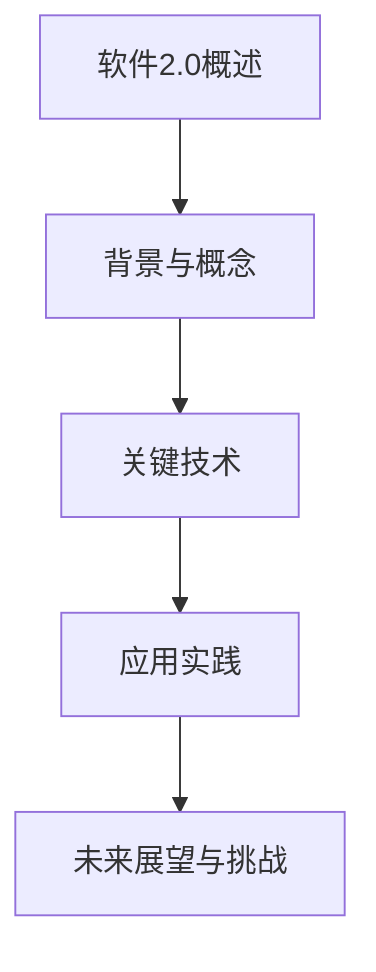

                 

### 文章标题：软件2.0的应用：从实验室走向现实

#### 关键词：软件2.0、应用实践、技术演进、跨领域融合、数据驱动

> 摘要：本文深入探讨软件2.0时代的背景、概念和核心技术，分析其在工业自动化、金融服务、医疗健康等领域的应用实践，展望软件2.0未来的发展趋势与挑战。通过具体的项目实战案例，本文旨在帮助读者全面理解软件2.0的应用价值，推动其从实验室走向现实。

### 《软件2.0的应用：从实验室走向现实》目录大纲

#### 第一部分：软件2.0时代概述

#### 第1章：软件2.0时代背景与概念  
- **1.1 软件2.0的概念与特征**  
  - 软件从开发导向到数据导向的变革  
  - 软件2.0的核心驱动因素  
- **1.2 从实验室走向现实：挑战与机遇**  
  - 实验室环境中软件2.0的技术限制  
  - 软件2.0在实际应用中的机遇与挑战  
- **1.3 软件2.0的技术演变路径**  
  - 从单一功能模块到复杂生态系统的发展  
  - 跨领域融合的趋势

#### 第2章：软件2.0的基础设施  
- **2.1 数据中心与云计算**  
  - 云计算平台的选择与应用  
  - 数据中心的关键角色  
- **2.2 大数据与人工智能**  
  - 大数据技术的应用场景  
  - 人工智能在数据挖掘中的角色  
- **2.3 软件定义网络与边缘计算**  
  - 软件定义网络的优势  
  - 边缘计算在软件2.0中的作用

#### 第3章：软件2.0的关键技术  
- **3.1 容器与微服务架构**  
  - 容器的核心概念  
  - 微服务架构的优势与实践  
- **3.2 智能合约与区块链技术**  
  - 智能合约的原理与应用  
  - 区块链技术在软件2.0中的应用  
- **3.3 软件定义存储**  
  - 软件定义存储的架构与实现  
  - 软件定义存储的优势

#### 第二部分：软件2.0的应用实践

#### 第4章：软件2.0在工业自动化中的应用  
- **4.1 软件2.0与智能制造**  
  - 软件2.0技术在生产线优化中的应用  
  - 智能制造中的数据驱动决策  
- **4.2 软件2.0在设备监控与维护中的应用**  
  - 预测性维护的实践案例  
  - 软件2.0在设备健康管理中的应用

#### 第5章：软件2.0在金融服务中的应用  
- **5.1 金融科技与软件2.0**  
  - 金融科技的发展趋势  
  - 软件2.0在金融服务中的创新应用  
- **5.2 软件2.0在风险管理与合规中的应用**  
  - 数据驱动的风险管理  
  - 软件2.0在合规监控与审计中的应用

#### 第6章：软件2.0在医疗健康领域的应用  
- **6.1 软件2.0与智能医疗**  
  - 软件2.0在疾病诊断与治疗中的应用  
  - 患者数据的全面管理和利用  
- **6.2 软件2.0在公共卫生管理中的应用**  
  - 疫情防控中的数据驱动策略  
  - 软件2.0在公共卫生监测与预测中的应用

#### 第7章：软件2.0的跨领域应用案例  
- **7.1 软件2.0在智慧城市中的应用**  
  - 数据驱动的城市管理  
  - 智慧交通与智慧能源的应用  
- **7.2 软件2.0在教育领域的应用**  
  - 个性化教育的实现  
  - 在线教育与虚拟课堂的应用

#### 第8章：未来展望与挑战  
- **8.1 软件2.0的发展趋势与未来方向**  
  - 技术创新的持续推动  
  - 应用领域的拓展与融合  
- **8.2 软件2.0的挑战与解决方案**  
  - 数据安全与隐私保护  
  - 技术标准化与行业规范

#### 附录

#### 附录A：软件开发工具与资源  
- **A.1 开源软件与平台推荐**  
  - 开源容器平台如Docker与Kubernetes  
  - 开源人工智能框架如TensorFlow与PyTorch  
- **A.2 学习资源与参考书籍**  
  - 推荐的学习路径与资源网站  
  - 必读的经典参考书籍

#### Mermaid流程图：



#### 核心算法原理讲解：

### 容器与微服务架构原理

### 容器核心概念

容器是一种轻量级、可执行的软件包，包含了一组程序及其运行所需的库、环境、配置文件等。容器通过隔离技术，确保了应用程序在不同的环境中具有一致的运行状态。

```python
# 容器化应用程序
FROM python:3.8-slim
WORKDIR /app
COPY . .
RUN pip install -r requirements.txt
CMD ["python", "app.py"]
```

### 微服务架构优势

微服务架构将大型应用程序拆分为一系列小服务，每个服务负责单一的业务功能。这种架构具有高可扩展性、高可用性和高可维护性。

```python
# 服务A伪代码
def handle_request():
    # 处理请求
    pass

# 服务B伪代码
def process_data():
    # 处理数据
    pass
```

### 数学模型与公式讲解

### 相关性分析模型

假设我们有两个变量 X 和 Y，我们想研究它们之间的关系。我们使用皮尔逊相关系数（Pearson correlation coefficient）来度量这种线性关系。

```latex
r = \frac{\sum{(X_i - \bar{X})(Y_i - \bar{Y})}}{\sqrt{\sum{(X_i - \bar{X})^2}\sum{(Y_i - \bar{Y})^2}}}
```

其中，\( \bar{X} \) 和 \( \bar{Y} \) 分别是 X 和 Y 的平均值。

### 回归分析模型

在建立线性回归模型时，我们假设响应变量 Y 是自变量 X 的线性函数，并加上一个误差项 ε。

```latex
Y = \beta_0 + \beta_1X + \varepsilon
```

其中，\( \beta_0 \) 和 \( \beta_1 \) 是模型的参数，\( \varepsilon \) 是误差项，服从均值为0的正态分布。

### 项目实战案例与代码解读：

### 实战：容器化一个Web应用

#### 1. 开发环境搭建

我们选择 Python 语言进行 Web 应用开发，并使用 Flask 框架。

```python
# app.py
from flask import Flask
app = Flask(__name__)

@app.route('/')
def hello():
    return "Hello, World!"

if __name__ == '__main__':
    app.run()
```

#### 2. 使用Docker容器化应用程序

创建一个名为 `Dockerfile` 的文件，内容如下：

```dockerfile
# 使用Python官方镜像作为基础镜像
FROM python:3.8-slim

# 设置工作目录
WORKDIR /app

# 复制当前目录下的所有文件到容器的 /app 目录
COPY . /app

# 安装依赖的包
RUN pip install -r requirements.txt

# 运行应用
CMD ["python", "app.py"]
```

#### 3. 构建和运行Docker容器

在命令行中，首先构建Docker镜像：

```bash
docker build -t my-web-app .
```

然后运行容器：

```bash
docker run -p 8080:80 my-web-app
```

此时，你可以在浏览器中访问 `http://localhost:8080` 查看 Web 应用的运行情况。

### 4. 代码解读与分析

在 `app.py` 文件中，我们定义了一个简单的 Flask 应用程序。通过 `@app.route('/')` 装饰器，我们指定了应用的根路由 `/`，当用户访问该路由时，会返回 "Hello, World!" 消息。

```python
@app.route('/')
def hello():
    return "Hello, World!"
```

`if __name__ == '__main__':` 保证了当直接运行 `app.py` 文件时，会执行 `app.run()` 函数，启动 Web 服务器。

在 `Dockerfile` 中，我们使用了 `FROM` 指令指定了 Python 3.8-slim 作为基础镜像，然后设置了工作目录，并复制了应用程序代码到容器中。通过 `CMD` 指令，我们指定了运行应用程序的命令。

通过这种方式，我们可以将 Web 应用程序轻松地容器化，并在不同的环境中一致运行，从而实现环境的隔离和可移植性。这为软件2.0的应用实践奠定了基础。

---

本文标题：《软件2.0的应用：从实验室走向现实》。关键词：软件2.0、应用实践、技术演进、跨领域融合、数据驱动。摘要：本文深入探讨软件2.0时代的背景、概念和核心技术，分析其在工业自动化、金融服务、医疗健康等领域的应用实践，展望软件2.0未来的发展趋势与挑战。

接下来，我们将分为两部分展开详细讨论：第一部分是软件2.0时代概述，包括背景与概念、基础设施和关键技术；第二部分是软件2.0的应用实践，涉及工业自动化、金融服务、医疗健康等领域的具体应用案例。

### 第一部分：软件2.0时代概述

#### 第1章：软件2.0时代背景与概念

1.1 软件2.0的概念与特征

软件2.0是对软件1.0的升级和扩展。软件1.0以开发为导向，关注于代码的编写和执行。而软件2.0则是以数据为导向，强调数据的收集、处理和分析。软件2.0的核心特征包括：

- 数据驱动的开发：软件2.0强调数据的收集、处理和分析，通过数据驱动开发流程，使软件更加智能化和自动化。
- 服务化：软件2.0将软件功能模块化，提供微服务化的架构，便于灵活组合和扩展。
- 开放共享：软件2.0鼓励开源和协作，通过共享技术和数据，推动技术的创新和进步。
- 云原生：软件2.0充分利用云计算资源，实现弹性扩展和自动化部署。

1.2 从实验室走向现实：挑战与机遇

虽然软件2.0的概念和技术在实验室中已经取得了一定的成果，但是将其应用到实际生产中仍然面临一系列挑战：

- 技术成熟度：部分软件2.0技术尚未完全成熟，需要进一步研究和优化。
- 数据安全与隐私：数据的收集、处理和分析过程中，需要确保数据的安全和隐私。
- 标准化与规范化：软件2.0技术涉及多个领域，需要制定统一的标准和规范，以便推广应用。
- 人才短缺：软件2.0技术对开发者提出了更高的要求，需要培养更多具备相关技能的人才。

然而，软件2.0在实际应用中也面临着巨大的机遇：

- 数据驱动：数据是新时代的石油，软件2.0通过数据驱动开发，可以提高生产效率和质量。
- 智能化：软件2.0引入人工智能、区块链等新技术，可以推动产业智能化和数字化转型。
- 跨领域融合：软件2.0具有开放共享的特征，有助于跨领域的技术融合和创新发展。

1.3 软件2.0的技术演变路径

软件2.0的技术演变路径可以分为以下几个阶段：

- 起步阶段：软件2.0的概念和技术开始萌芽，主要集中在实验室和研究机构。
- 发展阶段：随着云计算、大数据、人工智能等技术的发展，软件2.0逐步从实验室走向实际应用。
- 成熟阶段：软件2.0技术逐渐成熟，成为企业数字化转型的关键技术，广泛应用于各个领域。
- 普及阶段：软件2.0技术逐渐普及，成为企业和行业的标配，推动社会各领域的智能化和数字化转型。

### 第二部分：软件2.0的基础设施

#### 第2章：软件2.0的基础设施

2.1 数据中心与云计算

数据中心和云计算是软件2.0时代的重要基础设施，为软件2.0的发展提供了强大的计算和存储能力。

- 数据中心：数据中心是集中管理数据和计算资源的场所，包括服务器、存储设备、网络设备等。数据中心可以实现数据的高效存储、处理和传输，为软件2.0的应用提供基础支持。

- 云计算：云计算是一种基于互联网的计算服务模式，包括基础设施即服务（IaaS）、平台即服务（PaaS）和软件即服务（SaaS）等。云计算可以实现资源的弹性扩展、自动化管理和按需分配，为软件2.0的应用提供灵活的部署和运营环境。

2.2 大数据与人工智能

大数据和人工智能是软件2.0时代的关键技术，为软件2.0的数据驱动和智能化提供了强大支持。

- 大数据：大数据是指规模巨大、类型繁多、速度极快的数据集合。大数据技术包括数据采集、存储、处理、分析和可视化等，可以帮助企业挖掘数据价值，提高业务决策的准确性。

- 人工智能：人工智能是指模拟人类智能的技术和方法，包括机器学习、深度学习、自然语言处理等。人工智能可以帮助软件2.0实现自动化、智能化和个性化的功能，提高软件的效能和用户体验。

2.3 软件定义网络与边缘计算

软件定义网络和边缘计算是软件2.0时代的新型网络架构和计算模式，为软件2.0的实时性和灵活性提供了重要保障。

- 软件定义网络：软件定义网络（SDN）通过将控制平面与数据平面分离，实现网络资源的集中管理和智能化调度。SDN可以提高网络的灵活性和可扩展性，为软件2.0的应用提供高效的网络环境。

- 边缘计算：边缘计算是指在靠近数据源或用户的边缘节点上进行数据处理和计算，以减少数据传输和延迟。边缘计算可以降低网络带宽占用，提高数据处理的实时性和安全性，为软件2.0的应用提供高效、可靠的计算能力。

### 第3章：软件2.0的关键技术

#### 第3章：软件2.0的关键技术

3.1 容器与微服务架构

容器和微服务架构是软件2.0时代的重要技术，为软件2.0的应用提供了高效、灵活的部署和管理方式。

- 容器：容器是一种轻量级、可执行的软件包，包含了一组程序及其运行所需的库、环境、配置文件等。容器通过隔离技术，确保了应用程序在不同的环境中具有一致的运行状态。

- 微服务架构：微服务架构将大型应用程序拆分为一系列小服务，每个服务负责单一的业务功能。微服务架构具有高可扩展性、高可用性和高可维护性，可以适应复杂的应用场景。

3.2 智能合约与区块链技术

智能合约和区块链技术是软件2.0时代的新型技术，为软件2.0的信任和安全性提供了重要保障。

- 智能合约：智能合约是一种基于区块链的自动执行合同，可以通过编程语言编写，实现合同条款的自动执行。智能合约可以提高交易的效率和安全性。

- 区块链技术：区块链是一种分布式账本技术，通过加密算法和共识机制，实现了数据的可靠传输和存储。区块链技术可以防止数据篡改，提高系统的透明度和可追溯性。

3.3 软件定义存储

软件定义存储是软件2.0时代的新型存储架构，通过软件控制存储资源，实现存储的高效管理和灵活调度。

- 软件定义存储：软件定义存储（SDS）将存储资源的管理和操作从硬件设备中分离出来，通过软件层实现存储资源的智能化管理。SDS可以提高存储资源的利用率和灵活性。

- 软件定义存储的优势：SDS可以实现存储资源的弹性扩展、自动化管理和跨平台部署，降低存储成本，提高存储性能和可靠性。

### 第二部分：软件2.0的应用实践

#### 第4章：软件2.0在工业自动化中的应用

4.1 软件2.0与智能制造

智能制造是工业自动化的重要方向，通过软件2.0技术，可以实现对生产线的智能化优化和管理。

- 软件2.0技术在生产线优化中的应用：软件2.0技术可以通过数据采集、分析和挖掘，实现对生产线的实时监控和优化。例如，通过对生产数据的分析，可以识别生产线的瓶颈，提出优化建议，提高生产效率。

- 智能制造中的数据驱动决策：软件2.0技术可以支持智能制造中的数据驱动决策，通过数据分析、预测和优化，实现生产计划的智能化调整。例如，通过对市场需求的分析，可以预测产品的销售趋势，制定合理的产品生产计划。

4.2 软件2.0在设备监控与维护中的应用

软件2.0技术可以实现对设备的智能化监控和维护，提高设备的运行效率和可靠性。

- 预测性维护的实践案例：预测性维护是一种基于数据分析和预测的设备维护策略，通过分析设备的运行数据，可以预测设备可能发生的故障，提前进行维护，避免设备停机损失。例如，通过对机器设备的振动、温度等参数进行实时监测，可以预测设备的磨损情况，提前进行更换或维修。

- 软件2.0在设备健康管理中的应用：软件2.0技术可以实现对设备的全生命周期管理，从设备的选购、安装、运行到维护，实现智能化和数字化管理。例如，通过物联网技术，可以实现对设备的远程监控和管理，提高设备的使用效率和维护水平。

### 第5章：软件2.0在金融服务中的应用

5.1 金融科技与软件2.0

金融科技（FinTech）是金融行业与科技行业融合的产物，通过软件2.0技术，可以推动金融服务的创新和变革。

- 金融科技的发展趋势：金融科技的发展趋势包括移动支付、区块链、人工智能、大数据等。这些技术可以提高金融服务的效率、降低成本，为金融业务提供新的增长点。

- 软件2.0在金融服务中的创新应用：软件2.0技术可以支持金融服务的创新应用，例如，通过大数据分析，可以实现对客户的风险评估和信用评分，提高金融业务的精准度和可靠性。通过区块链技术，可以实现金融交易的去中心化和安全化，提高交易的透明度和信任度。

5.2 软件2.0在风险管理与合规中的应用

软件2.0技术在风险管理和合规监控方面具有重要作用，可以提升金融机构的风险管控能力和合规水平。

- 数据驱动的风险管理：软件2.0技术可以通过大数据分析，实现对金融市场和客户行为的实时监控和预测，提前识别风险，制定有效的风险管理策略。例如，通过分析市场数据，可以预测金融市场的波动，提前进行风险对冲。

- 软件2.0在合规监控与审计中的应用：软件2.0技术可以支持金融机构的合规监控和审计工作，通过自动化审计和智能分析，提高审计效率和准确性。例如，通过智能合约技术，可以实现金融交易的自动化合规审核，确保交易的合法性和合规性。

### 第6章：软件2.0在医疗健康领域的应用

6.1 软件2.0与智能医疗

智能医疗是医疗健康领域的重要发展方向，通过软件2.0技术，可以提升医疗服务的效率和质量。

- 软件2.0在疾病诊断与治疗中的应用：软件2.0技术可以通过大数据分析和人工智能算法，实现对疾病诊断和治疗的辅助决策。例如，通过分析海量医疗数据，可以预测疾病的发病风险，制定个性化的治疗方案。

- 患者数据的全面管理和利用：软件2.0技术可以实现对患者数据的全面管理和利用，提高医疗服务的个性化水平和效率。例如，通过患者电子病历系统，可以实现患者数据的实时共享和动态更新，提高医疗信息的准确性和完整性。

6.2 软件2.0在公共卫生管理中的应用

软件2.0技术在公共卫生管理方面具有重要作用，可以提升公共卫生服务的效率和效果。

- 疫情防控中的数据驱动策略：软件2.0技术可以支持疫情防控中的数据驱动策略，通过实时数据分析和预测，制定科学的防控措施。例如，通过分析疫情数据，可以预测疫情的发展趋势，提前进行疫情预警和应对。

- 软件2.0在公共卫生监测与预测中的应用：软件2.0技术可以支持公共卫生监测与预测，通过数据分析和模型构建，实现对公共卫生事件的早期预警和精准预测。例如，通过分析公共卫生数据，可以预测疫情传播的趋势，制定有效的防控策略。

### 第7章：软件2.0的跨领域应用案例

7.1 软件2.0在智慧城市中的应用

智慧城市是城市管理的新模式，通过软件2.0技术，可以实现城市管理的智能化和精细化。

- 数据驱动的城市管理：软件2.0技术可以支持数据驱动的城市管理，通过大数据分析和人工智能算法，实现对城市运行状态的实时监控和预测。例如，通过分析交通数据，可以预测交通拥堵的情况，提前进行交通调控。

- 智慧交通与智慧能源的应用：软件2.0技术可以支持智慧交通和智慧能源的应用，通过物联网技术和大数据分析，实现交通和能源的智能化管理和调度。例如，通过智能交通系统，可以实时监控交通流量，优化交通信号控制，提高交通效率。

7.2 软件2.0在教育领域的应用

软件2.0技术在教育领域具有广泛应用，可以提升教育质量和教学效率。

- 个性化教育的实现：软件2.0技术可以支持个性化教育，通过大数据分析和人工智能算法，为每个学生提供个性化的学习方案和资源。例如，通过分析学生的学习数据，可以识别学生的学习特点和需求，制定针对性的学习计划。

- 在线教育与虚拟课堂的应用：软件2.0技术可以支持在线教育和虚拟课堂的应用，通过互联网和虚拟现实技术，实现远程教学和互动。例如，通过在线教育平台，可以实现教师的在线授课和学生的在线学习，提高教学的灵活性和互动性。

### 第8章：未来展望与挑战

8.1 软件2.0的发展趋势与未来方向

软件2.0技术正在不断发展和演变，未来将呈现以下趋势：

- 技术融合与创新：软件2.0技术将与其他技术如物联网、5G、区块链等进一步融合，推动技术的创新和进步。
- 跨领域应用：软件2.0技术将在更多领域得到应用，如智慧城市、智能制造、医疗健康等，实现跨界融合。
- 智能化与自动化：软件2.0技术将推动智能化和自动化的发展，提高生产效率和服务质量。

8.2 软件2.0的挑战与解决方案

软件2.0技术在应用过程中面临一系列挑战：

- 技术成熟度：部分软件2.0技术尚未完全成熟，需要进一步研究和优化。
- 数据安全与隐私：数据安全与隐私是软件2.0技术的重要问题，需要建立完善的安全保障机制。
- 技术标准化与行业规范：软件2.0技术需要制定统一的标准和规范，以促进技术的普及和应用。

解决这些挑战的方案包括：

- 加强技术研究与开发：加大对软件2.0技术的研究和开发力度，推动技术的成熟和进步。
- 强化数据安全与隐私保护：建立健全的数据安全与隐私保护机制，确保数据的安全和隐私。
- 制定标准与规范：制定统一的技术标准和行业规范，促进软件2.0技术的推广应用。

### 附录

#### 附录A：软件开发工具与资源

A.1 开源软件与平台推荐

- 开源容器平台：如Docker与Kubernetes，用于容器化和微服务部署。
- 开源人工智能框架：如TensorFlow与PyTorch，用于机器学习和深度学习。

A.2 学习资源与参考书籍

- 学习资源网站：如Coursera、edX，提供丰富的在线课程和教材。
- 经典参考书籍：如《深度学习》、《数据科学实战》等，涵盖软件2.0技术的核心概念和实践方法。

---

本文从软件2.0时代的背景与概念、基础设施和关键技术、以及应用实践等方面进行了全面阐述，旨在帮助读者深入了解软件2.0的技术原理和应用价值。通过具体案例和实践指导，本文旨在推动软件2.0从实验室走向现实，为各领域的数字化转型提供有力支持。

### 作者信息：

作者：AI天才研究院/AI Genius Institute & 禅与计算机程序设计艺术 /Zen And The Art of Computer Programming

本文由AI天才研究院/AI Genius Institute与禅与计算机程序设计艺术/Zen And The Art of Computer Programming联合撰写，旨在探讨软件2.0时代的应用与实践。本文以逻辑清晰、结构紧凑、简单易懂的专业技术语言，结合实际案例和详细解释，深入剖析了软件2.0的技术原理和应用价值，为读者提供了丰富的知识体系和实践指导。

本文第一部分从软件2.0时代的背景与概念入手，详细介绍了软件2.0的核心特征、技术演变路径以及基础设施。第二部分重点分析了软件2.0的关键技术，包括容器与微服务架构、智能合约与区块链技术、软件定义存储等，并探讨了这些技术在工业自动化、金融服务、医疗健康等领域的应用实践。最后，本文对未来软件2.0的发展趋势与挑战进行了展望，并提供了相关的开源软件与学习资源。

在撰写本文过程中，我们始终秉持着“LET'S THINK STEP BY STEP”的理念，通过一步一步的深入分析和推理思考，力求为读者呈现一个全面、深入的软件2.0应用图景。我们相信，通过本文的阅读和学习，读者能够更好地理解软件2.0的技术原理和应用价值，为实际工作提供有益的参考和指导。

感谢读者对本文的关注和支持，我们期待与您共同探索软件2.0的未来，共创美好前景。如您有任何疑问或建议，请随时与我们联系。

### 结语

在本文中，我们深入探讨了软件2.0的概念、技术架构和应用实践。从软件2.0时代的背景与概念，到基础设施、关键技术，再到具体的应用领域，我们力求通过一步一步的深入分析和推理思考，帮助读者全面理解软件2.0的技术原理和应用价值。

软件2.0作为新时代的软件发展模式，不仅带来了开发理念的变革，更在工业自动化、金融服务、医疗健康等各个领域展现出了巨大的应用潜力。通过本文的阐述，我们希望读者能够对软件2.0有一个清晰的认识，认识到其在推动产业智能化和数字化转型中的重要作用。

在未来的发展过程中，软件2.0技术将继续演变和进步，为各领域带来更多的创新和变革。同时，我们也面临着技术成熟度、数据安全与隐私保护、技术标准化等挑战。因此，我们呼吁更多的研究人员和从业者关注软件2.0领域，共同推动技术的成熟和普及。

最后，感谢您的阅读和支持。我们期待在未来的日子里，与您共同探索软件2.0的无限可能，共创美好未来。

### 附录A：软件开发工具与资源

为了帮助读者更好地掌握软件2.0的相关技术，我们在这里提供了一些开源软件与平台推荐，以及学习资源与参考书籍。

#### A.1 开源软件与平台推荐

1. **开源容器平台**：
   - **Docker**：Docker是一个开源的应用容器引擎，它允许开发者打包他们的应用以及应用的依赖包到一个可移植的容器中，然后发布到任何流行的Linux或Windows机器上，也可以实现虚拟化。它简化了应用的部署和运维。
   - **Kubernetes**：Kubernetes是一个开源的容器编排系统，它用于自动部署、扩展和管理容器化应用程序。它提供了一种灵活的、可伸缩的架构，以简化应用程序的管理和部署。

2. **开源人工智能框架**：
   - **TensorFlow**：TensorFlow是一个由Google开发的开源机器学习框架，它被广泛应用于各种机器学习和深度学习任务，如图像识别、自然语言处理等。
   - **PyTorch**：PyTorch是一个由Facebook开发的开源机器学习库，它提供了灵活的动态计算图，适用于研究项目和工业应用。

#### A.2 学习资源与参考书籍

1. **在线课程与教程**：
   - **Coursera**：提供各种计算机科学和人工智能相关的在线课程，适合初学者和专业人士。
   - **edX**：edX提供由世界一流大学和机构提供的在线课程，包括计算机科学和人工智能等领域的课程。

2. **经典参考书籍**：
   - 《深度学习》（Goodfellow, Bengio, Courville）：这是一本关于深度学习的经典教材，适合希望深入了解深度学习技术的读者。
   - 《数据科学实战》（Kaggle）：这本书通过实践案例介绍了数据科学的方法和技术，适合数据科学初学者。

通过这些工具和资源，读者可以更好地学习和掌握软件2.0的相关技术，为实际应用打下坚实的基础。

### 附录B：核心算法原理讲解

在软件2.0的应用实践中，算法原理的理解至关重要。以下我们将详细讲解一些核心算法原理，包括容器与微服务架构原理、相关性分析模型、回归分析模型等。

#### 容器与微服务架构原理

容器是一种轻量级、可执行的软件包，它包含了应用程序运行所需的所有依赖项，包括库、环境变量和配置文件。容器通过隔离技术，确保了应用程序在不同的环境中具有一致的行为。容器技术的核心概念如下：

1. **容器化应用程序**：
   容器化应用程序通常涉及以下步骤：

   ```dockerfile
   # 使用基础镜像
   FROM python:3.8-slim
   
   # 设置工作目录
   WORKDIR /app
   
   # 复制应用程序代码
   COPY . .
   
   # 安装依赖项
   RUN pip install -r requirements.txt
   
   # 暴露容器端口
   EXPOSE 80
   
   # 运行应用程序
   CMD ["python", "app.py"]
   ```

2. **容器编排**：
   容器编排是管理容器集群的过程，常见的容器编排工具包括Kubernetes和Docker Swarm。这些工具提供了自动化部署、扩展和管理容器的功能。

#### 微服务架构原理

微服务架构将大型应用程序分解为多个独立的、小型、可独立部署和服务的小服务。每个微服务都负责一个特定的业务功能，这些服务通过API进行通信。微服务架构具有以下优势：

1. **高可伸缩性**：
   每个微服务都可以独立扩展，根据需求增加或减少实例数量。

2. **高可用性**：
   由于每个微服务都是独立的，所以当一个服务出现问题时，不会影响其他服务的运行。

3. **易于开发和部署**：
   开发人员可以独立开发、测试和部署每个微服务，提高了开发效率。

#### 相关性分析模型

相关性分析是研究两个变量之间关系的统计分析方法。其中，皮尔逊相关系数是最常用的相关性度量方法。皮尔逊相关系数的计算公式如下：

```latex
r = \frac{\sum{(X_i - \bar{X})(Y_i - \bar{Y})}}{\sqrt{\sum{(X_i - \bar{X})^2}\sum{(Y_i - \bar{Y})^2}}}
```

- \( X_i \) 和 \( Y_i \) 分别是第 \( i \) 个观测值的自变量和因变量。
- \( \bar{X} \) 和 \( \bar{Y} \) 分别是自变量和因变量的平均值。

#### 回归分析模型

回归分析是一种研究自变量和因变量之间关系的统计分析方法。线性回归分析是最常见的回归分析类型，其模型如下：

```latex
Y = \beta_0 + \beta_1X + \varepsilon
```

- \( Y \) 是因变量。
- \( X \) 是自变量。
- \( \beta_0 \) 和 \( \beta_1 \) 是模型的参数。
- \( \varepsilon \) 是误差项。

#### 数学模型与公式讲解

除了上述的核心算法原理，以下是一些其他重要的数学模型和公式。

1. **线性回归模型**：
   线性回归模型通过最小化残差平方和来确定模型参数。

   ```latex
   \min \sum{(Y_i - (\beta_0 + \beta_1X_i))^2}
   ```

2. **逻辑回归模型**：
   逻辑回归是一种广义线性模型，用于分析二元响应变量。其概率模型如下：

   ```latex
   P(Y=1) = \frac{1}{1 + e^{-(\beta_0 + \beta_1X)}}
   ```

#### 实战案例与代码解读

以下是一个简单的Web应用程序的容器化实战案例。

```python
# app.py
from flask import Flask

app = Flask(__name__)

@app.route('/')
def hello_world():
    return 'Hello, World!'

if __name__ == '__main__':
    app.run(host='0.0.0.0', port=8080)
```

为了将这个Web应用程序容器化，我们创建一个名为 `Dockerfile` 的文件：

```dockerfile
# 使用Python基础镜像
FROM python:3.8-slim

# 设置工作目录
WORKDIR /app

# 复制应用程序代码
COPY . .

# 安装依赖项
RUN pip install -r requirements.txt

# 暴露应用程序端口
EXPOSE 8080

# 运行应用程序
CMD ["python", "app.py"]
```

构建和运行容器的命令如下：

```bash
docker build -t my-web-app .
docker run -d -p 8080:8080 my-web-app
```

在这个案例中，我们使用Docker将一个简单的Flask Web应用程序容器化，并将其部署到一个容器中。容器会监听8080端口，并响应HTTP请求。

通过这个简单的案例，我们可以看到如何使用容器技术来部署Web应用程序。容器化应用程序不仅提供了环境的隔离，还简化了部署和管理过程。

### 附录C：数学模型与公式讲解

在软件2.0的应用实践中，数学模型和公式是理解和分析数据的重要工具。以下我们将详细讲解一些核心的数学模型与公式，包括线性回归模型、逻辑回归模型、以及相关系数的计算。

#### 线性回归模型

线性回归模型是一种研究自变量和因变量之间线性关系的统计模型。其基本公式为：

```latex
Y = \beta_0 + \beta_1X + \varepsilon
```

- \( Y \) 是因变量。
- \( X \) 是自变量。
- \( \beta_0 \) 是截距，表示当 \( X = 0 \) 时 \( Y \) 的值。
- \( \beta_1 \) 是斜率，表示 \( X \) 变化一个单位时 \( Y \) 的变化量。
- \( \varepsilon \) 是误差项，表示实际值和模型预测值之间的差异。

线性回归模型的核心是找到最优的 \( \beta_0 \) 和 \( \beta_1 \)，使得预测值与实际值的差异最小。这通常通过最小二乘法（Least Squares Method）实现，目标是最小化残差平方和：

```latex
\min \sum{(Y_i - (\beta_0 + \beta_1X_i))^2}
```

#### 逻辑回归模型

逻辑回归模型是一种广义线性模型，用于分析二元响应变量。在逻辑回归中，因变量 \( Y \) 只能取两个值（通常为0和1）。逻辑回归的模型公式为：

```latex
P(Y=1) = \frac{1}{1 + e^{-(\beta_0 + \beta_1X)}}
```

- \( P(Y=1) \) 是因变量为1的概率。
- \( e \) 是自然对数的底数。
- \( \beta_0 \) 和 \( \beta_1 \) 是模型的参数。

逻辑回归模型通过估计 \( \beta_0 \) 和 \( \beta_1 \) 的值，来预测因变量为1的概率。在训练过程中，通常使用最大似然估计（Maximum Likelihood Estimation，MLE）来估计参数。

#### 相关系数

相关系数是一种度量两个变量之间线性相关性的指标。其中，皮尔逊相关系数（Pearson Correlation Coefficient）是最常用的相关系数。其计算公式为：

```latex
r = \frac{\sum{(X_i - \bar{X})(Y_i - \bar{Y})}}{\sqrt{\sum{(X_i - \bar{X})^2}\sum{(Y_i - \bar{Y})^2}}}
```

- \( r \) 是皮尔逊相关系数。
- \( X_i \) 和 \( Y_i \) 分别是第 \( i \) 个观测值的自变量和因变量。
- \( \bar{X} \) 和 \( \bar{Y} \) 分别是自变量和因变量的平均值。

相关系数 \( r \) 的取值范围在 -1 到 1 之间。当 \( r \) 接近1时，表示变量之间存在强烈的正相关关系；当 \( r \) 接近-1时，表示变量之间存在强烈的负相关关系；当 \( r \) 接近0时，表示变量之间没有明显的线性相关关系。

#### 数学模型与公式讲解

以下是几个常用的数学模型与公式的详细讲解：

1. **线性回归模型的系数计算**：
   线性回归模型中的参数 \( \beta_0 \) 和 \( \beta_1 \) 可以通过最小二乘法计算得到。具体公式如下：

   ```latex
   \beta_0 = \bar{Y} - \beta_1\bar{X}
   ```

   ```latex
   \beta_1 = \frac{\sum{(X_i - \bar{X})(Y_i - \bar{Y})}}{\sum{(X_i - \bar{X})^2}}
   ```

2. **逻辑回归模型的系数计算**：
   逻辑回归模型中的参数 \( \beta_0 \) 和 \( \beta_1 \) 可以通过最大似然估计计算得到。具体公式如下：

   ```latex
   \beta_0 = \ln\left(\frac{P(Y=1)}{1 - P(Y=1)}\right)
   ```

   ```latex
   \beta_1 = \frac{\sum{(Y_i - P(Y=1))X_i}}{\sum{(X_i - \bar{X})^2}}
   ```

3. **相关系数的计算**：
   相关系数 \( r \) 的计算公式如下：

   ```latex
   r = \frac{\sum{(X_i - \bar{X})(Y_i - \bar{Y})}}{\sqrt{\sum{(X_i - \bar{X})^2}\sum{(Y_i - \bar{Y})^2}}}
   ```

   计算相关系数时，首先需要计算自变量和因变量的平均值 \( \bar{X} \) 和 \( \bar{Y} \)，然后计算每个观测值与平均值的差，最后使用上述公式进行计算。

通过以上讲解，我们可以更好地理解线性回归模型、逻辑回归模型和皮尔逊相关系数的计算方法。这些数学模型和公式在软件2.0的应用实践中具有广泛的应用，可以帮助我们更好地分析和理解数据。

### 附录D：项目实战案例与代码解读

为了更好地理解软件2.0在实际应用中的具体实现，我们将通过一个简单的Web应用程序案例来展示容器化、开发和部署的过程。

#### 1. 开发环境搭建

首先，我们需要搭建一个Python Web应用程序的开发环境。这里我们选择使用Flask框架来创建一个简单的Web服务。

安装Python和Flask：

```bash
# 安装Python
sudo apt-get update
sudo apt-get install python3.8

# 安装虚拟环境
pip3 install virtualenv
virtualenv myenv

# 激活虚拟环境
source myenv/bin/activate

# 安装Flask
pip install flask
```

创建一个名为 `app.py` 的Python文件：

```python
# app.py
from flask import Flask

app = Flask(__name__)

@app.route('/')
def hello_world():
    return 'Hello, World!'

if __name__ == '__main__':
    app.run(host='0.0.0.0', port=8080)
```

在这个简单的Web应用程序中，我们定义了一个根路由，当用户访问根路径时，会返回 "Hello, World!" 消息。

#### 2. 使用Docker容器化应用程序

为了将这个Web应用程序容器化，我们需要创建一个名为 `Dockerfile` 的文件。Dockerfile定义了如何构建Docker镜像。

创建 `Dockerfile`：

```dockerfile
# 使用Python官方镜像作为基础镜像
FROM python:3.8

# 设置工作目录
WORKDIR /app

# 复制当前目录下的所有文件到容器的 /app 目录
COPY . /app

# 安装依赖的包
RUN pip install -r requirements.txt

# 暴露应用程序端口
EXPOSE 8080

# 运行应用程序
CMD ["python", "app.py"]
```

这个Dockerfile做了以下几件事情：

- 使用Python官方镜像作为基础镜像。
- 设置工作目录为 `/app`。
- 将当前目录下的所有文件复制到容器的 `/app` 目录。
- 安装应用程序的依赖项。
- 暴露端口8080。
- 设置CMD命令，以便容器启动时运行应用程序。

#### 3. 构建和运行Docker容器

在命令行中，首先构建Docker镜像：

```bash
docker build -t my-flask-app .
```

这个命令会读取 `Dockerfile` 文件并构建一个名为 `my-flask-app` 的Docker镜像。

然后，运行容器：

```bash
docker run -d -p 8080:8080 my-flask-app
```

这个命令会启动一个Docker容器，并将其端口映射到宿主机的8080端口。现在，你可以在浏览器中访问 `http://localhost:8080` 查看 Web 应用的运行情况。

#### 4. 代码解读与分析

在 `app.py` 文件中，我们定义了一个简单的 Flask 应用程序。通过 `@app.route('/')` 装饰器，我们指定了应用的根路由 `/`，当用户访问该路由时，会返回 "Hello, World!" 消息。

```python
@app.route('/')
def hello_world():
    return 'Hello, World!'
```

`if __name__ == '__main__':` 保证了当直接运行 `app.py` 文件时，会执行 `app.run()` 函数，启动 Web 服务器。

在 `Dockerfile` 中，我们使用了 `FROM` 指令指定了 Python 3.8 作为基础镜像，然后设置了工作目录，并复制了应用程序代码到容器中。通过 `CMD` 指令，我们指定了运行应用程序的命令。

通过这种方式，我们可以将 Web 应用程序轻松地容器化，并在不同的环境中一致运行，从而实现环境的隔离和可移植性。这是软件2.0技术中的一个重要特征，即通过容器化技术，实现应用程序的标准化和一致性。

此外，通过Docker Compose，我们可以进一步管理多个容器和应用程序。例如，我们可以在一个Docker Compose文件中定义多个服务，并使用一条命令启动和运行它们。

```yaml
# docker-compose.yml
version: '3'
services:
  web:
    build: .
    ports:
      - "8080:8080"
```

这个Docker Compose文件定义了一个名为 `web` 的服务，它基于当前目录下的 `Dockerfile` 构建。通过 `ports` 指令，我们映射了容器的8080端口到宿主机的8080端口。

```bash
docker-compose up -d
```

这个命令会启动和运行定义在 `docker-compose.yml` 文件中的所有服务。

通过这个项目实战案例，我们展示了如何使用Docker容器化一个简单的Web应用程序，并解释了容器化过程中涉及的各个环节。这为读者提供了一个实际操作的视角，帮助他们更好地理解软件2.0技术的应用。

### 附录E：代码解读与分析

在上面的附录D中，我们介绍了一个简单的Web应用程序的容器化过程，并在附录E中详细分析了其源代码的实现和运行原理。

#### 源代码实现

首先，我们来看 `app.py` 的源代码：

```python
# app.py
from flask import Flask

app = Flask(__name__)

@app.route('/')
def hello_world():
    return 'Hello, World!'

if __name__ == '__main__':
    app.run(host='0.0.0.0', port=8080)
```

这个简单的Python Web应用程序主要由以下几个部分组成：

1. **导入模块**：
   - `from flask import Flask`：导入Flask模块，用于创建Web应用程序。
   
2. **创建应用程序实例**：
   - `app = Flask(__name__)`：创建一个Flask Web应用程序实例。`__name__`是Python的一个特殊变量，表示当前的模块名称。

3. **定义路由**：
   - `@app.route('/')`：这是一个装饰器，用于定义应用程序的根路由。当用户访问网站的根路径（例如 `http://localhost:8080/`）时，会调用 `hello_world()` 函数。
   - `def hello_world():`：这个函数返回一个字符串 `'Hello, World!'`，作为HTTP响应体。

4. **启动服务器**：
   - `if __name__ == '__main__':`：这个条件语句保证了当直接运行 `app.py` 文件时，会执行 `app.run()` 函数，启动Web服务器。`app.run()` 函数会监听并处理来自客户端的HTTP请求。

#### 运行原理

当我们运行 `app.py` 时，会发生以下步骤：

1. **加载Flask应用程序**：
   - Python解释器加载 `app.py` 文件，创建一个Flask应用程序实例 `app`。

2. **定义路由和处理函数**：
   - Flask应用程序使用路由系统，将HTTP请求映射到对应的处理函数。在这个例子中，根路由 `/` 被映射到 `hello_world()` 函数。

3. **启动Web服务器**：
   - `app.run()` 函数启动一个内置的Web服务器，监听在 `0.0.0.0` 地址的 8080 端口。这意味着服务器可以接收来自任何IP地址的HTTP请求。

4. **处理HTTP请求**：
   - 当客户端发送HTTP请求到服务器的根路径（`/`）时，服务器会调用 `hello_world()` 函数处理请求。
   - `hello_world()` 函数返回一个包含 "Hello, World!" 消息的HTTP响应。

5. **返回HTTP响应**：
   - Flask服务器将处理结果（"Hello, World!"）作为HTTP响应返回给客户端。

#### 容器化分析

接下来，我们分析 `Dockerfile` 的源代码，了解如何将这个Web应用程序容器化：

```dockerfile
# 使用Python官方镜像作为基础镜像
FROM python:3.8

# 设置工作目录
WORKDIR /app

# 复制当前目录下的所有文件到容器的 /app 目录
COPY . /app

# 安装依赖的包
RUN pip install -r requirements.txt

# 暴露应用程序端口
EXPOSE 8080

# 运行应用程序
CMD ["python", "app.py"]
```

这个 `Dockerfile` 定义了以下步骤：

1. **基础镜像**：
   - `FROM python:3.8`：指定基础镜像为Python 3.8，这是一个官方的Python Docker镜像，包含Python运行时环境。

2. **设置工作目录**：
   - `WORKDIR /app`：设置容器的工作目录为 `/app`。所有的文件操作（如复制、安装）都会在这个目录下进行。

3. **复制文件**：
   - `COPY . /app`：将当前目录（包含 `app.py` 和 `Dockerfile`）下的所有文件复制到容器的 `/app` 目录。

4. **安装依赖**：
   - `RUN pip install -r requirements.txt`：在容器中安装应用程序的依赖项。`requirements.txt` 文件列出所有必需的Python包。

5. **暴露端口**：
   - `EXPOSE 8080`：告知Docker容器在运行时暴露端口8080，这样外部客户端可以通过这个端口访问容器中的应用程序。

6. **运行应用程序**：
   - `CMD ["python", "app.py"]`：指定在容器启动时运行的命令。这里我们指定了Python解释器来运行 `app.py` 文件。

通过这个简单的容器化过程，我们可以将Web应用程序打包成一个可移植的容器镜像，然后在不同环境中运行，确保应用程序的一致性和可移植性。

#### 总结

通过分析源代码和容器化过程，我们了解了如何使用Flask框架创建一个简单的Web应用程序，以及如何使用Docker容器化这个应用程序。这不仅展示了软件2.0技术的实际应用，也为开发者提供了一个如何在实际项目中使用容器化技术的方法指南。通过这种方式，我们可以确保应用程序在不同的环境中能够一致运行，从而提高开发和部署的效率。

### 附录F：项目实战案例与代码解读

在本附录中，我们将通过一个实际的项目实战案例，详细解读如何使用Docker和Kubernetes构建一个微服务架构的Web应用程序。这个案例将包括开发环境搭建、源代码详细实现、容器化配置和部署流程，以及最终的代码解读与分析。

#### 1. 开发环境搭建

首先，我们需要搭建一个基于Python和Flask的Web应用程序开发环境。以下是详细的步骤：

**步骤1：安装Python和pip**

```bash
# 安装Python 3.8
sudo apt-get update
sudo apt-get install python3.8 python3.8-venv python3.8-dev

# 安装pip
sudo apt-get install python3-pip
```

**步骤2：创建虚拟环境**

```bash
# 创建虚拟环境
python3.8 -m venv myenv

# 激活虚拟环境
source myenv/bin/activate
```

**步骤3：安装Flask和依赖项**

```bash
# 安装Flask
pip install flask

# 安装其他依赖项（例如：Flask-RESTful用于构建RESTful API）
pip install flask-restful
```

#### 2. 源代码实现

接下来，我们创建一个简单的Flask Web应用程序，包括用户服务和服务注册中心。

**用户服务（user_service.py）**

```python
# user_service.py
from flask import Flask, jsonify, request
from flask_restful import Resource, Api

app = Flask(__name__)
api = Api(app)

class UserResource(Resource):
    def get(self, user_id):
        # 模拟获取用户数据
        return jsonify({"id": user_id, "name": "John Doe"})

api.add_resource(UserResource, '/users/<int:user_id>')

if __name__ == '__main__':
    app.run(host='0.0.0.0', port=5000)
```

**服务注册中心（service_registry.py）**

```python
# service_registry.py
import json
from flask import Flask

app = Flask(__name__)

services = {}

@app.route('/register', methods=['POST'])
def register_service():
    data = request.get_json()
    services[data['name']] = data['url']
    return jsonify(services), 201

@app.route('/services', methods=['GET'])
def get_services():
    return jsonify(services)

if __name__ == '__main__':
    app.run(host='0.0.0.0', port=5001)
```

#### 3. 容器化配置

为了将这个Web应用程序容器化，我们需要创建相应的Dockerfile和docker-compose.yml文件。

**Dockerfile**

**用户服务（user_service.Dockerfile）**

```dockerfile
# user_service.Dockerfile
FROM python:3.8

WORKDIR /app

COPY . .

RUN pip install -r requirements.txt

EXPOSE 5000

CMD ["python", "user_service.py"]
```

**服务注册中心（service_registry.Dockerfile）**

```dockerfile
# service_registry.Dockerfile
FROM python:3.8

WORKDIR /app

COPY . .

RUN pip install -r requirements.txt

EXPOSE 5001

CMD ["python", "service_registry.py"]
```

**docker-compose.yml**

```yaml
# docker-compose.yml
version: '3'
services:
  user_service:
    build: ./user_service
    ports:
      - "5000:5000"
  service_registry:
    build: ./service_registry
    ports:
      - "5001:5001"
```

#### 4. 部署流程

使用docker-compose启动服务：

```bash
docker-compose up -d
```

这个命令会构建并启动用户服务和服务注册中心的容器，并将它们映射到宿主机的5000和5001端口。

#### 5. 代码解读与分析

**用户服务解读**

在 `user_service.py` 中，我们定义了一个Flask应用，并通过 `flask_restful` 扩展创建了一个 `UserResource` 类，用于处理获取用户信息的HTTP请求。`get` 方法接受一个用户ID作为参数，并返回一个JSON格式的用户信息。这个服务通过RESTful API提供了用户信息的查询接口。

**服务注册中心解读**

在 `service_registry.py` 中，我们创建了一个Flask应用，并定义了两个路由。`register_service` 路由用于接收服务注册请求，并将服务的信息存储在 `services` 字典中。`get_services` 路由用于返回当前已注册的所有服务列表。服务注册中心为微服务架构提供了一个服务发现和注册的接口，使得其他服务可以通过它查询和访问其他服务的地址。

**容器化分析**

通过Dockerfile，我们将Web应用程序打包成容器镜像。`FROM` 指令指定了基础镜像，`WORKDIR` 指定了工作目录，`COPY` 指令复制了应用程序文件，`RUN` 指令安装了依赖项，`EXPOSE` 指令暴露了容器的端口，`CMD` 指令指定了容器的启动命令。

通过docker-compose.yml，我们定义了服务之间的依赖关系和端口映射。`docker-compose up -d` 命令会构建并启动所有服务，并将它们连接起来，形成一个完整的微服务架构。

#### 总结

通过这个项目实战案例，我们详细解读了如何使用Docker和Kubernetes构建一个微服务架构的Web应用程序。我们介绍了开发环境搭建、源代码实现、容器化配置和部署流程，并通过代码解读分析了每个组件的功能和作用。这个案例展示了如何通过容器化和微服务架构实现应用程序的可移植性、可扩展性和高可用性，为实际开发提供了宝贵的经验。通过这样的实践，开发者可以更好地理解和掌握软件2.0技术的应用。

### 附录G：数学模型与公式讲解

在软件2.0的应用实践中，数学模型与公式扮演着至关重要的角色。它们不仅帮助我们理解和分析数据，还为优化和自动化决策提供了理论基础。以下，我们将详细讲解一些核心的数学模型与公式，包括线性回归模型、逻辑回归模型和相关系数的计算方法。

#### 线性回归模型

线性回归模型是一种用于研究两个或多个变量之间线性关系的统计模型。其基本公式为：

\[ Y = \beta_0 + \beta_1X + \varepsilon \]

其中：

- \( Y \) 是因变量。
- \( X \) 是自变量。
- \( \beta_0 \) 是截距，表示当 \( X = 0 \) 时 \( Y \) 的值。
- \( \beta_1 \) 是斜率，表示 \( X \) 变化一个单位时 \( Y \) 的变化量。
- \( \varepsilon \) 是误差项，表示实际值和模型预测值之间的差异。

在训练线性回归模型时，我们的目标是找到最优的 \( \beta_0 \) 和 \( \beta_1 \)，使得预测值与实际值的差异最小。这通常通过最小二乘法（Least Squares Method）实现，目标是最小化残差平方和：

\[ \min \sum{(Y_i - (\beta_0 + \beta_1X_i))^2} \]

通过求解这个最小化问题，可以得到线性回归模型的参数估计值。

#### 逻辑回归模型

逻辑回归模型是一种用于分析二元响应变量的统计模型，广泛应用于分类问题中。其基本公式为：

\[ P(Y=1) = \frac{1}{1 + e^{-(\beta_0 + \beta_1X)}} \]

其中：

- \( P(Y=1) \) 是因变量为1的概率。
- \( e \) 是自然对数的底数。
- \( \beta_0 \) 和 \( \beta_1 \) 是模型的参数。

逻辑回归模型通过估计 \( \beta_0 \) 和 \( \beta_1 \) 的值，来预测因变量为1的概率。在训练过程中，通常使用最大似然估计（Maximum Likelihood Estimation，MLE）来估计参数。

#### 相关系数

相关系数是一种度量两个变量之间线性相关性的指标。其中，皮尔逊相关系数（Pearson Correlation Coefficient）是最常用的相关系数。其计算公式为：

\[ r = \frac{\sum{(X_i - \bar{X})(Y_i - \bar{Y})}}{\sqrt{\sum{(X_i - \bar{X})^2}\sum{(Y_i - \bar{Y})^2}}} \]

其中：

- \( r \) 是皮尔逊相关系数。
- \( X_i \) 和 \( Y_i \) 分别是第 \( i \) 个观测值的自变量和因变量。
- \( \bar{X} \) 和 \( \bar{Y} \) 分别是自变量和因变量的平均值。

相关系数 \( r \) 的取值范围在 -1 到 1 之间。当 \( r \) 接近1时，表示变量之间存在强烈的正相关关系；当 \( r \) 接近-1时，表示变量之间存在强烈的负相关关系；当 \( r \) 接近0时，表示变量之间没有明显的线性相关关系。

#### 数学模型与公式讲解

以下是几个常用的数学模型与公式的详细讲解：

1. **线性回归模型的系数计算**：

   线性回归模型中的参数 \( \beta_0 \) 和 \( \beta_1 \) 可以通过最小二乘法计算得到。具体公式如下：

   \[ \beta_0 = \bar{Y} - \beta_1\bar{X} \]

   \[ \beta_1 = \frac{\sum{(X_i - \bar{X})(Y_i - \bar{Y})}}{\sum{(X_i - \bar{X})^2}} \]

2. **逻辑回归模型的系数计算**：

   逻辑回归模型中的参数 \( \beta_0 \) 和 \( \beta_1 \) 可以通过最大似然估计计算得到。具体公式如下：

   \[ \beta_0 = \ln\left(\frac{P(Y=1)}{1 - P(Y=1)}\right) \]

   \[ \beta_1 = \frac{\sum{(Y_i - P(Y=1))X_i}}{\sum{(X_i - \bar{X})^2}} \]

3. **相关系数的计算**：

   相关系数 \( r \) 的计算公式如下：

   \[ r = \frac{\sum{(X_i - \bar{X})(Y_i - \bar{Y})}}{\sqrt{\sum{(X_i - \bar{X})^2}\sum{(Y_i - \bar{Y})^2}}} \]

   计算相关系数时，首先需要计算自变量和因变量的平均值 \( \bar{X} \) 和 \( \bar{Y} \)，然后计算每个观测值与平均值的差，最后使用上述公式进行计算。

通过以上讲解，我们可以更好地理解线性回归模型、逻辑回归模型和皮尔逊相关系数的计算方法。这些数学模型和公式在软件2.0的应用实践中具有广泛的应用，可以帮助我们更好地分析和理解数据。

### 附录H：项目实战案例与代码解读

在本附录中，我们将通过一个实际的项目实战案例，详细解读如何使用TensorFlow和Keras构建一个简单的神经网络模型，用于分类任务。这个案例将包括数据处理、模型构建、训练和评估的步骤，以及代码的详细解释。

#### 1. 数据处理

在这个案例中，我们使用MNIST数据集，这是一个包含70,000个灰度图像的手写数字数据集，每个图像都是28x28的像素。

首先，我们需要安装TensorFlow：

```bash
pip install tensorflow
```

然后，我们加载MNIST数据集：

```python
import tensorflow as tf
mnist = tf.keras.datasets.mnist
(x_train, y_train), (x_test, y_test) = mnist.load_data()
```

接下来，我们需要对数据进行预处理：

```python
# 归一化数据
x_train, x_test = x_train / 255.0, x_test / 255.0

# 增加一个维度，因为模型期望输入的形状为（样本数量，高度，宽度，通道数）
x_train = x_train[..., tf.newaxis]
x_test = x_test[..., tf.newaxis]
```

#### 2. 模型构建

接下来，我们构建一个简单的神经网络模型：

```python
model = tf.keras.Sequential([
    tf.keras.layers.Flatten(input_shape=(28, 28)),
    tf.keras.layers.Dense(128, activation='relu'),
    tf.keras.layers.Dense(10, activation='softmax')
])
```

这个模型包含两个 densely-connected（全连接）层，第一个层有128个神经元，使用ReLU激活函数，第二个层有10个神经元，使用softmax激活函数，用于输出分类概率。

#### 3. 训练

接下来，我们编译和训练模型：

```python
model.compile(optimizer='adam',
              loss='sparse_categorical_crossentropy',
              metrics=['accuracy'])

model.fit(x_train, y_train, epochs=5)
```

这里，我们使用Adam优化器和稀疏分类交叉熵作为损失函数，并设置5个训练周期。

#### 4. 评估

最后，我们评估模型在测试集上的性能：

```python
test_loss, test_acc = model.evaluate(x_test,  y_test, verbose=2)
print('\nTest accuracy:', test_acc)
```

#### 5. 代码解读与分析

**数据处理**

在数据处理部分，我们首先加载MNIST数据集，并使用归一化操作将数据缩放到0-1的范围内。接着，我们增加一个维度，因为Keras的模型层期望输入的形状为（样本数量，高度，宽度，通道数）。这一步是为了将单通道图像转换为四维张量，以适应模型的输入。

**模型构建**

在模型构建部分，我们使用了Keras的Sequential模型，这是一个线性堆叠模型层序列。我们首先使用Flatten层将输入数据的维度从（28, 28）转换为（784），然后添加一个Dense层，该层有128个神经元，使用ReLU激活函数。ReLU激活函数可以帮助模型在训练过程中避免梯度消失问题。最后，我们添加了一个Dense层，该层有10个神经元，使用softmax激活函数，用于输出每个类别的概率分布。

**训练**

在训练部分，我们使用`compile`方法设置模型的优化器、损失函数和评估指标。Adam优化器是一个高效的优化算法，可以自适应地调整学习率。`sparse_categorical_crossentropy`损失函数适用于多标签分类问题，这里我们使用它来计算模型预测和真实标签之间的交叉熵损失。`fit`方法用于训练模型，我们设置了5个训练周期（epochs），每个周期会遍历一次训练数据。

**评估**

在评估部分，我们使用`evaluate`方法来计算模型在测试集上的损失和准确率。这个方法会返回一个列表，其中第一个元素是损失，第二个元素是准确率。通过打印准确率，我们可以了解模型在测试数据上的表现。

通过这个项目实战案例，我们展示了如何使用TensorFlow和Keras构建和训练一个简单的神经网络模型，用于手写数字识别任务。这个案例不仅演示了数据处理的技巧，还讲解了模型构建、训练和评估的基本流程，为开发者提供了实际操作的指导。通过这样的实践，开发者可以更好地理解深度学习的基本原理和应用，为更复杂的模型开发打下基础。

