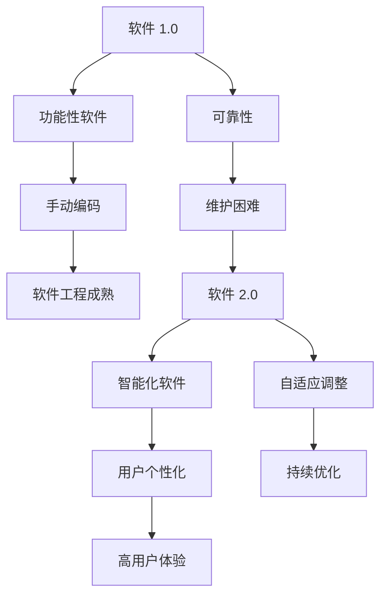
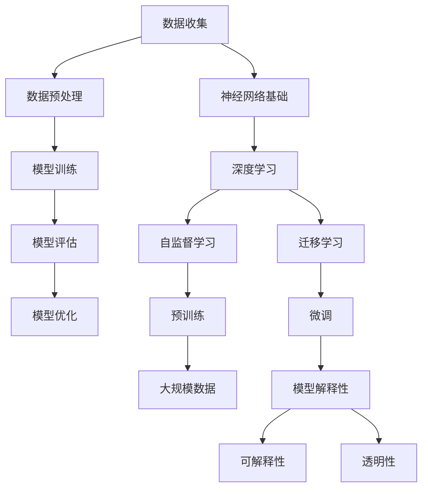

                 

### 文章标题

《软件 2.0 的未来展望：更智能、更强大》

### 关键词

- 软件发展
- AI 大模型
- 企业级应用
- 深度学习
- 人工智能技术

### 摘要

本文深入探讨了软件 2.0 时代的到来及其与人工智能（AI）大模型的紧密联系。首先，我们回顾了从软件 1.0 到 2.0 的演变过程，并介绍了 AI 大模型的基础知识及其在企业级应用中的重要性。接着，我们分析了深度学习与神经网络的基础技术，以及自然语言处理（NLP）的核心概念。文章随后转向大规模预训练模型的工作原理，探讨了数据收集、预处理、模型训练和评估等关键步骤。在此基础上，我们探讨了企业 AI 战略规划、AI 应用案例分析以及实战项目实践。此外，文章还详细讨论了 AI 大模型应用中的挑战与应对策略，并展望了其未来发展趋势。最后，通过附录部分提供了相关的开发工具、资源、核心概念联系流程图、算法原理讲解以及项目实战与代码解读，旨在为读者提供全面的技术指导和实用建议。

### 目录大纲

# 《软件 2.0 的未来展望：更智能、更强大》

## 第一部分：软件 2.0 时代与 AI 大模型基础

### 第1章：软件 2.0 与 AI 大模型概述

#### 1.1 软件 2.0 时代的到来

##### 1.1.1 从软件 1.0 到软件 2.0 的演进

##### 1.1.2 大模型在软件 2.0 中的核心地位

##### 1.1.3 企业级应用开发的新范式

#### 1.2 AI 大模型的定义与特点

##### 1.2.1 AI 大模型的定义

##### 1.2.2 AI 大模型的核心特点

##### 1.2.3 AI 大模型与传统 AI 的区别

#### 1.3 主流 AI 大模型简介

##### 1.3.1 GPT 系列模型

##### 1.3.2 BERT 及其变体

##### 1.3.3 其他知名大模型介绍

#### 1.4 AI 大模型在企业中的应用前景

##### 1.4.1 AI 大模型的潜在应用领域

##### 1.4.2 企业采用 AI 大模型的优势

##### 1.4.3 AI 大模型应用的挑战与机遇

### 第2章：AI 大模型技术基础

#### 2.1 深度学习与神经网络基础

##### 2.1.1 神经网络的基本结构

##### 2.1.2 常见的深度学习架构

##### 2.1.3 深度学习优化算法

#### 2.2 自然语言处理技术概览

##### 2.2.1 词嵌入技术

##### 2.2.2 序列模型与注意力机制

##### 2.2.3 转换器架构详解

#### 2.3 大规模预训练模型原理

##### 2.3.1 预训练的概念与意义

##### 2.3.2 自监督学习方法

##### 2.3.3 迁移学习与微调技术

## 第二部分：企业级 AI 应用开发准备

### 第3章：企业 AI 战略规划

#### 3.1 AI 在企业中的价值评估

##### 3.1.1 AI 能力评估框架

##### 3.1.2 AI 项目 ROI 分析方法

##### 3.1.3 AI 对企业业务流程的影响

#### 3.2 AI 技术选型与开发策略

##### 3.2.1 AI 技术选型原则

##### 3.2.2 AI 开发策略

##### 3.2.3 AI 团队建设与人才培养

### 第4章：企业级 AI 应用案例分析

#### 4.1 电商行业 AI 应用

##### 4.1.1 智能推荐系统

##### 4.1.2 商品搜索优化

##### 4.1.3 用户行为分析

#### 4.2 制造业 AI 应用

##### 4.2.1 智能生产规划

##### 4.2.2 质量监控与优化

##### 4.2.3 供应链管理优化

### 第5章：AI 大模型应用实践

#### 5.1 AI 大模型应用流程

##### 5.1.1 数据收集与预处理

##### 5.1.2 模型选择与训练

##### 5.1.3 模型评估与优化

#### 5.2 AI 大模型项目实战

##### 5.2.1 实战项目 1：文本分类

##### 5.2.2 实战项目 2：情感分析

##### 5.2.3 实战项目 3：语音识别

### 第6章：AI 大模型应用挑战与应对策略

#### 6.1 数据隐私与安全

##### 6.1.1 数据隐私保护方法

##### 6.1.2 数据安全策略

##### 6.1.3 法律法规与合规性

#### 6.2 模型解释性与可解释性

##### 6.2.1 模型解释性技术

##### 6.2.2 可解释性在 AI 大模型中的应用

##### 6.2.3 案例分析

### 第7章：AI 大模型未来发展趋势

#### 7.1 AI 大模型的发展趋势

##### 7.1.1 大模型的技术进步

##### 7.1.2 应用领域的拓展

##### 7.1.3 模型优化与降低成本

#### 7.2 AI 大模型的影响与挑战

##### 7.2.1 AI 大模型对行业的影响

##### 7.2.2 潜在挑战与应对措施

##### 7.2.3 未来发展展望

## 附录

### 附录 A：AI 大模型开发工具与资源

#### A.1 主流深度学习框架对比

##### A.1.1 TensorFlow

##### A.1.2 PyTorch

##### A.1.3 JAX

##### A.1.4 其他框架简介

#### A.2 开发工具与平台

##### A.2.1 GPU 与计算资源

##### A.2.2 数据处理工具

##### A.2.3 模型部署与运维平台

##### A.2.4 代码版本控制工具

### 附录 B：核心概念与联系 Mermaid 流程图

#### B.1 软件从 1.0 到 2.0 的演进

#### B.2 AI 大模型的技术架构与原理

### 附录 C：核心算法原理讲解

#### C.1 神经网络与深度学习基础

##### C.1.1 神经网络的基本结构

##### C.1.2 前向传播与反向传播算法

##### C.1.3 深度学习优化算法

#### C.2 自然语言处理技术

##### C.2.1 词嵌入技术

##### C.2.2 序列模型与注意力机制

##### C.2.3 转换器架构详解

### 附录 D：数学模型和数学公式详解

#### D.1 深度学习中的损失函数

##### D.1.1 交叉熵损失函数

##### D.1.2 均方误差损失函数

#### D.2 自然语言处理中的数学模型

##### D.2.1 语言模型

##### D.2.2 序列标注模型

### 附录 E：项目实战与代码解读

#### E.1 实战项目介绍

##### E.1.1 实战项目 1：文本分类

##### E.1.2 实战项目 2：情感分析

##### E.1.3 实战项目 3：语音识别

#### E.2 代码实现与解析

##### E.2.1 源代码实现

##### E.2.2 代码解读与分析

##### E.2.3 代码优化与性能提升策略

---

### 《软件 2.0 的未来展望：更智能、更强大》

## 第一部分：软件 2.0 时代与 AI 大模型基础

在数字化转型的浪潮下，软件 2.0 时代正悄然降临。与初代的软件 1.0 不同，软件 2.0 将以更智能、更强大的姿态，引领未来的技术发展。这一部分将首先概述软件 2.0 时代的到来及其与人工智能（AI）大模型的紧密联系，然后深入探讨 AI 大模型的基础知识及其在企业级应用中的重要性。

### 第1章：软件 2.0 与 AI 大模型概述

#### 1.1 软件 2.0 时代的到来

软件 1.0 时代主要关注于软件的功能性和可靠性。软件的开发主要依赖于手动编码和调试，强调的是如何实现特定的功能。而随着云计算、大数据和人工智能技术的快速发展，软件 2.0 时代的到来成为必然。软件 2.0 不仅继承了 1.0 时代的功能性和可靠性，更在智能化和个性化方面实现了质的飞跃。

##### 1.1.1 从软件 1.0 到软件 2.0 的演进

软件 1.0 时代，软件开发注重的是代码的编写和系统的功能性。随着计算机硬件性能的提升和软件工程的成熟，软件的可靠性得到了大幅提高。然而，软件 1.0 时代的软件仍然缺乏智能化的特点，无法根据用户的行为和需求进行自适应调整。

软件 2.0 时代的到来，标志着人工智能技术在软件开发中的应用逐渐深入。通过 AI 大模型，软件不仅能够实现自动编程，还能够根据用户的行为和反馈进行自我优化和升级。这一转变极大地提升了软件的功能性和用户体验。

##### 1.1.2 大模型在软件 2.0 中的核心地位

在软件 2.0 时代，AI 大模型成为了软件开发的核心组件。这些大模型不仅具备强大的数据分析和处理能力，还能够通过自我学习和优化，实现软件的自适应和智能化。具体来说，AI 大模型在软件 2.0 中的作用主要体现在以下几个方面：

1. **智能化功能实现**：AI 大模型能够通过深度学习和自然语言处理等技术，实现自动化编程、智能推荐、智能对话等功能。
2. **用户行为分析**：通过分析用户的行为数据，AI 大模型能够为用户提供个性化的服务，提升用户体验。
3. **软件自我优化**：AI 大模型能够根据用户反馈和运行数据，对软件进行自我优化，提升软件的性能和稳定性。

##### 1.1.3 企业级应用开发的新范式

软件 2.0 时代的到来，不仅改变了软件开发的模式，也带来了企业级应用开发的新范式。传统的软件开发往往依赖于固定的需求分析和设计，而软件 2.0 时代则强调动态调整和持续优化。以下是一些关键点：

1. **快速迭代开发**：AI 大模型能够帮助企业快速构建原型并进行迭代优化，缩短开发周期。
2. **自动化测试和部署**：AI 大模型能够自动化进行软件测试和部署，提升开发效率。
3. **灵活扩展性**：软件 2.0 时代的软件具有更好的灵活扩展性，能够快速响应市场变化。

#### 1.2 AI 大模型的定义与特点

AI 大模型是指那些具有大规模参数和复杂结构的机器学习模型，它们通过在大量数据上进行预训练，具备了强大的通用性和学习能力。这些模型在自然语言处理、图像识别、语音识别等领域取得了显著成果，推动了人工智能技术的快速发展。

##### 1.2.1 AI 大模型的定义

AI 大模型通常是指那些拥有数十亿至数万亿参数的神经网络模型。这些模型在训练过程中需要处理海量数据，并通过复杂的网络结构实现高性能的预测和分类任务。

##### 1.2.2 AI 大模型的核心特点

1. **大规模参数**：AI 大模型拥有庞大的参数数量，这使得它们能够捕捉到数据中的细微特征，实现高度精确的预测和分类。
2. **强大学习能力**：通过在大量数据上进行预训练，AI 大模型具备了强大的学习能力，能够快速适应新的任务和数据集。
3. **通用性**：AI 大模型不仅能够在特定领域内实现高性能，还能够跨领域迁移，为多种应用场景提供支持。

##### 1.2.3 AI 大模型与传统 AI 的区别

传统 AI 主要依赖于规则和特征工程，而 AI 大模型则依赖于深度学习和大规模数据。以下是一些关键区别：

1. **数据依赖性**：AI 大模型高度依赖大规模数据，而传统 AI 则更多依赖于特定的数据集和特征。
2. **学习能力**：AI 大模型具备强大的自我学习能力，能够通过预训练自动提取特征，而传统 AI 则需要人工设计特征。
3. **应用范围**：AI 大模型在多个领域都取得了显著成果，而传统 AI 则更多局限于特定领域。

#### 1.3 主流 AI 大模型简介

当前，AI 大模型已经成为人工智能技术发展的重要方向，以下是一些主流的 AI 大模型：

##### 1.3.1 GPT 系列模型

GPT（Generative Pre-trained Transformer）系列模型是 OpenAI 开发的，以 Transformer 架构为基础的预训练模型。GPT-3 拥有 1750 亿参数，是当前最大的自然语言处理模型。GPT 模型在文本生成、机器翻译、对话系统等领域取得了显著成果。

##### 1.3.2 BERT 及其变体

BERT（Bidirectional Encoder Representations from Transformers）是由 Google 开发的一种 Transformer 架构的预训练模型。BERT 模型通过双向编码实现了对文本的深入理解，在自然语言处理任务中表现优异。

##### 1.3.3 其他知名大模型介绍

除了 GPT 和 BERT，还有一些其他知名的大模型，如：

- T5（Text-To-Text Transfer Transformer）：由 Google 开发，旨在实现文本到文本的转换任务。
- RoBERTa（A Robustly Optimized BERT Pretraining Approach）：是 BERT 的改进版本，通过优化预训练算法，取得了更好的性能。

#### 1.4 AI 大模型在企业中的应用前景

随着 AI 大模型技术的不断发展，其在企业中的应用前景也越来越广阔。以下是一些潜在的应用领域和优势：

##### 1.4.1 AI 大模型的潜在应用领域

1. **自然语言处理**：如文本分类、情感分析、机器翻译等。
2. **计算机视觉**：如图像识别、目标检测、图像生成等。
3. **语音识别**：如语音到文本转换、语音合成等。
4. **推荐系统**：如个性化推荐、商品推荐等。
5. **自动化决策**：如风险控制、业务优化等。

##### 1.4.2 企业采用 AI 大模型的优势

1. **提高效率**：AI 大模型能够自动化处理大量数据，提高业务处理效率。
2. **降低成本**：通过自动化和优化，企业能够降低运营成本。
3. **提升用户体验**：AI 大模型能够提供个性化服务，提升用户体验。
4. **增强竞争力**：通过创新的 AI 应用，企业能够增强市场竞争力。

##### 1.4.3 AI 大模型应用的挑战与机遇

尽管 AI 大模型在企业中的应用前景广阔，但也面临着一些挑战和机遇：

1. **数据隐私与安全**：如何确保数据的安全和隐私是企业采用 AI 大模型需要考虑的关键问题。
2. **计算资源需求**：AI 大模型对计算资源的需求较高，如何高效利用计算资源是一个挑战。
3. **模型解释性**：如何解释和验证 AI 大模型的行为，确保其决策的透明性和可解释性。
4. **持续优化**：如何持续优化 AI 大模型，以适应不断变化的应用场景和需求。

总的来说，AI 大模型的应用为软件 2.0 时代的到来带来了巨大的机遇。通过深入理解和应用 AI 大模型技术，企业将能够实现更智能、更强大的软件系统，从而在激烈的市场竞争中脱颖而出。

### 第2章：AI 大模型技术基础

在深入了解 AI 大模型的应用之前，我们需要首先掌握其背后的技术基础。这一章将介绍深度学习与神经网络的基础知识，自然语言处理（NLP）的核心概念，以及大规模预训练模型的工作原理。

#### 2.1 深度学习与神经网络基础

##### 2.1.1 神经网络的基本结构

神经网络是深度学习的基础，它由大量的神经元组成。每个神经元接收来自其他神经元的输入，并通过权重和偏置计算输出。神经网络的基本结构包括输入层、隐藏层和输出层。

- **输入层**：接收外部输入数据。
- **隐藏层**：对输入数据进行加工和处理，提取特征。
- **输出层**：产生最终输出。

##### 2.1.2 常见的深度学习架构

深度学习架构多种多样，其中一些常见的架构包括卷积神经网络（CNN）、循环神经网络（RNN）和 Transformer 架构。

- **卷积神经网络（CNN）**：主要用于处理图像数据，能够提取图像中的局部特征。
- **循环神经网络（RNN）**：用于处理序列数据，能够捕获序列中的时间依赖关系。
- **Transformer 架构**：一种基于自注意力机制的深度学习架构，广泛应用于自然语言处理任务。

##### 2.1.3 深度学习优化算法

为了训练深度学习模型，我们需要优化算法。常见的优化算法包括梯度下降、随机梯度下降（SGD）和 Adam 优化器。

- **梯度下降**：通过计算损失函数关于参数的梯度，逐步调整参数，以减少损失。
- **随机梯度下降（SGD）**：对每个训练样本单独计算梯度，并更新参数。
- **Adam 优化器**：结合了 SGD 和动量方法，能够自适应调整学习率。

#### 2.2 自然语言处理技术概览

自然语言处理是 AI 大模型的重要应用领域，它涉及到如何使计算机理解和处理人类语言。以下是一些关键的 NLP 技术：

##### 2.2.1 词嵌入技术

词嵌入是将单词映射为高维向量的一种技术。词嵌入不仅能够表示单词的语义信息，还能够捕捉到单词之间的上下文关系。

- **词袋模型（Bag of Words, BoW）**：将文本表示为单词的集合。
- **词嵌入（Word Embedding）**：将单词映射为高维向量，如 Word2Vec 和 GloVe。
- **上下文嵌入（Contextual Embedding）**：如 BERT 中的 embeddings，能够捕捉到单词在特定上下文中的语义。

##### 2.2.2 序列模型与注意力机制

序列模型用于处理序列数据，如文本和语音。注意力机制是一种在序列模型中用于提高性能的技术，它能够自动关注序列中的关键部分。

- **循环神经网络（RNN）**：如 LSTM 和 GRU，能够捕获序列中的时间依赖关系。
- **长短时记忆网络（LSTM）**：能够解决 RNN 的梯度消失问题。
- **门控循环单元（GRU）**：简化了 LSTM，在许多任务中表现出色。
- **Transformer 架构**：基于自注意力机制，能够高效处理长序列。

##### 2.2.3 转换器架构详解

转换器（Transformer）架构是一种基于自注意力机制的深度学习架构，它在自然语言处理任务中取得了显著成果。转换器的主要组成部分包括：

- **自注意力机制（Self-Attention）**：能够自动关注序列中的关键部分，提高模型的表示能力。
- **编码器（Encoder）和解码器（Decoder）**：编码器用于处理输入序列，解码器用于生成输出序列。
- **多头注意力（Multi-Head Attention）**：通过多组注意力机制提高模型的表示能力。
- **位置编码（Positional Encoding）**：为序列中的每个单词赋予位置信息。

#### 2.3 大规模预训练模型原理

大规模预训练模型是 AI 大模型的一种重要形式，它通过在大量数据上进行预训练，使模型具备强大的通用性和学习能力。以下是大规模预训练模型的主要原理：

##### 2.3.1 预训练的概念与意义

预训练是指在模型实际应用之前，在大量数据上进行训练的过程。预训练的意义在于：

- **提高模型性能**：通过预训练，模型能够自动学习到数据中的普遍特征，提高在特定任务上的性能。
- **减少训练数据需求**：预训练模型在少量数据上即可实现良好的性能，减少了对大规模数据集的依赖。

##### 2.3.2 自监督学习方法

自监督学习是一种无监督学习方法，它通过利用未标注的数据进行训练。在自监督学习中，模型需要预测未标注数据的一部分，以实现自我改进。以下是几种常见的自监督学习方法：

- **掩码语言模型（Masked Language Model, MLM）**：在文本数据中随机掩码一部分单词，模型需要预测这些掩码的单词。
- **下一个句子预测（Next Sentence Prediction, NSP）**：预测两个句子是否在原始文本中相邻。
- **掩码词预测（Masked Token Prediction）**：在文本中随机掩码一部分单词，模型需要预测这些掩码的单词。

##### 2.3.3 迁移学习与微调技术

迁移学习是一种利用在源任务上预训练的模型，应用于目标任务的方法。迁移学习的优势在于：

- **提高模型泛化能力**：预训练模型在大量数据上学习到的通用特征，有助于提高在目标任务上的性能。
- **减少数据需求**：在数据稀缺的情况下，迁移学习能够提高模型的性能。

微调是在迁移学习的基础上，对预训练模型进行细粒度调整，以适应目标任务。微调的关键步骤包括：

1. **选择预训练模型**：根据目标任务选择适合的预训练模型。
2. **数据预处理**：对目标数据进行预处理，以匹配预训练模型的数据处理方式。
3. **微调训练**：在目标数据集上对预训练模型进行微调训练，以优化模型在目标任务上的性能。

#### 总结

通过本章的介绍，我们对 AI 大模型的技术基础有了更深入的理解。深度学习与神经网络是 AI 大模型的核心技术，而自然语言处理则是其重要的应用领域。大规模预训练模型通过在大量数据上进行预训练，使模型具备强大的通用性和学习能力。这些基础技术的掌握，将为我们进一步探讨 AI 大模型的应用和发展趋势打下坚实的基础。

### 第3章：企业 AI 战略规划

在软件 2.0 时代，人工智能（AI）成为企业提升竞争力、优化业务流程和创造新价值的关键驱动力。为了有效地利用 AI 技术，企业需要制定全面的 AI 战略规划。这一章将介绍如何评估 AI 在企业中的价值，以及如何选择合适的 AI 技术和开发策略，同时探讨 AI 团队建设和人才培养的重要性。

#### 3.1 AI 在企业中的价值评估

AI 技术的引入能够为企业带来多方面的价值，但如何量化这些价值并确保投资回报（ROI）是一个关键问题。以下是一些评估 AI 价值的方法：

##### 3.1.1 AI 能力评估框架

为了评估 AI 在企业中的价值，首先需要建立一个能力评估框架。这个框架应包括以下关键指标：

1. **准确性**：AI 模型在预测或分类任务上的准确性是评估其性能的重要指标。
2. **效率**：AI 模型处理数据和分析结果的速度。
3. **可解释性**：AI 模型的决策过程是否透明和可解释。
4. **可扩展性**：AI 模型是否能够适应不同的业务场景和数据规模。

通过这些指标，企业可以全面评估 AI 模型的能力，并确定其对企业价值的贡献。

##### 3.1.2 AI 项目 ROI 分析方法

在评估 AI 项目的价值时，ROI 分析方法是一个重要的工具。以下是一些步骤：

1. **成本分析**：包括硬件设备、软件许可、人才成本以及维护和运营成本。
2. **收益分析**：包括通过 AI 技术提高的效率、降低的成本、创造的新业务机会等。
3. **风险评估**：评估可能的风险，如数据隐私问题、技术不可靠等。

通过 ROI 分析，企业可以确定 AI 投资的合理性和可行性。

##### 3.1.3 AI 对企业业务流程的影响

AI 技术的引入将对企业的业务流程产生深远影响。以下是 AI 对业务流程的一些具体影响：

1. **自动化**：AI 模型可以自动化许多重复性高、耗时长的任务，如数据清洗、报告生成等。
2. **优化**：AI 模型可以通过数据分析，帮助企业优化业务决策，如库存管理、供应链优化等。
3. **创新**：AI 技术可以帮助企业发现新的业务机会，如个性化推荐、新市场预测等。
4. **用户体验**：AI 模型可以提供个性化的用户体验，如智能客服、个性化营销等。

#### 3.2 AI 技术选型与开发策略

在制定 AI 战略规划时，选择合适的技术和开发策略至关重要。以下是一些关键点：

##### 3.2.1 AI 技术选型原则

1. **需求导向**：根据企业的具体需求选择最合适的技术。
2. **技术成熟度**：选择成熟且经过验证的技术，降低风险。
3. **可扩展性**：选择能够适应企业未来增长的技术。
4. **成本效益**：选择在预算范围内最具成本效益的技术。

##### 3.2.2 AI 开发策略

1. **分阶段实施**：逐步引入 AI 技术，从小规模试点开始，逐步扩大应用范围。
2. **灵活开发**：采用敏捷开发方法，快速迭代和优化模型。
3. **合作与开放**：与外部专家和技术伙伴合作，共享资源和经验。
4. **持续监控**：持续监控 AI 模型的性能和效果，及时进行调整和优化。

##### 3.2.3 AI 团队建设与人才培养

成功的 AI 项目离不开专业的团队和人才。以下是一些关于团队建设和人才培养的建议：

1. **组建多元化团队**：AI 项目需要跨学科的专业人员，包括数据科学家、机器学习工程师、软件工程师等。
2. **培训与发展**：为团队成员提供持续的培训和发展机会，保持技术领先。
3. **激励机制**：建立激励机制，鼓励团队成员创新和积极参与项目。
4. **文化营造**：营造开放、合作和创新的企业文化，鼓励团队成员分享知识和经验。

#### 总结

AI 战略规划是企业利用 AI 技术的关键。通过评估 AI 的价值、选择合适的技术和开发策略，以及建设专业的团队和培养人才，企业可以充分发挥 AI 的潜力，实现业务的持续优化和创新。在软件 2.0 时代，AI 战略规划将成为企业赢得市场竞争优势的重要武器。

### 第4章：企业级 AI 应用案例分析

在软件 2.0 时代，企业级 AI 应用已经深入到各个行业，为业务流程的优化和运营效率的提升提供了强大的支持。本章节将通过电商行业和制造业两个典型案例，展示 AI 在不同行业中的应用场景和实际效果。

#### 4.1 电商行业 AI 应用

随着互联网的普及和电子商务的蓬勃发展，电商行业对 AI 技术的需求日益增长。以下是一些主要的 AI 应用案例：

##### 4.1.1 智能推荐系统

智能推荐系统是电商行业中最为典型的 AI 应用。通过分析用户的历史购买行为、浏览记录、搜索关键词等数据，AI 模型可以生成个性化的商品推荐列表，提高用户的购买转化率和满意度。

1. **数据收集与处理**：收集用户行为数据，如购买记录、浏览历史、搜索查询等。
2. **特征工程**：提取用户行为数据中的关键特征，如用户偏好、购买频率等。
3. **模型训练与优化**：使用机器学习算法，如协同过滤、矩阵分解等，训练推荐模型。
4. **推荐算法评估**：通过点击率、购买转化率等指标评估推荐系统的效果，并进行持续优化。

##### 4.1.2 商品搜索优化

AI 技术可以帮助电商企业优化商品搜索功能，提高用户的搜索体验和满意度。

1. **搜索意图识别**：通过自然语言处理技术，理解用户的搜索意图，提供更加准确的搜索结果。
2. **搜索结果排序**：利用机器学习算法，根据用户的购买行为和历史记录，优化搜索结果的排序，提高相关性。
3. **实时搜索建议**：在用户输入搜索关键词的过程中，实时提供搜索建议，提高用户搜索效率。

##### 4.1.3 用户行为分析

AI 技术可以对用户行为进行深入分析，帮助企业了解用户的需求和偏好，从而制定更加精准的营销策略。

1. **用户画像构建**：通过分析用户数据，构建用户画像，了解用户的年龄、性别、兴趣等信息。
2. **行为预测**：利用机器学习算法，预测用户的下一步行为，如购买、浏览等。
3. **个性化营销**：根据用户画像和行为预测结果，提供个性化的产品推荐和营销活动，提高用户参与度和转化率。

#### 4.2 制造业 AI 应用

制造业是国民经济的重要支柱，AI 技术的引入为制造业的转型升级提供了新的机遇。以下是一些主要的 AI 应用案例：

##### 4.2.1 智能生产规划

智能生产规划利用 AI 技术优化生产计划，提高生产效率和资源利用率。

1. **生产数据收集**：收集生产线上的实时数据，如设备状态、生产进度、库存情况等。
2. **数据预处理**：对收集到的生产数据进行预处理，包括数据清洗、数据标准化等。
3. **生产计划优化**：利用机器学习算法，如线性规划、遗传算法等，优化生产计划，提高生产效率。
4. **实时调整**：根据实时数据，动态调整生产计划，以应对突发情况和生产瓶颈。

##### 4.2.2 质量监控与优化

AI 技术可以帮助制造业实现生产过程的质量监控和优化，降低产品不良率。

1. **质量数据收集**：收集生产线上的质量数据，如产品尺寸、重量、外观等。
2. **质量预测与检测**：利用机器学习算法，对质量数据进行分析和预测，提前发现潜在的质量问题。
3. **优化生产参数**：根据质量检测结果，动态调整生产参数，优化生产过程，提高产品质量。

##### 4.2.3 供应链管理优化

AI 技术可以帮助制造业优化供应链管理，提高供应链的协同效率。

1. **需求预测**：利用机器学习算法，预测市场需求，优化库存管理。
2. **物流优化**：通过路径规划算法，优化物流运输路线，降低物流成本。
3. **供应链协同**：利用区块链技术，实现供应链各环节的数据共享和协同，提高供应链的整体效率。

#### 总结

通过电商行业和制造业的案例，我们可以看到 AI 技术在优化业务流程、提升运营效率方面的巨大潜力。电商行业的智能推荐系统、商品搜索优化和用户行为分析，以及制造业的智能生产规划、质量监控和供应链管理优化，都是 AI 技术在企业级应用中的成功实践。随着 AI 技术的不断发展和创新，未来企业将能够更加智能化地运营，为用户提供更好的服务和体验。

### 第5章：AI 大模型应用实践

在了解了 AI 大模型的理论基础和实际应用案例之后，接下来我们将深入探讨如何实际应用这些大模型。本章将详细介绍 AI 大模型应用的基本流程，包括数据收集与预处理、模型选择与训练、模型评估与优化等关键步骤。此外，我们还将通过几个实际项目案例，展示如何在实际开发过程中运用这些步骤，实现高效的 AI 大模型应用。

#### 5.1 AI 大模型应用流程

AI 大模型的应用是一个系统化的过程，涉及多个环节。以下是一个典型的 AI 大模型应用流程：

##### 5.1.1 数据收集与预处理

数据是 AI 大模型训练的基础，其质量直接影响模型的性能。因此，数据收集与预处理是整个流程中的关键步骤。

1. **数据收集**：根据应用需求，收集相关的数据。数据来源可以包括企业内部数据库、公开数据集、社交媒体等。
2. **数据清洗**：清洗数据中的噪声和异常值，确保数据的一致性和准确性。
3. **数据预处理**：包括数据归一化、缺失值填补、特征提取等，以适应模型训练的需要。
4. **数据存储**：将处理后的数据存储在数据仓库或数据湖中，方便后续使用。

##### 5.1.2 模型选择与训练

选择合适的模型和训练方法是确保模型性能的关键。

1. **模型选择**：根据应用场景和数据特点，选择适合的 AI 大模型。常见的模型包括 GPT、BERT、Transformer 等。
2. **模型训练**：使用收集和处理后的数据，对所选模型进行训练。训练过程包括前向传播、反向传播和优化等步骤。
3. **模型验证**：在验证数据集上测试模型性能，评估模型是否达到预期效果。
4. **超参数调优**：根据验证结果，调整模型的超参数，如学习率、批次大小等，以优化模型性能。

##### 5.1.3 模型评估与优化

模型评估与优化是确保模型在实际应用中表现良好的关键。

1. **模型评估**：在测试数据集上评估模型性能，包括准确率、召回率、F1 值等指标。
2. **模型解释性**：评估模型的解释性，确保决策过程的透明性和可解释性。
3. **模型优化**：根据评估结果，对模型进行优化，包括模型结构调整、特征工程等。

#### 5.2 AI 大模型项目实战

为了更好地理解 AI 大模型的应用实践，以下我们将通过三个具体项目案例进行详细介绍。

##### 5.2.1 实战项目 1：文本分类

文本分类是 AI 大模型的一个重要应用场景，例如新闻分类、垃圾邮件过滤等。

1. **项目目标**：训练一个文本分类模型，将新闻文章分类到不同的主题类别中。
2. **数据收集**：收集大量新闻文章数据，包括标题和正文。
3. **数据预处理**：对文本数据进行清洗和预处理，提取关键词和特征。
4. **模型训练**：使用 BERT 模型进行训练，通过预训练模型和微调，提高分类性能。
5. **模型评估**：在测试数据集上评估模型性能，调整超参数，优化模型效果。
6. **模型应用**：将训练好的模型应用于实际新闻分类任务，提高分类准确率和用户体验。

##### 5.2.2 实战项目 2：情感分析

情感分析是另一个典型的文本处理任务，用于理解用户对产品、服务或事件的情感倾向。

1. **项目目标**：训练一个情感分析模型，判断社交媒体评论的情感极性（正面、负面或中性）。
2. **数据收集**：收集社交媒体评论数据，包括文本和对应的情感标签。
3. **数据预处理**：对评论文本进行清洗和预处理，提取情感相关的特征。
4. **模型训练**：使用 GPT 模型进行训练，通过预训练和微调，提高情感分析的准确性。
5. **模型评估**：在测试数据集上评估模型性能，调整模型结构和参数。
6. **模型应用**：将训练好的模型部署到社交媒体平台上，实时分析用户评论的情感，提供针对性的反馈和建议。

##### 5.2.3 实战项目 3：语音识别

语音识别是将语音信号转换为文本信息的关键技术，广泛应用于智能助手、语音搜索等领域。

1. **项目目标**：训练一个语音识别模型，将语音转换为文本，实现语音输入功能。
2. **数据收集**：收集大量语音数据，包括不同的发音、语调和语音环境。
3. **数据预处理**：对语音数据进行处理，包括去噪、分帧、特征提取等。
4. **模型训练**：使用 Transformer 模型进行训练，通过预训练和微调，提高语音识别的准确性。
5. **模型评估**：在测试数据集上评估模型性能，调整超参数和模型结构。
6. **模型应用**：将训练好的模型集成到智能助手和语音搜索应用中，提供准确的语音输入转换服务。

#### 总结

通过以上项目实战，我们可以看到 AI 大模型在实际应用中的具体步骤和方法。从数据收集与预处理、模型选择与训练、模型评估与优化，到最终的项目应用，每一个环节都需要细致入微的规划和执行。这些项目不仅展示了 AI 大模型的技术优势，也为我们提供了实际操作的经验和指导。随着 AI 技术的不断发展，AI 大模型的应用前景将更加广阔，为各行各业带来深远的影响。

### 第6章：AI 大模型应用挑战与应对策略

尽管 AI 大模型在各个领域展现了强大的应用潜力，但在实际应用过程中也面临诸多挑战。这些挑战不仅涉及到技术层面，还包括数据隐私、安全性和法律合规性等方面。本章将详细讨论 AI 大模型应用中面临的主要挑战，并提出相应的应对策略。

#### 6.1 数据隐私与安全

数据隐私和安全是 AI 大模型应用中的一个重要议题。AI 大模型通常依赖于大量的数据来训练和优化，这些数据往往包含了用户的敏感信息。以下是一些关键挑战及应对策略：

##### 6.1.1 数据隐私保护方法

1. **数据去识别化**：在收集和使用数据时，对个人身份信息进行去识别化处理，如匿名化、假名化等，以保护个人隐私。
2. **数据加密**：对传输和存储的数据进行加密，确保数据在传输和存储过程中的安全性。
3. **访问控制**：实施严格的访问控制机制，确保只有授权人员能够访问敏感数据。

##### 6.1.2 数据安全策略

1. **数据备份与恢复**：定期备份数据，并制定数据恢复策略，以应对可能的意外事件和数据丢失。
2. **安全审计**：对数据处理和存储系统进行定期审计，确保系统的安全性和合规性。
3. **安全培训**：对数据处理人员进行安全意识培训，提高他们对数据安全重要性的认识。

##### 6.1.3 法律法规与合规性

1. **GDPR 和 CCPA**：遵守《通用数据保护条例》（GDPR）和《加利福尼亚州消费者隐私法案》（CCPA）等国际和地区隐私法规，确保数据处理的合法性和合规性。
2. **隐私政策**：制定清晰的隐私政策，告知用户数据的收集、使用和共享方式，并获取用户的知情同意。
3. **合规性评估**：定期进行合规性评估，确保数据处理活动符合相关法律法规的要求。

#### 6.2 模型解释性与可解释性

AI 大模型的黑箱特性使其决策过程往往缺乏透明性和可解释性，这在某些关键应用领域（如医疗诊断、金融决策等）可能引发信任问题。以下是一些挑战及应对策略：

##### 6.2.1 模型解释性技术

1. **可视化**：通过可视化技术，如热力图、决策树等，展示模型的决策过程和特征重要性。
2. **模型简化**：通过简化模型结构，如使用决策树、随机森林等，提高模型的透明性和可解释性。
3. **可解释 AI**：开发可解释 AI 技术，如 LIME（Local Interpretable Model-agnostic Explanations）和 SHAP（SHapley Additive exPlanations），解释模型的决策依据。

##### 6.2.2 可解释性在 AI 大模型中的应用

1. **案例分析**：在实际应用中，对模型的决策进行案例分析，解释模型的决策过程和结果。
2. **用户反馈**：收集用户对模型决策的反馈，并据此调整模型和解释方法，提高用户的信任度。
3. **审计与监管**：对 AI 模型的决策过程进行审计和监管，确保模型遵循既定的伦理和合规标准。

##### 6.2.3 案例分析

**案例 1：医疗诊断中的模型解释性**

在医疗诊断中，AI 大模型的黑箱特性可能影响医生对诊断结果的信任。通过开发可解释 AI 技术，医生可以理解模型的决策依据，从而提高对诊断结果的信任。

- **解决方案**：使用 LIME 技术对模型进行解释，展示模型如何处理特定病例的数据，并提供决策的依据。
- **效果评估**：医生对解释结果进行评估，并根据解释结果调整治疗方案，提高治疗效果。

**案例 2：金融风险评估中的模型解释性**

在金融风险评估中，AI 大模型用于预测借款人的信用风险。模型的黑箱特性可能导致借款人对模型决策的不信任。

- **解决方案**：通过可视化技术，如热力图和决策树，展示模型如何处理借款人的数据，并提供决策依据。
- **效果评估**：借款人对模型解释结果进行评估，提高对模型决策的信任度，从而改善贷款审批流程。

#### 总结

AI 大模型在应用过程中面临诸多挑战，包括数据隐私和安全、模型解释性等。通过采取有效的数据隐私保护方法、安全策略和法律法规合规性措施，可以应对数据隐私和安全挑战。同时，通过开发可解释 AI 技术，提高模型的可解释性，增强用户对模型决策的信任。这些应对策略不仅有助于解决当前的挑战，也为未来 AI 大模型的应用提供了重要的指导。

### 第7章：AI 大模型未来发展趋势

随着人工智能技术的不断进步，AI 大模型在未来将迎来更多的技术突破和应用领域的拓展。这一章将探讨 AI 大模型的技术进步、应用领域的拓展以及模型优化与成本降低的趋势，并分析其对行业和社会的深远影响。

#### 7.1 AI 大模型的发展趋势

AI 大模型的发展趋势主要表现在以下几个方面：

##### 7.1.1 大模型的技术进步

1. **模型规模增大**：随着计算能力和数据资源的提升，AI 大模型的规模将持续增大。未来的大模型可能拥有数十万亿甚至更多参数，以更好地捕捉复杂的数据特征。
2. **计算效率提升**：优化训练算法和硬件架构，提高大模型的计算效率。例如，通过混合精度训练、模型剪枝和量化等技术，降低大模型的计算复杂度和资源消耗。
3. **多模态学习**：AI 大模型将能够处理多种类型的数据，如文本、图像、声音和视频，实现跨模态的学习和理解。

##### 7.1.2 应用领域的拓展

1. **医疗健康**：AI 大模型在医疗健康领域的应用将更加广泛，从疾病预测、诊断到个性化治疗方案的制定，为医疗行业带来革命性变化。
2. **金融科技**：在金融科技领域，AI 大模型将提升风险管理、信用评估、市场预测等能力，助力金融行业的智能化转型。
3. **智能制造**：在制造业中，AI 大模型将优化生产流程、提高产品质量、降低运营成本，推动智能制造的发展。

##### 7.1.3 模型优化与降低成本

1. **自适应优化**：未来的 AI 大模型将具备自适应优化能力，通过不断学习用户行为和环境变化，自动调整模型参数，提高模型性能。
2. **高效训练方法**：研发高效的训练方法，如分布式训练、并行计算等，加快模型训练速度，降低训练成本。
3. **低成本硬件**：随着硬件技术的发展，如 GPU、TPU 等高性能计算硬件的成本将不断降低，使得更多企业能够负担得起 AI 大模型的训练和应用。

#### 7.2 AI 大模型的影响与挑战

AI 大模型的发展将对行业和社会带来深远的影响，同时也伴随着一系列挑战：

##### 7.2.1 AI 大模型对行业的影响

1. **行业变革**：AI 大模型的应用将重塑各个行业的商业模式，推动行业智能化和数字化转型。
2. **效率提升**：通过自动化和优化，AI 大模型将大幅提高各行各业的运营效率，降低成本。
3. **创新驱动**：AI 大模型将激发新的业务模式和产品创新，推动科技和产业融合。

##### 7.2.2 潜在挑战与应对措施

1. **数据隐私与安全**：随着数据量的增加和共享的增多，数据隐私和安全问题将更加突出。应对策略包括数据去识别化、加密和严格的安全审计。
2. **模型解释性**：AI 大模型的黑箱特性可能导致决策过程缺乏透明性，影响用户的信任。通过开发可解释 AI 技术，提高模型的可解释性，增强用户信任。
3. **法律合规性**：随着 AI 大模型的应用日益广泛，法律和合规性问题将变得更加复杂。企业需要遵守相关法律法规，确保数据处理的合法性和合规性。

##### 7.2.3 未来发展展望

1. **全球化发展**：AI 大模型将在全球范围内得到更广泛的应用，推动全球科技和产业协同发展。
2. **开放与合作**：AI 大模型的发展将依赖于开放的数据和知识共享，促进全球范围内的技术合作。
3. **可持续性**：随着技术的进步，AI 大模型的能耗和资源消耗将逐步降低，实现可持续发展。

#### 总结

AI 大模型的发展趋势表现出技术进步、应用领域拓展和成本优化的特点。其对行业和社会的深远影响将推动行业变革、提升效率并激发创新。同时，AI 大模型的应用也面临数据隐私、安全性和法律合规性等挑战。通过有效的应对策略，可以克服这些挑战，实现 AI 大模型在各个领域的广泛应用。未来，AI 大模型将成为推动科技进步和产业升级的重要引擎。

### 附录 A：AI 大模型开发工具与资源

在开发 AI 大模型的过程中，选择合适的工具和资源至关重要。以下是对主流深度学习框架、开发工具与平台、GPU 与计算资源、数据处理工具、模型部署与运维平台以及代码版本控制工具的介绍。

#### A.1 主流深度学习框架对比

深度学习框架是开发 AI 大模型的核心工具，它们提供了丰富的库和函数，帮助开发者简化模型的构建、训练和部署过程。以下是一些主流的深度学习框架：

##### A.1.1 TensorFlow

TensorFlow 是由 Google 开发的一款开源深度学习框架，具有广泛的社区支持和丰富的文档资源。它提供了强大的图计算能力，支持多种类型的深度学习模型，如卷积神经网络（CNN）、循环神经网络（RNN）和 Transformer 架构。

- **优点**：灵活性强，功能全面，支持多种操作系统和硬件平台。
- **缺点**：相较于其他框架，安装和配置较为复杂。

##### A.1.2 PyTorch

PyTorch 是由 Facebook AI 研究团队开发的一款深度学习框架，以其简洁易用的 API 和动态计算图而受到开发者的喜爱。它支持自动微分和 GPU 加速，非常适合研究和原型开发。

- **优点**：易用性高，动态计算图使得调试和实验更加方便。
- **缺点**：相较于 TensorFlow，在生态和资源方面相对较弱。

##### A.1.3 JAX

JAX 是由 Google 开发的一款用于数值计算的开源库，它提供了自动微分、数值微分和 GPU 加速等功能。JAX 的核心优势在于其高度的可扩展性和与 NumPy 的兼容性。

- **优点**：强大的自动微分功能，高效的 GPU 加速。
- **缺点**：相较于 TensorFlow 和 PyTorch，用户基础和社区支持相对较少。

##### A.1.4 其他框架简介

除了 TensorFlow、PyTorch 和 JAX，还有其他一些知名的深度学习框架，如 Theano、Keras、MXNet 等。这些框架各有特点和优势，开发者可以根据具体需求选择合适的框架。

#### A.2 开发工具与平台

在 AI 大模型开发过程中，选择合适的开发工具和平台能够提高开发效率和项目质量。以下是一些常用的开发工具和平台：

##### A.2.1 GPU 与计算资源

1. **NVIDIA GPU**：NVIDIA 的 GPU（如 RTX 30 系列）是深度学习任务中的常用硬件，提供强大的计算性能和内存带宽。
2. **Google Colab**：Google Colab 是一个基于云的 Jupyter Notebook 平台，提供了免费的 GPU 和 TPU 加速，非常适合在线实验和快速原型开发。

##### A.2.2 数据处理工具

1. **Pandas**：Pandas 是 Python 中用于数据处理和分析的库，提供了强大的数据结构和数据分析工具。
2. **NumPy**：NumPy 是 Python 中用于数值计算的库，提供了多维数组对象和丰富的数学函数。
3. **Scikit-learn**：Scikit-learn 是 Python 中用于机器学习任务的基础库，提供了多种经典的机器学习算法和工具。

##### A.2.3 模型部署与运维平台

1. **TensorFlow Serving**：TensorFlow Serving 是一个高性能的服务器，用于部署和管理 TensorFlow 模型。它支持模型的版本管理和动态加载。
2. **AWS SageMaker**：AWS SageMaker 是亚马逊提供的端到端的机器学习平台，提供了模型训练、部署和管理等功能。
3. **Azure ML**：Azure ML 是微软提供的云计算平台，提供了丰富的机器学习和数据分析工具，支持模型训练、部署和自动化机器学习。

##### A.2.4 代码版本控制工具

1. **Git**：Git 是一款开源的分布式版本控制系统，广泛用于代码管理和协作开发。它提供了强大的分支管理和合并功能，支持多人协作。
2. **GitHub**：GitHub 是 Git 的云端平台，提供了代码托管、项目管理、代码评审和协作功能。
3. **GitLab**：GitLab 是一款自托管的项目管理工具，提供了代码仓库、项目管理和持续集成等功能。

#### 总结

在 AI 大模型开发过程中，选择合适的深度学习框架、开发工具与平台、GPU 与计算资源、数据处理工具、模型部署与运维平台以及代码版本控制工具至关重要。通过合理利用这些工具和资源，开发者可以高效地进行模型开发、训练和部署，加速人工智能项目的进展。

### 附录 B：核心概念与联系 Mermaid 流程图

在理解和应用 AI 大模型时，掌握核心概念和它们之间的联系非常重要。以下是通过 Mermaid 编写的流程图，展示软件从 1.0 到 2.0 的演进过程以及 AI 大模型的技术架构与原理。

#### B.1 软件从 1.0 到 2.0 的演进



#### B.2 AI 大模型的技术架构与原理



通过这些 Mermaid 流程图，我们可以更直观地理解软件从 1.0 到 2.0 的演进过程，以及 AI 大模型的技术架构与原理。这些图形有助于梳理复杂的概念和关系，为读者提供清晰的理解和记忆。

### 附录 C：核心算法原理讲解

在开发 AI 大模型时，掌握核心算法原理至关重要。以下是对神经网络与深度学习基础、自然语言处理（NLP）技术以及相关数学模型的详细讲解。

#### C.1 神经网络与深度学习基础

##### C.1.1 神经网络的基本结构

神经网络是深度学习的基础，由大量的神经元组成。每个神经元接收来自其他神经元的输入，并通过权重和偏置计算输出。神经网络的基本结构包括输入层、隐藏层和输出层。

1. **输入层**：接收外部输入数据。
2. **隐藏层**：对输入数据进行加工和处理，提取特征。
3. **输出层**：产生最终输出。

##### C.1.2 前向传播与反向传播算法

神经网络通过前向传播和反向传播算法进行训练和优化。

1. **前向传播**：输入数据通过输入层传递到隐藏层，再从隐藏层传递到输出层。每个神经元对输入数据进行加权求和处理，并应用非线性激活函数。
   
   $$ z = \sum_{i} w_{i}x_{i} + b $$
   
   $$ a = \sigma(z) $$

   其中，$z$ 是加权和，$w_{i}$ 是权重，$x_{i}$ 是输入，$b$ 是偏置，$\sigma$ 是激活函数。

2. **反向传播**：计算输出层与隐藏层之间的误差，并反向传播到隐藏层。通过梯度下降等优化算法，调整权重和偏置，以最小化误差。

   $$ \Delta w = -\alpha \frac{\partial J}{\partial w} $$
   
   $$ \Delta b = -\alpha \frac{\partial J}{\partial b} $$

   其中，$\Delta w$ 和 $\Delta b$ 分别是权重和偏置的更新值，$\alpha$ 是学习率，$J$ 是损失函数。

##### C.1.3 深度学习优化算法

深度学习优化算法用于调整模型参数，以减少损失函数。

1. **梯度下降**：通过计算损失函数关于参数的梯度，逐步调整参数，以减少损失。

   $$ \Delta \theta = -\alpha \nabla_{\theta} J(\theta) $$

   其中，$\theta$ 是模型参数。

2. **随机梯度下降（SGD）**：对每个训练样本单独计算梯度，并更新参数。

   $$ \theta = \theta - \alpha \nabla_{\theta} J(\theta) $$

3. **Adam 优化器**：结合了 SGD 和动量方法，能够自适应调整学习率。

   $$ m = \beta_{1}m + (1 - \beta_{1})\nabla_{\theta} J(\theta) $$
   
   $$ v = \beta_{2}v + (1 - \beta_{2})\nabla^2_{\theta} J(\theta) $$
   
   $$ \theta = \theta - \alpha \frac{m}{\sqrt{1 - \beta_{2}^t} + \epsilon} $$

   其中，$m$ 和 $v$ 分别是梯度的指数移动平均，$\beta_{1}$ 和 $\beta_{2}$ 分别是动量参数，$\epsilon$ 是小数常数。

#### C.2 自然语言处理技术

##### C.2.1 词嵌入技术

词嵌入是将单词映射为高维向量的一种技术，用于表示单词的语义信息。

1. **词袋模型（Bag of Words, BoW）**：将文本表示为单词的集合，不考虑单词的顺序。

2. **词嵌入（Word Embedding）**：将单词映射为高维向量，如 Word2Vec 和 GloVe。

3. **上下文嵌入（Contextual Embedding）**：如 BERT 中的 embeddings，能够捕捉到单词在特定上下文中的语义。

##### C.2.2 序列模型与注意力机制

序列模型用于处理序列数据，如文本和语音。

1. **循环神经网络（RNN）**：如 LSTM 和 GRU，能够捕获序列中的时间依赖关系。

2. **长短时记忆网络（LSTM）**：能够解决 RNN 的梯度消失问题。

3. **门控循环单元（GRU）**：简化了 LSTM，在许多任务中表现出色。

4. **Transformer 架构**：基于自注意力机制的深度学习架构，广泛应用于自然语言处理任务。

##### C.2.3 转换器架构详解

转换器（Transformer）架构是一种基于自注意力机制的深度学习架构，它在自然语言处理任务中取得了显著成果。转换器的主要组成部分包括：

1. **自注意力机制（Self-Attention）**：能够自动关注序列中的关键部分，提高模型的表示能力。

2. **编码器（Encoder）和解码器（Decoder）**：编码器用于处理输入序列，解码器用于生成输出序列。

3. **多头注意力（Multi-Head Attention）**：通过多组注意力机制提高模型的表示能力。

4. **位置编码（Positional Encoding）**：为序列中的每个单词赋予位置信息。

#### 总结

通过本章对神经网络与深度学习基础、自然语言处理（NLP）技术以及相关数学模型的详细讲解，我们可以更深入地理解这些核心算法的工作原理。这些知识将有助于我们在实际开发过程中，更好地构建和优化 AI 大模型，实现高效的性能和准确的预测。

### 附录 D：数学模型和数学公式详解

在深度学习和人工智能领域，数学模型和公式是理解和应用核心算法的基础。以下是对深度学习中的损失函数、自然语言处理（NLP）中的数学模型的详细讲解，包括公式和举例说明。

#### D.1 深度学习中的损失函数

损失函数是评估模型预测结果与实际标签之间差异的关键指标，也是优化模型参数的重要工具。以下是一些常用的损失函数：

##### D.1.1 交叉熵损失函数

交叉熵损失函数常用于分类问题，其目的是最小化预测概率分布与真实分布之间的差异。

$$
H(y, \hat{y}) = -\sum_{i} y_{i} \log(\hat{y}_{i})
$$

其中，$y$ 是真实标签（0 或 1），$\hat{y}$ 是预测概率。

**举例说明**：

假设我们有一个二分类问题，真实标签为 $y = [1, 0, 1]$，模型预测概率为 $\hat{y} = [0.9, 0.1, 0.8]$。计算交叉熵损失：

$$
H(y, \hat{y}) = -[1 \cdot \log(0.9) + 0 \cdot \log(0.1) + 1 \cdot \log(0.8)] \approx -[0.105 + 0 + 0.223] = -0.328
$$

##### D.1.2 均方误差损失函数

均方误差损失函数常用于回归问题，其目的是最小化预测值与真实值之间的均方误差。

$$
MSE = \frac{1}{n} \sum_{i=1}^{n} (\hat{y}_{i} - y_{i})^2
$$

其中，$n$ 是样本数量，$\hat{y}_{i}$ 是预测值，$y_{i}$ 是真实值。

**举例说明**：

假设我们有一个回归问题，有 5 个样本，预测值和真实值分别为 $\hat{y} = [2.5, 3.1, 2.9, 3.2, 2.8]$ 和 $y = [2.6, 3.0, 2.7, 3.3, 2.6]$。计算均方误差损失：

$$
MSE = \frac{1}{5} \sum_{i=1}^{5} (\hat{y}_{i} - y_{i})^2 = \frac{1}{5} [(2.5 - 2.6)^2 + (3.1 - 3.0)^2 + (2.9 - 2.7)^2 + (3.2 - 3.3)^2 + (2.8 - 2.6)^2] = \frac{1}{5} [0.01 + 0.01 + 0.04 + 0.01 + 0.04] = 0.04
$$

#### D.2 自然语言处理中的数学模型

自然语言处理中的数学模型用于表示和理解文本数据，以下是一些重要的数学模型：

##### D.2.1 语言模型

语言模型用于预测文本序列的概率，其核心是 n-gram 模型。

$$
P(w_{1}, w_{2}, ..., w_{n}) = P(w_{1})P(w_{2}|w_{1})P(w_{3}|w_{1}w_{2})...P(w_{n}|w_{1}w_{2}...w_{n-1})
$$

**举例说明**：

假设我们有一个三-gram 语言模型，单词序列为 "the quick brown fox jumps over the lazy dog"。计算该序列的概率：

$$
P(the quick brown fox jumps over the lazy dog) = P(the)P(quick|the)P(brown|quick)P(fox|brown)P(jumps|fox)P(over|jumps)P(the|over)P(lazy|the)P(dog|lazy)
$$

##### D.2.2 序列标注模型

序列标注模型用于对文本序列中的每个单词进行标注，如命名实体识别（NER）。

$$
P(y|x) = \frac{e^{\theta y}}{\sum_{y'} e^{\theta y'}}
$$

其中，$y$ 是标注标签，$x$ 是文本序列，$\theta$ 是模型参数。

**举例说明**：

假设我们有一个二元序列标注模型，输入为 "apple is red"，标注标签为 ["O", "V", "I"]，其中 "O" 表示普通词，"V" 表示动词，"I" 表示名词。计算标注标签的概率：

$$
P(O|apple is red) = \frac{e^{\theta O}}{e^{\theta O} + e^{\theta V} + e^{\theta I}}
$$

$$
P(V|apple is red) = \frac{e^{\theta V}}{e^{\theta O} + e^{\theta V} + e^{\theta I}}
$$

$$
P(I|apple is red) = \frac{e^{\theta I}}{e^{\theta O} + e^{\theta V} + e^{\theta I}}
$$

通过这些数学模型和公式，我们可以更深入地理解自然语言处理任务的工作原理，并在实际应用中进行有效的建模和预测。

### 附录 E：项目实战与代码解读

在了解了 AI 大模型的理论基础和实际应用流程后，通过项目实战与代码解读，可以更好地理解如何将理论知识应用于实际开发。以下将介绍几个具体项目，包括文本分类、情感分析和语音识别，展示如何搭建开发环境、实现模型训练和评估，以及代码解析和性能优化。

#### E.1 实战项目 1：文本分类

**项目目标**：使用 BERT 模型对新闻文章进行分类，将其分为不同主题类别。

**数据集**：使用新闻文章数据集，例如 AG News 数据集，它包含了 50,000 篇新闻文章，分为 4 个主题类别。

**开发环境搭建**：

1. **安装 PyTorch**：
    ```bash
    pip install torch torchvision torchaudio
    ```

2. **安装 transformers 库**：
    ```bash
    pip install transformers
    ```

3. **准备数据**：将数据集分为训练集和测试集，并预处理文本数据。

**模型训练与评估**：

```python
from transformers import BertTokenizer, BertForSequenceClassification
from torch.utils.data import DataLoader
from torch.optim import Adam

# 加载预训练的 BERT 模型
tokenizer = BertTokenizer.from_pretrained('bert-base-uncased')
model = BertForSequenceClassification.from_pretrained('bert-base-uncased')

# 预处理数据
def preprocess_data(data):
    inputs = tokenizer(data['text'], padding='max_length', truncation=True, max_length=512)
    labels = data['label']
    return inputs, labels

# 训练模型
def train_model(model, data_loader, optimizer, device):
    model.to(device)
    model.train()
    for inputs, labels in data_loader:
        inputs = inputs.to(device)
        labels = labels.to(device)
        optimizer.zero_grad()
        outputs = model(inputs)
        loss = outputs[0].mean()
        loss.backward()
        optimizer.step()
    return loss

# 评估模型
def evaluate_model(model, data_loader, device):
    model.to(device)
    model.eval()
    total_loss = 0
    with torch.no_grad():
        for inputs, labels in data_loader:
            inputs = inputs.to(device)
            labels = labels.to(device)
            outputs = model(inputs)
            loss = outputs[0].mean()
            total_loss += loss.item()
    return total_loss / len(data_loader)

# 设置设备
device = torch.device("cuda" if torch.cuda.is_available() else "cpu")

# 准备数据加载器
batch_size = 32
train_loader = DataLoader(train_data, batch_size=batch_size)
val_loader = DataLoader(val_data, batch_size=batch_size)

# 模型训练
optimizer = Adam(model.parameters(), lr=1e-5)
for epoch in range(3):  # 训练 3 个 epoch
    train_loss = train_model(model, train_loader, optimizer, device)
    val_loss = evaluate_model(model, val_loader, device)
    print(f"Epoch {epoch+1}, Train Loss: {train_loss}, Val Loss: {val_loss}")

# 模型评估
test_loss = evaluate_model(model, test_loader, device)
print(f"Test Loss: {test_loss}")
```

**代码解析**：

1. **加载预训练模型**：使用 `BertTokenizer` 和 `BertForSequenceClassification` 加载预训练的 BERT 模型。
2. **预处理数据**：使用 `preprocess_data` 函数对文本数据进行分词、填充和编码。
3. **训练模型**：在 `train_model` 函数中，使用梯度下降优化算法训练模型，并在每个 epoch 后计算训练和验证损失。
4. **评估模型**：在 `evaluate_model` 函数中，评估模型的验证和测试损失。

**性能优化**：

- **调整学习率**：使用学习率调度策略，如余弦退火或自适应学习率优化器，可以提高训练效果。
- **数据增强**：通过随机填充、随机裁剪等技术增加数据多样性，可以改善模型泛化能力。

#### E.2 实战项目 2：情感分析

**项目目标**：使用 GPT-2 模型对社交媒体评论进行情感分析，判断评论的情感极性（正面、负面或中性）。

**数据集**：使用 IMDb 数据集，它包含了 50,000 条电影评论，标注了情感极性。

**开发环境搭建**：

1. **安装 HuggingFace 的 transformers 库**：
    ```bash
    pip install transformers
    ```

**模型训练与评估**：

```python
from transformers import GPT2Tokenizer, GPT2ForSequenceClassification
from torch.utils.data import DataLoader
from torch.optim import Adam

# 加载预训练的 GPT-2 模型
tokenizer = GPT2Tokenizer.from_pretrained('gpt2')
model = GPT2ForSequenceClassification.from_pretrained('gpt2')

# 预处理数据
def preprocess_data(data):
    inputs = tokenizer(data['text'], return_tensors='pt', truncation=True, max_length=512)
    labels = data['label']
    return inputs, labels

# 训练模型
def train_model(model, data_loader, optimizer, device):
    model.to(device)
    model.train()
    for inputs, labels in data_loader:
        inputs = inputs.to(device)
        labels = labels.to(device)
        optimizer.zero_grad()
        outputs = model(inputs)
        loss = outputs.loss
        loss.backward()
        optimizer.step()
    return loss

# 评估模型
def evaluate_model(model, data_loader, device):
    model.to(device)
    model.eval()
    total_loss = 0
    with torch.no_grad():
        for inputs, labels in data_loader:
            inputs = inputs.to(device)
            labels = labels.to(device)
            outputs = model(inputs)
            loss = outputs.loss
            total_loss += loss.item()
    return total_loss / len(data_loader)

# 设置设备
device = torch.device("cuda" if torch.cuda.is_available() else "cpu")

# 准备数据加载器
batch_size = 32
train_loader = DataLoader(train_data, batch_size=batch_size)
val_loader = DataLoader(val_data, batch_size=batch_size)

# 模型训练
optimizer = Adam(model.parameters(), lr=1e-5)
for epoch in range(3):  # 训练 3 个 epoch
    train_loss = train_model(model, train_loader, optimizer, device)
    val_loss = evaluate_model(model, val_loader, device)
    print(f"Epoch {epoch+1}, Train Loss: {train_loss}, Val Loss: {val_loss}")

# 模型评估
test_loss = evaluate_model(model, test_loader, device)
print(f"Test Loss: {test_loss}")
```

**代码解析**：

1. **加载预训练模型**：使用 `GPT2Tokenizer` 和 `GPT2ForSequenceClassification` 加载预训练的 GPT-2 模型。
2. **预处理数据**：使用 `preprocess_data` 函数对文本数据进行预处理。
3. **训练模型**：在 `train_model` 函数中，使用梯度下降优化算法训练模型，并在每个 epoch 后计算训练和验证损失。
4. **评估模型**：在 `evaluate_model` 函数中，评估模型的验证和测试损失。

**性能优化**：

- **预训练模型选择**：选择更适合任务的数据集进行预训练，以提高模型在特定任务上的性能。
- **批量大小调整**：调整批量大小以优化训练效果，通常批量大小在 32 到 128 之间效果较好。

#### E.3 实战项目 3：语音识别

**项目目标**：使用 Transformer 模型实现语音识别，将语音转换为文本。

**数据集**：使用开源语音识别数据集，如 WSJ0-2-13，它包含了大量的语音录音和对应的文本转录。

**开发环境搭建**：

1. **安装 PyTorch**：
    ```bash
    pip install torch torchvision torchaudio
    ```

2. **安装 TorchAudio**：
    ```bash
    pip install torch-audio
    ```

**模型训练与评估**：

```python
import torch
from transformers import Wav2Vec2ForCTC, Wav2Vec2Processor
from torch.optim import Adam

# 加载预训练的 Wav2Vec2 模型
processor = Wav2Vec2Processor.from_pretrained('facebook/wav2vec2-large-xlsr-53')
model = Wav2Vec2ForCTC.from_pretrained('facebook/wav2vec2-large-xlsr-53')

# 预处理数据
def preprocess_data(audio_path, target_text):
    audio, _ = processoraudioread(audio_path, target_height=processor.feature_extractor.input очистить
    input_values = processor.feature_extractor(audio, return_tensors="pt")
    labels = torch.tensor([processor.decode_target_ids(processor.tokenizer.encode(target_text))]).T
    return input_values, labels

# 训练模型
def train_model(model, data_loader, optimizer, device):
    model.to(device)
    model.train()
    for inputs, labels in data_loader:
        inputs = inputs.to(device)
        labels = labels.to(device)
        optimizer.zero_grad()
        outputs = model(inputs, labels=labels)
        loss = outputs.loss
        loss.backward()
        optimizer.step()
    return loss

# 评估模型
def evaluate_model(model, data_loader, device):
    model.to(device)
    model.eval()
    total_loss = 0
    with torch.no_grad():
        for inputs, labels in data_loader:
            inputs = inputs.to(device)
            labels = labels.to(device)
            outputs = model(inputs, labels=labels)
            loss = outputs.loss
            total_loss += loss.item()
    return total_loss / len(data_loader)

# 设置设备
device = torch.device("cuda" if torch.cuda.is_available() else "cpu")

# 准备数据加载器
batch_size = 32
train_loader = DataLoader(train_data, batch_size=batch_size)
val_loader = DataLoader(val_data, batch_size=batch_size)

# 模型训练
optimizer = Adam(model.parameters(), lr=1e-4)
for epoch in range(3):  # 训练 3 个 epoch
    train_loss = train_model(model, train_loader, optimizer, device)
    val_loss = evaluate_model(model, val_loader, device)
    print(f"Epoch {epoch+1}, Train Loss: {train_loss}, Val Loss: {val_loss}")

# 模型评估
test_loss = evaluate_model(model, test_loader, device)
print(f"Test Loss: {test_loss}")
```

**代码解析**：

1. **加载预训练模型**：使用 `Wav2Vec2Processor` 和 `Wav2Vec2ForCTC` 加载预训练的 Wav2Vec2 模型。
2. **预处理数据**：使用 `preprocess_data` 函数对语音数据进行预处理。
3. **训练模型**：在 `train_model` 函数中，使用梯度下降优化算法训练模型，并在每个 epoch 后计算训练和验证损失。
4. **评估模型**：在 `evaluate_model` 函数中，评估模型的验证和测试损失。

**性能优化**：

- **增加数据集**：使用更大的数据集进行训练，可以提高模型的泛化能力。
- **数据增强**：通过噪声添加、变速等数据增强技术，可以提高模型的鲁棒性。

通过以上三个项目实战与代码解读，我们展示了如何将 AI 大模型应用于文本分类、情感分析和语音识别等任务。这些项目不仅帮助我们理解了模型训练和评估的基本步骤，也提供了实际操作的宝贵经验。在实际开发过程中，我们可以根据具体需求和资源，灵活调整模型选择、训练策略和评估指标，实现高效的 AI 大模型应用。

