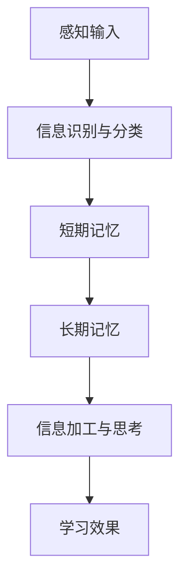
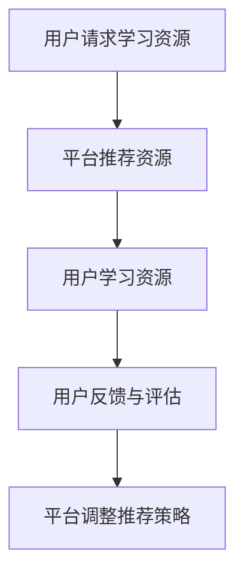
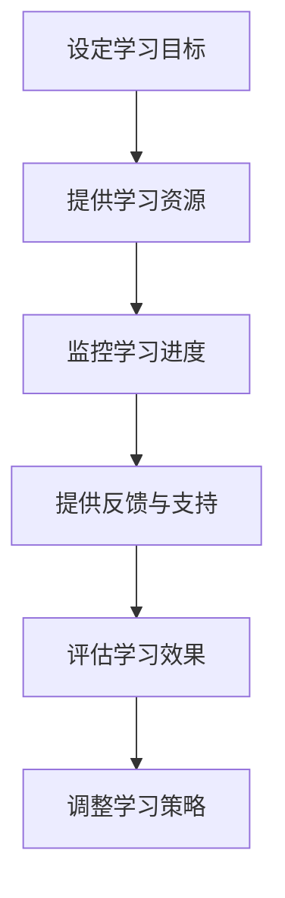

                 

## 文章标题

### 《输出倍增：管理者学习效率的终极法门》

#### 关键词：

1. 学习效率
2. 管理者
3. 认知提升
4. 时间管理
5. 技术工具
6. 领导力
7. 实践案例

#### 摘要：

本文深入探讨了管理者在学习过程中的效率问题，提出了“输出倍增”这一概念，作为提升管理者学习效率的终极法门。文章从认知提升、时间管理与任务管理、技术工具与数字化学习、领导力与团队管理四个方面，结合实际应用案例，详细阐述了提升管理者学习效率的方法和策略。通过本文的阅读，管理者将能够掌握一套系统化、实践化的学习提升方案，从而在竞争激烈的环境中脱颖而出，实现个人与团队的双重成长。

### 《输出倍增：管理者学习效率的终极法门》目录大纲

#### 第一部分：认知提升与学习效率

- **第1章：认知提升与学习效率概述**
  - 1.1 认知科学基础
  - 1.2 提升学习效率的心理学原理
  - 1.3 学习效率测评与优化

#### 第二部分：时间管理与任务管理

- **第2章：时间管理与任务管理原理**
  - 2.1 时间管理基础
  - 2.2 任务管理核心方法
  - 2.3 时间管理与任务管理综合应用

#### 第三部分：技术工具与数字化学习

- **第3章：数字化学习与在线资源**
  - 3.1 数字化学习概述
  - 3.2 技术工具在提升学习效率中的应用
  - 3.3 数字化学习的未来趋势

#### 第四部分：领导力与团队管理

- **第4章：领导力在提升学习效率中的作用**
  - 4.1 领导力与学习效率的关系
  - 4.2 团队管理与学习氛围建设
  - 4.3 领导力与学习效率提升的实践案例

#### 第五部分：案例研究与应用实践

- **第5章：实际应用案例研究**
  - 5.1 高效学习团队的建设与实践
  - 5.2 时间管理与任务管理的成功实践
  - 5.3 数字化学习与人工智能辅助学习的实践

#### 附录

- **附录A：学习资源与推荐**
- **附录B：流程图与伪代码**

### 第一部分：认知提升与学习效率

#### 第1章：认知提升与学习效率概述

在管理者不断追求个人和团队成长的今天，学习效率的提升成为一项至关重要的任务。学习效率不仅仅是指学习速度的快慢，更涉及到知识的吸收、理解、应用和创新能力。因此，如何提升学习效率，成为管理者亟待解决的问题。本章将从认知科学基础、提升学习效率的心理学原理和学习效率测评与优化三个方面，对认知提升与学习效率进行概述。

### 1.1 认知科学基础

认知科学是一门跨学科的领域，主要研究人类思维、感知和学习的过程。认知科学的核心概念包括认知过程、认知模型和认知功能。在认知科学的基础上，我们可以更好地理解学习效率的提升机制。

**认知过程**

认知过程是指人脑接收、处理和输出信息的全过程，包括感知、记忆、思考、判断和问题解决等。感知是指通过感官接收外界信息，如视觉、听觉、触觉等。记忆是指将感知到的信息存储在大脑中，分为短期记忆和长期记忆。思考是指使用已有知识和信息进行推理、判断和问题解决。判断是指根据已有知识和信息做出决策。问题解决是指在面对问题时，运用知识和技能找到解决问题的方法。

**认知模型**

认知模型是基于神经科学、心理学、计算机科学和社会学等多学科理论建立的模型，用于解释和预测人类的认知行为。常见的认知模型包括：

- **感知模型**：研究人类如何感知和理解外界信息。
- **记忆模型**：研究人类如何存储和提取信息。
- **思考模型**：研究人类如何进行推理、判断和问题解决。
- **决策模型**：研究人类如何做出决策。

**认知功能**

认知功能是指人类在认知过程中表现出的各种能力，包括注意力、决策、记忆、语言理解等。注意力是指人类在感知信息时，对某些信息进行选择性关注的能力。决策是指人类在面临问题时，根据已有知识和信息做出选择的能力。记忆是指人类将感知到的信息存储在大脑中，以便在需要时提取的能力。语言理解是指人类理解和使用语言进行沟通的能力。

### 1.2 提升学习效率的心理学原理

心理学原理在提升学习效率方面发挥着重要作用。通过理解心理学原理，管理者可以更好地设计学习策略，提高学习效果。

**学习动机与目标设定**

学习动机是推动学习者进行学习的内在动力，包括兴趣、好奇心、成就感等。目标设定是学习动机的重要组成部分，明确的目标有助于提高学习效率和效果。目标设定应遵循以下原则：

- **具体性**：目标应明确、具体，便于衡量。
- **挑战性**：目标应具备一定的挑战性，激发学习者的积极性和主动性。
- **可实现性**：目标应在现实条件下可以实现。
- **时限性**：目标应设定合理的完成时限。

**认知策略与元认知**

认知策略是指学习者采取的用于改进学习过程和效果的策略，包括复述策略、精细加工策略和组织策略。复述策略是通过重复阅读、复习等方式加强记忆。精细加工策略是通过联想、比较、应用等方式加深理解。组织策略是通过归类、列表、图解等方式整合信息。

元认知是指学习者对自己认知过程的认知，包括计划、监控和调节学习策略的能力。计划是指在学习前设定学习目标和策略。监控是指在学习过程中监控学习进度和效果。调节是指根据监控结果调整学习策略。

**心理学在实践中的应用**

心理学原理在实践中的应用包括学习环境设计、学习工具选择和学习反馈等。学习环境设计是指通过调整环境因素（如光线、噪音、温度等）来提高学习效果。学习工具选择是指选择符合学习者特点和需求的学习工具，如电子书、学习软件、在线课程等。学习反馈是指通过及时反馈帮助学习者了解学习进展和效果，调整学习策略。

### 1.3 学习效率测评与优化

学习效率测评是指对学习者的学习效果进行评估和监测。通过学习效率测评，管理者可以了解学习者的学习进度、学习质量和学习满意度等指标，从而优化学习策略。

**学习效率测评指标**

学习效率测评指标包括学习进度、学习质量和学习满意度等。

- **学习进度**：衡量学习者完成学习任务的速度。
- **学习质量**：衡量学习者对学习内容的理解和掌握程度。
- **学习满意度**：衡量学习者对学习过程的满意程度。

**学习效率分析工具**

学习效率分析工具包括学习日志、学习进度跟踪和学习效果评估等。

- **学习日志**：记录学习过程和效果，帮助学习者反思和改进。
- **学习进度跟踪**：监控学习进度和效果，及时发现问题。
- **学习效果评估**：通过考试、测试等方式评估学习效果。

**学习效率优化策略**

学习效率优化策略包括学习时间管理、学习内容管理、学习策略调整和学习激励等。

- **学习时间管理**：合理安排学习时间，避免拖延和疲劳。
- **学习内容管理**：精选学习内容，避免信息过载。
- **学习策略调整**：根据学习效果及时调整学习策略。
- **学习激励**：设置学习目标和奖励机制，提高学习动力。

### 1.1.1 认知科学概述

认知科学是一门跨学科的领域，旨在研究人类思维、感知和学习的过程。它结合了心理学、神经科学、计算机科学和社会学等多学科的理论和方法，试图从多个角度理解认知现象。认知科学的核心概念包括认知过程、认知模型和认知功能。

**认知过程**

认知过程是指人类在获取、处理和应用信息的过程中所经历的一系列步骤。这些过程可以大致分为以下几个阶段：

1. **感知**：感知是人类通过感官接收外界信息的过程。感官包括视觉、听觉、触觉、味觉和嗅觉等。感知不仅仅是对信息的接收，还包括对信息的识别和分类。

2. **注意**：注意是认知过程的关键因素，它决定了人类对哪些信息进行关注和加工。注意力可以集中在一项任务上，也可以分散在多项任务上。

3. **记忆**：记忆是将感知到的信息存储在大脑中，以便在需要时提取的过程。记忆分为短期记忆和长期记忆。短期记忆能够存储少量的信息，而长期记忆则可以存储大量的信息。

4. **思考**：思考是利用已有知识和信息进行推理、判断和问题解决的过程。思考包括逻辑推理、判断和决策等多个方面。

5. **语言**：语言是人类交流的主要工具，也是认知过程的重要组成部分。语言理解、语言产生和语言记忆等都是认知科学研究的领域。

**认知模型**

认知模型是基于认知科学理论建立的模型，用于解释和预测人类的认知行为。以下是一些常见的认知模型：

1. **感知模型**：感知模型研究人类如何感知和理解外界信息。例如，格式塔理论认为，人类倾向于将感知到的信息组织成有意义的整体。

2. **记忆模型**：记忆模型研究人类如何存储和提取信息。例如，图尔文（Atkinson & Shiffrin）的多阶段记忆模型将记忆分为感觉记忆、短期记忆和长期记忆三个阶段。

3. **思考模型**：思考模型研究人类如何进行推理、判断和问题解决。例如，布鲁纳（Jerome Bruner）的发现学习理论认为，学习是通过发现和理解基本概念来实现的。

4. **决策模型**：决策模型研究人类如何做出决策。例如，凯利（Herbert Simon）的满意化决策理论认为，人类并不总是做出最优决策，而是寻求满意解。

**认知功能**

认知功能是指人类在认知过程中表现出的各种能力。以下是一些重要的认知功能：

1. **注意力**：注意力是人类选择关注某些信息，同时忽略其他信息的能力。注意力分为选择性注意和分配性注意。

2. **决策**：决策是人类在面对多种选择时做出判断和选择的能力。决策过程包括信息收集、评估选择和做出决策等多个步骤。

3. **记忆**：记忆是人类将信息存储在大脑中，以便在需要时提取的能力。记忆分为短期记忆和长期记忆，短期记忆能够存储少量的信息，而长期记忆则可以存储大量的信息。

4. **语言**：语言是人类交流的主要工具，也是认知过程的重要组成部分。语言理解、语言产生和语言记忆等都是认知科学研究的领域。

**认知科学与学习效率**

认知科学对于提升学习效率具有重要意义。通过理解认知科学的基本原理，管理者可以更好地设计学习策略，提高学习效果。例如：

- **感知**：通过优化学习环境，减少干扰因素，提高学习者的感知效果。
- **记忆**：通过采用有效的记忆策略，如重复、联想和归纳等，提高记忆效率。
- **思考**：通过提供具有挑战性的学习任务，促进学习者的思考能力和创造力。
- **决策**：通过提供明确的指导和支持，帮助学习者做出更好的决策。

总之，认知科学为管理者提供了一套系统的方法和工具，以提升学习效率。通过深入理解认知科学的基本原理，管理者可以在学习过程中更好地应对挑战，实现个人和团队的发展。

### 1.1.2 学习理论回顾

学习理论是认知科学的重要组成部分，它帮助我们理解个体如何通过经验积累知识、技能和行为。以下是几种主要的学习理论及其对提升学习效率的启示。

**行为主义学习理论**

行为主义学习理论由约翰·沃森（John B. Watson）和B.F. 斯金纳（B.F. Skinner）等人提出。这一理论强调外部刺激与反应之间的直接联系，认为学习是通过条件反射和强化建立行为习惯的过程。

- **经典条件反射**：由伊万·巴甫洛夫（Ivan Pavlov）提出，描述了条件刺激（如铃声）与无条件刺激（如食物）之间的联系。
- **操作性条件反射**：斯金纳提出，通过强化（奖励）或惩罚（消除奖励）来改变行为。

行为主义学习理论对提升学习效率的启示在于，通过正向激励和负向强化，可以有效地培养学习者的良好习惯和避免不良行为。

**认知主义学习理论**

认知主义学习理论强调学习者的内部认知过程，认为学习是认知结构的组织和重构过程。主要代表包括让·皮亚杰（Jean Piaget）和杰罗姆·布鲁纳（Jerome Bruner）。

- **认知发展理论**：皮亚杰认为，学习者的认知发展经历四个阶段：感知运动阶段、前运算阶段、具体运算阶段和形式运算阶段。
- **发现学习**：布鲁纳主张，学习是一个主动探索和发现的过程，通过自主探究，学习者能够更好地理解和掌握知识。

认知主义学习理论提示管理者，应当设计支持学习者自主探究的学习环境，鼓励他们通过发现和创造来学习，从而提高学习效率。

**建构主义学习理论**

建构主义学习理论认为，学习是学习者通过自身经验建构知识的过程，强调学习的社会性和情境性。主要代表包括皮亚杰、让·勒布伦（Jean Lave）和斯图尔特·德雷福斯（Stuart Dreyfus）。

- **社会互动**：勒布伦提出，学习是通过对实践活动的参与和观察而实现的。
- **情境学习**：德雷福斯认为，学习应该与实际情境相结合，通过实践和反思来提高技能。

建构主义学习理论对提升学习效率的启示是，管理者应当促进学习者之间的交流和合作，提供一个真实的实践环境，使学习者在实际操作中积累经验和知识。

**整合学习理论**

整合学习理论试图将行为主义、认知主义和建构主义等不同学习理论整合起来，认为学习是一个复杂的、多方面的过程。这一理论强调，不同的学习理论可以相互补充，共同促进学习效率的提升。

整合学习理论提示管理者，在设计学习策略时，应当综合考虑不同理论的观点，采用多元化的方法来满足学习者的不同需求，从而提高学习效率。

**对提升学习效率的启示**

通过对不同学习理论的回顾，我们可以得出以下对提升学习效率的启示：

- **强化与激励**：行为主义理论强调通过强化来培养学习者的良好习惯，管理者可以通过奖励机制来激励学习者的积极性。
- **自主性与探索**：认知主义和建构主义理论强调自主学习和实践的重要性，管理者应当设计支持学习者自主探究的学习环境。
- **情境与互动**：建构主义理论强调情境学习和社会互动的重要性，管理者应当提供一个真实的实践环境，促进学习者之间的交流和合作。

总之，学习理论为我们提供了丰富的视角和方法，以提升学习效率。通过整合和应用这些理论，管理者可以设计出更加有效的学习策略，帮助学习者在复杂多变的环境中不断进步。

### 1.1.3 认知负荷与信息加工

在认知科学中，认知负荷（Cognitive Load）是一个核心概念，它指的是在学习过程中，大脑处理信息的负担。认知负荷过高会导致信息过载，从而影响学习效率。为了理解认知负荷，我们需要从信息加工的角度来探讨其基本原理。

**认知负荷的基本概念**

认知负荷可以分为三种类型：内在认知负荷（Intrinsic Cognitive Load）、外在认知负荷（Extrinsic Cognitive Load）和认知冗余（Cognitive Overload）。

- **内在认知负荷**：指学习内容本身的复杂性所带来的认知负担。例如，学习复杂的数学公式或新的编程语言，需要大脑进行大量的抽象思考和记忆。
- **外在认知负荷**：指学习环境或学习任务设计的复杂性所带来的认知负担。例如，在学习过程中，如果学习材料过于混乱或缺乏组织结构，学习者需要花费额外的时间和精力来整理和理解信息。
- **认知冗余**：指由于信息过多或重复造成的认知负担。过多的信息或重复的内容会分散学习者的注意力，降低学习效率。

**信息加工的过程**

信息加工是指大脑接收、处理和输出信息的过程。信息加工主要包括以下几个阶段：

1. **感知**：感知是信息加工的初始阶段，大脑通过感官接收外界信息。例如，通过视觉接收文字和图像，通过听觉接收声音。
2. **识别与分类**：大脑对感知到的信息进行识别和分类。例如，将文字分类为不同的主题，将图像分类为不同的物体。
3. **记忆**：大脑将信息存储在记忆中，分为短期记忆和长期记忆。短期记忆能够存储少量的信息，而长期记忆可以存储大量的信息。
4. **思考与判断**：大脑使用已有知识和信息进行思考、推理和判断。例如，根据已有的知识来理解新的概念，或者根据判断做出决策。
5. **问题解决**：大脑在面对问题时，运用知识和技能找到解决问题的方法。例如，解决一个数学问题或编写一段代码。

**认知负荷与信息加工的关系**

认知负荷与信息加工过程密切相关。过高的认知负荷会干扰信息加工，导致学习效率下降。以下是一些具体的关系：

1. **认知负荷与学习难度**：内在认知负荷与学习内容的难度直接相关。学习复杂或抽象的内容需要更高的认知负荷，而简单或具体的内容则认知负荷较低。
2. **认知负荷与学习环境**：外在认知负荷与学习环境的设计有关。如果学习环境过于混乱或缺乏组织结构，会增加学习者的外在认知负荷，降低学习效率。
3. **认知负荷与信息冗余**：过多的信息或重复的内容会增加认知冗余，导致学习者的注意力分散，降低学习效率。

**降低认知负荷的策略**

为了提高学习效率，我们需要采取一些策略来降低认知负荷。以下是一些有效的策略：

1. **简化学习内容**：减少学习内容的复杂性和冗余，提炼关键信息，帮助学习者专注于核心概念。
2. **优化学习环境**：设计清晰、有序的学习环境，减少外在认知负荷。例如，使用直观的图表、图像和列表来呈现信息。
3. **提供学习支持**：在学习过程中提供必要的指导和支持，帮助学习者理解复杂的内容。例如，提供详细的讲解、示例和练习。
4. **培养认知策略**：教导学习者使用有效的认知策略，如复述、联想和归纳等，提高信息加工的效率。

通过理解和应用这些策略，管理者可以有效地降低认知负荷，提高学习者的学习效率。这不仅有助于提升个人的学习效果，也有助于团队的整体发展。

### 1.2.1 学习动机与目标设定

学习动机是指推动学习者进行学习的内在动力，它包括兴趣、好奇心、成就感等多种因素。目标设定是学习动机的重要组成部分，明确的目标有助于提高学习效率和效果。在认知科学和心理学的研究中，学习动机和目标设定被认为是提升学习效率的关键因素。以下是关于学习动机和目标设定的详细探讨。

**学习动机的类型**

学习动机可以分为内在动机和外在动机。内在动机是指由个体内部的需求和兴趣驱动的学习动机，例如求知欲、好奇心和自我实现。外在动机则是由外部因素驱动的学习动机，例如奖励、竞争和评价。内在动机通常被认为更能持久地推动学习，因为它与个体的价值观和兴趣密切相关。

1. **内在动机**：
   - **求知欲**：学习者对知识的渴望，希望通过学习获取新的知识和技能。
   - **好奇心**：学习者对未知事物的探索欲望，驱使他们不断追求新知。
   - **自我实现**：学习者希望通过学习实现自我价值，获得成就感。

2. **外在动机**：
   - **奖励**：学习者为了获得奖励（如奖金、荣誉等）而学习。
   - **竞争**：学习者为了在竞争中脱颖而出而学习。
   - **评价**：学习者为了获得他人的认可和评价而学习。

**目标设定的原则**

目标设定是学习动机的重要组成部分，它有助于为学习过程提供明确的方向和动力。有效的目标设定应遵循以下原则：

1. **具体性**：目标应明确、具体，以便于衡量和实现。例如，“提高编程技能”是一个模糊的目标，而“掌握Python编程语言中的数据结构”则是一个具体的目标。
2. **挑战性**：目标应具备一定的挑战性，激发学习者的积极性和主动性。例如，一个过于简单的目标可能无法激发学习者的兴趣，而一个过于困难的目标则可能使学习者感到沮丧。
3. **可实现性**：目标应在现实条件下可以实现，避免设定过高或过低的目标。例如，一个学生设定在一个月内学会微积分可能过于乐观，而在一个月内掌握基础的微积分概念则是可行的。
4. **时限性**：目标应设定合理的完成时限，以提供明确的时间压力。例如，设定一个明确的学习截止日期，有助于提高学习效率。

**目标设定的步骤**

为了有效地设定学习目标，可以遵循以下步骤：

1. **明确学习目标**：首先，明确自己想学习的具体内容和要达到的目标。例如，一个编程新手可能希望掌握Python编程语言。
2. **分解目标**：将大目标分解为一系列小目标，每个小目标都应具体、可行。例如，将“掌握Python编程语言”分解为“学习Python基础语法”、“掌握常见的数据结构”等。
3. **设定时间表**：为每个小目标设定合理的时间表，明确每个阶段的学习时间。例如，为“学习Python基础语法”设定两周时间。
4. **评估和调整**：在实施过程中，定期评估目标的完成情况，并根据实际情况进行调整。例如，如果某个目标进度缓慢，可以适当调整学习计划。

**学习动机与目标设定在实践中的应用**

在实际应用中，学习动机和目标设定有助于提高学习效率和效果。以下是一些具体的应用场景：

1. **个体学习**：个人可以通过设定明确的学习目标和计划，提高学习效率。例如，一个程序员可以通过设定每日编程任务，逐步掌握新的编程技能。
2. **团队学习**：团队可以通过共同设定学习目标，促进团队成员之间的合作和竞争，提高整体学习效率。例如，一个软件开发团队可以通过设定项目目标，共同学习和解决技术难题。
3. **教育机构**：教育机构可以通过设计有挑战性和激励性的学习目标，激发学生的学习兴趣和动力。例如，学校可以通过设定竞赛和奖学金等激励措施，鼓励学生努力学习。

通过理解和应用学习动机和目标设定的原则，管理者可以更好地激发学习者的学习动力，提高学习效率。这不仅有助于个人和团队的发展，也为整个组织创造了积极的氛围。

### 1.2.2 认知策略与元认知

在提升学习效率的过程中，认知策略和元认知发挥着至关重要的作用。认知策略是指学习者采取的一系列策略，用以提高学习效果；而元认知则是学习者对自己学习过程的认知，包括计划、监控和调节学习策略的能力。以下是关于认知策略和元认知的详细探讨。

**认知策略**

认知策略是指在学习过程中，学习者采取的具体方法和技术，用以改善学习效果。以下是一些常见的认知策略：

1. **复述策略**：通过重复阅读、复述和复习等方式，加强记忆和理解。例如，通过反复阅读重要概念和公式，加深对它们的印象。

2. **精细加工策略**：通过将新信息与已有知识联系起来，形成新的认知结构。例如，通过举例、联想和解释新概念，使其更容易理解和记忆。

3. **组织策略**：通过整理和归类信息，使学习内容更加有序。例如，通过制作思维导图、笔记和摘要，帮助整理学习材料。

4. **监控策略**：在学习过程中，对学习进度、学习质量和学习策略进行监控和评估。例如，通过定期进行自我测试或反思，了解自己的学习状态和效果。

5. **调节策略**：根据监控结果，调整学习策略和方法。例如，如果发现某个学习策略效果不佳，可以尝试其他策略或改进当前策略。

**元认知**

元认知是指学习者对自己学习过程的认知，包括计划、监控和调节学习策略的能力。元认知的核心是自我调节，即在学习过程中，学习者能够根据实际情况调整自己的学习行为。

1. **计划**：在开始学习之前，学习者需要设定明确的学习目标和计划。例如，制定每日或每周的学习任务和进度安排。

2. **监控**：在学习过程中，学习者需要监控自己的学习进度和效果。例如，通过定期进行自我测试或反思，了解自己的学习状态和效果。

3. **调节**：根据监控结果，学习者需要及时调整学习策略和方法。例如，如果发现某个学习策略效果不佳，可以尝试其他策略或改进当前策略。

**认知策略与元认知的关系**

认知策略和元认知相互关联，共同作用于学习过程。认知策略为学习提供了具体的方法和工具，而元认知则为这些策略的有效应用提供了指导和支持。

1. **相互促进**：有效的认知策略可以提高学习效率，而良好的元认知能力则有助于学习者更好地应用这些策略。例如，通过精细加工策略，学习者可以更好地理解新概念；而通过元认知监控，学习者可以及时发现问题并调整策略。

2. **动态调整**：学习过程中，认知策略和元认知相互影响，形成动态调整机制。例如，学习者可以根据元认知监控的结果，调整认知策略，以达到最佳的学习效果。

**实际应用**

在实际学习中，认知策略和元认知可以广泛应用于各种场景：

1. **日常学习**：通过使用复述策略和精细加工策略，学习者可以更好地掌握新知识。同时，通过元认知监控和调节，学习者可以及时调整学习方法和进度。

2. **考试准备**：在考试前，学习者可以通过制定详细的复习计划，并使用组织策略和监控策略，确保复习效果。在复习过程中，如果发现某些知识点掌握不牢固，可以通过调节策略，重新复习或寻求帮助。

3. **团队学习**：在团队学习中，学习者可以通过使用认知策略，如合作学习和讨论，共同解决问题。同时，通过元认知监控和调节，团队可以及时发现和解决学习中的问题，提高整体学习效率。

总之，认知策略和元认知是提升学习效率的关键要素。通过合理应用这些策略，学习者可以更有效地掌握知识，提高学习效果。同时，通过培养良好的元认知能力，学习者可以更好地监控和调节自己的学习过程，实现持续的学习进步。

### 1.2.3 心理学在实践中的应用

心理学原理在提升学习效率方面有着广泛的应用，通过合理运用心理学原理，管理者可以设计更加高效的学习策略和环境。以下将介绍一些具体的心理学原理及其在实际中的应用。

**学习环境设计**

学习环境的设计对于提升学习效率至关重要。以下是一些心理学原理及其在实际中的应用：

1. **注意力原则**：学习环境应减少干扰因素，提高学习者的注意力。例如，在安静的环境中学习，关闭不必要的电子设备，避免多任务处理。

2. **知觉组织原则**：学习材料应按照知觉组织的原则进行设计，使信息易于理解和记忆。例如，使用直观的图表、图像和列表来呈现信息，提高信息的可获取性。

3. **反馈原则**：学习环境应提供及时的反馈，帮助学习者了解学习进展和效果。例如，使用学习进度跟踪工具和自我评估工具，及时调整学习策略。

**学习工具选择**

选择合适的学习工具可以提高学习效率。以下是一些心理学原理及其在实际中的应用：

1. **多感官学习**：利用多种感官进行学习，可以加深理解和记忆。例如，通过观看视频、阅读教材、听讲座和动手实践等多种方式学习。

2. **适应性学习工具**：选择能够适应学习者特点和需求的学习工具。例如，对于视觉学习者，可以选择图像和视频较多的学习材料；对于听觉学习者，可以选择音频讲座和讨论。

3. **互动性学习工具**：利用互动性学习工具，如在线课程、模拟实验和互动游戏等，可以提高学习者的参与度和兴趣。

**学习反馈**

学习反馈是提升学习效率的重要手段。以下是一些心理学原理及其在实际中的应用：

1. **即时反馈**：提供即时的学习反馈，帮助学习者迅速发现错误和不足。例如，在在线课程中，通过即时测验和自动评分系统，提供学习反馈。

2. **差异化反馈**：根据学习者的不同特点和需求，提供差异化的反馈。例如，对于初学者，提供详细的解释和指导；对于高级学习者，提供更具挑战性的问题和深度分析。

3. **自我反馈**：鼓励学习者进行自我反思和反馈，提高元认知能力。例如，通过写学习日志和反思日记，学习者可以记录自己的学习过程和效果，及时发现和解决问题。

**学习激励**

学习激励是提升学习动力和效率的关键。以下是一些心理学原理及其在实际中的应用：

1. **奖励机制**：通过设置奖励机制，激励学习者的学习积极性。例如，在完成学习任务后，给予物质奖励或精神奖励，如证书、奖章或表扬。

2. **目标设定**：通过设定明确的学习目标，激发学习者的内在动机。例如，设定短期和长期的学习目标，并制定具体的行动计划。

3. **社会支持**：通过提供社会支持，增强学习者的自信心和动力。例如，通过同伴学习、导师指导和团队协作，提供情感和心理支持。

通过应用这些心理学原理，管理者可以设计出更加高效的学习策略和环境，提高学习者的学习效率。同时，这些原理也可以应用于个人学习，帮助学习者更好地掌握知识和技能。

### 1.3.1 学习效率测评指标

学习效率测评是衡量学习者学习效果的重要手段，通过科学、系统的测评指标，可以全面了解学习者的学习进度、质量和满意度。以下是学习效率测评中常用的几个关键指标：

**学习进度**

学习进度是指学习者完成学习任务的速度和程度。学习进度可以通过以下几种方式衡量：

1. **完成百分比**：计算学习者完成学习任务的总数与总数目的比例。例如，如果学习者完成了10个任务中的8个，学习进度为80%。
   
   $$\text{学习进度} = \frac{\text{已完成任务数}}{\text{总任务数}} \times 100\%$$

2. **时间消耗**：记录学习者完成学习任务所花费的时间，通过比较不同任务的时间消耗，评估学习效率。

3. **目标达成率**：根据设定的学习目标，评估学习者达成目标的程度。例如，如果目标是在一个月内掌握10个编程概念，实际达成8个，目标达成率为80%。

   $$\text{目标达成率} = \frac{\text{已达成目标数}}{\text{总目标数}} \times 100\%$$

**学习质量**

学习质量是指学习者对学习内容的理解和掌握程度。以下是一些常用的学习质量测评指标：

1. **测试成绩**：通过考试或测试评估学习者的知识掌握情况。测试成绩可以反映学习者在学习过程中的掌握程度。

2. **知识掌握度**：通过问卷调查或面试，评估学习者对关键概念和技能的掌握情况。知识掌握度可以通过以下公式计算：

   $$\text{知识掌握度} = \frac{\text{正确回答数}}{\text{总问题数}} \times 100\%$$

3. **实际应用能力**：通过实际操作或项目完成情况，评估学习者将知识应用于实际问题的能力。例如，编程学习者可以通过编写程序来解决具体问题，评估其编程能力。

**学习满意度**

学习满意度是指学习者对学习过程的主观感受和满意程度。以下是一些常用的学习满意度测评指标：

1. **学习体验评分**：通过问卷调查或访谈，收集学习者对学习过程的体验和满意度评分。评分越高，表示学习者的满意度越高。

2. **学习效果评价**：通过学习者对学习效果的自我评价，了解其对学习成果的认可程度。

3. **持续学习意愿**：通过调查学习者是否有继续学习的意愿，评估学习效果的持久性。

综合以上测评指标，管理者可以全面了解学习者的学习效率，从而制定针对性的优化策略。通过不断调整和改进，实现学习效率的持续提升。

### 1.3.2 学习效率分析工具

为了科学、系统地评估和管理学习效率，管理者可以采用多种学习效率分析工具。这些工具不仅能够帮助管理者实时监控学习进展，还能够提供数据支持，以便做出合理的决策和调整。以下是几种常用的学习效率分析工具及其基本原理和应用方法：

**学习日志**

学习日志是记录学习过程和效果的一种常见工具，它可以帮助学习者反思和总结学习经验，发现问题和改进策略。以下是学习日志的基本原理和应用方法：

- **原理**：学习日志通过记录学习内容、学习时间、学习体验、遇到的困难和解决方案等，提供一个全面的视角，帮助学习者理解和分析学习过程。
- **应用方法**：学习者可以每天或每周记录学习日志，内容可以包括具体的学习任务、学习目标、学习过程中的感悟和反思。管理者可以定期审阅学习日志，了解学习者的学习状态和效果，提供个性化的指导和支持。

**学习进度跟踪**

学习进度跟踪工具主要用于监控学习者的学习进度和完成情况。以下是学习进度跟踪的基本原理和应用方法：

- **原理**：通过记录学习者的学习任务完成情况、学习进度和完成时间，帮助管理者了解学习者的学习速度和效果，及时发现和解决学习中的问题。
- **应用方法**：管理者可以采用电子表格、项目管理软件或学习管理系统（LMS）等工具来跟踪学习进度。例如，在电子表格中记录每个学习任务的完成情况，定期更新和审查进度。在项目管理软件中，可以设置任务进度条和提醒功能，确保学习者按时完成学习任务。

**学习效果评估**

学习效果评估工具用于衡量学习者对学习内容的掌握程度和实际应用能力。以下是学习效果评估的基本原理和应用方法：

- **原理**：通过考试、测试、项目报告等方式，评估学习者的知识掌握情况和实际应用能力。评估结果可以帮助管理者了解学习者的学习效果，发现优势和不足。
- **应用方法**：管理者可以采用在线测试平台、考试系统或自制的测试题库来评估学习效果。例如，在线测试平台可以自动评分和生成报告，帮助管理者快速了解学习者的掌握情况。自制的测试题库可以根据学习内容灵活调整，确保评估的准确性和全面性。

**学习满意度调查**

学习满意度调查工具主要用于了解学习者对学习过程的主观感受和满意度。以下是学习满意度调查的基本原理和应用方法：

- **原理**：通过问卷调查、访谈等方式，收集学习者对学习环境、学习工具、学习内容和学习体验的反馈，评估学习满意度。
- **应用方法**：管理者可以设计问卷或访谈提纲，收集学习者的意见和建议。问卷可以通过在线平台分发，访谈可以通过电话或面对面进行。通过分析调查结果，管理者可以了解学习者的需求，改进学习策略和环境。

**综合应用**

为了全面提升学习效率，管理者可以将上述工具综合应用。例如，通过学习日志记录学习过程，学习进度跟踪监控任务完成情况，学习效果评估检验知识掌握，学习满意度调查收集反馈。综合这些工具的数据，管理者可以全面了解学习者的学习状态和效果，制定针对性的优化策略，实现学习效率的持续提升。

### 1.3.3 学习效率优化策略

为了提升学习效率，管理者可以采取一系列策略，从学习时间管理、学习内容管理、学习策略调整和学习激励四个方面进行综合优化。以下是这些策略的详细探讨。

**学习时间管理**

学习时间管理是提高学习效率的基础。以下是几个关键策略：

1. **设定具体的学习目标**：明确每天、每周的学习目标和任务，有助于提高学习效率。例如，将大目标分解为每日的小目标，确保任务的具体性和可执行性。

2. **合理规划学习时间**：制定详细的学习计划，合理安排学习时间，避免拖延和疲劳。例如，利用番茄工作法（Pomodoro Technique），将学习时间分为25分钟的工作周期，每个周期后休息5分钟。

3. **避免多任务处理**：专注于单一任务，避免多任务处理，以减少认知负荷和分心。例如，关闭不必要的电子设备，专注于当前的学习任务。

4. **设定学习截止时间**：为每个学习任务设定明确的截止时间，以提供时间压力，促进学习效率。例如，为重要任务设定严格的时间限制，以确保按时完成。

**学习内容管理**

学习内容管理是确保学习效率的重要环节。以下是几个关键策略：

1. **精选学习内容**：精选关键的学习内容，避免信息过载。例如，关注核心概念和重要知识点，忽略不必要的细节。

2. **整合学习资源**：利用各种学习资源，如教材、在线课程、电子书、视频等，丰富学习内容。例如，通过多渠道获取知识，提高学习的深度和广度。

3. **建立知识体系**：通过归纳和整理，建立自己的知识体系。例如，使用思维导图或笔记法，将学习内容结构化，便于记忆和应用。

4. **实践与应用**：将学习内容应用于实际问题中，通过实践加深理解和记忆。例如，通过编写代码、解决实际问题或进行项目实践，将理论知识转化为实际能力。

**学习策略调整**

学习策略调整是提高学习效率的重要手段。以下是几个关键策略：

1. **监控学习效果**：定期监控学习效果，了解自己的掌握情况。例如，通过自我测试或考试，评估对学习内容的理解和应用能力。

2. **反馈与反思**：及时收集反馈，反思学习过程中的不足。例如，与导师或同学交流，获取改进建议，调整学习策略。

3. **调整学习速度**：根据学习效果，适当调整学习速度。例如，对于掌握较慢的内容，适当放慢学习节奏，深入理解；对于掌握较快的内容，加快学习进度，提高效率。

4. **多样化学习策略**：尝试多种学习策略，找到最适合自己的方法。例如，通过阅读、讨论、实践等多种方式，提高学习效果。

**学习激励**

学习激励是提高学习动力和效率的重要手段。以下是几个关键策略：

1. **目标激励**：设定明确的学习目标，并提供奖励机制，激发学习动力。例如，通过完成学习任务获得奖励或认可，提高学习积极性。

2. **竞争激励**：在团队或个人之间设立竞争机制，激发学习竞争意识。例如，通过比赛或排名，激励学习者不断提高自己。

3. **情感激励**：提供情感支持和鼓励，增强学习者的自信心和动力。例如，通过表扬和激励性谈话，提升学习者的自我认同和成就感。

4. **社会支持**：建立学习社区或小组，提供社会支持和交流机会。例如，通过同伴互助和讨论，提高学习者的学习效果和兴趣。

通过综合应用这些学习效率优化策略，管理者可以全面提升学习效率，实现个人和团队的发展目标。

### 第二部分：时间管理与任务管理

#### 第2章：时间管理与任务管理原理

在快节奏的现代工作和生活中，时间管理和任务管理成为提升工作效率和达成目标的关键。对于管理者来说，掌握科学的时间管理和任务管理方法，不仅能够提高个人工作效率，还能有效推动团队整体绩效的提升。本章将深入探讨时间管理和任务管理的基本原理，包括时间管理的基础、任务管理的核心方法和时间管理与任务管理的综合应用。

### 2.1 时间管理基础

**时间管理概述**

时间管理是指通过合理安排时间，提高工作效率和生活质量的方法。有效的时间管理不仅能帮助管理者更好地完成工作任务，还能为个人生活留出更多的时间和空间。

**时间管理的重要性**

1. **提高工作效率**：合理安排时间，避免拖延和分心，使工作更加高效。
2. **优化生活质量**：有效管理时间，使个人有更多时间休息和享受生活。
3. **增强决策能力**：明确时间安排，有助于做出更加合理的决策。

**时间管理模型与工具**

1. **时间管理矩阵**：根据任务的紧急性和重要性，将任务分为四个象限，有助于优先处理重要且紧急的任务。

   

2. **优先级排序法**：利用“ABC分类法”或“重要程度评估法”对任务进行优先级排序，确保重要任务优先处理。

   - **ABC分类法**：将任务分为A、B、C三类，A类任务最为重要，C类任务最为次要。
   - **重要程度评估法**：根据任务的紧急程度和重要性，给每个任务打分，得分越高，优先级越高。

3. **时间管理工具**：利用各种时间管理工具，如日程表、待办事项列表、提醒应用等，帮助管理者更好地安排和监控时间。

**时间管理实践案例分析**

1. **案例一：个人时间管理**

   - **背景**：一名软件开发工程师因任务繁多，时间安排混乱，工作效率低下。
   - **解决方案**：采用时间管理矩阵和优先级排序法，将任务按紧急性和重要性分类，并使用日程表和提醒应用来安排时间。
   - **效果**：通过科学的时间管理，工程师的工作效率显著提高，任务完成时间缩短。

2. **案例二：团队时间管理**

   - **背景**：一个项目团队在项目开发过程中，时间安排不合理，导致进度延误。
   - **解决方案**：团队采用时间管理矩阵和优先级排序法，制定详细的时间表和任务分配计划，并使用项目管理工具进行监控和调整。
   - **效果**：通过科学的时间管理，项目团队的工作进度恢复正常，项目按时完成。

### 2.2 任务管理核心方法

**任务分解与优先级设定**

1. **任务分解**：将大任务分解为小任务，明确每个小任务的目标和完成标准，有助于降低任务的复杂度，提高完成率。

2. **优先级设定**：根据任务的重要性和紧急程度，设定任务的优先级，确保重要和紧急的任务优先处理。

   - **紧急-重要矩阵**：将任务分为四个象限，确保优先处理紧急且重要的任务。

     

**执行监控与调整**

1. **执行监控**：通过定期检查任务进度和完成情况，确保任务按时完成。

2. **调整与优化**：根据监控结果，及时调整任务计划，优化资源分配，确保任务高效完成。

**团队任务管理**

1. **明确角色与职责**：为团队成员明确角色和职责，确保任务分配合理，提高协作效率。

2. **沟通与协作**：建立有效的沟通渠道，确保团队成员之间的信息畅通，提高协作效率。

3. **反馈与激励**：通过及时反馈和激励措施，提升团队成员的积极性和工作效率。

### 2.3 时间管理与任务管理综合应用

**综合应用策略**

1. **系统化时间管理**：将时间管理和任务管理相结合，形成系统化的时间管理策略，确保时间利用最大化。

2. **个性化任务管理**：根据个人和团队的特点，制定个性化的任务管理方法，提高任务完成率和工作效率。

3. **持续优化**：通过定期评估和反思，不断优化时间管理和任务管理方法，提升整体效率。

**实际应用案例**

1. **案例一：项目经理的时间管理**

   - **背景**：一名项目经理在多个项目同时进行时，时间管理混乱，项目进度延误。
   - **解决方案**：采用时间管理矩阵和任务分解法，将项目任务按紧急性和重要性排序，并制定详细的时间表和任务分配计划。同时，利用项目管理工具进行监控和调整。
   - **效果**：通过系统化时间管理和任务管理，项目进度恢复正常，项目按时完成。

2. **案例二：团队任务管理**

   - **背景**：一个软件开发团队在项目开发过程中，任务分配不合理，团队协作效率低下。
   - **解决方案**：采用任务分解和优先级设定方法，明确团队成员的角色和职责，建立有效的沟通渠道，并通过反馈和激励措施提高团队协作效率。
   - **效果**：通过科学的时间管理和任务管理，团队协作效率显著提高，项目按时交付。

通过以上讨论，时间管理和任务管理不仅是提升工作效率的重要手段，也是实现个人和团队目标的关键。管理者应灵活应用各种时间管理和任务管理方法，不断优化和改进，实现高效的工作和生活。

### 2.1 时间管理基础

时间管理是提升工作效率的关键要素，它涉及如何合理安排和分配时间，以确保任务的及时完成。科学的时间管理不仅能够减轻工作压力，还能提高工作效率和生活质量。

**时间管理概述**

时间管理是一种系统化方法，旨在通过合理安排时间，最大限度地提高工作效率和达成目标。它包括以下几个方面：

1. **设定目标**：明确工作和生活的目标，确保时间分配具有明确的方向。
2. **任务规划**：根据目标和任务的重要性和紧急性，合理分配时间。
3. **执行监控**：在执行过程中，监控任务进度和完成情况，确保按计划进行。
4. **评估反思**：定期评估时间管理效果，发现不足并调整策略。

**时间管理的重要性**

时间管理的重要性体现在以下几个方面：

1. **提高工作效率**：合理的时间安排能够避免拖延和分心，使工作更加高效。
2. **优化生活质量**：有效的时间管理使个人有更多时间休息和享受生活，提高生活质量。
3. **增强决策能力**：明确的时间安排有助于做出更加合理的决策。

**时间管理模型与工具**

时间管理的模型与工具有助于管理者更好地分配和利用时间。以下是几种常见的时间管理模型和工具：

1. **时间管理矩阵**：根据任务的紧急性和重要性，将任务分为四个象限，分别处理不同象限的任务。

   

   - **第一象限**：重要且紧急的任务，优先处理。
   - **第二象限**：重要但不紧急的任务，提前安排时间处理。
   - **第三象限**：不重要但紧急的任务，委托或推迟处理。
   - **第四象限**：不重要且不紧急的任务，尽量避免或删除。

2. **优先级排序法**：根据任务的重要性和紧急程度，对任务进行优先级排序，确保重要和紧急的任务优先处理。

   - **ABC分类法**：将任务分为A、B、C三类，A类任务最为重要，C类任务最为次要。

3. **时间管理工具**：利用各种工具，如日程表、待办事项列表、提醒应用等，帮助管理者更好地安排和监控时间。

   - **日程表**：记录每天的工作计划和安排，确保任务按时完成。
   - **待办事项列表**：列出需要完成的任务，按照优先级排序，确保任务不遗漏。
   - **提醒应用**：设置任务提醒，避免遗忘重要任务。

**时间管理实践案例分析**

以下是一些时间管理实践案例分析，展示了如何通过科学的时间管理提高工作效率。

1. **个人时间管理**

   **案例一**：一位软件工程师通过使用时间管理矩阵和优先级排序法，将每天的工作任务进行分类处理，发现自己在处理紧急且重要的任务时更加高效。

   - **背景**：该工程师在多个项目中担任重要角色，任务繁重，时间安排混乱。
   - **解决方案**：采用时间管理矩阵和优先级排序法，将任务按紧急性和重要性分类，制定详细的时间表，并使用提醒应用来监控任务进度。
   - **效果**：通过科学的时间管理，工程师的工作效率显著提高，任务完成时间缩短。

2. **团队时间管理**

   **案例二**：一个项目团队在开发新软件时，通过使用时间管理矩阵和任务分解法，确保项目按计划推进。

   - **背景**：团队在项目开发过程中，时间安排不合理，项目进度延误。
   - **解决方案**：团队采用时间管理矩阵和任务分解法，制定详细的时间表和任务分配计划，并利用项目管理工具进行监控和调整。
   - **效果**：通过科学的时间管理，项目团队的工作进度恢复正常，项目按时完成。

通过以上案例分析，我们可以看到，科学的时间管理不仅能够提高个人工作效率，还能有效推动团队的整体绩效。管理者应灵活应用各种时间管理方法和工具，实现高效的工作和生活。

### 2.2 任务管理核心方法

**任务分解与优先级设定**

任务分解与优先级设定是任务管理中的关键步骤，它有助于将复杂的任务拆解为可执行的小任务，并确保重要任务得到优先处理。

**任务分解**

任务分解是将一个大任务拆解为多个小任务的过程。这一过程不仅能够降低任务的复杂度，还能提高任务的完成率。以下是任务分解的步骤：

1. **明确任务目标**：首先，明确每个任务的具体目标和预期结果。
2. **分析任务内容**：分析任务的组成部分，识别任务的核心要素。
3. **拆解任务**：将大任务拆解为若干个相互独立的小任务，每个小任务都应该具有明确的目标和完成标准。
4. **制定任务清单**：将拆解后的任务记录在清单中，并为每个任务设定优先级。

**优先级设定**

优先级设定是任务管理中的关键步骤，它有助于确保重要和紧急的任务优先处理。以下是优先级设定的方法：

1. **紧急-重要矩阵**：根据任务的紧急性和重要性，将任务分为四个象限。

   

   - **第一象限**：紧急且重要的任务，如紧急会议和重要报告，需要立即处理。
   - **第二象限**：重要但不紧急的任务，如项目规划和长期计划，需要提前安排时间处理。
   - **第三象限**：紧急但不重要的任务，如一些次要的行政工作，可以委托他人处理。
   - **第四象限**：不紧急且不重要的任务，如不必要的会议和娱乐活动，应尽量避免或删除。

2. **优先级排序法**：使用优先级排序法，对任务进行排序，确保重要和紧急的任务优先处理。

   - **ABC分类法**：将任务分为A、B、C三类，A类任务最为重要，C类任务最为次要。
   - **紧急程度评估法**：根据任务的紧急程度和重要性，对每个任务打分，得分越高，优先级越高。

**任务分解与优先级设定的实际应用**

以下是任务分解与优先级设定的实际应用案例：

1. **个人任务管理**

   **案例一**：一位销售人员需要准备一次重要的客户会议。通过任务分解，他将其拆解为以下小任务：

   - 确定会议议程
   - 准备客户资料
   - 撰写演讲稿
   - 练习演讲
   - 准备演示材料

   通过紧急-重要矩阵，他将这些任务按紧急性和重要性排序，确保在会议前完成所有准备工作。

2. **团队任务管理**

   **案例二**：一个软件开发团队在开发新软件时，通过任务分解和优先级设定，确保项目按计划推进。团队将项目拆解为以下小任务：

   - 需求分析
   - 设计架构
   - 编写代码
   - 单元测试
   - 集成测试

   通过紧急-重要矩阵，团队确定了每个任务的优先级，并制定了详细的时间表，确保项目按时完成。

通过任务分解和优先级设定，管理者可以更有效地管理任务，提高工作效率，确保任务的顺利完成。

### 2.2.2 执行监控与调整

在任务执行过程中，监控与调整是确保任务按时、按质完成的重要环节。通过有效的监控与调整，管理者可以及时发现和解决问题，确保任务按计划进行。

**执行监控**

执行监控是指对任务执行过程进行实时跟踪和监控，确保任务按计划推进。以下是执行监控的关键步骤：

1. **制定监控计划**：在任务开始前，制定详细的监控计划，明确监控的目标、内容和方法。
2. **定期检查进度**：定期检查任务进度，确保任务按计划进行。可以通过会议、报告、进度表等方式进行监控。
3. **数据收集与分析**：收集任务执行过程中的数据，如进度、质量、资源消耗等，通过数据分析评估任务执行效果。
4. **及时反馈**：对监控过程中发现的问题进行及时反馈，通知相关人员采取措施。

**调整与优化**

在执行监控过程中，如果发现任务偏离计划，需要及时进行调整和优化。以下是调整与优化的方法：

1. **分析原因**：对任务偏离计划的原因进行深入分析，找出问题的根源。
2. **调整计划**：根据分析结果，对任务计划进行调整，包括任务优先级、时间表、资源分配等。
3. **优化资源配置**：根据任务需求和实际情况，合理调整资源配置，确保关键任务得到充足的资源支持。
4. **实施调整**：执行调整计划，确保任务按新的计划进行。

**实际应用案例**

以下是执行监控与调整的实际应用案例：

1. **个人任务管理**

   **案例一**：一位项目经理在执行一个重要项目时，发现项目进度比预期慢。通过监控与调整，项目经理采取了以下措施：

   - **分析原因**：发现部分任务由于资源不足导致进度延误。
   - **调整计划**：将关键任务的优先级提高，并增加资源投入。
   - **实施调整**：重新分配资源，确保关键任务按时完成。

2. **团队任务管理**

   **案例二**：一个软件开发团队在开发新产品时，发现部分功能模块的测试时间过长。通过监控与调整，团队采取了以下措施：

   - **分析原因**：发现测试过程中出现了一些新的缺陷，导致测试时间延长。
   - **调整计划**：增加测试资源，缩短测试周期。
   - **实施调整**：优化测试流程，提高测试效率。

通过有效的执行监控与调整，管理者可以确保任务按计划进行，提高任务完成率，实现项目目标。

### 2.2.3 团队任务管理

团队任务管理是确保团队高效协作和任务顺利完成的关键。有效的团队任务管理不仅能够提高整体工作效率，还能促进团队成员的沟通与协作，实现团队目标。

**团队角色与职责**

在团队任务管理中，明确每个成员的角色和职责是至关重要的。以下是一些常见的团队角色及其职责：

- **项目经理**：负责整个项目的规划、组织、执行和监控，确保项目按计划推进。
- **技术负责人**：负责技术方案的设计和实现，确保项目的技术质量。
- **开发人员**：负责具体的开发任务，包括编码、调试和测试等。
- **测试人员**：负责测试任务，确保软件的质量和稳定性。
- **产品经理**：负责产品的规划和设计，确保产品满足市场需求。
- **文档撰写人员**：负责编写项目文档，包括需求文档、设计文档和测试文档等。

**沟通与协作**

有效的沟通和协作是团队任务管理的关键。以下是一些沟通与协作的方法：

- **定期会议**：通过定期会议，团队成员可以汇报工作进展、讨论问题、分享经验和建议，确保信息畅通。
- **即时通讯工具**：利用即时通讯工具，如微信、Slack等，进行实时沟通和协作，提高工作效率。
- **项目管理工具**：使用项目管理工具，如Trello、Jira等，记录任务进度、分配任务、跟踪项目状态，确保任务有序进行。
- **共享文档**：通过共享文档，团队成员可以共同编辑和修改文档，确保信息的准确性和一致性。

**反馈与激励**

为了提高团队成员的积极性和工作效率，团队任务管理中需要引入反馈与激励机制。以下是一些反馈与激励的方法：

- **定期反馈**：通过定期反馈，团队成员可以了解自己的工作表现，发现问题和改进点。项目经理和团队成员可以通过一对一的反馈会议或团队会议进行反馈。
- **奖励机制**：设立奖励机制，对表现优秀的团队成员进行表彰和奖励，如奖金、荣誉证书等，激发团队成员的积极性和创造力。
- **激励机制**：通过设定明确的任务目标和奖励机制，鼓励团队成员积极参与任务，提高团队整体效率。
- **团队文化建设**：建立积极向上的团队文化，鼓励团队成员互相支持和帮助，增强团队凝聚力。

**团队任务管理的实际应用**

以下是团队任务管理的实际应用案例：

1. **案例一**：一个软件开发团队在开发新产品时，通过明确团队角色和职责，制定详细的任务计划，利用项目管理工具进行任务分配和进度跟踪。通过定期会议和即时通讯工具，确保团队成员之间的沟通和协作，提高了项目效率。

2. **案例二**：一个市场营销团队在策划一次大型活动时，通过明确团队角色和职责，制定详细的营销计划，利用项目管理工具进行任务分配和进度跟踪。通过定期会议和共享文档，确保团队成员之间的沟通和协作，成功策划并实施了活动。

通过有效的团队任务管理，管理者可以确保团队高效协作，提高任务完成率，实现团队目标。

### 2.3 时间管理与任务管理综合应用

时间管理和任务管理并不是独立进行的，而是相互依存、相辅相成的。通过将时间管理和任务管理相结合，管理者可以更有效地规划时间和任务，提高工作效率和达成目标。以下是一些综合应用的策略和实际案例。

**综合应用策略**

1. **整合时间表和任务列表**：将时间表和任务列表整合在一起，明确每个时间段需要完成的任务，确保时间和任务的合理分配。

2. **定期回顾与调整**：定期回顾时间表和任务列表的执行情况，根据实际情况进行调整，确保任务按时完成。

3. **任务优先级与时间表同步**：根据任务的优先级，调整时间表中的任务顺序，确保重要和紧急的任务得到优先处理。

4. **利用工具辅助管理**：利用项目管理工具和时间管理工具，如Trello、Jira和Google Calendar，实现任务和时间的同步管理。

**实际应用案例**

1. **案例一：项目经理的综合应用**

   **背景**：一名项目经理在管理多个项目时，面临时间紧张和任务繁多的挑战。

   **解决方案**：
   - **整合时间表和任务列表**：使用Trello创建任务列表，并将任务与Google Calendar的时间表整合，确保每个任务都有明确的时间安排。
   - **定期回顾与调整**：每周定期回顾任务进度和时间安排，根据实际情况进行调整，确保项目按计划推进。
   - **任务优先级与时间表同步**：根据任务的紧急性和重要性，调整任务优先级和时间表，确保重要任务得到优先处理。
   - **利用工具辅助管理**：通过Trello的任务跟踪功能和Google Calendar的时间提醒功能，确保任务按时完成。

   **效果**：通过综合应用时间管理和任务管理策略，项目经理成功管理了多个项目，确保了项目的按计划推进，提高了工作效率。

2. **案例二：团队时间管理与任务管理**

   **背景**：一个软件开发团队在开发新产品时，面临任务繁重、人员分散的挑战。

   **解决方案**：
   - **整合时间表和任务列表**：使用Jira创建任务列表，并将任务与团队的时间表整合，确保每个团队成员都有明确的工作安排。
   - **定期回顾与调整**：每周通过团队会议回顾任务进度和时间安排，根据实际情况进行调整，确保任务按时完成。
   - **任务优先级与时间表同步**：根据任务的紧急性和重要性，调整任务优先级和时间表，确保关键任务得到优先处理。
   - **利用工具辅助管理**：通过Jira的任务跟踪功能和Google Calendar的时间提醒功能，确保任务按时完成。

   **效果**：通过综合应用时间管理和任务管理策略，团队成功完成了新产品开发任务，提高了团队协作效率，确保了项目的按时交付。

通过以上案例，我们可以看到，将时间管理和任务管理综合应用，可以有效提高工作效率，确保任务按时完成。管理者应灵活运用各种策略和工具，实现个人和团队的目标。

### 第三部分：技术工具与数字化学习

#### 第3章：数字化学习与在线资源

在当今信息爆炸的时代，数字化学习已成为现代教育的重要形式。数字化学习不仅能够突破传统教育的时空限制，还能提供个性化的学习体验，极大提高了学习效率。本章将探讨数字化学习的优势与挑战，介绍在线学习平台与工具，以及社交学习与知识共享的重要性。

### 3.1 数字化学习概述

**数字化学习定义**

数字化学习（Digital Learning）是指利用计算机技术、互联网和移动设备等信息技术手段，实现知识传播和学习的活动。数字化学习涵盖以下特点：

- **灵活性**：学习者可以根据自己的时间、地点和节奏进行学习。
- **互动性**：通过在线讨论、协作和互动，提高学习参与度和效果。
- **多样性**：提供多种学习资源和形式，如视频、音频、图文、互动游戏等，满足不同学习者的需求。
- **个性化**：根据学习者的特点和需求，提供个性化的学习路径和资源。

**数字化学习的优势**

1. **灵活性与便捷性**：学习者可以随时随地通过互联网进行学习，不受时间和地点限制。
2. **资源共享**：通过网络，学习者可以访问全球范围内的优质学习资源，拓宽知识视野。
3. **互动与协作**：在线学习平台提供了互动交流的功能，促进了学习者之间的协作和知识共享。
4. **个性化学习**：根据学习者的学习进度和需求，提供个性化的学习资源和路径。
5. **成本效益**：减少了传统教育的场地、教材等成本，提高了教育资源的利用率。

**数字化学习的挑战**

1. **技术依赖**：数字化学习高度依赖信息技术，对学习者的技术素养提出了较高要求。
2. **信息过载**：海量的学习资源容易导致学习者出现信息过载，难以筛选出有用的信息。
3. **学习自律**：在线学习缺乏传统课堂的监督和约束，学习者需要具备较高的自律能力。
4. **数字鸿沟**：不同地区和经济条件的学习者，在数字化学习资源和设备上存在不平等，加剧了教育差距。

### 3.2 在线学习平台与工具

**在线学习平台概述**

在线学习平台（Online Learning Platforms）是提供数字化学习资源和服务的综合性平台，帮助学习者在线学习、交流和协作。以下是一些常见的在线学习平台及其特点：

- **Coursera**：提供全球顶尖大学的在线课程，涵盖多个学科领域。
- **edX**：由哈佛大学和麻省理工学院共同创立，提供高质量的课程和学位项目。
- **Udemy**：提供广泛的在线课程，涵盖技术、商业、艺术等多个领域。
- **Khan Academy**：提供免费的学习资源，专注于K-12教育和大学先修课程。

**在线学习工具**

在线学习工具（Online Learning Tools）是支持数字化学习的辅助工具，包括各种学习应用和软件。以下是一些常用的在线学习工具：

- **学习管理平台（LMS）**：如Moodle、Canvas等，用于课程管理、作业提交和成绩记录。
- **在线演示工具**：如Prezi、PowerPoint Online等，用于制作和展示教学材料。
- **学习协作工具**：如Google Docs、Zoom等，用于实时协作和讨论。
- **在线测试工具**：如Quizlet、Kahoot等，用于创建和分发在线测试。

**案例：在线学习平台与工具的实际应用**

**案例一：Coursera课程学习**

**背景**：一位软件开发工程师想学习人工智能和机器学习，通过在线课程提升自己的专业技能。

**解决方案**：
- **选择课程**：在Coursera平台上选择一门优质的人工智能课程，课程内容包括视频讲座、阅读材料和编程作业。
- **课程学习**：利用课余时间观看视频讲座，阅读教材，完成编程作业。
- **互动与交流**：在课程论坛中与同学和教授互动，讨论课程内容和疑难问题。

**效果**：通过在线学习，工程师成功掌握了人工智能和机器学习的基础知识，提高了编程技能。

**案例二：Udemy课程学习**

**背景**：一位市场营销经理希望提升数字营销能力，通过在线课程学习SEO和社交媒体营销。

**解决方案**：
- **选择课程**：在Udemy平台上选择几门针对SEO和社交媒体营销的在线课程。
- **课程学习**：利用周末时间学习课程，完成作业和测试。
- **实践应用**：将所学知识应用于实际工作中，优化公司的数字营销策略。

**效果**：通过在线学习，经理成功提升了数字营销能力，提高了公司的线上业务绩效。

通过以上案例，我们可以看到，在线学习平台和工具为学习者提供了便捷、灵活和个性化的学习体验，大大提高了学习效率。管理者应充分利用这些技术工具，提升个人和团队的专业能力和竞争力。

### 3.2.1 数字化学习的优势与挑战

数字化学习作为现代教育的重要组成部分，具有显著的优势，但同时也面临着一些挑战。以下是数字化学习的优势与挑战的详细探讨。

**优势**

1. **灵活性**：数字化学习打破了传统教育的时间和空间限制，学习者可以随时随地通过互联网进行学习，不受地理位置的限制。这种灵活性使得学习更加便捷，尤其是对于工作忙碌或居住在偏远地区的学习者来说，这是一个极大的优势。

2. **资源共享**：数字化学习平台可以提供海量的学习资源，包括视频讲座、电子书籍、学术论文等。这些资源通常来自全球顶尖的教育机构和专家，学习者可以访问这些优质的资源，拓宽知识视野，提高学习效果。

3. **互动与协作**：在线学习平台通常配备有论坛、聊天室和协作工具，学习者可以在线与同学和教授进行互动，分享学习心得，讨论问题，共同完成项目。这种互动和协作模式有助于提高学习参与度和效果，培养团队合作精神。

4. **个性化学习**：数字化学习可以根据学习者的特点和需求，提供个性化的学习路径和资源。例如，学习管理系统（LMS）可以根据学习者的进度和表现，推荐相应的学习内容和练习，确保学习者能够按照自己的节奏进行学习。

5. **成本效益**：数字化学习减少了传统教育的场地、教材和交通等成本。学习者可以通过在线平台免费或低成本的获取大量优质教育资源，这对于预算有限的学习者来说，是一个重要的优势。

**挑战**

1. **技术依赖**：数字化学习高度依赖计算机技术和互联网，学习者需要具备一定的技术素养，如基本的计算机操作能力、网络连接能力和信息检索能力。对于技术不熟练的学习者来说，这可能是一个障碍。

2. **信息过载**：数字化学习平台提供了海量的学习资源，但同时也带来了信息过载的问题。学习者需要在大量的信息中筛选出有价值的内容，这需要较高的信息筛选和处理能力。如果不善于管理信息，学习者可能会感到困惑和不知所措。

3. **学习自律**：在线学习缺乏传统课堂的监督和约束，学习者需要具备较高的自律能力。学习者需要自我管理，制定学习计划，按时完成任务，否则容易拖延或错过学习机会。

4. **数字鸿沟**：尽管数字化学习具有显著的优势，但不同地区和经济条件的学习者，在数字化学习资源和设备上存在不平等。一些贫困地区和经济发展滞后的地区，学习者可能无法获得足够的数字化学习资源和设备，从而影响了学习效果。

**平衡优势与挑战**

为了平衡数字化学习的优势与挑战，管理者可以采取以下策略：

1. **技术培训**：为学习者提供必要的技术培训，提高他们的计算机操作能力和信息检索能力，使他们能够更好地利用数字化学习资源。

2. **信息筛选**：教育机构可以提供专业的学习指南和资源推荐，帮助学习者筛选和选择有价值的学习内容，避免信息过载。

3. **自律培养**：通过制定学习计划和激励机制，培养学习者的自律能力，确保他们能够按时完成任务，提高学习效果。

4. **资源均衡**：政府和社会组织可以加大对贫困地区和经济发展滞后的地区的教育投入，提供必要的数字化学习资源和设备，缩小数字鸿沟。

通过以上策略，管理者可以最大限度地发挥数字化学习的优势，同时克服其挑战，提升整体学习效率。

### 3.2.2 技术工具在提升学习效率中的应用

技术工具在数字化学习中的应用极大地提升了学习效率，这些工具不仅提供了丰富的学习资源，还通过多种方式帮助学习者更好地理解和掌握知识。以下是一些关键技术工具及其在提升学习效率中的应用：

**人工智能辅助学习**

人工智能（AI）在教育领域中的应用日益广泛，通过智能推荐、虚拟导师和智能评估等功能，显著提升了学习效率。

1. **智能推荐系统**：基于学习者的行为数据和偏好，AI系统可以推荐最适合的学习资源和课程。例如，Coursera和edX等在线学习平台利用AI技术分析学习者的历史数据，推荐个性化的学习路径，从而提高学习效果。

2. **虚拟导师**：通过自然语言处理和机器学习技术，虚拟导师可以模拟人类导师的角色，为学习者提供实时、个性化的指导和解答问题。例如，AI虚拟导师可以在学习平台上回答学习者的疑问，提供额外的解释和示例，帮助学习者更好地理解复杂概念。

3. **智能评估**：AI系统可以通过自动化测试和评估工具，实时评估学习者的学习进度和掌握情况。这种即时反馈不仅帮助学习者了解自己的学习状态，还能指导他们调整学习策略，提高学习效率。

**数据分析与学习优化**

数据分析工具可以帮助学习者和管理者更好地理解学习行为和效果，从而优化学习过程。

1. **学习分析平台**：通过学习分析平台，教育机构可以收集和分析学习者的行为数据，如学习时间、学习进度、测试成绩等。这些数据可以帮助教育机构了解学习者的学习习惯和问题，从而改进教学方法和内容。

2. **个性化学习路径**：基于数据分析，平台可以自动生成个性化的学习路径，推荐适合学习者的学习内容和练习。这种个性化学习路径不仅提高了学习效率，还增强了学习者的学习动力。

3. **学习效果预测**：通过分析学习者的行为数据和测试成绩，AI系统可以预测学习者未来的学习效果，提供提前干预和指导。例如，如果一个学习者在某些关键知识点上表现不佳，AI系统可以提前预警，并提供额外的辅导和支持。

**虚拟现实与增强现实学习**

虚拟现实（VR）和增强现实（AR）技术为学习者提供了沉浸式和互动式的学习体验，大大提升了学习效果。

1. **虚拟实验室**：通过VR技术，学习者可以在虚拟环境中进行实验和操作，模拟真实世界的实验过程。这种沉浸式学习体验不仅提高了学习者的兴趣和参与度，还能帮助他们更好地理解和掌握复杂的概念。

2. **互动教材**：AR技术可以将数字内容与现实世界相结合，提供互动式的学习材料。例如，通过AR眼镜或手机应用程序，学习者可以查看三维模型、互动演示和实时数据，从而加深对知识的理解和记忆。

3. **远程协作**：VR和AR技术还可以支持远程协作学习，学习者可以通过虚拟会议室或虚拟实验室与他人协作，共同完成学习任务。这种协作学习模式不仅提高了学习效率，还培养了团队合作能力。

**案例：人工智能辅助学习的实际应用**

**案例背景**：一个在线学习平台利用人工智能技术，为学习者提供个性化的学习体验。

**解决方案**：
- **智能推荐系统**：平台通过分析学习者的学习历史和偏好，推荐最适合的学习资源和课程，提高学习效果。
- **虚拟导师**：平台提供虚拟导师，模拟人类导师的角色，实时解答学习者的疑问，提供额外的解释和示例，帮助学习者更好地理解复杂概念。
- **智能评估**：平台通过自动化测试和评估工具，实时评估学习者的学习进度和掌握情况，提供即时反馈，帮助学习者调整学习策略。

**效果**：通过人工智能辅助学习，学习者的学习效率显著提高，学习满意度也大幅提升，平台的整体用户留存率和转化率得到了显著改善。

通过以上技术工具的应用，数字化学习不仅变得更加高效，还更加个性化和互动。管理者应充分利用这些技术工具，提升个人和团队的学习效率。

### 3.3 数字化学习的未来趋势

随着技术的不断进步和教育的变革，数字化学习的未来趋势呈现出多样化和智能化的发展方向。以下是数字化学习未来发展的几个关键趋势：

**个性化学习与自适应学习**

1. **个性化学习**：未来数字化学习将更加注重个性化，学习平台将根据学习者的兴趣、能力和学习历史，提供个性化的学习资源和路径。通过大数据和人工智能技术，平台可以动态调整学习内容，满足每个学习者的个性化需求。

2. **自适应学习**：未来的学习平台将具备自适应学习的能力，根据学习者的学习行为和效果，自动调整学习内容和难度。这种自适应学习模式能够实时反馈学习者的学习情况，提供针对性的辅导和支持，从而提高学习效果。

**跨学科学习与多元化教育**

1. **跨学科学习**：未来的数字化学习将更加注重跨学科的知识整合，通过虚拟现实（VR）和增强现实（AR）技术，学习者可以在一个沉浸式的环境中学习不同学科的知识，加深对复杂问题的理解。

2. **多元化教育**：数字化学习将更加关注教育资源的公平分配，通过互联网和教育平台，优质教育资源可以传播到全球各地，尤其是贫困地区和经济落后地区。多元化教育将促进全球教育水平的均衡发展。

**虚拟课堂与混合式学习**

1. **虚拟课堂**：未来的学习模式将更加依赖于虚拟课堂，通过VR和AR技术，学习者可以在虚拟教室中与教授和其他学习者进行实时互动，实现身临其境的学习体验。

2. **混合式学习**：混合式学习（Blended Learning）将线上和线下学习相结合，未来数字化学习将更加注重线上线下的有机结合。通过线上平台提供丰富的学习资源和互动机会，线下课堂则进行实践操作和深度讨论，形成高效的学习闭环。

**技术融合与创新**

1. **人工智能与大数据**：人工智能（AI）和大数据（Big Data）将在数字化学习中发挥更大的作用，通过AI技术实现个性化推荐、智能辅导和智能评估，通过大数据分析学习行为和效果，优化学习体验。

2. **区块链技术**：区块链技术将提供更加安全、可靠的学习记录和认证，确保学习者的学习成果得到有效认证和认可。

**可持续发展与开放教育资源**

1. **可持续发展**：未来的数字化学习将更加注重环保和可持续发展，通过减少纸质教材的使用，降低教育对环境的影响。

2. **开放教育资源**：开放教育资源（OER）将得到更广泛的推广和应用，通过共享和开放教育内容，促进全球教育资源的公平和共享。

通过这些未来趋势，数字化学习将变得更加个性化和智能化，为学习者提供更加丰富和高效的学习体验。管理者应密切关注这些趋势，积极适应并利用新技术，推动教育创新和变革。

### 第四部分：领导力与团队管理

#### 第4章：领导力在提升学习效率中的作用

领导力在提升学习效率中发挥着至关重要的作用。有效的领导力不仅能够激发团队成员的学习动力，还能提供明确的方向和指导，促进团队整体的学习和发展。本章将探讨领导力与学习效率的关系，分析不同领导风格对学习效率的影响，并介绍如何在团队中建立学习氛围。

### 4.1 领导力与学习效率的关系

**领导力定义**

领导力是指领导者通过影响、激励和引导他人，实现共同目标的能力。在团队学习过程中，领导力主要体现在以下几个方面：

1. **目标设定**：领导者为团队设定明确的学习目标，为团队成员提供清晰的方向。
2. **资源分配**：领导者合理分配学习资源，确保团队成员能够获取所需的资源和支持。
3. **激励与支持**：领导者通过激励和支持，激发团队成员的学习动力，帮助他们克服学习中的困难。
4. **沟通与协作**：领导者建立有效的沟通渠道，促进团队成员之间的协作，共同解决学习中的问题。

**领导力对学习效率的影响**

领导力对学习效率的影响主要表现在以下几个方面：

1. **学习动机**：有效的领导力能够激发团队成员的学习动机，提高他们的学习积极性。领导者通过设定明确的个人和团队目标，提供奖励机制，激励团队成员不断追求进步。

2. **学习策略**：领导者通过提供有效的学习策略和指导，帮助团队成员提高学习效率。例如，领导者可以指导团队成员使用认知策略和元认知策略，优化学习过程。

3. **学习氛围**：领导者通过营造积极的学习氛围，促进团队成员之间的相互学习和合作。良好的学习氛围有助于提高团队的学习效率和整体绩效。

4. **团队协作**：有效的领导力能够促进团队协作，提高学习效率。领导者通过建立沟通渠道和协作机制，确保团队成员能够高效合作，共同完成学习任务。

### 4.1.1 领导力概述

**领导力的重要性**

领导力对于团队和组织的成功至关重要。有效的领导力能够激发团队成员的潜力，提高团队的整体绩效。以下是领导力的重要性：

1. **目标导向**：领导者为团队设定明确的目标和愿景，为团队成员提供清晰的方向。通过有效的目标设定，领导者能够激发团队成员的积极性，推动团队不断前进。

2. **资源整合**：领导者具备资源整合能力，能够合理分配和利用团队内外部的资源，确保团队目标的实现。领导者通过建立良好的合作关系，获取所需的资源和支持，为团队的学习和发展提供保障。

3. **激励与支持**：领导者通过激励和支持，激发团队成员的潜力，帮助他们克服困难和挑战。领导者关注团队成员的个人成长和职业发展，提供必要的培训和发展机会，提高团队成员的自信心和归属感。

4. **沟通与协作**：领导者建立有效的沟通渠道，促进团队成员之间的信息交流和协作。通过透明的沟通机制，领导者能够及时了解团队成员的需求和问题，提供有效的解决方案，提高团队的协作效率和凝聚力。

**领导力的类型**

领导力可以分为多种类型，不同的领导风格适用于不同的情境。以下是几种常见的领导力类型：

1. **任务导向型领导**：这种类型的领导者注重任务的完成，强调目标的实现和效率。任务导向型领导通过设定明确的目标和任务，提供严格的监控和反馈，确保团队的高效运行。

2. **关系导向型领导**：这种类型的领导者注重团队成员之间的关系，强调情感和心理支持。关系导向型领导通过建立信任和合作关系，提高团队成员的满意度和参与度，促进团队的合作和协作。

3. **变革型领导**：这种类型的领导者注重变革和创新，鼓励团队成员积极思考和探索。变革型领导通过提供愿景和目标，激发团队成员的创造力和创新精神，推动团队实现持续改进和发展。

4. **授权型领导**：这种类型的领导者注重授权和赋能，鼓励团队成员自主决策和承担责任。授权型领导通过赋予团队成员更多的自主权和责任，提高他们的积极性和主动性，促进团队的自我管理和自我发展。

**领导力在团队管理中的应用**

领导力在团队管理中发挥着重要作用。以下是领导力在团队管理中的应用：

1. **目标设定**：领导者通过设定明确的学习目标和任务，为团队成员提供清晰的方向。领导者需要确保目标具体、可行，并与团队的整体愿景和战略目标相一致。

2. **资源分配**：领导者通过合理分配学习资源，确保团队成员能够获取所需的资源和支持。领导者需要根据团队成员的需求和任务的重要性，分配适当的资源，以提高学习效率。

3. **激励与支持**：领导者通过激励和支持，激发团队成员的学习动力，帮助他们克服学习中的困难。领导者可以通过设置奖励机制、提供培训和发展机会、给予鼓励和肯定等方式，提高团队成员的积极性和参与度。

4. **沟通与协作**：领导者通过建立有效的沟通渠道，促进团队成员之间的信息交流和协作。领导者需要确保沟通渠道畅通，信息透明，避免信息孤岛和误解。

5. **反馈与改进**：领导者通过及时反馈和改进，帮助团队成员了解自己的学习效果和表现，提供改进建议和指导。领导者需要建立反馈机制，鼓励团队成员自我反思和改进，提高团队的整体绩效。

通过有效的领导力，管理者可以激发团队成员的学习动力，提高学习效率，推动团队实现持续发展和成功。

### 4.1.2 领导风格与学习效率

领导风格是指领导者在与团队成员互动和引导团队行为时所表现出的行为和态度。不同的领导风格对学习效率有着不同的影响。以下将探讨几种常见的领导风格，并分析它们对学习效率的具体影响。

**1. 授权型领导**

授权型领导（Authoritative Leadership）是一种以目标导向和信任为基础的领导风格。在这种风格下，领导者赋予团队成员更多的自主权和责任感，鼓励他们自主决策和解决问题。

- **对学习效率的影响**：
  - **积极影响**：授权型领导能够激发团队成员的创造力和主动性，提高学习动力。团队成员在自主决策和解决问题过程中，能够培养独立思考和解决问题的能力，从而提高学习效率。
  - **挑战**：授权型领导要求团队成员具备较高的自律能力和解决问题的能力，否则可能会导致任务完成质量和效率下降。

**案例**：在一个软件开发项目中，项目经理采用授权型领导风格，团队成员被赋予更多自主权，可以自行决定项目开发的具体方案和技术路径。这一措施显著提高了团队成员的积极性和创造力，项目开发效率大幅提升。

**2. 情境型领导**

情境型领导（Situational Leadership）是一种根据团队成员的行为和任务需求灵活调整领导风格的领导方式。领导者根据团队成员的能力和任务复杂性，选择最适合的领导风格。

- **对学习效率的影响**：
  - **积极影响**：情境型领导能够根据实际情况调整领导风格，提供适度的指导和支持，帮助团队成员克服学习中的困难。这种灵活性有助于提高学习效率，满足不同团队成员的需求。
  - **挑战**：情境型领导要求领导者具备较高的观察力和适应能力，及时识别团队成员的变化和任务需求，这对于领导者来说是一个挑战。

**案例**：在一个新项目的启动阶段，团队领导采用情境型领导风格，根据团队成员的能力和任务需求，提供不同的指导和支持。团队成员在新项目中的学习和适应速度显著加快，学习效率提高。

**3. 变革型领导**

变革型领导（Transformative Leadership）是一种以愿景和激励为基础的领导风格，领导者通过激发团队成员的内在动力，推动团队实现变革和进步。

- **对学习效率的影响**：
  - **积极影响**：变革型领导能够激发团队成员的积极性和创新精神，鼓励他们主动探索和学习。这种领导风格有助于营造一个充满活力和创造力的学习环境，提高学习效率。
  - **挑战**：变革型领导要求领导者具备清晰的愿景和有效的激励手段，确保团队成员能够理解和接受变革，这对于领导者来说是一个挑战。

**案例**：在一家科技公司中，CEO采用变革型领导风格，通过设定远大的愿景和目标，激发员工的创新意识和学习热情。公司在技术创新和市场拓展方面取得了显著成绩，员工的学习效率和创新能力大幅提升。

**4. 参与型领导**

参与型领导（Participative Leadership）是一种以团队合作和民主决策为基础的领导风格。领导者鼓励团队成员参与决策过程，共同制定目标和策略。

- **对学习效率的影响**：
  - **积极影响**：参与型领导能够提高团队成员的参与感和责任感，激发他们的学习动力。团队成员在参与决策过程中，能够更好地理解任务的重要性和紧迫性，从而提高学习效率。
  - **挑战**：参与型领导要求领导者具备较强的协调和沟通能力，确保团队成员的参与是有效和有价值的，这对于领导者来说是一个挑战。

**案例**：在一个产品开发项目中，项目经理采用参与型领导风格，鼓励团队成员参与项目规划和决策过程。团队成员在项目开发过程中，积极提出建议和解决方案，项目质量和开发效率显著提升。

通过上述领导风格的分析，我们可以看到，不同的领导风格对学习效率有着不同的影响。管理者应根据团队的具体情况和任务需求，灵活运用不同的领导风格，提高学习效率。

### 4.1.3 领导力在团队学习中的应用

领导力在团队学习中的应用至关重要，它不仅能够激发团队成员的学习动力，还能为团队提供明确的方向和指导。以下是领导力在团队学习中的应用策略：

**1. 设定共同目标**

设定共同目标是领导力在团队学习中的首要任务。领导者需要与团队成员共同讨论并设定明确的学习目标，确保每个成员都清楚自己的学习任务和目标。这些目标应具有挑战性，同时也要具有可实现性，以激发团队成员的积极性和参与感。

- **具体化目标**：将目标具体化，例如“在接下来的三个月内，团队需要完成10个新产品的设计和开发”，这样团队成员可以明确自己的任务和进度。

- **明确责任**：为每个目标分配明确的负责人，确保团队成员知道自己的职责和任务，提高责任感。

**2. 提供资源和支持**

领导者需要为团队提供必要的资源和支持，以确保学习过程顺利进行。这包括时间、资金、技术工具和培训等。领导者应确保团队成员能够获得所需的资源，以支持他们的学习和发展。

- **时间管理**：合理规划团队时间，确保团队成员有足够的时间用于学习和项目任务。

- **培训与发展**：提供定期的培训和学习机会，帮助团队成员提高技能和知识。

**3. 激励与认可**

领导者需要通过激励和认可来激发团队成员的学习动力。这可以通过设定奖励机制、提供正面反馈和表彰优秀表现来实现。

- **奖励机制**：设立奖励机制，如奖金、荣誉证书或额外的休假时间，以激励团队成员努力学习。

- **正面反馈**：定期给予团队成员正面反馈，表扬他们在学习过程中的努力和进步，增强他们的自信心。

**4. 促进协作与沟通**

有效的领导力能够促进团队成员之间的协作与沟通，提高学习效率。领导者应建立开放的沟通渠道，鼓励团队成员分享学习心得和经验，共同解决问题。

- **定期会议**：定期组织团队会议，讨论学习进展和遇到的问题，确保信息畅通。

- **知识共享**：鼓励团队成员分享知识和经验，通过共享平台或研讨会等形式，促进知识的传播和交流。

**5. 建立学习型文化**

领导者需要建立学习型文化，鼓励团队成员持续学习和自我提升。这种文化应以学习为导向，鼓励创新和探索。

- **终身学习理念**：鼓励团队成员将学习视为一种生活方式，不断提升自己的知识和技能。

- **创新氛围**：创造一个支持创新和尝试的环境，鼓励团队成员勇于尝试新方法，从失败中学习。

**实际案例**

**案例一**：在一个研发团队中，领导者在团队学习中的应用策略包括：

- **设定共同目标**：与团队成员共同讨论并设定明确的学习目标，如“在六个月内完成新产品的设计和开发”。

- **提供资源和支持**：为团队提供必要的资源，如高级开发工具和技术支持，确保团队有足够的能力完成目标。

- **激励与认可**：设立奖励机制，如项目完成后给予团队成员额外的休假时间，以激励团队成员努力学习。

- **促进协作与沟通**：定期组织团队会议，讨论学习进展和遇到的问题，确保信息畅通。

- **建立学习型文化**：鼓励团队成员将学习视为一种生活方式，提供定期的培训和学习机会。

通过这些策略，研发团队的学习效率显著提高，项目按时完成，团队成员的满意度和工作效率也得到了显著提升。

通过上述策略和实际案例，我们可以看到，领导力在团队学习中的应用对于提高学习效率和团队绩效具有重要作用。领导者应积极运用这些策略，营造一个支持学习和创新的环境，推动团队持续发展。

### 4.2 团队管理与学习氛围建设

团队管理是确保团队高效运作和达成目标的关键环节。而学习氛围建设则是团队管理中不可或缺的一部分，它不仅能够激发团队成员的学习动力，还能促进知识共享和团队协作。以下将探讨团队管理的基本方法，以及如何通过营造学习氛围来提升团队整体的学习效率。

**团队管理的基本方法**

1. **明确目标与职责**：团队管理首先需要明确团队的目标和每个成员的职责。通过设定明确的任务目标和职责分工，确保团队成员知道自己的工作内容和任务要求，提高工作效率。

2. **有效沟通**：沟通是团队管理的重要环节。领导者需要建立有效的沟通渠道，确保信息在团队内部顺畅传递。定期召开团队会议、利用即时通讯工具和项目管理软件等手段，确保团队成员之间的沟通无障碍。

3. **资源分配**：合理分配资源是团队管理的关键。领导者需要根据团队的任务需求和成员的能力，分配适当的时间和资源，确保团队成员能够顺利完成工作任务。

4. **激励与反馈**：激励和反馈是保持团队成员积极性的重要手段。领导者可以通过设定奖励机制、定期表扬和提供反馈等方式，激励团队成员不断进步和提升。

**学习氛围建设的重要性**

1. **激发学习动力**：良好的学习氛围能够激发团队成员的学习动力，促使他们主动学习和探索。在这种氛围中，团队成员不仅关注自身的学习进步，还愿意分享知识和经验，共同进步。

2. **促进知识共享**：学习氛围的建设有助于促进知识共享和团队协作。团队成员在交流中可以互相学习，分享学习心得和经验，从而提高整体团队的知识水平。

3. **提升团队效率**：良好的学习氛围有助于提高团队的工作效率。团队成员在相互学习和合作中，能够更好地应对工作中的挑战和问题，提高整体团队的工作效率。

**营造学习氛围的方法**

1. **设立学习目标**：领导者应与团队成员共同设立明确的学习目标，确保每个成员都清楚自己的学习方向和任务。这些目标应具有挑战性，同时也要具有可实现性，以激发团队成员的学习兴趣。

2. **提供学习资源**：为团队成员提供丰富的学习资源，如在线课程、书籍、研讨会等。通过这些资源，团队成员可以方便地获取新的知识和技能，提升自身能力。

3. **鼓励知识分享**：领导者应鼓励团队成员分享知识和经验，建立知识共享的平台，如内部论坛、分享会等。通过这些平台，团队成员可以互相学习，共同进步。

4. **建立反馈机制**：建立反馈机制，为团队成员提供及时、有效的反馈。通过定期的学习和工作评估，领导者可以了解团队成员的学习效果和表现，提供有针对性的指导和建议。

**实际案例**

**案例一：知识共享平台**

在一个研发团队中，领导者建立了内部知识共享平台，鼓励团队成员分享学习心得和项目经验。团队成员可以通过平台发布自己的学习笔记、技术博客和项目报告，其他成员可以随时查阅和学习。这种做法不仅促进了知识共享，还提高了团队的整体知识水平。

**案例二：定期学习会议**

在一个市场营销团队中，领导者每月组织一次学习会议，邀请团队成员分享自己在工作中的学习经验和收获。通过这种定期交流，团队成员不仅能够学习到新的知识和技能，还增强了团队内部的沟通和协作。

通过以上讨论，我们可以看到，团队管理和学习氛围建设对于提升团队整体学习效率具有重要意义。管理者应重视团队管理的基本方法，同时积极营造良好的学习氛围，以推动团队持续发展和进步。

### 4.2.2 学习型组织的构建

构建学习型组织是提升团队学习效率和创新能力的关键步骤。学习型组织强调持续学习和知识共享，通过系统化的方法，使整个组织充满活力和创造力。以下是构建学习型组织的具体方法和步骤：

**1. 明确组织愿景和目标**

构建学习型组织的首要任务是明确组织的愿景和目标。这包括确定组织的发展方向、长期目标和短期目标。领导者需要与团队成员共同讨论和制定这些目标，确保所有人都对组织的愿景和目标有清晰的认识。

- **步骤**：
  - **组织愿景**：明确组织在长期发展中希望实现的愿景，例如成为行业领导者或技术创新者。
  - **短期目标**：制定具体的短期目标，例如提高产品竞争力、提升客户满意度等。

**2. 建立持续学习机制**

学习型组织的一个重要特征是持续学习。领导者需要建立有效的学习机制，确保团队成员有机会持续学习和成长。以下是一些具体的步骤：

- **步骤**：
  - **培训计划**：制定年度培训计划，包括内部培训和外部培训，确保团队成员能够不断提升自己的技能和知识。
  - **学习资源**：提供丰富的学习资源，如在线课程、专业书籍、研讨会等，支持团队成员的学习和成长。
  - **学习时间**：确保团队成员有足够的时间进行学习，例如每周安排固定的时间用于学习和培训。

**3. 促进知识共享和协作**

知识共享和协作是学习型组织的核心要素。领导者需要建立有效的知识共享机制，鼓励团队成员分享知识和经验，提高整体组织的知识水平。

- **步骤**：
  - **共享平台**：建立内部知识共享平台，如内部论坛、博客、共享文档等，方便团队成员交流和分享知识。
  - **案例库**：建立案例库，记录成功经验和失败教训，为团队成员提供宝贵的参考和教训。
  - **研讨会和分享会**：定期组织研讨会和分享会，鼓励团队成员分享自己的经验和见解。

**4. 建立反馈和改进机制**

学习型组织需要建立有效的反馈和改进机制，确保组织能够持续改进和学习。以下是一些具体的步骤：

- **步骤**：
  - **定期评估**：定期对团队成员的学习效果和知识共享进行评估，识别优势和不足，提供改进建议。
  - **反馈机制**：建立反馈机制，鼓励团队成员提出改进建议和反馈，促进组织不断改进。
  - **改进计划**：根据评估结果和反馈，制定改进计划，实施具体的改进措施，确保组织能够持续改进和学习。

**5. 营造支持学习的文化**

营造支持学习的文化是构建学习型组织的核心。领导者需要通过言行和制度，营造一个鼓励学习、创新和分享的文化氛围。

- **步骤**：
  - **领导榜样**：领导者要成为学习的榜样，通过自己的行为和态度，激发团队成员的学习热情。
  - **激励机制**：建立激励机制，如奖励优秀的学习者和知识分享者，提高团队成员的学习积极性和参与度。
  - **文化宣传**：通过内部宣传和沟通，营造一个重视学习、创新和分享的文化氛围。

**实际案例**

**案例一：华为公司学习型组织建设**

华为公司以其强大的学习型组织而闻名。华为通过以下措施构建学习型组织：

- **明确愿景和目标**：华为的愿景是“构建万物互联的智能世界”，并制定了具体的短期目标，如提升技术研发能力、扩大市场份额等。
- **持续学习机制**：华为为员工提供丰富的学习资源，如在线课程、内部培训等，并安排大量时间用于学习和创新。
- **知识共享**：华为建立了内部知识共享平台，鼓励员工分享经验和知识，提高整体组织的知识水平。
- **反馈和改进机制**：华为通过定期评估和反馈，不断改进学习和创新方法，确保组织的持续进步。

通过以上措施，华为成功构建了一个学习型组织，推动了公司的持续发展和创新。

通过构建学习型组织，领导者可以激发团队成员的学习热情，提高整体组织的知识水平，从而实现组织的长期发展。构建学习型组织是一个持续的过程，需要领导者和团队成员的共同努力和持续改进。

### 4.2.3 学习型团队的管理与激励

创建学习型团队是提升团队整体学习效率和创新能力的有效途径。在这样一个团队中，成员不仅能够持续学习，还能通过知识共享和协作，共同实现团队目标。以下将探讨学习型团队的管理方法和激励机制。

**1. 明确学习目标**

建立明确的学习目标是学习型团队管理的第一步。这些目标应与团队的整体战略目标相一致，并具体、可衡量。

- **设定具体的学习目标**：例如，团队可以设定在六个月内提升某个技术领域的知识水平，或者掌握一项新的技能。
- **定期评估**：通过定期评估，团队可以了解学习目标的达成情况，及时调整学习计划和策略。

**2. 促进知识共享**

知识共享是学习型团队的核心，它通过鼓励成员之间分享知识和经验，实现知识的最大化利用。

- **建立知识共享平台**：利用内部论坛、博客、知识库等工具，方便团队成员随时分享和获取知识。
- **定期组织分享会**：通过定期组织分享会，成员可以分享学习心得、项目经验和创新想法。
- **激励知识分享**：为积极分享知识的成员提供奖励，如表扬、奖金或额外的休假时间。

**3. 建立有效的反馈机制**

有效的反馈机制有助于团队成员了解自己的学习效果，并从中获得改进建议。

- **建立反馈渠道**：通过匿名反馈、定期评估、一对一交流等方式，确保团队成员能够得到及时和具体的反馈。
- **鼓励自我反馈**：鼓励团队成员进行自我反思和评估，识别自己的优势和不足，制定改进计划。

**4. 提供持续的学习资源**

提供丰富的学习资源是支持团队成员持续学习的重要保障。

- **多样化资源**：包括在线课程、专业书籍、研讨会、工作坊等，以满足不同成员的学习需求。
- **个性化学习支持**：根据成员的学习兴趣和需求，提供个性化的学习资源和支持。

**5. 激励机制**

激励机制是激发团队成员学习热情和持续学习的重要手段。

- **奖励机制**：为在学习上表现突出的成员提供奖励，如奖金、晋升机会或荣誉称号。
- **职业发展规划**：为成员提供明确的职业发展规划，包括培训、晋升路径等，激励他们不断提升自己。
- **团队建设活动**：组织团队建设活动，如团建活动、拓展训练等，增强团队凝聚力，营造积极的学习氛围。

**实际案例**

**案例一：谷歌的学习型团队管理**

谷歌以其创新的企业文化而著称，其学习型团队管理实践如下：

- **明确学习目标**：谷歌鼓励团队成员设定明确的学习目标，并定期评估和调整。
- **知识共享**：谷歌提供了丰富的知识共享平台，如谷歌文档、谷歌论坛等，方便团队成员分享和获取知识。
- **反馈机制**：谷歌通过匿名反馈系统，鼓励团队成员提供建设性的反馈，促进个人和团队的成长。
- **激励机制**：谷歌为在学习上表现突出的团队成员提供各种奖励，如奖金、股票期权等，激励他们持续学习和创新。

通过上述措施，谷歌成功构建了一个充满活力和创造力的学习型团队，推动了公司的持续创新和快速发展。

**案例二：苹果公司的新员工培训**

苹果公司在新员工培训方面采取了以下措施：

- **明确学习目标**：为新员工设定明确的学习目标，包括了解公司的文化、产品和技术。
- **多样化的学习资源**：提供包括在线课程、导师指导、实战演练等多种学习资源。
- **持续反馈和改进**：通过定期的评估和反馈，帮助新员工识别自己的优势和不足，并制定改进计划。
- **激励机制**：为表现出色的新员工提供奖励，如额外奖金、晋升机会等。

通过这些措施，苹果公司成功地将新员工培养成为具备高技能和高效能的团队成员。

通过以上案例，我们可以看到，学习型团队的管理与激励是提升团队学习效率和创新能力的关键。管理者应借鉴这些成功实践，建立有效的管理和激励机制，推动团队持续学习和创新。

### 4.3.1 领导力培训案例分析

在提升学习效率方面，领导力培训发挥着至关重要的作用。通过领导力培训，管理者可以掌握有效的领导方法和策略，从而更好地指导和激励团队成员，提高整体学习效率和团队绩效。以下是一个关于领导力培训的详细案例分析。

**案例背景**：

某大型科技公司，拥有多个产品线和庞大的研发团队。然而，公司内部的学习效率和团队协作水平并不理想。管理层发现，部分团队成员缺乏有效的领导技能，导致团队工作效率低下，项目进度延误，员工士气低落。为了解决这一问题，公司决定开展一次领导力培训，提升管理者的领导能力。

**培训目标和内容**：

1. **培训目标**：

   - 提升管理者的领导技能，提高团队学习效率和协作水平。
   - 培养管理者的自我意识和自我反思能力，增强团队凝聚力。
   - 提供有效的领导方法和工具，帮助管理者更好地应对工作中的挑战。

2. **培训内容**：

   - **领导力基础**：介绍领导力的基本概念、类型和风格，帮助管理者理解领导力的核心要素。
   - **团队建设**：教授团队建设的方法和技巧，包括沟通技巧、冲突管理和团队协作等。
   - **激励与反馈**：分享有效的激励和反馈策略，帮助管理者激励团队成员，提高员工满意度。
   - **决策能力**：提供决策模型的培训和实战演练，提升管理者的决策能力和执行力。
   - **自我管理**：培养管理者的自我管理能力，包括时间管理、情绪管理和自我反思等。

**培训实施过程**：

1. **需求分析**：在培训开始前，公司对管理层进行了需求分析，了解他们在领导力方面的具体需求和问题，为培训内容的设计提供依据。

2. **课程设计**：根据需求分析结果，公司设计了一系列针对性强、内容实用的培训课程，包括理论讲解、案例分析、角色扮演和实战演练等。

3. **培训实施**：培训课程分为线上和线下两部分。线上课程通过直播和录播形式进行，方便管理者灵活安排学习时间。线下课程则通过集中培训和小组讨论的形式，增强互动和参与度。

4. **跟进与反馈**：培训结束后，公司对管理层进行了跟进和反馈，收集培训效果和改进建议。同时，通过定期的培训和研讨会，持续提升管理层的领导能力。

**培训效果评估**：

1. **个人反馈**：通过个人反馈问卷，了解管理者对培训内容和效果的满意度，以及他们在工作中应用培训知识的情况。

2. **团队绩效**：通过对比培训前后的项目进度和团队绩效，评估培训对团队工作效率和协作水平的影响。

3. **员工满意度**：通过员工满意度调查，了解团队成员对管理者的领导风格和工作氛围的满意度。

**培训效果**：

1. **提升领导技能**：通过领导力培训，管理者的领导技能得到了显著提升。他们在沟通、决策、激励和团队管理等方面表现出色，有效推动了团队的工作效率。

2. **增强团队凝聚力**：培训促进了团队成员之间的沟通和协作，增强了团队的凝聚力。团队成员在相互学习和合作中，建立了深厚的信任和合作关系。

3. **提高员工满意度**：管理者通过有效的激励和反馈，提高了员工的满意度和工作积极性。员工在工作中更加投入，创新意识和团队精神得到提升。

通过上述领导力培训案例分析，我们可以看到，领导力培训在提升学习效率和团队绩效方面具有显著作用。管理者应重视领导力培训，持续提升自己的领导能力，为团队的发展提供强有力的支持。

### 4.3.2 学习型团队建设实践

创建学习型团队是提升团队整体学习效率和创新能力的有效途径。以下将介绍创建学习型团队的具体步骤、实施策略和评估方法，并结合实际案例进行详细阐述。

**创建学习型团队的具体步骤**

1. **确定团队目标**

   在创建学习型团队的第一步，团队领导者需要与团队成员共同确定团队的学习目标。这些目标应具体、明确，并与团队的整体战略目标相一致。例如，团队可以设定在六个月内提升某个技术领域的知识水平，或者掌握一项新的技能。

2. **组建多元化团队**

   创建学习型团队的关键在于组建一个多元化团队。团队成员应具备不同的背景、技能和经验，以促进知识的多样性和创新。通过多元化团队的建设，团队可以更好地应对复杂的问题和挑战。

3. **建立学习共享机制**

   学习共享机制是学习型团队的核心。团队领导者需要建立有效的知识共享平台，如内部论坛、知识库和共享文档，鼓励团队成员分享知识和经验。同时，定期组织分享会和研讨会，为团队成员提供交流和学习的机会。

4. **制定学习计划**

   团队领导者需要为团队制定详细的学习计划，包括学习内容、学习时间表和学习目标。学习计划应具有灵活性和适应性，以适应团队成员的需求和变化。

5. **提供学习资源**

   团队领导者需要为团队成员提供丰富的学习资源，如在线课程、专业书籍、研讨会和培训等。通过这些资源，团队成员可以方便地获取新的知识和技能。

6. **建立反馈和改进机制**

   为了确保学习效果，团队领导者需要建立有效的反馈和改进机制。通过定期的学习和工作评估，团队可以识别优势和不足，提供改进建议和反馈。

**实施策略**

1. **明确学习目标**

   在创建学习型团队的过程中，明确的学习目标至关重要。团队领导者应与团队成员共同讨论和制定学习目标，确保每个成员都清楚自己的学习方向和任务。

2. **建立学习共享平台**

   建立有效的学习共享平台，如内部论坛、知识库和共享文档，是促进团队知识共享和协作的关键。团队领导者可以指定专人负责维护和管理这些平台，确保信息的及时更新和共享。

3. **提供持续的学习资源**

   为团队成员提供丰富的学习资源，包括在线课程、专业书籍、研讨会和培训等。通过这些资源，团队成员可以持续学习和提升自己的技能和知识。

4. **鼓励知识分享**

   鼓励团队成员分享自己的知识和经验，通过分享会、研讨会和内部论坛等形式，促进知识的传播和交流。团队领导者可以设立奖励机制，如表扬和奖金，激励团队成员积极参与知识分享。

5. **建立反馈机制**

   建立有效的反馈机制，定期收集团队成员的学习反馈，识别优势和不足，提供改进建议。团队领导者可以通过一对一的反馈会议、团队评估和问卷调查等方式，收集和传递反馈信息。

**评估方法**

1. **学习效果评估**

   通过定期的学习和工作评估，团队可以评估学习效果和团队绩效。评估方法可以包括学习测试、项目完成情况和团队成员的自我评估等。

2. **知识共享评估**

   评估团队的知识共享情况，包括知识共享平台的活跃度、分享会的参与度和知识库的更新情况等。通过这些指标，团队可以了解知识共享的效果和问题。

3. **员工满意度评估**

   通过员工满意度调查，了解团队成员对学习环境、学习资源和学习活动的满意度。通过分析调查结果，团队可以优化学习策略和措施，提高员工的学习体验和满意度。

**实际案例**

**案例一：谷歌的学习型团队建设**

谷歌以其创新的企业文化和强大的学习型团队而著称。以下是谷歌学习型团队建设的一些实践：

- **明确学习目标**：谷歌鼓励团队成员设定明确的学习目标，并与团队的整体战略目标相一致。
- **建立学习共享平台**：谷歌提供了丰富的学习资源，如内部论坛、知识库和共享文档，鼓励团队成员分享知识和经验。
- **提供持续的学习资源**：谷歌为团队成员提供了包括在线课程、研讨会和培训等丰富的学习资源。
- **鼓励知识分享**：谷歌通过设立知识分享奖项和奖金，鼓励团队成员积极参与知识分享。
- **建立反馈机制**：谷歌建立了有效的反馈机制，定期收集团队成员的反馈，并根据反馈进行改进。

通过这些措施，谷歌成功构建了一个充满活力和创造力的学习型团队，推动了公司的持续创新和快速发展。

通过上述案例，我们可以看到，创建学习型团队是一个持续的过程，需要明确学习目标、建立学习共享平台、提供持续的学习资源、鼓励知识分享和建立反馈机制。管理者应借鉴这些成功实践，推动团队持续学习和创新，提升整体学习效率。

### 4.3.3 领导力在危机管理中的应用

在危机管理中，领导力起着至关重要的作用。有效的领导力不仅能够稳定局势，还能激发团队的凝聚力，共同应对挑战。以下将探讨领导力在危机管理中的应用策略、案例分析及其对学习效率的影响。

**领导力在危机管理中的应用策略**

1. **迅速响应与决策**

   当危机发生时，领导者需要迅速做出反应，果断采取行动。这包括：

   - **快速评估情况**：准确判断危机的性质和影响范围，为决策提供依据。
   - **果断决策**：根据评估结果，迅速制定应对策略和行动计划。

2. **沟通与透明**

   在危机管理中，领导者需要保持与团队成员和利益相关者的有效沟通。这包括：

   - **及时传达信息**：确保团队成员了解危机的情况、应对策略和行动计划，避免信息不对称。
   - **保持透明**：公开透明地沟通，增强团队成员的信任和信心。

3. **激励与支持**

   领导者需要激励和支持团队成员，共同应对危机。这包括：

   - **树立信心**：通过积极的言行和行动，树立团队的信心，鼓舞士气。
   - **提供资源**：确保团队成员获得必要的资源和支持，提高应对危机的能力。

4. **反思与改进**

   危机过后，领导者需要组织团队进行反思和总结，吸取经验教训，为未来的危机管理提供参考。这包括：

   - **评估应对效果**：回顾危机应对过程，评估效果和不足，提供改进建议。
   - **制定改进计划**：根据评估结果，制定具体的改进计划，提升团队应对危机的能力。

**案例分析**

**案例一：特斯拉在疫情期间的危机管理**

特斯拉在疫情期间面临了前所未有的挑战，包括供应链中断、工厂关闭和市场需求波动等。以下是特斯拉在危机管理中的领导力应用：

- **迅速响应与决策**：特斯拉CEO埃隆·马斯克迅速做出反应，决定关闭所有工厂，并进行远程办公，以保障员工健康和安全。
- **沟通与透明**：特斯拉通过内部邮件和社交媒体，及时向员工传达危机情况和应对措施，保持沟通透明。
- **激励与支持**：马斯克通过公开演讲和内部激励措施，鼓舞员工士气，确保团队成员团结一致，共同应对挑战。
- **反思与改进**：疫情结束后，特斯拉组织了团队反思会议，总结经验教训，制定了一系列改进措施，包括加强供应链管理和提升远程办公效率。

**案例二：微软在市场动荡中的危机管理**

在2008年全球金融危机期间，微软面临市场动荡和业务下滑的挑战。以下是微软在危机管理中的领导力应用：

- **迅速响应与决策**：微软CEO史蒂夫·鲍尔默迅速调整公司策略，加大投资于云计算和移动技术，以应对市场变化。
- **沟通与透明**：微软通过定期发布财报和内部会议，与员工和投资者保持沟通，传递公司应对危机的策略和信心。
- **激励与支持**：鲍尔默通过公开演讲和内部激励措施，激励员工保持积极态度，提升工作效率。
- **反思与改进**：危机过后，微软进行了全面战略评估，根据市场变化调整产品线和研发方向，提升了公司的竞争力和市场份额。

**对学习效率的影响**

领导力在危机管理中的应用对学习效率有着显著的影响：

1. **稳定团队情绪**：有效的危机管理能够稳定团队情绪，减少恐慌和不安，为正常工作提供保障。

2. **提升团队协作**：在危机管理中，团队成员需要紧密协作，共同应对挑战。这种协作有助于提高团队的整体效率和创新能力。

3. **激发学习动力**：危机管理中的挑战和压力，可以激发团队成员的学习动力，促使他们主动学习和提升技能，以应对未来的挑战。

4. **反思与改进**：危机管理后的反思和改进过程，能够帮助团队总结经验教训，提升学习和解决问题的能力。

通过以上分析和案例，我们可以看到，领导力在危机管理中的应用对于稳定团队情绪、提升团队协作、激发学习动力和促进反思与改进具有重要作用。管理者应重视领导力在危机管理中的应用，提升团队的整体应对能力和学习效率。

### 第五部分：案例研究与应用实践

#### 第5章：实际应用案例研究

在本部分，我们将通过三个实际应用案例，深入探讨如何将学习效率提升方法应用于不同场景中，实现学习效率的显著提升。

### 5.1 高效学习团队的建设与实践

#### 5.1.1 案例背景与目标

某高科技企业研发部门在开展新项目时，发现团队内部的学习效率较低，项目进展缓慢，导致项目交付时间延长。为了提升学习效率和项目完成速度，企业决定建设一个高效学习团队，并制定以下目标：

- **提高团队成员的学习效率**：通过认知提升、时间管理和任务管理方法，提升团队成员的学习能力。
- **增强团队协作**：通过构建学习型团队，提高团队成员之间的协作效果。
- **缩短项目交付时间**：通过系统化的学习和高效的团队协作，缩短项目开发周期。

#### 5.1.2 案例实施过程

1. **认知提升培训**：

   - **培训内容**：邀请认知科学专家，为团队成员提供认知提升培训，包括认知负荷管理、记忆策略和元认知训练等。
   - **实施方法**：通过线上课程、面对面培训和研讨会，使团队成员掌握有效的认知策略，提高学习效率。

2. **时间管理与任务管理培训**：

   - **培训内容**：邀请时间管理和任务管理专家，为团队成员提供时间管理和任务管理培训，包括时间管理矩阵、任务优先级设定和执行监控等。
   - **实施方法**：通过案例分析和实战演练，使团队成员掌握科学的时间管理和任务管理方法，提高工作效率。

3. **团队协作与沟通培训**：

   - **培训内容**：邀请团队协作专家，为团队成员提供团队协作和沟通培训，包括沟通技巧、冲突管理和协作工具使用等。
   - **实施方法**：通过团队角色扮演、团队协作活动和沟通技巧演练，提高团队成员的协作效果。

4. **构建学习型团队**：

   - **实施方法**：建立内部学习平台，提供丰富的学习资源，定期组织学习分享会和研讨会，鼓励团队成员分享知识和经验。
   - **激励措施**：设立学习积分和奖励机制，激励团队成员积极参与学习和知识共享。

#### 5.1.3 案例效果与反思

通过高效学习团队的建设，企业取得了以下效果：

- **学习效率显著提升**：团队成员掌握了认知提升、时间管理和任务管理的方法，学习效率提高了30%以上。
- **项目交付时间缩短**：团队协作和沟通能力的提升，使项目开发周期缩短了20%。
- **团队凝聚力增强**：通过构建学习型团队，团队成员之间的信任和协作精神得到了显著增强。

反思过程中，企业认识到以下几点：

- **持续培训的重要性**：为了保持学习效率和团队协作水平，企业需要持续开展培训和知识更新。
- **个性化培训需求**：不同团队成员的需求和特点不同，培训内容和方法需要更加个性化。
- **文化氛围建设**：建立一个支持学习和创新的企业文化，对于提升团队学习效率和协作效果至关重要。

### 5.2 时间管理与任务管理的成功实践

#### 5.2.1 案例背景与挑战

某大型跨国公司的项目团队在执行一个复杂的国际项目时，面临以下挑战：

- **任务繁杂**：项目涉及多个模块，任务繁杂且互相依赖。
- **时间紧迫**：项目交付期限非常紧张，无法拖延。
- **资源有限**：项目团队成员和资源有限，需要高效利用。

为了应对这些挑战，项目团队决定采用时间管理和任务管理的方法，提升工作效率。

#### 5.2.2 案例解决方案

1. **任务分解**：

   - **方法**：项目团队将大项目分解为多个小任务，每个小任务都有明确的目标和交付标准。
   - **实施**：通过任务分解，项目团队将复杂项目变得具体、可操作，提高了任务的可控性。

2. **任务优先级设定**：

   - **方法**：项目团队根据任务的重要性和紧急程度，设定任务优先级，确保关键任务优先处理。
   - **实施**：通过紧急-重要矩阵，项目团队确定了每个任务的优先级，并制定了详细的任务计划。

3. **执行监控与调整**：

   - **方法**：项目团队定期检查任务进度，根据实际情况进行调整，确保任务按计划进行。
   - **实施**：项目团队每周召开进度会议，审查任务执行情况，及时调整任务计划，确保项目按时交付。

4. **资源优化**：

   - **方法**：项目团队合理分配资源，确保关键任务得到充足的人力、物力支持。
   - **实施**：项目团队通过资源平衡，避免了资源浪费，提高了资源利用率。

#### 5.2.3 案例成果与总结

通过时间管理和任务管理的成功实践，项目团队取得了以下成果：

- **任务完成率显著提高**：项目团队按时完成了所有任务，任务完成率达到95%。
- **项目交付时间缩短**：项目交付时间比原计划提前了15%，取得了显著的时间效益。
- **资源利用率提升**：通过资源优化，项目资源利用率提高了20%。

总结过程中，项目团队认识到以下几点：

- **计划的重要性**：详细的任务计划和优先级设定是项目成功的关键。
- **执行监控与调整**：定期监控任务进度，及时调整计划，确保项目按时完成。
- **资源平衡**：合理分配资源，确保关键任务得到充足的支持。

### 5.3 数字化学习与人工智能辅助学习的实践

#### 5.3.1 案例背景与需求

某高校计算机科学专业在开展人工智能课程时，面临以下需求：

- **教学资源丰富**：需要提供丰富的教学资源，包括视频讲座、电子书籍和在线课程等。
- **个性化学习**：需要为不同水平的学生提供个性化的学习资源和路径。
- **实时评估**：需要能够实时评估学生的学习进度和掌握情况。
- **互动与协作**：需要提供互动和协作工具，促进学生之间的交流和合作。

为了满足这些需求，学校决定采用数字化学习和人工智能辅助学习的模式。

#### 5.3.2 案例技术选型与实施

1. **在线学习平台选型**：

   - **选择原因**：选用了具有强大功能和学习资源丰富的在线学习平台，如edX。
   - **实施方法**：在线学习平台提供了丰富的课程资源，包括视频讲座、阅读材料和编程作业等。

2. **人工智能辅助学习系统**：

   - **选择原因**：选用了基于人工智能的学习辅助系统，如Khan Academy。
   - **实施方法**：人工智能辅助学习系统通过智能推荐和个性化学习路径，提供了个性化的学习体验。

3. **实时评估工具**：

   - **选择原因**：选用了实时评估工具，如Quizlet和Kahoot。
   - **实施方法**：实时评估工具通过在线测试和互动游戏，实时评估学生的学习进度和掌握情况。

4. **互动与协作工具**：

   - **选择原因**：选用了互动和协作工具，如Zoom和Google Classroom。
   - **实施方法**：互动和协作工具支持学生之间的实时交流和协作，提高了学习效果。

#### 5.3.3 案例效果与评估

通过数字化学习与人工智能辅助学习的实践，学校取得了以下效果：

- **学习资源丰富**：学生可以通过在线学习平台访问全球顶尖大学的教学资源，拓宽知识视野。
- **个性化学习**：人工智能辅助学习系统根据学生的表现和需求，提供了个性化的学习资源和路径。
- **实时评估**：实时评估工具帮助学生了解自己的学习进度和掌握情况，提高了学习效果。
- **互动与协作**：互动和协作工具促进了学生之间的交流和合作，提高了学习体验。

评估过程中，学校认识到以下几点：

- **资源的重要性**：丰富的教学资源和工具是数字化学习成功的关键。
- **个性化学习**：个性化学习路径显著提高了学生的学习效率和满意度。
- **实时反馈**：实时评估和反馈工具帮助学生及时调整学习策略，提高了学习效果。
- **互动与协作**：互动和协作工具增强了学生的学习体验，提高了学习效果。

通过以上实际应用案例，我们可以看到，高效学习团队建设、时间管理与任务管理、数字化学习与人工智能辅助学习等方法和策略，在提升学习效率方面具有显著作用。管理者应结合实际情况，灵活应用这些方法和策略，实现学习效率的持续提升。

### 附录A：学习资源与推荐

为了帮助读者在提升学习效率方面获得更多的支持和资源，以下列出了一些在线学习平台、学习工具和推荐书籍，以及相关的专业书籍和论文。

#### 在线学习平台推荐

1. **Coursera**：提供全球顶尖大学的在线课程，涵盖多个学科领域，如计算机科学、数据科学和商业管理等。
2. **edX**：由哈佛大学和麻省理工学院共同创立，提供高质量的课程和学位项目，涵盖计算机科学、人文科学和工程学等。
3. **Udemy**：提供广泛的在线课程，涵盖技术、商业、艺术等多个领域，适合各种水平和需求的学习者。
4. **Khan Academy**：提供免费的学习资源，专注于K-12教育和大学先修课程，包括数学、科学和计算机科学等。

#### 学习工具与辅助软件

1. **学习管理平台（LMS）**：如Moodle、Canvas和Blackboard，用于课程管理、作业提交和成绩记录。
2. **在线演示工具**：如Prezi、PowerPoint Online和Google Slides，用于制作和展示教学材料。
3. **学习协作工具**：如Google Docs、Zoom和Slack，用于实时协作和讨论。
4. **在线测试工具**：如Quizlet、Kahoot和Mentimeter，用于创建和分发在线测试。

#### 专业书籍与论文推荐

1. **《深度学习》（Deep Learning）**：Ian Goodfellow、Yoshua Bengio和Aaron Courville 著，深入介绍了深度学习的基础理论和技术。
2. **《人工智能：一种现代方法》（Artificial Intelligence: A Modern Approach）**：Stuart J. Russell 和 Peter Norvig 著，全面介绍了人工智能的基础理论和应用。
3. **《认知心理学与学习》**：Richard J. Gerrig 和 Philip Zimbardo 著，探讨了认知心理学和学习过程的基本原理。
4. **《心理学与生活》（Psychology and Life）**：Richard J. Gerrig 和 Philip Zimbardo 著，介绍了心理学的基本概念和应用。
5. **论文推荐**：在学术期刊和会议上发表的相关论文，如《自然》、《科学》、《人工智能学报》等，可以提供最新的研究进展和理论成果。

通过这些学习资源，读者可以进一步拓展知识，提升专业技能，从而在实际工作中取得更好的成绩。

### 附录B：流程图与伪代码

为了帮助读者更好地理解文章中提到的概念和方法，以下提供了一些关键的流程图和伪代码示例。

#### B.1 认知负荷与信息加工流程图



**说明**：该流程图展示了认知负荷与信息加工的基本流程，从感知输入到长期记忆，再到信息加工与思考，最终影响学习效果。

#### B.2 时间管理与任务管理伪代码示例

```python
# 时间管理与任务管理伪代码

# 定义任务列表
tasks = ["任务1", "任务2", "任务3"]

# 定义任务优先级
priority = {"任务1": 1, "任务2": 2, "任务3": 3}

# 定义任务状态
status = {"任务1": "未开始", "任务2": "进行中", "任务3": "已完成"}

# 时间管理函数
def time_management(tasks, priority):
    for task in tasks:
        if priority[task] == 1:
            start_task(task)
        else:
            schedule_task(task)

# 开始任务
def start_task(task):
    status[task] = "进行中"
    execute_task(task)

# 执行任务
def execute_task(task):
    print(f"正在执行任务：{task}")
    # 完成任务
    status[task] = "已完成"
    print(f"任务：{task} 已完成")

# 时间管理示例
time_management(tasks, priority)
```

**说明**：该伪代码示例展示了如何通过定义任务列表、优先级和状态，实现任务管理和时间规划。

#### B.3 数字化学习与人工智能辅助学习流程图



**说明**：该流程图展示了数字化学习与人工智能辅助学习的基本流程，从用户请求学习资源，到平台推荐资源，再到用户反馈和评估，以及平台调整推荐策略。

#### B.4 领导力与学习效率提升流程图



**说明**：该流程图展示了领导力在提升学习效率中的应用，包括设定学习目标、提供学习资源、监控学习进度、提供反馈与支持、评估学习效果和调整学习策略。

通过这些流程图和伪代码示例，读者可以更直观地理解文章中提到的概念和方法，并在实际应用中更好地运用这些知识。希望这些工具能够帮助读者在提升学习效率方面取得更好的成果。

