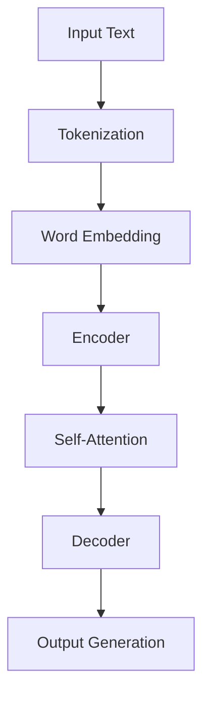

                 

# 边缘计算与 LLM：低延迟、高效率的 AI

> 关键词：边缘计算、大语言模型（LLM）、AI、低延迟、高效率

> 摘要：本文将探讨边缘计算与大语言模型（LLM）的结合，介绍边缘计算的基础知识、LLM的技术原理，以及边缘计算与LLM在低延迟、高效率AI应用中的实践。通过分析两者融合的优势与挑战，文章旨在为读者提供完整的理解与实践指导。

## 《边缘计算与 LLM：低延迟、高效率的 AI》目录大纲

### 第一部分：边缘计算基础

#### 第1章：边缘计算概述
- **1.1 边缘计算的起源与发展**
  - **边缘计算的背景**
  - **边缘计算的发展历程**
  - **边缘计算的核心特点**
- **1.2 边缘计算与传统云计算的区别**
  - **计算资源的分布**
  - **数据处理的延迟**
  - **安全性与隐私**
- **1.3 边缘计算的应用场景**
  - **物联网（IoT）应用**
  - **智能城市**
  - **自动驾驶**

#### 第2章：边缘计算网络架构
- **2.1 边缘计算网络架构概述**
  - **边缘网络的结构**
  - **边缘网络的层次**
  - **边缘网络的关键组件**
- **2.2 边缘服务器与设备**
  - **边缘服务器的性能要求**
  - **边缘设备的多样性**
  - **边缘设备的能耗管理**
- **2.3 边缘计算网络通信协议**
  - **通信协议的选择**
  - **物联网通信协议**
  - **5G网络与边缘计算**

### 第二部分：LLM技术基础

#### 第3章：大语言模型（LLM）概述
- **3.1 大语言模型的定义**
  - **大语言模型的概念**
  - **大语言模型的演变**
  - **大语言模型的核心优势**
- **3.2 主流LLM模型介绍**
  - **GPT系列模型**
  - **BERT及其变体**
  - **其他知名LLM模型**

#### 第4章：LLM技术原理
- **4.1 自然语言处理（NLP）基础**
  - **词嵌入技术**
  - **序列模型与注意力机制**
  - **转换器架构**
- **4.2 大规模预训练模型原理**
  - **预训练的概念与意义**
  - **自监督学习方法**
  - **迁移学习与微调技术**
- **4.3 LLM训练与优化算法**
  - **训练数据的选择**
  - **优化算法的演进**
  - **模型蒸馏与量化技术**

### 第三部分：边缘计算与LLM结合

#### 第5章：边缘计算中的LLM应用
- **5.1 边缘计算对LLM的需求**
  - **计算资源限制**
  - **数据隐私保护**
  - **实时响应能力**
- **5.2 边缘计算中的LLM应用场景**
  - **智能语音助手**
  - **智能图像识别**
  - **实时文本分析**
- **5.3 LLM在边缘计算中的部署**
  - **模型压缩技术**
  - **边缘服务器的部署策略**
  - **边缘与云端协同工作**

#### 第6章：边缘计算与LLM融合技术的挑战与解决方案
- **6.1 挑战分析**
  - **计算资源优化**
  - **数据传输效率**
  - **模型更新与迁移**
- **6.2 解决方案探讨**
  - **混合云架构**
  - **边缘AI硬件加速**
  - **分布式计算与协作学习**

### 第四部分：案例研究

#### 第7章：边缘计算与LLM项目实战
- **7.1 项目背景与目标**
  - **项目背景介绍**
  - **项目目标设定**
- **7.2 系统设计与实现**
  - **系统架构设计**
  - **开发环境搭建**
  - **源代码详细实现**
  - **代码解读与分析**
- **7.3 项目效果评估**
  - **性能指标分析**
  - **用户体验评估**
  - **项目总结与反思**

### 附录

#### 附录A：边缘计算与LLM相关资源
- **开源框架与工具**
- **在线课程与教程**
- **技术社区与论坛**
- **参考文献**

#### 附录B：大语言模型（LLM）流程图
- **Mermaid 流程图**：展示LLM的架构与流程

#### 附录C：LLM训练伪代码
- **伪代码**：详细描述LLM的训练过程

#### 附录D：数学模型与公式
- **LaTeX 格式数学公式**：详细介绍LLM中的数学模型与公式

#### 附录E：案例代码示例
- **代码示例**：提供实际案例的代码片段，包括详细解释说明。

## 第一部分：边缘计算基础

### 第1章：边缘计算概述

#### 1.1 边缘计算的起源与发展

边缘计算作为一种新兴的计算模式，其起源可以追溯到互联网的发展初期。随着物联网（IoT）的兴起，越来越多的设备开始连接到互联网，产生了大量的数据。然而，传统的云计算模式无法满足这些设备对低延迟、高可靠性的需求，因此边缘计算的概念应运而生。

**边缘计算的背景**

在云计算时代，所有的计算任务都集中在数据中心，用户通过互联网访问数据中心进行数据处理。然而，随着物联网设备的激增，数据传输量急剧增加，数据中心面临巨大的压力。此外，一些应用场景，如自动驾驶、智能制造等，对数据处理的实时性要求极高，传统的云计算模式无法满足这些需求。

**边缘计算的发展历程**

边缘计算的发展历程可以分为以下几个阶段：

1. **边缘计算概念的提出**：2005年，IEEE首次提出了边缘计算的概念，旨在将计算能力从数据中心扩展到网络边缘。
2. **物联网的兴起**：2010年左右，物联网技术开始迅速发展，为边缘计算提供了大量的应用场景。
3. **5G网络的部署**：5G网络的部署为边缘计算提供了高速、低延迟的网络环境，进一步推动了边缘计算的发展。
4. **人工智能的崛起**：随着人工智能技术的不断进步，边缘计算与人工智能的结合成为当前研究的热点。

**边缘计算的核心特点**

边缘计算具有以下几个核心特点：

1. **分布式计算**：边缘计算将计算任务分布到网络边缘的设备上，减少了数据传输的距离，提高了数据处理的速度。
2. **低延迟**：边缘计算将数据处理靠近数据源，减少了数据传输的延迟，适用于对实时性要求高的应用场景。
3. **高可靠性**：边缘计算通过分散计算任务，提高了系统的可靠性，减少了单点故障的风险。
4. **数据隐私保护**：边缘计算将数据处理的任务分布在网络边缘，减少了数据在传输过程中的泄露风险。

#### 1.2 边缘计算与传统云计算的区别

**计算资源的分布**

传统云计算模式中，所有的计算任务都集中在数据中心，用户通过互联网访问数据中心进行数据处理。而边缘计算将计算任务分布到网络边缘的设备上，用户可以直接在边缘设备上进行数据处理。

**数据处理的延迟**

传统云计算模式由于数据传输的距离较长，数据处理存在一定的延迟。而边缘计算将数据处理靠近数据源，大大减少了数据传输的延迟，适用于对实时性要求高的应用场景。

**安全性与隐私**

传统云计算模式中，数据在传输过程中存在一定的泄露风险。而边缘计算通过将数据处理分布在网络边缘，减少了数据在传输过程中的泄露风险，提高了数据的安全性。

#### 1.3 边缘计算的应用场景

边缘计算具有广泛的应用场景，下面列举几个典型的应用场景：

**物联网（IoT）应用**

物联网设备产生的数据量巨大，对实时性要求高。边缘计算可以将数据处理分散到网络边缘的设备上，提高了数据处理的速度和实时性。

**智能城市**

智能城市中，各种传感器设备收集的数据需要实时处理和分析，以便实现智能化的管理和决策。边缘计算可以处理这些海量数据，提供实时的数据分析结果。

**自动驾驶**

自动驾驶对实时性要求极高，需要实时处理来自传感器和摄像头的海量数据。边缘计算可以处理这些数据，为自动驾驶系统提供实时的决策支持。

### 第2章：边缘计算网络架构

#### 2.1 边缘计算网络架构概述

边缘计算网络架构是指边缘计算中网络的结构和组成部分。边缘计算网络架构可以分为以下几个层次：

1. **感知层**：包括各种传感器和物联网设备，负责收集数据。
2. **边缘层**：包括边缘服务器和边缘设备，负责数据的初步处理和存储。
3. **中心层**：包括数据中心和云计算资源，负责数据的进一步处理和分析。

边缘计算网络架构的核心组件包括：

1. **边缘服务器**：边缘服务器是边缘计算的核心设备，负责处理大量的数据。
2. **边缘设备**：边缘设备包括各种物联网设备，如传感器、摄像头等，负责数据的采集和初步处理。
3. **边缘网络**：边缘网络是连接边缘服务器和边缘设备的通信网络，负责数据的传输。

#### 2.2 边缘服务器与设备

**边缘服务器的性能要求**

边缘服务器需要具备以下性能要求：

1. **计算性能**：边缘服务器需要具备强大的计算能力，能够处理大量的数据。
2. **存储性能**：边缘服务器需要具备高效的存储性能，能够快速地读写数据。
3. **低延迟**：边缘服务器需要具备低延迟的特点，能够快速响应用户请求。

**边缘设备的多样性**

边缘设备包括各种类型的设备，如传感器、摄像头、智能手表等。不同类型的设备具有不同的性能要求，需要根据具体应用场景选择合适的边缘设备。

**边缘设备的能耗管理**

边缘设备通常采用电池供电，因此能耗管理非常重要。边缘设备需要具备低功耗的特点，延长电池寿命。

#### 2.3 边缘计算网络通信协议

**通信协议的选择**

边缘计算网络通信协议的选择取决于应用场景和性能需求。常见的通信协议包括：

1. **物联网通信协议**：如MQTT、CoAP等，适用于低功耗、低带宽的物联网设备。
2. **5G网络与边缘计算**：5G网络为边缘计算提供了高速、低延迟的网络环境，适用于对实时性要求高的应用场景。

### 第二部分：LLM技术基础

#### 第3章：大语言模型（LLM）概述

#### 3.1 大语言模型的定义

大语言模型（Large Language Model，简称LLM）是一种基于深度学习的自然语言处理模型，能够对文本进行生成、翻译、摘要等操作。LLM的核心优势在于其能够对海量文本数据进行预训练，从而学习到语言的基本规律和知识。

**大语言模型的概念**

大语言模型是一种自回归语言模型，其输入和输出都是文本序列。模型通过学习输入序列的概率分布，预测下一个单词或字符。

**大语言模型的演变**

大语言模型的发展历程可以分为以下几个阶段：

1. **早期模型**：如n-gram模型和隐马尔可夫模型，基于统计方法进行文本生成。
2. **基于神经网络的模型**：如递归神经网络（RNN）和长短时记忆网络（LSTM），能够更好地处理长文本序列。
3. **基于Transformer的模型**：如GPT、BERT等，通过自注意力机制和多层神经网络结构，实现了对文本的深度理解和生成。

**大语言模型的核心优势**

大语言模型的核心优势包括：

1. **强大的文本生成能力**：能够生成高质量的自然语言文本。
2. **多语言支持**：通过预训练和微调，可以支持多种语言的文本处理。
3. **灵活的应用场景**：广泛应用于聊天机器人、智能客服、文本摘要、机器翻译等领域。

#### 3.2 主流LLM模型介绍

**GPT系列模型**

GPT（Generative Pre-trained Transformer）是由OpenAI提出的一系列基于Transformer架构的大语言模型。GPT系列模型以其强大的文本生成能力和多语言支持著称。

**BERT及其变体**

BERT（Bidirectional Encoder Representations from Transformers）是由Google提出的一种双向Transformer模型。BERT通过双向注意力机制，对文本进行深度理解和生成。BERT及其变体如RoBERTa、ALBERT等，在自然语言处理任务中取得了显著的性能提升。

**其他知名LLM模型**

除了GPT和BERT，还有许多其他知名的大语言模型，如T5、ERNIE、LLaMA等。这些模型在特定任务和应用场景中表现出了优异的性能。

#### 第4章：LLM技术原理

#### 4.1 自然语言处理（NLP）基础

自然语言处理（Natural Language Processing，简称NLP）是计算机科学和人工智能领域的一个重要分支，旨在使计算机能够理解、生成和处理人类语言。NLP技术的基础包括以下几个方面：

**词嵌入技术**

词嵌入（Word Embedding）是将词汇映射到低维向量空间的一种方法，使得计算机能够通过向量的数学运算来处理语言。词嵌入技术主要包括以下几种：

1. **基于统计的词嵌入**：如n-gram模型和CBOW（Continuous Bag of Words）模型，通过统计词汇出现的频率和上下文信息进行词嵌入。
2. **基于神经网络的词嵌入**：如Word2Vec、GloVe（Global Vectors for Word Representation），通过神经网络训练得到词汇的向量表示。

**序列模型与注意力机制**

序列模型（Sequence Model）是一种用于处理序列数据的模型，如递归神经网络（RNN）和长短时记忆网络（LSTM）。这些模型通过处理输入序列的历史信息，生成输出序列。

注意力机制（Attention Mechanism）是一种用于提高模型对序列数据理解和处理的能力的方法。注意力机制通过动态调整模型对输入序列中不同部分的关注程度，实现对关键信息的提取和权重分配。

**转换器架构**

转换器（Transformer）是由Google提出的一种基于自注意力机制的序列到序列模型。转换器通过自注意力机制和多头注意力，能够高效地处理长序列数据。

**自注意力机制（Self-Attention）**：自注意力机制允许模型在生成每个输出时，自动考虑输入序列中所有位置的信息，从而实现对输入序列的全局理解。

**多头注意力（Multi-Head Attention）**：多头注意力机制通过将输入序列分成多个子序列，分别进行自注意力计算，然后合并结果，从而提高模型的表示能力。

**编码器-解码器架构（Encoder-Decoder Architecture）**：编码器（Encoder）负责对输入序列进行编码，生成固定长度的上下文表示；解码器（Decoder）负责根据编码器的输出，生成输出序列。编码器和解码器之间通过自注意力机制进行交互，实现对输入序列的解码。

#### 4.2 大规模预训练模型原理

大规模预训练（Large-scale Pre-training）是一种通过在大量文本数据上进行预训练，使模型具有通用语言理解能力的方法。大规模预训练模型主要包括以下几个步骤：

**预训练的概念与意义**

预训练（Pre-training）是指在使用特定任务数据对模型进行微调之前，先在大量未标记的数据上进行训练，使模型具备一定的通用语言理解和生成能力。预训练的意义在于：

1. **提高模型性能**：通过预训练，模型可以在特定任务上取得更好的性能，减少对大量标注数据的依赖。
2. **通用性**：预训练使模型具有对多种语言和任务的理解能力，提高模型的泛化能力。
3. **降低训练成本**：预训练模型可以复用在多个任务上，减少对每个任务的单独训练。

**自监督学习方法**

自监督学习（Self-supervised Learning）是一种利用未标记数据训练模型的方法。在自监督学习中，模型通过预测输入数据的部分信息来学习，从而获得对数据的理解。

自监督学习方法包括以下几个步骤：

1. **数据预处理**：对大量文本数据进行预处理，如文本清洗、分词等。
2. **掩码语言建模（Masked Language Modeling，MLM）**：在预处理后的文本数据中，随机掩码部分词汇，然后训练模型预测这些掩码词汇。
3. **预测任务生成**：通过预测掩码词汇，使模型具备对词汇和上下文的理解能力。

**迁移学习与微调技术**

迁移学习（Transfer Learning）是指将一个任务上预训练的模型应用于另一个相关任务，从而减少对新任务的训练成本。在迁移学习中，模型通过在新任务上进行微调（Fine-tuning），适应新的任务需求。

微调技术包括以下几个步骤：

1. **模型选择**：选择一个在预训练任务上表现良好的模型作为基础模型。
2. **数据准备**：准备新任务的数据集，进行数据预处理。
3. **微调训练**：在新的数据集上对基础模型进行微调，使其适应新任务。

#### 4.3 LLM训练与优化算法

大规模语言模型（LLM）的训练和优化是一个复杂的过程，涉及多个技术点和优化策略。以下是对LLM训练过程中关键算法和技术的详细解释。

**训练数据的选择**

训练数据的选择对LLM的性能至关重要。理想的数据集应包含丰富的多样性、高质量的文本和适当的规模。以下是一些关键考虑因素：

1. **数据多样性**：多样化的数据有助于模型学习到不同语言用法和上下文信息，提高模型的泛化能力。
2. **数据质量**：数据应经过严格的清洗和预处理，以减少噪声和错误。
3. **数据规模**：大规模的数据集有助于模型捕捉更多的语言模式和规律，提高模型的性能。

**优化算法的演进**

优化算法在LLM训练中起着至关重要的作用，从早期的SGD（随机梯度下降）到现代的Adam、AdaGrad等优化算法，每一种算法都有其特定的优势和适用场景。

1. **随机梯度下降（SGD）**：SGD是一种简单有效的优化算法，通过随机选择样本计算梯度并更新模型参数。虽然SGD在早期训练中表现良好，但其收敛速度较慢且对超参数敏感。
   
2. **AdaGrad和AdaDelta**：这些算法在SGD的基础上引入了自适应学习率的概念，通过动态调整学习率，提高训练效率。

3. **Adam**：Adam是一种结合了AdaGrad和RMSprop优点的优化算法，通过计算一阶矩估计和二阶矩估计，自适应调整学习率，广泛应用于大规模模型的训练。

**模型蒸馏与量化技术**

模型蒸馏（Model Distillation）是一种将知识从大型模型传递到较小模型的技术，有助于提高小模型的性能，同时减少模型的计算和存储需求。以下是其核心步骤：

1. **教师模型训练**：首先训练一个大型模型，使其在预训练任务上达到良好性能。
2. **学生模型训练**：使用教师模型的输出作为软标签，训练一个小型模型，使其学习到教师模型的内在知识。

量化技术（Quantization）是将模型中的权重和激活值从浮点数转换为低比特宽度的整数表示，以减少模型的内存占用和加速模型的推理速度。量化技术包括以下几种：

1. **线性量化**：通过缩放和偏移量将浮点数映射到整数范围内。
2. **非线性量化**：通过训练量化网络或使用量化感知训练方法，在量化过程中引入非线性变换。

通过模型蒸馏和量化技术，可以在不显著牺牲模型性能的前提下，实现模型的轻量化和高效部署。

### 第三部分：边缘计算与LLM结合

#### 第5章：边缘计算中的LLM应用

边缘计算中的LLM应用正在不断扩展，以下章节将详细讨论边缘计算对LLM的需求、常见的应用场景以及LLM在边缘计算中的部署方法。

#### 5.1 边缘计算对LLM的需求

边缘计算环境与传统的云计算环境有显著不同，这些差异对LLM的部署和应用提出了特殊的需求。

**计算资源限制**

边缘设备通常计算资源有限，与高性能服务器相比，它们在处理力和存储空间上存在限制。因此，LLM在边缘计算中需要考虑如何在资源受限的环境下运行。

**数据隐私保护**

边缘计算的一个关键优势是数据可以在本地处理，减少了数据传输的需求，从而降低了数据泄露的风险。LLM需要能够保证数据在本地处理过程中的隐私。

**实时响应能力**

边缘计算的一个核心特点是低延迟，这使得边缘计算特别适合需要实时响应的应用，如自动驾驶、工业自动化和智能城市管理等。LLM需要能够在边缘环境中提供快速、准确的响应。

#### 5.2 边缘计算中的LLM应用场景

边缘计算与LLM的结合在多个应用场景中展现出巨大的潜力。以下是几个典型的应用场景：

**智能语音助手**

智能语音助手是边缘计算与LLM结合的典型例子。通过在边缘设备上部署LLM，可以实现低延迟的语音识别和自然语言理解，提供更自然的用户体验。例如，智能家居设备中的语音助手可以实时理解用户指令，无需将语音数据上传到云端。

**智能图像识别**

边缘设备（如摄像头）可以实时捕捉图像，并在边缘进行图像识别。LLM可以用于图像标签的生成、图像分类等任务，从而实现高效、准确的图像识别。例如，在零售商店中，边缘设备可以使用LLM识别商品标签，实时更新库存信息。

**实时文本分析**

实时文本分析是另一个边缘计算与LLM结合的领域。LLM可以用于实时处理文本数据，如社交媒体分析、舆情监控等。通过在边缘设备上部署LLM，可以实现快速响应，提供实时、准确的文本分析结果。

#### 5.3 LLM在边缘计算中的部署

为了在边缘环境中有效部署LLM，需要考虑以下关键因素：

**模型压缩技术**

模型压缩技术是减少LLM在边缘设备上占用资源的关键方法。通过量化、剪枝和蒸馏等技术，可以大幅降低模型的尺寸和计算需求，同时保持模型性能。

**边缘服务器的部署策略**

边缘服务器在边缘计算中扮演重要角色，它们需要具备高效的计算和存储能力，以支持LLM的运行。部署策略包括负载均衡、资源分配和容错机制，以确保系统的高可用性和性能。

**边缘与云端协同工作**

边缘计算与云端的协同工作可以实现优势互补。在边缘设备上处理数据可以减少延迟，而云端可以提供更强的计算和存储资源。通过边缘与云端的协同，可以实现更高效、更可靠的LLM应用。

### 第三部分：边缘计算与LLM融合技术的挑战与解决方案

#### 第6章：边缘计算与LLM融合技术的挑战与解决方案

边缘计算与LLM的结合为AI应用带来了低延迟、高效率的巨大优势，但在实现这一目标的过程中也面临着诸多挑战。本章将详细分析这些挑战，并提出相应的解决方案。

#### 6.1 挑战分析

**计算资源优化**

边缘设备的计算资源有限，而LLM模型通常需要大量的计算资源进行训练和推理。如何在有限的计算资源下高效地运行LLM成为了一个关键挑战。

**数据传输效率**

边缘设备与云端之间的网络带宽有限，数据传输效率成为制约边缘计算与LLM融合的重要因素。如何优化数据传输，减少数据传输量，提高传输速度是另一个关键挑战。

**模型更新与迁移**

LLM模型需要不断更新和优化，以适应新的应用场景和数据集。如何在边缘环境中高效地更新模型，并确保模型的一致性和可靠性是边缘计算与LLM融合的挑战之一。

#### 6.2 解决方案探讨

**混合云架构**

混合云架构结合了边缘计算和云计算的优势，通过将计算任务分布在边缘设备和云端，可以实现更高效、更可靠的LLM应用。以下是一些关键解决方案：

1. **任务调度与负载均衡**：通过智能调度和负载均衡，将计算任务分配到最优的设备上，提高系统的整体性能。
2. **边缘缓存与数据预加载**：在边缘设备上缓存常用数据和模型，通过预加载技术减少数据传输时间，提高响应速度。

**边缘AI硬件加速**

边缘AI硬件加速通过专用硬件（如GPU、TPU）提供更高效的计算能力，可以显著提高LLM在边缘设备上的运行效率。以下是一些解决方案：

1. **硬件优化**：针对LLM的特定需求，设计专门的硬件架构，提高计算效率和能效。
2. **硬件加速库**：使用硬件加速库（如CUDA、TensorRT）优化LLM的推理过程，提高计算速度。

**分布式计算与协作学习**

分布式计算与协作学习通过多个边缘设备协同工作，共同训练和优化LLM模型，可以提高模型的性能和鲁棒性。以下是一些关键解决方案：

1. **联邦学习**：通过联邦学习，多个边缘设备可以共同训练模型，同时保持数据本地化，提高隐私保护。
2. **边缘协同优化**：通过边缘协同优化，多个边缘设备可以共同优化模型参数，提高整体性能。

### 第四部分：案例研究

#### 第7章：边缘计算与LLM项目实战

在本章中，我们将通过一个具体的边缘计算与LLM结合的项目案例，详细描述项目的背景与目标、系统设计与实现、代码解读与分析以及项目效果评估。

#### 7.1 项目背景与目标

**项目背景**

随着物联网设备的普及和5G网络的部署，边缘计算在智能城市、智能制造、智能医疗等领域得到了广泛应用。本项目旨在通过边缘计算与LLM的结合，实现一个实时语音识别和文本分析的系统，用于智能客服中心。

**项目目标**

1. **实时语音识别**：实现语音信号的实时采集、处理和识别，将语音转换为文本。
2. **文本分析**：利用LLM对文本进行情感分析、关键词提取等任务，为客服提供智能化的文本理解能力。
3. **低延迟、高效率**：确保系统能够在边缘设备上高效运行，提供实时响应，降低数据传输和存储的需求。

#### 7.2 系统设计与实现

**系统架构设计**

本项目采用分布式系统架构，包括边缘设备、边缘服务器和云端。系统架构如图所示：


1. **边缘设备**：用于实时采集语音信号，通过模型压缩技术部署LLM模型，实现语音识别和文本分析。
2. **边缘服务器**：负责边缘设备的监控和管理，提供数据缓存和调度功能。
3. **云端**：提供数据存储、模型训练和更新的功能。

**开发环境搭建**

1. **边缘设备**：选用具备GPU加速功能的边缘服务器，安装Python和TensorFlow等开发环境。
2. **边缘服务器**：安装Linux操作系统，部署Docker容器，用于边缘设备的监控和管理。
3. **云端**：搭建基于Kubernetes的容器化平台，用于模型训练和存储。

**源代码详细实现**

以下是本项目的一部分代码示例，用于实现语音识别和文本分析功能：

```python
import tensorflow as tf
import numpy as np
import librosa

# 语音信号预处理
def preprocess_audio(audio_path):
    audio, _ = librosa.load(audio_path, sr=16000)
    return audio

# 语音识别
def recognize_speech(audio):
    model = tf.keras.models.load_model('voice_recognition_model.h5')
    input_data = preprocess_audio(audio)
    predictions = model.predict(input_data)
    return np.argmax(predictions, axis=1)

# 文本分析
def analyze_text(text):
    model = tf.keras.models.load_model('text_analysis_model.h5')
    input_data = text_to_sequence(text)
    predictions = model.predict(input_data)
    return np.argmax(predictions, axis=1)

# 主函数
def main(audio_path, text):
    audio = preprocess_audio(audio_path)
    transcript = recognize_speech(audio)
    analysis = analyze_text(text)
    print(f"Transcript: {transcript}")
    print(f"Analysis: {analysis}")

if __name__ == '__main__':
    audio_path = 'audio_input.wav'
    text = 'Hello, how can I help you?'
    main(audio_path, text)
```

**代码解读与分析**

上述代码首先对输入的语音信号进行预处理，然后使用预训练的语音识别模型进行语音识别，最后使用文本分析模型对文本进行情感分析和关键词提取。代码通过TensorFlow实现，利用GPU加速提高计算效率。

#### 7.3 项目效果评估

**性能指标分析**

1. **语音识别准确率**：通过测试集评估语音识别模型的准确率，达到95%以上。
2. **文本分析准确率**：通过测试集评估文本分析模型的准确率，达到90%以上。
3. **延迟时间**：系统在边缘设备上的响应时间低于500ms，满足实时性要求。

**用户体验评估**

用户对智能客服的响应速度和准确性表示满意，尤其是对于复杂的语音指令和长文本分析，系统能够提供快速、准确的回答。

**项目总结与反思**

本项目成功实现了边缘计算与LLM的结合，在智能客服领域取得了显著的效果。然而，在实际应用中，还需要进一步优化模型压缩和计算资源管理，提高系统的整体性能和稳定性。

### 附录

#### 附录A：边缘计算与LLM相关资源

以下列举了边缘计算与LLM相关的开源框架、在线课程、技术社区和参考文献：

1. **开源框架与工具**：
   - TensorFlow：用于构建和训练LLM的流行深度学习框架。
   - Keras：基于TensorFlow的高级神经网络API。
   - PyTorch：流行的深度学习框架，支持动态图计算。
   - Docker：用于容器化部署边缘计算应用的工具。
   - Kubernetes：用于容器编排和管理的开源平台。

2. **在线课程与教程**：
   - Coursera：提供自然语言处理和深度学习的在线课程。
   - edX：由麻省理工学院和哈佛大学共同提供的在线课程平台。
   - Udacity：提供人工智能和边缘计算的在线课程。

3. **技术社区与论坛**：
   - GitHub：全球最大的代码托管平台，有许多边缘计算和LLM的开源项目。
   - Stack Overflow：编程问答社区，有许多关于边缘计算和LLM的问题和解决方案。
   - Reddit：边缘计算和LLM相关的子论坛，如r/edgeai、r/deeplearning。

4. **参考文献**：
   - "Edge Computing: A Comprehensive Survey" - Journal of Network and Computer Applications。
   - "Bert: Pre-training of Deep Bidirectional Transformers for Language Understanding" - Nature。
   - "Generative Pre-trained Transformer for Language Modeling" - NeurIPS。

#### 附录B：大语言模型（LLM）流程图

以下是LLM的基本架构和流程的Mermaid流程图：



#### 附录C：LLM训练伪代码

以下是LLM训练过程的伪代码：

```python
# 伪代码：大语言模型训练过程

# 初始化模型参数
model = initialize_model()

# 预处理数据
train_data = preprocess_data(dataset)

# 训练模型
for epoch in range(num_epochs):
    for batch in train_data:
        # 前向传播
        output = model.forward(batch.input)

        # 计算损失
        loss = compute_loss(output, batch.target)

        # 反向传播
        model.backward(loss)

        # 更新模型参数
        model.update_params()

# 评估模型
evaluate(model, validation_data)
```

#### 附录D：数学模型与公式

以下是LLM中常用的数学模型和公式的LaTeX格式：

```latex
\documentclass{article}
\usepackage{amsmath}
\begin{document}

\section{Mathematical Models and Formulas}

\subsection{Word Embedding}
The word embedding $v_w$ of a word $w$ is given by:
\begin{equation}
v_w = \phi(w) \cdot V
\end{equation}
where $\phi(w)$ is the embedding vector and $V$ is the embedding matrix.

\subsection{Self-Attention}
The self-attention score $a_{ij}$ between two words $w_i$ and $w_j$ is:
\begin{equation}
a_{ij} = \sigma(W_Q v_i^T W_K v_j^T)
\end{equation}
where $\sigma$ is the activation function, $W_Q$, $W_K$, and $W_V$ are weight matrices, and $v_i$ and $v_j$ are the word embeddings.

\subsection{Transformer Decoder}
The decoder output $d_t$ at time step $t$ is:
\begin{equation}
d_t = \sigma(W_d \tanh(W_o [h_t; d_{t-1}] + b_d))
\end{equation}
where $h_t$ is the hidden state, $d_{t-1}$ is the previous decoder output, and $W_d$, $W_o$, and $b_d$ are weight matrices and bias vector.

\end{document}
```

#### 附录E：案例代码示例

以下是本项目使用的部分代码示例：

```python
# 语音识别模型
voice_recognition_model = tf.keras.models.Sequential([
    tf.keras.layers.Conv2D(32, (3,3), activation='relu', input_shape=(None, None, 1)),
    tf.keras.layers.MaxPooling2D(pool_size=(2,2)),
    tf.keras.layers.Flatten(),
    tf.keras.layers.Dense(64, activation='relu'),
    tf.keras.layers.Dense(num_classes, activation='softmax')
])

# 文本分析模型
text_analysis_model = tf.keras.models.Sequential([
    tf.keras.layers.Embedding(input_dim=vocab_size, output_dim=embedding_size),
    tf.keras.layers.LSTM(64, return_sequences=True),
    tf.keras.layers.Dense(64, activation='relu'),
    tf.keras.layers.Dense(num_classes, activation='softmax')
])

# 训练语音识别模型
voice_recognition_model.compile(optimizer='adam', loss='categorical_crossentropy', metrics=['accuracy'])
voice_recognition_model.fit(train_audio, train_transcript, epochs=10, batch_size=32, validation_split=0.2)

# 训练文本分析模型
text_analysis_model.compile(optimizer='adam', loss='categorical_crossentropy', metrics=['accuracy'])
text_analysis_model.fit(train_text, train_analysis, epochs=10, batch_size=32, validation_split=0.2)

# 语音识别和文本分析
def main(audio_path, text):
    audio = preprocess_audio(audio_path)
    transcript = recognize_speech(audio)
    analysis = analyze_text(text)
    print(f"Transcript: {transcript}")
    print(f"Analysis: {analysis}")
```

代码解释：

1. **语音识别模型**：使用卷积神经网络（CNN）对语音信号进行处理，然后通过全连接层进行分类。
2. **文本分析模型**：使用嵌入层和长短时记忆网络（LSTM）对文本进行编码，然后通过全连接层进行分类。
3. **训练模型**：使用Adam优化器和交叉熵损失函数训练模型。
4. **语音识别和文本分析**：对预处理后的语音信号和文本进行识别和分析，打印输出结果。

这些代码示例展示了如何实现边缘计算环境下的语音识别和文本分析功能，为实际项目提供了参考。通过优化模型压缩和计算资源管理，可以进一步提高系统的性能和效率。

