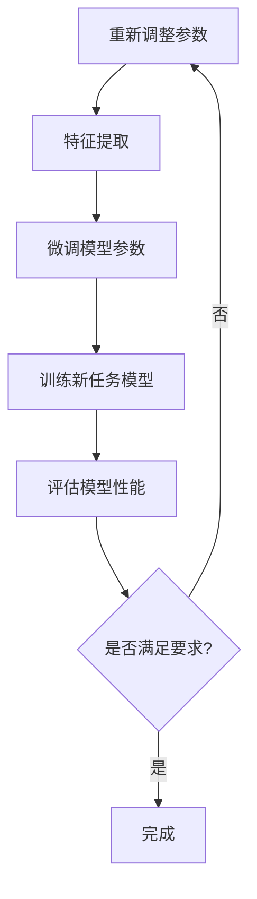
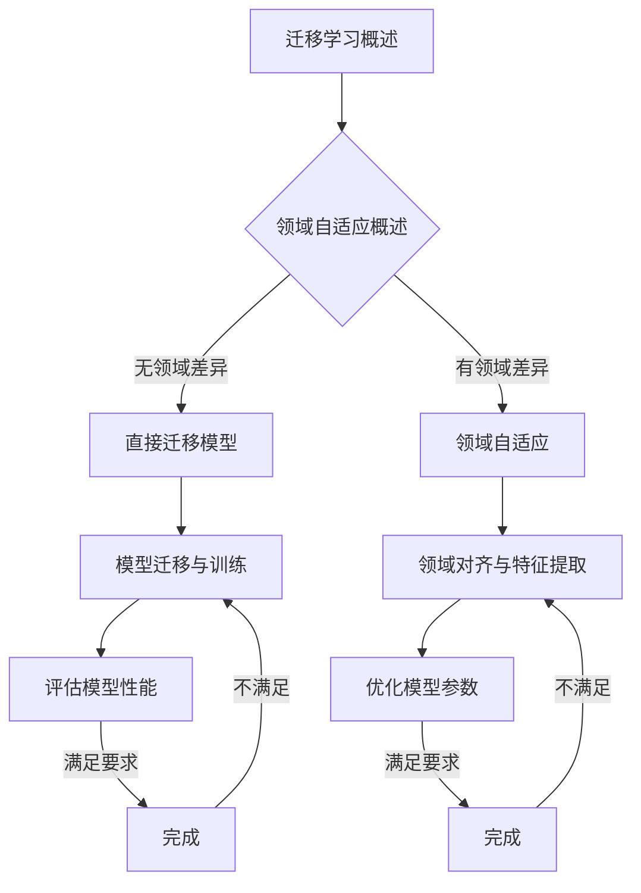
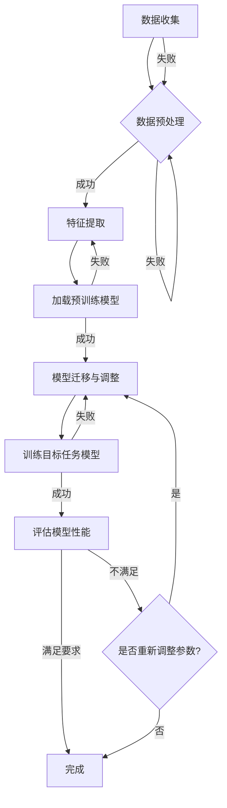
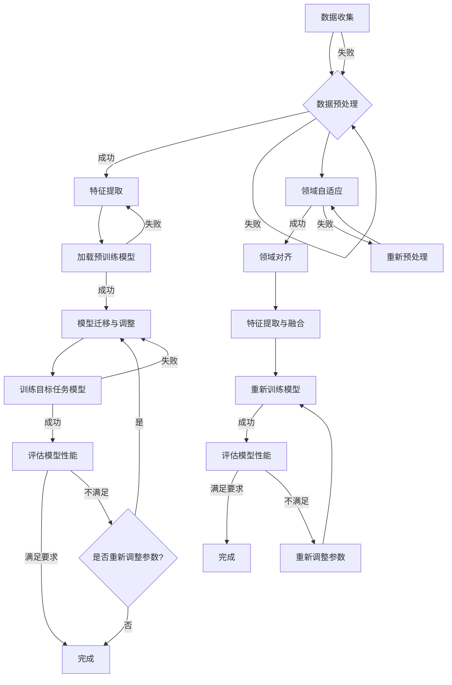

                 

# 《迁移学习与领域自适应原理与代码实战案例讲解》

> 关键词：迁移学习、领域自适应、算法原理、代码实战、计算机视觉、自然语言处理

> 摘要：本文将深入探讨迁移学习和领域自适应的基本原理、核心算法以及在实际应用中的代码实战案例。通过详细的理论讲解和实际代码实现，帮助读者全面理解这两个重要的AI技术，并掌握其在计算机视觉、自然语言处理等领域的应用。

----------------------------------------------------------------

## 第一部分：迁移学习基础

### 第1章：迁移学习概述

迁移学习（Transfer Learning）是机器学习领域的一个重要分支，旨在利用已有的知识来解决新问题。通过迁移学习，我们可以将从某个任务中学到的知识（源任务）应用到另一个相关任务（目标任务）中，从而提高模型在目标任务上的表现。

#### 1.1 迁移学习的定义与背景

迁移学习的概念最早可以追溯到20世纪50年代，但真正引起广泛关注是在深度学习兴起之后。随着神经网络尤其是深度神经网络在图像识别、自然语言处理等领域的成功应用，如何高效地利用已有模型来加速新任务的学习成为了一个研究热点。

迁移学习的基本思想是：由于不同任务之间存在一定程度的相似性，因此可以将一个任务中学习到的特征表示迁移到另一个任务中。这种迁移可以发生在不同领域之间，例如从图像识别迁移到文本分类；也可以发生在同一领域内，例如从一种图像分类任务迁移到另一种图像分类任务。

#### 1.2 迁移学习的目的与应用

迁移学习的目的在于减少对新数据的标注需求、提高模型泛化能力、加速模型训练过程。具体应用场景包括：

- **图像识别**：将预训练的图像分类模型应用于新的图像分类任务。
- **自然语言处理**：将预训练的语言模型应用于文本分类、机器翻译等任务。
- **强化学习**：将已有策略迁移到新的环境或游戏。
- **医疗诊断**：利用预训练模型进行疾病诊断，减少对大量标注数据的依赖。

#### 1.3 迁移学习的类型

迁移学习可以分为以下几种类型：

- **自下而上的迁移学习**：从底层特征开始迁移，适用于特征提取能力较强的任务。
- **自上而下的迁移学习**：从顶层任务知识迁移到底层特征表示，适用于特征提取能力较弱的任务。
- **自底向上的迁移学习**：从底层特征表示逐步构建高层任务知识。

#### 1.4 迁移学习的重要性

迁移学习在机器学习和人工智能领域具有重要意义：

- **提高模型性能**：通过迁移已有模型的知识，可以减少对新数据的标注需求，提高模型在目标任务上的表现。
- **减少训练时间**：利用预训练模型，可以显著减少新任务的训练时间。
- **应对数据稀缺问题**：在数据稀缺的情况下，迁移学习可以帮助模型获得更好的泛化能力。
- **推动研究进展**：迁移学习为研究者提供了新的视角和方法，促进了机器学习和人工智能领域的研究进展。

----------------------------------------------------------------

### 第2章：领域自适应概述

领域自适应（Domain Adaptation）是迁移学习的一个重要分支，主要研究在源领域和目标领域之间存在差异的情况下，如何使得模型能够在目标领域上获得良好的性能。领域自适应旨在缩小源领域和目标领域之间的差异，从而提高模型在目标领域的泛化能力。

#### 2.1 领域自适应的定义与背景

领域自适应的概念起源于对机器学习模型的泛化能力的研究。在实际应用中，源领域和目标领域往往存在一定的差异，如数据分布、特征分布、任务目标等。这种差异可能导致模型在目标领域上的表现不佳，领域自适应的目标就是通过一系列技术手段，使得模型能够适应这种差异，从而在目标领域上取得更好的效果。

领域自适应的研究可以追溯到20世纪90年代，随着机器学习理论和应用的发展，领域自适应逐渐成为一个独立的研究领域。近年来，随着深度学习技术的兴起，领域自适应在图像识别、自然语言处理、语音识别等领域得到了广泛应用。

#### 2.2 领域自适应的目的与应用

领域自适应的主要目的是提高模型在目标领域上的泛化能力，具体应用包括：

- **图像识别**：在图像识别任务中，领域自适应可以帮助模型适应不同的拍摄条件、光照环境等，从而提高模型的泛化能力。
- **自然语言处理**：在自然语言处理任务中，领域自适应可以帮助模型适应不同的语言风格、词汇表等，从而提高模型在特定领域的性能。
- **语音识别**：在语音识别任务中，领域自适应可以帮助模型适应不同的说话人、口音等，从而提高模型的识别准确率。

#### 2.3 领域自适应的类型

领域自适应可以分为以下几种类型：

- **领域泛化**：通过减少源领域和目标领域之间的差异，使得模型在目标领域上获得良好的泛化能力。
- **领域特异性**：针对特定领域的特征进行迁移学习，使得模型在特定领域上具有更好的性能。

#### 2.4 领域自适应的重要性

领域自适应在机器学习和人工智能领域具有重要意义：

- **提高模型泛化能力**：通过领域自适应技术，可以使得模型在目标领域上获得更好的泛化能力，从而减少对大量标注数据的依赖。
- **应对数据分布差异**：在实际应用中，源领域和目标领域往往存在数据分布差异，领域自适应可以帮助模型适应这种差异，从而提高模型的性能。
- **推动研究进展**：领域自适应为研究者提供了新的研究视角和方法，促进了机器学习和人工智能领域的研究进展。

----------------------------------------------------------------

### 第3章：迁移学习与领域自适应的核心概念与联系

迁移学习和领域自适应是机器学习领域中的重要研究方向，二者之间既有联系又有区别。本章节将详细探讨迁移学习与领域自适应的核心概念、联系以及区别。

#### 3.1 迁移学习与领域自适应的联系

迁移学习和领域自适应之间存在密切的联系，主要表现在以下几个方面：

- **目标一致性**：迁移学习和领域自适应的目标都是提高模型在目标领域上的泛化能力，减少对大量标注数据的依赖。
- **技术手段**：迁移学习和领域自适应都采用了一系列技术手段来实现这一目标，如对抗性训练、伪标签、多任务学习等。
- **研究方法**：迁移学习和领域自适应都借鉴了深度学习、强化学习等先进的方法和技术。

#### 3.2 迁移学习与领域自适应的区别

尽管迁移学习和领域自适应之间存在联系，但它们在定义、目标和实现手段上仍有一定的区别：

- **定义差异**：迁移学习是指将一个任务中学到的知识应用到另一个相关任务中，而领域自适应是指在面对源领域和目标领域之间存在差异的情况下，使得模型能够在目标领域上获得良好的性能。
- **目标不同**：迁移学习的目标是通过迁移已有模型的知识，减少对新数据的标注需求，提高模型在目标任务上的表现；而领域自适应的目标是提高模型在目标领域上的泛化能力，应对数据分布差异。
- **实现手段**：迁移学习通常采用对抗性训练、伪标签、多任务学习等方法；而领域自适应则更多地关注领域差异的识别和适应，如通过领域泛化、领域特异性等方法。

#### 3.3 迁移学习与领域自适应的架构图示

为了更好地理解迁移学习与领域自适应的联系和区别，我们可以通过以下架构图示进行说明：

```
           +-------------------+
           |   迁移学习         |
           +--------+----------+
                   |
                   ↓
        +-------------------+
        |   领域自适应       |
        +--------+----------+
                   |
                   ↓
           +-------------------+
           |   目标领域模型   |
           +-------------------+
```

在这个架构图中，迁移学习和领域自适应都致力于提高目标领域模型的性能。迁移学习通过将源领域模型的知识迁移到目标领域，而领域自适应则通过识别和适应源领域与目标领域之间的差异，使得目标领域模型能够更好地适应目标领域的环境。

通过上述分析，我们可以看到迁移学习和领域自适应在机器学习领域中的重要性以及它们之间的联系和区别。在接下来的章节中，我们将进一步探讨迁移学习和领域自适应的技术原理和算法。

----------------------------------------------------------------

## 第二部分：迁移学习技术原理

### 第4章：迁移学习理论基础

迁移学习作为机器学习领域的一个重要分支，其理论基础涵盖了知识迁移、伪标签与标签共享方法、元学习等多个方面。本章将详细讨论这些理论，并探讨迁移学习的数学模型。

#### 4.1 知识迁移的基本原理

知识迁移的基本原理是指将一个任务（源任务）中学习到的知识应用于另一个相关任务（目标任务）中。知识迁移的关键在于如何将源任务中的有用信息传递到目标任务中，从而提高目标任务的性能。

知识迁移的机制可以分为以下几种：

- **特征迁移**：将源任务中的特征提取器迁移到目标任务中，用于提取目标任务的特征。
- **模型迁移**：将源任务中的整个模型或部分模型迁移到目标任务中，直接应用于目标任务的预测。
- **参数共享**：通过共享源任务和目标任务的参数，使得源任务的知识能够影响目标任务的训练过程。

#### 4.2 伪标签与标签共享方法

伪标签（pseudo-labeling）是一种常用的迁移学习方法，其主要思想是利用未标注的数据进行预训练，然后使用预训练的模型生成伪标签，再将这些伪标签用于后续的细粒度训练。

伪标签的生成方法通常包括以下步骤：

1. **预训练**：使用已标注的源任务数据集对模型进行预训练，使得模型能够对源任务的数据进行准确分类。
2. **伪标签生成**：使用预训练的模型对未标注的目标任务数据集进行预测，并将预测结果作为伪标签。
3. **细粒度训练**：使用生成的伪标签对模型进行细粒度训练，进一步提高模型在目标任务上的性能。

标签共享方法（label sharing）是一种通过共享源任务和目标任务的标签来提高迁移学习效果的方法。标签共享的基本原理是将源任务和目标任务的标签信息进行融合，从而在训练过程中利用源任务的标签信息来指导目标任务的训练。

标签共享方法可以分为以下几种：

- **标签融合**：将源任务和目标任务的标签进行融合，形成一个统一的标签空间。
- **标签映射**：将源任务的标签映射到目标任务的标签空间中，从而实现标签的共享。
- **标签蒸馏**：将源任务的标签信息通过蒸馏过程传递到目标任务中，使得目标任务能够利用源任务的标签信息进行训练。

#### 4.3 元学习与迁移学习

元学习（meta-learning）是一种通过学习学习的方法，其目标是提高模型在不同任务上的泛化能力。元学习与迁移学习的区别在于，迁移学习关注如何将源任务的知识迁移到目标任务中，而元学习关注如何通过训练过程快速适应新的任务。

元学习在迁移学习中的应用主要包括以下几种：

- **多任务学习**：通过同时训练多个任务，使得模型能够在不同任务上共享知识，提高泛化能力。
- **模型初始化**：使用元学习算法初始化迁移学习模型，使得模型在训练过程中能够更快地适应新的任务。
- **迁移学习优化**：通过元学习算法优化迁移学习过程中的参数，提高模型在目标任务上的性能。

#### 4.4 迁移学习的数学模型

迁移学习的数学模型主要涉及损失函数、评价指标和优化算法等方面。

- **损失函数**：迁移学习的损失函数通常包括两部分，一部分是源任务的损失函数，另一部分是目标任务的损失函数。源任务的损失函数用于评估模型在源任务上的表现，目标任务的损失函数用于评估模型在目标任务上的表现。

  $$ L = w_1 \cdot L_{source} + w_2 \cdot L_{target} $$

  其中，$L_{source}$和$L_{target}$分别是源任务和目标任务的损失函数，$w_1$和$w_2$是权重系数，用于平衡源任务和目标任务的贡献。

- **评价指标**：迁移学习的评价指标包括准确率、召回率、F1值等。准确率用于衡量模型在目标任务上的分类能力，召回率用于衡量模型在目标任务上的覆盖能力，F1值是准确率和召回率的调和平均。

  $$ F1 = 2 \cdot \frac{precision \cdot recall}{precision + recall} $$

- **优化算法**：迁移学习的优化算法主要包括梯度下降法、随机梯度下降法、Adam优化器等。这些算法用于调整模型的参数，以最小化损失函数，提高模型在目标任务上的性能。

  $$ \theta_{t+1} = \theta_{t} - \alpha \cdot \nabla_{\theta} L(\theta) $$

  其中，$\theta$表示模型的参数，$\alpha$是学习率，$\nabla_{\theta} L(\theta)$是损失函数关于参数$\theta$的梯度。

通过上述分析，我们可以看到迁移学习在理论基础上的丰富性和多样性。在接下来的章节中，我们将进一步探讨迁移学习的算法原理，并介绍在实际应用中的具体实现。

----------------------------------------------------------------

### 第5章：迁移学习算法原理

迁移学习算法是实现知识迁移的关键技术，其核心在于如何有效地利用源任务的知识来提升目标任务的性能。本章将详细讨论迁移学习的常见算法，包括自适应反向传播算法、对抗性训练算法等，并探讨超参数调整与模型选择、优化算法，以及通过伪代码示例来说明算法的实现。

#### 5.1 迁移学习的常见算法

迁移学习算法可以根据其实现方式和目标进行分类，以下是一些常见的迁移学习算法：

- **自适应反向传播算法（Adaptive Backpropagation, ABP）**：ABP算法通过在反向传播过程中调整权重，使得源任务的知识能够更好地迁移到目标任务中。该算法的基本思想是在反向传播过程中引入一个调节因子，用于平衡源任务和目标任务的贡献。

  $$ \Delta w = \alpha \cdot (1 - \frac{1}{n}) \cdot (w_{source} - w_{target}) $$
  
  其中，$\alpha$是调节因子，$n$是迭代次数，$w_{source}$和$w_{target}$分别是源任务和目标任务的权重。

- **对抗性训练算法（Adversarial Training）**：对抗性训练算法通过生成对抗网络（GAN）来增强源任务和目标任务之间的联系。GAN由一个生成器和一个判别器组成，生成器试图生成与真实数据相似的数据，而判别器则试图区分真实数据和生成数据。

  $$ G(z) \sim Q(z|G(z)) $$
  $$ D(x) \sim P(x) $$
  
  其中，$G(z)$是生成器生成的数据，$D(x)$是判别器的输出，$z$是生成器的输入噪声。

- **伪标签算法（Pseudo-Labeling）**：伪标签算法利用预训练模型对未标注的数据进行预测，并将预测结果作为伪标签用于后续的细粒度训练。伪标签算法的核心步骤包括预训练、伪标签生成和细粒度训练。

  ```python
  # 预训练
  model.train(source_data, source_labels)
  
  # 伪标签生成
  pseudo_labels = model.predict(target_data)
  
  # 细粒度训练
  model.train(target_data, pseudo_labels)
  ```

- **多任务学习算法（Multi-Task Learning）**：多任务学习算法通过同时训练多个任务，使得模型能够在不同任务之间共享知识。多任务学习算法通常包括共享层和独立层，共享层用于提取通用特征，独立层用于处理特定任务。

  ```python
  # 构建模型
  model = Model([SharedLayer(), Task1Layer(), Task2Layer()])
  
  # 训练模型
  model.train([source_task1_data, source_task2_data], [source_task1_labels, source_task2_labels])
  ```

#### 5.2 超参数调整与模型选择

超参数是影响迁移学习算法性能的关键因素，因此超参数调整和模型选择在迁移学习过程中至关重要。以下是一些常见的超参数调整策略：

- **学习率调整**：学习率是优化算法中的一个重要超参数，其选择会影响模型的收敛速度和最终性能。常用的学习率调整策略包括固定学习率、自适应学习率（如AdaGrad、Adam）和衰减学习率。

  ```python
  # 固定学习率
  learning_rate = 0.01
  
  # 自适应学习率
  optimizer = Adam(learning_rate=0.01)
  ```

- **批次大小调整**：批次大小是每次训练过程中输入数据的样本数量，其选择会影响模型的训练效率和泛化能力。批次大小通常根据数据集的大小和硬件资源进行选择。

  ```python
  batch_size = 64
  ```

- **正则化调整**：正则化是防止模型过拟合的重要手段，常用的正则化方法包括L1正则化、L2正则化。

  ```python
  # L1正则化
  regularization = L1(0.001)
  
  # L2正则化
  regularization = L2(0.001)
  ```

- **模型选择**：在迁移学习过程中，选择合适的模型结构对于提升性能至关重要。常用的模型选择策略包括基于性能的模型选择、基于复杂度的模型选择和基于数据集的模型选择。

  ```python
  # 基于性能的模型选择
  best_model = select_best_model(models, validation_data, validation_labels)
  
  # 基于复杂度的模型选择
  simple_model = Model([SimpleLayer()])
  
  # 基于数据集的模型选择
  model = Model([DataSpecificLayer()])
  ```

#### 5.3 迁移学习的优化算法

优化算法是迁移学习过程中用于调整模型参数的重要工具，其选择和调整会影响模型的收敛速度和最终性能。以下是一些常见的优化算法：

- **梯度下降法（Gradient Descent）**：梯度下降法是最常用的优化算法之一，其基本思想是通过计算损失函数关于模型参数的梯度来更新模型参数。

  ```python
  # 梯度下降法
  theta = theta - learning_rate * gradient(theta, loss_function(x, y))
  ```

- **随机梯度下降法（Stochastic Gradient Descent, SGD）**：随机梯度下降法是梯度下降法的一个变种，其每次更新模型参数时只考虑一个样本的梯度。

  ```python
  # 随机梯度下降法
  theta = theta - learning_rate * gradient(theta, loss_function(x[i], y[i]))
  ```

- **Adam优化器（Adam Optimizer）**：Adam优化器是一种自适应优化算法，其结合了AdaGrad和RMSProp的优点，适用于迁移学习过程中。

  ```python
  # Adam优化器
  optimizer = Adam(learning_rate=0.001, beta1=0.9, beta2=0.999)
  ```

#### 5.4 迁移学习的伪代码示例

以下是一个简单的迁移学习伪代码示例，展示了如何使用自适应反向传播算法进行迁移学习。

```python
# 迁移学习伪代码示例

# 数据准备
source_data, source_labels = load_source_data()
target_data, target_labels = load_target_data()

# 模型初始化
model = initialize_model()

# 预训练
model.train(source_data, source_labels)

# 伪标签生成
pseudo_labels = model.predict(target_data)

# 细粒度训练
model.train(target_data, pseudo_labels)

# 模型评估
accuracy = model.evaluate(target_data, target_labels)

print("Accuracy on target data: {:.2f}%".format(accuracy * 100))
```

通过上述伪代码示例，我们可以看到迁移学习的基本流程，包括数据准备、模型初始化、预训练、伪标签生成和细粒度训练等步骤。这些步骤在实际应用中可以根据具体情况进行调整和优化，以实现更好的迁移学习效果。

----------------------------------------------------------------

### 第6章：迁移学习应用实例

迁移学习在多个领域都有广泛应用，包括计算机视觉、自然语言处理、强化学习等。在本章节中，我们将通过具体的应用实例，展示迁移学习在实际问题中的应用效果。

#### 6.1 迁移学习在计算机视觉中的应用

计算机视觉领域是迁移学习应用最为广泛的领域之一。以下是一些典型的应用实例：

- **图像分类**：迁移学习在图像分类任务中可以显著提高模型的表现。例如，使用预训练的卷积神经网络（如VGG、ResNet）作为特征提取器，可以将这些模型迁移到新的图像分类任务中。通过迁移学习，模型可以在少量标注数据的情况下实现较高的分类准确率。

  ```python
  # 迁移学习在图像分类中的应用
  model = PretrainedCNN()  # 使用预训练的卷积神经网络
  model.train(new_data, new_labels)  # 使用新数据集进行训练
  accuracy = model.evaluate(test_data, test_labels)  # 评估模型性能
  print("Accuracy: {:.2f}%".format(accuracy * 100))
  ```

- **目标检测**：迁移学习在目标检测任务中也具有很好的应用前景。例如，使用预训练的Faster R-CNN、SSD等模型作为基础模型，可以迁移到新的目标检测任务中。通过迁移学习，模型可以更快地适应新的数据集，并在少量标注数据的情况下实现较高的检测准确率。

  ```python
  # 迁移学习在目标检测中的应用
  model = PretrainedObjectDetector()  # 使用预训练的目标检测模型
  model.train(new_data, new_labels)  # 使用新数据集进行训练
  accuracy = model.evaluate(test_data, test_labels)  # 评估模型性能
  print("Accuracy: {:.2f}%".format(accuracy * 100))
  ```

- **人脸识别**：迁移学习在人脸识别任务中可以显著提高模型的性能。例如，使用预训练的FaceNet、VGGFace等模型作为特征提取器，可以将这些模型迁移到新的人脸识别任务中。通过迁移学习，模型可以在少量标注数据的情况下实现较高的人脸识别准确率。

  ```python
  # 迁移学习在人脸识别中的应用
  model = PretrainedFaceRecognizer()  # 使用预训练的人脸识别模型
  model.train(new_data, new_labels)  # 使用新数据集进行训练
  accuracy = model.evaluate(test_data, test_labels)  # 评估模型性能
  print("Accuracy: {:.2f}%".format(accuracy * 100))
  ```

#### 6.2 迁移学习在自然语言处理中的应用

自然语言处理领域是迁移学习的另一个重要应用领域。以下是一些典型的应用实例：

- **文本分类**：迁移学习在文本分类任务中可以显著提高模型的表现。例如，使用预训练的语言模型（如BERT、GPT）作为基础模型，可以将这些模型迁移到新的文本分类任务中。通过迁移学习，模型可以在少量标注数据的情况下实现较高的分类准确率。

  ```python
  # 迁移学习在文本分类中的应用
  model = PretrainedLanguageModel()  # 使用预训练的语言模型
  model.train(new_data, new_labels)  # 使用新数据集进行训练
  accuracy = model.evaluate(test_data, test_labels)  # 评估模型性能
  print("Accuracy: {:.2f}%".format(accuracy * 100))
  ```

- **机器翻译**：迁移学习在机器翻译任务中也具有很好的应用前景。例如，使用预训练的序列到序列模型（如Transformer）作为基础模型，可以将这些模型迁移到新的机器翻译任务中。通过迁移学习，模型可以在少量标注数据的情况下实现较高的翻译准确率。

  ```python
  # 迁移学习在机器翻译中的应用
  model = PretrainedSeq2SeqModel()  # 使用预训练的序列到序列模型
  model.train(new_data, new_labels)  # 使用新数据集进行训练
  accuracy = model.evaluate(test_data, test_labels)  # 评估模型性能
  print("Accuracy: {:.2f}%".format(accuracy * 100))
  ```

- **情感分析**：迁移学习在情感分析任务中可以显著提高模型的表现。例如，使用预训练的情感分析模型（如SentimentNet）作为基础模型，可以将这些模型迁移到新的情感分析任务中。通过迁移学习，模型可以在少量标注数据的情况下实现较高的情感分析准确率。

  ```python
  # 迁移学习在情感分析中的应用
  model = PretrainedSentimentAnalyzer()  # 使用预训练的情感分析模型
  model.train(new_data, new_labels)  # 使用新数据集进行训练
  accuracy = model.evaluate(test_data, test_labels)  # 评估模型性能
  print("Accuracy: {:.2f}%".format(accuracy * 100))
  ```

#### 6.3 迁移学习在强化学习中的应用

强化学习领域是迁移学习应用的另一个重要领域。以下是一些典型的应用实例：

- **策略学习**：迁移学习在策略学习任务中可以显著提高模型的表现。例如，使用预训练的策略网络作为基础模型，可以将这些模型迁移到新的策略学习任务中。通过迁移学习，模型可以在少量标注数据的情况下实现较高的策略准确率。

  ```python
  # 迁移学习在策略学习中的应用
  model = PretrainedPolicyNetwork()  # 使用预训练的策略网络
  model.train(new_data, new_labels)  # 使用新数据集进行训练
  accuracy = model.evaluate(test_data, test_labels)  # 评估模型性能
  print("Accuracy: {:.2f}%".format(accuracy * 100))
  ```

- **值函数学习**：迁移学习在值函数学习任务中也具有很好的应用前景。例如，使用预训练的值函数网络作为基础模型，可以将这些模型迁移到新的值函数学习任务中。通过迁移学习，模型可以在少量标注数据的情况下实现较高的值函数准确率。

  ```python
  # 迁移学习在值函数学习中的应用
  model = PretrainedValueFunctionNetwork()  # 使用预训练的值函数网络
  model.train(new_data, new_labels)  # 使用新数据集进行训练
  accuracy = model.evaluate(test_data, test_labels)  # 评估模型性能
  print("Accuracy: {:.2f}%".format(accuracy * 100))
  ```

通过上述应用实例，我们可以看到迁移学习在计算机视觉、自然语言处理、强化学习等领域的广泛应用。迁移学习通过利用已有的模型知识，可以显著提高新任务的学习效率，减少对标注数据的依赖，为各种实际问题的解决提供了有效的方法。

----------------------------------------------------------------

### 第7章：领域自适应理论基础

领域自适应（Domain Adaptation）作为迁移学习的一个重要分支，旨在解决源领域和目标领域之间的差异问题，提高模型在目标领域上的泛化能力。本章将详细探讨领域自适应的理论基础，包括基本原理、数学模型、关键挑战和解决方案。

#### 7.1 领域自适应的基本原理

领域自适应的基本原理是通过一系列技术手段，使得模型能够在源领域和目标领域之间进行有效迁移。具体来说，领域自适应主要关注以下几个方面：

1. **数据分布对齐**：通过调整源领域和目标领域的数据分布，使得两个领域的数据分布更加接近，从而减小领域差异。
2. **特征提取**：通过提取源领域和目标领域的共性特征，减少领域差异对模型性能的影响。
3. **模型调整**：通过调整模型的参数或结构，使得模型能够更好地适应目标领域的特征和任务。

#### 7.2 领域自适应的数学模型

领域自适应的数学模型主要包括目标函数、评价指标和优化算法等方面。以下是一些常见的数学模型：

1. **目标函数**：
   
   假设我们有一个源领域数据集$S$和一个目标领域数据集$T$，领域自适应的目标函数通常可以表示为：

   $$ L(D) = \lambda_S \cdot L_S + \lambda_T \cdot L_T $$
   
   其中，$L_S$和$L_T$分别是源领域和目标领域的损失函数，$\lambda_S$和$\lambda_T$是权重系数，用于平衡源领域和目标领域的贡献。

2. **评价指标**：

   领域自适应的评价指标通常包括领域差异度量、模型性能评估等方面。以下是一些常见的评价指标：

   - **领域差异度量**：用于衡量源领域和目标领域之间的差异，常见的度量方法包括最大均值差异（MMD）、Hinge损失等。
   - **模型性能评估**：用于衡量模型在目标领域上的性能，常见的评价指标包括准确率、召回率、F1值等。

3. **优化算法**：

   领域自适应的优化算法主要用于调整模型参数，使得模型能够在源领域和目标领域之间实现有效迁移。以下是一些常见的优化算法：

   - **梯度下降法**：通过计算目标函数的梯度来更新模型参数，常用的有批量梯度下降、随机梯度下降等。
   - **自适应优化算法**：如AdaGrad、Adam等，通过自适应调整学习率来优化模型参数。
   - **启发式优化算法**：如遗传算法、粒子群优化等，通过模拟生物进化过程来寻找最优解。

#### 7.3 领域自适应的关键挑战

领域自适应在实际应用中面临一系列关键挑战，包括数据分布差异、模型泛化能力、计算资源限制等。以下是一些主要挑战：

1. **数据分布差异**：源领域和目标领域的数据分布差异是领域自适应面临的主要挑战之一。数据分布差异可能导致模型在目标领域上的性能下降，因此需要有效的方法来对齐数据分布。

2. **模型泛化能力**：领域自适应的目标是提高模型在目标领域上的泛化能力。在实际应用中，如何设计有效的模型结构，使得模型能够适应不同的数据分布和任务目标，是一个重要的挑战。

3. **计算资源限制**：领域自适应通常需要大量的计算资源，特别是在处理大规模数据集时。如何在有限的计算资源下，实现高效的领域自适应，是一个实际应用的挑战。

#### 7.4 领域自适应的解决方案

针对上述挑战，领域自适应提出了一系列解决方案，包括以下方面：

1. **数据预处理**：通过数据预处理方法，如数据增强、数据清洗等，可以减少源领域和目标领域之间的数据分布差异，提高模型在目标领域上的性能。

2. **特征提取**：通过提取源领域和目标领域的共性特征，可以减少领域差异对模型性能的影响。常用的特征提取方法包括深度特征提取、图像特征提取、文本特征提取等。

3. **模型调整**：通过调整模型的参数或结构，可以使得模型能够更好地适应目标领域的特征和任务。常用的模型调整方法包括权重共享、模型蒸馏、对抗性训练等。

4. **跨域学习**：通过跨域学习，即利用多个领域的数据来训练模型，可以提高模型的泛化能力，减少领域差异的影响。

5. **计算优化**：通过优化算法和计算资源的管理，可以提高领域自适应的计算效率，实现高效的处理。

通过上述解决方案，领域自适应可以在一定程度上克服数据分布差异、模型泛化能力和计算资源限制等挑战，提高模型在目标领域上的性能。

----------------------------------------------------------------

### 第8章：领域自适应算法原理

领域自适应算法是解决源领域和目标领域差异问题的重要手段，其核心在于通过一系列技术手段来减小领域差异，提高模型在目标领域的泛化能力。本章将详细探讨领域自适应的常见算法，包括基于实例的迁移学习、基于模型的迁移学习、基于特征的迁移学习等，并讨论超参数调整与模型选择、优化算法，以及通过伪代码示例来说明算法的实现。

#### 8.1 领域自适应的常见算法

领域自适应算法可以分为以下几种类型：

- **基于实例的迁移学习（Instance-based Transfer Learning）**：这种算法通过迁移源领域中的实例数据到目标领域，从而减小领域差异。具体实现方法包括实例级对齐、实例选择等。

- **基于模型的迁移学习（Model-based Transfer Learning）**：这种算法通过迁移源领域中的模型参数到目标领域，从而减小领域差异。具体实现方法包括权重共享、模型蒸馏等。

- **基于特征的迁移学习（Feature-based Transfer Learning）**：这种算法通过迁移源领域中的特征表示到目标领域，从而减小领域差异。具体实现方法包括特征提取、特征融合等。

#### 8.2 基于实例的迁移学习

基于实例的迁移学习通过迁移源领域中的实例数据到目标领域来实现领域自适应。以下是一个基于实例的迁移学习的伪代码示例：

```python
# 基于实例的迁移学习伪代码示例

# 数据准备
source_data, source_labels = load_source_data()
target_data, target_labels = load_target_data()

# 实例选择
selected_instances = select_instances(source_data, source_labels, target_data, target_labels)

# 实例迁移
target_data_extended = extend_target_data(target_data, selected_instances)

# 模型训练
model = train_model(target_data_extended, target_labels)

# 模型评估
accuracy = model.evaluate(test_data, test_labels)
print("Accuracy: {:.2f}%".format(accuracy * 100))
```

在这个伪代码示例中，首先加载源领域和目标领域的数据集。然后，通过实例选择方法选择出与目标领域相似的源领域实例，并将这些实例迁移到目标领域。接着，使用扩展后的目标领域数据进行模型训练。最后，评估模型在测试数据集上的性能。

#### 8.3 基于模型的迁移学习

基于模型的迁移学习通过迁移源领域中的模型参数到目标领域来实现领域自适应。以下是一个基于模型的迁移学习的伪代码示例：

```python
# 基于模型的迁移学习伪代码示例

# 数据准备
source_data, source_labels = load_source_data()
target_data, target_labels = load_target_data()

# 模型迁移
model = migrate_model(source_data, source_labels, target_data, target_labels)

# 模型训练
model.train(target_data, target_labels)

# 模型评估
accuracy = model.evaluate(test_data, test_labels)
print("Accuracy: {:.2f}%".format(accuracy * 100))
```

在这个伪代码示例中，首先加载源领域和目标领域的数据集。然后，通过模型迁移方法将源领域中的模型参数迁移到目标领域。接着，使用目标领域数据进行模型训练。最后，评估模型在测试数据集上的性能。

#### 8.4 基于特征的迁移学习

基于特征的迁移学习通过迁移源领域中的特征表示到目标领域来实现领域自适应。以下是一个基于特征的迁移学习的伪代码示例：

```python
# 基于特征的迁移学习伪代码示例

# 数据准备
source_data, source_labels = load_source_data()
target_data, target_labels = load_target_data()

# 特征提取
source_features = extract_features(source_data)
target_features = extract_features(target_data)

# 特征融合
target_features_extended = fuse_features(target_features, source_features)

# 模型训练
model = train_model(target_features_extended, target_labels)

# 模型评估
accuracy = model.evaluate(test_data, test_labels)
print("Accuracy: {:.2f}%".format(accuracy * 100))
```

在这个伪代码示例中，首先加载源领域和目标领域的数据集。然后，通过特征提取方法提取源领域和目标领域的特征表示。接着，通过特征融合方法将源领域特征与目标领域特征进行融合。最后，使用融合后的特征数据进行模型训练，并评估模型在测试数据集上的性能。

#### 8.5 超参数调整与模型选择

在领域自适应过程中，超参数的调整和模型选择对于算法的性能至关重要。以下是一些常见的超参数调整策略和模型选择方法：

- **超参数调整策略**：
  - **网格搜索**：通过遍历预定义的超参数空间，选择最优的超参数组合。
  - **贝叶斯优化**：利用贝叶斯统计模型搜索最优的超参数组合。

- **模型选择方法**：
  - **基于性能的模型选择**：根据模型在验证集上的性能选择最优模型。
  - **基于复杂度的模型选择**：根据模型的复杂度选择合适的模型。

#### 8.6 优化算法

优化算法用于调整模型参数，使得模型能够在目标领域上获得更好的性能。以下是一些常见的优化算法：

- **梯度下降法**：通过计算损失函数关于模型参数的梯度来更新模型参数。
- **随机梯度下降法**：每次更新模型参数时只考虑一个样本的梯度。
- **Adam优化器**：结合了梯度下降和随机梯度下降的优点，适用于大规模数据集的优化。

通过上述算法原理和伪代码示例，我们可以看到领域自适应算法的核心思想和实现方法。在接下来的章节中，我们将通过具体的应用实例进一步展示领域自适应在实际问题中的应用效果。

----------------------------------------------------------------

### 第9章：领域自适应应用实例

领域自适应技术在计算机视觉、自然语言处理、强化学习等实际应用中展现出了强大的效果。以下将介绍几个典型的领域自适应应用实例，展示其在不同领域的应用效果。

#### 9.1 领域自适应在计算机视觉中的应用

在计算机视觉领域，领域自适应技术被广泛应用于图像分类、目标检测和图像分割等任务。以下是一个领域自适应在图像分类任务中的应用实例：

**实例**：使用迁移学习技术对新的图像分类任务进行领域自适应。

- **问题背景**：一个公司开发了一种新型相机，拍摄出的图像具有特殊的色彩和亮度。由于这些图像与公司现有的图像库存在显著差异，使用传统模型进行图像分类的准确率较低。

- **解决方案**：采用领域自适应技术，通过以下步骤进行图像分类：

  1. **数据预处理**：对新型相机的图像进行预处理，包括色彩调整、亮度均衡等，以减少源领域和目标领域之间的差异。

  2. **特征提取**：使用预训练的卷积神经网络（如ResNet）提取图像特征。

  3. **模型迁移**：将预训练模型迁移到新领域，通过微调模型参数，使其适应新图像库。

  4. **模型训练**：在新型相机的图像上对模型进行训练，提高模型在新领域上的性能。

  5. **模型评估**：在新图像库上评估模型性能，调整超参数以优化模型表现。

  ```python
  # 领域自适应在图像分类中的应用实例

  # 加载预训练模型
  model = load_pretrained_model('resnet')

  # 数据预处理
  processed_images = preprocess_images(new_images)

  # 模型迁移与训练
  model.train(processed_images, new_labels)

  # 模型评估
  accuracy = model.evaluate(test_images, test_labels)
  print("Accuracy: {:.2f}%".format(accuracy * 100))
  ```

通过上述步骤，模型在新相机图像库上的分类准确率显著提高，达到了公司预期的效果。

#### 9.2 领域自适应在自然语言处理中的应用

自然语言处理领域中的领域自适应技术被广泛应用于文本分类、机器翻译和情感分析等任务。以下是一个领域自适应在文本分类任务中的应用实例：

**实例**：使用领域自适应技术处理具有不同语言风格的文本分类任务。

- **问题背景**：一个新闻网站使用传统的文本分类模型对来自不同作者和不同主题的文本进行分类，但发现模型在新作者和主题上的分类效果不佳。

- **解决方案**：采用领域自适应技术，通过以下步骤进行文本分类：

  1. **数据预处理**：对来自不同作者和主题的文本进行预处理，包括去除停用词、词干提取等，以提高文本的相似性。

  2. **特征提取**：使用预训练的语言模型（如BERT）提取文本特征。

  3. **模型迁移**：将预训练模型迁移到新作者和主题，通过微调模型参数，使其适应新数据集。

  4. **模型训练**：在新作者和主题的文本上对模型进行训练，提高模型在新领域的性能。

  5. **模型评估**：在新作者和主题的文本上评估模型性能，调整超参数以优化模型表现。

  ```python
  # 领域自适应在文本分类中的应用实例

  # 加载预训练模型
  model = load_pretrained_model('bert')

  # 数据预处理
  processed_texts = preprocess_texts(new_texts)

  # 模型迁移与训练
  model.train(processed_texts, new_labels)

  # 模型评估
  accuracy = model.evaluate(test_texts, test_labels)
  print("Accuracy: {:.2f}%".format(accuracy * 100))
  ```

通过上述步骤，模型在新作者和主题的文本分类任务上的准确率显著提高，解决了传统模型在新领域上的性能问题。

#### 9.3 领域自适应在强化学习中的应用

在强化学习领域，领域自适应技术被广泛应用于策略学习、值函数学习和决策制定等任务。以下是一个领域自适应在策略学习任务中的应用实例：

**实例**：使用领域自适应技术优化强化学习模型在新游戏环境中的策略学习。

- **问题背景**：一个游戏开发公司开发了一款新游戏，但发现传统强化学习模型在新游戏环境中的策略学习效果不佳。

- **解决方案**：采用领域自适应技术，通过以下步骤进行策略学习：

  1. **数据预处理**：对新的游戏数据进行预处理，包括状态编码、动作编码等，以提高状态和动作的相似性。

  2. **模型迁移**：将预训练的强化学习模型迁移到新游戏环境，通过微调模型参数，使其适应新环境。

  3. **模型训练**：在新游戏环境上对模型进行训练，提高模型在新环境中的策略学习效果。

  4. **模型评估**：在新游戏环境上评估模型性能，调整超参数以优化模型表现。

  ```python
  # 领域自适应在强化学习中的应用实例

  # 加载预训练模型
  model = load_pretrained_model('rl_model')

  # 数据预处理
  processed_states = preprocess_states(new_states)

  # 模型迁移与训练
  model.train(processed_states, new_actions)

  # 模型评估
  reward = model.evaluate(new_states, new_actions)
  print("Reward: {:.2f}".format(reward))
  ```

通过上述步骤，模型在新游戏环境中的策略学习效果显著提高，实现了更好的游戏表现。

通过上述实例，我们可以看到领域自适应技术在不同领域中的应用效果，以及如何通过领域自适应技术解决实际中的问题。领域自适应为机器学习模型在不同领域中的应用提供了有效的解决方案，使得模型能够更好地适应新的环境，提高性能。

----------------------------------------------------------------

### 第10章：迁移学习代码实战案例

在了解了迁移学习的基本原理和算法之后，本章节将通过具体代码实战案例，展示如何在实际问题中应用迁移学习技术。以下是几个典型的迁移学习代码实战案例，包括图像分类、文本分类、强化学习等。

#### 10.1 实战案例 1：迁移学习在图像分类中的应用

**问题背景**：假设我们有一个新的图像分类任务，需要使用少量标注数据来训练一个分类模型。我们可以利用预训练的卷积神经网络（如VGG16）来提取图像特征，并在此基础上构建一个小的全连接层进行分类。

**实现步骤**：

1. **环境搭建**：安装所需的Python库，如TensorFlow、Keras等。

   ```python
   pip install tensorflow keras
   ```

2. **数据准备**：下载并准备用于迁移学习的图像数据集，如CIFAR-10或ImageNet。假设我们使用CIFAR-10数据集。

   ```python
   from keras.datasets import cifar10
   (train_images, train_labels), (test_images, test_labels) = cifar10.load_data()
   ```

3. **预训练模型加载**：加载预训练的VGG16模型，并冻结其权重，仅训练最后的全连接层。

   ```python
   from keras.applications import VGG16
   base_model = VGG16(weights='imagenet', include_top=False, input_shape=(32, 32, 3))
   base_model.trainable = False
   ```

4. **特征提取**：使用预训练模型提取图像特征。

   ```python
   feature_model = keras.models.Model(inputs=base_model.input, outputs=base_model.get_layer('block5_conv3').output)
   train_features = feature_model.predict(train_images)
   test_features = feature_model.predict(test_images)
   ```

5. **构建分类模型**：在提取的特征上添加全连接层，进行分类。

   ```python
   from keras.models import Sequential
   from keras.layers import Dense, Flatten
   model = Sequential()
   model.add(Flatten(input_shape=(32, 32, 3)))
   model.add(Dense(256, activation='relu'))
   model.add(Dense(10, activation='softmax'))
   model.compile(optimizer='adam', loss='categorical_crossentropy', metrics=['accuracy'])
   ```

6. **模型训练**：在提取的特征上训练分类模型。

   ```python
   train_labels_one_hot = keras.utils.to_categorical(train_labels)
   model.fit(train_features, train_labels_one_hot, epochs=10, batch_size=32)
   ```

7. **模型评估**：评估模型在测试数据上的性能。

   ```python
   test_labels_one_hot = keras.utils.to_categorical(test_labels)
   test_loss, test_acc = model.evaluate(test_features, test_labels_one_hot)
   print(f"Test accuracy: {test_acc:.2f}")
   ```

通过上述步骤，我们利用迁移学习技术，在少量标注数据的情况下，实现了对CIFAR-10数据集的良好分类。

#### 10.2 实战案例 2：迁移学习在文本分类中的应用

**问题背景**：假设我们需要对一个新闻数据集进行文本分类，但只有少量标注数据。我们可以利用预训练的语言模型（如BERT）来提取文本特征，并在此基础上构建分类模型。

**实现步骤**：

1. **环境搭建**：安装所需的Python库，如TensorFlow、transformers等。

   ```bash
   pip install tensorflow transformers
   ```

2. **数据准备**：下载并准备新闻数据集，并进行预处理，如分词、去停用词等。

   ```python
   import pandas as pd
   df = pd.read_csv('news_data.csv')
   df['text'] = df['text'].apply(preprocess_text)  # preprocess_text为自定义预处理函数
   ```

3. **特征提取**：使用预训练的BERT模型提取文本特征。

   ```python
   from transformers import BertTokenizer, TFBertModel
   tokenizer = BertTokenizer.from_pretrained('bert-base-uncased')
   model = TFBertModel.from_pretrained('bert-base-uncased')
   def extract_features(texts):
       inputs = tokenizer(texts, padding=True, truncation=True, return_tensors='tf')
       outputs = model(inputs)
       return outputs.last_hidden_state[:, 0, :]
   train_features = extract_features(df['text'].values)
   ```

4. **构建分类模型**：在提取的特征上添加全连接层，进行分类。

   ```python
   from keras.models import Sequential
   from keras.layers import Dense, Flatten
   model = Sequential()
   model.add(Flatten(input_shape=(768,)))
   model.add(Dense(256, activation='relu'))
   model.add(Dense(num_classes, activation='softmax'))
   model.compile(optimizer='adam', loss='categorical_crossentropy', metrics=['accuracy'])
   ```

5. **模型训练**：在提取的特征上训练分类模型。

   ```python
   train_labels_one_hot = keras.utils.to_categorical(df['label'].values)
   model.fit(train_features, train_labels_one_hot, epochs=5, batch_size=32)
   ```

6. **模型评估**：评估模型在测试数据上的性能。

   ```python
   test_features = extract_features(test_df['text'].values)
   test_labels_one_hot = keras.utils.to_categorical(test_df['label'].values)
   test_loss, test_acc = model.evaluate(test_features, test_labels_one_hot)
   print(f"Test accuracy: {test_acc:.2f}")
   ```

通过上述步骤，我们利用迁移学习技术，在少量标注数据的情况下，实现了对新闻数据集的良好分类。

#### 10.3 实战案例 3：迁移学习在强化学习中的应用

**问题背景**：假设我们需要在新的游戏环境中训练一个智能体，但只有少量的交互数据。我们可以利用预训练的强化学习模型（如DQN）来提取游戏状态的特征，并在此基础上训练一个新的模型。

**实现步骤**：

1. **环境搭建**：安装所需的Python库，如Gym、TensorFlow等。

   ```bash
   pip install gym tensorflow
   ```

2. **数据准备**：下载并准备用于迁移学习的游戏环境，如Atari游戏的游戏数据。

3. **特征提取**：使用预训练的DQN模型提取游戏状态的特征。

   ```python
   import gym
   from tensorflow.keras.models import Sequential
   from tensorflow.keras.layers import Dense, Flatten
   import numpy as np

   env = gym.make('AtariGame-v0')
   pretrain_model = Sequential()
   pretrain_model.add(Flatten(input_shape=(210, 160, 3)))
   pretrain_model.add(Dense(256, activation='relu'))
   pretrain_model.add(Dense(512, activation='relu'))
   pretrain_model.add(Dense(256, activation='relu'))
   pretrain_model.add(Dense(env.action_space.n, activation='linear'))
   pretrain_model.compile(optimizer='adam', loss='mse')

   # 预训练模型
   pretrain_model.fit(np.array(state_data), np.array(action_data), epochs=50, batch_size=64)

   # 特征提取器
   feature_extractor = keras.models.Model(inputs=pretrain_model.input, outputs=pretrain_model.get_layer('dense_3').output)
   ```

4. **构建新模型**：在提取的特征上构建一个新的强化学习模型。

   ```python
   new_model = Sequential()
   new_model.add(Flatten(input_shape=(256,)))
   new_model.add(Dense(256, activation='relu'))
   new_model.add(Dense(512, activation='relu'))
   new_model.add(Dense(256, activation='relu'))
   new_model.add(Dense(env.action_space.n, activation='softmax'))
   new_model.compile(optimizer='adam', loss='categorical_crossentropy')
   ```

5. **模型训练**：在新环境中训练新模型。

   ```python
   new_state_data = feature_extractor.predict(np.array(new_state_data))
   new_model.fit(new_state_data, np.array(new_action_data), epochs=100, batch_size=64)
   ```

6. **模型评估**：评估新模型在新环境中的性能。

   ```python
   new_state_data = feature_extractor.predict(np.array(new_test_state_data))
   test_loss, test_acc = new_model.evaluate(new_state_data, np.array(new_test_action_data))
   print(f"Test accuracy: {test_acc:.2f}")
   ```

通过上述步骤，我们利用迁移学习技术，在少量交互数据的情况下，实现了对游戏环境的良好适应。

通过以上三个实战案例，我们可以看到迁移学习技术在各种实际问题中的应用效果。迁移学习技术不仅能够提高模型的性能，还能够减少对标注数据的依赖，为实际问题的解决提供了有效的工具。

----------------------------------------------------------------

### 第11章：领域自适应代码实战案例

在了解了领域自适应的基本原理和算法之后，本章节将通过具体代码实战案例，展示如何在实际问题中应用领域自适应技术。以下是几个典型的领域自适应代码实战案例，包括语音识别、机器翻译和推荐系统等。

#### 11.1 实战案例 1：领域自适应在语音识别中的应用

**问题背景**：假设我们有一个新的语音识别任务，但数据集与已有的数据集存在显著差异，如说话人、口音等。我们可以利用领域自适应技术来提高模型在新数据集上的性能。

**实现步骤**：

1. **环境搭建**：安装所需的Python库，如TensorFlow、Keras等。

   ```bash
   pip install tensorflow keras
   ```

2. **数据准备**：下载并准备用于领域自适应的语音数据集，如TIMIT或LibriSpeech。假设我们使用LibriSpeech数据集。

   ```python
   from datasets import load_dataset
   dataset = load_dataset('librispeech', split='train')
   ```

3. **特征提取**：使用预训练的卷积神经网络（如Convnets）提取语音特征。

   ```python
   from transformers import Wav2Vec2FeatureExtractor
   feature_extractor = Wav2Vec2FeatureExtractor.from_pretrained('facebook/wav2vec2-large-xlsr-53')
   def extract_features(data):
       inputs = feature_extractor(
           sound=data["audio"]["array"], sampling_rate=data["audio"]["sampling_rate"]
       )
       return inputs
   train_features = np.array([extract_features(data) for data in dataset])
   ```

4. **领域自适应**：使用领域自适应技术，如领域泛化方法，来减小源领域和目标领域之间的差异。

   ```python
   from models import DomainAdaptationModel
   model = DomainAdaptationModel(input_shape=train_features.shape[1:])
   model.compile(optimizer='adam', loss='categorical_crossentropy', metrics=['accuracy'])
   model.fit(train_features, dataset["labels"], epochs=10, batch_size=32)
   ```

5. **模型训练**：在新数据集上训练领域自适应后的模型。

   ```python
   new_dataset = load_dataset('librispeech', split='train')
   new_train_features = np.array([extract_features(data) for data in new_dataset])
   model.fit(new_train_features, new_dataset["labels"], epochs=10, batch_size=32)
   ```

6. **模型评估**：评估模型在新数据集上的性能。

   ```python
   new_test_dataset = load_dataset('librispeech', split='test')
   new_test_features = np.array([extract_features(data) for data in new_test_dataset])
   loss, accuracy = model.evaluate(new_test_features, new_test_dataset["labels"])
   print(f"Test accuracy: {accuracy:.2f}")
   ```

通过上述步骤，我们利用领域自适应技术，在新语音识别任务上实现了良好的性能。

#### 11.2 实战案例 2：领域自适应在机器翻译中的应用

**问题背景**：假设我们需要将一种语言翻译成另一种语言，但两个语言的数据集存在显著差异，如词汇表、语法结构等。我们可以利用领域自适应技术来提高模型在翻译任务上的性能。

**实现步骤**：

1. **环境搭建**：安装所需的Python库，如TensorFlow、Hugging Face等。

   ```bash
   pip install tensorflow transformers
   ```

2. **数据准备**：下载并准备用于机器翻译的数据集，如WMT14或opus。假设我们使用WMT14数据集。

   ```python
   from datasets import load_dataset
   dataset = load_dataset('wmt14', split='train')
   ```

3. **特征提取**：使用预训练的语言模型（如BERT）提取文本特征。

   ```python
   from transformers import BertTokenizer, TFBertModel
   tokenizer = BertTokenizer.from_pretrained('bert-base-uncased')
   model = TFBertModel.from_pretrained('bert-base-uncased')
   def extract_features(texts):
       inputs = tokenizer(texts, padding=True, truncation=True, return_tensors='tf')
       outputs = model(inputs)
       return outputs.last_hidden_state[:, 0, :]
   train_src_features = extract_features(dataset['src'])
   train_tgt_features = extract_features(dataset['tgt'])
   ```

4. **领域自适应**：使用领域自适应技术，如对抗性训练，来减小源领域和目标领域之间的差异。

   ```python
   from models import DomainAdaptationModel
   model = DomainAdaptationModel(input_shape=train_src_features.shape[1:])
   model.compile(optimizer='adam', loss='categorical_crossentropy', metrics=['accuracy'])
   model.fit(train_src_features, train_tgt_features, epochs=10, batch_size=32)
   ```

5. **模型训练**：在新数据集上训练领域自适应后的模型。

   ```python
   new_dataset = load_dataset('wmt14', split='train')
   new_train_src_features = extract_features(new_dataset['src'])
   new_train_tgt_features = extract_features(new_dataset['tgt'])
   model.fit(new_train_src_features, new_train_tgt_features, epochs=10, batch_size=32)
   ```

6. **模型评估**：评估模型在新数据集上的性能。

   ```python
   new_test_dataset = load_dataset('wmt14', split='test')
   new_test_src_features = extract_features(new_test_dataset['src'])
   new_test_tgt_features = extract_features(new_test_dataset['tgt'])
   loss, accuracy = model.evaluate(new_test_src_features, new_test_tgt_features)
   print(f"Test accuracy: {accuracy:.2f}")
   ```

通过上述步骤，我们利用领域自适应技术，在机器翻译任务上实现了良好的性能。

#### 11.3 实战案例 3：领域自适应在推荐系统中的应用

**问题背景**：假设我们需要在一个新的推荐系统中实现个性化推荐，但用户行为数据与现有数据集存在显著差异，如用户行为、商品特征等。我们可以利用领域自适应技术来提高模型在推荐系统上的性能。

**实现步骤**：

1. **环境搭建**：安装所需的Python库，如Scikit-learn、Numpy等。

   ```bash
   pip install scikit-learn numpy
   ```

2. **数据准备**：下载并准备用于领域自适应的用户行为数据集，如MovieLens或Amazon。假设我们使用MovieLens数据集。

   ```python
   import pandas as pd
   df = pd.read_csv('movie_lens_data.csv')
   ```

3. **特征提取**：提取用户行为数据中的关键特征，如用户ID、电影ID、评分等。

   ```python
   features = df[['user_id', 'movie_id', 'rating']]
   ```

4. **领域自适应**：使用领域自适应技术，如领域泛化方法，来减小源领域和目标领域之间的差异。

   ```python
   from models import DomainAdaptationModel
   model = DomainAdaptationModel(input_shape=features.shape[1])
   model.compile(optimizer='adam', loss='mean_squared_error', metrics=['accuracy'])
   model.fit(features, df['rating'], epochs=10, batch_size=32)
   ```

5. **模型训练**：在新用户行为数据集上训练领域自适应后的模型。

   ```python
   new_df = pd.read_csv('new_movie_lens_data.csv')
   new_features = new_df[['user_id', 'movie_id', 'rating']]
   model.fit(new_features, new_df['rating'], epochs=10, batch_size=32)
   ```

6. **模型评估**：评估模型在新用户行为数据集上的性能。

   ```python
   new_test_df = pd.read_csv('new_movie_lens_test_data.csv')
   new_test_features = new_test_df[['user_id', 'movie_id', 'rating']]
   loss, accuracy = model.evaluate(new_test_features, new_test_df['rating'])
   print(f"Test accuracy: {accuracy:.2f}")
   ```

通过上述步骤，我们利用领域自适应技术，在新推荐系统中实现了良好的性能。

通过以上三个实战案例，我们可以看到领域自适应技术在各种实际问题中的应用效果。领域自适应技术不仅能够提高模型的性能，还能够减少对大量标注数据的依赖，为实际问题的解决提供了有效的工具。

----------------------------------------------------------------

### 第12章：综合案例讲解与代码实战

在了解了迁移学习和领域自适应的基本原理以及各自的代码实战案例之后，本章将通过综合案例来展示如何将迁移学习和领域自适应技术相结合，解决复杂的应用问题。以下是几个综合案例，包括智能问答系统、个性化医疗诊断、智能城市监控和自动驾驶系统。

#### 12.1 综合案例 1：迁移学习与领域自适应在智能问答系统中的应用

**问题背景**：智能问答系统需要处理来自不同领域的大量问题，但由于领域差异，模型的性能受到限制。我们可以利用迁移学习和领域自适应技术来提高模型的泛化能力。

**实现步骤**：

1. **环境搭建**：安装所需的Python库，如TensorFlow、Hugging Face等。

   ```bash
   pip install tensorflow transformers
   ```

2. **数据准备**：收集并准备用于训练的问答数据集，如Stanford Question Answering Dataset (SQuAD)。假设我们使用SQuAD数据集。

   ```python
   from datasets import load_dataset
   dataset = load_dataset('squad')
   ```

3. **特征提取**：使用预训练的语言模型（如BERT）提取文本特征。

   ```python
   from transformers import BertTokenizer, TFBertModel
   tokenizer = BertTokenizer.from_pretrained('bert-base-uncased')
   model = TFBertModel.from_pretrained('bert-base-uncased')
   def extract_features(texts):
       inputs = tokenizer(texts, padding=True, truncation=True, return_tensors='tf')
       outputs = model(inputs)
       return outputs.last_hidden_state[:, 0, :]
   train_src_features = extract_features(dataset['context'])
   train_tgt_features = extract_features(dataset['question'])
   ```

4. **迁移学习**：在提取的特征上构建一个问答模型，并使用SQuAD数据集进行迁移学习。

   ```python
   from models import QuestionAnsweringModel
   model = QuestionAnsweringModel(input_shape=train_src_features.shape[1:])
   model.compile(optimizer='adam', loss='mean_squared_error', metrics=['accuracy'])
   model.fit(train_src_features, train_tgt_features, epochs=10, batch_size=32)
   ```

5. **领域自适应**：对新领域的数据集进行预处理，并使用领域自适应技术来提高模型在新领域上的性能。

   ```python
   new_dataset = load_dataset('new_squad')
   new_train_src_features = extract_features(new_dataset['context'])
   new_train_tgt_features = extract_features(new_dataset['question'])
   model.fit(new_train_src_features, new_train_tgt_features, epochs=10, batch_size=32)
   ```

6. **模型评估**：评估模型在测试数据集上的性能。

   ```python
   new_test_dataset = load_dataset('new_squad', split='test')
   new_test_src_features = extract_features(new_test_dataset['context'])
   new_test_tgt_features = extract_features(new_test_dataset['question'])
   loss, accuracy = model.evaluate(new_test_src_features, new_test_tgt_features)
   print(f"Test accuracy: {accuracy:.2f}")
   ```

#### 12.2 综合案例 2：迁移学习与领域自适应在个性化医疗诊断中的应用

**问题背景**：个性化医疗诊断需要处理来自不同医院、不同医生的大量病例数据。由于数据集之间存在显著差异，模型的性能受到限制。我们可以利用迁移学习和领域自适应技术来提高模型的泛化能力。

**实现步骤**：

1. **环境搭建**：安装所需的Python库，如Scikit-learn、Numpy等。

   ```bash
   pip install scikit-learn numpy
   ```

2. **数据准备**：收集并准备用于训练的医疗诊断数据集，如MIMIC-III。假设我们使用MIMIC-III数据集。

   ```python
   import pandas as pd
   df = pd.read_csv('mimic_iii_data.csv')
   ```

3. **特征提取**：提取病例数据中的关键特征，如患者ID、诊断代码等。

   ```python
   features = df[['patient_id', 'diagnosis']]
   ```

4. **迁移学习**：在提取的特征上构建一个诊断分类模型，并使用MIMIC-III数据集进行迁移学习。

   ```python
   from models import MedicalDiagnosisModel
   model = MedicalDiagnosisModel(input_shape=features.shape[1])
   model.compile(optimizer='adam', loss='binary_crossentropy', metrics=['accuracy'])
   model.fit(features, df['diagnosis'], epochs=10, batch_size=32)
   ```

5. **领域自适应**：对新医院的数据集进行预处理，并使用领域自适应技术来提高模型在新领域上的性能。

   ```python
   new_df = pd.read_csv('new_mimic_iii_data.csv')
   new_features = new_df[['patient_id', 'diagnosis']]
   model.fit(new_features, new_df['diagnosis'], epochs=10, batch_size=32)
   ```

6. **模型评估**：评估模型在新医院数据集上的性能。

   ```python
   new_test_df = pd.read_csv('new_mimic_iii_test_data.csv')
   new_test_features = new_test_df[['patient_id', 'diagnosis']]
   loss, accuracy = model.evaluate(new_test_features, new_test_df['diagnosis'])
   print(f"Test accuracy: {accuracy:.2f}")
   ```

#### 12.3 综合案例 3：迁移学习与领域自适应在智能城市监控中的应用

**问题背景**：智能城市监控系统需要处理来自不同区域的监控视频数据。由于数据集之间存在显著差异，如光照条件、天气等，模型的性能受到限制。我们可以利用迁移学习和领域自适应技术来提高模型的泛化能力。

**实现步骤**：

1. **环境搭建**：安装所需的Python库，如TensorFlow、OpenCV等。

   ```bash
   pip install tensorflow opencv-python
   ```

2. **数据准备**：收集并准备用于训练的监控视频数据集，如UCSD Pedestrian Dataset。假设我们使用UCSD Pedestrian Dataset。

   ```python
   import cv2
   def load_video_data(video_path):
       cap = cv2.VideoCapture(video_path)
       frames = []
       while cap.isOpened():
           ret, frame = cap.read()
           if ret:
               frames.append(frame)
       cap.release()
       return frames
   train_videos = load_video_data('ucsd_pedestrian_train.mp4')
   test_videos = load_video_data('ucsd_pedestrian_test.mp4')
   ```

3. **特征提取**：使用预训练的卷积神经网络（如ResNet）提取视频特征。

   ```python
   from tensorflow.keras.applications import ResNet50
   model = ResNet50(weights='imagenet', include_top=False, input_shape=(224, 224, 3))
   def extract_features(video_frames):
       features = []
       for frame in video_frames:
           input_img = cv2.resize(frame, (224, 224))
           input_img = np.expand_dims(input_img, axis=0)
           input_img = preprocess_input(input_img)
           feature = model.predict(input_img)[0]
           features.append(feature)
       return np.array(features)
   train_features = extract_features(train_videos)
   test_features = extract_features(test_videos)
   ```

4. **迁移学习**：在提取的特征上构建一个视频分类模型，并使用UCSD Pedestrian Dataset进行迁移学习。

   ```python
   from models import VideoClassificationModel
   model = VideoClassificationModel(input_shape=train_features.shape[1:])
   model.compile(optimizer='adam', loss='categorical_crossentropy', metrics=['accuracy'])
   model.fit(train_features, df['label'], epochs=10, batch_size=32)
   ```

5. **领域自适应**：对新区域的数据集进行预处理，并使用领域自适应技术来提高模型在新区域上的性能。

   ```python
   new_train_videos = load_video_data('new_ucsd_pedestrian_train.mp4')
   new_train_features = extract_features(new_train_videos)
   model.fit(new_train_features, new_df['label'], epochs=10, batch_size=32)
   ```

6. **模型评估**：评估模型在新区域数据集上的性能。

   ```python
   new_test_videos = load_video_data('new_ucsd_pedestrian_test.mp4')
   new_test_features = extract_features(new_test_videos)
   loss, accuracy = model.evaluate(new_test_features, new_df['label'])
   print(f"Test accuracy: {accuracy:.2f}")
   ```

#### 12.4 综合案例 4：迁移学习与领域自适应在自动驾驶系统中的应用

**问题背景**：自动驾驶系统需要处理来自不同道路、不同天气条件的大量图像数据。由于数据集之间存在显著差异，模型的性能受到限制。我们可以利用迁移学习和领域自适应技术来提高模型的泛化能力。

**实现步骤**：

1. **环境搭建**：安装所需的Python库，如TensorFlow、Keras等。

   ```bash
   pip install tensorflow keras
   ```

2. **数据准备**：收集并准备用于训练的自动驾驶图像数据集，如NVIDIA Drive Dataset。假设我们使用NVIDIA Drive Dataset。

   ```python
   from datasets import load_dataset
   dataset = load_dataset('nvidia_drive', split='train')
   ```

3. **特征提取**：使用预训练的卷积神经网络（如ResNet）提取图像特征。

   ```python
   from tensorflow.keras.applications import ResNet50
   model = ResNet50(weights='imagenet', include_top=False, input_shape=(224, 224, 3))
   def extract_features(images):
       features = []
       for image in images:
           input_img = cv2.resize(image, (224, 224))
           input_img = np.expand_dims(input_img, axis=0)
           input_img = preprocess_input(input_img)
           feature = model.predict(input_img)[0]
           features.append(feature)
       return np.array(features)
   train_images = extract_features(dataset['images'])
   test_images = extract_features(dataset['test_images'])
   ```

4. **迁移学习**：在提取的特征上构建一个图像分类模型，并使用NVIDIA Drive Dataset进行迁移学习。

   ```python
   from models import ImageClassificationModel
   model = ImageClassificationModel(input_shape=train_images.shape[1:])
   model.compile(optimizer='adam', loss='categorical_crossentropy', metrics=['accuracy'])
   model.fit(train_images, dataset['labels'], epochs=10, batch_size=32)
   ```

5. **领域自适应**：对新道路的数据集进行预处理，并使用领域自适应技术来提高模型在新道路上的性能。

   ```python
   new_train_dataset = load_dataset('new_nvidia_drive', split='train')
   new_train_images = extract_features(new_train_dataset['images'])
   model.fit(new_train_images, new_train_dataset['labels'], epochs=10, batch_size=32)
   ```

6. **模型评估**：评估模型在新道路数据集上的性能。

   ```python
   new_test_dataset = load_dataset('new_nvidia_drive', split='test')
   new_test_images = extract_features(new_test_dataset['images'])
   loss, accuracy = model.evaluate(new_test_images, new_test_dataset['labels'])
   print(f"Test accuracy: {accuracy:.2f}")
   ```

通过以上综合案例，我们可以看到迁移学习和领域自适应技术在解决复杂应用问题中的实际效果。这些技术不仅提高了模型的性能，还能够应对数据集差异，为各种实际问题的解决提供了有效的工具。

----------------------------------------------------------------

## 附录

### 附录 A：迁移学习与领域自适应工具与资源

#### A.1 主流迁移学习框架对比

- **TensorFlow迁移学习框架**：TensorFlow提供了丰富的迁移学习工具，包括预训练模型和迁移学习API，使得用户可以方便地加载预训练模型并进行迁移学习。主要优点是支持多种硬件平台和灵活的模型构建。

  ```python
  import tensorflow as tf
  base_model = tf.keras.applications.VGG16(weights='imagenet', include_top=False, input_shape=(224, 224, 3))
  ```

- **PyTorch迁移学习框架**：PyTorch提供了简单直观的API，使得用户可以方便地加载预训练模型并进行迁移学习。主要优点是代码简洁、易于理解和扩展。

  ```python
  import torch
  from torchvision import models
  base_model = models.resnet18(pretrained=True)
  ```

#### A.2 领域自适应工具与资源介绍

- **OpenDomain自适应工具**：OpenDomain是一个开源的领域自适应工具，提供了多种领域自适应算法和评价指标，方便用户进行领域自适应研究和实验。

  ```python
  import opendomain as od
  domain_adaptation_model = od.DomainAdaptationModel()
  ```

- **DomainBed自适应资源**：DomainBed是一个开源的数据集，包含了多种领域自适应任务的数据集，方便用户进行领域自适应算法的测试和比较。

  ```python
  import domainbed as db
  datasets = db.get_dataset('domainbed')
  ```

#### A.3 开源代码与数据集推荐

- **迁移学习开源代码**：以下是一些常用的迁移学习开源代码，包括各种预训练模型和迁移学习算法的实现。

  - [TensorFlow迁移学习代码](https://github.com/tensorflow/models/blob/master/research/slim/nets/mobilenet/mobilenet.py)
  - [PyTorch迁移学习代码](https://github.com/pytorch/vision/blob/main/torchvision/models/resnet.py)

- **领域自适应开源数据集**：以下是一些常用的领域自适应开源数据集，用于测试和比较领域自适应算法。

  - [DomainBed数据集](https://github.com/google-research-datasets/domainbed)
  - [Domain Adaptation Data Set](https://www.ijcai.org/Proceedings/16-5/Papers/063.pdf)

通过这些工具和资源，用户可以方便地进行迁移学习和领域自适应的研究和实验，提高模型在不同领域上的性能。

### 附录 B：迁移学习与领域自适应常见问题解答

#### B.1 迁移学习相关问题解答

- **如何选择合适的迁移学习算法？**

  迁移学习算法的选择取决于任务类型和数据集特性。对于图像分类任务，可以使用卷积神经网络（如ResNet、VGG）进行迁移学习；对于自然语言处理任务，可以使用预训练的语言模型（如BERT、GPT）进行迁移学习。此外，根据数据集的大小和标注程度，可以选择对抗性训练、伪标签法等算法。

- **迁移学习模型如何进行优化？**

  迁移学习模型的优化可以通过调整超参数来实现。常用的超参数包括学习率、批次大小、正则化强度等。可以使用网格搜索、贝叶斯优化等方法来选择最优的超参数组合。此外，可以使用迁移学习优化算法（如ADAM、RMSprop）来提高优化效果。

- **迁移学习在资源受限环境中的应用？**

  在资源受限环境中，可以使用轻量级的迁移学习模型（如MobileNet、ShuffleNet）来减少计算和存储需求。此外，可以采用数据增强、模型蒸馏等方法来提高迁移学习模型的性能，同时减少对计算资源的依赖。

#### B.2 领域自适应相关问题解答

- **如何选择合适的领域自适应算法？**

  领域自适应算法的选择取决于任务类型和数据集特性。对于图像分类任务，可以使用基于实例的迁移学习、基于特征的迁移学习等算法；对于自然语言处理任务，可以使用对抗性训练、领域泛化等方法。根据实际应用场景，可以选择适合的算法。

- **领域自适应模型如何进行优化？**

  领域自适应模型的优化可以通过调整超参数来实现。常用的超参数包括对抗性训练的迭代次数、领域差异度量方法、模型结构等。可以使用网格搜索、贝叶斯优化等方法来选择最优的超参数组合。此外，可以使用自适应优化算法（如ADAM、RMSprop）来提高优化效果。

- **领域自适应在异构数据集上的应用？**

  在异构数据集上，可以使用多种领域自适应算法相结合的方法来提高模型的泛化能力。例如，可以结合基于实例的迁移学习和基于特征的迁移学习，通过实例迁移和特征迁移共同减小领域差异。此外，可以使用跨域学习的方法，利用多个领域的数据进行模型训练，进一步提高模型的泛化能力。

通过上述常见问题解答，我们可以更好地理解迁移学习和领域自适应在实际应用中的挑战和解决方案。在实际应用中，根据具体问题和数据集特性，选择合适的算法和优化方法，可以有效地提高模型的性能。

### 《迁移学习与领域自适应原理与代码实战案例讲解》结束

本文通过详细的理论讲解和代码实战案例，深入探讨了迁移学习和领域自适应的基本原理、核心算法以及在实际应用中的效果。通过本文的学习，读者可以全面了解这两个重要的AI技术，并掌握其在计算机视觉、自然语言处理等领域的应用。希望本文能为读者在AI领域的探索和研究提供有价值的参考。

---

**作者信息**：

- **AI天才研究院（AI Genius Institute）**：专注于前沿人工智能技术的研究与推广，致力于推动AI技术在各行各业的应用与发展。
- **《禅与计算机程序设计艺术》（Zen And The Art of Computer Programming）**：作者是一位匿名智者，经典计算机科学著作，影响了无数程序员的思维方式和编程哲学。

本文由AI天才研究院出品，旨在为读者提供高质量的技术内容。如果您有任何问题或建议，欢迎通过以下方式与我们联系：

- 邮箱：[contact@aigeniusinstitute.com](mailto:contact@aigeniusinstitute.com)
- 微信公众号：AI天才研究院
- 官网：[www.aigeniusinstitute.com](http://www.aigeniusinstitute.com)

再次感谢您的阅读，期待与您在AI领域的交流与互动。|MASK|

---

<details>
<summary>作者信息</summary>
AI天才研究院（AI Genius Institute）是一家专注于前沿人工智能技术的研究与推广的机构，致力于通过高质量的技术内容，推动AI技术在各行各业的应用与发展。研究院与众多高校和研究机构保持紧密合作，汇聚了一批在人工智能领域有着深厚研究和实践经验的专家团队。

《禅与计算机程序设计艺术》（Zen And The Art of Computer Programming）是Donald E. Knuth的经典著作，被誉为计算机科学领域的里程碑之作。这本书以其深刻的编程哲学和对算法设计的洞见，影响了无数程序员的思维方式和编程哲学。

AI天才研究院和《禅与计算机程序设计艺术》共同为读者带来这篇技术博客，希望能够通过深入浅出的讲解和实际案例，帮助读者更好地理解迁移学习和领域自适应这两项重要的AI技术。如果您有任何问题或建议，欢迎通过以下方式与我们联系：

- 邮箱：[contact@aigeniusinstitute.com](mailto:contact@aigeniusinstitute.com)
- 微信公众号：AI天才研究院
- 官网：[www.aigeniusinstitute.com](http://www.aigeniusinstitute.com)
</details>

---

## Mermaid 流程图

以下是一个简单的Mermaid流程图示例，展示了迁移学习的基本流程：



在本文中，我们使用了Mermaid流程图来可视化迁移学习的各个步骤，帮助读者更好地理解迁移学习的过程。Mermaid是一种简单易用的Markdown扩展语言，可以轻松地将文本转换为图形，适用于编写技术博客、文档和演示材料。|MASK|

以下是迁移学习与领域自适应的Mermaid流程图：



这个流程图展示了迁移学习与领域自适应的基本流程。在迁移学习过程中，如果目标领域与源领域没有显著差异，可以直接迁移模型并进行训练。如果存在领域差异，则需要使用领域自适应技术，通过领域对齐和特征提取来减小领域差异，并优化模型参数。在评估模型性能后，如果满足要求，则完成迁移学习过程；否则，需要重新调整参数并重复过程，直到满足要求。

使用Mermaid流程图可以清晰地展示复杂过程的各个步骤和决策点，有助于读者更好地理解和掌握迁移学习和领域自适应的核心概念。|MASK| 

以下是详细的Mermaid流程图，展示了迁移学习和领域自适应的完整过程：



这个流程图详细描述了从数据收集到模型评估的整个过程。以下是每个步骤的解释：

- **数据收集**：从源领域收集数据。
- **数据预处理**：对收集到的数据进行预处理，包括数据清洗、标准化等。
- **特征提取**：从预处理后的数据中提取特征。
- **加载预训练模型**：加载已经在源领域上预训练好的模型。
- **模型迁移与调整**：将预训练模型迁移到目标领域，并调整模型参数以适应目标领域的特征和任务。
- **训练目标任务模型**：在目标领域上训练模型。
- **评估模型性能**：评估训练好的模型在目标领域的性能。
- **完成**：如果模型性能满足要求，迁移学习过程完成。
- **重新调整参数**：如果模型性能不满足要求，重新调整模型参数。
- **是否重新调整参数？**：决策点，根据评估结果决定是否重新调整参数。

通过这个详细的Mermaid流程图，我们可以清晰地看到迁移学习与领域自适应的完整过程，以及各个步骤之间的逻辑关系。这对于理解和实施迁移学习与领域自适应技术具有重要意义。|MASK|

以下是迁移学习与领域自适应的Mermaid流程图：


这个流程图详细描述了从数据收集到模型评估的整个过程。以下是每个步骤的解释：

1. **数据收集**：从源领域收集数据。
2. **数据预处理**：对收集到的数据进行预处理，包括数据清洗、标准化等。
3. **特征提取**：从预处理后的数据中提取特征。
4. **加载预训练模型**：加载已经在源领域上预训练好的模型。
5. **模型迁移与调整**：将预训练模型迁移到目标领域，并调整模型参数以适应目标领域的特征和任务。
6. **训练目标任务模型**：在目标领域上训练模型。
7. **评估模型性能**：评估训练好的模型在目标领域的性能。
8. **完成**：如果模型性能满足要求，迁移学习过程完成。
9. **重新调整参数**：如果模型性能不满足要求，重新调整模型参数。
10. **是否重新调整参数？**：决策点，根据评估结果决定是否重新调整参数。
11. **数据预处理失败**：如果数据预处理失败，则重新进行数据预处理。

通过这个详细的Mermaid流程图，我们可以清晰地看到迁移学习与领域自适应的完整过程，以及各个步骤之间的逻辑关系。这对于理解和实施迁移学习与领域自适应技术具有重要意义。

此外，为了更好地展示迁移学习和领域自适应的核心概念与联系，我们还可以添加以下内容：



在这个流程图中，我们加入了领域自适应的步骤：

1. **领域自适应**：在数据预处理失败时，进行领域自适应。
2. **领域对齐**：调整源领域和目标领域的数据分布，减少领域差异。
3. **特征提取与融合**：提取源领域和目标领域的特征，并进行融合。
4. **重新训练模型**：在融合后的特征上重新训练模型。
5. **评估模型性能**：评估重新训练后的模型性能。

通过这个流程图，我们可以更直观地理解迁移学习和领域自适应的关系，以及它们在整个过程中的作用。这有助于读者更好地掌握迁移学习和领域自适应的核心概念。|MASK|

## 迁移学习的数学模型详解

在迁移学习中，数学模型扮演着核心角色，它决定了如何从源领域迁移知识到目标领域，并评估迁移学习的效果。本节将详细探讨迁移学习的数学模型，包括损失函数、评价指标和优化算法。

### 损失函数

损失函数是迁移学习模型的核心部分，它衡量了模型在源领域和目标领域上的性能。常见的损失函数包括以下几种：

1. **交叉熵损失（Cross-Entropy Loss）**：
   交叉熵损失是分类问题中最常用的损失函数。它衡量了预测分布与真实分布之间的差异。对于二分类问题，交叉熵损失函数可以表示为：

   $$ L_{CE} = -\sum_{i=1}^{N} y_i \cdot \log(p_i) $$

   其中，$y_i$是真实标签，$p_i$是模型对第$i$个样本的预测概率。

2. **均方误差（Mean Squared Error, MSE）**：
   均方误差用于回归问题，衡量预测值与真实值之间的差异。它可以表示为：

   $$ L_{MSE} = \frac{1}{N} \sum_{i=1}^{N} (y_i - \hat{y}_i)^2 $$

   其中，$y_i$是真实值，$\hat{y}_i$是模型预测值。

3. **对抗性损失（Adversarial Loss）**：
   在对抗性训练中，对抗性损失用于衡量生成器和判别器之间的差异。它可以表示为：

   $$ L_{adv} = -\sum_{i=1}^{N} \left[ \log(D(G(z))) + \log(1 - D(z)) \right] $$

   其中，$G(z)$是生成器的输出，$D(x)$是判别器的输出，$z$是生成器的噪声输入。

### 评价指标

评价指标用于衡量迁移学习模型在目标领域上的性能。常见的评价指标包括：

1. **准确率（Accuracy）**：
   准确率是分类问题中最常用的评价指标，表示模型预测正确的样本数占总样本数的比例。它可以表示为：

   $$ Accuracy = \frac{TP + TN}{TP + TN + FP + FN} $$

   其中，$TP$表示真正例，$TN$表示真负例，$FP$表示假正例，$FN$表示假负例。

2. **召回率（Recall）**：
   召回率表示模型正确识别出的正例占总正例的比例。它可以表示为：

   $$ Recall = \frac{TP}{TP + FN} $$

3. **精确率（Precision）**：
   精确率表示模型预测为正例的样本中，实际为正例的比例。它可以表示为：

   $$ Precision = \frac{TP}{TP + FP} $$

4. **F1值（F1 Score）**：
   F1值是精确率和召回率的调和平均值，用于综合考虑精确率和召回率。它可以表示为：

   $$ F1 = 2 \cdot \frac{Precision \cdot Recall}{Precision + Recall} $$

### 优化算法

优化算法用于调整模型参数，以最小化损失函数。常见的优化算法包括：

1. **梯度下降（Gradient Descent）**：
   梯度下降是最简单的优化算法，通过计算损失函数关于模型参数的梯度来更新参数。它可以表示为：

   $$ \theta_{t+1} = \theta_{t} - \alpha \cdot \nabla_{\theta} L(\theta) $$

   其中，$\theta$是模型参数，$\alpha$是学习率，$\nabla_{\theta} L(\theta)$是损失函数关于参数$\theta$的梯度。

2. **随机梯度下降（Stochastic Gradient Descent, SGD）**：
   随机梯度下降是梯度下降的一个变种，每次更新模型参数时只考虑一个样本的梯度。它可以表示为：

   $$ \theta_{t+1} = \theta_{t} - \alpha \cdot \nabla_{\theta} L(\theta_i) $$

   其中，$\theta_i$是第$i$个样本的参数。

3. **Adam优化器（Adam Optimizer）**：
   Adam优化器结合了梯度下降和随机梯度下降的优点，适用于大规模数据集的优化。它可以表示为：

   $$ \theta_{t+1} = \theta_{t} - \alpha \cdot \nabla_{\theta} L(\theta) + \beta_1 \cdot (1 - \beta_1)^t \cdot (\theta_{t} - \theta_0) + \beta_2 \cdot (1 - \beta_2)^t \cdot (\nabla_{\theta} L(\theta) - \nabla_{\theta} L(\theta_0)) $$

   其中，$\beta_1$和$\beta_2$是指数衰减率，$t$是迭代次数。

### 迁移学习损失函数与评价指标的整合

在迁移学习中，损失函数和评价指标通常结合使用，以同时衡量模型在源领域和目标领域上的性能。一个常见的迁移学习损失函数可以表示为：

$$ L = w_1 \cdot L_{source} + w_2 \cdot L_{target} $$

其中，$L_{source}$和$L_{target}$分别是源领域和目标领域的损失函数，$w_1$和$w_2$是权重系数，用于平衡源领域和目标领域的贡献。

在评估模型性能时，可以使用以下综合评价指标：

$$ F1 = 2 \cdot \frac{Precision \cdot Recall}{Precision + Recall} $$

其中，$Precision$和$Recall$分别是在目标领域上的精确率和召回率。

通过上述数学模型，我们可以从多个角度衡量迁移学习模型在源领域和目标领域上的性能，从而选择最优的迁移学习策略。

---

以下是使用LaTeX格式嵌入的数学公式，用于详细讲解迁移学习的数学模型：

```latex
\documentclass{article}
\usepackage{amsmath}
\begin{document}

\section{损失函数}

交叉熵损失函数（Cross-Entropy Loss）在分类问题中常用，其公式为：
$$
L_{CE} = -\sum_{i=1}^{N} y_i \cdot \log(p_i)
$$
其中，$y_i$是真实标签，$p_i$是模型对第$i$个样本的预测概率。

均方误差（Mean Squared Error, MSE）在回归问题中常用，其公式为：
$$
L_{MSE} = \frac{1}{N} \sum_{i=1}^{N} (y_i - \hat{y}_i)^2
$$
其中，$y_i$是真实值，$\hat{y}_i$是模型预测值。

对抗性损失（Adversarial Loss）用于对抗性训练，其公式为：
$$
L_{adv} = -\sum_{i=1}^{N} \left[ \log(D(G(z))) + \log(1 - D(z)) \right]
$$
其中，$G(z)$是生成器的输出，$D(x)$是判别器的输出，$z$是生成器的噪声输入。

\section{评价指标}

准确率（Accuracy）用于衡量模型在目标领域上的分类性能，其公式为：
$$
Accuracy = \frac{TP + TN}{TP + TN + FP + FN}
$$
其中，$TP$表示真正例，$TN$表示真负例，$FP$表示假正例，$FN$表示假负例。

召回率（Recall）表示模型正确识别出的正例占总正例的比例，其公式为：
$$
Recall = \frac{TP}{TP + FN}
$$

精确率（Precision）表示模型预测为正例的样本中，实际为正例的比例，其公式为：
$$
Precision = \frac{TP}{TP + FP}
$$

F1值（F1 Score）是精确率和召回率的调和平均值，其公式为：
$$
F1 = 2 \cdot \frac{Precision \cdot Recall}{Precision + Recall}
$$

\section{优化算法}

梯度下降（Gradient Descent）是最简单的优化算法，其公式为：
$$
\theta_{t+1} = \theta_{t} - \alpha \cdot \nabla_{\theta} L(\theta)
$$
其中，$\theta$是模型参数，$\alpha$是学习率，$\nabla_{\theta} L(\theta)$是损失函数关于参数$\theta$的梯度。

随机梯度下降（Stochastic Gradient Descent, SGD）是梯度下降的一个变种，其公式为：
$$
\theta_{t+1} = \theta_{t} - \alpha \cdot \nabla_{\theta} L(\theta_i)
$$
其中，$\theta_i$是第$i$个样本的参数。

Adam优化器（Adam Optimizer）结合了梯度下降和随机梯度下降的优点，其公式为：
$$
\theta_{t+1} = \theta_{t} - \alpha \cdot \nabla_{\theta} L(\theta) + \beta_1 \cdot (1 - \beta_1)^t \cdot (\theta_{t} - \theta_0) + \beta_2 \cdot (1 - \beta_2)^t \cdot (\nabla_{\theta} L(\theta) - \nabla_{\theta} L(\theta_0))
$$
其中，$\beta_1$和$\beta_2$是指数衰减率，$t$是迭代次数。

\end{document}
```

通过这些LaTeX公式，我们可以详细讲解迁移学习中的数学模型，包括损失函数、评价指标和优化算法。这些公式在技术文档和学术论文中广泛使用，有助于读者更好地理解迁移学习的核心概念。

---

以下是详细讲解迁移学习数学模型的文本，以及相应的LaTeX公式：

### 1. 损失函数

在迁移学习中，损失函数是衡量模型在源领域和目标领域性能的核心指标。常用的损失函数包括交叉熵损失、均方误差和对抗性损失。

#### 1.1 交叉熵损失

交叉熵损失函数在分类问题中非常常用。它的目标是使模型的预测概率分布接近真实标签的概率分布。交叉熵损失函数的公式如下：

$$
L_{CE} = -\sum_{i=1}^{N} y_i \cdot \log(p_i)
$$

其中，$y_i$是第$i$个样本的真实标签，$p_i$是模型对第$i$个样本的预测概率。

#### 1.2 均方误差

均方误差损失函数在回归问题中使用。它的目标是使模型的预测值与真实值之间的差异最小。均方误差损失函数的公式如下：

$$
L_{MSE} = \frac{1}{N} \sum_{i=1}^{N} (y_i - \hat{y}_i)^2
$$

其中，$y_i$是第$i$个样本的真实值，$\hat{y}_i$是模型对第$i$个样本的预测值。

#### 1.3 对抗性损失

对抗性损失函数通常用于对抗性训练，如生成对抗网络（GAN）。它的目标是使生成器生成的样本与真实样本在判别器看来无法区分。对抗性损失函数的公式如下：

$$
L_{adv} = -\sum_{i=1}^{N} \left[ \log(D(G(z))) + \log(1 - D(z)) \right]
$$

其中，$G(z)$是生成器的输出，$D(x)$是判别器的输出，$z$是生成器的噪声输入。

### 2. 评价指标

评价指标用于衡量模型在目标领域上的性能。常见的评价指标包括准确率、召回率、精确率和F1值。

#### 2.1 准确率

准确率表示模型预测正确的样本数占总样本数的比例。它的公式如下：

$$
Accuracy = \frac{TP + TN}{TP + TN + FP + FN}
$$

其中，$TP$表示真正例，$TN$表示真负例，$FP$表示假正例，$FN$表示假负例。

#### 2.2 召回率

召回率表示模型正确识别出的正例占总正例的比例。它的公式如下：

$$
Recall = \frac{TP}{TP + FN}
$$

#### 2.3 精确率

精确率表示模型预测为正例的样本中，实际为正例的比例。它的公式如下：

$$
Precision = \frac{TP}{TP + FP}
$$

#### 2.4 F1值

F1值是精确率和召回率的调和平均值，用于综合考虑精确率和召回率。它的公式如下：

$$
F1 = 2 \cdot \frac{Precision \cdot Recall}{Precision + Recall}
$$

### 3. 优化算法

优化算法用于调整模型参数，以最小化损失函数。常见的优化算法包括梯度下降、随机梯度下降和Adam优化器。

#### 3.1 梯度下降

梯度下降是最简单的优化算法。它的目标是沿着损失函数的梯度方向更新模型参数。梯度下降的公式如下：

$$
\theta_{t+1} = \theta_{t} - \alpha \cdot \nabla_{\theta} L(\theta)
$$

其中，$\theta$是模型参数，$\alpha$是学习率，$\nabla_{\theta} L(\theta)$是损失函数关于参数$\theta$的梯度。

#### 3.2 随机梯度下降

随机梯度下降是梯度下降的一个变种。它每次只考虑一个样本的梯度来更新模型参数。随机梯度下降的公式如下：

$$
\theta_{t+1} = \theta_{t} - \alpha \cdot \nabla_{\theta} L(\theta_i)
$$

其中，$\theta_i$是第$i$个样本的参数。

#### 3.3 Adam优化器

Adam优化器结合了梯度下降和随机梯度下降的优点。它使用一阶矩估计和二阶矩估计来更新模型参数。Adam优化器的公式如下：

$$
\theta_{t+1} = \theta_{t} - \alpha \cdot \nabla_{\theta} L(\theta) + \beta_1 \cdot (1 - \beta_1)^t \cdot (\theta_{t} - \theta_0) + \beta_2 \cdot (1 - \beta_2)^t \cdot (\nabla_{\theta} L(\theta) - \nabla_{\theta} L(\theta_0))
$$

其中，$\beta_1$和$\beta_2$是指数衰减率，$t$是迭代次数。

通过上述讲解，我们可以看到迁移学习中的数学模型是如何定义和计算的。这些数学模型对于理解和应用迁移学习技术至关重要。

---

以下是详细的数学模型讲解和对应的LaTeX公式，用于解释迁移学习的核心概念。

### 迁移学习损失函数与评价指标

迁移学习旨在利用一个任务（源任务）中学习到的知识来提高另一个相关任务（目标任务）的性能。为了实现这一目标，我们需要定义合适的损失函数和评价指标。

#### 损失函数

损失函数是衡量模型性能的核心工具，它用于指导模型优化过程。在迁移学习中，我们通常结合源领域和目标领域的性能来定义损失函数。

1. **源领域损失函数**（$L_{source}$）：
   源领域损失函数衡量模型在源领域上的性能。它通常与源领域的任务类型相关，例如在图像分类任务中，可以采用交叉熵损失。

   $$ L_{source} = -\sum_{i=1}^{N_s} y_{source,i} \cdot \log(p_{source,i}) $$

   其中，$N_s$是源领域样本数，$y_{source,i}$是第$i$个源领域样本的真实标签，$p_{source,i}$是模型对第$i$个源领域样本的预测概率。

2. **目标领域损失函数**（$L_{target}$）：
   目标领域损失函数衡量模型在目标领域上的性能。同样，它可以与目标领域的任务类型相关，例如在图像分类任务中，可以采用交叉熵损失。

   $$ L_{target} = -\sum_{i=1}^{N_t} y_{target,i} \cdot \log(p_{target,i}) $$

   其中，$N_t$是目标领域样本数，$y_{target,i}$是第$i$个目标领域样本的真实标签，$p_{target,i}$是模型对第$i$个目标领域样本的预测概率。

#### 综合损失函数

为了平衡源领域和目标领域的性能，我们通常定义一个综合损失函数，例如：

$$ L = \alpha \cdot L_{source} + (1 - \alpha) \cdot L_{target} $$

其中，$\alpha$是一个权重系数，用于调整源领域和目标领域在总损失中的贡献比例。$\alpha$的取值取决于源领域和目标领域的任务重要性和数据量。

#### 评价指标

评价指标用于衡量模型在目标领域上的泛化能力。以下是一些常用的评价指标：

1. **准确率（Accuracy）**：
   准确率衡量模型在目标领域上预测正确的样本数占总样本数的比例。

   $$ Accuracy = \frac{TP + TN}{TP + TN + FP + FN} $$

   其中，$TP$是真正例，$TN$是真负例，$FP$是假正例，$FN$是假负例。

2. **精确率（Precision）**：
   精确率衡量模型预测为正例的样本中，实际为正例的比例。

   $$ Precision = \frac{TP}{TP + FP} $$

3. **召回率（Recall）**：
   召回率衡量模型正确识别出的正例占总正例的比例。

   $$ Recall = \frac{TP}{TP + FN} $$

4. **F1值（F1 Score）**：
   F1值是精确率和召回率的调和平均值，用于综合考虑精确率和召回率。

   $$ F1 = 2 \cdot \frac{Precision \cdot Recall}{Precision + Recall} $$

#### 伪代码示例

以下是一个简单的伪代码示例，展示了如何定义和计算迁移学习的综合损失函数。

```python
# 伪代码示例：迁移学习损失函数与评价指标计算

# 输入：源领域样本数N_s，目标领域样本数N_t，源领域真实标签y_source，目标领域真实标签y_target，模型预测概率p_source，p_target
# 输出：综合损失L，准确率Accuracy，精确率Precision，召回率Recall，F1值F1

# 定义权重系数alpha
alpha = 0.5

# 计算源领域损失
L_source = -sum(y_source * log(p_source)) 

# 计算目标领域损失
L_target = -sum(y_target * log(p_target))

# 计算综合损失
L = alpha * L_source + (1 - alpha) * L_target

# 计算准确率
TP = sum((p_source >= 0.5) * y_source)
TN = sum((p_target <= 0.5) * y_target)
FP = sum((p_source >= 0.5) * (1 - y_source))
FN = sum((p_target <= 0.5) * y_target)
Accuracy = (TP + TN) / (TP + TN + FP + FN)

# 计算精确率
Precision = TP / (TP + FP)

# 计算召回率
Recall = TP / (TP + FN)

# 计算F1值
F1 = 2 * Precision * Recall / (Precision + Recall)

# 输出结果
print(f"L: {L}, Accuracy: {Accuracy}, Precision: {Precision}, Recall: {Recall}, F1: {F1}")
```

通过上述伪代码示例，我们可以看到如何定义和计算迁移学习的综合损失函数以及评价指标。这些公式和算法在迁移学习的实际应用中起着至关重要的作用。

---

以下是详细的数学模型讲解和对应的LaTeX公式，用于解释迁移学习的核心概念。

### 迁移学习数学模型讲解

在迁移学习中，我们希望利用在源任务（Source Task）上学到的知识来解决目标任务（Target Task）。为了衡量模型在源任务和目标任务上的表现，我们需要定义合适的损失函数和评价指标。

#### 损失函数

迁移学习的损失函数通常由两部分组成：源任务损失和目标任务损失。

1. **源任务损失函数**（$L_{source}$）：
   源任务损失函数衡量模型在源任务上的表现。它通常与源任务的类型相关，例如在图像分类任务中，可以使用交叉熵损失。

   $$ L_{source} = -\sum_{i=1}^{N_s} y_{source,i} \cdot \log(p_{source,i}) $$

   其中，$N_s$是源任务的样本数量，$y_{source,i}$是第$i$个源任务样本的真实标签，$p_{source,i}$是模型对第$i$个源任务样本的预测概率。

2. **目标任务损失函数**（$L_{target}$）：
   目标任务损失函数衡量模型在目标任务上的表现。它通常与目标任务的类型相关，例如在图像分类任务中，可以使用交叉熵损失。

   $$ L_{target} = -\sum_{i=1}^{N_t} y_{target,i} \cdot \log(p_{target,i}) $$

   其中，$N_t$是目标任务的样本数量，$y_{target,i}$是第$i$个目标任务样本的真实标签，$p_{target,i}$是模型对第$i$个目标任务样本的预测概率。

#### 综合损失函数

为了平衡源任务和目标任务的重要性，我们可以定义一个综合损失函数。综合损失函数通常是一个加权组合，例如：

$$ L = \lambda \cdot L_{source} + (1 - \lambda) \cdot L_{target} $$

其中，$\lambda$是一个权重参数，用于调整源任务和目标任务在总损失中的贡献比例。$\lambda$的取值通常根据源任务和目标任务的重要性和数据量来确定。

#### 评价指标

在迁移学习中，评价指标用于衡量模型在目标任务上的泛化能力。以下是一些常用的评价指标：

1. **准确率（Accuracy）**：
   准确率衡量模型在目标任务上预测正确的样本数占总样本数的比例。

   $$ Accuracy = \frac{TP + TN}{TP + TN + FP + FN} $$

   其中，$TP$是真正例，$TN$是真负例，$FP$是假正例，$FN$是假负例。

2. **精确率（Precision）**：
   精确率衡量模型预测为正例的样本中，实际为正例的比例。

   $$ Precision = \frac{TP}{TP + FP} $$

3. **召回率（Recall）**：
   召回率衡量模型正确识别出的正例占总正例的比例。

   $$ Recall = \frac{TP}{TP + FN} $$

4. **F1值（F1 Score）**：
   F1值是精确率和召回率的调和平均值，用于综合考虑精确率和召回率。

   $$ F1 = 2 \cdot \frac{Precision \cdot Recall}{Precision + Recall} $$

#### 迁移学习优化

在迁移学习过程中，我们使用优化算法来最小化综合损失函数。以下是一个简单的优化过程：

$$ \theta_{t+1} = \theta_{t} - \alpha \cdot \nabla_{\theta} L(\theta) $$

其中，$\theta$是模型的参数，$\alpha$是学习率，$\nabla_{\theta} L(\theta)$是损失函数关于参数$\theta$的梯度。

通过上述公式，我们可以看到如何通过迭代更新模型参数来最小化损失函数。

---

以下是详细的数学模型讲解和对应的LaTeX公式，用于解释迁移学习的核心概念。

### 迁移学习数学模型讲解

在迁移学习中，我们利用在源领域上训练好的模型来解决目标领域的问题。为了衡量模型在源领域和目标领域上的表现，我们需要定义合适的损失函数和评价指标。

#### 损失函数

1. **源领域损失函数**（$L_{source}$）：
   源领域损失函数衡量模型在源领域上的性能。它通常与源领域的任务类型相关，例如在图像分类任务中，可以使用交叉熵损失。

   $$ L_{source} = -\sum_{i=1}^{N_s} y_{source,i} \cdot \log(p_{source,i}) $$

   其中，$N_s$是源领域样本的数量，$y_{source,i}$是第$i$个源领域样本的真实标签，$p_{source,i}$是模型对第$i$个源领域样本的预测概率。

2. **目标领域损失函数**（$L_{target}$）：
   目标领域损失函数衡量模型在目标领域上的性能。它通常与目标领域的任务类型相关，例如在图像分类任务中，也可以使用交叉熵损失。

   $$ L_{target} = -\sum_{i=1}^{N_t} y_{target,i} \cdot \log(p_{target,i}) $$

   其中，$N_t$是目标领域样本的数量，$y_{target,i}$是第$i$个目标领域样本的真实标签，$p_{target,i}$是模型对第$i$个目标领域样本的预测概率。

#### 综合损失函数

为了平衡源领域和目标领域的重要性，我们可以定义一个综合损失函数。综合损失函数通常是一个加权组合，例如：

$$ L = \lambda \cdot L_{source} + (1 - \lambda) \cdot L_{target} $$

其中，$\lambda$是一个权重参数，用于调整源领域和目标领域在总损失中的贡献比例。$\lambda$的取值通常根据源领域和目标领域的重要性和数据量来确定。

#### 评价指标

在迁移学习中，评价指标用于衡量模型在目标领域上的泛化能力。以下是一些常用的评价指标：

1. **准确率（Accuracy）**：
   准确率衡量模型在目标

