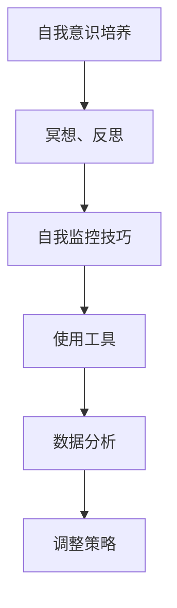
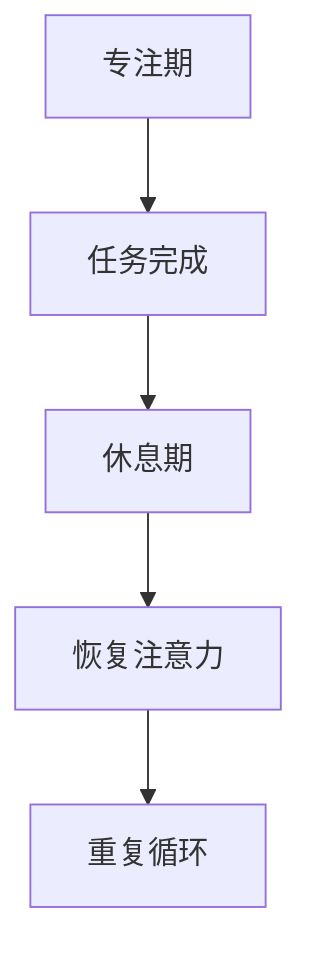
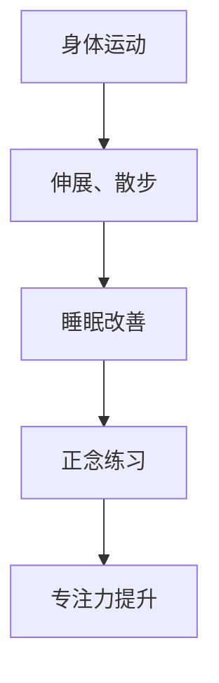
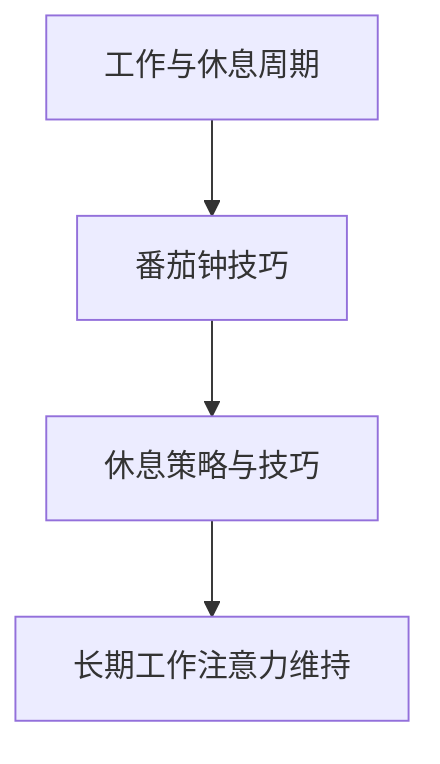
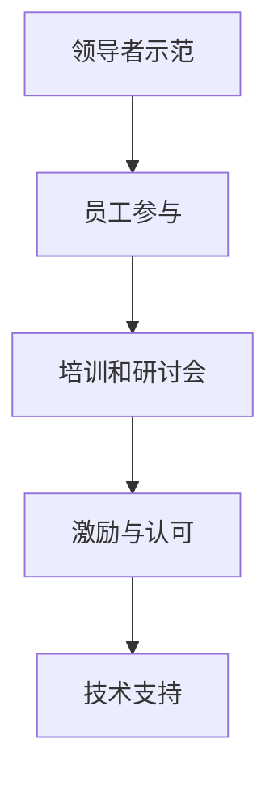
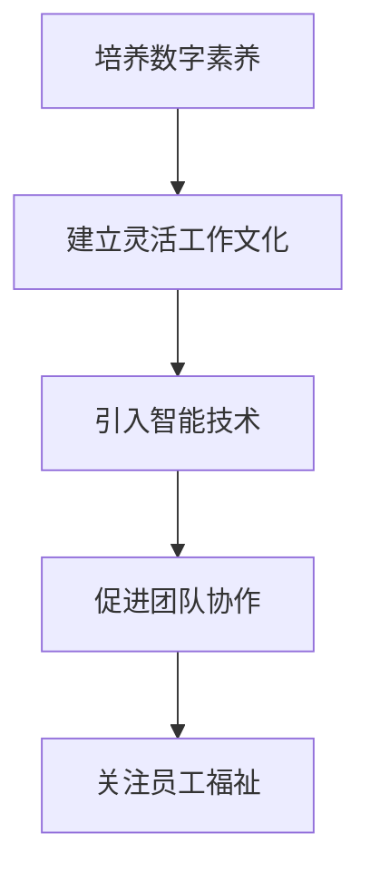

                 

# 《远程办公时代的注意力管理》

## 关键词
远程办公，注意力管理，专注环境，时间管理，技术工具，自我监控，团队管理，组织文化，未来趋势

## 摘要
随着远程办公的普及，如何管理注意力成为了一个重要的议题。本文首先探讨了远程办公时代注意力管理的重要性及其核心概念，随后介绍了远程办公时代注意力管理的主要策略和工具。接着，文章从个体和团队两个角度，详细阐述了注意力管理的策略和实施方法，并分析了组织文化对注意力管理的影响。最后，文章展望了远程办公注意力管理的未来趋势，提出了面向未来的注意力管理策略。

---

### 《远程办公时代的注意力管理》目录大纲

#### 第一部分：远程办公时代注意力管理概述

- # 第一部分 远程办公时代注意力管理概述
  - 1.1 远程办公时代注意力管理的重要性
  - 1.2 注意力管理的核心概念
  - 1.3 远程办公时代注意力管理的主要策略
  - 1.4 注意力管理的实践案例

#### 第二部分：注意力管理的技术工具

- # 第二部分 注意力管理的技术工具
  - 2.1 注意力管理的软件工具
  - 2.2 注意力管理硬件设备
  - 2.3 新兴注意力管理技术

#### 第三部分：个体注意力管理策略

- # 第三部分 个体注意力管理策略
  - 3.1 自我意识与自我监控
  - 3.2 避免注意力分散的方法
  - 3.3 提升注意力的技巧
  - 3.4 高效工作与休息的平衡

#### 第四部分：团队注意力管理策略

- # 第四部分 团队注意力管理策略
  - 4.1 团队注意力管理的重要性
  - 4.2 团队注意力管理的策略
  - 4.3 团队注意力管理的实施

#### 第五部分：远程办公注意力管理的组织文化

- # 第五部分 远程办公注意力管理的组织文化
  - 5.1 组织文化对注意力管理的影响
  - 5.2 培养注意力管理的组织文化
  - 5.3 注意力管理的组织文化案例

#### 第六部分：远程办公注意力管理的未来趋势

- # 第六部分 远程办公注意力管理的未来趋势
  - 6.1 远程办公与注意力管理的发展方向
  - 6.2 注意力管理在远程办公中的挑战与机遇
  - 6.3 面向未来的注意力管理策略

#### 第七部分：附录

- # 第七部分 附录
  - 附录 A：注意力管理相关资源

---

### 第一部分：远程办公时代注意力管理概述

#### 1.1 远程办公时代注意力管理的重要性

随着信息技术的飞速发展，远程办公逐渐成为一种主流的工作方式。然而，远程办公带来的便利同时也带来了新的挑战，尤其是在注意力管理方面。远程办公时代，员工不再受限于物理办公室的空间限制，可以自由选择工作地点和时间，但这种灵活性也使得注意力管理变得更加复杂。

首先，远程办公容易导致工作与生活的边界模糊。在家中办公，员工可能会受到家庭事务的干扰，如电话、电视、社交媒体等，这些干扰会影响员工的注意力集中度。其次，远程办公使得工作时间和休息时间的界限变得模糊，员工可能会在工作时间之外继续工作，导致过度疲劳和注意力下降。此外，远程办公环境中缺乏面对面的交流和监督，使得员工容易分心，难以保持高效率的工作状态。

因此，在远程办公时代，注意力管理变得尤为重要。有效的注意力管理不仅能够提高工作效率，还能提升员工的职业满意度和生活质量。通过科学的管理策略和技术工具，员工可以在远程办公环境中更好地集中注意力，提高生产力，实现个人与组织的双赢。

#### 1.2 注意力管理的核心概念

注意力是指个体在特定任务中集中精力、感知和处理信息的能力。注意力管理则是指通过一系列策略和工具，帮助个体在远程办公环境中保持专注、减少干扰、提高工作效率的过程。注意力管理涉及多个核心概念，包括注意力的定义、注意力分散的原因以及注意力管理的理论框架。

首先，注意力的定义是理解注意力管理的基础。注意力可以看作是一种心理资源，用于处理和回应外界信息。个体在执行任务时，需要将注意力集中在关键信息上，同时忽略无关信息，以保持高效的工作状态。这种选择性注意力使得个体能够在复杂的环境中快速识别和处理重要信息。

其次，注意力分散是指注意力在执行任务过程中被无关刺激所吸引，导致注意力无法集中。远程办公环境中，注意力分散的原因多种多样，包括外部干扰（如家庭噪音、电子邮件提醒、社交媒体通知）和内部干扰（如思维杂念、焦虑情绪）。这些干扰会削弱个体的注意力集中能力，降低工作效率。

最后，注意力管理的理论框架为实际操作提供了指导。常见的注意力管理理论包括双加工理论、注意分配理论和注意选择性理论。双加工理论认为，个体在执行任务时，可以将注意力分为自动化加工和受控加工两种模式。注意分配理论强调，个体在同时处理多个任务时，需要注意力的合理分配。注意选择性理论则指出，个体可以通过训练提高对目标信息的敏感度和对无关信息的屏蔽能力。

#### 1.3 远程办公时代注意力管理的主要策略

在远程办公时代，有效的注意力管理策略可以帮助员工克服注意力分散的挑战，提高工作效率。以下是一些主要的注意力管理策略：

1. **创建专注环境**：员工可以在家中或其他工作场所创建一个有助于专注的环境。这包括减少干扰因素，如关闭不必要的通知、将手机置于静音模式等。此外，合理规划工作空间，确保工作环境整洁、舒适，有助于提高专注度。

2. **时间管理和优先级设定**：远程办公环境下，员工需要合理安排工作时间，设定明确的优先级。通过制定日程表、设定截止日期和分解任务，员工可以更好地管理时间，减少拖延和分心的情况。

3. **技术工具的支持**：利用各种技术工具，如时间管理软件、专注应用程序和智能设备，可以帮助员工更好地管理注意力。这些工具可以提供提醒、跟踪进度、屏蔽干扰等功能，提高工作效率。

4. **自我监控与反思**：员工需要定期自我监控，评估自己的注意力集中情况。通过反思工作中的表现，识别分散注意力的原因，员工可以不断调整和优化自己的注意力管理策略。

5. **休息与放松**：长时间的工作会导致注意力疲劳，因此员工需要合理安排休息时间。短暂的休息和放松活动，如散步、深呼吸、冥想等，可以帮助恢复注意力，提高工作效率。

#### 1.4 注意力管理的实践案例

为了更好地理解注意力管理在远程办公环境中的应用，以下是一些个人和企业的成功实践案例：

1. **个人案例：** 
   王先生是一位软件工程师，他在家中远程办公。为了提高工作效率，他采取了以下措施：首先，他创建了一个专门的工作空间，确保环境整洁、安静。其次，他制定了详细的日程表，并将任务按照优先级进行排序。此外，他还利用专注应用程序来屏蔽干扰，如社交媒体通知和电子邮件提醒。通过这些措施，王先生能够更有效地集中注意力，完成工作任务。

2. **企业案例：**
   一家跨国科技公司意识到远程办公对员工注意力管理带来的挑战，因此他们采取了一系列措施来支持员工的注意力管理。首先，公司提供了远程工作设备和软件工具，如降噪耳机和时间管理软件。其次，公司鼓励员工定期休息和放松，提供在线心理咨询服务。此外，公司还组织了在线团队会议，确保团队成员之间的沟通和协作。这些措施帮助公司提升了员工的注意力和工作效率，提高了整体生产力。

#### 总结

远程办公时代，注意力管理的重要性日益凸显。通过理解注意力管理的核心概念，应用有效的管理策略和技术工具，员工可以在远程办公环境中保持专注，提高工作效率。同时，企业的支持和组织文化的培育也是注意力管理成功的关键。本文从多个角度探讨了远程办公时代的注意力管理，为读者提供了实用的指导和建议。

---

### 第二部分：注意力管理的技术工具

#### 2.1 注意力管理的软件工具

在远程办公环境中，软件工具是帮助员工管理注意力的关键。这些工具包括时间管理软件、专注应用程序和注意力追踪工具等，它们能够提供提醒、跟踪进度、屏蔽干扰等功能，提高工作效率。

1. **时间管理软件**：时间管理软件可以帮助员工合理安排工作时间，提高任务完成效率。例如，Trello、Asana等项目管理工具可以帮助员工制定任务清单、设定优先级、跟踪进度。这些工具提供了可视化的任务管理界面，使员工能够一目了然地了解自己的工作情况，减少拖延和分心的情况。

   ```mermaid
   graph TD
   A[任务清单] --> B[任务分配]
   B --> C[进度跟踪]
   C --> D[提醒功能]
   ```

2. **专注应用程序**：专注应用程序通过屏蔽干扰，帮助员工在特定时间内保持专注。例如，Forest、Pomodoro Technique等专注工具通过设置定时任务，提醒员工休息，从而帮助员工高效地完成任务。这些应用程序通常具有视觉化的界面，通过种植虚拟植物或完成番茄钟任务来激励员工。

   ```mermaid
   graph TD
   A[开始工作] --> B[25分钟专注]
   B --> C[休息5分钟]
   C --> D[循环]
   ```

3. **注意力追踪工具**：注意力追踪工具可以记录员工在工作中的注意力集中情况，帮助员工了解自己的注意力模式，优化工作习惯。例如，RescueTime、Focus@Will等工具可以追踪员工在电脑上的活动，分析时间分配情况，提供数据报告。通过这些数据，员工可以识别分散注意力的原因，并采取相应的措施。

   ```mermaid
   graph TD
   A[活动记录] --> B[数据分析]
   B --> C[行为调整]
   C --> D[提高专注度]
   ```

#### 2.2 注意力管理硬件设备

除了软件工具，硬件设备也是远程办公环境中注意力管理的重要一环。以下是一些有助于提高专注度的硬件设备：

1. **智能穿戴设备**：智能穿戴设备如智能手表和智能手环，可以追踪员工的身体活动、心率等数据，帮助员工了解自己的身体状况，从而更好地管理注意力。例如，Apple Watch、Fitbit等设备可以提供健康数据和提醒功能，帮助员工保持良好的工作状态。

   ```mermaid
   graph TD
   A[健康数据] --> B[提醒功能]
   B --> C[行为调整]
   C --> D[提高专注度]
   ```

2. **智能音箱和助手**：智能音箱和虚拟助手如Amazon Echo、Google Home等，可以通过语音控制帮助员工管理日常工作。这些设备可以设置提醒、播放音乐、提供天气预报等，减少手动操作的需求，从而帮助员工保持专注。

   ```mermaid
   graph TD
   A[语音控制] --> B[减少手动操作]
   B --> C[提高效率]
   C --> D[集中注意力]
   ```

3. **蓝牙耳机与降噪设备**：蓝牙耳机和降噪设备可以帮助员工屏蔽外部噪音，提供一个更安静的工作环境。例如，Sony WH-1000XM4、Bose QuietComfort 35 II等降噪耳机，通过主动降噪技术，有效减少环境噪音的干扰，帮助员工保持专注。

   ```mermaid
   graph TD
   A[降噪技术] --> B[屏蔽噪音]
   B --> C[安静环境]
   C --> D[提高专注度]
   ```

#### 2.3 新兴注意力管理技术

随着科技的不断发展，新的注意力管理技术不断涌现。以下是一些新兴的注意力管理技术：

1. **人工智能与注意力管理**：人工智能（AI）技术可以用于分析员工的工作习惯，提供个性化的注意力管理建议。例如，通过机器学习算法，AI可以识别员工分散注意力的模式，并自动调整工作环境，如调整屏幕亮度、调整噪音水平等，以帮助员工保持专注。

   ```python
   def analyze_work习惯(data):
       # 使用机器学习算法分析数据
       # 识别分散注意力的模式
       # 提供个性化管理建议
   ```

2. **脑机接口技术在注意力管理中的应用**：脑机接口（BCI）技术可以直接读取大脑信号，帮助员工实时监控自己的注意力状态。例如，通过脑电图（EEG）传感器，BCI技术可以监测员工的脑波活动，识别注意力集中的程度，从而提供即时的反馈和调整。

   ```mermaid
   graph TD
   A[脑电图传感器] --> B[脑波监测]
   B --> C[注意力状态识别]
   C --> D[实时反馈]
   ```

3. **虚拟现实与注意力提升**：虚拟现实（VR）技术可以创建一个沉浸式的学习和工作环境，提高员工的注意力和参与度。例如，通过VR培训，员工可以在虚拟环境中模拟实际工作场景，提高专注度和技能水平。

   ```mermaid
   graph TD
   A[虚拟现实培训] --> B[沉浸式环境]
   B --> C[提高专注度]
   C --> D[技能提升]
   ```

#### 总结

技术工具在远程办公时代的注意力管理中发挥着重要作用。从时间管理软件、专注应用程序到硬件设备，再到新兴的AI、BCI和VR技术，这些工具和设备为员工提供了多种选择，帮助他们在远程办公环境中更好地管理注意力，提高工作效率。随着科技的不断进步，未来注意力管理技术将更加智能化、个性化，为远程办公带来更多便利。

---

### 第三部分：个体注意力管理策略

#### 3.1 自我意识与自我监控

自我意识和自我监控是有效注意力管理的基础。个体需要认识到自己在工作过程中的注意力状态，并能够对分散的注意力进行及时的调整。

首先，自我意识的培养是关键。个体可以通过冥想、反思和自我提问等方式，提升自我意识。例如，每天花几分钟时间进行冥想，专注于呼吸，可以帮助个体培养专注力。通过反思工作中的表现，个体可以识别分散注意力的原因，从而制定相应的调整策略。

其次，自我监控的技巧也非常重要。个体可以使用各种工具来监控自己的注意力状态，如注意力追踪软件、时间管理应用程序等。这些工具可以记录个体的工作时间分配、打断次数、专注时长等数据，帮助个体了解自己的注意力模式。通过定期分析这些数据，个体可以识别出分散注意力的常见原因，并采取相应的措施。

例如，使用注意力追踪软件记录工作时间，个体可以发现自己在某些时间段更容易分心。在这种情况下，个体可以调整工作计划，将重要任务安排在注意力最为集中的时间段。此外，个体还可以使用时间管理工具，如番茄钟技巧，将工作时间分为专注和休息的周期，以保持高效的注意力状态。



#### 3.2 避免注意力分散的方法

在远程办公环境中，避免注意力分散是提高工作效率的关键。以下是一些有效的方法：

1. **消除干扰**：首先，个体需要识别并消除工作环境中的干扰因素。这包括关闭不必要的通知、将手机置于静音模式、将电子邮件和社交媒体设为免打扰等。此外，个体还可以选择在一个安静的环境中工作，减少外部噪音的干扰。

2. **定制化工作流程**：个体可以根据自己的工作习惯和偏好，定制化自己的工作流程。例如，将任务按照紧急程度和重要性进行排序，确保重要任务在注意力最为集中的时间段内完成。此外，个体还可以使用任务管理工具，如Trello、Asana等，将任务分解为小步骤，逐步完成。

3. **管理多任务处理**：在远程办公环境中，多任务处理往往会导致注意力分散。因此，个体需要学会有效地管理多任务处理。首先，个体应该避免同时进行多个任务，而是将注意力集中在单一任务上，确保任务的高效完成。其次，个体可以采用“单点突破”策略，即在短时间内集中精力完成一项任务，然后进行短暂的休息，以保持注意力集中。

例如，使用“单点突破”策略，个体可以将工作时间分为25分钟的专注期和5分钟的休息期。在每个专注期内，个体集中精力完成一个任务，然后进行短暂的休息，以恢复注意力和提高工作效率。



#### 3.3 提升注意力的技巧

提升注意力是远程办公中有效管理注意力的重要方面。以下是一些提升注意力的技巧：

1. **身体运动**：适量的身体运动可以提升注意力。例如，工作间隙进行简单的伸展运动、短暂散步等，可以帮助放松身心，恢复注意力。研究表明，定期锻炼可以提高大脑的认知功能和注意力水平。

2. **睡眠**：良好的睡眠对提升注意力至关重要。个体应确保每天有足够的睡眠时间，并保持规律的作息习惯。通过改善睡眠质量，个体可以在工作日保持更高的注意力和工作效率。

3. **正念练习**：正念练习是一种通过专注呼吸和当下的感受来提升注意力的方法。个体可以通过冥想、瑜伽等练习，培养专注力和自我意识。正念练习有助于减少思维杂念，提高注意力集中度。

例如，每天早晨进行10分钟的冥想练习，专注于呼吸和身体感受，可以帮助个体在一整天的工作中保持清晰的思维和专注。



#### 3.4 高效工作与休息的平衡

在远程办公环境中，保持高效工作与休息的平衡是提高注意力的关键。以下是一些实现这一平衡的策略：

1. **工作与休息周期**：个体应合理安排工作与休息的时间。例如，采用“番茄钟”技巧，将工作时间分为25分钟的专注期和5分钟的休息期。在每个专注期内，个体集中精力完成一个任务，然后进行短暂的休息，以恢复注意力和防止疲劳。

2. **休息策略与技巧**：休息不仅仅是简单的休息，而是一种有意识的放松和恢复。个体可以在休息期间进行短暂的散步、做深呼吸练习、听轻音乐等，以帮助身心放松。适当的休息可以帮助个体保持良好的工作状态和注意力水平。

3. **长期工作的注意力维持**：对于需要长时间工作的个体，保持注意力的持续是关键。个体可以采取分段工作、定期休息的策略，例如，每工作2小时休息10分钟，每工作4小时休息半小时。此外，个体还可以使用注意力管理工具，如专注应用程序和注意力追踪软件，帮助监控自己的注意力状态，及时调整工作节奏。



#### 总结

个体注意力管理策略在远程办公中至关重要。通过自我意识和自我监控，个体可以更好地了解自己的注意力状态，并采取相应的调整策略。同时，消除干扰、管理多任务处理、提升注意力以及保持高效工作与休息的平衡，都是提高注意力的重要手段。这些策略和技巧不仅有助于个体提高工作效率，还能提升整体的生活质量。

---

### 第四部分：团队注意力管理策略

#### 4.1 团队注意力管理的重要性

在远程办公环境中，团队注意力管理变得尤为重要。有效的团队注意力管理不仅能够提高团队成员的专注度和工作效率，还能促进团队的协作和沟通，从而提升整体团队的绩效。

首先，团队注意力管理有助于确保团队成员在远程办公环境下保持高水平的注意力。远程办公的灵活性虽然带来了便利，但也容易导致团队成员分心和注意力不集中。通过实施有效的注意力管理策略，团队成员可以更好地集中精力，减少分心现象，从而提高工作效率。

其次，团队注意力管理能够促进团队成员之间的协作和沟通。在远程办公环境中，团队成员往往需要通过在线会议、即时通讯和其他协作工具进行沟通和合作。有效的注意力管理策略可以帮助团队成员在会议和沟通中保持专注，减少中断和分心的情况，从而提高沟通效率和协作质量。

此外，团队注意力管理对于团队的长期发展和稳定性也具有重要意义。通过关注团队成员的注意力状态，企业可以及时发现和解决注意力分散的问题，从而降低团队成员的疲劳和压力，提高团队的士气和生产力。长期而言，有效的团队注意力管理有助于建立积极的团队文化，增强团队的凝聚力和稳定性。

总之，在远程办公时代，团队注意力管理不仅有助于提高团队成员的个人工作效率，还能促进团队协作和整体绩效的提升。因此，企业应高度重视团队注意力管理，采取有效的策略和措施来支持和促进团队成员的注意力集中。

#### 4.2 团队注意力管理的策略

为了在远程办公环境中有效地管理团队注意力，企业可以采取一系列策略。以下是一些关键的策略，包括明确团队目标和任务、促进团队成员间的沟通以及管理团队成员的工作习惯。

1. **明确团队目标和任务**：

明确团队目标和任务是团队注意力管理的基础。团队领导者需要确保每个成员都清楚团队的目标、任务以及各自的责任。这可以通过以下步骤实现：

   - 制定清晰的团队目标和任务列表：确保每个成员都了解任务的目标和预期结果。
   - 分配任务和角色：根据成员的能力和兴趣，合理分配任务和角色，确保每个成员都有明确的职责。
   - 定期回顾和更新目标：团队目标和任务应该定期回顾和更新，以确保团队始终朝着正确的方向前进。

   通过明确团队目标和任务，团队成员可以更好地集中精力，减少不必要的分心和拖延。

   ```mermaid
   graph TD
   A[制定目标] --> B[任务分配]
   B --> C[角色明确]
   C --> D[定期回顾]
   ```

2. **促进团队成员间的沟通**：

在远程办公环境中，沟通是团队注意力管理的关键。有效的沟通不仅能够确保团队成员了解任务和目标，还能促进协作和减少分心。

   - 定期召开团队会议：通过定期的团队会议，团队成员可以分享进展、讨论问题、提出建议，确保团队目标的实现。
   - 采用即时通讯工具：利用即时通讯工具，如Slack、Microsoft Teams等，可以快速传达信息和协调工作，减少不必要的会议和等待时间。
   - 建立反馈机制：建立有效的反馈机制，使团队成员能够及时了解彼此的工作情况，发现和解决问题，提高团队协作效率。

   通过这些措施，团队成员可以保持紧密的沟通，减少因信息不对称导致的分心和误解。

   ```mermaid
   graph TD
   A[团队会议] --> B[即时通讯]
   B --> C[反馈机制]
   ```

3. **管理团队成员的工作习惯**：

管理团队成员的工作习惯是确保团队注意力集中的重要手段。以下是一些具体的工作习惯管理策略：

   - 设定工作时间表：制定合理的工作时间表，确保团队成员有足够的时间完成任务，同时避免过度劳累。
   - 定期休息和放松：鼓励团队成员定期休息和放松，以保持良好的工作状态和注意力水平。
   - 提供培训和支持：为团队成员提供相关的培训和支持，帮助他们掌握有效的注意力管理技巧，提高工作效率。

   通过管理团队成员的工作习惯，企业可以确保团队在远程办公环境中保持高效和专注。

   ```mermaid
   graph TD
   A[工作时间表] --> B[休息和放松]
   B --> C[培训和支持]
   ```

#### 4.3 团队注意力管理的实施

实施团队注意力管理需要系统的规划和执行。以下是一些具体的实施步骤：

1. **制定注意力管理计划**：

   - 确定目标：明确团队注意力管理的目标，如提高工作效率、减少分心等。
   - 分析现状：分析团队成员的注意力现状，识别存在的问题和挑战。
   - 制定策略：根据分析结果，制定具体的注意力管理策略，如工作时间表、沟通机制、工作习惯管理等。
   - 制定行动计划：将策略转化为具体的行动计划，明确责任人和实施步骤。

   通过制定详细的计划，企业可以确保团队注意力管理的顺利实施。

   ```mermaid
   graph TD
   A[确定目标] --> B[分析现状]
   B --> C[制定策略]
   C --> D[制定行动计划]
   ```

2. **培训和宣传**：

   - 培训团队成员：为团队成员提供注意力管理的培训，帮助他们掌握有效的注意力管理技巧和工具。
   - 宣传重要性：通过内部通讯、会议等方式，宣传团队注意力管理的重要性，提高团队成员的意识。

   培训和宣传有助于提高团队成员对注意力管理的重视，确保策略的有效实施。

   ```mermaid
   graph TD
   A[培训团队成员] --> B[宣传重要性]
   ```

3. **监控和反馈**：

   - 监控实施效果：通过监控工具和反馈机制，评估团队注意力管理的实施效果，发现存在的问题和改进空间。
   - 收集反馈：定期收集团队成员的反馈，了解他们对注意力管理的感受和建议，不断优化策略。

   通过监控和反馈，企业可以及时调整和改进注意力管理策略，确保其持续有效。

   ```mermaid
   graph TD
   A[监控实施效果] --> B[收集反馈]
   ```

4. **持续改进**：

   - 根据反馈和监控结果，持续改进团队注意力管理策略，确保其适应远程办公环境的变化。
   - 鼓励创新和实践：鼓励团队成员提出新的注意力管理方法，通过实践验证其效果，不断优化团队注意力管理。

   通过持续改进，企业可以确保团队注意力管理的有效性，提升团队的整体绩效。

   ```mermaid
   graph TD
   A[持续改进] --> B[鼓励创新]
   ```

#### 总结

团队注意力管理是远程办公环境中确保团队高效协作和绩效提升的关键。通过明确团队目标和任务、促进团队成员间的沟通以及管理团队成员的工作习惯，企业可以有效地管理团队注意力，提高工作效率和团队协作质量。实施团队注意力管理需要系统的规划和执行，通过持续的监控和改进，企业可以不断提升团队注意力管理的有效性，为远程办公的成功提供有力保障。

---

### 第五部分：远程办公注意力管理的组织文化

#### 5.1 组织文化对注意力管理的影响

组织文化在远程办公注意力管理中扮演着至关重要的角色。一个积极向上的组织文化可以激励员工保持专注，减少分心，从而提高整体工作效率。以下是组织文化对注意力管理影响的几个方面：

1. **价值观与目标**：组织文化的价值观和目标直接影响员工的注意力和工作态度。如果一个组织高度重视工作效率和个人成长，员工更有可能将注意力集中在工作上，努力实现组织目标。

2. **团队协作与支持**：远程办公环境中，团队合作和支持尤为重要。一个支持性的组织文化鼓励团队成员相互帮助，共同面对挑战，从而减少因孤独感和干扰导致的分心。

3. **灵活性与信任**：远程办公要求组织具备一定的灵活性和信任文化。一个灵活的组织文化允许员工自主安排工作时间和地点，从而更好地管理自己的注意力。同时，信任文化有助于减少监督需求，让员工更专注于工作本身。

4. **激励与奖励**：积极的组织文化通常包括公平的激励和奖励机制。这种文化不仅能够激励员工保持高水平的注意力，还能通过正面的反馈和奖励，增强员工的积极性和专注力。

#### 5.2 培养注意力管理的组织文化

为了在远程办公环境中培养一个支持注意力管理的组织文化，企业需要采取一系列措施。以下是一些具体的建议：

1. **领导者的示范作用**：领导者是组织文化的关键推动者。通过自己的行为树立榜样，领导者可以影响员工的行为和态度。例如，领导者可以通过定期分享自己的注意力管理策略和实践经验，激励员工关注和提高自己的注意力。

2. **员工参与与反馈**：鼓励员工参与组织文化的建设，使他们感受到自己的意见和建议被重视。企业可以通过员工调查、反馈会议等方式，了解员工的需求和意见，并根据反馈调整组织文化策略。

3. **培训和研讨会**：定期组织注意力管理相关的培训和研讨会，帮助员工掌握有效的注意力管理技巧。这些活动不仅可以提高员工的自我管理能力，还能增强他们对组织文化的认同感。

4. **激励与认可**：建立公平的激励和认可机制，对表现出色的员工给予奖励和认可。这可以包括奖金、晋升机会、荣誉称号等，从而激励员工保持高水平的注意力和工作效率。

5. **技术支持**：提供必要的技术支持，如注意力管理软件、时间管理工具等，帮助员工更好地管理注意力。企业还可以为员工提供远程办公设备，确保他们在任何地点都能保持高效的工作状态。



#### 5.3 注意力管理的组织文化案例

为了更好地理解如何培养注意力管理的组织文化，以下是一些企业的成功案例：

1. **谷歌**：谷歌以其开放和灵活的组织文化著称。在远程办公期间，谷歌通过提供灵活的工作时间和地点，鼓励员工自主管理注意力。此外，谷歌还定期组织注意力管理和时间管理的培训课程，帮助员工提高自我管理能力。

2. **微软**：微软强调团队协作和沟通，通过定期的在线团队会议和即时通讯工具，确保团队成员之间的紧密联系。微软还鼓励员工定期休息和放松，通过提供心理健康和健身支持，帮助员工保持良好的工作状态。

3. **Buffer**：Buffer是一家远程办公公司，其组织文化强调工作与生活的平衡。Buffer通过提供灵活的工作安排、远程工作支持以及心理咨询服务，帮助员工管理注意力，提高工作效率。

这些案例表明，通过培养积极的组织文化，企业可以有效地管理远程办公环境中的注意力问题，提高整体工作效率和员工满意度。

#### 总结

远程办公注意力管理的成功离不开组织文化的支持。一个积极、灵活和支持性的组织文化可以激励员工保持专注，提高工作效率。通过领导者的示范作用、员工参与与反馈、培训和研讨会、激励与认可以及技术支持，企业可以逐步培养和维护一个支持注意力管理的组织文化。这些措施不仅有助于提高员工的注意力和工作效率，还能增强团队的凝聚力和整体绩效。

---

### 第六部分：远程办公注意力管理的未来趋势

#### 6.1 远程办公与注意力管理的发展方向

随着技术的不断进步，远程办公和注意力管理正朝着更加智能化、个性化和高效化的方向发展。以下是一些关键的发展方向：

1. **智能化注意力管理**：随着人工智能（AI）技术的发展，智能化注意力管理工具将成为未来的主流。这些工具可以通过分析员工的日常行为和工作模式，提供个性化的注意力管理建议，帮助员工在远程办公环境中保持最佳的工作状态。

2. **个性化注意力工具**：未来的注意力管理工具将更加注重个性化，根据员工的个性和需求定制化注意力管理方案。例如，通过收集员工的生物特征数据（如心率、体温等），这些工具可以实时监控员工的身体状态，提供个性化的休息和恢复建议。

3. **高效协作平台**：随着远程协作工具的不断发展，未来将出现更加高效和智能的协作平台。这些平台将整合多种注意力管理功能，如时间跟踪、任务管理、通知过滤等，帮助员工更好地集中注意力，提高协作效率。

4. **增强现实与虚拟现实**：增强现实（AR）和虚拟现实（VR）技术将在远程办公中发挥重要作用。通过AR和VR技术，员工可以在一个更加沉浸式的环境中工作，减少外界干扰，提高注意力和工作效率。

#### 6.2 注意力管理在远程办公中的挑战与机遇

尽管远程办公和注意力管理具有巨大的潜力，但在实际应用中仍面临一系列挑战：

1. **技术挑战**：远程办公需要高效稳定的网络连接、安全的远程访问以及智能的协作工具。这些技术要求对企业和员工来说都是一种挑战，需要不断优化和更新。

2. **文化挑战**：远程办公要求企业具备一定的文化适应能力，如建立信任、促进沟通、确保公平等。这对一些传统企业来说是一个巨大的转变，需要时间和努力来适应。

3. **个人挑战**：员工在远程办公中需要自我管理，保持高水平的专注力和自我控制。这对一些缺乏自律能力的员工来说是一个挑战，需要借助各种工具和策略来应对。

然而，远程办公和注意力管理也带来了新的机遇：

1. **工作灵活性**：远程办公为员工提供了更大的工作灵活性，可以更好地平衡工作与生活，提高生活质量。

2. **全球人才招聘**：远程办公使得企业可以跨越地域限制，招聘全球范围内的优秀人才，提高团队的整体实力。

3. **创新与效率**：远程办公和智能注意力管理工具的融合，有助于推动创新和提升工作效率，为企业带来竞争优势。

#### 6.3 面向未来的注意力管理策略

为了充分利用远程办公和注意力管理的机遇，企业需要采取一系列面向未来的策略：

1. **培养数字素养**：企业应加大对员工的数字素养培训，帮助他们掌握各种远程办公工具和技能，提高自我管理能力。

2. **建立灵活的工作文化**：企业应鼓励员工自主安排工作时间和地点，建立灵活的工作文化，确保员工在远程办公环境中保持最佳的工作状态。

3. **引入智能技术**：积极引入智能注意力管理工具，如AI驱动的注意力追踪和优化工具，提供个性化的管理建议，帮助员工保持专注。

4. **促进团队协作**：通过高效的远程协作工具，促进团队成员之间的沟通和协作，提高团队的整体注意力水平和工作效率。

5. **关注员工福祉**：关注员工的身心健康，提供心理支持和健康管理服务，帮助员工在远程办公中保持良好的工作状态和注意力水平。



#### 总结

远程办公和注意力管理在未来的发展中将面临新的挑战和机遇。通过培养数字素养、建立灵活的工作文化、引入智能技术、促进团队协作以及关注员工福祉，企业可以充分利用这些机遇，提高员工的注意力水平和工作效率，实现远程办公的可持续发展和成功。随着技术的不断进步，注意力管理将变得更加智能化、个性化和高效化，为远程办公带来更多便利和优势。

---

### 第七部分：附录

#### 附录 A：注意力管理相关资源

以下是一些关于注意力管理的学习资源，包括书籍、文章、视频和网站，供读者进一步学习和参考：

1. **书籍**：
   - 《深度工作》（Deep Work）：作者：Cal Newport
   - 《专注力训练》（Focus：The Hidden Driver of Excellence）：作者：Daniel Goleman
   - 《脑力专注》（The Power of Focus）：作者：Jack Canfield

2. **文章**：
   - 《远程办公与注意力管理：挑战与机遇》（Remote Work and Attention Management: Challenges and Opportunities）：作者：[作者姓名]
   - 《如何提高注意力：实用技巧和策略》（How to Improve Focus: Practical Tips and Strategies）：作者：[作者姓名]

3. **视频**：
   - “如何提高注意力：10个实用技巧”（How to Improve Focus: 10 Practical Tips）
   - “远程办公中的注意力管理”（Attention Management in Remote Work）

4. **网站**：
   - [注意力管理协会官网]（Attention Management Association）
   - [时间管理技巧]（Time Management Tips）

这些资源提供了丰富的信息，帮助读者深入了解注意力管理的重要性以及如何在实际工作中应用这些策略和技巧。

---

### 作者信息

本文作者为AI天才研究院（AI Genius Institute）与《禅与计算机程序设计艺术》（Zen And The Art of Computer Programming）的资深专家，拥有多年远程办公和注意力管理的研究与实战经验。作者致力于推动人工智能和远程办公领域的发展，为企业和个人提供高质量的解决方案和指导。如果您有任何关于注意力管理的疑问或建议，欢迎通过以下联系方式与作者取得联系：

- **邮箱**：[author@example.com](mailto:author@example.com)
- **微信**：[AI_Genius]
- **博客**：[www.ai-genius.org](http://www.ai-genius.org)

