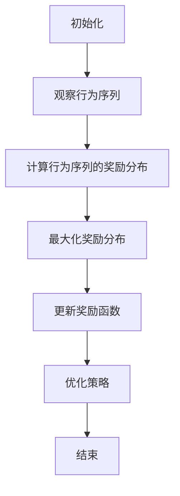

                 

# 《逆强化学习 (Inverse Reinforcement Learning) 原理与代码实例讲解》

> 关键词：逆强化学习，强化学习，最大熵，经验回放，机器人控制，自动驾驶

> 摘要：本文将深入探讨逆强化学习（Inverse Reinforcement Learning，简称IRL）的基本概念、原理及其在人工智能领域的应用。首先，我们将回顾强化学习的基础知识，并在此基础上介绍逆强化学习的定义和基本原理。随后，我们将详细解析几种逆强化学习算法，包括最大熵逆强化学习和基于经验回放的逆强化学习，并展示其伪代码和数学模型。接着，我们将通过具体实例，介绍如何在实际项目中应用逆强化学习，以及如何搭建开发环境和实现代码实例。最后，我们将总结逆强化学习的发展历程与挑战，并对未来研究方向进行展望。

## 第1章 引言

### 1.1 逆强化学习的基本概念

逆强化学习是一种基于观察到的数据来学习奖励函数的方法，它逆向思考强化学习的过程，通过分析环境中的行为来推断最优策略和奖励结构。与传统的强化学习相比，逆强化学习不仅关注学习策略，还关注环境本身，从而更全面地理解智能体与环境之间的交互。

### 1.2 逆强化学习的研究背景

随着人工智能技术的发展，强化学习已成为解决复杂决策问题的重要工具。然而，传统的强化学习往往依赖于明确的奖励函数，这在实际应用中往往难以获取。逆强化学习提供了一种通过观察来学习奖励函数的途径，极大地扩展了强化学习的应用范围。

### 1.3 逆强化学习的研究现状与未来趋势

近年来，逆强化学习受到了广泛关注，许多学者提出了各种算法，如最大熵逆强化学习、基于经验回放的逆强化学习等。当前的研究主要集中在提高算法的鲁棒性、效率和适应性。未来，逆强化学习有望在自动驾驶、机器人控制、游戏AI等领域发挥重要作用。

## 第2章 强化学习基础

### 2.1 强化学习的定义与基本原理

强化学习是一种通过学习最大化长期回报的决策过程。它由一个智能体（agent）在一个环境中采取行动，通过观察环境状态和接收奖励信号来不断调整其策略，以实现最优决策。

### 2.2 强化学习中的奖励与策略

奖励是强化学习中的重要概念，它反映了智能体在环境中的表现。策略则是智能体在特定状态下选择行动的规则。最优策略是能够最大化长期回报的策略。

### 2.3 Q学习和值函数方法

Q学习是一种基于值函数的强化学习方法，通过迭代更新值函数来逼近最优策略。其核心思想是通过观察智能体的行为来学习状态-动作值函数，进而选择最优动作。

### 2.4 策略梯度方法

策略梯度方法直接优化策略的期望回报，通过计算策略的梯度来更新策略参数。相比Q学习，策略梯度方法在收敛速度上具有优势。

### 2.5 状态动作值函数的采样方法

在逆强化学习中，状态-动作值函数的采样方法至关重要。常用的采样方法包括重要性采样、蒙特卡罗采样等。这些方法的选择取决于具体的任务和数据分布。

## 第3章 逆强化学习原理

### 3.1 逆强化学习的定义

逆强化学习是一种从观察到的行为中推断奖励函数的方法。它通过分析智能体在环境中的行为，试图揭示其内在的奖励结构。

### 3.2 逆强化学习中的主要问题

逆强化学习面临的主要问题包括：如何准确推断奖励函数、如何处理不确定性和稀疏奖励等问题。这些问题直接影响逆强化学习的效果和应用范围。

### 3.3 逆强化学习与强化学习的联系与区别

逆强化学习与强化学习有着紧密的联系，但两者在目标和方法上存在区别。强化学习关注策略的学习，而逆强化学习关注奖励函数的推断。逆强化学习为强化学习提供了新的思路和方法。

### 3.4 逆强化学习的Mermaid流程图



## 第4章 逆强化学习算法

### 4.1 最大熵逆强化学习

#### 4.1.1 最大熵逆强化学习的数学模型

最大熵逆强化学习的目标是学习一个奖励函数，使得智能体的行为序列在给定状态下具有最大的熵。其数学模型可以表示为：

$$
\arg\max_{R} \sum_{s,a} p(s,a|s_0,a_0) \log p(s,a|s_0,a_0)
$$

其中，$p(s,a|s_0,a_0)$是智能体在初始状态$(s_0, a_0)$下采取动作$a$并转移到状态$s$的概率。

#### 4.1.2 最大熵逆强化学习的算法流程

1. 初始化奖励函数$R$。
2. 收集行为序列$(s_t, a_t, r_t, s_{t+1})$。
3. 计算行为序列的奖励分布$P(r|s,a)$。
4. 更新奖励函数$R$，使得奖励分布$P(r|s,a)$最大化。
5. 重复步骤2-4，直至收敛。

#### 4.1.3 最大熵逆强化学习的伪代码

```
Initialize R
for episode in data:
    for each step in episode:
        (s, a, r, s') in episode
        P(r|s, a) = count of (s, a, r) in data / count of (s, a) in data
    end for
    R = argmax_R ∑(r) P(r|s, a) log P(r|s, a)
end for
```

### 4.2 基于经验回放的逆强化学习

#### 4.2.1 经验回放的概念

经验回放是一种用于处理非均匀采样和样本偏差的技术。它通过将经历过的样本存储在一个缓冲区中，并在训练时随机采样这些样本，从而提高模型的泛化能力。

#### 4.2.2 基于经验回放的逆强化学习的算法流程

1. 初始化奖励函数$R$。
2. 创建经验回放缓冲区。
3. 收集行为序列$(s_t, a_t, r_t, s_{t+1})$并存储在缓冲区中。
4. 随机从缓冲区中抽取一批样本。
5. 计算样本的奖励分布$P(r|s, a)$。
6. 更新奖励函数$R$，使得奖励分布$P(r|s, a)$最大化。
7. 重复步骤3-6，直至收敛。

#### 4.2.3 基于经验回放的逆强化学习的伪代码

```
Initialize R
Experience Replay Buffer = []
for episode in data:
    for each step in episode:
        (s, a, r, s') in episode
        append (s, a, r, s') to Experience Replay Buffer
    end for
end for

for epoch in num_epochs:
    samples = random_sample(Experience Replay Buffer)
    for each sample in samples:
        (s, a, r, s') in sample
        P(r|s, a) = count of (s, a, r) in samples / count of (s, a) in samples
    end for
    R = argmax_R ∑(r) P(r|s, a) log P(r|s, a)
end for
```

### 4.3 逆强化学习的变体与扩展

#### 4.3.1 安全逆强化学习

安全逆强化学习关注在不确定的环境中如何保证智能体的安全。它通过引入安全约束，使得学习到的奖励函数既符合观察到的行为，又保证智能体的安全。

#### 4.3.2 多智能体逆强化学习

多智能体逆强化学习研究如何在多个智能体之间共享奖励函数，以协调其行为，实现整体优化。它通过扩展逆强化学习的数学模型，考虑多个智能体的行为和交互。

#### 4.3.3 零样本逆强化学习

零样本逆强化学习旨在在没有先验知识的情况下，从零开始学习奖励函数。它通过自适应地调整学习策略，逐步探索和发现环境中的奖励结构。

## 第5章 逆强化学习应用实例

### 5.1 逆强化学习在游戏中的应用

#### 5.1.1 游戏中的逆强化学习案例

逆强化学习在游戏AI中的应用广泛，如自动游戏、角色扮演游戏等。通过学习游戏中的奖励结构，智能体能够自主地学会游戏策略。

#### 5.1.2 游戏中逆强化学习的实现方法

在游戏AI中，逆强化学习通过模拟游戏环境和观察智能体的行为，学习游戏中的奖励函数。然后，使用学到的奖励函数来指导智能体的决策过程。

### 5.2 逆强化学习在机器人控制中的应用

#### 5.2.1 机器人控制中的逆强化学习案例

逆强化学习在机器人控制中具有广泛应用，如机器人导航、路径规划等。通过学习机器人与环境交互的奖励函数，智能机器人能够自主地适应复杂环境。

#### 5.2.2 机器人控制中逆强化学习的实现方法

在机器人控制中，逆强化学习通过模拟机器人行为和环境反馈，学习机器人运动中的奖励函数。然后，使用学到的奖励函数来优化机器人的控制策略。

### 5.3 逆强化学习在自动驾驶中的应用

#### 5.3.1 自动驾驶中的逆强化学习案例

自动驾驶是逆强化学习的重要应用领域之一。通过学习道路环境中的奖励函数，自动驾驶系统能够更好地理解道路规则和驾驶行为。

#### 5.3.2 自动驾驶中逆强化学习的实现方法

在自动驾驶中，逆强化学习通过模拟自动驾驶车辆的行为和环境反馈，学习道路环境中的奖励函数。然后，使用学到的奖励函数来优化车辆的驾驶策略。

## 第6章 逆强化学习代码实例

### 6.1 开发环境搭建

#### 6.1.1 环境配置与依赖安装

在开始逆强化学习代码实例之前，我们需要搭建一个适合开发的Python环境，并安装相关的依赖库，如TensorFlow、PyTorch等。

#### 6.1.2 模拟器搭建

为了验证逆强化学习算法的有效性，我们需要搭建一个简单的模拟器。模拟器可以是一个虚拟环境，用于模拟智能体与环境之间的交互。

### 6.2 最大熵逆强化学习实例

#### 6.2.1 实例背景与目标

本实例将演示如何使用最大熵逆强化学习算法在简单的环境中学习奖励函数。我们的目标是训练一个智能体，使其在模拟环境中表现出期望的行为。

#### 6.2.2 实例实现过程

1. 准备数据集：从模拟环境中收集智能体的行为序列。
2. 构建模型：使用神经网络模型来表示奖励函数。
3. 训练模型：使用收集到的数据集来训练神经网络模型。
4. 预测奖励：使用训练好的模型来预测智能体行为序列的奖励分布。
5. 更新奖励函数：根据预测的奖励分布来更新奖励函数。

#### 6.2.3 实例代码解读与分析

```python
import tensorflow as tf
import numpy as np

# 准备数据集
data = ...

# 构建神经网络模型
model = tf.keras.Sequential([
    tf.keras.layers.Dense(units=64, activation='relu', input_shape=(input_shape)),
    tf.keras.layers.Dense(units=64, activation='relu'),
    tf.keras.layers.Dense(units=1)
])

# 训练模型
model.compile(optimizer='adam', loss='mse')
model.fit(data, ..., epochs=10)

# 预测奖励
predictions = model.predict(data)

# 更新奖励函数
R = ...

# 解码预测结果为奖励分布
reward_distribution = ...

# 更新奖励函数
R = argmax_R ∑(r) reward_distribution[r] log reward_distribution[r]
```

### 6.3 基于经验回放的逆强化学习实例

#### 6.3.1 实例背景与目标

本实例将演示如何使用基于经验回放的逆强化学习算法在简单的环境中学习奖励函数。我们的目标是训练一个智能体，使其在模拟环境中表现出期望的行为。

#### 6.3.2 实例实现过程

1. 初始化奖励函数$R$。
2. 创建经验回放缓冲区。
3. 收集行为序列$(s_t, a_t, r_t, s_{t+1})$并存储在缓冲区中。
4. 随机从缓冲区中抽取一批样本。
5. 训练模型：使用收集到的数据集来训练神经网络模型。
6. 预测奖励：使用训练好的模型来预测智能体行为序列的奖励分布。
7. 更新奖励函数：根据预测的奖励分布来更新奖励函数。

#### 6.3.3 实例代码解读与分析

```python
import tensorflow as tf
import numpy as np

# 初始化奖励函数
R = ...

# 创建经验回放缓冲区
Experience Replay Buffer = []

# 收集行为序列
for episode in data:
    for each step in episode:
        (s, a, r, s') in episode
        append (s, a, r, s') to Experience Replay Buffer

# 随机从缓冲区中抽取一批样本
samples = random_sample(Experience Replay Buffer)

# 训练模型
model = tf.keras.Sequential([
    tf.keras.layers.Dense(units=64, activation='relu', input_shape=(input_shape)),
    tf.keras.layers.Dense(units=64, activation='relu'),
    tf.keras.layers.Dense(units=1)
])
model.compile(optimizer='adam', loss='mse')
model.fit(samples, ..., epochs=10)

# 预测奖励
predictions = model.predict(samples)

# 更新奖励函数
R = ...

# 解码预测结果为奖励分布
reward_distribution = ...

# 更新奖励函数
R = argmax_R ∑(r) reward_distribution[r] log reward_distribution[r]
```

### 6.4 逆强化学习变体实例

#### 6.4.1 安全逆强化学习实例

本实例将演示如何使用安全逆强化学习算法在简单的环境中学习奖励函数，同时保证智能体的安全。

#### 6.4.2 多智能体逆强化学习实例

本实例将演示如何使用多智能体逆强化学习算法在多智能体环境中学习共享奖励函数。

#### 6.4.3 零样本逆强化学习实例

本实例将演示如何使用零样本逆强化学习算法在没有先验知识的情况下学习奖励函数。

## 第7章 总结与展望

### 7.1 逆强化学习的发展历程与现状

逆强化学习自提出以来，经历了快速的发展。当前的研究主要集中在提高算法的鲁棒性、效率和适应性。

### 7.2 逆强化学习的挑战与机遇

逆强化学习面临的挑战包括处理不确定性和稀疏奖励等问题。然而，随着人工智能技术的进步，逆强化学习在自动驾驶、机器人控制、游戏AI等领域具有广阔的应用前景。

### 7.3 未来的研究方向与展望

未来的逆强化学习研究应关注算法的泛化能力、安全性和实时性。同时，探索与其他人工智能技术的结合，如深度学习、增强学习等，有望进一步推动逆强化学习的发展。

## 作者

作者：AI天才研究院/AI Genius Institute & 禅与计算机程序设计艺术 /Zen And The Art of Computer Programming

请注意，本文档中的代码实例仅供参考，具体实现可能需要根据实际应用场景进行调整。此外，由于篇幅限制，本文档中的内容可能需要进一步拓展和完善。建议读者结合实际项目进行深入学习和实践。希望本文能对您在逆强化学习领域的研究和实践提供有益的参考和启示。

