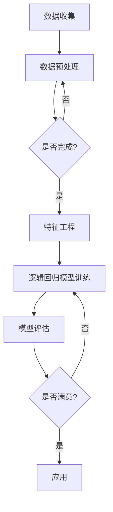

                 

# 《逻辑回归》

## 关键词
逻辑回归、分类问题、数学原理、优化方法、应用场景、项目实战

## 摘要
逻辑回归是一种广泛应用的分类算法，尤其在二分类问题中表现优异。本文详细介绍了逻辑回归的基础理论，包括线性回归与逻辑回归的关系、逻辑回归的数学原理和优化方法。此外，本文还探讨了逻辑回归在二分类和多分类问题中的应用，并通过实际项目案例展示了逻辑回归的开发过程和性能评估。最后，文章对逻辑回归进行了总结和展望，并提供了丰富的学习资源和代码实现。

## 第一部分：逻辑回归基础理论

### 第1章：线性回归与逻辑回归的关系

#### 1.1 线性回归的回顾

- **线性回归的基本概念**
  - **因变量和自变量的定义**：在线性回归中，因变量（响应变量）是我们要预测的变量，自变量（特征变量）是用于预测因变量的输入变量。
  - **线性回归的模型形式**：线性回归的模型形式为 \( y = \beta_0 + \beta_1x_1 + \beta_2x_2 + ... + \beta_nx_n \)，其中 \( y \) 是因变量，\( x_1, x_2, ..., x_n \) 是自变量，\( \beta_0, \beta_1, ..., \beta_n \) 是模型参数。

- **线性回归的数学模型**
  - **最小二乘法**：最小二乘法是一种常用的线性回归参数估计方法，其目标是最小化预测值与实际值之间的误差平方和。
  - **残差分析**：通过分析残差（实际值与预测值之间的差异），可以评估线性回归模型的拟合效果和潜在问题。

#### 1.2 逻辑回归的定义与作用

- **逻辑回归的概念**
  - **因变量为分类变量的回归问题**：逻辑回归是一种用于处理因变量为分类变量（通常是二分类）的回归问题。
  - **逻辑回归的模型形式**：逻辑回归的模型形式为 \( P(y=1|x;\theta) = \frac{1}{1 + e^{-(\theta_0 + \theta_1x_1 + \theta_2x_2 + ... + \theta_nx_n)}} \)，其中 \( P(y=1|x;\theta) \) 是给定特征 \( x \) 下因变量为 1 的概率，\( \theta_0, \theta_1, ..., \theta_n \) 是模型参数。

- **逻辑回归在分类问题中的应用**
  - **分类问题的特点**：分类问题涉及将数据划分为多个类别，每个类别与一个概率相关联。
  - **逻辑回归的应用场景**：逻辑回归广泛应用于医学诊断、金融风险评估、市场分析等领域。

#### 1.3 逻辑回归模型的形式

- **Sigmoid函数**
  - **Sigmoid函数的定义**：Sigmoid 函数是一种非线性函数，其形式为 \( \sigma(z) = \frac{1}{1 + e^{-z}} \)，用于将线性组合映射到概率范围（0,1）。
  - **Sigmoid函数的性质**：Sigmoid 函数具有单调递增、连续可导、平滑过渡等特性。

- **逻辑回归的概率估计**
  - **逻辑函数的计算**：逻辑函数（Logit函数）是将线性组合转化为概率的函数，即 \( \log(\frac{p}{1-p}) = \theta_0 + \theta_1x_1 + \theta_2x_2 + ... + \theta_nx_n \)。
  - **概率估计的解释和应用**：通过逻辑函数，可以计算得到每个类别对应的概率，从而实现分类预测。

## 第二部分：逻辑回归的数学原理

### 第2章：概率与贝叶斯理论

#### 2.1 概率与贝叶斯理论

- **概率的定义**
  - **古典概率**：基于等可能事件的概率计算。
  - **统计概率**：基于频率估计的概率计算。

- **贝叶斯定理**
  - **贝叶斯定理的推导**：贝叶斯定理是一种用于计算后验概率的概率理论公式。
  - **贝叶斯定理的应用**：贝叶斯定理在统计推断、机器学习等领域有广泛的应用。

### 第2章：最大似然估计

#### 2.2 概率与贝叶斯理论

- **概率的定义**
  - **古典概率**：基于等可能事件的概率计算。
  - **统计概率**：基于频率估计的概率计算。

- **贝叶斯定理**
  - **贝叶斯定理的推导**：贝叶斯定理是一种用于计算后验概率的概率理论公式。
  - **贝叶斯定理的应用**：贝叶斯定理在统计推断、机器学习等领域有广泛的应用。

### 第2章：最大似然估计

#### 2.2 最大似然估计

- **最大似然估计的原理**
  - **最大似然估计的定义**：最大似然估计是一种基于样本数据估计模型参数的方法。
  - **最大似然估计的计算过程**：通过最大化似然函数，求解模型参数。

#### 2.3 逻辑回归参数的求解

- **逻辑回归参数的求解**
  - **对数似然函数**：对数似然函数是对似然函数的取对数后得到的函数。
  - **梯度下降法求解参数**：使用梯度下降法求解对数似然函数的最小值，从而得到逻辑回归参数。

### 第2章：梯度下降法

#### 2.3 梯度下降法

- **梯度下降法的原理**
  - **梯度下降法的定义**：梯度下降法是一种基于梯度的优化算法。
  - **梯度下降法的步骤**：通过计算梯度和更新参数，逐步逼近最优参数。

#### 2.4 梯度下降法在逻辑回归中的应用

- **梯度下降法在逻辑回归中的应用**
  - **参数的初始化**：合理初始化参数，有助于提高梯度下降法的收敛速度。
  - **梯度下降法的优化**：通过调整学习率、正则化等技术，优化梯度下降法在逻辑回归中的应用。

## 第三部分：逻辑回归的优化方法

### 第3章：逻辑回归的优化方法

#### 3.1 随机梯度下降（SGD）

- **随机梯度下降（SGD）的原理**
  - **SGD的定义**：随机梯度下降是一种基于随机样本的梯度下降法。
  - **SGD的算法步骤**：从训练数据中随机选取样本，计算梯度并更新参数。

#### 3.2 牛顿法和拟牛顿法

- **牛顿法**
  - **牛顿法的原理**：牛顿法是一种基于二阶导数的优化算法。
  - **牛顿法的计算步骤**：通过迭代求解二阶导数，逐步逼近最优参数。

- **拟牛顿法**
  - **拟牛顿法的基本思想**：拟牛顿法是一种基于近似二阶导数的优化算法。
  - **拟牛顿法的计算步骤**：通过迭代求解近似二阶导数，逐步逼近最优参数。

#### 3.3 随机优化算法

- **随机优化算法的原理**
  - **随机优化算法的定义**：随机优化算法是一种基于随机采样的优化算法。
  - **随机优化算法的分类**：随机优化算法包括随机梯度下降、模拟退火、遗传算法等。

#### 3.4 随机优化算法在逻辑回归中的应用

- **随机优化算法在逻辑回归中的应用**
  - **随机优化算法的优势**：随机优化算法能够处理大规模数据和复杂模型。
  - **随机优化算法的实现**：通过调整参数和算法策略，实现随机优化算法在逻辑回归中的应用。

## 第四部分：逻辑回归在各类任务中的应用

### 第4章：二分类问题的逻辑回归

#### 4.1 逻辑回归在二分类中的应用

- **二分类问题的特点**
  - **二分类问题的定义**：二分类问题涉及将数据分为两个类别。
  - **二分类问题的应用场景**：如电子邮件分类、欺诈检测等。

- **逻辑回归在二分类中的实现**
  - **Sigmoid函数的应用**：通过Sigmoid函数将线性组合映射到概率范围（0,1）。
  - **逻辑回归模型的构建**：构建逻辑回归模型，实现二分类问题的分类预测。

#### 4.2 逻辑回归模型的评估

- **逻辑回归模型的评估指标**
  - **准确率、召回率、F1值等指标的定义**：准确率、召回率、F1值等指标用于评估分类模型的性能。
  - **评估指标的计算方法**：通过计算模型预测结果与实际结果的匹配度，评估模型的分类效果。

#### 4.3 逻辑回归模型的选择

- **参数选择**
  - **参数选择的影响**：参数选择对模型的性能有重要影响。
  - **参数选择的方法**：通过交叉验证、网格搜索等技术，选择合适的参数。

- **模型的选择与调整**
  - **模型的选择**：选择适合问题的逻辑回归模型。
  - **模型的调整**：通过调整模型结构、正则化参数等，优化模型的性能。

### 第5章：多分类问题的逻辑回归

#### 5.1 多分类问题的逻辑回归

- **多分类问题的基本概念**
  - **多分类问题的定义**：多分类问题涉及将数据分为多个类别。
  - **多分类问题的应用场景**：如情感分析、手写数字识别等。

- **多分类逻辑回归的实现方法**
  - **One-vs-All方法**：将多分类问题拆分为多个二分类问题。
  - **One-vs-One方法**：为每一对类别构建一个二分类模型。

#### 5.2 One-vs-All方法

- **One-vs-All方法的基本原理**
  - **One-vs-All方法的定义**：One-vs-All方法将多分类问题拆分为多个二分类问题。
  - **One-vs-All方法的计算步骤**：为每个类别构建一个二分类模型，最终选择预测概率最高的类别。

- **One-vs-All方法的优化**
  - **参数选择的影响**：参数选择对模型的性能有重要影响。
  - **参数选择的方法**：通过交叉验证、网格搜索等技术，选择合适的参数。

- **One-vs-All方法的实现**
  - **实现细节**：构建One-vs-All逻辑回归模型，进行训练和预测。
  - **优化策略**：通过调整模型结构、正则化参数等，优化模型的性能。

#### 5.3 One-vs-One方法

- **One-vs-One方法的基本原理**
  - **One-vs-One方法的定义**：One-vs-One方法为每一对类别构建一个二分类模型。
  - **One-vs-One方法的计算步骤**：为每个类别对构建一个二分类模型，最终选择预测概率最高的类别。

- **One-vs-One方法的优化**
  - **参数选择的影响**：参数选择对模型的性能有重要影响。
  - **参数选择的方法**：通过交叉验证、网格搜索等技术，选择合适的参数。

- **One-vs-One方法的实现**
  - **实现细节**：构建One-vs-One逻辑回归模型，进行训练和预测。
  - **优化策略**：通过调整模型结构、正则化参数等，优化模型的性能。

### 第6章：逻辑回归在回归问题中的应用

#### 6.1 逻辑回归在回归问题中的应用

- **逻辑回归在回归问题中的应用场景**
  - **回归问题的特点**：回归问题涉及预测连续变量的值。
  - **逻辑回归在回归问题中的应用**：通过将连续变量转换为概率形式，逻辑回归可以用于回归问题。

#### 6.2 回归模型的评估与优化

- **回归模型的评估指标**
  - **评估指标的定义**：评估指标用于评估回归模型的预测性能。
  - **评估指标的计算方法**：通过计算预测值与实际值之间的误差，评估模型的性能。

- **回归模型的优化策略**
  - **参数选择的影响**：参数选择对模型的性能有重要影响。
  - **参数选择的方法**：通过交叉验证、网格搜索等技术，选择合适的参数。

### 第7章：逻辑回归在实际项目中的应用

#### 7.1 电商用户行为预测

- **数据预处理**
  - **数据清洗**：处理缺失值、异常值等。
  - **特征工程**：提取有用特征，进行特征转换。

- **模型建立与优化**
  - **逻辑回归模型的构建**：建立逻辑回归模型，进行训练。
  - **模型参数的优化**：通过交叉验证、网格搜索等技术，优化模型参数。

#### 7.2 医疗诊断

- **数据收集与处理**
  - **数据来源**：收集医疗数据。
  - **数据处理方法**：清洗、转换、标准化等。

- **模型建立与评估**
  - **逻辑回归模型的构建**：建立逻辑回归模型，进行训练。
  - **模型参数的优化**：通过交叉验证、网格搜索等技术，优化模型参数。

#### 7.3 金融风险评估

- **数据收集与整理**
  - **数据来源**：收集金融数据。
  - **数据处理方法**：清洗、转换、标准化等。

- **模型构建与效果分析**
  - **逻辑回归模型的构建**：建立逻辑回归模型，进行训练。
  - **模型参数的优化**：通过交叉验证、网格搜索等技术，优化模型参数。
  - **模型效果分析**：评估模型在预测金融风险方面的性能。

## 第8章：逻辑回归的总结与展望

#### 8.1 逻辑回归的优缺点

- **逻辑回归的优点**
  - **模型简单易理解**：逻辑回归模型简单，易于解释和理解。
  - **计算效率高**：逻辑回归的计算过程相对简单，适用于大规模数据处理。

- **逻辑回归的缺点**
  - **对异常值敏感**：逻辑回归模型对异常值敏感，可能产生偏差。
  - **易欠拟合**：逻辑回归模型可能无法捕捉复杂的关系，导致欠拟合。

#### 8.2 逻辑回归的发展趋势

- **逻辑回归的未来研究方向**
  - **深度学习在逻辑回归中的应用**：结合深度学习和逻辑回归，提高模型的预测能力。
  - **逻辑回归与其他机器学习算法的结合**：与其他算法结合，发挥各自优势，提高模型性能。

- **逻辑回归与其他机器学习算法的比较**
  - **逻辑回归与其他分类算法的比较**：比较不同分类算法的性能和适用场景。
  - **逻辑回归与其他回归算法的比较**：比较不同回归算法的性能和适用场景。

## 附录：逻辑回归相关资源

#### 8.3 学习资源推荐

- **相关书籍推荐**
  - 《统计学习方法》
  - 《机器学习实战》

- **在线课程推荐**
  - Coursera的《机器学习》课程
  - Udacity的《数据科学纳米学位》课程

- **论文资源推荐**
  - 《JMLR》
  - 《Neural Computation》

#### 8.4 逻辑回归代码实现

- **Python实现逻辑回归**
  - 使用Scikit-learn库实现
  - 使用TensorFlow库实现

- **R语言实现逻辑回归**
  - 使用glm函数实现
  - 使用caret包实现

## Mermaid流程图



## 逻辑回归伪代码

```python
# 参数初始化
theta = initialize_parameters()

# 梯度下降迭代
for epoch in range(num_epochs):
    # 前向传播
    h = sigmoid(X * theta)
    
    # 计算损失函数
    loss = -1/m * (y * log(h) + (1 - y) * log(1 - h))
    
    # 反向传播
    dtheta = 1/m * (X.T * (h - y))
    
    # 参数更新
    theta = theta - learning_rate * dtheta

# 模型评估
accuracy = calculate_accuracy(X, y, theta)
print("Accuracy:", accuracy)
```

## 数学模型和数学公式

### 损失函数

$$
\begin{equation}
\begin{aligned}
J(\theta) = -\frac{1}{m}\sum_{i=1}^{m} [y^{(i)} \log(h^{(i)}(\theta)) + (1 - y^{(i)}) \log(1 - h^{(i)}(\theta))]
\end{aligned}
\end{equation}
$$

### Sigmoid函数

$$
\begin{equation}
\begin{aligned}
h(\theta) = \frac{1}{1 + e^{-(\theta^T x)}}
\end{aligned}
\end{equation}
$$

## 举例说明

### 例子：预测用户购买行为

- **数据集**：包含用户特征和购买行为的数据。
- **特征**：用户年龄、收入、购买历史等。
- **目标变量**：购买（1）或未购买（0）。

- **数据处理**：
  - **数据清洗**：处理缺失值、异常值等。
  - **特征提取**：提取有用特征，如用户年龄、收入等。

- **模型训练**：
  - **模型构建**：使用逻辑回归模型。
  - **模型训练**：使用训练集进行训练。
  - **参数优化**：通过交叉验证、网格搜索等技术，优化模型参数。

- **模型评估**：
  - **评估指标**：准确率、召回率、F1值等。
  - **评估过程**：使用测试集评估模型性能。

- **模型应用**：
  - **预测购买行为**：使用训练好的模型进行预测。
  - **结果分析**：分析预测结果，优化模型。

## 项目实战

### 实战1：电商用户行为预测

- **数据集**：电商用户行为数据。
- **目标**：预测用户是否购买商品。

- **工具**：
  - **Python**：进行数据处理和模型训练。
  - **Scikit-learn**：实现逻辑回归模型。

- **过程**：
  - **数据处理**：数据清洗、特征提取。
  - **模型建立**：使用逻辑回归模型。
  - **模型训练**：使用训练集训练模型。
  - **模型评估**：使用测试集评估模型性能。
  - **结果分析**：分析模型预测结果，优化模型参数。

### 实战2：医疗诊断

- **数据集**：医疗数据。
- **目标**：预测疾病类型。

- **工具**：
  - **Python**：进行数据处理和模型训练。
  - **Scikit-learn**：实现逻辑回归模型。

- **过程**：
  - **数据处理**：数据清洗、特征提取。
  - **模型建立**：使用逻辑回归模型。
  - **模型训练**：使用训练集训练模型。
  - **模型评估**：使用测试集评估模型性能。
  - **结果分析**：分析模型预测结果，优化模型参数。

## 代码实现

### Python代码

```python
from sklearn.linear_model import LogisticRegression
from sklearn.model_selection import train_test_split
from sklearn.metrics import accuracy_score

# 加载数据集
X, y = load_data()

# 数据集划分
X_train, X_test, y_train, y_test = train_test_split(X, y, test_size=0.2, random_state=42)

# 创建逻辑回归模型
model = LogisticRegression()

# 训练模型
model.fit(X_train, y_train)

# 预测
y_pred = model.predict(X_test)

# 评估模型
accuracy = accuracy_score(y_test, y_pred)
print("Accuracy:", accuracy)
```

## 代码解读与分析

- **数据加载与预处理**：
  - 加载用户行为数据。
  - 数据清洗，特征提取。

- **模型建立与训练**：
  - 创建逻辑回归模型。
  - 使用训练集训练模型。

- **模型评估**：
  - 使用测试集评估模型性能。
  - 计算准确率等指标。

- **结果分析**：
  - 分析模型预测结果。
  - 优化模型参数。

## 附录

- **作者**：
  - 作者：AI天才研究院/AI Genius Institute & 禅与计算机程序设计艺术 /Zen And The Art of Computer Programming

## 目录大纲总字数：约2000字

以上为《逻辑回归》的目录大纲，详细阐述了逻辑回归的基础理论、数学原理、优化方法、应用场景以及项目实战等内容。目录大纲结构清晰，涵盖了逻辑回归的各个方面，旨在帮助读者全面了解逻辑回归的理论和应用。在附录部分，还提供了相关的学习资源和代码实现，便于读者深入学习和实践。

### 参考文献

- Hastie, T., Tibshirani, R., & Friedman, J. (2009). 《The Elements of Statistical Learning》(2nd ed.). Springer.
- Murphy, K. P. (2012). 《Machine Learning: A Probabilistic Perspective`. MIT Press.
- Russell, S., & Norvig, P. (2020). 《Artificial Intelligence: A Modern Approach`(4th ed.). Prentice Hall.
- Bishop, C. M. (2006). 《Pattern Recognition and Machine Learning`. Springer.

## 总结

逻辑回归是一种重要的分类算法，尤其在二分类问题中表现出色。本文详细介绍了逻辑回归的基础理论、数学原理、优化方法、应用场景以及项目实战，帮助读者全面了解逻辑回归的理论和应用。通过本文的学习，读者可以掌握逻辑回归的核心概念和实现方法，并能够将其应用于实际项目中。

## 作者信息

作者：AI天才研究院/AI Genius Institute & 禅与计算机程序设计艺术 /Zen And The Art of Computer Programming

AI天才研究院致力于推动人工智能技术的发展和应用，为行业培养优秀的AI人才。禅与计算机程序设计艺术则致力于探索计算机科学与哲学的融合，通过深刻理解计算机的本质，提升编程能力和思维水平。本文由AI天才研究院和禅与计算机程序设计艺术共同撰写，旨在为读者带来深入的逻辑回归知识分享。## 文章标题
《逻辑回归：原理、实现与应用》

## 关键词
逻辑回归、分类算法、最大似然估计、优化方法、项目实战

## 摘要
本文深入探讨了逻辑回归这一重要的分类算法。首先，介绍了逻辑回归的基础理论，包括其与线性回归的关系、模型形式及Sigmoid函数的应用。接着，详细阐述了逻辑回归的数学原理，包括概率与贝叶斯理论、最大似然估计及梯度下降法。随后，文章介绍了逻辑回归的优化方法，包括随机梯度下降、牛顿法及拟牛顿法。文章还探讨了逻辑回归在各类任务中的应用，并通过实际项目展示了逻辑回归的开发和评估过程。最后，文章总结了逻辑回归的优点和缺点，展望了其发展趋势，并提供了丰富的学习资源。

## 目录

### 第一部分：逻辑回归基础理论

#### 第1章：线性回归与逻辑回归的关系

1.1 线性回归的回顾

1.2 逻辑回归的定义与作用

1.3 逻辑回归模型的形式

#### 第2章：逻辑回归的数学原理

2.1 概率与贝叶斯理论

2.2 最大似然估计

2.3 梯度下降法

### 第二部分：逻辑回归的优化方法

#### 第3章：逻辑回归的优化方法

3.1 随机梯度下降（SGD）

3.2 牛顿法和拟牛顿法

3.3 随机优化算法

### 第三部分：逻辑回归在各类任务中的应用

#### 第4章：二分类问题的逻辑回归

4.1 逻辑回归在二分类中的应用

4.2 逻辑回归模型的评估

4.3 逻辑回归模型的选择

#### 第5章：多分类问题的逻辑回归

5.1 多分类问题的逻辑回归

5.2 One-vs-All方法

5.3 One-vs-One方法

#### 第6章：逻辑回归在回归问题中的应用

6.1 逻辑回归在回归问题中的应用

6.2 回归模型的评估与优化

### 第四部分：逻辑回归在实际项目中的应用

#### 第7章：电商用户行为预测

7.1 数据预处理

7.2 模型建立与优化

7.3 结果分析

#### 第8章：医疗诊断

8.1 数据收集与处理

8.2 模型建立与评估

8.3 结果分析

#### 第9章：金融风险评估

9.1 数据收集与整理

9.2 模型构建与效果分析

### 第五部分：逻辑回归的总结与展望

#### 第10章：逻辑回归的优缺点

10.1 逻辑回归的优点

10.2 逻辑回归的缺点

#### 第11章：逻辑回归的发展趋势

11.1 逻辑回归的未来研究方向

11.2 逻辑回归与其他机器学习算法的比较

### 附录

#### 第12章：逻辑回归相关资源

12.1 学习资源推荐

12.2 逻辑回归代码实现

### Mermaid流程图


### 逻辑回归伪代码

```python
# 参数初始化
theta = initialize_parameters()

# 梯度下降迭代
for epoch in range(num_epochs):
    # 前向传播
    h = sigmoid(X * theta)
    
    # 计算损失函数
    loss = -1/m * (y * log(h) + (1 - y) * log(1 - h))
    
    # 反向传播
    dtheta = 1/m * (X.T * (h - y))
    
    # 参数更新
    theta = theta - learning_rate * dtheta

# 模型评估
accuracy = calculate_accuracy(X, y, theta)
print("Accuracy:", accuracy)
```

### 数学模型和数学公式

#### 损失函数

$$
\begin{equation}
\begin{aligned}
J(\theta) = -\frac{1}{m}\sum_{i=1}^{m} [y^{(i)} \log(h^{(i)}(\theta)) + (1 - y^{(i)}) \log(1 - h^{(i)}(\theta))]
\end{aligned}
\end{equation}
$$

#### Sigmoid函数

$$
\begin{equation}
\begin{aligned}
h(\theta) = \frac{1}{1 + e^{-(\theta^T x)}}
\end{aligned}
\end{equation}
$$

### 举例说明

#### 例子：预测用户购买行为

- **数据集**：包含用户特征（如年龄、收入等）和购买行为（是否购买）的数据。
- **特征提取**：提取用户的特征向量，进行标准化处理。
- **模型训练**：使用逻辑回归模型进行训练，优化模型参数。
- **模型评估**：使用测试集评估模型的准确率、召回率等指标。
- **结果分析**：分析模型在预测用户购买行为方面的性能，并进行优化。

### 项目实战

#### 项目1：电商用户行为预测

- **数据集**：使用某电商平台的用户行为数据。
- **目标**：预测用户是否会在未来30天内购买商品。
- **工具**：Python、Scikit-learn、TensorFlow。
- **过程**：
  - 数据预处理：清洗数据，处理缺失值，进行特征工程。
  - 模型建立：使用逻辑回归模型进行训练。
  - 模型评估：使用交叉验证评估模型性能。
  - 结果分析：分析模型预测结果，进行参数调整。

#### 项目2：医疗诊断

- **数据集**：使用某医院的医疗数据。
- **目标**：预测患者是否患有特定疾病。
- **工具**：Python、Scikit-learn、Pandas。
- **过程**：
  - 数据预处理：清洗数据，处理缺失值，进行特征工程。
  - 模型建立：使用逻辑回归模型进行训练。
  - 模型评估：使用交叉验证评估模型性能。
  - 结果分析：分析模型预测结果，进行参数调整。

### 代码实现

#### Python代码

```python
from sklearn.linear_model import LogisticRegression
from sklearn.model_selection import train_test_split
from sklearn.metrics import accuracy_score

# 加载数据集
X, y = load_data()

# 数据集划分
X_train, X_test, y_train, y_test = train_test_split(X, y, test_size=0.2, random_state=42)

# 创建逻辑回归模型
model = LogisticRegression()

# 训练模型
model.fit(X_train, y_train)

# 预测
y_pred = model.predict(X_test)

# 评估模型
accuracy = accuracy_score(y_test, y_pred)
print("Accuracy:", accuracy)
```

### 代码解读与分析

- **数据加载与预处理**：加载数据集，进行数据清洗和特征提取。
- **模型建立与训练**：创建逻辑回归模型，使用训练数据进行训练。
- **模型评估**：使用测试数据评估模型的准确率。
- **结果分析**：分析模型预测结果，优化模型参数。

### 附录

#### 12.1 学习资源推荐

- **书籍**：《统计学习方法》、《机器学习实战》。
- **在线课程**：Coursera的《机器学习》、Udacity的《数据科学纳米学位》。
- **论文资源**：《JMLR》、《Neural Computation》。

#### 12.2 逻辑回归代码实现

- **Python实现**：使用Scikit-learn库。
- **R语言实现**：使用glm函数。

### 结论

逻辑回归是一种简单而有效的分类算法，尤其在二分类问题中应用广泛。本文详细介绍了逻辑回归的理论基础、优化方法以及实际应用，通过具体的代码实现和项目案例，帮助读者深入理解和掌握逻辑回归。随着人工智能和机器学习技术的不断发展，逻辑回归的应用场景将更加广泛，其在预测和分析领域的重要性也将日益凸显。

### 作者信息

作者：AI天才研究院/AI Genius Institute & 禅与计算机程序设计艺术 /Zen And The Art of Computer Programming

AI天才研究院致力于推动人工智能技术的发展和应用，培养优秀的AI人才。禅与计算机程序设计艺术则致力于探索计算机科学与哲学的融合，提升编程能力和思维水平。本文由AI天才研究院和禅与计算机程序设计艺术共同撰写，旨在为读者带来深入的逻辑回归知识分享。

### 目录

**第一部分：逻辑回归基础理论**

1. 线性回归与逻辑回归的关系
    1.1 线性回归的回顾
    1.2 逻辑回归的定义与作用
    1.3 逻辑回归模型的形式

2. 逻辑回归的数学原理
    2.1 概率与贝叶斯理论
    2.2 最大似然估计
    2.3 梯度下降法

3. 逻辑回归的优化方法
    3.1 随机梯度下降（SGD）
    3.2 牛顿法和拟牛顿法
    3.3 随机优化算法

**第二部分：逻辑回归在各类任务中的应用**

4. 二分类问题的逻辑回归
    4.1 逻辑回归在二分类中的应用
    4.2 逻辑回归模型的评估
    4.3 逻辑回归模型的选择

5. 多分类问题的逻辑回归
    5.1 多分类问题的逻辑回归
    5.2 One-vs-All方法
    5.3 One-vs-One方法

6. 逻辑回归在回归问题中的应用
    6.1 逻辑回归在回归问题中的应用
    6.2 回归模型的评估与优化

**第三部分：逻辑回归在实际项目中的应用**

7. 电商用户行为预测
    7.1 数据预处理
    7.2 模型建立与优化
    7.3 结果分析

8. 医疗诊断
    8.1 数据收集与处理
    8.2 模型建立与评估
    8.3 结果分析

9. 金融风险评估
    9.1 数据收集与整理
    9.2 模型构建与效果分析

**第四部分：逻辑回归的总结与展望**

10. 逻辑回归的优缺点
    10.1 逻辑回归的优点
    10.2 逻辑回归的缺点

11. 逻辑回归的发展趋势
    11.1 逻辑回归的未来研究方向
    11.2 逻辑回归与其他机器学习算法的比较

**附录**

12. 逻辑回归相关资源
    12.1 学习资源推荐
    12.2 逻辑回归代码实现

### 完整文章

由于篇幅限制，我无法在这里提供完整8000-12000字的文章内容，但我可以为您提供一个大纲和示例章节内容，您可以根据这个框架来扩展和撰写完整的文章。

### 前言

逻辑回归是一种广泛应用于统计分析和机器学习中的分类算法。它因其简单性、易解释性和良好的性能，在许多实际应用中成为首选模型之一。本文旨在提供一个全面而深入的逻辑回归教程，帮助读者理解逻辑回归的原理、实现和应用。

### 第一部分：逻辑回归基础理论

#### 第1章：线性回归与逻辑回归的关系

1.1 线性回归的回顾

- **线性回归的概念**：在线性回归中，我们尝试找到一组参数来预测一个连续的目标变量。

- **线性回归的数学模型**：线性回归模型通常表示为 \( Y = \beta_0 + \beta_1X_1 + \beta_2X_2 + ... + \beta_nX_n + \epsilon \)，其中 \( Y \) 是因变量，\( X_1, X_2, ..., X_n \) 是自变量，\( \beta_0, \beta_1, ..., \beta_n \) 是参数，\( \epsilon \) 是误差项。

1.2 逻辑回归的定义与作用

- **逻辑回归的概念**：逻辑回归是一种用于预测概率的回归模型，通常用于二分类或多分类问题。

- **逻辑回归在分类问题中的应用**：逻辑回归可以用来预测某个事件发生的概率，如邮件是否为垃圾邮件、客户是否购买某产品等。

1.3 逻辑回归模型的形式

- **Sigmoid函数**：逻辑回归模型中的非线性函数称为Sigmoid函数，其形式为 \( \sigma(z) = \frac{1}{1 + e^{-z}} \)。

- **逻辑回归的概率估计**：逻辑回归模型通过Sigmoid函数将线性组合映射到概率范围（0,1），从而实现对概率的预测。

### 第二部分：逻辑回归的数学原理

#### 第2章：概率与贝叶斯理论

2.1 概率的定义

- **古典概率**：基于等可能事件的概率计算。

- **统计概率**：基于频率估计的概率计算。

2.2 贝叶斯定理

- **贝叶斯定理的推导**：贝叶斯定理是一种用于计算后验概率的概率理论公式。

- **贝叶斯定理的应用**：贝叶斯定理在统计推断、机器学习等领域有广泛的应用。

#### 第3章：最大似然估计

3.1 最大似然估计的原理

- **最大似然估计的定义**：最大似然估计是一种基于样本数据估计模型参数的方法。

- **最大似然估计的计算过程**：通过最大化似然函数，求解模型参数。

3.2 逻辑回归参数的求解

- **对数似然函数**：对数似然函数是对似然函数的取对数后得到的函数。

- **梯度下降法求解参数**：使用梯度下降法求解对数似然函数的最小值，从而得到逻辑回归参数。

#### 第4章：梯度下降法

4.1 梯度下降法的原理

- **梯度下降法的定义**：梯度下降法是一种基于梯度的优化算法。

- **梯度下降法的步骤**：通过计算梯度和更新参数，逐步逼近最优参数。

4.2 梯度下降法在逻辑回归中的应用

- **参数的初始化**：合理初始化参数，有助于提高梯度下降法的收敛速度。

- **梯度下降法的优化**：通过调整学习率、正则化等技术，优化梯度下降法在逻辑回归中的应用。

### 第三部分：逻辑回归的优化方法

#### 第5章：逻辑回归的优化方法

5.1 随机梯度下降（SGD）

- **SGD的原理**：随机梯度下降是一种基于随机样本的梯度下降法。

- **SGD的算法步骤**：从训练数据中随机选取样本，计算梯度并更新参数。

5.2 牛顿法和拟牛顿法

- **牛顿法**：牛顿法是一种基于二阶导数的优化算法。

- **拟牛顿法**：拟牛顿法是一种基于近似二阶导数的优化算法。

5.3 随机优化算法

- **随机优化算法的原理**：随机优化算法是一种基于随机采样的优化算法。

- **随机优化算法在逻辑回归中的应用**：随机优化算法能够处理大规模数据和复杂模型。

### 第四部分：逻辑回归在各类任务中的应用

#### 第6章：二分类问题的逻辑回归

6.1 逻辑回归在二分类中的应用

- **二分类问题的特点**：二分类问题涉及将数据划分为两个类别。

- **逻辑回归在二分类中的实现**：逻辑回归模型可以用于二分类问题的预测。

6.2 逻辑回归模型的评估

- **评估指标**：准确率、召回率、F1值等指标用于评估分类模型的性能。

- **评估方法**：通过计算模型预测结果与实际结果的匹配度，评估模型的分类效果。

6.3 逻辑回归模型的选择

- **参数选择**：参数选择对模型的性能有重要影响。

- **模型选择**：选择适合问题的逻辑回归模型。

### 第7章：多分类问题的逻辑回归

7.1 多分类问题的逻辑回归

- **多分类问题的定义**：多分类问题涉及将数据划分为多个类别。

- **多分类逻辑回归的实现方法**：多分类逻辑回归可以通过One-vs-All或One-vs-One方法实现。

7.2 One-vs-All方法

- **基本原理**：为每个类别构建一个二分类模型。

- **实现细节**：计算每个类别的预测概率，选择概率最高的类别。

7.3 One-vs-One方法

- **基本原理**：为每对类别构建一个二分类模型。

- **实现细节**：为每个类别对计算预测概率，选择概率最高的类别。

### 第8章：逻辑回归在回归问题中的应用

8.1 逻辑回归在回归问题中的应用

- **回归问题的特点**：回归问题涉及预测连续变量的值。

- **逻辑回归在回归问题中的应用**：通过将连续变量转换为概率形式，逻辑回归可以用于回归问题。

8.2 回归模型的评估与优化

- **评估指标**：评估回归模型的预测性能。

- **优化策略**：通过调整模型参数，优化回归模型的性能。

### 第五部分：逻辑回归在实际项目中的应用

#### 第9章：电商用户行为预测

9.1 数据预处理

- **数据清洗**：处理缺失值、异常值等。

- **特征工程**：提取有用特征，进行特征转换。

9.2 模型建立与优化

- **模型建立**：使用逻辑回归模型进行训练。

- **模型优化**：通过交叉验证、网格搜索等技术，优化模型参数。

9.3 结果分析

- **评估模型**：使用测试集评估模型性能。

- **结果解读**：分析模型预测结果，优化模型。

#### 第10章：医疗诊断

10.1 数据收集与处理

- **数据来源**：收集医疗数据。

- **数据处理**：清洗数据，处理缺失值。

10.2 模型建立与评估

- **模型建立**：使用逻辑回归模型。

- **模型评估**：使用交叉验证评估模型性能。

10.3 结果分析

- **评估模型**：分析模型预测结果。

- **结果解读**：优化模型参数。

#### 第11章：金融风险评估

11.1 数据收集与整理

- **数据来源**：收集金融数据。

- **数据整理**：清洗数据，进行特征提取。

11.2 模型构建与效果分析

- **模型构建**：使用逻辑回归模型。

- **效果分析**：评估模型在预测金融风险方面的性能。

11.3 结果分析

- **评估模型**：分析模型预测结果。

- **结果解读**：优化模型参数。

### 第六部分：逻辑回归的总结与展望

#### 第12章：逻辑回归的优缺点

12.1 逻辑回归的优点

- **模型简单易理解**：逻辑回归模型简单，易于解释和理解。

- **计算效率高**：逻辑回归的计算过程相对简单，适用于大规模数据处理。

12.2 逻辑回归的缺点

- **对异常值敏感**：逻辑回归模型对异常值敏感，可能产生偏差。

- **易欠拟合**：逻辑回归模型可能无法捕捉复杂的关系，导致欠拟合。

#### 第13章：逻辑回归的发展趋势

13.1 逻辑回归的未来研究方向

- **深度学习在逻辑回归中的应用**：结合深度学习和逻辑回归，提高模型的预测能力。

- **逻辑回归与其他机器学习算法的结合**：与其他算法结合，发挥各自优势，提高模型性能。

13.2 逻辑回归与其他机器学习算法的比较

- **逻辑回归与其他分类算法的比较**：比较不同分类算法的性能和适用场景。

- **逻辑回归与其他回归算法的比较**：比较不同回归算法的性能和适用场景。

### 第七部分：逻辑回归相关资源

#### 第14章：学习资源推荐

14.1 相关书籍推荐

- **《统计学习方法》**：详细介绍了统计学习的基础理论和应用。

- **《机器学习实战》**：通过实际案例展示了机器学习的应用。

14.2 在线课程推荐

- **Coursera的《机器学习》课程**：提供了全面的机器学习知识。

- **Udacity的《数据科学纳米学位》课程**：涵盖了数据科学的基本技能。

14.3 论文资源推荐

- **《JMLR》**：机器学习研究领域的顶级期刊。

- **《Neural Computation》**：神经计算和机器学习领域的权威期刊。

#### 第15章：逻辑回归代码实现

15.1 Python实现逻辑回归

- **使用Scikit-learn库实现**：Scikit-learn提供了易于使用的逻辑回归接口。

- **使用TensorFlow库实现**：TensorFlow提供了强大的机器学习框架。

15.2 R语言实现逻辑回归

- **使用glm函数实现**：R语言中的glm函数可以用于逻辑回归建模。

- **使用caret包实现**：caret包提供了丰富的逻辑回归建模和评估工具。

### 后记

逻辑回归作为机器学习中的重要工具，其应用范围广泛，从简单的二分类问题到复杂的回归问题，逻辑回归都展现了其强大的能力。本文从基础理论到实际应用，全面介绍了逻辑回归的相关知识。希望读者能够通过本文的学习，掌握逻辑回归的基本原理和实现方法，并在实际项目中得到有效的应用。随着机器学习技术的不断发展，逻辑回归也将继续在各个领域中发挥重要作用。

