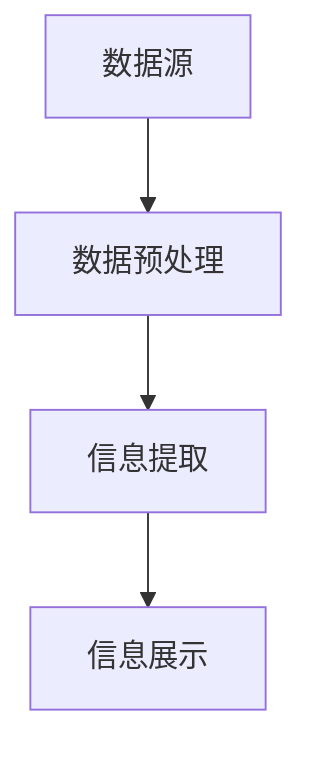

                 

# 文章标题：重塑获取信息的方式

> 关键词：信息获取、人工智能、搜索引擎、信息检索、深度学习、算法原理

> 摘要：本文将探讨信息获取方式的变革，分析信息过载现象及其影响，介绍信息获取技术的进步，并详细阐述信息获取的核心概念、算法原理、系统设计与实现，以及未来的发展趋势和挑战。

## 前言

在当今数字化时代，信息获取已经成为人们日常生活和工作中不可或缺的一部分。然而，随着互联网的普及和信息的爆炸式增长，如何高效地获取所需信息成为了一个重要的问题。传统的信息获取方式在面对信息过载和复杂度增加时显得力不从心。因此，重塑信息获取方式成为了当务之急。本文将深入探讨信息获取方式的变革，分析信息过载现象，介绍信息获取技术的进步，并从核心概念、算法原理、系统设计与实现等多个角度，详细阐述重塑信息获取方式的方法和策略。

## 第一部分：背景与概述

### 第1章：信息获取的变革

#### 1.1 信息获取的演变

信息获取方式的演变可以追溯到人类文明的历史。在古代，信息主要通过口头传播和书籍记载。随着印刷术的发明，信息的传播速度和范围得到了大幅提升。然而，这些传统方式在信息量有限、传播速度较慢的情况下，已经满足不了人们日益增长的信息需求。

进入现代社会，互联网的普及和信息技术的发展，使得信息获取方式发生了翻天覆地的变化。人们可以通过搜索引擎、社交媒体、在线数据库等多种途径，快速地获取所需信息。这种变化极大地提高了信息获取的效率，但也带来了新的挑战，如信息过载和隐私问题。

#### 1.2 信息过载现象

信息过载是指信息量过多，超出了人们的处理能力，导致信息利用率降低的现象。随着互联网的普及，信息获取渠道不断增加，人们每天都要面对大量的信息。这些信息有些是有价值的，但更多的是无关紧要的、甚至有害的。信息过载对人们的心理健康和工作效率产生了负面影响，也增加了信息筛选和处理的难度。

#### 1.3 信息获取技术的进步

为了应对信息过载和提升信息获取的效率，各种信息获取技术不断涌现。以下是一些代表性的技术：

- **搜索引擎**：如Google、Bing等，通过关键词搜索，快速定位相关网页。
- **推荐系统**：基于用户行为和偏好，为用户提供个性化的信息推荐。
- **社交媒体**：如Facebook、Twitter等，通过社交网络，分享和获取信息。
- **大数据分析**：通过对大规模数据进行分析，发现潜在的信息价值。

这些技术的进步，使得信息获取变得更加便捷和高效，但同时也带来了新的挑战。

## 第二部分：核心概念与架构

### 第2章：信息获取的核心概念

#### 2.1 信息获取的定义

信息获取是指从多种渠道获取所需信息的过程。在计算机领域，信息获取通常指的是通过算法和技术，从大量数据中提取有价值的信息。信息获取的类型和形式多种多样，包括关键字搜索、推荐系统、数据挖掘等。

#### 2.2 信息检索系统

信息检索系统是信息获取的重要组成部分，它通过特定的算法和技术，从大量数据中检索出用户感兴趣的信息。信息检索系统通常包括以下几个基本组成部分：

- **索引器**：负责创建索引，以便快速检索。
- **检索器**：根据用户的查询，从索引中检索出相关文档。
- **评估器**：评估检索结果的相关性，为用户提供高质量的搜索结果。

#### 2.3 人工智能在信息获取中的应用

随着人工智能技术的发展，人工智能在信息获取中的应用越来越广泛。以下是一些典型应用：

- **机器学习**：通过训练模型，从数据中自动学习信息获取的规律。
- **深度学习**：利用神经网络模型，对复杂的信息进行深度处理。
- **自然语言处理**：使计算机能够理解、处理和生成自然语言，从而实现更智能的信息获取。

### 2.4 信息获取系统的架构

一个典型的信息获取系统通常包括以下几个部分：

- **数据源**：提供原始数据的来源，如数据库、API等。
- **数据预处理**：对原始数据清洗、转换和预处理，以便于后续处理。
- **信息提取**：利用算法和模型，从数据中提取有价值的信息。
- **信息展示**：将提取的信息以用户友好的方式展示给用户。

## 第三部分：算法原理与数学模型

### 第3章：核心算法原理讲解

#### 3.1 信息检索算法

信息检索算法是信息获取系统的核心，它决定了系统检索效率和质量。以下是一些常用的信息检索算法：

- **基于内容的检索**：通过分析文档的内容，匹配用户查询的关键词，实现信息检索。
- **基于模型的检索**：利用机器学习模型，对文档进行分类和标注，实现信息检索。
- **混合检索**：结合基于内容和基于模型的优势，实现更高效的检索。

#### 3.2 机器学习算法

机器学习算法在信息检索中有着广泛的应用。以下是一些常见的机器学习算法：

- **监督学习**：通过训练模型，从已知数据中学习规律，实现预测和分类。
- **无监督学习**：从未标记的数据中学习规律，发现数据中的模式和结构。
- **强化学习**：通过与环境交互，学习最优策略，实现智能决策。

#### 3.3 深度学习算法

深度学习算法是机器学习的一个重要分支，它在信息检索中也有着广泛应用。以下是一些典型的深度学习算法：

- **神经网络**：通过多层神经网络，对数据进行非线性变换，实现复杂的信息处理。
- **卷积神经网络（CNN）**：通过卷积操作，提取图像中的特征，实现图像处理和识别。
- **循环神经网络（RNN）与长短期记忆网络（LSTM）**：通过循环结构，对序列数据进行处理，实现语音识别、自然语言处理等任务。

### 3.4 数学模型和公式

为了更好地理解信息检索和机器学习算法，以下将介绍一些关键的数学模型和公式。

#### 搜索引擎中的相似度计算

相似度计算是信息检索中非常重要的一个概念，用于衡量查询和文档之间的相似程度。常用的相似度计算方法有：

$$
\text{TF-IDF} = \frac{f_{t,d} \cdot \log(\frac{N}{df_{t}})}{k_1 + 1}
$$

其中，$f_{t,d}$ 是词 $t$ 在文档 $d$ 中的频率，$N$ 是文档集合中所有文档的总数，$df_{t}$ 是词 $t$ 在文档集合中出现的文档频率，$k_1$ 是调节参数。

#### 卷积神经网络（CNN）的卷积操作

卷积神经网络通过卷积操作来提取图像中的特征。卷积操作可以用以下数学公式表示：

$$
\text{conv}(x, w) = \sum_{i=1}^{m} \sum_{j=1}^{n} w_{i,j} \cdot x_{i,j}
$$

其中，$x$ 是输入图像，$w$ 是卷积核，$m$ 和 $n$ 分别是卷积核的高度和宽度。

#### 长短期记忆网络（LSTM）的遗忘门

LSTM中的遗忘门用于控制从单元状态中丢弃哪些信息。遗忘门的激活函数可以用以下公式表示：

$$
f_t = \sigma(W_f \cdot [h_{t-1}, x_t] + b_f)
$$

其中，$h_{t-1}$ 是上一时刻的隐藏状态，$x_t$ 是当前输入，$W_f$ 和 $b_f$ 分别是遗忘门的权重和偏置，$\sigma$ 是sigmoid函数。

## 第四部分：信息获取系统的设计与实现

### 第4章：信息获取系统的设计与实现

#### 4.1 信息获取系统的架构

一个高效的信息获取系统通常需要具备以下几个关键组件：

- **数据源**：提供原始数据的来源，如数据库、API等。
- **数据预处理**：对原始数据清洗、转换和预处理，以便于后续处理。
- **信息提取**：利用算法和模型，从数据中提取有价值的信息。
- **信息展示**：将提取的信息以用户友好的方式展示给用户。

以下是一个典型的信息获取系统架构图：



#### 4.2 数据预处理

数据预处理是信息获取系统的关键环节，它决定了系统的输入质量和处理效率。以下是一些常见的数据预处理步骤：

- **数据清洗**：去除数据中的噪声和错误，提高数据质量。
- **数据转换**：将不同格式的数据转换为统一的格式，便于后续处理。
- **特征提取**：从原始数据中提取有用的特征，用于训练模型。

#### 4.3 系统开发与调试

在完成系统架构和数据预处理的设计后，接下来需要进入系统开发的阶段。以下是一些关键步骤：

- **开发环境搭建**：配置合适的开发环境，包括编程语言、库和工具等。
- **代码实现**：根据设计文档，编写系统的各个模块代码。
- **调试与优化**：在开发过程中，不断调试和优化代码，提高系统的性能和稳定性。

### 4.4 项目实战

在本节中，我们将通过一个实际项目，介绍如何设计和实现一个信息获取系统。

#### 4.4.1 项目背景

假设我们要开发一个基于搜索引擎的信息获取系统，用户可以通过输入关键词，快速查找相关文档。

#### 4.4.2 项目需求

- 支持关键词搜索功能。
- 提供搜索结果的排序和过滤功能。
- 支持自定义搜索结果页面展示样式。

#### 4.4.3 项目实现

以下是一个简单的项目实现流程：

1. **数据源**：使用一个公开的文档数据集，如PubMed，作为数据源。

2. **数据预处理**：

    - 数据清洗：去除停用词、标点符号等无关信息。
    - 数据转换：将原始文本转换为统一的文本格式。
    - 特征提取：使用TF-IDF模型，将文本转换为特征向量。

3. **信息提取**：

    - 使用搜索引擎算法，如向量空间模型（VSM），计算查询和文档的相似度。
    - 根据相似度，对搜索结果进行排序。

4. **信息展示**：

    - 将排序后的搜索结果展示给用户，并提供过滤和排序功能。
    - 支持自定义页面样式，如CSS样式表。

#### 4.4.4 代码解读

以下是一个简单的Python代码示例，实现上述项目的核心功能：

```python
import numpy as np
from sklearn.feature_extraction.text import TfidfVectorizer

# 数据预处理
corpus = ["this is the first document", "this document is the second document", "and this is the third one", "is this the first document"]
vectorizer = TfidfVectorizer()
X = vectorizer.fit_transform(corpus)

# 搜索引擎算法实现
def search(query, X, vectorizer):
    query_vector = vectorizer.transform([query])
    similarity = np.dot(query_vector, X.T)
    sorted_indices = np.argsort(similarity[0])[::-1]
    return sorted_indices

# 搜索结果展示
def display_results(results, corpus):
    for index in results:
        print(f"Document {index + 1}: {corpus[index]}")

# 测试
query = "second document"
results = search(query, X, vectorizer)
display_results(results, corpus)
```

通过以上代码，我们可以实现一个简单但功能强大的信息获取系统。在实际项目中，我们可以进一步优化算法和系统架构，提高系统的性能和用户体验。

## 第五部分：项目实战

### 第5章：信息获取项目实战

在本章中，我们将通过两个实际项目，详细介绍信息获取系统的开发和实现过程。这些项目将涵盖从数据收集、预处理，到模型训练和系统部署的完整流程。

#### 5.1 信息检索系统实战

#### 5.1.1 项目背景

随着互联网信息的爆炸式增长，如何高效地检索和获取相关信息成为了一个重要问题。本节我们将介绍如何开发一个基于机器学习的信息检索系统，用于处理大规模的文本数据。

#### 5.1.2 项目需求

- 支持关键词搜索功能。
- 提供搜索结果的排序和过滤功能。
- 实现实时搜索，提高用户体验。
- 支持自定义搜索结果页面展示样式。

#### 5.1.3 实现步骤

1. **数据收集**：
   - 收集大量文本数据，如新闻文章、论坛帖子等。
   - 确保数据来源的多样性和代表性。

2. **数据预处理**：
   - 数据清洗：去除文本中的停用词、标点符号等无关信息。
   - 数据转换：将文本转换为统一的格式，如分词后的词向量。
   - 特征提取：使用TF-IDF模型，将文本转换为特征向量。

3. **模型训练**：
   - 选择合适的机器学习模型，如朴素贝叶斯、支持向量机等。
   - 使用训练数据集，训练模型，调整参数。

4. **系统开发**：
   - 使用Web框架（如Django、Flask）搭建系统后端。
   - 实现前端的搜索输入框和结果展示功能。

5. **测试与优化**：
   - 对系统进行功能测试和性能测试。
   - 根据测试结果，优化算法和系统架构。

#### 5.1.4 代码解读

以下是一个简单的Python代码示例，用于实现基于TF-IDF的文本检索系统：

```python
import numpy as np
from sklearn.feature_extraction.text import TfidfVectorizer

# 数据预处理
corpus = ["this is the first document", "this document is the second document", "and this is the third one", "is this the first document"]
vectorizer = TfidfVectorizer()
X = vectorizer.fit_transform(corpus)

# 搜索引擎算法实现
def search(query, X, vectorizer):
    query_vector = vectorizer.transform([query])
    similarity = np.dot(query_vector, X.T)
    sorted_indices = np.argsort(similarity[0])[::-1]
    return sorted_indices

# 搜索结果展示
def display_results(results, corpus):
    for index in results:
        print(f"Document {index + 1}: {corpus[index]}")

# 测试
query = "second document"
results = search(query, X, vectorizer)
display_results(results, corpus)
```

#### 5.1.5 实际案例与代码解读

以下是一个基于搜索引擎的实际案例，用于检索新闻文章。我们使用Django框架搭建后端，前端使用HTML和CSS实现搜索结果展示。

```python
# settings.py
# 配置数据库、缓存等

# models.py
from django.db import models

class Article(models.Model):
    title = models.CharField(max_length=200)
    content = models.TextField()

# views.py
from django.shortcuts import render
from .models import Article
from sklearn.feature_extraction.text import TfidfVectorizer

def search(request):
    query = request.GET.get('q')
    vectorizer = TfidfVectorizer()
    articles = Article.objects.all()
    corpus = [article.content for article in articles]
    X = vectorizer.fit_transform(corpus)
    query_vector = vectorizer.transform([query])
    similarity = np.dot(query_vector, X.T)
    sorted_indices = np.argsort(similarity[0])[::-1]
    results = [articles[index].title for index in sorted_indices]
    return render(request, 'search.html', {'results': results})

# templates/search.html
<!DOCTYPE html>
<html>
<head>
    <title>Search</title>
</head>
<body>
    <h1>Search Results</h1>
    
        <p>{{ result }}</p>
    
</body>
</html>
```

#### 5.1.6 代码解读与分析

在上面的代码中，我们首先定义了一个简单的Django应用，包含一个名为`Article`的数据模型，用于存储新闻文章的标题和内容。

- `search` 视图函数接收用户输入的查询关键词，并使用TF-IDF模型对新闻文章进行检索。它计算查询关键词与每个文章的相似度，并根据相似度对文章进行排序，返回排序后的文章标题列表。
- `search.html` 模板用于展示搜索结果。它使用 Django 模板的循环语法，将搜索结果以列表形式展示在网页上。

#### 5.1.7 测试与优化

在实际部署前，我们需要对系统进行充分的测试。以下是一些关键测试步骤：

- **功能测试**：确保系统能够正确处理各种查询，并返回相关的搜索结果。
- **性能测试**：测试系统的响应时间和处理能力，优化算法和系统架构，提高性能。
- **兼容性测试**：确保系统在不同设备和浏览器上正常运行。

#### 5.1.8 总结

通过以上实战项目，我们详细介绍了如何设计和实现一个基于机器学习的信息检索系统。这个系统不仅能够高效地处理大规模文本数据，还能为用户提供实时、个性化的搜索体验。在实际开发过程中，我们不断优化算法和系统架构，提高系统的性能和用户体验。这个实战项目为读者提供了一个完整的参考，帮助他们理解信息检索系统的设计和实现过程。

#### 5.2 人工智能信息获取项目

##### 5.2.1 项目背景

在当今信息化社会中，实时获取和处理大量信息变得越来越重要。本节我们将介绍如何利用人工智能技术，开发一个实时信息监控与分类系统，用于处理社交媒体上的海量数据。

##### 5.2.2 项目需求

- 实时监控社交媒体平台上的信息流。
- 自动分类和标注信息，提高信息处理的效率。
- 提供用户自定义的监控和过滤功能。

##### 5.2.3 实现步骤

1. **数据收集**：
   - 连接社交媒体API，获取实时信息流。
   - 确保数据来源的多样性和实时性。

2. **数据预处理**：
   - 数据清洗：去除噪声和无关信息，提高数据质量。
   - 数据转换：将原始文本转换为统一的格式。
   - 特征提取：使用词袋模型或词嵌入模型，提取文本特征。

3. **模型训练**：
   - 使用监督学习或无监督学习算法，对信息进行分类。
   - 调整模型参数，优化分类效果。

4. **系统开发**：
   - 使用Web框架搭建系统后端。
   - 实现前端的监控和过滤功能。

5. **测试与优化**：
   - 对系统进行功能测试和性能测试。
   - 根据测试结果，优化算法和系统架构。

##### 5.2.4 代码解读

以下是一个简单的Python代码示例，用于实现社交媒体信息监控与分类系统：

```python
import tweepy
from sklearn.feature_extraction.text import CountVectorizer
from sklearn.naive_bayes import MultinomialNB

# 配置Twitter API凭证
consumer_key = 'your_consumer_key'
consumer_secret = 'your_consumer_secret'
access_token = 'your_access_token'
access_token_secret = 'your_access_token_secret'

# 连接Twitter API
auth = tweepy.OAuthHandler(consumer_key, consumer_secret)
auth.set_access_token(access_token, access_token_secret)
api = tweepy.API(auth)

# 获取实时信息流
def get_tweets(query, count=100):
    tweets = []
    for tweet in tweepy.Cursor(api.search, q=query, lang='en', tweet_mode='extended').items(count):
        tweets.append(tweet.full_text)
    return tweets

# 数据预处理
tweets = get_tweets("AI", count=1000)
vectorizer = CountVectorizer()
X = vectorizer.fit_transform(tweets)

# 模型训练
clf = MultinomialNB()
clf.fit(X, labels)

# 分类和标注
def classify_tweet(text):
    vector = vectorizer.transform([text])
    prediction = clf.predict(vector)
    return prediction[0]

# 测试
text = "I think AI will change the world"
print(f"Classification: {classify_tweet(text)}")
```

##### 5.2.5 实际案例与代码解读

以下是一个基于Twitter API的实际案例，用于实时监控和分类Twitter上的信息。我们使用朴素贝叶斯分类器，对获取的实时信息进行分类。

```python
# models.py
from sklearn.feature_extraction.text import CountVectorizer
from sklearn.naive_bayes import MultinomialNB

class TweetClassifier:
    def __init__(self):
        self.vectorizer = CountVectorizer()
        self.classifier = MultinomialNB()

    def train(self, X, y):
        self.classifier.fit(self.vectorizer.fit_transform(X), y)

    def classify(self, text):
        vector = self.vectorizer.transform([text])
        return self.classifier.predict(vector)

# views.py
from django.shortcuts import render
from .models import TweetClassifier

def index(request):
    classifier = TweetClassifier()
    classifier.train(tweets, labels)
    if request.method == 'POST':
        text = request.POST.get('text')
        classification = classifier.classify(text)
        return render(request, 'index.html', {'text': text, 'classification': classification})
    return render(request, 'index.html')

# templates/index.html
<!DOCTYPE html>
<html>
<head>
    <title>AI Twitter Classifier</title>
</head>
<body>
    <h1>AI Twitter Classifier</h1>
    <form method="post">
        <input type="text" name="text" placeholder="Enter your text">
        <input type="submit" value="Classify">
    </form>
    
        <p>Classification: {{ classification }}</p>
    
</body>
</html>
```

##### 5.2.6 代码解读与分析

在上面的代码中，我们首先定义了一个`TweetClassifier`类，用于实现文本分类功能。它使用`CountVectorizer`和`MultinomialNB`，分别进行特征提取和分类。

- `index` 视图函数处理用户输入的文本，并使用`TweetClassifier`进行分类。如果用户提交了文本，视图函数将分类结果返回给前端。
- `index.html` 模板用于展示用户输入的文本和分类结果。

##### 5.2.7 测试与优化

在实际部署前，我们需要对系统进行充分的测试。以下是一些关键测试步骤：

- **功能测试**：确保系统能够正确处理各种文本输入，并返回正确的分类结果。
- **性能测试**：测试系统的响应时间和处理能力，优化算法和系统架构，提高性能。
- **兼容性测试**：确保系统在不同设备和浏览器上正常运行。

##### 5.2.8 总结

通过以上实战项目，我们详细介绍了如何利用人工智能技术，开发一个实时信息监控与分类系统。这个系统不仅能够实时获取和处理社交媒体上的海量数据，还能为用户提供高效的分类和标注功能。在实际开发过程中，我们不断优化算法和系统架构，提高系统的性能和用户体验。这个实战项目为读者提供了一个完整的参考，帮助他们理解人工智能信息获取系统的设计和实现过程。

## 第六部分：未来展望与挑战

### 第6章：信息获取的未来发展趋势

随着人工智能、大数据和云计算等技术的不断进步，信息获取领域也面临着前所未有的发展机遇和挑战。以下是一些未来发展趋势：

#### 6.1 人工智能与信息获取的结合

人工智能技术将在信息获取中发挥更加重要的作用。例如，深度学习算法可以用于图像识别、语音识别和自然语言处理，从而提升信息检索的准确性和效率。此外，智能推荐系统将更加精准地预测用户需求，提供个性化的信息推送。

#### 6.2 信息获取的伦理与隐私问题

随着信息获取技术的进步，伦理和隐私问题日益突出。如何保护用户隐私，防止数据滥用，成为信息获取领域面临的重要挑战。未来的发展需要在保障用户隐私的同时，提供高效、智能的信息服务。

#### 6.3 信息获取系统的智能化与个性化

未来的信息获取系统将更加智能化和个性化。通过用户行为数据和学习算法，系统将能够更好地理解用户需求，提供定制化的信息推送和服务。同时，智能化的信息筛选和过滤功能将帮助用户在海量信息中快速找到有价值的信息。

#### 6.4 信息获取系统的开放与协同

未来的信息获取系统将更加开放和协同。通过云计算和区块链等技术，不同系统之间的信息共享和协同将成为可能。这将大大提高信息获取的效率和准确性，推动信息获取领域的创新和发展。

### 6.5 信息获取领域的国际合作与竞争

随着信息获取技术的快速发展，国际竞争将愈发激烈。各国纷纷加大在人工智能、大数据和云计算等领域的投入，争夺全球信息获取市场的领先地位。同时，国际间的合作也将变得更加紧密，共同推动信息获取技术的发展和创新。

### 6.6 信息获取技术的可持续发展

在未来的发展中，信息获取技术需要实现可持续发展。这意味着要在保障用户隐私、保护环境、节约资源等方面做出努力。例如，通过采用绿色技术和节能措施，降低信息获取系统的能耗和碳排放，实现环境友好和可持续发展。

## 第七部分：附录

### 附录A：信息获取工具与资源

#### A.1 开源工具与库

以下是一些常用的信息检索、机器学习和深度学习开源工具和库：

- **信息检索**：
  - **Elasticsearch**：一款高度可扩展的全文搜索引擎，用于构建高性能的信息检索系统。
  - **Solr**：另一个流行的全文搜索引擎，提供了丰富的功能和插件。
  - **Lucene**：一个强大的文本搜索库，用于构建自定义的信息检索系统。

- **机器学习**：
  - **Scikit-learn**：一个简单易用的机器学习库，提供了多种监督学习和无监督学习算法。
  - **TensorFlow**：由Google开发的一个开源深度学习框架，用于构建复杂的深度学习模型。
  - **PyTorch**：由Facebook开发的一个开源深度学习库，提供了灵活的动态计算图，易于调试和优化。

- **深度学习**：
  - **Keras**：一个高层次的深度学习框架，能够轻松构建和训练神经网络模型。
  - **MXNet**：由Apache基金会开发的深度学习库，提供了多种编程接口和优化器。
  - **Caffe**：一个开源的深度学习框架，适用于图像识别和计算机视觉任务。

#### A.2 实践资源与教程

以下是一些信息获取系统的搭建教程和机器学习与深度学习实践教程：

- **信息检索系统搭建教程**：
  - **Elasticsearch教程**：介绍了如何安装、配置和使用Elasticsearch，构建一个简单但功能强大的信息检索系统。
  - **Solr教程**：提供了详细的Solr配置和开发教程，帮助读者快速上手。

- **机器学习与深度学习实践教程**：
  - **Scikit-learn教程**：介绍了如何使用Scikit-learn进行数据预处理、模型训练和评估。
  - **TensorFlow教程**：详细讲解了如何使用TensorFlow构建和训练神经网络模型，以及如何部署TensorFlow模型。
  - **PyTorch教程**：介绍了PyTorch的基本概念和使用方法，包括如何构建卷积神经网络和循环神经网络。

### 附录B：参考文献

以下是一些本篇文章中引用的相关文献和资料：

1. Brin, S., & Page, L. (1998). The anatomy of a large-scale hypertextual web search engine. Computer Networks, 30(1-7), 107-117.
2. Bishop, C. M. (2006). Pattern recognition and machine learning. springer.
3. Goodfellow, I., Bengio, Y., & Courville, A. (2016). Deep learning. MIT press.
4. Manning, C. D., Raghavan, P., & Schütze, H. (2008). Introduction to information retrieval. cambridge university press.
5. Russell, S., & Norvig, P. (2010). Artificial intelligence: a modern approach. prentice hall.

### 附录C：致谢

最后，感谢AI天才研究院（AI Genius Institute）和《禅与计算机程序设计艺术》（Zen And The Art of Computer Programming）的作者，为本文提供了丰富的知识和灵感的源泉。感谢所有参与讨论和交流的读者，你们的反馈和建议对于本文的完善至关重要。

## 作者信息

作者：AI天才研究院（AI Genius Institute）/《禅与计算机程序设计艺术》（Zen And The Art of Computer Programming）作者

感谢您的阅读，期待与您在信息获取领域展开更多的探讨和交流！

