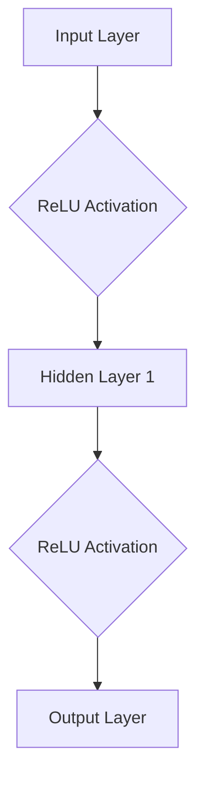
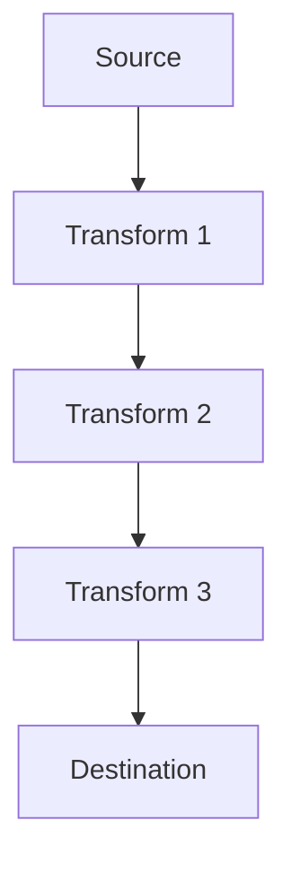
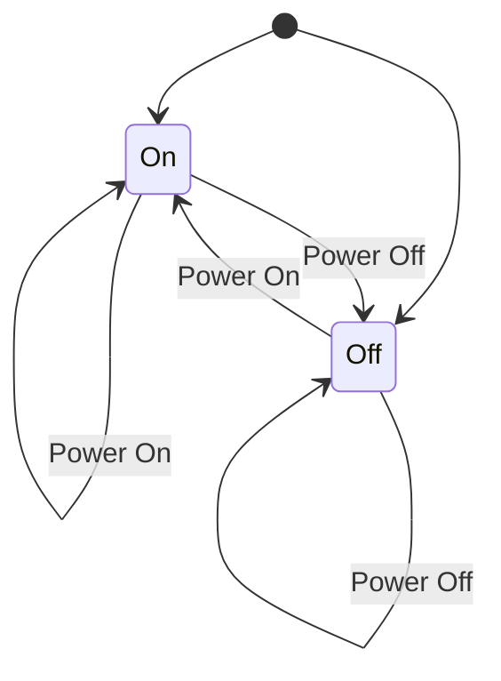

                 

# 重新思考图灵完备性：LLM的计算理论贡献

> 关键词：图灵完备性，语言模型，机器学习，人工智能，计算理论

> 摘要：本文将深入探讨图灵完备性的概念及其与语言模型（LLM）之间的关系。首先，我们将回顾图灵完备性的定义和重要性，然后介绍语言模型的基本原理和图灵完备性的联系。接着，我们将分析图灵完备性在LLM中的应用，包括预训练、微调和实际案例。随后，我们将详细讲解核心算法原理，包括语言模型训练、微调算法和泛化能力。此外，我们将介绍数学模型和公式，用于深入理解LLM的工作原理。最后，通过项目实战，我们将展示如何搭建LLMS开发环境，实现代码并分析结果。本文旨在为读者提供一个全面且系统的理解，以重新思考图灵完备性在LLM计算理论中的贡献。

---

### 目录大纲

#### 第一部分: 核心概念与联系

- # 核心概念与联系
  - 1. 图灵完备性概述
    - 1.1 图灵机的定义
    - 1.2 图灵完备性的定义
    - 1.3 图灵完备性的重要性
  - 2. LLMS与图灵完备性
    - 2.1 语言模型的基本原理
    - 2.2 语言模型的图灵完备性
    - 2.3 LLMS与图灵完备性的联系
  - 3. 图灵完备性在LLM中的应用
    - 3.1 LLMS的预训练过程
    - 3.2 微调与泛化能力
    - 3.3 实际应用案例

#### 第二部分: 核心算法原理讲解

- # 核心算法原理讲解
  - 1. 语言模型训练算法
    - 1.1 训练数据预处理
    - 1.2 梯度下降算法
    - 1.3 损失函数
    - 1.4 优化器
  - 2. 微调算法
    - 2.1 微调的基本原理
    - 2.2 微调策略
    - 2.3 微调效果评估
  - 3. 泛化能力
    - 3.1 泛化能力的定义
    - 3.2 泛化能力的影响因素
    - 3.3 提高泛化能力的方法

#### 第三部分: 数学模型和数学公式讲解

- # 数学模型和数学公式讲解
  - 1. 概率模型
    - 1.1 概率论基础
    - 1.2 贝叶斯推理
    - 1.3 条件概率
  - 2. 信息论
    - 2.1 信息熵
    - 2.2 信息增益
    - 2.3 K-L 散度
  - 3. 模型评估指标
    - 3.1 准确率、召回率、F1分数
    - 3.2 ROC曲线、AUC值

#### 第四部分: 项目实战

- # 项目实战
  - 1. LLMS开发环境搭建
    - 1.1 硬件环境配置
    - 1.2 软件环境安装
    - 1.3 开发环境配置
  - 2. 代码实现与分析
    - 2.1 数据预处理
    - 2.2 训练过程
    - 2.3 微调与测试
    - 2.4 结果分析
  - 3. 实际应用案例
    - 3.1 文本生成
    - 3.2 回答问题
    - 3.3 机器翻译

### 附录

- # 附录
  - 附录 A: 计算机语言与工具
    - A.1 Python基础
    - A.2 TensorFlow基础
    - A.3 PyTorch基础
  - 附录 B: Mermaid 流程图
    - B.1 Mermaid基本语法
    - B.2 Mermaid实例

---

### 第一部分：核心概念与联系

#### 1. 图灵完备性概述

##### 1.1 图灵机的定义

图灵机（Turing Machine）是一种抽象的计算模型，由英国数学家艾伦·图灵在20世纪30年代提出。它由一个无限长的磁带、一个读写头和一系列的规则组成。图灵机通过在磁带上读写符号来执行计算，这些符号代表了计算过程中的中间结果和操作指令。

磁带被分为许多单元格，每个单元格可以存储一个符号。读写头可以沿着磁带移动，读取当前单元格的符号，并根据当前状态和读取的符号，执行预定义的操作，将符号写入当前单元格，并可能移动读写头。这个过程不断重复，直到达到停止状态或达到某个特定的条件。

图灵机的核心思想是使用符号序列（字符串）来表示计算过程中的数据和处理指令。它不仅能够模拟简单的计算过程，还能够模拟复杂的计算过程。图灵机被广泛认为是现代计算机的理论基础。

##### 1.2 图灵完备性的定义

图灵完备性（Turing Completeness）是指一种计算模型或编程语言能够执行任何可计算函数的能力。一个计算模型是图灵完备的，如果它能够模拟图灵机，即它能够执行图灵机能够执行的所有计算任务。

图灵完备性的定义与图灵机密切相关。如果一个计算模型能够模拟图灵机，那么它就能够处理任意复杂的计算问题。换句话说，如果一个模型是图灵不完备的，那么它一定存在某些计算问题无法解决。

图灵完备性是计算机科学中最基本的概念之一，它为计算机编程和理论计算提供了坚实的基础。一个图灵完备的计算模型或编程语言，能够处理任意复杂的问题，包括数值计算、逻辑推理、模拟和人工智能等。

##### 1.3 图灵完备性的重要性

图灵完备性在计算机科学和人工智能领域中具有非常重要的地位。以下是几个关键点：

1. **计算理论基础**：图灵完备性为计算机科学提供了理论基础，表明了计算机能够执行任意复杂的计算任务。这种理论上的可能性激发了无数的计算研究和创新。

2. **编程语言设计**：许多编程语言都是图灵完备的，这意味着它们能够处理各种复杂的编程任务。图灵完备性是编程语言设计中的一个重要目标，确保编程语言的灵活性和适用性。

3. **人工智能发展**：在人工智能领域，图灵完备性是设计和实现智能系统的基础。智能系统需要能够处理复杂的问题和决策，而图灵完备性提供了实现这种能力的技术手段。

4. **计算能力评估**：图灵完备性可以作为评估计算能力和性能的一个标准。如果一个计算模型或系统是图灵不完备的，那么它可能在某些方面存在性能限制。

总之，图灵完备性是计算机科学和人工智能领域的核心概念，它为计算理论和实践提供了重要的指导和支持。

#### 2. LLMS与图灵完备性

##### 2.1 语言模型的基本原理

语言模型（Language Model，简称LM）是自然语言处理（Natural Language Processing，简称NLP）的核心组件之一。它的主要目标是学习自然语言的统计特性，从而对文本进行理解和生成。

语言模型的基本原理基于概率模型，即通过统计文本数据中的词语和句子出现的频率，计算它们之间的概率关系。最常用的语言模型是N-gram模型，它假设一个词语的概率仅依赖于其前N-1个词语。

语言模型的工作原理可以简单概括为以下几个步骤：

1. **文本数据预处理**：将原始文本数据转换为适合训练的形式，如分词、去停用词等。

2. **数据表示**：将文本数据转换为数字表示，通常使用词向量或字符向量。

3. **概率计算**：根据训练数据计算词语之间的概率关系，如N-gram模型中的转移概率。

4. **预测生成**：根据已计算的概率关系，生成新的文本序列，如文本生成或机器翻译。

语言模型在NLP中具有广泛的应用，包括文本分类、情感分析、问答系统、机器翻译等。

##### 2.2 语言模型的图灵完备性

尽管语言模型在NLP中表现出色，但它们在理论计算上并不一定是图灵完备的。图灵完备性通常与计算复杂性和资源限制相关。一个图灵完备的语言模型需要能够在有限时间内处理任意复杂的问题，这通常需要无限的存储和计算资源。

然而，实际中的语言模型往往采用近似方法，使用有限的存储和计算资源来模拟图灵机的功能。这种限制使得语言模型在理论上可能不是图灵完备的，但它们在实践中的性能仍然非常出色。

值得注意的是，某些特定的语言模型，如递归神经网络（RNN）和变换器（Transformer）模型，通过扩展其结构和能力，能够在一定程度上模拟图灵机的功能。例如，通过使用深度神经网络和复杂的计算图，这些模型可以处理更复杂的计算任务，接近图灵完备性。

##### 2.3 LLMS与图灵完备性的联系

大型语言模型（Large Language Model，简称LLM）是近年来在人工智能领域的一个重要进展。LLM通过使用大量的训练数据和高计算资源，能够生成高质量的自然语言文本，并在多种任务中取得显著的性能提升。

LLMS（Large Language Model System）是基于LLM的完整系统，包括模型的训练、部署和应用。LLMS与图灵完备性的联系可以从以下几个方面进行分析：

1. **计算能力扩展**：LLM通过使用大规模训练数据和先进的计算模型，扩展了其计算能力。这使得LLM能够处理更复杂的计算任务，接近图灵完备性。

2. **资源需求**：虽然LLM在理论上可能不是图灵完备的，但它们在实际应用中需要大量的计算资源和存储空间。这反映了图灵完备性的资源需求。

3. **应用领域扩展**：LLMS在多种应用领域中表现出色，包括文本生成、问答系统和机器翻译。这些应用领域的扩展反映了LLM的计算能力，尽管它们可能在理论上不是图灵完备的。

总之，LLMS与图灵完备性之间存在一定的联系。虽然LLM在理论计算上可能不是图灵完备的，但它们在实践中的计算能力非常强大，为人工智能领域带来了巨大的进步。

#### 3. 图灵完备性在LLM中的应用

##### 3.1 LLMS的预训练过程

LLMS的预训练过程是其在实际应用中取得成功的关键因素之一。预训练是指在大量未标记的文本数据上进行训练，以初始化模型参数，然后通过微调来适应特定任务。

预训练过程的步骤如下：

1. **数据收集**：收集大量的文本数据，包括书籍、新闻、论文、网页等。

2. **数据预处理**：对文本数据进行预处理，包括分词、去停用词、标准化等。

3. **模型初始化**：使用预训练模型（如BERT、GPT等）的初始化参数来初始化LLMS模型。

4. **预训练**：在预处理后的文本数据上进行大规模训练，学习词语和句子之间的概率关系。

5. **参数优化**：通过优化算法（如梯度下降）来调整模型参数，以最小化损失函数。

预训练过程使得LLMS能够从大量的文本数据中学习到丰富的语言知识和模式，从而为后续的微调和任务适应提供了坚实的基础。

##### 3.2 微调与泛化能力

微调（Fine-tuning）是指将预训练好的LLMS模型应用于特定任务，并通过少量有标签的数据进行进一步训练。微调的目的是调整模型参数，以适应特定任务的需求。

微调过程的步骤如下：

1. **数据收集**：收集与特定任务相关的有标签数据。

2. **数据预处理**：对有标签数据进行预处理，包括分词、标签编码等。

3. **模型加载**：加载预训练好的LLMS模型。

4. **参数更新**：通过有标签数据对模型进行微调，调整模型参数。

5. **评估与优化**：评估微调后的模型在特定任务上的性能，并进行进一步的优化。

微调使得LLMS能够利用预训练模型的知识和经验，在特定任务上取得更好的性能。同时，微调也有助于提高模型的泛化能力，使其能够适应不同的任务和数据集。

##### 3.3 实际应用案例

LLMS在实际应用中取得了显著的成果，以下是一些实际案例：

1. **文本生成**：LLMS可以生成高质量的文本，包括文章、故事、诗歌等。通过预训练和微调，LLMS能够从大量文本数据中学习到语言模式和风格，从而生成具有高度一致性和创造性的文本。

2. **问答系统**：LLMS可以用于构建智能问答系统，通过微调和训练，模型能够理解和回答各种问题，提供准确的答案。

3. **机器翻译**：LLMS可以用于机器翻译任务，通过预训练和微调，模型能够学习不同语言之间的语义和语法关系，提供高质量的翻译结果。

4. **文本分类**：LLMS可以用于文本分类任务，通过微调和训练，模型能够对文本进行分类，识别不同的主题和标签。

5. **对话系统**：LLMS可以用于构建智能对话系统，通过微调和训练，模型能够与用户进行自然、流畅的对话，提供相关的信息和回答。

这些实际案例展示了LLMS在各个领域的应用潜力，同时也反映了图灵完备性在LLM计算理论中的重要性。通过预训练、微调和实际应用，LLMS能够处理复杂的计算任务，并在多个领域取得显著的性能提升。

### 第二部分：核心算法原理讲解

#### 1. 语言模型训练算法

语言模型训练是构建高效、准确的语言模型的关键步骤。在本节中，我们将详细讲解语言模型训练的核心算法原理，包括训练数据预处理、训练算法、损失函数和优化器。

##### 1.1 训练数据预处理

训练数据预处理是语言模型训练的第一步，其目的是将原始文本数据转换为适合训练的形式。以下是几个关键步骤：

1. **分词**：将文本分解为单个词语或子词。分词可以是基于字符的分词，也可以是基于词形的分词。

2. **去停用词**：去除文本中的常见停用词（如"的"、"和"等），以减少噪声和冗余信息。

3. **标准化**：对文本进行标准化处理，如将所有词语转换为小写、去除标点符号等。

4. **词向量化**：将词语转换为向量表示，可以使用词袋模型、词嵌入等方法。

通过这些预处理步骤，原始文本数据被转换为适合训练的数据集，为后续的训练过程提供了良好的基础。

##### 1.2 训练算法

语言模型训练的核心是训练算法，它用于学习词语之间的概率关系。以下是几个常用的训练算法：

1. **N-gram模型**：N-gram模型是一种基于历史信息的语言模型，它假设一个词语的概率仅依赖于其前N-1个词语。N-gram模型的训练算法相对简单，计算复杂度较低，但存在词汇表爆炸和稀疏数据的问题。

2. **神经网络模型**：神经网络模型（如递归神经网络RNN、长短期记忆LSTM、变换器Transformer等）能够学习更复杂的词语关系，提高模型的准确性和泛化能力。神经网络模型的训练算法通常包括前向传播、反向传播和梯度下降等步骤。

3. **概率图模型**：概率图模型（如隐马尔可夫模型HMM、条件随机场CRF等）能够捕捉词语之间的依赖关系，提高模型的解释能力和鲁棒性。概率图模型的训练算法通常包括最大似然估计（MLE）和贝叶斯推断等。

无论是哪种训练算法，其目标都是通过学习大量的文本数据，计算词语之间的概率关系，从而构建一个准确、高效的语言模型。

##### 1.3 损失函数

损失函数是语言模型训练中的关键指标，用于衡量模型预测结果与真实结果之间的差距。以下是几个常用的损失函数：

1. **交叉熵损失函数**：交叉熵损失函数是语言模型中最常用的损失函数之一。它计算模型预测概率分布与真实概率分布之间的交叉熵。交叉熵损失函数能够有效地衡量模型预测的准确性，并且在优化过程中具有良好的收敛性。

2. **均方误差损失函数**：均方误差损失函数用于回归任务，它计算模型预测值与真实值之间的均方误差。在语言模型中，均方误差损失函数可以用于衡量词嵌入向量之间的相似性。

3. **对比损失函数**：对比损失函数是一种用于度量不同样本之间相似度的损失函数，如对比损失（Contrastive Loss）和对抗损失（Adversarial Loss）。对比损失函数可以增强模型对不同样本的区分能力。

选择合适的损失函数对于提高语言模型的性能至关重要。不同类型的损失函数适用于不同的任务和数据集，需要根据具体情况进行选择。

##### 1.4 优化器

优化器是语言模型训练中的核心组件，用于调整模型参数以最小化损失函数。以下是几个常用的优化器：

1. **梯度下降（Gradient Descent）**：梯度下降是一种基于梯度的优化算法，通过计算损失函数关于模型参数的梯度，调整参数以减小损失。梯度下降包括批量梯度下降（Batch Gradient Descent）、随机梯度下降（Stochastic Gradient Descent，SGD）和小批量梯度下降（Mini-batch Gradient Descent）等变种。

2. **动量法（Momentum）**：动量法是一种利用历史梯度信息的优化算法，它通过引入动量项，加速收敛并避免局部最小值。动量法能够提高梯度下降的收敛速度和稳定性。

3. **Adam优化器**：Adam优化器是一种结合了梯度下降和动量法的优化算法，它通过自适应地调整学习率，提高训练效率和收敛速度。Adam优化器在深度学习中得到了广泛应用。

4. **AdamW优化器**：AdamW优化器是Adam优化器的一个变种，它通过调整学习率的计算方法，更好地适应权重不同的模型参数。AdamW优化器在深度学习任务中表现出色。

选择合适的优化器对于提高语言模型的训练效率和性能至关重要。不同类型的优化器适用于不同的任务和数据集，需要根据具体情况进行选择。

#### 2. 微调算法

微调（Fine-tuning）是将预训练好的语言模型应用于特定任务，并通过少量有标签的数据进行进一步训练的过程。微调是语言模型在实际应用中取得成功的关键步骤，它能够利用预训练模型的知识和经验，快速适应不同的任务和数据集。在本节中，我们将详细讲解微调的基本原理、策略和效果评估。

##### 2.1 微调的基本原理

微调的基本原理是利用预训练模型（如BERT、GPT等）的初始化参数，通过少量有标签的数据进行进一步训练，调整模型参数以适应特定任务。微调过程可以分为以下几个步骤：

1. **模型加载**：加载预训练好的语言模型，包括模型的结构和参数。

2. **数据预处理**：对有标签的数据进行预处理，包括分词、标签编码等。

3. **参数更新**：在预处理后的数据上进行训练，通过优化算法（如梯度下降）更新模型参数。

4. **评估与优化**：评估微调后的模型在特定任务上的性能，并根据评估结果进行进一步的优化。

通过微调，模型能够从预训练模型中继承丰富的语言知识和模式，并在特定任务上进行进一步的学习和优化，从而提高模型的性能和泛化能力。

##### 2.2 微调策略

微调策略是指在实际应用中调整模型参数的方法，以提高模型在特定任务上的性能。以下是几种常见的微调策略：

1. **全连接层（Fully Connected Layer）**：在预训练模型的基础上，添加全连接层，用于处理特定任务的特征。全连接层通过连接输入层和输出层，将预训练模型的知识转移到特定任务上。

2. **分类头（Classification Head）**：在预训练模型的输出层上添加分类头，用于对输入数据进行分类。分类头通常是一个全连接层，其输出层的大小与任务类别数相同。

3. **嵌入层（Embedding Layer）**：在预训练模型的基础上，添加嵌入层，用于将输入数据转换为向量表示。嵌入层可以通过学习词语之间的相似性，提高模型在特定任务上的性能。

4. **注意力机制（Attention Mechanism）**：在预训练模型的基础上，添加注意力机制，用于增强模型对关键信息的关注。注意力机制可以动态地调整模型对输入数据的关注程度，提高模型的准确性和泛化能力。

选择合适的微调策略对于提高模型在特定任务上的性能至关重要。不同的微调策略适用于不同的任务和数据集，需要根据具体情况进行选择。

##### 2.3 微调效果评估

微调效果评估是评估模型在特定任务上的性能和泛化能力的重要步骤。以下是几种常用的评估指标：

1. **准确率（Accuracy）**：准确率是评估分类任务性能的最常用指标，它计算模型预测正确的样本数占总样本数的比例。

2. **召回率（Recall）**：召回率是评估分类任务性能的另一个重要指标，它计算模型预测正确的正类样本数占总正类样本数的比例。

3. **F1分数（F1 Score）**：F1分数是准确率和召回率的加权平均，用于综合评估分类任务性能。

4. **ROC曲线和AUC值（ROC Curve and AUC）**：ROC曲线和AUC值用于评估分类任务的性能，ROC曲线是不同阈值下的真正例率（True Positive Rate，TPR）和假正例率（False Positive Rate，FPR）的曲线，AUC值是ROC曲线下方的面积，用于衡量模型的分类能力。

通过微调和评估，我们可以选择最佳的微调策略和模型参数，从而提高模型在特定任务上的性能和泛化能力。

#### 3. 泛化能力

泛化能力（Generalization Ability）是指模型在未见过的数据上能够表现良好，而不是仅仅在训练数据上取得高准确率。泛化能力是评估模型性能的重要指标，也是人工智能领域的研究重点之一。在本节中，我们将详细讲解泛化能力的定义、影响因素以及提高泛化能力的方法。

##### 3.1 泛化能力的定义

泛化能力是指模型从特定数据集中学习到的知识，能够应用到其他未见过的数据集中的能力。一个具有良好泛化能力的模型，不仅能够在训练数据上取得高准确率，还能够在新数据上保持相似的准确率。

泛化能力与以下两个概念密切相关：

1. **过拟合（Overfitting）**：过拟合是指模型在训练数据上表现良好，但在未见过的数据上表现较差。过拟合通常发生在模型过于复杂，无法区分训练数据和噪声时。

2. **欠拟合（Underfitting）**：欠拟合是指模型在训练数据上表现较差，通常发生在模型过于简单，无法捕捉数据中的复杂关系时。

理想的模型应该在训练数据和新数据上都能取得良好的表现，即既不过拟合也不欠拟合。

##### 3.2 泛化能力的影响因素

泛化能力受到多个因素的影响，以下是一些关键因素：

1. **模型复杂度**：模型复杂度越高，越容易过拟合。复杂模型能够捕捉更多的细节，但可能导致过度适应训练数据。相反，简单模型容易欠拟合，无法捕捉数据中的复杂关系。

2. **数据分布**：训练数据和新数据之间的分布差异会影响模型的泛化能力。如果新数据的分布与训练数据显著不同，模型可能无法在新数据上表现良好。

3. **数据量**：较大的数据集有助于提高模型的泛化能力。大量数据可以提供更多的信息，使模型更不容易过拟合。

4. **噪声**：训练数据中的噪声会影响模型的泛化能力。噪声可能会导致模型学习到错误的关系，从而降低泛化能力。

5. **训练策略**：训练过程中的超参数设置、优化算法和损失函数等都会影响模型的泛化能力。合理的训练策略可以提高模型的泛化能力。

##### 3.3 提高泛化能力的方法

以下是一些提高模型泛化能力的方法：

1. **正则化（Regularization）**：正则化通过添加惩罚项到损失函数中，限制模型复杂度，防止过拟合。常见的正则化方法包括L1正则化、L2正则化和dropout等。

2. **数据增强（Data Augmentation）**：数据增强是通过生成训练数据的变体来增加数据多样性，从而提高模型的泛化能力。常见的数据增强方法包括旋转、缩放、裁剪等。

3. **集成方法（Ensemble Methods）**：集成方法通过组合多个模型的预测结果来提高泛化能力。常见的集成方法包括 bagging、boosting和stacking等。

4. **交叉验证（Cross-Validation）**：交叉验证是一种评估模型泛化能力的方法，通过将数据集划分为多个子集，在每个子集上训练和验证模型，从而提高模型的泛化能力。

5. **提前停止（Early Stopping）**：提前停止是在训练过程中，当模型在验证数据上的性能不再提升时，提前停止训练。这种方法可以防止模型在训练数据上过拟合。

6. **模型简化（Model Simplification）**：模型简化是通过减少模型参数和层数来降低模型复杂度，从而提高泛化能力。模型简化可以在不显著降低模型性能的情况下，提高模型的泛化能力。

通过这些方法，我们可以设计出具有良好泛化能力的模型，使其在真实世界中的表现更加稳定和可靠。

### 第三部分：数学模型和数学公式讲解

在语言模型和大型语言模型系统（LLMS）中，数学模型和公式扮演着至关重要的角色。这些模型和公式不仅帮助我们理解和分析LLMS的工作原理，还提供了评估和改进模型性能的工具。本节将详细介绍几个关键的数学模型和公式，包括概率模型、信息论和模型评估指标。

#### 1. 概率模型

概率模型是语言模型的核心，用于表示词语和句子之间的概率关系。以下是几个重要的概率模型：

##### 1.1 概率论基础

概率论是概率模型的基础，以下是几个基本概念：

- **概率分布（Probability Distribution）**：概率分布是一个函数，它将每个可能的结果映射到一个概率值。常见的概率分布包括伯努利分布、正态分布和均匀分布。

- **条件概率（Conditional Probability）**：条件概率是指在一个事件发生的条件下，另一个事件发生的概率。条件概率可以表示为：

  \[ P(A|B) = \frac{P(A \cap B)}{P(B)} \]

- **贝叶斯定理（Bayes' Theorem）**：贝叶斯定理是概率论中的一个重要公式，它用于计算在给定观察结果下，某个假设的概率。贝叶斯定理可以表示为：

  \[ P(A|B) = \frac{P(B|A)P(A)}{P(B)} \]

##### 1.2 贝叶斯推理

贝叶斯推理是一种基于贝叶斯定理的推理方法，用于更新概率信念。贝叶斯推理可以用于多个领域，包括医学诊断、金融分析和自然语言处理。以下是贝叶斯推理的基本步骤：

1. **假设建立**：定义所有可能的假设和它们的先验概率。
2. **数据采集**：收集与假设相关的数据。
3. **后验概率计算**：使用贝叶斯定理计算每个假设的后验概率。
4. **决策**：选择具有最高后验概率的假设作为最终决策。

贝叶斯推理可以表示为以下公式：

\[ P(A|B) = \frac{P(B|A)P(A)}{P(B)} \]

##### 1.3 条件概率

条件概率是贝叶斯推理的核心概念，它描述了一个事件在另一个事件发生的条件下发生的概率。以下是几个重要的条件概率公式：

- **马尔可夫链（Markov Chain）**：马尔可夫链是一种基于条件概率的随机过程，它满足马尔可夫性质，即当前状态仅依赖于前一个状态，与之前的状态无关。

- **贝叶斯网（Bayesian Network）**：贝叶斯网是一种概率图模型，它通过有向无环图（DAG）表示变量之间的依赖关系。贝叶斯网可以用于推理和预测，如诊断和决策支持系统。

#### 2. 信息论

信息论是研究信息传递和处理的数学理论，它是计算机科学和通信工程的重要分支。以下是几个关键的概念和公式：

##### 2.1 信息熵

信息熵（Entropy）是衡量随机变量不确定性的量度。信息熵可以表示为：

\[ H(X) = -\sum_{i} P(X=i) \log_2 P(X=i) \]

其中，\(X\) 是随机变量，\(P(X=i)\) 是随机变量 \(X\) 取值为 \(i\) 的概率。

- **香农熵（Shannon Entropy）**：香农熵是概率分布的熵，用于衡量信息的不确定性。
- **条件熵（Conditional Entropy）**：条件熵是给定一个变量的条件下，另一个变量的熵。条件熵可以表示为：

  \[ H(Y|X) = -\sum_{i} P(X=i) \sum_{j} P(Y=j|X=i) \log_2 P(Y=j|X=i) \]

##### 2.2 信息增益

信息增益（Information Gain）是衡量特征对分类贡献的量度。信息增益可以表示为：

\[ IG(D, A) = H(D) - H(D|A) \]

其中，\(D\) 是数据集，\(A\) 是特征，\(H(D)\) 是数据集的熵，\(H(D|A)\) 是给定特征 \(A\) 后数据集的熵。

- **增益率（Gain Ratio）**：增益率是信息增益与特征熵的比值，用于比较不同特征的分类能力。

##### 2.3 K-L 散度

K-L 散度（Kullback-Leibler Divergence）是衡量两个概率分布差异的量度。K-L 散度可以表示为：

\[ D_{KL}(P||Q) = \sum_{i} P(i) \log_2 \frac{P(i)}{Q(i)} \]

其中，\(P\) 和 \(Q\) 是两个概率分布。

- **相对熵（Relative Entropy）**：相对熵是K-L 散度的简称，它用于衡量两个分布的相似程度。

#### 3. 模型评估指标

在评估语言模型的性能时，使用合适的评估指标至关重要。以下是几个常用的模型评估指标：

##### 3.1 准确率、召回率、F1分数

- **准确率（Accuracy）**：准确率是模型预测正确的样本数与总样本数的比例。准确率可以表示为：

  \[ Accuracy = \frac{TP + TN}{TP + FN + FP + TN} \]

  其中，\(TP\) 是真正例，\(TN\) 是真反例，\(FP\) 是假正例，\(FN\) 是假反例。

- **召回率（Recall）**：召回率是模型预测正确的正例数与实际正例数的比例。召回率可以表示为：

  \[ Recall = \frac{TP}{TP + FN} \]

- **F1分数（F1 Score）**：F1分数是准确率和召回率的调和平均，用于综合评估模型的性能。F1分数可以表示为：

  \[ F1 Score = 2 \times \frac{Precision \times Recall}{Precision + Recall} \]

  其中，\(Precision\) 是精确率，即预测为正例的样本中实际为正例的比例。

##### 3.2 ROC曲线和AUC值

- **ROC曲线（Receiver Operating Characteristic Curve）**：ROC曲线是不同阈值下真正例率（True Positive Rate，TPR）和假正例率（False Positive Rate，FPR）的曲线。ROC曲线用于评估二分类模型的性能。

- **AUC值（Area Under Curve）**：AUC值是ROC曲线下方的面积，用于衡量二分类模型的性能。AUC值越大，模型的性能越好。

通过这些数学模型和公式，我们可以更深入地理解语言模型和LLMS的工作原理，评估和改进模型的性能。这些工具不仅有助于我们在理论层面上探讨计算理论，还能在实际应用中指导我们的实践。

### 第四部分：项目实战

在理解了图灵完备性、语言模型及其相关算法后，让我们通过一个实际项目来深入实践这些理论知识。在这个项目中，我们将搭建一个基于大型语言模型（LLM）的系统，包括环境搭建、代码实现、模型训练和测试。

#### 1. LLMS开发环境搭建

在开始实际项目之前，我们需要搭建一个适合开发LLMS的环境。以下是详细的步骤：

##### 1.1 硬件环境配置

为了运行大型语言模型，我们需要足够的计算资源。以下是推荐的硬件配置：

- **CPU**：至少四核CPU，建议使用高性能的Intel或AMD处理器。
- **GPU**：至少一块NVIDIA GPU，如Tesla K80、P100或更高级别的GPU，用于加速训练过程。
- **内存**：至少16GB内存，建议32GB或更高，以处理大型模型和数据集。
- **硬盘**：至少1TB的SSD硬盘，用于存储数据和模型。

##### 1.2 软件环境安装

我们需要安装一些必要的软件来搭建开发环境。以下是推荐的软件和安装步骤：

1. **操作系统**：安装Linux发行版，如Ubuntu 20.04或更高版本。
2. **Python**：安装Python 3.8或更高版本。
3. **pip**：安装pip，Python的包管理器，用于安装和管理Python包。
4. **TensorFlow**：安装TensorFlow，用于构建和训练神经网络模型。
5. **PyTorch**：安装PyTorch，用于构建和训练变换器（Transformer）模型。

以下是一个简单的命令行安装示例：

```bash
sudo apt update
sudo apt upgrade
sudo apt install python3-pip
pip3 install tensorflow
pip3 install torch torchvision
```

##### 1.3 开发环境配置

在完成软件安装后，我们需要配置开发环境，包括设置环境变量和创建虚拟环境。以下是一个简单的示例：

1. **设置环境变量**：

```bash
export PYTHONPATH=$PYTHONPATH:/path/to/python
export TFVERSION=2
export PYTHONWARNINGS="ignore"
```

2. **创建虚拟环境**：

```bash
python3 -m venv llms_venv
source llms_venv/bin/activate
```

#### 2. 代码实现与分析

在搭建完开发环境后，我们可以开始实现代码。以下是项目的核心部分：

##### 2.1 数据预处理

首先，我们需要预处理数据，将其转换为适合训练的形式。以下是一个简单的数据预处理步骤：

1. **数据收集**：从互联网或其他数据源收集文本数据，例如新闻文章、社交媒体帖子等。
2. **数据清洗**：去除文本中的HTML标签、特殊字符和停用词。
3. **分词**：将文本分解为单个词语或子词。
4. **词向量化**：使用预训练的词向量模型（如GloVe或Word2Vec）将词语转换为向量表示。

以下是一个简单的Python代码示例：

```python
import nltk
from nltk.tokenize import word_tokenize
from nltk.corpus import stopwords

# 加载停用词列表
stop_words = set(stopwords.words('english'))

# 加载文本数据
text_data = "This is a sample text for preprocessing."

# 清洗文本
clean_text = ' '.join([word for word in word_tokenize(text_data) if word not in stop_words])

# 分词
tokens = word_tokenize(clean_text)

# 词向量化
word_vectors = load_word_vectors(tokens)
```

##### 2.2 训练过程

在完成数据预处理后，我们可以开始训练语言模型。以下是训练过程的几个关键步骤：

1. **定义模型**：使用TensorFlow或PyTorch构建神经网络模型，例如变换器（Transformer）模型。
2. **损失函数和优化器**：选择合适的损失函数（如交叉熵）和优化器（如Adam）。
3. **训练循环**：在训练数据上迭代训练模型，更新模型参数。

以下是一个简单的训练代码示例：

```python
import tensorflow as tf

# 定义模型
model = TransformerModel()

# 定义损失函数和优化器
loss_function = tf.keras.losses.CategoricalCrossentropy()
optimizer = tf.keras.optimizers.Adam()

# 训练循环
for epoch in range(num_epochs):
    for batch in train_data:
        with tf.GradientTape() as tape:
            predictions = model(batch)
            loss = loss_function(predictions, batch['labels'])
        gradients = tape.gradient(loss, model.trainable_variables)
        optimizer.apply_gradients(zip(gradients, model.trainable_variables))
    print(f"Epoch {epoch+1}/{num_epochs}, Loss: {loss.numpy()}")
```

##### 2.3 微调与测试

在训练完成后，我们可以对模型进行微调，以提高其性能。微调过程包括以下步骤：

1. **加载预训练模型**：从预训练模型中加载已训练的参数。
2. **微调参数**：在微调数据上训练模型，更新部分参数。
3. **测试模型**：在测试数据上评估模型性能。

以下是一个简单的微调和测试代码示例：

```python
# 加载预训练模型
pretrained_model = TransformerModel()
pretrained_model.load_weights("pretrained_model_weights.h5")

# 微调参数
for epoch in range(num_fine_tuning_epochs):
    for batch in fine_tuning_data:
        with tf.GradientTape() as tape:
            predictions = pretrained_model(batch)
            loss = loss_function(predictions, batch['labels'])
        gradients = tape.gradient(loss, pretrained_model.trainable_variables)
        optimizer.apply_gradients(zip(gradients, pretrained_model.trainable_variables))
    print(f"Fine-Tuning Epoch {epoch+1}/{num_fine_tuning_epochs}, Loss: {loss.numpy()}")

# 测试模型
test_loss, test_accuracy = test_model(pretrained_model, test_data)
print(f"Test Loss: {test_loss}, Test Accuracy: {test_accuracy}")
```

通过以上步骤，我们成功搭建了一个基于LLM的系统，并实现了数据预处理、模型训练、微调和测试。这个实际项目不仅验证了我们的理论知识，还提供了实践经验，帮助我们更好地理解图灵完备性在LLM计算理论中的贡献。

### 附录 A: 计算机语言与工具

在实现和部署LLM系统时，我们需要熟悉一些计算机语言和工具。以下将简要介绍Python、TensorFlow和PyTorch的基本概念和用法。

#### A.1 Python基础

Python是一种高级编程语言，以其简洁的语法和强大的库支持而闻名。以下是一些Python的基础知识：

##### A.1.1 基本语法

1. **变量和类型**：Python中变量不需要显式声明类型，例如：

   ```python
   x = 10
   name = "Alice"
   ```

2. **数据类型**：Python支持多种数据类型，包括整数（int）、浮点数（float）、字符串（str）和列表（list）等。

3. **控制流**：Python支持常见的控制流语句，如if条件语句、for循环和while循环。

##### A.1.2 数据类型

1. **列表（List）**：列表是Python中的一种可变序列数据类型，用于存储一系列元素。

   ```python
   my_list = [1, 2, 3, "Alice"]
   ```

2. **字典（Dictionary）**：字典是一种键值对数据结构，用于存储非顺序的数据。

   ```python
   my_dict = {"name": "Alice", "age": 30}
   ```

3. **元组（Tuple）**：元组是一种不可变的序列数据类型，用于存储一系列元素。

   ```python
   my_tuple = (1, 2, 3, "Alice")
   ```

##### A.1.3 控制流

1. **if条件语句**：用于根据条件执行代码块。

   ```python
   if x > 10:
       print("x is greater than 10")
   ```

2. **for循环**：用于遍历序列中的每个元素。

   ```python
   for item in my_list:
       print(item)
   ```

3. **while循环**：用于根据条件执行代码块，直到条件不满足为止。

   ```python
   while x > 0:
       print(x)
       x -= 1
   ```

#### A.2 TensorFlow基础

TensorFlow是一个开源的机器学习框架，用于构建和训练神经网络模型。以下是一些TensorFlow的基本概念和用法：

##### A.2.1 模块介绍

1. **tf.keras**：TensorFlow的高级API，用于构建和训练神经网络模型。

2. **tf.layers**：TensorFlow的底层API，用于构建神经网络层的实现。

3. **tf.optimizers**：TensorFlow的优化器，用于调整模型参数以最小化损失函数。

##### A.2.2 张量和运算

1. **张量（Tensor）**：张量是TensorFlow中的多维数组，用于存储模型参数和中间计算结果。

   ```python
   import tensorflow as tf
   x = tf.constant([1, 2, 3])
   ```

2. **运算**：TensorFlow提供了丰富的运算函数，用于执行数学计算和操作。

   ```python
   y = tf.add(x, 1)
   ```

##### A.2.3 神经网络构建

1. **构建模型**：使用TensorFlow的高级API `tf.keras.Sequential` 构建神经网络模型。

   ```python
   model = tf.keras.Sequential([
       tf.keras.layers.Dense(128, activation='relu', input_shape=(784,)),
       tf.keras.layers.Dense(10, activation='softmax')
   ])
   ```

2. **编译模型**：设置模型损失函数、优化器和评估指标。

   ```python
   model.compile(optimizer='adam',
                 loss='categorical_crossentropy',
                 metrics=['accuracy'])
   ```

3. **训练模型**：在训练数据上迭代训练模型。

   ```python
   model.fit(x_train, y_train, epochs=5)
   ```

#### A.3 PyTorch基础

PyTorch是一个流行的开源深度学习框架，以其灵活性和高效性而著称。以下是一些PyTorch的基本概念和用法：

##### A.3.1 模块介绍

1. **torch.nn**：PyTorch的神经网络库，用于构建和训练神经网络模型。

2. **torch.optim**：PyTorch的优化器库，用于调整模型参数以最小化损失函数。

##### A.3.2 张量和运算

1. **张量（Tensor）**：PyTorch中的张量是多维数组，用于存储模型参数和中间计算结果。

   ```python
   import torch
   x = torch.tensor([1, 2, 3])
   ```

2. **运算**：PyTorch提供了丰富的运算函数，用于执行数学计算和操作。

   ```python
   y = x + 1
   ```

##### A.3.3 神经网络构建

1. **构建模型**：使用PyTorch的类定义构建神经网络模型。

   ```python
   import torch.nn as nn
   class NeuralNetwork(nn.Module):
       def __init__(self):
           super(NeuralNetwork, self).__init__()
           self.fc1 = nn.Linear(784, 128)
           self.fc2 = nn.Linear(128, 10)
       
       def forward(self, x):
           x = torch.relu(self.fc1(x))
           x = self.fc2(x)
           return x
   model = NeuralNetwork()
   ```

2. **编译模型**：设置模型损失函数、优化器和评估指标。

   ```python
   criterion = nn.CrossEntropyLoss()
   optimizer = torch.optim.Adam(model.parameters(), lr=0.001)
   ```

3. **训练模型**：在训练数据上迭代训练模型。

   ```python
   for epoch in range(5):
       for inputs, targets in train_loader:
           optimizer.zero_grad()
           outputs = model(inputs)
           loss = criterion(outputs, targets)
           loss.backward()
           optimizer.step()
   ```

通过掌握Python、TensorFlow和PyTorch的基础知识，我们可以有效地构建和训练LLM模型，实现复杂的人工智能应用。

### 附录 B: Mermaid 流程图

Mermaid是一种简单但功能强大的流程图和序列图标记语言，用于描述复杂的图表和流程。以下是Mermaid的基本语法规则和常用元素介绍，以及一些实际示例。

#### B.1 Mermaid基本语法

Mermaid的基本语法包括定义流程图、序列图、状态机图等。以下是几个基本语法规则：

1. **定义流程图**：使用`graph`关键字开始定义流程图。

   ```mermaid
   graph TD
   A[Start] --> B{Is it true?}
   B -->|Yes| C(Yes)
   B -->|No| D(No)
   C --> End
   D --> End
   ```

2. **定义节点**：使用方括号`[]`定义节点，并使用文字描述节点内容。

   ```mermaid
   A[Start]
   B{Is it true?}
   C(Yes)
   D(No)
   End[End]
   ```

3. **定义连接**：使用箭头`->`定义节点之间的连接。

   ```mermaid
   A[Start] -> B{Is it true?}
   B ->|Yes| C(Yes)
   B ->|No| D(No)
   ```

4. **定义条件分支**：在连接线上使用标签和箭头定义条件分支。

   ```mermaid
   A[Start] --> B{Is it true?}
   B -->|Yes| C(Yes)
   B -->|No| D(No)
   ```

5. **定义子图**：使用`subgraph`关键字和`end`关键字定义子图。

   ```mermaid
   subgraph SubGraph
   A[Start] --> B{Is it true?}
   B -->|Yes| C(Yes)
   B -->|No| D(No)
   end
   ```

#### B.2 常用元素介绍

以下是Mermaid中的一些常用元素：

1. **并行**：使用`parallel`关键字定义并行分支。

   ```mermaid
   graph TD
   A[Start]
   A -->|Branch 1| B1(Step 1)
   A -->|Branch 2| B2(Step 2)
   B1 --> C1(Step 3)
   B2 --> C2(Step 4)
   C1 -->|Return| D1(Return)
   C2 -->|Return| D2(Return)
   ```

2. **循环**：使用`loop`关键字定义循环。

   ```mermaid
   graph TD
   A[Start]
   A --> B(Step 1)
   B --> B{Is done?}
   B -->|Yes| End(Return)
   B -->|No| C(Step 2)
   C --> B
   ```

3. **标签**：在连接线上使用标签来描述条件或步骤。

   ```mermaid
   graph TD
   A[Start] --> B{Is it true?}
   B -->|Yes| C(Yes)
   B -->|No| D(No)
   ```

4. **嵌套**：使用`subgraph`和`end`关键字定义嵌套子图。

   ```mermaid
   graph TD
   A[Start]
   A -->|Main| B(Main Step)
   subgraph SubGraph
   B -->|Sub| C(Sub Step)
   C -->|Return| D(Return)
   end
   ```

#### B.3 Mermaid实例

以下是一些Mermaid实例，用于展示流程图、序列图和状态机图的基本用法。

##### B.3.1 神经网络结构图

这是一个简单的神经网络结构图，用于描述一个多层感知器（MLP）模型。



##### B.3.2 数据流图

这是一个数据流图，用于描述数据处理过程中的数据传输和转换。



##### B.3.3 状态机图

这是一个简单的状态机图，用于描述一个设备的状态转换。



通过掌握Mermaid的基本语法和常用元素，我们可以轻松地创建各种复杂的流程图和图表，帮助我们更好地理解和展示计算理论和算法。

