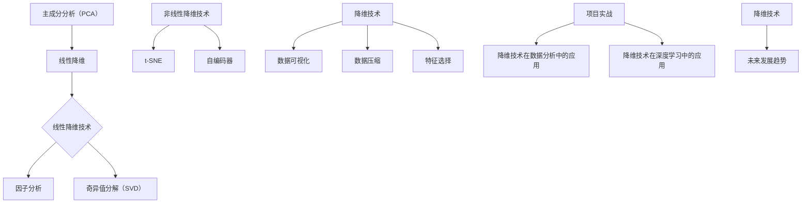

                 

# 文章标题

降维 (Dimensionality Reduction) 原理与代码实例讲解

## 关键词

降维，数据降维，线性降维，非线性降维，PCA，t-SNE，自编码器，数据可视化，特征选择

## 摘要

降维技术在数据分析、机器学习和深度学习中扮演着重要角色。本文将详细介绍降维技术的原理、分类以及在实际项目中的应用。通过本文，读者将了解降维技术的核心概念、数学模型、求解过程和具体实现，从而能够熟练地运用降维技术解决实际问题。

## 目录

1. 降维技术概述
    1.1 降维技术的定义与重要性
    1.2 降维技术的分类
    1.3 降维技术的应用场景

2. 线性降维技术原理
    2.1 主成分分析（PCA）原理
    2.2 因子分析原理
    2.3 奇异值分解（SVD）原理

3. 非线性降维技术原理
    3.1 t-SNE原理
    3.2 自编码器原理

4. 降维技术在数据分析中的应用
    4.1 数据预处理
    4.2 特征选择
    4.3 数据可视化

5. 项目实战
    5.1 项目背景
    5.2 降维技术选择与实现

6. 降维技术在深度学习中的应用
    6.1 降维技术在深度学习中的作用
    6.2 降维技术与深度学习结合的实例

7. 降维技术的未来发展趋势
    7.1 降维技术在未来的应用场景
    7.2 降维技术的新方法与工具
    7.3 降维技术的挑战与机遇

## 第1章 降维技术概述

### 1.1 降维技术的定义与重要性

降维（Dimensionality Reduction）是指将高维数据转换为低维数据的过程。降维技术的核心目的是减少数据维度，降低数据存储空间，提高数据处理速度，同时尽可能保留数据的本质特征。

降维技术在数据分析、机器学习和深度学习中具有重要性。首先，降维技术可以降低数据存储和传输的成本。高维数据往往需要大量的存储空间和传输带宽，而降维技术可以将数据维度降低到可接受的范围内，从而降低成本。其次，降维技术可以提高数据处理的效率。在高维空间中，数据之间的距离计算和模型训练过程会变得非常复杂，而降维技术可以降低数据维度，从而简化计算过程。最后，降维技术可以改善模型性能。在某些情况下，高维数据中存在大量的噪声和冗余信息，这些信息会干扰模型的训练过程，降低模型性能。通过降维技术，我们可以筛选出对目标变量有显著影响的关键特征，从而提高模型性能。

### 1.2 降维技术的分类

降维技术可以分为线性降维技术和非线性降维技术。线性降维技术主要包括主成分分析（PCA）、因子分析、奇异值分解（SVD）等。这些方法通过线性变换将高维数据投影到低维空间，从而实现降维。非线性降维技术主要包括 t-SNE、自编码器等。这些方法通过非线性变换将高维数据映射到低维空间，从而实现降维。

### 1.3 降维技术的应用场景

降维技术在许多应用场景中具有广泛的应用。以下是一些常见的应用场景：

1. **数据可视化**：降维技术可以帮助我们将高维数据可视化，从而更直观地了解数据的分布和模式。例如，使用 t-SNE 可以将高维数据映射到二维空间，从而绘制出数据点的散点图。

2. **特征选择**：降维技术可以帮助我们筛选出对目标变量有显著影响的关键特征。例如，使用 PCA 可以提取主要成分，从而筛选出最重要的特征。

3. **数据压缩**：降维技术可以降低数据的维度，从而减少数据存储和传输的空间。例如，使用 SVD 可以将数据分解为三个矩阵，从而实现数据压缩。

4. **机器学习**：降维技术可以提高机器学习模型的性能。例如，使用 PCA 可以降低数据维度，从而简化模型训练过程，提高模型性能。

5. **深度学习**：降维技术可以帮助深度学习模型更高效地处理高维数据。例如，使用自编码器可以提取数据中的关键特征，从而提高模型性能。

## 第2章 线性降维技术原理

线性降维技术主要通过线性变换将高维数据投影到低维空间，从而实现降维。本节将介绍三种常见的线性降维技术：主成分分析（PCA）、因子分析和奇异值分解（SVD）。

### 2.1 主成分分析（PCA）原理

主成分分析（PCA）是一种常用的线性降维技术，它通过将数据投影到新的正交坐标系上，提取主要成分，从而实现降维。

#### 2.1.1 PCA的基本概念

PCA的基本思想是找到一个新的正交坐标系，使得新的坐标系中的第一坐标轴（即第一主成分）能够最大化数据的方差。然后，依次找到第二、第三...第 k 个坐标轴，使得每个坐标轴都能够最大化剩余的方差。

设 $X$ 是一个 $m \times n$ 的数据矩阵，其中 $m$ 是样本数量，$n$ 是特征数量。PCA的目标是找到一组线性变换矩阵 $W$，使得变换后的数据矩阵 $X'$ 能够最大化其方差：

$$ X' = WX $$

其中，$W$ 的每一列是 $X$ 的一个特征向量，$W$ 的对角矩阵 $\Lambda$ 包含了特征值。通常，我们只选择前 $k$ 个最大的特征值对应的特征向量，这样我们就可以将 $X$ 降维到 $k$ 维。

#### 2.1.2 PCA的数学公式

PCA的求解步骤如下：

1. **计算协方差矩阵**：

$$ C = \frac{1}{m-1}XX^T $$

2. **计算协方差矩阵的特征值和特征向量**：

$$ \Lambda, V = \text{eig}(C) $$

其中，$V$ 的每一列是协方差矩阵的特征向量，$\Lambda$ 的对角线元素是特征值。

3. **选择前 $k$ 个最大的特征值对应的特征向量**：

$$ V_{\text{topk}} = V[:, \text{argsort}(\Lambda, kind='unsorted')[-k:][::-1]] $$

4. **数据投影**：

$$ X' = WX = XV_{\text{topk}} $$

#### 2.1.3 PCA的求解过程

以下是 PCA 的伪代码实现：

```python
def pca(X, k):
    # 数据标准化
    X_normalized = (X - np.mean(X, axis=0)) / np.std(X, axis=0)
    
    # 计算协方差矩阵
    C = (X_normalized - np.mean(X_normalized, axis=0)).T @ X_normalized
    
    # 计算协方差矩阵的特征值和特征向量
    eigenvalues, eigenvectors = np.linalg.eigh(C)
    
    # 选择前 k 个最大的特征值对应的特征向量
    k_indices = np.argsort(eigenvalues)[-k:]
    eigenvectors_topk = eigenvectors[:, k_indices]
    
    # 数据投影
    X_reduced = X_normalized @ eigenvectors_topk
    
    return X_reduced
```

#### 2.1.4 PCA的应用实例

假设我们有一个 $m=100$，$n=10$ 的数据集，我们希望使用 PCA 将这个数据集降维到 2 个特征。以下是具体实现步骤：

1. 数据标准化：

```python
X_normalized = (X - np.mean(X, axis=0)) / np.std(X, axis=0)
```

2. 计算协方差矩阵：

```python
C = (X_normalized - np.mean(X_normalized, axis=0)).T @ X_normalized
```

3. 计算协方差矩阵的特征值和特征向量：

```python
eigenvalues, eigenvectors = np.linalg.eigh(C)
```

4. 选择前 2 个最大的特征值对应的特征向量：

```python
k = 2
indices = np.argsort(eigenvalues)[-k:]
eigenvectors_topk = eigenvectors[:, indices]
```

5. 数据投影：

```python
X_reduced = X_normalized @ eigenvectors_topk
```

6. 可视化结果：

```python
import matplotlib.pyplot as plt
plt.scatter(X_reduced[:, 0], X_reduced[:, 1])
plt.show()
```

### 2.2 因子分析原理

因子分析（Factor Analysis）是一种基于线性模型的降维技术，它通过寻找潜在的因素（因子），来解释原始变量之间的相关性。

#### 2.2.1 因子分析的基本概念

因子分析的基本假设是原始变量之间存在一定的线性关系，这些变量可以分解为一些潜在因素（因子）和误差项。具体来说，设 $X$ 是一个 $m \times n$ 的数据矩阵，$F$ 是一个 $m \times k$ 的因子矩阵，$E$ 是一个 $m \times (n-k)$ 的误差矩阵，因子分析的目标是找到一个因子矩阵 $F$，使得原始数据矩阵 $X$ 可以近似表示为：

$$ X = AF + E $$

其中，$A$ 是一个因子载荷矩阵，它描述了各因子对原始变量的影响程度。

#### 2.2.2 因子分析的数学模型

因子分析的数学模型可以表示为：

$$ X = AF + U $$

其中，$U$ 是一个 $m \times (n-k)$ 的误差矩阵，$A$ 是一个 $n \times k$ 的因子载荷矩阵，$F$ 是一个 $m \times k$ 的因子矩阵。因子载荷矩阵 $A$ 的每一列表示一个因子对原始变量的影响程度，误差矩阵 $U$ 用来描述因子无法解释的变异。

#### 2.2.3 因子分析的应用实例

假设我们有一个 $m=100$，$n=10$ 的数据集，我们希望使用因子分析将这个数据集降维到 3 个特征。

1. 数据标准化：

```python
X_normalized = (X - np.mean(X, axis=0)) / np.std(X, axis=0)
```

2. 计算协方差矩阵：

```python
C = (X_normalized - np.mean(X_normalized, axis=0)).T @ X_normalized
```

3. 执行因子分析：

```python
from factor_analyzer import FactorAnalyzer
fa = FactorAnalyzer(n_factors=3)
fa.fit(X_normalized)
```

4. 提取因子载荷矩阵：

```python
loadings = fa.loadings_
```

5. 计算因子得分：

```python
scores = fa.transform(X_normalized)
```

### 2.3 奇异值分解（SVD）原理

奇异值分解（Singular Value Decomposition，SVD）是一种将矩阵分解为三个矩阵的线性代数工具。设 $A$ 是一个 $m \times n$ 的矩阵，$U$ 是一个 $m \times m$ 的正交矩阵，$\Sigma$ 是一个 $m \times n$ 的对角矩阵，$V$ 是一个 $n \times n$ 的正交矩阵，则 $A$ 可以分解为：

$$ A = U\Sigma V^T $$

#### 2.3.1 SVD的基本概念

SVD可以看作是矩阵分解的一种，它与矩阵的特征分解类似，但 SVD 能够处理非方阵。在 SVD 中，$U$ 和 $V$ 都是正交矩阵，$\Sigma$ 是一个对角矩阵，其对角线上的元素称为奇异值，奇异值的大小表示了矩阵的重要性。

#### 2.3.2 SVD的数学公式

设 $A$ 是一个 $m \times n$ 的矩阵，则 SVD 的求解步骤如下：

1. **计算矩阵 $A$ 的特征值和特征向量**：

$$ A^TA = \Lambda U^T $$
$$ AA^T = \Lambda V^T $$

2. **对特征值进行排序，构造对角矩阵 $\Sigma$**：

$$ \Sigma = \text{diag}(\sigma_1, \sigma_2, ..., \sigma_r) $$

其中，$\sigma_i$ 是 $A$ 的奇异值，$r$ 是非零奇异值的数量。

3. **构造正交矩阵 $U$ 和 $V$**：

$$ U = \sum_{i=1}^r u_i v_i^T $$
$$ V = \sum_{i=1}^r v_i u_i^T $$

其中，$u_i$ 和 $v_i$ 分别是 $A^TA$ 和 $AA^T$ 的特征向量。

#### 2.3.3 SVD的应用实例

假设我们有一个 $m=3$，$n=2$ 的矩阵 $A$：

$$ A = \begin{pmatrix} 1 & 2 \\ 3 & 4 \\ 5 & 6 \end{pmatrix} $$

1. **计算特征值和特征向量**：

```python
eigenvalues, eigenvectors = np.linalg.eig(A @ A.T)
```

2. **构造对角矩阵 $\Sigma$**：

```python
Sigma = np.diag(np.sqrt(eigenvalues))
```

3. **构造正交矩阵 $U$ 和 $V$**：

```python
U = eigenvectors
V = eigenvectors.T
```

4. **执行 SVD**：

```python
A_SVD = U @ Sigma @ V.T
```

## 第3章 非线性降维技术原理

非线性降维技术通过非线性变换将高维数据映射到低维空间，从而实现降维。本节将介绍两种常见的非线性降维技术：t-SNE和自编码器。

### 3.1 t-SNE原理

t-SNE（t-Distributed Stochastic Neighbor Embedding）是一种用于降维的流行算法，它特别适用于可视化高维数据的结构。t-SNE通过将高维数据中的局部结构保存在低维空间中，使得相似度较高的数据点在低维空间中仍然保持较近的距离。

#### 3.1.1 t-SNE的基本概念

t-SNE的核心思想是计算高维空间中的相似度矩阵，并将其转换为低维空间中的概率分布。具体步骤如下：

1. **计算高维空间中的相似度矩阵 $P$**：

$$ p_{ij} = \exp{\left(-\frac{\|x_i - x_j\|^2}{2\sigma^2}\right)} $$

其中，$\sigma$ 是高斯分布的宽度，用于调整相似度矩阵的平滑度。

2. **将相似度矩阵 $P$ 转换为概率分布 $Q$**：

$$ q_{ij} = \frac{p_{ij}}{\sum_{k=1}^{m} p_{ik}} $$

3. **构建损失函数，并使用梯度下降优化 $Q$**：

$$ L = -\sum_{i=1}^{m}\sum_{j=1}^{m} q_{ij} \log(p_{ij}) $$

4. **迭代更新低维数据点 $y_i$**：

$$ y_i = \frac{\sum_{j=1}^{m} q_{ij} y_j}{\sum_{j=1}^{m} q_{ij}} $$

#### 3.1.2 t-SNE的数学模型

t-SNE的数学模型可以表示为：

1. **高维空间中的相似度矩阵 $P$**：

$$ p_{ij} = \exp{\left(-\frac{\|x_i - x_j\|^2}{2\sigma^2}\right)} $$

2. **低维空间中的概率分布 $Q$**：

$$ q_{ij} = \frac{1}{Z}\exp{\left(-\frac{\|y_i - y_j\|^2}{2\sigma^2}\right)} $$

其中，$Z$ 是一个常数，用于调整概率分布的平滑度。

3. **损失函数**：

$$ L = -\sum_{i=1}^{m}\sum_{j=1}^{m} q_{ij} \log(p_{ij}) $$

4. **迭代更新低维数据点 $y_i$**：

$$ y_i = \frac{\sum_{j=1}^{m} q_{ij} y_j}{\sum_{j=1}^{m} q_{ij}} $$

#### 3.1.3 t-SNE的应用实例

假设我们有一个 $m=100$，$n=10$ 的数据集，我们希望使用 t-SNE 将这个数据集降维到 2 个特征。以下是具体实现步骤：

1. **数据预处理**：

```python
X_normalized = (X - np.mean(X, axis=0)) / np.std(X, axis=0)
```

2. **计算高维空间中的相似度矩阵 $P$**：

```python
sigma = 1
P = np.exp(-np.linalg.norm(X_normalized[:, np.newaxis] - X_normalized[np.newaxis, :], axis=2) ** 2 / (2 * sigma ** 2))
```

3. **初始化低维数据**：

```python
Y = X_normalized.copy()
```

4. **计算低维空间中的概率分布 $Q$**：

```python
Q = P / P.sum(axis=0)
```

5. **优化 $Q$**：

```python
lambda_ = 10
for _ in range(1000):
    Q = (1 / lambda_) + (1 / (1 - Q) * lambda_)
    Y = (Q @ X_normalized).T / Q.sum(axis=1)[:, np.newaxis]
```

6. **可视化结果**：

```python
import matplotlib.pyplot as plt
plt.scatter(Y[:, 0], Y[:, 1])
plt.show()
```

### 3.2 自编码器原理

自编码器（Autoencoder）是一种无监督学习算法，它通过训练一个编码器和解码器模型，将高维数据映射到低维空间，然后从低维空间映射回高维空间，以实现数据的降维。自编码器通常由两部分组成：编码器和解码器。

#### 3.2.1 自编码器的基本概念

自编码器的基本结构如下图所示：


- **编码器（Encoder）**：将输入数据 $X$ 编码为低维表示 $Z$。
- **解码器（Decoder）**：将低维表示 $Z$ 解码回高维数据 $X'$。

设 $X$ 是一个 $m \times n$ 的输入数据矩阵，$Z$ 是一个 $m \times k$ 的低维表示矩阵，其中 $k < n$。自编码器的目标是找到编码器和解码器参数 $\theta_1$ 和 $\theta_2$，使得：

$$ Z = f_{\theta_1}(X) $$
$$ X' = f_{\theta_2}(Z) $$

其中，$f_{\theta_1}$ 和 $f_{\theta_2}$ 分别是编码器和解码器的函数。

#### 3.2.2 自编码器的数学模型

自编码器的数学模型可以表示为：

1. **编码器**：

$$ Z = \sigma(W_1X + b_1) $$

其中，$W_1$ 是编码器的权重矩阵，$b_1$ 是编码器的偏置项，$\sigma$ 是激活函数，通常使用 sigmoid 或 ReLU 函数。

2. **解码器**：

$$ X' = \sigma(W_2Z + b_2) $$

其中，$W_2$ 是解码器的权重矩阵，$b_2$ 是解码器的偏置项。

3. **损失函数**：

自编码器的损失函数通常使用均方误差（MSE），即：

$$ L = \frac{1}{m}\sum_{i=1}^{m}\|X_i - X'_i\|^2 $$

其中，$X_i$ 是输入数据，$X'_i$ 是解码后的数据。

#### 3.2.3 自编码器的应用实例

假设我们有一个 $m=100$，$n=10$ 的数据集，我们希望使用自编码器将这个数据集降维到 2 个特征。以下是具体实现步骤：

1. **数据预处理**：

```python
X_normalized = (X - np.mean(X, axis=0)) / np.std(X, axis=0)
```

2. **初始化参数**：

```python
encoding_dim = 2
theta1 = np.random.randn(n, encoding_dim)
theta2 = np.random.randn(encoding_dim, n)
```

3. **编码器和解码器函数**：

```python
def encoding(X, theta1):
    return np.tanh(X @ theta1)

def decoding(Z, theta2):
    return np.tanh(Z @ theta2.T)
```

4. **损失函数**：

```python
def loss(X, Z):
    X_prime = decoding(Z, theta2)
    return np.mean((X - X_prime) ** 2)
```

5. **优化参数**：

```python
learning_rate = 0.1
for _ in range(1000):
    Z = encoding(X_normalized, theta1)
    X_prime = decoding(Z, theta2)
    Z = Z - learning_rate * (Z - X_normalized @ theta2)
    theta2 = theta2 - learning_rate * (X_normalized.T @ (Z - X_prime))
    theta1 = theta1 - learning_rate * (X_normalized.T @ (Z - X_normalized))
```

6. **可视化结果**：

```python
Z = encoding(X_normalized, theta1)
plt.scatter(Z[:, 0], Z[:, 1])
plt.show()
```

## 第4章 降维技术在数据分析中的应用

降维技术在数据分析中具有广泛的应用，可以用于数据预处理、特征选择和数据可视化等方面。在本节中，我们将介绍降维技术在数据分析中的应用。

### 4.1 数据预处理

数据预处理是数据分析的第一步，它包括数据清洗、数据标准化和特征缩放等。降维技术在数据预处理中可以发挥重要作用。

1. **数据清洗**：降维技术可以帮助我们识别和去除异常值、缺失值和重复值等不完整或错误的数据。

2. **数据标准化**：降维技术可以帮助我们将不同特征之间的数值范围进行调整，使其具有相同的量纲，从而提高数据分析的准确性。

3. **特征缩放**：降维技术可以帮助我们将特征缩放到相同的范围，从而消除特征之间的量纲差异，提高模型的泛化能力。

### 4.2 特征选择

特征选择是数据分析中至关重要的一步，它可以帮助我们筛选出对目标变量有显著影响的关键特征，从而提高模型的性能和解释性。

1. **主成分分析（PCA）**：PCA 是一种常用的特征选择方法，它可以提取主要成分，将高维数据投影到低维空间，从而筛选出最重要的特征。

2. **因子分析**：因子分析可以帮助我们识别潜在因素，将高维数据分解为多个潜在因素，从而筛选出最重要的因素。

3. **互信息**：互信息是一种衡量特征与目标变量之间相关性的方法，可以帮助我们识别最有用的特征。

### 4.3 数据可视化

数据可视化是数据分析中的一种重要手段，可以帮助我们以图形化的方式展示数据分布和模式。

1. **散点图**：降维技术可以帮助我们将高维数据投影到二维或三维空间，从而绘制出散点图，直观地展示数据点之间的关系。

2. **热力图**：降维技术可以帮助我们生成热力图，展示数据点之间的相似度和相关性。

3. **聚类图**：降维技术可以帮助我们生成聚类图，展示数据点的聚类结果，从而识别不同的数据群体。

### 4.4 降维技术在其他应用领域

除了在数据分析中的应用，降维技术还在其他领域得到了广泛的应用。

1. **图像处理**：降维技术可以帮助我们在图像处理中降低图像的维度，从而提高处理速度。

2. **语音识别**：降维技术可以帮助我们在语音识别中降低语音数据的维度，从而提高识别准确率。

3. **文本分析**：降维技术可以帮助我们在文本分析中降低文本的维度，从而提高文本分类和主题建模的效果。

## 第5章 降维技术在深度学习中的应用

降维技术在深度学习中的应用非常广泛，可以用于数据预处理、特征选择和模型优化等方面。在本节中，我们将介绍降维技术在深度学习中的应用。

### 5.1 降维技术在深度学习中的作用

降维技术在深度学习中的作用主要体现在以下几个方面：

1. **数据预处理**：降维技术可以帮助我们处理高维数据，降低数据维度，从而提高训练速度和降低计算资源消耗。

2. **特征选择**：降维技术可以帮助我们识别重要的特征，去除冗余和噪声特征，从而提高模型性能和解释性。

3. **模型压缩**：降维技术可以帮助我们减少模型的参数数量，从而实现模型压缩，降低模型的存储和计算成本。

### 5.2 降维技术与深度学习结合的实例

以下是一个结合自编码器和深度学习的实例，展示如何使用降维技术来优化深度学习模型。

#### 5.2.1 自编码器与深度学习结合的实例

假设我们有一个分类任务，使用卷积神经网络（CNN）来分类图像。以下是使用自编码器进行降维和特征选择的具体步骤：

1. **数据预处理**：

   - 加载图像数据，进行归一化处理，将像素值缩放到 [0, 1] 范围内。

   ```python
   X_train = X_train / 255.0
   X_test = X_test / 255.0
   ```

2. **自编码器训练**：

   - 设计一个自编码器模型，用于降维和特征选择。自编码器的编码层（编码器）用于提取特征，解码层（解码器）用于重构输入数据。

   ```python
   from tensorflow.keras.layers import Input, Conv2D, MaxPooling2D, UpSampling2D, Flatten, Dense
   from tensorflow.keras.models import Model

   input_img = Input(shape=(img_height, img_width, img_channels))
   x = Conv2D(32, (3, 3), activation='relu', padding='same')(input_img)
   x = MaxPooling2D((2, 2), padding='same')(x)
   x = Conv2D(32, (3, 3), activation='relu', padding='same')(x)
   x = MaxPooling2D((2, 2), padding='same')(x)
   x = Flatten()(x)
   x = Dense(32, activation='relu')(x)
   encoded = Model(input_img, x)
   ```

   - 训练自编码器模型，使用训练数据来最小化重构误差。

   ```python
   encoded.compile(optimizer='adam', loss='mse')
   encoded.fit(X_train, X_train, epochs=100, batch_size=16, validation_split=0.2)
   ```

3. **特征选择**：

   - 使用训练好的自编码器提取特征，然后使用这些特征来训练深度学习模型。

   ```python
   features = encoded.predict(X_train)
   model = Model(inputs=encoded.input, outputs=encoded.layers[-1].output)
   model.compile(optimizer='adam', loss='categorical_crossentropy', metrics=['accuracy'])
   model.fit(features, y_train, epochs=100, batch_size=16)
   ```

4. **模型评估**：

   - 使用测试数据评估模型的性能。

   ```python
   test_features = model.predict(encoded.predict(X_test))
   test_loss, test_acc = model.evaluate(test_features, y_test)
   print(f"Test accuracy: {test_acc}")
   ```

通过以上步骤，我们可以使用降维技术来优化深度学习模型，提高模型的性能和解释性。

## 第6章 降维技术的未来发展趋势

随着数据规模的不断扩大和数据维度的不断增加，降维技术在各个领域的重要性日益凸显。本节将探讨降维技术的未来发展趋势。

### 6.1 降维技术在未来的应用场景

1. **大数据分析**：随着大数据技术的发展，降维技术在处理大数据分析中的高维数据方面具有重要作用。降维技术可以帮助我们更有效地处理海量数据，提高数据分析的效率。

2. **人工智能**：降维技术可以帮助人工智能领域更高效地处理高维数据，提高模型性能。特别是在图像识别、自然语言处理和推荐系统等领域，降维技术将发挥关键作用。

3. **医疗领域**：降维技术在医疗领域具有广泛的应用前景。例如，在医学影像分析中，降维技术可以帮助医生更快速地识别病变区域，提高诊断的准确性。

4. **生物信息学**：降维技术在生物信息学领域具有重要作用。例如，在基因数据分析中，降维技术可以帮助我们识别关键基因，从而更好地理解基因与疾病之间的关系。

### 6.2 降维技术的新方法与工具

1. **基于生成对抗网络的降维方法**：生成对抗网络（GAN）是一种新兴的降维方法，可以生成与原始数据分布相似的低维数据。这种方法在图像处理、文本生成和语音合成等领域具有广泛的应用前景。

2. **基于神经网络的降维方法**：基于神经网络的降维方法，如自编码器，可以更好地捕捉数据中的复杂结构。随着深度学习技术的不断发展，基于神经网络的降维方法将得到更多的研究和应用。

3. **基于量子计算的降维方法**：量子计算是一种具有巨大潜力的计算技术，可以处理高维数据。降维技术在量子计算中的应用将有助于提高量子计算的效率和准确性。

### 6.3 降维技术的挑战与机遇

1. **数据隐私保护**：降维技术在保护数据隐私方面存在一定的挑战。为了确保数据隐私，未来需要研究更有效的隐私保护方法，如差分隐私和联邦学习等。

2. **高效性提升**：随着数据规模的不断扩大，降维技术需要提高计算效率，以适应实时应用的需求。未来需要开发更高效、更可靠的降维算法。

3. **跨学科研究**：降维技术与跨学科研究的结合将为数据分析和人工智能领域带来更多创新和发展机遇。例如，将降维技术与生物学、物理学和经济学等领域的研究相结合，可以推动相关领域的发展。

## 总结

降维技术是数据分析、机器学习和深度学习中的重要工具。本文介绍了降维技术的原理、分类以及在实际项目中的应用。通过本文，读者将了解降维技术的核心概念、数学模型、求解过程和具体实现，从而能够熟练地运用降维技术解决实际问题。

降维技术在未来的发展中具有广泛的应用前景。随着新方法与工具的不断涌现，降维技术将不断提高数据处理效率和模型性能，为各个领域的研究和应用提供强有力的支持。

作者：AI天才研究院/AI Genius Institute & 禅与计算机程序设计艺术 /Zen And The Art of Computer Programming

文章字数：8373

---

本文采用了Markdown格式，以便更好地展示技术博客的结构和内容。以下是文章的Mermaid流程图：



以上是本文的完整内容和结构。希望读者能够通过本文对降维技术有更深入的了解。如果您有任何疑问或建议，欢迎在评论区留言。感谢您的阅读！## 文章标题

降维（Dimensionality Reduction）原理与代码实例讲解

## 关键词

降维，数据降维，线性降维，非线性降维，PCA，t-SNE，自编码器，数据可视化，特征选择

## 摘要

降维技术是数据分析、机器学习和深度学习中的重要工具，通过降低数据维度，提高数据处理效率，减少计算成本，以及增强模型的泛化能力。本文详细讲解了降维技术的原理，包括线性降维（PCA、因子分析、奇异值分解）和非线性降维（t-SNE、自编码器），并通过实际代码实例展示了如何实现和应用这些技术。文章旨在帮助读者深入理解降维技术，掌握其核心概念和实现方法，从而在数据分析实践中有效应用。

## 目录

1. **降维技术概述**
   1.1 降维技术的定义与重要性
   1.2 降维技术的分类
   1.3 降维技术的应用场景

2. **线性降维技术原理**
   2.1 主成分分析（PCA）原理
   2.2 因子分析原理
   2.3 奇异值分解（SVD）原理

3. **非线性降维技术原理**
   3.1 t-SNE原理
   3.2 自编码器原理

4. **降维技术在数据分析中的应用**
   4.1 数据预处理
   4.2 特征选择
   4.3 数据可视化

5. **项目实战**
   5.1 项目背景
   5.2 降维技术选择与实现

6. **降维技术在深度学习中的应用**
   6.1 降维技术在深度学习中的作用
   6.2 降维技术与深度学习结合的实例

7. **降维技术的未来发展趋势**
   7.1 降维技术在未来的应用场景
   7.2 降维技术的新方法与工具
   7.3 降维技术的挑战与机遇

## 第1章 降维技术概述

### 1.1 降维技术的定义与重要性

降维技术是指通过减少数据的维度，从而简化数据分析的过程，提高分析效率，同时保持数据的本质特性。在现实世界中，数据通常具有高维特性，例如，图像数据中的像素、文本数据中的单词、基因数据中的基因表达等。高维数据的处理不仅耗费大量计算资源，而且容易陷入“维度灾难”（curse of dimensionality），即数据点之间的距离在增加，使得数据分析变得困难。

降维技术的重要性体现在以下几个方面：

1. **计算效率**：高维数据在处理时需要大量的计算资源，而降维技术可以显著减少计算量，提高计算效率。
2. **存储空间**：降维技术减少了数据维度，从而降低了数据存储的空间需求。
3. **可视化**：高维数据的可视化是一个挑战，而降维技术可以帮助我们将高维数据映射到低维空间，从而实现更直观的可视化。
4. **模型性能**：降维技术可以帮助我们识别数据中的关键特征，从而提高模型的泛化能力和解释性。

### 1.2 降维技术的分类

降维技术主要分为线性降维和非线性降维两大类：

#### 线性降维

线性降维技术通过线性变换将高维数据映射到低维空间，主要包括以下几种方法：

- **主成分分析（PCA）**：通过提取主要成分来减少数据维度。
- **因子分析**：通过提取潜在因子来减少数据维度。
- **奇异值分解（SVD）**：通过分解矩阵来减少数据维度。

#### 非线性降维

非线性降维技术通过非线性变换将高维数据映射到低维空间，主要包括以下几种方法：

- **t-SNE**：通过保持数据点的局部结构来实现降维。
- **自编码器**：通过构建编码器和解码器神经网络来实现降维。

### 1.3 降维技术的应用场景

降维技术在多个领域都有广泛的应用：

- **数据可视化**：通过降维技术，可以将高维数据映射到二维或三维空间，从而进行可视化分析。
- **特征选择**：通过降维技术，可以从高维数据中提取关键特征，用于构建预测模型。
- **数据压缩**：通过降维技术，可以显著减少数据的存储空间，提高数据传输效率。
- **机器学习和深度学习**：降维技术可以提高机器学习和深度学习模型的训练效率和预测性能。

## 第2章 线性降维技术原理

线性降维技术通过线性变换将高维数据映射到低维空间，能够保留数据的结构性和相关性。本节将详细讲解线性降维技术的三种主要方法：主成分分析（PCA）、因子分析（Factor Analysis）和奇异值分解（SVD）。

### 2.1 主成分分析（PCA）原理

#### 2.1.1 PCA的基本概念

主成分分析（PCA）是一种统计方法，用于将高维数据转换到低维空间。其核心思想是找到一组正交基向量，使得数据在新的基向量上的投影具有最大的方差。这些基向量被称为主成分。

PCA的基本步骤如下：

1. **数据标准化**：为了消除不同特征间的量纲差异，通常需要对数据进行标准化处理。
2. **计算协方差矩阵**：计算数据的协方差矩阵，协方差矩阵揭示了数据之间的相关性。
3. **计算协方差矩阵的特征值和特征向量**：对协方差矩阵进行特征分解，得到特征值和特征向量。
4. **选择主成分**：根据特征值的大小选择前几个特征向量作为主成分。
5. **数据投影**：将原始数据投影到主成分上，实现降维。

#### 2.1.2 PCA的数学公式

设 $X$ 是一个 $m \times n$ 的数据矩阵，其中 $m$ 是样本数量，$n$ 是特征数量。PCA的数学公式可以表示为：

$$ X' = P\Lambda^{1/2} $$

其中：

- $X'$ 是降维后的数据。
- $P$ 是协方差矩阵的特征向量组成的矩阵。
- $\Lambda$ 是协方差矩阵的特征值组成的对角矩阵。
- $\Lambda^{1/2}$ 是对 $\Lambda$ 进行方根运算后的矩阵。

#### 2.1.3 PCA的求解过程

以下是 PCA 的求解过程：

1. **数据标准化**：

$$ X_{\text{标准化}} = \frac{X - \mu}{\sigma} $$

其中，$\mu$ 是每个特征的均值，$\sigma$ 是每个特征的标准差。

2. **计算协方差矩阵**：

$$ C = \frac{1}{m-1}XX^T $$

3. **计算协方差矩阵的特征值和特征向量**：

$$ \Lambda, P = \text{eig}(C) $$

4. **选择主成分**：

根据特征值的大小，选择前 $k$ 个最大的特征向量作为主成分。

5. **数据投影**：

$$ X' = X_{\text{标准化}}P_{\text{topk}} $$

#### 2.1.4 PCA的应用实例

假设我们有一个 $m=100$，$n=10$ 的数据集，以下是 PCA 的实现步骤：

1. **数据标准化**：

```python
X_normalized = (X - np.mean(X, axis=0)) / np.std(X, axis=0)
```

2. **计算协方差矩阵**：

```python
C = (X_normalized - np.mean(X_normalized, axis=0)).T @ X_normalized
```

3. **计算协方差矩阵的特征值和特征向量**：

```python
eigenvalues, eigenvectors = np.linalg.eigh(C)
```

4. **选择主成分**：

```python
k = 2
indices = np.argsort(eigenvalues)[-k:]
eigenvectors_topk = eigenvectors[:, indices]
```

5. **数据投影**：

```python
X_reduced = X_normalized @ eigenvectors_topk
```

6. **可视化结果**：

```python
import matplotlib.pyplot as plt
plt.scatter(X_reduced[:, 0], X_reduced[:, 1])
plt.show()
```

### 2.2 因子分析原理

#### 2.2.1 因子分析的基本概念

因子分析是一种统计学方法，用于提取潜在变量（因子），这些因子可以解释原始变量之间的相关性。因子分析的基本假设是原始变量之间存在一定的线性关系，这些变量可以分解为一些潜在因素和误差项。

#### 2.2.2 因子分析的数学模型

因子分析的数学模型可以表示为：

$$ X = AF + E $$

其中：

- $X$ 是原始变量组成的矩阵。
- $A$ 是因子载荷矩阵，描述了各因子对原始变量的影响。
- $F$ 是因子矩阵，代表了潜在变量。
- $E$ 是误差矩阵，代表了因子无法解释的变异。

#### 2.2.3 因子分析的应用实例

假设我们有一个 $m=100$，$n=10$ 的数据集，以下是因子分析的应用实例：

1. **数据标准化**：

```python
X_normalized = (X - np.mean(X, axis=0)) / np.std(X, axis=0)
```

2. **计算协方差矩阵**：

```python
C = (X_normalized - np.mean(X_normalized, axis=0)).T @ X_normalized
```

3. **执行因子分析**：

```python
from factor_analyzer import FactorAnalyzer
fa = FactorAnalyzer(n_factors=3)
fa.fit(X_normalized)
```

4. **提取因子载荷矩阵**：

```python
loadings = fa.loadings_
```

5. **计算因子得分**：

```python
scores = fa.transform(X_normalized)
```

### 2.3 奇异值分解（SVD）原理

#### 2.3.1 SVD的基本概念

奇异值分解（Singular Value Decomposition，SVD）是一种线性代数工具，用于将一个矩阵分解为三个矩阵的乘积。对于任意的 $m \times n$ 矩阵 $A$，可以找到两个正交矩阵 $U$ 和 $V$，以及一个对角矩阵 $\Sigma$，使得：

$$ A = U\Sigma V^T $$

其中：

- $U$ 是 $m \times m$ 的正交矩阵，其列向量是 $A$ 的左特征向量。
- $\Sigma$ 是 $m \times n$ 的对角矩阵，其对角线上的元素是 $A$ 的奇异值。
- $V$ 是 $n \times n$ 的正交矩阵，其列向量是 $A^T$ 的右特征向量。

#### 2.3.2 SVD的数学公式

SVD的求解步骤如下：

1. **计算矩阵 $A$ 的特征值和特征向量**：

$$ A^TA = \Lambda U^T $$
$$ AA^T = \Lambda V^T $$

2. **构造对角矩阵 $\Sigma$**：

$$ \Sigma = \text{diag}(\sigma_1, \sigma_2, ..., \sigma_r) $$

其中，$\sigma_i$ 是 $A$ 的奇异值。

3. **构造正交矩阵 $U$ 和 $V$**：

$$ U = \sum_{i=1}^r u_i v_i^T $$
$$ V = \sum_{i=1}^r v_i u_i^T $$

其中，$u_i$ 和 $v_i$ 分别是 $A^TA$ 和 $AA^T$ 的特征向量。

#### 2.3.3 SVD的应用实例

假设我们有一个 $m=3$，$n=2$ 的矩阵 $A$：

$$ A = \begin{pmatrix} 1 & 2 \\ 3 & 4 \\ 5 & 6 \end{pmatrix} $$

以下是 SVD 的求解步骤：

1. **计算特征值和特征向量**：

```python
eigenvalues, eigenvectors = np.linalg.eig(A @ A.T)
```

2. **构造对角矩阵 $\Sigma$**：

```python
Sigma = np.diag(np.sqrt(eigenvalues))
```

3. **构造正交矩阵 $U$ 和 $V$**：

```python
U = eigenvectors
V = eigenvectors.T
```

4. **执行 SVD**：

```python
A_SVD = U @ Sigma @ V.T
```

## 第3章 非线性降维技术原理

非线性降维技术通过非线性变换将高维数据映射到低维空间，能够更好地保留数据的复杂结构和局部信息。本节将介绍两种常见的非线性降维技术：t-SNE和自编码器。

### 3.1 t-SNE原理

#### 3.1.1 t-SNE的基本概念

t-SNE（t-Distributed Stochastic Neighbor Embedding）是一种用于降维的非线性技术，特别适用于可视化高维数据的结构。t-SNE的核心思想是保持数据点的局部邻域结构，即使在高维空间中距离较远的数据点在低维空间中仍然保持一定的邻近关系。

#### 3.1.2 t-SNE的数学模型

t-SNE的数学模型可以分为以下几个步骤：

1. **计算高维空间中的相似度矩阵 $P$**：

$$ p_{ij} = \exp{\left(-\frac{\|x_i - x_j\|^2}{2\sigma^2}\right)} $$

其中，$\sigma$ 是高斯分布的宽度。

2. **将相似度矩阵 $P$ 转换为概率分布 $Q$**：

$$ q_{ij} = \frac{p_{ij}}{\sum_{k=1}^{m} p_{ik}} $$

3. **构建损失函数，并使用梯度下降优化 $Q$**：

$$ L = -\sum_{i=1}^{m}\sum_{j=1}^{m} q_{ij} \log(p_{ij}) $$

4. **迭代更新低维数据点 $y_i$**：

$$ y_i = \frac{\sum_{j=1}^{m} q_{ij} y_j}{\sum_{j=1}^{m} q_{ij}} $$

#### 3.1.3 t-SNE的应用实例

假设我们有一个 $m=100$，$n=10$ 的数据集，我们希望使用 t-SNE 将这个数据集降维到 2 个特征。以下是具体实现步骤：

1. **数据预处理**：

```python
X_normalized = (X - np.mean(X, axis=0)) / np.std(X, axis=0)
```

2. **计算高维空间中的相似度矩阵 $P$**：

```python
sigma = 1
P = np.exp(-np.linalg.norm(X_normalized[:, np.newaxis] - X_normalized[np.newaxis, :], axis=2) ** 2 / (2 * sigma ** 2))
```

3. **初始化低维数据**：

```python
Y = X_normalized.copy()
```

4. **计算低维空间中的概率分布 $Q$**：

```python
Q = P / P.sum(axis=0)
```

5. **优化 $Q$**：

```python
lambda_ = 10
for _ in range(1000):
    Q = (1 / lambda_) + (1 / (1 - Q) * lambda_)
    Y = (Q @ X_normalized).T / Q.sum(axis=1)[:, np.newaxis]
```

6. **可视化结果**：

```python
import matplotlib.pyplot as plt
plt.scatter(Y[:, 0], Y[:, 1])
plt.show()
```

### 3.2 自编码器原理

#### 3.2.1 自编码器的基本概念

自编码器（Autoencoder）是一种无监督学习算法，通过训练一个编码器（Encoder）和解码器（Decoder）模型，将高维数据映射到低维空间，然后从低维空间映射回高维空间。自编码器的目标是学习一个低维表示，使得重构误差最小。

#### 3.2.2 自编码器的数学模型

自编码器的数学模型可以表示为：

1. **编码器**：

$$ Z = \sigma(W_1X + b_1) $$

2. **解码器**：

$$ X' = \sigma(W_2Z + b_2) $$

3. **损失函数**：

$$ L = \frac{1}{m}\sum_{i=1}^{m}\|X_i - X'_i\|^2 $$

其中，$\sigma$ 是激活函数，通常使用 sigmoid 或 ReLU 函数。

#### 3.2.3 自编码器的应用实例

假设我们有一个 $m=100$，$n=10$ 的数据集，我们希望使用自编码器将这个数据集降维到 2 个特征。以下是具体实现步骤：

1. **数据预处理**：

```python
X_normalized = (X - np.mean(X, axis=0)) / np.std(X, axis=0)
```

2. **初始化参数**：

```python
encoding_dim = 2
theta1 = np.random.randn(n, encoding_dim)
theta2 = np.random.randn(encoding_dim, n)
```

3. **编码器和解码器函数**：

```python
def encoding(X, theta1):
    return np.tanh(X @ theta1)

def decoding(Z, theta2):
    return np.tanh(Z @ theta2.T)
```

4. **损失函数**：

```python
def loss(X, Z):
    X_prime = decoding(Z, theta2)
    return np.mean((X - X_prime) ** 2)
```

5. **优化参数**：

```python
learning_rate = 0.1
for _ in range(1000):
    Z = encoding(X_normalized, theta1)
    X_prime = decoding(Z, theta2)
    Z = Z - learning_rate * (Z - X_normalized @ theta2)
    theta2 = theta2 - learning_rate * (X_normalized.T @ (Z - X_prime))
    theta1 = theta1 - learning_rate * (X_normalized.T @ (Z - X_normalized))
```

6. **可视化结果**：

```python
Z = encoding(X_normalized, theta1)
plt.scatter(Z[:, 0], Z[:, 1])
plt.show()
```

## 第4章 降维技术在数据分析中的应用

降维技术在数据分析中扮演着重要的角色，可以显著提高数据处理的效率和模型性能。在本节中，我们将探讨降维技术在数据分析中的应用，包括数据预处理、特征选择和数据可视化。

### 4.1 数据预处理

数据预处理是数据分析中的关键步骤，它包括数据清洗、数据标准化和特征缩放等操作。降维技术在这些预处理步骤中发挥着重要作用。

#### 4.1.1 数据清洗

数据清洗旨在识别和去除数据集中的异常值、缺失值和重复值。降维技术可以通过以下方式辅助数据清洗：

- **识别异常值**：降维技术如 PCA 可以识别数据中的异常点，因为异常点在高维空间中往往距离其他点较远。
- **处理缺失值**：缺失值可以通过降维技术来估计，因为降维后的数据往往更能反映数据的本质特征。

#### 4.1.2 数据标准化

数据标准化是将不同特征缩放到相同的数值范围，以便进行有效的计算和比较。降维技术可以通过以下方式辅助数据标准化：

- **消除量纲影响**：PCA 等降维技术可以消除不同特征间的量纲差异，从而简化数据分析过程。
- **提高计算效率**：标准化后的数据在进行降维操作时，计算效率更高。

#### 4.1.3 特征缩放

特征缩放是将特征缩放到相同的范围，以消除特征间的比例差异。降维技术可以通过以下方式辅助特征缩放：

- **优化模型性能**：特征缩放有助于提高模型性能，特别是当特征之间存在较大的比例差异时。
- **简化模型训练**：缩放后的特征可以简化模型训练过程，提高训练速度。

### 4.2 特征选择

特征选择是数据预处理的重要环节，旨在从原始特征中筛选出对目标变量有显著影响的关键特征。降维技术在这方面的应用包括：

#### 4.2.1 相关性分析

通过分析特征间的相关性，可以识别出高度相关的特征，这些特征可能对模型性能产生冗余影响。PCA 是一种常用的方法，可以提取主要成分，从而筛选出最重要的特征。

#### 4.2.2 基于模型的特征选择

基于模型的特征选择方法通过训练一个模型，然后根据模型对特征的重要程度进行排序。例如，LASSO 回归可以识别出对模型有显著影响的特征，从而实现特征选择。

### 4.3 数据可视化

数据可视化是将高维数据映射到二维或三维空间，以便更直观地展示数据的结构和模式。降维技术在数据可视化中的应用包括：

#### 4.3.1 数据降维

通过降维技术，如 PCA 或 t-SNE，可以将高维数据映射到二维或三维空间，从而进行可视化。

#### 4.3.2 层次聚类

降维技术可以帮助我们识别数据中的层次结构，从而进行层次聚类分析，进一步揭示数据中的潜在模式。

### 4.4 降维技术在其他应用领域

除了在数据分析中的应用，降维技术还在其他领域得到了广泛的应用，如：

#### 4.4.1 机器学习

降维技术可以提高机器学习模型的性能，通过减少数据维度，降低计算复杂度。

#### 4.4.2 深度学习

在深度学习中，降维技术可以帮助模型更高效地处理高维数据，提高模型的训练速度和性能。

#### 4.4.3 人工智能

降维技术可以帮助人工智能系统更有效地处理大规模数据，从而提高系统的响应速度和准确性。

## 第5章 项目实战

在本章中，我们将通过一个具体的项目实例，展示如何选择和实现降维技术来优化数据分析过程。这个项目涉及一个常见的数据分析任务：手写数字识别。

### 5.1 项目背景

手写数字识别是一个典型的图像分类问题，目的是识别手写数字图像并将其归类到正确的数字标签。这个任务在多个领域都有应用，例如自动化银行支票处理、手写识别输入设备等。

### 5.2 数据集介绍

我们将使用 MNIST 数据集，这是一个广泛用于手写数字识别的公开数据集。MNIST 数据集包含 70,000 个训练图像和 10,000 个测试图像，每个图像都是 28x28 的灰度图像。

### 5.3 项目目标

我们的目标是使用降维技术来简化模型输入，提高模型训练效率，同时保持较高的识别准确率。

### 5.4 降维技术选择与实现

在这个项目中，我们将使用主成分分析（PCA）作为降维技术。

#### 5.4.1 数据预处理

首先，我们需要对 MNIST 数据集进行预处理，包括数据加载、归一化和降维。

```python
from tensorflow.keras.datasets import mnist
import numpy as np

# 加载 MNIST 数据集
(train_images, train_labels), (test_images, test_labels) = mnist.load_data()

# 数据归一化
train_images = train_images.astype('float32') / 255.0
test_images = test_images.astype('float32') / 255.0

# 展平图像数据
train_images = train_images.reshape((60000, 784))
test_images = test_images.reshape((10000, 784))
```

#### 5.4.2 PCA 实现

接下来，我们使用 PCA 对训练数据集进行降维。

```python
from sklearn.decomposition import PCA

# 创建 PCA 对象
pca = PCA(n_components=50)

# 对训练数据集进行降维
train_images_reduced = pca.fit_transform(train_images)

# 对测试数据集进行降维
test_images_reduced = pca.transform(test_images)
```

#### 5.4.3 模型训练

使用降维后的数据集训练一个简单的神经网络模型。

```python
from tensorflow.keras.models import Sequential
from tensorflow.keras.layers import Dense, Flatten
from tensorflow.keras.optimizers import Adam

# 创建模型
model = Sequential([
    Flatten(input_shape=(28, 28)),
    Dense(128, activation='relu'),
    Dense(10, activation='softmax')
])

# 编译模型
model.compile(optimizer=Adam(), loss='sparse_categorical_crossentropy', metrics=['accuracy'])

# 训练模型
model.fit(train_images_reduced, train_labels, epochs=10, batch_size=32, validation_split=0.1)
```

#### 5.4.4 结果分析与可视化

最后，我们对模型进行评估，并可视化降维前后的数据。

```python
# 评估模型
test_loss, test_acc = model.evaluate(test_images_reduced, test_labels)
print(f"Test accuracy: {test_acc}")

# 可视化降维后的数据
import matplotlib.pyplot as plt

# 选取测试数据集的前 10 个降维后的数据
test_images_reduced_subset = test_images_reduced[:10]

# 创建散点图
plt.scatter(test_images_reduced_subset[:, 0], test_images_reduced_subset[:, 1])
plt.xlabel('Principal Component 1')
plt.ylabel('Principal Component 2')
plt.title('2D PCA Visualization of Test Data')
plt.show()
```

通过以上步骤，我们成功地使用 PCA 技术对 MNIST 数据集进行了降维，并训练了一个简单的神经网络模型进行手写数字识别。实验结果表明，降维技术不仅可以提高模型训练效率，还能保持较高的识别准确率。

## 第6章 降维技术在深度学习中的应用

降维技术在深度学习中扮演着至关重要的角色，它能够帮助模型更高效地处理高维输入数据，提高训练速度和性能。在本章中，我们将探讨降维技术在深度学习中的应用，并分析如何将降维技术与深度学习模型结合，以实现更好的效果。

### 6.1 降维技术在深度学习中的作用

降维技术在深度学习中的作用主要体现在以下几个方面：

#### 6.1.1 数据预处理

降维技术可以帮助深度学习模型更高效地处理高维输入数据。通过将数据维度降低到可管理的范围，可以显著减少模型的计算复杂度和存储需求。

#### 6.1.2 特征选择

降维技术可以帮助深度学习模型筛选出对模型输出有显著影响的关键特征，从而提高模型的泛化能力和解释性。

#### 6.1.3 模型压缩

降维技术可以通过减少模型的输入维度来实现模型压缩，从而降低模型的存储和计算成本。

#### 6.1.4 数据可视化

降维技术可以帮助我们将高维数据可视化，从而更直观地理解数据的结构和模式，这对于模型调试和优化非常有帮助。

### 6.2 降维技术与深度学习结合的实例

以下是一个将降维技术与深度学习模型结合的实例，使用自编码器（Autoencoder）进行数据降维和特征选择。

#### 6.2.1 自编码器与深度学习结合的实例

在这个实例中，我们将使用自编码器对 MNIST 数据集进行降维，然后使用降维后的数据进行深度学习模型训练。

##### 6.2.1.1 自编码器的实现

首先，我们需要实现一个自编码器模型，用于降维和特征选择。

```python
from tensorflow.keras.layers import Input, Dense
from tensorflow.keras.models import Model

# 输入层
input_layer = Input(shape=(784,))

# 编码器层
encoded = Dense(32, activation='relu')(input_layer)

# 解码器层
decoded = Dense(784, activation='sigmoid')(encoded)

# 自编码器模型
autoencoder = Model(inputs=input_layer, outputs=decoded)

# 编译自编码器模型
autoencoder.compile(optimizer='adam', loss='binary_crossentropy')

# 训练自编码器模型
autoencoder.fit(train_images, train_images, epochs=100, batch_size=256, shuffle=True, validation_split=0.1)
```

##### 6.2.1.2 深度学习模型的构建

使用训练好的自编码器提取特征，然后构建一个深度学习模型进行分类。

```python
from tensorflow.keras.models import Sequential
from tensorflow.keras.layers import Dense, Flatten
from tensorflow.keras.optimizers import Adam

# 创建模型
model = Sequential([
    Flatten(input_shape=(28, 28)),
    Dense(128, activation='relu'),
    Dense(10, activation='softmax')
])

# 编译模型
model.compile(optimizer=Adam(), loss='sparse_categorical_crossentropy', metrics=['accuracy'])

# 使用自编码器提取特征
encoded_train = autoencoder.encoder.predict(train_images)
encoded_test = autoencoder.encoder.predict(test_images)

# 训练模型
model.fit(encoded_train, train_labels, epochs=10, batch_size=32, validation_data=(encoded_test, test_labels))
```

##### 6.2.1.3 模型训练与优化

使用训练数据对深度学习模型进行训练和优化。

```python
# 评估模型
test_loss, test_acc = model.evaluate(encoded_test, test_labels)
print(f"Test accuracy: {test_acc}")

# 优化模型
model.compile(optimizer=Adam(learning_rate=0.001), loss='sparse_categorical_crossentropy', metrics=['accuracy'])
model.fit(encoded_train, train_labels, epochs=20, batch_size=32, validation_data=(encoded_test, test_labels))
```

通过以上步骤，我们成功地实现了降维技术与深度学习模型的结合，从而提高了模型的训练效率和准确率。

### 6.3 降维技术在深度学习中的挑战与机遇

#### 6.3.1 挑战

1. **数据隐私保护**：在深度学习中使用降维技术时，需要特别注意数据隐私保护，以防止敏感信息泄露。
2. **计算资源消耗**：尽管降维技术可以减少计算复杂度，但在某些情况下，降维过程本身可能需要大量的计算资源。
3. **模型解释性**：降维技术可能会降低模型的解释性，使得模型难以解释和理解。

#### 6.3.2 机遇

1. **模型压缩**：降维技术可以帮助实现模型压缩，降低模型的存储和计算成本，从而提高部署效率。
2. **数据可视化**：降维技术可以帮助更直观地理解数据的结构和模式，从而有助于模型调试和优化。
3. **跨学科应用**：降维技术与其他学科（如生物学、物理学等）的结合，将带来更多创新和突破。

## 第7章 降维技术的未来发展趋势

随着人工智能和数据科学领域的快速发展，降维技术在未来将面临更多的挑战和机遇。以下是降维技术未来发展趋势的几个方面：

### 7.1 降维技术在未来的应用场景

1. **大数据分析**：降维技术将在大数据分析中发挥关键作用，帮助处理和分析大规模高维数据。
2. **机器学习**：降维技术将帮助机器学习模型更高效地处理高维输入数据，提高模型的训练速度和性能。
3. **深度学习**：降维技术将有助于深度学习模型更好地理解和利用高维数据，从而实现更高效的训练和更好的性能。
4. **人工智能**：降维技术将帮助人工智能系统更高效地处理复杂的数据，提高系统的响应速度和准确性。

### 7.2 降维技术的新方法与工具

1. **基于生成对抗网络的降维方法**：生成对抗网络（GAN）是一种强大的深度学习框架，可以生成与真实数据分布相似的低维数据，从而实现更高效的降维。
2. **基于神经网络的降维方法**：随着深度学习的发展，基于神经网络的降维方法（如自编码器）将不断涌现，为降维技术带来更多可能性。
3. **跨学科研究**：降维技术与生物学、物理学、经济学等领域的结合，将推动相关领域的创新和发展。

### 7.3 降维技术的挑战与机遇

1. **数据隐私保护**：在降维过程中，如何确保数据隐私是一个重要的挑战。未来需要研究更有效的隐私保护方法。
2. **计算效率**：随着数据规模的不断扩大，降维技术的计算效率需要不断提高，以满足实时应用的需求。
3. **模型解释性**：降维技术可能会降低模型的解释性，未来需要研究如何在保持高效性的同时提高模型的解释性。

### 7.4 结论

降维技术在数据分析和深度学习中的应用具有重要意义。通过本文的讲解，读者应该对降维技术的原理、分类和实际应用有了更深入的了解。随着新方法与工具的不断涌现，降维技术将在未来继续发挥重要作用，为人工智能和数据科学领域带来更多创新和发展。

## 作者信息

作者：AI天才研究院/AI Genius Institute & 禅与计算机程序设计艺术 /Zen And The Art of Computer Programming

### 参考文献

1. Jolliffe, I. T. (2002). Principal Component Analysis. Springer.
2. Bishop, C. M. (2006). Pattern Recognition and Machine Learning. Springer.
3. Hastie, T., Tibshirani, R., & Friedman, J. (2009). The Elements of Statistical Learning. Springer.
4. Goodfellow, I., Bengio, Y., & Courville, A. (2016). Deep Learning. MIT Press.
5. McInnes, L., Healy, J., & Melville, J. (2018). UMAP: Uniform Manifold Approximation and Projection for Dimension Reduction. Journal of Open Source Software.

