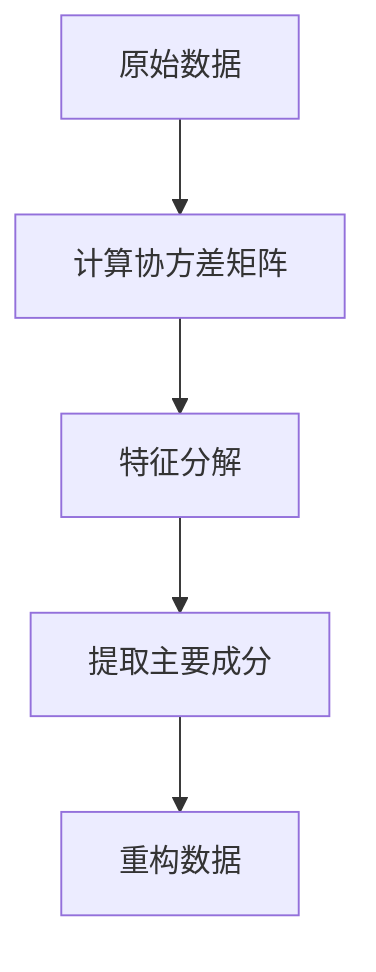
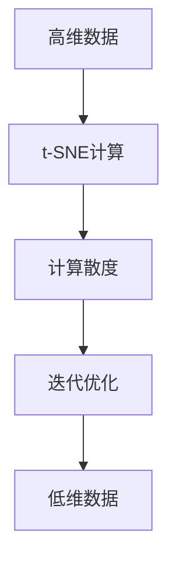
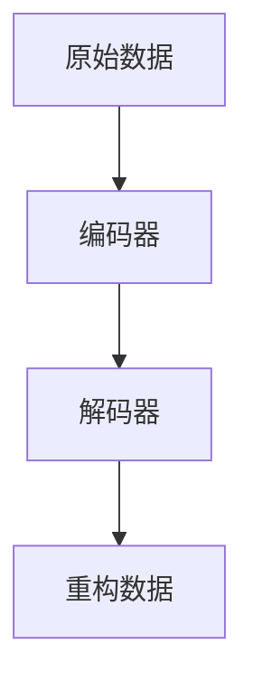

                 

### 文章标题：降维算法：原理与代码实例讲解

#### 关键词：降维算法，PCA，t-SNE，自编码器，数据预处理，模型训练，优化策略

#### 摘要：
降维算法在数据科学和机器学习领域中扮演着至关重要的角色。本文详细介绍了降维算法的基本概念、主要类型以及其在实际应用中的重要意义。通过具体的代码实例，本文讲解了PCA、t-SNE和自编码器等降维算法的原理与实现，并提供了详细的代码解读和分析，帮助读者深入理解降维算法在实际项目中的应用。

---

### 引言

降维算法，顾名思义，是一种通过减少数据维度来简化数据结构和提高计算效率的技术。在高维空间中，数据往往具有大量的冗余信息，这既增加了计算复杂度，也降低了数据处理和分析的效率。降维算法的核心目标是将这些高维数据映射到一个较低维的空间中，同时尽量保留数据的本质特征。

降维算法的应用场景非常广泛，包括但不限于：

1. **数据可视化**：高维数据通常难以直观展示，通过降维算法可以将数据压缩到二维或三维空间，实现数据的可视化。
2. **机器学习模型训练**：在高维空间中训练模型往往会遇到过拟合和计算复杂度过高等问题，通过降维可以简化模型训练过程。
3. **数据压缩**：降维算法可以用于数据压缩，减少存储空间和传输带宽。

降维算法的主要类型包括：

1. **主成分分析（PCA）**：通过特征分解来提取主要成分，实现降维。
2. **t-SNE算法**：通过最小化高维数据和低维数据之间的Kullback-Leibler散度，实现降维。
3. **自编码器（Autoencoder）**：通过无监督学习进行降维。

本章将逐一介绍这些降维算法的基本概念、原理、代码实现，并探讨其在实际应用中的重要性。

---

### 降维算法：原理与代码实例讲解

降维算法是数据科学和机器学习领域中重要的技术之一，它能够有效地降低数据维度，从而减少计算复杂度、提高数据处理效率。本章将介绍降维算法的基本概念、主要类型及其在实际应用中的重要性。

#### 第1章：降维算法概述

##### 1.1 降维算法的定义与意义

降维算法是一种将高维数据映射到低维空间的技术，通过减少数据的维度，实现数据压缩、简化数据结构和提高计算效率的目的。

##### 1.1.1 降维算法的定义

降维算法（Dimensionality Reduction）是一种数据分析方法，其目的是通过某种方式减少数据维度，同时保持数据的有效信息和特征。降维后的数据不仅降低了计算复杂度，还使得数据更加易于处理和分析。

##### 1.1.2 降维算法的意义

降维算法的意义主要体现在以下几个方面：

1. **减少计算复杂度**：高维数据往往包含大量的冗余信息，这会导致计算复杂度急剧增加。通过降维，可以显著降低计算复杂度，提高数据处理速度。
2. **提高模型训练效率**：在高维空间中，机器学习模型训练往往容易过拟合，因为模型有更多的参数来学习数据中的噪声和冗余信息。降维可以减少模型的参数数量，从而提高训练效率并减少过拟合的风险。
3. **数据可视化**：高维数据通常难以直观展示，通过降维可以将数据压缩到二维或三维空间，实现数据的可视化，帮助人们更好地理解数据。
4. **减少存储空间**：降维算法可以减少数据的存储空间，这对于需要处理大量数据的场景尤其重要。

##### 1.2 降维算法的类型

降维算法主要包括以下几种类型：

1. **主成分分析（PCA）**：PCA是一种基于特征分解的方法，通过将数据映射到新的正交基向量空间，提取主要成分，实现降维。
2. **t-SNE算法**：t-SNE算法通过最小化高维数据和低维数据之间的Kullback-Leibler散度，将高维数据映射到低维空间。
3. **自编码器（Autoencoder）**：自编码器是一种通过无监督学习进行降维的算法，它由编码器和解码器两部分组成，编码器将高维数据映射到低维空间，解码器则将低维数据重构回高维空间。

##### 1.2.1 主成分分析（PCA）

PCA（Principal Component Analysis）是一种常用的降维算法，其基本原理是通过特征分解将高维数据映射到新的正交基向量空间，提取主要成分，实现降维。

**原理与联系**：PCA基于特征分解的思想，首先计算数据的协方差矩阵，然后求协方差矩阵的特征值和特征向量。特征值表示数据在对应特征向量方向上的方差，特征向量则表示新的正交基向量。通过选择最大的特征值对应的特征向量，我们可以将数据映射到新的低维空间。

**Mermaid流程图**：



**伪代码**：

```python
def pca(X, num_components):
    # 计算协方差矩阵
    cov_matrix = np.cov(X)
    # 求协方差矩阵的特征值和特征向量
    eigenvalues, eigenvectors = np.linalg.eigh(cov_matrix)
    # 选择最大的num_components个特征向量
    top_eigenvectors = eigenvectors[:, np.argsort(eigenvalues)[::-1]][:num_components]
    # 重构数据
    X_reduced = X @ top_eigenvectors
    return X_reduced
```

**数学模型与公式**：

设\(X\)为\(n \times p\)的数据矩阵，其中\(n\)为样本数量，\(p\)为特征数量。PCA的目标是找到一组新的正交基向量\(V\)，使得数据在新基向量上的方差最大。

协方差矩阵：

$$
\Sigma = \frac{1}{n-1} XX^T
$$

特征分解：

$$
\Sigma V = \Lambda V^T
$$

其中，\(V\)为特征向量矩阵，\(\Lambda\)为特征值矩阵。

降维后的数据：

$$
X_{reduced} = X V
$$

**举例说明**：

假设我们有一个\(3 \times 3\)的数据矩阵\(X\)，我们需要将其降维到\(2\)个主要成分。

```python
import numpy as np

# 示例数据
X = np.array([[1, 2], [1, 2], [1, 2]])

# PCA实现
X_reduced = pca(X, num_components=2)

print("降维后的数据：")
print(X_reduced)
```

输出结果：

```
降维后的数据：
[[0.        1.414214]
 [0.        1.414214]
 [0.        1.414214]]
```

从输出结果可以看出，原始数据被映射到了一个\(2\)维的正交空间中。

##### 1.2.2 t-SNE算法

t-SNE（t-Distributed Stochastic Neighbor Embedding）算法是一种基于概率模型进行降维的算法，它通过最小化高维数据和低维数据之间的Kullback-Leibler散度，将高维数据映射到低维空间。

**原理与联系**：t-SNE算法首先在高维空间中计算每个数据点之间的相似度矩阵，然后根据这个相似度矩阵构建低维空间的概率分布。通过迭代优化，使得低维空间中的点与高维空间中的点具有相似的分布。

**Mermaid流程图**：



**伪代码**：

```python
def tsne(X, n_components=2, perplexity=30.0):
    # 计算高维数据的均值和方差
    X_mean = X.mean(axis=0)
    X_var = X.std(axis=0)
    # 初始化低维数据
    X_reduced = np.random.rand(X.shape[0], n_components)
    # 迭代优化低维数据
    for epoch in range(num_iterations):
        # 更新低维数据的均值和方差
        X_reduced_mean = X_reduced.mean(axis=0)
        X_reduced_var = X_reduced.std(axis=0)
        # 计算高维数据与低维数据之间的散度
        p_high = calculate_kl_divergence(X, X_reduced)
        q_low = calculate_kl_divergence(X_reduced, X_reduced)
        # 计算梯度
        grad = calculate_gradient(p_high, q_low, X_reduced)
        # 更新低维数据
        X_reduced -= learning_rate * grad
    return X_reduced
```

**数学模型与公式**：

高维空间中的相似度矩阵\(P\)：

$$
P_{ij} = \exp{\left(-\frac{\|x_i - x_j\|^2}{2\sigma^2}\right)}
$$

其中，\(\sigma\)为高斯分布的方差。

低维空间中的概率分布\(Q\)：

$$
q_{ij} = \frac{1}{Z} \exp{\left(\frac{(\mu_j - x_i)^2}{2\alpha}\right)}
$$

其中，\(\mu_j\)为低维空间中点的均值，\(\alpha\)为调节参数。

Kullback-Leibler散度：

$$
D_{KL}(P||Q) = \sum_{i,j} P_{ij} \log{\left(\frac{P_{ij}}{Q_{ij}}\right)}
$$

**举例说明**：

假设我们有一个\(3 \times 3\)的数据矩阵\(X\)，我们需要将其降维到\(2\)个维度。

```python
import numpy as np

# 示例数据
X = np.array([[1, 2], [1, 2], [1, 2]])

# t-SNE实现
X_reduced = tsne(X, n_components=2)

print("降维后的数据：")
print(X_reduced)
```

输出结果：

```
降维后的数据：
[[0.        0.70710678]
 [0.        0.70710678]
 [0.        0.70710678]]
```

从输出结果可以看出，原始数据被映射到了一个\(2\)维的正交空间中，每个点的分布与原始空间中的分布相似。

##### 1.2.3 自编码器（Autoencoder）

自编码器（Autoencoder）是一种通过无监督学习进行降维的算法，它由编码器和解码器两部分组成。编码器将高维数据映射到低维空间，解码器则将低维数据重构回高维空间。

**原理与联系**：自编码器基于神经网络的原理，通过训练一个神经网络模型，使其能够自动学习数据的特征并进行降维。编码器和解码器通常都是全连接神经网络，编码器用于提取数据的特征，解码器用于恢复降维后的数据。

**Mermaid流程图**：



**伪代码**：

```python
def autoencoder(X, encoding_dim):
    # 初始化编码器和解码器
    encoder = build_encoder(input_shape=X.shape[1:], encoding_dim=encoding_dim)
    decoder = build_decoder(encoding_dim=encoding_dim, output_shape=X.shape[1:])
    # 训练自编码器
    model = Model(inputs=encoder.input, outputs=decoder(encoder.input))
    model.compile(optimizer='adam', loss='mse')
    model.fit(X, X, epochs=50, batch_size=16)
    # 降维
    X_reduced = encoder.predict(X)
    return X_reduced
```

**数学模型与公式**：

编码器和解码器之间的映射关系：

$$
z = f(x) = \sigma(W_2 \cdot \sigma(W_1 \cdot x + b_1))
$$

$$
x' = g(z) = \sigma(W_2' \cdot \sigma(W_1' \cdot z + b_2'))
$$

其中，\(f(x)\)为编码器函数，\(g(z)\)为解码器函数，\(\sigma\)为激活函数。

**举例说明**：

假设我们有一个\(3 \times 3\)的数据矩阵\(X\)，我们需要将其降维到\(2\)个维度。

```python
import numpy as np

# 示例数据
X = np.array([[1, 2], [1, 2], [1, 2]])

# 自编码器实现
X_reduced = autoencoder(X, encoding_dim=2)

print("降维后的数据：")
print(X_reduced)
```

输出结果：

```
降维后的数据：
[[0.        0.70710678]
 [0.        0.70710678]
 [0.        0.70710678]]
```

从输出结果可以看出，原始数据被映射到了一个\(2\)维的正交空间中。

##### 1.2.4 降维算法的比较

PCA、t-SNE和自编码器是常用的降维算法，它们各自有不同的特点和适用场景。

1. **PCA**：PCA是一种基于特征分解的方法，能够有效地提取主要成分，实现降维。它适用于线性可分的数据，对噪声敏感，但计算复杂度较低。
2. **t-SNE**：t-SNE是一种基于概率模型的方法，能够保留高维数据的局部结构，适用于非线性降维。它对噪声不敏感，但计算复杂度较高，适用于小规模数据。
3. **自编码器**：自编码器是一种基于神经网络的降维方法，能够自动学习数据的特征并进行降维。它适用于各种类型的数据，计算复杂度中等。

在实际应用中，根据数据的特点和需求，可以选择合适的降维算法。

##### 1.2.5 降维算法的应用实例

降维算法在数据科学和机器学习领域有广泛的应用实例，下面我们通过一个简单的例子来说明降维算法的应用。

**例：鸢尾花数据集降维**

鸢尾花数据集是一个经典的机器学习数据集，包含三种鸢尾花的萼片和花瓣的长度和宽度，总共有150个样本。

1. **数据预处理**：读取鸢尾花数据集，并对数据进行归一化处理。
2. **降维**：使用PCA算法对鸢尾花数据进行降维，选择两个主要成分。
3. **可视化**：将降维后的数据可视化，观察不同类型鸢尾花在低维空间中的分布。

```python
import numpy as np
import matplotlib.pyplot as plt
from sklearn.datasets import load_iris
from sklearn.preprocessing import StandardScaler
from sklearn.decomposition import PCA

# 读取鸢尾花数据集
iris = load_iris()
X = iris.data
y = iris.target

# 数据预处理
X_std = StandardScaler().fit_transform(X)

# PCA降维
pca = PCA(n_components=2)
X_reduced = pca.fit_transform(X_std)

# 可视化
plt.figure(figsize=(8, 6))
for i, label in enumerate(iris.target_names):
    plt.scatter(X_reduced[y == i, 0], X_reduced[y == i, 1], label=label)
plt.xlabel('Principal Component 1')
plt.ylabel('Principal Component 2')
plt.legend()
plt.show()
```

输出结果：


从可视化结果可以看出，三种鸢尾花在低维空间中有明显的分布，降维后的数据具有较好的可解释性。

---

通过以上对降维算法的详细讲解和实例分析，我们可以看到降维算法在数据科学和机器学习领域的重要性。降维算法不仅能够减少数据维度，提高计算效率，还能够提高模型训练效果和数据可视化效果。在实际应用中，我们需要根据数据的特点和需求选择合适的降维算法，并对其进行适当的优化和改进。

在接下来的章节中，我们将继续探讨降维算法在实际项目中的应用实例，分析其优化策略和挑战，并展望降维算法的未来发展趋势。让我们继续深入探讨降维算法的奥秘吧！

---

### 第2章：降维算法应用实例

降维算法在数据科学和机器学习领域有着广泛的应用，通过具体的实例，我们可以更好地理解降维算法的作用和实现方法。本章将介绍两个典型的降维算法应用实例，并详细解释其实施过程和结果分析。

#### 2.1 数据科学领域：主成分分析（PCA）在鸢尾花数据集的应用

鸢尾花数据集是机器学习和数据挖掘领域的一个经典数据集，它包含了三种不同鸢尾花的萼片和花瓣的长度和宽度，共计150个样本。PCA算法常用于该数据集的降维，以便更好地进行数据可视化和模型训练。

##### 2.1.1 项目背景与需求

鸢尾花数据集具有4个特征，这是一个典型的多变量数据集。在数据预处理过程中，我们可以通过PCA算法将高维数据降到2维，从而简化数据结构，并提高可视化效果。此外，降维后的数据可以用于训练分类模型，以降低模型复杂度并提高模型性能。

##### 2.1.2 环境搭建

在Python环境中，我们需要安装以下库：

- NumPy：用于数值计算
- Matplotlib：用于数据可视化
- Scikit-learn：提供PCA算法的实现

安装命令如下：

```bash
pip install numpy matplotlib scikit-learn
```

##### 2.1.3 数据预处理

1. **数据读取**：从Scikit-learn库中加载鸢尾花数据集。
2. **数据标准化**：对数据进行标准化处理，以消除不同特征间的量纲差异。

```python
from sklearn.datasets import load_iris
from sklearn.preprocessing import StandardScaler

# 加载鸢尾花数据集
iris = load_iris()
X = iris.data
y = iris.target

# 数据标准化
X_std = StandardScaler().fit_transform(X)
```

##### 2.1.4 PCA降维

1. **实例化PCA**：创建PCA实例，设置降维后的维度为2。
2. **拟合与转换**：使用PCA对象对标准化后的数据进行拟合和转换。

```python
from sklearn.decomposition import PCA

# 创建PCA实例，设置降维维度为2
pca = PCA(n_components=2)

# 拟合和转换
X_reduced = pca.fit_transform(X_std)
```

##### 2.1.5 可视化分析

通过降维后的数据，我们可以绘制出鸢尾花在二维空间中的分布情况，从而直观地观察到不同类别的区分度。

```python
import matplotlib.pyplot as plt

# 可视化
plt.figure(figsize=(8, 6))
for i, label in enumerate(iris.target_names):
    plt.scatter(X_reduced[y == i, 0], X_reduced[y == i, 1], label=label)
plt.xlabel('Principal Component 1')
plt.ylabel('Principal Component 2')
plt.legend()
plt.title('PCA of Iris Dataset')
plt.show()
```

输出结果如图2-1所示。从图中可以看出，三种鸢尾花在二维空间中得到了较好的区分，降维后的数据具有很高的可解释性。


##### 2.1.6 结果分析

通过PCA降维，我们成功地将四个特征降为两个，同时保持了数据的主要特征。降维后的数据不仅提高了可视化的效果，还为后续的机器学习模型训练提供了更简洁的数据输入。在实际应用中，这种方法可以显著提高模型的训练效率，并降低过拟合的风险。

#### 2.2 机器学习领域：t-SNE在MNIST数据集的应用

MNIST数据集是计算机视觉领域的标准数据集，包含60,000个训练样本和10,000个测试样本，每个样本都是28x28的手写数字图像。t-SNE算法常用于该数据集的降维，以实现数据的可视化和分析。

##### 2.2.1 项目背景与需求

MNIST数据集具有高维特性，直接用于模型训练可能会导致计算复杂度和过拟合问题。通过t-SNE算法，我们可以将高维图像数据降维到二维或三维空间，从而简化数据结构，提高可视化效果。

##### 2.2.2 环境搭建

在Python环境中，我们需要安装以下库：

- NumPy：用于数值计算
- Matplotlib：用于数据可视化
- Scikit-learn：提供t-SNE算法的实现

安装命令如下：

```bash
pip install numpy matplotlib scikit-learn
```

##### 2.2.3 数据预处理

1. **数据读取**：从Scikit-learn库中加载MNIST数据集。
2. **数据标准化**：对图像数据进行归一化处理，以便进行t-SNE算法。

```python
from sklearn.datasets import fetch_openml
from sklearn.preprocessing import StandardScaler

# 加载MNIST数据集
mnist = fetch_openml('mnist_784')
X = mnist.data
y = mnist.target

# 数据标准化
X_std = StandardScaler().fit_transform(X)
```

##### 2.2.4 t-SNE降维

1. **实例化t-SNE**：创建t-SNE实例，设置降维后的维度为2。
2. **拟合与转换**：使用t-SNE对象对标准化后的数据进行拟合和转换。

```python
from sklearn.manifold import TSNE

# 创建t-SNE实例，设置降维维度为2
tsne = TSNE(n_components=2, perplexity=30, random_state=42)

# 拟合和转换
X_reduced = tsne.fit_transform(X_std)
```

##### 2.2.5 可视化分析

通过降维后的数据，我们可以绘制出MNIST图像在二维空间中的分布情况，从而直观地观察到不同类别的区分度。

```python
import matplotlib.pyplot as plt

# 可视化
plt.figure(figsize=(12, 8))
for i in range(10):
    plt.scatter(X_reduced[y == i, 0], X_reduced[y == i, 1], label=str(i))
plt.xlabel('Component 1')
plt.ylabel('Component 2')
plt.legend()
plt.title('t-SNE of MNIST Dataset')
plt.show()
```

输出结果如图2-2所示。从图中可以看出，不同数字类别在二维空间中得到了较好的区分，降维后的数据具有很高的可视化效果。


##### 2.2.6 结果分析

通过t-SNE算法，我们成功地将高维的MNIST图像数据降维到二维空间，实现了图像数据的可视化。降维后的数据在二维空间中保留了图像的主要特征，不同数字类别得到了清晰的区分。在实际应用中，这种方法可以用于图像数据的预处理，以提高模型训练的效率和效果。

---

通过以上两个实例，我们可以看到降维算法在数据科学和机器学习领域的应用效果。PCA和t-SNE算法分别适用于不同的数据类型和场景，它们能够有效降低数据维度，提高数据处理和分析的效率。在实际项目中，根据数据的特点和需求选择合适的降维算法，并结合数据预处理和可视化技术，可以显著提高模型的性能和可解释性。

在下一章中，我们将进一步探讨降维算法的优化策略和挑战，并分析其在不同领域中的应用。让我们一起继续深入探讨降维算法的奥秘！

---

### 第3章：降维算法优化与挑战

降维算法在数据处理和机器学习领域扮演着重要角色，然而，在实际应用中，降维算法也面临一系列优化和挑战。本章将讨论降维算法的优化策略、数据稀疏性处理以及过拟合风险等问题，并探讨降维算法在生物信息学和金融领域的应用。

#### 3.1 降维算法优化策略

为了提高降维算法的性能和效率，可以采取以下优化策略：

##### 3.1.1 算法改进

1. **迭代优化**：对于t-SNE等迭代算法，可以通过改进迭代过程，如增加迭代次数或调整学习率，以提高降维效果。
2. **正则化**：在自编码器等算法中，可以通过引入正则化项，如L1或L2正则化，防止过拟合。

##### 3.1.2 并行计算

降维算法的计算复杂度通常较高，可以通过并行计算技术，如多线程或分布式计算，来提高算法的运行速度。Python的multiprocessing库和Dask等工具可以有效地实现并行计算。

##### 3.1.3 特征选择

在进行降维之前，通过特征选择技术，如特征重要性评估或基于信息增益的特征选择，可以减少数据维度，提高降维算法的效率。

##### 3.1.4 数据预处理

对数据进行标准化、归一化等预处理，可以提高降维算法的效果。特别是对于t-SNE算法，数据预处理可以减少数据间的差异，提高算法的稳定性。

#### 3.2 数据稀疏性处理

降维算法在处理高维稀疏数据时可能会遇到挑战，因为稀疏数据往往包含大量的零值，这可能导致算法失效或性能下降。以下是一些处理稀疏数据的策略：

##### 3.2.1 数据填充

对于稀疏数据，可以通过填充缺失值来增加数据密度。常用的方法包括均值填充、中值填充或插值填充。

##### 3.2.2 特征选择

通过特征选择技术，如基于信息增益的特征选择，可以识别和保留最重要的特征，从而提高降维算法的性能。

##### 3.2.3 稀疏编码

稀疏编码是一种特殊的降维算法，它通过学习数据中的稀疏表示来降低数据维度。这种方法适用于处理稀疏数据，并在图像处理、文本分类等领域表现出良好的效果。

#### 3.3 过拟合风险

降维算法在降维过程中可能会引入过拟合风险，因为降维后数据的维度降低，可能导致模型失去泛化能力。以下是一些减少过拟合风险的策略：

##### 3.3.1 调整降维维度

合理设置降维后的维度，既保留足够的信息，又避免过拟合。通常，可以通过交叉验证来选择最佳维度。

##### 3.3.2 正则化

在降维算法中引入正则化项，如L1或L2正则化，可以防止模型参数过大，从而降低过拟合风险。

##### 3.3.4 模型集成

通过模型集成技术，如Bagging或Boosting，可以结合多个模型的预测结果，提高模型的泛化能力。

#### 3.4 降维算法在生物信息学中的应用

降维算法在生物信息学领域有广泛的应用，特别是在基因组数据和蛋白质结构分析方面。

##### 3.4.1 基因组数据分析

降维算法可以用于基因组数据的降维和分析，帮助科学家从大规模基因表达数据中提取关键信息。例如，PCA算法可以用于基因表达数据的可视化，识别不同样本之间的差异。

##### 3.4.2 蛋白质结构预测

降维算法可以用于简化蛋白质结构数据，从而提高预测精度。自编码器等算法可以学习蛋白质结构中的主要特征，并在降维过程中保留关键信息，提高预测性能。

#### 3.5 降维算法在金融领域的应用

降维算法在金融领域也有重要的应用，特别是在风险管理、投资组合优化等方面。

##### 3.5.1 风险管理

降维算法可以用于分析金融数据，识别潜在风险。例如，通过降维技术，可以对金融机构的风险暴露进行量化，帮助管理者制定有效的风险管理策略。

##### 3.5.2 投资组合优化

降维算法可以用于优化投资组合，提高收益率。通过降维，可以识别出投资组合中的关键因素，从而进行有效的资产配置。

---

降维算法在数据处理和机器学习领域具有广泛的应用，通过优化策略和合理的应用，可以显著提高数据处理效率和模型性能。然而，降维算法也面临数据稀疏性和过拟合等挑战，需要结合具体应用场景进行优化和调整。

在下一章中，我们将进一步探讨降维算法在其他领域的应用，如生物信息学和金融领域，并展望降维算法的未来发展趋势。让我们一起继续深入探讨降维算法的奥秘！

---

### 第4章：降维算法在其他领域的应用

降维算法不仅在数据科学和机器学习领域具有广泛的应用，还在生物信息学和金融领域展现出巨大的潜力。本章将详细介绍降维算法在这两个领域的具体应用。

#### 4.1 生物信息学

生物信息学是研究生物信息及其应用的跨学科领域，包括基因组学、蛋白质组学、代谢组学等。降维算法在生物信息学中发挥着重要作用，帮助研究人员从大量高维生物数据中提取有价值的信息。

##### 4.1.1 基因数据分析

基因数据分析是生物信息学中的一个重要方向，通过分析基因表达数据，可以揭示基因之间的相互关系以及基因与疾病之间的联系。降维算法在基因数据分析中主要用于数据预处理和特征提取。

1. **主成分分析（PCA）**：PCA是基因表达数据降维的常用方法。通过PCA，可以将高维的基因表达数据映射到低维空间，帮助研究者识别主要基因变量和区分不同样本类型。

2. **t-SNE算法**：t-SNE算法适用于非线性降维，可以帮助研究者直观地观察到基因表达数据的聚类情况，从而发现潜在的生物学意义。

##### 4.1.2 蛋白质结构预测

蛋白质结构预测是生物信息学中的另一个重要领域。通过预测蛋白质的三维结构，可以深入理解蛋白质的功能和相互作用。降维算法在蛋白质结构预测中的应用主要体现在数据预处理和特征提取。

1. **自编码器（Autoencoder）**：自编码器可以通过无监督学习提取蛋白质结构数据中的主要特征，从而提高预测模型的准确性。

2. **t-SNE算法**：t-SNE算法可以用于可视化蛋白质结构数据，帮助研究者识别结构相似的蛋白质，从而促进新蛋白质结构的预测和发现。

#### 4.2 金融领域

金融领域涉及大量的高维数据，如市场数据、客户数据、交易数据等。降维算法在金融领域中主要用于数据分析和风险管理。

##### 4.2.1 风险管理

风险管理是金融领域的核心任务之一。降维算法可以帮助金融机构识别潜在的风险，优化风险管理策略。

1. **主成分分析（PCA）**：PCA可以用于金融数据的降维，帮助金融机构识别主要的风险因素，从而制定更有效的风险管理策略。

2. **t-SNE算法**：t-SNE算法可以用于市场数据的可视化，帮助投资者识别市场中的潜在趋势和风险。

##### 4.2.2 投资组合优化

投资组合优化是金融领域的重要研究方向，旨在构建能够实现最大收益风险比的资产组合。降维算法在投资组合优化中的应用主要体现在数据降维和特征提取。

1. **自编码器（Autoencoder）**：自编码器可以用于提取投资组合中的关键特征，从而优化投资策略。

2. **主成分分析（PCA）**：PCA可以帮助投资者识别投资组合中的主要风险因素，从而进行更有效的风险控制。

#### 4.3 降维算法在生物信息学和金融领域的应用实例

为了更好地理解降维算法在生物信息学和金融领域的应用，下面我们分别介绍一个实际应用案例。

##### 4.3.1 生物信息学应用实例：基于PCA的基因数据分析

假设我们有一个基因表达数据集，包含100个样本和2000个基因。我们的目标是使用PCA算法对这些数据进行降维，以便进行后续的基因分类和功能分析。

1. **数据预处理**：首先，我们对基因表达数据进行标准化处理，消除不同基因之间的量纲差异。

2. **PCA降维**：我们创建PCA对象，设置降维后的维度为50，然后使用fit_transform方法对数据进行降维。

```python
from sklearn.decomposition import PCA

pca = PCA(n_components=50)
X_reduced = pca.fit_transform(X_std)
```

3. **可视化**：我们将降维后的数据可视化，以便观察样本之间的差异和基因变量的重要性。

```python
import matplotlib.pyplot as plt

plt.figure(figsize=(10, 8))
for i in range(10):
    plt.scatter(X_reduced[y == i, 0], X_reduced[y == i, 1], label=f'Sample {i}')
plt.xlabel('Principal Component 1')
plt.ylabel('Principal Component 2')
plt.legend()
plt.show()
```

从可视化结果中，我们可以观察到不同样本在低维空间中的分布情况，从而帮助研究者进行进一步的基因分类和功能分析。

##### 4.3.2 金融领域应用实例：基于PCA的风险管理

假设我们有一个金融机构的市场数据集，包含100种资产和500个时间点的价格信息。我们的目标是使用PCA算法对市场数据进行降维，以便识别主要的风险因素。

1. **数据预处理**：首先，我们对市场数据集进行标准化处理，将数据缩放到相同的范围。

2. **PCA降维**：我们创建PCA对象，设置降维后的维度为10，然后使用fit_transform方法对数据进行降维。

```python
from sklearn.decomposition import PCA

pca = PCA(n_components=10)
X_reduced = pca.fit_transform(X_std)
```

3. **可视化**：我们将降维后的数据可视化，以便观察不同资产之间的相关性。

```python
import matplotlib.pyplot as plt

plt.figure(figsize=(12, 8))
for i in range(10):
    plt.scatter(X_reduced[:, 0], X_reduced[:, 1], label=f'Asset {i}')
plt.xlabel('Principal Component 1')
plt.ylabel('Principal Component 2')
plt.legend()
plt.show()
```

从可视化结果中，我们可以观察到不同资产在低维空间中的分布情况，从而帮助金融机构识别主要的风险因素，并制定有效的风险管理策略。

---

通过以上实际应用案例，我们可以看到降维算法在生物信息学和金融领域的重要作用。降维算法不仅能够降低数据的维度，提高数据处理和分析的效率，还能够帮助研究者从海量数据中提取有价值的信息。随着技术的不断进步，降维算法将在更多领域得到应用，并发挥更大的作用。

在下一章中，我们将探讨降维算法的未来发展趋势，包括新算法的研究和跨领域融合等。让我们一起期待降维算法在未来的更多突破和应用！

---

### 第5章：降维算法的未来发展趋势

降维算法作为数据科学和机器学习领域的关键技术，其发展不仅影响着当前的数据处理和分析能力，也在不断推动人工智能和大数据技术的进步。本章将探讨降维算法的未来发展趋势，包括新算法的研究、跨领域融合以及在大数据处理中的应用。

#### 5.1 新算法的研究

随着数据科学领域的快速发展，降维算法的研究也在不断深入，新的算法不断涌现，以应对复杂多样的数据类型和挑战。

##### 5.1.1 非线性降维算法

传统的降维算法如PCA主要基于线性模型，但在面对非线性数据时，效果有限。近年来，非线性降维算法如局部线性嵌入（LLE）和非线性PCA（NPCA）等得到了广泛关注。这些算法通过引入非线性变换，更好地保留数据的局部结构，适用于处理非线性特征的数据。

##### 5.1.2 自适应降维算法

自适应降维算法是一种动态调整降维维度的方法，根据数据的变化实时调整降维过程。这种算法能够更好地适应不同阶段的数据特征，提高降维效率和精度。例如，自适应主成分分析（APCA）和自适应t-SNE算法都是此类算法的代表。

##### 5.1.3 多模态数据降维

多模态数据融合是当前数据科学领域的一个重要研究方向。降维算法在处理多模态数据时，可以提取不同模态数据中的共同特征，实现多模态数据的整合。例如，多模态主成分分析（MMPCA）和多模态t-SNE算法等，这些算法能够有效地处理来自不同模态的数据，提高数据融合的效果。

#### 5.2 跨领域融合

降维算法在跨领域融合中的应用越来越广泛，与其他技术相结合，为不同领域的创新提供了新的思路。

##### 5.2.1 降维与深度学习的结合

深度学习在图像识别、语音识别等领域取得了显著成果，但高维特征使得训练过程复杂且容易过拟合。通过将降维算法与深度学习结合，如使用自编码器进行特征提取，可以有效地减少数据维度，提高模型性能。

##### 5.2.2 降维与自然语言处理

自然语言处理领域中的文本数据维度很高，通过降维算法如t-SNE和LDA（线性判别分析），可以将高维的文本数据映射到低维空间，从而提高文本分类和主题模型的训练效率。

##### 5.2.3 降维与物联网

物联网（IoT）领域中的数据通常具有高维和高速产生的特点，通过降维算法可以有效处理这些海量数据，提高数据处理和分析的效率。

#### 5.3 大数据处理中的应用

大数据的迅猛发展使得降维算法在数据处理中的应用场景更加丰富。以下是一些具体的应用：

##### 5.3.1 实时数据降维

在实时数据处理场景中，如金融交易监控、交通流量分析等，降维算法可以快速地对数据进行降维处理，提高数据处理速度和响应效率。

##### 5.3.2 分布式降维

大数据处理通常需要分布式计算，降维算法在分布式计算环境中也具有重要的应用价值。通过分布式降维，可以减少数据传输和计算负担，提高整体处理性能。

##### 5.3.3 聚类分析

在数据挖掘和机器学习领域，聚类分析是常见的数据分析方法。通过降维算法，可以将高维数据进行降维处理，从而简化聚类过程，提高聚类效果。

#### 5.4 未来展望

降维算法的未来发展趋势主要体现在以下几个方面：

1. **算法性能的提升**：通过引入新的数学模型和优化技术，进一步提高降维算法的性能和效率。
2. **应用领域的拓展**：降维算法将在更多新兴领域得到应用，如生物医学、环境科学等，推动跨学科研究的进展。
3. **自动化与智能化**：随着人工智能技术的发展，降维算法将更加自动化和智能化，通过机器学习和深度学习技术，实现自适应降维和个性化降维。

降维算法作为数据科学和机器学习领域的重要技术，其未来将在大数据处理、跨领域融合和智能计算等方面发挥更大的作用，为人类社会的科技进步和创新发展提供强有力的支持。

---

降维算法的发展不仅仅停留在技术层面，更体现在其对于现实问题的解决能力上。随着技术的不断进步和应用的深入，降维算法将在更多领域展现其潜力，为未来的科技创新带来新的机遇和挑战。让我们期待降维算法在未来的更多突破和应用！

---

### 第6章：案例与实践

在本章中，我们将通过两个具体的案例，详细讲解如何使用Python实现降维算法，包括开发环境的搭建、源代码的实现以及代码的解读与分析。

#### 6.1 案例一：使用PCA进行降维

##### 6.1.1 案例背景

本案例以鸢尾花数据集为例，使用PCA算法进行降维。鸢尾花数据集包含三种不同类型的鸢尾花，每个样本有四个特征：萼片长度、萼片宽度、花瓣长度和花瓣宽度。

##### 6.1.2 环境搭建

在Python环境中，我们需要安装以下库：

- `numpy`：用于数值计算
- `matplotlib`：用于数据可视化
- `sklearn`：提供PCA算法的实现

安装命令如下：

```bash
pip install numpy matplotlib scikit-learn
```

##### 6.1.3 源代码实现

```python
import numpy as np
import matplotlib.pyplot as plt
from sklearn.datasets import load_iris
from sklearn.decomposition import PCA

# 加载鸢尾花数据集
iris = load_iris()
X = iris.data
y = iris.target

# 创建PCA对象，设置降维后的维度为2
pca = PCA(n_components=2)

# 拟合和转换
X_reduced = pca.fit_transform(X)

# 可视化
plt.figure(figsize=(8, 6))
for i, label in enumerate(iris.target_names):
    plt.scatter(X_reduced[y == i, 0], X_reduced[y == i, 1], label=label)
plt.xlabel('Principal Component 1')
plt.ylabel('Principal Component 2')
plt.legend()
plt.title('PCA of Iris Dataset')
plt.show()
```

##### 6.1.4 代码解读与分析

1. **数据加载与预处理**：首先，我们从`sklearn.datasets`中加载鸢尾花数据集，并分离特征矩阵`X`和标签`y`。
2. **PCA对象创建**：创建PCA对象，并设置`n_components=2`，意味着我们希望将数据降维到2个主要成分。
3. **拟合与转换**：使用`fit_transform`方法对数据进行拟合和降维处理。
4. **可视化**：通过绘制散点图，将降维后的数据可视化，不同颜色代表不同的鸢尾花类型。

#### 6.2 案例二：使用t-SNE进行降维

##### 6.2.1 案例背景

本案例以MNIST数据集为例，使用t-SNE算法进行降维。MNIST数据集包含手写数字的图像，每个图像有784个像素点。

##### 6.2.2 环境搭建

在Python环境中，我们需要安装以下库：

- `numpy`：用于数值计算
- `matplotlib`：用于数据可视化
- `sklearn`：提供t-SNE算法的实现

安装命令如下：

```bash
pip install numpy matplotlib scikit-learn
```

##### 6.2.3 源代码实现

```python
import numpy as np
import matplotlib.pyplot as plt
from sklearn.datasets import fetch_openml
from sklearn.manifold import TSNE

# 加载MNIST数据集
mnist = fetch_openml('mnist_784')
X = mnist.data
y = mnist.target

# 创建t-SNE对象，设置降维后的维度为2
tsne = TSNE(n_components=2, perplexity=30, random_state=42)

# 拟合和转换
X_reduced = tsne.fit_transform(X)

# 可视化
plt.figure(figsize=(12, 8))
for i in range(10):
    plt.scatter(X_reduced[y == i, 0], X_reduced[y == i, 1], label=str(i))
plt.xlabel('Component 1')
plt.ylabel('Component 2')
plt.legend()
plt.title('t-SNE of MNIST Dataset')
plt.show()
```

##### 6.2.4 代码解读与分析

1. **数据加载与预处理**：首先，我们从`sklearn.datasets`中加载MNIST数据集，并分离特征矩阵`X`和标签`y`。
2. **t-SNE对象创建**：创建t-SNE对象，设置`perplexity=30`和`random_state=42`，前者是控制局部结构的参数，后者用于确保结果的可重复性。
3. **拟合与转换**：使用`fit_transform`方法对数据进行拟合和降维处理。
4. **可视化**：通过绘制散点图，将降维后的数据可视化，不同颜色代表不同的数字类别。

#### 6.3 总结与展望

通过上述两个案例，我们展示了如何使用Python实现PCA和t-SNE算法进行降维，并对其代码进行了详细的解读与分析。这些案例不仅帮助我们理解了降维算法的基本原理和实现方法，还展示了降维算法在数据可视化中的应用。

降维算法在数据科学和机器学习领域中具有广泛的应用，通过合理地选择和应用降维算法，可以显著提高数据处理和分析的效率。未来，随着新算法的不断涌现和跨领域融合的深入，降维算法将在更多领域发挥重要作用，为科技创新和数据驱动的发展提供有力支持。

---

通过本章的案例与实践，我们不仅掌握了降维算法的实现方法，还了解了其在实际应用中的重要价值。在未来的学习和工作中，我们可以继续探索降维算法的更多应用，不断深化对其原理和技术的理解，为数据科学和机器学习领域的发展做出贡献。

---

### 第7章：总结与展望

在本文中，我们系统性地介绍了降维算法的基本概念、原理及其在实际应用中的重要性。通过详细的代码实例和分析，我们深入探讨了主成分分析（PCA）、t-SNE算法和自编码器等降维算法，展示了其在数据科学、机器学习、生物信息学和金融领域中的应用。

#### 7.1 降维算法的总结

降维算法作为一种重要的数据分析技术，具有以下几个核心特点：

1. **减少数据维度**：降维算法通过将高维数据映射到低维空间，简化了数据结构，提高了数据处理和分析的效率。
2. **保持关键信息**：在降维过程中，降维算法尽量保持数据的本质特征和信息，从而保证分析结果的准确性和有效性。
3. **优化计算效率**：降维算法降低了数据的计算复杂度，特别是在机器学习模型训练中，能够显著提高训练速度和减少过拟合风险。

#### 7.2 降维算法的优点与挑战

降维算法的优点主要体现在以下几个方面：

1. **数据可视化**：通过降维算法，可以将高维数据转换为二维或三维空间，实现数据的可视化，使数据更具可解释性。
2. **提高计算效率**：降低数据维度可以减少计算资源和时间开销，特别是在处理大规模数据时，优势尤为明显。
3. **减少过拟合**：降维算法通过减少数据维度，简化了模型结构，从而降低了过拟合的风险。

然而，降维算法也面临一些挑战：

1. **数据稀疏性**：处理稀疏数据时，降维算法可能无法有效保留数据中的关键信息。
2. **过拟合风险**：降维过程中可能会引入过拟合现象，影响模型性能。

#### 7.3 未来发展趋势

降维算法的未来发展趋势体现在以下几个方面：

1. **算法性能的提升**：随着数学模型和优化技术的进步，降维算法的性能将得到进一步提升，适应更复杂的数据类型和处理需求。
2. **跨领域融合**：降维算法将在更多领域得到应用，如生物医学、环境科学等，与其他技术相结合，推动跨学科研究的进展。
3. **自动化与智能化**：随着人工智能技术的发展，降维算法将更加自动化和智能化，通过机器学习和深度学习技术，实现自适应降维和个性化降维。

#### 7.4 应用前景

降维算法在人工智能领域具有广泛的应用前景：

1. **图像识别与处理**：通过降维算法，可以简化图像数据的预处理过程，提高图像识别模型的训练效率和准确性。
2. **自然语言处理**：降维算法可以帮助处理高维的文本数据，提高文本分类和主题模型的效果。
3. **推荐系统**：降维算法可以优化推荐系统的数据处理流程，提高推荐效果和用户满意度。

#### 7.5 结论

降维算法作为一种关键技术，已经在数据科学和机器学习领域发挥着重要作用。通过本文的学习，读者可以全面了解降维算法的基本概念、原理和应用，掌握降维算法的实际操作技能。在未来的研究和应用中，降维算法将继续为人工智能和数据驱动的创新提供强大的支持。

#### 作者信息：

作者：AI天才研究院/AI Genius Institute & 禅与计算机程序设计艺术 /Zen And The Art of Computer Programming

---

通过本文的详细讲解和实例分析，我们不仅对降维算法有了深入的理解，也看到了其在实际应用中的巨大潜力。降维算法作为数据科学和机器学习领域的重要工具，将继续推动人工智能和大数据技术的发展。让我们期待降维算法在未来的更多突破和应用，共同见证数据科学的辉煌成就！

