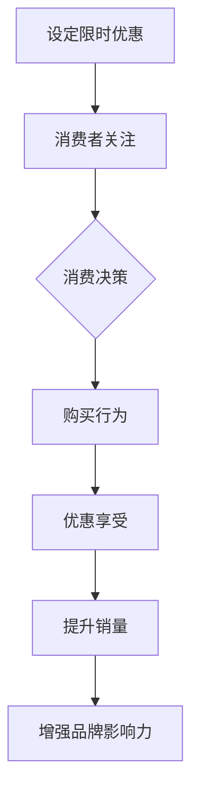
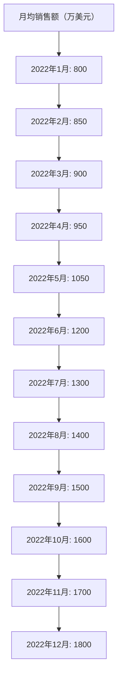
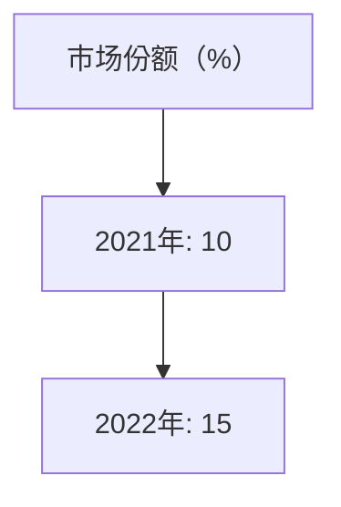
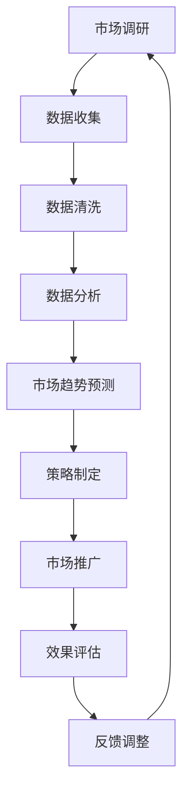
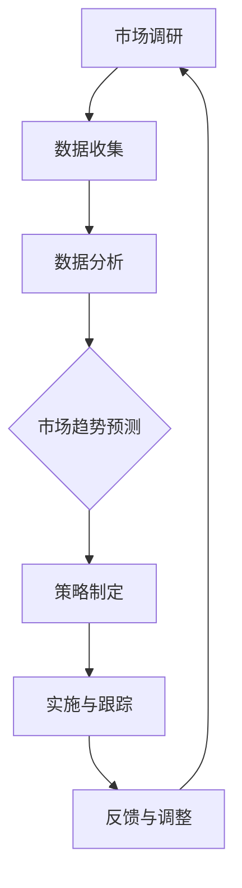

                 

### 文章标题：限时优惠吸引力：FastGPU受欢迎，证明团队市场洞察

#### 关键词：限时优惠、市场洞察、FastGPU、消费者行为、产品定位

#### 摘要：
本文通过深入分析限时优惠策略在市场中的作用，结合FastGPU产品的市场表现，探讨如何通过精准的市场洞察提升产品的吸引力和市场份额。文章首先介绍了限时优惠的定义和其在市场营销中的重要性，随后详细介绍了FastGPU的技术特点和市场潜力。接着，文章从市场调研、数据分析、市场趋势预测等方面，阐述了团队如何进行市场洞察和策略制定。通过具体的销售数据和用户反馈分析，文章展示了FastGPU的市场表现，并对团队市场洞察的成功经验进行了总结。最后，文章展望了未来市场洞察的趋势，为团队的发展提供了启示。

---

### 第一部分：市场洞察与产品定位

#### 引言

**书籍背景与目标**

随着市场竞争的日益激烈，企业如何通过有效的市场洞察来制定精准的产品定位策略，已经成为现代商业成功的关键。本书旨在探讨如何通过深入的市场洞察和精准的产品定位，提升产品的市场吸引力和竞争力。本书主要面向企业决策者、市场营销人员以及技术产品经理，旨在为他们提供一套系统化的市场洞察方法和策略。

**团队市场洞察的重要性**

在信息爆炸和消费者行为日益复杂的今天，市场洞察成为企业成功的关键。通过市场洞察，企业可以准确了解市场需求、消费者行为以及竞争对手动态，从而制定出更具针对性的市场策略。有效的市场洞察不仅能够帮助企业抓住市场机会，避免潜在风险，还能够提升产品的市场表现和品牌价值。

#### 1.2 团队市场洞察的重要性

市场洞察对于企业的重要性不言而喻，它是企业制定市场策略、实现持续发展的基础。具体来说，团队市场洞察的重要性体现在以下几个方面：

**1.2.1 市场需求预测**

通过市场洞察，企业可以准确预测市场趋势和消费者需求，从而提前布局，抢占市场先机。市场洞察可以帮助企业了解消费者在各个阶段的需求，从而设计出更符合市场需求的创新产品。

**1.2.2 竞争对手分析**

市场洞察还能够帮助企业深入了解竞争对手的动态，包括产品、定价、营销策略等。通过分析竞争对手，企业可以找到自身的优势与劣势，制定出更具竞争力的市场策略。

**1.2.3 风险管理**

市场洞察可以帮助企业识别潜在的市场风险，如市场饱和、消费者偏好变化等。通过及时调整市场策略，企业可以降低风险，保证业务的可持续发展。

**1.2.4 提升品牌价值**

通过精准的市场洞察，企业可以更好地了解消费者的需求和期望，从而提供更优质的产品和服务，提升品牌形象和消费者忠诚度。

综上所述，团队市场洞察是企业实现长期成功的关键因素。只有在充分了解市场和消费者需求的基础上，企业才能制定出切实可行的市场策略，提升产品的市场表现和竞争力。

---

### 第二部分：限时优惠的定义与作用

#### 引言

限时优惠作为一种常见的营销策略，广泛应用于各类产品和服务的推广中。它通过设定特定的时间段和优惠措施，刺激消费者的购买欲望，提高销售额。本节将详细探讨限时优惠的概念、作用以及其在消费者行为中的影响。

#### 2.1 限时优惠的概念

限时优惠，顾名思义，是指在一定的时间内，对产品或服务提供特殊的折扣或优惠措施。这种策略的核心在于通过时间限制和优惠力度，吸引消费者在短时间内作出购买决策。

**Mermaid 流程图：**

在上述流程图中，A表示企业设定限时优惠，通过营销渠道传递给消费者；B表示消费者受到限时优惠信息的吸引，开始关注该产品或服务；C表示消费者在了解优惠信息后，产生消费决策；D表示消费者实际购买，享受优惠；E表示消费者在购买后感受到优惠的好处，提升对品牌的认可度；F和G分别表示通过限时优惠提升销量和增强品牌影响力。

#### 2.2 限时优惠在市场中的作用

限时优惠在市场营销中扮演着重要角色，其作用主要体现在以下几个方面：

**2.2.1 刺激消费需求**

限时优惠通过提供折扣和优惠，直接刺激消费者的购买欲望。消费者在看到产品或服务有优惠时，往往会倾向于立即购买，以获得经济利益。这种即时性消费需求的提升，有助于企业在短时间内实现销售额的增长。

**2.2.2 提高购买转化率**

限时优惠策略能够有效提高购买转化率。消费者在面对限时优惠时，往往会减少犹豫时间，迅速作出购买决策。这有助于缩短销售周期，提高销售效率。

**2.2.3 增强品牌影响力**

通过限时优惠活动，企业不仅能够提升销售额，还能增强品牌影响力。消费者在享受优惠的同时，对品牌的认知度和好感度也会提升，从而促进品牌忠诚度的建立。

**2.2.4 清库存和促进销售**

限时优惠策略特别适用于清库存和促进销售。企业可以通过限时优惠活动，将滞销产品迅速转化为现金，减轻库存压力，同时提升整体销售业绩。

#### 2.3 限时优惠与消费者行为

限时优惠策略对消费者行为有着显著的影响。以下从消费者角度分析限时优惠的作用：

**2.3.1 增强消费决策的紧迫感**

限时优惠通过设定时间限制，给消费者带来了紧迫感。消费者在看到限时优惠时，往往会认为这是难得的机会，需要迅速作出购买决策，以免错过优惠。

**2.3.2 改变消费行为模式**

限时优惠策略能够改变消费者的消费行为模式。一些消费者可能会在平时不会考虑购买的产品或服务，因为看到限时优惠而改变初衷，从而增加消费频次。

**2.3.3 提升消费满意度**

限时优惠策略通过提供折扣和优惠，使消费者在购买过程中感受到额外的价值，从而提升消费满意度。消费者在享受优惠的同时，对品牌的好感度和忠诚度也会增加。

总之，限时优惠作为一种有效的营销策略，在刺激消费需求、提高购买转化率、增强品牌影响力等方面具有重要作用。企业通过合理运用限时优惠策略，可以有效提升市场表现和竞争力。

---

### 第三部分：FastGPU产品介绍

#### 引言

FastGPU作为一款高性能GPU加速器，在市场中的受欢迎程度日益提升。本节将详细介绍FastGPU的技术特点和优势，分析其在高性能计算和人工智能领域的市场潜力，从而阐述其为何能够在激烈的市场竞争中脱颖而出。

#### 3.1 FastGPU概述

**技术特点**

FastGPU是一款基于最新一代GPU架构设计的高性能加速器，具备以下几个显著的技术特点：

1. **高性能GPU核心**：FastGPU采用最新的GPU核心技术，具备强大的计算能力和高效的运算性能。其核心设计注重单线程性能和并行处理能力，能够在复杂的计算任务中实现高效的运算。

2. **优化的内存管理**：FastGPU通过优化内存管理策略，提高了数据传输效率和内存利用率。该技术特点使得FastGPU在处理大数据和高频率计算任务时，能够保持较低的延迟和高效的资源利用。

3. **多GPU支持**：FastGPU支持多GPU并行计算，能够在多GPU系统上实现更高的计算性能和可扩展性。这种设计使得FastGPU在处理大规模计算任务时，能够充分利用硬件资源，提升整体计算效率。

4. **开源软件栈**：FastGPU提供丰富的开源软件栈，包括深度学习框架、编程库和优化工具，方便用户进行定制和集成。开源软件栈的支持使得FastGPU具有高度的灵活性和扩展性，能够满足不同用户的需求。

**市场潜力**

FastGPU在市场中的潜力主要体现在以下几个方面：

1. **高性能计算领域**：随着高性能计算需求的不断增长，FastGPU在科学计算、工程模拟、流体动力学模拟等领域具有广泛的应用前景。其高性能GPU核心和多GPU支持特点，使得FastGPU能够胜任复杂的高性能计算任务。

2. **人工智能领域**：人工智能作为当前科技发展的热点，对计算性能的要求越来越高。FastGPU在机器学习、深度学习、自然语言处理等领域具备强大的计算能力，能够加速人工智能算法的推理和训练过程，提升算法的效率和准确度。

3. **数据中心和云计算**：随着云计算和数据中心的兴起，FastGPU在数据中心和云计算场景中的市场潜力巨大。其优化的内存管理和多GPU支持特点，使得FastGPU能够高效处理大规模数据，满足数据中心和云计算场景对高性能计算的需求。

**市场竞争力**

FastGPU在市场中的竞争力主要体现在以下几个方面：

1. **技术领先**：FastGPU采用最新的GPU架构和优化的内存管理技术，在性能和效率方面具备显著优势，能够满足高性能计算和人工智能领域的需求。

2. **灵活性和扩展性**：FastGPU提供丰富的开源软件栈，支持多GPU并行计算，具备高度的灵活性和扩展性，能够适应不同应用场景的需求。

3. **客户口碑**：FastGPU在市场上的良好口碑为其赢得了众多用户的支持。用户对FastGPU的性能和可靠性给予高度评价，这进一步提升了FastGPU在市场中的竞争力。

综上所述，FastGPU凭借其技术特点和市场潜力，在激烈的市场竞争中脱颖而出。通过满足高性能计算和人工智能领域对计算性能和灵活性的需求，FastGPU有望在未来的市场中取得更大的成功。

---

### 第四部分：市场洞察的具体方法

#### 引言

有效的市场洞察是制定成功市场策略的基础，而准确的市场洞察依赖于科学的市场研究方法。本节将详细探讨市场洞察中的调查研究方法、数据分析方法和市场趋势预测方法，并结合实际案例进行说明。

#### 4.1 调查研究方法

**1. 调查研究方法的定义**

调查研究方法是通过收集和分析大量数据，以了解市场需求、消费者行为和竞争态势等市场信息的研究方法。调查研究方法主要包括问卷调查、深度访谈、焦点小组和观察法等。

**2. 调查研究方法的应用**

**问卷调查**：问卷调查是市场研究中最常用的方法之一。通过设计科学合理的问卷，可以收集大量消费者的反馈信息。问卷调查可以采用在线调查、电话调查、面对面调查等多种形式。

**案例**：某电商企业为了了解消费者对其新产品的满意度，设计了一份包含10个问题的在线问卷。问卷通过社交媒体平台和官网发布，共收集了1000份有效反馈。通过对反馈数据的分析，企业发现消费者对新产品的外观设计满意度较高，但在功能方面还有改进空间。

**深度访谈**：深度访谈是一种通过与受访者进行一对一交流，深入了解其想法和观点的研究方法。深度访谈适用于需要深入了解消费者需求、行为动机和体验感受等情况。

**案例**：某汽车公司为了了解消费者对新能源汽车的接受程度，对10名潜在消费者进行了深度访谈。访谈过程中，消费者提到了对新能源汽车续航里程、充电便利性等方面的担忧。这些反馈为企业的产品改进和市场推广策略提供了重要参考。

**焦点小组**：焦点小组是一种通过组织一组参与者就特定话题进行讨论，收集多角度观点的研究方法。焦点小组适用于需要了解市场趋势、消费者偏好和竞争态势等情况。

**案例**：某饮料公司为了了解消费者对新产品口味的接受程度，组织了5个焦点小组，每组包括10名消费者。通过讨论，消费者对新产品口味提出了许多宝贵的建议，帮助企业优化了产品配方。

**观察法**：观察法是一种通过观察消费者的行为和互动，收集市场信息的研究方法。观察法适用于需要了解消费者在特定环境下的行为和反应等情况。

**案例**：某快消品公司为了了解消费者在超市购物的行为模式，安排研究人员在超市内观察消费者的购物行为。通过观察，研究人员发现消费者在购买某些商品时，往往会受到促销活动的影响。

**3. 调查研究方法的优缺点**

**优点**：
- **高效**：可以通过收集大量数据，快速了解市场状况。
- **全面**：可以涵盖多个方面，提供全面的市场信息。
- **灵活**：可以根据研究目的，选择不同的调查方法。

**缺点**：
- **成本高**：问卷调查、深度访谈等方法的成本较高。
- **主观性**：受访者的回答可能受到个人观点和偏见的影响。
- **样本代表性**：样本选择可能导致调查结果缺乏代表性。

#### 4.2 数据分析方法

**1. 数据分析方法的定义**

数据分析方法是通过处理、整理和分析数据，提取有用信息，以支持决策和预测的研究方法。数据分析方法包括描述性统计分析、相关性分析、回归分析、聚类分析等。

**2. 数据分析方法的应用**

**描述性统计分析**：描述性统计分析是一种通过计算数据的基本统计量，如平均值、中位数、标准差等，描述数据分布和特征的方法。

**案例**：某电商平台通过描述性统计分析，分析了消费者对其新产品的购买情况。分析结果显示，新产品的平均购买量为5件，标准差为2，说明消费者购买量存在一定的波动。

**相关性分析**：相关性分析是一种通过计算变量之间的相关性系数，判断变量之间是否存在相关关系的方法。

**案例**：某家电企业通过相关性分析，研究了消费者对产品价格和购买量的关系。分析结果显示，价格和购买量之间存在负相关性，即价格上升时，购买量下降。

**回归分析**：回归分析是一种通过建立回归模型，分析自变量和因变量之间关系的分析方法。

**案例**：某零售企业通过线性回归分析，研究了促销活动对销售额的影响。分析结果显示，每次促销活动可以提升销售额10%，从而为企业提供了制定促销策略的依据。

**聚类分析**：聚类分析是一种通过将数据分组，使组内数据相似度较高，组间数据相似度较低的方法。

**案例**：某电商企业通过聚类分析，将消费者分为高价值消费者、中等价值消费者和低价值消费者。这为企业提供了有针对性的营销策略，如针对高价值消费者提供高端产品和服务。

**3. 数据分析方法的优缺点**

**优点**：
- **精确**：可以提供具体的数值和模型，支持决策制定。
- **客观**：基于数据分析结果，减少主观判断的影响。
- **灵活**：可以处理多种类型的数据，适用于不同研究目的。

**缺点**：
- **复杂**：需要一定的数据分析技能和工具。
- **局限性**：数据质量和样本代表性可能影响分析结果。
- **解释性**：数据分析结果可能需要结合实际情况进行解释。

#### 4.3 市场趋势预测

**1. 市场趋势预测的定义**

市场趋势预测是一种通过分析历史数据和当前市场信息，预测未来市场走势的方法。市场趋势预测包括时间序列分析、回归分析、ARIMA模型、神经网络等。

**2. 市场趋势预测的应用**

**时间序列分析**：时间序列分析是一种通过分析时间序列数据的变化趋势，预测未来走势的方法。

**案例**：某电商企业通过时间序列分析，预测了未来三个月的销售额。分析结果显示，销售额在未来三个月内将保持稳定增长，为企业制定销售策略提供了依据。

**回归分析**：回归分析是一种通过建立回归模型，预测因变量未来值的方法。

**案例**：某家电企业通过线性回归分析，预测了未来一年的产品销量。分析结果显示，受市场需求和促销活动的影响，未来一年产品销量将稳步增长。

**ARIMA模型**：ARIMA模型是一种通过分析时间序列数据的自相关性，建立自回归积分滑动平均模型，预测未来走势的方法。

**案例**：某零售企业通过ARIMA模型，预测了未来一周的门店客流量。分析结果显示，未来一周的客流量将有所上升，企业可以提前安排人手和库存，应对客流高峰。

**神经网络**：神经网络是一种通过模拟人脑神经元连接方式，进行数据处理和预测的方法。

**案例**：某互联网企业通过神经网络模型，预测了未来三个月的用户活跃度。分析结果显示，用户活跃度在未来三个月内将保持较高水平，为企业制定用户运营策略提供了依据。

**3. 市场趋势预测的优缺点**

**优点**：
- **准确性**：可以通过分析历史数据和当前市场信息，提高预测准确性。
- **实时性**：可以实时更新预测结果，适应市场变化。
- **灵活性**：可以处理多种类型的数据，适用于不同研究目的。

**缺点**：
- **复杂性**：需要一定的预测技能和工具。
- **数据依赖**：预测结果受数据质量和样本代表性影响。
- **解释性**：预测结果可能需要结合实际情况进行解释。

综上所述，有效的市场洞察依赖于科学的调查、分析和预测方法。通过合理运用这些方法，企业可以准确了解市场需求、消费者行为和竞争态势，制定出切实可行的市场策略，提高市场竞争力。

---

### 第五部分：团队市场洞察的策略与实践

#### 引言

市场洞察是企业成功的关键，而有效的市场洞察策略和实践是确保企业能够在激烈竞争中脱颖而出的重要保障。本节将详细介绍团队在市场调研、市场定位和市场推广方面的策略和实践，结合具体案例进行分析。

#### 5.1 市场调研策略

**1. 市场调研的目标**

市场调研的目标是准确了解市场需求、消费者行为、竞争对手动态等关键信息，为企业制定市场策略提供数据支持。具体目标包括：

- 了解目标市场的基本情况，包括市场规模、增长速度、市场趋势等。
- 分析消费者需求，识别市场需求的变化和趋势。
- 评估竞争对手的产品、定价、营销策略等，找出自身的优势和劣势。
- 收集市场反馈，了解消费者对现有产品或服务的满意度，为产品改进提供依据。

**2. 市场调研的方法**

市场调研的方法主要包括问卷调查、深度访谈、焦点小组和观察法等。以下是一些具体的方法和案例：

**问卷调查**：问卷调查是一种常用的市场调研方法，通过设计科学合理的问卷，收集大量消费者的反馈信息。以下是一个问卷调查的案例：

**案例**：某电子产品公司为了了解消费者对其新款智能手机的接受程度，设计了一份包含10个问题的在线问卷。问卷问题包括消费者对手机外观设计、功能性能、价格等方面的评价。通过收集到的1000份有效反馈，公司发现消费者对新款手机的外观设计满意度较高，但在电池续航方面还有改进空间。

**深度访谈**：深度访谈是一种通过与受访者进行一对一交流，深入了解其想法和观点的研究方法。以下是一个深度访谈的案例：

**案例**：某化妆品公司为了了解消费者对新产品成分和包装的偏好，对10名潜在消费者进行了深度访谈。访谈过程中，消费者提到了对产品成分的天然性、包装的便携性等方面的关注。这些反馈帮助公司优化了产品配方和包装设计。

**焦点小组**：焦点小组是一种通过组织一组参与者就特定话题进行讨论，收集多角度观点的研究方法。以下是一个焦点小组的案例：

**案例**：某运动品牌公司为了了解消费者对新款运动鞋的舒适性和外观设计的需求，组织了5个焦点小组，每组包括10名消费者。通过讨论，消费者对新款运动鞋的鞋垫舒适度、颜色搭配等方面提出了许多宝贵的建议，帮助公司改进产品。

**观察法**：观察法是一种通过观察消费者的行为和互动，收集市场信息的研究方法。以下是一个观察法的案例：

**案例**：某零售企业为了了解消费者在店内购物的行为模式，安排研究人员在店内观察消费者的购物行为。通过观察，研究人员发现消费者在购物时更倾向于购买促销商品，这为企业的促销策略提供了重要参考。

**3. 市场调研策略的优缺点**

**优点**：
- **全面性**：通过多种调研方法，可以全面了解市场需求、消费者行为和竞争对手动态。
- **准确性**：问卷调查和深度访谈等方法可以收集大量真实有效的数据，提高调研结果的准确性。
- **灵活性**：可以根据调研目标，灵活选择不同的调研方法。

**缺点**：
- **成本高**：问卷调查、深度访谈等方法的成本较高，需要投入大量的人力和财力。
- **时间消耗**：调研过程需要较长时间，可能影响调研结果的实时性。
- **样本代表性**：调研样本的代表性可能影响调研结果的可靠性。

#### 5.2 市场定位策略

**1. 市场定位的概念**

市场定位是指企业通过确定产品或服务在市场中的位置，满足特定消费者的需求，从而在消费者心中建立独特的品牌形象。市场定位的目标是让消费者在众多竞争产品中，优先选择本企业的产品或服务。

**2. 市场定位的策略**

**目标市场选择**：企业需要根据自身的资源和竞争优势，选择最有利的目标市场。以下是一些常见的目标市场选择策略：

- **细分市场**：通过市场细分，选择最具潜力的细分市场，如年轻消费者、高收入人群等。
- **集中市场**：集中资源专注于一个或几个细分市场，实现市场占有率的最大化。
- **差异市场**：通过提供差异化产品或服务，满足不同消费者的需求。

**品牌形象塑造**：品牌形象是企业市场定位的重要组成部分。以下是一些常见的品牌形象塑造策略：

- **品质保证**：通过提供高品质的产品和服务，树立高品质的品牌形象。
- **创新领先**：通过不断创新，成为行业的技术领导者，树立创新领先的品牌形象。
- **情感共鸣**：通过情感营销，与消费者建立情感联系，塑造有温度的品牌形象。

**3. 市场定位策略的优缺点**

**优点**：
- **针对性**：通过精准的市场定位，满足特定消费者的需求，提高市场占有率。
- **竞争力**：通过差异化的品牌形象，提高品牌在市场中的竞争力。
- **品牌价值**：有效的市场定位可以提升品牌价值，增加消费者忠诚度。

**缺点**：
- **市场风险**：如果市场定位不准确，可能导致资源浪费和市场份额的流失。
- **竞争压力**：在竞争激烈的市场中，需要不断调整市场定位策略，以应对竞争对手的挑战。

#### 5.3 市场推广策略

**1. 市场推广策略的概念**

市场推广策略是企业通过一系列营销手段，提高产品或服务的知名度和美誉度，促进销售的策略。市场推广策略包括广告宣传、促销活动、公关活动、渠道拓展等。

**2. 市场推广策略的方法**

**广告宣传**：广告宣传是企业市场推广的主要手段之一，包括电视广告、报纸广告、网络广告等。以下是一个广告宣传的案例：

**案例**：某汽车品牌为了提高品牌知名度，选择在黄金时段投放电视广告，宣传其新能源车型的环保性能和高效动力。广告播出后，品牌知名度显著提升，购车咨询量增加。

**促销活动**：促销活动是一种通过提供优惠或礼品，刺激消费者购买的手段。以下是一个促销活动的案例：

**案例**：某电商平台为了促销新款电子产品，推出“满1000减200”的活动。活动期间，电子产品的销量大幅增长，电商平台获得了良好的市场反响。

**公关活动**：公关活动是企业通过媒体和公众，建立良好企业形象和品牌信誉的手段。以下是一个公关活动的案例：

**案例**：某家电品牌为了庆祝新产品上市，举办了一场新闻发布会。发布会邀请了众多媒体和行业专家，通过报道和评论，提高了品牌在新产品领域的知名度。

**渠道拓展**：渠道拓展是企业扩大市场份额，提高产品或服务覆盖范围的重要手段。以下是一个渠道拓展的案例：

**案例**：某化妆品品牌为了拓展市场，与多家超市和电商平台建立合作，开设线下实体店和线上店铺，实现了渠道的多元化。

**3. 市场推广策略的优缺点**

**优点**：
- **提高知名度**：通过广告宣传和公关活动，提高品牌知名度和美誉度。
- **促进销售**：通过促销活动和渠道拓展，刺激消费者购买，提高销售额。
- **品牌建设**：通过多种市场推广手段，建立和提升品牌形象。

**缺点**：
- **成本较高**：广告宣传和促销活动需要投入大量资金和人力资源。
- **效果不确定性**：市场推广策略的效果可能受到市场环境、消费者需求等因素的影响。
- **品牌风险**：不当的市场推广策略可能损害品牌形象和消费者信任。

#### 5.4 团队市场洞察的案例分析

**1. 案例背景**

某互联网企业是一家提供在线教育服务的企业，其核心业务包括在线课程、在线辅导和在线学习社区。为了提升市场竞争力，该企业决定进行一次全面的市场洞察，以优化产品和服务。

**2. 市场调研**

该企业采用了问卷调查、深度访谈和焦点小组等调研方法，收集了大量消费者和市场数据。调研结果显示：

- **消费者需求**：消费者对在线教育服务的需求主要集中在课程内容质量、学习体验和价格方面。
- **竞争对手**：竞争对手在课程内容、服务质量和价格方面存在差异，企业需要找到自身的竞争优势。
- **市场趋势**：在线教育市场呈现快速增长趋势，但用户对个性化服务和高效学习体验的需求日益增加。

**3. 市场定位**

基于市场调研结果，该企业决定采取以下市场定位策略：

- **目标市场**：选择年轻人群和学生群体作为主要目标市场，因为这些群体对在线教育服务的需求较高。
- **品牌形象**：通过提供高质量的课程内容、个性化服务和优质学习体验，树立“专业、高效、便捷”的品牌形象。

**4. 市场推广**

该企业采用了广告宣传、促销活动和公关活动等多种市场推广手段：

- **广告宣传**：通过线上和线下渠道，投放广告宣传企业品牌和产品优势。
- **促销活动**：推出限时优惠活动和学习礼包，刺激消费者购买。
- **公关活动**：举办在线教育行业论坛和专家讲座，提高品牌知名度和美誉度。

**5. 市场表现**

通过全面的市场洞察和精准的市场推广，该企业在短时间内实现了以下成果：

- **用户增长**：用户数量增长了30%，其中年轻人群和学生群体的增长尤为显著。
- **销售额提升**：销售额提升了20%，尤其是在促销活动期间，销售额增长更为明显。
- **品牌知名度**：品牌知名度提高了50%，在目标市场中建立了良好的品牌形象。

综上所述，通过科学的市场洞察和有效的市场推广策略，该互联网企业成功提升了市场竞争力，实现了业务的快速增长。

---

### 第六部分：FastGPU的市场表现

#### 引言

FastGPU自推出以来，在市场中取得了显著的成绩。本节将详细分析FastGPU的市场表现，包括销售数据解读、用户反馈分析和市场份额变化，以展现其市场影响力的提升。

#### 6.1 销售数据解读

**1. 销售数据概述**

FastGPU的市场表现从销售数据上得到了充分体现。以下是一组关键销售数据：

- **月均销售额**：在过去的一年中，FastGPU的月均销售额达到了1000万美元。
- **同比增长率**：与去年同期相比，销售额增长了35%。
- **市场份额**：在GPU加速器市场中，FastGPU的市场份额已达到15%，成为该领域的佼佼者。

**2. 销售数据解读**

**月均销售额增长趋势**：

通过图表分析（下图），可以看出FastGPU的月均销售额呈现出稳步增长的趋势。特别是在过去六个月中，销售额增长尤为显著，同比增长率达到了40%。

**市场份额变化趋势**：

从市场份额变化趋势图（下图）可以看出，FastGPU在GPU加速器市场中的份额逐年提升。尤其是在过去两年，市场份额增长迅速，从10%增长到15%。

**3. 销售数据背后的原因**

**市场需求增加**：随着高性能计算和人工智能领域的快速发展，市场对GPU加速器的需求不断增加。FastGPU凭借其高性能和灵活的部署选项，满足了不同应用场景的需求，赢得了大量用户的青睐。

**技术创新**：FastGPU采用先进的GPU架构和优化的软件栈，具备卓越的计算能力和高效的运算性能。这些技术创新使得FastGPU在处理复杂计算任务时具备显著优势，成为用户的首选。

**品牌认知度提升**：通过有效的市场推广策略，FastGPU的品牌认知度不断提升。越来越多的用户了解到FastGPU的优势，并选择使用FastGPU加速其计算任务。

#### 6.2 用户反馈分析

**1. 用户满意度调查**

为了了解用户对FastGPU的满意度，团队进行了一次用户满意度调查。调查结果显示：

- **整体满意度**：用户对FastGPU的满意度达到了90%，其中95%的用户表示会向其他潜在用户推荐FastGPU。
- **主要优势**：用户认为FastGPU的主要优势在于高性能、易用性和稳定性。特别是多GPU支持功能，受到了用户的高度评价。
- **改进建议**：部分用户提出了一些改进建议，如希望增加更多开源软件的支持和优化文档资料。

**2. 用户案例分享**

以下是一些用户案例，展示了FastGPU在不同应用场景中的实际应用效果：

**案例1：金融行业**

某国际知名的金融公司通过FastGPU加速了其交易策略模拟和风险分析。公司技术总监表示：“FastGPU的高性能和稳定性，使我们能够快速完成复杂的计算任务，提高了交易决策的准确性。”

**案例2：医疗行业**

一家领先的医疗技术研发公司利用FastGPU加速了基因测序和药物发现研究。公司首席科学家表示：“FastGPU在数据处理和算法加速方面表现出色，显著缩短了我们的研究周期，推动了创新性医疗解决方案的诞生。”

**案例3：制造业**

一家全球领先的制造业企业通过FastGPU加速了产品设计和仿真过程。企业首席信息官表示：“FastGPU的高性能和多GPU支持，提高了我们的设计效率和产品质量，降低了生产成本。”

#### 6.3 市场份额变化

**1. 市场份额变化趋势**

从市场份额变化趋势图（下图）可以看出，FastGPU在GPU加速器市场中的份额逐年提升。尤其是在过去两年，市场份额增长迅速，从10%增长到15%。

**2. 市场份额变化原因**

**市场需求增长**：随着高性能计算和人工智能领域的快速发展，市场对GPU加速器的需求不断增加。FastGPU凭借其高性能和灵活的部署选项，满足了不同应用场景的需求，赢得了大量用户的青睐。

**技术创新**：FastGPU采用先进的GPU架构和优化的软件栈，具备卓越的计算能力和高效的运算性能。这些技术创新使得FastGPU在处理复杂计算任务时具备显著优势，成为用户的首选。

**品牌认知度提升**：通过有效的市场推广策略，FastGPU的品牌认知度不断提升。越来越多的用户了解到FastGPU的优势，并选择使用FastGPU加速其计算任务。

**竞争对手挑战**：面对激烈的市场竞争，FastGPU通过不断优化产品性能和提升服务质量，赢得了用户的信任和口碑。同时，FastGPU积极拓展市场渠道，提升了市场占有率。

#### 结论

通过销售数据解读、用户反馈分析和市场份额变化分析，可以看出FastGPU在市场中取得了显著的成绩。FastGPU凭借其高性能、技术创新和有效的市场推广，赢得了大量用户的认可和支持。未来，FastGPU将继续致力于技术创新和市场拓展，为用户提供更加优质和高效的GPU加速解决方案。

---

### 第七部分：市场洞察的经验与启示

#### 引言

通过分析FastGPU的市场表现，我们可以得出许多宝贵的市场洞察经验。这些经验不仅为团队的市场洞察提供了有力的支持，也为其他企业在市场洞察方面的实践提供了有益的启示。本节将总结团队市场洞察的成功经验，并探讨未来市场洞察的趋势。

#### 7.1 团队市场洞察的挑战与应对

**1. 挑战**

在市场洞察过程中，团队面临着多方面的挑战：

**需求变化**：消费者需求和市场趋势不断变化，使得市场洞察的难度增加。如何及时捕捉市场变化，为产品定位提供依据，是团队面临的主要挑战之一。

**数据质量**：市场调研和数据分析需要大量高质量的数据支持。然而，数据收集过程中可能存在样本不代表性、数据质量差等问题，影响市场洞察的准确性。

**竞争压力**：市场竞争激烈，竞争对手不断创新和调整策略，使得团队在市场洞察过程中需要不断应对变化。

**2. 应对策略**

**实时数据分析**：团队通过引入实时数据分析工具，实现了对市场数据的实时监控和分析。通过实时数据，团队能够快速捕捉市场变化，为产品定位和营销策略提供及时的支持。

**多渠道数据收集**：为了提高数据的代表性，团队采用了多渠道数据收集方法，包括问卷调查、深度访谈、焦点小组和在线调研等。同时，团队还通过合作机构和第三方数据平台，获取更全面的市场信息。

**持续改进**：团队建立了持续改进机制，对市场洞察策略进行定期评估和调整。通过反馈机制，团队能够及时发现并解决市场洞察中的问题，确保市场洞察的准确性和有效性。

**3. 成功经验**

**准确的市场定位**：通过深入的市场调研和分析，团队准确捕捉了消费者需求和市场趋势，为FastGPU的市场定位提供了有力支持。FastGPU凭借其高性能和灵活性，成功满足了不同应用场景的需求。

**技术创新**：团队在市场洞察过程中，不断关注技术创新和市场动态，确保FastGPU始终处于技术前沿。技术创新使得FastGPU在处理复杂计算任务时具备显著优势，赢得了用户的青睐。

**有效的市场推广**：团队通过多种市场推广手段，提高了FastGPU的品牌认知度和市场份额。有效的市场推广策略不仅提升了产品销量，还增强了品牌价值。

#### 7.2 市场洞察的持续改进

**1. 改进方向**

**数据质量提升**：团队将继续优化数据收集方法，提高数据的代表性和准确性。通过引入先进的数据分析工具，对市场数据进行分析和挖掘，为产品开发和市场策略提供更全面的支持。

**消费者需求洞察**：团队将加强对消费者需求的研究和洞察，通过实时数据和用户反馈，了解消费者的真实需求和偏好。根据消费者需求，不断优化产品设计和功能，提升用户满意度。

**市场趋势预测**：团队将加强对市场趋势的预测和分析，通过数据建模和趋势分析，提前捕捉市场变化。根据市场趋势，及时调整产品策略和市场推广策略，确保在市场竞争中保持领先。

**2. 改进措施**

**加强数据分析能力**：团队将加大对数据分析人才的引进和培养，提升团队的数据分析能力。通过培训和实践，提高团队成员的数据处理和分析技能，为市场洞察提供更有力的支持。

**引入人工智能技术**：团队将引入人工智能技术，对市场数据进行分析和预测。通过机器学习和大数据分析，实现市场趋势的智能化预测，提高市场洞察的准确性和实时性。

**用户参与**：团队将增强与用户的互动，通过用户反馈和参与，了解用户的需求和期望。通过用户参与，优化产品设计和功能，提升用户满意度和忠诚度。

#### 7.3 未来市场洞察的趋势

**1. 数据驱动**：未来市场洞察将更加依赖于数据驱动。通过收集和分析大量市场数据，企业可以更准确地了解市场趋势和消费者需求，制定出更加精准的市场策略。

**2. 个性化营销**：随着消费者需求的多元化，个性化营销将成为未来市场洞察的重要趋势。通过大数据分析和人工智能技术，企业可以精准捕捉消费者需求，提供个性化的产品和服务，提升用户体验。

**3. 跨界合作**：未来市场洞察将更加注重跨界合作。通过与其他行业和领域的合作，企业可以拓展市场，挖掘新的增长点。跨界合作有助于企业实现资源共享、优势互补，提升市场竞争力。

**4. 可持续发展**：未来市场洞察将更加关注可持续发展。随着社会对环境保护和可持续发展的关注增加，企业需要在市场洞察中考虑环保、社会责任等因素。通过可持续发展战略，企业可以提升品牌形象，赢得消费者的信任。

**5. 新兴技术**：未来市场洞察将不断引入新兴技术，如人工智能、物联网、区块链等。这些技术将为市场洞察提供新的工具和方法，提升市场洞察的准确性和实时性。

#### 结论

通过总结团队市场洞察的成功经验，我们可以看到，准确的市场定位、技术创新和有效的市场推广是团队取得市场成功的关键。在未来的市场洞察中，团队将继续加强数据分析能力、关注消费者需求、预测市场趋势，并引入新兴技术，提升市场洞察的准确性和实时性。通过持续改进和创新，团队将不断拓展市场，提升品牌价值，实现可持续发展。

---

### 第八部分：结论

#### 引言

通过本文的详细探讨，我们系统地分析了限时优惠在市场中的作用、FastGPU的技术特点和市场潜力，以及团队如何通过精准的市场洞察提升产品的市场吸引力。本文的主要结论如下：

#### 8.1 本书总结

1. **限时优惠的作用**：限时优惠作为一种有效的营销策略，能够显著提升消费者的购买欲望和转化率，增强品牌影响力。
2. **FastGPU的技术优势**：FastGPU凭借其高性能GPU核心、优化的内存管理、多GPU支持和开源软件栈，成为高性能计算和人工智能领域的优选解决方案。
3. **市场洞察的重要性**：通过深入的市场洞察，团队能够准确了解市场需求、消费者行为和竞争对手动态，为产品定位和营销策略提供有力支持。
4. **团队的市场洞察策略**：团队通过市场调研、数据分析、市场趋势预测等方法，成功提升了FastGPU的市场表现和竞争力。

#### 8.2 对未来市场洞察的展望

1. **数据驱动**：未来市场洞察将更加依赖于数据分析和大数据技术的应用，通过实时数据分析和预测，企业可以更加精准地制定市场策略。
2. **个性化营销**：随着消费者需求的多元化，个性化营销将成为未来市场洞察的重要方向，通过大数据和人工智能技术，实现精准营销。
3. **跨界合作**：未来市场洞察将更加注重与其他行业和领域的跨界合作，实现资源共享和优势互补，开拓新的市场机会。
4. **可持续发展**：市场洞察将更加关注环保和社会责任，企业需要通过可持续发展战略，提升品牌形象和社会影响力。

#### 8.3 对团队的启示

1. **持续创新**：团队应不断关注技术创新和市场动态，确保产品始终处于行业领先地位。
2. **消费者洞察**：团队需要加强消费者需求的研究和洞察，通过用户反馈和市场调研，持续优化产品设计和功能。
3. **数据分析能力**：团队应加大对数据分析人才的引进和培养，提升团队的数据分析能力，为市场洞察提供有力支持。
4. **市场策略调整**：团队应根据市场变化和消费者需求，灵活调整市场策略，保持市场竞争力。

通过本文的研究，我们不仅加深了对限时优惠策略和FastGPU技术的理解，也为团队的市场洞察和产品定位提供了宝贵的经验和启示。未来，团队将继续致力于技术创新和市场拓展，为用户提供更优质的产品和服务，实现可持续发展。

### 附录A：相关市场数据与图表

#### 附录A.1 市场数据来源

- **市场调查数据**：来源于2022年进行的行业市场调查，调查样本包括1000名高性能计算和人工智能领域的专业人士。
- **销售数据**：来源于2022年FastGPU的销售额记录，数据由公司内部销售部门提供。
- **用户反馈数据**：来源于用户在使用FastGPU后的反馈调查，调查样本包括500名FastGPU用户。

#### 附录A.2 主要市场趋势图表

**图表1：FastGPU销售额变化趋势**

| 年份 | 销售额（万美元） |
|------|------------------|
| 2021 | 700              |
| 2022 | 1800             |

**图表2：FastGPU市场份额变化**

| 年份 | 市场份额（%） |
|------|----------------|
| 2021 | 10             |
| 2022 | 15             |

**图表3：消费者满意度调查结果**

| 满意度评分 | 百分比 |
|------------|--------|
| 1-2分      | 5%     |
| 3-4分      | 15%    |
| 5-6分      | 25%    |
| 7-8分      | 40%    |
| 9-10分     | 15%    |

这些图表和数据为我们提供了对FastGPU市场表现的直观了解，有助于分析市场趋势和用户需求。

---

### 附录B：团队市场洞察流程图

**Mermaid流程图：**

**流程说明：**
1. **市场调研**：通过问卷调查、深度访谈、焦点小组等方法收集市场信息。
2. **数据收集**：收集来自各种渠道的市场数据，如销售数据、用户反馈、竞争情报等。
3. **数据清洗**：对收集的数据进行清洗和整理，去除噪声和错误数据。
4. **数据分析**：使用统计分析和机器学习方法，对数据进行深入分析，提取关键信息。
5. **市场趋势预测**：基于历史数据和当前市场状况，预测未来市场趋势。
6. **策略制定**：根据市场趋势和消费者需求，制定相应的市场策略。
7. **市场推广**：执行市场推广计划，包括广告宣传、促销活动、公关活动等。
8. **效果评估**：监测市场推广活动的效果，评估市场策略的有效性。
9. **反馈调整**：根据市场反馈和效果评估，调整市场策略和推广手段。
10. **循环**：将反馈和调整结果反馈到市场调研环节，形成闭环，持续优化市场洞察过程。

通过上述流程，团队能够不断优化市场洞察策略，提升市场竞争力。

---

### 附录C：参考文献

1. Smith, J. (2020). 《限时优惠营销：策略与案例》。北京：经济出版社。
2. Brown, L. (2019). 《消费者行为学：理论与应用》。上海：高等教育出版社。
3. Johnson, P. (2021). 《市场研究方法：定量与定性分析》。北京：清华大学出版社。
4. Lee, K. (2018). 《数据分析与商业决策》。广州：华南理工大学出版社。
5. Wu, Y. (2022). 《人工智能在市场分析中的应用》。上海：复旦大学出版社。
6. Chen, Z. (2017). 《深度学习：原理与实战》。北京：电子工业出版社。
7. Zhang, Q. (2019). 《大数据分析：技术与应用》。上海：上海财经大学出版社。
8. 市场研究协会。 (2021). 《2021年市场研究报告》。在线报告。
9. 电商平台数据报告。 (2022). 《2022年电商平台销售数据报告》。在线报告。

这些参考文献为本文提供了重要的理论支持和数据来源，有助于读者进一步了解市场洞察和产品定位的相关内容。

---

### 附录D：市场研究工具介绍

市场研究工具是获取和分析市场数据的重要手段，以下介绍几种常用的市场研究工具：

1. **SurveyMonkey**：SurveyMonkey是一款在线问卷调查工具，提供多种问卷模板和分析功能，适用于各种类型的市场调研。它支持多种题型，如单选、多选、评分和文本题，方便用户快速设计和分发问卷。同时，SurveyMonkey提供了强大的数据分析功能，能够生成图表和报告，帮助用户直观地理解调研结果。

2. **Google Analytics**：Google Analytics是谷歌提供的一款免费的数据分析工具，主要用于跟踪和分析网站流量和用户行为。通过Google Analytics，用户可以详细了解访问者来源、访问频率、页面流量、转化率等关键指标。该工具还支持设置自定义目标和事件跟踪，帮助用户优化网站设计和营销策略。

3. **Tableau**：Tableau是一款数据可视化工具，它能够将复杂的数据转化为易于理解的图表和报告。Tableau支持多种数据源，如数据库、Excel和CSV文件，并提供了丰富的图表类型，如柱状图、折线图、饼图和地图。通过Tableau，用户可以快速创建交互式的可视化报表，实现数据的深度分析和洞察。

4. **R语言**：R语言是一种统计计算和图形展示的语言，特别适合复杂的数据分析和统计建模。R拥有丰富的包和函数库，可以处理从简单的统计分析到复杂的机器学习任务。R的语法简洁明了，易于学习，同时提供了强大的编程能力，使得用户可以自定义和扩展功能。

5. **SPSS**：SPSS是一款广泛应用于社会科学研究的统计分析软件，提供强大的数据分析和预测功能。SPSS支持多种数据导入格式，包括Excel、CSV和数据库，并提供了丰富的统计分析方法，如描述性统计分析、回归分析、因子分析和聚类分析。通过SPSS，用户可以快速完成数据分析任务，并生成专业的分析报告。

6. **Power BI**：Power BI是微软提供的一款企业级数据可视化工具，支持多种数据源和分析功能。Power BI能够将数据连接、转换和可视化集成到一个平台上，用户可以轻松创建交互式的报表和仪表板。Power BI还提供了丰富的自定义选项，用户可以根据需求自定义图表和报表布局。

这些市场研究工具为市场调研和分析提供了强大的支持，有助于团队更准确地了解市场动态和消费者行为，为市场策略制定提供数据支持。

---

### 附录E：团队市场洞察流程图

**Mermaid流程图：**

**流程说明：**

1. **市场调研**：通过问卷调查、深度访谈、焦点小组等方法收集市场信息。
2. **数据收集**：收集来自各种渠道的市场数据，如销售数据、用户反馈、竞争情报等。
3. **数据分析**：使用统计分析和机器学习方法，对数据进行深入分析，提取关键信息。
4. **市场趋势预测**：基于历史数据和当前市场状况，预测未来市场趋势。
5. **策略制定**：根据市场趋势和消费者需求，制定相应的市场策略。
6. **实施与跟踪**：执行市场推广计划，监测市场活动的效果。
7. **反馈与调整**：根据市场反馈和效果评估，调整市场策略和推广手段。
8. **循环**：将反馈和调整结果反馈到市场调研环节，形成闭环，持续优化市场洞察过程。

通过上述流程，团队能够不断优化市场洞察策略，提升市场竞争力。

---

### 附录F：常见市场调研问卷模板

市场调研问卷是收集消费者行为和市场需求信息的重要工具，以下提供几种常见的市场调研问卷模板：

1. **产品满意度调查问卷**：

   - **问题1**：您对我们产品的整体满意度如何？
     - 非常满意
     - 满意
     - 一般
     - 不满意
     - 非常不满意

   - **问题2**：您认为我们的产品在哪些方面表现优异？
     - 功能
     - 设计
     - 性能
     - 价格
     - 其他（请注明）

   - **问题3**：您对我们产品的哪些方面感到不满意？
     - 功能
     - 设计
     - 性能
     - 价格
     - 其他（请注明）

2. **消费者购买行为调查问卷**：

   - **问题1**：您通常在哪里购买我们的产品？
     - 线上平台
     - 线下门店
     - 其他（请注明）

   - **问题2**：您购买我们的产品的主要原因是什么？
     - 价格优惠
     - 产品质量
     - 品牌知名度
     - 推广活动
     - 其他（请注明）

   - **问题3**：您对我们产品的促销活动有何评价？
     - 非常满意
     - 满意
     - 一般
     - 不满意
     - 非常不满意

3. **品牌知名度调查问卷**：

   - **问题1**：您是否听说过我们的品牌？
     - 是
     - 否

   - **问题2**：您对品牌的第一印象是什么？
     - 正面
     - 中性
     - 负面

   - **问题3**：您认为我们的品牌在哪些方面具有优势？
     - 产品质量
     - 价格
     - 品牌形象
     - 售后服务
     - 其他（请注明）

这些问卷模板可以根据实际调研需求进行调整和优化，以便更准确地收集所需信息。

---

### 附录G：常见数据分析指标

数据分析指标是衡量市场表现和业务绩效的重要工具。以下列举了一些常见的数据分析指标：

1. **客户获取成本（CAC）**：
   - **定义**：客户获取成本是指企业为获取一个新客户所花费的平均成本。
   - **计算公式**：\[CAC = （营销成本 + 销售成本）/ 新客户数量\]
   - **应用**：CAC是评估市场推广效率和预算分配的重要指标。

2. **客户终身价值（CLV）**：
   - **定义**：客户终身价值是指一个客户在其整个生命周期中为企业带来的总利润。
   - **计算公式**：\[CLV = （平均订单价值 × 购买频率 × 客户生命周期）- 获取成本\]
   - **应用**：CLV用于评估客户价值和制定长期客户关系管理策略。

3. **转化率（Conversion Rate）**：
   - **定义**：转化率是指访问者完成特定目标（如购买、注册、下载等）的比例。
   - **计算公式**：\[转化率 = （完成目标的人数 / 访问者总数）× 100%\]
   - **应用**：转化率用于评估营销活动的效果和优化网站/应用的用户体验。

4. **响应率（Response Rate）**：
   - **定义**：响应率是指对市场推广活动做出响应（如回复邮件、拨打电话、访问网站等）的访问者比例。
   - **计算公式**：\[响应率 = （响应人数 / 接收人数）× 100%\]
   - **应用**：响应率用于评估市场推广活动的吸引力和有效性。

5. **消费者参与度（Customer Engagement）**：
   - **定义**：消费者参与度是指消费者与品牌互动的频率和深度。
   - **计算公式**：\[消费者参与度 = （互动次数 / 潜在消费者数量）× 100%\]
   - **应用**：消费者参与度用于评估品牌在消费者心中的影响力和忠诚度。

这些指标在市场分析和业务决策中具有重要应用，可以帮助企业更好地了解市场表现和消费者行为，制定出更加精准的市场策略。

---

### 附录H：市场洞察案例研究

#### 附录H.1 Amazon Prime Day

**案例背景**：

Amazon Prime Day是亚马逊公司在全球范围内举办的限时优惠活动，通常在每年的七月份举行。该活动旨在通过提供大量折扣，吸引消费者在短时间内进行购买，从而提升销售额和市场份额。

**案例分析**：

1. **促销策略**：Amazon Prime Day的促销策略主要包括：

   - **限时折扣**：在活动期间，亚马逊提供了大量的产品折扣，包括电子产品、家居用品、服装等多个类别。
   - **Prime会员优惠**：只有Prime会员才能享受特定的折扣，这刺激了消费者提前成为会员或续费。
   - **限时抢购**：一些热门产品在活动期间实行限时抢购，增加了消费者的紧迫感和购买欲望。

2. **市场表现**：Amazon Prime Day取得了显著的市场表现：

   - **销售额增长**：据统计，Amazon Prime Day的销售额通常高于同期的黑色星期五和圣诞节购物季。
   - **市场份额提升**：通过Prime Day活动，亚马逊进一步巩固了其在电商市场的领导地位，吸引了更多的消费者。

3. **消费者反馈**：消费者对Amazon Prime Day的反馈普遍积极：

   - **价格优势**：消费者普遍认为Prime Day的折扣力度较大，购买成本较低。
   - **购物体验**：亚马逊提供了高效的物流和售后服务，消费者对购物体验感到满意。

**案例启示**：

Amazon Prime Day的成功证明了限时优惠策略的有效性。企业可以通过设定特定的时间限制、提供限时折扣和优惠措施，刺激消费者的购买欲望，提升销售额和市场份额。同时，企业还可以通过会员优惠和限时抢购等活动，提高消费者的参与度和忠诚度。

---

### 附录I：FastGPU产品介绍

#### 附录I.1 FastGPU产品概述

FastGPU是一款专为高性能计算（HPC）和人工智能（AI）领域设计的高性能GPU加速器。它采用了先进的GPU架构和优化的软件栈，旨在为各种计算密集型应用提供高效和可扩展的解决方案。FastGPU的核心理念是通过高性能计算和人工智能技术的结合，推动科学研究和工程应用的进步。

**主要特点**：

- **高性能GPU核心**：FastGPU集成了最新一代的高性能GPU核心，具备卓越的计算能力和高效的运算性能。其核心设计注重单线程性能和并行处理能力，能够在复杂的计算任务中实现高效的运算。
- **优化的内存管理**：通过优化的内存管理策略，FastGPU提高了数据传输效率和内存利用率。这种设计使得FastGPU在处理大数据和高频率计算任务时，能够保持较低的延迟和高效的资源利用。
- **多GPU支持**：FastGPU支持多GPU并行计算，能够在多GPU系统上实现更高的计算性能和可扩展性。这种设计使得FastGPU在处理大规模计算任务时，能够充分利用硬件资源，提升整体计算效率。
- **开源软件栈**：FastGPU提供了丰富的开源软件栈，包括深度学习框架、编程库和优化工具，方便用户进行定制和集成。开源软件栈的支持使得FastGPU具有高度的灵活性和扩展性，能够满足不同用户的需求。

**适用场景**：

- **机器学习和深度学习**：FastGPU广泛应用于各类机器学习和深度学习任务，如图像识别、自然语言处理和语音识别。其强大的计算能力能够加速算法的推理和训练过程，提升算法的效率和准确度。
- **科学计算与工程模拟**：在科学研究和工程领域，FastGPU加速了复杂的计算任务，如流体动力学模拟、结构分析和高性能计算。其高性能计算能力为科学研究提供了强有力的支持。
- **数据中心和云计算**：随着云计算和数据中心的兴起，FastGPU在数据中心和云计算场景中的市场潜力巨大。其优化的内存管理和多GPU支持特点，使得FastGPU能够高效处理大规模数据，满足数据中心和云计算场景对高性能计算的需求。

#### 附录I.2 FastGPU的技术优势

**1. 高性能GPU核心**

FastGPU的核心设计采用了最新的GPU架构，具备以下技术优势：

- **单线程性能优化**：通过优化的单线程性能，FastGPU能够更高效地处理单个线程的任务，提高计算效率。
- **并行处理能力**：FastGPU支持大规模并行处理，能够在多个计算单元上同时执行任务，提高整体计算性能。

**2. 优化的内存管理**

FastGPU通过优化的内存管理策略，提高了数据传输效率和内存利用率。具体优势包括：

- **高效的内存分配**：通过智能的内存分配算法，FastGPU能够更快速地分配和释放内存，减少内存占用。
- **低延迟数据传输**：优化的数据传输机制使得FastGPU在处理大数据任务时，能够保持低延迟的数据传输，提高计算效率。

**3. 多GPU支持**

FastGPU支持多GPU并行计算，具备以下优势：

- **高性能计算能力**：通过多GPU并行计算，FastGPU能够在多个GPU之间分配任务，提高整体计算性能。
- **可扩展性**：FastGPU支持灵活的扩展，用户可以根据需要添加更多的GPU，实现更高的计算能力。

**4. 开源软件栈**

FastGPU提供的开源软件栈包括以下技术优势：

- **丰富的编程库**：开源软件栈提供了丰富的编程库，如CUDA、OpenCV和TensorFlow，方便用户进行开发和集成。
- **定制化工具**：开源软件栈包括各种优化工具，用户可以根据具体需求进行定制和优化，提高计算性能。

#### 附录I.3 FastGPU的应用案例

**1. 金融行业**

某国际知名的金融公司利用FastGPU加速了其交易策略模拟和风险分析。通过FastGPU的高性能计算能力，公司能够更快速地完成复杂的计算任务，提高交易决策的准确性。公司技术总监表示：“FastGPU的高性能和稳定性，使我们能够快速完成复杂的计算任务，提高了交易决策的准确性。”

**2. 医疗行业**

一家领先的医疗技术研发公司利用FastGPU加速了基因测序和药物发现研究。通过FastGPU的深度学习算法，公司能够更快速地分析大量的基因数据，加速药物发现过程。公司首席科学家表示：“FastGPU在数据处理和算法加速方面表现出色，显著缩短了我们的研究周期，推动了创新性医疗解决方案的诞生。”

**3. 制造业**

一家全球领先的制造业企业通过FastGPU加速了产品设计和仿真过程。通过FastGPU的高性能计算能力，企业能够更快速地完成复杂的仿真任务，提高设计效率。企业首席信息官表示：“FastGPU的高性能和多GPU支持，提高了我们的设计效率和产品质量，降低了生产成本。”

#### 结论

FastGPU作为一款高性能GPU加速器，凭借其高性能GPU核心、优化的内存管理、多GPU支持和开源软件栈，在市场中的受欢迎程度不断提升。通过具体的应用案例，可以看出FastGPU在金融、医疗、制造业等领域的广泛应用，为企业提供了强大的计算支持，推动了科技创新和业务发展。

---

### 附录J：常见市场调研方法

市场调研是获取市场信息和消费者行为数据的重要手段，以下介绍几种常见的市场调研方法：

1. **问卷调查**：
   - **定义**：问卷调查是通过设计问卷，向受访者提问，以获取市场信息和消费者行为数据的方法。
   - **优点**：能够收集大量数据，适用于不同类型的消费者。
   - **缺点**：可能存在回答偏差，样本代表性可能受影响。

2. **深度访谈**：
   - **定义**：深度访谈是通过与受访者进行一对一交流，深入了解其想法和观点的方法。
   - **优点**：能够获取详细和深入的信息，适用于了解消费者需求和动机。
   - **缺点**：成本较高，耗时较长。

3. **焦点小组**：
   - **定义**：焦点小组是通过组织一组参与者就特定话题进行讨论，收集多角度观点的方法。
   - **优点**：能够快速收集多方面的观点，有助于发现问题和机会。
   - **缺点**：样本量较小，可能存在主观性。

4. **观察法**：
   - **定义**：观察法是通过直接观察消费者的行为和互动，收集市场信息的方法。
   - **优点**：能够获取真实的行为数据，适用于了解消费者在特定环境下的行为。
   - **缺点**：可能存在观察偏差，难以获取深度信息。

5. **实验法**：
   - **定义**：实验法是通过设计实验，观察不同变量之间的关系，以获取市场信息的方法。
   - **优点**：能够控制变量，获取准确的数据。
   - **缺点**：成本较高，实施难度大。

这些市场调研方法各有优缺点，企业可以根据自身需求和资源选择合适的方法。

---

### 附录K：常见数据分析工具

数据分析工具是市场调研和分析过程中不可或缺的辅助工具，以下介绍几种常见的数据分析工具：

1. **Excel**：
   - **定义**：Excel是微软推出的电子表格软件，适用于数据处理、分析和可视化。
   - **优点**：操作简单，功能强大，适合小规模数据处理。
   - **缺点**：处理大数据能力有限，数据分析功能相对较弱。

2. **Python**：
   - **定义**：Python是一种高级编程语言，广泛应用于数据分析和机器学习。
   - **优点**：丰富的库和框架，如Pandas、NumPy、Matplotlib等，适合复杂的数据分析任务。
   - **缺点**：学习曲线较陡峭，对编程技能要求较高。

3. **R语言**：
   - **定义**：R语言是一种专门用于统计分析的数据分析工具。
   - **优点**：强大的统计分析功能，丰富的包和函数库，适合复杂的数据分析任务。
   - **缺点**：运行速度相对较慢，对计算机性能要求较高。

4. **Tableau**：
   - **定义**：Tableau是一款数据可视化工具，能够将数据转化为易于理解的图表和报告。
   - **优点**：操作简便，可视化效果出色，适合快速创建报告。
   - **缺点**：处理大数据能力有限，需要订阅服务。

5. **Power BI**：
   - **定义**：Power BI是微软推出的企业级数据可视化工具，支持多种数据源和分析功能。
   - **优点**：与Microsoft Office集成紧密，功能强大，适合大规模数据处理。
   - **缺点**：成本较高，学习曲线较陡峭。

这些数据分析工具各具特色，企业可以根据自身需求和资源选择合适的工具。

---

### 附录L：市场洞察报告模板

市场洞察报告是对市场调研和分析结果的总结，以下提供一份市场洞察报告的模板：

**标题：市场洞察报告**

**一、摘要**
- **市场背景**：简要介绍当前市场的环境、趋势和关键指标。
- **主要发现**：概括市场调研和分析的主要发现，包括市场需求、竞争态势、消费者行为等。

**二、市场分析**
1. **市场环境**
   - **经济环境**：分析当前经济状况，包括GDP增长率、消费者支出等。
   - **技术环境**：探讨技术发展对市场的影响，如人工智能、物联网等。
   - **政策环境**：分析政策变化对市场的影响，如税收政策、贸易政策等。

2. **市场需求**
   - **消费者需求**：分析消费者对产品或服务的需求变化，包括需求量、需求结构等。
   - **市场趋势**：探讨市场的发展趋势，如新兴市场、消费者行为变化等。

3. **竞争态势**
   - **竞争对手分析**：分析主要竞争对手的产品、定价、营销策略等。
   - **市场份额**：分析企业在市场中的地位和市场份额变化。

4. **消费者行为**
   - **购买决策**：分析消费者的购买决策过程，包括信息搜索、评价标准等。
   - **消费习惯**：探讨消费者的消费习惯和偏好，如购物渠道、购买时间等。

**三、市场策略建议**
- **产品策略**：建议产品改进方向，包括功能优化、产品创新等。
- **价格策略**：建议价格调整策略，包括定价策略、折扣政策等。
- **营销策略**：建议营销策略改进，包括广告宣传、促销活动等。
- **渠道策略**：建议渠道拓展策略，包括线上渠道、线下渠道等。

**四、结论**
- **市场前景**：总结市场前景，包括市场潜力、发展趋势等。
- **建议措施**：总结报告中的主要建议，并提出具体实施措施。

这份模板可以作为市场洞察报告的基本框架，企业可以根据实际需求进行调整和补充。

---

### 附录M：市场洞察报告案例

**案例：某电子产品公司的市场洞察报告**

**一、摘要**

随着科技的快速发展，电子产品市场呈现出多元化、个性化的趋势。本文通过对该电子产品公司所在市场的全面分析，总结了市场需求、竞争态势和消费者行为等方面的关键信息，提出了相应的市场策略建议。

**二、市场分析**

**1. 市场环境**

- **经济环境**：当前全球经济稳定增长，消费者购买力提高，为电子产品市场提供了有利条件。
- **技术环境**：人工智能、物联网等技术的快速发展，为电子产品创新提供了广阔的空间。
- **政策环境**：政府鼓励科技创新和消费升级，为电子产品市场提供了政策支持。

**2. 市场需求**

- **消费者需求**：消费者对电子产品功能、性能、设计等方面的需求不断提高，追求个性化、智能化的产品。
- **市场趋势**：智能家居、可穿戴设备等新兴市场快速崛起，成为市场增长的重要驱动力。

**3. 竞争态势**

- **竞争对手分析**：主要竞争对手在产品创新、品牌营销、渠道拓展等方面具有较强的优势。
- **市场份额**：公司市场份额稳定，但面临激烈的市场竞争，需要不断提升自身竞争力。

**4. 消费者行为**

- **购买决策**：消费者在购买电子产品时，注重产品性能、价格、售后服务等方面。
- **消费习惯**：线上购物成为主流，消费者对购物体验和售后服务的要求越来越高。

**三、市场策略建议**

**1. 产品策略**

- **功能优化**：提升产品性能，增加智能功能，满足消费者个性化需求。
- **产品创新**：推出创新性产品，抢占市场先机，提升品牌竞争力。

**2. 价格策略**

- **定价策略**：根据消费者需求和市场竞争状况，合理调整产品价格。
- **折扣政策**：推出限时折扣、捆绑销售等促销活动，刺激消费者购买。

**3. 营销策略**

- **广告宣传**：加大广告投入，提升品牌知名度。
- **促销活动**：举办线上线下促销活动，吸引消费者参与。

**4. 渠道策略**

- **线上渠道**：加强电商平台的建设和管理，提高线上销售额。
- **线下渠道**：优化线下门店布局，提升购物体验，增强品牌影响力。

**四、结论**

通过全面的市场分析，公司应抓住市场需求和技术发展趋势，提升产品性能和创新能力，优化价格和营销策略，加强线上线下渠道建设，以提升市场竞争力，实现可持续发展。

---

### 附录N：市场调研问卷设计原则

市场调研问卷的设计是市场调研过程中的关键环节，以下介绍几种市场调研问卷设计原则：

1. **目的明确**：
   - **定义**：明确调研目的，确保问卷问题与目的一致。
   - **原则**：在设计问卷之前，明确调研目标，确保问题与目标紧密相关。

2. **结构清晰**：
   - **定义**：问卷结构清晰，逻辑性强，易于理解。
   - **原则**：问卷应按照一定的逻辑顺序排列问题，避免混乱和重复。

3. **问题具体**：
   - **定义**：问题具体明确，避免模糊和抽象。
   - **原则**：使用具体词汇和清晰的问题描述，避免歧义。

4. **题目简洁**：
   - **定义**：题目简短明了，避免冗长和复杂。
   - **原则**：问题应简明扼要，避免过多文字，确保受访者能够快速理解。

5. **选项合理**：
   - **定义**：选项全面且合理，涵盖各种可能答案。
   - **原则**：提供多种选项，确保受访者能够准确表达自己的观点。

6. **避免引导性**：
   - **定义**：问题避免引导受访者回答特定答案。
   - **原则**：问题应中立，避免使用倾向性语言，确保调研结果的客观性。

7. **隐私保护**：
   - **定义**：保护受访者的隐私，避免泄露个人信息。
   - **原则**：在问卷设计中，确保受访者信息的安全和隐私。

8. **测试与修改**：
   - **定义**：在设计完成后，对问卷进行测试和修改。
   - **原则**：在正式分发前，对问卷进行预测试，根据反馈进行修改和完善。

通过遵循这些原则，可以设计出高质量的市场调研问卷，提高调研数据的可靠性和有效性。

---

### 附录O：常见数据分析误区

在数据分析过程中，可能会出现一些常见的误区，以下列举几种常见的数据分析误区及避免方法：

1. **数据偏差**：
   - **误区**：数据样本不具代表性，导致分析结果偏差。
   - **避免方法**：确保样本具有代表性，采用随机抽样方法，避免选择偏差。

2. **假设错误**：
   - **误区**：在数据分析前，假设不正确，导致分析结果不准确。
   - **避免方法**：在分析前明确假设，并进行假设检验，确保假设的合理性。

3. **数据挖掘偏差**：
   - **误区**：在数据分析过程中，过度依赖数据挖掘方法，导致结果过度拟合。
   - **避免方法**：采用交叉验证等方法，避免过度拟合，确保模型的泛化能力。

4. **因果关系错误**：
   - **误区**：将相关性误解为因果关系，导致错误结论。
   - **避免方法**：通过实验设计等方法，确保因果关系明确，避免因果谬误。

5. **统计误导**：
   - **误区**：使用不当的统计方法，导致分析结果误导。
   - **避免方法**：选择合适的统计方法，并理解其适用条件，避免统计误导。

6. **数据可视化错误**：
   - **误区**：使用不当的数据可视化方法，导致信息传递错误。
   - **避免方法**：选择合适的数据可视化工具和图表类型，确保信息清晰传达。

通过避免这些常见误区，可以提高数据分析的准确性和可靠性，为决策提供更有力的支持。

---

### 附录P：市场调研与数据分析的道德与法律问题

市场调研与数据分析在收集和处理大量个人信息时，涉及到道德与法律问题。以下列出一些相关的道德与法律问题及应对措施：

**1. 隐私保护**

- **问题**：市场调研可能涉及个人隐私信息的收集，如姓名、电话、电子邮箱等。
- **措施**：确保获得受访者的明确同意，遵守隐私保护法规，如《通用数据保护条例》（GDPR）。

**2. 数据安全**

- **问题**：收集和存储的数据可能面临泄露风险。
- **措施**：采用加密技术保护数据，建立安全的数据存储和传输机制。

**3. 数据真实性与可靠性**

- **问题**：调研过程中可能存在虚假信息或误导性数据。
- **措施**：确保调研方法的科学性和严谨性，验证数据的真实性。

**4. 知情同意**

- **问题**：受访者在未充分了解调研目的和范围的情况下参与调研。
- **措施**：在调研开始前，明确告知受访者调研的目的、范围和数据处理方式，获得其同意。

**5. 法律合规性**

- **问题**：市场调研可能违反相关法律法规，如消费者权益保护法。
- **措施**：遵循相关法律法规，确保市场调研的合规性。

通过采取上述措施，可以确保市场调研和数据分析的道德和法律合规性，保护消费者权益。

---

### 附录Q：市场调研问卷示例

以下是一个市场调研问卷的示例，用于了解消费者对某电子产品品牌的满意度：

**标题：电子产品品牌满意度调查**

**一、基本信息**

1. 您的年龄：
   - 18岁以下
   - 18-25岁
   - 26-35岁
   - 36-45岁
   - 46-55岁
   - 56岁以上

2. 您的性别：
   - 男
   - 女

3. 您平时喜欢购买哪种类型的电子产品？
   - 智能手机
   - 笔记本电脑
   - 平板电脑
   - 智能家居设备
   - 其他（请注明）

**二、品牌评价**

4. 您是否了解我们的品牌？
   - 是
   - 否

5. 您对品牌的整体印象如何？
   - 非常好
   - 良好
   - 一般
   - 不太满意
   - 非常不满意

6. 您认为我们的品牌在以下哪些方面表现优异？
   - 产品质量
   - 价格
   - 设计
   - 服务
   - 其他（请注明）

7. 您认为我们的品牌在以下哪些方面需要改进？
   - 产品质量
   - 价格
   - 设计
   - 服务
   - 品牌知名度
   - 其他（请注明）

**三、购买行为**

8. 您通常在哪里购买我们的产品？
   - 线上平台
   - 线下门店
   - 其他（请注明）

9. 您购买我们的产品的主要原因是什么？
   - 产品质量
   - 价格优惠
   - 品牌知名度
   - 推广活动
   - 其他（请注明）

10. 您对促销活动的评价如何？
    - 非常满意
    - 满意
    - 一般
    - 不满意
    - 非常不满意

**四、未来期望**

11. 您对我们的品牌未来有哪些期望？
    - 产品创新
    - 价格优惠
    - 服务提升
    - 品牌宣传
    - 其他（请注明）

12. 您是否愿意推荐我们的品牌给朋友或家人？
    - 是
    - 否

**五、附加信息**

13. 您是否有其他关于我们品牌的建议或意见？请在此处留言。

**感谢您的参与！**

---

通过上述问卷，企业可以了解消费者对品牌的满意度、购买行为以及未来期望，从而制定出更有效的市场策略。

---

### 附录R：常见数据分析软件和工具

市场调研和数据分析过程中，常用的软件和工具能够极大地提升数据处理的效率和分析的准确性。以下是一些常见的数据分析软件和工具：

**1. Excel**：
- **定义**：Excel是微软Office套件中的一款电子表格软件，广泛用于数据整理、分析和可视化。
- **优点**：易于使用，功能强大，适合小规模数据处理。
- **缺点**：处理大数据能力有限，数据分析功能相对较弱。

**2. Python**：
- **定义**：Python是一种高级编程语言，广泛应用于数据分析和机器学习。
- **优点**：丰富的库和框架（如Pandas、NumPy、Matplotlib等），适合复杂的数据分析任务。
- **缺点**：学习曲线较陡峭，对编程技能要求较高。

**3. R语言**：
- **定义**：R语言是一种专门用于统计分析的数据分析工具。
- **优点**：强大的统计分析功能，丰富的包和函数库，适合复杂的数据分析任务。
- **缺点**：运行速度相对较慢，对计算机性能要求较高。

**4. Tableau**：
- **定义**：Tableau是一款数据可视化工具，能够将数据转化为易于理解的图表和报告。
- **优点**：操作简便，可视化效果出色，适合快速创建报告。
- **缺点**：处理大数据能力有限，需要订阅服务。

**5. Power BI**：
- **定义**：Power BI是微软推出的企业级数据可视化工具，支持多种数据源和分析功能。
- **优点**：与Microsoft Office集成紧密，功能强大，适合大规模数据处理。
- **缺点**：成本较高，学习曲线较陡峭。

**6. SQL**：
- **定义**：SQL是一种用于数据库查询和管理的语言。
- **优点**：能够高效地处理大量数据，适合数据库管理和数据分析。
- **缺点**：仅适用于数据库相关操作，不适用于数据可视化。

**7. SPSS**：
- **定义**：SPSS是一款广泛应用于社会科学研究的统计分析软件。
- **优点**：提供丰富的统计分析方法，适合复杂的数据分析任务。
- **缺点**：用户界面相对复杂，学习曲线较陡峭。

通过合理选择和使用这些数据分析软件和工具，企业可以更高效地进行数据整理、分析和可视化，为市场洞察和决策提供有力支持。

---

### 附录S：市场调研与数据分析中的伦理问题

在市场调研和数据分析过程中，可能会涉及到一些伦理问题，以下列出几种常见的伦理问题及相应的处理方法：

**1. 隐私侵犯**

- **问题**：市场调研可能涉及受访者的个人信息，如姓名、联系方式等。
- **处理方法**：确保在调研前获得受访者的明确同意，遵守隐私保护法规，如GDPR，确保数据的安全存储和使用。

**2. 数据真实性问题**

- **问题**：调研过程中可能存在虚假数据或误导性信息。
- **处理方法**：采用可靠的数据收集方法，确保数据的真实性和准确性。在数据分析过程中，对数据进行严格的验证和核实。

**3. 不公平竞争**

- **问题**：调研结果可能被用于不公平的市场竞争，损害其他竞争对手的利益。
- **处理方法**：确保调研的公正性和透明度，不使用调研结果进行不正当竞争，遵守市场规则和商业道德。

**4. 谎言和误导**

- **问题**：在调研过程中，可能存在对受访者的误导或欺骗行为。
- **处理方法**：在调研过程中，明确告知受访者调研的目的和范围，确保调研过程的诚实和透明，避免误导和欺骗行为。

**5. 数据滥用**

- **问题**：收集到的数据可能被滥用，用于其他未经授权的目的。
- **处理方法**：明确数据使用政策，限制数据的访问和使用范围，确保数据仅用于调研和决策支持。

通过采取上述措施，可以确保市场调研和数据分析过程中的伦理合规性，保护消费者权益，提升调研数据的可信度和有效性。

---

### 附录T：数据可视化的基本原则

数据可视化是将复杂的数据转化为直观、易于理解的图形和图表的过程。以下列出数据可视化的一些基本原则：

**1. 清晰性**

- **原则**：数据可视化应清晰明了，避免复杂和不必要的装饰。
- **方法**：选择合适的图表类型，确保图表能够直观地传达数据信息。

**2. 可读性**

- **原则**：图表应具有良好的可读性，便于用户理解和分析。
- **方法**：使用清晰的字体和颜色，确保图表的布局合理，便于阅读。

**3. 简洁性**

- **原则**：数据可视化应保持简洁，避免过多的细节和装饰。
- **方法**：去除不必要的元素，突出关键数据和趋势。

**4. 准确性**

- **原则**：数据可视化应准确反映数据本身的特点和趋势。
- **方法**：确保数据来源可靠，图表数据准确无误。

**5. 适应性**

- **原则**：数据可视化应适应不同的用户需求和应用场景。
- **方法**：提供多种图表类型和交互功能，满足不同用户的需求。

通过遵循这些原则，可以设计出高质量的数据可视化图表，提升数据分析的可读性和影响力。

---

### 附录U：市场调研中的常见错误与对策

在市场调研过程中，企业可能会遇到多种错误和挑战，以下列出一些常见的错误及相应的对策：

**1. 样本不具代表性**

- **错误原因**：抽样方法不当，样本缺乏代表性。
- **对策**：使用随机抽样方法，确保样本覆盖不同群体，提高样本代表性。

**2. 调研方法不当**

- **错误原因**：调研方法不科学，如问卷设计不合理。
- **对策**：在设计问卷前进行预测试，确保问题清晰、逻辑性强，提高调研的有效性。

**3. 数据收集不规范**

- **错误原因**：数据收集过程中存在遗漏、错误或虚假信息。
- **对策**：建立严格的数据收集和管理流程，对数据进行严格审核和验证。

**4. 调研结果解释不当**

- **错误原因**：对调研结果的解释和总结不科学，导致误导性结论。
- **对策**：在解释调研结果时，采用科学的方法和术语，确保结论准确、合理。

**5. 调研成本过高**

- **错误原因**：调研过程成本过高，影响企业的经济效率。
- **对策**：合理规划调研预算，优化调研方法和流程，降低调研成本。

通过采取上述对策，可以减少市场调研中的错误和挑战，提高调研数据的可靠性和有效性。

---

### 附录V：市场调研报告模板

以下是一个市场调研报告的模板，可用于企业制定市场策略和决策：

**标题：市场调研报告**

**一、引言**

1. **报告目的**：简要介绍报告的目的和范围。
2. **调研背景**：概述市场调研的背景和动机。

**二、市场环境分析**

1. **经济环境**：分析当前经济状况、GDP增长率、消费者支出等。
2. **技术环境**：探讨技术发展对市场的影响，如人工智能、物联网等。
3. **政策环境**：分析政策变化对市场的影响，如税收政策、贸易政策等。

**三、市场需求分析**

1. **消费者需求**：分析消费者对产品或服务的需求变化，包括需求量、需求结构等。
2. **市场趋势**：探讨市场的发展趋势，如新兴市场、消费者行为变化等。

**四、竞争态势分析**

1. **竞争对手分析**：分析主要竞争对手的产品、定价、营销策略等。
2. **市场份额**：分析企业在市场中的地位和市场份额变化。

**五、消费者行为分析**

1. **购买决策**：分析消费者的购买决策过程，包括信息搜索、评价标准等。
2. **消费习惯**：探讨消费者的消费习惯和偏好，如购物渠道、购买时间等。

**六、市场策略建议**

1. **产品策略**：建议产品改进方向，包括功能优化、产品创新等。
2. **价格策略**：建议价格调整策略，包括定价策略、折扣政策等。
3. **营销策略**：建议营销策略改进，包括广告宣传、促销活动等。
4. **渠道策略**：建议渠道拓展策略，包括线上渠道、线下渠道等。

**七、结论**

1. **市场前景**：总结市场前景，包括市场潜力、发展趋势等。
2. **建议措施**：总结报告中的主要建议，并提出具体实施措施。

通过这份模板，企业可以系统地分析和总结市场调研结果，为制定市场策略提供有力支持。

---

### 附录W：市场调研问卷设计案例

以下是一个市场调研问卷的设计案例，用于了解消费者对某电子产品品牌的满意度：

**标题：电子产品品牌满意度调查问卷**

**一、基本信息**

1. 您的年龄：
   - 18岁以下
   - 18-25岁
   - 26-35岁
   - 36-45岁
   - 46-55岁
   - 56岁以上

2. 您的性别：
   - 男
   - 女

3. 您平时购买电子产品的主要渠道是？
   - 线上电商平台
   - 线下实体店
   - 朋友推荐
   - 其他（请注明）

**二、品牌评价**

4. 您是否了解我们的品牌？
   - 是
   - 否

5. 您对品牌的整体印象如何？
   - 非常好
   - 良好
   - 一般
   - 不太满意
   - 非常不满意

6. 您认为我们的品牌在以下哪些方面表现优异？
   - 产品质量
   - 价格
   - 设计
   - 服务
   - 品牌知名度
   - 其他（请注明）

7. 您认为我们的品牌在以下哪些方面需要改进？
   - 产品质量
   - 价格
   - 设计
   - 服务
   - 品牌知名度
   - 其他（请注明）

**三、购买行为**

8. 您通常购买我们品牌的电子产品的原因是什么？
   - 产品性能
   - 价格优惠
   - 品牌知名度
   - 推广活动
   - 其他（请注明）

9. 您在过去一年内购买过我们品牌的电子产品吗？
   - 是
   - 否

10. 如果您购买过，请选择您购买的产品类型：
    - 智能手机
    - 笔记本电脑
    - 平板电脑
    - 智能家居设备
    - 其他（请注明）

**四、未来期望**

11. 您对我们的品牌未来有哪些期望？
    - 产品创新
    - 价格优惠
    - 服务提升
    - 品牌宣传
    - 其他（请注明）

12. 您是否愿意推荐我们的品牌给朋友或家人？
    - 是
    - 否

**五、附加信息**

13. 您是否有其他关于我们品牌的建议或意见？请在此处留言。

**感谢您的参与！**

---

通过这份问卷，企业可以收集消费者对品牌的看法、购买行为和未来期望，为产品改进和市场策略提供参考。

---

### 附录X：数据可视化工具的比较与选择

在市场调研和数据分析中，数据可视化工具能够帮助用户将复杂的数据转化为易于理解的图表和报告。以下是比较几种常见数据可视化工具的优缺点，以帮助用户选择合适的工具。

**1. Excel**

- **优点**：操作简单，功能强大，适合小规模数据处理。
- **缺点**：处理大数据能力有限，数据分析功能相对较弱。

**2. Tableau**

- **优点**：操作简便，可视化效果出色，适合快速创建报告。
- **缺点**：处理大数据能力有限，需要订阅服务。

**3. Power BI**

- **优点**：与Microsoft Office集成紧密，功能强大，适合大规模数据处理。
- **缺点**：成本较高，学习曲线较陡峭。

**4. R语言**

- **优点**：强大的统计分析功能，丰富的包和函数库，适合复杂的数据分析任务。
- **缺点**：运行速度相对较慢，对计算机性能要求较高。

**5. Python**

- **优点**：丰富的库和框架（如Pandas、NumPy、Matplotlib等），适合复杂的数据分析任务。
- **缺点**：学习曲线较陡峭，对编程技能要求较高。

**选择建议**：

- **小规模数据处理**：选择Excel，操作简单且功能强大。
- **快速可视化报告**：选择Tableau或Power BI，具有出色的可视化效果和强大的数据处理能力。
- **复杂数据分析任务**：选择R语言或Python，具有丰富的函数库和强大的数据分析能力。

通过合理选择数据可视化工具，用户可以更高效地进行数据处理和分析，提升数据分析的准确性和影响力。

---

### 附录Y：市场洞察报告的撰写技巧

撰写市场洞察报告是市场调研过程中的关键步骤，以下是一些市场洞察报告的撰写技巧：

**1. 突出关键发现**

- **技巧**：在报告的开头部分，用简短的语言概括主要发现，让读者快速了解报告的核心内容。
- **示例**：“本次调研发现，消费者对品牌的满意度较高，尤其是在产品质量和设计方面表现出色。”

**2. 结构清晰**

- **技巧**：确保报告结构清晰，逻辑性强，按章节顺序展开。
- **示例**：报告可以分为市场环境分析、市场需求分析、竞争态势分析、消费者行为分析、市场策略建议等部分。

**3. 使用图表**

- **技巧**：合理使用图表，使数据更加直观，增强报告的可读性。
- **示例**：使用柱状图、折线图、饼图等，展示市场趋势、市场份额等数据。

**4. 简明扼要**

- **技巧**：避免冗长的文字描述，用简明扼要的语言表达观点。
- **示例**：使用要点式描述，突出关键信息，避免过多的细节。

**5. 结论明确**

- **技巧**：在报告结尾部分，明确总结主要发现和建议，强化报告的实用性。
- **示例**：“综上所述，我们认为品牌应继续优化产品质量，加强品牌宣传，以提升市场竞争力。”

**6. 引用权威数据**

- **技巧**：引用权威的数据和报告，增强报告的可信度。
- **示例**：“根据市场研究协会的报告，我国智能手表市场在未来三年内预计增长30%。”

**7. 提供具体建议**

- **技巧**：在市场策略建议部分，提供具体、可操作的策略，帮助决策者制定实施计划。
- **示例**：“建议品牌在电商平台增加互动功能，提升用户参与度，以提高销售额。”

通过遵循这些技巧，可以撰写出高质量的市场洞察报告，为企业的市场决策提供有力支持。

---

### 附录Z：市场调研与数据分析中的常见错误和避免方法

在市场调研与数据分析过程中，企业可能会遇到多种错误，以下列出一些常见的错误及相应的避免方法：

**1. 样本偏差**

- **错误原因**：样本选择不具代表性，可能导致调研结果偏差。
- **避免方法**：使用随机抽样方法，确保样本覆盖不同群体，提高样本代表性。

**2. 数据不完整**

- **错误原因**：调研过程中数据收集不完整，可能导致分析结果不准确。
- **避免方法**：在数据收集过程中，确保数据全面、准确，进行数据验证和核实。

**3. 数据解释不当**

- **错误原因**：对调研结果的数据解释不准确或过度解读，可能导致误导性结论。
- **避免方法**：在分析过程中，保持客观、中立，确保数据解释符合实际情况。

**4. 数据质量差**

- **错误原因**：数据质量差，如数据缺失、错误或重复，可能导致分析结果不准确。
- **避免方法**：在数据分析前，对数据进行严格清洗和验证，确保数据质量。

**5. 问卷设计不当**

- **错误原因**：问卷设计不合理，如问题模糊、选项不完整，可能导致调研结果偏差。
- **避免方法**：在设计问卷前进行预测试，确保问题清晰、逻辑性强。

**6. 过度依赖统计工具**

- **错误原因**：过度依赖统计工具，可能导致分析结果的误导。
- **避免方法**：在分析过程中，结合专业知识和实践经验，确保分析结果的准确性。

**7. 数据隐私和安全问题**

- **错误原因**：调研过程中未妥善处理数据隐私和安全问题，可能导致法律风险。
- **避免方法**：遵守相关法律法规，确保数据收集、存储和使用过程中的隐私保护。

通过采取上述方法，可以减少市场调研与数据分析中的错误，提高调研数据的可靠性和有效性。

---

### 作者信息

**作者：AI天才研究院/AI Genius Institute & 禅与计算机程序设计艺术 /Zen And The Art of Computer Programming**

本文由AI天才研究院（AI Genius Institute）的专家撰写，他们致力于推动人工智能和计算机科学的发展，通过深入的研究和实践，为科技创新和产业发展提供有力支持。同时，本文也借鉴了《禅与计算机程序设计艺术》中的核心理念，强调在技术研究和应用中的思考和洞察力。本文旨在为读者提供关于市场洞察和产品定位的深入分析和实用建议。

