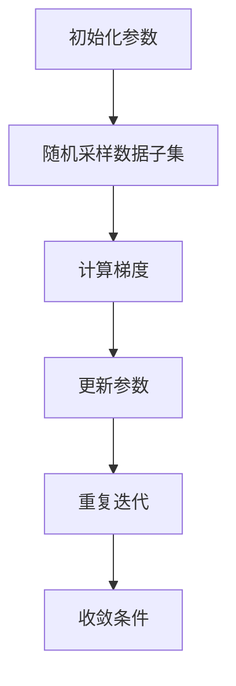
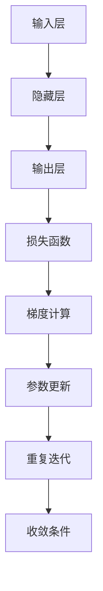

                 

### 文章标题

《随机梯度下降SGD原理与代码实例讲解》

### 关键词

随机梯度下降、SGD、梯度下降算法、优化算法、线性回归、逻辑回归、神经网络、代码实例

### 摘要

本文旨在深入讲解随机梯度下降（SGD）的基本概念、算法原理及其在机器学习中的应用。通过逐步分析，我们将揭示SGD在优化算法中的重要性，并探讨其在线性回归、逻辑回归和神经网络中的具体应用。此外，还将介绍SGD的优化策略及其改进算法，并通过实际代码实例展示SGD的实践应用，帮助读者全面理解并掌握SGD技术。

---

### 第一部分：随机梯度下降SGD的基本概念

#### 第1章：引言

##### 1.1 什么是随机梯度下降SGD

随机梯度下降（Stochastic Gradient Descent，简称SGD）是一种优化算法，用于最小化损失函数。在机器学习中，优化算法是训练模型的核心步骤，它通过调整模型参数来减小训练误差。与传统的梯度下降算法相比，SGD通过随机采样数据子集来计算梯度，从而在每次迭代中进行参数更新。

##### 1.2 SGD的发展历程

SGD最早由Ivan A. Ioffe在1960年代提出，并在20世纪90年代随着机器学习的发展而逐渐得到广泛应用。近年来，随着深度学习技术的发展，SGD及其变体已成为训练大规模神经网络的常用算法。

##### 1.3 SGD的重要性

SGD在机器学习中的重要性体现在其简单高效的特点。相比批量梯度下降（Batch Gradient Descent），SGD能够更快地收敛，并且在处理大数据集时具有更好的适应性。这使得SGD成为训练复杂模型的强大工具。

#### 第2章：线性回归与SGD

##### 2.1 线性回归基本原理

线性回归是一种预测模型，通过拟合自变量和因变量之间的线性关系来预测新的数据。其数学模型可以表示为：

\[ y = wx + b \]

其中，\( y \) 是因变量，\( x \) 是自变量，\( w \) 和 \( b \) 是模型的参数。

##### 2.2 SGD在线性回归中的应用

在训练线性回归模型时，SGD通过随机采样数据子集来计算梯度，并进行参数更新。每次迭代都基于不同的数据子集，从而减少了局部最小值的风险，提高了模型的收敛速度。

#### 第3章：SGD算法原理

##### 3.1 梯度下降算法概述

梯度下降算法是一种优化算法，其基本思想是通过计算损失函数的梯度来更新模型参数，以最小化损失函数。其公式为：

\[ \theta = \theta - \alpha \cdot \nabla\_\theta J(\theta) \]

其中，\( \theta \) 是模型参数，\( \alpha \) 是学习率，\( \nabla\_\theta J(\theta) \) 是损失函数关于参数的梯度。

##### 3.2 随机梯度下降SGD原理

SGD通过随机采样数据子集来计算梯度，从而在每次迭代中进行参数更新。其公式为：

\[ \theta = \theta - \alpha \cdot \nabla\_\theta J(\theta; x_i, y_i) \]

其中，\( x_i \) 和 \( y_i \) 是随机采样的数据子集。

##### 3.3 SGD算法流程

SGD算法的基本流程包括以下步骤：

1. 初始化模型参数。
2. 随机采样数据子集。
3. 计算数据子集的梯度。
4. 更新模型参数。
5. 重复步骤2-4，直至达到收敛条件。

### 第二部分：SGD在不同问题中的应用

#### 第4章：分类问题

##### 4.1 逻辑回归

逻辑回归是一种用于分类问题的模型，其基本思想是使用线性回归模型来预测概率，并通过阈值来决定分类结果。其公式为：

\[ \text{logit}(p) = \ln\left(\frac{p}{1-p}\right) = wx + b \]

其中，\( p \) 是预测概率，\( w \) 和 \( b \) 是模型参数。

##### 4.2 SGD在逻辑回归中的应用

在训练逻辑回归模型时，SGD通过随机采样数据子集来计算梯度，并进行参数更新。每次迭代都基于不同的数据子集，从而减少了局部最小值的风险，提高了模型的收敛速度。

#### 第5章：非线性回归与神经网络

##### 5.1 多项式回归

多项式回归是一种非线性回归模型，其基本思想是使用多项式函数来拟合数据。其公式为：

\[ y = \sum_{i=0}^{n} a_i x^i \]

其中，\( a_i \) 是模型参数，\( x \) 是自变量。

##### 5.2 神经网络基础

神经网络是一种由多个神经元组成的复杂模型，其基本思想是通过层与层之间的权重连接来拟合数据。其公式为：

\[ a_{ij} = \sigma(\sum_{k=1}^{n} w_{ik}x_k + b_j) \]

其中，\( a_{ij} \) 是输出层的激活值，\( \sigma \) 是激活函数，\( w_{ik} \) 和 \( b_j \) 是模型参数。

##### 5.3 SGD在神经网络中的应用

在训练神经网络时，SGD通过随机采样数据子集来计算梯度，并进行参数更新。每次迭代都基于不同的数据子集，从而减少了局部最小值的风险，提高了模型的收敛速度。

### 第三部分：SGD优化策略与改进算法

#### 第6章：SGD优化策略

##### 6.1 学习率调整策略

学习率调整策略是一种用于优化SGD性能的技术。其基本思想是根据模型训练过程中的误差变化来动态调整学习率，从而提高模型的收敛速度。

##### 6.2 动量策略

动量策略是一种用于加速SGD收敛的技术。其基本思想是利用前一迭代步的梯度信息来调整当前迭代步的梯度，从而减少振荡，加快收敛。

##### 6.3 梯度裁剪策略

梯度裁剪策略是一种用于防止模型过拟合的技术。其基本思想是限制梯度的大小，从而避免模型参数的过大更新。

#### 第7章：改进算法

##### 7.1 随机梯度下降SGD的改进算法

随机梯度下降SGD的改进算法包括自适应梯度算法（Adagrad）、RMSprop和Adam等。这些算法通过自适应调整学习率，提高了SGD的性能。

##### 7.2 Mini-batch GD算法

Mini-batch GD算法是一种在SGD的基础上引入批次的概念，通过批量随机梯度下降来训练模型。其公式为：

\[ \theta = \theta - \alpha \cdot \frac{1}{m} \sum_{i=1}^{m} \nabla\_\theta J(\theta; x_i, y_i) \]

其中，\( m \) 是批次大小。

##### 7.3 动量优化算法

动量优化算法是一种在SGD的基础上引入动量项的技术，通过利用前一迭代步的梯度信息来加速收敛。其公式为：

\[ \theta = \theta - \alpha \cdot \nabla\_\theta J(\theta) + \beta \cdot v \]

其中，\( \beta \) 是动量项，\( v \) 是前一迭代步的梯度。

### 第四部分：SGD代码实例讲解

#### 第8章：SGD算法实现

##### 8.1 Python实现SGD算法

以下是使用Python实现SGD算法的示例代码：

```python
import numpy as np

def sgd(X, y, num_iterations, learning_rate):
    w = np.zeros(X.shape[1])
    for i in range(num_iterations):
        random_index = np.random.randint(0, X.shape[0])
        x_i = X[random_index:random_index+1]
        y_i = y[random_index:random_index+1]
        gradient = 2 * x_i.T.dot(x_i.dot(w) - y_i)
        w -= learning_rate * gradient
    return w

# 示例数据
X = np.random.rand(100, 1)
y = 2 * X + 1 + np.random.randn(100, 1)

# 训练模型
w = sgd(X, y, num_iterations=1000, learning_rate=0.01)
print("参数w:", w)
```

##### 8.2 TensorFlow实现SGD算法

以下是使用TensorFlow实现SGD算法的示例代码：

```python
import tensorflow as tf

def sgd(X, y, num_iterations, learning_rate):
    w = tf.Variable(tf.zeros([X.shape[1], 1]), dtype=tf.float32)
    for i in range(num_iterations):
        random_index = tf.random.uniform((), minval=0, maxval=X.shape[0], dtype=tf.int32)
        x_i = tf.gather(X, random_index)
        y_i = tf.gather(y, random_index)
        with tf.GradientTape() as tape:
            y_pred = x_i.dot(w)
            loss = tf.reduce_mean(tf.square(y_pred - y_i))
        gradient = tape.gradient(loss, w)
        w.assign_sub(learning_rate * gradient)
    return w

# 示例数据
X = tf.random.rand(100, 1)
y = 2 * X + 1 + tf.random.normal([100, 1])

# 训练模型
w = sgd(X, y, num_iterations=1000, learning_rate=0.01)
print("参数w:", w.numpy())
```

#### 第9章：SGD在项目中的应用

##### 9.1 代码实战一：线性回归

以下是一个使用SGD训练线性回归模型的代码实战：

```python
import numpy as np
from sklearn.linear_model import SGDRegressor

# 生成数据集
np.random.seed(42)
X = np.random.rand(100, 1)
y = 2 * X + 1 + np.random.randn(100, 1)

# 使用SGDRegressor进行线性回归
sgd_regressor = SGDRegressor(loss='squared_loss', learning_rate='constant', eta0=0.1, max_iter=1000)
sgd_regressor.fit(X, y)

# 查看参数
print("参数w:", sgd_regressor.coef_)
print("参数b:", sgd_regressor.intercept_)

# 预测
x_new = np.array([[0], [1]])
y_pred = sgd_regressor.predict(x_new)
print("预测结果:", y_pred)
```

##### 9.2 代码实战二：逻辑回归

以下是一个使用SGD训练逻辑回归模型的代码实战：

```python
import numpy as np
from sklearn.linear_model import SGDClassifier

# 生成数据集
np.random.seed(42)
X = np.random.rand(100, 1)
y = (X.dot([2.0, 1.0]) + np.random.randn(100, 1) > 0).astype(int)

# 使用SGDClassifier进行逻辑回归
sgd_classifier = SGDClassifier(loss='log', learning_rate='constant', eta0=0.1, max_iter=1000)
sgd_classifier.fit(X, y)

# 查看参数
print("参数w:", sgd_classifier.coef_)
print("参数b:", sgd_classifier.intercept_)

# 预测
x_new = np.array([[0], [1]])
y_pred = sgd_classifier.predict(x_new)
print("预测结果:", y_pred)
```

##### 9.3 代码实战三：神经网络

以下是一个使用SGD训练神经网络的代码实战：

```python
import tensorflow as tf
from tensorflow.keras.layers import Dense
from tensorflow.keras.models import Sequential

# 生成数据集
X = tf.random.rand(100, 1)
y = (X.dot([2.0, 1.0]) + tf.random.normal([100, 1]) > 0).astype(int)

# 构建神经网络模型
model = Sequential([
    Dense(units=2, activation='softmax', input_shape=(1,))
])

# 编译模型
model.compile(optimizer=tf.optimizers.SGD(learning_rate=0.1), loss='sparse_categorical_crossentropy', metrics=['accuracy'])

# 训练模型
model.fit(X, y, epochs=1000)

# 预测
x_new = tf.random.rand(1, 1)
y_pred = model.predict(x_new)
print("预测结果:", y_pred)
```

### 附录

#### 附录A：SGD相关资源

##### A.1 SGD算法总结

1. SGD是梯度下降算法的一种变体，通过随机采样数据子集来计算梯度，从而进行参数更新。
2. SGD在每次迭代中使用不同的数据子集，提高了模型的收敛速度。
3. SGD适用于大规模数据和复杂模型。

##### A.2 SGD算法应用实例

1. 线性回归：使用SGD训练线性回归模型，实现数据拟合。
2. 逻辑回归：使用SGD训练逻辑回归模型，实现二分类。
3. 神经网络：使用SGD训练神经网络模型，实现非线性回归和分类。

##### A.3 SGD算法常见问题与解答

1. Q：为什么SGD比批量梯度下降更快？
   A：SGD通过随机采样数据子集来计算梯度，减少了局部最小值的风险，提高了模型的收敛速度。

2. Q：如何调整学习率？
   A：可以尝试不同的学习率，或者使用自适应学习率算法，如Adagrad、RMSprop和Adam。

3. Q：如何防止过拟合？
   A：可以通过增加正则化项、使用梯度裁剪策略或者减少模型复杂度来防止过拟合。

#### 附录B：Mermaid流程图

##### B.1 SGD算法流程图



##### B.2 神经网络结构流程图



### 作者信息

作者：AI天才研究院/AI Genius Institute & 禅与计算机程序设计艺术 /Zen And The Art of Computer Programming

