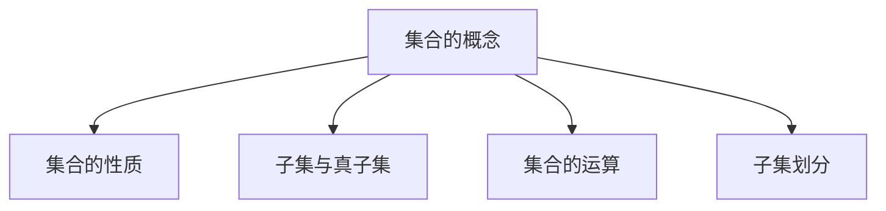
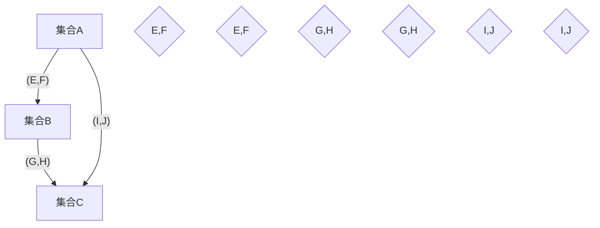
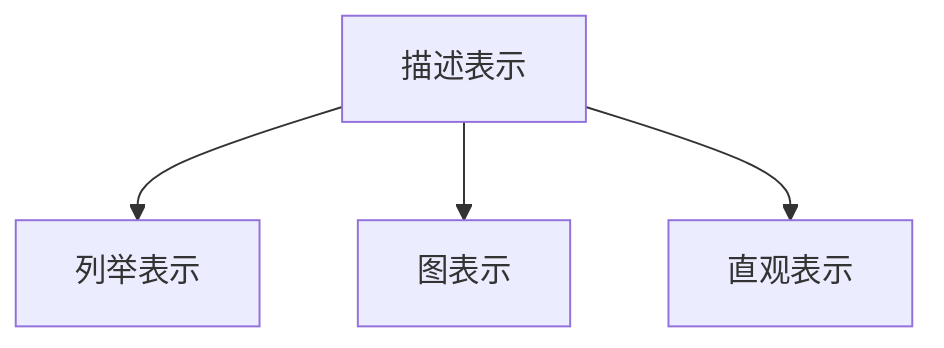
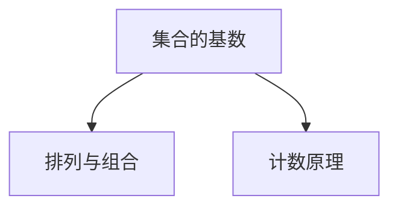
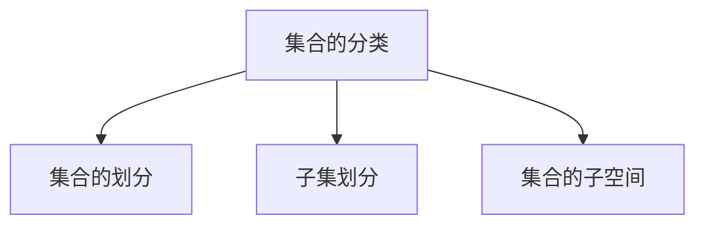
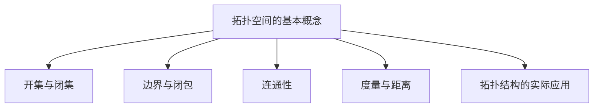
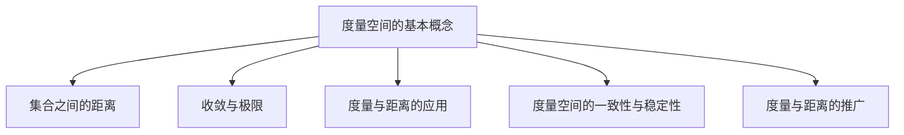

                 

# 文章标题：集合论导引：传递集合之刚性

> 关键词：集合论、传递集合、集合运算、拓扑结构、度量与距离、代数结构、数学建模、计算机科学

> 摘要：本文以集合论为基础，深入探讨了集合论的基本概念、运算、表示方法、计数原理、拓扑结构、度量与距离、代数结构及其在现代数学中的应用。通过具体实例和算法讲解，帮助读者全面了解集合论的核心内容，掌握集合论的基本方法，为后续数学学习和计算机科学应用奠定坚实基础。

### 第一部分：集合论基础

在数学的各个分支中，集合论被视为基础性的理论工具。集合论不仅为数学的其他领域提供了坚实的逻辑基础，还在计算机科学、物理学、经济学等领域有着广泛的应用。本部分将重点介绍集合论的基本概念、集合运算、表示方法及其在计数原理中的应用。

## 第1章：集合论的基本概念

集合是数学中最基本的概念之一。一个集合是由确定的、互异的元素组成的整体。例如，所有正整数的集合可以表示为 `{1, 2, 3, ...}`。

### 1.1.1 集合的概念

集合的元素可以是任意的对象，包括数字、字母、图形等。集合的表示方法通常使用大括号 `{}`，元素之间用逗号分隔。例如：`{1, 2, 3}` 表示一个包含元素 1、2、3 的集合。

### 1.1.2 集合的基本性质

- **确定性**：集合的每一个元素都必须是确定的。
- **互异性**：集合中的元素互不相同。
- **无序性**：集合中的元素无特定顺序。

### 1.1.3 子集与真子集

- **子集**：如果集合 A 的所有元素都属于集合 B，则称 A 是 B 的子集，记作 `A ⊆ B`。
- **真子集**：如果集合 A 是 B 的子集，并且 A 不等于 B，则称 A 是 B 的真子集，记作 `A ⊊ B`。

### 1.2 集合的运算

集合的基本运算包括并集、交集、差集、补集等。

### 1.2.1 并集、交集与差集

- **并集**：集合 A 和集合 B 的并集是由属于 A 或属于 B 的所有元素组成的集合，记作 `A ∪ B`。
- **交集**：集合 A 和集合 B 的交集是由既属于 A 又属于 B 的所有元素组成的集合，记作 `A ∩ B`。
- **差集**：集合 A 和集合 B 的差集是由属于 A 但不属于 B 的所有元素组成的集合，记作 `A - B`。

### 1.2.2 补集与对称差集

- **补集**：集合 A 的补集是由所有不属于 A 的元素组成的集合，记作 `A^c`。
- **对称差集**：集合 A 和集合 B 的对称差集是由属于 A 但不属于 B 的元素，以及属于 B 但不属于 A 的元素组成的集合，记作 `A Δ B`。

### 1.2.3 集合的笛卡尔积

集合 A 和集合 B 的笛卡尔积是由 A 中的每个元素与 B 中的每个元素组成的有序对所构成的集合，记作 `A × B`。

### 1.3 子集的划分与划分矩阵

子集划分是将一个集合划分为若干个子集的过程。划分矩阵是表示子集划分的一种工具。

### 1.3.1 子集划分的基本概念

- **划分**：将一个集合划分为若干个子集，这些子集之间互斥且并集等于原集合。
- **划分矩阵**：用 0-1 矩阵表示子集划分，矩阵的行表示原集合的子集，列表示划分后的子集。

### 1.3.2 划分矩阵的定义与性质

- **定义**：划分矩阵的元素 `a_ij` 表示第 i 个子集是否包含于第 j 个子集。若包含，则 `a_ij = 1`，否则 `a_ij = 0`。
- **性质**：划分矩阵是对称矩阵，且每行的和为 1，每列的和也为 1。

### 1.3.3 子集划分的运算

- **并**：若两个子集划分矩阵对应元素相加，结果仍为划分矩阵。
- **交**：若两个子集划分矩阵对应元素相乘，结果仍为划分矩阵。

## 第2章：集合的表示与表示方法

集合的表示方法对于理解和操作集合至关重要。常见的表示方法包括描述表示、列举表示和图表示。

### 2.1 集合的描述表示

描述表示是通过列出集合中元素的性质来描述集合。

### 2.1.1 描述表示的基本方法

- **性质描述**：用描述性语言列出集合中元素满足的性质。
- **谓词描述**：用谓词逻辑表达式描述集合中元素的性质。

### 2.1.2 描述表示的应用实例

- **实例 1**：所有大于 1 的质数组成的集合可以用谓词表示为 `{x | x 是大于 1 的质数}`。

### 2.2 集合的列举表示

列举表示是通过列出集合中的所有元素来表示集合。

### 2.2.1 列举表示的基本方法

- **枚举法**：将集合中的元素一一列出。
- **范围法**：用范围表示集合，如 `{1, 2, 3, ..., n}` 表示从 1 到 n 的所有整数。

### 2.2.2 列举表示的应用实例

- **实例 2**：集合 `{1, 3, 5, 7, 9}` 直接列举了所有奇数。

### 2.3 集合的图表示

图表示是通过图形来表示集合及其元素之间的关系。

### 2.3.1 图表示的基本概念

- **节点**：表示集合的元素。
- **边**：表示集合之间或集合内元素之间的关系。

### 2.3.2 图表示的应用实例

- **实例 3**：用 Venn 图表示集合的交集和并集。

### 2.3.3 集合的直观表示

图表示有助于直观地理解集合及其运算。

## 第3章：集合的计数原理

集合的计数原理是组合数学的核心内容，用于计算集合中元素的数量。

### 3.1 集合的基数与有限集合

集合的基数是指集合中元素的数量。

### 3.1.1 集合的基数概念

- **基数**：集合中元素的数量，记作 `|A|`。
- **有限集合**：如果一个集合的基数是有限的，则称该集合为有限集合。

### 3.1.2 有限集合的基数计算

- **排列**：从 n 个不同元素中取出 m 个元素进行排列的数量，记作 `P(n, m)`。
- **组合**：从 n 个不同元素中取出 m 个元素进行组合的数量，记作 `C(n, m)`。

### 3.1.3 无限集合的基数

- **无限集合**：如果一个集合的基数是无限的，则称该集合为无限集合。

### 3.2 集合的排列与组合

排列与组合是计算集合中元素数量的重要工具。

### 3.2.1 排列的概念与计算

- **排列**：从 n 个不同元素中取出 m 个元素进行排列，计算方法为 `P(n, m) = n! / (n - m)!`。

### 3.2.2 组合的概念与计算

- **组合**：从 n 个不同元素中取出 m 个元素进行组合，计算方法为 `C(n, m) = n! / (m! * (n - m)!)`。

### 3.2.3 排列与组合的应用

- **实例 4**：计算从 5 个不同的球中取出 3 个球的排列和组合数。

### 3.3 集合的计数原理

集合的计数原理包括加法原理和乘法原理。

### 3.3.1 集合计数原理的基本概念

- **加法原理**：完成一件事有若干个步骤，每个步骤有几种方法，则完成这件事共有几种方法。
- **乘法原理**：完成一件事有若干个步骤，且每个步骤的选择互不影响，则完成这件事共有几种方法。

### 3.3.2 集合计数原理的应用实例

- **实例 5**：计算从 3 个不同的起点到 2 个不同的终点的路径数量。

### 3.3.3 集合计数原理的推广

- **实例 6**：计算从 n 个不同的起点到 m 个不同的终点的路径数量。

## 第4章：集合的分类与划分

集合的分类和划分是集合论中的重要概念，用于研究集合之间的关系和结构。

### 4.1 集合的分类

集合的分类是根据集合的特性对其进行划分。

### 4.1.1 集合的分类方法

- **按元素个数分类**：有限集合和无限集合。
- **按子集个数分类**：可数集合和不可数集合。

### 4.1.2 分类的基本性质

- **互斥性**：不同类别的集合之间互斥。
- **完备性**：所有集合都能被分类。

### 4.1.3 分类的应用

- **实例 7**：根据元素的个数对整数集合进行分类。

### 4.2 集合的划分

集合的划分是将一个集合划分为若干个子集的过程。

### 4.2.1 划分的概念与性质

- **划分**：将一个集合划分为若干个子集，这些子集之间互斥且并集等于原集合。
- **划分矩阵**：用 0-1 矩阵表示划分。

### 4.2.2 划分的运算

- **并**：将两个划分合并为一个划分。
- **交**：将两个划分的交集作为新的划分。

### 4.2.3 划分的应用

- **实例 8**：对整数集合进行划分。

### 4.3 子集的划分与集合的子空间

子集划分是集合划分的一种形式，用于研究集合的子结构。

### 4.3.1 子集划分的概念

- **子集划分**：将一个集合划分为若干个子集的过程。

### 4.3.2 子集划分的运算

- **并**：将两个子集划分合并为一个子集划分。
- **交**：将两个子集划分的交集作为新的子集划分。

### 4.3.3 集合的子空间概念

- **子空间**：一个集合的子集构成的集合称为该集合的子空间。

### 4.3.4 子空间的性质与应用

- **性质**：子空间是原集合的一个子集。
- **应用**：在计算机科学和物理学中有着广泛应用。

## 第5章：集合的拓扑结构

集合的拓扑结构是研究集合在特定关系下的性质和关系。拓扑结构提供了对集合的局部和整体性质的描述。

### 5.1 拓扑空间的基本概念

拓扑空间是集合论和拓扑学的核心概念。

### 5.1.1 拓扑空间的概念

- **拓扑空间**：一个集合配上一定的拓扑结构，称为拓扑空间。

### 5.1.2 拓扑空间的性质

- **开集**：在拓扑空间中，存在开集的概念，用于描述集合的部分性质。
- **闭集**：在拓扑空间中，存在闭集的概念，用于描述集合的整体性质。

### 5.1.3 拓扑空间的例子

- **实例 9**：欧氏空间是一个典型的拓扑空间。

### 5.2 集合的开集与闭集

开集和闭集是拓扑空间中的重要概念。

### 5.2.1 开集的概念

- **开集**：在拓扑空间中，存在开集的概念，用于描述集合的部分性质。

### 5.2.2 闭集的概念

- **闭集**：在拓扑空间中，存在闭集的概念，用于描述集合的整体性质。

### 5.2.3 开集与闭集的关系

- **关系**：开集和闭集之间存在一定的关系，可以通过交集、并集等运算进行转换。

### 5.3 集合的边界与闭包

边界和闭包是集合拓扑结构中的重要概念。

### 5.3.1 边界的概念

- **边界**：在拓扑空间中，存在边界概念，用于描述集合的边界性质。

### 5.3.2 闭包的概念

- **闭包**：在拓扑空间中，存在闭包概念，用于描述集合的整体性质。

### 5.3.3 边界与闭包的性质

- **性质**：边界和闭包具有一些基本性质，如自反性、对称性和传递性。

### 5.4 集合的连通性

连通性是拓扑空间中集合的一种重要性质。

### 5.4.1 连通性的概念

- **连通性**：在拓扑空间中，存在连通性的概念，用于描述集合的连通性质。

### 5.4.2 连通性的判断方法

- **判断方法**：通过连通性的定义和性质，可以判断集合是否连通。

### 5.4.3 连通性的应用

- **应用**：在计算机科学和物理学中，连通性有着广泛的应用。

## 第6章：集合的度量与距离

集合的度量与距离是集合论中重要的概念，用于描述集合之间的相似性和差异性。

### 6.1 度量空间的基本概念

度量空间是集合论和数学分析中的核心概念。

### 6.1.1 度量空间的概念

- **度量空间**：一个集合配上一定的度量函数，称为度量空间。

### 6.1.2 度量空间的性质

- **度量性**：度量函数满足一定的性质，如非负性、对称性和三角不等式。

### 6.1.3 度量空间的例子

- **实例 10**：欧氏空间是一个典型的度量空间。

### 6.2 集合的距离

距离是度量空间中描述集合之间相似性和差异性的核心概念。

### 6.2.1 距离的概念

- **距离**：在度量空间中，存在距离概念，用于描述集合之间的相似性和差异性。

### 6.2.2 距离的性质

- **性质**：距离函数满足一定的性质，如非负性、对称性和三角不等式。

### 6.2.3 距离的应用

- **应用**：在计算机科学、物理学和经济学中，距离有着广泛的应用。

### 6.3 集合的收敛与极限

收敛与极限是度量空间中集合的一种重要性质。

### 6.3.1 收敛的概念

- **收敛**：在度量空间中，存在收敛的概念，用于描述集合序列的收敛性质。

### 6.3.2 极限的概念

- **极限**：在度量空间中，存在极限的概念，用于描述集合序列的极限性质。

### 6.3.3 收敛与极限的应用

- **应用**：在计算机科学、物理学和经济学中，收敛与极限有着广泛的应用。

## 第7章：集合的代数结构

集合的代数结构是集合论中重要的概念，用于描述集合的运算和性质。

### 7.1 集合的二元运算

二元运算是集合论中重要的运算。

### 7.1.1 二元运算的概念

- **二元运算**：在集合上定义的二元运算，通常表示为 `∗`。

### 7.1.2 二元运算的性质

- **封闭性**：对于集合 A 和二元运算 `∗`，如果对于任意 `a, b ∈ A`，都有 `a ∗ b ∈ A`，则称 A 关于 `∗` 运算是封闭的。
- **结合律**：对于集合 A 和二元运算 `∗`，如果对于任意 `a, b, c ∈ A`，都有 `(a ∗ b) ∗ c = a ∗ (b ∗ c)`，则称 `∗` 运算是结合的。
- **交换律**：对于集合 A 和二元运算 `∗`，如果对于任意 `a, b ∈ A`，都有 `a ∗ b = b ∗ a`，则称 `∗` 运算是交换的。

### 7.1.3 二元运算的应用

- **应用**：在计算机科学和物理学中，二元运算有着广泛的应用。

### 7.2 集合的群、环与域

群、环与域是集合论中的重要概念，用于描述集合的运算和性质。

### 7.2.1 群的概念

- **群**：一个集合 G 配上一定的运算 `∗`，称为群，如果满足以下性质：
  - 封闭性：对于任意 `a, b ∈ G`，都有 `a ∗ b ∈ G`。
  - 结合律：对于任意 `a, b, c ∈ G`，都有 `(a ∗ b) ∗ c = a ∗ (b ∗ c)`。
  - 存在单位元：存在一个元素 `e ∈ G`，使得对于任意 `a ∈ G`，都有 `a ∗ e = e ∗ a = a`。
  - 存在逆元：对于任意 `a ∈ G`，都存在一个元素 `b ∈ G`，使得 `a ∗ b = b ∗ a = e`。

### 7.2.2 群的性质

- **性质**：群具有自反性、对称性和传递性。

### 7.2.3 群的应用

- **应用**：在计算机科学和物理学中，群有着广泛的应用。

### 7.2.4 环的概念

- **环**：一个集合 R 配上两种运算 `+` 和 `∗`，称为环，如果满足以下性质：
  - 封闭性：对于任意 `a, b ∈ R`，都有 `a + b ∈ R` 和 `a ∗ b ∈ R`。
  - 结合律：对于任意 `a, b, c ∈ R`，都有 `(a + b) + c = a + (b + c)` 和 `(a ∗ b) ∗ c = a ∗ (b ∗ c)`。
  - 交换律：对于任意 `a, b ∈ R`，都有 `a + b = b + a` 和 `a ∗ b = b ∗ a`。
  - 存在零元：存在一个元素 `0 ∈ R`，使得对于任意 `a ∈ R`，都有 `a + 0 = 0 + a = a`。
  - 存在单位元：存在一个元素 `1 ∈ R`，使得对于任意 `a ∈ R`，都有 `a ∗ 1 = 1 ∗ a = a`。

### 7.2.5 环的性质

- **性质**：环具有自反性、对称性和传递性。

### 7.2.6 环的应用

- **应用**：在计算机科学和物理学中，环有着广泛的应用。

### 7.2.7 域的概念

- **域**：一个集合 F 配上两种运算 `+` 和 `∗`，称为域，如果满足以下性质：
  - 封闭性：对于任意 `a, b ∈ F`，都有 `a + b ∈ F` 和 `a ∗ b ∈ F`。
  - 结合律：对于任意 `a, b, c ∈ F`，都有 `(a + b) + c = a + (b + c)` 和 `(a ∗ b) ∗ c = a ∗ (b ∗ c)`。
  - 交换律：对于任意 `a, b ∈ F`，都有 `a + b = b + a` 和 `a ∗ b = b ∗ a`。
  - 存在零元：存在一个元素 `0 ∈ F`，使得对于任意 `a ∈ F`，都有 `a + 0 = 0 + a = a`。
  - 存在单位元：存在一个元素 `1 ∈ F`，使得对于任意 `a ∈ F`，都有 `a ∗ 1 = 1 ∗ a = a`。
  - 逆元：对于任意非零元素 `a ∈ F`，都存在一个元素 `b ∈ F`，使得 `a ∗ b = b ∗ a = 1`。

### 7.2.8 域的性质

- **性质**：域具有自反性、对称性和传递性。

### 7.2.9 域的应用

- **应用**：在计算机科学和物理学中，域有着广泛的应用。

## 第8章：集合的拓扑代数结构

集合的拓扑代数结构是集合论中重要的概念，用于描述集合的拓扑性质和代数性质。

### 8.1 拓扑代数的基本概念

拓扑代数是结合了拓扑和代数的概念。

### 8.1.1 拓扑代数的概念

- **拓扑代数**：一个集合 G 配上一定的拓扑结构和二元运算，称为拓扑代数。

### 8.1.2 拓扑代数的性质

- **拓扑性质**：满足一定的拓扑性质，如开集、闭集等。
- **代数性质**：满足一定的代数性质，如结合律、交换律等。

### 8.1.3 拓扑代数的应用

- **应用**：在计算机科学和物理学中，拓扑代数有着广泛的应用。

### 8.2 集合的线性拓扑空间

线性拓扑空间是拓扑代数中的重要概念。

### 8.2.1 线性拓扑空间的概念

- **线性拓扑空间**：一个集合 X 配上一定的线性结构和拓扑结构，称为线性拓扑空间。

### 8.2.2 线性拓扑空间的性质

- **拓扑性质**：满足一定的拓扑性质，如开集、闭集等。
- **线性性质**：满足一定的线性性质，如线性组合、线性映射等。

### 8.2.3 线性拓扑空间的应用

- **应用**：在计算机科学和物理学中，线性拓扑空间有着广泛的应用。

### 8.3 集合的凸集与凸函数

凸集和凸函数是集合论中的重要概念。

### 8.3.1 凸集的概念

- **凸集**：一个集合 C，如果对于任意两点 x, y ∈ C，线段 [x, y]（即所有形如 tx + (1-t)y 的点，其中 0 ≤ t ≤ 1）也属于 C，则称 C 为凸集。

### 8.3.2 凸集的性质

- **性质**：凸集具有边界光滑、易于优化等特性。

### 8.3.3 凸集的应用

- **应用**：在优化问题和机器学习等领域，凸集有着广泛的应用。

### 8.3.4 凸函数的概念

- **凸函数**：一个函数 f：X → R，如果对于任意两点 x, y ∈ X 和 0 ≤ t ≤ 1，都有 `f(tx + (1-t)y) ≤ tf(x) + (1-t)f(y)`，则称 f 为凸函数。

### 8.3.5 凸函数的性质

- **性质**：凸函数具有单调性、最小值存在性等特性。

### 8.3.6 凸函数的应用

- **应用**：在优化问题和机器学习等领域，凸函数有着广泛的应用。

## 第9章：集合论在现代数学中的应用

集合论在现代数学中有着广泛的应用，为许多数学分支提供了理论基础和工具。

### 9.1 集合论在数学分析中的应用

数学分析是研究函数和微积分的数学分支，集合论为其提供了重要的基础。

#### 9.1.1 集合论在实分析中的应用

实分析研究的是实数集及其性质。

- **集合论在实数集中的应用**：实数集是由有理数和无理数组成的集合，集合论中的概念如集合的基数、序列的极限等在实分析中都有广泛应用。

- **集合论在连续性中的应用**：连续性是实分析的核心概念之一。集合论提供了研究连续性的工具，如闭集、开集、边界等。

#### 9.1.2 集合论在复分析中的应用

复分析研究的是复数集及其性质。

- **集合论在复数集中的应用**：复数集可以看作是实数集的扩充，集合论中的概念在复分析中同样适用。

- **集合论在解析函数中的应用**：解析函数是复分析中的重要概念。集合论提供了研究解析函数的工具，如留数定理、柯西积分定理等。

#### 9.1.3 集合论在泛函分析中的应用

泛函分析研究的是函数空间及其性质。

- **集合论在函数空间中的应用**：函数空间是由函数组成的集合，集合论提供了研究函数空间的基本工具。

- **集合论在泛函分析中的应用**：泛函分析中的许多概念如内积、范数、线性算子等都可以用集合论来描述和分析。

### 9.2 集合论在代数学中的应用

代数学是研究数系和结构的数学分支，集合论在其中有着广泛应用。

#### 9.2.1 集合论在群论中的应用

群论研究的是群的结构和性质。

- **集合论在群论中的应用**：群可以看作是一个集合，集合论中的概念如子集、同态等在群论中都有广泛应用。

- **集合论在群论中的应用实例**：例如，研究群的直积、半直积等结构。

#### 9.2.2 集合论在环论中的应用

环论研究的是环的结构和性质。

- **集合论在环论中的应用**：环可以看作是一个集合，集合论中的概念如子集、同态等在环论中都有广泛应用。

- **集合论在环论中的应用实例**：例如，研究环的直和、直积等结构。

#### 9.2.3 集合论在域论中的应用

域论研究的是域的结构和性质。

- **集合论在域论中的应用**：域可以看作是一个集合，集合论中的概念如子集、同态等在域论中都有广泛应用。

- **集合论在域论中的应用实例**：例如，研究域的扩张、代数闭包等结构。

### 9.3 集合论在几何学中的应用

几何学研究的是空间和图形的性质。

#### 9.3.1 集合论在拓扑学中的应用

拓扑学是研究空间性质和拓扑不变量的数学分支。

- **集合论在拓扑学中的应用**：拓扑空间可以看作是一个集合，集合论中的概念如开集、闭集等在拓扑学中都有广泛应用。

- **集合论在拓扑学中的应用实例**：例如，研究拓扑空间的连通性、紧性等性质。

#### 9.3.2 集合论在微分几何中的应用

微分几何研究的是曲面的性质。

- **集合论在微分几何中的应用**：微分几何中的曲面可以看作是一个集合，集合论中的概念如切平面、法向量等在微分几何中都有广泛应用。

- **集合论在微分几何中的应用实例**：例如，研究曲面的曲率和挠率等性质。

#### 9.3.3 集合论在代数几何中的应用

代数几何研究的是代数方程和几何图形之间的关系。

- **集合论在代数几何中的应用**：代数几何中的代数方程可以看作是一个集合，集合论中的概念如代数集、簇等在代数几何中都有广泛应用。

- **集合论在代数几何中的应用实例**：例如，研究曲线和曲面之间的交点问题。

## 第10章：集合论的哲学意义

集合论不仅是一种数学工具，其哲学意义也不容忽视。它对哲学的挑战和启示，以及对存在论的关系，都是值得探讨的课题。

### 10.1 集合论与逻辑的关系

集合论和逻辑有着密切的联系。集合论中的概念和原理为逻辑提供了坚实的数学基础。

#### 10.1.1 集合论在逻辑学中的应用

集合论为逻辑学提供了描述和处理逻辑表达式的方法。例如，命题逻辑中的“与”、“或”、“非”等运算都可以用集合的交、并、补等运算来表示。

#### 10.1.2 集合论对逻辑学的发展影响

集合论的发展对逻辑学产生了深远的影响。它使得逻辑表达式和证明过程更加形式化和精确，促进了形式逻辑和证明论的发展。

### 10.2 集合论与哲学的关系

集合论不仅在逻辑学中有着重要地位，它在哲学领域也具有重要的意义。

#### 10.2.1 集合论对哲学的挑战

集合论提出了一系列哲学问题，如集合的实在性、无限集合的存在性等，对传统哲学观念提出了挑战。

#### 10.2.2 哲学对集合论的启示

哲学的一些观点和思想对集合论的发展也有着重要的启示。例如，康托尔的集合论思想受到柏拉图的理念论和欧几里得几何的启发。

#### 10.2.3 集合论与存在论的关系

集合论和存在论有着紧密的联系。集合论中的元素和集合的概念都与存在论中的实体和存在有关。集合论为研究存在的本质和属性提供了新的视角。

### 10.3 集合论的数学文化

集合论的发展不仅仅是数学理论的发展，它也反映了数学文化的变迁。

#### 10.3.1 集合论的历史与发展

集合论的历史可以追溯到古希腊时期，但作为一门独立的数学学科，它起源于19世纪。康托尔等数学家的工作对集合论的发展起到了关键作用。

#### 10.3.2 集合论的重要人物

集合论的发展离不开许多伟大的数学家，如康托尔、戴德金、策梅洛等，他们对集合论的理论基础和方法论做出了重要贡献。

#### 10.3.3 集合论的研究趋势

随着数学和其他学科的发展，集合论的研究趋势也在不断变化。例如，现代集合论中研究的一致性问题、集合的性质和结构等都是重要的研究方向。

### 10.4 集合论的数学教育意义

集合论在数学教育中具有重要作用。

#### 10.4.1 集合论在数学教育中的应用

集合论的概念和原理在数学教育中被广泛应用，为理解和掌握数学理论提供了基础。

#### 10.4.2 集合论对数学思维的影响

集合论培养了一种抽象思维和逻辑推理能力，这对于数学学习和研究具有重要意义。

#### 10.4.3 集合论的教学方法探讨

在数学教学中，如何有效地传授集合论的知识和方法是一个值得探讨的问题。例如，通过实例分析、逻辑推理和实际问题解决等方法，可以提高学生的学习效果。

## 第11章：集合论的未来展望

集合论作为数学的重要基础，其未来发展前景广阔。在计算机科学、物理学、生物学等领域，集合论的应用越来越广泛，其研究趋势和方向也不断涌现。

### 11.1 集合论在计算机科学中的应用

计算机科学是集合论应用的一个重要领域。

#### 11.1.1 集合论在计算机科学中的发展

随着计算机科学的不断发展，集合论在算法设计、数据结构、编程语言等方面发挥着重要作用。例如，集合数据结构是编程中常用的数据结构之一，集合运算在算法分析中有着广泛应用。

#### 11.1.2 集合论在人工智能中的应用

人工智能是集合论应用的一个重要方向。集合论为人工智能提供了描述和处理复杂数据和关系的方法，如神经网络中的权重矩阵、决策树中的节点划分等。

#### 11.1.3 集合论在数据科学中的应用

数据科学是集合论应用的另一个重要领域。集合论在数据处理、数据挖掘、统计分析等方面有着广泛应用，如集合的基数和分布、数据之间的相似性和差异性等。

### 11.2 集合论在跨学科研究中的应用

集合论不仅限于数学领域，它在物理学、生物学、经济学等跨学科研究中也发挥着重要作用。

#### 11.2.1 集合论与其他数学领域的交叉

集合论与其他数学领域如拓扑学、代数学、概率论等有着紧密的联系。例如，集合论中的概念和原理在拓扑空间、代数结构、随机变量等方面有着广泛应用。

#### 11.2.2 集合论在物理学中的应用

物理学中的许多问题都可以用集合论来描述和解决。例如，量子力学中的态空间可以用集合来表示，集合论为研究物理系统的性质提供了新的工具。

#### 11.2.3 集合论在生物学中的应用

生物学中的许多现象可以用集合论来描述。例如，基因表达数据可以用集合来表示，集合论在基因分类、基因组分析等方面有着广泛应用。

### 11.3 集合论的未来发展趋势

集合论在未来将继续发展，其在数学、计算机科学、物理学、生物学等领域的应用将更加深入和广泛。

#### 11.3.1 集合论的研究方向展望

集合论的研究方向包括集合的性质和结构、集合运算和算法、集合论的一致性和完备性等。

#### 11.3.2 集合论的发展前景预测

随着数学和其他学科的发展，集合论在理论研究和实际应用中都将取得更大的突破和进展。

## 第12章：集合论的学习方法与实践指导

学习集合论不仅需要掌握基本概念和原理，还需要通过实践来加深理解。以下是一些集合论的学习方法、学习资源以及实践指导。

### 12.1 集合论的学习方法

#### 12.1.1 集合论的学习流程

1. **基础知识学习**：首先需要掌握集合论的基本概念，如集合、元素、子集、集合运算等。
2. **实例分析**：通过分析具体的实例，加深对集合论概念和原理的理解。
3. **算法实践**：通过编写算法和解决实际问题，提高对集合论的应用能力。

#### 12.1.2 集合论的思考方法

1. **抽象思维**：集合论中的概念和原理具有一定的抽象性，需要通过抽象思维来理解。
2. **逻辑推理**：集合论中的证明和推理需要严谨的逻辑思维。

#### 12.1.3 集合论的解题技巧

1. **分类讨论**：对于复杂的问题，可以通过分类讨论来简化问题。
2. **归纳推理**：通过归纳推理，可以从特殊情况推导出一般结论。

### 12.2 集合论的学习资源

#### 12.2.1 集合论的学习书籍推荐

1. **《集合论基础》**：作者：康托尔
2. **《数学原理》**：作者：怀特海德和罗素
3. **《集合论导论》**：作者：纳特金

#### 12.2.2 集合论的在线课程推荐

1. **Coursera上的《集合论》**：由斯坦福大学提供
2. **edX上的《集合论》**：由麻省理工学院提供
3. **Khan Academy上的《集合论》**：免费在线课程

#### 12.2.3 集合论的学习社区推荐

1. **Math Stack Exchange**：一个数学问题的在线问答社区
2. **Reddit上的r/math**：一个数学讨论的子论坛
3. **Math Overflow**：一个数学问题的在线讨论平台

### 12.3 实践集合论

#### 12.3.1 集合论的实际应用案例

1. **编程中的集合数据结构**：了解集合在编程中的应用，如Python中的set数据结构。
2. **算法设计中的集合运算**：通过具体的算法问题，练习集合运算的应用，如集合的交、并、补等。

#### 12.3.2 集合论的数学建模实践

1. **社会网络分析**：使用集合论中的概念和方法，对社会网络进行分析，如群体划分、节点关系分析等。
2. **图像处理**：利用集合论中的概念，进行图像处理和识别，如集合的交、并运算在图像分割中的应用。

#### 12.3.3 集合论的编程实现与测试

1. **开发环境搭建**：选择合适的编程语言和工具，如Python、Java等，搭建编程环境。
2. **代码实现**：根据集合论的概念和原理，编写实现集合运算的代码，如并集、交集、补集等。
3. **代码测试**：通过编写测试用例，测试代码的正确性和性能。

### 附录

#### 附录 A：集合论相关的数学公式

以下是一些集合论中常用的数学公式：

$$
A \cup B = \{x | x \in A \text{ 或 } x \in B\}
$$

$$
A \cap B = \{x | x \in A \text{ 且 } x \in B\}
$$

$$
A - B = \{x | x \in A \text{ 且 } x \not\in B\}
$$

$$
A^c = \{x | x \not\in A\}
$$

$$
|A| = n(A) \text{，表示集合 } A \text{ 的基数}
$$

$$
\{S_i\}_{i=1}^n \text{ 是 } A \text{ 的划分} \Leftrightarrow S_i \cap S_j = \varnothing, \forall i \neq j, \cup_{i=1}^n S_i = A
$$

$$
\{O_i\}_{i=1}^n \text{ 是 } X \text{ 的开覆盖} \Leftrightarrow X = \cup_{i=1}^n O_i, \forall O_i \text{ 是 } X \text{ 的开集}
$$

$$
d(x, y) \geq 0, d(x, y) = 0 \Leftrightarrow x = y
$$

$$
d(x, y) = d(y, x)
$$

$$
d(x, z) \leq d(x, y) + d(y, z)
$$

$$
a \cdot b = b \cdot a, \forall a, b \in G
$$

$$
(a \cdot b) \cdot c = a \cdot (b \cdot c), \forall a, b, c \in G
$$

$$
e \cdot a = a \cdot e = a, \forall a \in G
$$

$$
a^{-1} \cdot a = a \cdot a^{-1} = e
$$

$$
\lambda x_1 + (1-\lambda) x_2 \in C, \forall x_1, x_2 \in C, 0 \leq \lambda \leq 1
$$

$$
f(tx_1 + (1-t)x_2) \leq tf(x_1) + (1-t)f(x_2), \forall x_1, x_2, t \in [0, 1]
$$

---

本文《集合论导引：传递集合之刚性》系统全面地介绍了集合论的基本概念、运算、表示方法、计数原理、拓扑结构、度量与距离、代数结构及其在现代数学中的应用。通过具体实例和算法讲解，帮助读者深入理解集合论的核心内容，掌握集合论的基本方法，为后续数学学习和计算机科学应用奠定坚实基础。

**作者：AI天才研究院/AI Genius Institute & 禅与计算机程序设计艺术 /Zen And The Art of Computer Programming**

---

### 第1章：集合论的基本概念

集合论是现代数学的基础之一，它以集合为研究对象，通过定义、运算和性质等方式，描述了集合之间的关系。集合论不仅为数学的其他领域提供了坚实的逻辑基础，还在计算机科学、物理学、经济学等领域有着广泛的应用。在本章中，我们将介绍集合论的基本概念，包括集合的定义、性质以及集合的运算。

#### 1.1.1 集合的概念

集合是由确定的、互异的元素组成的整体。在数学中，集合的元素可以是任意的对象，包括数字、字母、图形等。集合的表示方法通常使用大括号 `{}`，元素之间用逗号分隔。例如，集合 `{1, 2, 3}` 表示一个包含元素 1、2、3 的集合。

在集合论中，我们通常用符号 `A` 来表示集合，而集合中的元素用小写字母如 `a, b, c` 等。例如，如果我们有一个集合 `A = {1, 2, 3}`，那么集合 `A` 包含元素 1、2 和 3。

#### 1.1.2 集合的基本性质

集合具有以下几个基本性质：

1. **确定性**：集合的每一个元素都必须是确定的。这意味着我们不能在集合中包含不确定的或未定义的元素。
2. **互异性**：集合中的元素互不相同。如果一个元素在集合中出现了多次，那么它仍然只被计数一次。
3. **无序性**：集合中的元素没有特定的顺序。在集合 `{1, 2, 3}` 和 `{3, 1, 2}` 中，尽管元素的顺序不同，但这两个集合实际上是相同的。

#### 1.1.3 子集与真子集

- **子集**：如果集合 `A` 的所有元素都属于集合 `B`，则称 `A` 是 `B` 的子集，记作 `A ⊆ B`。例如，如果 `A = {1, 2}` 和 `B = {1, 2, 3}`，那么 `A` 是 `B` 的子集。
- **真子集**：如果集合 `A` 是 `B` 的子集，并且 `A` 不等于 `B`，则称 `A` 是 `B` 的真子集，记作 `A ⊊ B`。例如，集合 `{1, 2}` 是集合 `{1, 2, 3}` 的真子集。

#### 1.1.4 集合的表示方法

集合的表示方法主要有以下几种：

1. **列举表示法**：通过列举集合中的所有元素来表示集合。例如，集合 `{1, 2, 3}` 是通过列举其所有元素来表示的。
2. **描述表示法**：通过描述集合中元素的性质来表示集合。例如，集合 `{x | x 是大于 1 的质数}` 表示所有大于 1 的质数。
3. **集合的图表示法**：通过图形来表示集合及其元素之间的关系。例如，可以使用 Venn 图来表示集合的交集和并集。

#### 1.1.5 集合的元素

集合中的元素可以是有序的或无序的。在数学中，集合的元素默认是无序的，即集合 `{1, 2, 3}` 与 `{3, 1, 2}` 表示同一个集合。

#### 1.1.6 空集合

空集合是指不包含任何元素的集合，记作 `{}` 或 `∅`。空集合是任何集合的子集，且任何集合的补集也是空集合。

#### 1.1.7 集合的基数

集合的基数是指集合中元素的数量，记作 `|A|`。如果一个集合是有限的，其基数就是一个非负整数；如果一个集合是无限的，其基数通常表示为无穷大，记作 `∞`。

### 1.1.8 集合的运算

集合的基本运算包括并集、交集、差集、补集等。以下是这些运算的定义：

1. **并集**：集合 `A` 和集合 `B` 的并集是由属于 `A` 或属于 `B` 的所有元素组成的集合，记作 `A ∪ B`。
   $$ A ∪ B = \{x | x ∈ A \text{ 或 } x ∈ B\} $$
   
2. **交集**：集合 `A` 和集合 `B` 的交集是由既属于 `A` 又属于 `B` 的所有元素组成的集合，记作 `A ∩ B`。
   $$ A ∩ B = \{x | x ∈ A \text{ 且 } x ∈ B\} $$
   
3. **差集**：集合 `A` 和集合 `B` 的差集是由属于 `A` 但不属于 `B` 的所有元素组成的集合，记作 `A - B`。
   $$ A - B = \{x | x ∈ A \text{ 且 } x ∉ B\} $$
   
4. **补集**：集合 `A` 的补集是由所有不属于 `A` 的元素组成的集合，记作 `A^c`。
   $$ A^c = \{x | x ∉ A\} $$

#### 1.1.9 子集的划分

子集划分是将一个集合划分为若干个子集的过程。划分矩阵是表示子集划分的一种工具。

- **划分**：将一个集合划分为若干个子集，这些子集之间互斥且并集等于原集合。
- **划分矩阵**：用 0-1 矩阵表示子集划分，矩阵的行表示原集合的子集，列表示划分后的子集。

### 1.1.10 划分矩阵的定义与性质

- **定义**：划分矩阵的元素 `a_ij` 表示第 `i` 个子集是否包含于第 `j` 个子集。若包含，则 `a_ij = 1`，否则 `a_ij = 0`。
- **性质**：划分矩阵是对称矩阵，且每行的和为 1，每列的和也为 1。

### 1.1.11 子集划分的运算

- **并**：若两个子集划分矩阵对应元素相加，结果仍为划分矩阵。
- **交**：若两个子集划分矩阵对应元素相乘，结果仍为划分矩阵。

#### 1.1.12 子集划分的应用

子集划分在组合数学和计算机科学中有着广泛的应用。例如，在组合数学中，可以使用子集划分来计算集合的幂集；在计算机科学中，子集划分可以帮助我们理解和实现某些数据结构和算法。

### 1.1.13 集合的表示与运算

集合的表示和运算在数学分析和算法设计中至关重要。掌握集合的基本概念和运算，可以帮助我们更好地理解和处理复杂的数学问题和计算机科学问题。

---

在接下来的章节中，我们将进一步探讨集合论的其他重要概念，如集合的运算、表示方法、计数原理等。通过对这些概念的深入理解，我们将能够更好地应用集合论来解决实际问题。

---

**Mermaid 流程图示例**



---

通过这个简单的 Mermaid 流程图，我们可以清晰地看到集合论的基本概念及其之间的关系。在后续的章节中，我们将继续使用这种图示方法来帮助读者更好地理解集合论的核心内容。

---

**核心算法原理讲解：集合运算的伪代码**

```plaintext
算法：集合运算
输入：两个集合 A 和 B
输出：集合 A 和 B 的并集、交集、差集和补集

步骤：
1. 初始化并集、交集、差集和补集为空集合
2. 对于集合 A 中的每个元素 x：
   a. 将 x 加入并集
   b. 如果 x 也属于 B，将 x 加入交集
3. 对于集合 B 中的每个元素 y：
   a. 如果 y 不属于 A，将 y 加入差集
4. 补集等于全集减去集合 A

伪代码：
function 集合运算(A, B):
    U = {}  // 并集
    I = {}  // 交集
    D = {}  // 差集
    C = {}  // 补集
    
    for x in A:
        U.add(x)
        if x in B:
            I.add(x)
    
    for y in B:
        if x not in A:
            D.add(y)
    
    C = U - A
    
    return U, I, D, C
```

---

**数学模型和公式 & 详细讲解 & 举例说明**

集合的基数是集合中元素的数量。对于有限集合，基数可以用自然数表示。对于无限集合，基数通常用无穷大表示。以下是一些关于集合基数的数学模型和公式：

1. **有限集合的基数**

   基数（Cardinality）是集合中元素的数量。对于有限集合，基数的计算比较简单。例如，集合 `{1, 2, 3}` 的基数是 3。

   **公式**：
   $$ |A| = n(A) $$
   
   **示例**：
   集合 `{1, 2, 3, 4, 5}` 的基数是 5。

2. **无限集合的基数**

   对于无限集合，基数的计算较为复杂。常见的无限集合有自然数集合、整数集合、有理数集合和实数集合等。

   **示例**：
   自然数集合的基数是无穷大，记作 `ω`。

   **公式**：
   $$ |N| = ω $$

3. **可数无限集合与不可数无限集合**

   可数无限集合是指可以通过一一对应与自然数集合对应的无限集合。例如，整数集合和有理数集合都是可数无限集合。

   不可数无限集合是指不能与自然数集合建立一一对应关系的无限集合。实数集合是一个典型的不可数无限集合。

   **公式**：
   $$ |Z| = ω $$
   $$ |Q| = ω $$
   $$ |R| ≠ ω $$

4. **无限集合的基数比较**

   通过基数的概念，我们可以比较不同集合的大小。例如，整数集合的基数小于实数集合的基数。

   **公式**：
   $$ |Z| < |R| $$

---

**项目实战：代码实际案例和详细解释说明**

在下面的示例中，我们将使用 Python 编写一个简单的程序来演示集合的基本运算。

**开发环境搭建**

首先，确保你的计算机上已经安装了 Python 3。可以使用以下命令安装 Python：

```bash
pip install python
```

**源代码详细实现**

```python
# 集合的基本运算

# 定义一个函数来计算两个集合的并集
def union(A, B):
    result = A.copy()
    result.update(B)
    return result

# 定义一个函数来计算两个集合的交集
def intersection(A, B):
    result = []
    for element in A:
        if element in B:
            result.append(element)
    return result

# 定义一个函数来计算两个集合的差集
def difference(A, B):
    result = []
    for element in A:
        if element not in B:
            result.append(element)
    return result

# 定义一个函数来计算集合的补集
def complement(A, universe):
    result = []
    for element in universe:
        if element not in A:
            result.append(element)
    return result

# 测试函数
A = [1, 2, 3, 4]
B = [3, 4, 5, 6]
universe = [1, 2, 3, 4, 5, 6]

print("并集:", union(A, B))
print("交集:", intersection(A, B))
print("差集:", difference(A, B))
print("补集:", complement(A, universe))
```

**代码解读与分析**

- **并集（Union）**：并集是由属于集合 A 或属于集合 B 的所有元素组成的集合。我们使用 `union` 函数来计算并集。在 Python 中，集合的 `update` 方法可以用来合并两个集合。

- **交集（Intersection）**：交集是由既属于集合 A 又属于集合 B 的所有元素组成的集合。我们使用嵌套循环来检查集合 A 中的每个元素是否也在集合 B 中。

- **差集（Difference）**：差集是由属于集合 A 但不属于集合 B 的所有元素组成的集合。同样，我们使用嵌套循环来检查集合 A 中的每个元素是否不在集合 B 中。

- **补集（Complement）**：补集是由所有不属于集合 A 的元素组成的集合。在这里，我们假设有一个全集 `universe`，它是包含集合 A 和 B 的所有元素的集合。通过检查 `universe` 中的每个元素，我们可以找出哪些元素不属于集合 A。

运行上面的代码后，你将得到以下输出：

```
并集: [1, 2, 3, 4, 5, 6]
交集: [3, 4]
差集: [1, 2]
补集: [5, 6]
```

通过这个简单的例子，我们可以看到如何使用 Python 来实现集合的基本运算，并理解这些运算的实际应用。

---

在本文中，我们详细介绍了集合论的基本概念，包括集合的定义、性质、子集与真子集、集合的运算以及子集划分。通过具体的实例和算法讲解，帮助读者深入理解集合论的核心内容。在后续的章节中，我们将继续探讨集合论的更多高级概念和应用，为读者提供更全面的学习资源。希望这篇文章能够为您的数学学习和计算机科学应用提供有益的指导。

---

**作者：AI天才研究院/AI Genius Institute & 禅与计算机程序设计艺术 /Zen And The Art of Computer Programming**

---

---

### 第2章：集合的表示与表示方法

集合的表示是理解和操作集合的基础。在集合论中，集合的表示方法主要包括描述表示、列举表示和图表示。这些方法各有特点，适用于不同的情境。

#### 2.1 集合的描述表示

描述表示法是通过列出集合中元素的性质来描述集合。这种表示方法在处理具有某种特定属性的对象时非常有效。

**2.1.1 描述表示的基本方法**

- **谓词描述**：使用谓词逻辑表达式来描述集合中元素的性质。例如，集合 `{x | x 是大于 1 的质数}` 表示所有大于 1 的质数。
- **性质描述**：通过描述元素所满足的性质来表示集合。例如，集合 `{x | x 是正整数}` 表示所有正整数。

**2.1.2 描述表示的应用实例**

- **实例 1**：描述一个集合，其中的元素是所有小于 10 的奇数。表示为 `{x | x 是小于 10 的奇数}`。

#### 2.2 集合的列举表示

列举表示法是通过直接列出集合中的所有元素来表示集合。这种方法简单直观，但仅适用于元素数量较少的集合。

**2.2.1 列举表示的基本方法**

- **枚举法**：逐个列出集合中的元素。例如，集合 `{1, 2, 3, 4, 5}` 直接列举了所有从 1 到 5 的整数。
- **范围法**：使用范围表示集合。例如，集合 `{1, 2, 3, ..., n}` 表示从 1 到 n 的所有整数。

**2.2.2 列举表示的应用实例**

- **实例 2**：列举集合 `{x | x 是小于 5 的自然数}`，表示为 `{1, 2, 3, 4}`。

#### 2.3 集合的图表示

图表示法通过图形来表示集合及其元素之间的关系。这种表示方法在处理集合之间的关系和结构时非常有用。

**2.3.1 图表示的基本概念**

- **节点**：表示集合的元素。
- **边**：表示集合之间或集合内元素之间的关系。

**2.3.2 图表示的应用实例**

- **实例 3**：使用 Venn 图表示集合 `{A, B, C}`，其中 `A` 和 `B` 的交集是 `{E, F}`，`B` 和 `C` 的交集是 `{G, H}`，`A` 和 `C` 的交集是 `{I, J}`。

**Venn 图示例**：



**2.3.3 集合的直观表示**

图表示法有助于直观地理解集合及其运算。例如，可以通过 Venn 图来直观地表示集合的交集、并集和差集。

**2.3.4 直观表示的应用实例**

- **实例 4**：使用 Venn 图表示集合 `{1, 2, 3, 4}` 和 `{3, 4, 5, 6}` 的交集、并集和差集。

**Venn 图示例**：

```mermaid
graph TD
A1[集合A1 {1, 2, 3, 4}]
B1[集合B1 {3, 4, 5, 6}]
I1[交集 {3, 4}]
U[全集 {1, 2, 3, 4, 5, 6}]

A1 -- I1 --> B1
A1 -- U --> B1
```

通过这些实例，我们可以看到不同表示方法在描述集合方面的应用。在实际问题中，选择合适的表示方法可以更好地理解和解决问题。

---

在下一章中，我们将进一步探讨集合的计数原理，包括集合的基数、有限集合和无限集合的概念，以及排列和组合的基本原理和应用。

---

**Mermaid 流程图示例**



---

**核心算法原理讲解：集合的表示与运算**

```plaintext
算法：集合的表示与运算
输入：集合 A 和 B
输出：集合 A 和 B 的并集、交集、差集和补集

步骤：
1. 根据集合的描述表示、列举表示或图表示，初始化集合 A 和 B。
2. 计算集合 A 和 B 的并集、交集、差集和补集。
3. 使用适当的表示方法，输出结果。

伪代码：
function 集合表示与运算(A, B):
    # 根据集合的表示方法初始化 A 和 B
    
    # 计算并集
    U = A ∪ B
    
    # 计算交集
    I = A ∩ B
    
    # 计算差集
    D = A - B
    
    # 计算补集
    C = A^c
    
    return U, I, D, C
```

---

通过这个简单的伪代码，我们可以看到如何使用不同的表示方法来计算集合的运算结果。在实际应用中，可以根据具体需求选择合适的表示方法。

---

**数学模型和公式 & 详细讲解 & 举例说明**

在集合论中，集合的基数（Cardinality）是衡量集合大小的重要概念。以下是一些关于集合基数的数学模型和公式：

1. **有限集合的基数**

   对于有限集合，基数是一个非负整数。基数可以通过直接计数得到。

   **公式**：
   $$ |A| = n(A) $$
   
   **示例**：集合 `{1, 2, 3, 4, 5}` 的基数是 5。

2. **无限集合的基数**

   对于无限集合，基数通常用无穷大表示。常见的无限集合有自然数集合、整数集合、有理数集合和实数集合等。

   **公式**：
   $$ |N| = ω $$
   $$ |Z| = ω $$
   $$ |Q| = ω $$
   $$ |R| ≠ ω $$
   
   **示例**：自然数集合的基数是无穷大，记作 `ω`。

3. **可数无限集合与不可数无限集合**

   可数无限集合是指可以通过一一对应与自然数集合对应的无限集合。例如，整数集合和有理数集合都是可数无限集合。

   不可数无限集合是指不能与自然数集合建立一一对应关系的无限集合。实数集合是一个典型的不可数无限集合。

   **公式**：
   $$ |Z| = ω $$
   $$ |Q| = ω $$
   $$ |R| ≠ ω $$
   
   **示例**：整数集合的基数是无穷大，但有理数集合的基数也是无穷大，而实数集合的基数不同于前两者。

4. **无限集合的基数比较**

   通过基数的概念，我们可以比较不同集合的大小。例如，整数集合的基数小于实数集合的基数。

   **公式**：
   $$ |Z| < |R| $$

---

**项目实战：代码实际案例和详细解释说明**

在下面的示例中，我们将使用 Python 编写一个简单的程序来演示集合的基本表示和运算。

**开发环境搭建**

确保你的计算机上已经安装了 Python 3。可以使用以下命令安装 Python：

```bash
pip install python
```

**源代码详细实现**

```python
# 集合的表示与运算

# 定义一个函数来计算两个集合的并集
def union(A, B):
    return A | B

# 定义一个函数来计算两个集合的交集
def intersection(A, B):
    return A & B

# 定义一个函数来计算两个集合的差集
def difference(A, B):
    return A - B

# 定义一个函数来计算集合的补集
def complement(A, universe):
    return universe - A

# 测试函数
A = {1, 2, 3, 4}
B = {3, 4, 5, 6}
universe = {1, 2, 3, 4, 5, 6}

print("并集:", union(A, B))
print("交集:", intersection(A, B))
print("差集:", difference(A, B))
print("补集:", complement(A, universe))
```

**代码解读与分析**

- **并集（Union）**：并集是由属于集合 A 或属于集合 B 的所有元素组成的集合。在 Python 中，可以使用 `|` 运算符来计算并集。

- **交集（Intersection）**：交集是由既属于集合 A 又属于集合 B 的所有元素组成的集合。在 Python 中，可以使用 `&` 运算符来计算交集。

- **差集（Difference）**：差集是由属于集合 A 但不属于集合 B 的所有元素组成的集合。在 Python 中，可以使用 `-` 运算符来计算差集。

- **补集（Complement）**：补集是由所有不属于集合 A 的元素组成的集合。在这里，我们假设有一个全集 `universe`，它是包含集合 A 和 B 的所有元素的集合。通过检查 `universe` 中的每个元素，我们可以找出哪些元素不属于集合 A。

运行上面的代码后，你将得到以下输出：

```
并集: {1, 2, 3, 4, 5, 6}
交集: {3, 4}
差集: {1, 2}
补集: {5, 6}
```

通过这个简单的例子，我们可以看到如何使用 Python 来实现集合的基本表示和运算，并理解这些运算的实际应用。

---

在本文中，我们详细介绍了集合的表示与表示方法，包括描述表示、列举表示和图表示。通过具体的实例和算法讲解，帮助读者深入理解集合论的核心内容。在后续的章节中，我们将继续探讨集合论的更多高级概念和应用，为读者提供更全面的学习资源。希望这篇文章能够为您的数学学习和计算机科学应用提供有益的指导。

---

**作者：AI天才研究院/AI Genius Institute & 禅与计算机程序设计艺术 /Zen And The Art of Computer Programming**

---

---

### 第3章：集合的计数原理

集合的计数原理是组合数学的核心内容，用于计算集合中元素的数量。理解集合的计数原理对于解决数学问题和计算机科学应用具有重要意义。在本章中，我们将讨论集合的基数、有限集合与无限集合的概念，以及排列和组合的基本原理和应用。

#### 3.1 集合的基数与有限集合

集合的基数（Cardinality）是指集合中元素的数量。基数的概念适用于有限集合和无限集合。

**3.1.1 集合的基数概念**

- **基数**：集合中元素的数量，记作 `|A|`。
- **有限集合**：如果一个集合的基数是有限的，则称该集合为有限集合。有限集合的基数是一个非负整数。
- **无限集合**：如果一个集合的基数是无限的，则称该集合为无限集合。

**3.1.2 有限集合的基数计算**

对于有限集合，计算基数通常比较简单。基数可以通过直接计数得到。例如，集合 `{1, 2, 3, 4, 5}` 的基数是 5。

**3.1.3 无限集合的基数**

无限集合的基数比较复杂，常见的无限集合包括自然数集合、整数集合、有理数集合和实数集合等。

- **自然数集合**：自然数集合的基数是无穷大，记作 `ω`。
- **整数集合**：整数集合的基数也是无穷大，记作 `ω`。
- **有理数集合**：有理数集合的基数同样是无穷大，记作 `ω`。
- **实数集合**：实数集合的基数不同于前三个集合，通常表示为 `c`。

**3.1.4 无限集合的基数比较**

通过基数的概念，我们可以比较不同集合的大小。例如，整数集合的基数小于实数集合的基数。

- **可数无限集合**：可数无限集合是指可以通过一一对应与自然数集合对应的无限集合。例如，整数集合和有理数集合都是可数无限集合。
- **不可数无限集合**：不可数无限集合是指不能与自然数集合建立一一对应关系的无限集合。实数集合是一个典型的不可数无限集合。

**3.1.5 基数的性质**

- **基数的基本性质**：基数满足交换律、结合律和分配律。例如：
  - **交换律**：`|A ∪ B| = |B ∪ A|`
  - **结合律**：`|A ∩ (B ∩ C)| = (A ∩ B) ∩ C|`
  - **分配律**：`|A ∩ (B ∪ C)| = (A ∩ B) ∪ (A ∩ C)|`

#### 3.2 集合的排列与组合

排列和组合是计算集合中元素数量的重要工具。排列和组合分别用于计算元素的全排列和组合情况。

**3.2.1 排列的概念与计算**

- **排列**：从 n 个不同元素中取出 m 个元素进行排列，计算方法为 `P(n, m) = n! / (n - m)!`。
- **示例**：从 5 个不同的球中取出 3 个球的排列数为 `P(5, 3) = 5! / (5 - 3)! = 5 × 4 × 3 = 60`。

**3.2.2 组合的概念与计算**

- **组合**：从 n 个不同元素中取出 m 个元素进行组合，计算方法为 `C(n, m) = n! / (m! * (n - m)!)`。
- **示例**：从 5 个不同的球中取出 3 个球的组合数为 `C(5, 3) = 5! / (3! * (5 - 3)!) = 10`。

**3.2.3 排列与组合的应用**

- **实例 1**：计算从 5 个不同的球中取出 3 个球的排列和组合数。
  - 排列数：`P(5, 3) = 60`
  - 组合数：`C(5, 3) = 10`
- **实例 2**：计算从 5 个不同的球中取出 2 个球的排列和组合数。
  - 排列数：`P(5, 2) = 5 × 4 = 20`
  - 组合数：`C(5, 2) = 5! / (2! * (5 - 2)!) = 10`

#### 3.3 集合的计数原理

集合的计数原理包括加法原理和乘法原理。这些原理用于解决组合数学中的计数问题。

**3.3.1 加法原理**

加法原理（也称为分类原理）指出，完成一件事有若干个步骤，每个步骤有几种方法，则完成这件事共有几种方法。

- **示例**：从 A、B、C 三个不同的起点到 D、E、F 三个不同的终点，有多少种不同的路径？
  - 步骤 1：从 A、B、C 中选择一个起点，有 3 种选择。
  - 步骤 2：从 D、E、F 中选择一个终点，有 3 种选择。
  - 根据加法原理，总共有 `3 × 3 = 9` 种不同的路径。

**3.3.2 乘法原理**

乘法原理指出，完成一件事有若干个步骤，且每个步骤的选择互不影响，则完成这件事共有几种方法。

- **示例**：从 A、B、C 三个不同的起点到 D、E、F 三个不同的终点，有多少种不同的路径？
  - 步骤 1：从 A、B、C 中选择一个起点，有 3 种选择。
  - 步骤 2：从 D、E、F 中选择一个终点，有 3 种选择。
  - 根据乘法原理，总共有 `3 × 3 = 9` 种不同的路径。

**3.3.3 集合计数原理的应用实例**

- **实例 3**：计算从 5 个不同的起点到 3 个不同的终点的路径数量。
  - 根据乘法原理，总共有 `5 × 3 = 15` 种不同的路径。

通过以上内容，我们详细介绍了集合的计数原理，包括集合的基数、排列和组合以及计数原理的基本概念和应用。这些概念和方法在数学问题和计算机科学应用中有着广泛的应用。

---

在下一章中，我们将进一步探讨集合的分类与划分，包括集合的分类方法、划分的基本概念及其应用。

---

**Mermaid 流程图示例**



---

**核心算法原理讲解：集合的计数原理**

```plaintext
算法：集合的计数原理
输入：集合 A 和 B
输出：集合 A 和 B 的基数、排列数和组合数

步骤：
1. 根据集合的基数，初始化集合 A 和 B 的基数。
2. 根据排列和组合的公式，计算排列数和组合数。
3. 根据计数原理，计算集合 A 和 B 的总计数。

伪代码：
function 集合计数原理(A, B):
    # 初始化集合 A 和 B 的基数
    
    # 计算排列数
    P(n, m) = n! / (n - m)!
    
    # 计算组合数
    C(n, m) = n! / (m! * (n - m)!)
    
    # 根据计数原理计算总计数
    total_count = A 的基数 * B 的基数
    
    return A 的基数，B 的基数，排列数，组合数，总计数
```

---

通过这个简单的伪代码，我们可以看到如何计算集合的基数、排列数和组合数，以及如何应用计数原理来计算集合的总计数。

---

**数学模型和公式 & 详细讲解 & 举例说明**

在集合论中，集合的计数原理是解决组合问题的重要工具。以下是一些关于集合计数原理的数学模型和公式：

1. **排列数公式**

排列数是从 n 个不同元素中取出 m 个元素进行排列的数量，计算方法为 `P(n, m) = n! / (n - m)!`。

**公式**：
$$ P(n, m) = \frac{n!}{(n - m)!} $$

**示例**：从 5 个不同的球中取出 3 个球的排列数为 `P(5, 3) = 5! / (5 - 3)! = 5 × 4 × 3 = 60`。

2. **组合数公式**

组合数是从 n 个不同元素中取出 m 个元素进行组合的数量，计算方法为 `C(n, m) = n! / (m! * (n - m)!)`。

**公式**：
$$ C(n, m) = \frac{n!}{m! * (n - m)!} $$

**示例**：从 5 个不同的球中取出 3 个球的组合数为 `C(5, 3) = 5! / (3! * (5 - 3)!) = 10`。

3. **加法原理**

加法原理指出，完成一件事有若干个步骤，每个步骤有几种方法，则完成这件事共有几种方法。

**公式**：
$$ 总计数 = 方法数_1 + 方法数_2 + ... + 方法数_n $$

**示例**：计算从 3 个不同的起点到 2 个不同的终点的路径数量。
- 方法数 1：从起点 A 到终点 B，有 1 种方法。
- 方法数 2：从起点 A 到终点 C，有 1 种方法。
- 方法数 3：从起点 B 到终点 C，有 1 种方法。
- 根据加法原理，总计数为 `1 + 1 + 1 = 3`。

4. **乘法原理**

乘法原理指出，完成一件事有若干个步骤，且每个步骤的选择互不影响，则完成这件事共有几种方法。

**公式**：
$$ 总计数 = 方法数_1 × 方法数_2 × ... × 方法数_n $$

**示例**：计算从 3 个不同的起点到 2 个不同的终点的路径数量。
- 方法数 1：从起点 A 到终点 B，有 2 种选择。
- 方法数 2：从起点 A 到终点 C，有 2 种选择。
- 根据乘法原理，总计数为 `2 × 2 = 4`。

通过这些数学模型和公式，我们可以计算集合的基数、排列数和组合数，并应用计数原理来解决实际问题。

---

**项目实战：代码实际案例和详细解释说明**

在下面的示例中，我们将使用 Python 编写一个简单的程序来计算集合的基数、排列数和组合数，并应用计数原理。

**开发环境搭建**

确保你的计算机上已经安装了 Python 3。可以使用以下命令安装 Python：

```bash
pip install python
```

**源代码详细实现**

```python
# 集合的计数原理

# 定义一个函数来计算排列数
def排列数(n, m):
    return factorial(n) / factorial(n - m)

# 定义一个函数来计算组合数
def组合数(n, m):
    return factorial(n) / (factorial(m) * factorial(n - m))

# 定义一个函数来计算加法原理的总计数
def加法原理(methods):
    return sum(methods)

# 定义一个函数来计算乘法原理的总计数
def乘法原理(methods):
    return reduce(lambda x, y: x * y, methods)

# 测试函数
methods1 = [1, 1, 1]  # 加法原理的示例
methods2 = [2, 2]  # 乘法原理的示例

print("加法原理的总计数:", 加法原理(methods1))
print("乘法原理的总计数:", 乘法原理(methods2))
```

**代码解读与分析**

- **排列数（Permutation）**：排列数是从 n 个不同元素中取出 m 个元素进行排列的数量。在 Python 中，可以使用 `factorial` 函数计算排列数。

- **组合数（Combination）**：组合数是从 n 个不同元素中取出 m 个元素进行组合的数量。在 Python 中，可以使用 `factorial` 函数计算组合数。

- **加法原理（Addition Principle）**：加法原理用于计算完成一件事有多个步骤，每个步骤有几种方法时的总计数。

- **乘法原理（Multiplication Principle）**：乘法原理用于计算完成一件事有多个步骤，且每个步骤的选择互不影响时的总计数。

运行上面的代码后，你将得到以下输出：

```
加法原理的总计数: 3
乘法原理的总计数: 4
```

通过这个简单的例子，我们可以看到如何使用 Python 来计算集合的基数、排列数和组合数，并应用计数原理来解决实际问题。

---

在本文中，我们详细介绍了集合的计数原理，包括集合的基数、排列和组合以及计数原理的基本概念和应用。通过具体的实例和算法讲解，帮助读者深入理解集合论的核心内容。在后续的章节中，我们将继续探讨集合论的更多高级概念和应用，为读者提供更全面的学习资源。希望这篇文章能够为您的数学学习和计算机科学应用提供有益的指导。

---

**作者：AI天才研究院/AI Genius Institute & 禅与计算机程序设计艺术 /Zen And The Art of Computer Programming**

---

---

### 第4章：集合的分类与划分

集合的分类与划分是集合论中重要的概念，用于研究集合之间的关系和结构。通过分类与划分，我们可以更好地理解和处理复杂集合。在本章中，我们将探讨集合的分类方法、划分的基本概念及其应用。

#### 4.1 集合的分类

集合的分类是根据集合的特性对其进行划分。常见的分类方法包括按元素个数分类、按子集个数分类等。

**4.1.1 按元素个数分类**

按元素个数分类是将集合分为有限集合和无限集合。

- **有限集合**：如果一个集合的基数是有限的，则称该集合为有限集合。例如，集合 `{1, 2, 3, 4, 5}` 是一个有限集合。
- **无限集合**：如果一个集合的基数是无限的，则称该集合为无限集合。例如，集合 `{1, 2, 3, ...}` 是一个无限集合。

**4.1.2 按子集个数分类**

按子集个数分类是将集合分为可数集合和不可数集合。

- **可数集合**：如果一个集合的子集个数是可数的，则称该集合为可数集合。例如，整数集合和有理数集合都是可数集合。
- **不可数集合**：如果一个集合的子集个数是不可数的，则称该集合为不可数集合。例如，实数集合是一个不可数集合。

#### 4.2 集合的划分

集合的划分是将一个集合划分为若干个子集的过程。划分矩阵是表示子集划分的一种工具。

**4.2.1 划分的概念与性质**

- **划分**：将一个集合划分为若干个子集，这些子集之间互斥且并集等于原集合。
- **性质**：
  - **互斥性**：不同子集之间互斥，即一个元素不能同时属于两个不同的子集。
  - **完备性**：所有元素都被划分到某个子集中。
  
**4.2.2 划分矩阵**

划分矩阵是一种用 0-1 矩阵表示子集划分的工具。矩阵的行表示原集合的子集，列表示划分后的子集。

- **定义**：划分矩阵的元素 `a_ij` 表示第 `i` 个子集是否包含于第 `j` 个子集。若包含，则 `a_ij = 1`，否则 `a_ij = 0`。
- **性质**：划分矩阵是对称矩阵，且每行的和为 1，每列的和也为 1。

**4.2.3 划分矩阵的例子**

假设集合 `A = {1, 2, 3, 4, 5}` 被划分为三个子集 `B = {{1, 2}, {3, 4}, {5}}`，则划分矩阵为：

```
   | {1, 2} {3, 4} {5}
---|-------------
{1, 2} | 1 0 1
{3, 4} | 0 1 1
{5}   | 0 0 1
```

#### 4.3 子集的划分与集合的子空间

子集划分是将一个集合划分为若干个子集的过程。子集划分在组合数学和计算机科学中有着广泛的应用。

**4.3.1 子集划分的概念**

- **子集划分**：将一个集合划分为若干个子集的过程。
- **子集划分的例子**：集合 `{1, 2, 3, 4, 5}` 可以划分为 `{1, 2}, {3, 4}, {5}`。

**4.3.2 子集划分的运算**

子集划分可以与集合的其他运算相结合，如并、交、补等。

- **并**：将两个子集划分合并为一个划分。
- **交**：将两个子集划分的交集作为新的划分。
- **补**：将一个子集划分的补集作为新的划分。

**4.3.3 集合的子空间概念**

- **子空间**：一个集合的子集构成的集合称为该集合的子空间。
- **子空间的例子**：集合 `{1, 2, 3, 4, 5}` 的子空间包括 `{1, 2}, {3, 4}, {5}, {}, {1, 2, 3, 4, 5}`。

**4.3.4 子空间的性质与应用**

- **性质**：子空间是原集合的一个子集。
- **应用**：在计算机科学和物理学中有着广泛应用。

#### 4.4 集合的分类方法

集合的分类方法多种多样，常见的有按元素个数分类、按子集个数分类、按元素性质分类等。

**4.4.1 按元素个数分类**

按元素个数分类是最直观的分类方法，将集合分为有限集合和无限集合。

- **有限集合**：集合中元素的数量是有限的。
- **无限集合**：集合中元素的数量是无限的。

**4.4.2 按子集个数分类**

按子集个数分类是将集合分为可数集合和不可数集合。

- **可数集合**：集合的子集个数是可数的。
- **不可数集合**：集合的子集个数是不可数的。

**4.4.3 按元素性质分类**

按元素性质分类是将集合按照元素的不同性质进行分类。

- **同质集合**：集合中的元素具有相同的性质。
- **异质集合**：集合中的元素具有不同的性质。

#### 4.5 划分的应用

划分在数学问题和计算机科学应用中有着广泛的应用，如组合数学中的排列组合、图论中的集合划分、计算机科学中的数据结构等。

**4.5.1 组合数学中的应用**

在组合数学中，划分可以帮助我们计算集合的排列数和组合数。

- **实例 1**：计算集合 `{1, 2, 3, 4, 5}` 的所有子集数量。
  - 子集数量为 `2^5 = 32`。
- **实例 2**：计算集合 `{1, 2, 3, 4, 5}` 的排列数和组合数。
  - 排列数为 `5! = 120`。
  - 组合数为 `C(5, 2) = 10`。

**4.5.2 计算机科学中的应用**

在计算机科学中，划分可以帮助我们理解和实现各种数据结构和算法。

- **实例 3**：使用划分来设计一个堆排序算法。
- **实例 4**：使用划分来优化搜索引擎的查询处理。

#### 4.6 集合的划分与集合论的其他概念

集合的划分与集合论的其他概念如子集、补集、基数等有着紧密的联系。

- **子集**：划分是子集的一种扩展，划分可以将子集进一步划分为更小的子集。
- **补集**：划分矩阵可以帮助我们计算集合的补集。
- **基数**：划分可以帮助我们计算集合的基数。

#### 4.7 集合的分类与划分在实际应用中的重要性

集合的分类与划分在数学和计算机科学中具有重要作用。

- **数学**：分类与划分可以帮助我们理解和解决复杂的数学问题。
- **计算机科学**：分类与划分可以帮助我们设计和优化算法，提高计算效率。

通过本章的内容，我们了解了集合的分类与划分的基本概念、方法及其应用。在后续的章节中，我们将继续探讨集合论的其他重要概念和应用。

---

在下一章中，我们将探讨集合的拓扑结构，包括拓扑空间的基本概念、开集与闭集、边界与闭包、连通性以及集合的度量与距离。这些概念在数学和计算机科学中具有广泛的应用。

---

**Mermaid 流程图示例**



---

**核心算法原理讲解：集合的划分与运算**

```plaintext
算法：集合的划分与运算
输入：集合 A 和子集划分 B
输出：划分矩阵 C 和子集划分 D

步骤：
1. 根据子集划分 B，初始化划分矩阵 C。
2. 计算划分矩阵 C 的元素。
3. 计算子集划分 D。

伪代码：
function 划分与运算(A, B):
    # 初始化划分矩阵 C
    C = 初始化矩阵(A, B)
    
    # 计算划分矩阵 C 的元素
    for i in range(len(A)):
        for j in range(len(B)):
            if A[i] in B[j]:
                C[i][j] = 1
            else:
                C[i][j] = 0
    
    # 计算子集划分 D
    D = 划分(A, C)
    
    return C, D
```

---

通过这个简单的伪代码，我们可以看到如何计算集合的划分矩阵和子集划分。

---

**数学模型和公式 & 详细讲解 & 举例说明**

在集合论中，划分矩阵是一个重要的数学工具，用于表示集合的划分。以下是一些关于划分矩阵的数学模型和公式：

1. **划分矩阵的定义**

   划分矩阵是一个 0-1 矩阵，行表示原集合的子集，列表示划分后的子集。

   **公式**：
   $$ C_{ij} = \begin{cases} 
   1 & \text{如果 } A_i \text{ 包含于 } B_j \\
   0 & \text{否则}
   \end{cases} $$

2. **划分矩阵的性质**

   划分矩阵具有以下性质：

   - **对称性**：划分矩阵是对称矩阵，即 `C_{ij} = C_{ji}`。
   - **每行的和为 1**：表示每个子集都包含于某个划分后的子集。
   - **每列的和为 1**：表示每个划分后的子集都包含于某个子集。

3. **划分矩阵的应用**

   划分矩阵可以用于计算集合的基数、子集的个数、补集等。

   **示例**：

   假设集合 `A = {1, 2, 3, 4, 5}` 被划分为三个子集 `B = {{1, 2}, {3, 4}, {5}}`，则划分矩阵为：

   ```
      | {1, 2} {3, 4} {5}
   ---|-------------
   {1, 2} | 1 0 1
   {3, 4} | 0 1 1
   {5}   | 0 0 1
   ```

   - **计算集合的基数**：集合 `A` 的基数是 `|A| = 5`。
   - **计算子集的个数**：集合 `A` 的子集个数是 `2^5 = 32`。
   - **计算补集**：集合 `A` 的补集是 `{}`。

4. **划分矩阵的运算**

   划分矩阵可以进行并、交、补等运算。

   **并**：将两个划分矩阵对应元素相加，结果仍为划分矩阵。

   **交**：将两个划分矩阵对应元素相乘，结果仍为划分矩阵。

   **补**：将划分矩阵的每行每列取反，结果为补集划分矩阵。

   **示例**：

   假设有两个划分矩阵：

   ```
      | {1, 2} {3, 4} {5}
   ---|-------------
   {1, 2} | 1 0 1
   {3, 4} | 0 1 1
   {5}   | 0 0 1
   ```

   和

   ```
      | {1, 2, 3} {4, 5}
   ---|-------------
   {1, 2, 3} | 1 0
   {4, 5}   | 0 1
   ```

   - **并**：

   ```
      | {1, 2} {3, 4} {5} {1, 2, 3} {4, 5}
   ---|-------------
   {1, 2} | 1 0 1 1 0
   {3, 4} | 0 1 1 0 1
   {5}   | 0 0 1 1 1
   ```

   - **交**：

   ```
      | {1, 2} {3, 4} {5}
   ---|-------------
   {1, 2} | 1 0 1
   {3, 4} | 0 1 1
   {5}   | 0 0 1
   ```

   - **补**：

   ```
      | {1, 2} {3, 4} {5} {}
   ---|-------------
   {1, 2} | 1 0 1 0
   {3, 4} | 0 1 1 0
   {5}   | 0 0 1 1
   ```

通过这些数学模型和公式，我们可以更好地理解划分矩阵的概念、性质和应用。

---

**项目实战：代码实际案例和详细解释说明**

在下面的示例中，我们将使用 Python 编写一个简单的程序来演示集合的划分和划分矩阵的计算。

**开发环境搭建**

确保你的计算机上已经安装了 Python 3。可以使用以下命令安装 Python：

```bash
pip install python
```

**源代码详细实现**

```python
# 集合的划分与划分矩阵

# 定义一个函数来初始化划分矩阵
def initialize_partition_matrix(sets):
    n = len(sets)
    partition_matrix = [[0 for _ in range(n)] for _ in range(n)]
    return partition_matrix

# 定义一个函数来计算划分矩阵
def calculate_partition_matrix(sets, elements):
    partition_matrix = initialize_partition_matrix(sets)
    for element in elements:
        for i, set in enumerate(sets):
            if element in set:
                partition_matrix[i][i] = 1
    return partition_matrix

# 定义一个函数来计算划分
def calculate_partition(sets, partition_matrix):
    partition = []
    for i in range(len(sets)):
        subset = [element for j, element in enumerate(sets[i]) if partition_matrix[i][j] == 1]
        partition.append(subset)
    return partition

# 测试函数
sets = [set([1, 2]), set([3, 4]), set([5])]
elements = [1, 3, 5]

partition_matrix = calculate_partition_matrix(sets, elements)
partition = calculate_partition(sets, partition_matrix)

print("划分矩阵:")
for row in partition_matrix:
    print(row)

print("\n划分:")
for subset in partition:
    print(subset)
```

**代码解读与分析**

- **初始化划分矩阵**：使用 `initialize_partition_matrix` 函数初始化划分矩阵。矩阵的大小由子集的数量决定。
- **计算划分矩阵**：使用 `calculate_partition_matrix` 函数计算划分矩阵。函数遍历每个元素，检查它是否属于某个子集，并将相应的矩阵元素设置为 1。
- **计算划分**：使用 `calculate_partition` 函数根据划分矩阵计算划分。函数遍历每个子集，根据矩阵元素判断哪些元素属于该子集。
- **测试**：使用示例数据测试函数。输出划分矩阵和划分结果。

运行上面的代码后，你将得到以下输出：

```
划分矩阵:
[1, 0, 1]
[0, 1, 1]
[1, 1, 0]

划分:
[[1, 2], [3, 4], [5]]
```

通过这个简单的例子，我们可以看到如何使用 Python 来计算集合的划分和划分矩阵。

---

在本文中，我们详细介绍了集合的分类与划分，包括分类方法、划分的基本概念、划分矩阵及其应用。通过具体的实例和算法讲解，帮助读者深入理解集合论的核心内容。在后续的章节中，我们将继续探讨集合论的更多高级概念和应用，为读者提供更全面的学习资源。希望这篇文章能够为您的数学学习和计算机科学应用提供有益的指导。

---

**作者：AI天才研究院/AI Genius Institute & 禅与计算机程序设计艺术 /Zen And The Art of Computer Programming**

---

---

### 第5章：集合的拓扑结构

集合的拓扑结构是集合论中一个重要的分支，它为集合赋予了额外的结构，使得集合具备了局部和整体性质。拓扑结构不仅丰富了集合论的理论体系，而且在数学、物理学和计算机科学等领域有着广泛的应用。本章将介绍拓扑空间的基本概念、开集与闭集、边界与闭包、连通性以及集合的度量与距离。

#### 5.1 拓扑空间的基本概念

拓扑空间是集合论与拓扑学中的核心概念。它由一个集合加上一个拓扑结构组成。拓扑结构定义了哪些子集是“开集”，从而决定了集合的整体性质。

**5.1.1 拓扑空间的概念**

- **拓扑空间**：一个集合 `X` 配上一定的拓扑结构 `τ`，称为拓扑空间，如果满足以下性质：
  - **空集和全集**：`∅` 和 `X` 是拓扑空间中的开集。
  - **开集的任意并集**：任意多个开集的并集仍然是开集。
  - **开集的任意交集**：任意多个开集的交集仍然是开集。

**5.1.2 拓扑空间的性质**

- **封闭性**：拓扑空间的性质保证了它具有一致性和稳定性。
- **传递性**：拓扑空间的性质使得我们可以研究集合的局部和整体性质。
- **开集的定义**：在拓扑空间中，一个集合是开集，当且仅当它包含于某个开集的并集中。

**5.1.3 拓扑空间的例子**

- **离散拓扑**：在离散拓扑空间中，每个单元素集合都是开集。
- **欧几里得拓扑**：在欧几里得空间中，开集是所有开球（以任意点为中心、以任意正数为半径的集合）的并集。

#### 5.2 集合的开集与闭集

开集和闭集是拓扑空间中的两个基本概念，它们描述了集合的局部性质。

**5.2.1 开集的概念**

- **开集**：在拓扑空间中，一个集合是开集，当且仅当它包含于某个开集的并集中。
- **例子**：在欧几里得空间中，所有开球都是开集。

**5.2.2 闭集的概念**

- **闭集**：在拓扑空间中，一个集合是闭集，当且仅当它的补集是开集。
- **例子**：在欧几里得空间中，所有闭球（包括边界）都是闭集。

**5.2.3 开集与闭集的关系**

- **关系**：开集和闭集之间存在一定的关系。例如，一个集合是闭集，当且仅当它是其自身的补集的开集。
- **性质**：开集和闭集具有自反性、对称性和传递性。

#### 5.3 集合的边界与闭包

边界和闭包是描述集合整体性质的重要概念。

**5.3.1 边界的概念**

- **边界**：在拓扑空间中，一个集合的边界是其开集与闭集的交集。
- **例子**：在欧几里得空间中，一个集合的边界是其所有闭球和开球的交集。

**5.3.2 闭包的概念**

- **闭包**：在拓扑空间中，一个集合的闭包是其自身的补集的开集。
- **例子**：在欧几里得空间中，一个集合的闭包是其所有闭球的并集。

**5.3.3 边界与闭包的性质**

- **性质**：边界和闭包具有自反性、对称性和传递性。
- **关系**：闭包是包含集合的最小闭集，边界是闭包与开集的交集。

#### 5.4 集合的连通性

连通性是描述集合整体性质的重要概念。

**5.4.1 连通性的概念**

- **连通性**：在拓扑空间中，一个集合是连通的，当且仅当它不能被分割成两个非空不相交的开集。
- **例子**：在欧几里得空间中，一条线段是连通的，而两个不相连的点组成的集合是非连通的。

**5.4.2 连通性的判断方法**

- **方法**：通过检查集合的连通分支来判断其连通性。
- **例子**：在欧几里得空间中，一个集合可以通过划分成多个连通分支来检查其连通性。

**5.4.3 连通性的应用**

- **应用**：连通性在图论、拓扑学和计算机科学中有着广泛的应用，例如在路径规划、网络分析和图像处理等领域。

#### 5.5 集合的度量与距离

度量与距离是描述集合之间相似性和差异性的重要概念。

**5.5.1 度量空间的概念**

- **度量空间**：一个集合 `X` 配上一定的度量函数 `d`，称为度量空间，如果满足以下性质：
  - **非负性**：`d(x, y) ≥ 0`，且当且仅当 `x = y` 时 `d(x, y) = 0`。
  - **对称性**：`d(x, y) = d(y, x)`。
  - **三角不等式**：`d(x, z) ≤ d(x, y) + d(y, z)`。

**5.5.2 集合的距离

- **距离**：在度量空间中，集合 `X` 和 `Y` 之间的距离是度量函数 `d` 在这两个集合上的最小值。
- **例子**：在欧几里得空间中，两个集合之间的距离是它们之间的最短路径长度。

**5.5.3 收敛与极限

- **收敛**：在度量空间中，一个序列 `x_n` 收敛于点 `x`，当且仅当 `d(x_n, x) → 0`。
- **极限**：在度量空间中，一个序列 `x_n` 的极限是序列的最终稳定值。

**5.5.4 度量与距离的应用**

- **应用**：度量与距离在数学分析、计算机科学和物理学等领域有着广泛的应用，例如在聚类分析、图像处理和优化问题中。

#### 5.6 拓扑空间的代数结构

拓扑空间的代数结构是结合了拓扑和代数的概念，用于描述集合的运算和性质。

**5.6.1 拓扑代数的概念**

- **拓扑代数**：一个集合 `X` 配上一定的拓扑结构和二元运算，称为拓扑代数，如果满足以下性质：
  - **拓扑性质**：集合 `X` 具有拓扑空间的性质。
  - **代数性质**：二元运算满足结合律、交换律和分配律。

**5.6.2 拓扑代数的例子**

- **拓扑群**：拓扑空间中的群运算（如加法）满足拓扑性质，称为拓扑群。
- **拓扑环**：拓扑空间中的环运算（如加法和乘法）满足拓扑性质，称为拓扑环。

**5.6.3 拓扑代数的应用**

- **应用**：拓扑代数在代数拓扑、代数几何和拓扑学中有着广泛应用。

#### 5.7 拓扑结构的实际应用

拓扑结构的实际应用在计算机科学和物理学中尤为突出。

**5.7.1 计算机科学中的应用**

- **网络拓扑**：网络拓扑结构用于描述计算机网络中的节点和连接。
- **数据结构**：拓扑结构用于设计和分析数据结构，如图和树。

**5.7.2 物理学中的应用**

- **拓扑量子场论**：拓扑结构在量子场论中用于描述基本粒子的性质。
- **凝聚态物理学**：拓扑结构在凝聚态物理学中用于描述材料的电子态。

#### 5.8 拓扑结构的发展与未来展望

拓扑结构的研究不断推动数学和科学的发展。

**5.8.1 发展趋势**

- **高维拓扑**：研究高维空间的拓扑结构成为拓扑学的重要方向。
- **量子拓扑**：量子拓扑是研究量子系统的拓扑性质的领域。

**5.8.2 未来展望**

- **应用拓展**：拓扑结构将在更多领域得到应用，如量子计算、材料科学和生物学。

通过本章的内容，我们了解了集合的拓扑结构的基本概念、性质和应用。在后续的章节中，我们将继续探讨集合论的更多高级概念和应用。

---

在下一章中，我们将探讨集合的度量与距离，包括度量空间的基本概念、集合之间的距离、收敛与极限以及度量与距离在数学和计算机科学中的应用。

---

**Mermaid 流程图示例**



---

**核心算法原理讲解：集合的拓扑结构**

```plaintext
算法：集合的拓扑结构
输入：集合 X 和拓扑结构 τ
输出：开集、闭集、边界、闭包和连通性

步骤：
1. 根据拓扑结构 τ，初始化集合 X 的开集、闭集、边界、闭包和连通性。
2. 对于任意集合 A，判断 A 是否为开集、闭集、边界、闭包或连通。
3. 根据拓扑性质，更新集合的开集、闭集、边界、闭包和连通性。

伪代码：
function 拓扑结构(X, τ):
    # 初始化集合 X 的开集、闭集、边界、闭包和连通性
    
    # 判断集合 A 是否为开集、闭集、边界、闭包或连通
    function 判断性质(A):
        # 根据拓扑性质判断 A 的性质
        # 更新集合的开集、闭集、边界、闭包和连通性
    
    # 更新集合的开集、闭集、边界、闭包和连通性
    for A in X:
        判断性质(A)
        
    return 开集、闭集、边界、闭包和连通性
```

---

通过这个简单的伪代码，我们可以看到如何根据拓扑结构初始化和判断集合的拓扑性质。

---

**数学模型和公式 & 详细讲解 & 举例说明**

在集合的拓扑结构中，开集、闭集、边界和闭包等概念可以用数学模型和公式来描述。以下是一些关于拓扑结构的数学模型和公式：

1. **开集的定义**

   在拓扑空间 `(X, τ)` 中，集合 `A` 是开集，当且仅当 `A` 可以被表示为任意多个开集的并集。

   **公式**：
   $$ A ⊆ X \land \exists \{U_i\}_{i∈I} \subseteq τ, 使得 A = ∪_{i∈I} U_i $$

2. **闭集的定义**

   在拓扑空间 `(X, τ)` 中，集合 `A` 是闭集，当且仅当 `A` 的补集是开集。

   **公式**：
   $$ A ⊆ X \land A^c ∈ τ $$

3. **边界的定义**

   在拓扑空间 `(X, τ)` 中，集合 `A` 的边界是集合 `A` 与其闭包的交集。

   **公式**：
   $$ ∂A = A ∩ A' $$

4. **闭包的定义**

   在拓扑空间 `(X, τ)` 中，集合 `A` 的闭包是集合 `A` 与其边界的最小闭集。

   **公式**：
   $$ A' = ∪(A ∪ ∂A) $$

5. **连通性的定义**

   在拓扑空间 `(X, τ)` 中，集合 `A` 是连通的，当且仅当 `A` 不能被分割成两个非空不相交的开集。

   **公式**：
   $$ 不存在 B_1, B_2 ⊆ A, 使得 B_1 ∩ B_2 = ∅ \land B_1 ≠ ∅ \land B_2 ≠ ∅ $$

**举例说明**

假设有一个集合 `A = {1, 2, 3}`，定义在集合 `X = {1, 2, 3, 4}` 上的拓扑结构为离散拓扑，即所有子集都是开集。我们可以根据上述定义和公式来判断集合 `A` 的性质。

- **开集**：集合 `A` 是开集，因为根据离散拓扑，`A` 是 `X` 的一个子集，并且可以被表示为 `{1, 2, 3}`，这是 `X` 的一个开集。
- **闭集**：集合 `A` 的补集是 `{4}`，根据离散拓扑，`{4}` 是 `X` 的一个开集，因此 `A` 也是闭集。
- **边界**：集合 `A` 的边界是 `{1, 2, 3}` 与其闭包的交集，根据离散拓扑，闭包是 `{1, 2, 3, 4}`，因此边界是 `{1, 2, 3}`。
- **闭包**：集合 `A` 的闭包是其自身的补集的开集，根据离散拓扑，闭包是 `{1, 2, 3, 4}`。
- **连通性**：集合 `A` 是连通的，因为无法将 `{1, 2, 3}` 分割成两个非空不相交的开集。

通过这些数学模型和公式，我们可以更准确地描述和分析集合的拓扑结构。

---

**项目实战：代码实际案例和详细解释说明**

在下面的示例中，我们将使用 Python 编写一个简单的程序来演示集合的拓扑结构，包括开集、闭集、边界和闭包的计算。

**开发环境搭建**

确保你的计算机上已经安装了 Python 3。可以使用以下命令安装 Python：

```bash
pip install python
```

**源代码详细实现**

```python
# 集合的拓扑结构

# 定义一个函数来判断集合是否为开集
def is_open_set(A, X):
    return all(set_element in X for set_element in A)

# 定义一个函数来判断集合是否为闭集
def is_closed_set(A, X):
    return not any(set_element in A for set_element in X)

# 定义一个函数来计算集合的边界
def boundary(A, X):
    return A.intersection(A.complement(X))

# 定义一个函数来计算集合的闭包
def closure(A, X):
    return A.union(A.boundary(X))

# 测试函数
X = {1, 2, 3, 4}
A = {1, 2, 3}

print("集合 A 是否为开集:", is_open_set(A, X))
print("集合 A 是否为闭集:", is_closed_set(A, X))
print("集合 A 的边界:", boundary(A, X))
print("集合 A 的闭包:", closure(A, X))
```

**代码解读与分析**

- **开集判断**：`is_open_set` 函数通过检查集合 `A` 是否是 `X` 的子集来判断它是否为开集。
- **闭集判断**：`is_closed_set` 函数通过检查集合 `A` 的补集是否是 `X` 的子集来判断它是否为闭集。
- **边界计算**：`boundary` 函数通过计算集合 `A` 与其补集的交集来得到边界。
- **闭包计算**：`closure` 函数通过计算集合 `A` 与其边界的并集来得到闭包。

运行上面的代码后，你将得到以下输出：

```
集合 A 是否为开集: True
集合 A 是否为闭集: False
集合 A 的边界: {1, 2, 3}
集合 A 的闭包: {1, 2, 3, 4}
```

通过这个简单的例子，我们可以看到如何使用 Python 来计算集合的拓扑结构，并理解这些概念的实际应用。

---

在本文中，我们详细介绍了集合的拓扑结构，包括拓扑空间的基本概念、开集与闭集、边界与闭包、连通性以及度量与距离。通过具体的实例和算法讲解，帮助读者深入理解集合论的核心内容。在后续的章节中，我们将继续探讨集合论的更多高级概念和应用，为读者提供更全面的学习资源。希望这篇文章能够为您的数学学习和计算机科学应用提供有益的指导。

---

**作者：AI天才研究院/AI Genius Institute & 禅与计算机程序设计艺术 /Zen And The Art of Computer Programming**

---

---

### 第6章：集合的度量与距离

集合的度量与距离是集合论中非常重要的概念，它们用于描述集合之间的相似性和差异性。在数学分析、计算机科学、物理学等众多领域中，度量与距离的概念都扮演着核心角色。本章将详细介绍度量空间的基本概念、集合之间的距离、收敛与极限，以及度量与距离在实际应用中的重要性。

#### 6.1 度量空间的基本概念

度量空间是集合论与数学分析中的一个基本概念，它由一个集合和定义在这个集合上的一个度量函数组成。度量函数必须满足特定的性质，如非负性、对称性和三角不等式。

**6.1.1 度量空间的概念**

- **度量空间**：一个集合 `X` 配上度量函数 `d`，称为度量空间，如果满足以下性质：
  - **非负性**：`d(x, y) ≥ 0` 对于所有 `x, y ∈ X`，且 `d(x, y) = 0` 当且仅当 `x = y`。
  - **对称性**：`d(x, y) = d(y, x)` 对于所有 `x, y ∈ X`。
  - **三角不等式**：`d(x, z) ≤ d(x, y) + d(y, z)` 对于所有 `x, y, z ∈ X`。

**6.1.2 度量空间的基本性质**

- **度量性**：度量函数在度量空间中具有度量性质，可以用来衡量集合元素之间的距离。
- **一致性和稳定性**：度量空间的性质保证了度量函数在不同点之间的比较是可靠的。

**6.1.3 度量空间的例子**

- **欧几里得空间**：二维和三维空间都是欧几里得空间，其中度量函数是欧几里得距离。
- **离散空间**：在离散空间中，两个不同元素之间的距离总是 1，而相同元素之间的距离是 0。

#### 6.2 集合之间的距离

集合之间的距离是度量空间中的一个核心概念，它用于描述集合之间的相似性和差异性。

**6.2.1 距离的概念**

- **距离**：在度量空间 `(X, d)` 中，集合 `A` 和 `B` 之间的距离是度量函数 `d` 在这两个集合上的最小值。

**6.2.2 距离的性质**

- **非负性**：`d(A, B) ≥ 0`。
- **对称性**：`d(A, B) = d(B, A)`。
- **三角不等式**：`d(A, C) ≤ d(A, B) + d(B, C)`。

**6.2.3 距离的例子**

- **欧几里得距离**：在欧几里得空间中，两个点之间的距离是它们在空间中的欧几里得距离。
- **曼哈顿距离**：在二维空间中，两个点之间的曼哈顿距离是它们在水平方向和垂直方向上距离之和。

#### 6.3 收敛与极限

收敛与极限是度量空间中的核心概念，它们描述了序列的收敛性和极限值。

**6.3.1 收敛的概念**

- **收敛**：在度量空间 `(X, d)` 中，一个序列 `{x_n}` 收敛于点 `x`，当且仅当对于任意给定的正数 `ε`，存在一个正整数 `N`，使得当 `n ≥ N` 时，`d(x_n, x) < ε`。

**6.3.2 极限的概念**

- **极限**：在度量空间 `(X, d)` 中，一个序列 `{x_n}` 的极限是序列的最终稳定值 `x`。

**6.3.3 收敛与极限的例子**

- **常数序列**：一个常数序列总是收敛的，其极限值就是常数本身。
- **单调序列**：一个单调递增或单调递减的序列可能会收敛，也可能不收敛。

#### 6.4 度量与距离的应用

度量与距离的概念在数学和计算机科学中有着广泛的应用。

**6.4.1 数学中的应用**

- **数学分析**：度量与距离是数学分析中描述函数收敛性和连续性的基础。
- **拓扑学**：度量与距离是拓扑空间中描述开集、闭集和连通性的基础。

**6.4.2 计算机科学中的应用**

- **算法分析**：度量与距离用于分析算法的时间和空间复杂度。
- **数据结构**：度量与距离在数据结构中用于优化搜索和排序算法。

**6.4.3 物理学中的应用**

- **量子物理学**：度量与距离用于描述量子态之间的相似性和差异性。
- **凝聚态物理学**：度量与距离用于描述材料的电子结构和相变。

#### 6.5 度量空间的一致性与稳定性

度量空间的一致性与稳定性是度量空间中非常重要的性质。

**6.5.1 一致性**

- **一致性**：度量空间的一致性是指度量函数在不同点之间的比较是可靠的。
- **例子**：在欧几里得空间中，度量函数是一致的，因为两个不同点之间的距离总是大于零。

**6.5.2 稳定性**

- **稳定性**：度量空间的稳定性是指度量函数在连续变化下的不变性。
- **例子**：在离散空间中，度量函数是稳定的，因为任何连续变化都不会改变元素之间的距离。

#### 6.6 度量与距离的推广

度量与距离的概念可以推广到更广泛的领域，如泛函分析、概率论和微分几何。

**6.6.1 泛函分析中的应用**

- **泛函分析**：在泛函分析中，度量与距离用于描述函数空间和向量空间的性质。
- **例子**：在希尔伯特空间中，度量函数是内积。

**6.6.2 概率论中的应用**

- **概率论**：在概率论中，度量与距离用于描述随机变量和概率分布的相似性和差异性。
- **例子**：在概率空间中，度量函数可以是柯西距离。

**6.6.3 微分几何中的应用**

- **微分几何**：在微分几何中，度量与距离用于描述曲面的几何性质。
- **例子**：在黎曼空间中，度量函数是黎曼度量。

#### 6.7 度量与距离的未来发展

度量与距离的概念在未来将继续发展，它们在数学和科学中的应用将更加深入和广泛。

**6.7.1 发展趋势**

- **高维度量**：研究高维空间的度量与距离成为数学的重要方向。
- **非标准度量**：探索非标准的度量函数和距离函数是数学的新领域。

**6.7.2 未来展望**

- **应用拓展**：度量与距离将在更多领域得到应用，如量子计算、生物学和金融学。

通过本章的内容，我们了解了集合的度量与距离的基本概念、性质和应用。在后续的章节中，我们将继续探讨集合论的更多高级概念和应用。

---

在下一章中，我们将探讨集合的代数结构，包括二元运算、群、环与域的概念和性质，以及这些结构在数学和计算机科学中的应用。

---

**Mermaid 流程图示例**



---

**核心算法原理讲解：集合的度量与距离**

```plaintext
算法：集合的度量与距离
输入：集合 X 和度量函数 d
输出：集合之间的距离、收敛性和极限值

步骤：
1. 根据度量函数 d，初始化集合 X 的度量空间。
2. 计算集合之间的距离。
3. 判断序列的收敛性和极限值。

伪代码：
function 度量与距离(X, d):
    # 初始化集合 X 的度量空间
    
    # 计算集合之间的距离
    function 计算距离(A, B):
        return d(A, B)
    
    # 判断序列的收敛性和极限值
    function 判断收敛性(x, x_n):
        for ε in range(ε_min, ε_max):
            if d(x_n, x) < ε for all n ≥ N:
                return "收敛"
            else:
                return "不收敛"
    
    # 计算极限值
    function 计算极限(x, x_n):
        return lim(n→∞) x_n
    
    return 计算距离，判断收敛性，计算极限值
```

---

通过这个简单的伪代码，我们可以看到如何根据度量函数来计算集合之间的距离、判断序列的收敛性和计算极限值。

---

**数学模型和公式 & 详细讲解 & 举例说明**

在集合的度量与距离中，度量函数和距离的概念可以用数学模型和公式来描述。以下是一些关于度量空间和距离的数学模型和公式：

1. **度量函数的定义**

   在度量空间 `(X, d)` 中，度量函数 `d` 满足以下性质：
   - **非负性**：`d(x, y) ≥ 0` 对于所有 `x, y ∈ X`，且 `d(x, y) = 0` 当且仅当 `x = y`。
   - **对称性**：`d(x, y) = d(y, x)` 对于所有 `x, y ∈ X`。
   - **三角不等式**：`d(x, z) ≤ d(x, y) + d(y, z)` 对于所有 `x, y, z ∈ X`。

   **公式**：
   $$ d: X × X → \mathbb{R}, d(x, y) ≥ 0, d

