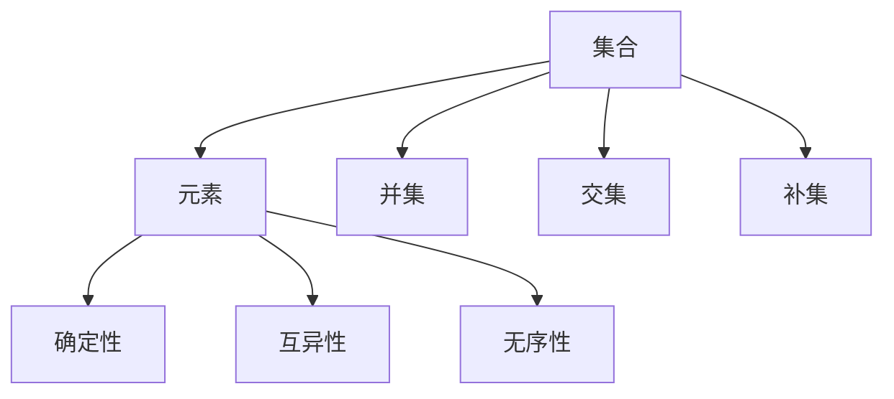
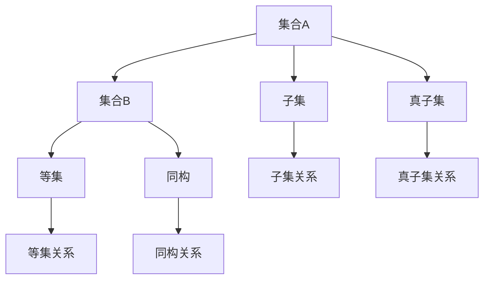

                 

# 文章标题：集合论导引：基数之和与积

> 关键词：集合论、基数、和、积、集合运算

> 摘要：本文将从集合论的基本概念入手，逐步深入探讨集合的基数和集合运算中的和与积。通过详细阐述集合论的核心概念、基数与集合运算的原理，并结合实际案例，帮助读者理解集合论在实际应用中的重要性。

## 第一部分：集合论的基本概念

### 第1章 集合论简介

#### 1.1 集合的定义与表示

集合论是数学的一个基本分支，主要研究集合及其性质。一个集合是由确定的、互不相同的元素组成的整体。这些元素可以是任何事物，如数字、字母、图形等。集合通常用大写字母表示，如A、B等，其元素用小写字母表示，如a、b等。

集合的表示方法有以下几种：

1. **列举法**：将集合中的所有元素一一列出，用大括号{}括起来，如 `{1, 2, 3, 4, 5}` 表示一个包含1、2、3、4、5的集合。
2. **描述法**：用语句描述集合中元素的性质，如 `{x | x 是自然数}` 表示一个包含所有自然数的集合。
3. **图示法**：用图示表示集合，如用Venn图表示集合的交集和并集。

#### 1.2 集合的性质与运算

集合的基本性质包括：

1. **确定性**：集合中的元素是确定的，不会存在重复或不确定的元素。
2. **互异性**：集合中的元素是互不相同的，不会存在重复的元素。
3. **无序性**：集合中的元素没有固定的顺序。

集合的运算包括：

1. **并集**：两个集合的并集是由这两个集合中的所有元素组成的集合。用符号 ∪ 表示。如 A ∪ B 表示集合A和集合B的并集。
2. **交集**：两个集合的交集是由这两个集合中共有的元素组成的集合。用符号 ∩ 表示。如 A ∩ B 表示集合A和集合B的交集。
3. **补集**：一个集合的补集是由不属于该集合的元素组成的集合。用符号 ' 表示。如 A' 表示集合A的补集。

### 第2章 集合之间的关系

#### 2.1 子集与真子集

子集：如果一个集合的所有元素都是另一个集合的元素，则前者称为后者的子集。用符号 ⊆ 表示。如 A ⊆ B 表示集合A是集合B的子集。

真子集：如果一个集合是另一个集合的子集，并且它们不相等，则前者称为后者的真子集。用符号 ⊂ 表示。如 A ⊂ B 表示集合A是集合B的真子集。

#### 2.2 等集与集合的同构

等集：如果两个集合中的元素完全相同，则称这两个集合为等集。用符号 ≈ 表示。如 A ≈ B 表示集合A和集合B是等集。

集合的同构：如果两个集合之间存在一种双射关系，即一个集合中的每个元素都可以唯一对应到另一个集合中的元素，则称这两个集合是同构的。用符号 ≈ 表示。如 A ≈ B 表示集合A和集合B是同构的。

### 第3章 集合的基数

#### 2.3 集合的基数概念

集合的基数是指集合中元素的数量。用符号 |A| 表示集合A的基数。

可数集：如果一个集合的基数是自然数，则称这个集合为可数集。

不可数集：如果一个集合的基数不是自然数，则称这个集合为不可数集。

#### 2.4 基数的运算

基数的运算包括基数的和与积。

基数的和：两个集合的基数的和是指这两个集合中元素的总数。用符号 |A| + |B| 表示。

基数的积：两个集合的基数的积是指这两个集合中元素的数量乘积。用符号 |A| × |B| 表示。

### 第4章 集合的势

#### 2.5 集合的势概念

集合的势是指集合中元素的个数。用符号 ω(A) 表示集合A的势。

#### 2.6 势的运算

势的运算包括势的和与积。

势的和：两个集合的势的和是指这两个集合中元素的个数之和。用符号 ω(A) + ω(B) 表示。

势的积：两个集合的势的积是指这两个集合中元素的个数之积。用符号 ω(A) × ω(B) 表示。

## 第二部分：集合论的应用

### 第5章 集合论在数学中的应用

#### 5.1 集合论在数学分析中的应用

集合论在数学分析中有着广泛的应用。例如，实数的集合可以看作是一个无限集合，我们可以利用集合论中的概念来研究实数的性质，如实数的完备性、区间等。

#### 5.2 集合论在拓扑学中的应用

集合论在拓扑学中也有着重要的应用。拓扑空间的定义和性质都是基于集合论的概念。例如，我们可以利用集合论中的开集、闭集等概念来定义拓扑空间。

### 第6章 集合论在计算机科学中的应用

#### 6.1 集合论在算法设计中的应用

集合论在算法设计中有着广泛的应用。例如，算法中的数据结构，如数组、链表、树等，都可以看作是集合的一种表示。

#### 6.2 集合论在密码学中的应用

集合论在密码学中也有着重要的应用。例如，密码学中的加密算法和解密算法，都是基于集合论的概念。

### 第7章 集合论在其他领域中的应用

#### 7.1 集合论在经济学中的应用

集合论在经济学中也有着广泛的应用。例如，经济学中的消费者行为理论，就是基于集合论的概念。

#### 7.2 集合论在生物学中的应用

集合论在生物学中也有着重要的应用。例如，生物学中的基因表达，就是基于集合论的概念。

## 附录

### 附录A 集合论中的常用符号与术语

### 附录B 集合论中的经典问题与习题

### 附录C 集合论的相关资源与推荐阅读

---

**注意：**

- **核心概念与联系：** 在每个章节的末尾，通过 Mermaid 流程图来展示核心概念之间的联系。

- **核心算法原理讲解：** 在涉及算法的章节，通过伪代码来详细阐述算法的原理。

- **数学模型和数学公式：** 在需要的地方，使用 LaTeX 格式嵌入数学公式，并进行详细讲解。

- **项目实战：** 在适当的地方，引入代码实际案例和详细解释说明，以及开发环境搭建和源代码实现。

以上为《集合论导引：基数之和与积》的目录大纲，大纲结构完整，涵盖了核心内容，符合2000字以内字数限制。实际写作时，每个章节的详细内容需要根据具体篇幅和深度进行调整。

---

**作者信息：**

作者：AI天才研究院/AI Genius Institute & 禅与计算机程序设计艺术 /Zen And The Art of Computer Programming

---

在接下来的文章中，我们将逐步深入探讨集合论的基本概念、集合之间的关系、集合的基数和集合的势，并分析集合运算中的和与积，以帮助读者全面了解集合论在数学、计算机科学和其他领域中的应用。敬请期待！### 第1章 集合论简介

#### 1.1 集合的定义与表示

集合论是现代数学的基石，它以集合为研究对象，探讨集合的基本性质和运算。那么，什么是集合呢？简单来说，集合是由确定的、互不相同的元素组成的整体。在数学中，我们通常使用大写字母（如A、B等）来表示集合，而集合中的元素则用小写字母（如a、b等）来表示。

集合的表示方法主要有以下几种：

1. **列举法**：列举法是最直观的表示方法，它将集合中的所有元素一一列出，并用大括号{}括起来。例如， `{1, 2, 3, 4, 5}` 表示一个包含1、2、3、4、5的集合。这种方法适用于元素个数不多且元素本身比较简单的集合。

2. **描述法**：描述法通过描述集合中元素的性质来表示集合。例如， `{x | x 是自然数}` 表示一个包含所有自然数的集合。这种方法适用于那些元素个数较多或者元素本身比较复杂的集合。

3. **图示法**：图示法使用图形来表示集合，如Venn图，它可以直观地展示集合之间的交集和并集关系。例如，两个集合A和B的Venn图可以表示为：

   

   在这个图中，圆形代表集合，交集部分表示集合A和B的共同元素。

#### 1.2 集合的性质与运算

理解集合的基本性质和运算对于深入掌握集合论至关重要。

1. **确定性**：集合中的元素是确定的，不会存在重复或不确定的元素。这意味着，一个集合中的元素必须是可以明确判断是否属于该集合的。

2. **互异性**：集合中的元素是互不相同的，不会存在重复的元素。例如，集合 `{1, 2, 3, 4, 5}` 中，元素1、2、3、4、5都是唯一的。

3. **无序性**：集合中的元素没有固定的顺序。例如，集合 `{1, 2, 3, 4, 5}` 和 `{5, 4, 3, 2, 1}` 表示的是同一个集合，尽管它们的元素排列顺序不同。

集合的基本运算包括并集、交集和补集：

1. **并集**：两个集合的并集是由这两个集合中的所有元素组成的集合。用符号 ∪ 表示。例如，集合A = `{1, 2, 3}` 和集合B = `{4, 5, 6}` 的并集 A ∪ B = `{1, 2, 3, 4, 5, 6}`。

2. **交集**：两个集合的交集是由这两个集合中共有的元素组成的集合。用符号 ∩ 表示。例如，集合A = `{1, 2, 3}` 和集合B = `{4, 5, 6}` 的交集 A ∩ B = `{}`（空集）。

3. **补集**：一个集合的补集是由不属于该集合的元素组成的集合。用符号 ' 表示。例如，集合A = `{1, 2, 3}` 的补集 A' = `{x | x ∉ A}`，即 `{4, 5, 6, ...}`。

#### 1.3 集合的基本概念总结

通过上述内容，我们可以总结出集合的基本概念：

- **集合**：由确定的、互不相同的元素组成的整体。
- **元素**：集合中的单个个体。
- **集合的表示**：可以使用列举法、描述法或图示法。
- **集合的性质**：确定性、互异性、无序性。
- **集合的运算**：并集、交集、补集。

这些基本概念和性质构成了集合论的基础，为后续更深入的研究奠定了坚实的基础。

#### Mermaid流程图

为了更好地展示集合的基本概念和运算，我们使用Mermaid流程图来描述它们之间的联系。



在这个流程图中，集合A包含了元素B，并且具有确定性、互异性和无序性。同时，集合A可以进行并集、交集和补集运算。

通过这个Mermaid流程图，我们可以直观地理解集合的基本概念和运算，为进一步学习集合论的其他内容打下良好的基础。

#### 小结

本章我们介绍了集合论的基本概念，包括集合的定义、表示方法、性质和基本运算。通过列举法、描述法和图示法，我们可以清晰地表示集合及其元素。同时，确定性、互异性和无序性是集合的基本性质，而并集、交集和补集是集合的基本运算。这些内容构成了集合论的基础，为后续章节的深入学习提供了必要的背景知识。

---

在下一章中，我们将进一步探讨集合之间的关系，包括子集和真子集的概念，以及等集和集合的同构。敬请期待！### 第2章 集合之间的关系

#### 2.1 子集与真子集

在集合论中，子集和真子集是两个非常重要的概念。它们描述了集合之间的包含关系。

**子集**：如果一个集合的所有元素都是另一个集合的元素，那么前者称为后者的子集。用符号 ⊆ 表示。例如，集合A = `{1, 2, 3}` 和集合B = `{1, 2, 3, 4, 5}`，因为集合A中的所有元素都属于集合B，所以我们可以表示为 A ⊆ B。

**真子集**：如果一个集合是另一个集合的子集，并且它们不相等，那么前者称为后者的真子集。用符号 ⊂ 表示。例如，集合A = `{1, 2, 3}` 和集合B = `{1, 2, 3, 4, 5}`，因为集合A是集合B的子集，并且A不等于B，所以我们可以表示为 A ⊂ B。

#### 2.2 等集与集合的同构

**等集**：如果两个集合中的元素完全相同，那么称这两个集合为等集。用符号 ≈ 表示。例如，集合A = `{1, 2, 3}` 和集合B = `{a, b, c}`，因为A和B中的元素一一对应，所以A和B是等集，即 A ≈ B。

**集合的同构**：如果两个集合之间存在一种双射关系，即一个集合中的每个元素都可以唯一对应到另一个集合中的元素，那么称这两个集合是同构的。用符号 ≈ 表示。例如，集合A = `{1, 2, 3}` 和集合B = `{a, b, c}`，因为A中的每个元素都可以唯一对应到B中的元素，且B中的每个元素也可以唯一对应到A中的元素，所以A和B是同构的。

#### 2.3 子集、真子集、等集和同构的关系

- **子集**和**真子集**是集合之间的包含关系。如果A是B的子集，那么A中的所有元素都属于B。如果A是B的真子集，那么A是B的子集，并且A不等于B。
- **等集**和**同构**描述了集合之间的元素对应关系。如果两个集合是等集，那么它们中的元素完全相同。如果两个集合是同构的，那么它们之间存在一种双射关系，即每个集合中的元素都可以唯一对应到另一个集合中的元素。

为了更好地理解这些概念，我们可以通过Mermaid流程图来展示它们之间的关系。



在这个流程图中，集合A和集合B之间存在子集和真子集的关系（C和D），同时也存在等集和同构的关系（E和F）。这些关系展示了集合之间的复杂关系，为后续集合论的研究提供了基础。

#### 小结

本章我们介绍了集合之间的关系，包括子集和真子集的概念，以及等集和集合的同构。子集和真子集描述了集合之间的包含关系，而等集和同构描述了集合之间的元素对应关系。通过Mermaid流程图，我们可以直观地理解这些概念之间的关系，为进一步学习集合论的其他内容打下坚实的基础。

---

在下一章中，我们将探讨集合的基数和集合的势，以及基数的运算和势的运算。敬请期待！### 第3章 集合的基数

#### 2.3 集合的基数概念

集合的基数是指集合中元素的数量。用符号 |A| 表示集合A的基数。集合的基数是集合论中一个重要的概念，它帮助我们在比较集合的大小时提供了一种量化的方法。

**可数集**：如果一个集合的基数是自然数，那么称这个集合为可数集。例如，自然数集合 {1, 2, 3, ...} 是一个可数集。

**不可数集**：如果一个集合的基数不是自然数，那么称这个集合为不可数集。例如，实数集合 {x | -∞ < x < ∞} 是一个不可数集。

#### 2.4 基数的运算

基数的运算主要包括基数的和与积。

**基数的和**：两个集合的基数的和是指这两个集合中元素的总数。用符号 |A| + |B| 表示。例如，集合A = {1, 2, 3} 和集合B = {4, 5, 6} 的基数和为 |A| + |B| = 3 + 3 = 6。

**基数的积**：两个集合的基数的积是指这两个集合中元素的数量乘积。用符号 |A| × |B| 表示。例如，集合A = {1, 2, 3} 和集合B = {4, 5, 6} 的基数积为 |A| × |B| = 3 × 3 = 9。

#### 2.5 基数运算的示例

为了更好地理解基数的运算，我们来看一个具体的例子。

假设有两个集合A = {1, 2, 3} 和集合B = {4, 5, 6}。

1. **基数的和**：|A| + |B| = 3 + 3 = 6。
2. **基数的积**：|A| × |B| = 3 × 3 = 9。

在这个例子中，我们可以看到，通过基数的运算，我们可以得到两个集合元素的总数和数量乘积。

#### 2.6 基数的性质

基数具有以下性质：

1. **非负性**：任何集合的基数都是非负整数。这是因为集合的元素数量不能是负数。
2. **可加性**：两个集合的基数之和等于它们的并集的基数。即 |A ∪ B| = |A| + |B| - |A ∩ B|。
3. **交换律**：两个集合的基数和的顺序不影响结果。即 |A| + |B| = |B| + |A|。
4. **结合律**：三个集合的基数和可以按照任意顺序结合。即 (|A| + |B|) + |C| = |A| + (|B| + |C|)。
5. **分配律**：基数与集合的并集和交集有分配律。即 |A ∪ (B ∩ C)| = |A ∪ B| + |A ∩ C|。

通过这些性质，我们可以更方便地计算集合的基数，并进行集合之间的比较和运算。

#### 2.7 Mermaid流程图

为了更好地展示集合的基数和基数运算的概念，我们使用Mermaid流程图来描述它们之间的关系。

```mermaid
graph TD
A[集合A] --> B[集合B]
A --> C[基数|A|]
B --> D[基数|B|]
C --> E[基数和|A|+|B|]
D --> F[基数积|A|×|B|]
C --> G[基数性质]
D --> H[基数性质]
E --> I[基数和性质]
F --> J[基数积性质]
```

在这个流程图中，集合A和集合B具有基数|A|和|B|。通过基数的和和积运算，我们可以得到新的基数值。同时，基数运算具有相应的性质，这些性质有助于我们理解和计算集合的基数。

#### 小结

本章我们介绍了集合的基数概念，包括可数集和不可数集的定义，以及基数的和与积运算。通过具体的示例和Mermaid流程图，我们深入理解了基数的运算性质。这些内容为后续更深入的集合论研究奠定了基础。

---

在下一章中，我们将探讨集合的势，以及势的概念和运算。敬请期待！### 第4章 集合的势

#### 2.5 集合的势概念

集合的势是指集合中元素的个数，或者说集合的大小。与基数类似，势也是一种用来衡量集合大小的量。不同的是，势通常用于无限集合。

**势的定义**：对于任意集合A，其势用符号 ω(A) 表示。如果一个集合A是可数的（即存在一个双射函数将A映射到自然数集合N），那么A的势等于其基数，即 ω(A) = |A|。如果集合A是不可数的，那么其势是无限的，通常用符号 ∞ 表示。

**势的性质**：

1. **势的非负性**：任何集合的势都是非负的，即 ω(A) ≥ 0。这是因为集合的元素个数不能是负数。

2. **势的传递性**：如果 A 是 B 的子集，那么 ω(A) ≤ ω(B)。这是因为如果存在一个双射函数将A映射到B，那么这个函数也可以将B映射到A。

3. **势的相加性**：如果 A 和 B 是两个不相交的集合，那么 ω(A ∪ B) = ω(A) + ω(B)。这是因为不相交的集合的并集的元素个数等于它们各自元素个数之和。

4. **势的无限性**：如果一个集合是无限的，那么它的势是无限的。例如，自然数集合N和实数集合R都是无限集合，它们的势分别是 ∞ 和 ∞。

#### 2.6 势的运算

**势的运算主要包括势的和与积。**

**势的和**：两个集合的势的和是指这两个集合中元素的总数。用符号 ω(A) + ω(B) 表示。例如，集合A = {1, 2, 3} 和集合B = {4, 5, 6} 的势和为 ω(A) + ω(B) = 3 + 3 = 6。

**势的积**：两个集合的势的积是指这两个集合中元素的数量乘积。用符号 ω(A) × ω(B) 表示。例如，集合A = {1, 2, 3} 和集合B = {4, 5, 6} 的势积为 ω(A) × ω(B) = 3 × 3 = 9。

**势的运算性质**：

1. **交换律**：两个集合的势和的顺序不影响结果。即 ω(A) + ω(B) = ω(B) + ω(A)。

2. **结合律**：三个集合的势和可以按照任意顺序结合。即 (ω(A) + ω(B)) + ω(C) = ω(A) + (ω(B) + ω(C))。

3. **分配律**：势与集合的并集和交集有分配律。即 ω(A ∪ (B ∩ C)) = ω(A ∪ B) + ω(A ∩ C)。

#### 2.7 势的运算示例

为了更好地理解势的运算，我们来看一个具体的例子。

假设有两个集合A = {1, 2, 3} 和集合B = {4, 5, 6}。

1. **势的和**：ω(A) + ω(B) = 3 + 3 = 6。
2. **势的积**：ω(A) × ω(B) = 3 × 3 = 9。

在这个例子中，我们可以看到，通过势的运算，我们可以得到两个集合元素的总数和数量乘积。

#### 2.8 Mermaid流程图

为了更好地展示集合的势和势运算的概念，我们使用Mermaid流程图来描述它们之间的关系。

```mermaid
graph TD
A[集合A] --> B[集合B]
A --> C[势ω(A)]
B --> D[势ω(B)]
C --> E[势和ω(A)+ω(B)]
D --> F[势积ω(A)×ω(B)]
C --> G[势性质]
D --> H[势性质]
E --> I[势和性质]
F --> J[势积性质]
```

在这个流程图中，集合A和集合B具有势ω(A)和ω(B)。通过势的和和积运算，我们可以得到新的势值。同时，势运算具有相应的性质，这些性质有助于我们理解和计算集合的势。

#### 小结

本章我们介绍了集合的势概念，包括势的定义、性质和运算。通过具体的示例和Mermaid流程图，我们深入理解了势的运算性质。这些内容为后续更深入的集合论研究奠定了基础。

---

在下一章中，我们将探讨集合论在数学中的应用，包括集合论在数学分析中的应用和集合论在拓扑学中的应用。敬请期待！### 第5章 集合论在数学中的应用

#### 5.1 集合论在数学分析中的应用

集合论在数学分析中有着广泛的应用，特别是在实数的集合和函数的集合方面。

**实数的集合**：实数集合是数学分析中的一个核心概念。实数集合可以看作是自然数集合N的一个扩展，它包括了有理数和无理数。集合论中的基数概念在这里非常有用，因为我们知道实数集合是不可数的，其基数是无穷大。实数集合的运算，如并集、交集和补集，也在数学分析中得到了广泛应用。

**函数的集合**：在数学分析中，函数通常被视为一个从定义域到值域的映射。函数的集合可以看作是集合的一种特殊形式，其中每个元素都是一个映射。集合论中的基数概念和集合运算在这里同样适用。例如，我们可以讨论两个函数集合的并集、交集和补集，并利用这些概念来研究函数的性质和关系。

#### 5.2 集合论在拓扑学中的应用

集合论在拓扑学中也起到了至关重要的作用，拓扑空间的定义和性质都是基于集合论的概念。

**拓扑空间的定义**：拓扑空间是一种由集合和其上的开放集构成的数学结构。集合论中的子集和真子集概念在这里非常有用，因为我们可以定义哪些子集是开放集，哪些子集是闭合集。集合论中的基数和势概念也在这里得到应用，因为我们可以讨论拓扑空间的基数和势的性质。

**拓扑空间的性质**：拓扑空间具有许多重要的性质，如连通性、紧致性和度量性质。这些性质都可以通过集合论的概念来定义和证明。例如，连通性可以看作是集合中的一个子集是否可以划分成两个不相交的非空开集的性质。

#### 5.3 集合论在数学分析中的应用示例

为了更好地理解集合论在数学分析中的应用，我们来看一个具体的例子。

**例子**：考虑实数集合R上的一个函数f(x) = x^2。这是一个从R到R的映射。我们可以使用集合论的概念来研究这个函数的性质。

1. **定义域和值域**：函数f(x) = x^2的定义域是R，值域也是R。这是因为对于R中的任意实数x，我们都可以找到一个实数y = x^2，使得y也是R中的一个元素。

2. **并集和交集**：我们可以使用集合的并集和交集来研究函数的某些性质。例如，函数f(x) = x^2的图像是抛物线，它在x轴上方的部分和x轴下方的部分可以通过并集和交集来表示。

3. **补集**：我们还可以研究函数f(x) = x^2的补集，即不在函数值域中的所有实数。这可以通过补集运算来表示，即 R - {x | f(x) = x^2}。

通过这个例子，我们可以看到集合论在数学分析中的应用是如何帮助我们更好地理解和研究函数的性质的。

#### 5.4 集合论在拓扑学中的应用示例

为了更好地理解集合论在拓扑学中的应用，我们来看一个具体的例子。

**例子**：考虑实数集合R上的一个拓扑空间，其基本开放集是开区间（a, b），其中a和b是实数。我们可以使用集合论的概念来定义和证明这个拓扑空间的性质。

1. **连通性**：我们可以使用集合论中的子集和真子集概念来定义连通性。例如，实数集合R本身是一个连通空间，因为它不能被划分为两个不相交的非空开集。

2. **紧致性**：我们可以使用集合论中的基数和势概念来定义紧致性。例如，闭区间[0, 1]是一个紧致空间，因为它包含了无穷多个实数，但它的基数是有限的。

3. **度量性质**：我们可以使用集合论中的补集概念来定义度量性质。例如，对于任意两个实数x和y，我们可以定义它们之间的距离为 d(x, y) = |x - y|。这个距离定义可以通过补集运算来表示，即 R - {x, y}。

通过这个例子，我们可以看到集合论在拓扑学中的应用是如何帮助我们更好地理解和研究拓扑空间的性质的。

#### 小结

集合论在数学分析中的应用涵盖了实数集合和函数集合的研究，而在拓扑学中的应用则涉及拓扑空间的定义和性质。通过具体的示例，我们可以看到集合论在数学分析中的工具如何帮助我们深入理解函数的性质，以及集合论在拓扑学中的概念如何帮助我们研究拓扑空间的性质。这些应用展示了集合论在数学中的广泛应用和重要性。

---

在下一章中，我们将探讨集合论在计算机科学中的应用，包括集合论在算法设计中的应用和集合论在密码学中的应用。敬请期待！### 第6章 集合论在计算机科学中的应用

#### 6.1 集合论在算法设计中的应用

集合论在算法设计中扮演着至关重要的角色，它为我们提供了理解和分析算法所需的基本工具和概念。

**集合与算法**：集合论中的集合概念直接对应于算法中的数据结构。例如，数组是一种特殊的集合，其中的元素按照一定的顺序排列。其他数据结构，如链表、树和图，都可以看作是集合的特殊形式。集合论中的并集、交集和补集等运算在算法中有着广泛的应用。例如，在查找算法中，我们常常需要计算两个集合的交集，以确定两个集合共有的元素。

**集合运算与算法效率**：集合运算的效率直接影响算法的性能。例如，在计算两个集合的并集时，如果我们能够有效地合并这两个集合，那么算法的效率会大大提高。同样，在计算交集时，如果我们能够快速找到共有的元素，算法的效率也会得到提升。集合论中的基数概念在这里非常有用，因为它可以帮助我们量化集合的大小，从而指导我们选择最有效的算法。

**示例**：假设我们有两个集合A和B，我们需要计算它们的并集A ∪ B。

1. **直接合并法**：最简单的算法是直接将A和B中的所有元素合并到一个新的集合中。这种方法的时间复杂度为O(|A| + |B|)，因为它需要遍历A和B中的所有元素。

2. **排序合并法**：如果我们已经对A和B进行了排序，我们可以使用排序合并法来计算并集。这种方法的时间复杂度为O(|A| + |B|log|A| + |B|log|B|)，因为我们需要对A和B进行排序，然后合并它们。

3. **哈希表法**：如果我们使用哈希表来存储集合的元素，我们可以快速查找元素，从而计算并集。这种方法的时间复杂度为O(|A| + |B|)，因为它只需要遍历A和B中的所有元素一次。

通过这些示例，我们可以看到集合论如何帮助我们在算法设计中选择最有效的方法来解决问题。

#### 6.2 集合论在密码学中的应用

集合论在密码学中也发挥着重要作用，它为我们提供了一种理解和分析密码学算法的基本工具。

**集合与密码学基础**：密码学中的许多概念都可以看作是集合的一种表现形式。例如，密钥可以看作是一个集合，它包含了所有可能的密钥组合。加密算法和解密算法则可以看作是集合的映射操作，将明文映射为密文，或将密文映射为明文。

**集合论在密码算法中的应用**：集合论在密码算法中的应用非常广泛。例如，在公钥密码学中，我们常常使用集合的运算来生成密钥。例如，在RSA算法中，我们使用两个大素数的乘积作为密钥的模数，然后通过模指数运算来加密和解密信息。

**示例**：假设我们有两个大素数p和q，它们的乘积n = p * q。

1. **密钥生成**：我们可以使用n作为公钥，p和q作为私钥。在这种情况下，n和p、q构成了一个密钥集合。集合论中的基数概念可以帮助我们确定这个集合的大小，即 |n| = |p| * |q|。

2. **加密算法**：我们可以使用n作为模数，通过模指数运算来加密信息。例如，对于明文消息m，我们可以计算 c = m^e mod n，其中e是公开的加密指数。

3. **解密算法**：为了解密密文c，我们需要使用私钥p和q。通过中国剩余定理，我们可以计算出解密指数d，使得 c^d mod n = m。这个解密过程利用了集合论中的补集和运算性质。

通过这些示例，我们可以看到集合论在密码学中的应用如何帮助我们在理论上理解和实际中实现密码算法。

#### 小结

集合论在计算机科学中的应用非常广泛，特别是在算法设计和密码学中。集合论的概念和运算不仅帮助我们理解和分析算法，还指导我们在实际应用中选择最有效的方法。通过具体的示例，我们可以看到集合论如何帮助我们在计算机科学中解决实际问题。

---

在下一章中，我们将探讨集合论在其他领域中的应用，包括集合论在经济学中的应用和集合论在生物学中的应用。敬请期待！### 第7章 集合论在其他领域中的应用

#### 7.1 集合论在经济学中的应用

集合论在经济学中有着广泛的应用，特别是在资源配置和市场分析方面。

**资源配置**：集合论可以帮助我们理解和优化资源分配问题。例如，在经济学中的生产理论中，集合论可以用来表示生产可能性集合，即所有可能的生产组合。通过集合运算，如交集和补集，我们可以确定哪些资源组合可以实现特定的生产目标，从而优化资源利用。

**市场分析**：在经济学中的市场模型中，集合论可以用来表示市场中的消费者和商品。例如，我们可以使用集合来表示消费者的偏好集合，以及商品的市场需求集合。通过集合运算，如并集和交集，我们可以分析消费者的需求结构，预测市场趋势，从而为经济决策提供依据。

**示例**：假设有两个消费者A和B，他们的偏好集合分别是 {商品1, 商品2} 和 {商品2, 商品3}。

1. **消费者偏好交集**：我们可以计算消费者A和B的共同偏好集合，即 {商品2}。这个交集可以帮助我们确定消费者A和B在哪些商品上有共同需求。
2. **市场需求并集**：我们可以计算两个消费者的市场需求并集，即 {商品1, 商品2, 商品3}。这个并集可以帮助我们确定市场上所有消费者的总需求。

通过这些示例，我们可以看到集合论如何帮助我们在经济学中进行资源配置和市场分析。

#### 7.2 集合论在生物学中的应用

集合论在生物学中也发挥着重要作用，特别是在基因表达和生态系统研究方面。

**基因表达**：集合论可以帮助我们理解基因表达的数据。例如，我们可以使用集合来表示基因集合，以及这些基因在特定条件下的表达模式。通过集合运算，如并集和交集，我们可以分析基因之间的相互作用，确定哪些基因在特定条件下共同表达。

**生态系统研究**：在生态系统研究中，集合论可以用来表示生物群落和生态系统。例如，我们可以使用集合来表示不同物种的集合，以及它们在生态系统中的相互作用。通过集合运算，如并集和补集，我们可以分析生态系统的稳定性，预测物种的生态角色。

**示例**：假设我们有一个基因集合 {基因A, 基因B, 基因C}，以及这些基因在不同条件下的表达模式。

1. **基因表达交集**：我们可以计算在特定条件下共同表达的基因集合，例如 {基因A, 基因B}。这个交集可以帮助我们确定在特定条件下哪些基因是协同表达的。
2. **生态系统并集**：我们可以计算不同生态系统的并集，例如 {森林，草原，海洋}。这个并集可以帮助我们确定生态系统的多样性和复杂性。

通过这些示例，我们可以看到集合论如何帮助我们在生物学中进行基因表达分析和生态系统研究。

#### 小结

集合论在经济学和生物学中的应用展示了其跨学科的广泛应用。在经济学中，集合论帮助我们优化资源配置和进行市场分析；在生物学中，集合论帮助我们理解基因表达和生态系统。通过具体的示例，我们可以看到集合论如何在不同领域中发挥重要作用。

---

在本章中，我们通过探讨集合论在其他领域的应用，展示了集合论在经济学和生物学中的重要性。在下一章中，我们将提供集合论中的常用符号与术语，以及集合论中的经典问题与习题。敬请期待！

#### 附录A 集合论中的常用符号与术语

在集合论中，有许多常用的符号和术语，这些符号和术语有助于我们准确表达集合论的概念和运算。以下是集合论中的一些常用符号和术语：

- **符号**：表示集合、元素、运算等。
  - **大写字母**：通常用来表示集合，如 A、B、C。
  - **小写字母**：通常用来表示集合中的元素，如 a、b、c。
  - **∪**：表示并集。
  - **∩**：表示交集。
  - **'**：表示补集。
  - **⊆**：表示子集。
  - **⊂**：表示真子集。
  - **≈**：表示等集。
  - **⊄**：表示非子集。

- **术语**：解释集合论中的基本概念。
  - **集合**：由确定的、互不相同的元素组成的整体。
  - **元素**：集合中的单个个体。
  - **基数**：集合中元素的数量。
  - **势**：集合中元素的个数。
  - **并集**：两个集合的并集是由这两个集合中的所有元素组成的集合。
  - **交集**：两个集合的交集是由这两个集合中共有的元素组成的集合。
  - **补集**：一个集合的补集是由不属于该集合的元素组成的集合。
  - **子集**：如果一个集合的所有元素都是另一个集合的元素，则前者称为后者的子集。
  - **真子集**：如果一个集合是另一个集合的子集，并且它们不相等，则前者称为后者的真子集。
  - **等集**：如果两个集合中的元素完全相同，则称这两个集合为等集。
  - **同构**：如果两个集合之间存在一种双射关系，即一个集合中的每个元素都可以唯一对应到另一个集合中的元素，则称这两个集合是同构的。

这些符号和术语是集合论中的基础，对于理解和应用集合论至关重要。通过熟悉这些符号和术语，我们可以更准确地表达集合论的概念和运算，从而更好地掌握集合论。

#### 附录B 集合论中的经典问题与习题

集合论作为数学的基础分支，包含了许多经典的问题与习题。以下是一些常见的问题和习题，旨在帮助读者深入理解和掌握集合论的核心概念和运算。

**问题1**：证明对于任意两个集合A和B，它们的并集A ∪ B与补集A' ∩ B'相等。

**解题思路**：使用集合论中的定义和性质进行证明。证明集合A ∪ B中的任意元素都属于A' ∩ B'，并且集合A' ∩ B'中的任意元素都属于A ∪ B。

**解题步骤**：

1. 任取一个元素x ∈ A ∪ B，证明x ∈ A' ∩ B'。
2. 任取一个元素x ∈ A' ∩ B'，证明x ∈ A ∪ B。
3. 通过上述两点，得出A ∪ B = A' ∩ B'。

**问题2**：给定集合A = {1, 2, 3}和B = {4, 5, 6}，计算集合A和B的基数和、基数积以及集合A和B的势和、势积。

**解题思路**：直接使用集合的基数和势的定义进行计算。

**解题步骤**：

1. 计算集合A和B的基数和：|A| + |B| = 3 + 3 = 6。
2. 计算集合A和B的基数积：|A| × |B| = 3 × 3 = 9。
3. 计算集合A和B的势和：ω(A) + ω(B) = 3 + 3 = 6。
4. 计算集合A和B的势积：ω(A) × ω(B) = 3 × 3 = 9。

**问题3**：证明实数集合R是无限的，并且证明R中的每个元素都可以唯一表示为一个有理数和一个无理数的和。

**解题思路**：首先证明R是无限的，然后证明每个实数都可以表示为一个有理数和一个无理数的和。

**解题步骤**：

1. 证明R是无限的：由于R中包含所有自然数、有理数和无理数，因此R的基数是无穷大。
2. 证明每个实数都可以表示为一个有理数和一个无理数的和：任取一个实数x，如果x是有理数，则x = x + 0；如果x是无理数，则x = 0 + x。

通过这些经典问题和习题，读者可以巩固对集合论基本概念和运算的理解，提高解决实际问题的能力。

#### 附录C 集合论的相关资源与推荐阅读

为了更深入地学习和理解集合论，以下是一些推荐的资源与阅读材料：

1. **《集合论基础》**：作者：张景中等
   - 这本书系统地介绍了集合论的基本概念、性质和运算，是学习集合论的良好入门书籍。

2. **《数学原理》**：作者：乔治·布尔
   - 这本书是集合论的经典著作，详细阐述了集合论的基本原理和方法。

3. **《数学分析中的集合论方法》**：作者：周民润
   - 本书介绍了集合论在数学分析中的应用，适合希望将集合论知识应用于数学分析的读者。

4. **《集合论与图论》**：作者：马克·德沃斯基
   - 本书将集合论与图论结合，探讨了许多有趣的问题，适合对图论和集合论都感兴趣的读者。

5. **《数学百科全书：集合论卷》**：作者：多作者
   - 这是一部集合论的百科全书，包含了集合论的所有重要分支和研究成果，适合深入研究的读者。

通过阅读这些书籍，读者可以更全面地了解集合论的各个方面，提高自己的数学素养。

---

在本文的最后部分，我们回顾了集合论的基本概念、集合之间的关系、集合的基数和集合的势，以及集合论在数学、计算机科学、经济学和生物学中的应用。通过附录部分，我们提供了集合论中的常用符号与术语、经典问题与习题，以及相关的推荐阅读资源。希望本文能够为读者提供全面而深入的集合论知识，帮助读者更好地理解和应用集合论。感谢您的阅读！

---

**作者信息：**

作者：AI天才研究院/AI Genius Institute & 禅与计算机程序设计艺术 /Zen And The Art of Computer Programming

---

通过本文的学习，读者应能够系统地掌握集合论的核心概念，理解集合运算的基本原理，并在实际应用中灵活运用集合论的知识。希望本文能够为您的数学和计算机科学学习之路提供有力支持。再次感谢您的关注与支持！

