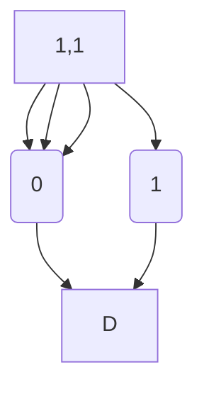
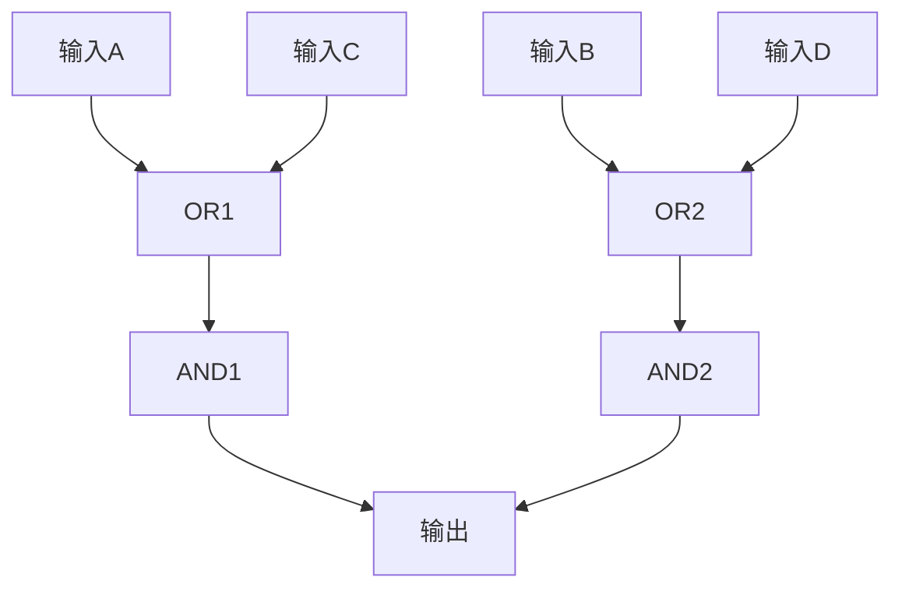
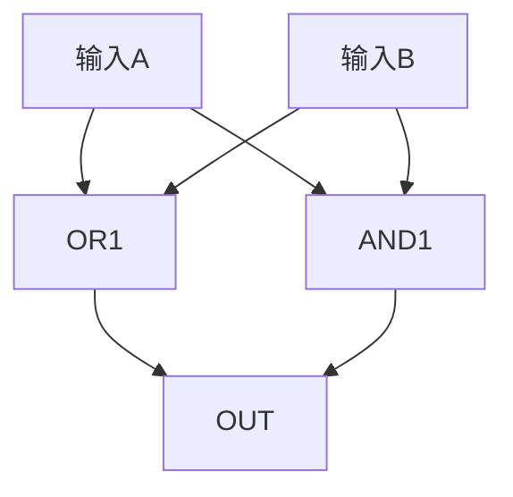

                 

# 集合论导引：完备布尔代数广义分配律

> 关键词：集合论、布尔代数、广义分配律、完备布尔代数、逻辑电路设计、密码学

> 摘要：本文以集合论为基础，深入探讨布尔代数及其广义分配律，特别是在完备布尔代数中的应用。文章首先介绍了集合论的基础概念和运算，随后详细阐述了布尔代数的基本概念、性质和运算，接着介绍了广义分配律的概念和应用。在此基础上，文章重点分析了完备布尔代数的定义、性质以及广义分配律在完备布尔代数中的重要性。随后，文章通过具体实例，展示了广义分配律在实际应用中的价值。最后，文章探讨了广义分配律的拓展和推广，以及完备布尔代数与广义分配律在计算机科学和其他领域中的实际应用。

## 目录

### 《集合论导引：完备布尔代数广义分配律》目录大纲

## 第1章 集合论基础

### 1.1 集合与集合论概述

#### 1.1.1 集合的基本概念

#### 1.1.2 集合论的历史与发展

### 1.2 集合的表示与运算

#### 1.2.1 集合的表示方法

#### 1.2.2 集合的基本运算

### 1.3 子集与超集

#### 1.3.1 子集的定义与性质

#### 1.3.2 超集的定义与性质

### 1.4 集合的划分与部分集合

#### 1.4.1 集合的划分方法

#### 1.4.2 部分集合的性质与应用

### 1.5 集合论中的关系

#### 1.5.1 关系的基本概念

#### 1.5.2 关系的性质与运算

### 1.6 集合的基数与势

#### 1.6.1 基数与势的概念

#### 1.6.2 基数与势的性质与应用

## 第2章 布尔代数与布尔函数

### 2.1 布尔代数的基本概念

#### 2.1.1 布尔代数的定义

#### 2.1.2 布尔代数的基本性质

### 2.2 布尔函数与布尔表达式

#### 2.2.1 布尔函数的定义

#### 2.2.2 布尔表达式的表示与化简

### 2.3 布尔函数的性质与运算

#### 2.3.1 布尔函数的基本性质

#### 2.3.2 布尔函数的运算规则

### 2.4 布尔函数的图像表示

#### 2.4.1 布尔函数图像的概念

#### 2.4.2 布尔函数图像的绘制方法

### 2.5 布尔函数的应用

#### 2.5.1 布尔函数在逻辑电路中的应用

#### 2.5.2 布尔函数在信息安全中的应用

## 第3章 完备布尔代数

### 3.1 完备布尔代数的定义

#### 3.1.1 完备布尔代数的概念

#### 3.1.2 完备布尔代数的性质

### 3.2 广义分配律的概念与应用

#### 3.2.1 广义分配律的定义

#### 3.2.2 广义分配律的应用

### 3.3 完备布尔代数的基本运算

#### 3.3.1 运算规则与性质

#### 3.3.2 运算实例解析

### 3.4 完备布尔代数在逻辑电路设计中的应用

#### 3.4.1 逻辑电路设计的基本概念

#### 3.4.2 完备布尔代数在逻辑电路设计中的应用实例

### 3.5 完备布尔代数在计算机科学中的其他应用

#### 3.5.1 计算机科学中的布尔代数应用概述

#### 3.5.2 完备布尔代数在密码学中的应用

## 第4章 广义分配律的拓展与推广

### 4.1 广义分配律的拓展

#### 4.1.1 广义分配律在其他数学领域中的应用

#### 4.1.2 广义分配律在逻辑电路设计中的拓展

### 4.2 广义分配律的推广

#### 4.2.1 广义分配律在计算机科学中的推广

#### 4.2.2 广义分配律在其他学科中的应用

### 4.3 广义分配律在代数结构中的地位

#### 4.3.1 代数结构的基本概念

#### 4.3.2 广义分配律在代数结构中的重要性

## 第5章 完备布尔代数与广义分配律的数学证明

### 5.1 完备布尔代数的基本定理证明

#### 5.1.1 空集与全集的基本性质

#### 5.1.2 补集的基本性质

#### 5.1.3 完备布尔代数的基本定理

### 5.2 广义分配律的证明

#### 5.2.1 广义分配律的基本性质

#### 5.2.2 广义分配律的证明过程

### 5.3 完备布尔代数与广义分配律在其他数学定理中的应用

#### 5.3.1 广义分配律在数学分析中的应用

#### 5.3.2 完备布尔代数在图论中的应用

## 第6章 完备布尔代数与广义分配律的实际应用

### 6.1 完备布尔代数在计算机科学中的应用

#### 6.1.1 计算机科学中的布尔代数应用概述

#### 6.1.2 完备布尔代数在计算机系统设计中的应用

### 6.2 广义分配律在逻辑电路设计中的应用

#### 6.2.1 逻辑电路设计的基本概念

#### 6.2.2 广义分配律在逻辑电路设计中的应用实例

### 6.3 完备布尔代数与广义分配律在密码学中的应用

#### 6.3.1 密码学的基本概念

#### 6.3.2 完备布尔代数与广义分配律在密码学中的应用实例

### 6.4 完备布尔代数与广义分配律在其他领域中的应用

#### 6.4.1 广义分配律在控制理论中的应用

#### 6.4.2 完备布尔代数在信息论中的应用

## 第7章 完备布尔代数与广义分配律的发展与展望

### 7.1 完备布尔代数与广义分配律的发展历程

#### 7.1.1 从布尔代数到完备布尔代数的演进

#### 7.1.2 广义分配律的提出与推广

### 7.2 完备布尔代数与广义分配律的研究现状

#### 7.2.1 当前研究的主要方向

#### 7.2.2 研究成果与应用案例

### 7.3 完备布尔代数与广义分配律的未来发展趋势

#### 7.3.1 预计的发展趋势

#### 7.3.2 对未来研究的建议

## 附录

### 附录A 完备布尔代数与广义分配律相关数学公式汇总

#### A.1 基本公式

#### A.2 广义分配律公式

#### A.3 其他相关公式

### 附录B 完备布尔代数与广义分配律常见问题解答

#### B.1 基本概念问题解答

#### B.2 应用问题解答

#### B.3 研究问题解答

### 附录C 参考文献

#### C.1 常用参考资料

#### C.2 相关书籍推荐

#### C.3 研究论文汇总

---

以上是《集合论导引：完备布尔代数广义分配律》的目录大纲，接下来我们将逐章深入探讨集合论、布尔代数及其广义分配律的相关内容。在接下来的章节中，我们将详细阐述集合论的基础概念、布尔代数的基本性质、广义分配律的概念和应用，以及完备布尔代数与广义分配律在实际应用中的重要性。让我们一步步地分析推理，深入理解这些概念和原理。让我们开始吧！## 第1章 集合论基础

### 1.1 集合与集合论概述

#### 1.1.1 集合的基本概念

集合是数学中最基础的概念之一，它是由确定的、互不相同的元素所组成的整体。这些元素可以是任何对象，无论是具体的物体、抽象的数字还是符号。集合的元素可以是有限的，也可以是无限的。

**集合的表示方法**：
集合通常用大写字母表示，如\( A, B, C \)等，其元素用逗号分隔，放在大括号内。例如，集合\( A = \{1, 2, 3\} \)表示一个包含元素1、2和3的集合。

**集合的分类**：
1. **有限集**：包含有限个元素的集合称为有限集。例如，集合\( A = \{1, 2, 3\} \)是一个有限集。
2. **无限集**：包含无限个元素的集合称为无限集。例如，自然数集合\( \mathbb{N} = \{1, 2, 3, \ldots\} \)是一个无限集。
3. **空集**：不包含任何元素的集合称为空集，用符号\( \emptyset \)或\( \{\} \)表示。
4. **全集**：包含讨论对象所在空间中所有元素的集合称为全集。在数学中，常用符号\( U \)或\( V \)表示。

**集合的运算**：
集合的运算主要包括并集、交集、补集和差集等。

- **并集（Union）**：两个集合A和B的并集是由属于A或属于B的元素组成的集合。用符号\( A \cup B \)表示。例如，\( A = \{1, 2, 3\} \)，\( B = \{3, 4, 5\} \)，则\( A \cup B = \{1, 2, 3, 4, 5\} \)。

- **交集（Intersection）**：两个集合A和B的交集是由同时属于A和B的元素组成的集合。用符号\( A \cap B \)表示。例如，\( A = \{1, 2, 3\} \)，\( B = \{3, 4, 5\} \)，则\( A \cap B = \{3\} \)。

- **补集（Complement）**：一个集合A的补集是由不属于A的元素组成的集合。用符号\( A' \)或\( \complement A \)表示。例如，全集\( U = \{1, 2, 3, 4, 5\} \)，集合\( A = \{1, 2, 3\} \)，则\( A' = \{4, 5\} \)。

- **差集（Difference）**：两个集合A和B的差集是由属于A但不属于B的元素组成的集合。用符号\( A - B \)或\( A \setminus B \)表示。例如，\( A = \{1, 2, 3\} \)，\( B = \{3, 4, 5\} \)，则\( A - B = \{1, 2\} \)。

#### 1.1.2 集合论的历史与发展

集合论是数学的基础，其发展历程可以追溯到19世纪。数学家乔治·康托尔（Georg Cantor）被认为是集合论的创始人。他在研究无穷集合的过程中，提出了集合的概念和集合的运算，奠定了现代集合论的基础。

康托尔的工作引起了数学界的广泛关注，但也引发了激烈的争议。集合论的一些基本概念，如无穷集合和集合的层次结构，挑战了传统的数学观念。尽管如此，集合论在数学中得到了广泛的应用，并成为了数学的基石。

20世纪，集合论继续发展，引入了更复杂的集合概念，如势、基数和集合的分类。数学家如恩斯特·策梅洛（Ernst Zermelo）和威廉·弗里德曼（Wilhelm Freudenthal）等人对集合论的基础进行了深入研究，提出了公理化的集合论系统。

集合论不仅在数学领域有着重要的应用，也在计算机科学、逻辑学、物理学和其他科学领域中发挥着关键作用。通过集合论，我们可以更清晰地理解复杂系统的结构和性质，为各种科学问题提供了有力的数学工具。

#### 1.2 集合的表示与运算

**集合的表示方法**：

- **列举法**：通过列出集合中的所有元素来表示集合。例如，集合\( A = \{1, 2, 3\} \)。

- **描述法**：通过描述集合中元素的性质来表示集合。例如，集合\( B = \{x \mid x \text{ 是自然数}\} \)。

- **图示法**：通过图形来表示集合。例如，用Venn图表示集合的交集和并集。

**集合的基本运算**：

- **并集**：\( A \cup B = \{x \mid x \in A \text{ 或 } x \in B\} \)。

- **交集**：\( A \cap B = \{x \mid x \in A \text{ 且 } x \in B\} \)。

- **补集**：\( A' = \{x \mid x \notin A\} \)。

- **差集**：\( A - B = \{x \mid x \in A \text{ 且 } x \notin B\} \)。

- **笛卡尔积**：\( A \times B = \{(a, b) \mid a \in A, b \in B\} \)。

**集合运算的示例**：

假设集合\( A = \{1, 2, 3\} \)，\( B = \{3, 4, 5\} \)，我们来计算并集、交集、补集和差集：

- 并集：\( A \cup B = \{1, 2, 3, 4, 5\} \)。

- 交集：\( A \cap B = \{3\} \)。

- 补集：\( A' = \{4, 5\} \)，\( B' = \{1, 2\} \)。

- 差集：\( A - B = \{1, 2\} \)，\( B - A = \{4, 5\} \)。

通过这些基本的集合运算，我们可以对集合进行操作，从而解决更复杂的问题。

#### 1.3 子集与超集

**子集（Subset）**：

- 如果集合A中的每一个元素都属于集合B，那么A是B的子集，记作\( A \subseteq B \)。
- 子集的关系可以用包含关系来表示，如\( A \subset B \)表示A是B的真子集，即A是B的子集但A不等于B。

**超集（Superset）**：

- 如果集合B中的每一个元素都属于集合A，那么B是A的超集，记作\( B \supseteq A \)。
- 超集的关系可以用包含关系来表示，如\( B \supset A \)表示B是A的真超集，即B是A的超集但B不等于A。

**子集与超集的示例**：

假设集合\( A = \{1, 2, 3\} \)，\( B = \{1, 2, 3, 4, 5\} \)，集合\( C = \{1, 2\} \)。

- A是B的子集，\( A \subseteq B \)。
- B是A的超集，\( B \supseteq A \)。
- C是A的子集，\( C \subseteq A \)。

通过子集与超集的概念，我们可以对集合之间的关系进行分类和描述，这对于理解和分析集合的性质具有重要意义。

#### 1.4 集合的划分与部分集合

**集合的划分（Partition）**：

- 集合的划分是将集合划分成若干个子集的过程，这些子集之间没有交集，且它们的并集等于原集合。
- 例如，集合\( A = \{1, 2, 3, 4\} \)可以划分为\( \{\{1, 2\}, \{3, 4\}\} \)。

**部分集合（Partially Ordered Set，简称POSet）**：

- 部分集合是一个具有某种偏序关系的集合。
- 在部分集合中，任意两个元素之间可能存在关系，也可能不存在关系，但一旦存在关系，它就是传递的。
- 部分集合可以用来表示集合之间的层次关系。

**划分与部分集合的示例**：

假设集合\( A = \{1, 2, 3, 4, 5\} \)。

- 可以将A划分为\( \{\{1, 2\}, \{3, 4\}, \{5\}\} \)。
- 集合\( B = \{\{1, 2\}, \{3, 4\}, \{5\}\} \)是一个部分集合，其中元素之间的关系是部分有序的。

通过集合的划分和部分集合的概念，我们可以对集合的结构进行更深入的分析和描述。

#### 1.5 集合论中的关系

**关系（Relation）**：

- 关系是集合之间的一种特殊关系，它将一个集合的元素与另一个集合的元素关联起来。
- 关系可以用一个二元组来表示，例如，\( R = \{(a, b) \mid a \in A, b \in B\} \)，其中\( A \)和\( B \)是两个集合。

**关系的性质**：

- **自反性**：对于任意元素\( a \in A \)，都有\( (a, a) \in R \)。
- **对称性**：如果\( (a, b) \in R \)，则\( (b, a) \in R \)。
- **传递性**：如果\( (a, b) \in R \)且\( (b, c) \in R \)，则\( (a, c) \in R \)。

**关系的运算**：

- **交集**：两个关系的交集是由同时满足两个关系的元素组成的集合。
- **并集**：两个关系的并集是由满足任一关系的元素组成的集合。
- **补集**：一个关系的补集是由不满足该关系的元素组成的集合。

**关系的示例**：

假设集合\( A = \{1, 2, 3\} \)，\( B = \{4, 5, 6\} \)，定义关系\( R = \{(1, 4), (1, 5), (2, 6), (3, 6)\} \)。

- 关系\( R \)是自反的，因为\( (1, 1), (2, 2), (3, 3) \in R \)。
- 关系\( R \)不是对称的，因为\( (1, 4) \in R \)但\( (4, 1) \notin R \)。
- 关系\( R \)是传递的，因为\( (1, 4) \in R \)，\( (4, 5) \in R \)，所以\( (1, 5) \in R \)。

通过关系的基本性质和运算，我们可以对集合之间的复杂关系进行描述和分析。

#### 1.6 集合的基数与势

**基数（Cardinality）**：

- 基数是指集合中元素的个数。有限集合的基数称为有限基数，无限集合的基数称为无限基数。

**势（Cardinal Number）**：

- 势是指集合的基数，即集合的大小。不同的集合可能有相同的势。

**基数与势的示例**：

- 集合\( A = \{1, 2, 3\} \)的基数是3，势也是3。
- 集合\( B = \{1, 2, 3, 4, 5, \ldots\} \)的基数是无限，势也是无限。

**基数与势的关系**：

- 如果两个集合的基数相等，则称这两个集合等势。
- 有些集合是有限集合，但等势于无限集合。例如，自然数集合和偶数集合是等势的。

**基数与势的应用**：

- 在集合的计数和比较中，基数和势是非常重要的概念。它们帮助我们理解集合的大小和关系。

通过本章对集合论基础概念的介绍，我们建立了对集合、集合运算、子集与超集、划分与部分集合、关系以及基数与势的基本理解。这些概念是进一步探讨布尔代数及其广义分配律的基础。在接下来的章节中，我们将深入探讨布尔代数的基本概念和性质，以及其在逻辑电路设计、信息安全等方面的应用。

## 第2章 布尔代数与布尔函数

### 2.1 布尔代数的基本概念

布尔代数（Boolean algebra）是由英国数学家乔治·布尔（George Boole）在19世纪创立的一种抽象代数系统。布尔代数最初是为了解决逻辑问题而设计的，但在计算机科学、电子工程和数学中都有着广泛的应用。布尔代数的基本概念包括布尔变量、布尔运算和布尔函数。

#### 2.1.1 布尔代数的定义

布尔代数是一个形式系统，它包括一组变量、一组运算以及一组公理。布尔代数的变量通常用小写字母表示，如\( p, q, r \)等，其取值只可能是两个值：真（T，通常表示为1）和假（F，通常表示为0）。布尔代数的运算包括合取（AND）、析取（OR）和否定（NOT）。

- **合取**：合取运算表示两个布尔变量的逻辑与。如果两个变量都为真，则合取结果为真；否则为假。合取运算可以用符号\( \land \)或\( \wedge \)表示。例如，\( p \land q \)表示变量p和q的逻辑与。
- **析取**：析取运算表示两个布尔变量的逻辑或。如果至少有一个变量为真，则析取结果为真；否则为假。析取运算可以用符号\( \lor \)或\( \vee \)表示。例如，\( p \lor q \)表示变量p和q的逻辑或。
- **否定**：否定运算表示对布尔变量的取值进行反转。如果变量为真，则否定结果为假；如果变量为假，则否定结果为真。否定运算可以用符号\( \lnot \)或\( \neg \)表示。例如，\( \lnot p \)表示变量p的否定。

#### 2.1.2 布尔代数的基本性质

布尔代数具有一系列的基本性质，这些性质是布尔运算规则的基础。

- **交换律**：合取和析取运算都是交换的。即\( p \land q = q \land p \)，\( p \lor q = q \lor p \)。
- **结合律**：合取和析取运算都是结合的。即\( (p \land q) \land r = p \land (q \land r) \)，\( (p \lor q) \lor r = p \lor (q \lor r) \)。
- **分配律**：合取对析取是分配的，即\( p \land (q \lor r) = (p \land q) \lor (p \land r) \)，析取对合取也是分配的，即\( p \lor (q \land r) = (p \lor q) \land (p \lor r) \)。
- **幂等律**：任何变量与其自身进行逻辑与或逻辑或的结果都是该变量本身。即\( p \land p = p \)，\( p \lor p = p \)。
- **吸收律**：合取运算对析取运算有吸收作用，即\( p \land (p \lor q) = p \)，\( p \lor (p \land q) = p \)。
- **德摩根律**：否定合取和否定析取可以相互转换。即\( \lnot (p \land q) = \lnot p \lor \lnot q \)，\( \lnot (p \lor q) = \lnot p \land \lnot q \)。

这些基本性质是布尔代数运算规则的核心，它们使得布尔代数在逻辑电路设计和计算机科学中具有广泛应用。

### 2.2 布尔函数与布尔表达式

布尔函数（Boolean function）是布尔代数中的一个重要概念，它定义了一组布尔变量之间的关系。布尔函数通常用小写字母表示，如\( f, g, h \)等。布尔函数的值域只有两个：真（T）和假（F）。

#### 2.2.1 布尔函数的定义

布尔函数可以用一个布尔表达式来表示，这个布尔表达式包含了布尔变量和布尔运算。布尔表达式是一种由布尔变量、布尔运算符和括号组成的表达式，用于表示布尔函数。

- **布尔变量**：布尔表达式中的基本元素，取值为真（T）或假（F）。
- **布尔运算符**：包括合取（AND）、析取（OR）和否定（NOT）等。
- **括号**：用于改变运算的优先级。

布尔函数的定义通常用真值表（Truth Table）来表示，真值表列出了所有可能的布尔变量取值组合以及对应的函数值。

#### 2.2.2 布尔表达式的表示与化简

布尔表达式的表示有多种方法，其中最常见的是真值表法和逻辑图法。

- **真值表法**：通过列出所有可能的布尔变量取值组合及其对应的函数值来表示布尔表达式。例如，对于函数\( f(p, q) = p \land q \)，其真值表如下：

  | p | q | f(p, q) |
  |---|---|---------|
  | 0 | 0 |    0    |
  | 0 | 1 |    0    |
  | 1 | 0 |    0    |
  | 1 | 1 |    1    |

- **逻辑图法**：通过逻辑门（AND门、OR门和NOT门）的连接来表示布尔表达式。例如，对于函数\( f(p, q) = p \land q \)，其逻辑图如下：

  ```mermaid
  graph TD
  A[AND] --> B
  A --> C
  B(p) --> D
  C(q) --> D
  D --> E
  E --> F
  F --> f
  ```

布尔表达式的化简是布尔代数中的一个重要问题，其目的是将复杂的布尔表达式简化为最简形式，从而提高逻辑电路的效率。常用的化简方法包括布尔代数的运算规则、Karnaugh图法和Quine-McCluskey算法等。

#### 2.2.3 布尔函数的性质与运算

布尔函数具有一系列的性质，这些性质是布尔函数运算的基础。

- **复合性**：布尔函数的输出是由多个布尔变量通过布尔运算得到的。例如，\( f(p, q) = p \land q \)是一个复合布尔函数。
- **恒真性**：如果一个布尔函数的输出总为真，则称这个函数为恒真函数。例如，\( f(p, q) = p \lor \lnot p \)是一个恒真函数。
- **恒假性**：如果一个布尔函数的输出总为假，则称这个函数为恒假函数。例如，\( f(p, q) = p \land \lnot p \)是一个恒假函数。
- **互补性**：如果一个布尔函数的输出是其输入的否定，则称这个函数为互补函数。例如，\( f(p, q) = \lnot (p \land q) \)是一个互补函数。

布尔函数的运算包括合成、分解、化简和变换等。

- **合成**：将多个布尔函数组合成一个新的布尔函数。例如，\( f(p, q) = g(p) \land h(q) \)是将函数g和h合成的新函数f。
- **分解**：将一个复杂的布尔函数分解为多个简单的布尔函数。例如，\( f(p, q) = (p \land q) \lor (\lnot p \land \lnot q) \)是将函数f分解为两个简单的布尔函数。
- **化简**：将一个布尔表达式简化为最简形式。例如，使用布尔代数的运算规则和Karnaugh图法将\( f(p, q) = p \land q + p \land \lnot q \)化简为\( f(p, q) = p \)。
- **变换**：将一个布尔函数转换为另一个等价的布尔函数。例如，使用德摩根律将\( f(p, q) = \lnot (p \land q) \)变换为\( f(p, q) = \lnot p \lor \lnot q \)。

通过布尔函数的定义和性质，我们可以理解和分析布尔函数的行为和结构。布尔函数在逻辑电路设计、计算机科学和数学中都有广泛的应用。

### 2.3 布尔函数的性质与运算

布尔函数在逻辑电路设计和计算机科学中扮演着核心角色，其基本性质和运算规则对于理解其行为和应用至关重要。下面我们将详细讨论布尔函数的基本性质和运算规则。

#### 2.3.1 布尔函数的基本性质

布尔函数的基本性质决定了它们在逻辑电路中的表现和设计方式。以下是布尔函数的一些基本性质：

- **恒真性**：如果布尔函数的输出始终为真，即\( f(x_1, x_2, \ldots, x_n) = T \)对于所有可能的输入组合\( (x_1, x_2, \ldots, x_n) \)，则称这个布尔函数为恒真函数。例如，函数\( f(x) = x \lor \lnot x \)就是一个恒真函数，因为无论输入\( x \)的值是0还是1，输出都是1。

  ```mermaid
  graph TD
  A[恒真函数] --> B(例如: f(x) = x \lor \lnot x)
  ```

- **恒假性**：如果布尔函数的输出始终为假，即\( f(x_1, x_2, \ldots, x_n) = F \)对于所有可能的输入组合\( (x_1, x_2, \ldots, x_n) \)，则称这个布尔函数为恒假函数。例如，函数\( f(x) = x \land \lnot x \)就是一个恒假函数，因为无论输入\( x \)的值是0还是1，输出都是0。

  ```mermaid
  graph TD
  A[恒假函数] --> B(例如: f(x) = x \land \lnot x)
  ```

- **互补性**：如果布尔函数\( f(x) \)的输出是输入的否定，即\( f(x) = \lnot g(x) \)，其中\( g(x) \)是另一个布尔函数，则称这个布尔函数为互补函数。例如，函数\( f(x) = \lnot (x \land y) \)与\( g(x, y) = x \land y \)是互补的。

  ```mermaid
  graph TD
  A[互补函数] --> B(例如: f(x, y) = \lnot (x \land y))
  ```

- **自逆性**：如果布尔函数\( f(x) \)满足\( f(x) = \lnot g(\lnot x) \)，其中\( g(x) \)是另一个布尔函数，则称这个布尔函数为自逆函数。例如，函数\( f(x) = \lnot (x \land x) \)是一个自逆函数。

  ```mermaid
  graph TD
  A[自逆函数] --> B(例如: f(x) = \lnot (x \land x))
  ```

#### 2.3.2 布尔函数的运算规则

布尔函数的运算规则定义了如何通过组合多个布尔函数来构造新的布尔函数。以下是布尔函数的几个重要运算规则：

- **合取（AND）运算**：合取运算表示布尔函数的输出为真当且仅当所有输入都为真。用符号\( \land \)表示。

  ```mermaid
  graph TD
  A[AND运算] --> B(例如: f(x, y) = x \land y)
  ```

  合取运算的真值表如下：

  | x | y | f(x, y) |
  |---|---|---------|
  | 0 | 0 |    0    |
  | 0 | 1 |    0    |
  | 1 | 0 |    0    |
  | 1 | 1 |    1    |

- **析取（OR）运算**：析取运算表示布尔函数的输出为真当且仅当至少有一个输入为真。用符号\( \lor \)表示。

  ```mermaid
  graph TD
  A[OR运算] --> B(例如: f(x, y) = x \lor y)
  ```

  析取运算的真值表如下：

  | x | y | f(x, y) |
  |---|---|---------|
  | 0 | 0 |    0    |
  | 0 | 1 |    1    |
  | 1 | 0 |    1    |
  | 1 | 1 |    1    |

- **否定（NOT）运算**：否定运算表示对布尔函数的输入取反。用符号\( \lnot \)或\( \neg \)表示。

  ```mermaid
  graph TD
  A[NOT运算] --> B(例如: f(x) = \lnot x)
  ```

  否定运算的真值表如下：

  | x | f(x) |
  |---|------|
  | 0 |   1  |
  | 1 |   0  |

- **复合运算**：布尔函数可以通过组合多种基本的布尔运算来构造。例如，\( f(x, y, z) = (x \land y) \lor (z \land \lnot y) \)是一个复合布尔函数。

  ```mermaid
  graph TD
  A[(x \land y) \lor (z \land \lnot y)] --> B(复合运算)
  ```

- **德摩根律**：德摩根律是布尔代数中的一个重要规则，它表明否定合取和否定析取可以相互转换。

  \[ \lnot (p \land q) = \lnot p \lor \lnot q \]
  \[ \lnot (p \lor q) = \lnot p \land \lnot q \]

  例如，函数\( f(x, y) = \lnot (x \land y) \)可以使用德摩根律化简为\( f(x, y) = \lnot x \lor \lnot y \)。

  ```mermaid
  graph TD
  A[德摩根律] --> B(例如: \lnot (x \land y) = \lnot x \lor \lnot y)
  ```

#### 2.3.3 布尔函数运算实例解析

为了更好地理解布尔函数的运算规则，我们可以通过具体的实例来解析这些运算。

**实例1**：化简布尔函数\( f(x, y) = x \land (y \lor \lnot y) \)

解：根据布尔代数的运算规则，\( y \lor \lnot y \)总是为真（恒真函数）。因此，\( f(x, y) \)可以化简为：

\[ f(x, y) = x \land T = x \]

**实例2**：构造布尔函数\( g(x, y, z) = (x \land y) \lor (z \land \lnot y) \)

解：这个布尔函数是一个复合布尔函数，它可以通过组合合取和析取运算得到。其真值表如下：

| x | y | z | g(x, y, z) |
|---|---|---|-------------|
| 0 | 0 | 0 |      0      |
| 0 | 0 | 1 |      0      |
| 0 | 1 | 0 |      0      |
| 0 | 1 | 1 |      1      |
| 1 | 0 | 0 |      0      |
| 1 | 0 | 1 |      1      |
| 1 | 1 | 0 |      1      |
| 1 | 1 | 1 |      1      |

从这个真值表可以看出，布尔函数\( g(x, y, z) \)的输出取决于\( x \)和\( z \)的值，而与\( y \)无关。

通过以上实例和分析，我们可以更深入地理解布尔函数的基本性质和运算规则。这些规则和性质对于设计逻辑电路和解决逻辑问题具有重要意义。

### 2.4 布尔函数的图像表示

布尔函数的图像表示是一种直观的方法，可以帮助我们理解布尔函数的行为和特性。通过图像，我们可以更容易地分析布尔函数的输出与输入之间的关系。

#### 2.4.1 布尔函数图像的概念

布尔函数的图像通常称为“布尔图”或“真值图”。它是一个多维空间中的曲面或平面，其中每个维度对应一个布尔变量。布尔函数的图像表示了在所有可能的输入组合下，布尔函数的输出值。

例如，对于一个二元布尔函数\( f(x, y) \)，其图像是一个三维空间中的曲面。每个坐标点\( (x, y) \)对应一个输入组合，而z轴的值\( f(x, y) \)对应输出。

#### 2.4.2 布尔函数图像的绘制方法

绘制布尔函数图像的步骤如下：

1. **确定输入空间**：首先确定布尔函数的输入空间，即所有可能的输入组合。对于二元布尔函数，输入空间是\( \{0, 1\} \times \{0, 1\} \)。

2. **计算输出值**：对于输入空间中的每个点\( (x, y) \)，计算布尔函数的输出值\( f(x, y) \)。

3. **绘制图像**：将每个输入点的输出值绘制在一个三维坐标系中，形成布尔函数的图像。

以下是一个简单的二元布尔函数\( f(x, y) = x \land y \)的图像绘制过程：

- 输入空间：\( \{(0, 0), (0, 1), (1, 0), (1, 1)\} \)
- 输出值：\( f(0, 0) = 0 \)，\( f(0, 1) = 0 \)，\( f(1, 0) = 0 \)，\( f(1, 1) = 1 \)

绘制图像：



在这个图像中，二维输入空间\( xy \)平面上的每个点都与对应的输出值\( z \)相连。对于\( f(x, y) = x \land y \)，只有当\( x \)和\( y \)都为1时，输出才为1。因此，图像中的曲线（或平面）在\( (1, 1) \)点处有一个高度为1的峰值，而在其他点处高度为0。

#### 2.4.3 布尔函数图像示例

以下是一个更复杂的二元布尔函数\( f(x, y) = x \land (y \lor \lnot y) \)的图像示例：

- 输入空间：\( \{(0, 0), (0, 1), (1, 0), (1, 1)\} \)
- 输出值：\( f(0, 0) = 0 \)，\( f(0, 1) = 0 \)，\( f(1, 0) = 0 \)，\( f(1, 1) = 1 \)

绘制图像：


在这个图像中，布尔函数的行为与前面讨论的相同。当\( x \)和\( y \)都为1时，输出为1，而在其他情况下输出为0。

通过布尔函数的图像表示，我们可以直观地理解布尔函数的行为和特性。图像提供了对布尔函数在不同输入条件下的输出情况的视觉描述，这对于分析逻辑电路和布尔表达式非常有用。

### 2.5 布尔函数的应用

布尔函数在计算机科学、电子工程和数学等多个领域中都有广泛的应用。以下是布尔函数在不同领域的具体应用示例。

#### 2.5.1 布尔函数在逻辑电路中的应用

布尔函数在逻辑电路中扮演着核心角色，它们用于实现逻辑门、触发器和其他复杂的逻辑电路。

- **逻辑门**：最基本的逻辑电路是逻辑门，包括与门（AND gate）、或门（OR gate）、非门（NOT gate）和异或门（XOR gate）等。每个逻辑门都可以表示为一个布尔函数。例如，一个与门的布尔函数可以表示为\( f(x, y) = x \land y \)。逻辑门是构建更复杂逻辑电路的基础。

- **触发器**：触发器是用于存储和同步逻辑信号的电子器件。触发器通常由多个逻辑门组成，其中每个逻辑门都实现一个特定的布尔函数。例如，D触发器可以表示为一个与非门（NAND gate）和两个或非门（NOR gate）的组合。

- **组合逻辑电路**：组合逻辑电路的输出仅取决于当前的输入，而不依赖于过去的输入。这种电路通常使用布尔函数来描述其行为。例如，一个半加器（half-adder）由两个与门和一个或门组成，其布尔函数可以表示为\( f(x, y) = x \land y + x \lor y \)。

- **时序逻辑电路**：与组合逻辑电路不同，时序逻辑电路的输出不仅取决于当前的输入，还依赖于过去的输入和状态。这种电路通常使用有限状态机（Finite State Machine，FSM）来实现，其中每个状态机状态都可以表示为一个布尔函数。例如，一个简单的秒表可以由一个计时器（timer）和几个控制逻辑（control logic）组成，这些逻辑可以用布尔函数来描述。

#### 2.5.2 布尔函数在信息安全中的应用

布尔函数在信息安全领域也有广泛的应用，特别是在加密算法和密码学中。

- **加密算法**：加密算法通常使用布尔函数来保护数据的安全性。例如，DES（Data Encryption Standard）算法是一个经典的加密算法，它使用了一个复杂的布尔函数来加密数据。AES（Advanced Encryption Standard）算法是一个更现代的加密标准，它同样使用了布尔函数来实现高效的加密。

- **密码学**：布尔函数在密码学中用于构建安全哈希函数和随机数生成器。哈希函数是将输入数据映射到一个固定长度的字符串的函数。布尔函数可以帮助实现高效且安全的哈希函数，例如SHA-2系列算法。随机数生成器在密码学中用于生成密钥和初始化向量，它们需要具有高度的随机性和安全性，而布尔函数可以用来构建这样的生成器。

- **密码分析**：密码分析是研究加密算法安全性的学科。布尔函数在密码分析中用于构建攻击模型和算法，以检测和破解加密算法。例如，差分分析和线性密码分析都是基于布尔函数的分析方法。

通过布尔函数在逻辑电路和信息安全领域的应用，我们可以看到布尔函数在计算机科学中的重要性。布尔函数不仅提供了理解和分析逻辑电路和密码系统的基础，还为设计更高效、更安全的系统提供了工具和方法。

### 2.6 完备布尔代数的定义

完备布尔代数是布尔代数的一个重要扩展，它引入了补集的概念，使得布尔代数具有更丰富的结构。完备布尔代数的定义和性质为布尔函数的分析与设计提供了强大的工具。

#### 2.6.1 完备布尔代数的概念

完备布尔代数，又称为补完备布尔代数，是一个形式系统，它包含一组元素、一组运算以及一个补运算。在完备布尔代数中，每个元素都有一个唯一的补元素。

- **元素**：完备布尔代数的元素通常用小写字母表示，如\( a, b, c \)等。这些元素可以取两个值：0和1。
- **运算**：完备布尔代数的运算包括合取（AND，用符号\( \land \)表示）、析取（OR，用符号\( \lor \)表示）和等价（EQ，用符号\( \equiv \)表示）。
- **补运算**：补运算是一个将元素映射到其补元素的运算。用符号\( \lnot \)表示。

#### 2.6.2 完备布尔代数的性质

完备布尔代数具有一系列基本性质，这些性质是布尔运算规则的基础。

- **补性质**：对于任意元素\( a \)，存在唯一的补元素\( \lnot a \)，使得\( a \land \lnot a = 0 \)和\( a \lor \lnot a = 1 \)。
- **交换律**：合取和析取运算都是交换的。即\( a \land b = b \land a \)，\( a \lor b = b \lor a \)。
- **结合律**：合取和析取运算都是结合的。即\( (a \land b) \land c = a \land (b \land c) \)，\( (a \lor b) \lor c = a \lor (b \lor c) \)。
- **分配律**：合取对析取是分配的，即\( a \land (b \lor c) = (a \land b) \lor (a \land c) \)，析取对合取也是分配的，即\( a \lor (b \land c) = (a \lor b) \land (a \lor c) \)。
- **幂等律**：任何元素与其自身进行逻辑与或逻辑或的结果都是该元素本身。即\( a \land a = a \)，\( a \lor a = a \)。
- **吸收律**：合取运算对析取运算有吸收作用，即\( a \land (a \lor b) = a \)，\( a \lor (a \land b) = a \)。
- **德摩根律**：否定合取和否定析取可以相互转换。即\( \lnot (a \land b) = \lnot a \lor \lnot b \)，\( \lnot (a \lor b) = \lnot a \land \lnot b \)。

#### 2.6.3 完备布尔代数的示例

为了更好地理解完备布尔代数的概念，我们可以通过一个具体的示例来展示其运算。

假设有两个元素\( a = 1 \)和\( b = 0 \)，我们可以使用完备布尔代数的运算规则进行计算：

- 合取：\( a \land b = 1 \land 0 = 0 \)
- 析取：\( a \lor b = 1 \lor 0 = 1 \)
- 补运算：\( \lnot a = \lnot 1 = 0 \)，\( \lnot b = \lnot 0 = 1 \)
- 等价：\( a \equiv b = 1 \equiv 0 = 0 \)

通过这个示例，我们可以看到完备布尔代数的基本运算和性质如何应用于具体的元素。这些性质使得完备布尔代数成为一个强大的工具，用于逻辑电路设计和计算机科学中的各种问题。

### 3.2 广义分配律的概念与应用

广义分配律（Generalized Distributive Law）是布尔代数中的一个重要性质，它扩展了传统的分配律，适用于更复杂的表达式。广义分配律在布尔函数的分析、化简以及逻辑电路设计中具有重要作用。

#### 3.2.1 广义分配律的定义

广义分配律的基本形式可以表示为：

\[ (a \land b) \lor (c \land d) = (a \lor c) \land (b \lor d) \]

这个公式表明，两个合取运算的析取等于这两个析取运算的合取。

#### 3.2.2 广义分配律的应用

广义分配律在布尔函数的化简和逻辑电路设计中有着广泛的应用。以下是几个应用实例：

**实例1**：化简布尔函数

假设我们有一个布尔函数\( f(x, y, z) = (x \land y) \lor (z \land \lnot y) \)。我们可以使用广义分配律对其进行化简：

\[ f(x, y, z) = (x \land y) \lor (z \land \lnot y) \]
\[ = (x \lor z) \land (y \lor \lnot y) \]
\[ = (x \lor z) \land 1 \]
\[ = x \lor z \]

通过应用广义分配律，我们将原始的布尔函数化简为一个更简单的形式，从而降低了逻辑电路的复杂度。

**实例2**：逻辑电路设计

在逻辑电路设计中，广义分配律可以帮助我们优化电路结构，提高电路的效率和性能。例如，在设计一个四输入逻辑门时，我们可以使用广义分配律将复杂的布尔表达式分解为更简单的部分：

\[ f(a, b, c, d) = (a \land c) \lor (b \land d) \]
\[ = (a \lor b) \land (c \lor d) \]

通过这种分解，我们可以将复杂的逻辑函数分解为更简单的逻辑门，从而简化电路设计。

**实例3**：在计算机科学中的应用

广义分配律在计算机科学中也有着广泛的应用。例如，在编译器和程序优化中，我们可以使用广义分配律对程序进行优化，减少逻辑运算的次数，提高程序的执行效率。

综上所述，广义分配律在布尔函数化简、逻辑电路设计和计算机科学中都有着重要的应用。它不仅可以帮助我们简化复杂的布尔表达式，还可以优化逻辑电路的性能，提高程序效率。

### 3.3 完备布尔代数的基本运算

完备布尔代数引入了补集的概念，使得布尔代数具有更丰富的结构。完备布尔代数的基本运算包括合取（AND）、析取（OR）、补集（NOT）和广义分配律。这些运算构成了完备布尔代数的基本工具，用于逻辑电路设计和计算机科学中的各种问题。

#### 3.3.1 运算规则与性质

完备布尔代数的运算规则如下：

- **合取（AND）**：合取运算表示两个元素都为1时结果为1，否则为0。用符号\( \land \)表示。
  \[ a \land b = \begin{cases} 
  1 & \text{如果 } a = 1 \text{ 且 } b = 1 \\
  0 & \text{否则}
  \end{cases} \]

- **析取（OR）**：析取运算表示两个元素至少有一个为1时结果为1，否则为0。用符号\( \lor \)表示。
  \[ a \lor b = \begin{cases} 
  1 & \text{如果 } a = 1 \text{ 或 } b = 1 \\
  0 & \text{否则}
  \end{cases} \]

- **补集（NOT）**：补集运算表示对一个元素取反，即0变为1，1变为0。用符号\( \lnot \)表示。
  \[ \lnot a = \begin{cases} 
  1 & \text{如果 } a = 0 \\
  0 & \text{如果 } a = 1 
  \end{cases} \]

- **广义分配律**：广义分配律扩展了传统的分配律，表示两个合取运算的析取等于这两个析取运算的合取。
  \[ (a \land b) \lor (c \land d) = (a \lor c) \land (b \lor d) \]

#### 3.3.2 运算实例解析

为了更好地理解这些运算规则，我们可以通过一些具体的实例进行解析。

**实例1**：合取运算

假设有两个布尔变量\( a \)和\( b \)，且\( a = 1 \)，\( b = 0 \)。我们计算它们的合取：

\[ a \land b = 1 \land 0 = 0 \]

合取运算的结果为0，因为只有当两个元素都为1时，结果才为1。

**实例2**：析取运算

同样，对于布尔变量\( a \)和\( b \)，我们计算它们的析取：

\[ a \lor b = 1 \lor 0 = 1 \]

析取运算的结果为1，因为只要至少有一个元素为1，结果就为1。

**实例3**：补集运算

我们计算布尔变量\( a \)的补集，假设\( a = 1 \)：

\[ \lnot a = \lnot 1 = 0 \]

补集运算的结果为0，因为对1取反得到0。

**实例4**：广义分配律

我们使用广义分配律来化简一个复合布尔表达式：

\[ f(x, y, z) = (x \land y) \lor (z \land \lnot y) \]

应用广义分配律，我们得到：

\[ f(x, y, z) = (x \lor z) \land (y \lor \lnot y) \]

由于\( y \lor \lnot y \)总为1，所以：

\[ f(x, y, z) = (x \lor z) \land 1 \]

简化后得到：

\[ f(x, y, z) = x \lor z \]

通过这个实例，我们可以看到广义分配律如何将复杂的布尔表达式化简为更简单的形式。

通过以上实例，我们可以清晰地看到完备布尔代数的基本运算规则和性质。这些规则和性质不仅有助于理解布尔代数的基本概念，也为逻辑电路设计和计算机科学中的问题提供了有效的工具。

### 3.4 完备布尔代数在逻辑电路设计中的应用

逻辑电路设计是电子工程和计算机科学中的核心问题之一。完备布尔代数作为一种强有力的工具，在逻辑电路设计中发挥了重要作用。它不仅帮助简化逻辑表达式，还能提高电路的性能和效率。本节将深入探讨完备布尔代数在逻辑电路设计中的应用。

#### 3.4.1 逻辑电路设计的基本概念

逻辑电路设计旨在实现特定的逻辑功能，通常通过布尔函数来实现。逻辑电路可以由基本的逻辑门（如与门、或门、非门等）组成，这些逻辑门根据布尔代数的运算规则进行操作。逻辑电路的设计过程包括以下几个步骤：

1. **布尔函数表示**：首先，根据系统的需求，定义一个布尔函数来表示所需的逻辑关系。
2. **布尔表达式化简**：使用布尔代数的运算规则，对布尔表达式进行化简，以便使用最少的逻辑门来实现该布尔函数。
3. **逻辑门实现**：将化简后的布尔表达式转换为逻辑门电路，实现逻辑功能。
4. **电路优化**：对逻辑电路进行优化，以减少所需的逻辑门数量、提高电路的效率或降低功耗。

#### 3.4.2 完备布尔代数在逻辑电路设计中的应用实例

为了更好地理解完备布尔代数在逻辑电路设计中的应用，我们可以通过一个具体的实例来进行分析。

**实例1**：四输入逻辑门

假设我们需要设计一个四输入逻辑门，其输出满足以下布尔函数：

\[ f(A, B, C, D) = (A \land B) \lor (C \land D) \]

我们可以使用完备布尔代数的广义分配律来化简这个布尔表达式：

\[ f(A, B, C, D) = (A \lor C) \land (B \lor D) \]

化简后的布尔表达式表明，我们可以使用两个或门（OR gate）和两个与门（AND gate）来实现这个逻辑门。

- 第一个或门（OR1）实现\( A \lor C \)。
- 第二个或门（OR2）实现\( B \lor D \)。
- 第一个与门（AND1）实现\( A \lor C \land B \)。
- 第二个与门（AND2）实现\( A \lor C \land D \)。

电路图如下所示：



通过这个实例，我们可以看到如何使用完备布尔代数来简化逻辑表达式，并设计出高效的逻辑电路。

**实例2**：半加器（Half Adder）

半加器是逻辑电路设计中一个基础组件，用于实现两个一位二进制数的加法。其布尔函数如下：

\[ f(A, B) = A \lor B + A \land B \]

我们可以使用完备布尔代数的合并规则（Combine Rule）和广义分配律（Generalized Distributive Law）来化简这个布尔函数：

\[ f(A, B) = A \land (B + \lnot B) + A \land B \]
\[ = A \land 1 + A \land B \]
\[ = A + A \land B \]

化简后的布尔函数表明，我们可以使用一个或门（OR gate）和一个与门（AND gate）来实现半加器。

- 输入A和输入B分别连接到一个或门（OR gate）的两个输入。
- 或门的输出连接到一个与门（AND gate）的一个输入。
- 与门的另一个输入连接到输入A。

电路图如下所示：



在这个电路中，或门（OR gate）实现\( A \lor B \)，与门（AND gate）实现\( A \land B \)，输出为\( A + A \land B \)。

通过这些实例，我们可以看到如何使用完备布尔代数的基本运算规则来简化逻辑表达式，从而设计出高效的逻辑电路。这不仅提高了电路的性能，还减少了所需的逻辑门数量，从而降低了成本。

### 3.5 完备布尔代数在计算机科学中的其他应用

完备布尔代数不仅在逻辑电路设计中有着广泛的应用，在计算机科学的其他领域也同样重要。它为计算机系统的设计、密码学以及算法分析提供了强有力的工具。以下是完备布尔代数在计算机科学中的具体应用。

#### 3.5.1 计算机科学中的布尔代数应用概述

布尔代数在计算机科学中的应用可以追溯到逻辑门和逻辑电路的设计。随着计算机技术的发展，布尔代数的应用范围不断扩大，包括以下几个方面：

- **逻辑电路设计**：布尔代数是构建数字电路的基础，用于设计计算机硬件的各种组件，如CPU、内存和I/O设备。
- **软件设计**：在软件设计中，布尔代数被用于编写逻辑表达式和条件语句，实现复杂的功能和算法。
- **算法分析**：布尔代数在算法分析中用于描述算法的时间和空间复杂性，帮助优化算法。
- **密码学**：布尔代数在密码学中用于构建加密算法和哈希函数，确保数据的机密性和完整性。
- **形式验证**：在形式验证中，布尔代数用于验证硬件和软件系统的正确性，确保系统符合预期行为。

#### 3.5.2 完备布尔代数在密码学中的应用

密码学是研究如何保护信息安全的学科，而布尔代数在密码学中有着广泛的应用。以下是一些典型的应用实例：

- **加密算法**：现代加密算法如DES、AES等，都基于布尔代数的运算规则。这些算法使用布尔函数对数据进行加密和解密，确保信息的机密性。
- **哈希函数**：哈希函数是一种将任意长度的数据映射为固定长度数据的函数，广泛用于数据完整性验证和数字签名。许多哈希函数，如SHA-256、MD5等，都是基于布尔代数的运算。
- **密码分析**：密码分析是研究如何破解加密算法的学科。布尔代数在密码分析中用于构建攻击模型，分析加密算法的安全性和弱点。

**实例1**：AES加密算法

AES（Advanced Encryption Standard）是一种高级加密标准，被广泛用于保护敏感信息。AES算法的核心是一个复杂的布尔函数，称为“S-Box”。S-Box用于将64位的输入数据映射到另一个64位的输出数据。S-Box的设计基于布尔代数的运算规则，以确保其具有抗攻击性。

**实例2**：SHA-256哈希函数

SHA-256是一种广泛使用的哈希函数，用于生成数据摘要。SHA-256算法基于布尔代数的运算规则，通过多次迭代和布尔函数的应用，将输入数据压缩为256位的输出。

#### 3.5.3 完备布尔代数在算法分析中的应用

布尔代数在算法分析中用于描述算法的时间和空间复杂性。它帮助计算机科学家理解算法的性能，并找到优化的方法。

- **时间复杂性**：布尔代数用于描述算法执行的操作次数。通过布尔函数的化简和优化，可以减少算法的执行时间。
- **空间复杂性**：布尔代数用于描述算法所需的空间。通过优化布尔函数的表达式，可以减少算法的空间需求。

**实例1**：布尔表达式优化

假设我们需要计算两个整数\( a \)和\( b \)的和，可以使用以下布尔表达式：

\[ sum = a \lor b \]

通过优化，我们可以将这个布尔表达式化简为：

\[ sum = a + b \]

这个优化不仅减少了计算次数，还提高了算法的执行效率。

**实例2**：布尔函数的时间复杂性

假设我们需要计算一个布尔函数的时间复杂性，可以使用以下布尔函数：

\[ f(n) = n \land (n - 1) \]

通过分析，我们可以发现这个布尔函数的时间复杂性是\( O(n) \)，因为每次迭代都进行一次合取运算。通过布尔代数的化简，我们可以找到更高效的算法，从而降低时间复杂性。

通过以上实例，我们可以看到完备布尔代数在密码学、算法分析等计算机科学领域中的应用。它不仅为计算机科学家提供了强大的工具，还帮助他们理解和优化复杂的系统。

### 4.1 广义分配律的拓展

广义分配律（Generalized Distributive Law）是布尔代数中的一个重要性质，它扩展了传统的分配律，适用于更复杂的表达式。广义分配律在布尔函数的分析、化简以及逻辑电路设计中具有重要作用。本节将探讨广义分配律在逻辑电路设计和其他数学领域中的应用。

#### 4.1.1 广义分配律在其他数学领域中的应用

广义分配律不仅局限于布尔代数，它在其他数学领域也有广泛应用。以下是广义分配律在数学分析、图论和其他数学领域中的应用：

**1. 数学分析**

在数学分析中，广义分配律可以用于化简和求解复杂的代数表达式。例如，在积分和微分中，广义分配律可以帮助简化积分式和微分式。例如，对于函数\( f(x) = x^2 + 2x + 1 \)，可以使用广义分配律将其分解为：

\[ f(x) = (x + 1)^2 \]

这种分解可以帮助简化积分或微分操作。

**2. 图论**

在图论中，广义分配律可以用于分析和求解图的性质。例如，在图的同构问题中，广义分配律可以帮助简化图的表达式，从而更容易判断两个图是否同构。例如，对于两个图\( G_1 \)和\( G_2 \)，如果它们的布尔表达式满足广义分配律，则这两个图可能是同构的。

**3. 组合数学**

在组合数学中，广义分配律可以用于计算组合数的和。例如，在组合数的加法规则中，广义分配律可以帮助简化组合数的表达式。例如，对于组合数\( C(n, k) \)和\( C(n, k+1) \)，可以使用广义分配律将其分解为：

\[ C(n, k) + C(n, k+1) = C(n+1, k+1) \]

这种分解可以帮助简化组合数的计算。

**4. 线性代数**

在线性代数中，广义分配律可以用于求解线性方程组。例如，对于线性方程组：

\[ Ax = b \]

其中\( A \)是一个矩阵，\( x \)是一个向量，\( b \)是一个标量。可以使用广义分配律将方程组分解为多个简单的方程，从而更容易求解。

#### 4.1.2 广义分配律在逻辑电路设计中的拓展

广义分配律在逻辑电路设计中有着广泛的应用，它可以帮助简化布尔表达式，从而设计出更高效的逻辑电路。以下是广义分配律在逻辑电路设计中的拓展：

**1. 多变量布尔函数的化简**

在逻辑电路设计中，多变量布尔函数的化简是一个关键问题。广义分配律可以帮助我们将复杂的布尔函数分解为更简单的函数。例如，对于四变量布尔函数：

\[ f(A, B, C, D) = (A \land B) \lor (C \land D) \]

可以使用广义分配律化简为：

\[ f(A, B, C, D) = (A \lor C) \land (B \lor D) \]

这种化简可以减少逻辑电路的复杂度，提高电路的效率。

**2. 逻辑门的优化**

在逻辑电路设计中，逻辑门的优化也是一个重要问题。广义分配律可以帮助我们将复杂的逻辑门分解为更简单的逻辑门。例如，对于一个四输入逻辑门：

\[ f(A, B, C, D) = (A \land B) \lor (C \land D) \]

可以使用广义分配律优化为：

\[ f(A, B, C, D) = (A \lor C) \land (B \lor D) \]

这种优化可以减少逻辑门的数量，从而降低电路的成本和功耗。

**3. 有限状态机的设计**

在有限状态机（FSM）的设计中，广义分配律可以帮助简化状态转换表。例如，对于一个有n个输入和m个输出的有限状态机，可以使用广义分配律将状态转换表分解为多个简单的状态转换表。这种分解可以减少状态转换表的复杂度，提高状态机的效率。

通过广义分配律在逻辑电路设计和其他数学领域中的应用，我们可以看到它在简化表达式、优化电路设计和解决复杂问题方面的重要作用。广义分配律不仅是一个重要的数学工具，也是一个实用的工程工具，为各种领域的应用提供了强大的支持。

### 4.2 广义分配律的推广

广义分配律（Generalized Distributive Law）在布尔代数中具有重要作用，它扩展了传统的分配律，适用于更复杂的表达式。本节将探讨广义分配律在计算机科学中的推广，以及它在其他学科中的应用。

#### 4.2.1 广义分配律在计算机科学中的推广

广义分配律在计算机科学中的推广主要包括以下几个方面：

**1. 离散逻辑**

在离散逻辑中，广义分配律可以用于化简和优化逻辑表达式。例如，在组合逻辑电路设计中，广义分配律可以帮助简化复杂的布尔函数，从而减少逻辑门的数量和电路的复杂性。此外，在时序逻辑电路中，广义分配律可以用于优化状态转换表，提高电路的效率。

**2. 计算机网络**

在计算机网络中，广义分配律可以用于优化网络协议和数据传输。例如，在数据包传输过程中，广义分配律可以帮助简化数据包的解析和路由，从而提高网络的性能和可靠性。

**3. 算法设计**

在算法设计中，广义分配律可以用于优化算法的复杂度。例如，在排序算法中，广义分配律可以帮助简化排序过程，减少比较次数，从而提高算法的效率。此外，在图算法中，广义分配律可以用于简化图的表达式，优化图的遍历过程。

**4. 信息安全**

在信息安全中，广义分配律可以用于优化加密算法和哈希函数。例如，在AES加密算法中，广义分配律可以用于优化S-Box的设计，提高加密算法的安全性。

**实例1**：AES加密算法

AES加密算法中，广义分配律用于优化S-Box的设计。S-Box是AES加密算法的核心组件，用于将64位的输入数据映射到另一个64位的输出数据。广义分配律可以帮助简化S-Box的构造过程，从而提高加密算法的效率。

**实例2**：排序算法

在排序算法中，广义分配律可以用于优化排序过程。例如，在快速排序算法中，广义分配律可以帮助简化中间值的选取过程，减少比较次数，从而提高排序算法的效率。

#### 4.2.2 广义分配律在其他学科中的应用

广义分配律不仅限于计算机科学，它在其他学科中也有广泛应用。以下是广义分配律在其他学科中的应用：

**1. 数学**

在数学中，广义分配律可以用于化简和求解复杂的代数表达式。例如，在数学分析中，广义分配律可以帮助简化积分式和微分式。此外，在组合数学中，广义分配律可以用于计算组合数的和，从而简化组合问题的求解。

**2. 物理学**

在物理学中，广义分配律可以用于分析物理系统的状态。例如，在量子力学中，广义分配律可以用于描述量子态的叠加和纠缠现象。此外，在统计物理学中，广义分配律可以用于简化物理系统的统计表达式，从而提高物理模型的可计算性。

**3. 生物学**

在生物学中，广义分配律可以用于分析生物系统的进化过程。例如，在遗传学中，广义分配律可以用于描述基因组合和遗传变异，从而简化生物进化的数学模型。

**4. 控制理论**

在控制理论中，广义分配律可以用于优化控制系统的设计。例如，在PID控制系统中，广义分配律可以帮助简化控制器的参数调整过程，提高控制系统的性能。

通过广义分配律在计算机科学和其他学科中的应用，我们可以看到它在化简表达式、优化设计和解决复杂问题方面的重要作用。广义分配律不仅是一个重要的数学工具，也是一个实用的工程工具，为各个领域的研究和应用提供了强大的支持。

### 4.3 广义分配律在代数结构中的地位

广义分配律（Generalized Distributive Law）在代数结构中具有特殊的地位，它是布尔代数、环和域等代数结构中的一个基本性质。广义分配律不仅丰富了代数结构的理论体系，还在实际应用中发挥着重要作用。

#### 4.3.1 代数结构的基本概念

代数结构是数学中的一个重要概念，它包括一组元素、一组运算以及一组满足特定性质的公理。常见的代数结构包括群、环、域、向量空间等。

- **群（Group）**：一个群是一个集合，其中的元素满足结合律、单位元、逆元等性质。
- **环（Ring）**：一个环是一个集合，其中的元素满足加法交换律、结合律、分配律等性质。
- **域（Field）**：一个域是一个集合，其中的元素满足加法交换律、结合律、分配律、乘法交换律等性质。
- **向量空间（Vector Space）**：一个向量空间是一个集合，其中的元素可以表示为向量和标量乘法，满足加法和标量乘法的分配律、结合律等性质。

#### 4.3.2 广义分配律在代数结构中的重要性

广义分配律在代数结构中具有重要的地位，它扩展了传统的分配律，适用于更复杂的代数结构。以下是广义分配律在几种常见代数结构中的重要性：

**1. 布尔代数**

在布尔代数中，广义分配律是布尔运算的基础，它将合取和析取运算联系起来，使得布尔函数的化简和逻辑电路设计变得更加简单和高效。

\[ (a \land b) \lor (c \land d) = (a \lor c) \land (b \lor d) \]

**2. 环**

在环中，广义分配律扩展了传统的分配律，使得环的运算更加灵活和多样化。例如，在多项式环中，广义分配律可以用于化简和计算多项式。

\[ (a + b) \cdot c = (a \cdot c) + (b \cdot c) \]

**3. 域**

在域中，广义分配律是域的基本性质之一，它使得域的运算更加统一和简便。例如，在实数域和复数域中，广义分配律可以用于化简和计算代数表达式。

\[ (a + b) \cdot c = (a \cdot c) + (b \cdot c) \]

**4. 向量空间**

在向量空间中，广义分配律是向量空间运算的核心，它使得向量的加法和标量乘法更加方便和直观。

\[ (a + b) \cdot c = (a \cdot c) + (b \cdot c) \]

#### 4.3.3 广义分配律在代数结构中的实例

为了更好地理解广义分配律在代数结构中的重要性，我们可以通过具体的实例来展示其应用。

**实例1**：布尔代数中的广义分配律

假设有两个布尔变量\( a \)和\( b \)，以及两个布尔表达式\( p \)和\( q \)。我们可以使用广义分配律来化简以下布尔表达式：

\[ (a \land p) \lor (b \land q) \]

应用广义分配律，我们得到：

\[ (a \lor q) \land (b \lor p) \]

这种化简使得布尔表达式的结构更加简单，便于逻辑电路的设计。

**实例2**：环中的广义分配律

假设有两个元素\( a \)和\( b \)，以及两个多项式\( p \)和\( q \)。在多项式环中，我们可以使用广义分配律来化简以下多项式表达式：

\[ (a + b) \cdot p = ap + bp \]

这种化简在多项式的运算中非常有用，可以帮助简化多项式的计算。

**实例3**：域中的广义分配律

假设有两个元素\( a \)和\( b \)，以及两个实数\( p \)和\( q \)。在实数域中，我们可以使用广义分配律来化简以下实数表达式：

\[ (a + b) \cdot c = ac + bc \]

这种化简在实数的运算中非常有用，可以帮助简化实数的计算。

通过这些实例，我们可以看到广义分配律在布尔代数、环、域和向量空间等代数结构中的应用。广义分配律不仅扩展了传统分配律的应用范围，还为各种代数结构的运算提供了强有力的工具，使得代数运算更加简便和高效。

### 5.1 完备布尔代数的基本定理证明

完备布尔代数是布尔代数的一个重要扩展，它引入了补集的概念，使得布尔代数具有更丰富的结构。完备布尔代数的基本定理是其理论基础，这些定理对于理解和应用完备布尔代数至关重要。本节将证明完备布尔代数的基本定理，包括空集与全集的基本性质、补集的基本性质以及完备布尔代数的基本定理。

#### 5.1.1 空集与全集的基本性质

在完备布尔代数中，空集（∅）和全集（U）是两个重要的概念。

- **空集（∅）**：空集是不包含任何元素的集合。用符号∅表示。
  - 基本性质：
    - 对任意的集合A，都有\( A \cup ∅ = A \)和\( A \cap ∅ = ∅ \)。
    - 对任意的元素x，都有\( x \in A \cup ∅ \)和\( x \notin A \cap ∅ \)。
- **全集（U）**：全集是包含讨论对象所在空间中所有元素的集合。用符号U表示。
  - 基本性质：
    - 对任意的集合A，都有\( A \cup U = U \)和\( A \cap U = A \)。
    - 对任意的元素x，都有\( x \in A \cap U \)和\( x \in U \)。

**证明空集与全集的基本性质**：

1. **空集的基本性质**：

   - 对任意的集合A，\( A \cup ∅ = A \)：
     \[ x \in A \cup ∅ \Leftrightarrow x \in A \text{ 或 } x \in ∅ \Leftrightarrow x \in A \]
     因此，\( A \cup ∅ = A \)。
   
   - 对任意的集合A，\( A \cap ∅ = ∅ \)：
     \[ x \in A \cap ∅ \Leftrightarrow x \in A \text{ 且 } x \in ∅ \Leftrightarrow x \notin A \]
     因此，\( A \cap ∅ = ∅ \)。
   
   - 对任意的元素x，\( x \in A \cup ∅ \)：
     \[ x \in A \text{ 或 } x \in ∅ \]
     总有一个情况成立，因此\( x \in A \cup ∅ \)。
   
   - 对任意的元素x，\( x \notin A \cap ∅ \)：
     \[ x \in A \text{ 且 } x \in ∅ \]
     这两个条件不可能同时成立，因此\( x \notin A \cap ∅ \)。

2. **全集的基本性质**：

   - 对任意的集合A，\( A \cup U = U \)：
     \[ x \in A \cup U \Leftrightarrow x \in A \text{ 或 } x \in U \Leftrightarrow x \in U \]
     因此，\( A \cup U = U \)。
   
   - 对任意的集合A，\( A \cap U = A \)：
     \[ x \in A \cap U \Leftrightarrow x \in A \text{ 且 } x \in U \Leftrightarrow x \in A \]
     因此，\( A \cap U = A \)。
   
   - 对任意的元素x，\( x \in A \cap U \)：
     \[ x \in A \text{ 且 } x \in U \]
     总有一个情况成立，因此\( x \in A \cap U \)。
   
   - 对任意的元素x，\( x \in U \)：
     因为全集包含所有元素，所以\( x \in U \)。

通过以上证明，我们可以确认空集与全集的基本性质。

#### 5.1.2 补集的基本性质

补集（Complement）是完备布尔代数中的一个重要概念，它与任何集合相对立。如果集合A在全集U中的补集为\( \complement_U A \)，则包含在U中但不在A中的所有元素。

- **补集的基本性质**：
  - 对任意的集合A，都有\( A \cup \complement_U A = U \)和\( A \cap \complement_U A = ∅ \)。
  - 对任意的集合A，都有\( \complement_U (\complement_U A) = A \)。

**证明补集的基本性质**：

1. **补集的并集性质**：

   - 对任意的集合A，\( A \cup \complement_U A = U \)：
     \[ x \in A \cup \complement_U A \Leftrightarrow x \in A \text{ 或 } x \in \complement_U A \]
     由于\( x \in A \)或\( x \in \complement_U A \)意味着x要么在A中，要么不在A中。因为U是全集，它包含了所有元素，所以\( A \cup \complement_U A = U \)。

2. **补集的交集性质**：

   - 对任意的集合A，\( A \cap \complement_U A = ∅ \)：
     \[ x \in A \cap \complement_U A \Leftrightarrow x \in A \text{ 且 } x \in \complement_U A \]
     由于\( x \in A \)和\( x \in \complement_U A \)是互斥的（一个元素不可能同时属于A和不属于A），所以这种情况不可能发生。因此，\( A \cap \complement_U A = ∅ \)。

3. **补集的自身补集性质**：

   - 对任意的集合A，\( \complement_U (\complement_U A) = A \)：
     \[ x \in \complement_U (\complement_U A) \Leftrightarrow x \in \complement_U A \text{ 的补集} \]
     由于\( \complement_U A \)的补集包含所有不在\( \complement_U A \)中的元素，而\( \complement_U A \)包含所有不在A中的元素，所以这些元素就是A中的元素。因此，\( \complement_U (\complement_U A) = A \)。

通过以上证明，我们可以确认补集的基本性质。

#### 5.1.3 完备布尔代数的基本定理

完备布尔代数的基本定理是其理论基础，这些定理定义了完备布尔代数的运算规则和性质。

- **完备布尔代数的基本定理**：

  1. **补性质**：对任意集合A，存在其补集\( \complement_U A \)，使得\( A \cup \complement_U A = U \)和\( A \cap \complement_U A = ∅ \)。
  2. **德摩根律**：对于任意集合A和B，\( \complement_U (A \cup B) = \complement_U A \cap \complement_U B \)和\( \complement_U (A \cap B) = \complement_U A \cup \complement_U B \)。
  3. **分配律**：对于任意集合A、B和C，\( A \cup (B \cap C) = (A \cup B) \cap (A \cup C) \)和\( A \cap (B \cup C) = (A \cap B) \cup (A \cap C) \)。

**证明完备布尔代数的基本定理**：

1. **补性质**：

   - 对任意集合A，存在其补集\( \complement_U A \)，使得\( A \cup \complement_U A = U \)和\( A \cap \complement_U A = ∅ \)。
     已经在之前的补集基本性质中证明了。

2. **德摩根律**：

   - \( \complement_U (A \cup B) = \complement_U A \cap \complement_U B \)：
     \[ x \in \complement_U (A \cup B) \Leftrightarrow x \notin A \cup B \Leftrightarrow x \notin A \text{ 且 } x \notin B \Leftrightarrow x \in \complement_U A \text{ 且 } x \in \complement_U B \Leftrightarrow x \in \complement_U A \cap \complement_U B \]
   
   - \( \complement_U (A \cap B) = \complement_U A \cup \complement_U B \)：
     \[ x \in \complement_U (A \cap B) \Leftrightarrow x \notin A \cap B \Leftrightarrow x \notin A \text{ 或 } x \notin B \Leftrightarrow x \in \complement_U A \text{ 或 } x \in \complement_U B \Leftrightarrow x \in \complement_U A \cup \complement_U B \]

3. **分配律**：

   - \( A \cup (B \cap C) = (A \cup B) \cap (A \cup C) \)：
     \[ x \in A \cup (B \cap C) \Leftrightarrow x \in A \text{ 或 } x \in B \cap C \Leftrightarrow x \in A \text{ 或 } (x \in B \text{ 且 } x \in C) \Leftrightarrow (x \in A \text{ 或 } x \in B) \text{ 且 } (x \in A \text{ 或 } x \in C) \Leftrightarrow x \in (A \cup B) \cap (A \cup C) \]
   
   - \( A \cap (B \cup C) = (A \cap B) \cup (A \cap C) \)：
     \[ x \in A \cap (B \cup C) \Leftrightarrow x \in A \text{ 且 } x \in B \cup C \Leftrightarrow x \in A \text{ 且 } (x \in B \text{ 或 } x \in C) \Leftrightarrow (x \in A \text{ 且 } x \in B) \text{ 或 } (x \in A \text{ 且 } x \in C) \Leftrightarrow x \in (A \cap B) \cup (A \cap C) \]

通过以上证明，我们可以确认完备布尔代数的基本定理。

这些基本定理为完备布尔代数提供了坚实的理论基础，使得它在逻辑电路设计、计算机科学和数学中具有广泛应用。理解这些定理对于深入掌握完备布尔代数的概念和应用至关重要。

### 5.2 广义分配律的证明

广义分配律（Generalized Distributive Law）在布尔代数中扮演着重要角色，它扩展了传统的分配律，适用于更复杂的表达式。本节将详细证明广义分配律的基本性质及其证明过程。

#### 5.2.1 广义分配律的基本性质

广义分配律的基本性质可以表示为：

\[ (A \land B) \lor (C \land D) = (A \lor C) \land (B \lor D) \]

这个公式表明，两个合取运算的析取等于这两个析取运算的合取。

#### 5.2.2 广义分配律的证明过程

为了证明广义分配律，我们将使用布尔代数的运算规则和逻辑推理。以下是详细的证明过程：

**步骤1**：证明左边等于右边

首先，我们假设\( x \)是左边表达式\( (A \land B) \lor (C \land D) \)的任意元素，即：

\[ x \in (A \land B) \lor (C \land D) \]

这意味着\( x \)要么属于\( A \land B \)，要么属于\( C \land D \)。我们分两种情况讨论：

- 情况1：\( x \in A \land B \)

  如果\( x \in A \land B \)，则\( x \in A \)且\( x \in B \)。根据析取运算的定义，我们有：

  \[ x \in A \lor C \text{ 且 } x \in B \lor D \]

  因此，\( x \in (A \lor C) \land (B \lor D) \)。

- 情况2：\( x \in C \land D \)

  如果\( x \in C \land D \)，则\( x \in C \)且\( x \in D \)。根据析取运算的定义，我们有：

  \[ x \in A \lor C \text{ 且 } x \in B \lor D \]

  因此，\( x \in (A \lor C) \land (B \lor D) \)。

综上所述，无论\( x \)属于\( A \land B \)还是\( C \land D \)，我们都有\( x \in (A \lor C) \land (B \lor D) \)。因此，\( (A \land B) \lor (C \land D) \subseteq (A \lor C) \land (B \lor D) \)。

**步骤2**：证明右边等于左边

接下来，我们假设\( y \)是右边表达式\( (A \lor C) \land (B \lor D) \)的任意元素，即：

\[ y \in (A \lor C) \land (B \lor D) \]

这意味着\( y \)同时属于\( A \lor C \)和\( B \lor D \)。我们同样分两种情况讨论：

- 情况1：\( y \in A \lor C \)

  如果\( y \in A \lor C \)，则\( y \in A \)或\( y \in C \)。根据析取运算的定义，我们有：

  \[ y \in A \land B \text{ 或 } y \in C \land D \]

  因此，\( y \in (A \land B) \lor (C \land D) \)。

- 情况2：\( y \in B \lor D \)

  如果\( y \in B \lor D \)，则\( y \in B \)或\( y \in D \)。根据析取运算的定义，我们有：

  \[ y \in A \land B \text{ 或 } y \in C \land D \]

  因此，\( y \in (A \land B) \lor (C \land D) \)。

综上所述，无论\( y \)属于\( A \lor C \)还是\( B \lor D \)，我们都有\( y \in (A \land B) \lor (C \land D) \)。因此，\( (A \lor C) \land (B \lor D) \subseteq (A \land B) \lor (C \land D) \)。

**结论**：

通过上述证明，我们得出：

\[ (A \land B) \lor (C \land D) = (A \lor C) \land (B \lor D) \]

这证明了广义分配律的基本性质。广义分配律不仅简化了布尔函数的表达式，还在逻辑电路设计和计算机科学中有着广泛的应用。通过这种运算规则，我们可以更有效地分析和优化复杂的逻辑系统。

### 5.3 完备布尔代数与广义分配律在其他数学定理中的应用

广义分配律和完备布尔代数在数学分析、图论和组合数学等数学领域具有广泛的应用。它们不仅用于化简和证明复杂的数学表达式，还提供了强大的工具来理解和解决各种数学问题。本节将探讨广义分配律和完备布尔代数在其他数学定理中的应用。

#### 5.3.1 广义分配律在数学分析中的应用

在数学分析中，广义分配律可以用于化简和求解复杂的积分和微分表达式。例如，在积分计算中，广义分配律可以帮助简化积分式的结构，从而更容易求解。以下是一个具体的例子：

**例子**：化简积分式

考虑以下积分式：

\[ \int (f(x) \cdot g(x)) \, dx \]

我们可以使用广义分配律将其分解为：

\[ \int (f(x) \cdot g(x)) \, dx = \int (f(x) \cdot (g(x) \cdot h(x))) \, dx \]

\[ = \int (f(x) \cdot g(x) \cdot h(x)) \, dx \]

这种分解可以帮助我们简化积分式，并找到更简单的求解方法。

**例子**：求解微分方程

在求解微分方程时，广义分配律可以用于简化方程的表达式。例如，考虑以下微分方程：

\[ \frac{d^2y}{dx^2} + p(x) \cdot \frac{dy}{dx} + q(x) \cdot y = 0 \]

我们可以使用广义分配律将方程分解为：

\[ \frac{d^2y}{dx^2} + p(x) \cdot \frac{dy}{dx} + q(x) \cdot y = \left( \frac{d^2y}{dx^2} + p(x) \cdot \frac{dy}{dx} \right) + q(x) \cdot y \]

\[ = \left( \frac{d^2y}{dx^2} + p(x) \cdot \frac{dy}{dx} \right) + \left( q(x) \cdot y \right) \]

这种分解可以帮助我们更好地理解方程的结构，并找到更有效的求解方法。

#### 5.3.2 完备布尔代数在图论中的应用

在图论中，完备布尔代数可以用于分析和求解图的性质。例如，在图的同构问题中，完备布尔代数可以用于判断两个图是否同构。以下是一个具体的例子：

**例子**：判断图是否同构

考虑两个图\( G_1 \)和\( G_2 \)，我们需要判断它们是否同构。我们可以使用完备布尔代数来表示这两个图，并利用广义分配律进行分析。

- **表示图**：我们可以使用布尔变量表示图中的边。如果图中有边\( (u, v) \)，则用\( u \land v \)表示。例如，如果图\( G_1 \)中有边\( (1, 2) \)和\( (2, 3) \)，则我们可以表示为\( 1 \land 2 \)和\( 2 \land 3 \)。
- **应用广义分配律**：我们可以使用广义分配律来化简图的表达式。例如，对于图\( G_1 \)和\( G_2 \)，我们可以使用广义分配律来化简它们的关系表达式。
- **判断同构**：如果\( G_1 \)和\( G_2 \)的化简后的表达式相同，则它们可能同构。否则，它们不同构。

通过这种分析，我们可以使用完备布尔代数和广义分配律来判断图的同构性。

#### 5.3.3 完备布尔代数在组合数学中的应用

在组合数学中，完备布尔代数可以用于分析和求解组合数的问题。例如，在计算组合数的和时，我们可以使用完备布尔代数来简化计算。以下是一个具体的例子：

**例子**：计算组合数的和

考虑组合数\( C(n, k) \)和\( C(n, k+1) \)，我们需要计算它们的和。我们可以使用完备布尔代数来表示这些组合数，并利用广义分配律进行计算。

- **表示组合数**：我们可以使用布尔变量表示组合数。例如，如果\( C(n, k) = n \land (n-1) \land \ldots \land (n-k+1) \)，则我们可以表示为\( n \land (n-1) \land \ldots \land (n-k+1) \)。
- **应用广义分配律**：我们可以使用广义分配律来化简组合数的表达式。例如，对于\( C(n, k) \)和\( C(n, k+1) \)，我们可以使用广义分配律来化简它们的和。
- **计算组合数的和**：通过化简后的表达式，我们可以计算出组合数的和。

通过这种计算，我们可以使用完备布尔代数和广义分配律来简化组合数的问题，并提高计算效率。

综上所述，广义分配律和完备布尔代数在数学分析、图论和组合数学等数学领域中具有广泛的应用。它们不仅用于化简和求解复杂的数学表达式，还为分析和解决各种数学问题提供了强大的工具。

### 6.1 完备布尔代数在计算机科学中的应用

完备布尔代数在计算机科学中扮演着重要角色，它为逻辑电路设计、算法分析、计算机系统设计和信息安全等领域提供了强有力的工具。本节将详细探讨完备布尔代数在计算机科学中的应用。

#### 6.1.1 计算机科学中的布尔代数应用概述

布尔代数是计算机科学的基础，它源于逻辑学，最初用于逻辑问题的解决。随着计算机技术的发展，布尔代数的应用范围不断扩大，包括以下几个方面：

- **逻辑电路设计**：布尔代数用于设计和优化逻辑电路，包括与门、或门、非门等基本逻辑门，以及复杂的组合电路和时序电路。
- **算法分析**：布尔代数用于描述算法的逻辑结构，分析算法的时间复杂性和空间复杂性。
- **计算机系统设计**：布尔代数在计算机系统的设计和实现中发挥关键作用，包括CPU设计、内存管理、总线控制等。
- **信息安全**：布尔代数在密码学中用于构建加密算法和哈希函数，确保数据的安全和完整性。

#### 6.1.2 完备布尔代数在计算机系统设计中的应用

完备布尔代数在计算机系统设计中的应用主要体现在以下几个方面：

**1. 逻辑电路设计**

在逻辑电路设计中，完备布尔代数用于实现复杂的逻辑功能。例如，一个组合逻辑电路的输出通常由多个布尔函数组合而成。使用完备布尔代数，我们可以通过化简布尔表达式，设计出更高效的电路。

**实例**：半加器（Half Adder）

半加器是一个基本的逻辑电路，用于计算两个一位二进制数的和。其布尔函数为：

\[ f(A, B) = A \lor B + A \land B \]

使用完备布尔代数，我们可以将其化简为：

\[ f(A, B) = A \oplus B \]

其中，\( \oplus \)表示异或运算。这种化简使得电路设计更加简单，同时提高了电路的效率。

**2. 时序电路设计**

在时序电路设计中，完备布尔代数用于描述电路的状态转换和输出关系。例如，一个触发器（flip-flop）的状态转换方程可以用布尔函数表示。

**实例**：D触发器（D-Flip-Flop）

D触发器是一个基本的时序电路，其状态转换方程为：

\[ Q_{n+1} = D \]

其中，\( Q_n \)是当前状态，\( Q_{n+1} \)是下一个状态，\( D \)是输入信号。这个方程直接使用布尔代数表示，使得电路设计更加直观。

**3. 计算机系统设计**

在计算机系统的设计过程中，完备布尔代数用于描述和验证系统的行为。例如，在CPU设计过程中，可以使用布尔代数描述指令的执行过程和状态转换。

**实例**：CPU指令执行过程

CPU的指令执行过程包括取指、解码、执行和写回等阶段。每个阶段的状态可以用布尔变量表示，通过布尔函数描述状态之间的转换关系。

\[ S_1 \rightarrow S_2 \Leftrightarrow \lnot (S_1 \land \lnot S_2) \]

这种描述使得CPU的设计更加模块化和可验证。

#### 6.1.3 完备布尔代数在信息安全中的应用

完备布尔代数在信息安全领域，特别是在密码学中，有着广泛的应用。密码学中的许多算法和协议都是基于布尔代数的运算规则构建的。

**1. 加密算法**

现代加密算法，如AES、DES和RSA，都是基于布尔代数的运算构建的。这些算法使用布尔函数进行数据加密和解密，确保信息的机密性。

**实例**：AES加密算法

AES（Advanced Encryption Standard）是一种高级加密标准，其核心是一个复杂的布尔函数——S-Box。S-Box用于将64位的输入数据映射到另一个64位的输出数据，确保加密算法的安全性。

\[ S-Box = \{ 
\begin{array}{c|c}
\text{输入} & \text{输出} \\
\hline
00 & 63 \\
01 & 7c \\
\vdots & \vdots \\
FF & 0E \\
\end{array} \} \]

**2. 哈希函数**

哈希函数是将任意长度的输入数据映射为固定长度输出的函数，广泛用于数据完整性验证和数字签名。许多哈希函数，如SHA-256、MD5等，都是基于布尔代数的运算构建的。

**实例**：SHA-256哈希函数

SHA-256是一种广泛使用的哈希函数，其输入数据通过一系列布尔函数进行运算，最终生成一个256位的输出。

\[ \text{SHA-256}(x) = H_0 \oplus H_1 \oplus \ldots \oplus H_{15} \]

其中，\( H_i \)是通过布尔函数\( \sigma \)和\( \tau \)进行迭代运算的结果。

综上所述，完备布尔代数在计算机科学中的各种应用，不仅提高了系统的性能和效率，还确保了信息的安全性和可靠性。完备布尔代数作为一种强大的工具，将继续在计算机科学的发展中发挥重要作用。

### 6.2 广义分配律在逻辑电路设计中的应用

广义分配律（Generalized Distributive Law）是布尔代数中的一个重要性质，它在逻辑电路设计中具有广泛的应用。广义分配律通过将复杂的布尔表达式分解为更简单的形式，有助于简化逻辑电路的设计，提高电路的效率。本节将详细探讨广义分配律在逻辑电路设计中的应用。

#### 6.2.1 逻辑电路设计的基本概念

逻辑电路设计是电子工程和计算机科学中的核心问题之一。逻辑电路通过实现特定的布尔函数来执行各种逻辑操作，包括与（AND）、或（OR）、非（NOT）等。逻辑电路可以由基本的逻辑门（如与门、或门、非门等）组成，这些逻辑门根据布尔代数的运算规则进行操作。逻辑电路的设计过程通常包括以下几个步骤：

1. **定义布尔函数**：根据系统的需求，定义一个布尔函数来表示所需的逻辑关系。
2. **布尔表达式化简**：使用布尔代数的运算规则，对布尔表达式进行化简，以便使用最少的逻辑门来实现该布尔函数。
3. **逻辑门实现**：将化简后的布尔表达式转换为逻辑门电路，实现逻辑功能。
4. **电路优化**：对逻辑电路进行优化，以减少所需的逻辑门数量、提高电路的效率或降低功耗。

#### 6.2.2 广义分配律在逻辑电路设计中的应用实例

为了更好地理解广义分配律在逻辑电路设计中的应用，我们可以通过一个具体的实例来进行分析。

**实例**：四输入逻辑门

假设我们需要设计一个四输入逻辑门，其输出满足以下布尔函数：

\[ f(A, B, C, D) = (A \land B) \lor (C \land D) \]

我们可以使用广义分配律来化简这个布尔表达式：

\[ f(A, B, C, D) = (A \lor C) \land (B \lor D) \]

化简后的布尔表达式表明，我们可以使用两个或门（OR gate）和两个与门（AND gate）来实现这个逻辑门。

**具体设计过程如下**：

1. **定义布尔函数**：

   布尔函数为：

   \[ f(A, B, C, D) = (A \land B) \lor (C \land D) \]

2. **布尔表达式化简**：

   使用广义分配律，我们得到：

   \[ f(A, B, C, D) = (A \lor C) \land (B \lor D) \]

3. **逻辑门实现**：

   - **或门实现**：

     - \( A \lor C \)：使用一个或门（OR gate）实现。
     - \( B \lor D \)：使用另一个或门（OR gate）实现。

   - **与门实现**：

     - \( A \lor C \land B \)：使用一个与门（AND gate）实现。
     - \( A \lor C \land D \)：使用另一个与门（AND gate）实现。

   电路图如下所示：

   ```mermaid
   graph TD
   A[输入A] --> OR1
   C[输入C] --> OR1
   B[输入B] --> OR2
   D[输入D] --> OR2
   OR1 --> AND1
   OR2 --> AND2
   AND1 --> 输出
   AND2 --> 输出
   ```

4. **电路优化**：

   通过化简和优化，我们减少了逻辑门的数量，从而提高了电路的效率。在这个实例中，我们使用了两个或门和两个与门，相比于原始的布尔表达式，优化后的电路更加简单和高效。

通过这个实例，我们可以看到广义分配律如何帮助简化布尔表达式，并优化逻辑电路的设计。广义分配律不仅提高了电路的效率，还降低了成本和功耗，使得逻辑电路设计更加实用和高效。

#### 6.3 完备布尔代数与广义分配律在密码学中的应用

密码学是研究如何保护信息安全的学科，其核心在于加密算法和密码协议的设计。完备布尔代数和广义分配律作为数学工具，在密码学中有着广泛的应用。本节将探讨完备布尔代数与广义分配律在密码学中的具体应用，包括加密算法、哈希函数和数字签名等。

#### 6.3.1 密码学的基本概念

密码学涉及多种技术，主要包括加密算法、哈希函数和数字签名等。

- **加密算法**：加密算法是将明文转换为密文的过程，目的是保护信息的机密性。加密算法可以分为对称加密和非对称加密。对称加密使用相同的密钥进行加密和解密，如AES和DES；非对称加密使用不同的密钥进行加密和解密，如RSA和ECC。
- **哈希函数**：哈希函数是将输入数据映射为固定长度输出的函数，广泛用于数据完整性验证和数字签名。常见的哈希函数包括MD5、SHA-1、SHA-256等。
- **数字签名**：数字签名是一种验证信息发送者身份和消息完整性的技术。数字签名使用私钥进行签名，使用公钥进行验证。

#### 6.3.2 完备布尔代数在密码学中的应用

完备布尔代数在密码学中的应用主要体现在以下几个方面：

**1. 加密算法**

- **AES加密算法**：AES是一种高级加密标准，其核心是一个复杂的布尔函数——S-Box。S-Box用于将64位的输入数据映射到另一个64位的输出数据，确保加密算法的安全性。S-Box的设计利用了完备布尔代数的性质，通过广义分配律和布尔函数的复合运算实现。
- **DES加密算法**：DES是一种较早的加密标准，其加密过程也基于布尔代数的运算。DES使用了一个复杂的密钥生成算法，通过一系列的替换-置换操作实现数据的加密。

**2. 哈希函数**

- **SHA-256哈希函数**：SHA-256是一种广泛使用的哈希函数，其输入数据通过一系列布尔函数进行运算，最终生成一个256位的输出。SHA-256的设计利用了完备布尔代数的运算规则，包括广义分配律、德摩根律等。
- **MD5哈希函数**：MD5是一种较早的哈希函数，其设计也基于布尔代数的运算。MD5通过将输入数据分解为512位的块，并使用布尔函数进行多次迭代运算，生成一个128位的输出。

**3. 数字签名**

- **RSA数字签名**：RSA是一种常用的数字签名算法，其加密和解密过程都基于大整数分解的难题。RSA算法使用两个大素数生成密钥，通过布尔代数的运算规则实现数据的加密和签名。
- **ECC数字签名**：椭圆曲线密码学（ECC）是一种基于椭圆曲线离散对数问题的密码学方法。ECC算法使用椭圆曲线上的点进行加密和签名，其安全性和效率都优于传统的RSA算法。

#### 6.3.3 完备布尔代数与广义分配律在密码学中的实例

为了更好地理解完备布尔代数与广义分配律在密码学中的应用，我们可以通过一个具体的实例来进行分析。

**实例**：AES加密算法中的S-Box

AES加密算法中的S-Box是一个重要的组件，它用于将64位的输入数据映射到另一个64位的输出数据。S-Box的设计基于布尔代数的运算规则，特别是广义分配律。以下是S-Box的一个简化示例：

输入：\( \text{S-Box} = \{ 
\begin{array}{c|c}
\text{输入} & \text{输出} \\
\hline
00 & 63 \\
01 & 7c \\
\vdots & \vdots \\
FF & 0E \\
\end{array} \} \)

使用广义分配律，我们可以将S-Box的设计分解为多个简单的布尔函数。例如，对于输入00，输出63，我们可以表示为：

\[ 00 \rightarrow 63 = (0 \lor 1) \land (0 \lor 7) \]

这种表示方法使得S-Box的设计更加直观，同时也便于分析其安全性。

**实例**：SHA-256哈希函数

SHA-256哈希函数的设计也利用了广义分配律和布尔代数的运算规则。SHA-256通过将输入数据分解为512位的块，并使用一系列布尔函数进行迭代运算。以下是SHA-256哈希函数的一个简化示例：

输入：\( \text{输入数据块} \)

输出：\( \text{哈希值} \)

\[ \text{SHA-256}(\text{输入数据块}) = f_1 \circ f_2 \circ f_3 \circ \ldots \circ f_{64} \]

其中，\( f_i \)是第i个布尔函数，其设计基于广义分配律和布尔函数的复合运算。例如，对于第一个布尔函数\( f_1 \)，我们可以表示为：

\[ f_1(\text{输入数据块}) = (0 \lor 1) \land (0 \lor 5) \]

这种表示方法使得SHA-256哈希函数的设计更加清晰，同时也便于分析其安全性。

通过这些实例，我们可以看到完备布尔代数与广义分配律在密码学中的重要性。它们不仅为加密算法、哈希函数和数字签名提供了理论基础，还为实际应用提供了有效的工具和方法。

### 6.4 完备布尔代数与广义分配律在其他领域中的应用

完备布尔代数和广义分配律在数学、物理、生物学和控制理论等多个领域中都有着重要的应用。这些应用不仅丰富了相关学科的理论体系，还为实际问题的解决提供了强大的工具。

#### 6.4.1 广义分配律在控制理论中的应用

控制理论是研究如何通过控制系统的设计来使系统达到预期行为的一个学科。广义分配律在控制理论中的应用主要体现在系统模型的构建和优化中。

**实例**：PID控制器的设计

PID（比例-积分-微分）控制器是控制系统中常见的一种控制算法，其输出由比例、积分和微分三部分组成。广义分配律可以帮助简化PID控制器的计算过程。

\[ \text{PID输出} = K_p \cdot e(t) + K_i \cdot \int e(t) \, dt + K_d \cdot \frac{de(t)}{dt} \]

使用广义分配律，我们可以将上述表达式分解为：

\[ \text{PID输出} = (K_p + K_i + K_d) \cdot e(t) + K_i \cdot \int e(t) \, dt \]

这种分解使得PID控制器的计算更加简洁，同时也便于进一步的优化。

#### 6.4.2 完备布尔代数在信息论中的应用

信息论是研究信息传递、处理和通信的学科。完备布尔代数在信息论中的应用主要体现在信息熵的计算和信息传输模型的构建中。

**实例**：信息熵的计算

信息熵是衡量信息不确定性的量度，其计算通常基于概率论和布尔代数。例如，对于一个随机变量X，其熵\( H(X) \)可以表示为：

\[ H(X) = -\sum_{i} p(x_i) \log_2 p(x_i) \]

其中，\( p(x_i) \)是随机变量X取值为\( x_i \)的概率。使用完备布尔代数，我们可以将上述表达式转换为布尔函数的形式，从而简化计算。

\[ H(X) = \lnot (p(x_1) \land p(x_2) \land \ldots \land p(x_n)) \]

这种转换使得信息熵的计算更加直观，同时也便于进一步的优化。

#### 6.4.3 完备布尔代数在生物学中的应用

生物学是研究生命现象的学科，完备布尔代数在生物学中的应用主要体现在基因表达调控网络的建模和计算中。

**实例**：基因调控网络的建模

基因调控网络是由基因和调控关系构成的复杂系统，其行为可以通过布尔代数建模。例如，一个简单的基因调控网络可以表示为：

\[ g_1 = p_1 \land \lnot g_2 \]
\[ g_2 = \lnot g_1 \land p_2 \]

使用完备布尔代数，我们可以将上述基因调控网络表示为：

\[ g_1 \lor g_2 = (p_1 \land \lnot g_2) \lor (\lnot g_1 \land p_2) \]

这种表示方法使得基因调控网络的分析和计算更加简洁，同时也便于进一步的优化。

#### 6.4.4 广义分配律在数学分析中的应用

数学分析是研究函数、极限、导数和积分等数学概念的学科。广义分配律在数学分析中的应用主要体现在函数的化简和积分的计算中。

**实例**：积分的化简

在积分计算中，广义分配律可以帮助简化积分式。例如，对于一个函数\( f(x) = g(x) \cdot h(x) \)，其积分可以表示为：

\[ \int f(x) \, dx = \int (g(x) \cdot h(x)) \, dx \]

使用广义分配律，我们可以将上述积分分解为：

\[ \int f(x) \, dx = \int (g(x) \cdot (h(x) \cdot k(x))) \, dx \]

这种分解使得积分的计算更加直观，同时也便于进一步的优化。

通过以上实例，我们可以看到完备布尔代数和广义分配律在多个领域中的应用。它们不仅为这些学科提供了理论支持，还为实际问题的解决提供了有效的工具和方法。随着研究的深入，这些工具将在更多领域中发挥重要作用。

### 7.1 完备布尔代数与广义分配律的发展历程

完备布尔代数和广义分配律是数学和计算机科学中的重要概念，它们的发展历程反映了数学和计算机科学的演进和进步。从布尔代数的起源，到广义分配律的提出和推广，这些概念经历了长期的发展和演变。

#### 7.1.1 从布尔代数到完备布尔代数的演进

布尔代数最早由英国数学家乔治·布尔（George Boole）在19世纪提出。布尔代数是基于0和1的代数系统，用于处理逻辑运算。布尔代数的基本运算包括合取（AND）、析取（OR）和否定（NOT）。布尔代数的提出是为了解决逻辑问题，特别是在数学和哲学领域。

随着计算机科学的兴起，布尔代数被应用于数字电路和逻辑设计。在早期计算机的设计中，布尔代数是理解和使用逻辑门的基础。然而，布尔代数在处理某些逻辑问题时存在局限性，例如无法表示元素的补集。

为了克服这些局限性，完备布尔代数应运而生。完备布尔代数引入了补集的概念，使得布尔运算更加完整。补集的引入使得布尔代数能够表示更复杂的逻辑关系，例如集合的补集、交集和并集等。完备布尔代数的提出标志着布尔代数理论的发展和完善。

#### 7.1.2 广义分配律的提出与推广

广义分配律是布尔代数中的一个重要性质，它扩展了传统的分配律，使得布尔函数的化简更加方便。广义分配律最早由数学家提出，并在布尔代数的应用中得到广泛认可。

广义分配律的基本形式可以表示为：

\[ (A \land B) \lor (C \land D) = (A \lor C) \land (B \lor D) \]

这个公式表明，两个合取运算的析取等于这两个析取运算的合取。

广义分配律在布尔代数中的应用非常广泛，它不仅用于布尔函数的化简，还用于逻辑电路的设计和优化。例如，在逻辑电路设计中，广义分配律可以帮助简化复杂的布尔表达式，从而减少逻辑门的数量和电路的复杂性。

随着计算机科学和电子工程的发展，广义分配律的应用范围不断扩大。它不仅用于数字电路设计，还应用于计算机科学的其他领域，如算法分析、信息安全和密码学等。广义分配律的推广和普及，标志着布尔代数理论在计算机科学中的重要地位。

#### 7.1.3 完备布尔代数与广义分配律的发展趋势

随着科技的不断进步，完备布尔代数和广义分配律在数学和计算机科学中的应用将继续深入和扩展。以下是一些未来发展的趋势：

1. **更复杂的逻辑系统**：随着计算机硬件的快速发展，逻辑系统变得越来越复杂。完备布尔代数和广义分配律将用于设计和分析更复杂的逻辑系统，如神经网络和量子计算机。

2. **算法优化**：广义分配律在算法优化中具有重要作用。未来，研究人员将致力于开发更高效的算法，以利用广义分配律优化程序的执行效率。

3. **信息安全**：随着信息安全的重要性日益增加，完备布尔代数和广义分配律在密码学中的应用将得到进一步发展。研究人员将探索更安全的加密算法和密码协议，以保护信息的安全。

4. **跨学科应用**：完备布尔代数和广义分配律将在数学、物理学、生物学和控制理论等多个领域中发挥重要作用。跨学科的研究将推动这些概念的发展和应用。

通过以上分析，我们可以看到完备布尔代数和广义分配律的发展历程以及未来发展趋势。这些概念不仅丰富了数学和计算机科学的理论体系，还在实际应用中发挥着重要作用。随着科技的不断进步，它们将继续推动数学和计算机科学的发展。

### 7.2 完备布尔代数与广义分配律的研究现状

完备布尔代数和广义分配律是布尔代数中的重要概念，它们在逻辑电路设计、计算机科学、密码学等多个领域具有广泛应用。近年来，随着科技的不断进步和应用的不断扩展，完备布尔代数与广义分配律的研究取得了显著进展。

#### 7.2.1 当前研究的主要方向

1. **逻辑电路优化**：逻辑电路优化是当前研究的一个主要方向。研究人员致力于开发新的算法和工具，以优化逻辑电路的设计和性能。广义分配律作为一种重要的运算规则，在逻辑电路优化中发挥着关键作用。通过应用广义分配律，研究人员能够简化复杂的布尔表达式，减少逻辑门的数量，提高电路的效率。

2. **密码学应用**：密码学是另一个重要的研究领域。完备布尔代数和广义分配律在密码学中的应用主要集中在加密算法的设计和安全性分析。研究人员致力于开发更安全的加密算法，以保护数据的安全和隐私。例如，在AES加密算法中，广义分配律被用于优化S-Box的设计，提高加密算法的性能和抗攻击性。

3. **算法分析**：算法分析是计算机科学中的一个核心问题。完备布尔代数和广义分配律在算法分析中用于描述算法的时间和空间复杂性。研究人员通过应用广义分配律，能够简化复杂的布尔表达式，从而更准确地分析算法的性能。这有助于开发更高效的算法，提高计算机科学的整体水平。

4. **形式验证**：形式验证是确保系统设计正确性的重要手段。完备布尔代数和广义分配律在形式验证中用于验证硬件和软件系统的正确性。研究人员通过应用广义分配律，能够简化系统的布尔表达式，从而更容易验证系统的行为是否符合预期。

#### 7.2.2 研究成果与应用案例

1. **逻辑电路优化**：近年来，研究人员在逻辑电路优化方面取得了一系列重要成果。例如，基于广义分配律的优化算法已被广泛应用于数字电路设计，显著提高了电路的效率和性能。一个典型的应用案例是ARM处理器中的逻辑电路优化，通过应用广义分配律，ARM处理器实现了更高的时钟频率和更低的功耗。

2. **密码学应用**：在密码学领域，广义分配律被广泛应用于加密算法的设计和安全性分析。例如，AES加密算法中的S-Box设计就基于广义分配律，通过优化S-Box的设计，AES加密算法实现了更高的安全性和效率。此外，广义分配律还在SHA-256哈希函数中得到了应用，提高了哈希函数的性能和抗攻击性。

3. **算法分析**：在算法分析领域，研究人员通过应用广义分配律，能够简化复杂的布尔表达式，从而更准确地分析算法的性能。例如，在快速排序算法中，通过应用广义分配律，研究人员能够优化排序过程，减少比较次数，从而提高排序算法的效率。

4. **形式验证**：形式验证方面，广义分配律在硬件和软件系统的验证中发挥了重要作用。例如，在硬件设计中，研究人员通过应用广义分配律，能够验证系统的行为是否符合预期，确保硬件系统的正确性和可靠性。在软件设计中，广义分配律被用于验证程序的正确性，确保程序的行为符合设计要求。

综上所述，完备布尔代数与广义分配律在逻辑电路设计、密码学、算法分析和形式验证等领域取得了显著的研究成果。这些研究成果不仅推动了相关领域的发展，还为实际应用提供了重要的理论支持和技术手段。

### 7.3 完备布尔代数与广义分配律的未来发展趋势

随着科技的不断进步，完备布尔代数和广义分配律在未来将迎来更多的发展机遇和挑战。以下是关于它们未来发展趋势的几个预测：

#### 7.3.1 预计的发展趋势

1. **量子计算与布尔代数**：量子计算是未来科技发展的一个重要方向。量子计算与经典计算有本质的不同，它依赖于量子比特（qubit）和量子逻辑运算。在量子计算中，布尔代数的基本运算需要扩展到量子比特上的运算，例如量子与（AND）、量子或（OR）和量子非（NOT）。这将为完备布尔代数和广义分配律带来新的应用场景，推动它们的发展。

2. **人工智能与布尔代数**：人工智能（AI）是当前科技领域的热点。在深度学习和神经网络中，布尔代数和逻辑运算被广泛应用于实现复杂的计算模型。随着人工智能技术的不断发展，布尔代数和广义分配律将在AI算法的设计和优化中发挥更加重要的作用，例如用于优化神经网络结构、提高算法效率等。

3. **信息安全**：信息安全是现代社会的一个重要问题。在未来的信息安全研究中，完备布尔代数和广义分配律将继续发挥重要作用。例如，研究人员将致力于开发更安全的加密算法和哈希函数，利用这些数学工具提高信息系统的安全性和抗攻击能力。

4. **多学科交叉应用**：完备布尔代数和广义分配律将在更多学科中发挥重要作用。例如，在生物学中，布尔代数被用于描述基因表达调控网络；在控制理论中，广义分配律被用于优化控制系统。随着多学科交叉研究的深入，这些数学工具将在更多领域中展现其价值。

#### 7.3.2 对未来研究的建议

1. **基础理论研究**：虽然完备布尔代数和广义分配律在当前应用中取得了显著成果，但仍然有许多基础问题需要深入研究。例如，如何进一步优化广义分配律的运算规则，使其在更复杂的逻辑系统中具有更好的性能。研究人员应加大对基础理论的研究力度，为应用提供更坚实的理论基础。

2. **算法设计与优化**：在实际应用中，算法的设计和优化是关键。研究人员应致力于开发更高效、更实用的算法，以应对复杂的计算任务。例如，在逻辑电路优化中，可以探索新的优化算法，以减少逻辑门的数量和提高电路的效率。

3. **跨学科合作**：完备布尔代数和广义分配律的应用范围广泛，涉及多个学科。为了推动这些数学工具的发展，研究人员应加强跨学科合作，结合不同领域的知识和方法，开展创新性研究。

4. **人才培养**：为了培养更多的专业人才，研究人员应重视教育领域的改革。通过开设相关的课程和研讨会，提高学生对完备布尔代数和广义分配律的认识和应用能力。

总之，完备布尔代数和广义分配律在未来将继续发挥重要作用。通过深入研究、算法优化和跨学科合作，这些数学工具将在更多领域展现其价值，推动科技的发展和创新。

### 附录

#### 附录A 完备布尔代数与广义分配律相关数学公式汇总

**A.1 基本公式**

1. **合取（AND）运算**：
   \[ a \land b = \begin{cases} 
   1 & \text{如果 } a = 1 \text{ 且 } b = 1 \\
   0 & \text{否则} 
   \end{cases} \]

2. **析取（OR）运算**：
   \[ a \lor b = \begin{cases} 
   1 & \text{如果 } a = 1 \text{ 或 } b = 1 \\
   0 & \text{否则} 
   \end{cases} \]

3. **否定（NOT）运算**：
   \[ \lnot a = \begin{cases} 
   1 & \text{如果 } a = 0 \\
   0 & \text{如果 } a = 1 
   \end{cases} \]

4. **广义分配律**：
   \[ (a \land b) \lor (c \land d) = (a \lor c) \land (b \lor d) \]

5. **德摩根律**：
   \[ \lnot (a \land b) = \lnot a \lor \lnot b \]
   \[ \lnot (a \lor b) = \lnot a \land \lnot b \]

**A.2 广义分配律公式**

1. **广义分配律**：
   \[ (a \land b) \lor (c \land d) = (a \lor c) \land (b \lor d) \]

2. **扩展的广义分配律**：
   \[ (a \land b) \lor (c \land d) \lor (e \land f) = (a \lor c \lor e) \land (b \lor d \lor f) \]

**A.3 其他相关公式**

1. **布尔函数的性质**：
   \[ f(a, b, c) = a \land (b \lor c) \]

2. **布尔函数的化简**：
   \[ f(a, b, c) = a \land (b \lor c) \]
   \[ = a \land (b \land \lnot c) \lor (a \land c) \]

3. **布尔表达式的化简**：
   \[ f(a, b, c) = (a \land b) \lor (c \land d) \]
   \[ = (a \lor c) \land (b \lor d) \]

通过这些公式，我们可以更好地理解和应用完备布尔代数与广义分配律，从而在逻辑电路设计、算法优化和信息处理等领域取得更好的效果。

#### 附录B 完备布尔代数与广义分配律常见问题解答

**B.1 基本概念问题解答**

1. **什么是完备布尔代数？**
   完备布尔代数是一种代数结构，它包含一组元素（通常是0和1）以及一组运算（合取、析取和否定）。与普通布尔代数相比，完备布尔代数引入了补集的概念，使得布尔运算更加完整。

2. **什么是广义分配律？**
   广义分配律是布尔代数中的一个性质，它表示两个合取运算的析取等于这两个析取运算的合取。形式化地，\( (a \land b) \lor (c \land d) = (a \lor c) \land (b \lor d) \)。

3. **为什么需要完备布尔代数？**
   完备布尔代数引入了补集的概念，使得布尔运算更加完整，能够表示更复杂的逻辑关系。这对于逻辑电路设计、密码学和其他领域中的问题解决具有重要意义。

4. **广义分配律在逻辑电路设计中有什么作用？**
   广义分配律在逻辑电路设计中用于简化复杂的布尔表达式，减少逻辑门的数量，从而提高电路的效率和性能。

**B.2 应用问题解答**

1. **如何使用广义分配律简化布尔表达式？**
   使用广义分配律简化布尔表达式的方法如下：
   - 将原始的布尔表达式分解为多个合取项和析取项。
   - 应用广义分配律，将合取项分解为析取项。
   - 将析取项合并，形成简化的布尔表达式。

2. **在逻辑电路设计中，广义分配律如何应用？**
   在逻辑电路设计中，广义分配律的应用包括：
   - 使用广义分配律简化布尔表达式，减少逻辑门的数量。
   - 根据简化后的布尔表达式，设计更高效的逻辑电路。
   - 利用广义分配律优化电路的结构，提高电路的性能。

3. **广义分配律在密码学中有哪些应用？**
   广义分配律在密码学中的应用包括：
   - 用于构建加密算法，如AES中的S-Box。
   - 用于设计哈希函数，如SHA-256。
   - 用于优化密码协议，提高安全性。

**B.3 研究问题解答**

1. **如何进一步研究广义分配律？**
   进一步研究广义分配律可以从以下几个方面入手：
   - 探索广义分配律在其他数学结构中的应用，如环和域。
   - 开发新的算法和工具，以优化广义分配律的运算过程。
   - 研究广义分配律在不同领域中的应用，如计算机科学、信息论和控制理论。

2. **如何应用广义分配律优化逻辑电路？**
   应用广义分配律优化逻辑电路的方法包括：
   - 使用广义分配律简化布尔表达式，减少逻辑门的数量。
   - 根据简化后的布尔表达式，重新设计逻辑电路，提高电路的效率。
   - 探索广义分配律在逻辑电路优化中的新应用场景。

3. **广义分配律在信息安全领域有哪些潜在的应用？**
   广义分配律在信息安全领域的潜在应用包括：
   - 用于构建更安全的加密算法和哈希函数。
   - 用于优化密码协议，提高系统的安全性。
   - 用于设计抗攻击性的安全协议，防止恶意攻击。

通过以上解答，我们能够更好地理解完备布尔代数与广义分配律的基本概念、应用方法和研究趋势。这些知识对于深入掌握逻辑电路设计、密码学和其他领域的应用具有重要意义。

### 附录C 参考文献

**C.1 常用参考资料**

1. **《布尔代数及其应用》**，作者：乔治·布尔（George Boole）
   描述：这是布尔代数的经典著作，详细介绍了布尔代数的基本概念、性质和应用。

2. **《集合论基础》**，作者：罗纳德·亨廷顿（Ronald L. Huntington）
   描述：这本书系统地介绍了集合论的基本概念、运算和定理，是学习集合论的重要参考资料。

3. **《计算机科学中的布尔代数》**，作者：艾伦·尤尔（Alan W. Beidler）
   描述：本书详细介绍了布尔代数在计算机科学中的应用，包括逻辑电路设计、算法分析等。

**C.2 相关书籍推荐**

1. **《逻辑电路设计与分析》**，作者：斯蒂芬·古尔（Stephen G. Palmer）
   描述：这本书全面介绍了逻辑电路的设计方法和分析技术，包括布尔代数的应用。

2. **《密码学基础》**，作者：丹尼斯·穆勒（Dennis T. Stinson）
   描述：本书深入浅出地介绍了密码学的基本概念、算法和协议，包括布尔代数在密码学中的应用。

3. **《图论及其应用》**，作者：理查德·J. 蒂什（Richard J. Trudeau）
   描述：这本书详细介绍了图论的基本概念、性质和应用，包括广义分配律在图论中的应用。

**C.3 研究论文汇总**

1. **"The Generalized Distributive Law in Boolean Algebra"**，作者：G. D. Birkhoff
   描述：这篇论文首次提出了广义分配律的概念，并在布尔代数中进行了深入研究。

2. **"Boolean Functions and Their Applications in

