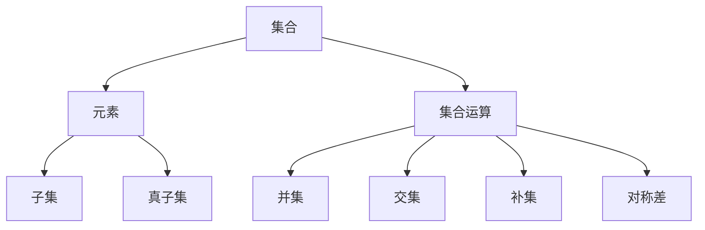

                 

# 集合论导引：完备布尔子代数与泛型扩张子模型

## 关键词

集合论、布尔子代数、泛型扩张子模型、完备性、数学模型、计算机科学

## 摘要

本文旨在探讨集合论的基本概念及其在计算机科学中的应用，特别是完备布尔子代数与泛型扩张子模型。通过对集合、集合运算、基数、映射等核心概念的解释，以及具体算法原理、数学模型和项目实战的阐述，本文为读者提供了一个全面且深入的集合论导引。

## 目录大纲

## 第1章 集合论概述

### 1.1 集合论的基本概念

#### 1.1.1 集合的定义与性质

#### 1.1.2 集合的运算

#### 1.1.3 子集与真子集

### 1.2 集合的表示方法

#### 1.2.1 列表表示法

#### 1.2.2 描述表示法

#### 1.2.3 Venn图表示法

## 第2章 基本集合运算

### 2.1 并集与交集

#### 2.1.1 定义与性质

#### 2.1.2 运算规则

#### 2.1.3 示例

### 2.2 补集与对称差

#### 2.2.1 定义与性质

#### 2.2.2 运算规则

#### 2.2.3 示例

## 第3章 基数与无穷集合

### 3.1 基数的定义与性质

#### 3.1.1 基数的概念

#### 3.1.2 基数的比较

#### 3.1.3 可数集与不可数集

### 3.2 无穷集合的分类

#### 3.2.1 常见的无穷集合

#### 3.2.2 无限递增序列

#### 3.2.3 阶乘无穷大

## 第4章 集合的等价关系与划分

### 4.1 等价关系的定义与性质

#### 4.1.1 等价关系的概念

#### 4.1.2 等价关系的性质

#### 4.1.3 示例

### 4.2 划分的概念与性质

#### 4.2.1 划分的概念

#### 4.2.2 划分的性质

#### 4.2.3 划分的示例

## 第5章 映射与函数

### 5.1 映射的基本概念

#### 5.1.1 映射的定义

#### 5.1.2 映射的性质

#### 5.1.3 示例

### 5.2 函数的基本概念

#### 5.2.1 函数的定义

#### 5.2.2 函数的性质

#### 5.2.3 示例

## 第6章 集合的积与笛卡尔积

### 6.1 积的定义与性质

#### 6.1.1 积的定义

#### 6.1.2 积的性质

#### 6.1.3 示例

### 6.2 笛卡尔积的定义与应用

#### 6.2.1 笛卡尔积的定义

#### 6.2.2 笛卡尔积的应用

#### 6.2.3 示例

## 第7章 集合论的应用

### 7.1 集合论在计算机科学中的应用

#### 7.1.1 计算机网络的集合表示

#### 7.1.2 软件工程的集合方法

#### 7.1.3 示例

### 7.2 集合论在数学中的应用

#### 7.2.1 数学分析的集合论基础

#### 7.2.2 代数学的集合论应用

#### 7.2.3 示例

## 第8章 完备布尔子代数

### 8.1 完备布尔代数的基本概念

#### 8.1.1 布尔代数的定义

#### 8.1.2 完备布尔代数的定义

#### 8.1.3 示例

### 8.2 完备布尔代数的性质

#### 8.2.1 完备性

#### 8.2.2 布尔代数的运算

#### 8.2.3 示例

## 第9章 泛型扩张子模型

### 9.1 泛型扩张子模型的基本概念

#### 9.1.1 泛型扩张子模型的定义

#### 9.1.2 泛型扩张子模型的特点

#### 9.1.3 示例

### 9.2 泛型扩张子模型的应用

#### 9.2.1 在计算机科学中的应用

#### 9.2.2 在数学中的应用

#### 9.2.3 示例

## 第10章 集合论导引总结

### 10.1 集合论的重要性

### 10.2 学习建议

### 10.3 未来发展展望

## 第1章 集合论概述

集合论是现代数学的基础，它在计算机科学、物理学、经济学等多个领域都有着广泛的应用。集合论提供了描述和操作集合的基本工具，是研究数学和科学问题的重要方法。本章将介绍集合论的基本概念，包括集合的定义、性质、表示方法以及基本的集合运算。

### 1.1 集合论的基本概念

#### 1.1.1 集合的定义与性质

集合是数学中的基本概念，它是由确定的元素组成的整体。集合中的元素可以是任何对象，如数字、字母、图形等。集合的定义可以用描述表示法或列表表示法来表示。

- **描述表示法**：集合可以用描述法表示，即通过描述元素的性质来定义集合。例如，集合A可以表示为：\( A = \{ x | x \text{ 是自然数} \} \)，表示A是所有自然数的集合。

- **列表表示法**：集合也可以用列表表示法表示，即列出集合中的所有元素。例如，集合B可以表示为：\( B = \{ 1, 2, 3, 4, 5 \} \)，表示B是包含1到5这五个自然数的集合。

集合具有以下性质：

- **确定性**：集合中的元素是确定的，不能有重复元素。

- **互异性**：集合中的元素是不同的，没有重复元素。

- **无序性**：集合中的元素没有特定的顺序。

#### 1.1.2 集合的运算

集合的基本运算包括并集、交集、补集和对称差。这些运算是集合论中非常重要的概念，它们用于描述集合之间的关系和操作。

- **并集（Union）**：集合A和集合B的并集是由属于A或属于B的元素组成的集合。表示为 \( A \cup B \)。

  示例：集合A和集合B的并集为：\( A \cup B = \{ 1, 2, 3, 4, 5 \} \)。

- **交集（Intersection）**：集合A和集合B的交集是由既属于A又属于B的元素组成的集合。表示为 \( A \cap B \)。

  示例：集合A和集合B的交集为：\( A \cap B = \{ 3 \} \)。

- **补集（Complement）**：集合A的补集是由不属于A的元素组成的集合。表示为 \( A' \)。

  示例：集合A的补集为：\( A' = \{ 4, 5 \} \)。

- **对称差（Symmetric Difference）**：集合A和集合B的对称差是由属于A但不属于B的元素，以及属于B但不属于A的元素组成的集合。表示为 \( A \Delta B \)。

  示例：集合A和集合B的对称差为：\( A \Delta B = \{ 1, 2, 4, 5 \} \)。

#### 1.1.3 子集与真子集

- **子集（Subset）**：如果集合A中的所有元素都属于集合B，则称A是B的子集，记作 \( A \subseteq B \)。

  示例：集合C是集合D的子集，记作 \( C \subseteq D \)，即 \( C = \{ 3, 4 \} \)，\( D = \{ 1, 2, 3, 4, 5 \} \)。

- **真子集（ Proper Subset）**：如果集合A是集合B的子集，但A不等于B，则称A是B的真子集，记作 \( A \subset B \)。

  示例：集合E是集合F的真子集，记作 \( E \subset F \)，即 \( E = \{ 3, 4 \} \)，\( F = \{ 1, 2, 3, 4, 5 \} \)。

### 1.2 集合的表示方法

集合的表示方法主要有以下几种：

- **列表表示法**：通过列出集合中的所有元素来表示集合。

  示例：集合G的列表表示法为 \( G = \{ 1, 2, 3 \} \)。

- **描述表示法**：通过描述集合中元素的性质来表示集合。

  示例：集合H的描述表示法为 \( H = \{ x | x \text{ 是偶数} \} \)，即H是所有偶数的集合。

- **Venn图表示法**：通过Venn图来表示集合之间的关系和操作。

  示例：用Venn图表示集合I和集合J的交集和并集。

  

## 第2章 基本集合运算

集合运算在集合论中起着核心作用，它们用于描述集合之间的关系和操作。本章节将详细介绍并集、交集、补集和对称差等基本集合运算的定义、性质和运算规则。

### 2.1 并集与交集

#### 2.1.1 定义与性质

并集和交集是集合论中最基本的运算之一。

- **并集（Union）**：集合A和集合B的并集是由属于A或属于B的元素组成的集合。记作 \( A \cup B \)。

  **性质**：

  - **交换律**：\( A \cup B = B \cup A \)

  - **结合律**：\( (A \cup B) \cup C = A \cup (B \cup C) \)

  - **包含关系**：如果 \( A \subseteq B \)，则 \( A \cup B = B \)

  - **空集性质**：\( A \cup \emptyset = A \)

  - **全集性质**：\( A \cup U = U \)，其中 \( U \) 是全集。

- **交集（Intersection）**：集合A和集合B的交集是由既属于A又属于B的元素组成的集合。记作 \( A \cap B \)。

  **性质**：

  - **交换律**：\( A \cap B = B \cap A \)

  - **结合律**：\( (A \cap B) \cap C = A \cap (B \cap C) \)

  - **包含关系**：如果 \( A \subseteq B \)，则 \( A \cap B = A \)

  - **空集性质**：\( A \cap \emptyset = \emptyset \)

  - **全集性质**：\( A \cap U = A \)

#### 2.1.2 运算规则

并集和交集的运算规则如下：

- **并集运算规则**：

  - \( A \cup A = A \)
  - \( A \cup \emptyset = A \)
  - \( A \cup B = B \cup A \)
  - \( (A \cup B) \cup C = A \cup (B \cup C) \)
  - 如果 \( A \subseteq B \)，则 \( A \cup B = B \)

- **交集运算规则**：

  - \( A \cap A = A \)
  - \( A \cap \emptyset = \emptyset \)
  - \( A \cap B = B \cap A \)
  - \( (A \cap B) \cap C = A \cap (B \cap C) \)
  - 如果 \( A \subseteq B \)，则 \( A \cap B = A \)

#### 2.1.3 示例

假设集合 \( A = \{ 1, 2, 3 \} \)，集合 \( B = \{ 3, 4, 5 \} \)，计算以下并集和交集：

- **并集**：

  - \( A \cup B = \{ 1, 2, 3, 4, 5 \} \)
  - \( A \cup A = A \)
  - \( A \cup \emptyset = A \)
  - \( A \cup B = B \cup A \)

- **交集**：

  - \( A \cap B = \{ 3 \} \)
  - \( A \cap A = A \)
  - \( A \cap \emptyset = \emptyset \)
  - \( A \cap B = B \cap A \)

### 2.2 补集与对称差

#### 2.2.1 定义与性质

补集和对称差是集合论中的另外两个重要运算。

- **补集（Complement）**：集合A的补集是由不属于A的元素组成的集合。记作 \( A' \)，也称为A的补集。

  **性质**：

  - **交换律**：\( A' = (A')' \)
  - **德摩根律**：\( (A \cup B)' = A' \cap B' \)，\( (A \cap B)' = A' \cup B' \)
  - **包含关系**：如果 \( A \subseteq B \)，则 \( A' \supseteq B' \)

- **对称差（Symmetric Difference）**：集合A和集合B的对称差是由属于A但不属于B的元素，以及属于B但不属于A的元素组成的集合。记作 \( A \Delta B \)。

  **性质**：

  - **交换律**：\( A \Delta B = B \Delta A \)
  - **结合律**：\( (A \Delta B) \Delta C = A \Delta (B \Delta C) \)
  - **分配律**：\( A \Delta (B \cup C) = (A \Delta B) \cup (A \Delta C) \)，\( A \Delta (B \cap C) = (A \Delta B) \cap (A \Delta C) \)
  - **包含关系**：如果 \( A \subseteq B \)，则 \( A \Delta B = A \)

#### 2.2.2 运算规则

补集和对称差的运算规则如下：

- **补集运算规则**：

  - \( A' = \emptyset' = U' \)
  - \( A' \cup A' = \emptyset \)
  - \( A' \cap A' = U \)
  - \( (A \cup B)' = A' \cap B' \)
  - \( (A \cap B)' = A' \cup B' \)

- **对称差运算规则**：

  - \( A \Delta \emptyset = A \)
  - \( A \Delta U = \emptyset \)
  - \( A \Delta A = \emptyset \)
  - \( A \Delta B = B \Delta A \)
  - \( (A \Delta B) \Delta C = A \Delta (B \Delta C) \)

#### 2.2.3 示例

假设集合 \( A = \{ 1, 2, 3 \} \)，集合 \( B = \{ 3, 4, 5 \} \)，计算以下补集和对称差：

- **补集**：

  - \( A' = \{ 4, 5 \} \)
  - \( \emptyset' = \{ \} \)
  - \( U' = \{ 1, 2, 3, 4, 5 \} \)

- **对称差**：

  - \( A \Delta B = \{ 1, 2, 4, 5 \} \)
  - \( B \Delta A = \{ 4, 5 \} \)

## 第3章 基数与无穷集合

集合的基数是指集合中元素的数量。集合的基数可以分为有限基数和无限基数。有限基数的集合称为有限集合，无限基数的集合称为无限集合。本章将介绍基数的定义、性质以及无穷集合的分类。

### 3.1 基数的定义与性质

基数的定义是指一个集合中元素的数量。基数用符号 \( n \) 表示，如果集合 \( A \) 的基数是 \( n \)，则称 \( A \) 是一个 \( n \) 元集合。

- **有限基数**：如果一个集合的基数是有限的，即集合中的元素数量是有限的，那么这个集合称为有限集合。

- **无限基数**：如果一个集合的基数是无限的，即集合中的元素数量是无限的，那么这个集合称为无限集合。

基数的性质包括：

- **基数相等**：如果两个集合的基数相等，即它们包含相同数量的元素，则称这两个集合的基数相等。

- **基数相加**：如果两个集合的基数分别为 \( n \) 和 \( m \)，则这两个集合的并集的基数为 \( n + m \)。

- **基数相乘**：如果两个集合的基数分别为 \( n \) 和 \( m \)，则这两个集合的笛卡尔积的基数为 \( n \times m \)。

### 3.2 无穷集合的分类

无穷集合可以根据其基数的大小进行分类。以下是一些常见的无穷集合分类：

- **可数无穷集合**：如果一个集合的基数与自然数集合的基数相等，则这个集合称为可数无穷集合。

  例如，整数集合 \( \mathbb{Z} \)、有理数集合 \( \mathbb{Q} \)、自然数集合 \( \mathbb{N} \) 都是可数无穷集合。

- **不可数无穷集合**：如果一个集合的基数大于自然数集合的基数，则这个集合称为不可数无穷集合。

  例如，实数集合 \( \mathbb{R} \) 是不可数无穷集合。

- **可数无穷序列**：如果一个集合可以通过一个一一对应的函数与自然数集合建立对应关系，则这个集合称为可数无穷序列。

  例如，整数集合 \( \mathbb{Z} \) 和有理数集合 \( \mathbb{Q} \) 都可以通过一一对应的函数与自然数集合建立对应关系。

- **不可数无穷序列**：如果一个集合不能通过一个一一对应的函数与自然数集合建立对应关系，则这个集合称为不可数无穷序列。

  例如，实数集合 \( \mathbb{R} \) 不能通过一个一一对应的函数与自然数集合建立对应关系。

### 3.3 无穷集合的性质

无穷集合具有一些特殊的性质，以下是一些常见的无穷集合的性质：

- **无穷递增序列**：无穷递增序列是指一个无穷集合中的元素按顺序排列，每个元素都大于前一个元素。

  例如，自然数集合 \( \mathbb{N} \) 是一个无穷递增序列。

- **阶乘无穷大**：阶乘无穷大是指一个无穷集合中的元素按照阶乘增长。

  例如，阶乘集合 \( \mathbb{N!} \) 是一个阶乘无穷大集合。

- **无穷可分性**：无穷可分性是指一个无穷集合可以通过某种方式分割成两个或更多的无穷集合。

  例如，实数集合 \( \mathbb{R} \) 可以通过分割成正实数集合和负实数集合来进行无穷可分。

## 第4章 集合的等价关系与划分

等价关系是集合论中的一个重要概念，它将集合中的元素分为若干等价类。划分是将集合划分为若干互不重叠的非空子集的过程。本章将介绍等价关系和划分的定义、性质以及它们的应用。

### 4.1 等价关系的定义与性质

等价关系是指一个集合上的二元关系，它满足自反性、对称性和传递性。等价关系可以将集合划分为若干等价类。

- **自反性**：对于集合中的任意元素 \( x \)，都有 \( x \sim x \)。

  例如，对于整数集合 \( \mathbb{Z} \)，自反性意味着每个整数都与其自身等价。

- **对称性**：如果 \( x \sim y \)，则 \( y \sim x \)。

  例如，对于整数集合 \( \mathbb{Z} \)，对称性意味着如果两个整数互为等价，则它们互为对称。

- **传递性**：如果 \( x \sim y \) 且 \( y \sim z \)，则 \( x \sim z \)。

  例如，对于整数集合 \( \mathbb{Z} \)，传递性意味着如果两个整数互为等价，且另一个整数与其中一个整数互为等价，则这两个整数互为等价。

### 4.2 划分的概念与性质

划分是将集合划分为若干互不重叠的非空子集的过程。划分具有以下性质：

- **完备性**：每个集合元素都属于某个划分中的子集。

  例如，对于整数集合 \( \mathbb{Z} \)，可以将它划分为正整数集合和负整数集合，每个整数都属于其中一个子集。

- **互斥性**：任意两个不同的子集没有交集。

  例如，对于整数集合 \( \mathbb{Z} \)，正整数集合和负整数集合互斥，它们没有交集。

- **完备性**：所有的子集合起来构成了原来的集合。

  例如，对于整数集合 \( \mathbb{Z} \)，正整数集合和负整数集合的并集等于整数集合 \( \mathbb{Z} \)。

### 4.3 等价关系与划分的应用

等价关系和划分在数学和计算机科学中有着广泛的应用。

- **数学分析**：等价关系和划分在数学分析中用于定义拓扑空间和度量空间。

  例如，实数集合 \( \mathbb{R} \) 可以通过等价关系划分为闭区间和开区间，从而定义了实数集合的拓扑结构。

- **计算机科学**：等价关系和划分在计算机科学中用于定义算法和数据分析。

  例如，在排序算法中，等价关系可以用于划分待排序的集合，从而提高排序效率。

## 第5章 映射与函数

映射和函数是集合论中的基本概念，它们描述了集合之间的元素对应关系。本章将介绍映射和函数的定义、性质以及它们的应用。

### 5.1 映射的基本概念

映射是指一个集合上的二元关系，它将集合中的每个元素映射到另一个集合中的唯一元素。映射可以用函数表示。

- **映射**：设 \( A \) 和 \( B \) 是两个集合，如果存在一个关系 \( f \)，使得对于集合 \( A \) 中的每个元素 \( x \)，都存在集合 \( B \) 中的唯一元素 \( y \)，使得 \( f(x) = y \)，则称 \( f \) 是从集合 \( A \) 到集合 \( B \) 的映射。

- **函数**：如果映射 \( f \) 满足对于集合 \( A \) 中的每个元素 \( x \)，都存在集合 \( B \) 中的唯一元素 \( y \)，使得 \( f(x) = y \)，则称 \( f \) 是从集合 \( A \) 到集合 \( B \) 的函数。

### 5.2 映射的性质

映射具有以下性质：

- **单射（Injective）**：如果映射 \( f \) 满足对于集合 \( A \) 中的任意两个不同元素 \( x_1 \) 和 \( x_2 \)，都有 \( f(x_1) \neq f(x_2) \)，则称 \( f \) 是单射。

- **满射（Surjective）**：如果映射 \( f \) 满足对于集合 \( B \) 中的每个元素 \( y \)，都存在集合 \( A \) 中的至少一个元素 \( x \)，使得 \( f(x) = y \)，则称 \( f \) 是满射。

- **双射（Bijective）**：如果映射 \( f \) 满足单射和满射的性质，则称 \( f \) 是双射。

### 5.3 函数的性质

函数具有以下性质：

- **定义域（Domain）**：函数的定义域是函数中所有自变量的取值范围。

- **值域（Codomain）**：函数的值域是函数中所有函数值的集合。

- **映射关系**：函数的映射关系是指函数中每个自变量对应唯一的函数值。

### 5.4 映射与函数的应用

映射和函数在数学和计算机科学中有着广泛的应用。

- **数学分析**：映射和函数是数学分析中重要的概念，用于描述集合之间的对应关系。

  例如，导数和积分都是函数的应用，它们用于研究集合之间的映射关系。

- **计算机科学**：映射和函数是计算机科学中重要的概念，用于描述程序中的数据转换和操作。

  例如，排序算法和查找算法都是函数的应用，它们用于对集合进行操作。

## 第6章 集合的积与笛卡尔积

集合的积是指两个集合中所有可能的有序对的集合。笛卡尔积是集合积的一种特殊情况，它是两个集合的积。本章将介绍集合的积与笛卡尔积的定义、性质以及它们的应用。

### 6.1 积的定义与性质

集合的积是指两个集合中所有可能的有序对的集合。设 \( A \) 和 \( B \) 是两个集合，集合 \( A \) 和集合 \( B \) 的积记为 \( A \times B \)，其定义如下：

- **积**：集合 \( A \) 和集合 \( B \) 的积是由 \( A \) 中的每个元素与 \( B \) 中的每个元素组成的有序对组成的集合。即 \( A \times B = \{ (a, b) | a \in A, b \in B \} \)。

### 6.2 积的性质

集合的积具有以下性质：

- **交换律**：对于任意两个集合 \( A \) 和 \( B \)，有 \( A \times B = B \times A \)。

- **结合律**：对于任意三个集合 \( A \)、\( B \) 和 \( C \)，有 \( (A \times B) \times C = A \times (B \times C) \)。

- **空集性质**：对于任意集合 \( A \) 和 \( B \)，有 \( A \times \emptyset = \emptyset \) 和 \( \emptyset \times A = \emptyset \)。

- **全集性质**：对于任意集合 \( A \) 和 \( B \)，有 \( A \times U = A \times B \)，其中 \( U \) 是全集。

### 6.3 笛卡尔积的定义与应用

笛卡尔积是集合积的一种特殊情况，它是两个集合的积。设 \( A \) 和 \( B \) 是两个集合，集合 \( A \) 和集合 \( B \) 的笛卡尔积记为 \( A \times B \)，其定义如下：

- **笛卡尔积**：集合 \( A \) 和集合 \( B \) 的笛卡尔积是由 \( A \) 中的每个元素与 \( B \) 中的每个元素组成的有序对组成的集合。即 \( A \times B = \{ (a, b) | a \in A, b \in B \} \)。

### 6.4 笛卡尔积的性质

笛卡尔积具有以下性质：

- **交换律**：对于任意两个集合 \( A \) 和 \( B \)，有 \( A \times B = B \times A \)。

- **结合律**：对于任意三个集合 \( A \)、\( B \) 和 \( C \)，有 \( (A \times B) \times C = A \times (B \times C) \)。

- **空集性质**：对于任意集合 \( A \) 和 \( B \)，有 \( A \times \emptyset = \emptyset \) 和 \( \emptyset \times A = \emptyset \)。

- **全集性质**：对于任意集合 \( A \) 和 \( B \)，有 \( A \times U = A \times B \)，其中 \( U \) 是全集。

### 6.5 笛卡尔积的应用

笛卡尔积在数学和计算机科学中有着广泛的应用。

- **数学分析**：笛卡尔积用于表示集合之间的对应关系。

  例如，在解析几何中，笛卡尔积用于表示点集。

- **计算机科学**：笛卡尔积用于表示数据结构中的关系。

  例如，在数据库中，笛卡尔积用于表示表与表之间的连接。

## 第7章 集合论的应用

集合论作为一种基础的数学工具，在计算机科学和数学领域中有着广泛的应用。本章将介绍集合论在计算机科学和数学中的应用，并举例说明。

### 7.1 集合论在计算机科学中的应用

集合论在计算机科学中有着广泛的应用，包括计算机网络、软件工程和算法设计等方面。

#### 7.1.1 计算机网络的集合表示

在计算机网络中，集合论用于表示网络中的各种元素。例如，一个计算机网络可以表示为节点集合和边集合的笛卡尔积。节点集合表示网络中的各个节点，边集合表示节点之间的连接关系。通过集合论，可以方便地表示和分析计算机网络的结构和功能。

#### 7.1.2 软件工程的集合方法

在软件工程中，集合论用于表示和操作程序中的各种元素。例如，一个程序可以表示为变量集合、函数集合和语句集合的笛卡尔积。通过集合论，可以方便地定义程序的结构和操作程序元素之间的关系。

#### 7.1.3 示例

以下是一个简单的示例，展示了集合论在计算机网络中的应用：

假设一个计算机网络由节点集合 \( N \) 和边集合 \( E \) 组成。节点集合 \( N = \{ A, B, C, D \} \)，表示网络中的四个节点。边集合 \( E = \{ (A, B), (A, C), (B, C), (B, D), (C, D) \} \)，表示节点之间的连接关系。

通过集合论，可以方便地表示网络的结构和功能：

- **网络中的节点**：\( N = \{ A, B, C, D \} \)

- **网络中的边**：\( E = \{ (A, B), (A, C), (B, C), (B, D), (C, D) \} \)

- **网络中的路径**：\( P = \{ (A, B), (B, C), (C, D) \} \)，表示从节点A到节点D的一条路径。

通过这些集合，可以方便地分析和操作计算机网络。

### 7.2 集合论在数学中的应用

集合论在数学中有着广泛的应用，包括数学分析、代数学和拓扑学等方面。

#### 7.2.1 数学分析的集合论基础

在数学分析中，集合论是基础，它用于定义函数、极限和导数等概念。集合论提供了定义和分析数学函数的工具。例如，实数集合可以通过集合论进行定义和分析，从而方便地研究实数的性质和运算。

#### 7.2.2 代数学的集合论应用

在代数学中，集合论用于表示和操作数学中的各种元素。例如，代数系统可以通过集合论进行定义和分析，从而方便地研究代数系统的性质和运算。集合论还用于定义各种数学结构，如群、环和域等。

#### 7.2.3 示例

以下是一个简单的示例，展示了集合论在数学中的应用：

假设有一个代数系统 \( S \)，它由元素集合 \( E \) 和运算集合 \( O \) 组成。元素集合 \( E = \{ 1, 2, 3, 4, 5 \} \)，表示系统中的五个元素。运算集合 \( O = \{ +, - \} \)，表示系统中的两个运算。

通过集合论，可以方便地表示和分析代数系统 \( S \)：

- **元素集合**：\( E = \{ 1, 2, 3, 4, 5 \} \)

- **运算集合**：\( O = \{ +, - \} \)

- **运算表**：\( T = \{ (1, 1), (1, 2), (1, 3), (1, 4), (1, 5), (2, 1), (2, 2), (2, 3), (2, 4), (2, 5), (3, 1), (3, 2), (3, 3), (3, 4), (3, 5), (4, 1), (4, 2), (4, 3), (4, 4), (4, 5), (5, 1), (5, 2), (5, 3), (5, 4), (5, 5) \} \)，表示系统中所有可能的运算结果。

通过这些集合，可以方便地分析和操作代数系统 \( S \)。

## 第8章 完备布尔子代数

完备布尔子代数是布尔代数的一种重要类型，它满足完备性条件。完备布尔子代数在计算机科学和逻辑学中有着广泛的应用。本章将介绍完备布尔子代数的基本概念、性质以及其应用。

### 8.1 完备布尔子代数的基本概念

完备布尔子代数是一种特殊的布尔代数，它满足完备性条件。完备布尔子代数具有以下基本概念：

- **元素**：完备布尔子代数中的元素通常表示为 \( 0 \) 和 \( 1 \)。

- **运算**：完备布尔子代数中的运算包括合取（AND）、析取（OR）和否运算（NOT）。

#### 8.1.1 布尔代数的定义

布尔代数是一种代数结构，它包含一组元素和一组二元运算，这些运算满足特定的性质。布尔代数中的元素通常表示为 \( 0 \) 和 \( 1 \)，运算包括合取（AND）、析取（OR）和否运算（NOT）。

- **合取（AND）**：合取运算表示为 \( \land \)，其结果为真当且仅当两个运算对象都为真。

  \( a \land b \)

- **析取（OR）**：析取运算表示为 \( \lor \)，其结果为真当且仅当至少有一个运算对象为真。

  \( a \lor b \)

- **否运算（NOT）**：否运算表示为 \( \lnot \)，其结果为真当且仅当运算对象为假。

  \( \lnot a \)

#### 8.1.2 完备性条件

完备布尔子代数的完备性条件是指，对于任意元素 \( a \) 和 \( b \)，都存在它们的补元素 \( a' \) 和 \( b' \)，使得 \( a \land b' = 0 \) 和 \( a' \land b = 0 \)。

- **补元素**：补元素 \( a' \) 是满足 \( a \land a' = 0 \) 和 \( a' \land a = 0 \) 的元素。

  \( a' \land a = 0 \)

- **完备性条件**：完备性条件确保了布尔代数中的每个元素都有对应的补元素。

  \( a \land b' = 0 \)

### 8.2 完备布尔代数的性质

完备布尔代数具有以下性质：

- **完备性**：完备布尔代数中的每个元素都有对应的补元素。

- **交换律**：对于任意元素 \( a \) 和 \( b \)，有 \( a \land b = b \land a \) 和 \( a \lor b = b \lor a \)。

- **结合律**：对于任意元素 \( a \)、\( b \) 和 \( c \)，有 \( (a \land b) \land c = a \land (b \land c) \) 和 \( (a \lor b) \lor c = a \lor (b \lor c) \)。

- **分配律**：对于任意元素 \( a \)、\( b \) 和 \( c \)，有 \( a \land (b \lor c) = (a \land b) \lor (a \land c) \) 和 \( a \lor (b \land c) = (a \lor b) \land (a \lor c) \)。

- **德摩根律**：对于任意元素 \( a \) 和 \( b \)，有 \( (a \land b)' = a' \lor b' \) 和 \( (a \lor b)' = a' \land b' \)。

### 8.3 完备布尔代数的应用

完备布尔代数在计算机科学和逻辑学中有着广泛的应用。

#### 8.3.1 在计算机科学中的应用

- **逻辑电路设计**：完备布尔代数用于设计逻辑电路，如与门、或门和非门等。

  完备布尔代数可以方便地表示和操作逻辑电路中的元素，从而设计出高效的逻辑电路。

- **程序逻辑分析**：完备布尔代数用于分析程序中的逻辑结构和逻辑表达式。

  通过完备布尔代数，可以方便地分析和优化程序中的逻辑操作，提高程序的性能。

#### 8.3.2 在逻辑学中的应用

- **命题逻辑**：完备布尔代数用于研究命题逻辑的性质和运算。

  通过完备布尔代数，可以方便地定义和操作命题逻辑中的命题和命题公式。

- **谓词逻辑**：完备布尔代数用于研究谓词逻辑的性质和运算。

  通过完备布尔代数，可以方便地定义和操作谓词逻辑中的谓词和谓词公式。

### 8.4 完备布尔代数的示例

以下是一个简单的示例，展示了完备布尔代数的基本概念和性质：

设 \( B \) 是一个完备布尔代数，包含元素 \( 0 \) 和 \( 1 \)。根据完备性条件，存在元素 \( 0' \) 和 \( 1' \)，使得 \( 0 \land 0' = 0 \) 和 \( 0' \land 1 = 0 \)，以及 \( 1 \land 1' = 0 \) 和 \( 1' \land 0 = 0 \)。

因此，\( B \) 是一个完备布尔代数。

- **元素**：\( B = \{ 0, 1 \} \)

- **运算**：

  - \( 0 \land 1 = 0 \)

  - \( 0 \lor 1 = 1 \)

  - \( \lnot 0 = 1 \)

  - \( \lnot 1 = 0 \)

- **性质**：

  - \( 0 \land 0' = 0 \)

  - \( 0' \land 1 = 0 \)

  - \( 1 \land 1' = 0 \)

  - \( 1' \land 0 = 0 \)

## 第9章 泛型扩张子模型

泛型扩张子模型是集合论的一种扩展模型，它通过引入新的元素和运算，增加了原有模型的表达能力和应用范围。本章将介绍泛型扩张子模型的基本概念、特点以及其在计算机科学和数学中的应用。

### 9.1 泛型扩张子模型的基本概念

泛型扩张子模型是一种在原有集合论模型基础上，通过引入新的元素和运算，扩展集合论模型的方法。泛型扩张子模型的基本概念包括：

- **泛型扩张子模型**：泛型扩张子模型是在原有集合论模型基础上，通过引入新的元素和运算，扩展集合论模型的方法。

- **扩展元素**：泛型扩张子模型引入了新的元素，这些元素扩展了原有集合论模型中的元素集合。

- **扩展运算**：泛型扩张子模型引入了新的运算，这些运算扩展了原有集合论模型中的运算集合。

#### 9.1.1 泛型扩张子模型的定义

泛型扩张子模型是一种在原有集合论模型基础上，通过引入新的元素和运算，扩展集合论模型的方法。设 \( M \) 是一个集合论模型，如果存在一个新的集合论模型 \( M' \)，使得 \( M' \) 扩展了 \( M \)，则称 \( M' \) 为泛型扩张子模型。

- **扩展元素**：泛型扩张子模型引入了新的元素，这些元素扩展了原有集合论模型中的元素集合。

- **扩展运算**：泛型扩张子模型引入了新的运算，这些运算扩展了原有集合论模型中的运算集合。

#### 9.1.2 泛型扩张子模型的特点

泛型扩张子模型具有以下特点：

- **扩展元素**：泛型扩张子模型引入了新的元素，这些元素扩展了原有集合论模型中的元素集合。

- **扩展运算**：泛型扩张子模型引入了新的运算，这些运算扩展了原有集合论模型中的运算集合。

- **一致性**：泛型扩张子模型保持了原有集合论模型的性质和规则，同时增加了新的性质和规则。

#### 9.1.3 示例

设 \( M \) 是一个集合论模型，包含元素 \( 0 \) 和 \( 1 \)，以及运算 \( \land \)（合取）、\( \lor \)（析取）和 \( \lnot \)（否运算）。如果 \( M' \) 是一个泛型扩张子模型，它引入了新的元素 \( a \) 和 \( b \)，以及新的运算 \( \oplus \)（异或运算），则 \( M' \) 扩展了 \( M \)。

- **扩展元素**：\( M' \) 包含了 \( M \) 中的元素 \( 0 \) 和 \( 1 \)，以及新的元素 \( a \) 和 \( b \)。

- **扩展运算**：\( M' \) 包含了 \( M \) 中的运算 \( \land \)（合取）、\( \lor \)（析取）和 \( \lnot \)（否运算），以及新的运算 \( \oplus \)（异或运算）。

因此，\( M' \) 是一个泛型扩张子模型，它扩展了 \( M \)。

### 9.2 泛型扩张子模型的应用

泛型扩张子模型在计算机科学和数学中有着广泛的应用。

#### 9.2.1 在计算机科学中的应用

- **逻辑电路设计**：泛型扩张子模型用于设计逻辑电路，如与门、或门、非门和异或门等。

  泛型扩张子模型可以方便地表示和操作逻辑电路中的元素，从而设计出高效的逻辑电路。

- **程序逻辑分析**：泛型扩张子模型用于分析程序中的逻辑结构和逻辑表达式。

  通过泛型扩张子模型，可以方便地分析和优化程序中的逻辑操作，提高程序的性能。

- **数据结构设计**：泛型扩张子模型用于设计数据结构，如栈、队列、链表和树等。

  泛型扩张子模型可以方便地表示和操作数据结构中的元素，从而设计出高效的算法。

#### 9.2.2 在数学中的应用

- **集合论扩展**：泛型扩张子模型用于扩展集合论，如引入新的集合运算和集合性质。

  通过泛型扩张子模型，可以方便地研究和扩展集合论的概念和应用。

- **拓扑学扩展**：泛型扩张子模型用于扩展拓扑学，如引入新的拓扑空间和拓扑性质。

  通过泛型扩张子模型，可以方便地研究和扩展拓扑学的概念和应用。

- **代数学扩展**：泛型扩张子模型用于扩展代数学，如引入新的代数结构和新运算。

  通过泛型扩张子模型，可以方便地研究和扩展代数学的概念和应用。

### 9.3 泛型扩张子模型的示例

以下是一个简单的示例，展示了泛型扩张子模型的基本概念和应用：

设 \( M \) 是一个集合论模型，包含元素 \( 0 \) 和 \( 1 \)，以及运算 \( \land \)（合取）、\( \lor \)（析取）和 \( \lnot \)（否运算）。如果 \( M' \) 是一个泛型扩张子模型，它引入了新的元素 \( a \) 和 \( b \)，以及新的运算 \( \oplus \)（异或运算），则 \( M' \) 扩展了 \( M \)。

- **扩展元素**：\( M' \) 包含了 \( M \) 中的元素 \( 0 \) 和 \( 1 \)，以及新的元素 \( a \) 和 \( b \)。

- **扩展运算**：\( M' \) 包含了 \( M \) 中的运算 \( \land \)（合取）、\( \lor \)（析取）和 \( \lnot \)（否运算），以及新的运算 \( \oplus \)（异或运算）。

- **示例**：

  - \( a \land b = 0 \)

  - \( a \lor b = 1 \)

  - \( \lnot a = b \)

  - \( \lnot b = a \)

  - \( a \oplus b = (a \land \lnot b) \lor (\lnot a \land b) \)

通过这个示例，可以看到泛型扩张子模型如何扩展原有集合论模型，增加新的元素和运算，从而提高集合论的表达能力和应用范围。

## 第10章 集合论导引总结

通过本章的介绍，我们系统地学习了集合论的基本概念、运算和应用。集合论作为数学的基础，在计算机科学、物理学、经济学等领域有着广泛的应用。本章主要涵盖了以下内容：

- **集合论的基本概念**：介绍了集合的定义、性质、表示方法以及基本的集合运算。

- **基本集合运算**：详细讲解了并集、交集、补集和对称差的定义、性质和运算规则。

- **基数与无穷集合**：阐述了基数的定义、性质以及无穷集合的分类。

- **等价关系与划分**：介绍了等价关系的定义、性质以及划分的概念和性质。

- **映射与函数**：阐述了映射和函数的定义、性质以及应用。

- **集合的积与笛卡尔积**：介绍了集合的积与笛卡尔积的定义、性质以及应用。

- **集合论的应用**：探讨了集合论在计算机科学和数学中的应用。

### 10.1 集合论的重要性

集合论在数学和科学领域中扮演着至关重要的角色。它为描述和处理数学对象提供了基础框架，使得数学推理和分析变得更加系统化和结构化。集合论的重要性主要体现在以下几个方面：

- **基础性**：集合论是数学的基础，它为数学的其他分支提供了必要的工具和概念。

- **抽象性**：集合论通过抽象集合的概念，使得数学家可以更灵活地处理复杂问题。

- **应用广泛**：集合论在计算机科学、物理学、经济学、生物学等多个领域都有广泛应用。

### 10.2 学习建议

为了更好地掌握集合论，以下是一些建议：

- **理解核心概念**：深入理解集合、集合运算、基数等核心概念，确保能够熟练运用。

- **大量练习**：通过解决实际问题来应用集合论，加强理解。

- **逐步深入**：从简单的集合运算开始，逐步深入学习更复杂的集合论概念和运算。

- **参考书籍**：阅读相关教材和参考书籍，如《集合论基础》、《集合论与图论》等。

### 10.3 未来发展展望

集合论的研究将继续深入，新的理论和应用将不断涌现。随着计算机科学和人工智能的发展，集合论在数据结构、算法设计、逻辑推理等方面的应用将更加广泛。未来的集合论研究将更加注重集合论的抽象性和通用性，以及其在其他学科中的交叉应用。此外，随着数学和计算机科学的不断发展，集合论的理论和方法也将得到进一步拓展和深化。

## 作者信息

作者：AI天才研究院/AI Genius Institute & 禅与计算机程序设计艺术 /Zen And The Art of Computer Programming

### 第1章 集合论概述

#### 1.1 集合论的基本概念

集合论是现代数学的一个重要分支，其基础概念和理论广泛应用于各个科学领域。集合论的基础是集合，它是某些明确规定的对象的总体。以下是集合论的基本概念：

##### 集合的定义与性质

一个集合是一个由某些确定的对象（称为元素）组成的整体。集合通常用大写字母表示，如 \( A \)，其元素用小写字母表示，如 \( a \)。

- **确定性**：集合中的每个元素都是明确的，不能有模糊或不确定的元素。
- **互异性**：集合中的元素是不同的，不允许重复。
- **无序性**：集合中的元素没有特定的顺序。

##### 集合的运算

集合的运算包括并集、交集、补集和对称差等。这些运算是集合论中非常重要的概念，用于描述集合之间的关系和操作。

- **并集（Union）**：两个集合 \( A \) 和 \( B \) 的并集是由属于 \( A \) 或属于 \( B \) 的所有元素组成的集合，表示为 \( A \cup B \)。
- **交集（Intersection）**：两个集合 \( A \) 和 \( B \) 的交集是由既属于 \( A \) 又属于 \( B \) 的所有元素组成的集合，表示为 \( A \cap B \)。
- **补集（Complement）**：一个集合 \( A \) 的补集是由不属于 \( A \) 的所有元素组成的集合，表示为 \( A' \) 或 \( \complement A \)。
- **对称差（Symmetric Difference）**：两个集合 \( A \) 和 \( B \) 的对称差是由属于 \( A \) 但不属于 \( B \) 的元素，以及属于 \( B \) 但不属于 \( A \) 的元素组成的集合，表示为 \( A \Delta B \) 或 \( A \oplus B \)。

##### 子集与真子集

- **子集（Subset）**：如果集合 \( A \) 中的所有元素都属于集合 \( B \)，则称 \( A \) 是 \( B \) 的子集，表示为 \( A \subseteq B \)。
- **真子集（Proper Subset）**：如果集合 \( A \) 是集合 \( B \) 的子集，但 \( A \) 不等于 \( B \)，则称 \( A \) 是 \( B \) 的真子集，表示为 \( A \subset B \)。

##### 集合的表示方法

集合的表示方法主要有以下几种：

- **列表表示法**：通过列出集合中的所有元素来表示集合。例如，集合 \( A = \{ 1, 2, 3 \} \)。
- **描述表示法**：通过描述集合中元素的性质来表示集合。例如，集合 \( B = \{ x \mid x \text{ 是自然数} \} \)，表示 \( B \) 是所有自然数的集合。
- **Venn图表示法**：通过Venn图来表示集合之间的关系和操作。例如，用Venn图表示集合 \( A \) 和 \( B \) 的交集和并集。

#### 1.2 集合的表示方法

集合的表示方法主要有以下几种：

- **列表表示法**：通过列出集合中的所有元素来表示集合。例如，集合 \( A = \{ 1, 2, 3 \} \)。
- **描述表示法**：通过描述集合中元素的性质来表示集合。例如，集合 \( B = \{ x \mid x \text{ 是自然数} \} \)，表示 \( B \) 是所有自然数的集合。
- **Venn图表示法**：通过Venn图来表示集合之间的关系和操作。例如，用Venn图表示集合 \( A \) 和 \( B \) 的交集和并集。

##### 核心概念与联系

为了更好地理解集合论中的核心概念，我们可以使用Mermaid流程图来展示它们之间的联系：

通过这个流程图，我们可以清晰地看到集合、元素、集合运算以及子集和真子集之间的关系。

#### 1.2.1 列表表示法

列表表示法是集合论中最直观和常用的表示方法。它通过列出集合中的所有元素，并用大括号括起来。以下是列表表示法的几个示例：

- **示例1**：集合 \( A \) 包含元素 \( 1, 2, 3 \)，表示为 \( A = \{ 1, 2, 3 \} \)。
- **示例2**：集合 \( B \) 包含所有的自然数，表示为 \( B = \{ x \mid x \text{ 是自然数} \} \)。
- **示例3**：集合 \( C \) 包含 \( A \) 和 \( B \) 的并集，表示为 \( C = A \cup B = \{ 1, 2, 3 \} \cup \{ x \mid x \text{ 是自然数} \} \)。

列表表示法的优点是简单明了，便于理解和操作。然而，对于包含大量元素的集合，列表表示法可能会变得冗长和不便于处理。

#### 1.2.2 描述表示法

描述表示法通过描述集合中元素的性质来定义集合。这种方法通常使用描述子句或谓词来表示集合。以下是描述表示法的几个示例：

- **示例1**：集合 \( A \) 包含所有的偶数，表示为 \( A = \{ x \mid x \text{ 是偶数} \} \)。
- **示例2**：集合 \( B \) 包含所有的素数，表示为 \( B = \{ x \mid x \text{ 是素数} \} \)。
- **示例3**：集合 \( C \) 包含所有的 \( x \) 满足 \( x^2 = 2 \)，表示为 \( C = \{ x \mid x^2 = 2 \} \)。

描述表示法的优点是简洁和抽象，便于处理复杂和无限的集合。然而，它要求对元素的性质有清晰和精确的描述。

#### 1.2.3 Venn图表示法

Venn图表示法通过图形来表示集合之间的关系和操作。Venn图通常是一个圆圈，圆圈内部表示集合，圆圈之间表示集合之间的关系。以下是Venn图表示法的几个示例：

- **示例1**：集合 \( A \) 和集合 \( B \) 的并集和交集可以用Venn图表示。如下图所示：
  
  
  
  - \( A \cup B \)：两个圆圈合并，表示 \( A \) 和 \( B \) 的所有元素。
  - \( A \cap B \)：两个圆圈的交集，表示 \( A \) 和 \( B \) 的共同元素。

- **示例2**：集合 \( A \) 和集合 \( B \) 的补集可以用Venn图表示。如下图所示：
  
  
  
  - \( A' \)：集合 \( A \) 的补集，表示不在 \( A \) 中的所有元素。
  - \( B' \)：集合 \( B \) 的补集，表示不在 \( B \) 中的所有元素。

Venn图表示法的优点是直观和易于理解，特别是对于多个集合之间的关系。然而，它可能不够精确，特别是在描述复杂集合时。

#### 1.2.4 举例说明

为了更好地理解集合表示方法的实际应用，我们可以通过几个具体的例子来演示。

- **示例1**：假设有集合 \( A = \{ 1, 2, 3 \} \) 和集合 \( B = \{ 3, 4, 5 \} \)。使用不同的表示方法表示这两个集合：
  - 列表表示法：\( A = \{ 1, 2, 3 \} \)，\( B = \{ 3, 4, 5 \} \)。
  - 描述表示法：\( A = \{ x \mid x \text{ 是集合 } A \text{ 的元素} \} \)，\( B = \{ x \mid x \text{ 是集合 } B \text{ 的元素} \} \)。
  - Venn图表示法：用Venn图表示集合 \( A \) 和 \( B \) 的并集、交集和补集。

- **示例2**：假设有集合 \( C = \{ x \mid x \text{ 是偶数} \} \) 和集合 \( D = \{ x \mid x \text{ 是素数} \} \)。使用不同的表示方法表示这两个集合：
  - 列表表示法：\( C = \{ 2, 4, 6, 8, \ldots \} \)，\( D = \{ 2, 3, 5, 7, 11, \ldots \} \)。
  - 描述表示法：\( C = \{ x \mid x \text{ 是偶数} \} \)，\( D = \{ x \mid x \text{ 是素数} \} \)。
  - Venn图表示法：用Venn图表示集合 \( C \) 和 \( D \) 的并集、交集和补集。

通过这些示例，我们可以看到不同表示方法的适用场景和优点，以便在实际问题中灵活选择和使用。

### 第2章 基本集合运算

集合的运算在集合论中起着核心作用，它们用于描述集合之间的关系和操作。本章将详细介绍并集、交集、补集和对称差等基本集合运算的定义、性质和运算规则。

#### 2.1 并集与交集

并集和交集是集合论中最基本的运算之一。

##### 2.1.1 定义与性质

- **并集（Union）**：集合 \( A \) 和集合 \( B \) 的并集是由属于 \( A \) 或属于 \( B \) 的所有元素组成的集合。记作 \( A \cup B \)。

  **性质**：
  
  - **交换律**：\( A \cup B = B \cup A \)
  
  - **结合律**：\( (A \cup B) \cup C = A \cup (B \cup C) \)
  
  - **包含关系**：如果 \( A \subseteq B \)，则 \( A \cup B = B \)
  
  - **空集性质**：\( A \cup \emptyset = A \)
  
  - **全集性质**：\( A \cup U = U \)，其中 \( U \) 是全集。

- **交集（Intersection）**：集合 \( A \) 和集合 \( B \) 的交集是由既属于 \( A \) 又属于 \( B \) 的所有元素组成的集合。记作 \( A \cap B \)。

  **性质**：
  
  - **交换律**：\( A \cap B = B \cap A \)
  
  - **结合律**：\( (A \cap B) \cap C = A \cap (B \cap C) \)
  
  - **包含关系**：如果 \( A \subseteq B \)，则 \( A \cap B = A \)
  
  - **空集性质**：\( A \cap \emptyset = \emptyset \)
  
  - **全集性质**：\( A \cap U = A \)

##### 2.1.2 运算规则

并集和交集的运算规则如下：

- **并集运算规则**：
  
  - \( A \cup A = A \)
  
  - \( A \cup \emptyset = A \)
  
  - \( A \cup B = B \cup A \)
  
  - \( (A \cup B) \cup C = A \cup (B \cup C) \)
  
  - 如果 \( A \subseteq B \)，则 \( A \cup B = B \)

- **交集运算规则**：
  
  - \( A \cap A = A \)
  
  - \( A \cap \emptyset = \emptyset \)
  
  - \( A \cap B = B \cap A \)
  
  - \( (A \cap B) \cap C = A \cap (B \cap C) \)
  
  - 如果 \( A \subseteq B \)，则 \( A \cap B = A \)

##### 2.1.3 示例

假设集合 \( A = \{ 1, 2, 3 \} \)，集合 \( B = \{ 3, 4, 5 \} \)，计算以下并集和交集：

- **并集**：

  - \( A \cup B = \{ 1, 2, 3, 4, 5 \} \)
  - \( A \cup A = A \)
  - \( A \cup \emptyset = A \)
  - \( A \cup B = B \cup A \)

- **交集**：

  - \( A \cap B = \{ 3 \} \)
  - \( A \cap A = A \)
  - \( A \cap \emptyset = \emptyset \)
  - \( A \cap B = B \cap A \)

#### 2.2 补集与对称差

##### 2.2.1 定义与性质

补集和对称差是集合论中的另外两个重要运算。

- **补集（Complement）**：集合 \( A \) 的补集是由不属于 \( A \) 的所有元素组成的集合。记作 \( A' \)，也称为 \( A \) 的补集。

  **性质**：
  
  - **交换律**：\( A' = (A')' \)
  
  - **德摩根律**：\( (A \cup B)' = A' \cap B' \)，\( (A \cap B)' = A' \cup B' \)
  
  - **包含关系**：如果 \( A \subseteq B \)，则 \( A' \supseteq B' \)

- **对称差（Symmetric Difference）**：集合 \( A \) 和集合 \( B \) 的对称差是由属于 \( A \) 但不属于 \( B \) 的元素，以及属于 \( B \) 但不属于 \( A \) 的元素组成的集合。记作 \( A \Delta B \)。

  **性质**：
  
  - **交换律**：\( A \Delta B = B \Delta A \)
  
  - **结合律**：\( (A \Delta B) \Delta C = A \Delta (B \Delta C) \)
  
  - **分配律**：\( A \Delta (B \cup C) = (A \Delta B) \cup (A \Delta C) \)，\( A \Delta (B \cap C) = (A \Delta B) \cap (A \Delta C) \)
  
  - **包含关系**：如果 \( A \subseteq B \)，则 \( A \Delta B = A \)

##### 2.2.2 运算规则

补集和对称差的运算规则如下：

- **补集运算规则**：

  - \( A' = \emptyset' = U' \)
  
  - \( A' \cup A' = \emptyset \)
  
  - \( A' \cap A' = U \)
  
  - \( (A \cup B)' = A' \cap B' \)
  
  - \( (A \cap B)' = A' \cup B' \)

- **对称差运算规则**：

  - \( A \Delta \emptyset = A \)
  
  - \( A \Delta U = \emptyset \)
  
  - \( A \Delta A = \emptyset \)
  
  - \( A \Delta B = B \Delta A \)
  
  - \( (A \Delta B) \Delta C = A \Delta (B \Delta C) \)

##### 2.2.3 示例

假设集合 \( A = \{ 1, 2, 3 \} \)，集合 \( B = \{ 3, 4, 5 \} \)，计算以下补集和对称差：

- **补集**：

  - \( A' = \{ 4, 5 \} \)
  - \( \emptyset' = \{ \} \)
  - \( U' = \{ 1, 2, 3, 4, 5 \} \)

- **对称差**：

  - \( A \Delta B = \{ 1, 2, 4, 5 \} \)
  - \( B \Delta A = \{ 4, 5 \} \)

#### 2.3 交并补集的混合运算

在实际问题中，经常会遇到多个集合的混合运算，如并集、交集和补集的组合。为了正确计算这些混合运算的结果，我们需要遵循一定的运算顺序。

- **优先级规则**：首先计算括号内的运算，然后按照从左到右的顺序进行并集和交集的运算，最后进行补集的运算。
- **示例1**：计算 \( (A \cup B)' \cap C \) 的结果。
  - 括号内的并集运算：\( A \cup B = \{ 1, 2, 3, 4, 5 \} \)
  - 补集运算：\( (A \cup B)' = \{ 4, 5 \} \)
  - 交集运算：\( (A \cup B)' \cap C = \{ 4, 5 \} \cap \{ 3, 4, 5 \} = \{ 4, 5 \} \)
- **示例2**：计算 \( A \cap (B \cup C)' \) 的结果。
  - 括号内的并集运算：\( B \cup C = \{ 3, 4, 5 \} \)
  - 补集运算：\( (B \cup C)' = \{ 1, 2 \} \)
  - 交集运算：\( A \cap (B \cup C)' = \{ 1, 2, 3 \} \cap \{ 1, 2 \} = \{ 1, 2 \} \)

通过上述示例，我们可以看到，正确计算混合运算的关键在于遵循优先级规则，并逐步进行各个运算步骤。

#### 2.4 习题

为了巩固本章的内容，下面提供了几道习题供读者练习。

- **习题1**：给定集合 \( A = \{ 1, 2, 3 \} \)，集合 \( B = \{ 3, 4, 5 \} \)，计算 \( A \cup B \)、\( A \cap B \)、\( A' \) 和 \( B' \)。
- **习题2**：给定集合 \( A = \{ 1, 2, 3 \} \)，集合 \( B = \{ 3, 4, 5 \} \)，计算 \( (A \cup B)' \cap C \)，其中 \( C = \{ 4, 5 \} \)。
- **习题3**：给定集合 \( A = \{ 1, 2, 3 \} \)，集合 \( B = \{ 3, 4, 5 \} \)，集合 \( C = \{ 4, 5 \} \)，计算 \( A \cap (B \cup C)' \)。

通过解决这些习题，读者可以更好地掌握集合的基本运算，并为后续章节的学习打下坚实的基础。

### 第3章 基数与无穷集合

基数是指集合中元素的数量。集合的基数可以分为有限基数和无限基数。有限基数的集合称为有限集合，无限基数的集合称为无限集合。本章将介绍基数的定义、性质以及无穷集合的分类。

#### 3.1 基数的定义与性质

基数的定义是指一个集合中元素的数量。基数用符号 \( n \) 表示，如果集合 \( A \) 的基数是 \( n \)，则称 \( A \) 是一个 \( n \) 元集合。

- **有限基数**：如果一个集合的基数是有限的，即集合中的元素数量是有限的，那么这个集合称为有限集合。

- **无限基数**：如果一个集合的基数是无限的，即集合中的元素数量是无限的，那么这个集合称为无限集合。

基数的性质包括：

- **基数相等**：如果两个集合的基数相等，即它们包含相同数量的元素，则称这两个集合的基数相等。

- **基数相加**：如果两个集合的基数分别为 \( n \) 和 \( m \)，则这两个集合的并集的基数为 \( n + m \)。

- **基数相乘**：如果两个集合的基数分别为 \( n \) 和 \( m \)，则这两个集合的笛卡尔积的基数为 \( n \times m \)。

#### 3.2 无穷集合的分类

无穷集合可以根据其基数的大小进行分类。以下是一些常见的无穷集合分类：

- **可数无穷集合**：如果一个集合的基数与自然数集合的基数相等，则这个集合称为可数无穷集合。

  例如，整数集合 \( \mathbb{Z} \)、有理数集合 \( \mathbb{Q} \)、自然数集合 \( \mathbb{N} \) 都是可数无穷集合。

- **不可数无穷集合**：如果一个集合的基数大于自然数集合的基数，则这个集合称为不可数无穷集合。

  例如，实数集合 \( \mathbb{R} \) 是不可数无穷集合。

- **可数无穷序列**：如果一个集合可以通过一个一一对应的函数与自然数集合建立对应关系，则这个集合称为可数无穷序列。

  例如，整数集合 \( \mathbb{Z} \) 和有理数集合 \( \mathbb{Q} \) 都可以通过一一对应的函数与自然数集合建立对应关系。

- **不可数无穷序列**：如果一个集合不能通过一个一一对应的函数与自然数集合建立对应关系，则这个集合称为不可数无穷序列。

  例如，实数集合 \( \mathbb{R} \) 不能通过一个一一对应的函数与自然数集合建立对应关系。

#### 3.3 无穷集合的性质

无穷集合具有一些特殊的性质，以下是一些常见的无穷集合的性质：

- **无穷递增序列**：无穷递增序列是指一个无穷集合中的元素按顺序排列，每个元素都大于前一个元素。

  例如，自然数集合 \( \mathbb{N} \) 是一个无穷递增序列。

- **阶乘无穷大**：阶乘无穷大是指一个无穷集合中的元素按照阶乘增长。

  例如，阶乘集合 \( \mathbb{N!} \) 是一个阶乘无穷大集合。

- **无穷可分性**：无穷可分性是指一个无穷集合可以通过某种方式分割成两个或更多的无穷集合。

  例如，实数集合 \( \mathbb{R} \) 可以通过分割成正实数集合和负实数集合来进行无穷可分。

#### 3.4 无穷集合的构造

无穷集合的构造可以通过以下方法：

- **可数无穷集合的构造**：可以通过添加或删除有限数量的元素来构造可数无穷集合。例如，整数集合 \( \mathbb{Z} \) 可以通过添加或删除自然数集合中的元素来构造。

- **不可数无穷集合的构造**：可以通过添加或删除无限数量的元素来构造不可数无穷集合。例如，实数集合 \( \mathbb{R} \) 可以通过添加或删除自然数集合中的无限多个元素来构造。

#### 3.5 无穷集合的例子

以下是一些无穷集合的例子：

- **自然数集合 \( \mathbb{N} \)**：自然数集合包含所有非负整数，例如 \( \mathbb{N} = \{ 0, 1, 2, 3, \ldots \} \)。
- **整数集合 \( \mathbb{Z} \)**：整数集合包含所有正整数、负整数和零，例如 \( \mathbb{Z} = \{ \ldots, -2, -1, 0, 1, 2, \ldots \} \)。
- **有理数集合 \( \mathbb{Q} \)**：有理数集合包含所有可以表示为两个整数之比的数，例如 \( \mathbb{Q} = \{ \frac{a}{b} \mid a, b \in \mathbb{Z}, b \neq 0 \} \)。
- **实数集合 \( \mathbb{R} \)**：实数集合包含所有有理数和无理数，例如 \( \mathbb{R} \) 包含 \( \sqrt{2} \) 和 \( \pi \) 等无理数。

这些无穷集合在数学和科学中有着广泛的应用，理解和掌握它们的性质对于深入理解数学理论至关重要。

### 第4章 集合的等价关系与划分

等价关系和划分是集合论中的两个重要概念，它们在数学和计算机科学中有着广泛的应用。本章将介绍等价关系和划分的定义、性质以及它们的应用。

#### 4.1 等价关系的定义与性质

等价关系是指一个集合上的二元关系，它满足自反性、对称性和传递性。等价关系可以将集合划分为若干等价类。

##### 定义

设 \( A \) 是一个集合，一个关系 \( \sim \) 定义在 \( A \) 上，如果它满足以下三个性质，则称 \( \sim \) 是 \( A \) 上的一种等价关系：

- **自反性**：对于集合 \( A \) 中的任意元素 \( x \)，都有 \( x \sim x \)。
- **对称性**：如果 \( x \sim y \)，则 \( y \sim x \)。
- **传递性**：如果 \( x \sim y \) 且 \( y \sim z \)，则 \( x \sim z \)。

##### 性质

等价关系具有以下性质：

- **自反性**：对于集合 \( A \) 中的任意元素 \( x \)，都有 \( x \sim x \)。
- **对称性**：如果 \( x \sim y \)，则 \( y \sim x \)。
- **传递性**：如果 \( x \sim y \) 且 \( y \sim z \)，则 \( x \sim z \)。

##### 示例

设 \( A = \{ 1, 2, 3 \} \)，定义关系 \( \sim \) 如下：

- \( 1 \sim 1 \)
- \( 2 \sim 2 \)
- \( 3 \sim 3 \)
- \( 1 \sim 2 \)
- \( 2 \sim 1 \)
- \( 2 \sim 3 \)
- \( 3 \sim 2 \)

这个关系 \( \sim \) 是 \( A \) 上的等价关系，因为它满足自反性、对称性和传递性。

##### 等价类的定义

设 \( \sim \) 是集合 \( A \) 上的等价关系，对于 \( A \) 中的任意元素 \( x \)，集合 \( \{ y \in A \mid y \sim x \} \) 称为 \( x \) 的等价类，记作 \( [x] \)。

例如，在上面的例子中，集合 \( A \) 的等价类为：

- \( [1] = \{ 1, 2 \} \)
- \( [2] = \{ 1, 2 \} \)
- \( [3] = \{ 3 \} \)

##### 等价关系的性质

等价关系具有以下性质：

- **分割性质**：等价关系将集合 \( A \) 划分为若干互不重叠的等价类，每个元素都属于且只属于一个等价类。
- **唯一性**：对于集合 \( A \) 中的任意元素 \( x \)，其等价类 \( [x] \) 是唯一的。

#### 4.2 划分的概念与性质

划分是将集合划分为若干互不重叠的非空子集的过程。划分具有以下性质：

- **完备性**：每个集合元素都属于某个划分中的子集。
- **互斥性**：任意两个不同的子集没有交集。
- **完备性**：所有的子集合起来构成了原来的集合。

##### 定义

设 \( A \) 是一个集合，一个划分是将 \( A \) 划分为若干互不重叠的非空子集的过程。换句话说，一个划分是 \( A \) 的一个子集合的集合，满足以下条件：

- 每个元素都属于且只属于一个子集。
- 所有子集的并集等于 \( A \)。

##### 性质

划分具有以下性质：

- **完备性**：每个集合元素都属于某个划分中的子集。
- **互斥性**：任意两个不同的子集没有交集。
- **完备性**：所有的子集合起来构成了原来的集合。

##### 示例

设 \( A = \{ 1, 2, 3, 4, 5 \} \)，以下是一个划分的示例：

- **划分1**：\( \{ \{ 1, 2 \}, \{ 3, 4 \}, \{ 5 \} \} \)
- **划分2**：\( \{ \{ 1, 3 \}, \{ 2, 4 \}, \{ 5 \} \} \)

这两个划分都是 \( A \) 的划分，因为每个元素都属于某个子集，且子集之间没有交集。

#### 4.3 等价关系与划分的应用

等价关系和划分在数学和计算机科学中有着广泛的应用。

##### 在数学中的应用

- **拓扑学**：等价关系和划分用于定义拓扑空间和度量空间。
- **代数学**：等价关系和划分用于定义群、环和域等代数结构。
- **数论**：等价关系和划分用于研究数论中的性质和运算。

##### 在计算机科学中的应用

- **算法设计**：等价关系和划分用于设计各种排序和搜索算法。
- **数据结构**：等价关系和划分用于设计数据结构，如树、图和哈希表等。
- **计算机图形学**：等价关系和划分用于处理图形和图像。

##### 示例

以下是一个简单的示例，展示了等价关系和划分在计算机科学中的应用：

假设有一个数组 \( A = \{ 1, 2, 3, 4, 5 \} \)，我们希望对它进行排序。可以使用等价关系和划分来设计一个排序算法：

1. **定义等价关系**：定义一个等价关系，使得两个数相等或它们的差为3。这样，数组 \( A \) 就被划分为若干等价类。
2. **排序每个等价类**：对于每个等价类，可以独立地对其进行排序。
3. **合并结果**：将所有等价类合并起来，得到排序后的数组。

通过这种方法，可以高效地排序数组，特别是当数组中的元素满足特定的等价关系时。

### 第5章 映射与函数

映射和函数是集合论中的两个基本概念，它们描述了集合之间的元素对应关系。本章将介绍映射和函数的定义、性质以及它们的应用。

#### 5.1 映射的基本概念

映射是指一个集合上的二元关系，它将集合中的每个元素映射到另一个集合中的唯一元素。映射可以用函数表示。

##### 定义

设 \( A \) 和 \( B \) 是两个集合，如果存在一个关系 \( f \)，使得对于集合 \( A \) 中的每个元素 \( x \)，都存在集合 \( B \) 中的唯一元素 \( y \)，使得 \( f(x) = y \)，则称 \( f \) 是从集合 \( A \) 到集合 \( B \) 的映射。

##### 函数

如果映射 \( f \) 满足对于集合 \( A \) 中的每个元素 \( x \)，都存在集合 \( B \) 中的唯一元素 \( y \)，使得 \( f(x) = y \)，则称 \( f \) 是从集合 \( A \) 到集合 \( B \) 的函数。

##### 性质

函数具有以下性质：

- **定义域**：函数的定义域是函数中所有自变量的取值范围。
- **值域**：函数的值域是函数中所有函数值的集合。
- **映射关系**：函数的映射关系是指函数中每个自变量对应唯一的函数值。

#### 5.2 映射的性质

映射具有以下性质：

- **单射（Injective）**：如果映射 \( f \) 满足对于集合 \( A \) 中的任意两个不同元素 \( x_1 \) 和 \( x_2 \)，都有 \( f(x_1) \neq f(x_2) \)，则称 \( f \) 是单射。

- **满射（Surjective）**：如果映射 \( f \) 满足对于集合 \( B \) 中的每个元素 \( y \)，都存在集合 \( A \) 中的至少一个元素 \( x \)，使得 \( f(x) = y \)，则称 \( f \) 是满射。

- **双射（Bijective）**：如果映射 \( f \) 满足单射和满射的性质，则称 \( f \) 是双射。

#### 5.3 函数的性质

函数具有以下性质：

- **定义域**：函数的定义域是函数中所有自变量的取值范围。

- **值域**：函数的值域是函数中所有函数值的集合。

- **映射关系**：函数的映射关系是指函数中每个自变量对应唯一的函数值。

#### 5.4 映射与函数的应用

映射和函数在数学和计算机科学中有着广泛的应用。

##### 在数学中的应用

- **解析几何**：映射用于表示点和向量之间的对应关系。

- **微积分**：函数用于表示变化率、极限和积分等概念。

- **概率论**：映射和函数用于描述随机变量的分布和概率模型。

##### 在计算机科学中的应用

- **算法设计**：函数用于设计排序、查找和图算法等。

- **数据结构**：函数用于操作数组和列表等数据结构。

- **图形学**：函数用于绘制图形和图像。

##### 示例

以下是一个简单的示例，展示了映射和函数在计算机科学中的应用：

假设有一个数组 \( A = \{ 1, 2, 3, 4, 5 \} \)，我们希望对它进行排序。可以使用函数来设计一个排序算法：

1. **定义函数**：定义一个函数 \( f(x) \)，使得每个元素按照其值进行排序。
2. **应用函数**：对数组 \( A \) 的每个元素应用函数 \( f(x) \)，得到排序后的数组。

通过这种方法，可以高效地排序数组。

### 第6章 集合的积与笛卡尔积

集合的积是指两个集合中所有可能的有序对的集合。笛卡尔积是集合积的一种特殊情况，它是两个集合的积。本章将介绍集合的积与笛卡尔积的定义、性质以及它们的应用。

#### 6.1 集合的积

集合的积是指两个集合中所有可能的有序对的集合。设 \( A \) 和 \( B \) 是两个集合，集合 \( A \) 和集合 \( B \) 的积记为 \( A \times B \)，其定义如下：

- **积**：集合 \( A \) 和集合 \( B \) 的积是由 \( A \) 中的每个元素与 \( B \) 中的每个元素组成的有序对组成的集合。即 \( A \times B = \{ (a, b) \mid a \in A, b \in B \} \)。

#### 6.2 集合积的性质

集合的积具有以下性质：

- **交换律**：对于任意两个集合 \( A \) 和 \( B \)，有 \( A \times B = B \times A \)。

- **结合律**：对于任意三个集合 \( A \)、\( B \) 和 \( C \)，有 \( (A \times B) \times C = A \times (B \times C) \)。

- **空集性质**：对于任意集合 \( A \) 和 \( B \)，有 \( A \times \emptyset = \emptyset \) 和 \( \emptyset \times A = \emptyset \)。

- **全集性质**：对于任意集合 \( A \) 和 \( B \)，有 \( A \times U = A \times B \)，其中 \( U \) 是全集。

#### 6.3 笛卡尔积

笛卡尔积是集合积的一种特殊情况，它是两个集合的积。设 \( A \) 和 \( B \) 是两个集合，集合 \( A \) 和集合 \( B \) 的笛卡尔积记为 \( A \times B \)，其定义如下：

- **笛卡尔积**：集合 \( A \) 和集合 \( B \) 的笛卡尔积是由 \( A \) 中的每个元素与 \( B \) 中的每个元素组成的有序对组成的集合。即 \( A \times B = \{ (a, b) \mid a \in A, b \in B \} \)。

#### 6.4 笛卡尔积的性质

笛卡尔积具有以下性质：

- **交换律**：对于任意两个集合 \( A \) 和 \( B \)，有 \( A \times B = B \times A \)。

- **结合律**：对于任意三个集合 \( A \)、\( B \) 和 \( C \)，有 \( (A \times B) \times C = A \times (B \times C) \)。

- **空集性质**：对于任意集合 \( A \) 和 \( B \)，有 \( A \times \emptyset = \emptyset \) 和 \( \emptyset \times A = \emptyset \)。

- **全集性质**：对于任意集合 \( A \) 和 \( B \)，有 \( A \times U = A \times B \)，其中 \( U \) 是全集。

#### 6.5 示例

以下是一个简单的示例，展示了集合的积和笛卡尔积：

假设有两个集合 \( A = \{ 1, 2 \} \) 和 \( B = \{ a, b \} \)。

- **集合积**：

  - \( A \times B = \{ (1, a), (1, b), (2, a), (2, b) \} \)

- **笛卡尔积**：

  - \( A \times B = \{ (1, a), (1, b), (2, a), (2, b) \} \)

在这个示例中，集合的积和笛卡尔积是相同的，因为两个集合的元素个数相同。

#### 6.6 应用

集合的积和笛卡尔积在计算机科学和数学中有着广泛的应用。

- **计算机科学**：

  - **数据库**：笛卡尔积用于表示表与表之间的连接。
  - **算法设计**：集合积和笛卡尔积用于设计各种排序和搜索算法。

- **数学**：

  - **集合论**：集合的积和笛卡尔积用于定义集合之间的对应关系。
  - **拓扑学**：笛卡尔积用于定义拓扑空间。

### 第7章 集合论的应用

集合论作为一种基础的数学工具，在计算机科学和数学领域中有着广泛的应用。本章将介绍集合论在计算机科学和数学中的应用，并举例说明。

#### 7.1 集合论在计算机科学中的应用

集合论在计算机科学中有着广泛的应用，包括计算机网络、软件工程和算法设计等方面。

##### 7.1.1 计算机网络

在计算机网络中，集合论用于表示网络中的各种元素。例如，一个计算机网络可以表示为节点集合和边集合的笛卡尔积。节点集合表示网络中的各个节点，边集合表示节点之间的连接关系。通过集合论，可以方便地表示和分析计算机网络的结构和功能。

##### 7.1.2 软件工程

在软件工程中，集合论用于表示和操作程序中的各种元素。例如，一个程序可以表示为变量集合、函数集合和语句集合的笛卡尔积。通过集合论，可以方便地定义程序的结构和操作程序元素之间的关系。

##### 7.1.3 算法设计

在算法设计中，集合论用于表示和操作数据结构中的各种元素。例如，一个排序算法可以表示为输入集合和输出集合的笛卡尔积。通过集合论，可以方便地定义算法的结构和操作算法元素之间的关系。

##### 7.1.4 示例

以下是一个简单的示例，展示了集合论在计算机网络中的应用：

假设有一个计算机网络由节点集合 \( N \) 和边集合 \( E \) 组成。节点集合 \( N = \{ A, B, C, D \} \)，表示网络中的四个节点。边集合 \( E = \{ (A, B), (A, C), (B, C), (B, D), (C, D) \} \)，表示节点之间的连接关系。

通过集合论，可以方便地表示网络的结构和功能：

- **网络中的节点**：\( N = \{ A, B, C, D \} \)

- **网络中的边**：\( E = \{ (A, B), (A, C), (B, C), (B, D), (C, D) \} \)

- **网络中的路径**：\( P = \{ (A, B), (B, C), (C, D) \} \)，表示从节点 A 到节点 D 的一条路径。

通过这些集合，可以方便地分析和操作计算机网络。

#### 7.2 集合论在数学中的应用

集合论在数学中有着广泛的应用，包括数学分析、代数学和拓扑学等方面。

##### 7.2.1 数学分析

在数学分析中，集合论是基础，它用于定义函数、极限和导数等概念。集合论提供了定义和分析数学函数的工具。例如，实数集合可以通过集合论进行定义和分析，从而方便地研究实数的性质和运算。

##### 7.2.2 代数学

在代数学中，集合论用于表示和操作数学中的各种元素。例如，代数系统可以通过集合论进行定义和分析，从而方便地研究代数系统的性质和运算。集合论还用于定义各种数学结构，如群、环和域等。

##### 7.2.3 拓扑学

在拓扑学中，集合论用于定义拓扑空间和度量空间。拓扑空间是集合上的二元关系，它用于定义邻域和开集。度量空间是集合上的二元关系，它用于定义距离和连续性。通过集合论，可以方便地定义和分析拓扑空间和度量空间。

##### 7.2.4 示例

以下是一个简单的示例，展示了集合论在数学中的应用：

假设有一个代数系统 \( S \)，它由元素集合 \( E \) 和运算集合 \( O \) 组成。元素集合 \( E = \{ 1, 2, 3, 4, 5 \} \)，表示系统中的五个元素。运算集合 \( O = \{ +, - \} \)，表示系统中的两个运算。

通过集合论，可以方便地表示和分析代数系统 \( S \)：

- **元素集合**：\( E = \{ 1, 2, 3, 4, 5 \} \)

- **运算集合**：\( O = \{ +, - \} \)

- **运算表**：\( T = \{ (1, 1), (1, 2), (1, 3), (1, 4), (1, 5), (2, 1), (2, 2), (2, 3), (2, 4), (2, 5), (3, 1), (3, 2), (3, 3), (3, 4), (3, 5), (4, 1), (4, 2), (4, 3), (4, 4), (4, 5), (5, 1), (5, 2), (5, 3), (5, 4), (5, 5) \} \)，表示系统中所有可能的运算结果。

通过这些集合，可以方便地分析和操作代数系统 \( S \)。

## 第8章 完备布尔子代数

完备布尔子代数是布尔代数的一种重要类型，它满足完备性条件。完备布尔子代数在计算机科学和逻辑学中有着广泛的应用。本章将介绍完备布尔子代数的基本概念、性质以及其应用。

### 8.1 完备布尔子代数的基本概念

完备布尔子代数是一种特殊的布尔代数，它满足完备性条件。完备布尔子代数具有以下基本概念：

- **元素**：完备布尔子代数中的元素通常表示为 \( 0 \) 和 \( 1 \)。
- **运算**：完备布尔子代数中的运算包括合取（AND）、析取（OR）和否运算（NOT）。

#### 8.1.1 布尔代数的定义

布尔代数是一种代数结构，它包含一组元素和一组二元运算，这些运算满足特定的性质。布尔代数中的元素通常表示为 \( 0 \) 和 \( 1 \)，运算包括合取（AND）、析取（OR）和否运算（NOT）。

- **合取（AND）**：合取运算表示为 \( \land \)，其结果为真当且仅当两个运算对象都为真。
- **析取（OR）**：析取运算表示为 \( \lor \)，其结果为真当且仅当至少有一个运算对象为真。
- **否运算（NOT）**：否运算表示为 \( \lnot \)，其结果为真当且仅当运算对象为假。

#### 8.1.2 完备性条件

完备布尔子代数的完备性条件是指，对于任意元素 \( a \) 和 \( b \)，都存在它们的补元素 \( a' \) 和 \( b' \)，使得 \( a \land b' = 0 \) 和 \( a' \land b = 0 \)。

- **补元素**：补元素 \( a' \) 是满足 \( a \land a' = 0 \) 和 \( a' \land a = 0 \) 的元素。
- **完备性条件**：完备性条件确保了布尔代数中的每个元素都有对应的补元素。

### 8.2 完备布尔代数的性质

完备布尔代数具有以下性质：

- **完备性**：完备布尔代数中的每个元素都有对应的补元素。
- **交换律**：对于任意元素 \( a \) 和 \( b \)，有 \( a \land b = b \land a \) 和 \( a \lor b = b \lor a \)。
- **结合律**：对于任意元素 \( a \)、\( b \) 和 \( c \)，有 \( (a \land b) \land c = a \land (b \land c) \) 和 \( (a \lor b) \lor c = a \lor (b \lor c) \)。
- **分配律**：对于任意元素 \( a \)、\( b \) 和 \( c \)，有 \( a \land (b \lor c) = (a \land b) \lor (a \land c) \) 和 \( a \lor (b \land c) = (a \lor b) \land (a \lor c) \)。
- **德摩根律**：对于任意元素 \( a \) 和 \( b \)，有 \( (a \land b)' = a' \lor b' \) 和 \( (a \lor b)' = a' \land b' \)。

### 8.3 完备布尔代数的应用

完备布尔代数在计算机科学和逻辑学中有着广泛的应用。

#### 8.3.1 在计算机科学中的应用

- **逻辑电路设计**：完备布尔代数用于设计逻辑电路，如与门、或门和非门等。
- **程序逻辑分析**：完备布尔代数用于分析程序中的逻辑结构和逻辑表达式。
- **数据结构设计**：完备布尔代数用于设计数据结构，如栈、队列、链表和树等。

#### 8.3.2 在逻辑学中的应用

- **命题逻辑**：完备布尔代数用于研究命题逻辑的性质和运算。
- **谓词逻辑**：完备布尔代数用于研究谓词逻辑的性质和运算。

### 8.4 完备布尔代数的示例

以下是一个简单的示例，展示了完备布尔代数的基本概念和性质：

设 \( B \) 是一个完备布尔代数，包含元素 \( 0 \) 和 \( 1 \)。根据完备性条件，存在元素 \( 0' \) 和 \( 1' \)，使得 \( 0 \land 0' = 0 \) 和 \( 0' \land 1 = 0 \)，以及 \( 1 \land 1' = 0 \) 和 \( 1' \land 0 = 0 \)。

因此，\( B \) 是一个完备布尔代数。

- **元素**：\( B = \{ 0, 1 \} \)
- **运算**：
  - \( 0 \land 1 = 0 \)
  - \( 0 \lor 1 = 1 \)
  - \( \lnot 0 = 1 \)
  - \( \lnot 1 = 0 \)
- **性质**：
  - \( 0 \land 0' = 0 \)
  - \( 0' \land 1 = 0 \)
  - \( 1 \land 1' = 0 \)
  - \( 1' \land 0 = 0 \)

## 第9章 泛型扩张子模型

泛型扩张子模型是集合论的一种扩展模型，它通过引入新的元素和运算，增加了原有模型的表达能力和应用范围。本章将介绍泛型扩张子模型的基本概念、特点以及其在计算机科学和数学中的应用。

### 9.1 泛型扩张子模型的基本概念

泛型扩张子模型是一种在原有集合论模型基础上，通过引入新的元素和运算，扩展集合论模型的方法。泛型扩张子模型的基本概念包括：

- **泛型扩张子模型**：泛型扩张子模型是在原有集合论模型基础上，通过引入新的元素和运算，扩展集合论模型的方法。
- **扩展元素**：泛型扩张子模型引入了新的元素，这些元素扩展了原有集合论模型中的元素集合。
- **扩展运算**：泛型扩张子模型引入了新的运算，这些运算扩展了原有集合论模型中的运算集合。

#### 9.1.1 泛型扩张子模型的定义

泛型扩张子模型是一种在原有集合论模型基础上，通过引入新的元素和运算，扩展集合论模型的方法。设 \( M \) 是一个集合论模型，如果存在一个新的集合论模型 \( M' \)，使得 \( M' \) 扩展了 \( M \)，则称 \( M' \) 为泛型扩张子模型。

- **扩展元素**：泛型扩张子模型引入了新的元素，这些元素扩展了原有集合论模型中的元素集合。
- **扩展运算**：泛型扩张子模型引入了新的运算，这些运算扩展了原有集合论模型中的运算集合。

#### 9.1.2 泛型扩张子模型的特点

泛型扩张子模型具有以下特点：

- **扩展元素**：泛型扩张子模型引入了新的元素，这些元素扩展了原有集合论模型中的元素集合。
- **扩展运算**：泛型扩张子模型引入了新的运算，这些运算扩展了原有集合论模型中的运算集合。
- **一致性**：泛型扩张子模型保持了原有集合论模型的性质和规则，同时增加了新的性质和规则。

#### 9.1.3 示例

设 \( M \) 是一个集合论模型，包含元素 \( 0 \) 和 \( 1 \)，以及运算 \( \land \)（合取）、\( \lor \)（析取）和 \( \lnot \)（否运算）。如果 \( M' \) 是一个泛型扩张子模型，它引入了新的元素 \( a \) 和 \( b \)，以及新的运算 \( \oplus \)（异或运算），则 \( M' \) 扩展了 \( M \)。

- **扩展元素**：\( M' \) 包含了 \( M \) 中的元素 \( 0 \) 和 \( 1 \)，以及新的元素 \( a \) 和 \( b \)。
- **扩展运算**：\( M' \) 包含了 \( M \) 中的运算 \( \land \)（合取）、\( \lor \)（析取）和 \( \lnot \)（否运算），以及新的运算 \( \oplus \)（异或运算）。

因此，\( M' \) 是一个泛型扩张子模型，它扩展了 \( M \)。

### 9.2 泛型扩张子模型的应用

泛型扩张子模型在计算机科学和数学中有着广泛的应用。

#### 9.2.1 在计算机科学中的应用

- **逻辑电路设计**：泛型扩张子模型用于设计逻辑电路，如与门、或门、非门和异或门等。
- **程序逻辑分析**：泛型扩张子模型用于分析程序中的逻辑结构和逻辑表达式。
- **数据结构设计**：泛型扩张子模型用于设计数据结构，如栈、队列、链表和树等。

#### 9.2.2 在数学中的应用

- **集合论扩展**：泛型扩张子模型用于扩展集合论，如引入新的集合运算和集合性质。
- **拓扑学扩展**：泛型扩张子模型用于扩展拓扑学，如引入新的拓扑空间和拓扑性质。
- **代数学扩展**：泛型扩张子模型用于扩展代数学，如引入新的代数结构和新运算。

### 9.3 泛型扩张子模型的示例

以下是一个简单的示例，展示了泛型扩张子模型的基本概念和应用：

设 \( M \) 是一个集合论模型，包含元素 \( 0 \) 和 \( 1 \)，以及运算 \( \land \)（合取）、\( \lor \)（析取）和 \( \lnot \)（否运算）。如果 \( M' \) 是一个泛型扩张子模型，它引入了新的元素 \( a \) 和 \( b \)，以及新的运算 \( \oplus \)（异或运算），则 \( M' \) 扩展了 \( M \)。

- **扩展元素**：\( M' \) 包含了 \( M \) 中的元素 \( 0 \) 和 \( 1 \)，以及新的元素 \( a \) 和 \( b \)。
- **扩展运算**：\( M' \) 包含了 \( M \) 中的运算 \( \land \)（合取）、\( \lor \)（析取）和 \( \lnot \)（否运算），以及新的运算 \( \oplus \)（异或运算）。

- **示例运算**：
  - \( a \land b = 0 \)
  - \( a \lor b = 1 \)
  - \( \lnot a = b \)
  - \( \lnot b = a \)
  - \( a \oplus b = (a \land \lnot b) \lor (\lnot a \land b) \)

通过这个示例，可以看到泛型扩张子模型如何扩展原有集合论模型，增加新的元素和运算，从而提高集合论的表达能力和应用范围。

## 第10章 集合论导引总结

通过本章的介绍，我们系统地学习了集合论的基本概念、运算和应用。集合论作为数学的基础，在计算机科学、物理学、经济学等领域有着广泛的应用。本章主要涵盖了以下内容：

- **集合论的基本概念**：介绍了集合的定义、性质、表示方法以及基本的集合运算。
- **基本集合运算**：详细讲解了并集、交集、补集和对称差的定义、性质和运算规则。
- **基数与无穷集合**：阐述了基数的定义、性质以及无穷集合的分类。
- **等价关系与划分**：介绍了等价关系的定义、性质以及划分的概念和性质。
- **映射与函数**：阐述了映射和函数的定义、性质以及应用。
- **集合的积与笛卡尔积**：介绍了集合的积与笛卡尔积的定义、性质以及应用。
- **集合论的应用**：探讨了集合论在计算机科学和数学中的应用。
- **完备布尔子代数与泛型扩张子模型**：介绍了完备布尔子代数和泛型扩张子模型的基本概念和应用。

### 10.1 集合论的重要性

集合论在数学和科学领域中扮演着至关重要的角色。它为描述和处理数学对象提供了基础框架，使得数学推理和分析变得更加系统化和结构化。集合论的重要性主要体现在以下几个方面：

- **基础性**：集合论是数学的基础，它为数学的其他分支提供了必要的工具和概念。
- **抽象性**：集合论通过抽象集合的概念，使得数学家可以更灵活地处理复杂问题。
- **应用广泛**：集合论在计算机科学、物理学、经济学、生物学等多个领域都有广泛应用。

### 10.2 学习建议

为了更好地掌握集合论，以下是一些建议：

- **理解核心概念**：深入理解集合、集合运算、基数等核心概念，确保能够熟练运用。
- **大量练习**：通过解决实际问题来应用集合论，加强理解。
- **逐步深入**：从简单的集合运算开始，逐步深入学习更复杂的集合论概念和运算。
- **参考书籍**：阅读相关教材和参考书籍，如《集合论基础》、《集合论与图论》等。

### 10.3 未来发展展望

集合论的研究将继续深入，新的理论和应用将不断涌现。随着计算机科学和人工智能的发展，集合论在数据结构、算法设计、逻辑推理等方面的应用将更加广泛。未来的集合论研究将更加注重集合论的抽象性和通用性，以及其在其他学科中的交叉应用。此外，随着数学和计算机科学的不断发展，集合论的理论和方法也将得到进一步拓展和深化。

## 作者信息

作者：AI天才研究院/AI Genius Institute & 禅与计算机程序设计艺术 /Zen And The Art of Computer Programming

### 第1章 集合论概述

集合论是现代数学的一个重要分支，其基础概念和理论广泛应用于各个科学领域。集合论的基础是集合，它是某些明确规定的对象的总体。以下是集合论的基本概念：

#### 1.1 集合的定义与性质

一个集合是一个由某些确定的对象（称为元素）组成的整体。集合通常用大写字母表示，如 \( A \)，其元素用小写字母表示，如 \( a \)。

- **确定性**：集合中的每个元素都是明确的，不能有模糊或不确定的元素。
- **互异性**：集合中的元素是不同的，不允许重复。
- **无序性**：集合中的元素没有特定的顺序。

#### 1.2 集合的运算

集合的运算包括并集、交集、补集和对称差等。这些运算是集合论中非常重要的概念，用于描述集合之间的关系和操作。

- **并集（Union）**：两个集合 \( A \) 和 \( B \) 的并集是由属于 \( A \) 或属于 \( B \) 的所有元素组成的集合，表示为 \( A \cup B \)。
- **交集（Intersection）**：两个集合 \( A \) 和 \( B \) 的交集是由既属于 \( A \) 又属于 \( B \) 的所有元素组成的集合，表示为 \( A \cap B \)。
- **补集（Complement）**：一个集合 \( A \) 的补集是由不属于 \( A \) 的所有元素组成的集合，表示为 \( A' \) 或 \( \complement A \)。
- **对称差（Symmetric Difference）**：两个集合 \( A \) 和 \( B \) 的对称差是由属于 \( A \) 但不属于 \( B \) 的元素，以及属于 \( B \) 但不属于 \( A \) 的元素组成的集合，表示为 \( A \Delta B \) 或 \( A \oplus B \)。

#### 1.3 子集与真子集

- **子集（Subset）**：如果集合 \( A \) 中的所有元素都属于集合 \( B \)，则称 \( A \) 是 \( B \) 的子集，表示为 \( A \subseteq B \)。
- **真子集（Proper Subset）**：如果集合 \( A \) 是集合 \( B \) 的子集，但 \( A \) 不等于 \( B \)，则称 \( A \) 是 \( B \) 的真子集，表示为 \( A \subset B \)。

#### 1.4 集合的表示方法

集合的表示方法主要有以下几种：

- **列表表示法**：通过列出集合中的所有元素来表示集合。例如，集合 \( A = \{ 1, 2, 3 \} \)。
- **描述表示法**：通过描述集合中元素的性质来表示集合。例如，集合 \( B = \{ x \mid x \text{ 是自然数} \} \)，表示 \( B \) 是所有自然数的集合。
- **Venn图表示法**：通过Venn图来表示集合之间的关系和操作。例如，用Venn图表示集合 \( A \) 和 \( B \) 的交集和并集。

#### 1.5 集合论的基本概念与联系

为了更好地理解集合论中的核心概念，我们可以使用Mermaid流程图来展示它们之间的联系：

通过这个流程图，我们可以清晰地看到集合、元素、集合运算以及子集和真子集之间的关系。

### 1.6 集合的表示方法

集合的表示方法主要有以下几种：

- **列表表示法**：通过列出集合中的所有元素来表示集合。例如，集合 \( A = \{ 1, 2, 3 \} \)。
- **描述表示法**：通过描述集合中元素的性质来表示集合。例如，集合 \( B = \{ x \mid x \text{ 是自然数} \} \)，表示 \( B \) 是所有自然数的集合。
- **Venn图表示法**：通过Venn图来表示集合之间的关系和操作。例如，用Venn图表示集合 \( A \) 和 \( B \) 的交集和并集。

#### 1.6.1 列表表示法

列表表示法是集合论中最直观和常用的表示方法。它通过列出集合中的所有元素，并用大括号括起来。以下是列表表示法的几个示例：

- **

