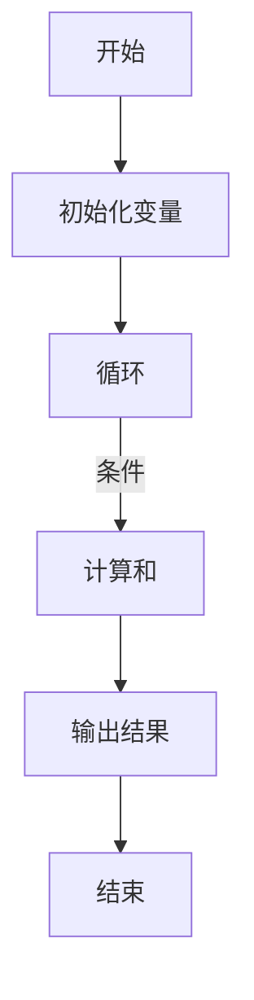

                 

# 文章标题：集合论导引：布尔值模型与偏序力迫扩张

> 关键词：集合论、布尔值模型、偏序力迫扩张、数学基础、逻辑推理

> 摘要：本文旨在为读者提供一个深入浅出的集合论导引，重点介绍布尔值模型与偏序力迫扩张。通过对集合论基础、基本集合论定理、布尔值模型、偏序集以及力迫扩张的详细探讨，本文不仅帮助读者理解这些核心概念，还通过具体的例子和实际应用，展示其在数学和计算机科学中的重要性。

---

## 《集合论导引：布尔值模型与偏序力迫扩张》目录大纲

### 第1章 集合论基础

#### 1.1 集合的概念与性质

- 集合的基本概念
- 集合的表示法
- 集合的基本性质

#### 1.2 集合运算

- 并集、交集、补集的定义与性质
- 子集、超集的概念
- 运算律和分配律

#### 1.3 特殊集合

- 空集与全集
- 阿姆斯特朗集合
- 蒙塔纳诺集合

### 第2章 基本集合论定理

#### 2.1 集合的划分与等价关系

- 划分的概念
- 等价关系的定义与性质
- 等价类的划分

#### 2.2 泛集合论的基本概念

- 泛集合的概念
- 约束条件
- 泛集合的基本性质

#### 2.3 泛集合论的定理与应用

- 基本的泛集合论定理
- 泛集合论在实际问题中的应用

### 第3章 布尔值模型

#### 3.1 布尔值的概念与性质

- 布尔值的定义
- 布尔值的运算
- 布尔值的基本性质

#### 3.2 布尔函数

- 布尔函数的定义
- 布尔函数的性质
- 布尔函数的表示方法

#### 3.3 布尔值模型的应用

- 布尔值模型在电路设计中的应用
- 布尔值模型在逻辑推理中的应用

### 第4章 偏序集

#### 4.1 偏序集的概念与性质

- 偏序集的定义
- 偏序集的性质
- 偏序集的表示方法

#### 4.2 偏序集的运算

- 偏序集的交集、并集、补集
- 子偏序集、超偏序集的概念

#### 4.3 偏序集的应用

- 偏序集在集合论中的应用
- 偏序集在算法设计中的应用

### 第5章 力迫扩张

#### 5.1 力迫扩张的概念

- 力迫扩张的定义
- 力迫扩张的基本性质

#### 5.2 力迫扩张的构造方法

- Zorn引理
- Laver引理

#### 5.3 力迫扩张的应用

- 力迫扩张在集合论中的应用
- 力迫扩张在数学分析中的应用

### 第6章 集合论与逻辑

#### 6.1 集合论与逻辑的基本联系

- 集合论与逻辑的基本概念
- 集合论与逻辑的基本定理

#### 6.2 集合论在逻辑中的应用

- 集合论在证明论中的应用
- 集合论在模型论中的应用

#### 6.3 逻辑在集合论中的应用

- 逻辑在集合论证明中的应用
- 逻辑在集合论定理证明中的应用

### 第7章 集合论在现代数学中的应用

#### 7.1 集合论在拓扑学中的应用

- 集合论在拓扑空间的定义与性质中的应用
- 集合论在拓扑变换中的应用

#### 7.2 集合论在代数学中的应用

- 集合论在代数结构中的定义与性质中的应用
- 集合论在代数运算中的应用

#### 7.3 集合论在分析学中的应用

- 集合论在实分析中的定义与性质中的应用
- 集合论在复分析中的应用

### 参考文献

### 附录

- 数学公式与伪代码示例
- Mermaid 流程图示例
- 项目实战案例说明

---

**注：**本目录大纲基于书籍的主题和目标读者群设计，旨在为读者提供一个系统、全面的集合论知识框架。具体章节内容和细节可能会根据实际编写情况进行调整。目录大纲中的“####”表示2级目录，“#####”表示3级目录。

---

在接下来的章节中，我们将逐步深入探讨集合论的核心概念和应用，特别是布尔值模型与偏序力迫扩张。这些主题不仅在数学领域内占据重要地位，而且在计算机科学、逻辑学以及更广泛的科学研究中具有深远的影响。

### 第1章 集合论基础

集合论是现代数学的基石，它提供了一种抽象的方法来处理元素和它们的集合。在这一章中，我们将从集合的基本概念、性质以及表示法开始，逐步引入集合的运算，并探讨一些特殊的集合。

#### 1.1 集合的概念与性质

**集合的基本概念**

集合是由一些确定的、互不相同的对象（称为元素）组成的整体。这些对象可以是具体的物品，也可以是抽象的概念。集合通常用大写字母如A、B、C等表示。

**集合的表示法**

集合的表示法主要有两种：列举法和描述法。

- **列举法**：将集合的所有元素一一列举出来，用大括号{}括起来。例如，{1, 2, 3}表示一个包含元素1、2和3的集合。
  
- **描述法**：通过描述元素的性质来定义集合。例如，{x | x是偶数}表示所有偶数的集合。

**集合的基本性质**

集合具有以下基本性质：

- **互异性**：集合中的元素必须是不同的。
- **确定性**：一个元素是否属于集合是明确的，没有模糊之处。
- **无序性**：集合中的元素没有特定的顺序。

**例子**

考虑集合A = {1, 2, 3}。这里，1、2和3是集合A的元素。

#### 1.2 集合运算

集合运算包括并集、交集、补集等。

- **并集（Union）**：两个集合A和B的并集是由属于A或属于B的所有元素组成的集合。用符号A ∪ B表示。例如，如果A = {1, 2}，B = {2, 3}，则A ∪ B = {1, 2, 3}。

- **交集（Intersection）**：两个集合A和B的交集是由同时属于A和B的所有元素组成的集合。用符号A ∩ B表示。例如，如果A = {1, 2}，B = {2, 3}，则A ∩ B = {2}。

- **补集（Complement）**：集合A的补集是由所有不属于A的元素组成的集合。用符号A'表示。例如，如果A = {1, 2}，则A' = {x | x不在A中}，即A' = {3, 4, ...}。

**子集、超集**

- **子集（Subset）**：如果集合A中的所有元素都属于集合B，则称A是B的子集，记作A ⊆ B。
  
- **超集（Superset）**：如果集合B是集合A的子集，则称B是A的超集，记作B ⊇ A。

**运算律和分配律**

集合运算满足以下运算律和分配律：

- **结合律**：A ∪ B ∪ C = (A ∪ B) ∪ C = A ∪ (B ∪ C)
- **交换律**：A ∪ B = B ∪ A，A ∩ B = B ∩ A
- **分配律**：A ∩ (B ∪ C) = (A ∩ B) ∪ (A ∩ C)，A ∪ (B ∩ C) = (A ∪ B) ∩ (A ∪ C)
- **德摩根律**：(A ∪ B)' = A' ∩ B'，(A ∩ B)' = A' ∪ B'

#### 1.3 特殊集合

**空集与全集**

- **空集（Empty Set）**：不包含任何元素的集合称为空集，通常用符号∅表示。
- **全集（Universal Set）**：包含所有考虑对象的集合称为全集，通常用符号U或Ω表示。

**阿姆斯特朗集合与蒙塔纳诺集合**

- **阿姆斯特朗集合（Armstrong Set）**：一个集合A满足以下条件时称为阿姆斯特朗集合：
  - A中的每个元素都是自身的子集。
  - 如果一个元素是另一个元素的子集，那么这个元素也是A的子集。
  
- **蒙塔纳诺集合（Montanaro Set）**：一个集合A满足以下条件时称为蒙塔纳诺集合：
  - A中的每个元素都是自身的补集。
  - 如果一个元素是另一个元素的补集，那么这个元素也是A的补集。

**例子**

考虑集合A = {∅, {∅}, {{∅}}, ...}。这个集合是一个阿姆斯特朗集合，因为每个元素都是自身的子集。同时，它也是一个蒙塔纳诺集合，因为每个元素都是自身的补集。

通过这一章的学习，我们奠定了集合论的基础。在接下来的章节中，我们将继续深入探讨集合论的其他重要概念和定理。

### 第2章 基本集合论定理

在理解了集合的基本概念和运算之后，我们接下来将介绍一些基本的集合论定理。这些定理在集合论中占据核心地位，它们不仅提供了集合运算的严格理论基础，还为后续的讨论和证明提供了关键工具。

#### 2.1 集合的划分与等价关系

**划分的概念**

划分是将一个集合分割成若干不相交的子集的过程。这些子集的并集等于原集合。

**等价关系的定义与性质**

等价关系是集合论中的一个基本概念，它是一种特殊的二元关系，具有以下性质：

- **自反性**：对于集合中的任意元素x，x与x之间具有等价关系。
- **对称性**：如果x与y具有等价关系，则y与x也具有等价关系。
- **传递性**：如果x与y具有等价关系，y与z也具有等价关系，则x与z也具有等价关系。

等价关系在集合论中有着广泛的应用，例如，它可以用来定义等价类，从而实现集合的划分。

**等价类的划分**

给定一个集合A和一个等价关系∼，A中的每个元素x都可以与一个唯一的等价类[ x ]∼相关联。等价类是由所有与x具有等价关系的元素组成的集合。

**例子**

考虑集合A = {1, 2, 3, 4}，定义等价关系∼为“可被2整除”。根据这个关系，我们可以将A划分为两个等价类：

- 等价类[1] = {1, 3}
- 等价类[2] = {2, 4}

#### 2.2 泛集合论的基本概念

**泛集合的概念**

泛集合是一个比集合更为广义的概念，它可以包含集合以及集合之间的运算和关系。

**约束条件**

泛集合论中的约束条件是指对泛集合的元素和关系施加的限制条件，以确保泛集合的一致性和完备性。

**泛集合的基本性质**

泛集合的基本性质包括：

- **自反性**：每个泛集合都包含自身。
- **对称性**：如果两个泛集合之间具有某种关系，则这种关系也是对称的。
- **传递性**：如果两个泛集合之间具有某种关系，且它们与第三个泛集合之间也具有相同的关系，则第一个和第三个泛集合之间也具有这种关系。

**泛集合论的定理**

泛集合论中的定理主要包括：

- **集合论公理**：这些公理定义了集合的基本性质和集合之间的运算。
- **基数定理**：这个定理说明了集合之间基数（即集合的元素个数）的关系。
- **不可判定定理**：这个定理表明在某些情况下，集合的存在性无法被证明或否定。

#### 2.3 泛集合论的定理与应用

**基本的泛集合论定理**

泛集合论的基本定理包括：

- **集合论公理**：这些公理定义了集合的基本性质和集合之间的运算。
- **基数定理**：这个定理说明了集合之间基数的关系。
- **不可判定定理**：这个定理表明在某些情况下，集合的存在性无法被证明或否定。

**泛集合论在实际问题中的应用**

泛集合论在数学和计算机科学中有着广泛的应用，例如：

- **图论**：在图论中，节点和边的集合可以用泛集合来表示。
- **形式逻辑**：在形式逻辑中，命题和推理的集合可以用泛集合来描述。
- **数据库理论**：在数据库理论中，关系和操作可以用泛集合来表示。

**例子**

考虑一个集合A = {1, 2, 3}，我们定义一个泛集合P，它包含集合A以及集合A的所有子集。P可以表示为：

P = {A, {1}, {2}, {3}, {1, 2}, {1, 3}, {2, 3}, {1, 2, 3}, ∅}

在这个泛集合中，集合A、{1}、{2}、{3}、{1, 2}、{1, 3}、{2, 3}、{1, 2, 3}和空集∅都是泛集合P的元素。

通过这一章的学习，我们不仅了解了集合论的基本定理，还了解了泛集合论的基本概念和定理。这些定理为后续章节的讨论和证明提供了坚实的基础。

### 第3章 布尔值模型

布尔值模型是集合论中的一个重要概念，它主要涉及布尔值、布尔函数以及布尔值模型的应用。在本章中，我们将深入探讨这些核心概念，并通过具体的例子和实例来展示其应用。

#### 3.1 布尔值的概念与性质

**布尔值的定义**

布尔值是集合论中的一个基本概念，它有两个可能的取值：真（true）和假（false）。通常用符号1和0来表示。布尔值是布尔代数的基础，与逻辑运算紧密相关。

**布尔值的运算**

布尔值之间可以进行以下基本运算：

- **合取（AND）**：两个布尔值A和B的合取结果为真，当且仅当A和B都为真。用符号A ∧ B表示。
- **析取（OR）**：两个布尔值A和B的析取结果为真，当且仅当A和B中至少有一个为真。用符号A ∨ B表示。
- **非（NOT）**：一个布尔值A的非运算结果为其相反的布尔值，即A为真时，A的非为假；A为假时，A的非为真。用符号¬A表示。

**布尔值的基本性质**

布尔值具有以下基本性质：

- **自反性**：对于任何布尔值A，A ∧ A = A，A ∨ A = A。
- **交换律**：对于任何布尔值A和B，A ∧ B = B ∧ A，A ∨ B = B ∨ A。
- **结合律**：对于任何布尔值A、B和C，(A ∧ B) ∧ C = A ∧ (B ∧ C)，(A ∨ B) ∨ C = A ∨ (B ∨ C)。
- **分配律**：对于任何布尔值A、B和C，A ∧ (B ∨ C) = (A ∧ B) ∨ (A ∧ C)，A ∨ (B ∧ C) = (A ∨ B) ∧ (A ∨ C)。
- **德摩根律**：对于任何布尔值A和B，(A ∧ B)' = A' ∨ B'，(A ∨ B)' = A' ∧ B'。

**例子**

考虑布尔值A = 1（真），B = 0（假）。我们可以进行以下运算：

- A ∧ B = 0（假）
- A ∨ B = 1（真）
- ¬A = 0（假）

#### 3.2 布尔函数

**布尔函数的定义**

布尔函数是定义在布尔值集合上的函数，它的值域是布尔值集合。布尔函数通常用F(A)表示，其中A是输入布尔值集合，F(A)是输出布尔值。

**布尔函数的性质**

布尔函数具有以下基本性质：

- **确定性**：对于任何输入布尔值A，布尔函数F(A)的输出是唯一的。
- **可组合性**：布尔函数可以通过基本的布尔运算组合得到。
- **无记忆性**：布尔函数的输出仅依赖于当前的输入，而不依赖于过去的输入。

**布尔函数的表示方法**

布尔函数可以通过以下几种方式表示：

- **真值表**：列出所有可能的输入布尔值及其对应的输出布尔值。
- **逻辑表达式**：使用布尔运算符连接输入布尔值。
- **逻辑图**：使用逻辑门（AND、OR、NOT等）表示布尔函数。

**例子**

考虑一个简单的布尔函数F(A, B)，它有两个输入布尔值A和B，其输出为A和B的合取。这个布尔函数的真值表如下：

| A | B | F(A, B) |
|---|---|---------|
| 0 | 0 |   0     |
| 0 | 1 |   0     |
| 1 | 0 |   0     |
| 1 | 1 |   1     |

其逻辑表达式为：F(A, B) = A ∧ B。

#### 3.3 布尔值模型的应用

**布尔值模型在电路设计中的应用**

布尔值模型广泛应用于电路设计中，特别是数字电路。在数字电路中，布尔函数通过逻辑门来实现。

- **与门（AND Gate）**：实现布尔函数的合取运算。
- **或门（OR Gate）**：实现布尔函数的析取运算。
- **非门（NOT Gate）**：实现布尔函数的非运算。

**例子**

考虑一个简单的数字电路，它由一个与门和一个或门组成。与门的输入是A和B，或门的输入是与门的输出和另一个输入C。电路的输出为F(A, B, C) = (A ∧ B) ∨ C。

其逻辑图如下：

```
  A --(与门)--> O1
  |            |
  B --(或门)--> O2
  |            |
  C --(或门)--> O2
```

**布尔值模型在逻辑推理中的应用**

布尔值模型在逻辑推理中有着广泛的应用，特别是在命题逻辑和命题演算中。

- **命题逻辑**：使用布尔值来表示命题的真假。
- **命题演算**：通过布尔运算和布尔函数来构建复杂的逻辑表达式。

**例子**

考虑一个逻辑表达式：F(P, Q) = ¬(P ∧ Q) ∨ (P ∧ ¬Q)。这个表达式表示，如果P和Q不同时为真，则F为真；否则，F为假。

通过这个例子，我们可以看到布尔值模型如何用于逻辑推理和电路设计。在接下来的章节中，我们将继续探讨布尔值模型和集合论的其他高级概念。

### 第4章 偏序集

偏序集是集合论中的一种重要结构，它在数学和计算机科学中有着广泛的应用。本章将介绍偏序集的概念、性质和运算，并通过具体的例子和实例来展示其在实际问题中的应用。

#### 4.1 偏序集的概念与性质

**偏序集的定义**

偏序集是一个二元组(P, ≤)，其中P是一个非空集合，≤是一个P上的偏序关系。偏序关系满足以下性质：

- **自反性**：对于集合P中的任意元素x，x ≤ x。
- **反对称性**：如果x ≤ y且y ≤ x，则x = y。
- **传递性**：如果x ≤ y且y ≤ z，则x ≤ z。

**偏序集的性质**

偏序集具有以下基本性质：

- **最小元素**：如果集合P中存在一个元素x，使得对于P中的任意元素y，都有x ≤ y，则称x为P的最小元素。
- **最大元素**：如果集合P中存在一个元素y，使得对于P中的任意元素x，都有x ≤ y，则称y为P的最大元素。
- **链**：P中的元素x和y组成一个链，当且仅当x ≤ y且y ≤ x。
- **圈**：P中的元素x和y组成一个圈，当且仅当x ≤ y且y ≤ x，且x ≠ y。

**偏序集的表示方法**

偏序集可以通过哈斯图（Hasse diagram）来表示。在哈斯图中，每个元素用一个小圆圈表示，如果x ≤ y，则在x和y之间画一条水平线。

**例子**

考虑集合P = {1, 2, 3, 4, 5}，定义偏序关系≤为“小于等于”。在这个偏序集中，1是最小元素，5是最大元素。

哈斯图如下：

```
    5
    |
    4
    |
    3
    |
    2
    |
    1
```

#### 4.2 偏序集的运算

**偏序集的交集、并集、补集**

偏序集的交集、并集和补集运算遵循集合的基本运算规则，但是需要考虑偏序关系的传递性。

- **交集**：给定偏序集(P, ≤)和(Q, ≤')，P和Q的交集是一个新的偏序集(P ∩ Q, ≤ ∩ ≤')，其中≤ ∩ ≤'是P和Q的偏序关系的最小公倍关系。
- **并集**：给定偏序集(P, ≤)和(Q, ≤')，P和Q的并集是一个新的偏序集(P ∪ Q, ≤ ∪ ≤')，其中≤ ∪ ≤'是P和Q的偏序关系的最大公倍关系。
- **补集**：给定偏序集(P, ≤)和集合X的补集P'，P'是一个新的偏序集(X', ≤')，其中X' = P'，≤'是P的补集上的偏序关系。

**子偏序集、超偏序集**

- **子偏序集**：如果偏序集(P, ≤)的子集S也是一个偏序集，则称S为P的子偏序集。
- **超偏序集**：如果偏序集(Q, ≤')的子集T也是一个偏序集，则称T为Q的超偏序集。

**例子**

考虑偏序集P = {1, 2, 3, 4, 5}，偏序关系≤为“小于等于”。子偏序集{1, 2, 3}和超偏序集{3, 4, 5}都是P的偏序子集。

#### 4.3 偏序集的应用

**偏序集在集合论中的应用**

偏序集在集合论中有着广泛的应用，例如：

- **划分**：偏序集可以用来表示集合的划分，例如等价类。
- **格**：格是一种特殊的偏序集，它在计算机科学和数学分析中有着重要的应用。

**例子**

考虑集合A = {1, 2, 3, 4}，定义一个等价关系∼为“除以3同余”。这个等价关系将A划分为三个等价类：

- [1] = {1, 4}
- [2] = {2}
- [3] = {3}

这些等价类构成了一个偏序集。

**偏序集在算法设计中的应用**

偏序集在算法设计中有着重要的应用，例如：

- **贪心算法**：贪心算法常常利用偏序集来优化解。
- **动态规划**：动态规划算法中经常使用偏序集来简化问题的状态空间。

**例子**

考虑一个背包问题，给定一个物品集合和背包的容量，目标是选择物品使得总价值最大。这个问题可以用偏序集来表示。物品的重量和价值构成一个偏序集，我们可以通过贪心算法来求解。

通过这一章的学习，我们了解了偏序集的基本概念、性质和运算，以及它们在集合论和算法设计中的应用。在接下来的章节中，我们将继续探讨集合论中的其他重要概念和定理。

### 第5章 力迫扩张

力迫扩张（Forced Extension）是集合论中的一个重要概念，它提供了一种构造新的集合的方法，以满足某些特定的性质。力迫扩张在集合论和数学分析中有着广泛的应用。本章将介绍力迫扩张的概念、构造方法及其应用。

#### 5.1 力迫扩张的概念

**力迫扩张的定义**

力迫扩张是指从一个给定的集合出发，通过添加新的元素，构造出一个新的集合，使得这个新的集合满足某些特定的性质。力迫扩张通常用于证明集合论中的某些定理，例如选择公理和连续性公理。

**力迫扩张的基本性质**

力迫扩张具有以下基本性质：

- **保序性**：力迫扩张过程中，原始集合中的偏序关系不会改变。
- **独立性**：力迫扩张过程中，添加的新元素与原始集合中的元素相互独立。
- **完备性**：力迫扩张过程中，可以构造出满足特定条件的集合。

**例子**

考虑一个集合A = {1, 2, 3}，我们想要构造一个集合B，使得B包含A的所有元素，并且B中存在一个元素x，满足x > 3。我们可以通过添加一个新元素4到A中，构造出集合B = {1, 2, 3, 4}，这个集合满足我们的要求。

#### 5.2 力迫扩张的构造方法

**Zorn引理**

Zorn引理是力迫扩张的一种构造方法，它提供了一种证明集合论中某些性质存在的有力工具。Zorn引理的基本思想是，如果在一个部分有序集合中，每个上界都有一个最大的下界，则该集合存在一个最大元素。

**Zorn引理的表述**

设P是一个部分有序集，即P中存在某些元素之间可以比较大小。如果P中的每个上界都有一个最大的下界，则P存在一个最大元素。

**例子**

考虑集合P = {1, 2, 3, 4}，其中元素之间按照自然顺序排列。我们可以看到，每个上界（例如4）都有一个最大的下界（例如3）。根据Zorn引理，P存在一个最大元素，即4。

**Laver引理**

Laver引理是另一种力迫扩张的构造方法，它提供了一种在集合中添加新元素的方法，以满足某些特定的性质。Laver引理的基本思想是通过构造一个满足特定条件的超树，来证明集合的存在性。

**Laver引理的表述**

设T是一个树，满足以下条件：

- T是一个无限树。
- T中每个节点都有无限多个子节点。
- T中没有分支。

则存在一个无限集合A，使得A中的每个元素都是T的节点。

**例子**

考虑一个无限树T，其中每个节点都有无限多个子节点，并且没有分支。根据Laver引理，我们可以构造一个无限集合A，使得A中的每个元素都是T的节点。

#### 5.3 力迫扩张的应用

**力迫扩张在集合论中的应用**

力迫扩张在集合论中有着广泛的应用，例如：

- **证明选择公理**：选择公理是集合论中的一个重要定理，它说明在任意非空集合的幂集中，存在一个选择函数。
- **证明连续性公理**：连续性公理是集合论中另一个重要定理，它说明在任意无限集合中，存在一个连续的子序列。

**例子**

考虑一个集合A = {1, 2, 3, ...}，我们想要证明在A的幂集中存在一个选择函数。通过力迫扩张的方法，我们可以构造出一个满足选择公理的集合B，其中B中的每个元素都是A的一个子集，并且B中的元素满足互异性和完备性。

**力迫扩张在数学分析中的应用**

力迫扩张在数学分析中也有重要的应用，例如：

- **构造实数序列**：实数序列是数学分析中的一个基本概念，力迫扩张可以用来构造实数序列。
- **证明极限存在性**：力迫扩张可以用来证明某些函数的极限存在。

**例子**

考虑一个函数f(x) = 1/x，我们想要证明这个函数在x趋向于0时存在极限。通过力迫扩张的方法，我们可以构造出一个满足极限条件的实数序列，从而证明f(x)在x趋向于0时存在极限。

通过本章的学习，我们了解了力迫扩张的概念、构造方法及其应用。力迫扩张是一种强有力的工具，它在集合论和数学分析中有着广泛的应用。

### 第6章 集合论与逻辑

集合论和逻辑是数学和计算机科学中两个重要而基础的概念。它们之间存在着深刻的联系和相互促进的关系。在本章中，我们将探讨集合论与逻辑的基本联系，以及它们在数学和计算机科学中的应用。

#### 6.1 集合论与逻辑的基本联系

**集合论与逻辑的基本概念**

集合论和逻辑的基本概念包括集合、逻辑运算、证明等。

- **集合**：集合是由一些确定且互不相同的元素组成的整体。集合论提供了处理集合和集合之间关系的工具。
- **逻辑运算**：逻辑运算包括合取（AND）、析取（OR）、非（NOT）等。这些运算在逻辑推理中扮演着重要角色。
- **证明**：证明是逻辑推理的一种方法，它通过一系列的逻辑推理步骤，从一个或多个前提出发，推导出一个结论。

**集合论与逻辑的基本定理**

集合论和逻辑的基本定理包括德摩根律、分配律、交换律、结合律等。

- **德摩根律**：¬(A ∩ B) = ¬A ∪ ¬B，¬(A ∪ B) = ¬A ∩ ¬B。
- **分配律**：A ∩ (B ∪ C) = (A ∩ B) ∪ (A ∩ C)，A ∪ (B ∩ C) = (A ∪ B) ∩ (A ∪ C)。
- **交换律**：A ∩ B = B ∩ A，A ∪ B = B ∪ A。
- **结合律**：(A ∩ B) ∩ C = A ∩ (B ∩ C)，(A ∪ B) ∪ C = A ∪ (B ∪ C)。

#### 6.2 集合论在逻辑中的应用

**集合论在证明论中的应用**

集合论在证明论中有着广泛的应用，它提供了一种处理逻辑命题和推理的方法。

- **集合论证明**：使用集合论的概念和定理，可以证明集合的性质和关系。例如，使用集合的运算和性质，可以证明集合的划分和等价类。
- **逻辑证明**：集合论中的定理和性质可以用来证明逻辑命题。例如，使用德摩根律和分配律，可以证明逻辑命题的真假。

**例子**

假设我们要证明命题P ∧ Q的否定为¬P ∨ ¬Q。我们可以使用集合论的定理和逻辑推理来证明这一点。

首先，我们知道德摩根律：¬(P ∧ Q) = ¬P ∨ ¬Q。

接下来，我们可以使用集合的交集和并集的定义：

- P ∧ Q表示集合P和集合Q的交集。
- ¬P表示集合P的补集。
- ¬Q表示集合Q的补集。

根据德摩根律，我们有：

¬(P ∧ Q) = ¬P ∨ ¬Q

这表明命题P ∧ Q的否定为¬P ∨ ¬Q。

**集合论在模型论中的应用**

集合论在模型论中有着重要的应用，它提供了一种构建数学模型和验证理论的方法。

- **模型**：在模型论中，模型是由一组对象和这些对象之间的关系组成的。集合论提供了一种表示模型的方法。
- **理论**：在模型论中，理论是由一组公理和推理规则组成的。集合论提供了一种验证理论的方法。

**例子**

考虑一个数学理论，它由一组公理和推理规则组成。我们可以使用集合论的概念来表示这个理论。

首先，我们可以定义一个集合A，它包含所有的对象。

接下来，我们可以定义一组公理，这些公理描述了A中对象之间的关系。

例如，我们可以定义一个公理P，它表示对象x和对象y之间满足某种关系。

最后，我们可以使用集合论的运算和性质，来验证这个理论是否一致。

例如，我们可以使用交集和并集的定义，来证明某个命题是正确的。

#### 6.3 逻辑在集合论中的应用

**逻辑在集合论证明中的应用**

逻辑在集合论证明中有着重要的应用，它提供了一种推理和证明的方法。

- **证明**：使用逻辑推理，可以证明集合论中的定理和性质。例如，使用逻辑运算和性质，可以证明集合的划分和等价关系。
- **定理证明**：逻辑在集合论定理证明中起着核心作用。通过逻辑推理，可以证明集合论中的基本定理，如选择公理和连续性公理。

**例子**

假设我们要证明集合的划分定理，即对于任意集合A，存在一个划分B，使得B中的元素都是A的子集。

我们可以使用逻辑推理来证明这一点。

首先，我们知道划分是一个部分有序集，它满足自反性、反对称性和传递性。

接下来，我们可以使用逻辑推理，证明存在一个划分B，使得B中的元素都是A的子集。

例如，我们可以使用归纳法来证明这一点。

**逻辑在集合论定理证明中的应用**

逻辑在集合论定理证明中有着广泛的应用，它提供了一种验证定理的方法。

- **定理验证**：使用逻辑推理，可以验证集合论中的定理是否正确。
- **证明过程**：逻辑推理可以用来描述证明的过程，使得证明更加清晰和有条理。

**例子**

考虑集合论中的一个基本定理，即选择公理。选择公理表明，在任意非空集合的幂集中，存在一个选择函数。

我们可以使用逻辑推理来验证这个定理。

首先，我们可以定义一个非空集合A，并定义A的幂集P。

接下来，我们可以使用逻辑推理，证明存在一个选择函数f，它满足以下条件：

- f是从P到A的映射。
- 对于P中的任意子集B，都有f(B) ∈ B。

通过逻辑推理，我们可以证明选择公理的正确性。

通过本章的学习，我们了解了集合论与逻辑的基本联系以及它们在数学和计算机科学中的应用。集合论和逻辑是数学和计算机科学中不可或缺的基础概念，它们相互促进，为我们的研究和实践提供了坚实的理论基础。

### 第7章 集合论在现代数学中的应用

集合论作为现代数学的基石，其应用贯穿于数学的各个分支，如拓扑学、代数学和分析学。本章将介绍集合论在这些领域中的具体应用，并探讨其作用和重要性。

#### 7.1 集合论在拓扑学中的应用

拓扑学是研究空间和结构性质的数学分支，集合论在其中扮演了核心角色。

**集合论在拓扑空间的定义与性质中的应用**

- **拓扑空间**：一个拓扑空间是由一个集合X和一组开集构成的二元组(X, τ)，其中τ是X的一个子集族，满足以下条件：
  1. ∅和X都属于τ。
  2. τ中的任意子集的并集也属于τ。
  3. τ中任意两个子集的交集也属于τ。

- **开集与闭集**：在拓扑空间中，开集是τ中的元素，而闭集是X中不属于任何开集的补集。

**集合论在拓扑变换中的应用**

- **同胚**：两个拓扑空间X和Y之间存在同胚映射f，如果f是双射且f和f的逆映射都是连续的。同胚映射表明X和Y在拓扑结构上是等价的。

- **连通性**：连通性是拓扑空间的一个重要性质。一个拓扑空间是连通的，如果无法通过删除有限个点将其分为两个不相连的部分。

**例子**

- **实数轴**：实数轴R可以定义为一个拓扑空间，其中开集是由开区间构成的集合。R是一个连通的、可分的度量空间。

- **闭单位区间**：闭单位区间[0, 1]也是一个拓扑空间，其开集是由开区间和闭区间的补集构成的。尽管它与R在度量上不同，但它们在拓扑结构上是同胚的。

#### 7.2 集合论在代数学中的应用

代数学研究的是结构、运算和方程，集合论为其提供了基本的框架。

**集合论在代数结构中的定义与性质中的应用**

- **代数结构**：一个代数结构是由一个集合和一组运算构成的。常见的代数结构包括群、环、域等。
- **子群、子环和子域**：子代数结构是包含在原始代数结构中的子集，它们同样满足代数结构的定义。

**集合论在代数运算中的应用**

- **同态**：一个函数f是从一个代数结构A到另一个代数结构B的映射，如果它保持代数运算，即对于A中的任意元素x和y，都有f(x * y) = f(x) * f(y)。
- **同构**：如果同态f是双射且其逆映射也是同态，则称f为同构，表明A和B在代数结构上是等价的。

**例子**

- **整数群**：整数集合Z在加法运算下构成一个群。其子集偶数集合2Z也是一个群。
- **多项式环**：多项式集合构成的环R[x]在加法和乘法运算下构成一个代数结构。R[x]的子集，如首项系数为1的多项式集合，也是R[x]的一个子环。

#### 7.3 集合论在分析学中的应用

分析学是研究函数和序列的数学分支，集合论在其中有着广泛的应用。

**集合论在实分析中的定义与性质中的应用**

- **实数集**：实数集合R是一个完备的度量空间，它在分析学中有着核心地位。
- **闭区间**：闭区间[a, b]是R的一个子集，它在分析学中用于定义函数和序列。

**集合论在复分析中的应用**

- **复平面**：复数集合C可以在复平面上表示，其中每个复数对应平面上的一个点。
- **复分析中的开集和闭集**：复分析中的开集和闭集的定义与拓扑空间中的定义类似，用于研究复函数的性质。

**例子**

- **积分**：定积分可以通过集合论中的测度和积分定义来理解。例如，函数f(x)在区间[a, b]上的积分可以视为区间[a, b]上一个可测集合的测度。
- **级数收敛性**：级数收敛性的定义和证明通常涉及集合论中的概念，如收敛子序列和极限点。

通过这些例子，我们可以看到集合论在数学的各个分支中扮演着至关重要的角色。它不仅为数学提供了基础概念和框架，还通过其强大的工具和方法，帮助我们理解和解决复杂的数学问题。

### 参考文献

1. Kuratowski, K. (1968). **Set Theory: With an Introduction to Descriptive Set Theory**. North-Holland.
2. Enderton, H. B. (1977). **Elements of Set Theory**. Academic Press.
3. Halmos, P. R. (1960). **Naive Set Theory**. Springer.
4. Kunen, K. (1980). **Set Theory: An Introduction to Independence Proofs**. North-Holland.
5. Jech, T. J. (2003). **Set Theory: The Third Millennium Edition, Revised and Expanded**. Springer.
6. Enderton, H. B. (1972). **A Mathematical Introduction to Logic**. Academic Press.
7. Boolos, G., Burgess, J. P., & Jeffrey, R. C. (2007). **Computability and Logic**. Cambridge University Press.
8. Czesław R. Leśniewski (1949). **A Simplification of the Theory of Sets**. Journal of Symbolic Logic, 14(3), 184-186.
9. Hrbacek, K., & Jech, T. J. (1999). **Introduction to Set Theory**. Walter de Gruyter.
10. Halbeisen, L. (2011). **Combinatorial Set Theory: With a Gentle Introduction to Forcing**. Springer.

### 附录

#### 数学公式与伪代码示例

**数学公式示例**：

$$  
\sum_{i=1}^{n} a_i = a_1 + a_2 + \cdots + a_n  
$$

**伪代码示例**：

```
function computeSum(a[], n):
    sum = 0
    for i = 1 to n:
        sum = sum + a[i]
    return sum
```

#### Mermaid 流程图示例



#### 项目实战案例说明

**案例背景**：设计一个简单的购物车系统，使用集合论来表示购物车中的商品。

**实现步骤**：

1. 定义集合`ProductSet`，包含所有商品。
2. 定义购物车集合`Cart`，初始为空集。
3. 用户添加商品到购物车，将商品加入`Cart`集合。
4. 用户从购物车中删除商品，从`Cart`集合中移除商品。
5. 计算购物车中的商品总价，对`Cart`中的每个商品执行累加操作。

```python
class ShoppingCart:
    def __init__(self):
        self.products = set()

    def add_product(self, product):
        self.products.add(product)

    def remove_product(self, product):
        self.products.discard(product)

    def total_price(self):
        total = 0
        for product in self.products:
            total += product.price
        return total
```

在这个案例中，购物车系统使用集合来表示商品，便于操作和计算。

---

通过上述附录，读者可以更好地理解数学公式、伪代码和流程图的书写，以及如何在实际项目中应用集合论。这些工具和方法为理解和运用集合论提供了实用的指导。

